# Production case studies, by topic

The same landscape of shipped ML systems that the broad indexes catalog
(the [Evidently AI ML system design database](https://www.evidentlyai.com/ml-system-design)
is the widest, 800 case studies from 150+ companies), re-organized into this
repo's own use-case taxonomy.

Each category is not just a link list: it opens with a one-line shared-blueprint
note, a **Mermaid diagram of where the real designs diverge** (the branch points
and the method each named company chose), a **choices side-by-side table**, the
**math that separates the approaches**, and a **tradeoff quadrant plot**, all read
from the underlying engineering writeups. Then the systems themselves. For the full
per-case teardown of any one, see [CASE-TEARDOWNS.md](CASE-TEARDOWNS.md); browse the
same systems [by company](CASE-STUDIES-BY-COMPANY.md) or [by industry](CASE-STUDIES-BY-INDUSTRY.md).

212 systems across the taxonomy, and growing.

---
### [Candidate retrieval (two-tower)](topics/01-candidate-retrieval.md) · 13 systems

**What they share.** Every system is one two-tower skeleton: an offline item tower embeds the whole catalog into an ANN index, and only the user/query tower runs online, emitting one vector for a single nearest-neighbor lookup before ranking. The real budget goes to two choices: which negatives to train against, and how to keep the index fresh and fast.

**The reference pipeline.** Strip away the product differences and every writeup here walks the same nine stages, from mining pairs out of the log to unioning candidate sources before ranking. The two-tower training loop and the offline-embed / online-lookup split are fixed; the systems below differ only in what they plug into the shaded stages.

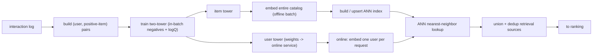
```mermaid
flowchart LR
  LOG["interaction log"] --> PAIR["build (user, positive-item) pairs"]
  PAIR --> TRAIN["train two-tower (in-batch negatives + logQ)"]
  TRAIN --> ITOW["item tower"]
  TRAIN --> UTOW["user tower (weights -> online service)"]
  ITOW --> EMBED["embed entire catalog (offline batch)"]
  EMBED --> BUILD["build / upsert ANN index"]
  UTOW --> ONLINE["online: embed one user per request"]
  BUILD --> LOOKUP["ANN nearest-neighbor lookup"]
  ONLINE --> LOOKUP
  LOOKUP --> UNION["union + dedup retrieval sources"]
  UNION --> RANK["to ranking"]
```

**Reading the diagram.** The pipeline starts at the interaction log, where you mine (user, positive-item) pairs, and the first real decision is which co-occurrences count as a positive: Airbnb treats a seen-not-booked listing inside a search journey as the informative signal rather than any random impression. Those pairs feed the two-tower training loop, whose central failure mode is popularity bias from in-batch negatives, which YouTube and Expedia correct with a logQ term subtracted from the logits so the head is not unfairly penalized. Training then forks into two towers: the item tower runs offline to embed the entire catalog as a batch job and upserts those vectors into an ANN index, while the user tower's weights ship to the online service to embed one user per request. The index-build stage is where most of the systems engineering lives, since choosing HNSW (Snap, Spotify Voyager), IVF centroids (Airbnb), or HNSW with 4-bit product quantization (Etsy) trades recall against memory and rebuild cost under each catalog's churn rate. At serving time the single online user vector meets the offline catalog index at the ANN nearest-neighbor lookup, the one place the two towers finally join, which is exactly why any early feature crossing is forbidden upstream. The freshness clock is the quiet leverage point: a new item stays invisible until it is re-embedded and the index is upserted, so Airbnb's daily batch versus Snap's few-hours refresh are product decisions about item churn, not implementation trivia. Finally the union-and-dedup stage blends the personalized tower with popularity and fresh-item sources before ranking, a reminder that retrieval is a recall-maximizing ensemble whose leverage sits in the negatives and the index, not in the tower architecture everyone already shares.

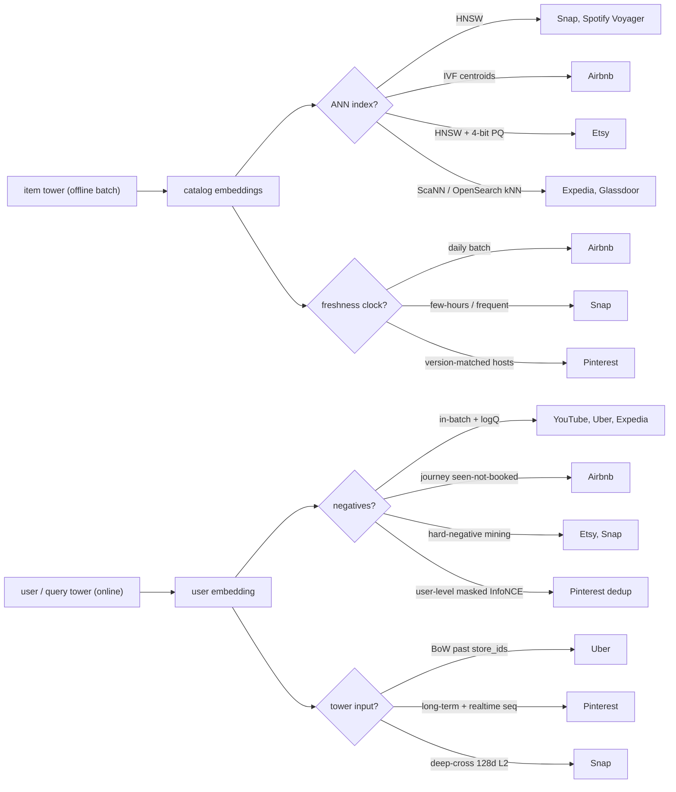
```mermaid
flowchart LR
  ITEM["item tower (offline batch)"] --> EMB["catalog embeddings"]
  EMB --> B2{"ANN index?"}
  USER["user / query tower (online)"] --> UE["user embedding"]
  UE --> B1{"negatives?"}
  UE --> B3{"tower input?"}
  EMB --> B4{"freshness clock?"}
  B1 -->|"in-batch + logQ"| N1["YouTube, Uber, Expedia"]
  B1 -->|"journey seen-not-booked"| N2["Airbnb"]
  B1 -->|"hard-negative mining"| N3["Etsy, Snap"]
  B1 -->|"user-level masked InfoNCE"| N4["Pinterest dedup"]
  B2 -->|"HNSW"| I1["Snap, Spotify Voyager"]
  B2 -->|"IVF centroids"| I2["Airbnb"]
  B2 -->|"HNSW + 4-bit PQ"| I3["Etsy"]
  B2 -->|"ScaNN / OpenSearch kNN"| I4["Expedia, Glassdoor"]
  B3 -->|"BoW past store_ids"| T1["Uber"]
  B3 -->|"long-term + realtime seq"| T2["Pinterest"]
  B3 -->|"deep-cross 128d L2"| T3["Snap"]
  B4 -->|"daily batch"| F1["Airbnb"]
  B4 -->|"few-hours / frequent"| F2["Snap"]
  B4 -->|"version-matched hosts"| F3["Pinterest"]
```

**The choices, side by side.**

| Decision | Options (who chooses each) | What decides it |
| --- | --- | --- |
| Negative sampling | `in-batch+logQ` (YouTube, Uber, Expedia) vs `journey seen-not-booked` (Airbnb) vs `hard-neg` (Etsy, Snap) vs `masked InfoNCE` (Pinterest) vs `random+mixed` (Glassdoor, Twitter) | Popularity bias vs boundary sharpness |
| ANN index | `HNSW` (Snap, Spotify) vs `IVF` (Airbnb) vs `HNSW+4-bit PQ` (Etsy) vs `ScaNN/OpenSearch` (Expedia, Glassdoor) | Update rate, filters, memory budget |
| Freshness / serving | `daily batch` (Airbnb) vs `few-hours split services` (Snap) vs `versioned hosts` (Pinterest) vs `stateless in-memory K8s` (Spotify) | Item churn vs deploy safety |
| Tower input | `BoW past store_ids` (Uber) vs `PinnerSage + realtime seq` (Pinterest) vs `deep-cross 128d L2` (Snap) vs `unified graph+text+term` (Etsy) | Cold-start, model size, intent recency |

**The math that separates them.**

**In-batch softmax loss**
$$L = -\frac{1}{B}\sum_{i=1}^{B} \log \frac{e^{ s(x_i,y_i)}}{\sum_{j=1}^{B} e^{ s(x_i,y_j)}}$$

**logQ-corrected logit (YouTube, Expedia)**
$$s^{c}(x_i,y_j) = u(x_i)^{\top} v(y_j) - \log Q(y_j)$$

**Temperature-scaled cosine InfoNCE (Snap)**
$$\cos(u,v) = \frac{u^{\top} v}{\lVert u\rVert \lVert v\rVert}, \qquad L = -\frac{1}{B}\sum_{i=1}^{B} \log \frac{e^{\cos(u_i,v_i)/\tau}}{\sum_{j=1}^{B} e^{\cos(u_i,v_j)/\tau}}$$

**User-level masked InfoNCE (Pinterest dedup)**
$$L_i = -\log \frac{e^{s(x_i,y_i)}}{e^{s(x_i,y_i)} + \sum_{j \in \mathcal{N}_i} e^{s(x_i,y_j)}}, \qquad \mathcal{N}_i = \lbrace j : u_j \neq u_i \rbrace$$

**Dot vs Euclidean, magnitude matters (Airbnb)**
$$u^{\top}v = \lVert u\rVert \lVert v\rVert\cos\theta, \qquad \lVert u-v\rVert^{2} = \lVert u\rVert^{2} + \lVert v\rVert^{2} - 2 u^{\top}v$$

**IVF scan cost, the recall/latency knob (Airbnb)**
$$C_{\text{scan}} \approx \text{nprobe} \cdot \frac{N}{n_{\text{cells}}}, \qquad \text{recall and latency both rise with nprobe}$$

**Index bytes, full vs 4-bit PQ (Etsy)**
$$\text{bytes}_{\text{full}} = N d\cdot 4, \qquad \text{bytes}_{\text{PQ}} = N m\cdot\tfrac{4}{8}$$

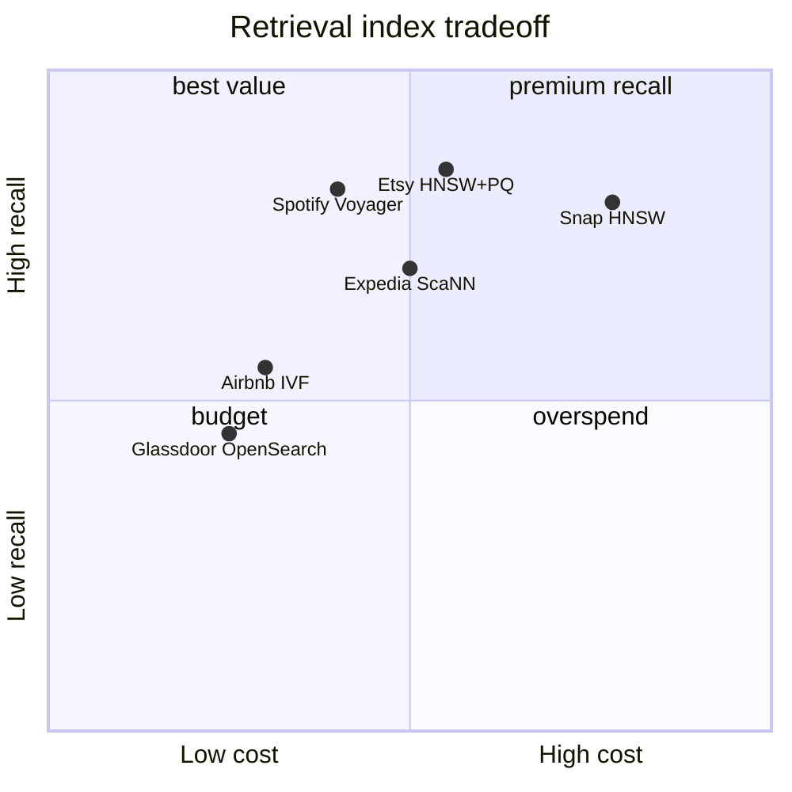
```mermaid
quadrantChart
  title Retrieval index tradeoff
  x-axis "Low cost" --> "High cost"
  y-axis "Low recall" --> "High recall"
  quadrant-1 "premium recall"
  quadrant-2 "best value"
  quadrant-3 "budget"
  quadrant-4 "overspend"
  "Airbnb IVF": [0.30, 0.55]
  "Glassdoor OpenSearch": [0.25, 0.45]
  "Spotify Voyager": [0.40, 0.82]
  "Etsy HNSW+PQ": [0.55, 0.85]
  "Expedia ScaNN": [0.50, 0.70]
  "Snap HNSW": [0.78, 0.80]
```

**When to use which.** Match the negative-sampling loss and the index to the catalog, not to a default:

| Reach for | When | Instead of |
|---|---|---|
| In-batch softmax with logQ correction (YouTube, Expedia) | Catalog is popularity-skewed and you want the embedding space itself unbiased | Raw in-batch negatives that penalize head items |
| Journey seen-not-booked positives (Airbnb) | The log has intent-rich sessions where a skip is a real signal | Random impressions treated as positives |
| Hard-negative mining (Etsy, Snap) | Easy negatives stopped teaching and boundary cases decide quality | Only in-batch negatives |
| User-level masked InfoNCE (Pinterest) | Request-sorted or user-concentrated batches push the false-negative rate toward 30% | Plain softmax that scores a user's own items as negatives |
| Temperature-scaled cosine InfoNCE (Snap) | Embedding magnitudes vary and you want angle-only similarity | Raw dot product where the norm leaks into the score |
| HNSW index (Snap, Spotify) | Catalog is stable, memory is available, and top recall per latency matters | IVF when you have no hard filters or heavy churn |
| IVF centroids (Airbnb) | Items churn on price and availability and geo filters must run cheap (recall and latency both rise with nprobe) | HNSW whose rebuild cost cannot absorb the updates |
| HNSW with 4-bit product quantization (Etsy) | The index must fit memory at large N (PQ bytes are a fraction of full-precision) | Full-precision vectors that blow the memory budget |
| Daily batch freshness (Airbnb) | Item churn is slow and deploy safety beats minutes-old vectors | Few-hours or streaming refresh (Snap) you do not need |

**Interview watch-outs.**

- **Do the towers share weights?** The reflex answer is "yes, to save parameters." Wrong: users and items have different feature distributions, so the towers stay separate; the only thing they share is the output embedding space, enforced by the dot-product loss. Uber sharing a UUID embedding layer is the deliberate exception, not the rule.
- **Where does the logQ correction go?** People say "rerank the ANN results by subtracting log popularity at serving." Wrong: logQ is subtracted from the logits during training so the embedding space itself is unbiased; serving stays a plain dot-product / cosine lookup with no correction term.
- **Why not add cross features for accuracy?** Candidates reach for "concatenate user and item early and push through an MLP." Wrong for retrieval: any early crossing makes the score depend on the user, which kills offline precompute and ANN. Early crossing is ranking's job (NCF, cross networks); retrieval must keep the join at a final dot product.
- **Is high offline recall enough to ship?** The trap is treating recall@k as the decision metric. Right answer: retrieval recall@k is a ceiling on everything downstream, so you measure it in isolation, but offline recall and online engagement do not always move together (Glassdoor saw 40-60% offline versus +5% online), so you gate on an A/B test too.
- **Bigger batch means more free negatives, so always scale it?** Wrong: request-sorted or user-concentrated batches push the in-batch false-negative rate from near 0% to about 30% (Pinterest), because a user's own engaged items show up as "negatives." The fix is user-level masking of same-user candidates, not simply more batch.
- **Is HNSW always the right index?** Candidates default to "HNSW, best recall/latency." Wrong when the catalog churns hard or needs filters: Airbnb chose IVF because HNSW's rebuild cost could not absorb price/availability updates and geo filters ran poorly over graph traversal; IVF turns a filter into cheap cluster selection. Match the index to update rate, filtering, and memory, not to a default.

**The systems**

- **Pinterest** [Establishing a Large Scale Learned Retrieval System](https://medium.com/pinterest-engineering/establishing-a-large-scale-learned-retrieval-system-at-pinterest-eb0eaf7b92c5): Offline-indexed item embeddings plus a request-time user tower; sampled softmax with popularity correction. *(deployment)*
- **YouTube/Google** [Sampling-Bias-Corrected Neural Modeling for Large Corpus Recommendations](https://research.google/pubs/sampling-bias-corrected-neural-modeling-for-large-corpus-item-recommendations/): In-batch negatives are biased under power-law; logQ correction restores unbiased softmax. *(product design)*
- **Uber** [Innovative Recommendation Applications Using Two Tower Embeddings](https://www.uber.com/blog/innovative-recommendation-applications-using-two-tower-embeddings/): Layer-sharing plus bag-of-words history; one global model replaces thousands of city models. *(product design)*
- **Airbnb** [Embedding-Based Retrieval for Airbnb Search](https://airbnb.tech/ai-ml/embedding-based-retrieval-for-airbnb-search/): Chose IVF over HNSW for high listing-update volume; the listing tower is offline-computable. *(deployment)*
- **Snap** [Embedding-based Retrieval with Two-Tower Models in Spotlight](https://eng.snap.com/embedding-based-retrieval): In-batch negatives for video retrieval; request and retrieval split into independently scaled services. *(deployment)*
- **Etsy** [Unified Embedding Based Personalized Retrieval in Etsy Search](https://arxiv.org/abs/2306.04833): Hard-negative sampling plus unified embeddings; HNSW with 4-bit PQ; +5.58% purchase rate. *(eval bar)*
- **Expedia Group** [Candidate generation using a two-tower approach](https://medium.com/expedia-group-tech/candidate-generation-using-a-two-tower-approach-with-expedia-group-traveler-data-ca6a0dcab83e): Two-tower query and item encoders with dot-product scoring for travel. *(product design)*
- **Pinterest** [Scaling recommendations with request-level deduplication](https://medium.com/pinterest-engineering/scaling-recommendation-systems-with-request-level-deduplication-93bd514142d9): The in-batch-negative false-negative rate fixed via user-level masking. *(eval bar)*
- **Glassdoor** [Improving two-tower candidate generation](https://medium.com/glassdoor-engineering/improving-embedding-based-candidate-generation-for-recommender-systems-with-a-two-tower-model-c222123beb7f): Two-tower user and post embeddings served via OpenSearch ANN. *(deployment)*
- **Spotify** [Introducing Voyager: Spotify's nearest-neighbor search library](https://engineering.atspotify.com/2023/10/introducing-voyager-spotifys-new-nearest-neighbor-search-library): A production HNSW ANN library, 10x faster than Annoy, for recommendations. *(deployment)*
- **Twitter** [Addressing dataset bias in model-based candidate generation](https://arxiv.org/abs/2105.09293): Two-tower candidate generation for the home timeline, fixing sampling bias. *(eval bar)*
- **Walmart** [Enhancing relevance of embedding-based retrieval at Walmart](https://arxiv.org/abs/2408.04884): Neural EBR improved with a relevance reward model and typo-aware training. *(product design)*
- **Allegro** [Two-tower recommendations at Allegro.com](https://arxiv.org/abs/2508.03702): Unified two-tower retrieval serving multiple recommendation surfaces. *(who it serves)*

---

### [Ranking model](topics/02-ranking-model.md) · 15 systems

**What they share.** Every ranker assembles dense numeric features beside sparse ids that pass through embeddings (or a sequence of item embeddings), scores candidates inside a hard latency budget, then either calibrates and blends per-objective scores into a utility or sorts on raw order. What differs is only how interactions are modeled, how many objectives are optimized, and whether the score feeds an auction.

**The reference pipeline.** Strip the branding and every system runs the same skeleton: retrieval hands over a few hundred candidates, features are assembled once for the shared user context and per candidate for item and cross signals, one model batch-scores the set, a post-hoc step calibrates the raw outputs, and a utility combination sorts the list. The interesting engineering is only where each system spends its compute along this spine.

```mermaid
flowchart LR
  CAND["candidates from retrieval"] --> FEAT["assemble features: user (once), item + cross (per candidate)"]
  FEAT --> MODEL["batch-score: DNN / DLRM / GBDT / transformer"]
  MODEL --> CALIB["calibrate: Platt / isotonic / ECE-monitored"]
  CALIB --> SCORE["utility = weighted per-objective sum, then sort"]
  SCORE --> OUT["ordered list"]
```

**Reading the diagram.** Start at candidates: retrieval hands over a few hundred items chosen for recall, so the ranker never sees the tail it discarded, which means a recall miss upstream is invisible here and no ranking cleverness recovers it. The features stage assembles the user context once and item plus cross signals per candidate, and its dominant failure mode is training-to-serving skew, where a feature computed one way offline and another way online quietly poisons the model, so this is where most real leverage sits (cross features like "times this user hit this category in 7 days" are the biggest honest lift). The model stage batch-scores the whole set in one forward pass, and the decision is how interactions are modeled: explicit pairwise dot products when sparse ids dominate (Meta DLRM), bounded cross blocks (Spotify, Snap), self-attention when session order carries signal (Asos), or trees for hybrid tail coverage (Yelp), all bounded by a hard budget of roughly 0.1 ms per candidate. Calibration is a post-hoc Platt or isotonic step that only earns its place when a score leaves pure sorting and feeds an auction, a price, or a cross-task blend, so its failure mode is a miscalibrated probability driving a wrong bid (Spotify watches ECE as a live metric for exactly this). The final score stage folds the per-objective heads into one weighted utility and sorts, and the key design move is keeping those utility weights outside the loss so the business retunes what a like is worth versus a click without retraining (Pinterest built its multi-head ranker precisely to allow that). Read left to right, the leverage concentrates at the two ends the middle model tends to steal attention from: honest cross features on the way in and calibrated, retunable utility on the way out.

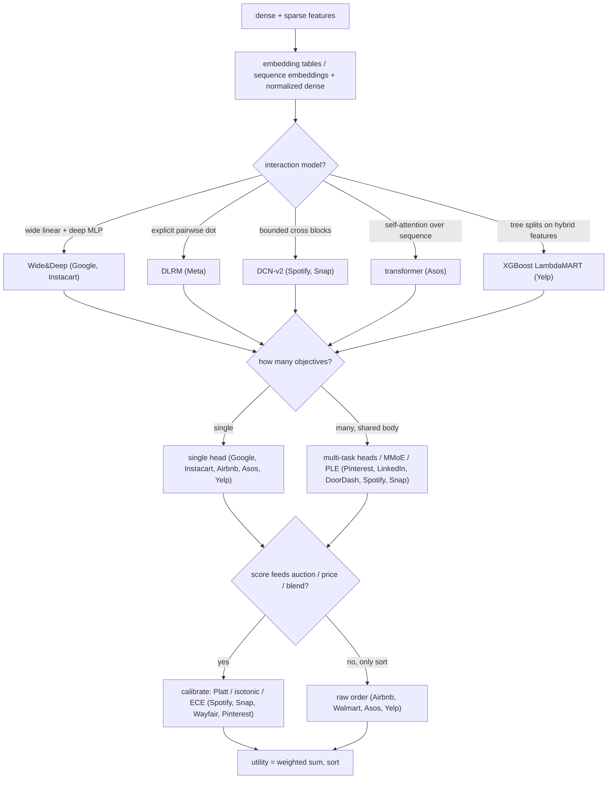
```mermaid
flowchart TD
  IN["dense + sparse features"] --> EMB["embedding tables / sequence embeddings + normalized dense"]
  EMB --> D1{"interaction model?"}
  D1 -->|"wide linear + deep MLP"| WD["Wide&Deep (Google, Instacart)"]
  D1 -->|"explicit pairwise dot"| DL["DLRM (Meta)"]
  D1 -->|"bounded cross blocks"| DC["DCN-v2 (Spotify, Snap)"]
  D1 -->|"self-attention over sequence"| TR["transformer (Asos)"]
  D1 -->|"tree splits on hybrid features"| GB["XGBoost LambdaMART (Yelp)"]
  WD --> D2{"how many objectives?"}
  DL --> D2
  DC --> D2
  TR --> D2
  GB --> D2
  D2 -->|"single"| SG["single head (Google, Instacart, Airbnb, Asos, Yelp)"]
  D2 -->|"many, shared body"| MT["multi-task heads / MMoE / PLE (Pinterest, LinkedIn, DoorDash, Spotify, Snap)"]
  SG --> D3{"score feeds auction / price / blend?"}
  MT --> D3
  D3 -->|"yes"| CAL["calibrate: Platt / isotonic / ECE (Spotify, Snap, Wayfair, Pinterest)"]
  D3 -->|"no, only sort"| RANK["raw order (Airbnb, Walmart, Asos, Yelp)"]
  CAL --> U["utility = weighted sum, sort"]
  RANK --> U
```

**The choices, side by side.**

| Decision | Options (who) | What decides it |
| --- | --- | --- |
| interaction model | `DLRM` (Meta) vs `DeepFM`/`FM` (Instacart) vs `DCN-v2` (Spotify, Snap) vs `Wide&Deep` (Google) vs `self-attention transformer` (Asos) vs `GBDT LambdaMART` (Yelp) vs `MLP` (Pinterest, LinkedIn, DoorDash, Airbnb) | Cross structure and signal shape: explicit dot products when sparse ids dominate, bounded cross blocks to skip hand-crafting, self-attention when order and session context carry the signal, trees when hybrid content plus interaction features must combine for tail coverage |
| multi-task | `single` (Google, Instacart, Airbnb, Asos, Yelp) vs `shared-bottom` (Pinterest, LinkedIn, DoorDash) vs `MMoE/PLE` (Spotify, Snap) | Count of distinct outcomes and how negatively correlated they are; gating and towers hedge task conflict, single head fits one objective |
| calibration | `implicit/none` (Google, DLRM, Airbnb, LinkedIn, Walmart, Asos, Yelp) vs `Platt/logistic per head` (Pinterest, Snap) vs `isotonic/monotonic` (Wayfair, Snap) vs `ECE-monitored` (Spotify) | Whether a raw score feeds an auction, price, or cross-task blend; if it only sorts, order is enough and calibration is skipped |
| model-family path | `native DNN` (Meta, Google, Snap) vs `GBDT then DNN` (Airbnb) vs `tree then MT-DNN` (DoorDash) vs `leaves into DNN` (LinkedIn) vs `MF then transformer` (Asos) vs `MF then GBDT LTR` (Yelp) vs `lightweight XGBoost early` (Pinterest) | Maturity of the prior baseline and funnel position; migrate off matrix factorization when tail coverage or sequence signal is left on the table, bridge trees via leaves, or stay light at the top of the funnel |

**The math that separates them.**

$$z = \text{concat}\Big(x_{dense},\ \lbrace \ \langle e_i,\ e_j\rangle\ :\ i \lt j\ \rbrace \Big)$$

$$x_{l+1} = x_0 \odot (W_l x_l + b_l) + x_l$$

$$\mathrm{Attention}(Q,K,V) = \text{softmax}\Big(\frac{Q K^{\top}}{\sqrt{d_k}}\Big) V, \qquad U = \sum_{t} w_t \hat p_t$$

$$\mathrm{ECE} = \sum_{b=1}^{B} \frac{n_b}{N} \big| \mathrm{acc}(b) - \mathrm{conf}(b) \big|, \qquad \mathrm{bid} = v \cdot \hat p$$

The multi-task body optimizes a weighted sum of per-head log losses, so one gradient signal trains every objective and the head weights $w_k$ trade off how much each outcome counts:

$$L = \sum_{k=1}^{K} w_k \Big( -\frac{1}{N} \sum_{i=1}^{N} \big[ y_{ik} \log \hat p_{ik} + (1 - y_{ik}) \log (1 - \hat p_{ik}) \big] \Big)$$

The learning-to-rank systems (Airbnb, Yelp) do not minimize per-item loss at all; the LambdaMART gradient between a more-relevant item $i$ and a less-relevant item $j$ is scaled by the ranking-metric change from swapping them, so pairs that move NDCG most get the largest pull:

$$\lambda_{ij} = \frac{-\sigma}{1 + \exp\big(\sigma (s_i - s_j)\big)} \big| \Delta \mathrm{NDCG}_{ij} \big|$$

The MMoE/PLE rankers (Spotify, Snap) route a shared expert pool through per-task softmax gates, so each objective $k$ mixes the experts $f_i$ its own way before its tower $h_k$, which is what softens conflict between negatively correlated tasks:

$$g^k(x) = \text{softmax}(W_k x), \qquad y_k = h_k\Big( \sum_{i=1}^{n} g^k(x)_i f_i(x) \Big)$$

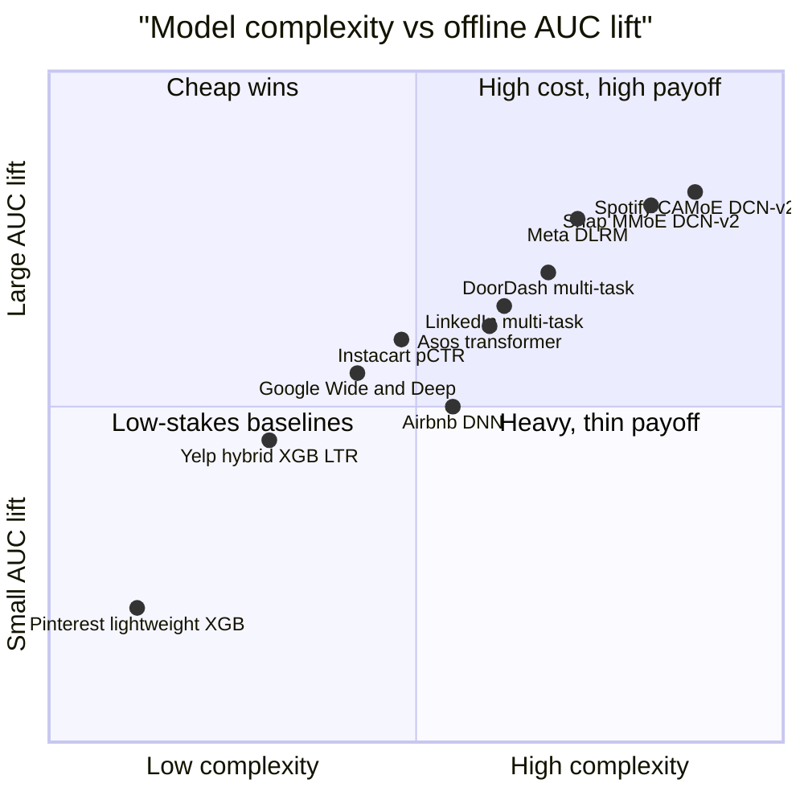
```mermaid
quadrantChart
  title "Model complexity vs offline AUC lift"
  x-axis "Low complexity" --> "High complexity"
  y-axis "Small AUC lift" --> "Large AUC lift"
  quadrant-1 "High cost, high payoff"
  quadrant-2 "Cheap wins"
  quadrant-3 "Low-stakes baselines"
  quadrant-4 "Heavy, thin payoff"
  "Pinterest lightweight XGB": [0.12, 0.20]
  "Yelp hybrid XGB LTR": [0.30, 0.45]
  "Google Wide and Deep": [0.42, 0.55]
  "Instacart pCTR": [0.48, 0.60]
  "Airbnb DNN": [0.55, 0.50]
  "Asos transformer": [0.60, 0.62]
  "LinkedIn multi-task": [0.62, 0.65]
  "DoorDash multi-task": [0.68, 0.70]
  "Meta DLRM": [0.72, 0.78]
  "Snap MMoE DCN-v2": [0.82, 0.80]
  "Spotify CAMoE DCN-v2": [0.88, 0.82]
```

**When to use which.** Pick the interaction model by signal shape, and add calibration only when a score leaves pure sorting:

| Reach for | When | Instead of |
|---|---|---|
| Explicit pairwise dot products, DLRM (Meta) | Sparse ids dominate and structured second-order crosses carry the signal | Concatenated embeddings into a top MLP hoping it learns the crosses |
| DCN-v2 bounded cross blocks (Spotify, Snap) | You want cross structure without hand-crafting feature pairs | Wide and Deep, whose wide side needs manual crosses |
| Self-attention transformer (Asos) | Session order and recency carry the signal | Order-blind FM or MLP |
| GBDT LambdaMART (Yelp, Airbnb LTR) | Hybrid content plus interaction features and you optimize NDCG directly (lambda scales by NDCG change) | Per-item log loss that ignores the ranking-metric swap |
| MMoE or PLE gating (Spotify, Snap) | Several negatively correlated objectives conflict under one shared body | A single shared-bottom head that lets one task drown another |
| Single head (Google, Instacart, Yelp) | One clear objective drives the surface | Multi-task overhead you do not need |
| Platt or isotonic calibration with ECE monitoring (Spotify, Snap, Wayfair) | The score feeds an auction, a bid (bid equals value times predicted probability), a price, or a cross-task blend | Shipping raw ranker scores as if they were probabilities |
| Raw order, skip calibration (Airbnb, Walmart, Asos, Yelp) | The score only sorts a list | A calibration step that buys nothing when you just sort |
| Utility weights kept outside the loss (Pinterest) | The business must retune what a like is worth versus a click | Baking objective weights into the loss and retraining to change them |

**Interview watch-outs.** The traps that sink ranking answers, with the wrong reflex and the correction:

- **Where the interaction sits.** Trap: "the deep MLP will learn the crosses." Wrong answer: feed concatenated embeddings straight into a top MLP and call it DLRM. Right answer: take explicit pairwise dot products after the embeddings and bottom MLP, before the top MLP; that structured second-order layer is the whole point, and the bottom MLP output width must equal the embedding dimension or the dot products are undefined.

- **Offline up, online flat.** Trap: treating a higher AUC as a ship signal. Wrong answer: promote the model because the offline metric moved. Right answer: suspect the training-to-serving seam first (feature skew, label leakage via non-point-in-time joins, position bias, or an offline metric that does not match the online objective), then gate on an A/B test on the business metric.

- **Calibration versus ordering.** Trap: assuming a good ranker gives good probabilities. Wrong answer: send raw scores into an auction or a cross-task blend. Right answer: ordering is enough only when you just sort; the moment a score feeds a bid, a threshold, or a weighted utility, add a post-hoc Platt or isotonic step and monitor ECE, because negative sampling and stratified training both distort the base rate.

- **Multi-task as a free win.** Trap: adding heads always helps. Wrong answer: share one body across weakly or negatively correlated objectives and expect every task to improve. Right answer: shared representation helps correlated tasks, but conflict can let one drown another, so split towers or use MMoE/PLE gating and watch per-task metrics; and keep the utility weights outside the loss so the business can retune without retraining.

- **Id embeddings everywhere.** Trap: an embedding table for every categorical, including item id. Wrong answer: learn per-listing id embeddings when each id has a handful of labels (Airbnb: a listing books at most about 365 times a year). Right answer: id embeddings need dense repeated exposure; for sparse-per-id or churning-vocabulary settings, lean on content, context, and hashing, and warm-start often so fresh ids do not go out-of-vocabulary.

- **Latency treated as an afterthought.** Trap: pick the architecture, then worry about serving. Wrong answer: score each candidate through a full monolithic tower. Right answer: state the budget out loud (say 500 candidates in about 20 ms, well under 0.1 ms each) and design backward: batch the forward pass, compute the shared user tower once and reuse it across candidates, and keep the per-candidate cost flat as candidate count grows.

**The systems**

- **Google** [Wide & Deep Learning for Recommender Systems](https://arxiv.org/abs/1606.07792): Joint wide linear (memorization) plus deep net (generalization) for Google Play ranking. *(product design)*
- **Meta** [Deep Learning Recommendation Model (DLRM)](https://arxiv.org/abs/1906.00091): Dense MLP plus sparse embedding tables with explicit feature interactions, sharded for scale. *(product design)*
- **Instacart** [One Model to Serve Them All: a single deep pCTR model for multiple surfaces](https://company.instacart.com/how-its-made/one-model-to-serve-them-all-how-instacart-deployed-a-single-deep-learning-pctr-model-for-multiple-surfaces-with-improved-operations-and-performance-along-the-way): Consolidating per-surface XGBoost into one wide-and-deep pCTR model; calibration and ops wins. *(deployment)*
- **Pinterest** [Multi-task Learning and Calibration for Utility-based Home Feed Ranking](https://medium.com/pinterest-engineering/multi-task-learning-and-calibration-for-utility-based-home-feed-ranking-64087a7bcbad): A multi-head DNN per action type, with calibrated probabilities combined into a utility score. *(eval bar)*
- **Pinterest** [Multi-task Learning for Related Products Recommendations](https://medium.com/pinterest-engineering/multi-task-learning-for-related-products-recommendations-at-pinterest-62684f631c12): Four engagement heads beat a binary classifier; tune utility weights without retraining. *(product design)*
- **LinkedIn** [Homepage feed multi-task learning using TensorFlow](https://www.linkedin.com/blog/engineering/feed/homepage-feed-multi-task-learning-using-tensorflow): Jointly trains feed objectives (click, comment, reshare) in one ranker. *(product design)*
- **Airbnb** [Applying Deep Learning to Airbnb Search](https://medium.com/airbnb-engineering/applying-deep-learning-to-airbnb-search-7ebd7230891f): The journey from GBDT to neural-network ranking for bookings. *(product design)*
- **DoorDash** [Deep learning for ads conversion in last-mile delivery](https://arxiv.org/abs/2502.10514): Homepage ads ranking moving from tree models to multi-task DNNs. *(product design)*
- **Spotify** [Modality-aware multi-task learning for ad targeting](https://research.atspotify.com/2025/8/modality-aware-multi-task-learning-to-optimize-ad-targeting-at-scale): Multi-task MoE ad ranking with DCN-v2 feature interactions, calibrated. *(product design)*
- **Pinterest** [Improving recommended pins with lightweight ranking](https://medium.com/pinterest-engineering/improving-the-quality-of-recommended-pins-with-lightweight-ranking-8ff5477b20e3): An XGBoost lightweight ranker within a latency budget early in the funnel. *(deployment)*
- **Wayfair** [Time Informed Calibration](https://www.aboutwayfair.com/careers/tech-blog/time-informed-calibration): Calibrates raw ranking scores into time-aware purchase probabilities. *(eval bar)*
- **Walmart** [Improving Walmart Search to help customers save time](https://medium.com/walmartglobaltech/improving-walmart-search-to-help-our-customers-save-time-e9fcd1f03e94): A re-ranker balancing relevance and engagement, lifting relevance 4.5%. *(eval bar)*
- **Snap** [Machine Learning for Snapchat Ad Ranking](https://eng.snap.com/machine-learning-snap-ad-ranking): Deep-learning ad ranker selecting from millions of ads under strict latency and cost budgets. *(product design)*
- **Asos** [Transforming Recommendations at ASOS](https://medium.com/asos-techblog/transforming-recommendations-at-asos-254b95c6a07a): Transformer sequence ranker over user interactions, over 20% offline lift versus matrix factorization. *(product design)*
- **Yelp** [Beyond Matrix Factorization: Using hybrid features for user-business recommendations](https://engineeringblog.yelp.com/2022/04/beyond-matrix-factorization-using-hybrid-features-for-user-business-recommendations.html): XGBoost learning-to-rank blending interaction and content features, doubling user coverage. *(product design)*

---

### [Sequential & personalized recommendation](topics/03-sequential-recommendation.md) · 12 systems

**What they share.** Every system turns an ordered list of user interactions into item plus side-feature embeddings, runs a sequence model that weighs which past actions matter now, and pools the result into one user-intent vector that feeds a ranking head or retrieval tower. They diverge on the encoder, how much history they carry, how fresh the user state is, and whether the model is per-surface or a shared foundation.

**The reference pipeline.** Before the divergence, here is the canonical sequential-recsys skeleton every one of these systems is a variation on: an offline path that builds causal sequences and trains the encoder, and an online path that keeps the sequence fresh through streaming ingest and encodes it per request. The one non-negotiable is that both paths build the sequence with identical logic, or the model serves on a distribution it never trained on.

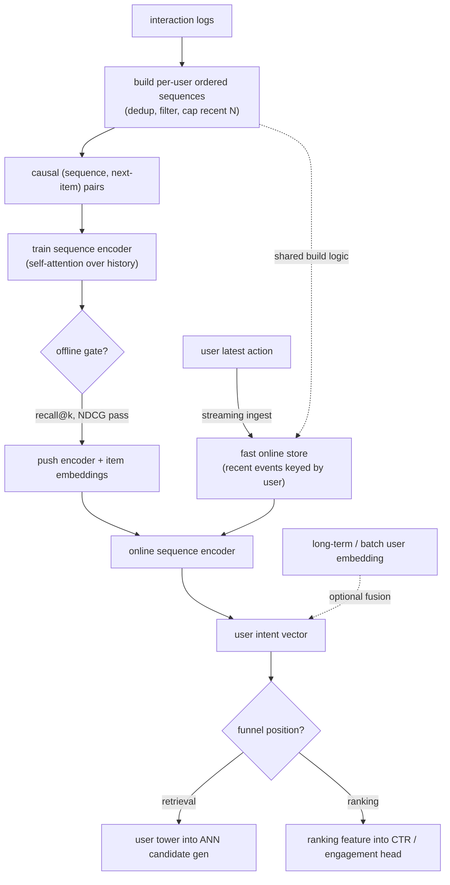
```mermaid
flowchart TD
  LOG["interaction logs"] --> SEQB["build per-user ordered sequences<br/>(dedup, filter, cap recent N)"]
  SEQB --> PAIR["causal (sequence, next-item) pairs"]
  PAIR --> TRAIN["train sequence encoder<br/>(self-attention over history)"]
  TRAIN --> GATE{"offline gate?"}
  GATE -->|"recall@k, NDCG pass"| DEPLOY["push encoder + item embeddings"]
  ACT["user latest action"] -->|"streaming ingest"| STORE["fast online store<br/>(recent events keyed by user)"]
  SEQB -.shared build logic.-> STORE
  DEPLOY --> ENC["online sequence encoder"]
  STORE --> ENC
  ENC --> UV["user intent vector"]
  LT["long-term / batch user embedding"] -.optional fusion.-> UV
  UV --> HEAD{"funnel position?"}
  HEAD -->|"retrieval"| ANN["user tower into ANN candidate gen"]
  HEAD -->|"ranking"| RANK["ranking feature into CTR / engagement head"]
```

**Reading the diagram.** Start top-left: raw interaction logs become per-user ordered sequences, where dedup, filtering, and a recent-N cap decide what counts as a user's history, and any inconsistency here is the classic training-serving skew, since the exact same build logic has to feed both the offline pairs and the online store. Those sequences turn into causal (sequence, next-item) pairs and train the self-attention encoder, whose job is to weigh which past actions matter right now instead of averaging them flat, the way Alibaba BST and Pinterest TransAct do. An offline gate on recall-at-k and NDCG decides whether the encoder plus item embeddings ship, so a model that just memorizes popularity rather than intent never reaches serving. On the online side the user's latest action streams into a fast per-user store, and the deployed encoder reads that fresh sequence per request to emit a user intent vector, optionally fused with a slower batch or long-term embedding the way Pinterest splits short and long history. The final fork is funnel position: the same vector either becomes a user tower into ANN candidate generation for retrieval, or a ranking feature into a CTR head, and picking the wrong branch quietly wastes the whole pipeline because the latency budget and the loss differ across the two. The design leverage in this skeleton is freshness under budget, so you cap the sequence, cache the encoded state, and keep one shared sequence-build path, or the deep-history and realtime gains cancel each other out.

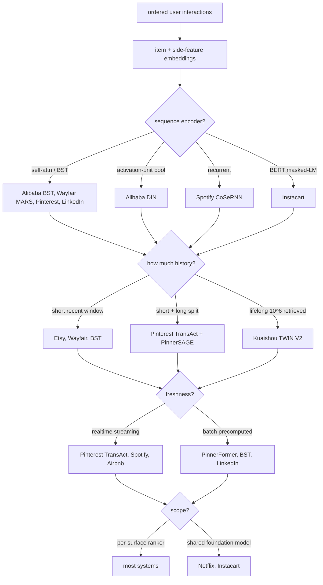
```mermaid
flowchart TD
  S["ordered user interactions"] --> EMB["item + side-feature embeddings"]
  EMB --> D1{"sequence encoder?"}
  D1 -->|"self-attn / BST"| A1["Alibaba BST, Wayfair MARS, Pinterest, LinkedIn"]
  D1 -->|"activation-unit pool"| A2["Alibaba DIN"]
  D1 -->|"recurrent"| A3["Spotify CoSeRNN"]
  D1 -->|"BERT masked-LM"| A4["Instacart"]
  A1 --> D2{"how much history?"}
  A2 --> D2
  A3 --> D2
  A4 --> D2
  D2 -->|"short recent window"| B1["Etsy, Wayfair, BST"]
  D2 -->|"short + long split"| B2["Pinterest TransAct + PinnerSAGE"]
  D2 -->|"lifelong 10^6 retrieved"| B3["Kuaishou TWIN V2"]
  B1 --> D3{"freshness?"}
  B2 --> D3
  B3 --> D3
  D3 -->|"realtime streaming"| C1["Pinterest TransAct, Spotify, Airbnb"]
  D3 -->|"batch precomputed"| C2["PinnerFormer, BST, LinkedIn"]
  C1 --> D4{"scope?"}
  C2 --> D4
  D4 -->|"per-surface ranker"| U1["most systems"]
  D4 -->|"shared foundation model"| U2["Netflix, Instacart"]
```

**The choices, side by side.**

| Decision | Options (who) | What decides it |
| --- | --- | --- |
| sequence encoder | `self-attn/BST` (Alibaba/Pinterest) vs `DIN pool` vs `RNN/CoSeRNN` vs `BERT` (Instacart) | Whether order matters (attention), whether interest depends on the candidate (DIN pool), whether per-session context dominates (RNN), or whether one bidirectional model must serve many surfaces (BERT) |
| history length | `short window` vs `lifelong TWIN` (Kuaishou) vs `short+long split` (Pinterest) | How much signal lives in the deep past versus the last few actions, traded against the per-request encode budget |
| freshness | `realtime` vs `batch` | Whether same-session reaction is the product value (realtime streaming) or a daily batch vector with an all-action loss recovers most of it cheaply |
| scope | `per-surface` vs `foundation model` | Whether one team owns one ranker, or many surfaces amortize a shared pretrained sequence model (Netflix, Instacart) |

**The math that separates them.**

$$\textbf{attention over history:}\quad z = \sum_{t=1}^{N} \text{softmax}_t\left(\frac{Q K_t^\top}{\sqrt{d}}\right) V_t$$

$$\textbf{time-aware score (recency, not just order):}\quad \alpha_t = \text{softmax}_t\left(\frac{Q K_t^\top}{\sqrt{d}} + \phi(\Delta_t)\right)$$

$$\textbf{target-attn (DIN pool):}\quad v_u(c) = \sum_{t=1}^{N} a(e_t, c)\, e_t \quad\text{(no softmax norm)}$$

$$\textbf{lifelong two-stage (TWIN):}\quad z = \text{ESU}\left(\text{GSU}(c, \lbrace C_k\rbrace ), c\right),\quad \Vert seq \Vert \sim 10^{6}$$

$$\textbf{sampled-softmax retrieval:}\quad \mathcal{L} = -\log \frac{\exp(u^\top v_{+})}{\exp(u^\top v_{+}) + \sum_{j \in \mathcal{N}} \exp(u^\top v_{j})}$$

$$\textbf{all-action loss (PinnerFormer):}\quad \mathcal{L} = \frac{1}{\Vert W \Vert}\sum_{f \in W} \ell(u, v_{f}) \quad\text{(window of future actions, not just t+1)}$$

$$\textbf{NDCG at k:}\quad \text{NDCG}@k = \frac{1}{Z}\sum_{i=1}^{k} \frac{2^{rel_i}-1}{\log_2(i+1)}$$

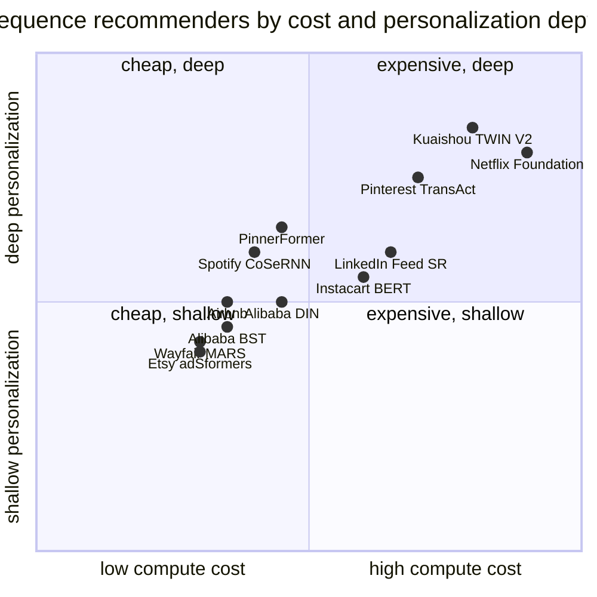
```mermaid
quadrantChart
  title Sequence recommenders by cost and personalization depth
  x-axis "low compute cost" --> "high compute cost"
  y-axis "shallow personalization" --> "deep personalization"
  quadrant-1 "expensive, deep"
  quadrant-2 "cheap, deep"
  quadrant-3 "cheap, shallow"
  quadrant-4 "expensive, shallow"
  "Alibaba BST": [0.35, 0.45]
  "Alibaba DIN": [0.45, 0.50]
  "Etsy adSformers": [0.30, 0.40]
  "Wayfair MARS": [0.30, 0.42]
  "Spotify CoSeRNN": [0.40, 0.60]
  "Pinterest TransAct": [0.70, 0.75]
  "PinnerFormer": [0.45, 0.65]
  "Kuaishou TWIN V2": [0.80, 0.85]
  "Netflix Foundation": [0.90, 0.80]
  "Instacart BERT": [0.60, 0.55]
  "LinkedIn Feed SR": [0.65, 0.60]
  "Airbnb": [0.35, 0.50]
```

**When to use which.** Choose the encoder by what the signal is (order, candidate-relevance, session, or shared foundation), then size history and freshness against the encode budget:

| Reach for | When | Instead of |
|---|---|---|
| Self-attention or BST (Alibaba, Pinterest) | Order carries intent and you can afford a per-request encode | Order-flattening lifetime count aggregates |
| DIN activation pool (Alibaba) | Relevance depends on the candidate and you want interest intensity preserved (no softmax norm) | BST when order is not the signal |
| RNN or CoSeRNN (Spotify) | Per-session context dominates and session-granularity reaction is enough | Attention you do not need if you only react per session |
| BERT masked-LM (Instacart) | One bidirectional model must serve many surfaces | A separate per-surface encoder per team |
| Lifelong two-stage TWIN (Kuaishou) | Signal lives in roughly a million deep-history actions | A short window that drops the deep past |
| Short plus long split, TransAct with PinnerSAGE (Pinterest) | You need realtime reaction and stable long-term taste at once | One window that serves neither well |
| Realtime streaming freshness (Pinterest, Spotify, Airbnb) | Same-session reaction is the product value | Batch vectors that miss the current session |
| All-action loss batch embedding, PinnerFormer | A daily vector must recover most of the realtime gain cheaply | Streaming infrastructure you cannot staff |
| Offline gate on recall at k and NDCG at k | Deciding whether the encoder ships before it reaches serving | Shipping on popularity memorization |

**Interview watch-outs.**

- **Aggregates lose the signal.** The classic wrong answer is a bag of lifetime category counts, which erases order and recency, the two things that carry intent. A user who just switched from cooking to travel looks identical to a steady cooking fan under counts. Instacart found that shuffling sequence order drops recall 10 to 45%, which is the direct evidence that order is the signal.
- **Attention vs RNN, and why.** Interviewers expect you to justify self-attention over recurrence: it weighs arbitrary past actions directly and parallelizes, without the sequential bottleneck of an RNN. Naming that bottleneck (and that Spotify CoSeRNN accepts it because it only reacts at session granularity) is the point.
- **Position is not time.** Injecting a plain positional index (1st, 2nd, 3rd action) is only half right. Two actions a second apart differ from two a month apart, so strong answers encode the actual time gaps between events so recency is weighted, not just order. This is the single detail most candidates skip.
- **Training-serving skew is the headline failure mode.** The user sequence is built by a batch pipeline offline and a streaming pipeline online; if their dedup, filtering, or tie-ordering of simultaneous events differ, the model serves on a distribution it never trained on. Say explicitly that the construction logic must be shared code, not two implementations.
- **DIN is not a sequence model.** DIN's activation pool deliberately has no softmax normalization (it preserves interest intensity) and ignores order entirely; BST is what adds order. Claiming DIN models sequence order, or that its attention is normalized, is a common and telling miss.
- **Cold start is degradation, not a second model.** A new user degrades down the same model: session-only sequence, then content features over id embeddings, then popularity and context fallback. Also cap sequence length for tail latency on power users, and watch a diversity guardrail for the recency filter-bubble, since that failure never shows up in offline recall.

**The systems**

- **Alibaba** [Behavior Sequence Transformer for E-commerce Recommendation](https://arxiv.org/abs/1905.06874): A transformer over the user behavior sequence lifts CTR in Taobao ranking. *(product design)*
- **Alibaba** [Deep Interest Network for Click-Through Rate Prediction](https://arxiv.org/abs/1706.06978): An attention activation unit adapts the user-interest vector per candidate ad. *(product design)*
- **Pinterest** [How Pinterest Leverages Realtime User Actions (TransAct)](https://medium.com/pinterest-engineering/how-pinterest-leverages-realtime-user-actions-in-recommendation-to-boost-homefeed-engagement-volume-165ae2e8cde8): TransAct fuses the real-time last-100 actions into Homefeed ranking. *(deployment)*
- **Pinterest** [PinnerFormer: Sequence Modeling for User Representation](https://arxiv.org/abs/2205.04507): A batch sequence model with an all-action loss avoids streaming embedding updates. *(deployment)*
- **Netflix** [Integrating Netflix Foundation Model into Personalization](https://netflixtechblog.medium.com/integrating-netflixs-foundation-model-into-personalization-applications-cf176b5860eb): Three ways to plug a large sequence model into production systems. *(deployment)*
- **Spotify** [Contextual and sequential user embeddings for music](https://research.atspotify.com/contextual-and-sequential-user-embeddings-for-music-recommendation/): CoSeRNN models taste as a sequence of per-session embeddings. *(product design)*
- **Instacart** [Sequence models for contextual recommendations](https://tech.instacart.com/sequence-models-for-contextual-recommendations-at-instacart-93414a28e70c): A centralized BERT-style next-action retrieval serving search, browse, recs. *(deployment)*
- **Kuaishou** [TWIN V2: ultra-long user behavior sequence modeling](https://arxiv.org/abs/2407.16357): Two-stage attention over lifelong user behavior sequences in production. *(deployment)*
- **Etsy** [adSformers: personalization from short-term sequences](https://arxiv.org/abs/2302.01255): A transformer encoder over recent user actions for ad CTR and CVR. *(product design)*
- **Wayfair** [MARS: transformer networks for sequential recommendation](https://www.aboutwayfair.com/careers/tech-blog/mars-transformer-networks-for-sequential-recommendation): Self-attention over browsed-item sequences to track changing tastes. *(product design)*
- **LinkedIn** [An industrial-scale sequential recommender for feed ranking](https://arxiv.org/abs/2602.12354): A transformer sequential ranker (Feed SR) replacing a DCNv2 ranker. *(deployment)*
- **Airbnb** [Listing Embeddings in Search Ranking](https://medium.com/airbnb-engineering/listing-embeddings-for-similar-listing-recommendations-and-real-time-personalization-in-search-601172f7603e): Listing embeddings from 800M sessions for real-time in-session personalization. *(product design)*

---

### [Ads CTR prediction](topics/10-ads-ctr-prediction.md) · 11 systems

**What they share.** Every system pulls eligible ads, scores each with a sparse-embedding model into a calibrated pCTR, and feeds `eCPM = bid x pCTR` into the auction; they diverge only on how feature interactions are carried and how calibration is defended as labels drift and conversions land late.

**The reference pipeline.** Strip away the model-family and calibration choices and every one of these systems is the same skeleton: a request resolves a candidate set, a sparse-embedding net produces a raw pCTR, a calibration step maps that score onto true rates, and the auction turns the calibrated probability into money via eCPM. Delayed conversions and the show-only-what-you-scored logging policy feed the next training cycle.

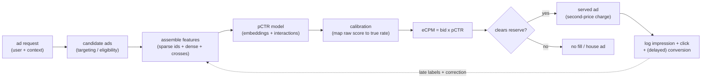
```mermaid
flowchart LR
  REQ["ad request<br/>(user + context)"] --> CAND["candidate ads<br/>(targeting / eligibility)"]
  CAND --> FEAT["assemble features<br/>(sparse ids + dense + crosses)"]
  FEAT --> MODEL["pCTR model<br/>(embeddings + interactions)"]
  MODEL --> CAL["calibration<br/>(map raw score to true rate)"]
  CAL --> ECPM["eCPM = bid x pCTR"]
  ECPM --> AUCT{"clears reserve?"}
  AUCT -->|"yes"| SERVE["served ad<br/>(second-price charge)"]
  AUCT -->|"no"| NOFILL["no fill / house ad"]
  SERVE --> LOG["log impression + click<br/>+ (delayed) conversion"]
  LOG -.->|"late labels + correction"| FEAT
```

**Reading the diagram.** Read it left to right as the life of one ad slot. The ad request arrives with user plus context, and targeting and eligibility narrow the whole inventory to a candidate set of tens to a few hundred ads that are actually allowed to serve. Feature assembly then stitches together sparse ids (user, ad, advertiser, creative), dense signals, and crosses, and this is a point-in-time read from the feature store, so training-serving skew here quietly poisons everything downstream. The pCTR model (DLRM at Meta, DCN-v2 at Google, GBDT plus LR in the classic Facebook recipe) embeds those sparse ids and models interactions to emit a raw score, but that score is not yet a probability, which is why the calibration step (proper loss, Platt at Pinterest, isotonic at LinkedIn) maps it onto true rates before it can price anything. Calibration feeds the auction directly: eCPM = bid times pCTR ranks the candidates and the second-price charge is derived from that number, so a raw head that is off by 20 percent mis-prices every slot even at identical AUC, which is the single sharpest failure mode of the pipeline. The served impression, click, and (days-later) delayed conversion flow into the log, and the dashed edge back to features is the trap: you only ever log outcomes for ads you chose to show, so today's policy shapes tomorrow's training data and a not-yet-converted click is an unresolved label, not a confirmed negative. The design leverage lives at exactly two joints, the calibration layer (recalibrate hourly on a light tower while the heavy net retrains daily, monitor sliced ECE) and the logging loop (exploration, inverse-propensity weighting, delay-aware loss), because those are where honest probabilities and unbiased labels are won or lost.

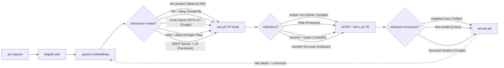
```mermaid
flowchart LR
  REQ["ad request"] --> CAND["eligible ads"]
  CAND --> EMB["sparse embeddings"]
  EMB --> INT{"interaction model?"}
  INT -->|"dot product (Meta DLRM)"| SCORE["raw pCTR head"]
  INT -->|"FM + deep (DeepFM)"| SCORE
  INT -->|"cross layers (DCN-v2 / Google)"| SCORE
  INT -->|"wide + deep (Google Play)"| SCORE
  INT -->|"GBDT leaves + LR (Facebook)"| SCORE
  SCORE --> CAL{"calibration?"}
  CAL -->|"proper loss (Meta / Google)"| ECPM["eCPM = bid x pCTR"]
  CAL -->|"Platt (Pinterest)"| ECPM
  CAL -->|"isotonic + tower (LinkedIn)"| ECPM
  CAL -->|"transfer fine-tune (Instacart)"| ECPM
  ECPM --> DLY{"delayed conversion?"}
  DLY -->|"weighted loss (Twitter)"| SERVE["served ad"]
  DLY -->|"two-model (Criteo)"| SERVE
  DLY -->|"bounded window (Google)"| SERVE
  SERVE -.->|"late labels + correction"| EMB
```

**The choices, side by side.**

| Decision | Options (who) | What decides it |
| --- | --- | --- |
| interaction model | `DLRM` (Meta) vs `DeepFM` vs `DCN-v2` vs `Wide&Deep` vs `GBDT+LR` (Facebook) | how sparse the space is and whether pairwise dot products, learned FM crosses, bounded-degree cross layers, memorize-plus-generalize branches, or tree-discovered crosses carry the signal; trees cap out at billions of ids |
| calibration | `proper-loss` vs `Platt` (Pinterest) vs `isotonic` (LinkedIn) vs transfer fine-tune (Instacart) | how far the raw head drifts from true rates under negative sampling and exposure bias, and whether you must recalibrate hourly while the heavy net retrains daily |
| delayed conversion | `weighted loss` (Twitter) vs `two-model` (Criteo) vs windows (Google) | the conversion delay distribution and whether a not-yet-converted click can be treated as a confirmed negative inside the attribution window |
| feature/embedding scale | row-per-id (small space) vs feature hashing + sharding (billions of ids: DLRM, Google) | id-space cardinality and memory budget; hashing trades controlled collisions for a bounded, shardable table, and model-parallel embeddings plus data-parallel MLP for DLRM |

**The math that separates them.**

$$\textbf{eCPM = bid times pCTR} : \quad \text{eCPM} = 1000 \cdot b \cdot \hat{p}(\text{click})$$

$$\textbf{log loss, a proper score} : \quad \mathcal{L} = -\frac{1}{N}\sum_{i=1}^{N} \big[ y_i \log \hat{p}_i + (1-y_i)\log(1-\hat{p}_i) \big]$$

$$\textbf{expected calibration error} : \quad \text{ECE} = \sum_{b=1}^{B} \frac{n_b}{N} \big| \text{acc}(b) - \text{conf}(b) \big|$$

$$\textbf{fake-negative weighted loss} : \quad \mathcal{L}_w = -\frac{1}{N}\sum_{i=1}^{N} w_i \big[ y_i \log \hat{p}_i + (1-y_i)\log(1-\hat{p}_i) \big]$$

$$\textbf{second-price charge} : \quad \text{price} = \frac{\text{eCPM}_{\text{runner up}}}{1000 \cdot \hat{p}(\text{click})}$$

$$\textbf{Platt-scaled calibration} : \quad q = \sigma(a \cdot s + b) = \frac{1}{1 + e^{-(a s + b)}}$$

$$\textbf{delayed-feedback observed positive} : \quad \Pr(\text{convert by elapsed } e) = p(x)\big(1 - e^{-\lambda(x) e}\big)$$

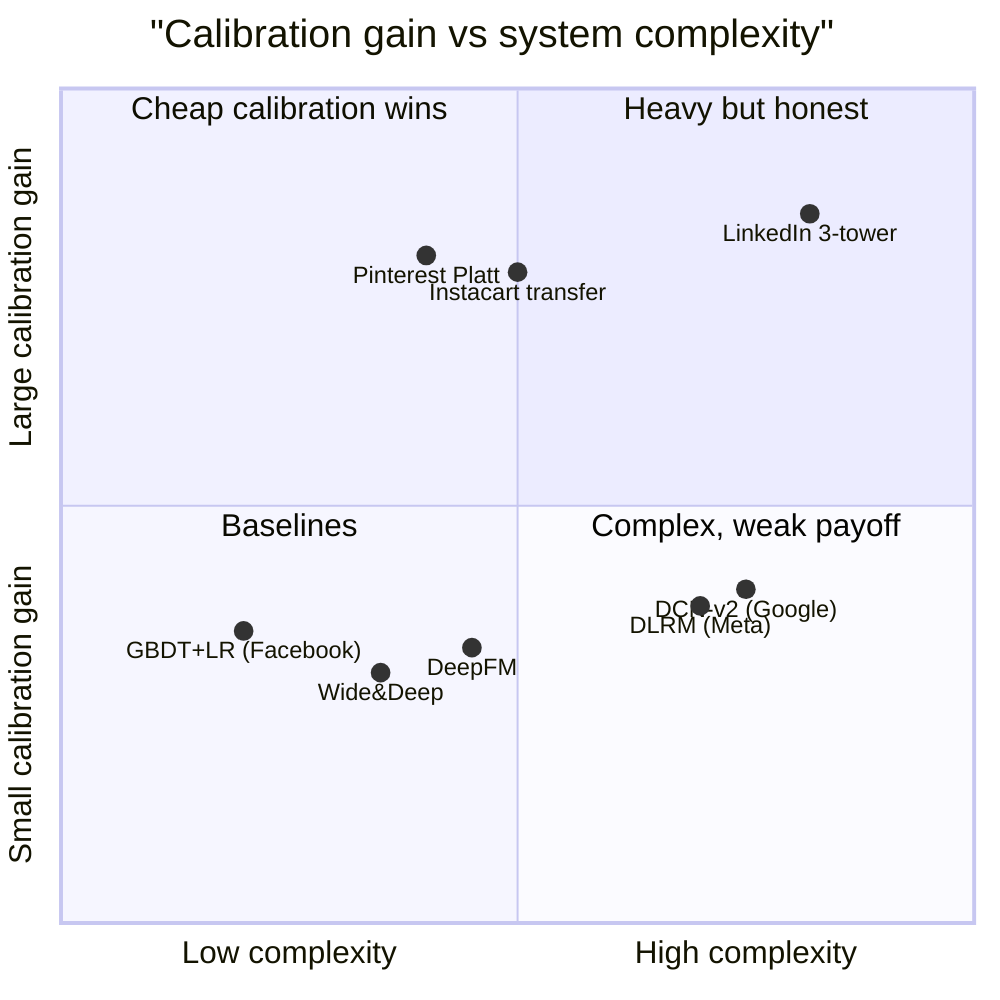
```mermaid
quadrantChart
  title "Calibration gain vs system complexity"
  x-axis "Low complexity" --> "High complexity"
  y-axis "Small calibration gain" --> "Large calibration gain"
  quadrant-1 "Heavy but honest"
  quadrant-2 "Cheap calibration wins"
  quadrant-3 "Baselines"
  quadrant-4 "Complex, weak payoff"
  "GBDT+LR (Facebook)": [0.20, 0.35]
  "Wide&Deep": [0.35, 0.30]
  "DeepFM": [0.45, 0.33]
  "DLRM (Meta)": [0.70, 0.38]
  "DCN-v2 (Google)": [0.75, 0.40]
  "Pinterest Platt": [0.40, 0.80]
  "Instacart transfer": [0.50, 0.78]
  "LinkedIn 3-tower": [0.82, 0.85]
```

**When to use which.** Pick the interaction model, the calibration layer, and the loss from id-space size, how far the raw head drifts, and how late conversions land.

| Reach for | When | Instead of |
|---|---|---|
| GBDT plus LR (Facebook) | id space is modest and tree-discovered crosses carry the signal | DLRM, when the space runs to billions of sparse ids trees cannot hold |
| DLRM (Meta) or DCN-v2 (Google) | billions of sparse ids and explicit crosses drive pCTR | GBDT, when the id space is small enough to enumerate |
| Feature hashing plus sharding | id cardinality is open-ended and you are memory-bound | a row-per-id table, which is fine only for a small closed space |
| Platt or isotonic recalibration (Pinterest, LinkedIn) | the raw head drifts under negative sampling and must track hourly | a full DNN retrain, which is too slow and costly to chase drift |
| Log loss as the objective | you need honest probabilities the auction can price off | an AUC-only objective, which reads order but not absolute rate |
| Sliced ECE monitoring | you must catch calibration rot per segment | one global calibration number, which hides local mis-pricing |
| Delay-aware or fake-negative weighted loss (Twitter, Criteo) | conversions land days after the click inside the attribution window | labeling a not-yet-converted click a confirmed negative, biasing pCVR |
| Second-price charge off calibrated pCTR | pricing the winning bid from a true-rate probability | an uncalibrated raw score, which mis-prices every slot at equal AUC |

**Interview watch-outs.** The traps that separate a passing answer from a stalled one, each as trap, the wrong reflex, and the right move.

- **Calibration vs ranking quality.** Trap: the interviewer notes AUC went up but revenue fell. Wrong: chase a fancier interaction model to lift AUC further. Right: suspect calibration first, because AUC only reads order while the auction prices off the absolute pCTR, so a shifted probability distribution mis-prices every eCPM even at identical AUC.
- **Where the parameters live.** Trap: asked to size and shard the model. Wrong: fixate on the top MLP FLOPs and dense-layer parallelism. Right: name the embedding tables as the billions-of-parameters bottleneck, put model parallelism on the tables and data parallelism on the MLP, and bound the open-ended id space with feature hashing plus accepted collisions.
- **Delayed conversions as negatives.** Trap: a purchase lands three days after the click. Wrong: label every not-yet-converted click as a confirmed negative and train immediately. Right: treat it as an unresolved label, use a delay-aware or fake-negative weighted loss (or a bounded attribution window with a tail correction), since counting it negative biases pCVR down and under-bids real value.
- **The logging feedback loop.** Trap: asked whether training on your own served clicks is circular. Wrong: wave it away because AUC on the logged set looks healthy. Right: acknowledge the loop, since the model only ever sees outcomes for ads it chose to show, and break it with exploration (off-policy or randomized traffic), inverse-propensity weighting, and position-bias correction.
- **Naming the interaction models apart.** Trap: DeepFM vs DCN vs DLRM vs Wide-and-Deep. Wrong: call them interchangeable deep CTR models. Right: distinguish them by how interactions are carried, FM-plus-deep in parallel over shared embeddings (DeepFM), explicit bounded-degree cross layers (DCN), explicit pairwise dot products before a top MLP (DLRM), linear memorization plus deep generalization branches (Wide-and-Deep).
- **Calibration cadence vs retrain cadence.** Trap: campaigns and demand shift hourly but the heavy net retrains daily. Wrong: retrain the whole DNN more often to chase freshness. Right: decouple the two, recalibrate with a lightweight layer (Platt, isotonic, or a shallow tower) on a fast cadence and partially refresh id embeddings, so calibration tracks drift without the cost of a full retrain, and monitor sliced ECE not one global number.

**The systems**

- **Meta** [Deep Learning Recommendation Model (DLRM)](https://arxiv.org/abs/1906.00091): sparse embeddings plus explicit interactions, the canonical CTR architecture. *(model)*
- **Guo et al.** [DeepFM](https://arxiv.org/abs/1703.04247): factorization-machine plus deep network for CTR. *(model)*
- **Wang et al.** [DCN V2](https://arxiv.org/abs/2008.13535): explicit bounded-degree feature crosses for CTR ranking. *(model)*
- **Cheng et al.** [Wide & Deep Learning](https://arxiv.org/abs/1606.07792): memorization plus generalization, the Google Play CTR model. *(model)*
- **Facebook** Practical Lessons from Predicting Clicks on Ads (GBDT + logistic regression): the classic recipe of boosted-tree features feeding a calibrated linear model, with hard-won notes on calibration and data freshness. Find it via the index below. *(deployment)*
- **Pinterest** [AutoML, multi-task, multi-tower models for Pinterest Ads](https://medium.com/pinterest-engineering/how-we-use-automl-multi-task-learning-and-multi-tower-models-for-pinterest-ads-db966c3dc99e): A Platt-scaling calibration layer cut day-to-day error up to 80%. *(product design)*
- **LinkedIn** [Lessons from a deep-learning ads CTR prediction model](https://www.linkedin.com/blog/engineering/machine-learning/challenges-and-practical-lessons-from-building-a-deep-learning-b): Replacing GLMix with a three-tower DNN; calibration under exposure bias. *(deployment)*
- **Instacart** [Calibrating CTR Prediction with Transfer Learning](https://tech.instacart.com/calibrating-ctr-prediction-with-transfer-learning-in-instacart-ads-3ec88fa97525): Transfer learning aligns predicted CTR with observed click frequency. *(eval bar)*
- **Twitter** [Addressing Delayed Feedback in CTR prediction](https://arxiv.org/abs/1907.06558): A fake-negative weighted loss for delayed labels in continuous training. *(product design)*
- **Google** [On the Factory Floor: ML engineering for industrial-scale ads](https://arxiv.org/abs/2209.05310): A search-ads CTR model: calibration, feature crosses, reproducibility at scale. *(deployment)*
- **Criteo** [Modeling delayed feedback in display advertising](https://bibtex.github.io/KDD-2014-Chapelle.html): A two-model approach deciding when an unconverted click counts as negative. *(product design)*

---

### [Search ranking](topics/09-search-ranking.md) · 14 systems

## Search ranking, side by side

**What they share.** Every system splits search into a cheap retrieval stage that fetches candidates and a learned ranking stage that orders them, and all struggle with the same core problem: the training labels (clicks, bookings) are biased by where a result was shown, so relevance and exposure get tangled. Underneath the product-specific detail they run one skeleton: understand the query, retrieve with a lexical arm and an embedding arm, then score the survivors with a learning-to-rank model trained on fused human judgments plus debiased engagement.

**The reference pipeline.** The canonical search stack is four stages in sequence. A raw query is first understood (intent, spelling, expansion, rewrites), which drives two retrieval arms in parallel (BM25 over an inverted index and ANN over embeddings). The arms are unioned and deduped into roughly a thousand candidates, a learning-to-rank model orders them, and an optional re-rank pass adds diversity and freshness before the top results render. Engagement plus human judgments flow back as labels that retrain the ranker.

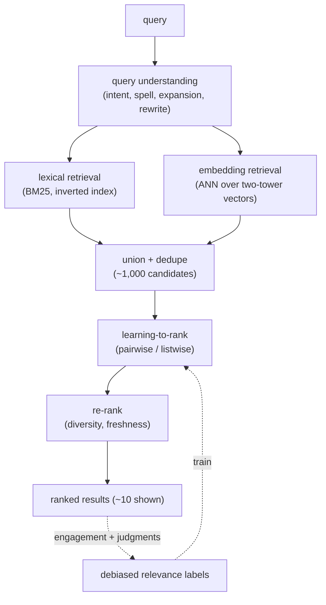
```mermaid
flowchart TD
  Q["query"] --> QU["query understanding<br/>(intent, spell, expansion, rewrite)"]
  QU --> LEX["lexical retrieval<br/>(BM25, inverted index)"]
  QU --> EMB["embedding retrieval<br/>(ANN over two-tower vectors)"]
  LEX --> U["union + dedupe<br/>(~1,000 candidates)"]
  EMB --> U
  U --> LTR["learning-to-rank<br/>(pairwise / listwise)"]
  LTR --> RR["re-rank<br/>(diversity, freshness)"]
  RR --> R["ranked results (~10 shown)"]
  R -.engagement + judgments.-> LBL["debiased relevance labels"]
  LBL -.train.-> LTR
```

**Reading the diagram.** Trace it left to right as the life of one query. Query understanding runs first (Instacart's LLM intent engine is the aggressive version): it fixes spelling, classifies intent, and expands terms, and every mistake here cascades because a bad rewrite poisons both retrieval arms before ranking ever sees a document. Retrieval then fans into a lexical arm (BM25 over an inverted index, unbeatable on product codes and rare exact strings) and an embedding arm (ANN over two-tower vectors, as at Spotify and Pinterest, which closes the vocabulary gap), unioned because their failure modes are complementary and neither is optional. The learning-to-rank stage orders the roughly one thousand survivors, and its objective is the senior decision: pairwise or listwise (LambdaMART) beats pointwise regression because the metric is about order and is position weighted, so the top slots dominate. Re-rank adds diversity and freshness on the short head that actually renders, cheap because it touches only about ten results. The feedback loop is where it breaks: labels come from engagement plus scarce human judgments, clicks are biased by where a result was shown (so naive training predicts rank, not relevance, and locks in whatever order you already shipped), and the offline metric is computed against those same biased labels, so an NDCG lift routinely fails to survive online. The design leverage is choosing which arm dominates and where the labeling budget goes: Amazon spends it on a bandit that explores retrieval, GetYourGuide on inverse-propensity debiasing, Wayfair and LinkedIn on clean human judgments that sidestep exposure bias, and the ship gate stays an interleaving or A/B test rather than offline NDCG alone.

Where teams diverge is which arm dominates and where the labeling budget goes, not the shape.

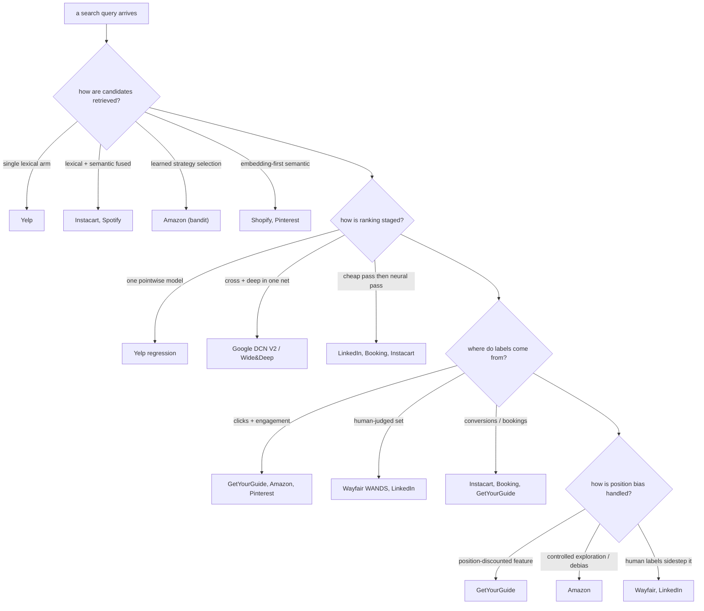
```mermaid
flowchart TD
  START["a search query arrives"] --> RET{"how are candidates retrieved?"}
  RET -->|"single lexical arm"| Y["Yelp"]
  RET -->|"lexical + semantic fused"| INST["Instacart, Spotify"]
  RET -->|"learned strategy selection"| AMZ["Amazon (bandit)"]
  RET -->|"embedding-first semantic"| EMB["Shopify, Pinterest"]
  RET --> RANK{"how is ranking staged?"}
  RANK -->|"one pointwise model"| YM["Yelp regression"]
  RANK -->|"cross + deep in one net"| G["Google DCN V2 / Wide&Deep"]
  RANK -->|"cheap pass then neural pass"| MS["LinkedIn, Booking, Instacart"]
  RANK --> LBL{"where do labels come from?"}
  LBL -->|"clicks + engagement"| ENG["GetYourGuide, Amazon, Pinterest"]
  LBL -->|"human-judged set"| HJ["Wayfair WANDS, LinkedIn"]
  LBL -->|"conversions / bookings"| CONV["Instacart, Booking, GetYourGuide"]
  LBL --> POS{"how is position bias handled?"}
  POS -->|"position-discounted feature"| PD["GetYourGuide"]
  POS -->|"controlled exploration / debias"| CE["Amazon"]
  POS -->|"human labels sidestep it"| HL["Wayfair, LinkedIn"]
```

**The choices, side by side.**

| Decision | Options (who) | What decides it |
| --- | --- | --- |
| Retrieval arm | Single lexical (Yelp); lexical + semantic fusion (Instacart, Spotify); learned strategy selection via bandit (Amazon); pure embedding / two-tower (Shopify, Pinterest) | Catalog size and query variety: exact-match domains lean lexical, intent-heavy or multilingual domains add semantic towers, and heterogeneous intent pushes toward learned arm selection |
| LTR objective | Pointwise regression (Yelp); explicit cross plus deep interaction net (Google DCN V2, Wide and Deep); multi-stage recall-then-precision (LinkedIn, Booking, Instacart, GetYourGuide) | Whether the task is match-or-not (pointwise) versus ordering many candidates cheaply then precisely (multi-stage) under a latency budget |
| Label source | Clicks and engagement (GetYourGuide, Pinterest, Amazon); human-judged relevance (Wayfair WANDS, LinkedIn); conversions and bookings (Instacart, Booking, GetYourGuide) | The business outcome you are willing to trust: engagement is abundant but biased, human labels are clean but expensive, conversions are sparse but truthful |
| Position bias | Position-discounted feature (GetYourGuide); controlled exploration and debiasing (Amazon); human labels that sidestep exposure bias (Wayfair, LinkedIn); implicit or unaddressed (Shopify, Spotify semantic-first) | How much of your signal is logged clicks: the more you train on exposure-driven engagement, the more explicit debiasing you must buy |

**The math that separates them.** Pointwise learning-to-rank (Yelp) fits each candidate independently against a graded label:

$$L_{point} = \sum_{i} \left( f(x_i) - y_i \right)^{2}$$

A two-tower retrieval model (Spotify, Pinterest) with in-batch negatives maximizes the softmax over batch positives, so a batch of size $B$ supplies $B^{2} - B$ negatives for free:

$$L_{tower} = -\frac{1}{B}\sum_{i=1}^{B} \log \frac{\exp\left(\text{sim}(q_i, d_i)/\tau\right)}{\sum_{j=1}^{B} \exp\left(\text{sim}(q_i, d_j)/\tau\right)}$$

DCN V2 (Google) stacks explicit feature crosses where each layer multiplies against the original input, so interaction order grows with depth $l$:

$$x_{l+1} = x_0 \odot \left(W_l x_l + b_l\right) + x_l$$

The lexical arm scores documents with BM25, which rewards term frequency $f(t, D)$ with saturation and discounts common terms by inverse document frequency, normalized by document length $|D|$ against the average $L_{avg}$:

$$\text{BM25}(Q, D) = \sum_{t \in Q} \text{IDF}(t) \cdot \frac{f(t, D) \cdot (k_1 + 1)}{f(t, D) + k_1 \cdot \left(1 - b + b \cdot \frac{|D|}{L_{avg}}\right)}$$

When the two retrieval arms are fused without comparable score scales (Instacart), reciprocal rank fusion combines them by rank alone, where $r_a(d)$ is the rank of document $d$ in arm $a$ and $k$ (often $60$) damps the top slots:

$$\text{RRF}(d) = \sum_{a \in \{\text{lex}, \text{sem}\}} \frac{1}{k + r_a(d)}$$

The graded, position-weighted offline metric is NDCG, where DCG discounts each graded relevance $rel_i$ by the log of its position and IDCG is the DCG of the ideal ordering, so the ratio lands in $[0, 1]$:

$$\text{DCG@}K = \sum_{i=1}^{K} \frac{2^{rel_i} - 1}{\log_{2}(i + 1)}, \qquad \text{NDCG@}K = \frac{\text{DCG@}K}{\text{IDCG@}K}$$

Position-debiased training (GetYourGuide, Amazon) weights each logged label by the inverse propensity $p(\text{rank}_i)$ of its slot, decoupling relevance from exposure:

$$L_{IPW} = \sum_{i} \frac{y_i}{p(\text{rank}_i)} \, \ell\left(f(x_i), y_i\right)$$

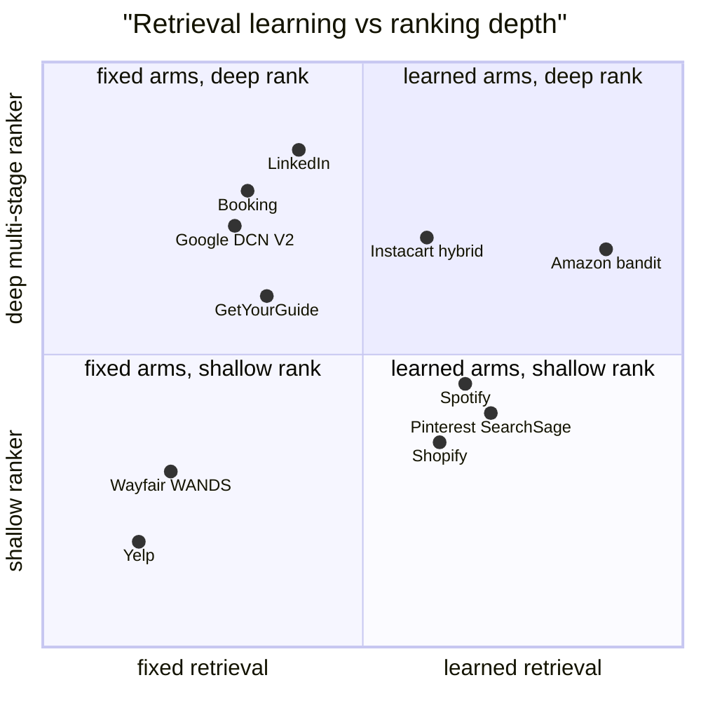
```mermaid
quadrantChart
  title "Retrieval learning vs ranking depth"
  x-axis "fixed retrieval" --> "learned retrieval"
  y-axis "shallow ranker" --> "deep multi-stage ranker"
  quadrant-1 "learned arms, deep rank"
  quadrant-2 "fixed arms, deep rank"
  quadrant-3 "fixed arms, shallow rank"
  quadrant-4 "learned arms, shallow rank"
  "Yelp": [0.15, 0.18]
  "Wayfair WANDS": [0.20, 0.30]
  "Google DCN V2": [0.30, 0.72]
  "GetYourGuide": [0.35, 0.60]
  "Booking": [0.32, 0.78]
  "LinkedIn": [0.40, 0.85]
  "Instacart hybrid": [0.60, 0.70]
  "Shopify": [0.62, 0.35]
  "Spotify": [0.66, 0.45]
  "Pinterest SearchSage": [0.70, 0.40]
  "Amazon bandit": [0.88, 0.68]
```

**When to use which.** Choose the retrieval arm, the ranking loss, and the debias tool from query mix, label budget, and how much of your signal is logged clicks.

| Reach for | When | Instead of |
|---|---|---|
| Lexical BM25 arm | queries hit product codes, rare exact strings, and precise terms | a semantic-only stack, which drifts on exact matches |
| Add a semantic two-tower arm (Spotify, Pinterest) | synonyms, paraphrases, and multilingual intent open a vocabulary gap | lexical alone, which misses non-literal matches |
| Reciprocal rank fusion (RRF) | you union two arms whose score scales are not comparable | feeding raw mixed scores straight into the ranker |
| Listwise or pairwise LambdaMART | the metric is position-weighted NDCG and order at the top dominates | pointwise regression, which optimizes absolute scores list-deep |
| Pointwise regression (Yelp) | the task is essentially match-or-not per candidate | LambdaMART, when ordering many candidates is the real job |
| Inverse-propensity weighting (GetYourGuide, Amazon) | you train on logged clicks biased by where results were shown | trusting raw clicks, which teach the model to predict rank |
| Human-judged labels (Wayfair WANDS, LinkedIn) | you have annotation budget and want to sidestep exposure bias | click labels, when volume and freshness outweigh cleanliness |
| NDCG offline | a fast pre-gate on graded relevance before spending live traffic | NDCG as the ship gate; use interleaving or an A/B test for that |

**Interview watch-outs.**

- **Position bias is the headline trap.** Naive click training teaches the model to predict rank, not relevance, and locks in whatever order you already shipped. Reach for inverse-propensity weighting or position-as-a-train-time-feature (fixed at serving), and inject a little randomization so you can keep estimating propensities. GetYourGuide bakes it into a position-discounted feature; Amazon uses controlled exploration.
- **Name your label source and its bias.** Clicks are abundant but exposure-biased, human judgments are clean but scarce and slow, conversions and bookings are truthful but sparse and optimize buying rather than relevance. The strong answer fuses them: human judgments anchor and validate, engagement provides volume and freshness.
- **Offline NDCG can lie.** It is computed against labels that are themselves biased clicks plus a thin layer of human judgments, so a lift there routinely fails to survive online. Wire NDCG as a fast offline pre-gate and make the ship decision an interleaving experiment or an A/B test on engagement and reformulation rate.
- **Point-in-time correctness is load-bearing.** Bookings and clicks happen after the ranking event, so a join by key alone leaks future labels into features. Assemble the training set with point-in-time joins (GetYourGuide, LinkedIn both flag this) or the offline metric is inflated.
- **Match the loss to the metric.** Pointwise regression optimizes absolute scores everywhere, including deep in the list where it does not matter; the metric is about order and is position-weighted, so pairwise (RankNet) or listwise (LambdaMART targets NDCG directly) is the senior default. Yelp gets away with pointwise only because its task is essentially match-or-not per candidate.
- **Neither retrieval arm is optional.** Lexical alone misses synonyms and paraphrases (the vocabulary gap); semantic alone drifts on rare terms, exact strings, and product codes. Fuse both, and normalize scores or fuse by rank (RRF) before the ranker sees a mixed set.

**The systems**

- **Wang et al.** [DCN V2: Improved Deep & Cross Network](https://arxiv.org/abs/2008.13535): Explicit, efficient feature crosses in a ranking model used at web scale. *(ranking model)*
- **Cheng et al.** [Wide & Deep Learning](https://arxiv.org/abs/1606.07792): Memorization (wide linear over crossed features) plus generalization (deep net) for ranking. *(ranking model)*
- **Burges** "From RankNet to LambdaRank to LambdaMART: An Overview": the canonical learning-to-rank reference, walking from a pairwise RankNet loss to LambdaRank's NDCG-weighted gradients to the LambdaMART tree ensemble. The clearest single source on why ranking losses are pairwise and listwise rather than pointwise. *(learning-to-rank)*
- **Amazon** [From structured search to learning-to-rank-and-retrieve](https://www.amazon.science/blog/from-structured-search-to-learning-to-rank-and-retrieve): Unifies retrieval and ranking via learning-to-rank-and-retrieve with contextual bandits. *(product design)*
- **LinkedIn** [Improving Post Search at LinkedIn](https://www.linkedin.com/blog/engineering/search/improving-post-search-at-linkedin): Multi-stage retrieval plus learning-to-rank for member post search. *(product design)*
- **Pinterest** [SearchSage: learning search query representations](https://medium.com/pinterest-engineering/searchsage-learning-search-query-representations-at-pinterest-654f2bb887fc): A query embedding model powering search retrieval and ranking relevance. *(deployment)*
- **Instacart** [Optimizing search relevance using hybrid retrieval](https://tech.instacart.com/optimizing-search-relevance-at-instacart-using-hybrid-retrieval-88cb579b959c): Hybrid text plus embedding retrieval feeding two-stage ranking. *(deployment)*
- **Instacart** [Building the Intent Engine: query understanding with LLMs](https://company.instacart.com/tech-innovation/building-the-intent-engine-how-instacart-is-revamping-query-understanding-with-llms): An LLM-based query-understanding pipeline for intent and category mapping. *(product design)*
- **Yelp** [Learning to Rank for Business Matching](https://engineeringblog.yelp.com/2014/12/learning-to-rank-for-business-matching.html): Moving business matching from hand-tuned scoring to learning-to-rank. *(product design)*
- **Wayfair** [WANDS: a public e-commerce product-search relevance dataset](https://www.aboutwayfair.com/careers/tech-blog/wayfair-releases-wands-the-largest-and-richest-publicly-available-dataset-for-e-commerce-product-search-relevance): A public human-judged relevance-label dataset for search evaluation. *(eval bar)*
- **GetYourGuide** [Powering Millions of Real-Time Rankings with Production AI](https://www.getyourguide.careers/posts/powering-millions-of-real-time-rankings-with-production-ai): 30M+ daily ranking predictions served under 80ms, with a Tecton feature store, Airflow training, FastAPI/Kubernetes serving, and Arize drift and NDCG monitoring. *(deployment)*
- **Booking** [The Engineering Behind High-Performance Ranking Platform: A System Overview](https://medium.com/booking-com-development/the-engineering-behind-booking-coms-ranking-platform-a-system-overview-2fb222003ca6): System overview of Booking.com's ML ranking platform that personalizes search by scoring properties on user behavior and real-time price and availability signals. *(product design)*
- **Shopify** [How Shopify improved consumer search intent with real-time ML](https://shopify.engineering/how-shopify-improved-consumer-search-intent-with-real-time-ml): Semantic search using ML embeddings to understand consumer search intent beyond keyword matching for more relevant product results. *(deployment)*
- **Spotify** [Introducing Natural Language Search for Podcast Episodes](https://engineering.atspotify.com/2022/03/introducing-natural-language-search-for-podcast-episodes/): Deep-learning semantic search that matches natural-language queries to podcast episodes by meaning rather than exact keywords. *(product design)*

---

### [Fraud & anomaly detection](topics/08-fraud-and-anomaly-detection.md) · 16 systems

**What they share.** Every team scores a rare-positive fraud signal over engineered features and then acts under a cost-asymmetric threshold. They diverge on model family, how much they lean on labels, whether they reason over an entity graph, and what action the score triggers.

**The reference pipeline.** Strip the branding and every system is the same funnel: an event lands, real-time features (velocity aggregates plus graph and entity signals over shared devices, cards, and addresses) are assembled, a model scores it, a cost-sensitive threshold turns the score into allow, block, or route-to-review, analysts work the borderline queue, and their verdicts plus settled outcomes flow back as labels. The only fast feedback is the human queue; the ground-truth chargeback label closes the loop weeks later.

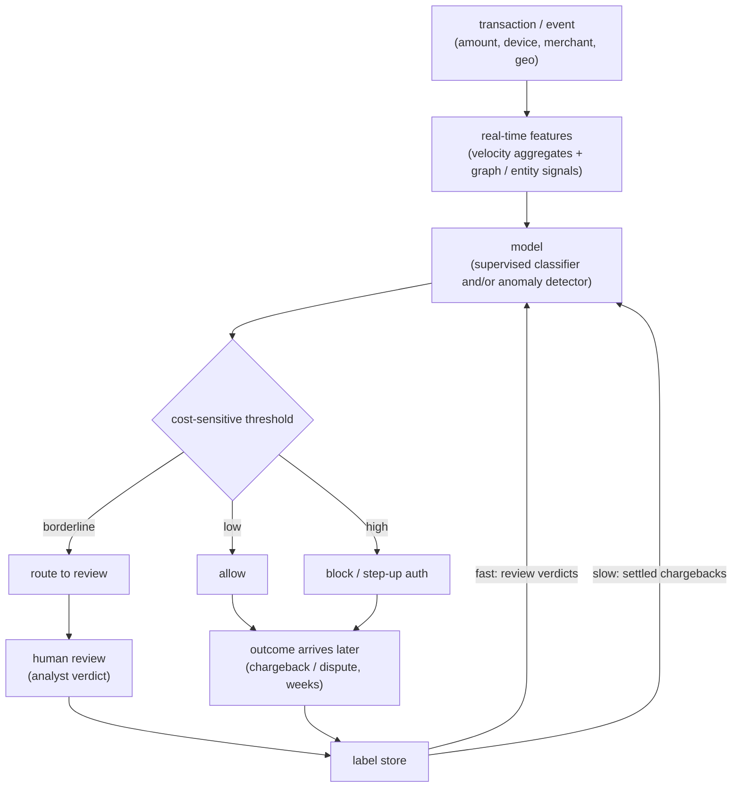
```mermaid
flowchart TD
  EV["transaction / event<br/>(amount, device, merchant, geo)"] --> FEAT["real-time features<br/>(velocity aggregates + graph / entity signals)"]
  FEAT --> MODEL["model<br/>(supervised classifier and/or anomaly detector)"]
  MODEL --> THRESH{"cost-sensitive threshold"}
  THRESH -->|"low"| ALLOW["allow"]
  THRESH -->|"high"| BLOCK["block / step-up auth"]
  THRESH -->|"borderline"| REVIEW["route to review"]
  REVIEW --> HUMAN["human review<br/>(analyst verdict)"]
  HUMAN --> LABELS["label store"]
  ALLOW --> OUTCOME["outcome arrives later<br/>(chargeback / dispute, weeks)"]
  BLOCK --> OUTCOME
  OUTCOME --> LABELS
  LABELS -->|"fast: review verdicts"| MODEL
  LABELS -->|"slow: settled chargebacks"| MODEL
```

**Reading the diagram.** Follow the funnel top to bottom: a raw transaction event (amount, device, merchant, geo) enters and is joined against real-time features, where velocity aggregates plus graph and entity signals over shared devices, cards, and addresses surface a coordinated ring that any single event hides. The model box (a supervised classifier, an unsupervised anomaly detector like Grab GraphBEAN, or both) turns that feature vector into a fraud score, and the whole design tension is that positives sit near a fraction of a percent, so accuracy is a lie and you handle the skew with class weights or focal loss and read PR-AUC. The cost-sensitive threshold is the actual product: rather than a default cutoff at one half, you block when the calibrated fraud probability clears c_FP divided by the sum of c_FP and c_FN, which drops well below one half when a missed fraud costs far more than a blocked good user, and it splits into an allow band, a block or step-up band, and a borderline band routed to analysts. Human review does triple duty, catching what the model is unsure about, generating the only fast labels you get, and feeding both model paths, while allowed and blocked events wait on settled outcomes. The failure mode baked into the loop is label delay: analyst verdicts return in minutes as a leading indicator, but the ground-truth chargeback lands weeks later, so you respect a maturation window, never treat unmatured recent data as legitimate, and remember you only see chargebacks on transactions you allowed, which is why teams like Stripe and PayPal lean on frequent retrains and a small randomized allow-through hold-out. The design leverage is that every box is swappable (model family, graph reliance, and threshold branches) but the funnel shape and the two-speed label loop stay fixed.

The teardowns below are variations on this skeleton: they swap the model box, decide how much of the feature box is graph versus per-transaction, and change what the threshold branches into.

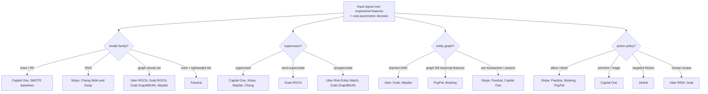
```mermaid
flowchart TD
  SPINE["fraud signal over engineered features<br/>+ cost-asymmetric decision"] --> MF{"model family?"}
  MF -->|"trees / RF"| TREES["Capital One, SMOTE baselines"]
  MF -->|"DNN"| DNN["Stripe, Cheng Wide and Deep"]
  MF -->|"graph neural net"| GNN["Uber RGCN, Grab RGCN, Grab GraphBEAN, Wayfair"]
  MF -->|"rules + lightweight ML"| RULES["Feedzai"]
  SPINE --> SUP{"supervision?"}
  SUP -->|"supervised"| S1["Capital One, Stripe, Wayfair, Cheng"]
  SUP -->|"semi-supervised"| S2["Grab RGCN"]
  SUP -->|"unsupervised"| S3["Uber Risk Entity Watch, Grab GraphBEAN"]
  SPINE --> G{"entity graph?"}
  G -->|"learned GNN"| G1["Uber, Grab, Wayfair"]
  G -->|"graph DB traversal features"| G2["PayPal, Booking"]
  G -->|"per-transaction / session"| G3["Stripe, Feedzai, Capital One"]
  SPINE --> A{"action policy?"}
  A -->|"allow / block"| A1["Stripe, Feedzai, Booking, PayPal"]
  A -->|"prioritize / triage"| A2["Capital One"]
  A -->|"targeted friction"| A3["Airbnb"]
  A -->|"human review"| A4["Uber REW, Grab"]
```

**The choices, side by side.**

| Decision | Options (who) | What decides it |
| --- | --- | --- |
| Model family | Random forest (Capital One) vs deep net (Stripe, Cheng) vs GNN (Uber, Grab, Wayfair) vs rules plus lightweight ML (Feedzai) | Explainability and audit needs push to trees; scale and raw signal push to DNN; ring or collusion structure pushes to GNN; latency at high rps pushes to lightweight stacks |
| Supervision | Supervised (Capital One, Stripe, Wayfair, Cheng) vs semi-supervised (Grab RGCN) vs unsupervised (Uber REW, Grab GraphBEAN) | Label availability and maturity; novel adversarial fraud with no labels forces anomaly or reconstruction methods |
| Graph / entity | Learned GNN over entities (Uber, Grab, Wayfair) vs graph-DB traversal features (PayPal, Booking) vs per-transaction or session (Stripe, Feedzai, Capital One) | Whether fraud is coordinated (shared cards, devices, addresses) vs a lone risky event; inline-latency budget for traversal |
| Action policy | Allow or block (Stripe, Feedzai, Booking, PayPal) vs prioritize or triage (Capital One) vs targeted friction (Airbnb) vs human review (Uber REW, Grab) | Cost of a false positive on a good user, and whether a human or a challenge step sits between score and outcome |

**The math that separates them.**

**Cost-asymmetric operating point (shared by all).** Choose the threshold that minimizes expected cost, not error rate:

$$L(\tau) = c_{FP} \cdot \mathrm{FP}(\tau) + c_{FN} \cdot \mathrm{FN}(\tau), \qquad \tau^{\star} = \arg\min_{\tau} L(\tau)$$

**Cost-optimal threshold in closed form (why 0.5 is wrong).** For a calibrated probability, block when the expected cost of allowing exceeds the expected cost of blocking, which reduces to a fixed probability cutoff:

$$\text{block when } p(\text{fraud} \mid x) \; \ge \; \frac{c_{FP}}{c_{FP} + c_{FN}}, \qquad \tau^{\star} = \frac{c_{FP}}{c_{FP} + c_{FN}}$$

When a missed fraud costs far more than a blocked good user (large $c_{FN}$), the cutoff drops well below 0.5 and the system catches more at the price of more false alarms.

**PR-AUC (average precision), the metric that survives a 0.2 percent base rate.** Summarize the precision-recall curve as a recall-weighted sum of precision, which ROC-AUC cannot do once the true-negative mass dwarfs the positives:

$$\mathrm{AP} = \sum_{k} \left( R_k - R_{k-1} \right) \cdot P_k, \qquad P_k = \frac{\mathrm{TP}_k}{\mathrm{TP}_k + \mathrm{FP}_k}, \quad R_k = \frac{\mathrm{TP}_k}{\mathrm{TP}_k + \mathrm{FN}_k}$$

**Focal loss (down-weight the easy legit majority).** An alternative to resampling that shrinks the loss on well-classified examples so the rare fraud class dominates the gradient:

$$\mathrm{FL}(p_t) = -\, \alpha_t \, \left( 1 - p_t \right)^{\gamma} \log(p_t), \qquad p_t = \begin{cases} p & y = 1 \\ 1 - p & y = 0 \end{cases}$$

The modulating factor $(1 - p_t)^{\gamma}$ goes to zero for confident correct predictions, so an easy legitimate transaction contributes almost nothing while a hard or misclassified fraud keeps full weight.

**Airbnb three-action loss (friction as a middle option).** A friction term recovers good users that a hard block would have lost:

$$L = \mathrm{FP}\cdot G \cdot V + \mathrm{FN}\cdot C + \mathrm{TP}\cdot(1-F)\cdot C$$

**RGCN relation-specific message passing (Uber, Grab).** Each edge type gets its own transform, so a shared device and a shared city carry different weight:

$$h_i^{(l+1)} = \sigma\left(W_0^{(l)} h_i^{(l)} + \sum_{r \in R}\sum_{j \in N_i^{r}} \frac{1}{|N_i^{r}|} W_r^{(l)} h_j^{(l)}\right)$$

**GraphBEAN reconstruction anomaly (Grab, unsupervised).** Score is reconstruction error over node and edge attributes plus structure, so the rare reconstructs poorly:

$$s(v) = \lVert x_v - \hat{x}_v \rVert^2 + \sum_{e \ni v}\lVert a_e - \hat{a}_e \rVert^2 + \mathrm{BCE}(A, \hat{A})$$

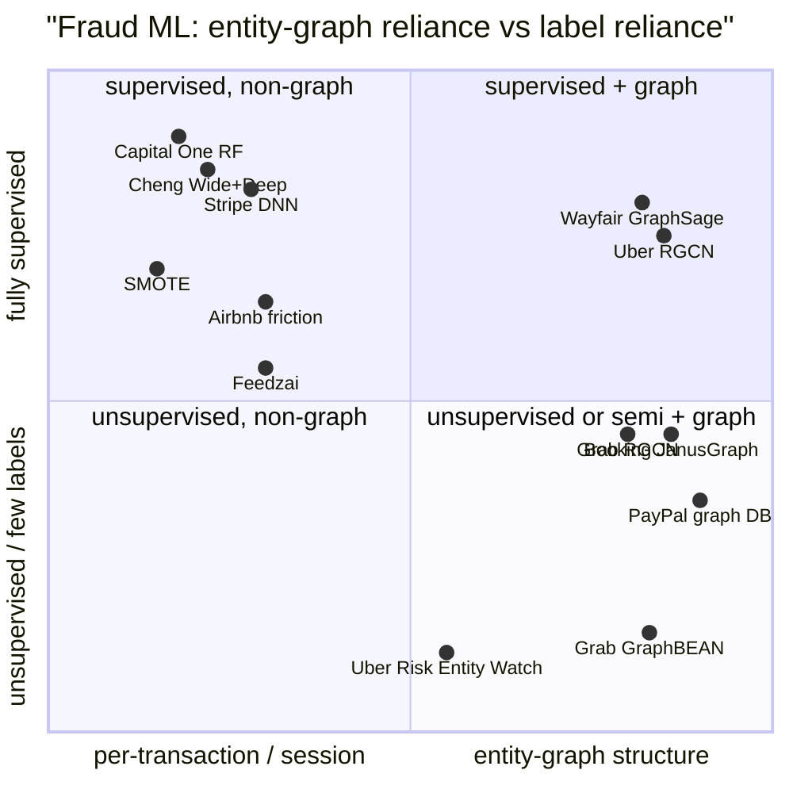
```mermaid
quadrantChart
  title "Fraud ML: entity-graph reliance vs label reliance"
  x-axis "per-transaction / session" --> "entity-graph structure"
  y-axis "unsupervised / few labels" --> "fully supervised"
  quadrant-1 "supervised + graph"
  quadrant-2 "supervised, non-graph"
  quadrant-3 "unsupervised, non-graph"
  quadrant-4 "unsupervised or semi + graph"
  "Capital One RF": [0.18, 0.9]
  "Stripe DNN": [0.28, 0.82]
  "Cheng Wide+Deep": [0.22, 0.85]
  "Feedzai": [0.3, 0.55]
  "SMOTE": [0.15, 0.7]
  "Wayfair GraphSage": [0.82, 0.8]
  "Uber RGCN": [0.85, 0.75]
  "PayPal graph DB": [0.9, 0.35]
  "Booking JanusGraph": [0.86, 0.45]
  "Grab RGCN": [0.8, 0.45]
  "Grab GraphBEAN": [0.83, 0.15]
  "Uber Risk Entity Watch": [0.55, 0.12]
  "Airbnb friction": [0.3, 0.65]
```

**When to use which.** Pick the model, the loss, and the operating point from label maturity, fraud structure, and cost asymmetry.

| Reach for | When | Instead of |
|---|---|---|
| Random forest (Capital One) | you need explainability and audit trails on per-transaction signal | a GNN, when fraud is coordinated rings rather than lone events |
| GNN or RGCN (Uber, Grab) | fraud is a ring over shared cards, devices, and addresses | per-transaction models (Stripe, Feedzai), which miss collusion structure |
| Graph-DB traversal features (PayPal, Booking) | you want ring signal without training and serving a GNN inline | a learned GNN, when the inline latency budget allows one |
| Unsupervised GraphBEAN reconstruction (Grab) | novel adversarial fraud with no labels yet | a supervised classifier, which needs matured chargeback labels |
| PR-AUC (average precision) | positives sit near a fraction of a percent and true negatives dominate | ROC-AUC or accuracy, which a never-fraud model games at 99.8 percent |
| Focal loss or class weights | you want to fix skew inside the loss, on the true base rate | SMOTE resampling, which distorts calibration and the base rate |
| Cost-optimal cutoff c_FP/(c_FP+c_FN) | the score is a calibrated probability and costs are asymmetric | a default 0.5 threshold, which ignores the miss-vs-false-alarm gap |
| Targeted friction, Airbnb three-action loss | a hard block on a good user is too costly to accept | binary allow or block, when a step-up challenge can recover the user |

**Interview watch-outs.** The traps that separate a leaderboard answer from a systems answer:

- **Imbalance kills accuracy.** At a 0.2 percent base rate a "never fraud" model scores 99.8 percent and catches nothing. Lead with PR-AUC plus precision and recall at the operating point, handle the skew with class weights or focal loss before reaching for SMOTE, and always evaluate on the true base rate, never on a rebalanced set.
- **Label delay poisons train and eval.** Chargebacks land 30 to 120 days late, so recent transactions have no mature label. Respect a maturation window, treat fast review verdicts as a leading indicator, reconcile against settled labels, and never treat unmatured recent data as legitimate.
- **The adversary makes drift the default.** Fraud shifts on purpose the moment a tactic stops working, so a great model decays as steady state. Expect short retrain cadence, input and score-distribution drift alarms as a safety system, and an anomaly path for attacks with no labels yet.
- **Calibration gates the threshold.** The cost-optimal cutoff $c_{FP}/(c_{FP}+c_{FN})$ only holds if the score is a true probability. Joint logits (wide-and-deep), tree ensembles, and resampled training all distort calibration, so calibrate before you threshold on cost.
- **The block-side blind spot.** You only see chargebacks on transactions you allowed; blocked-good transactions never generate a label, so the model can never learn it was wrong to block. Mitigate with a small randomized allow-through hold-out and lean on review verdicts.
- **Graph edges carry noise.** Shared-attribute edges expose rings but incidental shared identifiers (public Wi-Fi, a recycled IP) inflate false links. Prune high-degree nodes, bound traversal depth for the p99 budget, and keep node features in rather than trusting topology alone.

**The systems**

- **Chawla et al.** [SMOTE: Synthetic Minority Over-sampling Technique](https://arxiv.org/abs/1106.1813): the classic approach to extreme class imbalance, synthesizing minority samples instead of naive oversampling. *(class imbalance)*
- **Cheng et al.** [Wide & Deep Learning](https://arxiv.org/abs/1606.07792): the sparse-embedding-plus-dense tabular shape fraud models often use when they go deep. *(model)*
- **Stripe** [Radar engineering writeups](https://stripe.com/blog): how Stripe scores card fraud in real time with continuously retrained models. *(deployment)*
- **PayPal** [engineering blog](https://medium.com/paypal-tech): real-time fraud and risk modeling at payment scale, including graph and streaming signals. *(real-time features)*
- **Airbnb** [fraud and trust engineering](https://medium.com/airbnb-engineering): risk and abuse modeling with human review loops and graph signals. *(human review)*
- **Stripe** [How we built it: Stripe Radar](https://stripe.dev/blog/how-we-built-it-stripe-radar): ML architecture evolution, feature discovery, and explainability at sub-100ms. *(product design)*
- **PayPal** [Real-time graph database and analysis to fight fraud](https://medium.com/paypal-tech/how-paypal-uses-real-time-graph-database-and-graph-analysis-to-fight-fraud-96a2b918619a): A custom sub-second, million-QPS graph DB for real-time fraud queries. *(deployment)*
- **Uber** [Relational Graph Learning to Detect Collusion](https://www.uber.com/blog/fraud-detection/): An RGCN over the rider-driver graph; +15% precision feeding downstream risk models. *(product design)*
- **Uber** [Risk Entity Watch: anomaly detection to fight fraud](https://www.uber.com/us/en/blog/risk-entity-watch/): Unsupervised anomaly detection scoring entities without labels across business lines. *(product design)*
- **Grab** [Unsupervised graph anomaly detection for new fraud](https://engineering.grab.com/graph-anomaly-model): A GraphBEAN autoencoder on bipartite graphs catches novel fraud without labels. *(product design)*
- **Grab** [Graph for fraud detection](https://engineering.grab.com/graph-for-fraud-detection): RGCN exploits shared-device/address correlations; less labeled data, explainable clusters. *(product design)*
- **Airbnb** [Fighting Financial Fraud with Targeted Friction](https://medium.com/airbnb-engineering/fighting-financial-fraud-with-targeted-friction-82d950d8900e): A loss function weighing friction vs chargeback cost; targeted friction cuts losses. *(eval bar)*
- **Feedzai** [Building Trust in a Digital World: The Role of Machine Learning in Behavioral Biometrics](https://medium.com/feedzaitech/building-trust-in-a-digital-world-the-role-of-machine-learning-in-behavioral-biometrics-bb0da913d95a): behavioral-biometric signals (device, interaction patterns) scored across millions of sessions daily at low latency to flag banking fraud. *(product design)*
- **Capital One** [How Machine Learning Can Help Fight Money Laundering](https://www.capitalone.com/tech/machine-learning/how-machine-learning-can-help-fight-money-laundering/): a random forest scoring suspicious activity over hundreds of features to prioritize risk-based AML investigations instead of sequential alert triage. *(eval bar)*
- **Wayfair** [Preventing Policy Abuse with Graph Neural Networks](https://www.aboutwayfair.com/careers/tech-blog/preventing-policy-abuse-with-graph-neural-networks): a GNN links account-hopping fraudsters through shared payment methods and devices to catch repeat abuse across new accounts. *(product design)*
- **Booking** [Leverage graph technology for real-time Fraud Detection and Prevention](https://medium.com/booking-com-development/leverage-graph-technology-for-real-time-fraud-detection-and-prevention-438336076ea5): a JanusGraph/Cassandra store runs real-time BFS to extract network features (hops-to-fraud) feeding the model at p99 300ms. *(deployment)*

---

### [Content moderation and trust and safety](topics/16-content-moderation.md) · 11 systems

**What they share.** Every system scores user content or accounts for a policy violation and must hold a fixed precision floor, because a false positive silences a real user or blocks a legitimate invite. They diverge on modality, whether the decision is a learned classifier or a hash-match, whether it fires before or after the content spreads, and where the human sits.

**The reference pipeline.** Strip away the company-specific choices and every stack above is the same funnel: hash-match the known mass, run a per-policy classifier on the novel tail, let a policy engine turn scores into actions, route the uncertain middle to humans, and feed every human decision back as a label. This is the canonical shape each teardown is a variation on.

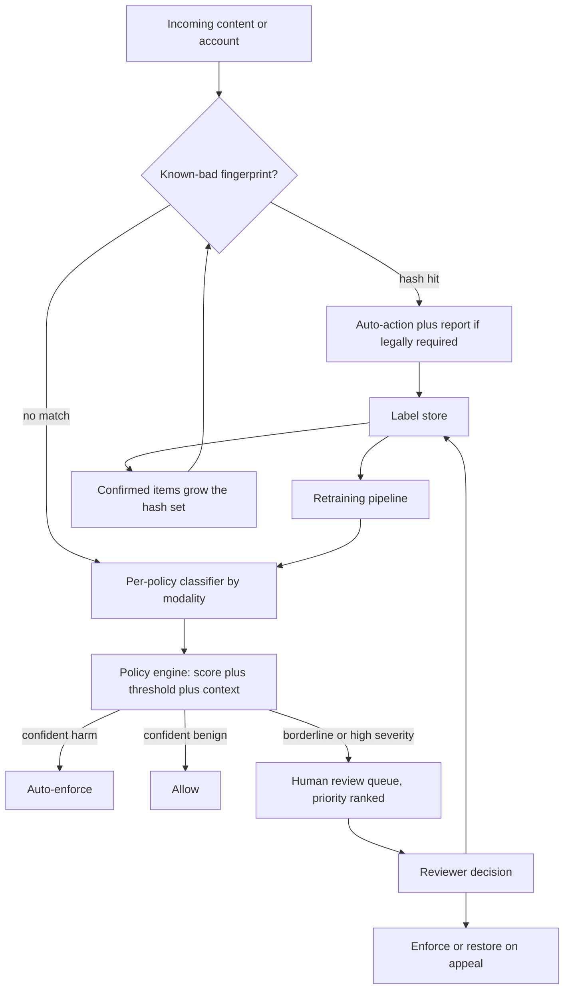
```mermaid
flowchart TD
    A[Incoming content or account] --> B{Known-bad fingerprint?}
    B -->|hash hit| C[Auto-action plus report if legally required]
    B -->|no match| D[Per-policy classifier by modality]
    D --> E[Policy engine: score plus threshold plus context]
    E -->|confident harm| F[Auto-enforce]
    E -->|confident benign| G[Allow]
    E -->|borderline or high severity| H[Human review queue, priority ranked]
    H --> I[Reviewer decision]
    I --> J[Enforce or restore on appeal]
    I --> K[Label store]
    C --> K
    K --> L[Retraining pipeline]
    L --> D
    K --> M[Confirmed items grow the hash set]
    M --> B
```

**Reading the diagram.** Content enters at the top and the first gate is a fingerprint lookup: perceptual hashing (Google CSAI Match, PhotoDNA) catches previously judged material like known CSAM, terrorist media, and re-uploaded spam campaigns, so the known mass is auto-actioned for near zero cost and, where the law requires, reported, its failure mode being blindness to anything novel it has never seen. Whatever misses the hash set flows into per-policy classifiers chosen by modality (a text encoder such as BERT, an image backbone such as EfficientNet, a joint image-plus-text fusion for hateful memes, a distilled audio model for Roblox-style live voice), each calibrated to its own precision floor because a false positive silences a real user while a miss can be irreversible. The policy engine then folds score, threshold, and context into one of three routes, auto-enforce on the confident harmful tail, allow on the confident benign tail, and everything borderline or high severity into a human queue that is priority ranked by severity times reach so scarce reviewer minutes hit the worst items first. Reviewers resolve the hard middle, restore on appeal (a restored item is a confirmed false positive), and every one of their decisions drops into the label store as a gold label drawn from exactly the distribution the models find hardest. Two loops close from there: labels feed the retraining pipeline so classifiers track adversarial drift, and confirmed items grow the hash set so the next occurrence is caught upstream for free. The design leverage is in where you place the thresholds and the human queue, since raising auto-enforce precision starves appeals but over-flagging starves reviewers, and the human loop is the core of the system rather than a fallback.

**Where they diverge.**

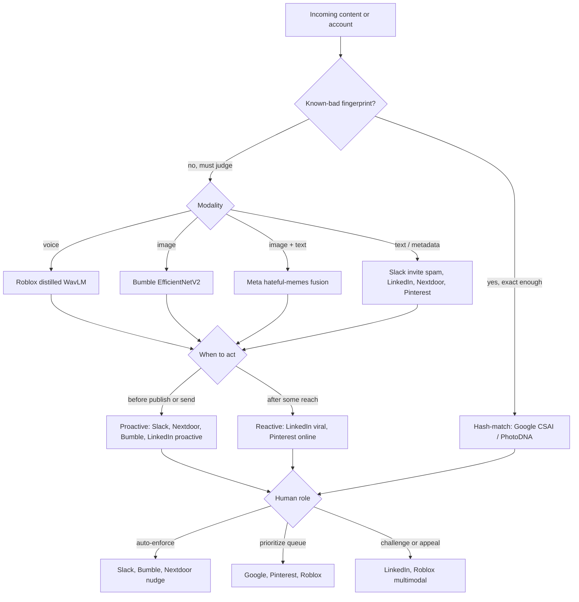
```mermaid
flowchart TD
    A[Incoming content or account] --> B{Known-bad fingerprint?}
    B -->|yes, exact enough| C[Hash-match: Google CSAI / PhotoDNA]
    B -->|no, must judge| D{Modality}
    D -->|voice| E[Roblox distilled WavLM]
    D -->|image| F[Bumble EfficientNetV2]
    D -->|image + text| G[Meta hateful-memes fusion]
    D -->|text / metadata| H[Slack invite spam, LinkedIn, Nextdoor, Pinterest]
    E --> I{When to act}
    F --> I
    G --> I
    H --> I
    I -->|before publish or send| J[Proactive: Slack, Nextdoor, Bumble, LinkedIn proactive]
    I -->|after some reach| K[Reactive: LinkedIn viral, Pinterest online]
    J --> L{Human role}
    K --> L
    C --> L
    L -->|auto-enforce| M[Slack, Bumble, Nextdoor nudge]
    L -->|prioritize queue| N[Google, Pinterest, Roblox]
    L -->|challenge or appeal| O[LinkedIn, Roblox multimodal]
```

**The choices, side by side.**

| Decision | Options (who) | What decides it |
| --- | --- | --- |
| Modality scored | Text/metadata (Slack invite spam, LinkedIn, Nextdoor, Pinterest), voice (Roblox), image (Bumble), image+text (Meta memes) | Where the harm lives; joint reasoning is needed only when neither modality is damning alone |
| Hash-match vs classifier | Hash-match for known-bad (Google CSAI), learned classifier for novel (Slack, Roblox, Bumble, Pinterest, LinkedIn) | Whether the material repeats exactly and the false-positive cost is legally unacceptable |
| Proactive vs reactive | Proactive at send or publish (Slack, Nextdoor, Bumble, LinkedIn proactive DNN), reactive on engagement (LinkedIn viral, Pinterest online-plus-batch) | Whether you can score before harm reaches an audience, or must watch the spread signal |
| Human routing | Auto-enforce (Slack, Bumble, Nextdoor), prioritize-then-review (Google, Pinterest, Roblox), challenge or appeal (LinkedIn, Roblox multimodal) | The cost of a wrong auto-action versus the volume a human queue can absorb |

**The math that separates them.** Each team fixes a precision floor and maximizes recall under it, since false positives block real users. Writing the operating point as a constrained argmax over the decision threshold makes the per-policy floor explicit:

$$\tau^{\star} \;=\; \text{arg max}_{\tau}\ \text{Recall}(\tau) \qquad \text{subject to}\qquad \text{Precision}(\tau)\ \ge\ P_{\min}^{(\text{policy})}$$

where precision and recall come from the confusion counts at that threshold:

$$\text{Precision}(\tau) \;=\; \frac{tp(\tau)}{tp(\tau)+fp(\tau)}, \qquad \text{Recall}(\tau) \;=\; \frac{tp(\tau)}{tp(\tau)+fn(\tau)}$$

The floor itself is not arbitrary. It falls out of a cost-weighted objective in which a missed harm and a false flag carry very different weights, and severe policies set the miss cost orders of magnitude above the false-flag cost:

$$\tau^{\star} \;=\; \text{arg min}_{\tau}\ \Big[\, c_{fn}\cdot fn(\tau) \;+\; c_{fp}\cdot fp(\tau) \,\Big], \qquad \frac{c_{fn}}{c_{fp}} \;\gg\; 1 \ \text{ for CSAM, terrorism, imminent violence}$$

A finite human queue turns routing into a second constrained problem: rank the uncertain middle by expected damage so scarce reviewer-minutes land on the worst items first:

$$\text{Priority}(x) \;=\; \text{Severity}(\text{policy})\ \times\ \text{Reach}(x), \qquad \text{review in order of decreasing } \text{Priority}$$

Slack judges the blocker by the acceptance rate of blocked invites, a proxy for how much of what it blocked was actually legitimate:

$$\text{FalseBlockProxy} \;=\; \frac{\lvert \text{accepted}\cap\text{blocked}\rvert}{\lvert \text{blocked}\rvert} \;=\; 0.03 \quad \text{versus}\quad 0.70 \ \text{ under manual rules}$$

Under a skewed base rate (Bumble at 0.1 percent positives) accuracy is useless: a model that flags nothing scores 99.9 percent, so the operating point is set on the precision-recall curve, never on accuracy.

```mermaid
quadrantChart
    title "Enforcement stance: harm speed vs cost of a false positive"
    x-axis "Reactive after reach" --> "Proactive before reach"
    y-axis "Prioritize for humans" --> "Auto-enforce"
    quadrant-1 "Auto-block pre-harm"
    quadrant-2 "Reactive auto-action"
    quadrant-3 "Reactive human queue"
    quadrant-4 "Proactive human queue"
    "Slack invite spam": [0.82, 0.80]
    "Bumble Private Detector": [0.78, 0.72]
    "Nextdoor nudge": [0.88, 0.65]
    "LinkedIn viral spam": [0.30, 0.55]
    "Pinterest online plus batch": [0.35, 0.45]
    "Roblox voice": [0.55, 0.40]
    "Google CSAI match": [0.60, 0.20]
```

**When to use which.** Let repeatability and legal cost pick hash vs classifier, let harm speed pick proactive vs reactive, and let the skewed base rate pick the metric.

| Reach for | When | Instead of |
|---|---|---|
| Perceptual hash-match (PhotoDNA, Google CSAI) | material repeats exactly and a false positive is legally unacceptable (CSAM, terrorist media) | a learned classifier scoring a threshold |
| Learned per-policy classifier | novel content the hash set has never seen (Slack, Roblox, Bumble, Pinterest, LinkedIn) | hashing alone, which is blind to anything new |
| Image-plus-text fusion | neither modality is damning alone (Meta hateful memes) | a single-modality text or image classifier |
| Proactive scoring at send or publish | you can score before harm reaches an audience (Slack, Nextdoor, Bumble, LinkedIn proactive) | reactive scoring that waits for spread |
| Reactive on the engagement signal | harm needs a reach signal to surface (LinkedIn viral, Pinterest online-plus-batch) | pre-publish scoring with no spread evidence |
| Auto-enforce | the precision floor is high and a wrong auto-action is cheap (Slack, Bumble, Nextdoor) | routing everything through a human queue |
| Priority equals severity times reach | a finite reviewer queue must clear the uncertain middle (Google, Pinterest, Roblox) | FIFO or random review order |
| Recall at a fixed precision floor, read off the PR curve | a skewed base rate (Bumble at 0.1 percent positives) | accuracy or blind F1, which a flag-nothing model games |
| Cost-weighted threshold with miss cost far above false-flag cost | severe policies (CSAM, terrorism, imminent violence) | a symmetric cutoff that treats a miss like a false flag |

**Interview watch-outs.**

- **State the precision floor before any model.** The objective is recall at a fixed per-policy precision floor, not accuracy and not blind F1. A single accuracy or AUC number on skewed data (Bumble at 0.1 percent positives) is the fastest way to fail the signal check; report recall at precision P per policy instead.
- **Auto-action only the confident tail.** The floor is high for auto-enforce policies and the uncertain middle routes to humans. CSAM does not auto-action on a classifier score at all: it hashes for known material and routes novel content to expert review, because the false-positive cost is legally unacceptable.
- **Assume adversarial drift.** The threat model is non-stationary. A sudden drop in a policy's flag rate is as likely to be a successful new evasion as a genuine drop in harm, so alert on both directions. Defenses are process (adversarial augmentation, continuous retraining on fresh labels, perceptual hashing, red-teaming), not one trick.
- **Treat the human loop as the core, not a fallback.** Every reviewer decision is a gold label drawn from exactly the hard distribution the models miss. Reviewer capacity is the real ceiling, so model precision and queue load are coupled: over-flagging directly starves the queue. Priority-rank by severity times reach.
- **Guard the audit sample.** If you only label the uncertain middle you routed to humans, you can no longer measure true recall on the full distribution. Keep a random, independently labeled audit stream and watch for feedback-loop poisoning via mass false-reporting.
- **Own the over-censorship failure.** At scale even a low false-positive rate silences a large absolute number of real users and floods appeals. Handle borderline content (satire, reclaimed slurs, counter-speech, news, educational nudity) with soft enforcement or pre-post nudges rather than removal, and make appeals fast, since a restored item is a confirmed false positive and a free label.

**The systems**

- **Roblox** [Deploying ML for Voice Safety](https://about.roblox.com/newsroom/2024/07/deploying-ml-for-voice-safety): A distilled transformer audio model flags policy-violating voice chat in real time. *(deployment)*
- **Roblox** [How Roblox Uses AI to Moderate Content on a Massive Scale](https://about.roblox.com/newsroom/2025/07/roblox-ai-moderation-massive-scale): Billions of daily messages moderated across 25 languages, AI plus human. *(deployment)*
- **Pinterest** [Fighting misinformation, hate speech, and self-harm content with ML](https://medium.com/pinterest-engineering/how-pinterest-fights-misinformation-hate-speech-and-self-harm-content-with-machine-learning-1806b73b40ef): Batch and online ML models score Pins and boards for policy violations. *(product design)*
- **Pinterest** [Pinqueue3.0, Pinterest's next-gen content moderation platform](https://medium.com/pinterest-engineering/introducing-pinqueue3-0-pinterests-next-gen-content-moderation-platform-fcfa972bf39c): A human review and labeling platform feeding high-quality labels to ML. *(deployment)*
- **LinkedIn** [Automated Fake Account Detection at LinkedIn](https://www.linkedin.com/blog/engineering/trust-and-safety/automated-fake-account-detection-at-linkedin): A funnel of registration scoring, cluster detection, and activity models. *(deployment)*
- **LinkedIn** [Viral spam content detection at LinkedIn](https://www.linkedin.com/blog/engineering/trust-and-safety/viral-spam-content-detection-at-linkedin): Proactive versus reactive classifiers curb the spread of viral spam posts. *(eval bar)*
- **Bumble** [Open-sourcing Private Detector](https://medium.com/bumble-tech/bumble-inc-open-sources-private-detector-and-makes-another-step-towards-a-safer-internet-for-women-8e6cdb111d81): An EfficientNetV2 classifier detects and blurs unsolicited lewd images. *(who it serves)*
- **Meta AI** [Hateful Memes Challenge and dataset](https://ai.meta.com/blog/hateful-memes-challenge-and-data-set/): A benchmark forcing joint image-text reasoning to detect hateful memes. *(eval bar)*
- **Google** [Child safety toolkit: Content Safety API and CSAI Match](https://protectingchildren.google/tools-for-partners/): AI classifiers plus hash-matching prioritize and detect CSAM for partners. *(deployment)*
- **Nextdoor** [A feature to promote kindness in neighborhoods](https://blog.nextdoor.com/2019/09/18/announcing-our-new-feature-to-promote-kindness-in-neighborhoods): An ML Kindness Reminder nudges users to edit offensive comments before posting. *(product design)*
- **Slack** [Blocking Slack Invite Spam With Machine Learning](https://slack.engineering/blocking-slack-invite-spam-with-machine-learning/): Sparse logistic regression auto-detects and blocks spam invitations, replacing manual rules. *(deployment)*

---

### [Speech and audio](topics/17-speech-and-audio.md) · 11 systems

**What they share.** Every system captures 16 kHz audio, frames it, and turns it into log-mel features before a task-specific head. They diverge on causality (can it see future audio), where compute runs, and which metric gates release.

**The reference pipeline.** Strip away the task-specific heads and every recognizer walks the same canonical ASR path: raw audio becomes frames, frames become features, an acoustic or sequence model scores them, and a decoder turns scores into text. Streaming and batch differ only in whether the model can see future frames before the decoder commits.

```mermaid
flowchart TD
  A[Mic 16 kHz waveform] --> B[Frame + window, 10 to 25 ms hops]
  B --> C[Feature: log-mel spectrogram or raw-waveform encoder]
  C --> D[Acoustic / sequence model: CTC, RNN-T, or Conformer seq2seq]
  D --> E{Causal?}
  E -- streaming, no future frames --> F[Greedy or small-beam decode, emit partials]
  E -- batch, full utterance --> G[Beam search decode, optional external LM]
  F --> H[Transcript + endpoint]
  G --> I[Transcript, punctuation, casing]
```

**Reading the diagram.** Start at the mic: raw audio is captured at 16 kHz and framed into short overlapping windows (10 to 25 ms hops), because a recognizer scores fixed-length chunks, not a continuous stream, and the hop size trades time resolution against compute. Each frame becomes features, usually a log-mel spectrogram or a learned raw-waveform encoding, which compresses the signal into the acoustic cues a model can separate while discarding phase and loudness noise. The acoustic or sequence model (CTC, RNN-T, or a Conformer seq2seq) scores those features into token probabilities, and this is where the first hard fork lives: a causal streaming model like Google Gboard's on-device RNN-T can never see future frames and must commit left to right under a roughly 300 ms first-partial budget, while a batch encoder-decoder like AssemblyAI's Conformer or OpenAI's Whisper attends over the whole clip and self-corrects at the cost of latency. The decoder then turns scores into text: streaming does greedy or small-beam decoding and emits revisable partials plus an endpoint decision, whereas batch runs wider beam search with an optional external language model and restores punctuation and casing. Two failure modes dominate here: a single aggregate WER hides mangled names, numbers, and per-accent gaps so you slice it and report entity and numeric error separately, and endpointing is invisible to WER yet makes the product feel broken when it cuts users off or hangs on trailing silence. The design leverage is choosing where each stage runs, since an on-device path lives inside a memory and power envelope (int8 quantization, bounded beam width, no audio logging for retraining) while heavy or long-audio compute goes to the cloud where a second-stage verifier can fire rarely.

```mermaid
flowchart TD
  A[Mic 16 kHz] --> B[Frame + log-mel features]
  B --> C{Task?}
  C -- transcribe --> D{Causal?}
  C -- trigger phrase --> E{On-device budget?}
  C -- who spoke when --> F[Diarization: embed + sparse factor: Spotify]
  C -- text to speech --> G[Acoustic model + vocoder: Google Tacotron 2]
  D -- must commit now --> H[Streaming RNN-T: Google Gboard 80MB]
  D -- see whole clip --> I[Batch encoder-decoder: AssemblyAI Conformer, OpenAI Whisper]
  E -- tens of KB to few MB --> J[Loose detector + cloud verify: Amazon, Apple]
```

**The choices, side by side.**

| Decision | Options (who) | What decides it |
| --- | --- | --- |
| task | `ASR` vs `wake-word` (Amazon/Apple) vs `TTS` (Google) vs `diarization` (Spotify) | What the product needs: a transcript, a trigger bit, generated speech, or "who spoke when". Each is a different model family, head, and metric |
| architecture | `RNN-T` (Google) vs `Conformer` (AssemblyAI) vs `Whisper seq2seq` (OpenAI) | Streaming forces a monotonic transducer with no external LM; batch accuracy favors conv+attention Conformer; zero-shot breadth favors weakly-supervised multitask seq2seq |
| streaming vs batch | `streaming` (Google RNN-T, Amazon/Apple wake) vs `batch` (AssemblyAI, OpenAI, Spotify, Tacotron) | Live dictation needs a first partial under ~300 ms so it cannot see future audio and must commit; uploads attend over the whole clip and self-correct |
| on-device vs server | `on-device` (Google 80MB RNN-T, Apple 4x256 DNN, VoiceFilter-Lite 2.2MB) vs `server` (AssemblyAI 650K hrs, OpenAI 1.55B, Amazon cloud verifier) | Always-on and privacy paths run on the phone inside a memory/power envelope; heavy or long-audio compute goes to the cloud, where a second stage fires rarely |

**The math that separates them.**

$$\textbf{Word error rate:}\quad \mathrm{WER} = \frac{S + I + D}{N}$$

where $S$, $I$, $D$ are substituted, inserted, and deleted words and $N$ is reference-word count. Character error rate swaps words for characters and is the fairer cross-language signal.

$$\textbf{Wake-word operating point:}\quad \mathrm{FA/hr},\quad \mathrm{FRR} = \frac{\text{missed triggers}}{\text{true triggers}}$$

$$\textbf{False-accept rate:}\quad \mathrm{FAR} = \frac{\text{wrong activations}}{\text{negative trials}}$$

$$\textbf{Equal error rate (Apple):}\quad \mathrm{FAR}(\lambda) = \mathrm{FRR}(\lambda)$$

$$\textbf{Speaker match (cosine):}\quad s = \frac{\mathbf{e}\cdot\mathbf{p}}{\lVert\mathbf{e}\rVert \, \lVert\mathbf{p}\rVert} > \lambda$$

$$\textbf{Real-time factor:}\quad \mathrm{RTF} = \frac{T_{\text{compute}}}{T_{\text{audio}}}$$

$\mathrm{RTF} < 1$ means the model runs faster than real time, the hard gate for streaming on a single low-power core.

$$\textbf{Diarization error rate:}\quad \mathrm{DER} = \frac{T_{\text{miss}} + T_{\text{false}} + T_{\text{confusion}}}{T_{\text{total}}}$$

```mermaid
quadrantChart
  title Accuracy vs compute-latency cost
  x-axis "Low compute / low latency" --> "High compute / high latency"
  y-axis "Lower accuracy" --> "Higher accuracy"
  quadrant-1 "Heavy and accurate"
  quadrant-2 "Cheap and strong"
  quadrant-3 "Cheap and loose"
  quadrant-4 "Costly, task-limited"
  "Whisper seq2seq (OpenAI)": [0.85, 0.82]
  "Conformer batch (AssemblyAI)": [0.70, 0.90]
  "RNN-T on-device (Google)": [0.30, 0.72]
  "Wake word (Amazon/Apple)": [0.12, 0.45]
  "Diarization (Spotify)": [0.60, 0.60]
  "Tacotron 2 TTS (Google)": [0.75, 0.80]
```

**When to use which.** Let the latency budget pick streaming vs batch, let the power envelope pick on-device vs server, and let the task pick the metric that gates release.

| Reach for | When | Instead of |
|---|---|---|
| Streaming RNN-T transducer | live dictation needs a first partial under roughly 300 ms (Google Gboard) | a batch encoder-decoder that must see the whole clip |
| Batch Conformer or Whisper seq2seq | the full utterance is available and accuracy or zero-shot breadth beats latency (AssemblyAI, OpenAI) | a causal streaming model that cannot self-correct |
| On-device int8-quantized model | always-on or privacy paths inside a memory and power envelope (Google 80MB, Apple, VoiceFilter-Lite) | a heavy cloud model for an always-on trigger |
| Loose detector plus cloud verifier | wake-word: a loose first stage kills false rejects, a rare second stage kills false accepts (Amazon, Apple) | one heavy always-on model doing both jobs |
| WER, sliced with entity and numeric error reported | grading transcription quality | a single aggregate WER that hides mangled names and numbers |
| CER (character error rate) | fair cross-language comparison across scripts | WER, which penalizes morphologically rich languages unfairly |
| FA per hour and FRR, tuned to equal error rate | setting a wake-word operating point (Apple EER) | precision and recall, which ignore the per-hour ambient rate |
| Real-time factor below 1 | gating a streaming model on a single low-power core | offline accuracy alone with no throughput gate |
| Diarization error rate | scoring who-spoke-when (Spotify) | WER, which says nothing about speaker turns |

**Interview watch-outs.**

- **Streaming vs batch is the first fork, not a flag.** Streaming (CTC, RNN-T) is causal and commits left to right under a ~300 ms first-partial budget; batch (Conformer, Whisper) attends over the whole clip and self-corrects. Proposing one model with a "streaming mode" toggle signals you missed that these are two serving paths and two decoding regimes.
- **A single WER number is a trap.** All errors weigh equally, so a dropped "the" scores like a mangled name or dosage. Normalization (casing, numbers, punctuation) can swing WER by points, so two systems are not comparable unless normalized identically. Always slice by accent, noise, and domain, and report entity and numeric WER alongside the aggregate.
- **On-device is a memory and power envelope, not a smaller cloud model.** Quantization to int8 buys roughly 4x compression with a WER cost you validate rather than assume; it also bounds architecture (RNN-T over giant Conformers), beam width, and context. And on-device means no audio logging, so you lose the retraining signal and need federated or on-device metrics.
- **Wake word is a false-accept vs false-reject tradeoff, measured per hour.** Report false accepts per hour of ambient audio, not recall. The standard shape is a loose always-on first stage to avoid false rejects plus a heavier second-stage verifier (cloud or larger on-device) to kill the resulting false accepts, with thresholds tuned per device class (phone vs far-field).
- **Endpointing latency is invisible to WER.** A model can be accurate and still feel broken if it hangs waiting for silence or cuts the user off mid-sentence. Track endpoint latency and false cutoffs as separate metrics that trade against each other.
- **Weakly-supervised batch models hallucinate on silence.** Whisper-style models can emit fluent transcript for non-speech, and attention decoders can loop or truncate. Gate with voice-activity detection and confidence thresholds, and prefer transducer or CTC decoding where robustness matters more than zero-shot breadth.

**The systems**

- **Google** [An All-Neural On-Device Speech Recognizer](https://research.google/blog/an-all-neural-on-device-speech-recognizer/): An RNN-T streaming ASR quantized to 80MB for offline Gboard voice typing. *(deployment)*
- **AssemblyAI** [Conformer-1: robust speech recognition trained on 650K hours](https://www.assemblyai.com/blog/conformer-1): A Conformer batch ASR scaled on 650K hours for noise robustness. *(product design)*
- **OpenAI** [Whisper: Robust Speech Recognition via Large-Scale Weak Supervision](https://github.com/openai/whisper): A weakly-supervised multitask model for zero-shot ASR and translation. *(eval bar)*
- **Amazon** [Alexa's new wake word research at Interspeech](https://www.amazon.science/blog/amazon-alexas-new-wake-word-research-at-interspeech): A metadata-aware on-device wake word plus a cloud verification model. *(product design)*
- **Apple** [Personalized Hey Siri](https://machinelearning.apple.com/research/personalized-hey-siri): On-device speaker-recognition RNN embeddings personalize the Hey Siri trigger. *(product design)*
- **Spotify** [Unsupervised Speaker Diarization using Sparse Optimization](https://research.atspotify.com/2022/09/unsupervised-speaker-diarization-using-sparse-optimization): Tuning-free language-agnostic diarization for podcasts. *(product design)*
- **Google** [Tacotron 2: Generating Human-like Speech from Text](https://research.google/blog/tacotron-2-generating-human-like-speech-from-text/): A seq2seq mel-spectrogram model plus a WaveNet vocoder reaching near-human MOS. *(eval bar)*
- **Google** [Improving On-Device Speech Recognition with VoiceFilter-Lite](https://research.google/blog/improving-on-device-speech-recognition-with-voicefilter-lite/): A 2.2MB streaming speaker-conditioned separation model improving overlapped-speech WER. *(deployment)*
- **Meta** [SeamlessM4T: a foundational multimodal model for speech translation](https://ai.meta.com/blog/seamless-m4t/): Unified speech and text translation and ASR across about 100 languages. *(who it serves)*
- **NVIDIA** [NeMo Parakeet ASR Models](https://developer.nvidia.com/blog/pushing-the-boundaries-of-speech-recognition-with-nemo-parakeet-asr-models/): A GPU-optimized ASR family for high-throughput low-WER production transcription. *(deployment)*
- **PyTorch** [Forced Alignment with Wav2Vec2](https://docs.pytorch.org/audio/stable/tutorials/forced_alignment_tutorial.html): A CTC trellis-backtracking pipeline aligning transcripts to audio timestamps. *(deployment)*

---

### [Cold start and exploration](topics/18-cold-start-and-exploration.md) · 11 systems

**What they share.** Every system logs `(context, action, propensity, reward)`, scores candidates with a reward model, then spends some impressions on uncertainty so a greedy exploit-only policy does not ossify the corpus. They diverge on how exploration is directed, how the arm set is bounded, and how a new policy is scored offline.

**The reference pipeline.** Strip away the per-company specifics and every design collapses to the same loop: a content tower places cold entities so they are retrievable on day zero, an exploration layer reads the uncertainty the reward model already emits, the serve decision is logged with its propensity, and a new policy is scored off-policy before it ever touches live traffic. The four decision points below are exactly where the systems fork.

```mermaid
flowchart TD
  NEW[New user or item, zero interactions] --> CT[Content and metadata tower]
  CT --> IDX[ANN index: online-insertable item vectors]
  REQ[Request + context] --> RET[Retrieval]
  IDX --> RET
  RET --> CAND[Candidate set: hundreds]
  CAND --> RM[Reward model: point estimate + uncertainty]
  REQ --> RM
  RM --> EXP[Exploration layer: epsilon / UCB / Thompson]
  EXP --> SERVE[Ranked feed served]
  SERVE --> LOG[(Impression log: features, action, propensity, reward)]
  LOG --> OPE[Off-policy eval: replay / IPS / doubly-robust]
  LOG --> TRAIN[Retrain reward model + towers]
  OPE --> SHIP{Beats logged policy?}
  SHIP -->|yes| RM
  TRAIN --> CT
  TRAIN --> RM
```

**Reading the diagram.** Follow the loop from the top left: the content and metadata tower turns a brand-new user or item with zero interactions into a vector from features alone, so a fresh entity is insertable into the ANN index and retrievable on day zero instead of stranded at an untrained ID embedding, and the leverage is metadata richness plus an online-insertable index. That candidate set flows into the reward model, which emits both a point estimate and an uncertainty, and the exploration layer (epsilon-greedy, UCB, or Thompson, as Spotify, Yahoo, and Stitch Fix respectively pick) reads that uncertainty to decide where to spend impressions; the decision here is explore versus exploit, and the failure mode it defends against is ossification, where greedy argmax serving only ever relabels what it already ranks high and the corpus narrows. The ranked feed is served and then logged with its features, action, propensity, and reward, and that propensity field is load-bearing: it is the single thing that lets a candidate policy be scored off-policy before it touches live traffic. Off-policy evaluation (replay when the log carries uniformly random traffic, IPS or doubly-robust when it carries known propensities) is where a new policy must beat the logged one, and the failure mode is dishonest propensities, since a deterministic argmax with no logged randomness silently breaks every estimator. The retrain arm closes the loop by updating both the towers and the reward model from the same log, and the large-action-space constraint (millions of items, per Instacart and Google) is what forces the retrieval funnel and feature-shared arms rather than a posterior per raw item. The design leverage across the whole flow is that exploration is a cheap layer over an uncertainty the reward model already produces, paid for against long-horizon corpus growth rather than this session's click.

```mermaid
flowchart TD
  REQ[Request + context] --> RANK[Reward model: point estimate + uncertainty]
  RANK --> D1{Exploration policy?}
  D1 -->|uniform tax| EPS[epsilon-greedy: Spotify homepage]
  D1 -->|directed, deterministic| UCB[LinUCB: Yahoo news]
  D1 -->|directed, sampled| TS[Thompson: Stitch Fix]
  D1 -->|find best new arm| BEST[best-arm ID: Spotify podcasts]
  EPS --> D2{Cold-start rep?}
  UCB --> D2
  TS --> D2
  BEST --> D2
  D2 -->|feature-derived vector| CT[Content tower]
  D2 -->|shared feature model| FB[Feature-bandit: Instacart, Google]
  CT --> D3{Action space size?}
  FB --> D3
  D3 -->|tens of arms| SMALL[Per-arm posterior]
  D3 -->|millions of items| FUNNEL[Two-stage funnel + strategy arms]
  SMALL --> D4{Off-policy eval?}
  FUNNEL --> D4
  D4 -->|logged random traffic| REPLAY[Replay: Yahoo]
  D4 -->|logged propensity| IPS[IPS / doubly-robust: Instacart]
  REPLAY --> SHIP[Ship policy]
  IPS --> SHIP
```

**The choices, side by side.**

| Decision | Options (who) | What decides it |
| --- | --- | --- |
| exploration | `epsilon-greedy` (Spotify homepage) vs `LinUCB` (Yahoo) vs `Thompson` vs `best-arm` (Spotify podcasts) | Uniform tax fits a high-traffic surface where explore rate must stay small; directed spend wins when you can estimate per-arm uncertainty; best-arm ID when the goal is finding good new items, not cumulative reward |
| cold-start rep | `content tower` vs `feature-bandit` (Instacart, Google) | Content tower places a fresh entity from metadata for day-zero retrieval; a feature-parameterized reward model shares parameters across arms so a never-seen item gets uncertainty from its features, not ID history |
| large action space | `per-arm posterior` (Stitch Fix, tens of arms) vs `strategy arms + funnel` (Instacart, millions) | Per-arm posteriors do not scale past thousands; retrieval cuts millions to hundreds, or arms become ranking strategies instead of raw items |
| off-policy eval | `replay` (Yahoo) vs `IPS / doubly-robust` (Instacart) | Replay is unbiased but needs uniformly-random logged traffic and burns most of the log; IPS/DR reuse any logged propensity, DR hedges a bad reward model or bad propensities but not both at once |

**The math that separates them.**

**UCB optimistic score.** Pick the arm with the highest optimistic value: the estimated mean reward plus a bonus that grows with feature-space uncertainty, where `A` is the feature-covariance matrix accumulated for the chosen arm and `alpha` scales exploration.

$$a_t = \text{arg max}_a \left( \hat{\theta}^{\top} x_a + \alpha \sqrt{ x_a^{\top} A^{-1} x_a } \right)$$

**UCB bonus (count form).** For the non-contextual case the bonus reduces to a term that shrinks as an arm is pulled more, where `N_t` is total pulls and `n_{a}` is pulls of arm `a`, so a rarely-tried arm stays optimistic:

$$b_t(a) = \alpha \sqrt{ \dfrac{ \ln N_t }{ n_{a} } }$$

**Thompson Beta posterior draw.** Maintain a Beta posterior per arm from successes `s_a` and failures `f_a`, draw one sample per arm, and serve the argmax of the samples so wide-posterior arms win often enough to get explored:

$$\tilde{\mu}_a \sim \text{Beta}\!\left( \alpha_a + s_a,\ \beta_a + f_a \right), \qquad a_t = \text{arg max}_a \tilde{\mu}_a$$

**IPS off-policy estimate.** Reweight each logged reward by the ratio of the new policy probability to the logging policy propensity, giving an unbiased value estimate when every action had nonzero logging probability:

$$\hat{V}_{\mathrm{IPS}}(\pi) = \frac{1}{n} \sum_{i=1}^{n} \frac{ \pi(a_i \mid x_i) }{ \pi_0(a_i \mid x_i) }\, r_i$$

**Doubly-robust estimate.** Add a learned reward model `\hat{r}` as a baseline and importance-weight only its residual, so the estimate stays consistent if either the reward model or the propensities are right:

$$\hat{V}_{\mathrm{DR}}(\pi) = \frac{1}{n} \sum_{i=1}^{n} \left[ \hat{r}(x_i, \pi) + \frac{ \pi(a_i \mid x_i) }{ \pi_0(a_i \mid x_i) } \Big( r_i - \hat{r}(x_i, a_i) \Big) \right]$$

```mermaid
quadrantChart
  title Exploration policies: complexity vs efficiency
  x-axis "Low implementation complexity" --> "High implementation complexity"
  y-axis "Low exploration efficiency" --> "High exploration efficiency"
  quadrant-1 "Directed and heavy"
  quadrant-2 "Best value"
  quadrant-3 "Cheap baseline"
  quadrant-4 "Overbuilt"
  "epsilon-greedy": [0.15, 0.25]
  "UCB": [0.45, 0.62]
  "Thompson": [0.55, 0.72]
  "LinUCB contextual": [0.72, 0.80]
  "Neural-linear": [0.88, 0.85]
  "best-arm ID": [0.60, 0.55]
```

**When to use which.** Let traffic volume and per-arm uncertainty pick the exploration rule, let the action-space size pick the arm representation, and let the logged randomness pick the off-policy estimator.

| Reach for | When | Instead of |
|---|---|---|
| epsilon-greedy | a high-traffic surface where the explore rate must stay small and simple (Spotify homepage) | directed exploration you cannot afford to tune |
| LinUCB | you can estimate per-arm feature uncertainty and want deterministic directed spend (Yahoo news) | a uniform epsilon tax that explores blindly |
| Thompson sampling (Beta posterior) | directed but sampled exploration from a cheap Bayesian head (Stitch Fix) | hand-tuning a UCB alpha bonus |
| Best-arm identification | the goal is finding good new items, not cumulative reward (Spotify podcasts) | a regret-minimizing bandit optimizing this session |
| Content and metadata tower | day-zero retrieval of a cold entity from features alone | an untrained ID embedding that strands new items |
| Feature-bandit with shared parameters | a never-seen item must get uncertainty from its features (Instacart, Google) | a per-arm posterior with no ID history to draw on |
| Two-stage funnel plus strategy arms | millions of items where per-arm posteriors blow up (Instacart, Google) | enumerating raw items as arms |
| Replay off-policy eval | the log carries uniformly-random traffic (Yahoo) | IPS on a deterministic argmax log with no randomness |
| IPS or doubly-robust | the log carries known nonzero propensities (Instacart); DR hedges a bad reward model or bad propensities | replay that burns most of the log |

**Interview watch-outs.**

- **Explore-exploit is a long-horizon bet.** Exploration lowers this session's reward by construction, so it is only rational under a value-of-information objective. If you cannot name the long-term metric it buys (corpus growth, retention), the interviewer reads it as lost revenue with no return.
- **Ossification is the failure you are defending against.** Greedy argmax serving only collects labels for what it already ranks highly, so demoted items freeze at stale estimates and the served corpus narrows. Say explicitly that the logging policy and the training data are entangled, and that deliberate uncertainty spend is the only escape.
- **Off-policy eval is only as honest as the propensities.** Replay needs uniformly-random logged traffic and burns most of the log; IPS needs nonzero logging probability on every action; doubly-robust hedges a bad reward model or bad propensities but not both at once. A deterministic argmax with no logged randomness silently breaks all three, so prefer a stochastic policy with propensities that match what actually served.
- **Large action spaces kill per-arm posteriors.** Do not enumerate millions of items as arms. Cut with a two-stage funnel, share parameters across arms via features so a never-seen item still gets uncertainty, or make the arms ranking strategies instead of raw items.
- **Uncertainty at ranking latency, not a second model call.** UCB and Thompson need a per-candidate uncertainty cheap enough to compute inline; a full Bayesian posterior per request is too slow, so reach for a linear or neural-linear head whose confidence bonus is a closed form over features.
- **Bound exploration by a quality floor.** Exploring on a checkout or safety-sensitive surface is reckless. State that the worst exploratory impression must clear a threshold, and that the explore rate on a high-traffic surface stays small and capped.

**The systems**

- **Netflix** [Artwork Personalization at Netflix](https://netflixtechblog.com/artwork-personalization-c589f074ad76): Contextual bandits pick per-member title artwork, small action space, cache-served at scale. *(product design)*
- **Netflix** [Infra for Contextual Bandits and Reinforcement Learning](https://netflixtechblog.com/ml-platform-meetup-infra-for-contextual-bandits-and-reinforcement-learning-4a90305948ef): Production infra for reward computation, logging, and offline policy evaluation of bandits. *(deployment)*
- **Spotify** [Identifying New Podcasts with a Pure-Exploration Infinitely-Armed Bandit](https://research.atspotify.com/publications/identifying-new-podcasts-with-high-general-appeal-using-a-pure-exploration-infinitely-armed-bandit-strategy): A pure-exploration bandit surfaces broadly-appealing new podcasts without popularity bias. *(who it serves)*
- **Spotify** [Calibrated Recommendations with Contextual Bandits on the Homepage](https://research.atspotify.com/2025/9/calibrated-recommendations-with-contextual-bandits-on-spotify-homepage): A contextual bandit balances the music, podcast, audiobook mix per user context. *(product design)*
- **Spotify** [Impatient Bandits: Optimizing for the Long-Term Without Delay](https://research.atspotify.com/publications/impatient-bandits-optimizing-for-the-long-term-without-delay): A delayed-reward bandit picks a reward signal to optimize long-term engagement. *(eval bar)*
- **DoorDash** [Personalized Cuisine Filter](https://careersatdoordash.com/blog/personalized-cuisine-filter/): A multi-armed bandit with geo-hierarchy priors handles new-user and new-district cold start. *(who it serves)*
- **Yahoo** [A Contextual-Bandit Approach to Personalized News Article Recommendation](https://arxiv.org/abs/1003.0146): The LinUCB news bandit plus offline replay evaluation on 33M events. *(eval bar)*
- **Stitch Fix** [Multi-Armed Bandits and the Experimentation Platform](https://multithreaded.stitchfix.com/blog/2020/08/05/bandits/): Thompson-sampling bandits as a first-class experiment type with a reward service. *(deployment)*
- **Instacart** [Contextual Bandit models in large action spaces](https://company.instacart.com/tech-innovation/using-contextual-bandit-models-in-large-action-spaces-at-instacart): Contextual bandits for product recs when the catalog action space is very large. *(deployment)*
- **Duolingo** [A Sleeping, Recovering Bandit for Optimizing Recurring Notifications](https://research.duolingo.com/papers/yancey.kdd20.pdf): A recovering bandit picks the daily reminder with a recency penalty, lifting retention. *(product design)*
- **Google** [Long-Term Value of Exploration](https://arxiv.org/abs/2305.07764): Neural-linear bandit exploration grows the content corpus, breaking feedback-loop ossification. *(eval bar)*

---

### [Computer vision](topics/12-computer-vision.md) · 15 systems

**What they share.** Every system ingests an image (or a stroke sequence), runs a learned or hand-crafted feature extractor, and thresholds a score into an action; they diverge on the task head, the backbone weight, how labels are sourced, and where inference runs. The skeleton underneath is always the same four stages: a canonical ingest step, a pretrained backbone that carries the transfer-learning leverage, a task-specific head, and a post-process or serving step that turns raw model output into a product decision. A human-review loop feeds corrected labels back into the backbone.

**The reference pipeline.** Read every design below as a specialization of this canonical flow. What changes across systems is which head hangs off the backbone and whether the tail gates a publish, tags a photo, or lands a vector in an index; the ingest and backbone stages are shared infrastructure.

```mermaid
flowchart LR
  RAW[Raw input image stroke or document] --> ING[Ingest decode EXIF-fix resize normalize]
  ING --> BB[Pretrained backbone CNN or transformer]
  BB --> HEAD[Task head classify detect segment or embed]
  HEAD --> POST[Post-process threshold NMS connected-components or ANN lookup]
  POST --> SERVE{Serving shape}
  SERVE -->|real-time gate| GATE[Block tag or auto-capture on publish path]
  SERVE -->|offline index| IDX[(ANN index for retrieval)]
  SERVE -->|batch job| META[(Metadata store)]
  GATE --> REV[Human review]
  META --> REV
  IDX --> REV
  REV -.fresh labels retrain.-> BB
```

**Reading the diagram.** Ingest is the unglamorous front door: it decodes bytes, fixes EXIF rotation, resizes, and normalizes so every downstream stage sees a canonical tensor, and sloppy decode here silently starves the GPU and corrupts accuracy before any model runs. The pretrained backbone is where transfer learning does the heavy lifting, since a CNN or transformer trunk from ImageNet-scale pretraining lets teams like Airbnb and Pinterest reach product accuracy on a few thousand labels instead of millions, making labeling cost, not model architecture, the real early budget. The task head is the cheapest place to change behavior and the most common place to get it wrong: pick classification for a whole-image tag, detection for a box, segmentation for a per-pixel mask (Google buildings, Mask R-CNN), or an embedding for open-catalog retrieval, and using the wrong shape (classification for a localization job) is the classic junior mistake. Post-process turns raw logits into a decision via thresholding, non-max suppression, connected components, or an ANN lookup, and this is where you tune the operating point that the product actually implies. The serving fork decides the economics: a real-time publish gate (Bumble, Cars24, Uber) needs a distilled low-latency model, while an offline index (Pinterest, Netflix) can run heavy backbones on cheap batch or spot capacity, so at tens of millions of images a day GPU serving cost, not training, becomes the line item. The design leverage is that ingest and backbone are shared infrastructure, so swapping the head and the serving tail specializes the whole system while one trunk improvement lifts every task at once.

**Where they diverge.** The first fork is the output shape the head must emit; the second is the latency budget, which sets how heavy a backbone you can afford.

```mermaid
flowchart TD
  IN[Visual input image stroke or document] --> Q1{What is the output shape}
  Q1 -->|one label per image| CLS[Classification Airbnb-room Bumble Cars24 Shopify Canva DR]
  Q1 -->|boxes with position| DET[Detection Airbnb-amenity Uber-OCR]
  Q1 -->|per-pixel mask| SEG[Segmentation MaskRCNN Google-buildings Zalando]
  Q1 -->|embedding for retrieval| EMB[Embedding Pinterest Netflix-search Zalando-match]
  CLS --> Q2{Latency budget}
  DET --> Q2
  SEG --> Q2
  EMB --> Q2
  Q2 -->|inline or on-device| EDGE[Light backbone Cars24 DCT Canva LSTM Uber TFLite Bumble EfficientNet]
  Q2 -->|offline batch ok| HEAVY[Heavy backbone ResNet SE-ResNeXt UNet BERT plus MobileNet]
```

**The choices, side by side.**

| Decision | Options (who) | What decides it |
| --- | --- | --- |
| Task head | classification (Cars24, Shopify, Airbnb-room, Bumble, Canva) vs detection (Airbnb-amenity, Uber-OCR) vs segmentation (Mask R-CNN, Google-buildings) vs embedding (Pinterest, Netflix) | Does the product need a label, a position, a boundary, or a similarity match |
| Backbone | hand-crafted DCT (Cars24), tiny LSTM (Canva), MobileNet or EfficientNet or quantized (Shopify, Uber, Bumble) vs ResNet or SE-ResNeXt or U-Net or BERT (Airbnb, Pinterest, Google, Shopify-text) | Latency and device budget versus accuracy ceiling |
| Labeling | manual annotation (Shopify, Airbnb, Google), multi-grader consensus (DR), hard-negative mining (Bumble), volunteer collection (Canva), synthetic (Netflix-QC) | Cost of a label and the cost of a wrong one |
| Serving | on-device or inline real-time (Cars24, Canva, Uber, Bumble) vs offline batch or precomputed index (Airbnb, Pinterest, Netflix, Google) | Is the output on a user-facing critical path |

**The math that separates them.**

Precision and recall are the base pair, defined from the confusion counts; almost every metric below is built out of them:

$$P = \frac{TP}{TP + FP} \qquad R = \frac{TP}{TP + FN}$$

Detection and segmentation quality rest on intersection-over-union between a predicted region and ground truth:

$$IoU = \frac{\lvert A \cap B \rvert}{\lvert A \cup B \rvert}$$

Semantic segmentation (Google buildings, Zalando cutout) averages IoU over the class set, so a single dominant class cannot hide a weak one:

$$mIoU = \frac{1}{C}\sum_{c=1}^{C} \frac{\lvert A_c \cap B_c \rvert}{\lvert A_c \cup B_c \rvert}$$

Detectors (Airbnb amenities, Google buildings) report mean average precision, the mean over classes of area under each precision-recall curve at a fixed IoU:

$$mAP = \frac{1}{C}\sum_{c=1}^{C} \int_{0}^{1} p_c(r)\, dr$$

Gate-style classifiers (Bumble, Cars24, Uber) pick an operating point by fixing precision and taking the recall achievable there:

$$R_{\text{op}} = \max\lbrace R : P(t) \ge P_{\min} \rbrace$$

Screening models (diabetic retinopathy) headline the harmonic mean of precision and recall so a collapse in either is punished:

$$F_1 = \frac{2 P R}{P + R}$$

Retrieval systems (Pinterest, Netflix in-video, Zalando match) headline recall at k over a labeled query set, the fraction of queries whose relevant item lands in the top k of the ANN lookup:

$$R@k = \frac{1}{\lvert Q \rvert}\sum_{q \in Q} \mathbf{1}\!\left[ \text{rel}(q) \in \text{top-}k(q) \right]$$

```mermaid
quadrantChart
  title "Backbone weight vs serving latency"
  x-axis "Light backbone" --> "Heavy backbone"
  y-axis "Offline batch" --> "Real-time inline"
  quadrant-1 "Heavy and real-time"
  quadrant-2 "Light and real-time"
  quadrant-3 "Light and batch"
  quadrant-4 "Heavy and batch"
  "Cars24 blur DCT": [0.08, 0.92]
  "Canva shape LSTM": [0.12, 0.88]
  "Uber doc TFLite": [0.28, 0.85]
  "Bumble Private Detector": [0.35, 0.80]
  "Shopify categorizer": [0.62, 0.30]
  "Airbnb amenity detector": [0.75, 0.18]
  "Pinterest embeddings": [0.80, 0.22]
  "Google buildings UNet": [0.70, 0.12]
```

**When to use which.** Match the task head, the backbone weight, and the headline metric to the output shape, the latency budget, and what the product gates on.

| Reach for | When | Instead of |
|---|---|---|
| Classification head | the product needs one label per whole image | a detection head, when position inside the frame matters |
| Detection head (Airbnb amenity, Uber-OCR) | you need boxes and position, not just a tag | classification for a localization job, the classic junior mistake |
| Segmentation head (Mask R-CNN, Google buildings) | a per-pixel boundary drives the decision | detection, when a bounding box is precise enough |
| Embedding head (Pinterest, Netflix) | the catalog is open and growing with no fixed class list | classification, which needs a closed taxonomy |
| Light backbone (Cars24 DCT, MobileNet) | inference is inline or on-device with a tight latency budget | a heavy trunk, viable only on offline batch capacity |
| Heavy backbone (ResNet, U-Net, BERT) | offline batch lets you spend for the accuracy ceiling | a light backbone, when it starves the accuracy target |
| Recall at a fixed precision floor (Bumble, Cars24) | a harm gate must hold a precision guarantee before shipping | F1, when the product does not imply a precision floor |
| mIoU for segmentation, mAP at IoU for detection | you need a shape-appropriate quality number | plain accuracy, which lets a dominant class hide a weak one |
| Recall at k (Pinterest, Netflix, Zalando) | quality is whether the right item lands in the top-k ANN pull | classification metrics, which do not read retrieval order |

**Interview watch-outs.**

- **Labeling is the budget, not GPUs, early on.** Box and mask labels cost far more than image-level tags (Airbnb amenity, Mask R-CNN), so a task-head choice is also a labeling-cost choice; reach for active learning, weak supervision, and human-review-as-labels before asking for a bigger annotation spend.
- **Class imbalance makes plain accuracy a trap.** Real taxonomies are Zipfian; a model can score 95 percent by ignoring every rare class. Report macro precision and recall, calibrate a threshold per class rather than one global cut, and consider retrieval for the extreme tail where you cannot get enough labels for a head.
- **GPU serving cost is the line item at scale.** At tens of millions of images a day, state cost per million, not per request. Split real-time moderation onto a distilled low-latency model from throughput-optimized batch tagging on cheap or spot capacity, quantize and compile, and watch that CPU-heavy decode does not starve the GPU.
- **Match the task head to the output shape.** Classification for a whole-image label, detection when position or a small region matters, segmentation for per-pixel boundaries, embedding for an open growing catalog with no fixed class list. Using classification for a localization job is the most common junior mistake.
- **Share one backbone across heads.** A single trunk with multiple heads (Pinterest unified embedding) cuts per-image compute and lets a trunk improvement lift every task at once; it is the biggest structural cost win.
- **Pick the metric and operating point the product implies.** mAP at IoU for detection, mean IoU for segmentation, recall at a fixed precision floor for a harm gate, recall at k for retrieval; then define fail-closed versus fail-open behavior for anything on the publish critical path.

**The systems**

- **Airbnb** [Categorizing Listing Photos at Airbnb](https://medium.com/airbnb-engineering/categorizing-listing-photos-at-airbnb-f9483f3ab7e3): ResNet-50 classifies 500M+ listing photos by room type to organize home tours. *(product design)*
- **Airbnb** [Amenity Detection and Beyond](https://medium.com/airbnb-engineering/amenity-detection-and-beyond-new-frontiers-of-computer-vision-at-airbnb-144a4441b72e): Object detection finds amenities in listing photos for moderation and consumer features. *(product design)*
- **Meta (FAIR)** [Mask R-CNN](https://ai.meta.com/research/publications/mask-r-cnn/): Instance segmentation extending Faster R-CNN with a mask branch; top COCO results. *(eval bar)*
- **Dropbox** [Using machine learning to index text from billions of images](https://dropbox.tech/machine-learning/using-machine-learning-to-index-text-from-billions-of-images): In-house classifier, corner detection, and OCR make scanned text searchable at 20B-image scale. *(deployment)*
- **Pinterest** [Unifying visual embeddings for visual search](https://medium.com/pinterest-engineering/unifying-visual-embeddings-for-visual-search-at-pinterest-74ea7ea103f0): One multi-task embedding replaces per-product models across Lens, crop, and Shop the Look. *(deployment)*
- **Zalando** [Shop the Look with Deep Learning](https://engineering.zalando.com/posts/2018/09/shop-look-deep-learning.html): ConvNet matching plus U-Net segmentation finds catalog items from real-world photos. *(product design)*
- **Netflix** [Accelerating Video Quality Control with Pixel Error Detection](https://netflixtechblog.com/accelerating-video-quality-control-at-netflix-with-pixel-error-detection-47ef7af7ca2e): A full-resolution CNN over 5 frames detects pixel defects, cutting manual QC to minutes. *(eval bar)*
- **Netflix** [Building In-Video Search](https://netflixtechblog.com/building-in-video-search-936766f0017c): Contrastive image-text embeddings, precomputed and served via Elasticsearch, let editors search footage by text. *(deployment)*
- **Google Research** [Mapping Africa's Buildings with Satellite Imagery](https://research.google/blog/mapping-africas-buildings-with-satellite-imagery/): A U-Net trained on 1.75M labeled buildings maps 516M structures across Africa. *(eval bar)*
- **Google Research** [Deep Learning for Detection of Diabetic Eye Disease](https://research.google/blog/deep-learning-for-detection-of-diabetic-eye-disease/): A CNN on 128K retinal images detects diabetic retinopathy at ophthalmologist-level F-score. *(who it serves)*
- **Bumble** [Open-sourcing Private Detector](https://medium.com/bumble-tech/bumble-inc-open-sources-private-detector-and-makes-another-step-towards-a-safer-internet-for-women-8e6cdb111d81): An EfficientNetV2 binary classifier flags and blurs unsolicited lewd images at over 98% accuracy. *(product design)*
- **Cars24** [Blur Classifier: Image Quality Detector](https://medium.com/cars24-data-science-blog/blur-classifier-image-quality-detector-7c1de5ff8e59): A CNN blur classifier gates used-car listing photos on quality before they publish. *(product design)*
- **Shopify** [Using Rich Image and Text Data to Categorize Products at Scale](https://shopify.engineering/using-rich-image-text-data-categorize-products): A multimodal image-plus-text model auto-classifies merchant products into a large taxonomy. *(deployment)*
- **Uber** [Uber's Real-Time Document Check](https://www.uber.com/en-GB/blog/ubers-real-time-document-check/): On-device image-quality ML plus verification checks ID documents in real time across 60+ countries. *(deployment)*
- **Canva** [Ship Shape](https://www.canva.dev/blog/engineering/ship-shape/): A tiny 64K-param LSTM recognizes hand-drawn shapes in the browser in under 10ms, fully offline. *(deployment)*

---

### [Natural language processing](topics/13-natural-language-processing.md) · 11 systems

**What they share.** Every system normalizes and tokenizes free text once, then fans out to a task-specific model whose score a threshold either auto-acts on or routes to human review, whose verdicts flow back as fresh labels. None puts a large LLM on the inline firehose; volume forces a small, calibratable model on the hot path.

**The reference pipeline.** Under the product framing every system is the same skeleton: text is normalized and tokenized once, encoded by a shared backbone (a fine-tuned BERT-family encoder, or an earlier CNN/LSTM, or a seq2seq encoder-decoder for generation), then a thin task head turns the representation into a decision. A calibrated threshold auto-acts on the confident tail and hands the uncertain middle to human review, whose verdicts return as labels.

```mermaid
flowchart LR
  TXT["free text<br/>(ticket / listing / message)"] --> TOK["normalize + tokenize<br/>(subword, language ID)"]
  TOK --> ENC["shared encoder<br/>(fine-tuned BERT-family<br/>or CNN / LSTM)"]
  TOK --> EMB["sentence embedding<br/>(bi-encoder)"]
  TOK --> S2S["seq2seq encoder-decoder<br/>(translation / correction)"]
  ENC --> CLS["classification head<br/>(route / intent / toxicity / spam)"]
  ENC --> NER["token-tagging head<br/>(NER / field extraction)"]
  EMB --> ER["entity resolution<br/>(ANN match to taxonomy)"]
  CLS --> CAL["calibrate + threshold"]
  NER --> CAL
  ER --> CAL
  S2S --> CAL
  CAL --> GATE{"confident?"}
  GATE -->|"yes"| ACT["auto-route / auto-block / emit"]
  GATE -->|"no / high-risk"| HUM["human review"]
  HUM --> LBL["new labels"]
  LBL --> ENC
```

**Reading the diagram.** Follow it left to right: raw free text (a ticket, listing, or message) hits normalization and subword tokenization first, where language ID routes the string and casing/Unicode cleanup doubles as a safety control against homoglyph and zero-width evasion. That single token stream then fans out to whichever backbone the task needs: a fine-tuned BERT-family encoder (or an older CNN/LSTM) for fixed decisions, a bi-encoder sentence embedding for entity matching, or a seq2seq encoder-decoder when the output is generated text, and this fork is the central design call, since a distilled encoder scores in single-digit milliseconds and emits a calibratable probability while a large decoder LLM is orders of magnitude slower, pricier, and returns text you must parse, so the LLM belongs offline as a label factory and long-tail fallback, never on the inline firehose (the choice Meta, Uber, and Airbnb all made). Each backbone feeds a thin task head (classification, token-tagging NER, or ANN match) whose raw scores mean nothing until the calibrate-plus-threshold node turns them into real probabilities, which matters most under the brutal class imbalance of abuse and spam where the positive class sits well under one percent and accuracy is a trap, forcing loss weighting and per-class cost-aware cutoffs. The confidence gate is the product leverage point: auto-act on the confident tail, hand the uncertain middle to human review, and note that a shared multilingual encoder buys cross-lingual transfer but dilutes per-language capacity and fragments non-Latin scripts into more tokens (more latency), so slice eval per language and stay inside the tens-of-milliseconds budget that live traffic demands. The loop closes when every human verdict returns as a fresh label back into the encoder, which is exactly why thresholds must be recalibrated on each retrain as the score distribution shifts.

**Where they diverge.** One tokenization feeds many heads, but the head, model era, latency budget, and supervision each split the field.

```mermaid
flowchart TD
  TXT["free text<br/>(ticket / listing / message)"] --> TOK["normalize + tokenize<br/>(subword, language ID)"]
  TOK --> D1{"decision vs<br/>generation?"}
  D1 -->|"fixed decision"| D2{"one label<br/>or per-token?"}
  D1 -->|"generate text"| S2S["seq2seq encoder-decoder<br/>Google GNMT, Meta NMT, Grammarly"]
  D2 -->|"one label"| CLS["classification head<br/>Uber Maps, Meta hate speech, Pinterest, Uber COTA, Airbnb voice"]
  D2 -->|"per-token / span"| NER["token-tagging head<br/>Airbnb Listings, Grammarly GECToR"]
  D2 -->|"match to taxonomy"| ER["bi-encoder + ANN match<br/>LinkedIn Knowledge Graph"]
  CLS --> GATE{"confident<br/>threshold?"}
  NER --> GATE
  ER --> GATE
  S2S --> GATE
  GATE -->|"yes"| ACT["auto-route / auto-block / emit"]
  GATE -->|"no / high-risk"| HUM["human review"]
  HUM --> LBL["new labels"]
  LBL --> TOK
```

**The choices, side by side.**

| Decision | Options (who) | What decides it |
| --- | --- | --- |
| task | `classify` (Uber Maps, Meta hate speech, Pinterest, Uber COTA, Airbnb voice) vs `NER/tagging` (Airbnb Listings, Grammarly) vs `translation/seq2seq` (Google GNMT, Meta NMT) vs `entity resolution` (LinkedIn KG) | Fixed decision uses an encoder head; generating new text needs seq2seq; matching messy strings to a canonical entity is embed-and-match |
| model era | `TF-IDF/LSA/RF` (Uber COTA) vs `CNN/LSTM` (Uber Maps, Airbnb Listings, LinkedIn abuse, Google/Meta NMT) vs `BERT encoder` (Airbnb scorer, Grammarly GECToR) vs `RIO/Linformer LLM` (Meta hate speech) | Label volume, latency budget, and when the writeup shipped; a distilled encoder beats a big LLM inline at scale |
| latency/volume | `inline` (Meta hate-speech firehose, Airbnb voice under 50ms) vs `batch` (Uber Maps weekly Spark, Pinterest PySpark) | Interactive tasks on live traffic run in tens of ms; offline enrichment or enforcement can batch for cost |
| supervision/multilingual | manual labels (Uber Maps), weak/synthetic labels (Pinterest, Grammarly), member-confirmed feedback loop (LinkedIn KG/abuse), bilingual human ratings (Google/Meta NMT); English-only vs 2,000+ directions (Meta NMT) | Cost and asymmetry of errors, plus whether cross-lingual transfer is needed; multilingual dilutes per-language capacity |

**The math that separates them.**

$$\textbf{precision and recall: } P = \frac{TP}{TP+FP}, \quad R = \frac{TP}{TP+FN}$$

$$\textbf{per-class F1: } F_1 = \frac{2 \cdot P \cdot R}{P + R}$$

$$\textbf{macro-averaged F1 over C classes: } F_1^{\text{macro}} = \frac{1}{C}\sum_{c=1}^{C} F_1^{(c)}$$

$$\textbf{F-beta (correction favors precision, } \beta=0.5\textbf{): } F_{\beta} = (1+\beta^2) \frac{P \cdot R}{\beta^2 P + R}$$

$$\textbf{multiclass cross-entropy: } \mathcal{L} = -\frac{1}{N}\sum_{i=1}^{N} \sum_{c=1}^{C} y_{i,c} \log p_{\theta}(c \mid x_i)$$

$$\textbf{class-weighted cross-entropy (imbalance): } \mathcal{L}_w = -\frac{1}{N}\sum_{i=1}^{N} w_{y_i} \log p_{\theta}(y_i \mid x_i)$$

$$\textbf{temperature-scaled calibration: } p_{\theta}(c \mid x) = \text{softmax}\!\left(\frac{z_c}{T}\right), \quad T > 0$$

$$\textbf{seq2seq attention decode: } p(y_t \mid y_{\lt t}, x) = \text{softmax}\!\left(W \sum_{j} \alpha_{tj} h_j\right)$$

```mermaid
quadrantChart
  title Model cost/latency vs task complexity
  x-axis "cheap / inline" --> "expensive / heavy"
  y-axis "simple decision" --> "complex generation"
  quadrant-1 "heavy generation"
  quadrant-2 "cheap generation"
  quadrant-3 "cheap decision"
  quadrant-4 "heavy decision"
  "Uber COTA TF-IDF+RF": [0.18, 0.28]
  "Uber Maps WordCNN": [0.25, 0.20]
  "Airbnb voice classifier": [0.30, 0.32]
  "LinkedIn abuse LSTM": [0.42, 0.48]
  "Pinterest DNN+graph": [0.45, 0.40]
  "LinkedIn KG resolution": [0.48, 0.52]
  "Airbnb CNN NER": [0.40, 0.55]
  "Grammarly GECToR": [0.55, 0.70]
  "Meta hate speech RIO": [0.80, 0.60]
  "Google GNMT seq2seq": [0.85, 0.88]
  "Meta NMT LSTM+attn": [0.82, 0.90]
```

**When to use which.** Match the head to the output shape, the model era to your label budget and latency, and the metric to the error that actually hurts.

| Reach for | When | Instead of |
|---|---|---|
| Fine-tuned BERT-family encoder head | fixed-label decision at firehose scale with a few thousand labels, single-digit ms (Meta, Uber, Airbnb) | a zero-shot decoder LLM on the inline path |
| Seq2seq encoder-decoder | the output is generated text: translation (Google GNMT, Meta NMT) or correction (Grammarly) | a classification head |
| Bi-encoder plus ANN match | resolving messy strings to a canonical taxonomy entity (LinkedIn KG) | a classifier with one label per entity |
| Token-tagging NER head | you need spans or fields inside the text (Airbnb Listings) | one label for the whole document |
| Class-weighted cross-entropy | the positive class sits well under 1 percent (abuse, spam) | plain cross-entropy that just predicts "not spam" |
| F-beta at beta 0.5 | false edits annoy users more than misses (Grammarly correction) | plain F1 that weights precision and recall equally |
| Macro-F1 with per-class PR curves, sliced per language | multilingual or imbalanced eval where one broken language hides in the average | a single aggregate accuracy number |
| Temperature or isotonic calibration | a raw score must become a real probability before you threshold | acting directly on uncalibrated logits |
| BLEU or COMET plus human adequacy | grading translation quality | WER-style token overlap that misses meaning |

**Interview watch-outs.**

- **Fine-tuned encoder vs a big LLM.** The prompt is testing whether you default to "call an LLM." State the tradeoff: a distilled BERT-family encoder classifies in single-digit milliseconds and emits a calibratable score, while a large decoder is orders of magnitude slower and costlier and returns text you must parse. With a few thousand labels the encoder matches or beats a zero-shot LLM on a fixed label set. Use the LLM offline as a label factory and for the long tail, never on the inline firehose.
- **Class imbalance on abuse and spam.** The positive class is often well under 1 percent, so accuracy is meaningless (predict "not spam" and score 99 percent). Resample or weight the loss, mine hard negatives, report per-class F1 and PR curves, and set a per-class cost-aware threshold rather than one global cutoff.
- **Multilingual capacity dilution.** A shared multilingual encoder buys cross-lingual transfer but underperforms a dedicated monolingual model on any single language, and morphologically rich or non-Latin scripts fragment into many more subword tokens (more latency and cost). Run language ID up front, and slice eval per language so English metrics never mask a broken one.
- **Latency budget picks the architecture.** Inline tasks on live traffic (a phone call, a firehose) live in tens of milliseconds, which rules out a large decoder and points to a distilled encoder or efficient attention (Linformer). Offline enrichment or enforcement can batch. Name the budget before you name the model.
- **Calibration and thresholds, not raw scores.** A raw score is not a decision. Temperature or isotonic calibration makes "0.9" mean roughly 90 percent positive; then auto-act on the confident tail, route the uncertain middle to review, and recalibrate on every retrain since a new model shifts the score distribution and stale thresholds over- or under-act.
- **Metric must fit the task.** Classification uses per-class F1 and PR curves; NER uses span-level exact and partial F1; correction reports F0.5 because false edits annoy users more than misses; translation needs BLEU or COMET plus human adequacy and fluency, since automatic metrics miss meaning.

**The systems**

- **Uber** [Applying Customer Feedback: NLP and Deep Learning Improve Uber's Maps](https://www.uber.com/gb/en/blog/nlp-deep-learning-uber-maps/): Word2Vec plus a word-level CNN classify support tickets to find map-data errors. *(product design)*
- **Airbnb** [Building Airbnb's Listing Knowledge from big text data](https://medium.com/airbnb-engineering/wisdom-of-unstructured-data-building-airbnbs-listing-knowledge-from-big-text-data-7c533466a63c): A CNN-based NER extracts amenities and facilities from free-text listings into a taxonomy. *(product design)*
- **Meta** [How AI is getting better at detecting hate speech](https://ai.meta.com/blog/how-ai-is-getting-better-at-detecting-hate-speech/): RIO plus Linformer proactively detect toxic text and image content at scale. *(deployment)*
- **Google** [A Neural Network for Machine Translation, at Production Scale](https://research.google/blog/a-neural-network-for-machine-translation-at-production-scale/): GNMT seq2seq cuts translation errors 55 to 85% over phrase-based systems. *(deployment)*
- **Meta** [Transitioning entirely to neural machine translation](https://engineering.fb.com/2017/08/03/ml-applications/transitioning-entirely-to-neural-machine-translation/): LSTM-plus-attention NMT deployed across 2,000+ directions, 4.5B daily translations. *(deployment)*
- **LinkedIn** [Building The LinkedIn Knowledge Graph](https://www.linkedin.com/blog/engineering/knowledge/building-the-linkedin-knowledge-graph): Entity resolution and standardization of user-generated entities into a canonical taxonomy. *(deployment)*
- **Pinterest** [How Pinterest Fights Spam Using Machine Learning](https://medium.com/pinterest-engineering/how-pinterest-fights-spam-using-machine-learning-d0ee2589f00a): A DNN plus clustering plus graph label-propagation flag spam domains and users. *(deployment)*
- **LinkedIn** [Using deep learning to detect abusive sequences of member activity](https://www.linkedin.com/blog/engineering/trust-and-safety/using-deep-learning-to-detect-abusive-sequences-of-member-activi): An LSTM classifies member activity sequences as scraping or abuse. *(eval bar)*
- **Uber** [COTA: Improving Uber Customer Care with NLP and ML](https://www.uber.com/blog/cota/): An NLP model suggests top issue types and solutions to route and resolve tickets. *(product design)*
- **Airbnb** [How ML Transforms Airbnb's Voice Support Experience](https://airbnb.tech/ai-ml/listening-learning-and-helping-at-scale-how-machine-learning-transforms-airbnbs-voice-support-experience/): Contact-reason detection classifies issues to self-serve or route to an agent. *(product design)*
- **Grammarly** [Grammatical Error Correction: Tag, Not Rewrite](https://www.grammarly.com/blog/engineering/gec-tag-not-rewrite/): GECToR tags word-level transformations instead of generating, for fast correction. *(eval bar)*

---

### [Demand forecasting & time series](topics/14-demand-forecasting-and-time-series.md) · 14 systems

**What they share.** Every team turns a noisy history of a many-item, geo-temporal marketplace into a forward estimate that a downstream decision (buy, stock, route, position) will spend real money on, validating chronologically against a naive or legacy baseline rather than an absolute error target. What splits them is what the estimate is of (point vs distribution, realized sales vs latent demand, per-item vs hierarchy vs graph) and how hard latency, cold-start, or perishability squeezes the model choice.

**The reference pipeline.** Under the branding, every system walks the same forecast-then-optimize loop: assemble history plus known-future covariates into features, fit a model that emits a distribution (or a point plus interval), reconcile the levels so they add up, hand that distribution to a decision step (an optimizer or a policy, never the forecast itself), take the action, and close the loop with a rolling-origin backtest that retrains as the series drift. The teams differ only in which boxes they invest in: DeepETA and Google Maps live in the residual-on-baseline branch, Zalando and Amazon in the reconcile-then-optimize branch, Wayfair and Ocado in the cold-start branch.

```mermaid
flowchart TD
  HIST["historical demand<br/>(per series, timestamped)"] --> FEAT["feature assembly<br/>(lags, rolling stats, calendar, holidays)"]
  COV["known-future covariates<br/>(calendar, planned promos, price)"] --> FEAT
  FEAT --> MODEL["forecast model<br/>(classical / global GBT / deep)"]
  MODEL --> DIST["predictive distribution<br/>(quantiles per series)"]
  DIST --> RECON["hierarchical reconciliation<br/>(make levels coherent)"]
  RECON --> DECIDE["forecast-then-optimize<br/>(newsvendor / Monte Carlo / policy)"]
  DECIDE --> ACTION["order qty / driver placement / quoted ETA"]
  ACTION --> OUTCOME["realized demand arrives"]
  OUTCOME --> HIST
  OUTCOME --> BACKTEST["rolling-origin backtest<br/>(pinball, MASE, WQL, coverage)"]
  BACKTEST -->|"select / retrain"| MODEL
```

**Reading the diagram.** Feature assembly is the load-bearing first stage: it fuses timestamped history (lags, rolling stats) with known-future covariates (calendar, planned promos, price), and its failure mode is leakage, since any lag or rolling window that peeks past the forecast time makes the whole backtest fantasy, so a seven-step-ahead forecast cannot lean on the one-step lag. The forecast model (classical, global GBT, or deep) is where iteration speed versus exogenous richness gets decided, but the design leverage lives at the next box: emitting a predictive distribution or quantiles rather than a point, because no downstream decision cares about the mean and a point forecast makes safety stock uncomputable. Hierarchical reconciliation then forces item, store, and region to add up, the difference between coherent action and levels that silently contradict each other; either post-hoc (bottom-up, top-down, MinT) or end to end as Amazon emits coherent probabilistic forecasts directly. Only then does the forecast-then-optimize step consume that distribution, a newsvendor or Monte Carlo policy stocking to the critical-fractile quantile set by the over-versus-under cost ratio (Zalando, Amazon planning), never the raw forecast. Finally the loop closes with a rolling-origin backtest scored on pinball, MASE, WQL, and coverage that selects and retrains the model as the series drift, which is the only honest way to catch horizon-dependent decay before it surfaces as a live stockout. The leverage points differ by team: DeepETA and Google Maps invest in the residual-on-baseline entry, while Zalando and Amazon pour effort into reconciliation and the optimizer that reads the tail.

**Where they diverge.**

```mermaid
flowchart TD
  START["forecasting / estimation problem"] --> Q1{"is the target<br/>censored or latent?"}
  Q1 -->|"yes, stock hides demand"| SPLIT["forecast sales AND demand<br/>(Mercado Libre)"]
  Q1 -->|"no"| Q2{"tight inline<br/>latency budget?"}
  Q2 -->|"yes, per-request"| Q3{"physical baseline<br/>to correct?"}
  Q3 -->|"yes"| RES["learn residual on baseline<br/>(Uber DeepETA, Google Maps GNN)"]
  Q3 -->|"no"| RT["stratified serving cadence<br/>(Instacart, Grab geo-cells)"]
  Q2 -->|"no, batch plan"| Q4{"decision needs<br/>the full distribution?"}
  Q4 -->|"yes"| DIST["probabilistic + optimizer<br/>(Zalando, Amazon hierarchy)"]
  Q4 -->|"no"| Q5{"cold-start /<br/>no history?"}
  Q5 -->|"yes"| COLD["intrinsic content + generalize<br/>(Wayfair, Ocado)"]
  Q5 -->|"no"| PT["point / per-stop model<br/>(Oda, Uber classic)"]
```

**The choices, side by side.**

| Decision | Options (who) | What decides it |
| --- | --- | --- |
| Model family | Global LSTM (Mercado Libre); GBT / LightGBM (Zalando, Oda, Instacart trending); linear-attention Transformer (Uber DeepETA); GNN (Google Maps); feed-forward plus seq2seq tier (Ocado); NN plus LSTM (Wayfair) | Iteration speed and serving cost push toward GBTs; rich exogenous regressors or graph structure justify deep nets; content-only cold-start forces embeddings |
| Point vs quantile | Point / MAE (Oda, Mercado Libre, Grab); prediction intervals (Uber classic); full probabilistic (Amazon, Zalando, Wayfair heads) | Whether the downstream decision sizes a reserve or safety stock off the spread, not just the mean |
| Hierarchy | Flat per-item (Mercado Libre, Oda); layered general / trending / real-time (Instacart, Ocado tier); coherent hierarchy (Amazon); SKU-then-optimizer (Zalando) | Whether levels must sum coherently and whether sparse or new leaves borrow strength from parents and similar items |
| Spatial / ETA | Geohash aggregation (Grab); Supersegment graph plus message passing (Google Maps); routing-baseline residual (Uber DeepETA); area-as-proxy features (Oda) | How much congestion or availability diffuses across neighbors, and whether a physical routing engine already gives a baseline to correct |

**The math that separates them.**

Point-error teams (Oda, Mercado Libre, Grab) optimize mean absolute error, robust to zero-heavy intermittent sales:

$$\mathrm{MAE} = \frac{1}{n}\sum_{i=1}^{n}\left| y_i - \hat{y}_i \right|$$

Interval and probabilistic teams (Uber, Zalando, Amazon, Wayfair) score quantiles with the pinball (quantile) loss, penalizing under and over prediction asymmetrically by quantile level $\tau$:

$$L_\tau(y,\hat{q}) = \max\big(\tau \cdot (y-\hat{q}),\ (\tau-1) \cdot (y-\hat{q})\big)$$

Baseline-relative teams (Uber classic, Google Maps, Oda) judge skill against a naive forecast, e.g. MASE scaling error by the in-sample one-step naive error:

$$\mathrm{MASE} = \frac{\frac{1}{n}\sum_{i=1}^{n}\left| y_i - \hat{y}_i \right|}{\frac{1}{T-1}\sum_{t=2}^{T}\left| y_t - y_{t-1} \right|}$$

Full-distribution replenishment teams (Zalando, Amazon) evaluate the whole predictive distribution with the weighted quantile loss, an integral of pinball loss over quantile levels:

$$\mathrm{WQL} = 2 \cdot \int_{0}^{1} L_\tau\big(y,\ \hat{q}(\tau)\big) \, d\tau$$

The optimizer teams (Zalando newsvendor, Amazon planning) do not stock to the mean: the cost-minimizing order quantity is the demand quantile at the critical fractile set by the ratio of underage cost $c_u$ (lost sale) to overage cost $c_o$ (holding plus waste):

$$q^{*} = F^{-1}\!\left(\frac{c_u}{c_u + c_o}\right)$$

Every probabilistic team must then prove calibration, not just report a loss: the empirical coverage of a nominal $\tau$-quantile should land near $\tau$, using the indicator $\mathbf{1}[\cdot]$ that a realized value falls at or below the forecast:

$$\widehat{\mathrm{cov}}(\tau) = \frac{1}{n}\sum_{i=1}^{n}\mathbf{1}\big[\,y_i \le \hat{q}_i(\tau)\,\big] \approx \tau$$

For a single continuous predictive distribution $F$, the continuous ranked probability score generalizes MAE to the full forecast and is the limit the WQL integral approximates:

$$\mathrm{CRPS}(F, y) = \int_{-\infty}^{\infty}\big(F(z) - \mathbf{1}[\,z \ge y\,]\big)^{2}\, dz$$

```mermaid
quadrantChart
  title "Forecasting design space"
  x-axis "Point estimate" --> "Full distribution"
  y-axis "Per-item / flat" --> "Structured / hierarchical"
  quadrant-1 "Coherent probabilistic"
  quadrant-2 "Structured point"
  quadrant-3 "Simple point"
  quadrant-4 "Probabilistic flat"
  "Oda service time": [0.12, 0.14]
  "Grab ratios": [0.16, 0.30]
  "Mercado Libre": [0.24, 0.22]
  "Uber DeepETA": [0.30, 0.42]
  "Google Maps GNN": [0.28, 0.72]
  "Ocado tier": [0.36, 0.34]
  "Wayfair winners": [0.62, 0.36]
  "Instacart layers": [0.55, 0.66]
  "Uber classic PI": [0.66, 0.28]
  "Zalando ZEOS": [0.82, 0.55]
  "Amazon hierarchy": [0.85, 0.85]
```

**When to use which.** Let iteration cost and exogenous richness pick the model family, let the downstream decision pick point vs distribution, and let the zero-demand leaves pick the metric.

| Reach for | When | Instead of |
|---|---|---|
| GBT / LightGBM | fast iteration and cheap serving on tabular features (Zalando, Oda, Instacart) | a deep net when the exogenous signal is thin |
| GNN with message passing | demand or congestion diffuses across neighbors (Google Maps Supersegments) | a per-series independent model |
| Residual on a physical baseline | a routing engine already gives a close ETA (Uber DeepETA), and you want a cheap inline layer | predicting absolute travel time from scratch |
| Global model plus attribute embeddings and shrinkage | cold-start items with no lag history (Wayfair, Ocado) | per-item lag features that break on day zero |
| MAE (point) | zero-heavy intermittent series where the decision needs only a central number (Oda, Grab) | a full distribution you will never consume |
| Pinball / quantile loss | the decision sizes safety stock off the spread (Uber, Zalando) | MAE that only fits the mean |
| WQL or CRPS | grading the whole predictive distribution (Zalando, Amazon) | a single-quantile pinball number |
| MASE | proving scale-free skill over a naive baseline | MAPE, undefined at zero demand and exploding on small denominators |
| Critical-fractile newsvendor quantile | turning a distribution into an order quantity under over vs under costs (Zalando, Amazon) | stocking to the mean forecast |

**Interview watch-outs.**

- **Backtesting leakage.** A random train/test split leaks the future; any lag or rolling feature must use only data available at forecast time, and a 7-day-ahead forecast cannot lean on the t-1 lag. Use rolling-origin (walk-forward) evaluation at the production horizon, or your offline numbers are fantasy and collapse live.
- **Point vs distribution.** No decision cares about the mean: replenishment stocks to a service-level quantile via the critical fractile above, so handing an optimizer a point forecast makes safety stock uncomputable and stocks out at the target quantile. Emit quantiles or a density, then report coverage, not just the loss.
- **MAPE is a trap.** It is undefined at zero demand (common at the item-store leaf), asymmetric, and explodes on small denominators. Reach for MASE for scale-free point accuracy and pinball/WQL for the distribution, weighted by business value so a million tiny-volume series do not dominate the average.
- **Hierarchy reconciliation.** Forecast each of item, store, region, and total independently and the numbers will not sum, and the business cannot act on incoherent levels. Reconcile (bottom-up, top-down, or MinT), or emit coherent probabilistic forecasts end to end as Amazon does, and carry the full distribution through reconciliation, not just the point.
- **ETA residuals and latency.** Predicting absolute travel time from scratch throws away a physical routing baseline that is already close; learn the residual on it (DeepETA, Google Maps), which is easier and lets you update the ML layer without touching the router. ETA is inline in a quote, so keep the model cheap (linear attention, embedding lookups, precomputed features) and use an asymmetric loss because a late ETA and an early one cost differently.
- **Cold-start and censoring.** New items break lag features, so lean on global models with learned attribute embeddings and hierarchical shrinkage toward the parent, keeping intervals wide until history accrues. And remember observed sales are censored by stock: train on them and you learn the stock ceiling, not true demand, so model latent demand separately (Mercado Libre) when the decision needs it.

**The systems**

- **Uber** [Forecasting at Uber: An Introduction](https://www.uber.com/blog/forecasting-introduction/): An overview of Uber's classical, ML, and deep-learning forecasting stack with prediction intervals. *(product design)*
- **Uber** [Engineering Uncertainty Estimation in Neural Networks for Time Series](https://www.uber.com/blog/neural-networks-uncertainty-estimation/): A Bayesian neural net decomposing model, misspecification, and noise uncertainty. *(eval bar)*
- **Uber** [DeepETA: How Uber Predicts Arrival Times Using Deep Learning](https://www.uber.com/us/en/blog/deepeta-how-uber-predicts-arrival-times/): A Transformer-based ETA residual model meeting global latency and accuracy constraints. *(deployment)*
- **Amazon Science** [End-to-end learning of coherent probabilistic forecasts for hierarchical time series](https://www.amazon.science/publications/end-to-end-learning-of-coherent-probabilistic-forecasts-for-hierarchical-time-series): One model producing coherent probabilistic hierarchical forecasts without post-hoc reconciliation. *(product design)*
- **Google DeepMind** [Traffic prediction with advanced Graph Neural Networks](https://deepmind.google/blog/traffic-prediction-with-advanced-graph-neural-networks/): Graph neural nets over road Supersegments improving Google Maps ETA accuracy up to 50%. *(deployment)*
- **Instacart** [Building for Balance](https://company.instacart.com/how-its-made/building-for-balance): A unified engine forecasting shopper supply versus customer demand to guide interventions. *(product design)*
- **Instacart** [Modernizing real-time availability prediction for hundreds of millions of items](https://company.instacart.com/tech-innovation/how-instacart-modernized-the-prediction-of-real-time-availability-for-hundreds-of-millions-of-items-while-saving-costs): A hierarchical general, trending, and real-time model, cutting cost about 80%. *(deployment)*
- **Zalando** [Building a dynamic inventory optimisation system](https://engineering.zalando.com/posts/2025/06/inventory-optimisation-system.html): Probabilistic demand forecasts plus Monte Carlo optimization for replenishment. *(product design)*
- **Grab** [Understanding Supply and Demand in Ride-hailing Through Data](https://engineering.grab.com/understanding-supply-demand-ride-hailing-data): Measuring geo and time supply-demand ratios to improve matching and rebalance. *(eval bar)*
- **Lyft** [Causal Forecasting at Lyft (Part 1)](https://eng.lyft.com/causal-forecasting-at-lyft-part-1-14cca6ff3d6d): Causal-DAG-based forecasting of marketplace metrics for policy decisions under confounding. *(product design)*
- **Ocado** [Finding the sweet spot](https://careers.ocadogroup.com/blogs/careers-blogs/our-technologies/finding-the-sweet-spot): Neural-network demand forecasting for grocery ecommerce that balances inventory availability against product waste. *(product design)*
- **Mercado Libre** [Marketplace Forecasting: Sales or Demand? Why not both?](https://medium.com/mercadolibre-tech/global-time-series-forecasting-models-for-item-level-demand-and-sales-forecasts-in-our-marketplace-aee2956957ae): Separate global time-series models forecasting both realized sales and latent demand at the item level across regions. *(eval bar)*
- **Wayfair** [How Wayfair uses "Predicted Winners" Models to Accelerate Success for New Products](https://www.aboutwayfair.com/careers/tech-blog/how-wayfair-uses-predicted-winners-models-to-accelerate-success-for-new-products): Cold-start demand models that predict which new products will sell so they can be surfaced and stocked early. *(product design)*
- **Oda** [How we went from zero insight to predicting service time with a machine learning model (Part 2/2)](https://medium.com/oda-product-tech/how-we-went-from-zero-insight-to-predicting-service-time-with-a-machine-learning-model-part-2-2-ad8b0c3e4838): ML service-time prediction feeding grocery-delivery route planning, with a look at real-world routing impact. *(deployment)*

---

### [Predictive modeling on tabular data](topics/15-predictive-modeling-tabular.md) · 13 systems

**What they share.** Every system builds point-in-time features, scores an entity, then hands the number to a decision layer that turns it into money, with calibration wedged in whenever the absolute probability (not the ranking) sets the amount.

**The reference pipeline.** The canonical tabular path is a short assembly line: point-in-time features feed a gradient-boosted tree (a survival or uplift model where the question demands it), a post-hoc calibrator maps raw scores to true rates, and a decision policy (expected-value threshold, uplift targeting, or a budget optimizer) converts the calibrated number into an action. Delayed labels close the loop.

```mermaid
flowchart LR
  H["history"] --> PIT["point-in-time join<br/>(no future leakage)"]
  PIT --> FEAT["point-in-time features"]
  FEAT --> MDL["model<br/>(GBDT; survival or uplift where needed)"]
  MDL --> CAL["calibration<br/>(Platt / isotonic, sliced)"]
  CAL --> POL["decision policy<br/>(EV threshold / uplift target / optimizer)"]
  POL --> ACT["action<br/>(limit, price, incentive, retention)"]
  ACT -.->|"labels mature, biased + delayed"| H
```

**Reading the diagram.** Read it left to right as the assembly line every system here shares. The `point-in-time join` and `point-in-time features` stages recompute each column as of the decision timestamp, so no post-outcome status leaks in; skip this and a suspiciously high offline AUC is the signature failure. The model stage is almost always a gradient-boosted tree (XGBoost, LightGBM, CatBoost, as at Airbnb home value and Expedia CLV) because trees are invariant to monotone transforms, handle missing values natively, and capture non-smooth interactions without hand-crafted features, forking to a survival curve (Nubank, Block) when WHEN the event lands matters or to an uplift or causal model (Wayfair, Uber, Gojek) when the question is WHETHER an intervention changes behavior rather than who will act. The calibration stage (Platt or isotonic, fit on a held-out slice and monitored sliced by segment and vintage) is load-bearing only when the absolute probability, not the ranking, gets multiplied into money such as a limit, a price, or a bid; a 0.05 must mean a 5 percent real rate. The decision policy then converts that number into an action, an expected-value cutoff when the threshold is free or a knapsack or convex optimizer (Uber, Gojek, Asos) when a fixed budget forces ranking by uplift-per-dollar. The dashed return edge is the whole difficulty: labels mature months late and are biased by the decisions you already made, so train only on matured vintages and break the selection-bias loop with reject inference plus a small randomized-approval slice, which is where most of the design leverage actually sits.

**The divergence.** Where the reference path forks, and who takes each branch.

```mermaid
flowchart LR
  F["point-in-time features"] --> B1{"what must the<br/>score answer?"}
  B1 -->|"rank risk / value / price"| GBDT["plain point estimate<br/>Airbnb home value, Expedia CLV,<br/>Asos markdown, PayPal, Pinterest, Gousto"]
  B1 -->|"WHEN it happens"| SURV["survival curve<br/>Nubank, Block (Square)"]
  B1 -->|"WHETHER to intervene"| CAUSE["uplift / causal<br/>Wayfair, Uber, Gojek, Airbnb LTV"]
  GBDT --> B2{"absolute value<br/>sets money?"}
  SURV --> B2
  CAUSE --> B2
  B2 -->|"yes"| CAL["calibration layer<br/>Nubank, Expedia, Asos"]
  B2 -->|"no, ranks/triages only"| RANK["threshold / risk tiers<br/>Pinterest, Gousto, PayPal"]
  CAL --> B3{"fixed budget<br/>to allocate?"}
  RANK --> B3
  B3 -->|"free threshold"| EV["EV cutoff"]
  B3 -->|"budget cap"| OPT["optimizer<br/>Uber convex, Gojek knapsack, Asos multi-objective"]
```

**The choices, side by side.**

| Decision | Options (who) | What decides it |
| --- | --- | --- |
| prediction target | `risk` (Nubank) vs `churn/close propensity` (Block, Pinterest, Gousto, PayPal) vs `LTV/value` (Airbnb, Expedia) vs `pricing` (Uber, Asos) | which money decision the score feeds: a credit limit, a retention or rep-priority action, a budget, or a price |
| plain vs causal/uplift | `classification` (Airbnb home value, Expedia, Pinterest, Gousto, PayPal) vs `uplift/causal` (Wayfair, Uber, Gojek, Airbnb LTV) | is the question "who will act" (predict) or "whose behavior changes if I act" (intervene) |
| survival / time-to-event | `survival` (Nubank, Block) vs `fixed-window binary` (Pinterest 14d, Gousto 4w, PayPal) vs `point/horizon estimate` (Airbnb, Expedia, Asos) | does WHEN it lands matter, and are there censored not-yet-resolved rows worth keeping |
| calibration + decision | `risk tiers/threshold` (Pinterest, Gousto, PayPal) vs `calibrate then EV threshold` (Nubank) vs `calibrate then optimizer` (Uber, Gojek, Asos) | does the absolute probability set money, or just triage scarce human attention under a fixed budget |

**The math that separates them.**

$$\textbf{Fixed-window churn label}\qquad y_i=\mathbf{1}\left[\text{no activity in }(t,\ t+\Delta]\right],\qquad \hat{p}_i=\sigma\left(f(x_i)\right)$$

$$\textbf{Survival from hazard}\qquad S(t)=\Pr(T>t)=\exp\left(-\int_{0}^{t}\lambda(u)\ du\right)$$

$$\textbf{Hazard rate}\qquad \lambda(t)=\lim_{\Delta\to 0}\frac{\Pr\left(t\le T \lt t+\Delta\ \middle|\ T\ge t\right)}{\Delta}=-\frac{d}{dt}\log S(t)$$

$$\textbf{CATE uplift (persuadables)}\qquad \tau(x)=\mathbb{E}\left[Y\ \middle|\ X{=}x,\ W{=}1\right]-\mathbb{E}\left[Y\ \middle|\ X{=}x,\ W{=}0\right]$$

$$\textbf{Expected-value approve rule}\qquad \text{approve}\iff \hat{p}_{\text{good}}\cdot V_{\text{good}}\ >\ \left(1-\hat{p}_{\text{good}}\right)\cdot \text{EAD}\cdot \text{LGD}$$

$$\textbf{Discounted lifetime value}\qquad \text{LTV}=\sum_{t=1}^{H}\frac{S(t)\ m(t)}{\left(1+d\right)^{t}}$$

$$\textbf{Constrained allocation}\qquad \max_{a}\ \sum_i \tau(x_i)\ a_i \quad \text{s.t.} \quad \sum_i c_i\ a_i\le B,\qquad \text{rank by }\frac{\tau(x_i)}{c_i}$$

```mermaid
quadrantChart
  title "modeling complexity vs decision value at stake"
  x-axis "Low modeling complexity" --> "High modeling complexity"
  y-axis "Ranking / triage value" --> "Money-setting value"
  quadrant-1 "worth the causal + optimizer cost"
  quadrant-2 "calibration is the leverage"
  quadrant-3 "simple point estimate / triage"
  quadrant-4 "complex but only ranks"
  "Pinterest churn": [0.24, 0.24]
  "Gousto churn": [0.26, 0.28]
  "PayPal pipeline": [0.34, 0.26]
  "Airbnb home value": [0.28, 0.34]
  "Expedia CLV": [0.55, 0.62]
  "Block survival": [0.60, 0.42]
  "Nubank risk": [0.66, 0.90]
  "Asos markdown": [0.72, 0.80]
  "Airbnb LTV": [0.74, 0.68]
  "Wayfair uplift": [0.70, 0.66]
  "Uber causal + convex": [0.92, 0.88]
  "Gojek uplift + knapsack": [0.88, 0.84]
```

**When to use which.** Let the question the score must answer pick the model, and let "does the absolute probability set money" pick whether calibration and an optimizer earn their cost.

| Reach for | When | Instead of |
|---|---|---|
| Gradient-boosted trees (XGBoost, LightGBM, CatBoost) | already-meaningful tabular columns (Airbnb home value, Expedia CLV) | a neural net that adds no lift on clean columns |
| Deep net with learned embeddings | very high-cardinality IDs or fusing text, image, or event sequences | trees that one-hot or target-encode huge ID spaces |
| Survival curve | WHEN the event lands matters and rows are censored not-yet-resolved (Nubank, Block) | a fixed-window binary that throws away censored rows |
| Fixed-window binary label | a clean horizon and no censoring (Pinterest 14d, Gousto 4w, PayPal) | survival machinery you do not need |
| Uplift / CATE model | the question is WHETHER an intervention changes behavior (Wayfair, Uber, Gojek) | a churn or propensity score that flags sure things |
| Platt or isotonic calibration | the absolute probability multiplies into money (Nubank limit, Asos price) | raw ranking scores where 0.05 does not mean 5 percent |
| Expected-value threshold | the cutoff is free with no budget cap | an optimizer for a problem that has no constraint |
| Knapsack or convex optimizer, rank by uplift-per-dollar | a fixed budget to allocate (Uber, Gojek, Asos) | a global EV cutoff that ignores the budget cap |
| Monotone-constrained GBDT with SHAP reason codes | regulated credit owing an adverse-action reason per decline | an unconstrained model that cannot explain a decline |

**Interview watch-outs.**

- **Why trees win on tabular.** Gradient-boosted trees (XGBoost, LightGBM, CatBoost) are invariant to monotone transforms, handle missing values natively, and capture non-smooth thresholds and interactions without feature engineering. Deep nets earn their place only for very high-cardinality ids (learned embeddings beat one-hot or target encoding) or when tabular columns must fuse with text, images, or event sequences. Reaching for a neural net on already-meaningful columns is the tell of a junior answer.
- **Calibration is the product, not the ranking.** When a threshold or optimizer multiplies the score into money (an expected loss, an approved limit, a bid), a 0.05 must mean a 5 percent real rate. Train with log loss, fit Platt or isotonic on a held-out slice, apply prior correction if you sampled for imbalance, and monitor reliability sliced by segment and vintage. AUC says nothing about whether the number sets prices correctly.
- **Uplift, not propensity, for interventions.** Pricing, discounts, incentives, and retention offers are causal questions: target the persuadables whose behavior the treatment changes, not the sure things and lost causes a churn or propensity score would flag. Uplift needs randomized (RCT) variation to identify the effect; observational logs alone confound it. Under a fixed budget, rank by uplift-per-dollar and fill a knapsack or solve a convex allocation, with the ML and the optimizer as separate boxes.
- **Delayed and biased labels break the offline story.** A 12-month default label leaves the last year of applications unmatured: train only on matured vintages and the model is stale, count immature accounts as good and you bias risk downward. Use matured vintages, a faster-maturing proxy, or survival censoring. And you only observe repayment for approvals, so the model is valid only on the approved region; break the selection-bias loop with reject inference plus a small randomized-approval slice below the cutoff.
- **Target leakage is the signature silent failure.** A suspiciously high offline AUC usually means a feature encodes the outcome or is knowable only after it (post-default status, a window aggregate that spans the label period, a collections-call count). Enforce point-in-time correctness so every feature is computed as of the decision timestamp, and log served features rather than recomputing them later.
- **Explainability and fairness are model-family constraints, not afterthoughts.** Regulated credit and insurance decisions owe an adverse-action reason per decline and forbid protected attributes and their proxies. That pushes you toward monotone-constrained GBDTs or scorecards with SHAP reason codes, and is worth trading a little AUC for. Decide this up front, because it constrains the whole design.

**The systems**

- **Nubank** [How Nubank models risk for scalable credit limit increases](https://building.nubank.com/how-nubank-models-risk-for-smarter-scalable-credit-limit-increases/): Survival curves plus two-phase ranking-then-calibration for default risk across 122M customers. *(product design)*
- **Block (Square)** [PySurvival Tutorial: Churn Modeling](https://developer.squareup.com/blog/pysurvival-tutorial-churn-modeling/): A conditional survival forest predicting subscription churn timing, C-index 0.83. *(eval bar)*
- **Airbnb** [How Airbnb measures Listing Lifetime Value](https://medium.com/airbnb-engineering/how-airbnb-measures-listing-lifetime-value-a603bf05142c): An ML framework for baseline, incremental, and marketing-induced listing LTV over 365 days. *(product design)*
- **Airbnb** [Using Machine Learning to Predict Value of Homes on Airbnb](https://medium.com/airbnb-engineering/using-machine-learning-to-predict-value-of-homes-on-airbnb-9272d3d4739d): XGBoost on 150+ tabular features for listing value, with a full productionization pipeline. *(deployment)*
- **Expedia Group** [Expedia Group's Customer Lifetime Value Prediction Model](https://medium.com/expedia-group-tech/expedia-groups-customer-lifetime-value-prediction-model-7927cdd44342): A cross-brand CatBoost CLV model on a unified platform with deployment and monitoring. *(deployment)*
- **Wayfair** [Building Scalable Marketing ML Systems at Wayfair](https://www.aboutwayfair.com/careers/tech-blog/building-scalable-and-performant-marketing-ml-systems-at-wayfair): Propensity and uplift models scoring customers for programmatic marketing decisions. *(product design)*
- **Uber** [Practical Marketplace Optimization Using Causally-Informed ML](https://arxiv.org/abs/2407.19078): Causal ML plus convex optimization to allocate driver-incentive and rider-promotion budgets. *(product design)*
- **Gojek** [How Gojek Allocates Personalised Vouchers At Scale](https://medium.com/gojekengineering/how-gojek-allocates-personalised-vouchers-at-scale-41cad5d6f218): A causal uplift persuadables model plus a knapsack optimizer for voucher allocation. *(product design)*
- **Zalando** [How Zalando optimized large-scale inference and streamlined ML operations](https://aws.amazon.com/blogs/machine-learning/how-zalando-optimized-large-scale-inference-and-streamlined-ml-operations-on-amazon-sagemaker/): A forecast-then-optimize markdown and discount-steering pricing system across 1M+ products. *(deployment)*
- **Pinterest** [An ML based approach to proactive advertiser churn prevention](https://medium.com/pinterest-engineering/an-ml-based-approach-to-proactive-advertiser-churn-prevention-3a7c0c335016): B2B advertiser churn model that flags at-risk accounts early so account managers intervene before spend drops. *(who it serves)*
- **PayPal** [Sales Pipeline Management with Machine Learning: A Lightweight Two-Layer Ensemble Classifier Framework](https://medium.com/paypal-tech/sales-pipeline-management-with-machine-learning-15398bab913b): Two-layer ensemble scores sales opportunities by propensity to close so reps prioritize the pipeline. *(product design)*
- **Gousto** [Using Data Science to Retain Customers](https://medium.com/gousto-engineering-techbrunch/using-data-science-to-retain-customers-63f19a03a0b6): Consumer subscription churn model that predicts who is likely to cancel and why, driving targeted retention. *(who it serves)*
- **Asos** [Optimizing Markdown in Fashion E-Commerce with Machine Learning](https://medium.com/asos-techblog/optimizing-markdown-in-fashion-e-commerce-with-machine-learning-9f173be08ace): Two deployed pricing systems (Ithax and Promotheus) forecast demand and set promotional markdowns across the catalog. *(product design)*

---

### [Embeddings & representation learning](topics/07-embeddings-and-representation-learning.md) · 8 systems

**What they share.** Every system runs the same skeleton: mine positive pairs from behavioral logs, contrast them against negatives to train an encoder, batch-embed the entity set, and load the vectors into an ANN index that retrieval, ranking, and other tasks reuse. What varies is only the join that defines "related" and whether the encoder is inductive or transductive. The store-and-reuse tail is common, and that reuse is the economic point: learn the space once, then serve retrieval, ranking, and fraud from the same vectors.

**The reference pipeline.** Read left to right, this is the canonical path every one of these systems collapses to: raw interaction signal becomes a trained representation, the representation is materialized into an ANN index once, and many downstream tasks read from that one index. The offline encoder job is the throughput bottleneck; the index is the reuse point.

```mermaid
flowchart LR
  E["entities + interactions<br/>(sessions, clicks, co-purchases, graph edges)"] --> POS["mine positive pairs<br/>(the join that defines related)"]
  POS --> RL["representation learning<br/>(contrastive / graph / two-tower / sequence)"]
  NEG["negatives<br/>(in-batch + hard + logQ correction)"] --> RL
  RL --> EMB["batch-embed every entity"]
  EMB --> ST["embedding store + ANN index<br/>(FAISS / HNSW / IVF-PQ)"]
  ST --> RET["retrieval"]
  ST --> RK["ranking input"]
  ST --> FR["fraud / dedup / other tasks"]
```

**Reading the diagram.** Start at the left: raw entities and interactions (sessions, clicks, co-purchases, graph edges) are only signal until a join declares which pairs count as related, and that join, not the model, is the design decision that shapes the whole space (Airbnb reads it off booking sessions, Pinterest off the pin-board graph). That positive stream feeds the encoder, which is trained contrastively against negatives, and the failure mode here is negatives, not capacity: in-batch negatives are free but popularity-biased, so systems like Spotify and Instacart lean on logQ correction and a tuned fraction of hard negatives rather than a bigger tower. The trained encoder then batch-embeds every entity into an embedding table, and the leverage is choosing an inductive encoder (GraphSAGE, PinSage, two-tower) so a brand-new entity gets a vector from its content features with zero history, instead of an id-bound transductive one that has nothing until the next retrain. Those vectors load into an ANN index (FAISS, HNSW, IVF-PQ), where the decision is the recall-versus-memory-and-latency knob, and the classic trap is space drift: retraining moves the axes, so vectors across model versions are not comparable and you must reindex the whole set atomically rather than upsert. The payoff is the right edge: one index is read by retrieval, ranking, and fraud or dedup at once, so the economic case is to learn the space once and amortize it across every downstream task.

**Where they diverge.** Same skeleton, four decision points. This branches the reference pipeline by the choices each system actually made.

```mermaid
flowchart TD
  L["interaction / co-occurrence logs"] --> P["build positive pairs"]
  P --> B1{"encoder family?"}
  B1 -->|graph aggregation| G["GraphSAGE / PinSage / LightGCN"]
  B1 -->|two-tower dot product| T["Spotify / Instacart"]
  B1 -->|sequence co-occurrence| S["Airbnb / Wayfair"]
  B1 -->|text contrastive| X["SimCSE"]
  G --> B2{"negatives?"}
  T --> B2
  S --> B2
  X --> B2
  B2 -->|in-batch| IB["Spotify / SimCSE"]
  B2 -->|hard / curriculum| HN["PinSage / Instacart"]
  B2 -->|market-aware| MK["Airbnb"]
  IB --> B3{"inductive?"}
  HN --> B3
  MK --> B3
  B3 -->|content features, embeds new| IND["GraphSAGE / PinSage / two-tower"]
  B3 -->|id-bound, retrain for new| TRA["LightGCN / Airbnb"]
  IND --> IDX["batch-embed then ANN index"]
  TRA --> IDX
  IDX --> DOWN["retrieval / ranking / fraud"]
```

**The choices, side by side.**

| Decision | Options (who) | What decides it |
| --- | --- | --- |
| encoder family | `graph GraphSAGE/PinSage/LightGCN` vs `two-tower Spotify/Instacart` vs `text SimCSE` vs `sequence Airbnb/Wayfair` | Whether relatedness is a graph edge, a query-vs-item pair, plain text, or session order, and what features each entity carries |
| contrastive negatives | `in-batch (Spotify/SimCSE)` vs `hard/curriculum (PinSage/Instacart)` vs `same-market (Airbnb)` vs `NLI hard (SimCSE-sup)` | In-batch is free but easy and popularity-biased; hard negatives sharpen the boundary but risk false negatives and instability |
| dimensionality/cold-start | `inductive (GraphSAGE/PinSage/two-tower)` vs `transductive (LightGCN/Airbnb ids)` | Content features let a new entity map to a point with zero history; id-only vectors have nothing until retrain, so they need a fallback |
| index/freshness | `HNSW/FAISS (Instacart/Spotify)` vs `IVF-PQ at scale` vs `MapReduce batch (PinSage)` vs `hourly feature store (Wayfair)` | Catalog size, memory budget, and how fast a new entity or new behavior must become queryable |

**The math that separates them.**

$$\mathcal{L}_{\text{InfoNCE}} = -\log \frac{\exp(\mathrm{sim}(z_i, z_i^{+}) / \tau)}{\exp(\mathrm{sim}(z_i, z_i^{+}) / \tau) + \sum_{j} \exp(\mathrm{sim}(z_i, z_j^{-}) / \tau)} \qquad \textbf{InfoNCE with temperature } \tau$$

The temperature $\tau$ is the sharpness knob: small $\tau$ makes the softmax peaky, so the loss concentrates on the hardest negatives and the boundary tightens; large $\tau$ flattens it and the gradient spreads over easy negatives.

$$s'(x, y) = s(x, y) - \log Q(y) \qquad \textbf{logQ popularity correction}$$

Here $Q(y)$ is the sampling probability of item $y$. Subtracting $\log Q(y)$ from the logit undoes the fact that popular items appear as in-batch negatives more often, so the in-batch softmax estimates the true full-corpus softmax instead of a popularity-skewed one.

$$\mathrm{sim}(u, v) = \frac{u \cdot v}{\lVert u \rVert \, \lVert v \rVert} = \cos(\theta_{u,v}) \qquad \textbf{cosine relatedness score}$$

Cosine reads relatedness off the angle only, discarding magnitude, which is why encoders that score with cosine usually L2-normalize the output vectors before indexing so ANN distance and training score agree.

$$\mathcal{L}_{\text{triplet}} = \max\big(0,\ d(a, p) - d(a, n) + m\big) \qquad \textbf{max-margin triplet loss}$$

$$\ell_{\text{align}} = \mathbb{E}_{(x, x^{+})} \big\lVert f(x) - f(x^{+}) \big\rVert^{2}, \qquad \ell_{\text{unif}} = \log \, \mathbb{E}_{x, y} \, e^{-2 \lVert f(x) - f(y) \rVert^{2}} \qquad \textbf{alignment and uniformity diagnostics}$$

Alignment (positives land close) and uniformity (the space is spread, not collapsed) are the two diagnostics to track directly; a space can score fine on a cosine probe while quietly collapsing, and only uniformity catches that.

```mermaid
quadrantChart
  title Training cost vs cold-start coverage
  x-axis "Low training cost" --> "High training cost"
  y-axis "Weak cold-start" --> "Strong cold-start"
  quadrant-1 "Inductive, heavy"
  quadrant-2 "Inductive, cheap"
  quadrant-3 "Transductive, cheap"
  quadrant-4 "Transductive, heavy"
  "LightGCN": [0.18, 0.15]
  "Airbnb": [0.30, 0.28]
  "SimCSE": [0.35, 0.62]
  "Wayfair": [0.42, 0.40]
  "Spotify": [0.58, 0.70]
  "Instacart": [0.66, 0.72]
  "GraphSAGE": [0.60, 0.82]
  "PinSage": [0.90, 0.88]
```

**When to use which.** Match the encoder, the negatives, and the score function to the signal you actually have.

| Reach for | When | Instead of |
|---|---|---|
| Graph encoder (GraphSAGE, PinSage) | relatedness is an edge and each node carries neighbor or content features | two-tower, when the signal is a query-vs-item pair with no graph |
| Two-tower dot product (Spotify, Instacart) | you need cheap ANN serving over query-item pairs | graph aggregation, when there is no rich interaction graph to walk |
| Sequence co-occurrence (Airbnb, Wayfair) | session order defines related and ids repeat enough to learn | text SimCSE, when all you have is raw item text and no behavior |
| In-batch negatives plus logQ correction | batches are large and the corpus is popularity-skewed, and you want free negatives | a bigger tower, when the boundary is actually just too easy |
| Hard or curriculum negatives (PinSage, Instacart) | easy negatives are exhausted and the decision boundary stays fuzzy | more model capacity, and accept the false-negative risk they add |
| Inductive encoder | new entities arrive constantly and need a vector with zero history | transductive id-bound vectors (LightGCN, Airbnb ids), fixed catalog only |
| IVF-PQ index | the catalog is huge and you are memory-bound | HNSW or FAISS flat, when the set fits memory and recall is the priority |
| Alignment and uniformity diagnostics | you suspect collapse and a cosine probe still looks healthy | downstream accuracy alone, which hides a quietly collapsing space |

**Interview watch-outs.**

- Name the negatives before the encoder. When asked to make embeddings "better," the honest lever is almost always better negatives (hard mining plus logQ correction), not a bigger model. Reaching for architecture first is the common tell.
- Do not conflate the two clocks. Embedding freshness (a new entity needs a vector) is inductive-vs-transductive; space drift (retraining moves the axes) forces an atomic full reindex because vectors across model versions are not comparable. Upserting new-model vectors into an old index is a classic mistake.
- Hard negatives cut both ways. They sharpen the boundary but some are unlabeled positives (false negatives) that teach the wrong thing, and too many destabilize training. The defensible recipe is mostly in-batch negatives with a small, tuned hard fraction.
- Cold start is structural, not a patch. If the encoder consumes content features (text, category, graph neighbors), a brand-new entity maps to a sensible point with zero history; id-only embeddings (LightGCN, matrix factorization) have no vector at all and need a fallback until interactions accrue. Say which side you are on.
- There is no single accuracy number. Evaluate an embedding by what it powers: recall@k of the retrieval it feeds, plus NDCG or MRR on a probe set, and measure tail recall separately from head so popularity bias cannot hide. Confirm end to end with an online A/B test.
- Watch for representation collapse. A weak loss or too-easy negatives can map everything into a narrow region where all similarities look high and ranking is meaningless; track embedding-norm spread and pairwise similarity, not just downstream accuracy.

**The systems**

- **Stanford / Hamilton et al.** [GraphSAGE: Inductive Representation Learning on Large Graphs](https://arxiv.org/abs/1706.02216): inductive node embeddings by aggregating neighbor features. *(graph embeddings)*
- **He et al.** [LightGCN](https://arxiv.org/abs/2002.02126): simplified graph convolution for recommendation embeddings. *(graph embeddings)*
- **Gao et al.** [SimCSE: Simple Contrastive Learning of Sentence Embeddings](https://arxiv.org/abs/2104.08821): contrastive representation learning with in-batch negatives. *(contrastive learning)*
- **Pinterest** [PinSage: Graph Convolutional Neural Networks for Web-Scale Recommender Systems](https://medium.com/pinterest-engineering/pinsage-a-new-graph-convolutional-neural-network-for-web-scale-recommender-systems-88795a107f48): inductive graph embeddings at billions of nodes, routed into a nearest-neighbor index. *(graph embeddings)*
- **Airbnb** [Listing Embeddings in Search Ranking](https://medium.com/airbnb-engineering/listing-embeddings-for-similar-listing-recommendations-and-real-time-personalization-in-search-601172f7603e): listing embeddings learned from booking sessions with negative sampling, then used for similarity and personalization. *(representation learning)*
- **Spotify** [Introducing Natural Language Search for Podcast Episodes](https://engineering.atspotify.com/2022/03/introducing-natural-language-search-for-podcast-episodes/): dense embeddings for query and episode served through an ANN index for semantic search. *(deployment)*
- **Instacart** [How Instacart uses embeddings to improve search relevance](https://company.instacart.com/how-its-made/how-instacart-uses-embeddings-to-improve-search-relevance): A two-tower transformer projecting queries and products into one scored space. *(eval bar)*
- **Wayfair** [Melange: a customer-journey embedding system](https://www.aboutwayfair.com/careers/tech-blog/introducing-melange-a-customer-journey-embedding-system-for-improving-fraud-and-scam-detection): Self-supervised customer-journey embeddings from browsing sequences for fraud detection. *(who it serves)*

---

### [Feature store & training-serving skew](topics/04-feature-store-and-training-serving-skew.md) · 5 systems

**What they share.** Every system drives two stores from one feature definition: an offline store keeping timestamped history for point-in-time joins, and a low-latency online store keeping the latest value per entity. One shared computation is the mechanism that kills code skew.

**The reference pipeline.** Strip the vendors away and the same skeleton remains. Raw events fan into a batch pipeline (warehouse or Spark) and a streaming pipeline (event bus to fresh aggregates); both compile from one shared definition so the aggregate is identical on either path. The batch side writes timestamped history to the offline store and materializes the latest value to the online store; the streaming side pushes fresh values straight to the online store. Training rows are built by an as-of join that reaches back to the feature value valid just before each label's timestamp, while serving reads a single feature vector by entity id. The offline-to-online materialization plus the point-in-time join are the two seams where skew is either killed or created.

```mermaid
flowchart TD
  RAW["raw events"] --> BATCH["batch pipeline<br/>(warehouse / Spark)"]
  RAW --> STREAM["streaming pipeline<br/>(event bus to fresh aggregates)"]
  DEF["one shared feature definition<br/>(transform, entity, freshness, owner)"] --> BATCH
  DEF --> STREAM
  BATCH -->|"write timestamped history"| OFF["offline store<br/>(full history, columnar)"]
  BATCH -->|"materialize latest value"| ON["online store<br/>(low-latency key-value)"]
  STREAM -->|"push fresh value (seconds)"| ON
  STREAM -.->|"log back for backfill"| OFF
  LABELS["labeled events<br/>(entity id, timestamp T)"] --> PIT{"point-in-time<br/>as-of join"}
  OFF --> PIT
  PIT -->|"value valid just before T"| TRAIN["training dataset"]
  ON -->|"feature vector by entity id"| SERVE["online model serving"]
  SERVE -.->|"log served features"| PARITY["parity check<br/>(served vs computed)"]
  TRAIN -.-> PARITY
```

**Reading the diagram.** Start at the top: raw events fan out to a batch pipeline (warehouse or Spark) and a streaming pipeline (event bus to fresh aggregates), and the crucial move is that both compile from one shared feature definition, so the aggregate is the same number on either path and code skew never gets a foothold. Those pipelines feed the two stores that give the pattern its name: the batch side writes timestamped history to the offline store and materializes the latest value to the online store, while the streaming side pushes fresh values (seconds old) straight to the online store for real-time freshness. The offline store, holding full history, is read by the point-in-time as-of join, which for each labeled event reaches back to the feature value valid just before that label's timestamp; get this wrong (join today's value onto an old label) and you leak the future, and offline metrics glow while production flops. The online store, holding one value per entity, is read by a single low-latency lookup by entity id at serving time. The two seams to watch are the offline-to-online materialization (where the batch and streaming numbers must agree, or data skew creeps back in) and the point-in-time join (where time skew is either killed by correct as-of history or created by sloppy timestamps). The design leverage is that one definition drives both stores, so the value a model trains on and the value it serves are the same computation, which is the entire reason the platform exists.

**The divergence.** From that shared spine, four axes split the field.

```mermaid
flowchart TD
  SPINE["shared spine:<br/>one definition to two stores,<br/>point-in-time offline join, low-latency online serve"]
  SPINE --> AX1{"build vs buy?"}
  AX1 -->|in-house platform| B1["Uber Michelangelo"]
  AX1 -->|open framework| B2["Feast / Feathr"]
  AX1 -->|managed SaaS| B3["Tecton"]
  AX1 -->|discipline only| B4["Google Rules of ML"]
  SPINE --> AX2{"transform placement?"}
  AX2 -->|DSL in model config| C1["Uber"]
  AX2 -->|unified Spark API| C2["Feathr"]
  AX2 -->|SDK, BYO compute| C3["Feast"]
  AX2 -->|reuse serving code| C4["Google"]
  SPINE --> AX3{"online store?"}
  AX3 -->|fixed Cassandra / Redis| D1["Uber / Feathr"]
  AX3 -->|pluggable 20+ backends| D2["Feast"]
  SPINE --> AX4{"point-in-time join?"}
  AX4 -->|platform-owned| E1["Uber / Tecton"]
  AX4 -->|framework as-of join| E2["Feast / Feathr"]
  AX4 -->|test after train window| E3["Google"]
```

**The choices, side by side.**

| Decision | Options (who) | What decides it |
| --- | --- | --- |
| build vs buy | `in-house` (Uber Michelangelo) vs `open-source` (Feast / Feathr) vs `managed` (Tecton) vs `discipline` (Google Rules of ML) | How many teams reuse features and how much infra you can staff and operate |
| transform placement | `DSL in model config` (Uber) vs `unified Spark API` (Feathr) vs `Python SDK, BYO compute` (Feast) vs `reuse serving code plus log` (Google) | Whether one definition must compile to batch, streaming, and online without drift |
| online store | `fixed` (Uber Cassandra, Feathr Redis / Cosmos) vs `pluggable` (Feast: Redis, DynamoDB, Bigtable, Postgres, 20+) | Latency budget, existing infra, and backend lock-in you accept |
| point-in-time join | `platform-owned` (Uber, Tecton managed) vs `framework as-of join` (Feast, Feathr) vs `test-after-train-window` (Google) | Whether you keep timestamped history to reconstruct values as of event time |

**The math that separates them.**

$$\hat{x}_i \ =\ x\left(e_i,\ \max\lbrace t : t \le T_i \rbrace \right) \quad\textbf{as-of point-in-time join}$$

$$\tilde{y}_c \ =\ \frac{n_c \bar{y}_c \ +\ m \bar{y}}{ n_c + m } \quad\textbf{OOF target-encoding smoothing}$$

$$\mathrm{PSI} \ =\ \sum_{b} \left(p_b - q_b\right) \ln\frac{p_b}{q_b} \quad\textbf{train vs serve skew score}$$

$$a_i(T) \ =\ \sum_{t \, \le \, T} y_t \ e^{-\lambda \left(T - t\right)} \quad\textbf{time-decayed streaming window aggregate}$$

$$s_i(T) \ =\ T \ -\ \max\lbrace t : \mathrm{materialized}\left(e_i, t\right) \rbrace \ \le\ \mathrm{SLA} \quad\textbf{online freshness staleness bound}$$

$$\mathrm{parity} \ =\ \frac{1}{N} \sum_{i \, = \, 1}^{N} \mathbf{1}\left[\ \left\lvert x^{\mathrm{serve}}_i - x^{\mathrm{train}}_i \right\rvert \ \le\ \varepsilon\ \right] \quad\textbf{served vs computed match rate}$$

```mermaid
quadrantChart
  title Feature store choices: ops burden vs flexibility
  x-axis "Low ops burden" --> "High ops burden"
  y-axis "Fixed / rigid" --> "Flexible / swappable"
  quadrant-1 "Powerful, heavy"
  quadrant-2 "Flexible, light"
  quadrant-3 "Cheap, rigid"
  quadrant-4 "Turnkey, rigid"
  "Uber Michelangelo": [0.85, 0.6]
  "LinkedIn Feathr": [0.7, 0.8]
  "Feast": [0.4, 0.9]
  "Tecton": [0.25, 0.45]
  "Google Rules of ML": [0.1, 0.2]
```

**When to use which.** Pick build-vs-buy by reuse and staffing, then let the join and the skew metrics defend correctness:

| Reach for | When | Instead of |
|---|---|---|
| In-house platform (Uber Michelangelo) | Many teams reuse features and you can staff and operate the infra | An open framework you would outgrow |
| Open-source Feast or Feathr | You want one shared definition without building a platform | A managed bill you do not need yet |
| Managed Tecton | You want turnkey point-in-time correctness at low ops burden | Staffing an in-house platform |
| Pluggable online store (Feast: Redis, DynamoDB, Bigtable, Postgres) | Latency budget and existing infra vary across use cases | A fixed Cassandra or Redis lock-in (Uber, Feathr) |
| As-of point-in-time join | Building training rows so each label sees the value valid just before its timestamp | Joining today's aggregate onto an old label and leaking the future |
| PSI train-versus-serve score | Watching whether the served and training distributions have drifted | Trusting offline accuracy alone to prove health |
| Served-versus-computed parity rate | Catching a silent materialization stall that leaves no offline signal | Assuming the pipeline ran because metrics look fine |
| Time-decayed streaming window aggregate | Recent events should weigh more and freshness has an SLA | A flat batch window that ignores recency |
| Out-of-fold target-encoding smoothing | A high-cardinality category needs a leak-safe encoding | Raw per-category means that overfit rare values |

**Interview watch-outs.**

- **Joining current values onto past labels.** The classic time-leak: you compute a lifetime aggregate today and stamp it onto a six-month-old event. Offline metrics look amazing, production flops. Always reach for the as-of value valid just before the label timestamp, which means the offline store must keep timestamped history, not just the latest snapshot.
- **Two code paths for one feature.** A SQL query builds it offline and handwritten service code serves it online; they drift the instant either is edited. Name code skew and insist on one shared definition that compiles to both, or (Google's fallback) log the exact features served and train on those.
- **Streaming and batch computing different aggregates.** The streaming materialization and the offline backfill must produce the identical number, or you reintroduce data skew at the seam. Interviewers probe whether your windowing, filtering, and late-event handling match on both paths.
- **Backfilling with today's logic but historical timestamps.** Recomputing a new feature over old data with current code, then stamping it as historical, silently leaks the future. A new feature is not trainable until it is backfilled with correct as-of logic and timestamps.
- **Unpinned external tables.** A dimension table joined into features mutates between train and serve, so the same event yields different features on each side. Snapshot it or log at serving time; do not join live external state blindly.
- **Validating only offline accuracy.** There is no single accuracy number for a store: watch served-vs-computed parity, freshness SLAs, and the three sequential skew gaps (train vs holdout, holdout vs next-day, next-day vs live). A silent materialization stall freezes a feature and the model degrades with no offline signal at all.

**The systems**

- **Uber** [Meet Michelangelo: Uber's Machine Learning Platform](https://www.uber.com/blog/michelangelo-machine-learning-platform/): popularized the Palette feature store and the online/offline materialization split. *(platform)*
- **LinkedIn** [Feathr feature store](https://github.com/feathr-ai/feathr): one feature definition serving both online and offline at scale. *(platform)*
- **Feast** [open-source feature store](https://github.com/feast-dev/feast): a clean reference design for the dual store and point-in-time correct joins. *(reference design)*
- **Tecton** [engineering blog](https://www.tecton.ai/blog/): from the team behind Michelangelo; deep on real-time features and materialization. *(real-time features)*
- **Google** [Rules of Machine Learning](https://developers.google.com/machine-learning/guides/rules-of-ml): training-serving skew called out directly (reuse code between training and serving, log features at serving time). *(discipline)*

---

### [Real-time serving & deployment](topics/05-realtime-serving-and-deployment.md) · 11 systems

**What they share.** Every system separates the model artifact from the server that runs it, loads versioned artifacts by pointer from a registry into stateless replicas, and stages a candidate through shadow or canary before it widens. They diverge on who owns the stack, where inference runs, how batches form, and how a deploy is made safe.

**The reference pipeline.** Strip away the vendor names and every stack here is the same skeleton: a versioned artifact leaves the registry, loads into a stateless server that batches requests, a candidate is proven through shadow or canary before it widens, autoscaling tracks a serving-specific signal, and everything served is logged so monitoring can trip a rollback that is a pointer move, not a rebuild.

```mermaid
flowchart LR
  REG["model registry<br/>(versioned artifact + metadata)"] --> SRV["stateless model server<br/>(TF Serving / Triton / MLServer)"]
  SRV --> BATCH["dynamic batching<br/>(window W, max batch B)"]
  BATCH --> GATE{"safe deploy gate"}
  GATE -->|"mirror, no user impact"| SHADOW["shadow replica<br/>(compare vs prod)"]
  GATE -->|"5 percent real traffic"| CANARY["canary + gradual ramp<br/>(5, 25, 50, 100)"]
  SHADOW --> AS["autoscale<br/>(queue depth / GPU util)"]
  CANARY --> AS
  AS --> MON["log preds + latency<br/>-> monitoring + drift"]
  MON -->|"health or metric regression"| RB["rollback to last good<br/>(registry pointer)"]
  RB --> REG
```

**Reading the diagram.** Start at the registry: it holds the immutable, versioned artifact plus metadata, so "which model is live" is a pointer and a deploy is reproducible, not a file copy anyone can lose track of. That artifact loads into a stateless model server (TF Serving, Triton, MLServer), and because the server carries no per-user state you can add, drop, or hot-swap replicas freely; the failure mode to watch is a replica taking traffic before it has warmed. Dynamic batching sits inside the server, collecting requests inside a short window before running them as one pass to fill the accelerator, and the core decision is that a wider window and larger batch raise throughput but eat into the tail latency budget, so you size them backward from the p99 target, not for peak throughput on idle hardware. The safe-deploy gate is where a candidate is proven before it widens: shadow mirrors live traffic and throws the output away so it proves no breakage at zero user risk (Booking.com, Lyft), while canary routes a small real slice and ramps in steps so it measures actual user impact on a bounded blast radius (Netflix Kayenta), and Grab Catwalk serves while loading for a gapless swap. Autoscaling then tracks a serving-specific signal such as queue depth or GPU utilization rather than CPU, keeping cold-start headroom so a spike does not hit half-loaded replicas. Finally everything served is logged so monitoring can trip a rollback that is just a registry pointer move back to the last good version, ideally fired automatically off a health or metric regression; the leverage of the whole shape is that every stage is decoupled through the registry, so shipping and reverting are seconds-long pointer changes instead of rebuilds.

The divergence starts once you ask who owns that skeleton and how each stage is implemented.

```mermaid
flowchart TD
  REG["registry -> stateless server fleet<br/>+ batching -> shadow/canary -> rollback"] --> D1{"who owns serving?"}
  D1 -->|"central platform"| OWN1["Uber Michelangelo / Grab Catwalk"]
  D1 -->|"framework layer"| OWN2["RISELab Clipper"]
  D1 -->|"managed per-service"| OWN3["Shopify Merlin / Lyft LyftLearn"]
  OWN1 --> D2{"embedded vs remote?"}
  OWN2 --> D2
  OWN3 --> D2
  D2 -->|"remote RPC fleet"| E1["Michelangelo online / Catwalk pods"]
  D2 -->|"embedded library"| E2["Michelangelo embedded lib"]
  E1 --> D3{"batch on what?"}
  E2 --> D3
  D3 -->|"CPU adaptive window"| B1["Clipper / Michelangelo"]
  D3 -->|"GPU large-batch"| B2["Pinterest"]
  B1 --> D4{"safe deploy?"}
  B2 --> D4
  D4 -->|"shadow mirror"| S1["Booking.com / Lyft"]
  D4 -->|"canary gate"| S2["Netflix Kayenta"]
  D4 -->|"serve-while-loading"| S3["Grab Catwalk"]
```

**The choices, side by side.**

| Decision | Options (who) | What decides it |
| --- | --- | --- |
| serving ownership | `central platform` (Uber Michelangelo / Grab Catwalk) vs `framework` (Clipper) vs `managed` (Shopify Merlin) | How many teams and models share one stack. A central platform amortizes ops but must fit every team; a per-use-case service isolates blast radius at the cost of duplicated fleets and cold-start. |
| embedded vs remote | `remote RPC fleet` (Michelangelo online, Catwalk pods, Merlin Ray) vs `embedded library` (Michelangelo offline lib) | Whether inference sits on the caller's critical path. Remote decouples redeploys, standardizes metrics, enables tag-swap; embedded skips a network hop when latency is tight or the path is batch. |
| batching | `CPU adaptive` (Clipper SLO window, Michelangelo batched RPC) vs `GPU large-batch` (Pinterest) | Hardware latency curve. CPU cost grows with batch, so size the window backward from the SLO; GPU scales sub-linearly, so batch larger to fill the accelerator (Pinterest 77x model, P50 10ms to sub-1ms). |
| safe deploy | `shadow` (Booking.com, Lyft) vs `canary` (Netflix Kayenta) vs `serve-while-loading` (Grab Catwalk) | Whether you need zero-risk proof-of-no-breakage (shadow, p999), real user-impact on a small slice (automated canary gate), or a gapless hot-swap where the new version warms before the old stops (Catwalk). |

**The math that separates them.**

$$\textbf{Batching latency and rate:}\quad L_{\text{batch}} \ = \ W \ + \ \frac{B}{\text{tput}(B)}, \qquad \text{QPS} \ \approx \ \frac{B}{W + L_{\text{model}}(B)}$$

$$\textbf{p99 budget must cover:}\quad T_{p99} \ \geq \ L_{\text{net}} \ + \ L_{\text{feat}} \ + \ W \ + \ L_{\text{model}}(B)$$

$$\textbf{CPU vs GPU cost curve:}\quad L_{\text{CPU}}(B) \ \approx \ c_0 \ + \ c_1 B, \qquad L_{\text{GPU}}(B) \ \approx \ g_0 \ + \ g_1 B^{\alpha}, \quad \alpha \ < \ 1$$

$$\textbf{Little's law replica count:}\quad N_{\text{replicas}} \ = \ \left\lceil \frac{\lambda \cdot L_{\text{batch}}}{B_{\max}} \right\rceil$$

$$\textbf{Little's law, queue form:}\quad \bar{Q} \ = \ \lambda \cdot \bar{W}_{\text{queue}}, \qquad \rho \ = \ \frac{\lambda}{N_{\text{replicas}} \cdot \mu} \ < \ 1$$

$$\textbf{Batch fill efficiency:}\quad \eta \ = \ \frac{\mathbb{E}[B]}{B_{\max}} \ = \ \frac{\min(\lambda W, \ B_{\max})}{B_{\max}}$$

$$\textbf{Shadow and blue-green cost:}\quad \text{Cost}_{\text{deploy}} \ = \ \text{Cost}_{\text{prod}} \cdot (1 \ + \ f_{\text{mirror}}), \qquad f_{\text{mirror}} \in [0, 1]$$

$$\textbf{Autoscale headroom for cold start:}\quad N_{\text{provisioned}} \ = \ \left\lceil (1 \ + \ h) \cdot \frac{\lambda_{\text{peak}}}{\mu} \right\rceil, \qquad h \ \gtrsim \ \frac{T_{\text{coldstart}}}{T_{\text{scale-interval}}}$$

Read them together: the p99 budget is the hard ceiling, batching latency and fill efficiency are the throughput knob that eats into it, Little's law (both forms) sizes the fleet so utilization $\rho$ stays under 1, and the headroom and mirror-cost terms are what safe-but-slow rollout and cold-start protection actually cost.

```mermaid
quadrantChart
  title "Serving stacks: infra complexity vs throughput"
  x-axis "Low infra complexity" --> "High infra complexity"
  y-axis "Latency-optimized" --> "Throughput-optimized"
  quadrant-1 "Heavy and high-throughput"
  quadrant-2 "Lean and high-throughput"
  quadrant-3 "Lean and latency-first"
  quadrant-4 "Heavy and latency-first"
  "Clipper": [0.30, 0.55]
  "Michelangelo": [0.70, 0.45]
  "Catwalk": [0.55, 0.50]
  "Merlin": [0.62, 0.42]
  "Pinterest GPU": [0.78, 0.85]
  "Booking.com": [0.80, 0.35]
  "Kayenta gate": [0.42, 0.25]
```

**When to use which.** Size batching from the p99 budget and the hardware curve, and match the deploy gate to the risk you must retire:

| Reach for | When | Instead of |
|---|---|---|
| Central platform (Uber Michelangelo, Grab Catwalk) | Many teams and models share one stack and ops amortizes | Per-service fleets that duplicate infra and cold-start |
| Remote RPC fleet | You want decoupled redeploys, standardized metrics, and tag-swap | An embedded library, unless latency is tight or the path is batch |
| GPU large-batch (Pinterest) | The cost curve is sub-linear in batch, so bigger batches fill the accelerator | CPU adaptive windows whose cost grows linearly with batch |
| CPU adaptive window (Clipper, Michelangelo) | Cost grows with batch, so you size the window backward from the SLO | GPU large-batch on hardware you do not have |
| Shadow mirror (Booking.com, Lyft) | You need zero-risk proof of no breakage, held to p999 | Canary when you cannot expose any user yet |
| Canary with gradual ramp (Netflix Kayenta) | You need real user impact measured on a bounded blast radius | Shadow, which cannot measure user impact |
| Serve-while-loading (Grab Catwalk) | You need a gapless hot-swap where the new version warms before the old stops | A swap that takes traffic before it warms |
| Little's law for replica count | Sizing the fleet so utilization stays under 1 | Eyeballing replicas from peak QPS |
| Autoscale on queue depth or GPU utilization with cold-start headroom | The bottleneck is GPU bandwidth or queue depth, not CPU | Scaling on CPU, which lets a spike hit half-loaded replicas |

**Interview watch-outs.**

- Quote p99 and p999, never the average. A healthy mean hides the fat tail that breaches the SLA, and search-time fan-out systems (Booking.com) hold to p999 precisely because tail requests dominate at scale.
- Name the batching tradeoff both ways. A longer window W and larger max batch raise throughput and raise tail latency; size them backward from the p99 budget, not for peak throughput on idle hardware.
- Do not autoscale on CPU for an inference service. The bottleneck is GPU memory bandwidth or queue depth, so scale on a serving-specific signal (queue length, batch latency, GPU utilization) and keep cold-start headroom so a spike does not hit half-loaded replicas.
- Keep shadow and canary distinct. Shadow proves no breakage at zero user risk but cannot measure user impact (no one sees its output); canary measures real effect on a small blast radius. "Great in shadow, tanked in canary" is expected, not a paradox.
- Make rollback a pointer change, not a rebuild. The registry holds the last good version; wire an automated trigger off a health or metric regression so reverting takes seconds. A deploy you cannot reverse in seconds is not a safe deploy.
- Push work off the critical path when freshness allows. Not everything needs live serving; precompute stable predictions in batch (LinkedIn Pensieve nearline) and reserve online serving for what depends on real-time context.

**The systems**

- **Berkeley RISELab** [Clipper: A Low-Latency Online Prediction Serving System](https://arxiv.org/abs/1612.03079): a serving system with caching, batching, and model abstraction. *(serving system)*
- **Google** [Rules of Machine Learning](https://developers.google.com/machine-learning/guides/rules-of-ml): deployment discipline, staged rollout, and not letting serving drift from training. *(discipline)*
- **Uber, DoorDash, and Netflix** have all published model-serving and deployment writeups (real-time prediction services, staged rollouts, and model registries); they are indexed in the database below rather than linked individually here. *(platform)*
- **Uber** [Meet Michelangelo: Uber's Machine Learning Platform](https://www.uber.com/us/en/blog/michelangelo-machine-learning-platform/): An online prediction service serving batched RPC requests at sub-10ms P95. *(deployment)*
- **Grab** [Catwalk: serving machine learning models at scale](https://engineering.grab.com/catwalk-serving-machine-learning-models-at-scale): Self-service TensorFlow Serving on Kubernetes with autoscaling for hundreds of models. *(deployment)*
- **Lyft** [Millions of real-time decisions with LyftLearn Serving](https://eng.lyft.com/powering-millions-of-real-time-decisions-with-lyftlearn-serving-9bb1f73318dc): A decentralized inference platform with versioning, shadowing, ms-latency predictions. *(deployment)*
- **Netflix** [Automated Canary Analysis with Kayenta](https://netflixtechblog.com/automated-canary-analysis-at-netflix-with-kayenta-3260bc7acc69): Automated canary analysis comparing baseline vs canary metrics to gate rollouts. *(eval bar)*
- **Pinterest** [GPU-accelerated ML inference at Pinterest](https://medium.com/@Pinterest_Engineering/gpu-accelerated-ml-inference-at-pinterest-ad1b6a03a16d): GPU serving with dynamic batching exploiting sub-linear latency scaling. *(product design)*
- **Shopify** [Real-time predictions with Shopify's ML platform](https://shopify.engineering/shopifys-machine-learning-platform-real-time-predictions): Merlin deploys each use case as a dedicated Ray-on-Kubernetes serving service. *(deployment)*
- **Booking.com** [The engineering behind a high-performance ranking platform](https://medium.com/booking-com-development/the-engineering-behind-booking-coms-ranking-platform-a-system-overview-2fb222003ca6): Multi-phase ranking with shadow-traffic mirroring and p999 latency budgets. *(deployment)*
- **LinkedIn** [Pensieve: an embedding feature platform](https://www.linkedin.com/blog/engineering/ai/pensieve): An embedding feature platform pushing inference to nearline pre-computation. *(deployment)*

---

### [Online experimentation & A/B testing](topics/06-online-experimentation-and-ab-testing.md) · 11 systems

**What they share.** Every platform runs one spine: hash a diversion unit into stable arms, log a pre-declared success metric next to guardrails, squeeze variance, then decide ship-or-hold. All divergence lives in how they cut variance, contain interference, and pull the trigger.

**The reference pipeline.** Strip away the vendor-specific tricks and one canonical experiment loop remains: state a hypothesis with an Overall Evaluation Criterion, randomize a diversion unit into stable arms, log the success metric beside its guardrails, then make an explicit ship / hold / iterate call. Every system below is a specialization of this loop.

```mermaid
flowchart TD
  H["hypothesis + OEC<br/>(pre-register direction + MDE)"] --> PWR["power calc:<br/>sample size + duration up front"]
  PWR --> RAND{"randomize by<br/>diversion unit"}
  RAND -->|"control arm"| CBUCK["current system"]
  RAND -->|"treatment arm"| TBUCK["new system"]
  CBUCK --> MET["log success metric<br/>+ guardrail metrics"]
  TBUCK --> MET
  MET --> QC{"quality checks<br/>(SRM, flicker, pre-exposure bias)"}
  QC -->|"fail"| VOID["invalid: do not read"]
  QC -->|"pass"| VR["variance reduction<br/>(CUPED / interleaving)"]
  VR --> DEC{"success lift above MDE<br/>and guardrails safe?"}
  DEC -->|"yes"| SHIP["ship: ramp to 100%"]
  DEC -->|"guardrail breach"| KILL["kill: roll back"]
  DEC -->|"flat / underpowered"| ITER["iterate or run longer"]
```

**Reading the diagram.** The loop starts with a hypothesis plus an Overall Evaluation Criterion, where you pre-register the direction of the expected win and the minimum detectable effect, then run a power calc so sample size and duration are fixed up front rather than discovered by peeking. Randomization by diversion unit is the load-bearing decision: hash each unit into a stable arm, and the choice of unit (user, cluster, geo, or time switchback) trades statistical power against interference safety, since a per-user split leaks whenever treatment spills across users. Both arms then log the success metric next to its guardrails, after which quality checks (sample ratio mismatch, flicker, pre-exposure bias) act as a hard gate that voids the read if randomization or logging is broken, no matter how strong the result looks. Variance reduction (CUPED against a correlated pre-period covariate, or interleaving for ranked lists) buys sensitivity without more traffic, which is the leverage that lets you detect a smaller lift in the same window. The analyze step asks whether the lift clears the minimum detectable effect with guardrails safe, and the stopping rule here is where tests go wrong: fixed-horizon looks once, while sequential or mSPRT methods permit continuous early looks without inflating false positives. The final call is an explicit three-way branch, ship and ramp to 100 percent, kill and roll back on a guardrail breach, or iterate and run longer when the effect is flat or underpowered, so the same skeleton absorbs every vendor variation downstream by tuning just the unit, the variance trick, and the stopping rule.

**Where they diverge.**

```mermaid
flowchart LR
  H["hypothesis + OEC"] --> R{"randomization unit?"}
  R -->|"per-user (Uber, Airbnb,<br/>Booking, Spotify)"| M["log success<br/>+ guardrail metrics"]
  R -->|"cluster (LinkedIn)"| M
  R -->|"geo / time switchback (Lyft)"| M
  R -->|"blended one list (Netflix)"| M
  M --> V{"variance reduction?"}
  V -->|"CUPED (Uber, LinkedIn)"| S{"stopping rule?"}
  V -->|"interleaving (Netflix)"| S
  S -->|"sequential / mSPRT (Uber)"| G{"ship logic?"}
  S -->|"fixed-horizon (Booking)"| G
  G -->|"guardrail gates (Airbnb)"| SHIP["ship or hold"]
  G -->|"multi-metric roles (Spotify)"| SHIP
```

**The choices, side by side.**

| Decision | Options (who) | What decides it |
| --- | --- | --- |
| variance reduction | `CUPED` (Uber/LinkedIn) vs `interleaving` (Netflix) | CUPED when a pre-period covariate correlates with the outcome; interleaving when the change is ranked-list only and traffic is scarce (~100x cheaper, but rank preference only) |
| randomization unit | `per-user` vs `cluster` (LinkedIn) vs `geo/time switchback` (Lyft) | whether treatment leaks across users; per-user is simplest and highest-power, cluster/switchback pay power for interference safety in social and marketplace products |
| stopping | `sequential/mSPRT` (Uber) vs `fixed-horizon` (Booking) | need for continuous early looks without peeking inflation (sequential) vs a pre-registered planned duration that removes the temptation (fixed) |
| ship logic | `guardrail gates` (Airbnb) vs `multi-metric roles` (Spotify) vs `quality-as-KPI` (Booking) | Airbnb escalates on impact/power/statsig-negative; Spotify requires superiority plus non-inferiority across metric roles; Booking grades protocol adherence, not effect size |

**The math that separates them.**

$$\textbf{CUPED variance reduction: } \mathrm{Var}(\bar{Y}_{cv}) = \mathrm{Var}(\bar{Y}) \cdot (1 - \rho^{2}), \quad \theta = \frac{\mathrm{Cov}(Y, X)}{\mathrm{Var}(X)}$$

where the adjusted metric is $Y_{cv} = Y - \theta \cdot (X - \mathbb{E}[X])$, the covariate $X$ is a pre-experiment measurement, and $\rho$ is the correlation between $X$ and $Y$. A correlation of $\rho = 0.7$ removes about half the variance; $\rho \approx 0$ removes nothing.

$$\textbf{Type I, type II, and power: } \alpha = P(\text{reject } H_0 \mid H_0 \text{ true}), \quad \beta = P(\text{fail to reject } H_0 \mid H_1 \text{ true}), \quad \text{power} = 1 - \beta$$

$\alpha$ is the false-positive rate (ship a change that does nothing, commonly set to $0.05$); $\beta$ is the false-negative rate (miss a real win); power is the chance of catching a true effect (commonly targeted at $0.80$).

$$\textbf{Sample size vs MDE (per arm, difference of means): } n \approx \frac{2 \cdot \sigma^{2} \cdot (z_{1 - \alpha/2} + z_{1 - \beta})^{2}}{\mathrm{MDE}^{2}}$$

where $\sigma^{2}$ is the per-unit metric variance, $\mathrm{MDE}$ is the smallest effect worth shipping, and $z_{q}$ is the standard-normal quantile at probability $q$. Because $n$ scales as $1 / \mathrm{MDE}^{2}$, halving the effect you want to detect roughly quadruples the required traffic and duration.

$$\textbf{Spotify joint-power correction: } \beta^{*} = \frac{\beta}{G + 1}, \quad G = \text{number of guardrail metrics}$$

requiring all $G$ guardrails to pass plus one success metric erodes joint power, so each individual metric is powered at the tighter $\beta^{*}$ to hit the intended overall $\beta$. False-positive rates are not corrected across guardrails, because requiring all of them to pass does not compound $\alpha$ the way independent tests would.

```mermaid
quadrantChart
  title Experimentation methods
  x-axis "Low methodological complexity" --> "High methodological complexity"
  y-axis "Low sensitivity / speed" --> "High sensitivity / speed"
  quadrant-1 "Powerful and involved"
  quadrant-2 "Fast, cheap wins"
  quadrant-3 "Simple, slow"
  quadrant-4 "Complex, low payoff"
  "Fixed-horizon A/B": [0.20, 0.30]
  "CUPED": [0.45, 0.62]
  "Sequential / mSPRT": [0.63, 0.70]
  "Interleaving": [0.55, 0.90]
  "Cluster randomization": [0.78, 0.35]
  "Geo / time switchback": [0.83, 0.27]
```

**When to use which.** Match the variance trick to the metric, the unit to the interference, and the stopping rule to how you look:

| Reach for | When | Instead of |
|---|---|---|
| CUPED (Uber, LinkedIn) | A pre-period covariate correlates with the outcome (correlation near 0.7 removes about half the variance) | Interleaving when the change is not ranked-list only |
| Interleaving (Netflix) | The change is ranked-list only and traffic is scarce (about 100x cheaper, but rank preference only) | CUPED when you need absolute metric effects, not rank preference |
| Per-user randomization | Treatment does not leak across users and you want the highest power | Cluster or switchback that pays power you do not need |
| Cluster or geo and time switchback (LinkedIn, Lyft) | Treatment leaks across a social graph or shared marketplace inventory | A per-user split that is biased by interference |
| Sequential or mSPRT (Uber) | You need continuous early looks without peeking inflation | Fixed-horizon plus daily peeking that inflates the false-positive rate |
| Fixed-horizon (Booking) | You can pre-register a planned duration and remove the temptation to peek | Ad-hoc stopping the moment a metric crosses the threshold |
| Guardrail non-inferiority gates (Airbnb, Spotify) | Guardrails must be proven safe, and when many must all pass, power each at the tighter joint level | Reading a flat guardrail as safe when it is only underpowered |
| Sample-size-versus-MDE power calc up front | Sample size scales as 1 over MDE squared, so fix duration before launch | Discovering the needed traffic by peeking mid-flight |
| SRM chi-squared on every readout | A 50/50 ask that reads 50.8/49.2 signals broken randomization or logging | Reading a result whose split is already invalid |

**Interview watch-outs.**

- **Peeking.** Checking a fixed-horizon test daily and stopping the moment it crosses $\alpha = 0.05$ inflates the real false-positive rate far above the stated level. Fix the sample size and look once, or switch to a method built for continuous looks (sequential testing, mSPRT, always-valid p-values, group-sequential boundaries).
- **Interference (SUTVA violation).** Per-user splits assume one unit's outcome does not depend on another's assignment. That breaks in marketplaces (shared inventory sells out and hurts the control arm) and social graphs (treatment leaks across connections). Recognize it, say the naive split is biased, then name cluster, geo, or switchback randomization; LinkedIn's dual-design check detects it.
- **Novelty and primacy effects.** Users click anything new (novelty spike that decays) or resist anything new (primacy dip that recovers), so an early significant reading can be an artifact. Plot the daily treatment effect, not just the cumulative number, and run whole multiples of a week to absorb weekly seasonality.
- **Guardrails need non-inferiority, not "not significant."** A guardrail that fails to reach significance is not proven safe; it may just be underpowered. Use non-inferiority tests with an explicit margin (Airbnb, Spotify), and separate ordinary guardrails from deterioration metrics where harm is unacceptable.
- **Sample ratio mismatch (SRM).** If you asked for a 50/50 split and observe 50.8/49.2 at scale, randomization or logging is broken and the whole experiment is invalid no matter how good the result looks. Chi-squared test the observed ratio against intended on every readout and refuse to read on failure; Uber also excludes flicker (arm-switching) users.
- **Within-unit correlation and multiple comparisons.** Diverting by user but analyzing request-level rows as independent makes confidence intervals too narrow and manufactures false winners; cluster or bootstrap variance at the diversion unit. Testing many metrics at $\alpha$ each expects roughly one false positive by chance, so pre-declare one primary metric and correct the rest (Bonferroni, Benjamini-Hochberg FDR).

**The systems**

- **Google** [Rules of Machine Learning](https://developers.google.com/machine-learning/guides/rules-of-ml): emphasizes measuring real online impact, not just offline metrics. *(discipline)*
- **Kohavi, Tang, Xu** *Trustworthy Online Controlled Experiments* (the A/B testing book): the canonical reference on OEC choice, sample ratio mismatch, peeking, interference, and running experiments at scale. *(reference)*
- **Netflix, Microsoft (ExP), Airbnb, LinkedIn** experimentation engineering writeups: first-party accounts of large-scale experimentation platforms, variance reduction, interleaving, and interference-robust designs. *(platform)*
- **Netflix** [Innovating faster on personalization using Interleaving](https://netflixtechblog.com/interleaving-in-online-experiments-at-netflix-a04ee392ec55): Interleaving prunes ranking algorithms with 100x fewer subscribers before A/B confirmation. *(eval bar)*
- **Uber** [Under the Hood of Uber's Experimentation Platform](https://www.uber.com/blog/xp/): An XP platform with CUPED variance reduction, monitoring, and statistical methodology. *(deployment)*
- **Netflix** [Reimagining Experimentation Analysis at Netflix](https://netflixtechblog.com/reimagining-experimentation-analysis-at-netflix-71356393af21): Modular analysis infra letting scientists add custom metrics and causal models. *(deployment)*
- **Airbnb** [Designing Experimentation Guardrails](https://medium.com/airbnb-engineering/designing-experimentation-guardrails-ed6a976ec669): Impact, power, and stat-sig-negative guardrails flag harmful experiments before launch. *(eval bar)*
- **Booking.com** [Experimentation quality as the main platform KPI](https://medium.com/booking-product/why-we-use-experimentation-quality-as-the-main-kpi-for-our-experimentation-platform-f4c1ce381b81): Experiment quality as the platform's north-star metric. *(eval bar)*
- **Spotify** [Risk-Aware Product Decisions in A/B Tests with Multiple Metrics](https://engineering.atspotify.com/2024/03/risk-aware-product-decisions-in-a-b-tests-with-multiple-metrics): Combining success, guardrail, and quality metrics into one shipping decision. *(eval bar)*
- **LinkedIn** [Detecting interference: an A/B test of A/B tests](https://www.linkedin.com/blog/engineering/ab-testing-experimentation/detecting-interference-an-a-b-test-of-a-b-tests): Cluster vs individual randomization plus CUPED to detect network-effect interference. *(eval bar)*
- **Lyft** [Experimentation in a Ridesharing Marketplace](https://eng.lyft.com/experimentation-in-a-ridesharing-marketplace-b39db027a66e): Statistical interference biases marketplace tests; session/geo/time randomization as remedy. *(eval bar)*

---

### [ML monitoring & drift](topics/11-ml-monitoring-and-drift.md) · 10 systems

**What they share.** Every system logs production predictions alongside the exact features that produced them, runs cheap label-free distribution and data-health checks on that log immediately, and waits for labels to confirm true performance. The dividing line is whether a system stops at detection or closes the loop by gating, retraining, or rolling back on its own.

**The reference pipeline.** The canonical monitoring loop runs beside serving: predictions and served features stream into one log, three cheap detectors (feature drift, prediction or score drift, data-health) fire off that log immediately, and a slower performance-decay signal joins in once labels land. Breaches feed one tiered alerting layer that pages a human, triggers a retrain, or fires a rollback, and the retrain flows back into serving to close the loop.

```mermaid
flowchart TD
  SERVE["online serving<br/>(model + features)"] -->|"log predictions + served features"| LOG["prediction + feature log"]
  LOG --> FD["feature drift<br/>(input distribution)"]
  LOG --> LD["prediction / score drift"]
  LOG --> DQ["data-health<br/>(nulls, schema, freshness)"]
  OUT["outcomes / labels<br/>(arrive later)"] --> JOIN["join labels back"]
  JOIN --> PERF["performance decay<br/>(AUC, calibration, recall) by segment"]
  FD --> ALERT{"threshold breached?"}
  LD --> ALERT
  DQ --> ALERT
  PERF --> ALERT
  ALERT -->|"yes"| ACT["alert (tiered)"]
  ACT --> RESP["retrain or rollback trigger"]
  RESP --> SERVE
```

**Reading the diagram.** Start at online serving, which logs every prediction next to the exact features that produced it into one shared log; without that co-located record you cannot later diagnose whether a shift was real or a broken feature. Off that log fire three cheap, label-free detectors: feature drift watches whether inputs moved off their reference window, prediction or score drift watches whether the model's own outputs shifted before any label confirms it, and data-health catches nulls, schema breaks, and stale features, which in practice is the most common failure and looks exactly like drift if you skip it. The slower performance-decay signal only wakes up once outcomes join back, and it is gated by label delay: for clicks the truth lands in seconds, but for fraud or default it takes days to weeks, so you lead with the fast detectors as a proxy and confirm on labels later, and you must also watch for decay without drift, where the input-to-label mapping moves while the marginals stay flat and a green drift dashboard lies. All breaches converge on one tiered alerting layer, whose whole job is to fight alert fatigue by firing on sustained breaches rather than single noisy points and naming the feature and segment that moved, so a page for a fraud model stays meaningful while a feed model only earns a dashboard note. From there the loop closes into a retrain or rollback trigger that flows back into serving, which is the design leverage: whether you stop at detection like Evidently or D3 and hand off to a human, or auto-close like Uber deploy-safety with shadow and one-step rollback, is the single choice that separates a dashboard from a self-healing system.

```mermaid
flowchart TD
  LOG["log predictions<br/>+ served features"] --> D1{"drift signal?<br/>feature vs prediction vs performance<br/>(Evidently, D3, Shopify)"}
  D1 --> D2{"alerting model?<br/>static threshold vs dynamic band vs health score<br/>(Evidently, Uber D3, Uber MES)"}
  D2 --> D3{"label-delay proxy?<br/>lead with drift, confirm on labels<br/>(Huyen, Netflix, Lyft)"}
  D3 --> D4{"detect only, or close loop?<br/>page human vs auto retrain/rollback<br/>(Evidently vs Uber deploy-safety)"}
  D4 --> ACT["alert, retrain, or rollback"]
```

**The choices, side by side.**

| Decision | Options (who) | What decides it |
| --- | --- | --- |
| drift signal | `feature/PSI` (Evidently, Uber D3) vs `performance` (Uber MES, Lyft) vs `concept` (Shopify fraud) | how fast labels arrive, and whether the input-to-label mapping (not just inputs) can move |
| alerting | `static threshold` (Evidently defaults) vs `dynamic bands` (Uber D3 Prophet) vs `health score` (Uber MES) | seasonality in the data, and how many models or datasets share one quality bar |
| label-delay proxy | `input + prediction drift now` (Huyen, Netflix) vs `shadow on live inputs` (Uber deploy-safety) vs `wait for AUC` (Lyft) | label latency: seconds (click) watches accuracy live, days or weeks (churn, default) forces leading proxies |
| build vs adopt | `platform` (Uber D3, deploy-safety, MES) vs `Evidently tooling` | infra budget and stakes: high-stakes promotion justifies shadow plus auto-rollback, low-stakes just needs metrics fast |

**The math that separates them.**

$$\textbf{Population Stability Index}\quad \mathrm{PSI}=\sum_{i}\left(p_i-q_i\right)\ln\frac{p_i}{q_i}$$

where $p_i$ and $q_i$ are the reference and current fraction of mass in bin $i$. A common field rule reads $\mathrm{PSI}<0.1$ as stable, $0.1$ to $0.25$ as moderate shift, and above $0.25$ as a material move worth an alert.

$$\textbf{Data drift moves inputs}\quad P_{\text{cur}}(X)\neq P_{\text{ref}}(X),\qquad P(y\mid X)\ \text{unchanged}$$

$$\textbf{Concept drift moves the mapping}\quad P(y\mid X)\ \text{shifts},\qquad P(X)\ \text{fixed}$$

The split matters because the fix differs: retraining on fresh data cleanly repairs data drift where only $P(X)$ moved, but only helps concept drift once enough re-labeled examples of the new $P(y\mid X)$ exist.

$$\textbf{KL divergence of two distributions}\quad D_{\mathrm{KL}}(P\parallel Q)=\sum_{i}P_i\ln\frac{P_i}{Q_i}$$

$$\textbf{Population Stability Index as symmetrized KL}\quad \mathrm{PSI}=D_{\mathrm{KL}}(P\parallel Q)+D_{\mathrm{KL}}(Q\parallel P)$$

so PSI is just the symmetric sibling of KL: KL is directional and asymmetric ($D_{\mathrm{KL}}(P\parallel Q)\neq D_{\mathrm{KL}}(Q\parallel P)$), PSI adds both directions so the score does not depend on which window you call the reference.

```mermaid
quadrantChart
  title Build cost vs detection coverage
  x-axis "Low build cost" --> "High build cost"
  y-axis "Narrow coverage" --> "Broad coverage"
  quadrant-1 "Platform-grade"
  quadrant-2 "Punches above weight"
  quadrant-3 "Quick win"
  quadrant-4 "Costly, narrow"
  "Evidently": [0.20, 0.55]
  "Uber D3": [0.70, 0.60]
  "Uber deploy-safety": [0.85, 0.90]
  "Uber MES": [0.75, 0.80]
  "Shopify": [0.45, 0.40]
  "Lyft": [0.65, 0.75]
```

**When to use which.** Pick the detector, the alerting band, and the divergence metric from label latency, seasonality, and how much you are willing to automate.

| Reach for | When | Instead of |
|---|---|---|
| Feature or prediction drift, PSI (Evidently, Uber D3) | labels are days to weeks late and you need a signal now | performance monitoring, which stalls until labels land |
| Performance decay by segment (Uber MES, Lyft) | labels arrive in seconds (clicks) so you can watch accuracy live | drift proxies, which only approximate when truth is already available |
| Concept-drift watch (Shopify fraud) | the input-to-label mapping can move while marginals stay flat | a feature-drift dashboard, which stays green while decay is real |
| Dynamic bands, Prophet (Uber D3) | the data is seasonal and static cuts false-alarm on daily swings | a static threshold, fine only on a stationary signal |
| Health score (Uber MES) | many models or datasets must share one quality bar | per-metric static thresholds that do not compose across models |
| PSI thresholds (0.1 to 0.25 field rule) | you want a symmetric, window-agnostic univariate drift check | directional KL, when you specifically need one-way divergence |
| Shadow plus one-step rollback (Uber deploy-safety) | promotion is high-stakes and a bad model must self-heal | detect-only handoff (Evidently), enough for low-stakes models |
| Data-health and parity checks first | a shift might be a null-returning feature or a schema break | retraining to fix drift that is really a broken pipeline |

**Interview watch-outs.**

- Label delay is the whole game: if the truth arrives in seconds you monitor accuracy live, but for fraud or default (days to weeks) you must lead with input and prediction drift as proxies and confirm on labels later.
- Premature labeling biases accuracy low: scoring a click-through label before the feedback window closes counts not-yet-clicks as negatives, so the metric lies until you wait the window out.
- Decay without drift is real: concept drift can move $P(y\mid X)$ while $P(X)$ barely budges, so a green feature-drift dashboard is not proof of health; watch the feature-to-label relationship and segmented performance, not just marginals.
- Drift without decay is also real: a feature can drift hard yet not matter if the model barely weights it; PSI and KS answer "did it move," not "does it matter," so gate on impact, not raw movement.
- Alert fatigue kills a monitor: fire on sustained breaches (not single noisy points), set thresholds from historical variation, tier severity (page a fraud model, dashboard-note a feed model), and make every alert name the feature and segment that moved.
- A pipeline bug looks exactly like drift: a null-returning feature or a schema change reads as a distribution shift; run data-health and online-offline parity checks first so you do not retrain to "fix drift" that is really a broken feature.

**The systems**

- **Chip Huyen** [Data Distribution Shifts and Monitoring](https://huyenchip.com/2022/02/07/data-distribution-shifts-and-monitoring.html): the clearest single read on covariate vs concept drift, label delay, and what to actually monitor. *(foundations)*
- **Google** [Rules of Machine Learning](https://developers.google.com/machine-learning/guides/rules-of-ml): the production discipline, including watching for silent failures in the data feeding the model. *(discipline)*
- **Evidently AI** [open-source drift detection](https://github.com/evidentlyai/evidently): concrete drift metrics (PSI, KS, distribution tests) and report tooling; the methods implemented and runnable. *(tooling)*
- **"Hidden Technical Debt in Machine Learning Systems"** (Sculley et al., NeurIPS 2015): the classic paper on why ML systems rot in production: entanglement, feedback loops, the CACE principle. *(foundations)*
- **Uber** [D3: an automated system to detect data drifts](https://www.uber.com/blog/d3-an-automated-system-to-detect-data-drifts/): Column-level data-drift detection with Prophet anomaly detection across 300+ datasets. *(deployment)*
- **Uber** [Model Excellence Scores: enhancing ML quality at scale](https://www.uber.com/en-GB/blog/enhancing-the-quality-of-machine-learning-systems-at-scale/): An SLA-style scoring framework measuring model quality across lifecycle phases. *(eval bar)*
- **Uber** [Raising the Bar on ML Model Deployment Safety](https://www.uber.com/us/en/blog/raising-the-bar-on-ml-model-deployment-safety/): Shadow testing, automated rollbacks, and real-time data-quality checks. *(deployment)*
- **Lyft** [Full-Spectrum ML Model Monitoring at Lyft](https://eng.lyft.com/full-spectrum-ml-model-monitoring-at-lyft-a4cdaf828e8f): Feature validation, score monitoring, anomaly and performance-drift detection. *(eval bar)*
- **Netflix** [ML Observability: transparency for payments and beyond](https://netflixtechblog.com/ml-observability-bring-transparency-to-payments-and-beyond-33073e260a38): A logging, monitoring, and explaining framework for ML observability. *(deployment)*
- **Shopify** [Shopify's Playbook for Scaling Machine Learning](https://shopify.engineering/shopify-playbook-scaling-machine-learning): A scaling playbook covering monitoring and feature drift with a mobile-fraud example. *(who it serves)*
