# Production case studies, by topic

The same landscape of shipped ML systems that the broad indexes catalog
(the [Evidently AI ML system design database](https://www.evidentlyai.com/ml-system-design)
is the widest, 800 case studies from 150+ companies), re-organized into this
repo's own use-case taxonomy and presented our way: every entry is a first-party
engineering writeup with a verified link, tagged by what it actually shows you
(*who it serves* / *product design* / *eval bar* / *deployment*).

Each category is not just a link list: it opens with a one-line shared-blueprint
note, a **Mermaid diagram of where the real designs diverge** (the branch points
and the method each named company chose), a **choices side-by-side table**, the
**math that separates the approaches**, and a **tradeoff quadrant plot**, all read
from the underlying engineering writeups. Then the systems themselves. For the full
per-case teardown of any one, see [CASE-TEARDOWNS.md](CASE-TEARDOWNS.md); browse the
same systems [by company](CASE-STUDIES-BY-COMPANY.md) or [by industry](CASE-STUDIES-BY-INDUSTRY.md).

188 systems across the taxonomy, and growing.

---
### [Candidate retrieval (two-tower)](topics/01-candidate-retrieval.md) · 13 systems

**What they share.** Every system is one two-tower skeleton: an offline item tower embeds the whole catalog into an ANN index, and only the user/query tower runs online, emitting one vector for a single nearest-neighbor lookup before ranking. The real budget goes to two choices: which negatives to train against, and how to keep the index fresh and fast.

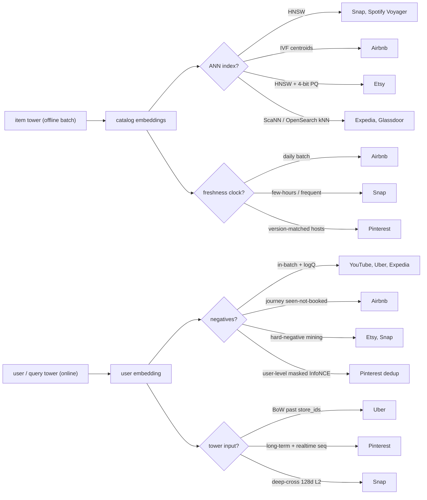
```mermaid
flowchart LR
  ITEM["item tower (offline batch)"] --> EMB["catalog embeddings"]
  EMB --> B2{"ANN index?"}
  USER["user / query tower (online)"] --> UE["user embedding"]
  UE --> B1{"negatives?"}
  UE --> B3{"tower input?"}
  EMB --> B4{"freshness clock?"}
  B1 -->|"in-batch + logQ"| N1["YouTube, Uber, Expedia"]
  B1 -->|"journey seen-not-booked"| N2["Airbnb"]
  B1 -->|"hard-negative mining"| N3["Etsy, Snap"]
  B1 -->|"user-level masked InfoNCE"| N4["Pinterest dedup"]
  B2 -->|"HNSW"| I1["Snap, Spotify Voyager"]
  B2 -->|"IVF centroids"| I2["Airbnb"]
  B2 -->|"HNSW + 4-bit PQ"| I3["Etsy"]
  B2 -->|"ScaNN / OpenSearch kNN"| I4["Expedia, Glassdoor"]
  B3 -->|"BoW past store_ids"| T1["Uber"]
  B3 -->|"long-term + realtime seq"| T2["Pinterest"]
  B3 -->|"deep-cross 128d L2"| T3["Snap"]
  B4 -->|"daily batch"| F1["Airbnb"]
  B4 -->|"few-hours / frequent"| F2["Snap"]
  B4 -->|"version-matched hosts"| F3["Pinterest"]
```

**The choices, side by side.**

| Decision | Options (who chooses each) | What decides it |
| --- | --- | --- |
| Negative sampling | `in-batch+logQ` (YouTube, Uber, Expedia) vs `journey seen-not-booked` (Airbnb) vs `hard-neg` (Etsy, Snap) vs `masked InfoNCE` (Pinterest) vs `random+mixed` (Glassdoor, Twitter) | Popularity bias vs boundary sharpness |
| ANN index | `HNSW` (Snap, Spotify) vs `IVF` (Airbnb) vs `HNSW+4-bit PQ` (Etsy) vs `ScaNN/OpenSearch` (Expedia, Glassdoor) | Update rate, filters, memory budget |
| Freshness / serving | `daily batch` (Airbnb) vs `few-hours split services` (Snap) vs `versioned hosts` (Pinterest) vs `stateless in-memory K8s` (Spotify) | Item churn vs deploy safety |
| Tower input | `BoW past store_ids` (Uber) vs `PinnerSage + realtime seq` (Pinterest) vs `deep-cross 128d L2` (Snap) vs `unified graph+text+term` (Etsy) | Cold-start, model size, intent recency |

**The math that separates them.**

**In-batch softmax loss**
$$L = -\frac{1}{B}\sum_{i=1}^{B} \log \frac{e^{\,s(x_i,y_i)}}{\sum_{j=1}^{B} e^{\,s(x_i,y_j)}}$$

**logQ-corrected logit (YouTube, Expedia)**
$$s^{c}(x_i,y_j) = u(x_i)^{\top} v(y_j) - \log Q(y_j)$$

**Dot vs Euclidean, magnitude matters (Airbnb)**
$$u^{\top}v = \lVert u\rVert\,\lVert v\rVert\cos\theta, \qquad \lVert u-v\rVert^{2} = \lVert u\rVert^{2} + \lVert v\rVert^{2} - 2\,u^{\top}v$$

**Index bytes, full vs 4-bit PQ (Etsy)**
$$\text{bytes}_{\text{full}} = N\,d\cdot 4, \qquad \text{bytes}_{\text{PQ}} = N\,m\cdot\tfrac{4}{8}$$

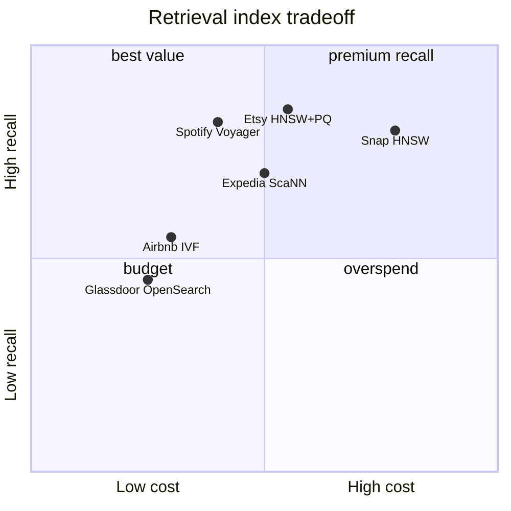
```mermaid
quadrantChart
  title Retrieval index tradeoff
  x-axis "Low cost" --> "High cost"
  y-axis "Low recall" --> "High recall"
  quadrant-1 "premium recall"
  quadrant-2 "best value"
  quadrant-3 "budget"
  quadrant-4 "overspend"
  "Airbnb IVF": [0.30, 0.55]
  "Glassdoor OpenSearch": [0.25, 0.45]
  "Spotify Voyager": [0.40, 0.82]
  "Etsy HNSW+PQ": [0.55, 0.85]
  "Expedia ScaNN": [0.50, 0.70]
  "Snap HNSW": [0.78, 0.80]
```

**The systems**

- **Pinterest** [Establishing a Large Scale Learned Retrieval System](https://medium.com/pinterest-engineering/establishing-a-large-scale-learned-retrieval-system-at-pinterest-eb0eaf7b92c5): Offline-indexed item embeddings plus a request-time user tower; sampled softmax with popularity correction. *(deployment)*
- **YouTube/Google** [Sampling-Bias-Corrected Neural Modeling for Large Corpus Recommendations](https://research.google/pubs/sampling-bias-corrected-neural-modeling-for-large-corpus-item-recommendations/): In-batch negatives are biased under power-law; logQ correction restores unbiased softmax. *(product design)*
- **Uber** [Innovative Recommendation Applications Using Two Tower Embeddings](https://www.uber.com/blog/innovative-recommendation-applications-using-two-tower-embeddings/): Layer-sharing plus bag-of-words history; one global model replaces thousands of city models. *(product design)*
- **Airbnb** [Embedding-Based Retrieval for Airbnb Search](https://airbnb.tech/ai-ml/embedding-based-retrieval-for-airbnb-search/): Chose IVF over HNSW for high listing-update volume; the listing tower is offline-computable. *(deployment)*
- **Snap** [Embedding-based Retrieval with Two-Tower Models in Spotlight](https://eng.snap.com/embedding-based-retrieval): In-batch negatives for video retrieval; request and retrieval split into independently scaled services. *(deployment)*
- **Etsy** [Unified Embedding Based Personalized Retrieval in Etsy Search](https://arxiv.org/abs/2306.04833): Hard-negative sampling plus unified embeddings; HNSW with 4-bit PQ; +5.58% purchase rate. *(eval bar)*
- **Expedia Group** [Candidate generation using a two-tower approach](https://medium.com/expedia-group-tech/candidate-generation-using-a-two-tower-approach-with-expedia-group-traveler-data-ca6a0dcab83e): Two-tower query and item encoders with dot-product scoring for travel. *(product design)*
- **Pinterest** [Scaling recommendations with request-level deduplication](https://medium.com/pinterest-engineering/scaling-recommendation-systems-with-request-level-deduplication-93bd514142d9): The in-batch-negative false-negative rate fixed via user-level masking. *(eval bar)*
- **Glassdoor** [Improving two-tower candidate generation](https://medium.com/glassdoor-engineering/improving-embedding-based-candidate-generation-for-recommender-systems-with-a-two-tower-model-c222123beb7f): Two-tower user and post embeddings served via OpenSearch ANN. *(deployment)*
- **Spotify** [Introducing Voyager: Spotify's nearest-neighbor search library](https://engineering.atspotify.com/2023/10/introducing-voyager-spotifys-new-nearest-neighbor-search-library): A production HNSW ANN library, 10x faster than Annoy, for recommendations. *(deployment)*
- **Twitter** [Addressing dataset bias in model-based candidate generation](https://arxiv.org/abs/2105.09293): Two-tower candidate generation for the home timeline, fixing sampling bias. *(eval bar)*
- **Walmart** [Enhancing relevance of embedding-based retrieval at Walmart](https://arxiv.org/abs/2408.04884): Neural EBR improved with a relevance reward model and typo-aware training. *(product design)*
- **Allegro** [Two-tower recommendations at Allegro.com](https://arxiv.org/abs/2508.03702): Unified two-tower retrieval serving multiple recommendation surfaces. *(who it serves)*

---

### [Ranking model](topics/02-ranking-model.md) · 12 systems

**What they share.** Every ranker assembles dense numeric features beside sparse ids that pass through embedding tables, scores all candidates through one DNN inside a hard latency budget, then calibrates and blends per-objective scores into a utility that sorts the list. What differs is only how interactions are modeled and how many objectives are optimized.

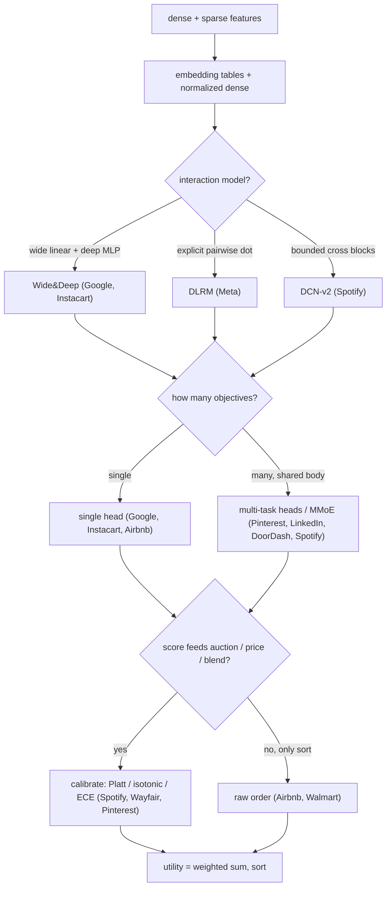
```mermaid
flowchart TD
  IN["dense + sparse features"] --> EMB["embedding tables + normalized dense"]
  EMB --> D1{"interaction model?"}
  D1 -->|"wide linear + deep MLP"| WD["Wide&Deep (Google, Instacart)"]
  D1 -->|"explicit pairwise dot"| DL["DLRM (Meta)"]
  D1 -->|"bounded cross blocks"| DC["DCN-v2 (Spotify)"]
  WD --> D2{"how many objectives?"}
  DL --> D2
  DC --> D2
  D2 -->|"single"| SG["single head (Google, Instacart, Airbnb)"]
  D2 -->|"many, shared body"| MT["multi-task heads / MMoE (Pinterest, LinkedIn, DoorDash, Spotify)"]
  SG --> D3{"score feeds auction / price / blend?"}
  MT --> D3
  D3 -->|"yes"| CAL["calibrate: Platt / isotonic / ECE (Spotify, Wayfair, Pinterest)"]
  D3 -->|"no, only sort"| RANK["raw order (Airbnb, Walmart)"]
  CAL --> U["utility = weighted sum, sort"]
  RANK --> U
```

**The choices, side by side.**

| Decision | Options (who) | What decides it |
| --- | --- | --- |
| interaction model | `DLRM` (Meta) vs `DeepFM`/`FM` (Instacart) vs `DCN-v2` (Spotify) vs `Wide&Deep` (Google) vs `MLP` (Pinterest, LinkedIn, DoorDash, Airbnb) | Cross structure: explicit second-order dot products when many sparse ids dominate, bounded cross blocks to skip hand-crafting, wide-linear split when frequent crosses reward memorization, else implicit MLP |
| multi-task | `single` (Google, Instacart, Airbnb) vs `shared-bottom` (Pinterest, LinkedIn, DoorDash) vs `MMoE/PLE` (Spotify) | Count of distinct outcomes and how negatively correlated they are; gating and towers hedge task conflict, single head fits one objective |
| calibration | `implicit/none` (Google, DLRM, Airbnb, LinkedIn, Walmart) vs `Platt/logistic per head` (Pinterest) vs `isotonic/monotonic` (Wayfair) vs `ECE-monitored` (Spotify) | Whether a raw score feeds an auction, price, or cross-task blend; if it only sorts, order is enough and calibration is skipped |
| model-family path | `native DNN` (Meta, Google) vs `GBDT then DNN` (Airbnb) vs `tree then MT-DNN` (DoorDash) vs `leaves into DNN` (LinkedIn) vs `lightweight XGBoost early` (Pinterest) | Maturity of the tree baseline and funnel position; migrate off a strong GBDT, bridge via leaf indices, or stay light at the top of the funnel |

**The math that separates them.**

**DLRM explicit pairwise interaction**
$$z = \operatorname{concat}\Big(x_{dense},\ \{\ \langle e_i,\ e_j\rangle\ :\ i<j\ \}\Big)$$

**DCN-v2 cross layer**
$$x_{l+1} = x_0 \odot (W_l\, x_l + b_l) + x_l$$

**Multi-task utility blend**
$$U = \sum_{t} w_t\, \hat p_t, \qquad \hat p_t = \sigma\big(\mathrm{head}_t(\mathrm{body}(x))\big)$$

**Calibration error and ad bid**
$$\mathrm{ECE} = \sum_{b=1}^{B} \frac{n_b}{N}\,\big|\,\mathrm{acc}(b) - \mathrm{conf}(b)\,\big|, \qquad \mathrm{bid} = v \cdot \hat p$$

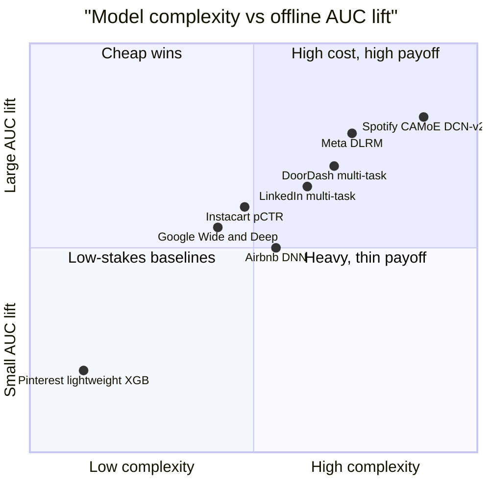
```mermaid
quadrantChart
  title "Model complexity vs offline AUC lift"
  x-axis "Low complexity" --> "High complexity"
  y-axis "Small AUC lift" --> "Large AUC lift"
  quadrant-1 "High cost, high payoff"
  quadrant-2 "Cheap wins"
  quadrant-3 "Low-stakes baselines"
  quadrant-4 "Heavy, thin payoff"
  "Pinterest lightweight XGB": [0.12, 0.20]
  "Google Wide and Deep": [0.42, 0.55]
  "Instacart pCTR": [0.48, 0.60]
  "Airbnb DNN": [0.55, 0.50]
  "LinkedIn multi-task": [0.62, 0.65]
  "DoorDash multi-task": [0.68, 0.70]
  "Meta DLRM": [0.72, 0.78]
  "Spotify CAMoE DCN-v2": [0.88, 0.82]
```

**The systems**

- **Google** [Wide & Deep Learning for Recommender Systems](https://arxiv.org/abs/1606.07792): Joint wide linear (memorization) plus deep net (generalization) for Google Play ranking. *(product design)*
- **Meta** [Deep Learning Recommendation Model (DLRM)](https://arxiv.org/abs/1906.00091): Dense MLP plus sparse embedding tables with explicit feature interactions, sharded for scale. *(product design)*
- **Instacart** [One Model to Serve Them All: a single deep pCTR model for multiple surfaces](https://company.instacart.com/how-its-made/one-model-to-serve-them-all-how-instacart-deployed-a-single-deep-learning-pctr-model-for-multiple-surfaces-with-improved-operations-and-performance-along-the-way): Consolidating per-surface XGBoost into one wide-and-deep pCTR model; calibration and ops wins. *(deployment)*
- **Pinterest** [Multi-task Learning and Calibration for Utility-based Home Feed Ranking](https://medium.com/pinterest-engineering/multi-task-learning-and-calibration-for-utility-based-home-feed-ranking-64087a7bcbad): A multi-head DNN per action type, with calibrated probabilities combined into a utility score. *(eval bar)*
- **Pinterest** [Multi-task Learning for Related Products Recommendations](https://medium.com/pinterest-engineering/multi-task-learning-for-related-products-recommendations-at-pinterest-62684f631c12): Four engagement heads beat a binary classifier; tune utility weights without retraining. *(product design)*
- **LinkedIn** [Homepage feed multi-task learning using TensorFlow](https://www.linkedin.com/blog/engineering/feed/homepage-feed-multi-task-learning-using-tensorflow): Jointly trains feed objectives (click, comment, reshare) in one ranker. *(product design)*
- **Airbnb** [Applying Deep Learning to Airbnb Search](https://medium.com/airbnb-engineering/applying-deep-learning-to-airbnb-search-7ebd7230891f): The journey from GBDT to neural-network ranking for bookings. *(product design)*
- **DoorDash** [Deep learning for ads conversion in last-mile delivery](https://arxiv.org/abs/2502.10514): Homepage ads ranking moving from tree models to multi-task DNNs. *(product design)*
- **Spotify** [Modality-aware multi-task learning for ad targeting](https://research.atspotify.com/2025/8/modality-aware-multi-task-learning-to-optimize-ad-targeting-at-scale): Multi-task MoE ad ranking with DCN-v2 feature interactions, calibrated. *(product design)*
- **Pinterest** [Improving recommended pins with lightweight ranking](https://medium.com/pinterest-engineering/improving-the-quality-of-recommended-pins-with-lightweight-ranking-8ff5477b20e3): An XGBoost lightweight ranker within a latency budget early in the funnel. *(deployment)*
- **Wayfair** [Time Informed Calibration](https://www.aboutwayfair.com/careers/tech-blog/time-informed-calibration): Calibrates raw ranking scores into time-aware purchase probabilities. *(eval bar)*
- **Walmart** [Improving Walmart Search to help customers save time](https://medium.com/walmartglobaltech/improving-walmart-search-to-help-our-customers-save-time-e9fcd1f03e94): A re-ranker balancing relevance and engagement, lifting relevance 4.5%. *(eval bar)*

---

### [Sequential & personalized recommendation](topics/03-sequential-recommendation.md) · 12 systems

**What they share.** Every system turns an ordered list of user interactions into item plus side-feature embeddings, runs a sequence model that weighs which past actions matter now, and pools the result into one user-intent vector that feeds a ranking head or retrieval tower. They diverge on the encoder, how much history they carry, how fresh the user state is, and whether the model is per-surface or a shared foundation.

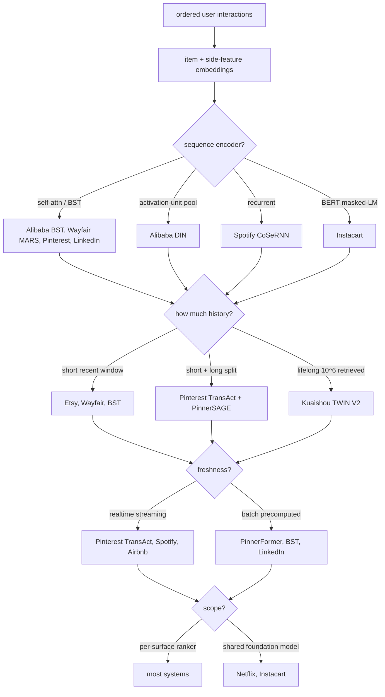
```mermaid
flowchart TD
  S["ordered user interactions"] --> EMB["item + side-feature embeddings"]
  EMB --> D1{"sequence encoder?"}
  D1 -->|"self-attn / BST"| A1["Alibaba BST, Wayfair MARS, Pinterest, LinkedIn"]
  D1 -->|"activation-unit pool"| A2["Alibaba DIN"]
  D1 -->|"recurrent"| A3["Spotify CoSeRNN"]
  D1 -->|"BERT masked-LM"| A4["Instacart"]
  A1 --> D2{"how much history?"}
  A2 --> D2
  A3 --> D2
  A4 --> D2
  D2 -->|"short recent window"| B1["Etsy, Wayfair, BST"]
  D2 -->|"short + long split"| B2["Pinterest TransAct + PinnerSAGE"]
  D2 -->|"lifelong 10^6 retrieved"| B3["Kuaishou TWIN V2"]
  B1 --> D3{"freshness?"}
  B2 --> D3
  B3 --> D3
  D3 -->|"realtime streaming"| C1["Pinterest TransAct, Spotify, Airbnb"]
  D3 -->|"batch precomputed"| C2["PinnerFormer, BST, LinkedIn"]
  C1 --> D4{"scope?"}
  C2 --> D4
  D4 -->|"per-surface ranker"| U1["most systems"]
  D4 -->|"shared foundation model"| U2["Netflix, Instacart"]
```

**The choices, side by side.**

| Decision | Options (who) | What decides it |
| --- | --- | --- |
| sequence encoder | `self-attn/BST` (Alibaba/Pinterest) vs `DIN pool` vs `RNN/CoSeRNN` vs `BERT` (Instacart) | Whether order matters (attention), whether interest depends on the candidate (DIN pool), whether per-session context dominates (RNN), or whether one bidirectional model must serve many surfaces (BERT) |
| history length | `short window` vs `lifelong TWIN` (Kuaishou) vs `short+long split` (Pinterest) | How much signal lives in the deep past versus the last few actions, traded against the per-request encode budget |
| freshness | `realtime` vs `batch` | Whether same-session reaction is the product value (realtime streaming) or a daily batch vector with an all-action loss recovers most of it cheaply |
| scope | `per-surface` vs `foundation model` | Whether one team owns one ranker, or many surfaces amortize a shared pretrained sequence model (Netflix, Instacart) |

**The math that separates them.**

$$\textbf{attention over history:}\quad z = \sum_{t=1}^{N} \text{softmax}_t\!\left(\frac{Q K_t^\top}{\sqrt{d}}\right) V_t$$

$$\textbf{target-attn (DIN pool):}\quad v_u(c) = \sum_{t=1}^{N} a(e_t, c)\, e_t \quad\text{(no softmax norm)}$$

$$\textbf{lifelong two-stage (TWIN):}\quad z = \text{ESU}\!\left(\text{GSU}(c, \{C_k\}), c\right),\quad |seq| \sim 10^{6}$$

$$\textbf{NDCG at k:}\quad \text{NDCG}@k = \frac{1}{Z}\sum_{i=1}^{k} \frac{2^{rel_i}-1}{\log_2(i+1)}$$

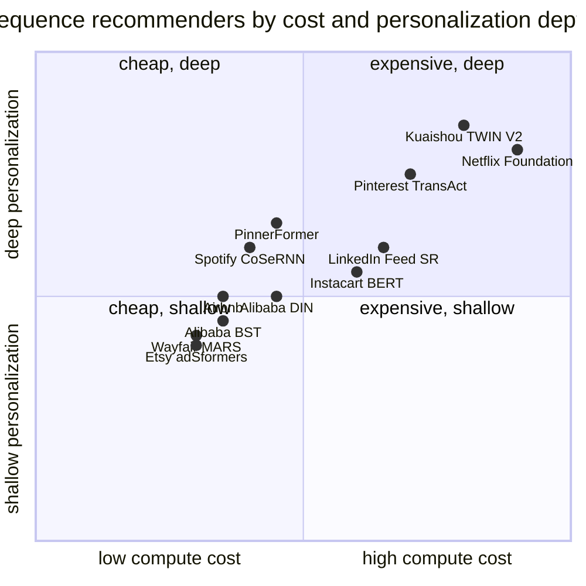
```mermaid
quadrantChart
  title Sequence recommenders by cost and personalization depth
  x-axis "low compute cost" --> "high compute cost"
  y-axis "shallow personalization" --> "deep personalization"
  quadrant-1 "expensive, deep"
  quadrant-2 "cheap, deep"
  quadrant-3 "cheap, shallow"
  quadrant-4 "expensive, shallow"
  "Alibaba BST": [0.35, 0.45]
  "Alibaba DIN": [0.45, 0.50]
  "Etsy adSformers": [0.30, 0.40]
  "Wayfair MARS": [0.30, 0.42]
  "Spotify CoSeRNN": [0.40, 0.60]
  "Pinterest TransAct": [0.70, 0.75]
  "PinnerFormer": [0.45, 0.65]
  "Kuaishou TWIN V2": [0.80, 0.85]
  "Netflix Foundation": [0.90, 0.80]
  "Instacart BERT": [0.60, 0.55]
  "LinkedIn Feed SR": [0.65, 0.60]
  "Airbnb": [0.35, 0.50]
```

**The systems**

- **Alibaba** [Behavior Sequence Transformer for E-commerce Recommendation](https://arxiv.org/abs/1905.06874): A transformer over the user behavior sequence lifts CTR in Taobao ranking. *(product design)*
- **Alibaba** [Deep Interest Network for Click-Through Rate Prediction](https://arxiv.org/abs/1706.06978): An attention activation unit adapts the user-interest vector per candidate ad. *(product design)*
- **Pinterest** [How Pinterest Leverages Realtime User Actions (TransAct)](https://medium.com/pinterest-engineering/how-pinterest-leverages-realtime-user-actions-in-recommendation-to-boost-homefeed-engagement-volume-165ae2e8cde8): TransAct fuses the real-time last-100 actions into Homefeed ranking. *(deployment)*
- **Pinterest** [PinnerFormer: Sequence Modeling for User Representation](https://arxiv.org/abs/2205.04507): A batch sequence model with an all-action loss avoids streaming embedding updates. *(deployment)*
- **Netflix** [Integrating Netflix Foundation Model into Personalization](https://netflixtechblog.medium.com/integrating-netflixs-foundation-model-into-personalization-applications-cf176b5860eb): Three ways to plug a large sequence model into production systems. *(deployment)*
- **Spotify** [Contextual and sequential user embeddings for music](https://research.atspotify.com/contextual-and-sequential-user-embeddings-for-music-recommendation/): CoSeRNN models taste as a sequence of per-session embeddings. *(product design)*
- **Instacart** [Sequence models for contextual recommendations](https://tech.instacart.com/sequence-models-for-contextual-recommendations-at-instacart-93414a28e70c): A centralized BERT-style next-action retrieval serving search, browse, recs. *(deployment)*
- **Kuaishou** [TWIN V2: ultra-long user behavior sequence modeling](https://arxiv.org/abs/2407.16357): Two-stage attention over lifelong user behavior sequences in production. *(deployment)*
- **Etsy** [adSformers: personalization from short-term sequences](https://arxiv.org/abs/2302.01255): A transformer encoder over recent user actions for ad CTR and CVR. *(product design)*
- **Wayfair** [MARS: transformer networks for sequential recommendation](https://www.aboutwayfair.com/careers/tech-blog/mars-transformer-networks-for-sequential-recommendation): Self-attention over browsed-item sequences to track changing tastes. *(product design)*
- **LinkedIn** [An industrial-scale sequential recommender for feed ranking](https://arxiv.org/abs/2602.12354): A transformer sequential ranker (Feed SR) replacing a DCNv2 ranker. *(deployment)*
- **Airbnb** [Listing Embeddings in Search Ranking](https://medium.com/airbnb-engineering/listing-embeddings-for-similar-listing-recommendations-and-real-time-personalization-in-search-601172f7603e): Listing embeddings from 800M sessions for real-time in-session personalization. *(product design)*

---

### [Ads CTR prediction](topics/10-ads-ctr-prediction.md) · 11 systems

**What they share.** Every system pulls eligible ads, scores each with a sparse-embedding model into a calibrated pCTR, and feeds `eCPM = bid x pCTR` into the auction; they diverge only on how feature interactions are carried and how calibration is defended as labels drift and conversions land late.

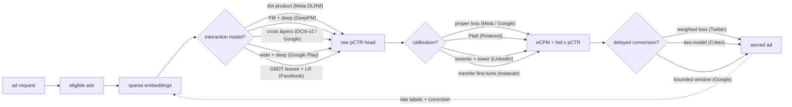
```mermaid
flowchart LR
  REQ["ad request"] --> CAND["eligible ads"]
  CAND --> EMB["sparse embeddings"]
  EMB --> INT{"interaction model?"}
  INT -->|"dot product (Meta DLRM)"| SCORE["raw pCTR head"]
  INT -->|"FM + deep (DeepFM)"| SCORE
  INT -->|"cross layers (DCN-v2 / Google)"| SCORE
  INT -->|"wide + deep (Google Play)"| SCORE
  INT -->|"GBDT leaves + LR (Facebook)"| SCORE
  SCORE --> CAL{"calibration?"}
  CAL -->|"proper loss (Meta / Google)"| ECPM["eCPM = bid x pCTR"]
  CAL -->|"Platt (Pinterest)"| ECPM
  CAL -->|"isotonic + tower (LinkedIn)"| ECPM
  CAL -->|"transfer fine-tune (Instacart)"| ECPM
  ECPM --> DLY{"delayed conversion?"}
  DLY -->|"weighted loss (Twitter)"| SERVE["served ad"]
  DLY -->|"two-model (Criteo)"| SERVE
  DLY -->|"bounded window (Google)"| SERVE
  SERVE -.->|"late labels + correction"| EMB
```

**The choices, side by side.**

| Decision | Options (who) | What decides it |
| --- | --- | --- |
| interaction model | `DLRM` (Meta) vs `DeepFM` vs `DCN-v2` vs `Wide&Deep` vs `GBDT+LR` (Facebook) | how sparse the space is and whether pairwise dot products, learned FM crosses, bounded-degree cross layers, memorize-plus-generalize branches, or tree-discovered crosses carry the signal; trees cap out at billions of ids |
| calibration | `proper-loss` vs `Platt` (Pinterest) vs `isotonic` (LinkedIn) vs transfer fine-tune (Instacart) | how far the raw head drifts from true rates under negative sampling and exposure bias, and whether you must recalibrate hourly while the heavy net retrains daily |
| delayed conversion | `weighted loss` (Twitter) vs `two-model` (Criteo) vs windows (Google) | the conversion delay distribution and whether a not-yet-converted click can be treated as a confirmed negative inside the attribution window |
| feature/embedding scale | row-per-id (small space) vs feature hashing + sharding (billions of ids: DLRM, Google) | id-space cardinality and memory budget; hashing trades controlled collisions for a bounded, shardable table, and model-parallel embeddings plus data-parallel MLP for DLRM |

**The math that separates them.**

$$\textbf{eCPM = bid times pCTR} : \quad \text{eCPM} = 1000 \cdot b \cdot \hat{p}(\text{click})$$

$$\textbf{log loss, a proper score} : \quad \mathcal{L} = -\frac{1}{N}\sum_{i=1}^{N} \big[\, y_i \log \hat{p}_i + (1-y_i)\log(1-\hat{p}_i)\,\big]$$

$$\textbf{expected calibration error} : \quad \text{ECE} = \sum_{b=1}^{B} \frac{n_b}{N}\,\big|\,\text{acc}(b) - \text{conf}(b)\,\big|$$

$$\textbf{fake-negative weighted loss} : \quad \mathcal{L}_w = -\frac{1}{N}\sum_{i=1}^{N} w_i \big[\, y_i \log \hat{p}_i + (1-y_i)\log(1-\hat{p}_i)\,\big]$$

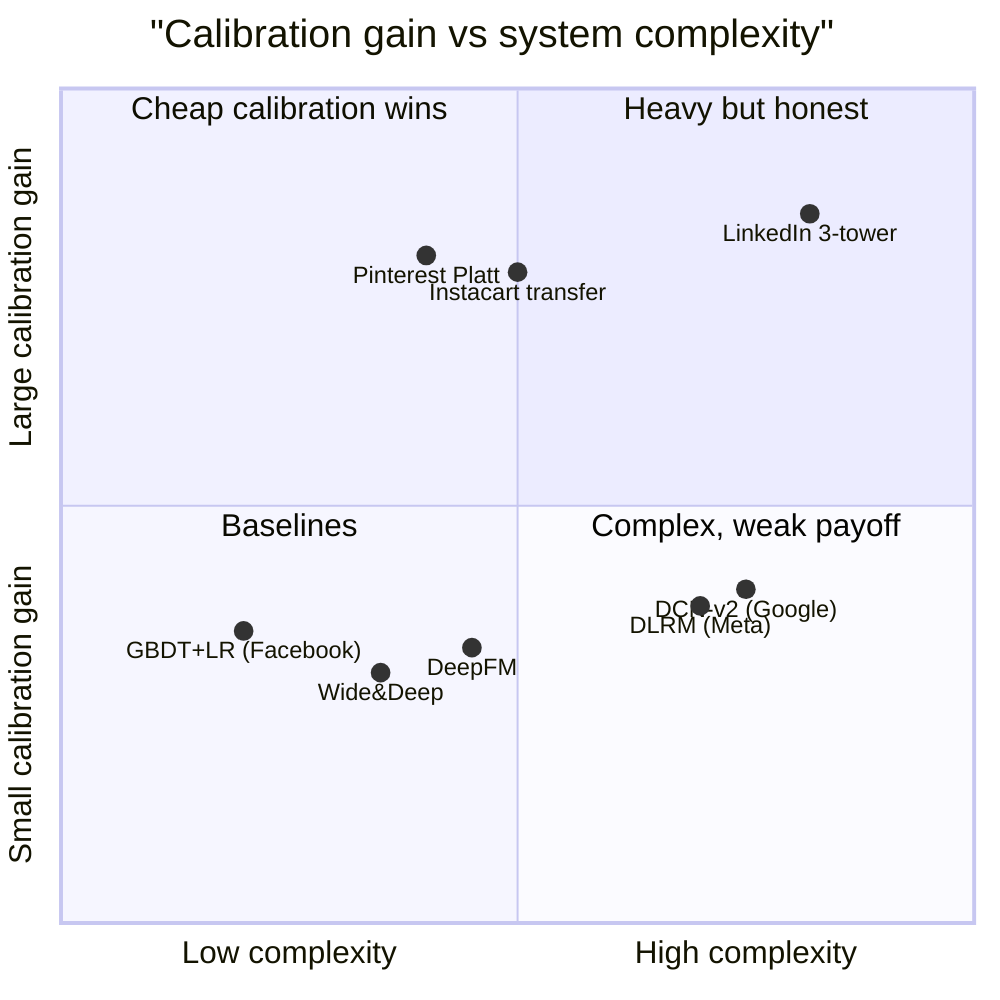
```mermaid
quadrantChart
  title "Calibration gain vs system complexity"
  x-axis "Low complexity" --> "High complexity"
  y-axis "Small calibration gain" --> "Large calibration gain"
  quadrant-1 "Heavy but honest"
  quadrant-2 "Cheap calibration wins"
  quadrant-3 "Baselines"
  quadrant-4 "Complex, weak payoff"
  "GBDT+LR (Facebook)": [0.20, 0.35]
  "Wide&Deep": [0.35, 0.30]
  "DeepFM": [0.45, 0.33]
  "DLRM (Meta)": [0.70, 0.38]
  "DCN-v2 (Google)": [0.75, 0.40]
  "Pinterest Platt": [0.40, 0.80]
  "Instacart transfer": [0.50, 0.78]
  "LinkedIn 3-tower": [0.82, 0.85]
```

**The systems**

- **Meta** [Deep Learning Recommendation Model (DLRM)](https://arxiv.org/abs/1906.00091): sparse embeddings plus explicit interactions, the canonical CTR architecture. *(model)*
- **Guo et al.** [DeepFM](https://arxiv.org/abs/1703.04247): factorization-machine plus deep network for CTR. *(model)*
- **Wang et al.** [DCN V2](https://arxiv.org/abs/2008.13535): explicit bounded-degree feature crosses for CTR ranking. *(model)*
- **Cheng et al.** [Wide & Deep Learning](https://arxiv.org/abs/1606.07792): memorization plus generalization, the Google Play CTR model. *(model)*
- **Facebook** Practical Lessons from Predicting Clicks on Ads (GBDT + logistic regression): the classic recipe of boosted-tree features feeding a calibrated linear model, with hard-won notes on calibration and data freshness. Find it via the index below. *(deployment)*
- **Pinterest** [AutoML, multi-task, multi-tower models for Pinterest Ads](https://medium.com/pinterest-engineering/how-we-use-automl-multi-task-learning-and-multi-tower-models-for-pinterest-ads-db966c3dc99e): A Platt-scaling calibration layer cut day-to-day error up to 80%. *(product design)*
- **LinkedIn** [Lessons from a deep-learning ads CTR prediction model](https://www.linkedin.com/blog/engineering/machine-learning/challenges-and-practical-lessons-from-building-a-deep-learning-b): Replacing GLMix with a three-tower DNN; calibration under exposure bias. *(deployment)*
- **Instacart** [Calibrating CTR Prediction with Transfer Learning](https://tech.instacart.com/calibrating-ctr-prediction-with-transfer-learning-in-instacart-ads-3ec88fa97525): Transfer learning aligns predicted CTR with observed click frequency. *(eval bar)*
- **Twitter** [Addressing Delayed Feedback in CTR prediction](https://arxiv.org/abs/1907.06558): A fake-negative weighted loss for delayed labels in continuous training. *(product design)*
- **Google** [On the Factory Floor: ML engineering for industrial-scale ads](https://arxiv.org/abs/2209.05310): A search-ads CTR model: calibration, feature crosses, reproducibility at scale. *(deployment)*
- **Criteo** [Modeling delayed feedback in display advertising](https://bibtex.github.io/KDD-2014-Chapelle.html): A two-model approach deciding when an unconverted click counts as negative. *(product design)*

---

### [Search ranking](topics/09-search-ranking.md) · 10 systems

**What they share.** Every system runs one spine: understand the query, fuse a lexical arm with an embedding arm into a candidate union, then score the survivors with a learning-to-rank model trained on debiased engagement plus scarce human judgments. The differences are which retrieval arm dominates and where each team spends its labeling budget, not the shape.

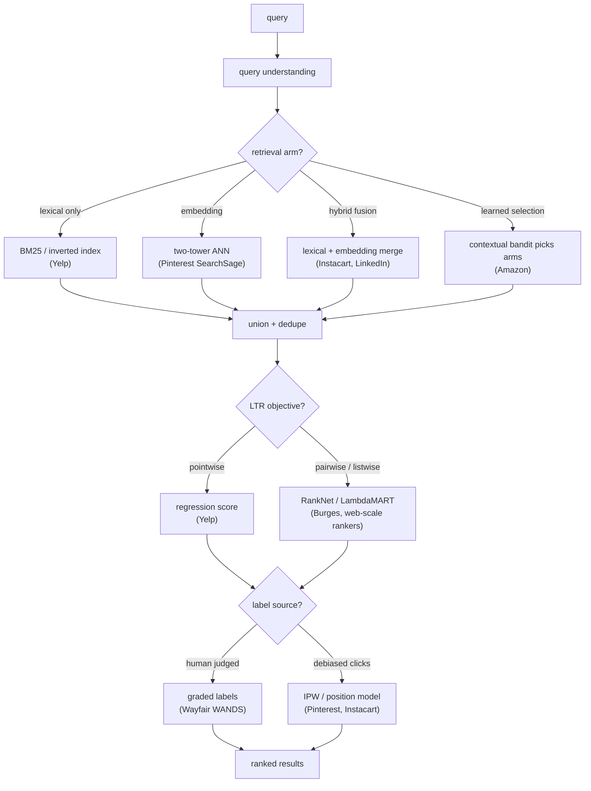
```mermaid
flowchart TD
  Q["query"] --> QU["query understanding"]
  QU --> B1{"retrieval arm?"}
  B1 -->|"lexical only"| LEX["BM25 / inverted index<br/>(Yelp)"]
  B1 -->|"embedding"| SEM["two-tower ANN<br/>(Pinterest SearchSage)"]
  B1 -->|"hybrid fusion"| HYB["lexical + embedding merge<br/>(Instacart, LinkedIn)"]
  B1 -->|"learned selection"| BAN["contextual bandit picks arms<br/>(Amazon)"]
  LEX --> U["union + dedupe"]
  SEM --> U
  HYB --> U
  BAN --> U
  U --> B2{"LTR objective?"}
  B2 -->|"pointwise"| PW["regression score<br/>(Yelp)"]
  B2 -->|"pairwise / listwise"| PL["RankNet / LambdaMART<br/>(Burges, web-scale rankers)"]
  PW --> B3{"label source?"}
  PL --> B3
  B3 -->|"human judged"| HJ["graded labels<br/>(Wayfair WANDS)"]
  B3 -->|"debiased clicks"| CK["IPW / position model<br/>(Pinterest, Instacart)"]
  HJ --> R["ranked results"]
  CK --> R
```

**The choices, side by side.**

| Decision | Options (who) | What decides it |
| --- | --- | --- |
| retrieval arm | `lexical/BM25` (Yelp) vs `embedding` (Pinterest SearchSage) vs `hybrid fusion` (Instacart, LinkedIn) vs `learned bandit` (Amazon) | Vocabulary gap vs exact-string need: lexical nails product codes and rare terms, embeddings bridge synonyms, hybrid keeps both, bandit learns which arm fits each query context |
| LTR objective | `pointwise` (Yelp regression) vs `pairwise/RankNet` (Burges) vs `listwise/LambdaMART` (web-scale rankers) | Match-or-not tasks tolerate pointwise; when the metric is order and position-weighted, pairwise or listwise align the loss to NDCG |
| label source | `clicks` (Pinterest saves, Instacart conversion) vs `human` (Wayfair WANDS, Yelp gold) vs `engagement` (Amazon logged, LinkedIn crowd + click) | Clicks are abundant but biased, human judgments trustworthy but scarce; teams fuse to anchor volume with quality |
| position bias | `IPW propensity` vs `position as train feature` vs `bandit exploration` (Amazon) | Clicks reward whatever ranked high; debias so the model learns relevance net of examination, or randomize to estimate propensities |

**The math that separates them.**

$$\textbf{NDCG@k} = \frac{\sum_{i=1}^{k} \frac{2^{rel_i}-1}{\log_2(i+1)}}{\text{IDCG@k}}$$

$$\textbf{BM25}(q,d) = \sum_{t \in q} \text{IDF}(t) \cdot \frac{f(t,d)\,(k_1+1)}{f(t,d) + k_1\,(1 - b + b\,\frac{|d|}{\text{avgdl}})}$$

$$\textbf{RRF fusion: } s(d) = \sum_{a \in \text{arms}} \frac{1}{\kappa + \text{rank}_a(d)}$$

$$\textbf{IPW position-bias: } \mathcal{L} = \sum_{i} \frac{c_i}{P(\text{examine} \mid \text{pos}_i)} \cdot \ell\big(f(x_i), y_i\big)$$

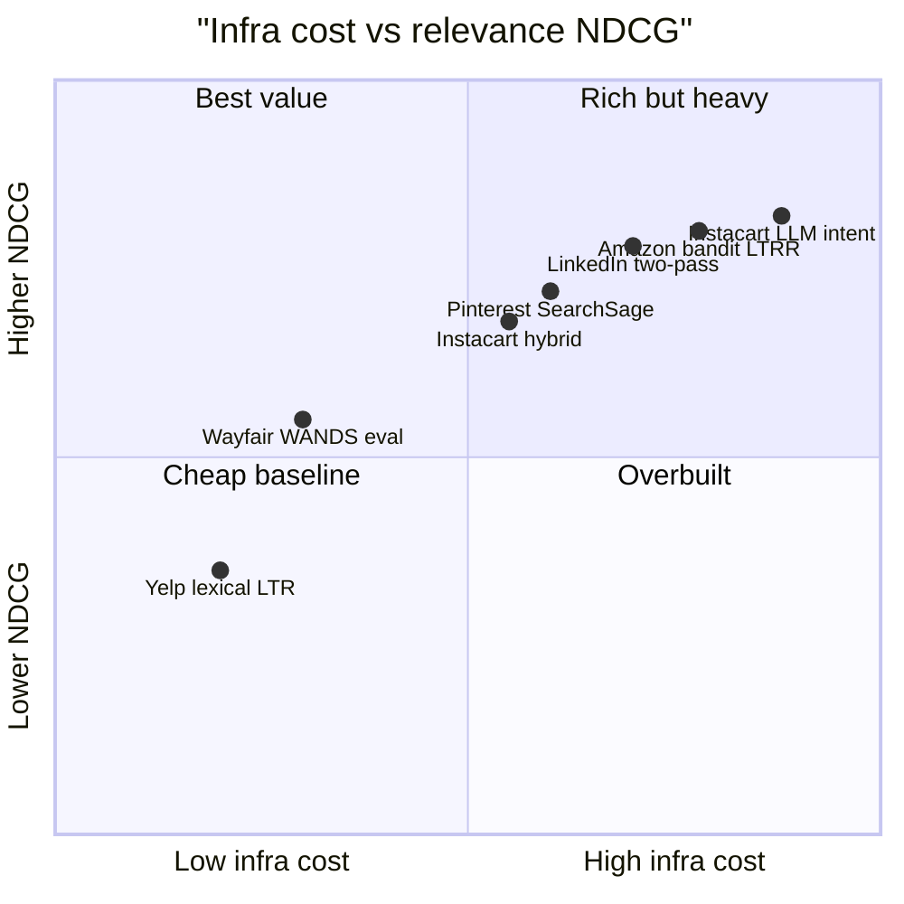
```mermaid
quadrantChart
  title "Infra cost vs relevance NDCG"
  x-axis "Low infra cost" --> "High infra cost"
  y-axis "Lower NDCG" --> "Higher NDCG"
  quadrant-1 "Rich but heavy"
  quadrant-2 "Best value"
  quadrant-3 "Cheap baseline"
  quadrant-4 "Overbuilt"
  "Yelp lexical LTR": [0.20, 0.35]
  "Wayfair WANDS eval": [0.30, 0.55]
  "Instacart hybrid": [0.55, 0.68]
  "Pinterest SearchSage": [0.60, 0.72]
  "LinkedIn two-pass": [0.70, 0.78]
  "Amazon bandit LTRR": [0.78, 0.80]
  "Instacart LLM intent": [0.88, 0.82]
```

**The systems**

- **Wang et al.** [DCN V2: Improved Deep & Cross Network](https://arxiv.org/abs/2008.13535): Explicit, efficient feature crosses in a ranking model used at web scale. *(ranking model)*
- **Cheng et al.** [Wide & Deep Learning](https://arxiv.org/abs/1606.07792): Memorization (wide linear over crossed features) plus generalization (deep net) for ranking. *(ranking model)*
- **Burges** "From RankNet to LambdaRank to LambdaMART: An Overview": the canonical learning-to-rank reference, walking from a pairwise RankNet loss to LambdaRank's NDCG-weighted gradients to the LambdaMART tree ensemble. The clearest single source on why ranking losses are pairwise and listwise rather than pointwise. *(learning-to-rank)*
- **Amazon** [From structured search to learning-to-rank-and-retrieve](https://www.amazon.science/blog/from-structured-search-to-learning-to-rank-and-retrieve): Unifies retrieval and ranking via learning-to-rank-and-retrieve with contextual bandits. *(product design)*
- **LinkedIn** [Improving Post Search at LinkedIn](https://www.linkedin.com/blog/engineering/search/improving-post-search-at-linkedin): Multi-stage retrieval plus learning-to-rank for member post search. *(product design)*
- **Pinterest** [SearchSage: learning search query representations](https://medium.com/pinterest-engineering/searchsage-learning-search-query-representations-at-pinterest-654f2bb887fc): A query embedding model powering search retrieval and ranking relevance. *(deployment)*
- **Instacart** [Optimizing search relevance using hybrid retrieval](https://tech.instacart.com/optimizing-search-relevance-at-instacart-using-hybrid-retrieval-88cb579b959c): Hybrid text plus embedding retrieval feeding two-stage ranking. *(deployment)*
- **Instacart** [Building the Intent Engine: query understanding with LLMs](https://company.instacart.com/tech-innovation/building-the-intent-engine-how-instacart-is-revamping-query-understanding-with-llms): An LLM-based query-understanding pipeline for intent and category mapping. *(product design)*
- **Yelp** [Learning to Rank for Business Matching](https://engineeringblog.yelp.com/2014/12/learning-to-rank-for-business-matching.html): Moving business matching from hand-tuned scoring to learning-to-rank. *(product design)*
- **Wayfair** [WANDS: a public e-commerce product-search relevance dataset](https://www.aboutwayfair.com/careers/tech-blog/wayfair-releases-wands-the-largest-and-richest-publicly-available-dataset-for-e-commerce-product-search-relevance): A public human-judged relevance-label dataset for search evaluation. *(eval bar)*

---

### [Fraud & anomaly detection](topics/08-fraud-and-anomaly-detection.md) · 12 systems

**What they share.** Every system runs one skeleton: an event stream feeds real-time velocity plus graph/entity features, a model scores the event, a cost-sensitive threshold turns the score into allow/block/review, and analyst verdicts plus settled chargebacks flow back as labels. The only fast feedback is the human queue; ground truth lands weeks later.

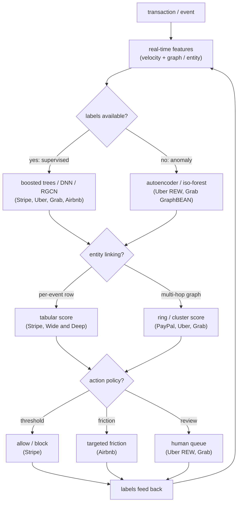
```mermaid
flowchart TD
  EV["transaction / event"] --> FEAT["real-time features<br/>(velocity + graph / entity)"]
  FEAT --> D1{"labels available?"}
  D1 -->|"yes: supervised"| SUP["boosted trees / DNN / RGCN<br/>(Stripe, Uber, Grab, Airbnb)"]
  D1 -->|"no: anomaly"| UNS["autoencoder / iso-forest<br/>(Uber REW, Grab GraphBEAN)"]
  SUP --> D2{"entity linking?"}
  UNS --> D2
  D2 -->|"per-event row"| ROW["tabular score<br/>(Stripe, Wide and Deep)"]
  D2 -->|"multi-hop graph"| GR["ring / cluster score<br/>(PayPal, Uber, Grab)"]
  ROW --> D3{"action policy?"}
  GR --> D3
  D3 -->|"threshold"| BLK["allow / block<br/>(Stripe)"]
  D3 -->|"friction"| FRI["targeted friction<br/>(Airbnb)"]
  D3 -->|"review"| HUM["human queue<br/>(Uber REW, Grab)"]
  BLK --> LAB["labels feed back"]
  FRI --> LAB
  HUM --> LAB
  LAB --> FEAT
```

**The choices, side by side.**

| Decision | Options (who) | What decides it |
| --- | --- | --- |
| model family | `boosted trees` vs `deep DNN` (Stripe Radar, Wide and Deep) vs `graph GNN/RGCN` (Uber, Grab) | Signal shape: strong tabular velocity favors trees; sparse categoricals reward embeddings; coordinated rings need message passing |
| supervision | `supervised` (Stripe, Uber RGCN, Grab RGCN, Airbnb) vs `unsupervised anomaly` (Uber Risk Entity Watch, Grab GraphBEAN) | Do mature labels exist? Supervised for known fraud at high precision; anomaly for novel attacks with no labels yet |
| graph/entity linking | `per-event row` (Stripe, Wide and Deep) vs `multi-hop entity graph` (PayPal sub-second, Uber RGCN, Grab bipartite) | Whether fraud is coordinated: rings share devices/cards/addresses that single rows hide, at the cost of graph infra |
| action policy | `hard threshold` (Stripe) vs `friction` (Airbnb) vs `human review` (Uber REW, Grab) | Cost asymmetry and confidence: block when cheap and certain, friction when good-user churn is costly, review when unsure or unlabeled |

**The math that separates them.**

$$\textbf{cost-optimal threshold: } p^{*} = \frac{C_{fp}}{C_{fp} + C_{fn}}$$

$$\textbf{PR-AUC, rare-positive metric: } \int_{0}^{1} \text{Prec}(r)\, dr, \quad \text{Prec} = \frac{TP}{TP + FP}$$

$$\textbf{focal loss for imbalance: } \mathcal{L} = -\,\alpha\,(1 - p_t)^{\gamma}\,\log(p_t)$$

$$\textbf{Airbnb friction loss: } L = FP \cdot G \cdot V + FN \cdot C + TP \cdot (1 - F) \cdot C$$

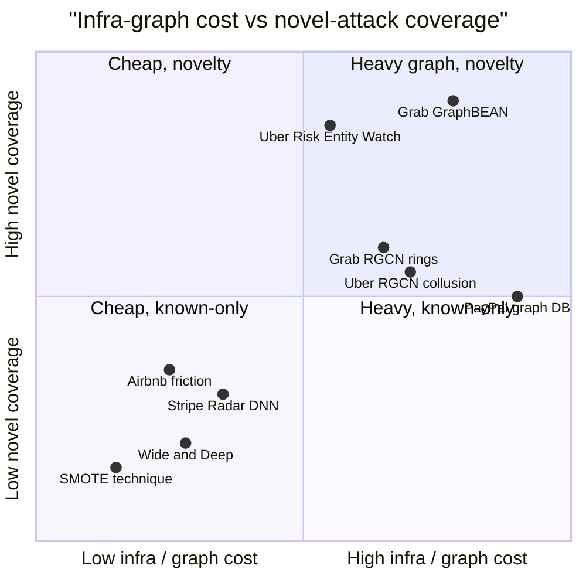
```mermaid
quadrantChart
  title "Infra-graph cost vs novel-attack coverage"
  x-axis "Low infra / graph cost" --> "High infra / graph cost"
  y-axis "Low novel coverage" --> "High novel coverage"
  quadrant-1 "Heavy graph, novelty"
  quadrant-2 "Cheap, novelty"
  quadrant-3 "Cheap, known-only"
  quadrant-4 "Heavy, known-only"
  "Stripe Radar DNN": [0.35, 0.30]
  "Wide and Deep": [0.28, 0.20]
  "SMOTE technique": [0.15, 0.15]
  "Airbnb friction": [0.25, 0.35]
  "Uber RGCN collusion": [0.70, 0.55]
  "PayPal graph DB": [0.90, 0.50]
  "Grab RGCN rings": [0.65, 0.60]
  "Uber Risk Entity Watch": [0.55, 0.85]
  "Grab GraphBEAN": [0.78, 0.90]
```

**The systems**

- **Chawla et al.** [SMOTE: Synthetic Minority Over-sampling Technique](https://arxiv.org/abs/1106.1813): the classic approach to extreme class imbalance, synthesizing minority samples instead of naive oversampling. *(class imbalance)*
- **Cheng et al.** [Wide & Deep Learning](https://arxiv.org/abs/1606.07792): the sparse-embedding-plus-dense tabular shape fraud models often use when they go deep. *(model)*
- **Stripe** [Radar engineering writeups](https://stripe.com/blog): how Stripe scores card fraud in real time with continuously retrained models. *(deployment)*
- **PayPal** [engineering blog](https://medium.com/paypal-tech): real-time fraud and risk modeling at payment scale, including graph and streaming signals. *(real-time features)*
- **Airbnb** [fraud and trust engineering](https://medium.com/airbnb-engineering): risk and abuse modeling with human review loops and graph signals. *(human review)*
- **Stripe** [How we built it: Stripe Radar](https://stripe.dev/blog/how-we-built-it-stripe-radar): ML architecture evolution, feature discovery, and explainability at sub-100ms. *(product design)*
- **PayPal** [Real-time graph database and analysis to fight fraud](https://medium.com/paypal-tech/how-paypal-uses-real-time-graph-database-and-graph-analysis-to-fight-fraud-96a2b918619a): A custom sub-second, million-QPS graph DB for real-time fraud queries. *(deployment)*
- **Uber** [Relational Graph Learning to Detect Collusion](https://www.uber.com/blog/fraud-detection/): An RGCN over the rider-driver graph; +15% precision feeding downstream risk models. *(product design)*
- **Uber** [Risk Entity Watch: anomaly detection to fight fraud](https://www.uber.com/us/en/blog/risk-entity-watch/): Unsupervised anomaly detection scoring entities without labels across business lines. *(product design)*
- **Grab** [Unsupervised graph anomaly detection for new fraud](https://engineering.grab.com/graph-anomaly-model): A GraphBEAN autoencoder on bipartite graphs catches novel fraud without labels. *(product design)*
- **Grab** [Graph for fraud detection](https://engineering.grab.com/graph-for-fraud-detection): RGCN exploits shared-device/address correlations; less labeled data, explainable clusters. *(product design)*
- **Airbnb** [Fighting Financial Fraud with Targeted Friction](https://medium.com/airbnb-engineering/fighting-financial-fraud-with-targeted-friction-82d950d8900e): A loss function weighing friction vs chargeback cost; targeted friction cuts losses. *(eval bar)*

---

### [Content moderation and trust and safety](topics/16-content-moderation.md) · 10 systems

**What they share.** Every system is the same funnel: cheap certain checks first, then per-policy classifiers each at its own precision floor, then a policy engine turning scores into actions with humans on the uncertain middle feeding labels back. They differ only in which branch each company invests in.

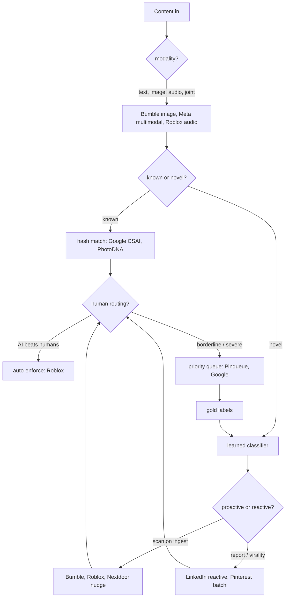
```mermaid
flowchart TD
    A[Content in] --> B{modality?}
    B -->|text, image, audio, joint| C[Bumble image, Meta multimodal, Roblox audio]
    C --> D{known or novel?}
    D -->|known| E[hash match: Google CSAI, PhotoDNA]
    D -->|novel| F[learned classifier]
    F --> G{proactive or reactive?}
    G -->|scan on ingest| H[Bumble, Roblox, Nextdoor nudge]
    G -->|report / virality| I[LinkedIn reactive, Pinterest batch]
    E --> J{human routing?}
    H --> J
    I --> J
    J -->|AI beats humans| K[auto-enforce: Roblox]
    J -->|borderline / severe| L[priority queue: Pinqueue, Google]
    L --> M[gold labels] --> F
```

**The choices, side by side.**

| Decision | Options (who) | What decides it |
| --- | --- | --- |
| modality | `text` vs `image` (Bumble) vs `multimodal` (Meta hateful-memes) vs `audio` (Roblox) | Where harm lives; benign image plus benign caption forces a joint model, live voice forces a streaming window |
| detection | `hash-match known-bad` (Google) vs `learned classifier` | Known-versus-novel: hashing is near-zero false positive and legally actionable but blind to unseen content |
| proactive vs reactive | `scan-on-ingest` (Bumble, Roblox, Nextdoor) vs `report + virality` (LinkedIn viral-spam, Pinterest) | Miss cost scales with reach, so severe irreversible harm gets proactive scan, the rest gets cheaper reactive re-scoring |
| human routing | `auto-enforce when AI beats humans` (Roblox) vs `priority queue to experts` (Pinqueue, Google CSAM) | False-positive cost per policy: CSAM never auto-actions on a score, spam can |

**The math that separates them.**

$$\textbf{recall at precision floor:}\quad \max_{\tau}\ \operatorname{Recall}(\tau)\quad \text{s.t.}\quad \operatorname{Precision}(\tau)\ \ge\ P_{\min}^{(\text{policy})}$$

$$\textbf{asymmetric miss cost:}\quad \mathcal{L}\ =\ c_{FN}\cdot FN\ +\ c_{FP}\cdot FP,\qquad c_{FN}\ \gg\ c_{FP}$$

$$\textbf{auto-action gate:}\quad \operatorname{act}(x)=\mathbf{1}\!\left[\,s(x)\ge\tau\ \wedge\ \operatorname{Precision}(\tau)\ge P_{\min}\,\right]$$

$$\textbf{priority queue:}\quad \arg\max_{x\in Q}\ \operatorname{severity}(x)\times \operatorname{reach}(x)$$

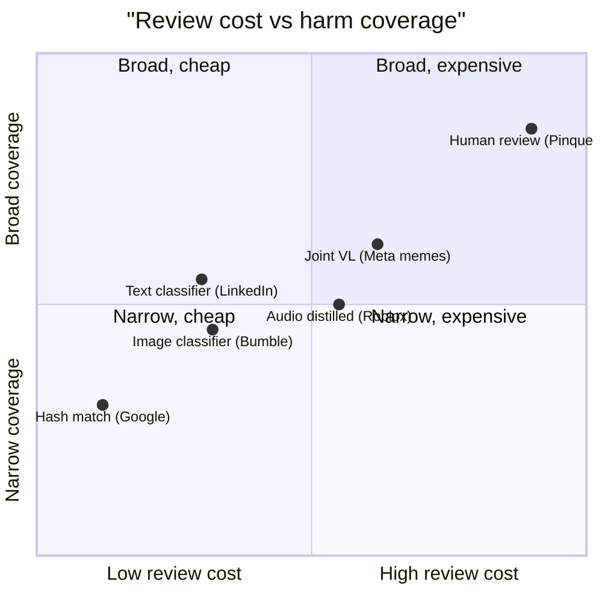
```mermaid
quadrantChart
    title "Review cost vs harm coverage"
    x-axis "Low review cost" --> "High review cost"
    y-axis "Narrow coverage" --> "Broad coverage"
    quadrant-1 "Broad, expensive"
    quadrant-2 "Broad, cheap"
    quadrant-3 "Narrow, cheap"
    quadrant-4 "Narrow, expensive"
    "Hash match (Google)": [0.12, 0.30]
    "Text classifier (LinkedIn)": [0.30, 0.55]
    "Image classifier (Bumble)": [0.32, 0.45]
    "Joint VL (Meta memes)": [0.62, 0.62]
    "Audio distilled (Roblox)": [0.55, 0.50]
    "Human review (Pinqueue)": [0.90, 0.85]
```

**The systems**

- **Roblox** [Deploying ML for Voice Safety](https://about.roblox.com/newsroom/2024/07/deploying-ml-for-voice-safety): A distilled transformer audio model flags policy-violating voice chat in real time. *(deployment)*
- **Roblox** [How Roblox Uses AI to Moderate Content on a Massive Scale](https://about.roblox.com/newsroom/2025/07/roblox-ai-moderation-massive-scale): Billions of daily messages moderated across 25 languages, AI plus human. *(deployment)*
- **Pinterest** [Fighting misinformation, hate speech, and self-harm content with ML](https://medium.com/pinterest-engineering/how-pinterest-fights-misinformation-hate-speech-and-self-harm-content-with-machine-learning-1806b73b40ef): Batch and online ML models score Pins and boards for policy violations. *(product design)*
- **Pinterest** [Pinqueue3.0, Pinterest's next-gen content moderation platform](https://medium.com/pinterest-engineering/introducing-pinqueue3-0-pinterests-next-gen-content-moderation-platform-fcfa972bf39c): A human review and labeling platform feeding high-quality labels to ML. *(deployment)*
- **LinkedIn** [Automated Fake Account Detection at LinkedIn](https://www.linkedin.com/blog/engineering/trust-and-safety/automated-fake-account-detection-at-linkedin): A funnel of registration scoring, cluster detection, and activity models. *(deployment)*
- **LinkedIn** [Viral spam content detection at LinkedIn](https://www.linkedin.com/blog/engineering/trust-and-safety/viral-spam-content-detection-at-linkedin): Proactive versus reactive classifiers curb the spread of viral spam posts. *(eval bar)*
- **Bumble** [Open-sourcing Private Detector](https://medium.com/bumble-tech/bumble-inc-open-sources-private-detector-and-makes-another-step-towards-a-safer-internet-for-women-8e6cdb111d81): An EfficientNetV2 classifier detects and blurs unsolicited lewd images. *(who it serves)*
- **Meta AI** [Hateful Memes Challenge and dataset](https://ai.meta.com/blog/hateful-memes-challenge-and-data-set/): A benchmark forcing joint image-text reasoning to detect hateful memes. *(eval bar)*
- **Google** [Child safety toolkit: Content Safety API and CSAI Match](https://protectingchildren.google/tools-for-partners/): AI classifiers plus hash-matching prioritize and detect CSAM for partners. *(deployment)*
- **Nextdoor** [A feature to promote kindness in neighborhoods](https://blog.nextdoor.com/2019/09/18/announcing-our-new-feature-to-promote-kindness-in-neighborhoods): An ML Kindness Reminder nudges users to edit offensive comments before posting. *(product design)*

---

### [Speech and audio](topics/17-speech-and-audio.md) · 11 systems

**What they share.** Every system captures 16 kHz audio, frames it, and turns it into log-mel features before a task-specific head. They diverge on causality (can it see future audio), where compute runs, and which metric gates release.

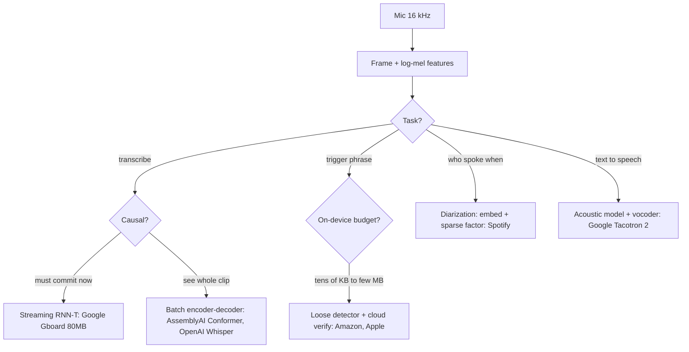
```mermaid
flowchart TD
  A[Mic 16 kHz] --> B[Frame + log-mel features]
  B --> C{Task?}
  C -- transcribe --> D{Causal?}
  C -- trigger phrase --> E{On-device budget?}
  C -- who spoke when --> F[Diarization: embed + sparse factor: Spotify]
  C -- text to speech --> G[Acoustic model + vocoder: Google Tacotron 2]
  D -- must commit now --> H[Streaming RNN-T: Google Gboard 80MB]
  D -- see whole clip --> I[Batch encoder-decoder: AssemblyAI Conformer, OpenAI Whisper]
  E -- tens of KB to few MB --> J[Loose detector + cloud verify: Amazon, Apple]
```

**The choices, side by side.**

| Decision | Options (who) | What decides it |
| --- | --- | --- |
| task | `ASR` vs `wake-word` (Amazon/Apple) vs `TTS` (Google) vs `diarization` (Spotify) | What the product needs: a transcript, a trigger bit, generated speech, or "who spoke when". Each is a different model family, head, and metric |
| architecture | `RNN-T` (Google) vs `Conformer` (AssemblyAI) vs `Whisper seq2seq` (OpenAI) | Streaming forces a monotonic transducer with no external LM; batch accuracy favors conv+attention Conformer; zero-shot breadth favors weakly-supervised multitask seq2seq |
| streaming vs batch | `streaming` (Google RNN-T, Amazon/Apple wake) vs `batch` (AssemblyAI, OpenAI, Spotify, Tacotron) | Live dictation needs a first partial under ~300 ms so it cannot see future audio and must commit; uploads attend over the whole clip and self-correct |
| on-device vs server | `on-device` (Google 80MB RNN-T, Apple 4x256 DNN, VoiceFilter-Lite 2.2MB) vs `server` (AssemblyAI 650K hrs, OpenAI 1.55B, Amazon cloud verifier) | Always-on and privacy paths run on the phone inside a memory/power envelope; heavy or long-audio compute goes to the cloud, where a second stage fires rarely |

**The math that separates them.**

$$\textbf{Word error rate:}\quad \mathrm{WER} = \frac{S + I + D}{N}$$

$$\textbf{Wake-word operating point:}\quad \mathrm{FA/hr},\quad \mathrm{FRR} = \frac{\text{missed triggers}}{\text{true triggers}}$$

$$\textbf{Equal error rate (Apple):}\quad \mathrm{FAR}(\lambda) = \mathrm{FRR}(\lambda)$$

$$\textbf{Speaker match (cosine):}\quad s = \frac{\mathbf{e}\cdot\mathbf{p}}{\lVert\mathbf{e}\rVert\,\lVert\mathbf{p}\rVert} > \lambda$$

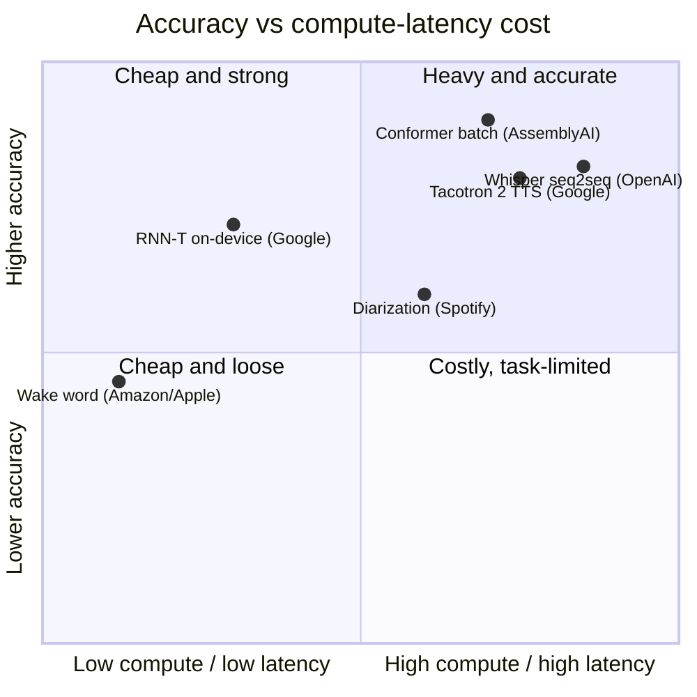
```mermaid
quadrantChart
  title Accuracy vs compute-latency cost
  x-axis "Low compute / low latency" --> "High compute / high latency"
  y-axis "Lower accuracy" --> "Higher accuracy"
  quadrant-1 "Heavy and accurate"
  quadrant-2 "Cheap and strong"
  quadrant-3 "Cheap and loose"
  quadrant-4 "Costly, task-limited"
  "Whisper seq2seq (OpenAI)": [0.85, 0.82]
  "Conformer batch (AssemblyAI)": [0.70, 0.90]
  "RNN-T on-device (Google)": [0.30, 0.72]
  "Wake word (Amazon/Apple)": [0.12, 0.45]
  "Diarization (Spotify)": [0.60, 0.60]
  "Tacotron 2 TTS (Google)": [0.75, 0.80]
```

**The systems**

- **Google** [An All-Neural On-Device Speech Recognizer](https://research.google/blog/an-all-neural-on-device-speech-recognizer/): An RNN-T streaming ASR quantized to 80MB for offline Gboard voice typing. *(deployment)*
- **AssemblyAI** [Conformer-1: robust speech recognition trained on 650K hours](https://www.assemblyai.com/blog/conformer-1): A Conformer batch ASR scaled on 650K hours for noise robustness. *(product design)*
- **OpenAI** [Whisper: Robust Speech Recognition via Large-Scale Weak Supervision](https://github.com/openai/whisper): A weakly-supervised multitask model for zero-shot ASR and translation. *(eval bar)*
- **Amazon** [Alexa's new wake word research at Interspeech](https://www.amazon.science/blog/amazon-alexas-new-wake-word-research-at-interspeech): A metadata-aware on-device wake word plus a cloud verification model. *(product design)*
- **Apple** [Personalized Hey Siri](https://machinelearning.apple.com/research/personalized-hey-siri): On-device speaker-recognition RNN embeddings personalize the Hey Siri trigger. *(product design)*
- **Spotify** [Unsupervised Speaker Diarization using Sparse Optimization](https://research.atspotify.com/2022/09/unsupervised-speaker-diarization-using-sparse-optimization): Tuning-free language-agnostic diarization for podcasts. *(product design)*
- **Google** [Tacotron 2: Generating Human-like Speech from Text](https://research.google/blog/tacotron-2-generating-human-like-speech-from-text/): A seq2seq mel-spectrogram model plus a WaveNet vocoder reaching near-human MOS. *(eval bar)*
- **Google** [Improving On-Device Speech Recognition with VoiceFilter-Lite](https://research.google/blog/improving-on-device-speech-recognition-with-voicefilter-lite/): A 2.2MB streaming speaker-conditioned separation model improving overlapped-speech WER. *(deployment)*
- **Meta** [SeamlessM4T: a foundational multimodal model for speech translation](https://ai.meta.com/blog/seamless-m4t/): Unified speech and text translation and ASR across about 100 languages. *(who it serves)*
- **NVIDIA** [NeMo Parakeet ASR Models](https://developer.nvidia.com/blog/pushing-the-boundaries-of-speech-recognition-with-nemo-parakeet-asr-models/): A GPU-optimized ASR family for high-throughput low-WER production transcription. *(deployment)*
- **PyTorch** [Forced Alignment with Wav2Vec2](https://docs.pytorch.org/audio/stable/tutorials/forced_alignment_tutorial.html): A CTC trellis-backtracking pipeline aligning transcripts to audio timestamps. *(deployment)*

---

### [Cold start and exploration](topics/18-cold-start-and-exploration.md) · 11 systems

**What they share.** Every system logs `(context, action, propensity, reward)`, scores candidates with a reward model, then spends some impressions on uncertainty so a greedy exploit-only policy does not ossify the corpus. They diverge on how exploration is directed, how the arm set is bounded, and how a new policy is scored offline.

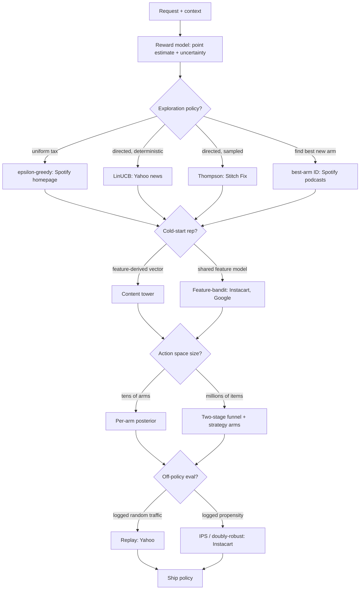
```mermaid
flowchart TD
  REQ[Request + context] --> RANK[Reward model: point estimate + uncertainty]
  RANK --> D1{Exploration policy?}
  D1 -->|uniform tax| EPS[epsilon-greedy: Spotify homepage]
  D1 -->|directed, deterministic| UCB[LinUCB: Yahoo news]
  D1 -->|directed, sampled| TS[Thompson: Stitch Fix]
  D1 -->|find best new arm| BEST[best-arm ID: Spotify podcasts]
  EPS --> D2{Cold-start rep?}
  UCB --> D2
  TS --> D2
  BEST --> D2
  D2 -->|feature-derived vector| CT[Content tower]
  D2 -->|shared feature model| FB[Feature-bandit: Instacart, Google]
  CT --> D3{Action space size?}
  FB --> D3
  D3 -->|tens of arms| SMALL[Per-arm posterior]
  D3 -->|millions of items| FUNNEL[Two-stage funnel + strategy arms]
  SMALL --> D4{Off-policy eval?}
  FUNNEL --> D4
  D4 -->|logged random traffic| REPLAY[Replay: Yahoo]
  D4 -->|logged propensity| IPS[IPS / doubly-robust: Instacart]
  REPLAY --> SHIP[Ship policy]
  IPS --> SHIP
```

**The choices, side by side.**

| Decision | Options (who) | What decides it |
| --- | --- | --- |
| exploration | `epsilon-greedy` (Spotify homepage) vs `LinUCB` (Yahoo) vs `Thompson` vs `best-arm` (Spotify podcasts) | Uniform tax fits a high-traffic surface where explore rate must stay small; directed spend wins when you can estimate per-arm uncertainty; best-arm ID when the goal is finding good new items, not cumulative reward |
| cold-start rep | `content tower` vs `feature-bandit` (Instacart, Google) | Content tower places a fresh entity from metadata for day-zero retrieval; a feature-parameterized reward model shares parameters across arms so a never-seen item gets uncertainty from its features, not ID history |
| large action space | `per-arm posterior` (Stitch Fix, tens of arms) vs `strategy arms + funnel` (Instacart, millions) | Per-arm posteriors do not scale past thousands; retrieval cuts millions to hundreds, or arms become ranking strategies instead of raw items |
| off-policy eval | `replay` (Yahoo) vs `IPS / doubly-robust` (Instacart) | Replay is unbiased but needs uniformly-random logged traffic and burns most of the log; IPS/DR reuse any logged propensity, DR hedges a bad reward model or bad propensities but not both at once |

**The math that separates them.**

**UCB optimistic score**

$$a_t = \arg\max_a \left( \hat{\theta}^\top x_a + \alpha \sqrt{x_a^\top A^{-1} x_a} \right)$$

**Thompson Beta posterior draw**

$$\tilde{\mu}_a \sim \mathrm{Beta}(\alpha_a + s_a,\ \beta_a + f_a), \qquad a_t = \arg\max_a \tilde{\mu}_a$$

**IPS off-policy estimate**

$$\hat{V}_{\mathrm{IPS}}(\pi) = \frac{1}{n} \sum_{i=1}^{n} \frac{\pi(a_i \mid x_i)}{\pi_0(a_i \mid x_i)}\, r_i$$

**Doubly-robust estimate**

$$\hat{V}_{\mathrm{DR}}(\pi) = \frac{1}{n} \sum_{i=1}^{n} \left[ \hat{r}(x_i, \pi) + \frac{\pi(a_i \mid x_i)}{\pi_0(a_i \mid x_i)} \big( r_i - \hat{r}(x_i, a_i) \big) \right]$$

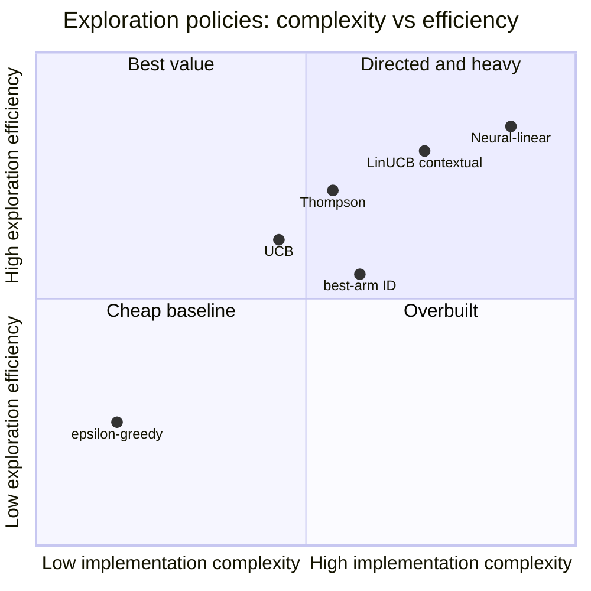
```mermaid
quadrantChart
  title Exploration policies: complexity vs efficiency
  x-axis "Low implementation complexity" --> "High implementation complexity"
  y-axis "Low exploration efficiency" --> "High exploration efficiency"
  quadrant-1 "Directed and heavy"
  quadrant-2 "Best value"
  quadrant-3 "Cheap baseline"
  quadrant-4 "Overbuilt"
  "epsilon-greedy": [0.15, 0.25]
  "UCB": [0.45, 0.62]
  "Thompson": [0.55, 0.72]
  "LinUCB contextual": [0.72, 0.80]
  "Neural-linear": [0.88, 0.85]
  "best-arm ID": [0.60, 0.55]
```

**The systems**

- **Netflix** [Artwork Personalization at Netflix](https://netflixtechblog.com/artwork-personalization-c589f074ad76): Contextual bandits pick per-member title artwork, small action space, cache-served at scale. *(product design)*
- **Netflix** [Infra for Contextual Bandits and Reinforcement Learning](https://netflixtechblog.com/ml-platform-meetup-infra-for-contextual-bandits-and-reinforcement-learning-4a90305948ef): Production infra for reward computation, logging, and offline policy evaluation of bandits. *(deployment)*
- **Spotify** [Identifying New Podcasts with a Pure-Exploration Infinitely-Armed Bandit](https://research.atspotify.com/publications/identifying-new-podcasts-with-high-general-appeal-using-a-pure-exploration-infinitely-armed-bandit-strategy): A pure-exploration bandit surfaces broadly-appealing new podcasts without popularity bias. *(who it serves)*
- **Spotify** [Calibrated Recommendations with Contextual Bandits on the Homepage](https://research.atspotify.com/2025/9/calibrated-recommendations-with-contextual-bandits-on-spotify-homepage): A contextual bandit balances the music, podcast, audiobook mix per user context. *(product design)*
- **Spotify** [Impatient Bandits: Optimizing for the Long-Term Without Delay](https://research.atspotify.com/publications/impatient-bandits-optimizing-for-the-long-term-without-delay): A delayed-reward bandit picks a reward signal to optimize long-term engagement. *(eval bar)*
- **DoorDash** [Personalized Cuisine Filter](https://careersatdoordash.com/blog/personalized-cuisine-filter/): A multi-armed bandit with geo-hierarchy priors handles new-user and new-district cold start. *(who it serves)*
- **Yahoo** [A Contextual-Bandit Approach to Personalized News Article Recommendation](https://arxiv.org/abs/1003.0146): The LinUCB news bandit plus offline replay evaluation on 33M events. *(eval bar)*
- **Stitch Fix** [Multi-Armed Bandits and the Experimentation Platform](https://multithreaded.stitchfix.com/blog/2020/08/05/bandits/): Thompson-sampling bandits as a first-class experiment type with a reward service. *(deployment)*
- **Instacart** [Contextual Bandit models in large action spaces](https://company.instacart.com/tech-innovation/using-contextual-bandit-models-in-large-action-spaces-at-instacart): Contextual bandits for product recs when the catalog action space is very large. *(deployment)*
- **Duolingo** [A Sleeping, Recovering Bandit for Optimizing Recurring Notifications](https://research.duolingo.com/papers/yancey.kdd20.pdf): A recovering bandit picks the daily reminder with a recency penalty, lifting retention. *(product design)*
- **Google** [Long-Term Value of Exploration](https://arxiv.org/abs/2305.07764): Neural-linear bandit exploration grows the content corpus, breaking feedback-loop ossification. *(eval bar)*

---

### [Computer vision](topics/12-computer-vision.md) · 11 systems

**What they share.** Every system runs the same spine: canonical ingest (decode, EXIF fix, resize, normalize) feeds a pretrained backbone whose features drive a task-specific head, and human review turns decisions back into fresh labels. Only the head, the serving shape, and the metric change.

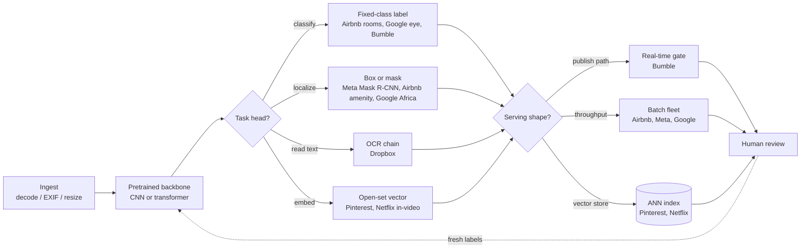
```mermaid
flowchart LR
  ING[Ingest\ndecode / EXIF / resize] --> BB[Pretrained backbone\nCNN or transformer]
  BB --> D1{Task head?}
  D1 -->|classify| CLS[Fixed-class label\nAirbnb rooms, Google eye, Bumble]
  D1 -->|localize| LOC[Box or mask\nMeta Mask R-CNN, Airbnb amenity, Google Africa]
  D1 -->|read text| OCR[OCR chain\nDropbox]
  D1 -->|embed| EMB[Open-set vector\nPinterest, Netflix in-video]
  CLS --> D2{Serving shape?}
  LOC --> D2
  OCR --> D2
  EMB --> D2
  D2 -->|publish path| RT[Real-time gate\nBumble]
  D2 -->|throughput| BT[Batch fleet\nAirbnb, Meta, Google]
  D2 -->|vector store| AN[(ANN index\nPinterest, Netflix)]
  RT --> REV[Human review]
  BT --> REV
  AN --> REV
  REV -.fresh labels.-> BB
```

**The choices, side by side.**

| Decision | Options (who) | What decides it |
| --- | --- | --- |
| task head | `classify` (Airbnb rooms, Google eye, Bumble) vs `detect Mask R-CNN` (Meta) vs `segment U-Net` (Google Africa, Zalando) vs `embed/visual-search` (Pinterest, Netflix) vs `OCR` (Dropbox) | What the head must emit: a fixed-class label, a localized box or mask, read text, or an open-set vector. Whole image vs where vs which pixels vs open catalog. |
| backbone | `CNN ResNet` (Airbnb, default) vs `EfficientNet` (Bumble gate, high-volume tagging) vs `ViT/Swin` (data-rich detection and segmentation) vs `CLIP` (Netflix in-video, text-to-image) | Cost and accuracy knob. ResNet is the reliable default; EfficientNet buys FLOPs back when cost per million dominates; ViT/Swin want more data and compute; CLIP when you need a shared image-text space. |
| labeling | `active learning` (label uncertain, cut box cost) vs `consensus` (3 to 7 graders, Google eye) vs `self-training` (Noisy Student on 8.7M tiles, Google Africa) | Label budget, not GPUs, gates the early phase. Costlier labels (boxes, masks, medical) push toward active learning and consensus; abundant unlabeled data enables self-training. |
| serving | `real-time gate` (Bumble, publish path) vs `batch` (Airbnb, Meta, Google, throughput-optimized) vs `ANN index` (Pinterest, Netflix, offline precompute) | Latency economics. On the publish path you need a tight p99 and a fail-closed policy; async tagging optimizes cost per million; open-set retrieval precomputes and rebuilds an index offline. |

**The math that separates them.**

$$\textbf{IoU (localization overlap): } \quad \mathrm{IoU} = \frac{|A \cap B|}{|A \cup B|}$$

$$\textbf{mAP over IoU sweep: } \quad \mathrm{mAP} = \frac{1}{|C|}\sum_{c \in C}\int_{0}^{1} p_c(r)\,dr, \quad \text{IoU} \in [0.5{:}0.95]$$

$$\textbf{recall at precision floor: } \quad \max_{\tau}\ \mathrm{Recall}(\tau) \quad \text{s.t.}\ \mathrm{Precision}(\tau) \ge \pi_0$$

$$\textbf{contrastive image-text loss: } \quad \mathcal{L} = -\frac{1}{2N}\sum_{i} \left[ \log\frac{e^{s_{ii}/\tau}}{\sum_{j} e^{s_{ij}/\tau}} + \log\frac{e^{s_{ii}/\tau}}{\sum_{j} e^{s_{ji}/\tau}} \right]$$

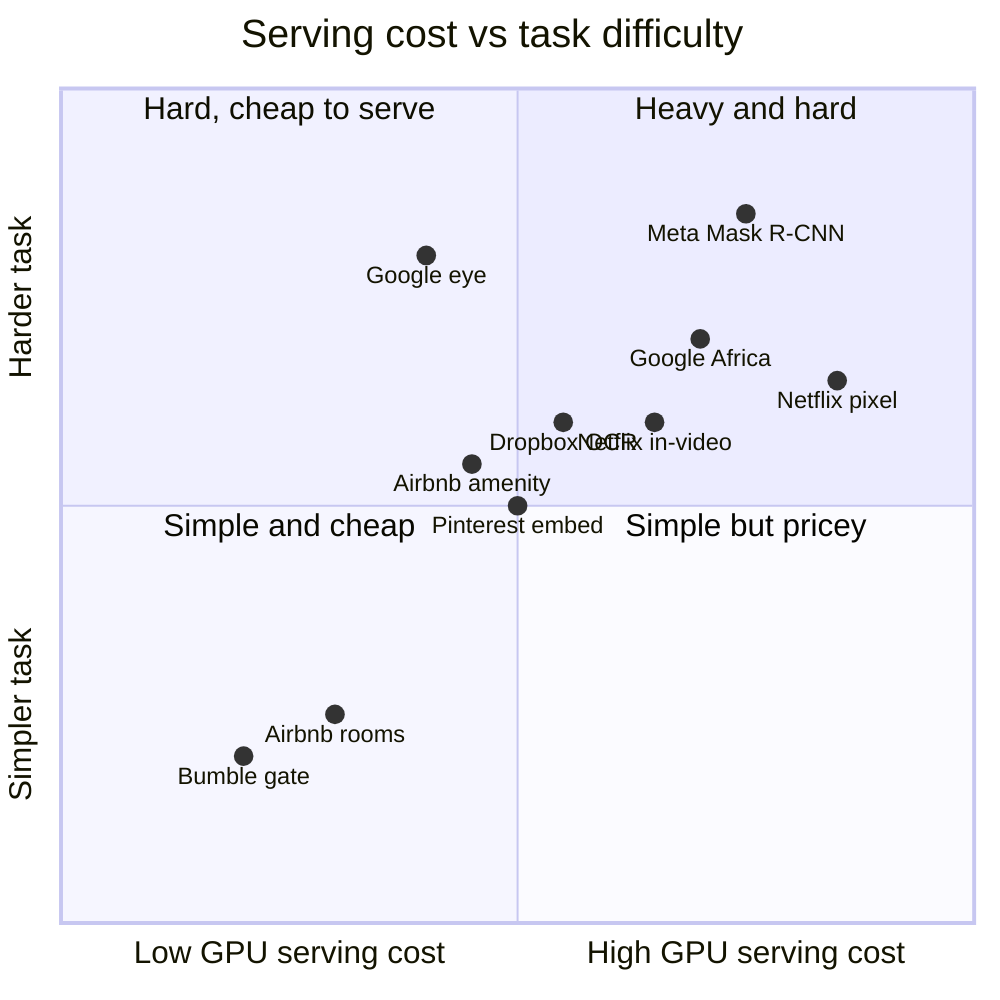
```mermaid
quadrantChart
  title Serving cost vs task difficulty
  x-axis "Low GPU serving cost" --> "High GPU serving cost"
  y-axis "Simpler task" --> "Harder task"
  quadrant-1 "Heavy and hard"
  quadrant-2 "Hard, cheap to serve"
  quadrant-3 "Simple and cheap"
  quadrant-4 "Simple but pricey"
  "Airbnb rooms": [0.30, 0.25]
  "Bumble gate": [0.20, 0.20]
  "Airbnb amenity": [0.45, 0.55]
  "Dropbox OCR": [0.55, 0.60]
  "Pinterest embed": [0.50, 0.50]
  "Meta Mask R-CNN": [0.75, 0.85]
  "Google Africa": [0.70, 0.70]
  "Netflix pixel": [0.85, 0.65]
  "Netflix in-video": [0.65, 0.60]
  "Google eye": [0.40, 0.80]
```

**The systems**

- **Airbnb** [Categorizing Listing Photos at Airbnb](https://medium.com/airbnb-engineering/categorizing-listing-photos-at-airbnb-f9483f3ab7e3): ResNet-50 classifies 500M+ listing photos by room type to organize home tours. *(product design)*
- **Airbnb** [Amenity Detection and Beyond](https://medium.com/airbnb-engineering/amenity-detection-and-beyond-new-frontiers-of-computer-vision-at-airbnb-144a4441b72e): Object detection finds amenities in listing photos for moderation and consumer features. *(product design)*
- **Meta (FAIR)** [Mask R-CNN](https://ai.meta.com/research/publications/mask-r-cnn/): Instance segmentation extending Faster R-CNN with a mask branch; top COCO results. *(eval bar)*
- **Dropbox** [Using machine learning to index text from billions of images](https://dropbox.tech/machine-learning/using-machine-learning-to-index-text-from-billions-of-images): In-house classifier, corner detection, and OCR make scanned text searchable at 20B-image scale. *(deployment)*
- **Pinterest** [Unifying visual embeddings for visual search](https://medium.com/pinterest-engineering/unifying-visual-embeddings-for-visual-search-at-pinterest-74ea7ea103f0): One multi-task embedding replaces per-product models across Lens, crop, and Shop the Look. *(deployment)*
- **Zalando** [Shop the Look with Deep Learning](https://engineering.zalando.com/posts/2018/09/shop-look-deep-learning.html): ConvNet matching plus U-Net segmentation finds catalog items from real-world photos. *(product design)*
- **Netflix** [Accelerating Video Quality Control with Pixel Error Detection](https://netflixtechblog.com/accelerating-video-quality-control-at-netflix-with-pixel-error-detection-47ef7af7ca2e): A full-resolution CNN over 5 frames detects pixel defects, cutting manual QC to minutes. *(eval bar)*
- **Netflix** [Building In-Video Search](https://netflixtechblog.com/building-in-video-search-936766f0017c): Contrastive image-text embeddings, precomputed and served via Elasticsearch, let editors search footage by text. *(deployment)*
- **Google Research** [Mapping Africa's Buildings with Satellite Imagery](https://research.google/blog/mapping-africas-buildings-with-satellite-imagery/): A U-Net trained on 1.75M labeled buildings maps 516M structures across Africa. *(eval bar)*
- **Google Research** [Deep Learning for Detection of Diabetic Eye Disease](https://research.google/blog/deep-learning-for-detection-of-diabetic-eye-disease/): A CNN on 128K retinal images detects diabetic retinopathy at ophthalmologist-level F-score. *(who it serves)*
- **Bumble** [Open-sourcing Private Detector](https://medium.com/bumble-tech/bumble-inc-open-sources-private-detector-and-makes-another-step-towards-a-safer-internet-for-women-8e6cdb111d81): An EfficientNetV2 binary classifier flags and blurs unsolicited lewd images at over 98% accuracy. *(product design)*

---

### [Natural language processing](topics/13-natural-language-processing.md) · 11 systems

**What they share.** Every system normalizes and tokenizes free text once, then fans out to a task-specific model whose score a threshold either auto-acts on or routes to human review, whose verdicts flow back as fresh labels. None puts a large LLM on the inline firehose; volume forces a small, calibratable model on the hot path.

```mermaid
flowchart TD
  TXT["free text<br/>(ticket / listing / message)"] --> TOK["normalize + tokenize<br/>(subword, language ID)"]
  TOK --> D1{"decision vs<br/>generation?"}
  D1 -->|"fixed decision"| D2{"one label<br/>or per-token?"}
  D1 -->|"generate text"| S2S["seq2seq encoder-decoder<br/>Google GNMT, Meta NMT, Grammarly"]
  D2 -->|"one label"| CLS["classification head<br/>Uber Maps, Meta hate speech, Pinterest, Uber COTA, Airbnb voice"]
  D2 -->|"per-token / span"| NER["token-tagging head<br/>Airbnb Listings, Grammarly GECToR"]
  D2 -->|"match to taxonomy"| ER["bi-encoder + ANN match<br/>LinkedIn Knowledge Graph"]
  CLS --> GATE{"confident<br/>threshold?"}
  NER --> GATE
  ER --> GATE
  S2S --> GATE
  GATE -->|"yes"| ACT["auto-route / auto-block / emit"]
  GATE -->|"no / high-risk"| HUM["human review"]
  HUM --> LBL["new labels"]
  LBL --> TOK
```

**The choices, side by side.**

| Decision | Options (who) | What decides it |
| --- | --- | --- |
| task | `classify` (Uber Maps, Meta hate speech, Pinterest, Uber COTA, Airbnb voice) vs `NER/tagging` (Airbnb Listings, Grammarly) vs `translation/seq2seq` (Google GNMT, Meta NMT) vs `entity resolution` (LinkedIn KG) | Fixed decision uses an encoder head; generating new text needs seq2seq; matching messy strings to a canonical entity is embed-and-match |
| model era | `TF-IDF/LSA/RF` (Uber COTA) vs `CNN/LSTM` (Uber Maps, Airbnb Listings, LinkedIn abuse, Google/Meta NMT) vs `BERT encoder` (Airbnb scorer, Grammarly GECToR) vs `RIO/Linformer LLM` (Meta hate speech) | Label volume, latency budget, and when the writeup shipped; a distilled encoder beats a big LLM inline at scale |
| latency/volume | `inline` (Meta hate-speech firehose, Airbnb voice under 50ms) vs `batch` (Uber Maps weekly Spark, Pinterest PySpark) | Interactive tasks on live traffic run in tens of ms; offline enrichment or enforcement can batch for cost |
| supervision/multilingual | manual labels (Uber Maps), weak/synthetic labels (Pinterest, Grammarly), member-confirmed feedback loop (LinkedIn KG/abuse), bilingual human ratings (Google/Meta NMT); English-only vs 2,000+ directions (Meta NMT) | Cost and asymmetry of errors, plus whether cross-lingual transfer is needed; multilingual dilutes per-language capacity |

**The math that separates them.**

$$\textbf{per-class F1: } F_1 = \frac{2 \cdot P \cdot R}{P + R}, \quad P = \frac{TP}{TP+FP}, \quad R = \frac{TP}{TP+FN}$$

$$\textbf{weighted cross-entropy: } \mathcal{L} = -\frac{1}{N}\sum_{i=1}^{N} w_{y_i}\, \log p_{\theta}(y_i \mid x_i)$$

$$\textbf{F-beta (correction, } \beta=0.5\textbf{): } F_{\beta} = (1+\beta^2)\,\frac{P \cdot R}{\beta^2 P + R}$$

$$\textbf{seq2seq attention decode: } p(y_t \mid y_{<t}, x) = \mathrm{softmax}\!\left(W \sum_{j} \alpha_{tj}\, h_j\right)$$

```mermaid
quadrantChart
  title Model cost/latency vs task complexity
  x-axis "cheap / inline" --> "expensive / heavy"
  y-axis "simple decision" --> "complex generation"
  quadrant-1 "heavy generation"
  quadrant-2 "cheap generation"
  quadrant-3 "cheap decision"
  quadrant-4 "heavy decision"
  "Uber COTA TF-IDF+RF": [0.18, 0.28]
  "Uber Maps WordCNN": [0.25, 0.20]
  "Airbnb voice classifier": [0.30, 0.32]
  "LinkedIn abuse LSTM": [0.42, 0.48]
  "Pinterest DNN+graph": [0.45, 0.40]
  "LinkedIn KG resolution": [0.48, 0.52]
  "Airbnb CNN NER": [0.40, 0.55]
  "Grammarly GECToR": [0.55, 0.70]
  "Meta hate speech RIO": [0.80, 0.60]
  "Google GNMT seq2seq": [0.85, 0.88]
  "Meta NMT LSTM+attn": [0.82, 0.90]
```

**The systems**

- **Uber** [Applying Customer Feedback: NLP and Deep Learning Improve Uber's Maps](https://www.uber.com/gb/en/blog/nlp-deep-learning-uber-maps/): Word2Vec plus a word-level CNN classify support tickets to find map-data errors. *(product design)*
- **Airbnb** [Building Airbnb's Listing Knowledge from big text data](https://medium.com/airbnb-engineering/wisdom-of-unstructured-data-building-airbnbs-listing-knowledge-from-big-text-data-7c533466a63c): A CNN-based NER extracts amenities and facilities from free-text listings into a taxonomy. *(product design)*
- **Meta** [How AI is getting better at detecting hate speech](https://ai.meta.com/blog/how-ai-is-getting-better-at-detecting-hate-speech/): RIO plus Linformer proactively detect toxic text and image content at scale. *(deployment)*
- **Google** [A Neural Network for Machine Translation, at Production Scale](https://research.google/blog/a-neural-network-for-machine-translation-at-production-scale/): GNMT seq2seq cuts translation errors 55 to 85% over phrase-based systems. *(deployment)*
- **Meta** [Transitioning entirely to neural machine translation](https://engineering.fb.com/2017/08/03/ml-applications/transitioning-entirely-to-neural-machine-translation/): LSTM-plus-attention NMT deployed across 2,000+ directions, 4.5B daily translations. *(deployment)*
- **LinkedIn** [Building The LinkedIn Knowledge Graph](https://www.linkedin.com/blog/engineering/knowledge/building-the-linkedin-knowledge-graph): Entity resolution and standardization of user-generated entities into a canonical taxonomy. *(deployment)*
- **Pinterest** [How Pinterest Fights Spam Using Machine Learning](https://medium.com/pinterest-engineering/how-pinterest-fights-spam-using-machine-learning-d0ee2589f00a): A DNN plus clustering plus graph label-propagation flag spam domains and users. *(deployment)*
- **LinkedIn** [Using deep learning to detect abusive sequences of member activity](https://www.linkedin.com/blog/engineering/trust-and-safety/using-deep-learning-to-detect-abusive-sequences-of-member-activi): An LSTM classifies member activity sequences as scraping or abuse. *(eval bar)*
- **Uber** [COTA: Improving Uber Customer Care with NLP and ML](https://www.uber.com/blog/cota/): An NLP model suggests top issue types and solutions to route and resolve tickets. *(product design)*
- **Airbnb** [How ML Transforms Airbnb's Voice Support Experience](https://airbnb.tech/ai-ml/listening-learning-and-helping-at-scale-how-machine-learning-transforms-airbnbs-voice-support-experience/): Contact-reason detection classifies issues to self-serve or route to an agent. *(product design)*
- **Grammarly** [Grammatical Error Correction: Tag, Not Rewrite](https://www.grammarly.com/blog/engineering/gec-tag-not-rewrite/): GECToR tags word-level transformations instead of generating, for fast correction. *(eval bar)*

---

### [Demand forecasting & time series](topics/14-demand-forecasting-and-time-series.md) · 10 systems

**What they share.** Every system assembles a historical series plus calendar and covariates into features, fits a model that emits a point or probabilistic forecast, and hands that output to a downstream decision, closing the loop with a chronological rolling backtest that retrains as series drift. The forecast is the intermediate; the decision it feeds is the product.

```mermaid
flowchart TD
  HIST["historical series + calendar / covariates"] --> FEAT["feature assembly"]
  FEAT --> D1{"model family?"}
  D1 -->|"classical + ML + deep portfolio"| UBER["Uber (forecasting intro)"]
  D1 -->|"Transformer residual on baseline"| DEEPETA["Uber DeepETA"]
  D1 -->|"global GBT + Monte Carlo"| ZAL["Zalando ZEOS"]
  D1 -->|"GNN over graph"| DM["Google DeepMind Maps"]
  UBER --> D2{"output shape?"}
  ZAL --> D2
  D2 -->|"point + interval"| PT["capacity, positioning"]
  D2 -->|"full distribution"| PROB["Amazon, Zalando, Instacart"]
  PROB --> D3{"hierarchy / spatial structure?"}
  D3 -->|"levels must reconcile"| RECON["Amazon (end-to-end coherent)"]
  D3 -->|"fallback cascade by cadence"| CASC["Instacart (general / trending / real-time)"]
  D3 -->|"spatial graph diffusion"| SPAT["DeepMind GNN, Grab geo-cells"]
  RECON --> DEC["downstream decision"]
  CASC --> DEC
  SPAT --> DEC
  PT --> DEC
  DEC --> BT["rolling-origin backtest"]
  BT -->|"retrain"| FEAT
```

**The choices, side by side.**

| Decision | Options (who) | What decides it |
| --- | --- | --- |
| model family | `classical/ML` (Uber intro) vs `deep DeepETA` (Uber) vs `GNN spatiotemporal` (DeepMind) vs `global GBT` (Zalando) | Count of related series, horizon, covariate richness, and whether a strong baseline already exists to correct |
| output | `point` (DeepETA, DeepMind) vs `quantile/distribution` (Amazon, Zalando, Instacart) | Whether a downstream optimizer needs safety stock off a quantile, or one inline estimate suffices |
| hierarchy | `end-to-end reconciliation` (Amazon) vs `fallback cascade` (Instacart general/trending/real-time) | Whether levels must sum coherently by construction, or a layered baseline plus correction under a cost-per-prediction budget |
| spatial / ETA residual | `residual on routing baseline` (Uber DeepETA) vs `GNN message passing` (DeepMind) vs `distance-weighted geo-cells` (Grab) | Whether a physical baseline exists to correct under latency, congestion diffuses across a graph, or sparse cells need neighbor borrowing |

**The math that separates them.**

$$\textbf{Pinball loss, quantile tau} \quad L_\tau(y,\hat q)=\max\big(\tau(y-\hat q),\,(\tau-1)(y-\hat q)\big)$$

$$\textbf{MASE, scale-free point} \quad \mathrm{MASE}=\frac{\frac{1}{H}\sum_{t}\lvert y_t-\hat y_t\rvert}{\frac{1}{n-m}\sum_{t=m+1}^{n}\lvert y_t-y_{t-m}\rvert}$$

$$\textbf{Weighted quantile loss} \quad \mathrm{WQL}=\frac{2\sum_{i}\sum_{\tau} L_\tau(y_i,\hat q_{i,\tau})}{\sum_{i}\lvert y_i\rvert}$$

$$\textbf{Asymmetric Huber, DeepETA} \quad L(r)=\begin{cases} \tfrac{1}{2}r^2 & \lvert r\rvert\le\delta \\ \delta\,w(r)\big(\lvert r\rvert-\tfrac{1}{2}\delta\big) & \lvert r\rvert>\delta \end{cases}$$

```mermaid
quadrantChart
  title Model complexity vs calibration
  x-axis "Low complexity" --> "High complexity"
  y-axis "Point only" --> "Calibrated / coherent"
  quadrant-1 "Heavy and probabilistic"
  quadrant-2 "Light and probabilistic"
  quadrant-3 "Light and point"
  quadrant-4 "Heavy and point"
  "Uber classical/ML": [0.22, 0.55]
  "Zalando LightGBM + MC": [0.45, 0.78]
  "Amazon coherent net": [0.82, 0.92]
  "Instacart layered": [0.4, 0.6]
  "Uber DeepETA": [0.7, 0.35]
  "DeepMind GNN": [0.88, 0.42]
  "Grab geo ratios": [0.18, 0.2]
```

**The systems**

- **Uber** [Forecasting at Uber: An Introduction](https://www.uber.com/blog/forecasting-introduction/): An overview of Uber's classical, ML, and deep-learning forecasting stack with prediction intervals. *(product design)*
- **Uber** [Engineering Uncertainty Estimation in Neural Networks for Time Series](https://www.uber.com/blog/neural-networks-uncertainty-estimation/): A Bayesian neural net decomposing model, misspecification, and noise uncertainty. *(eval bar)*
- **Uber** [DeepETA: How Uber Predicts Arrival Times Using Deep Learning](https://www.uber.com/us/en/blog/deepeta-how-uber-predicts-arrival-times/): A Transformer-based ETA residual model meeting global latency and accuracy constraints. *(deployment)*
- **Amazon Science** [End-to-end learning of coherent probabilistic forecasts for hierarchical time series](https://www.amazon.science/publications/end-to-end-learning-of-coherent-probabilistic-forecasts-for-hierarchical-time-series): One model producing coherent probabilistic hierarchical forecasts without post-hoc reconciliation. *(product design)*
- **Google DeepMind** [Traffic prediction with advanced Graph Neural Networks](https://deepmind.google/blog/traffic-prediction-with-advanced-graph-neural-networks/): Graph neural nets over road Supersegments improving Google Maps ETA accuracy up to 50%. *(deployment)*
- **Instacart** [Building for Balance](https://company.instacart.com/how-its-made/building-for-balance): A unified engine forecasting shopper supply versus customer demand to guide interventions. *(product design)*
- **Instacart** [Modernizing real-time availability prediction for hundreds of millions of items](https://company.instacart.com/tech-innovation/how-instacart-modernized-the-prediction-of-real-time-availability-for-hundreds-of-millions-of-items-while-saving-costs): A hierarchical general, trending, and real-time model, cutting cost about 80%. *(deployment)*
- **Zalando** [Building a dynamic inventory optimisation system](https://engineering.zalando.com/posts/2025/06/inventory-optimisation-system.html): Probabilistic demand forecasts plus Monte Carlo optimization for replenishment. *(product design)*
- **Grab** [Understanding Supply and Demand in Ride-hailing Through Data](https://engineering.grab.com/understanding-supply-demand-ride-hailing-data): Measuring geo and time supply-demand ratios to improve matching and rebalance. *(eval bar)*
- **Lyft** [Causal Forecasting at Lyft (Part 1)](https://eng.lyft.com/causal-forecasting-at-lyft-part-1-14cca6ff3d6d): Causal-DAG-based forecasting of marketplace metrics for policy decisions under confounding. *(product design)*

---

### [Predictive modeling on tabular data](topics/15-predictive-modeling-tabular.md) · 9 systems

**What they share.** Every system builds point-in-time features, scores an entity, then hands the number to a decision layer that turns it into money, with calibration wedged in whenever the absolute probability (not the ranking) sets the amount.

```mermaid
flowchart LR
  F["point-in-time features"] --> B1{"what must the<br/>score answer?"}
  B1 -->|"rank risk / value"| GBDT["plain GBDT point estimate<br/>Airbnb home value, Expedia CLV"]
  B1 -->|"WHEN it happens"| SURV["survival curve<br/>Nubank, Block (Square)"]
  B1 -->|"WHETHER to intervene"| CAUSE["uplift / causal<br/>Wayfair, Uber, Gojek"]
  GBDT --> B2{"absolute value<br/>sets money?"}
  SURV --> B2
  CAUSE --> B2
  B2 -->|"yes"| CAL["calibration layer<br/>Nubank, Expedia"]
  B2 -->|"no, ranks only"| RANK["threshold on rank"]
  CAL --> B3{"fixed budget<br/>to allocate?"}
  RANK --> B3
  B3 -->|"free threshold"| EV["EV cutoff"]
  B3 -->|"budget cap"| OPT["optimizer<br/>Uber convex, Gojek knapsack"]
```

**The choices, side by side.**

| Decision | Options (who) | What decides it |
| --- | --- | --- |
| prediction target | `risk` (Nubank) vs `churn` (Block) vs `LTV` (Airbnb, Expedia) vs `pricing` (Uber, Zalando) | which money decision the score feeds: a credit limit, a retention action, a budget, or a price |
| plain vs causal | `classification` (Airbnb home value, Expedia) vs `uplift/causal` (Wayfair, Uber, Gojek) | is the question "who will act" (predict) or "whose behavior changes if I act" (intervene) |
| time-to-event | `survival` (Nubank, Block) vs point estimate (Airbnb, Expedia) | does WHEN it lands matter, and are there censored not-yet-resolved rows worth keeping |
| calibration + decision | rank-only vs `calibrate then EV threshold` (Nubank) vs `calibrate then optimizer` (Uber, Gojek) | does the absolute probability set the money, and is there a fixed budget to allocate under |

**The math that separates them.**

$$\textbf{EV approve threshold}\qquad p^{*}=\frac{L_{\text{fp}}}{L_{\text{fp}}+G_{\text{tp}}},\qquad \text{approve when } p(\text{good})\,G_{\text{tp}} > p(\text{bad})\,L_{\text{fp}}$$

$$\textbf{Survival from hazard}\qquad S(t)=\Pr(T>t)=\exp\!\left(-\int_{0}^{t}\lambda(u)\,du\right)$$

$$\textbf{CATE uplift (persuadables)}\qquad \tau(x)=\mathbb{E}[Y \mid X{=}x, W{=}1]-\mathbb{E}[Y \mid X{=}x, W{=}0]$$

$$\textbf{LTV as discounted survival}\qquad \mathrm{LTV}=\sum_{t=1}^{H}\frac{S(t)\,m(t)}{(1+d)^{t}}$$

```mermaid
quadrantChart
  title "modeling complexity vs decision value at stake"
  x-axis "Low modeling complexity" --> "High modeling complexity"
  y-axis "Ranking-only value" --> "Money-setting value"
  quadrant-1 "worth the causal + optimizer cost"
  quadrant-2 "calibration is the leverage"
  quadrant-3 "simple point estimate"
  quadrant-4 "complex but only ranks"
  "Airbnb home value": [0.28, 0.30]
  "Expedia CLV": [0.55, 0.62]
  "Block survival": [0.60, 0.42]
  "Nubank risk": [0.66, 0.90]
  "Wayfair uplift": [0.70, 0.66]
  "Uber causal + convex": [0.92, 0.88]
  "Gojek uplift + knapsack": [0.88, 0.84]
```

**The systems**

- **Nubank** [How Nubank models risk for scalable credit limit increases](https://building.nubank.com/how-nubank-models-risk-for-smarter-scalable-credit-limit-increases/): Survival curves plus two-phase ranking-then-calibration for default risk across 122M customers. *(product design)*
- **Block (Square)** [PySurvival Tutorial: Churn Modeling](https://developer.squareup.com/blog/pysurvival-tutorial-churn-modeling/): A conditional survival forest predicting subscription churn timing, C-index 0.83. *(eval bar)*
- **Airbnb** [How Airbnb measures Listing Lifetime Value](https://medium.com/airbnb-engineering/how-airbnb-measures-listing-lifetime-value-a603bf05142c): An ML framework for baseline, incremental, and marketing-induced listing LTV over 365 days. *(product design)*
- **Airbnb** [Using Machine Learning to Predict Value of Homes on Airbnb](https://medium.com/airbnb-engineering/using-machine-learning-to-predict-value-of-homes-on-airbnb-9272d3d4739d): XGBoost on 150+ tabular features for listing value, with a full productionization pipeline. *(deployment)*
- **Expedia Group** [Expedia Group's Customer Lifetime Value Prediction Model](https://medium.com/expedia-group-tech/expedia-groups-customer-lifetime-value-prediction-model-7927cdd44342): A cross-brand CatBoost CLV model on a unified platform with deployment and monitoring. *(deployment)*
- **Wayfair** [Building Scalable Marketing ML Systems at Wayfair](https://www.aboutwayfair.com/careers/tech-blog/building-scalable-and-performant-marketing-ml-systems-at-wayfair): Propensity and uplift models scoring customers for programmatic marketing decisions. *(product design)*
- **Uber** [Practical Marketplace Optimization Using Causally-Informed ML](https://arxiv.org/abs/2407.19078): Causal ML plus convex optimization to allocate driver-incentive and rider-promotion budgets. *(product design)*
- **Gojek** [How Gojek Allocates Personalised Vouchers At Scale](https://medium.com/gojekengineering/how-gojek-allocates-personalised-vouchers-at-scale-41cad5d6f218): A causal uplift persuadables model plus a knapsack optimizer for voucher allocation. *(product design)*
- **Zalando** [How Zalando optimized large-scale inference and streamlined ML operations](https://aws.amazon.com/blogs/machine-learning/how-zalando-optimized-large-scale-inference-and-streamlined-ml-operations-on-amazon-sagemaker/): A forecast-then-optimize markdown and discount-steering pricing system across 1M+ products. *(deployment)*

---

### [Embeddings & representation learning](topics/07-embeddings-and-representation-learning.md) · 8 systems

**What they share.** Every system runs the same skeleton: mine positive pairs from behavioral logs, contrast them against negatives to train an encoder, batch-embed the entity set, and load the vectors into an ANN index that retrieval, ranking, and other tasks reuse. What varies is only the join that defines "related" and whether the encoder is inductive or transductive.

```mermaid
flowchart TD
  L["interaction / co-occurrence logs"] --> P["build positive pairs"]
  P --> B1{"encoder family?"}
  B1 -->|graph aggregation| G["GraphSAGE / PinSage / LightGCN"]
  B1 -->|two-tower dot product| T["Spotify / Instacart"]
  B1 -->|sequence co-occurrence| S["Airbnb / Wayfair"]
  B1 -->|text contrastive| X["SimCSE"]
  G --> B2{"negatives?"}
  T --> B2
  S --> B2
  X --> B2
  B2 -->|in-batch| IB["Spotify / SimCSE"]
  B2 -->|hard / curriculum| HN["PinSage / Instacart"]
  B2 -->|market-aware| MK["Airbnb"]
  IB --> B3{"inductive?"}
  HN --> B3
  MK --> B3
  B3 -->|content features, embeds new| IND["GraphSAGE / PinSage / two-tower"]
  B3 -->|id-bound, retrain for new| TRA["LightGCN / Airbnb"]
  IND --> IDX["batch-embed then ANN index"]
  TRA --> IDX
  IDX --> DOWN["retrieval / ranking / fraud"]
```

**The choices, side by side.**

| Decision | Options (who) | What decides it |
| --- | --- | --- |
| encoder family | `graph GraphSAGE/PinSage/LightGCN` vs `two-tower Spotify/Instacart` vs `text SimCSE` vs `sequence Airbnb/Wayfair` | Whether relatedness is a graph edge, a query-vs-item pair, plain text, or session order, and what features each entity carries |
| contrastive negatives | `in-batch (Spotify/SimCSE)` vs `hard/curriculum (PinSage/Instacart)` vs `same-market (Airbnb)` vs `NLI hard (SimCSE-sup)` | In-batch is free but easy and popularity-biased; hard negatives sharpen the boundary but risk false negatives and instability |
| dimensionality/cold-start | `inductive (GraphSAGE/PinSage/two-tower)` vs `transductive (LightGCN/Airbnb ids)` | Content features let a new entity map to a point with zero history; id-only vectors have nothing until retrain, so they need a fallback |
| index/freshness | `HNSW/FAISS (Instacart/Spotify)` vs `IVF-PQ at scale` vs `MapReduce batch (PinSage)` vs `hourly feature store (Wayfair)` | Catalog size, memory budget, and how fast a new entity or new behavior must become queryable |

**The math that separates them.**

$$\mathcal{L}_{\text{InfoNCE}} = -\log \frac{\exp(\mathrm{sim}(z_i, z_i^{+}) / \tau)}{\sum_{j} \exp(\mathrm{sim}(z_i, z_j) / \tau)} \qquad \textbf{InfoNCE with temperature}$$

$$s'(x, y) = s(x, y) - \log Q(y) \qquad \textbf{logQ popularity correction}$$

$$\mathrm{sim}(u, v) = \frac{u \cdot v}{\lVert u \rVert \, \lVert v \rVert} \qquad \textbf{cosine relatedness score}$$

$$\mathcal{L}_{\text{triplet}} = \max\big(0,\ d(a, p) - d(a, n) + m\big) \qquad \textbf{max-margin triplet loss}$$

```mermaid
quadrantChart
  title Training cost vs cold-start coverage
  x-axis "Low training cost" --> "High training cost"
  y-axis "Weak cold-start" --> "Strong cold-start"
  quadrant-1 "Inductive, heavy"
  quadrant-2 "Inductive, cheap"
  quadrant-3 "Transductive, cheap"
  quadrant-4 "Transductive, heavy"
  "LightGCN": [0.18, 0.15]
  "Airbnb": [0.30, 0.28]
  "SimCSE": [0.35, 0.62]
  "Wayfair": [0.42, 0.40]
  "Spotify": [0.58, 0.70]
  "Instacart": [0.66, 0.72]
  "GraphSAGE": [0.60, 0.82]
  "PinSage": [0.90, 0.88]
```

**The systems**

- **Stanford / Hamilton et al.** [GraphSAGE: Inductive Representation Learning on Large Graphs](https://arxiv.org/abs/1706.02216): inductive node embeddings by aggregating neighbor features. *(graph embeddings)*
- **He et al.** [LightGCN](https://arxiv.org/abs/2002.02126): simplified graph convolution for recommendation embeddings. *(graph embeddings)*
- **Gao et al.** [SimCSE: Simple Contrastive Learning of Sentence Embeddings](https://arxiv.org/abs/2104.08821): contrastive representation learning with in-batch negatives. *(contrastive learning)*
- **Pinterest** [PinSage: Graph Convolutional Neural Networks for Web-Scale Recommender Systems](https://medium.com/pinterest-engineering/pinsage-a-new-graph-convolutional-neural-network-for-web-scale-recommender-systems-88795a107f48): inductive graph embeddings at billions of nodes, routed into a nearest-neighbor index. *(graph embeddings)*
- **Airbnb** [Listing Embeddings in Search Ranking](https://medium.com/airbnb-engineering/listing-embeddings-for-similar-listing-recommendations-and-real-time-personalization-in-search-601172f7603e): listing embeddings learned from booking sessions with negative sampling, then used for similarity and personalization. *(representation learning)*
- **Spotify** [Introducing Natural Language Search for Podcast Episodes](https://engineering.atspotify.com/2022/03/introducing-natural-language-search-for-podcast-episodes/): dense embeddings for query and episode served through an ANN index for semantic search. *(deployment)*
- **Instacart** [How Instacart uses embeddings to improve search relevance](https://company.instacart.com/how-its-made/how-instacart-uses-embeddings-to-improve-search-relevance): A two-tower transformer projecting queries and products into one scored space. *(eval bar)*
- **Wayfair** [Melange: a customer-journey embedding system](https://www.aboutwayfair.com/careers/tech-blog/introducing-melange-a-customer-journey-embedding-system-for-improving-fraud-and-scam-detection): Self-supervised customer-journey embeddings from browsing sequences for fraud detection. *(who it serves)*

---

### [Feature store & training-serving skew](topics/04-feature-store-and-training-serving-skew.md) · 5 systems

**What they share.** Every system drives two stores from one feature definition: an offline store keeping timestamped history for point-in-time joins, and a low-latency online store keeping the latest value per entity. One shared computation is the mechanism that kills code skew.

```mermaid
flowchart TD
  SPINE["shared spine:<br/>one definition to two stores,<br/>point-in-time offline join, low-latency online serve"]
  SPINE --> AX1{"build vs buy?"}
  AX1 -->|in-house platform| B1["Uber Michelangelo"]
  AX1 -->|open framework| B2["Feast / Feathr"]
  AX1 -->|managed SaaS| B3["Tecton"]
  AX1 -->|discipline only| B4["Google Rules of ML"]
  SPINE --> AX2{"transform placement?"}
  AX2 -->|DSL in model config| C1["Uber"]
  AX2 -->|unified Spark API| C2["Feathr"]
  AX2 -->|SDK, BYO compute| C3["Feast"]
  AX2 -->|reuse serving code| C4["Google"]
  SPINE --> AX3{"online store?"}
  AX3 -->|fixed Cassandra / Redis| D1["Uber / Feathr"]
  AX3 -->|pluggable 20+ backends| D2["Feast"]
  SPINE --> AX4{"point-in-time join?"}
  AX4 -->|platform-owned| E1["Uber / Tecton"]
  AX4 -->|framework as-of join| E2["Feast / Feathr"]
  AX4 -->|test after train window| E3["Google"]
```

**The choices, side by side.**

| Decision | Options (who) | What decides it |
| --- | --- | --- |
| build vs buy | `in-house` (Uber Michelangelo) vs `open-source` (Feast / Feathr) vs `managed` (Tecton) vs `discipline` (Google Rules of ML) | How many teams reuse features and how much infra you can staff and operate |
| transform placement | `DSL in model config` (Uber) vs `unified Spark API` (Feathr) vs `Python SDK, BYO compute` (Feast) vs `reuse serving code plus log` (Google) | Whether one definition must compile to batch, streaming, and online without drift |
| online store | `fixed` (Uber Cassandra, Feathr Redis / Cosmos) vs `pluggable` (Feast: Redis, DynamoDB, Bigtable, Postgres, 20+) | Latency budget, existing infra, and backend lock-in you accept |
| point-in-time join | `platform-owned` (Uber, Tecton managed) vs `framework as-of join` (Feast, Feathr) vs `test-after-train-window` (Google) | Whether you keep timestamped history to reconstruct values as of event time |

**The math that separates them.**

$$\hat{x}_i \;=\; x\!\left(e_i,\; \max\{\, t : t \le T_i \,\}\right) \quad\textbf{as-of point-in-time join}$$

$$\tilde{y}_c \;=\; \frac{n_c\,\bar{y}_c \;+\; m\,\bar{y}}{\,n_c + m\,} \quad\textbf{OOF target-encoding smoothing}$$

$$\mathrm{PSI} \;=\; \sum_{b} \left(p_b - q_b\right)\,\ln\!\frac{p_b}{q_b} \quad\textbf{train vs serve skew score}$$

```mermaid
quadrantChart
  title Feature store choices: ops burden vs flexibility
  x-axis "Low ops burden" --> "High ops burden"
  y-axis "Fixed / rigid" --> "Flexible / swappable"
  quadrant-1 "Powerful, heavy"
  quadrant-2 "Flexible, light"
  quadrant-3 "Cheap, rigid"
  quadrant-4 "Turnkey, rigid"
  "Uber Michelangelo": [0.85, 0.6]
  "LinkedIn Feathr": [0.7, 0.8]
  "Feast": [0.4, 0.9]
  "Tecton": [0.25, 0.45]
  "Google Rules of ML": [0.1, 0.2]
```

**The systems**

- **Uber** [Meet Michelangelo: Uber's Machine Learning Platform](https://www.uber.com/blog/michelangelo-machine-learning-platform/): popularized the Palette feature store and the online/offline materialization split. *(platform)*
- **LinkedIn** [Feathr feature store](https://github.com/feathr-ai/feathr): one feature definition serving both online and offline at scale. *(platform)*
- **Feast** [open-source feature store](https://github.com/feast-dev/feast): a clean reference design for the dual store and point-in-time correct joins. *(reference design)*
- **Tecton** [engineering blog](https://www.tecton.ai/blog/): from the team behind Michelangelo; deep on real-time features and materialization. *(real-time features)*
- **Google** [Rules of Machine Learning](https://developers.google.com/machine-learning/guides/rules-of-ml): training-serving skew called out directly (reuse code between training and serving, log features at serving time). *(discipline)*

---

### [Real-time serving & deployment](topics/05-realtime-serving-and-deployment.md) · 11 systems

**What they share.** Every system separates the model artifact from the server that runs it, loads versioned artifacts by pointer from a registry into stateless replicas, and stages a candidate through shadow or canary before it widens. They diverge on who owns the stack, where inference runs, how batches form, and how a deploy is made safe.

```mermaid
flowchart TD
  REG["registry -> stateless server fleet<br/>+ batching -> shadow/canary -> rollback"] --> D1{"who owns serving?"}
  D1 -->|"central platform"| OWN1["Uber Michelangelo / Grab Catwalk"]
  D1 -->|"framework layer"| OWN2["RISELab Clipper"]
  D1 -->|"managed per-service"| OWN3["Shopify Merlin / Lyft LyftLearn"]
  OWN1 --> D2{"embedded vs remote?"}
  OWN2 --> D2
  OWN3 --> D2
  D2 -->|"remote RPC fleet"| E1["Michelangelo online / Catwalk pods"]
  D2 -->|"embedded library"| E2["Michelangelo embedded lib"]
  E1 --> D3{"batch on what?"}
  E2 --> D3
  D3 -->|"CPU adaptive window"| B1["Clipper / Michelangelo"]
  D3 -->|"GPU large-batch"| B2["Pinterest"]
  B1 --> D4{"safe deploy?"}
  B2 --> D4
  D4 -->|"shadow mirror"| S1["Booking.com / Lyft"]
  D4 -->|"canary gate"| S2["Netflix Kayenta"]
  D4 -->|"serve-while-loading"| S3["Grab Catwalk"]
```

**The choices, side by side.**

| Decision | Options (who) | What decides it |
| --- | --- | --- |
| serving ownership | `central platform` (Uber Michelangelo / Grab Catwalk) vs `framework` (Clipper) vs `managed` (Shopify Merlin) | How many teams and models share one stack. A central platform amortizes ops but must fit every team; a per-use-case service isolates blast radius at the cost of duplicated fleets and cold-start. |
| embedded vs remote | `remote RPC fleet` (Michelangelo online, Catwalk pods, Merlin Ray) vs `embedded library` (Michelangelo offline lib) | Whether inference sits on the caller's critical path. Remote decouples redeploys, standardizes metrics, enables tag-swap; embedded skips a network hop when latency is tight or the path is batch. |
| batching | `CPU adaptive` (Clipper SLO window, Michelangelo batched RPC) vs `GPU large-batch` (Pinterest) | Hardware latency curve. CPU cost grows with batch, so size the window backward from the SLO; GPU scales sub-linearly, so batch larger to fill the accelerator (Pinterest 77x model, P50 10ms to sub-1ms). |
| safe deploy | `shadow` (Booking.com, Lyft) vs `canary` (Netflix Kayenta) vs `serve-while-loading` (Grab Catwalk) | Whether you need zero-risk proof-of-no-breakage (shadow, p999), real user-impact on a small slice (automated canary gate), or a gapless hot-swap where the new version warms before the old stops (Catwalk). |

**The math that separates them.**

$$\textbf{Batching latency and rate:}\quad L_{\text{batch}} = W + \frac{B}{\text{tput}(B)}, \qquad \text{QPS} = \frac{B}{W}$$

$$\textbf{p99 budget must cover:}\quad T_{p99} \;\geq\; L_{\text{net}} + L_{\text{feat}} + W + L_{\text{model}}(B)$$

$$\textbf{CPU vs GPU cost curve:}\quad L_{\text{CPU}}(B) \approx c_0 + c_1 B, \qquad L_{\text{GPU}}(B) \approx g_0 + g_1 B^{\alpha},\ \alpha < 1$$

$$\textbf{Little's law replica count:}\quad N_{\text{replicas}} = \left\lceil \frac{\lambda \cdot L_{\text{batch}}}{B_{\max}} \right\rceil$$

```mermaid
quadrantChart
  title "Serving stacks: infra complexity vs throughput"
  x-axis "Low infra complexity" --> "High infra complexity"
  y-axis "Latency-optimized" --> "Throughput-optimized"
  quadrant-1 "Heavy and high-throughput"
  quadrant-2 "Lean and high-throughput"
  quadrant-3 "Lean and latency-first"
  quadrant-4 "Heavy and latency-first"
  "Clipper": [0.30, 0.55]
  "Michelangelo": [0.70, 0.45]
  "Catwalk": [0.55, 0.50]
  "Merlin": [0.62, 0.42]
  "Pinterest GPU": [0.78, 0.85]
  "Booking.com": [0.80, 0.35]
  "Kayenta gate": [0.42, 0.25]
```

**The systems**

- **Berkeley RISELab** [Clipper: A Low-Latency Online Prediction Serving System](https://arxiv.org/abs/1612.03079): a serving system with caching, batching, and model abstraction. *(serving system)*
- **Google** [Rules of Machine Learning](https://developers.google.com/machine-learning/guides/rules-of-ml): deployment discipline, staged rollout, and not letting serving drift from training. *(discipline)*
- **Uber, DoorDash, and Netflix** have all published model-serving and deployment writeups (real-time prediction services, staged rollouts, and model registries); they are indexed in the database below rather than linked individually here. *(platform)*
- **Uber** [Meet Michelangelo: Uber's Machine Learning Platform](https://www.uber.com/us/en/blog/michelangelo-machine-learning-platform/): An online prediction service serving batched RPC requests at sub-10ms P95. *(deployment)*
- **Grab** [Catwalk: serving machine learning models at scale](https://engineering.grab.com/catwalk-serving-machine-learning-models-at-scale): Self-service TensorFlow Serving on Kubernetes with autoscaling for hundreds of models. *(deployment)*
- **Lyft** [Millions of real-time decisions with LyftLearn Serving](https://eng.lyft.com/powering-millions-of-real-time-decisions-with-lyftlearn-serving-9bb1f73318dc): A decentralized inference platform with versioning, shadowing, ms-latency predictions. *(deployment)*
- **Netflix** [Automated Canary Analysis with Kayenta](https://netflixtechblog.com/automated-canary-analysis-at-netflix-with-kayenta-3260bc7acc69): Automated canary analysis comparing baseline vs canary metrics to gate rollouts. *(eval bar)*
- **Pinterest** [GPU-accelerated ML inference at Pinterest](https://medium.com/@Pinterest_Engineering/gpu-accelerated-ml-inference-at-pinterest-ad1b6a03a16d): GPU serving with dynamic batching exploiting sub-linear latency scaling. *(product design)*
- **Shopify** [Real-time predictions with Shopify's ML platform](https://shopify.engineering/shopifys-machine-learning-platform-real-time-predictions): Merlin deploys each use case as a dedicated Ray-on-Kubernetes serving service. *(deployment)*
- **Booking.com** [The engineering behind a high-performance ranking platform](https://medium.com/booking-com-development/the-engineering-behind-booking-coms-ranking-platform-a-system-overview-2fb222003ca6): Multi-phase ranking with shadow-traffic mirroring and p999 latency budgets. *(deployment)*
- **LinkedIn** [Pensieve: an embedding feature platform](https://www.linkedin.com/blog/engineering/ai/pensieve): An embedding feature platform pushing inference to nearline pre-computation. *(deployment)*

---

### [Online experimentation & A/B testing](topics/06-online-experimentation-and-ab-testing.md) · 11 systems

**What they share.** Every platform runs one spine: hash a diversion unit into stable arms, log a pre-declared success metric next to guardrails, squeeze variance, then decide ship-or-hold. All divergence lives in how they cut variance, contain interference, and pull the trigger.

```mermaid
flowchart LR
  H["hypothesis + OEC"] --> R{"randomization unit?"}
  R -->|"per-user (Uber, Airbnb,<br/>Booking, Spotify)"| M["log success<br/>+ guardrail metrics"]
  R -->|"cluster (LinkedIn)"| M
  R -->|"geo / time switchback (Lyft)"| M
  R -->|"blended one list (Netflix)"| M
  M --> V{"variance reduction?"}
  V -->|"CUPED (Uber, LinkedIn)"| S{"stopping rule?"}
  V -->|"interleaving (Netflix)"| S
  S -->|"sequential / mSPRT (Uber)"| G{"ship logic?"}
  S -->|"fixed-horizon (Booking)"| G
  G -->|"guardrail gates (Airbnb)"| SHIP["ship or hold"]
  G -->|"multi-metric roles (Spotify)"| SHIP
```

**The choices, side by side.**

| Decision | Options (who) | What decides it |
| --- | --- | --- |
| variance reduction | `CUPED` (Uber/LinkedIn) vs `interleaving` (Netflix) | CUPED when a pre-period covariate correlates with the outcome; interleaving when the change is ranked-list only and traffic is scarce (~100x cheaper, but rank preference only) |
| randomization unit | `per-user` vs `cluster` (LinkedIn) vs `geo/time switchback` (Lyft) | whether treatment leaks across users; per-user is simplest and highest-power, cluster/switchback pay power for interference safety in social and marketplace products |
| stopping | `sequential/mSPRT` (Uber) vs `fixed-horizon` (Booking) | need for continuous early looks without peeking inflation (sequential) vs a pre-registered planned duration that removes the temptation (fixed) |
| ship logic | `guardrail gates` (Airbnb) vs `multi-metric roles` (Spotify) vs `quality-as-KPI` (Booking) | Airbnb escalates on impact/power/statsig-negative; Spotify requires superiority plus non-inferiority across metric roles; Booking grades protocol adherence, not effect size |

**The math that separates them.**

$$\textbf{CUPED variance reduction: } \operatorname{Var}(\bar{Y}_{cv}) = \operatorname{Var}(\bar{Y})\,(1 - \rho^2), \quad \theta = \frac{\operatorname{Cov}(Y, X)}{\operatorname{Var}(X)}$$

$$\textbf{Type I, type II, and power: } \alpha = P(\text{reject} \mid H_0), \quad \beta = P(\text{accept} \mid H_1), \quad \text{power} = 1 - \beta$$

$$\textbf{Sample size vs MDE: } n \propto \frac{\sigma^2\,(z_{1-\alpha/2} + z_{1-\beta})^2}{\text{MDE}^2}$$

$$\textbf{Spotify joint-power correction: } \beta^{*} = \frac{\beta}{G + 1}, \quad G = \text{guardrail metric count}$$

```mermaid
quadrantChart
  title Experimentation methods
  x-axis "Low methodological complexity" --> "High methodological complexity"
  y-axis "Low sensitivity / speed" --> "High sensitivity / speed"
  quadrant-1 "Powerful and involved"
  quadrant-2 "Fast, cheap wins"
  quadrant-3 "Simple, slow"
  quadrant-4 "Complex, low payoff"
  "Fixed-horizon A/B": [0.20, 0.30]
  "CUPED": [0.45, 0.62]
  "Sequential / mSPRT": [0.63, 0.70]
  "Interleaving": [0.55, 0.90]
  "Cluster randomization": [0.78, 0.35]
  "Geo / time switchback": [0.83, 0.27]
```

**The systems**

- **Google** [Rules of Machine Learning](https://developers.google.com/machine-learning/guides/rules-of-ml): emphasizes measuring real online impact, not just offline metrics. *(discipline)*
- **Kohavi, Tang, Xu** *Trustworthy Online Controlled Experiments* (the A/B testing book): the canonical reference on OEC choice, sample ratio mismatch, peeking, interference, and running experiments at scale. *(reference)*
- **Netflix, Microsoft (ExP), Airbnb, LinkedIn** experimentation engineering writeups: first-party accounts of large-scale experimentation platforms, variance reduction, interleaving, and interference-robust designs. *(platform)*
- **Netflix** [Innovating faster on personalization using Interleaving](https://netflixtechblog.com/interleaving-in-online-experiments-at-netflix-a04ee392ec55): Interleaving prunes ranking algorithms with 100x fewer subscribers before A/B confirmation. *(eval bar)*
- **Uber** [Under the Hood of Uber's Experimentation Platform](https://www.uber.com/blog/xp/): An XP platform with CUPED variance reduction, monitoring, and statistical methodology. *(deployment)*
- **Netflix** [Reimagining Experimentation Analysis at Netflix](https://netflixtechblog.com/reimagining-experimentation-analysis-at-netflix-71356393af21): Modular analysis infra letting scientists add custom metrics and causal models. *(deployment)*
- **Airbnb** [Designing Experimentation Guardrails](https://medium.com/airbnb-engineering/designing-experimentation-guardrails-ed6a976ec669): Impact, power, and stat-sig-negative guardrails flag harmful experiments before launch. *(eval bar)*
- **Booking.com** [Experimentation quality as the main platform KPI](https://medium.com/booking-product/why-we-use-experimentation-quality-as-the-main-kpi-for-our-experimentation-platform-f4c1ce381b81): Experiment quality as the platform's north-star metric. *(eval bar)*
- **Spotify** [Risk-Aware Product Decisions in A/B Tests with Multiple Metrics](https://engineering.atspotify.com/2024/03/risk-aware-product-decisions-in-a-b-tests-with-multiple-metrics): Combining success, guardrail, and quality metrics into one shipping decision. *(eval bar)*
- **LinkedIn** [Detecting interference: an A/B test of A/B tests](https://www.linkedin.com/blog/engineering/ab-testing-experimentation/detecting-interference-an-a-b-test-of-a-b-tests): Cluster vs individual randomization plus CUPED to detect network-effect interference. *(eval bar)*
- **Lyft** [Experimentation in a Ridesharing Marketplace](https://eng.lyft.com/experimentation-in-a-ridesharing-marketplace-b39db027a66e): Statistical interference biases marketplace tests; session/geo/time randomization as remedy. *(eval bar)*

---

### [ML monitoring & drift](topics/11-ml-monitoring-and-drift.md) · 10 systems

**What they share.** Every system logs production predictions alongside the exact features that produced them, runs cheap label-free distribution and data-health checks on that log immediately, and waits for labels to confirm true performance. The dividing line is whether a system stops at detection or closes the loop by gating, retraining, or rolling back on its own.

```mermaid
flowchart TD
  LOG["log predictions<br/>+ served features"] --> D1{"drift signal?<br/>feature vs prediction vs performance<br/>(Evidently, D3, Shopify)"}
  D1 --> D2{"alerting model?<br/>static threshold vs dynamic band vs health score<br/>(Evidently, Uber D3, Uber MES)"}
  D2 --> D3{"label-delay proxy?<br/>lead with drift, confirm on labels<br/>(Huyen, Netflix, Lyft)"}
  D3 --> D4{"detect only, or close loop?<br/>page human vs auto retrain/rollback<br/>(Evidently vs Uber deploy-safety)"}
  D4 --> ACT["alert, retrain, or rollback"]
```

**The choices, side by side.**

| Decision | Options (who) | What decides it |
| --- | --- | --- |
| drift signal | `feature/PSI` (Evidently, Uber D3) vs `performance` (Uber MES, Lyft) vs `concept` (Shopify fraud) | how fast labels arrive, and whether the input-to-label mapping (not just inputs) can move |
| alerting | `static threshold` (Evidently defaults) vs `dynamic bands` (Uber D3 Prophet) vs `health score` (Uber MES) | seasonality in the data, and how many models or datasets share one quality bar |
| label-delay proxy | `input + prediction drift now` (Huyen, Netflix) vs `shadow on live inputs` (Uber deploy-safety) vs `wait for AUC` (Lyft) | label latency: seconds (click) watches accuracy live, days or weeks (churn, default) forces leading proxies |
| build vs adopt | `platform` (Uber D3, deploy-safety, MES) vs `Evidently tooling` | infra budget and stakes: high-stakes promotion justifies shadow plus auto-rollback, low-stakes just needs metrics fast |

**The math that separates them.**

$$\textbf{Population Stability Index}\quad \mathrm{PSI}=\sum_{i}\left(p_i-q_i\right)\ln\frac{p_i}{q_i}$$

$$\textbf{Data drift moves inputs}\quad P_{\text{cur}}(X)\neq P_{\text{ref}}(X),\qquad P(y\mid X)\ \text{unchanged}$$

$$\textbf{Concept drift moves the mapping}\quad P(y\mid X)\ \text{shifts},\qquad P(X)\ \text{fixed}$$

$$\textbf{KL divergence of two distributions}\quad D_{\mathrm{KL}}(P\parallel Q)=\sum_{i}P_i\ln\frac{P_i}{Q_i}$$

```mermaid
quadrantChart
  title Build cost vs detection coverage
  x-axis "Low build cost" --> "High build cost"
  y-axis "Narrow coverage" --> "Broad coverage"
  quadrant-1 "Platform-grade"
  quadrant-2 "Punches above weight"
  quadrant-3 "Quick win"
  quadrant-4 "Costly, narrow"
  "Evidently": [0.20, 0.55]
  "Uber D3": [0.70, 0.60]
  "Uber deploy-safety": [0.85, 0.90]
  "Uber MES": [0.75, 0.80]
  "Shopify": [0.45, 0.40]
  "Lyft": [0.65, 0.75]
```

**The systems**

- **Chip Huyen** [Data Distribution Shifts and Monitoring](https://huyenchip.com/2022/02/07/data-distribution-shifts-and-monitoring.html): the clearest single read on covariate vs concept drift, label delay, and what to actually monitor. *(foundations)*
- **Google** [Rules of Machine Learning](https://developers.google.com/machine-learning/guides/rules-of-ml): the production discipline, including watching for silent failures in the data feeding the model. *(discipline)*
- **Evidently AI** [open-source drift detection](https://github.com/evidentlyai/evidently): concrete drift metrics (PSI, KS, distribution tests) and report tooling; the methods implemented and runnable. *(tooling)*
- **"Hidden Technical Debt in Machine Learning Systems"** (Sculley et al., NeurIPS 2015): the classic paper on why ML systems rot in production: entanglement, feedback loops, the CACE principle. *(foundations)*
- **Uber** [D3: an automated system to detect data drifts](https://www.uber.com/blog/d3-an-automated-system-to-detect-data-drifts/): Column-level data-drift detection with Prophet anomaly detection across 300+ datasets. *(deployment)*
- **Uber** [Model Excellence Scores: enhancing ML quality at scale](https://www.uber.com/en-GB/blog/enhancing-the-quality-of-machine-learning-systems-at-scale/): An SLA-style scoring framework measuring model quality across lifecycle phases. *(eval bar)*
- **Uber** [Raising the Bar on ML Model Deployment Safety](https://www.uber.com/us/en/blog/raising-the-bar-on-ml-model-deployment-safety/): Shadow testing, automated rollbacks, and real-time data-quality checks. *(deployment)*
- **Lyft** [Full-Spectrum ML Model Monitoring at Lyft](https://eng.lyft.com/full-spectrum-ml-model-monitoring-at-lyft-a4cdaf828e8f): Feature validation, score monitoring, anomaly and performance-drift detection. *(eval bar)*
- **Netflix** [ML Observability: transparency for payments and beyond](https://netflixtechblog.com/ml-observability-bring-transparency-to-payments-and-beyond-33073e260a38): A logging, monitoring, and explaining framework for ML observability. *(deployment)*
- **Shopify** [Shopify's Playbook for Scaling Machine Learning](https://shopify.engineering/shopify-playbook-scaling-machine-learning): A scaling playbook covering monitoring and feature drift with a mobile-fraud example. *(who it serves)*
