# Production case studies, by topic

The same landscape of shipped ML systems that the broad indexes catalog
(the [Evidently AI ML system design database](https://www.evidentlyai.com/ml-system-design)
is the widest, 800 case studies from 150+ companies), re-organized into this
repo's own use-case taxonomy and presented our way: every entry is a first-party
engineering writeup with a verified link, tagged by what it actually shows you
(*who it serves* / *product design* / *eval bar* / *deployment*).

Each category is not just a link list: it opens with a **similarities and
differences** synthesis (what every system there shares) and a **Mermaid diagram
of where the real designs diverge** (the branch points and the method each named
company chose), read from the underlying engineering writeups. Then the systems
themselves. For the full per-case teardown of any one, see
[CASE-TEARDOWNS.md](CASE-TEARDOWNS.md); browse the same systems
[by company](CASE-STUDIES-BY-COMPANY.md) or [by industry](CASE-STUDIES-BY-INDUSTRY.md).

188 systems across the taxonomy, and growing.

---
### [Candidate retrieval (two-tower)](topics/01-candidate-retrieval.md) · 13 systems

**What they share.** Every system here is a two-tower (dual-encoder) retriever: a user/query tower and an item tower map their features into one shared vector space, relevance is a dot product or cosine, and the two stacks stay separate until that final similarity so the item side can be precomputed. The item tower runs as an offline batch job over the whole catalog, its embeddings land in an approximate-nearest-neighbor index, and only the user/query tower runs online, emitting one vector that does a single ANN lookup before handing a few hundred candidates to ranking. They all train contrastively without natural negatives, leaning on in-batch negatives as the default and almost all bolting on a logQ / sampled-softmax popularity correction (YouTube, Uber, Expedia, Pinterest) because power-law catalogs over-sample head items as negatives. The metric they optimize is recall@k under a hard single-digit-to-low-tens-of-milliseconds latency budget, gated on an online A/B (save-rate, bookings, purchase rate, view-time), never offline recall alone. The recurring truth across every writeup: the model is commodity, and the real engineering budget goes to two things, which negatives you trust and how you keep the index fresh and fast at catalog scale.

```mermaid
flowchart TD
  SPINE["Shared spine: two towers -> shared space -> dot product<br/>item tower offline -> ANN index; user tower online -> 1 lookup -> ranking"]

  SPINE --> NEG{"Negative<br/>sampling"}
  NEG -->|"in-batch + logQ correction"| N1["YouTube (streaming freq estimator),<br/>Uber (geo-hashed local negatives),<br/>Expedia (identity-label softmax + BN + L2)"]
  NEG -->|"impression / journey negatives"| N2["Airbnb (booked = positive,<br/>seen-not-booked = negative)"]
  NEG -->|"hard-negative mining"| N3["Etsy (sharpen boundary),<br/>Snap (temp-scaled hardness weighting)"]
  NEG -->|"false-negative masking"| N4["Pinterest (user-level mask on InfoNCE,<br/>fixes 30% FN from request-sorted data)"]
  NEG -->|"mixed / injected negatives"| N5["Glassdoor (in-batch + random corpus),<br/>Twitter (random-sample, IPS rejected)"]
  NEG -->|"reward-model distilled labels"| N6["Walmart (relevance RRM + typo-aware<br/>+ semi-positive, multi-objective loss)"]

  SPINE --> IDX{"ANN index +<br/>quantization"}
  IDX -->|"HNSW"| I1["Pinterest/Manas, Snap (GCS),<br/>Spotify Voyager (E4M3 8-bit)"]
  IDX -->|"HNSW + product quantization"| I2["Etsy (4-bit PQ)"]
  IDX -->|"IVF over HNSW"| I3["Airbnb (centroids -> filter = cluster select,<br/>Euclidean beats dot-product clustering)"]
  IDX -->|"ScaNN"| I4["Expedia"]
  IDX -->|"OpenSearch vector kNN"| I5["Glassdoor (reuse search infra)"]

  SPINE --> FRESH{"Freshness &<br/>serving split"}
  FRESH -->|"version-pinned staggered rollout"| F1["Pinterest (model version on every ANN host)"]
  FRESH -->|"split feed vs retrieval service,<br/>asymmetric refresh"| F2["Snap (user emb hourly, story emb fast)"]
  FRESH -->|"daily item batch vs fast churn"| F3["Airbnb (price/availability turnover)"]

  SPINE --> TOW{"Tower<br/>input design"}
  TOW -->|"long-term + real-time sequence"| T1["Pinterest (PinnerSage + seq transformer)"]
  TOW -->|"history bag-of-words, not user-id"| T2["Uber (time-sorted store_ids, ~20x smaller,<br/>shared UUID embedding)"]
  TOW -->|"deep-cross MLP, L2-normalized"| T3["Snap (MLP + 4x deep-cross, 128d)"]
  TOW -->|"unified graph+transformer+term"| T4["Etsy (one encoder, drops dual retrievers)"]
```

**Where they diverge.** The sharpest axis is *which negatives each system trusts*. YouTube, Uber, and Expedia stay with in-batch negatives but insist on a logQ correction: YouTube estimates each item's sampling frequency from a streaming sketch learned by gradient descent so the correction self-adapts as the video distribution drifts, Expedia applies logQ to the logits alongside batch-norm and L2 (their ablation shows the three interact, not add), and Uber geo-hashes the training stream so in-batch negatives are geographically plausible alternatives, lifting recall@500 from 89 to 93 percent. Airbnb rejects in-batch entirely and mines negatives from real search journeys (booked listing positive, seen-but-not-booked negative) so the model learns the exact tradeoffs a booking user weighed. Etsy and Snap go harder still with hard-negative mining and temperature-scaled hardness weighting to sharpen a boundary that easy negatives leave fuzzy. Pinterest discovered request-sorted training data spiked the in-batch false-negative rate to about 30 percent (batches concentrate on few users, so their own engagements leak in as negatives) and fixed it with user-level masking on InfoNCE. Twitter found inverse propensity scoring fails in candidate generation and injects random-sampled negatives to supply the clearly-irrelevant examples the log never records, while Walmart distills a human-feedback relevance reward model into the loss to denoise clicks and adds typo-aware and semi-positive training.

The second axis is *ANN index and quantization choice, driven by catalog dynamics*. HNSW is the default for high-recall low-latency serving (Pinterest's Manas, Snap's GCS-resident indexes, Spotify's Voyager, which quantizes to E4M3 8-bit float for 4x memory savings and ships identical Python/Java bindings as stateless in-memory K8s indexes with no database). Etsy keeps HNSW but adds 4-bit product quantization to fit a memory-tight index at catalog scale with controlled recall loss. Airbnb deliberately chose IVF over HNSW because their high price and availability update volume made HNSW's memory footprint and graph rebuilds untenable, and because IVF stores only centroids and cluster assignments a geo filter becomes a cheap cluster-selection step rather than a costly parallel pass over a graph; they also switched from dot-product to Euclidean distance because count-based features make magnitude a real signal, and dot product produced imbalanced clusters. Expedia uses ScaNN and Glassdoor reuses OpenSearch's built-in vector kNN to avoid standing up a separate ANN service.

The third axis is *freshness strategy and serving decomposition under each system's own churn rate*. Pinterest attaches model-version metadata to every ANN host and keeps N previous viewer-model versions so a viewer embedding is never scored against a mismatched item index during staggered two-service rollouts. Snap explicitly splits serving into a high-QPS feed-processing service that fetches the user embedding and a separately sharded retrieval service that queries HNSW, so the two scale on different axes (request rate versus document count), and refreshes user embeddings every few hours but story embeddings on a fast separate dataflow because item churn and user churn have different clocks. Airbnb's listing tower runs a daily batch, which sets its item freshness floor and is exactly why the high update volume forced the IVF choice above.

The fourth axis is *tower input design*, where each system encodes user and item differently to fit its product. Pinterest blends a slow long-term interest summary (PinnerSage) with a real-time user-sequence transformer in the same user tower so one embedding carries both stable taste and immediate session intent. Uber replaces raw user-id embeddings with a time-sorted bag-of-words of previously-ordered store_ids, shrinking the model roughly 20x, softening cold start, and letting one global contextual model replace thousands of per-city Deep Matrix Factorization models; it also shares a UUID embedding layer across towers, unusual against the no-share rule but a measured win. Snap builds both towers as MLP plus four deep-cross layers emitting 128-dim L2-normalized vectors, and Etsy unifies graph, transformer, and term/token embeddings end to end into a single encoder so one embedding captures lexical, semantic, and behavioral signal at once, avoiding separate lexical and vector retrievers.

**The systems**

- **Pinterest** [Establishing a Large Scale Learned Retrieval System](https://medium.com/pinterest-engineering/establishing-a-large-scale-learned-retrieval-system-at-pinterest-eb0eaf7b92c5): Offline-indexed item embeddings plus a request-time user tower; sampled softmax with popularity correction. *(deployment)*
- **YouTube/Google** [Sampling-Bias-Corrected Neural Modeling for Large Corpus Recommendations](https://research.google/pubs/sampling-bias-corrected-neural-modeling-for-large-corpus-item-recommendations/): In-batch negatives are biased under power-law; logQ correction restores unbiased softmax. *(product design)*
- **Uber** [Innovative Recommendation Applications Using Two Tower Embeddings](https://www.uber.com/blog/innovative-recommendation-applications-using-two-tower-embeddings/): Layer-sharing plus bag-of-words history; one global model replaces thousands of city models. *(product design)*
- **Airbnb** [Embedding-Based Retrieval for Airbnb Search](https://airbnb.tech/ai-ml/embedding-based-retrieval-for-airbnb-search/): Chose IVF over HNSW for high listing-update volume; the listing tower is offline-computable. *(deployment)*
- **Snap** [Embedding-based Retrieval with Two-Tower Models in Spotlight](https://eng.snap.com/embedding-based-retrieval): In-batch negatives for video retrieval; request and retrieval split into independently scaled services. *(deployment)*
- **Etsy** [Unified Embedding Based Personalized Retrieval in Etsy Search](https://arxiv.org/abs/2306.04833): Hard-negative sampling plus unified embeddings; HNSW with 4-bit PQ; +5.58% purchase rate. *(eval bar)*
- **Expedia Group** [Candidate generation using a two-tower approach](https://medium.com/expedia-group-tech/candidate-generation-using-a-two-tower-approach-with-expedia-group-traveler-data-ca6a0dcab83e): Two-tower query and item encoders with dot-product scoring for travel. *(product design)*
- **Pinterest** [Scaling recommendations with request-level deduplication](https://medium.com/pinterest-engineering/scaling-recommendation-systems-with-request-level-deduplication-93bd514142d9): The in-batch-negative false-negative rate fixed via user-level masking. *(eval bar)*
- **Glassdoor** [Improving two-tower candidate generation](https://medium.com/glassdoor-engineering/improving-embedding-based-candidate-generation-for-recommender-systems-with-a-two-tower-model-c222123beb7f): Two-tower user and post embeddings served via OpenSearch ANN. *(deployment)*
- **Spotify** [Introducing Voyager: Spotify's nearest-neighbor search library](https://engineering.atspotify.com/2023/10/introducing-voyager-spotifys-new-nearest-neighbor-search-library): A production HNSW ANN library, 10x faster than Annoy, for recommendations. *(deployment)*
- **Twitter** [Addressing dataset bias in model-based candidate generation](https://arxiv.org/abs/2105.09293): Two-tower candidate generation for the home timeline, fixing sampling bias. *(eval bar)*
- **Walmart** [Enhancing relevance of embedding-based retrieval at Walmart](https://arxiv.org/abs/2408.04884): Neural EBR improved with a relevance reward model and typo-aware training. *(product design)*
- **Allegro** [Two-tower recommendations at Allegro.com](https://arxiv.org/abs/2508.03702): Unified two-tower retrieval serving multiple recommendation surfaces. *(who it serves)*

---

### [Ranking model](topics/02-ranking-model.md) · 12 systems

**What they share.** Every one of these rankers runs the same skeleton: assemble dense numeric features alongside sparse categorical ids that pass through embedding tables, push both through a scoring model, then sort candidates by the result inside a hard per-candidate latency budget (a few hundred candidates in the low tens of milliseconds). The embedding tables, not the MLPs, hold almost all the parameters in every DNN variant (Meta DLRM, Instacart, Pinterest, LinkedIn, DoorDash, Spotify), so memory rather than FLOPs is the recurring scaling wall. They all optimize a ranking or engagement objective (pCTR, pCVR, install, booking, save/click/long-click) and gate ships on the same seam: offline AUC/NDCG plus calibration error as a fast pre-gate, and an online A/B test on the business metric as the ship decision, precisely because Airbnb, Instacart, and DoorDash all report offline metrics diverging from online outcomes. And where a score leaves the sorter and feeds an auction, a price, or a cross-task blend, calibration stops being optional and becomes a first-class metric.

```mermaid
flowchart TD
  SPINE["shared spine: dense + sparse(embedding tables) -> scorer -> calibrate? -> utility -> sorted list, under latency budget"]

  SPINE --> AX1{"how are feature interactions modeled?"}
  AX1 --> A1a["memorize + generalize split: wide linear crosses + deep MLP<br/>Google Wide&Deep, Instacart (FM wide side)"]
  AX1 --> A1b["explicit pairwise dot products<br/>Meta DLRM"]
  AX1 --> A1c["learned bounded-order crosses: DCN-v2 inside experts<br/>Spotify CAMoE"]
  AX1 --> A1d["implicit via shared DNN body / MLP<br/>Pinterest, LinkedIn, DoorDash, Airbnb DNN"]

  SPINE --> AX2{"single-task or multi-task?"}
  AX2 --> A2a["single objective<br/>Google (install), Instacart (pCTR), Airbnb (booking), Pinterest lightweight"]
  AX2 --> A2b["shared-bottom, per-action heads<br/>Pinterest home feed / related products, DoorDash (click+conversion)"]
  AX2 --> A2c["towers per objective group<br/>LinkedIn (passive vs active)"]
  AX2 --> A2d["MMoE gates + modality heads<br/>Spotify CAMoE (audio vs video)"]

  SPINE --> AX3{"where does calibration sit?"}
  AX3 --> A3a["implicit / not central<br/>Google, DLRM, Airbnb, LinkedIn, Walmart"]
  AX3 --> A3b["per-head post-hoc (downsampling / logistic)<br/>Pinterest home feed + related products"]
  AX3 --> A3c["ECE monitored, drives pricing<br/>Spotify"]
  AX3 --> A3d["decoupled post-hoc, time-aware layer<br/>Wayfair TIC, Instacart per-surface"]

  SPINE --> AX4{"model family / capacity path"}
  AX4 --> A4a["tree-only, top of funnel<br/>Pinterest lightweight XGBoost"]
  AX4 --> A4b["tree -> DNN migration<br/>Airbnb (GBDT->NN), DoorDash (tree->MT-DNN)"]
  AX4 --> A4c["tree-DNN hybrid: leaf indices as DNN input<br/>LinkedIn (XGBoost leaves), Airbnb hybrid gen"]

  SPINE --> AX5{"utility combination lever"}
  AX5 --> A5a["single logit, sigmoid<br/>Google, Instacart"]
  AX5 --> A5b["post-training tunable weights (retune, no retrain)<br/>Pinterest, LinkedIn, DoorDash bid"]
  AX5 --> A5c["relevance vs engagement rebalance<br/>Walmart re-ranker"]
```

**Where they diverge.** The sharpest dividing line is how each system models feature interactions, and the teardowns cover four distinct answers. Google Wide & Deep splits the work: a wide linear model over hand-crafted cross-product categoricals memorizes frequent specific rules while a deep MLP over embeddings generalizes to unseen crosses, joined at a single summed logit and trained jointly (not ensembled) so both sides share one gradient. Meta DLRM rejects hand-crafted crosses and instead computes explicit pairwise dot products between every embedding vector and the bottom-MLP output, placed precisely after the embeddings and before the top MLP, so second-order interactions are structural rather than something the MLP must rediscover, which also means dense and sparse paths must share a common width. Spotify CAMoE takes the third route with DCN-v2 cross blocks inside each expert, giving learned bounded-order crosses (Friday times headphones times hip-hop) without manual engineering; Instacart sits between Google and DLRM by using a factorization machine on its low-cardinality wide side for pairwise interactions worth roughly 1% log-loss and AUC. The remaining systems (Pinterest, LinkedIn, DoorDash, Airbnb's final DNN) lean on an implicit shared MLP body, which is exactly the design DLRM argues is unreliable for high-rank crosses.

The second axis is single-task versus multi-task, and here the teardowns fan across four structures. Google (install), Instacart (pCTR), Airbnb (booking), and Pinterest's lightweight ranker predict one objective. Pinterest's home feed and related-products models and DoorDash ads use the canonical shared-bottom with per-action heads (click, long-click, close-up, repin, or click plus conversion), because collapsing distinct engagements into one binary label demonstrably loses signal. LinkedIn deliberately groups objectives into a passive-consumption tower and an active-contribution tower so imperfectly-correlated objectives keep distinct parameter spaces rather than one drowning the other in a flat multi-head net. Spotify goes furthest with MMoE gating plus modality-specific heads for audio versus video, letting each task pick its own expert mixture to soften task conflict. The recurring hazard, named by Pinterest, LinkedIn, DoorDash, and Spotify alike, is negatively-correlated tasks interfering in a shared body, which gating and towers are meant to hedge.

The third axis is the label and utility-combination lever, and it tracks whether business preferences live inside or outside the loss. Google and Instacart emit a single sigmoid logit, so the objective is baked in. The multi-task systems instead compute the ranking score after training as a weighted sum of per-action probabilities, which Pinterest emphasizes precisely so utility weights become a live business lever retunable within hours without retraining; notably Pinterest found Bayesian optimization of those weights failed to beat hand-picked weights. LinkedIn folds multiple objectives into a multi-objective utility, DoorDash must additionally fold the auction bid into an expected-value utility, and Walmart's search re-ranker frames its combination as a relevance-versus-engagement tradeoff where the weighting is the whole design lever, since pure engagement ranking drifts toward popular-but-irrelevant items. Airbnb is the cautionary tale: adding a view-label task lifted views but left bookings neutral because the two correlate imperfectly, a reminder that a multi-task auxiliary only helps the target if the labels align.

The fourth axis is calibration, which matters only once scores leave the sorter, and the teardowns span from ignoring it to treating it as revenue. Google, DLRM, Airbnb, LinkedIn, and Walmart treat calibration as not central because they mostly need order. Pinterest makes it a mandatory per-head post-hoc step because stratified sampling and negative downsampling both shift the predicted base rate, so home feed fits an 80-plus-feature logistic calibration model per head (a transfer-learning layer, not one-parameter Platt scaling) and related products applies a downsampling correction verified by Brier score. Spotify elevates ECE to a first-class monitored metric because miscalibration directly moves auction pricing (over- or under-bidding), and its Adaptive Loss Masking cut video ECE 55% by confining gradients per modality. Wayfair's TIC and Instacart's per-surface calibration show the decoupled extreme: a modular post-hoc layer independent of any training pipeline (TIC serves 300-plus models), binning rank-ordered customers, fitting a monotonic curve that preserves order, and folding a Prophet seasonal forecast in so the same score maps to different rates by day. A fifth, orthogonal axis is the model-family capacity path: Pinterest's lightweight stage stays pure XGBoost because a full ranker follows, Airbnb and DoorDash narrate a tree-to-DNN migration where the DNN had to clear a strong GBDT bar, and LinkedIn (and Airbnb's hybrid generation) bridge the two by feeding XGBoost leaf indices as categorical inputs into DNN embeddings, keeping tree memorization without abandoning it.

**The systems**

- **Google** [Wide & Deep Learning for Recommender Systems](https://arxiv.org/abs/1606.07792): Joint wide linear (memorization) plus deep net (generalization) for Google Play ranking. *(product design)*
- **Meta** [Deep Learning Recommendation Model (DLRM)](https://arxiv.org/abs/1906.00091): Dense MLP plus sparse embedding tables with explicit feature interactions, sharded for scale. *(product design)*
- **Instacart** [One Model to Serve Them All: a single deep pCTR model for multiple surfaces](https://company.instacart.com/how-its-made/one-model-to-serve-them-all-how-instacart-deployed-a-single-deep-learning-pctr-model-for-multiple-surfaces-with-improved-operations-and-performance-along-the-way): Consolidating per-surface XGBoost into one wide-and-deep pCTR model; calibration and ops wins. *(deployment)*
- **Pinterest** [Multi-task Learning and Calibration for Utility-based Home Feed Ranking](https://medium.com/pinterest-engineering/multi-task-learning-and-calibration-for-utility-based-home-feed-ranking-64087a7bcbad): A multi-head DNN per action type, with calibrated probabilities combined into a utility score. *(eval bar)*
- **Pinterest** [Multi-task Learning for Related Products Recommendations](https://medium.com/pinterest-engineering/multi-task-learning-for-related-products-recommendations-at-pinterest-62684f631c12): Four engagement heads beat a binary classifier; tune utility weights without retraining. *(product design)*
- **LinkedIn** [Homepage feed multi-task learning using TensorFlow](https://www.linkedin.com/blog/engineering/feed/homepage-feed-multi-task-learning-using-tensorflow): Jointly trains feed objectives (click, comment, reshare) in one ranker. *(product design)*
- **Airbnb** [Applying Deep Learning to Airbnb Search](https://medium.com/airbnb-engineering/applying-deep-learning-to-airbnb-search-7ebd7230891f): The journey from GBDT to neural-network ranking for bookings. *(product design)*
- **DoorDash** [Deep learning for ads conversion in last-mile delivery](https://arxiv.org/abs/2502.10514): Homepage ads ranking moving from tree models to multi-task DNNs. *(product design)*
- **Spotify** [Modality-aware multi-task learning for ad targeting](https://research.atspotify.com/2025/8/modality-aware-multi-task-learning-to-optimize-ad-targeting-at-scale): Multi-task MoE ad ranking with DCN-v2 feature interactions, calibrated. *(product design)*
- **Pinterest** [Improving recommended pins with lightweight ranking](https://medium.com/pinterest-engineering/improving-the-quality-of-recommended-pins-with-lightweight-ranking-8ff5477b20e3): An XGBoost lightweight ranker within a latency budget early in the funnel. *(deployment)*
- **Wayfair** [Time Informed Calibration](https://www.aboutwayfair.com/careers/tech-blog/time-informed-calibration): Calibrates raw ranking scores into time-aware purchase probabilities. *(eval bar)*
- **Walmart** [Improving Walmart Search to help customers save time](https://medium.com/walmartglobaltech/improving-walmart-search-to-help-our-customers-save-time-e9fcd1f03e94): A re-ranker balancing relevance and engagement, lifting relevance 4.5%. *(eval bar)*

---

### [Sequential & personalized recommendation](topics/03-sequential-recommendation.md) · 12 systems

**What they share.** Every one of these systems takes an ordered list of user interactions, turns each event into an embedding (item id plus side features like action type, category, and a position or time signal), runs a sequence model over that stack, and pools the result into a compact user-intent vector that hangs off the ranking or retrieval stage. The dominant encoder is self-attention: Alibaba BST, Pinterest TransAct, Wayfair MARS, LinkedIn Feed SR, Kuaishou TWIN V2, Instacart, and Etsy all attend over the sequence, weighing which past actions matter for the current prediction rather than averaging them into lifetime counts. The universal constraint is a tight per-request latency budget, so everyone caps sequence length (BST recent N, TransAct last 100, Instacart 20 tokens, MARS 100 views) and treats online-versus-offline sequence-construction consistency as the headline correctness risk. The universal payoff is that order and recency carry intent, so the last few actions predict the next one better than a lifetime aggregate, and every teardown reports an online lift to prove it.

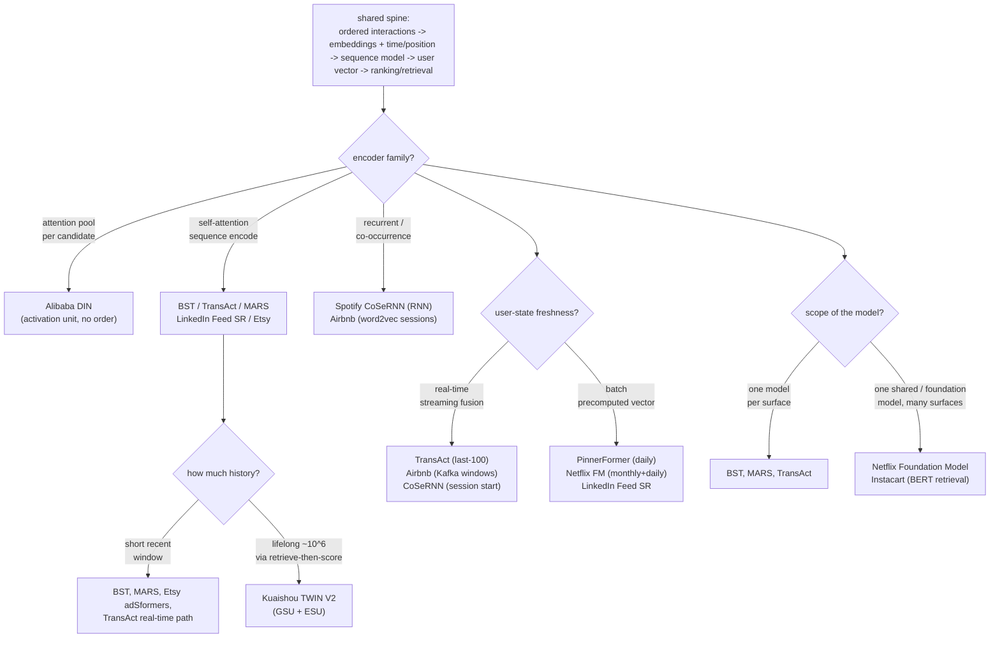

**Where they diverge.** The first axis is the sequence encoder itself. Most systems land on self-attention, but they use it differently. Alibaba BST runs a single self-attention block over the ordered sequence (deeper stacks overfit and added latency without CTR gains), whereas Alibaba DIN, from the same shop but earlier, uses an activation-unit attention that pools the history per candidate ad and deliberately skips the softmax to preserve interest intensity; DIN captures which past interest a specific candidate activates but throws away order and time, which is precisely the gap BST was built to close. Spotify CoSeRNN is the recurrent outlier: a GRU-style net emits one embedding per session by summing a long-term preference vector with a sequential-contextual offset, less parallel than attention and reacting only at session granularity. Airbnb is the furthest from the attention family, learning 32-dim listing embeddings by treating search-click sessions as word2vec sentences (with the booked listing as a global context term and market negatives), so its sequence signal is co-occurrence, not an attention encode. Instacart sits at the other end with a BERT-style bidirectional masked-LM over product-id tokens, which needs care to stay causal but suits its next-product retrieval objective.

The second axis is how much history the model carries and how it makes long sequences tractable. Short-window systems (BST recent N, Wayfair MARS 100 dedup-ed views, Etsy adSformers short-term recent actions, TransAct's real-time last-100) accept that they cannot model long histories and bet that recency dominates; MARS even reports positional embeddings for nearby positions converging, confirming the short-order signal is real. Kuaishou TWIN V2 is the lifelong extreme, scoring histories up to roughly 10^6 events via a two-stage attention: offline hierarchical clustering compresses the sequence, a GSU retrieves target-relevant clusters cheaply, then an ESU runs exact cluster-aware target attention on only the retrieved subset. This retrieve-then-score split is what makes lifelong attention feasible online, at the cost of a clustering pipeline that can blur fine-grained recent detail and drifts stale between re-clustering runs. Pinterest solves the same tension architecturally by running two complementary models: TransAct for the real-time short window and PinnerFormer for the durable long-horizon vector, fused together rather than one model spanning both scales.

The third axis, and the teardowns call it the core dividing line, is user-state freshness: real-time streaming fusion versus batch-precomputed vectors. Pinterest TransAct fuses the last 100 real-time actions per request and retrains twice weekly, and paid for it with a forced CPU-to-GPU serving migration because the Transformer added 20x-plus CPU latency; its whole value is same-session responsiveness, and a stale model silently loses it. Airbnb keeps in-session freshness with Kafka-windowed click and skip histories (EmbClickSim up, EmbSkipSim down) feeding the search ranker in real time, and Spotify CoSeRNN reacts at session start. On the batch side, Pinterest PinnerFormer deliberately chooses daily generation and avoids mutable streaming state; its dense all-action loss predicts a window of future actions rather than only t+1, which recovers most of the batch-versus-realtime gap without streaming infra, at the cost of missing same-session shifts. Netflix's foundation model is the most batch of all, pretraining monthly with daily incremental updates and exposing embeddings through a versioned Embedding Store, explicitly trading staleness for amortization.

The fourth axis is model scope: bespoke per-surface models versus one shared or foundation model feeding many surfaces. BST, MARS, TransAct, and Etsy adSformers are each purpose-built for one stage (Taobao ranking CTR, Wayfair browse recs, Homefeed ranking, sponsored-search CTR/CVR). Netflix centralizes member-preference learning into a single foundation sequence model and exposes it three ways (push last-event embeddings, graft the decoder subgraph and fine-tune, or fully fine-tune per domain), trading integration effort and training cost for reuse across many personalization surfaces. Instacart similarly replaced disparate legacy retrieval systems with one centralized BERT-style model serving search, browse, item pages, cart, and checkout, pushing specialization downstream into ranking while retrieval stays shared. PinnerFormer is a partial case: one durable user vector reused across both retrieval candidate generation and ranking, sharing the representation without going full foundation-model. LinkedIn Feed SR shows the pragmatic ceiling on this axis, having evaluated LLM-based rankers and rejected them for Feed SR on the metric-per-serving-cost tradeoff at 1.2 billion members, a reminder that at billion-scale the winning scope is bounded by serving efficiency, not model ambition.

**The systems**

- **Alibaba** [Behavior Sequence Transformer for E-commerce Recommendation](https://arxiv.org/abs/1905.06874): A transformer over the user behavior sequence lifts CTR in Taobao ranking. *(product design)*
- **Alibaba** [Deep Interest Network for Click-Through Rate Prediction](https://arxiv.org/abs/1706.06978): An attention activation unit adapts the user-interest vector per candidate ad. *(product design)*
- **Pinterest** [How Pinterest Leverages Realtime User Actions (TransAct)](https://medium.com/pinterest-engineering/how-pinterest-leverages-realtime-user-actions-in-recommendation-to-boost-homefeed-engagement-volume-165ae2e8cde8): TransAct fuses the real-time last-100 actions into Homefeed ranking. *(deployment)*
- **Pinterest** [PinnerFormer: Sequence Modeling for User Representation](https://arxiv.org/abs/2205.04507): A batch sequence model with an all-action loss avoids streaming embedding updates. *(deployment)*
- **Netflix** [Integrating Netflix Foundation Model into Personalization](https://netflixtechblog.medium.com/integrating-netflixs-foundation-model-into-personalization-applications-cf176b5860eb): Three ways to plug a large sequence model into production systems. *(deployment)*
- **Spotify** [Contextual and sequential user embeddings for music](https://research.atspotify.com/contextual-and-sequential-user-embeddings-for-music-recommendation/): CoSeRNN models taste as a sequence of per-session embeddings. *(product design)*
- **Instacart** [Sequence models for contextual recommendations](https://tech.instacart.com/sequence-models-for-contextual-recommendations-at-instacart-93414a28e70c): A centralized BERT-style next-action retrieval serving search, browse, recs. *(deployment)*
- **Kuaishou** [TWIN V2: ultra-long user behavior sequence modeling](https://arxiv.org/abs/2407.16357): Two-stage attention over lifelong user behavior sequences in production. *(deployment)*
- **Etsy** [adSformers: personalization from short-term sequences](https://arxiv.org/abs/2302.01255): A transformer encoder over recent user actions for ad CTR and CVR. *(product design)*
- **Wayfair** [MARS: transformer networks for sequential recommendation](https://www.aboutwayfair.com/careers/tech-blog/mars-transformer-networks-for-sequential-recommendation): Self-attention over browsed-item sequences to track changing tastes. *(product design)*
- **LinkedIn** [An industrial-scale sequential recommender for feed ranking](https://arxiv.org/abs/2602.12354): A transformer sequential ranker (Feed SR) replacing a DCNv2 ranker. *(deployment)*
- **Airbnb** [Listing Embeddings in Search Ranking](https://medium.com/airbnb-engineering/listing-embeddings-for-similar-listing-recommendations-and-real-time-personalization-in-search-601172f7603e): Listing embeddings from 800M sessions for real-time in-session personalization. *(product design)*

---

### [Ads CTR prediction](topics/10-ads-ctr-prediction.md) · 11 systems

**What they share.** Every system here collapses to the same spine: a request pulls a set of eligible ads, a sparse-embedding model scores each into a calibrated pCTR (and sometimes pCVR), and an auction turns that probability into money via eCPM roughly equal to bid times pCTR. Because the score is multiplied into a bid and a second-price charge is derived from it, all of them treat calibration as load-bearing rather than cosmetic, and all train with a proper loss (log loss / cross-entropy) that rewards probability accuracy, not just ranking separation. The categorical feature space is massive and open-ended (user, ad, advertiser, creative, placement ids), so every design puts most of its parameters in sparse embedding tables and bounds them with hashing rather than a row per id. And because clicks return in seconds while conversions land days later, the training loop must correct for labels that have not arrived and only ever observes outcomes for ads the previous model chose to show.

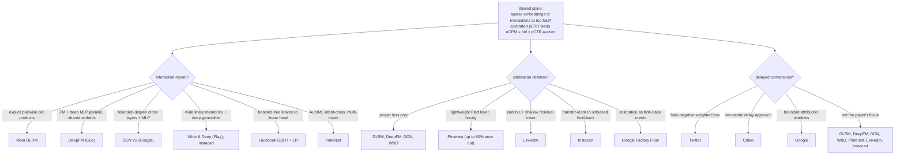

**Where they diverge.**

*Interaction model: how the pairwise and higher-order crosses get built.* This is the sharpest dividing line and the one an interviewer probes directly. Meta DLRM computes explicit pairwise dot products between every pair of embeddings (plus the bottom-MLP dense vector) before a top MLP, so the interaction stage is a fixed second-order operator wired after the lookups and before the head; the teardown stresses that miswiring it earlier or later changes what the model can express. DeepFM (Guo et al.) instead runs an FM component and a deep MLP in parallel over one shared embedding layer, so the FM nails explicit pairwise crosses cheaply via latent-vector dot products while the deep branch reaches higher-order crosses, and the shared table is the whole point (separate tables would lose the parameter efficiency and joint gradient). DCN V2 (Google/Wang et al.) makes interaction degree a tunable knob: stacked cross layers produce explicit bounded-degree crosses whose order grows with depth, run stacked or parallel to an MLP, with a mixture-of-low-rank variant to keep the cross weights affordable at web scale. Wide and Deep (Google Play, and Instacart's model) splits the labor structurally instead, a wide linear branch over hand-crafted cross-product features to memorize frequent combinations plus a deep embedding-MLP branch to generalize to unseen crosses, jointly trained so wide-only over-memorizes and deep-only over-generalizes are both avoided. Facebook's GBDT plus LR predates embeddings entirely: boosted-tree leaf indices become the crosses fed to a linear head, which buys automatic interactions but, as the comparison table notes, does not scale to billions of sparse ids. Pinterest sits apart again with an AutoML latent-cross multiplicative layer inside a shared-bottom multi-tower stack, where the multiplicative interaction lives in the latent-cross layer, not the fully connected layers.

*Calibration approach: from trusting the loss to a dedicated correction stage.* The four canonical architecture papers (DLRM, DeepFM, DCN, Wide and Deep) largely rely on the proper training loss and, at most, a generic post-hoc step; the DLRM teardown warns explicitly that the raw head is not trustworthy for pricing under negative sampling and class imbalance, so calibration is still an open task. The production teams are where calibration engineering diverges. Pinterest replaced a wide-and-deep LR calibrator with a lightweight Platt-scaling layer over contextual, creative, and user signals, cutting day-to-day calibration error by as much as 80 percent and, crucially, decoupling cadence so it recalibrates hourly while the heavy DNN retrains daily. LinkedIn found isotonic regression alone could not close a 40 percent over-prediction because of exposure bias (offline logs reflect the old model's scoring, not the deep model's), so they added a shallow linear tower acting as a calibration residual and trained it only on the ramped model's own served traffic to reach zero over-prediction. Instacart rejected both Platt and isotonic in favor of transfer-learning calibration: train on large biased ranked-impression data, then freeze lower layers and fine-tune only the final feed-forward and sigmoid on a small unbiased hold-back slice, beating Platt and isotonic on expected calibration error while preserving AUC and reusing one model instead of a separate calibrator. Google's Factory Floor paper elevates calibration to a first-class production metric monitored continuously, the practitioner's checklist stance rather than a single technique.

*Delayed-conversion handling: what to do with a click that has not converted yet.* Most of the architecture papers simply do not address it (DLRM, DeepFM, DCN, Wide and Deep, Pinterest, LinkedIn, and Instacart all treat it as out of scope in their teardowns), which is defensible when the target is click, not conversion. The teams that make it central diverge on mechanism. Twitter attacks it inside the loss: in continuous training a not-yet-converted click is a fake negative, so they use an importance-weighted, delay-aware loss that anticipates a sample entering as negative and later flipping positive, reporting a 3 percent relative cross-entropy gain on 668 million examples and a 55 percent lift in revenue per thousand requests over naive log loss. Criteo instead uses a two-model delay approach that jointly reasons about whether an unconverted click should count as negative yet, decoupling the conversion-probability model from the delay-distribution model. Google's Factory Floor leans on bounded attribution windows, simpler operationally but, as the table flags, still leaking the late-conversion tail past the window. The recurring caveat across all three is that delay correction shifts the score distribution, so fast recalibration has to ride along, which ties this axis back to the calibration one.

*Feature and embedding scale, multi-task, and serving topology.* All embedding-based systems agree the MLP is small and the tables (billions of parameters, gigabytes) dominate, but they diverge on how they carve up the network for scale and multiple objectives. DLRM's headline systems contribution is the split parallelization scheme: model parallelism on the memory-bound embedding tables, data parallelism on the compute-bound fully connected layers. Pinterest and LinkedIn instead diverge along the tower axis. Pinterest uses shared-bottom multi-tower to serve Shopping and Standard Ads without one distribution degrading the other (examples masked to the owning tower) with separate multi-task heads (click, good click, scroll-up) on the shared base, so per-head calibration becomes mandatory because heads drift apart. LinkedIn splits by function into three towers, a deep tower served end to end for full member-ad-context interaction, a wide tower over sparse ids partially retrained hourly via GDMix and Lambda Learner for id freshness, and the shallow calibration tower, trading extra serving complexity for the ability to refresh id embeddings on a tight cadence without retraining the whole net. The shared cost across all of them, named in the DLRM and DCN teardowns, is that the open-ended id space forces feature hashing into fixed tables and accepts collisions as a controlled quality cost.

**The systems**

- **Meta** [Deep Learning Recommendation Model (DLRM)](https://arxiv.org/abs/1906.00091): sparse embeddings plus explicit interactions, the canonical CTR architecture. *(model)*
- **Guo et al.** [DeepFM](https://arxiv.org/abs/1703.04247): factorization-machine plus deep network for CTR. *(model)*
- **Wang et al.** [DCN V2](https://arxiv.org/abs/2008.13535): explicit bounded-degree feature crosses for CTR ranking. *(model)*
- **Cheng et al.** [Wide & Deep Learning](https://arxiv.org/abs/1606.07792): memorization plus generalization, the Google Play CTR model. *(model)*
- **Facebook** Practical Lessons from Predicting Clicks on Ads (GBDT + logistic regression): the classic recipe of boosted-tree features feeding a calibrated linear model, with hard-won notes on calibration and data freshness. Find it via the index below. *(deployment)*
- **Pinterest** [AutoML, multi-task, multi-tower models for Pinterest Ads](https://medium.com/pinterest-engineering/how-we-use-automl-multi-task-learning-and-multi-tower-models-for-pinterest-ads-db966c3dc99e): A Platt-scaling calibration layer cut day-to-day error up to 80%. *(product design)*
- **LinkedIn** [Lessons from a deep-learning ads CTR prediction model](https://www.linkedin.com/blog/engineering/machine-learning/challenges-and-practical-lessons-from-building-a-deep-learning-b): Replacing GLMix with a three-tower DNN; calibration under exposure bias. *(deployment)*
- **Instacart** [Calibrating CTR Prediction with Transfer Learning](https://tech.instacart.com/calibrating-ctr-prediction-with-transfer-learning-in-instacart-ads-3ec88fa97525): Transfer learning aligns predicted CTR with observed click frequency. *(eval bar)*
- **Twitter** [Addressing Delayed Feedback in CTR prediction](https://arxiv.org/abs/1907.06558): A fake-negative weighted loss for delayed labels in continuous training. *(product design)*
- **Google** [On the Factory Floor: ML engineering for industrial-scale ads](https://arxiv.org/abs/2209.05310): A search-ads CTR model: calibration, feature crosses, reproducibility at scale. *(deployment)*
- **Criteo** [Modeling delayed feedback in display advertising](https://bibtex.github.io/KDD-2014-Chapelle.html): A two-model approach deciding when an unconverted click counts as negative. *(product design)*

---

### [Search ranking](topics/09-search-ranking.md) · 10 systems

**What they share.** Every production search system in these teardowns runs the same skeleton: understand the raw query (intent, category or entity mapping, spelling, rewrites), retrieve a candidate set that almost always fuses a lexical arm against an embedding arm, then hand the surviving candidates to a learning-to-rank stage that orders them under a tens-of-milliseconds budget. The retrieve-then-rank funnel is universal because no team can score hundreds of millions of documents with a heavy ranker, so a cheap high-recall retrieval pass narrows to roughly a thousand candidates before an expensive precision pass sees them (LinkedIn, Instacart, Amazon all stage it this way). Labels for the ranker come from fusing scarce, trustworthy human or crowdsourced judgments with abundant but biased engagement logs (clicks, saves, plays, conversion). And every team validates the loop the same way: offline NDCG or F1 as a pre-gate, online A/B or engagement lift as the ship decision. The differences are entirely in which retrieval arm dominates, which LTR objective they pick, and where each team spends its labeling budget.

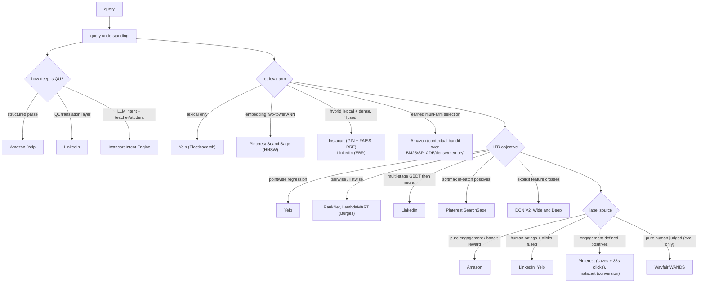

**Where they diverge.**

*Retrieval arm: lexical exactness versus embedding recall versus learned fusion.* This is the sharpest dividing line. Yelp sits at the pure-lexical end: business matching (name, geo distance, phone) is an exact-signal problem, so Elasticsearch retrieval plus TF-IDF component scores carry it, and the teardown flags the cost honestly, no embedding arm means paraphrase and synonym queries are missed. Pinterest SearchSage sits at the pure-embedding end: a DistilBERT query tower projected into the frozen 256-dim PinSage space with HNSW ANN, which bridges the vocabulary gap for discovery but is explicitly weak on exact strings and rare terms. The middle, and the modern default, is hybrid fusion: Instacart runs Postgres GIN lexical (ts_rank) in parallel with a MiniLM-L3-v2 bi-encoder over FAISS, then merges via reciprocal rank fusion or a convex `w1*lex + w2*sem`, with query entropy adaptively resizing each arm's recall set per query specificity. LinkedIn similarly fuses inverted-index retrieval with embedding-based retrieval (EBR). Amazon pushes furthest: instead of a fixed fusion it puts a contextual bandit in front of five arms (BM25, structured field match, dense sentence-BERT, sparse SPLADE, a query-to-entity memory index) and learns which arm suits each query context from logged engagement, unioning the selected arms' candidates before the ranker. The teardowns converge on why neither pole is enough: lexical fails the vocabulary gap, dense drifts on rare and exact strings, so failure modes are complementary.

*Learning-to-rank objective: pointwise versus pairwise/listwise versus staged.* Yelp is the deliberate pointwise case: it frames business matching as pointwise regression predicting a per-candidate relevance score, and the teardown defends it explicitly, the task is essentially match-or-not per candidate, closer to classification than open-ended list ranking, so pointwise is acceptable where it normally is not (F1 rose 91 to 95 percent). The Burges RankNet-to-LambdaMART reference is the pairwise/listwise anchor: pairwise RankNet learns which of two documents ranks higher, LambdaMART weights each pair by its NDCG swap delta, aligning the loss with the position-weighted metric everyone reports. Pinterest uses neither classic loss but a softmax-over-in-batch-positives contrastive objective, where batch composition is the implicit negative distribution and outlier-popular Pins are capped to avoid bias. LinkedIn stages the objective instead of choosing one: a cheap multi-aspect GBDT first pass optimizes recall over many documents (independent relevance, quality, personalization, engagement, recency models combined), then a neural second pass in the federation layer applies real-time intent and affinity for precision, then a diversity re-ranker. DCN V2 and Wide and Deep are orthogonal to the loss debate, they are the ranking-model architecture (explicit efficient feature crosses; wide memorization plus deep generalization), solving how features interact rather than how the list is ordered.

*Label source: engagement versus human judgment versus engagement-defined positives.* Amazon leans hardest on pure engagement: the bandit reward and the neural LTR both come from logged clicks, likes, and playbacks, which the teardown notes makes it thin on cold and tail queries with little engagement and requires bounded exploration so probing tail strategies does not degrade head-query experience. LinkedIn and Yelp explicitly fuse human labels with clicks, LinkedIn combines crowdsourced ratings with engagement (and warns clicks must not dominate or you reward clickbait), Yelp trains on a manually labeled gold dataset of past matching requests. Pinterest and Instacart redefine the positive rather than annotate it: Pinterest requires saves or 35-second-plus click-throughs so the label reflects satisfaction not raw clicks, and Instacart hybrid uses conversion (mean-converting-position) as a cleaner-than-click downstream signal, though the teardown cautions conversion optimizes buying, not relevance, and is sparse for new items. Wayfair WANDS is the pure-human pole and the reason the others hedge: 233k labels from three independent annotators (Cohen's Kappa, OPA) over 480 queries, built precisely because live click logs are position-biased and unreliable for discriminating models, intended as an offline NDCG benchmark with candidates mined from multiple algorithms to reduce the unjudged-but-relevant problem.

*Query understanding depth and position-bias handling.* How much a team invests upstream of retrieval varies by query ambiguity. Yelp and Amazon do lightweight structured parsing (fields, entities). LinkedIn interposes an Interest Query Language translation layer that compiles the query into index-specific Galene queries, a maintenance cost the team itself flagged for removal. Instacart's Intent Engine goes furthest, replacing several specialized QU models with one LLM backbone doing intent classification, taxonomy mapping, and rewrites, served via a teacher-student split (offline RAG teacher tags head queries, a LoRA Llama-3-8B student serves the long tail under 300ms), with a retrieval-constrained candidate set plus a semantic-similarity guardrail to stop the LLM hallucinating categories. On position bias, the shared-topic write-up prescribes inverse-propensity weighting and position-as-a-train-time-feature, and the engagement-heavy teardowns feel this most acutely: Amazon must debias raw engagement and run controlled exploration to estimate propensities, and LinkedIn's real-time second-pass features demand point-in-time correctness or the model leaks the future, the same label-leakage trap that makes offline NDCG lie.

**The systems**

- **Wang et al.** [DCN V2: Improved Deep & Cross Network](https://arxiv.org/abs/2008.13535): Explicit, efficient feature crosses in a ranking model used at web scale. *(ranking model)*
- **Cheng et al.** [Wide & Deep Learning](https://arxiv.org/abs/1606.07792): Memorization (wide linear over crossed features) plus generalization (deep net) for ranking. *(ranking model)*
- **Burges** "From RankNet to LambdaRank to LambdaMART: An Overview": the canonical learning-to-rank reference, walking from a pairwise RankNet loss to LambdaRank's NDCG-weighted gradients to the LambdaMART tree ensemble. The clearest single source on why ranking losses are pairwise and listwise rather than pointwise. *(learning-to-rank)*
- **Amazon** [From structured search to learning-to-rank-and-retrieve](https://www.amazon.science/blog/from-structured-search-to-learning-to-rank-and-retrieve): Unifies retrieval and ranking via learning-to-rank-and-retrieve with contextual bandits. *(product design)*
- **LinkedIn** [Improving Post Search at LinkedIn](https://www.linkedin.com/blog/engineering/search/improving-post-search-at-linkedin): Multi-stage retrieval plus learning-to-rank for member post search. *(product design)*
- **Pinterest** [SearchSage: learning search query representations](https://medium.com/pinterest-engineering/searchsage-learning-search-query-representations-at-pinterest-654f2bb887fc): A query embedding model powering search retrieval and ranking relevance. *(deployment)*
- **Instacart** [Optimizing search relevance using hybrid retrieval](https://tech.instacart.com/optimizing-search-relevance-at-instacart-using-hybrid-retrieval-88cb579b959c): Hybrid text plus embedding retrieval feeding two-stage ranking. *(deployment)*
- **Instacart** [Building the Intent Engine: query understanding with LLMs](https://company.instacart.com/tech-innovation/building-the-intent-engine-how-instacart-is-revamping-query-understanding-with-llms): An LLM-based query-understanding pipeline for intent and category mapping. *(product design)*
- **Yelp** [Learning to Rank for Business Matching](https://engineeringblog.yelp.com/2014/12/learning-to-rank-for-business-matching.html): Moving business matching from hand-tuned scoring to learning-to-rank. *(product design)*
- **Wayfair** [WANDS: a public e-commerce product-search relevance dataset](https://www.aboutwayfair.com/careers/tech-blog/wayfair-releases-wands-the-largest-and-richest-publicly-available-dataset-for-e-commerce-product-search-relevance): A public human-judged relevance-label dataset for search evaluation. *(eval bar)*

---

### [Fraud & anomaly detection](topics/08-fraud-and-anomaly-detection.md) · 12 systems

**What they share.** Every system here treats fraud as a cost-sensitive decision under extreme class imbalance, where the positive class is a fraction of a percent and accuracy is a lie, so they lead with precision, recall, and PR-AUC and set thresholds from a cost matrix rather than a default 0.5. They all sit downstream of a real-time feature layer built on velocity aggregates plus shared-entity signals (device, card, IP, address), and they all confront an adversary who adapts on purpose, so drift is the steady state and models decay by design. Ground-truth labels (chargebacks) arrive weeks late, so every design leans on a human review loop as the only fast feedback and treats analyst verdicts as first-class labels. The consistent skeleton is: event stream to features to a scoring model to a cost-sensitive allow/block/review decision to a delayed-label loop back into training. What separates these systems is almost entirely which branch of that skeleton they specialize.

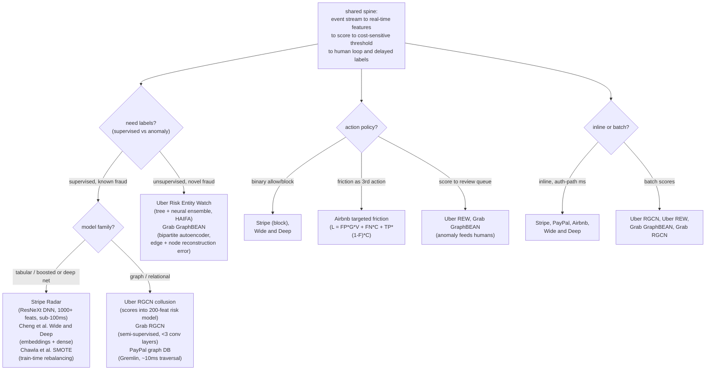

**Where they diverge.**

The sharpest axis is the model family, which ranges from flat tabular scorers to full graph learners. Stripe Radar sits at the tabular end: it migrated from a Wide-and-Deep XGBoost-plus-net ensemble to a single ResNeXt-style multi-branch DNN over 1000+ per-transaction characteristics, buying representational capacity without a linear blow-up in training cost, and Cheng et al.'s Wide & Deep is the canonical deep-tabular shape where sparse categoricals (device, merchant, geo, card BIN) go through embedding tables and dense velocity/amount features feed the MLP, the two logits summed. At the other end, Uber's collusion model and both Grab systems are relational graph nets: RGCN uses relation-specific transforms so a shared device and a shared city carry different weights, and PayPal skips learned models entirely for a custom Gremlin-over-Aerospike graph DB that resolves multi-hop ring links in about 10ms. The teardowns are explicit that these are complements, not rivals: Uber feeds its two RGCN scores in as the 4th and 39th most important features among 200 in a downstream tabular risk model, so the graph learner is a feature generator for the tabular scorer, not its replacement.

The second axis is supervised versus unsupervised, which the topic file calls the core dividing line, and it is really a question of whether labels exist yet. Stripe, Wide & Deep, Uber's RGCN, and Grab's RGCN are supervised and score known fraud at high precision, but by construction they are blind to attack patterns they have never seen labeled. Uber's Risk Entity Watch and Grab's GraphBEAN take the anomaly route precisely because fraudsters innovate faster than labels arrive: Risk Entity Watch auto-generates thousands of entity features (metrics crossed with time windows crossed with entities) and runs an ensemble of tree-based and neural anomaly detectors, while GraphBEAN is a bipartite consumer-merchant autoencoder that scores both node and edge reconstruction error, on the assumption that normal reconstructs easily and anomalies do not. The price they pay, stated in both teardowns, is that unusual is not the same as fraudulent, so anomaly paths run hotter on false positives and feed review queues rather than auto-blocking. SMOTE is a third thing on this axis: not a scorer but a train-time technique to lift minority recall under imbalance, and it warns against evaluating on the rebalanced set.

The third axis is how far the system leans on the graph and entity linking versus per-event features. PayPal, both Uber systems, and both Grab systems treat the shared entity as the primary signal because individual rows look clean while the network screams: PayPal links a new account to a known ring sub-second when they touch a shared IP or device, Uber's RGCN clusters collusion rings on the rider-driver graph, and Grab's RGCN reads dense shared-device clusters as fraud and isolated nodes as genuine, capping the net at fewer than three conv layers to avoid over-smoothing. Grab's teardown adds two honest caveats: node features still matter (topology alone under-performs) and cold entities with no links are invisible to the graph. Stripe and Wide & Deep, by contrast, fold entity signals into flat velocity and embedding features rather than traversing a graph at decision time, which is what lets them stay inline in the auth path. This axis correlates tightly with latency: the graph learners (Uber RGCN, both Grab systems, Uber REW) score in batch and feed downstream systems, while PayPal is the exception that engineered a bespoke million-QPS graph DB specifically to make multi-hop linking cheap enough for sub-second inline use.

The fourth axis is the threshold-and-friction policy, meaning what the system is allowed to do with a score. Stripe and Wide & Deep resolve to a binary allow/block at a cost-based threshold and Stripe treats explainability (Risk Insights surfacing the top contributing features) as a product requirement because merchants dispute declines. Airbnb reframes the decision entirely, adding a third action so the choice is friction-versus-allow rather than block-versus-allow, and optimizes an explicit loss L = FP times G times V plus FN times C plus TP times (1 minus F) times C, where micro-authorizations and billing-statement checks are cheap for good users but hard for fraudsters; their example shows 95 percent-effective friction with 10 percent good-user dropout cutting total losses roughly in half versus outright blocking. The anomaly systems (Uber REW with its HAIFA per-feature histograms, Grab GraphBEAN with its fraud-type tagger) deliberately do not act on raw scores at all, routing every flag through human review first because an unsupervised anomaly is not a confirmed fraud, which closes back to the shared human-loop that turns these verdicts into the labels the supervised branch trains on.

**The systems**

- **Chawla et al.** [SMOTE: Synthetic Minority Over-sampling Technique](https://arxiv.org/abs/1106.1813): the classic approach to extreme class imbalance, synthesizing minority samples instead of naive oversampling. *(class imbalance)*
- **Cheng et al.** [Wide & Deep Learning](https://arxiv.org/abs/1606.07792): the sparse-embedding-plus-dense tabular shape fraud models often use when they go deep. *(model)*
- **Stripe** [Radar engineering writeups](https://stripe.com/blog): how Stripe scores card fraud in real time with continuously retrained models. *(deployment)*
- **PayPal** [engineering blog](https://medium.com/paypal-tech): real-time fraud and risk modeling at payment scale, including graph and streaming signals. *(real-time features)*
- **Airbnb** [fraud and trust engineering](https://medium.com/airbnb-engineering): risk and abuse modeling with human review loops and graph signals. *(human review)*
- **Stripe** [How we built it: Stripe Radar](https://stripe.dev/blog/how-we-built-it-stripe-radar): ML architecture evolution, feature discovery, and explainability at sub-100ms. *(product design)*
- **PayPal** [Real-time graph database and analysis to fight fraud](https://medium.com/paypal-tech/how-paypal-uses-real-time-graph-database-and-graph-analysis-to-fight-fraud-96a2b918619a): A custom sub-second, million-QPS graph DB for real-time fraud queries. *(deployment)*
- **Uber** [Relational Graph Learning to Detect Collusion](https://www.uber.com/blog/fraud-detection/): An RGCN over the rider-driver graph; +15% precision feeding downstream risk models. *(product design)*
- **Uber** [Risk Entity Watch: anomaly detection to fight fraud](https://www.uber.com/us/en/blog/risk-entity-watch/): Unsupervised anomaly detection scoring entities without labels across business lines. *(product design)*
- **Grab** [Unsupervised graph anomaly detection for new fraud](https://engineering.grab.com/graph-anomaly-model): A GraphBEAN autoencoder on bipartite graphs catches novel fraud without labels. *(product design)*
- **Grab** [Graph for fraud detection](https://engineering.grab.com/graph-for-fraud-detection): RGCN exploits shared-device/address correlations; less labeled data, explainable clusters. *(product design)*
- **Airbnb** [Fighting Financial Fraud with Targeted Friction](https://medium.com/airbnb-engineering/fighting-financial-fraud-with-targeted-friction-82d950d8900e): A loss function weighing friction vs chargeback cost; targeted friction cuts losses. *(eval bar)*

---

### [Content moderation and trust and safety](topics/16-content-moderation.md) · 10 systems

**What they share.** Every teardown decomposes harm into per-policy classifiers with their own calibrated threshold rather than one global "badness" score: Roblox ships purpose-built models per policy and modality, Pinterest runs a seven-way head (six violations plus safe), and LinkedIn stacks category-specific spam and hate models. All optimize recall at a fixed precision floor rather than accuracy, because the base rates are skewed (Bumble's lewd rate is 0.1 percent, so accuracy is meaningless) and a miss on severe harm is irreversible while a false flag costs reviewer-seconds. Every system keeps a human in the loop as both the final safety net and the label source that feeds retraining: Pinterest's Pinqueue3.0, Roblox's thousands of experts, LinkedIn's manual investigation, and Google's mandatory manual review all close the flywheel. And all treat the threat model as adversarial and non-stationary, curating hard negatives (Bumble's limbs, Meta's benign confounders) and continuously re-labeling as attackers mutate content the moment a pattern is blocked.

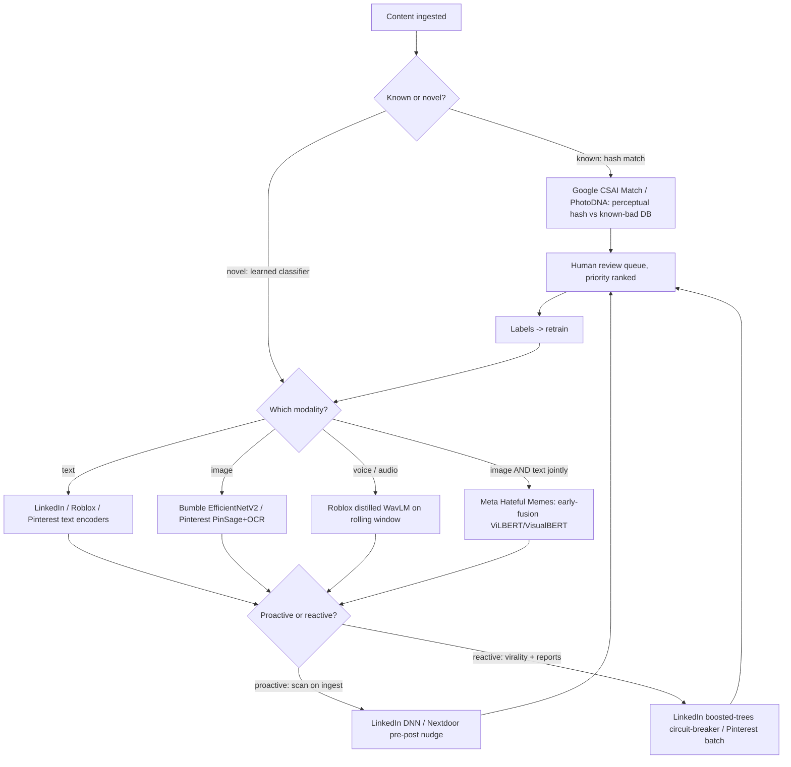

**Where they diverge.** The first axis is modality, and it dictates the backbone and the latency budget. Text systems (LinkedIn viral spam, Pinterest OCR features, Roblox's text-filter ensemble) use transformer encoders and must fight leetspeak and homoglyph obfuscation. Image-only systems pick fast CNN backbones tuned to hold down false positives on a skewed base rate: Bumble's EfficientNetV2 with MBConv/FusedMBConv blocks hits above 98 percent accuracy only because it mines hard negatives (arms, legs, swimwear). Voice is the hardest surface because there is no pre-publish gate: Roblox distills a Whisper-to-WavLM student down to 48M params at 50ms and scores a rolling 15-second window, accepting that it acts during rather than before the conversation. Meta's Hateful Memes sits in its own class: hatefulness exists only in the image and text jointly, and benign confounders are engineered so that OR-ing a text model and an image model provably fails, forcing early-fusion vision-language models (ViLBERT, VisualBERT, MMBT) that still trail humans.

The second axis is hash-match on known-bad versus learned classification on novel content, and Google's CSAM toolkit is the canonical split. CSAI Match uses perceptual fingerprinting (robust to re-encode and resize) against YouTube's known-abuse DB: near-zero false positive, cheap, and legally actionable, so it can auto-action and short-circuit all classifier compute. Its Content Safety API classifier, by contrast, never auto-actions; it only assigns a priority score to focus scarce human review, because a false positive on a CSAM classifier is unacceptable. Pinterest applies the same known-bad amortization at a lower stakes tier by grouping Pins by image-signature so one decision enforces uniformly across identical images, with the tradeoff that a single false positive then propagates to every match. Hashing catches the known mass and stops re-upload campaigns; classifiers own the novel tail.

The third axis is proactive scan-on-ingest versus reactive virality-and-report-driven detection, and LinkedIn's viral-spam writeup runs both deliberately. Its proactive TensorFlow DNNs score content the instant it surfaces on the feed, per category and type, while a separate reactive boosted-trees-plus-heuristics model watches the post-publication engagement cascade (the strongest virality signal) and throttles content before it reaches a large audience, a circuit-breaker for misses the proactive net let through. Pinterest splits the same way across cost: a daily Spark batch model with the full PinSage graph feature for precision, plus an online Kafka/Flink model that drops the graph feature to gain speed on fresh Pins, so adversarial new content hits the weaker classifier first. Nextdoor pushes proactive earliest of all with a pre-post Kindness Reminder that nudges the author to edit before the comment ever exists (1 in 5 edit, 20 percent fewer negative comments), trading engagement for prevention and avoiding the appeal entirely.

The fourth axis is what triggers human review and how the label flywheel is engineered. LinkedIn's fake-account funnel routes by risk band: low registers, high blocks, and only the medium band pays the UX tax of a human-verification challenge, with cluster-level models propagating a suspicious label across shared-attribute groups to catch bulk creation faster than per-account behavior (blocking five million accounts in under a day). Pinterest treats the review platform itself as first-class engineering: Pinqueue3.0 abstracts every entity (pin, board, comment, video) as an object with a fetcher, UI, and decision handler, makes labeling a built-in feature so every reviewer decision becomes clean Hive training data, and adds operational safety like Kitty Mode to avoid re-exposing harmful imagery. Roblox gates auto-action on a hard rule (ship AI only where it beats humans on both precision and recall at scale) and tracks quality via inter-rater alignment (80 percent agreement) plus golden-set validation, routing complex cases, appeals, and red-teaming to experts. All three confirm the teardown's thesis that reviewer capacity, not model accuracy, is the binding ceiling, and that over-flagging directly overloads the queue.

**The systems**

- **Roblox** [Deploying ML for Voice Safety](https://about.roblox.com/newsroom/2024/07/deploying-ml-for-voice-safety): A distilled transformer audio model flags policy-violating voice chat in real time. *(deployment)*
- **Roblox** [How Roblox Uses AI to Moderate Content on a Massive Scale](https://about.roblox.com/newsroom/2025/07/roblox-ai-moderation-massive-scale): Billions of daily messages moderated across 25 languages, AI plus human. *(deployment)*
- **Pinterest** [Fighting misinformation, hate speech, and self-harm content with ML](https://medium.com/pinterest-engineering/how-pinterest-fights-misinformation-hate-speech-and-self-harm-content-with-machine-learning-1806b73b40ef): Batch and online ML models score Pins and boards for policy violations. *(product design)*
- **Pinterest** [Pinqueue3.0, Pinterest's next-gen content moderation platform](https://medium.com/pinterest-engineering/introducing-pinqueue3-0-pinterests-next-gen-content-moderation-platform-fcfa972bf39c): A human review and labeling platform feeding high-quality labels to ML. *(deployment)*
- **LinkedIn** [Automated Fake Account Detection at LinkedIn](https://www.linkedin.com/blog/engineering/trust-and-safety/automated-fake-account-detection-at-linkedin): A funnel of registration scoring, cluster detection, and activity models. *(deployment)*
- **LinkedIn** [Viral spam content detection at LinkedIn](https://www.linkedin.com/blog/engineering/trust-and-safety/viral-spam-content-detection-at-linkedin): Proactive versus reactive classifiers curb the spread of viral spam posts. *(eval bar)*
- **Bumble** [Open-sourcing Private Detector](https://medium.com/bumble-tech/bumble-inc-open-sources-private-detector-and-makes-another-step-towards-a-safer-internet-for-women-8e6cdb111d81): An EfficientNetV2 classifier detects and blurs unsolicited lewd images. *(who it serves)*
- **Meta AI** [Hateful Memes Challenge and dataset](https://ai.meta.com/blog/hateful-memes-challenge-and-data-set/): A benchmark forcing joint image-text reasoning to detect hateful memes. *(eval bar)*
- **Google** [Child safety toolkit: Content Safety API and CSAI Match](https://protectingchildren.google/tools-for-partners/): AI classifiers plus hash-matching prioritize and detect CSAM for partners. *(deployment)*
- **Nextdoor** [A feature to promote kindness in neighborhoods](https://blog.nextdoor.com/2019/09/18/announcing-our-new-feature-to-promote-kindness-in-neighborhoods): An ML Kindness Reminder nudges users to edit offensive comments before posting. *(product design)*

---

### [Speech and audio](topics/17-speech-and-audio.md) · 11 systems

**What they share.** Every system in this category walks the same spine: capture audio at 16 kHz, frame it into short windows, turn it into features (almost always a log-mel spectrogram, sometimes stacked filterbanks or a raw-waveform self-supervised encoder), push those features through an acoustic or sequence model, then decode to the target (text, a trigger bit, a speaker label, or a waveform). Google's on-device RNN-T, AssemblyAI's Conformer-1, OpenAI's Whisper, and Google's Tacotron 2 all front-load the same log-mel step before their models diverge. The dominant accuracy metric for the recognition systems is WER (edit distance over words), and the dominant tension is latency versus accuracy: a streaming model at time t sees only audio up to t and must commit, while a batch model attends over the whole utterance and can revise. Even the non-ASR tasks (wake word, diarization, TTS, separation) reuse the front end and diverge only at the head, the latency budget, and the eval metric.

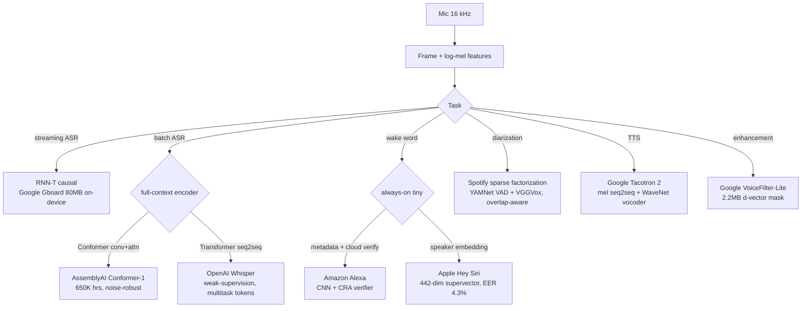

**Where they diverge.** The first axis is task, and the teardowns make clear these are not one problem. ASR turns speech to text (Google Gboard, AssemblyAI, Whisper); wake word / keyword spotting is a detection bit, not transcription (Amazon Alexa, Apple Hey Siri); diarization answers "who spoke when" without transcribing (Spotify); TTS runs the pipeline backwards from text to waveform (Google Tacotron 2); and enhancement / target-speaker separation cleans features before ASR (Google VoiceFilter-Lite). Each has its own metric: WER for ASR, false-accepts-per-hour vs false-rejects on a DET curve for wake word (Amazon reports a 60 percent false-accept cut from its CRA verifier), equal error rate for speaker verification (Apple's 4x256 model at 4.3 percent EER), diarization error rate plus purity and coverage for Spotify, and human MOS for Tacotron 2. Proposing one model for all of them is the classic red flag; each teardown deliberately narrows to one head.

The second axis is architecture and it splits on causality. Google's Gboard recognizer uses an RNN-Transducer (8 LSTM encoder layers, a 2-LSTM prediction net, a feedforward joint) precisely because the transducer commits monotonically left to right and streams frame by frame with no external LM, which CTC lacks. AssemblyAI's Conformer-1 is the opposite: a full-context batch encoder interleaving self-attention (long-range grammar and context) with convolution (local spectral and formant structure), plus grouped attention to make cost independent of sequence length and moving-median sparse attention to prune noise rather than amplify it. OpenAI's Whisper is a third shape, a Transformer encoder-decoder that autoregressively emits a token stream, which buys multitask flexibility but inherits attention-decoder pathologies (looping, hallucinated transcript on silence). Google's Tacotron 2 splits into an autoregressive seq2seq acoustic model (letters to 80-dim mel at 12.5 ms frames) plus a separate WaveNet vocoder, so each stage trains and swaps independently and the mel-spectrogram acts as a compact decoupling target.

The third axis is streaming versus batch, which follows directly from the latency budget. Streaming systems (Google Gboard RNN-T, Amazon and Apple wake words) must emit within a couple hundred milliseconds and cannot see the full utterance, so they trade revisability for immediacy and must also handle endpointing, a latency metric invisible to WER. Batch systems (AssemblyAI Conformer-1, OpenAI Whisper) attend over the whole recording and are more accurate but useless for live feedback; Whisper's 30-second window even makes long-form stitching and precise timestamps awkward, and AssemblyAI derives a separate streaming variant (24.3 percent relative gain) rather than reusing the batch model with a flag.

The fourth axis is deployment target, on-device versus server, which bounds everything upstream. On-device systems live inside a memory and power envelope: Google quantized the Gboard RNN-T from 450MB to 80MB (4x compression, 4x speedup) to run faster than real time on one CPU core, VoiceFilter-Lite is a 2.2MB TF-Lite mask net conditioned on the enrolled d-vector, and Apple's Hey Siri DNN is 8-bit quantized (four 256-neuron sigmoid layers) so it fits an always-on core. On-device also means no audio logging, so you lose the retraining signal. Server / cloud systems accept the opposite tradeoff: AssemblyAI scaled on a 650K-hour, 60TB corpus for transcription farms, Whisper spans six sizes to 1.55B params, and both Amazon (cloud CRA verifier) and Apple layer a heavier second stage only after a loose on-device trigger fires, spending expensive compute rarely. Cite: Google on-device RNN-T, AssemblyAI Conformer-1, OpenAI Whisper, Amazon Alexa wake word, Apple Personalized Hey Siri, Spotify diarization, Google Tacotron 2, Google VoiceFilter-Lite.

**The systems**

- **Google** [An All-Neural On-Device Speech Recognizer](https://research.google/blog/an-all-neural-on-device-speech-recognizer/): An RNN-T streaming ASR quantized to 80MB for offline Gboard voice typing. *(deployment)*
- **AssemblyAI** [Conformer-1: robust speech recognition trained on 650K hours](https://www.assemblyai.com/blog/conformer-1): A Conformer batch ASR scaled on 650K hours for noise robustness. *(product design)*
- **OpenAI** [Whisper: Robust Speech Recognition via Large-Scale Weak Supervision](https://github.com/openai/whisper): A weakly-supervised multitask model for zero-shot ASR and translation. *(eval bar)*
- **Amazon** [Alexa's new wake word research at Interspeech](https://www.amazon.science/blog/amazon-alexas-new-wake-word-research-at-interspeech): A metadata-aware on-device wake word plus a cloud verification model. *(product design)*
- **Apple** [Personalized Hey Siri](https://machinelearning.apple.com/research/personalized-hey-siri): On-device speaker-recognition RNN embeddings personalize the Hey Siri trigger. *(product design)*
- **Spotify** [Unsupervised Speaker Diarization using Sparse Optimization](https://research.atspotify.com/2022/09/unsupervised-speaker-diarization-using-sparse-optimization): Tuning-free language-agnostic diarization for podcasts. *(product design)*
- **Google** [Tacotron 2: Generating Human-like Speech from Text](https://research.google/blog/tacotron-2-generating-human-like-speech-from-text/): A seq2seq mel-spectrogram model plus a WaveNet vocoder reaching near-human MOS. *(eval bar)*
- **Google** [Improving On-Device Speech Recognition with VoiceFilter-Lite](https://research.google/blog/improving-on-device-speech-recognition-with-voicefilter-lite/): A 2.2MB streaming speaker-conditioned separation model improving overlapped-speech WER. *(deployment)*
- **Meta** [SeamlessM4T: a foundational multimodal model for speech translation](https://ai.meta.com/blog/seamless-m4t/): Unified speech and text translation and ASR across about 100 languages. *(who it serves)*
- **NVIDIA** [NeMo Parakeet ASR Models](https://developer.nvidia.com/blog/pushing-the-boundaries-of-speech-recognition-with-nemo-parakeet-asr-models/): A GPU-optimized ASR family for high-throughput low-WER production transcription. *(deployment)*
- **PyTorch** [Forced Alignment with Wav2Vec2](https://docs.pytorch.org/audio/stable/tutorials/forced_alignment_tutorial.html): A CTC trellis-backtracking pipeline aligning transcripts to audio timestamps. *(deployment)*

---

### [Cold start and exploration](topics/18-cold-start-and-exploration.md) · 11 systems

**What they share.** Every system here confronts the same two-headed problem: a fresh entity with no interaction history cannot lean on ID embeddings, and a greedy exploit-only policy ossifies because the logging policy only collects labels for what it already promotes. So they all separate a point-estimate reward model (or a content-and-metadata tower that places cold entities from features rather than ID lookup) from an exploration layer that spends some impressions to buy information, justified against long-term value rather than this session's click. They all log the decision (context, action, propensity, reward) so a new policy can be scored offline before a live A/B, whether by inverse-propensity scoring, doubly-robust estimators, or replay on logged random traffic. The recurring seam is that stochastic exploration with honest propensities is what makes off-policy evaluation valid, so the exploration choice and the eval method are coupled, not independent.

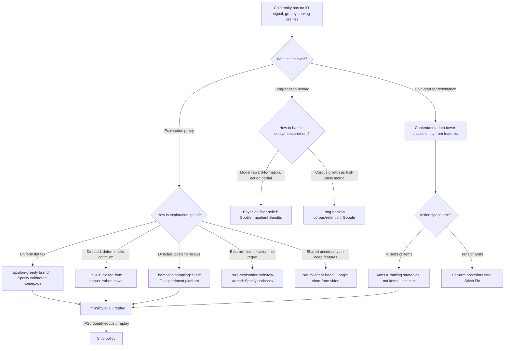

**Where they diverge.** The first axis is how exploration is spent: flat versus directed versus best-arm. Spotify's calibrated-homepage bandit uses a plain epsilon-greedy branch on a very high-traffic surface, accepting a uniform flat tax precisely because the surface volume forces the explore rate to stay small and bounded. Yahoo's LinUCB makes exploration directed and deterministic, adding a closed-form confidence bonus (alpha times sqrt of x A-inv x) so impressions concentrate on high-uncertainty arms, delivering the reported 12.5 percent click lift that widens as data gets sparser. Stitch Fix reaches for Thompson sampling instead, drawing from per-arm Beta posteriors, chosen for its instantaneous self-correction and, critically, because posterior draws hand you clean stochastic propensities for free. Spotify's infinitely-armed podcast work sits off this spectrum entirely: it is pure exploration under a fixed budget optimizing best-arm identification, not regret, so classic UCB regret intuition does not transfer and the channel is deliberately decoupled from the exploit feed to escape popularity bias.

The second axis is cold-start representation versus bandit exploration as the primary fix, and they are complementary rather than competing. The content-and-metadata tower (the topic's two-tower, wide-and-deep, and DLRM reference graphs) places a brand-new item in embedding space from its features the moment it uploads, solving day-zero retrievability with no training cycle in the loop, but it underperforms ID embeddings once an entity is warm, so the practical build is a hybrid ID-plus-content vector. Yahoo and Instacart show the parametric-model angle of the same idea: because the reward model is shared across arms via features, a never-seen article or product still gets an uncertainty estimate from its features rather than needing per-arm history, which is what makes exploration and cold start the same mechanism at serving time.

The third axis is large-action-space tractability. Yahoo and Stitch Fix operate over small or feature-parameterized arm sets where per-arm posteriors are affordable. Instacart cannot: with millions of products a discrete-action bandit needs infeasibly many examples per arm, so it does not treat products as arms at all. It collapses the action space to a handful of ranking strategies (linear popularity ranking for precise queries like "milk" versus a personalized ranker for broad queries like "healthy snack") or to eight weighted objective blends, bounding exploration cost to a few strategies while a two-stage retrieval funnel does the item-level narrowing. Google takes the third route, keeping a neural-linear uncertainty head on top of a deep feature extractor so per-candidate uncertainty stays a cheap closed form at serving latency instead of a full Bayesian posterior per request.

The fourth axis is off-policy evaluation and how delayed reward is handled. Yahoo's replay is the unbiased special case that requires uniformly-random logged traffic and only scores events where the new policy matches the logged choice, which burns most of the log and demands lots of random traffic. Instacart cannot assume random logs, so it combines IPS with doubly-robust estimators, hedging against either a bad reward model or bad propensities (though not both at once). Stitch Fix gets propensity logging for free because the Thompson allocator lives inside the experimentation platform's deterministic assignment engine, reconciling SHA1 assignment with stochastic sampling so logged propensities match what served. On the reward side, Spotify's Impatient Bandits attacks the myopic-but-fast versus true-but-slow tension by modeling the reward-formation process with a Bayesian filter that fuses partial day-1/day-3/week-1 signals with occasional full labels into a belief the bandit acts on, while Google reframes evaluation itself: exploration lowers short-term engagement by construction, so it must be judged on corpus growth and long-horizon retention rather than session clicks.

**The systems**

- **Netflix** [Artwork Personalization at Netflix](https://netflixtechblog.com/artwork-personalization-c589f074ad76): Contextual bandits pick per-member title artwork, small action space, cache-served at scale. *(product design)*
- **Netflix** [Infra for Contextual Bandits and Reinforcement Learning](https://netflixtechblog.com/ml-platform-meetup-infra-for-contextual-bandits-and-reinforcement-learning-4a90305948ef): Production infra for reward computation, logging, and offline policy evaluation of bandits. *(deployment)*
- **Spotify** [Identifying New Podcasts with a Pure-Exploration Infinitely-Armed Bandit](https://research.atspotify.com/publications/identifying-new-podcasts-with-high-general-appeal-using-a-pure-exploration-infinitely-armed-bandit-strategy): A pure-exploration bandit surfaces broadly-appealing new podcasts without popularity bias. *(who it serves)*
- **Spotify** [Calibrated Recommendations with Contextual Bandits on the Homepage](https://research.atspotify.com/2025/9/calibrated-recommendations-with-contextual-bandits-on-spotify-homepage): A contextual bandit balances the music, podcast, audiobook mix per user context. *(product design)*
- **Spotify** [Impatient Bandits: Optimizing for the Long-Term Without Delay](https://research.atspotify.com/publications/impatient-bandits-optimizing-for-the-long-term-without-delay): A delayed-reward bandit picks a reward signal to optimize long-term engagement. *(eval bar)*
- **DoorDash** [Personalized Cuisine Filter](https://careersatdoordash.com/blog/personalized-cuisine-filter/): A multi-armed bandit with geo-hierarchy priors handles new-user and new-district cold start. *(who it serves)*
- **Yahoo** [A Contextual-Bandit Approach to Personalized News Article Recommendation](https://arxiv.org/abs/1003.0146): The LinUCB news bandit plus offline replay evaluation on 33M events. *(eval bar)*
- **Stitch Fix** [Multi-Armed Bandits and the Experimentation Platform](https://multithreaded.stitchfix.com/blog/2020/08/05/bandits/): Thompson-sampling bandits as a first-class experiment type with a reward service. *(deployment)*
- **Instacart** [Contextual Bandit models in large action spaces](https://company.instacart.com/tech-innovation/using-contextual-bandit-models-in-large-action-spaces-at-instacart): Contextual bandits for product recs when the catalog action space is very large. *(deployment)*
- **Duolingo** [A Sleeping, Recovering Bandit for Optimizing Recurring Notifications](https://research.duolingo.com/papers/yancey.kdd20.pdf): A recovering bandit picks the daily reminder with a recency penalty, lifting retention. *(product design)*
- **Google** [Long-Term Value of Exploration](https://arxiv.org/abs/2305.07764): Neural-linear bandit exploration grows the content corpus, breaking feedback-loop ossification. *(eval bar)*

---

### [Computer vision](topics/12-computer-vision.md) · 11 systems

**What they share.** Every system here is the same skeleton wearing different clothes: a canonical ingest stage (decode, EXIF-orientation fix, resize to a fixed resolution, normalize with the backbone's mean/std) feeds a backbone pretrained on a large corpus, whose features drive a task-specific head. Nobody trains from scratch; the transfer-learning leverage lives in the backbone, and the head is what gets swapped and cheaply re-trained. All of them run the heavy math on GPU, treat labeling (not GPU hours) as the scarce budget line, and wire a human-review loop back into training so decisions become fresh labels. And almost none of them report plain accuracy: the long tail, the localization requirement, or the harm economics force per-class precision/recall, mAP, IoU, F-score, or recall@k instead. The single most important choice, made once and rippling through label cost, serving shape, and metric, is what the head emits.

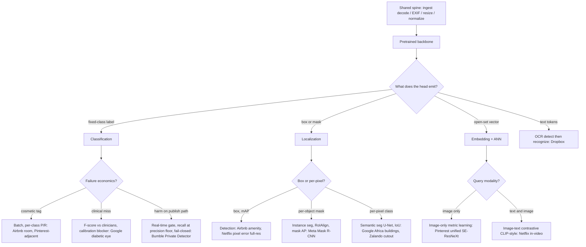

**Where they diverge.** The first and deepest axis is what the head emits, which decides the task. Airbnb's room classifier and Google's diabetic-retinopathy grader are whole-image classification (a fixed-class label), the cheapest labels and the simplest head. Airbnb's amenity work moves to detection because a bounding box is needed to surface a verified fireplace and to moderate a small in-image region a whole-image classifier misses; the metric jumps from per-class precision/recall to mAP at IoU thresholds. Meta's Mask R-CNN goes one level finer to instance segmentation, adding a third mask branch in parallel with box-classification and box-regression, with RoIAlign's bilinear sampling replacing RoIPool's quantization so masks stay pixel-aligned (mask AP, the most expensive labels and heaviest head). Google's Africa-buildings and Zalando's garment-cutout use semantic segmentation (U-Net, per-pixel class, IoU). Pinterest and Netflix in-video emit no class at all but an open-set embedding vector, which is exactly why they handle a growing catalog where a fixed class list cannot. Dropbox is the outlier: OCR is not one classifier but a chain (classify OCR-able, corner-detect and rectify, then recognize).

The second axis is the backbone and its economics. The CNN is the default trunk almost everywhere: ResNet-50 for Airbnb room tagging, SE-ResNeXt for Pinterest's unified embedding, DenseNet-121 for Dropbox's corner detector (chosen for a 2x speedup over Inception-ResNet-v2), U-Net for Google buildings and Zalando. Bumble deliberately picks EfficientNetV2, whose MBConv and FusedMBConv blocks buy the parameter efficiency a low-latency publish-path gate needs. Netflix in-video breaks from single-modality CNNs entirely, using a two-tower image-text contrastive (CLIP-family) model so one shared space answers both text and image queries, and moving from frame-level to video-level pooling bought a 15 to 25 percent retrieval gain. Netflix's pixel-error detector constrains the backbone the opposite way: it must ingest five consecutive frames at full resolution because any downsampling erases the single-pixel signal it hunts, so compute cost is fixed by the task rather than chosen for efficiency.

The third axis is labeling strategy and how each system fights label scarcity. Image-level tags (Airbnb room) are cheap; boxes (Airbnb amenity) and masks (Meta, Google buildings) escalate cost, which is why Airbnb explicitly treats labeling as the budget line and both Airbnb writeups push active learning (label the uncertain and disagreed-on images, not a random sample). Google's diabetic-eye model buys ground-truth quality with 3-to-7-ophthalmologist consensus per image rather than a single reader, because the ceiling is bounded by grader agreement. Google Africa buildings and Netflix pixel-error both manufacture labels: Africa buildings runs Noisy Student self-training on 8.7M unlabeled tiles to cut false positives, while Netflix synthesizes rare pixel defects with an artifact generator, then iteratively removes false positives on real footage to close the synthetic-to-real gap. Bumble curates hard negatives (arms and legs) so ordinary body parts are not flagged. Netflix in-video and Pinterest sidestep manual class labels via contrastive and proxy-based metric learning respectively, learning from paired or blended data instead of a hand-built taxonomy.

The fourth axis is serving shape, driven by failure economics rather than model quality. Bumble is the only real-time gate: it sits synchronously on the message/publish path with a tight latency budget and therefore needs a defined fail-closed policy and adversarial-evasion defense, since a missed lewd image is a trust event, not a cosmetic error. Everything user-facing-but-not-blocking runs as a batch job off a queue: Airbnb room tagging and amenity detection, Meta Mask R-CNN, Google buildings, and Google diabetic-eye all tolerate minutes of latency and can ride cheaper throughput-optimized GPUs. The embedding systems (Pinterest, Netflix in-video) split serving in two: heavy offline precompute of the whole catalog into an ANN index (Netflix replicates to Elasticsearch), then query time is one forward pass plus one nearest-neighbor lookup, with the standing cost being the re-embed-the-whole-catalog job every retrain. That batch-versus-gate-versus-index split, not the network architecture, is what most changes the operational cost and the on-call risk profile.

**The systems**

- **Airbnb** [Categorizing Listing Photos at Airbnb](https://medium.com/airbnb-engineering/categorizing-listing-photos-at-airbnb-f9483f3ab7e3): ResNet-50 classifies 500M+ listing photos by room type to organize home tours. *(product design)*
- **Airbnb** [Amenity Detection and Beyond](https://medium.com/airbnb-engineering/amenity-detection-and-beyond-new-frontiers-of-computer-vision-at-airbnb-144a4441b72e): Object detection finds amenities in listing photos for moderation and consumer features. *(product design)*
- **Meta (FAIR)** [Mask R-CNN](https://ai.meta.com/research/publications/mask-r-cnn/): Instance segmentation extending Faster R-CNN with a mask branch; top COCO results. *(eval bar)*
- **Dropbox** [Using machine learning to index text from billions of images](https://dropbox.tech/machine-learning/using-machine-learning-to-index-text-from-billions-of-images): In-house classifier, corner detection, and OCR make scanned text searchable at 20B-image scale. *(deployment)*
- **Pinterest** [Unifying visual embeddings for visual search](https://medium.com/pinterest-engineering/unifying-visual-embeddings-for-visual-search-at-pinterest-74ea7ea103f0): One multi-task embedding replaces per-product models across Lens, crop, and Shop the Look. *(deployment)*
- **Zalando** [Shop the Look with Deep Learning](https://engineering.zalando.com/posts/2018/09/shop-look-deep-learning.html): ConvNet matching plus U-Net segmentation finds catalog items from real-world photos. *(product design)*
- **Netflix** [Accelerating Video Quality Control with Pixel Error Detection](https://netflixtechblog.com/accelerating-video-quality-control-at-netflix-with-pixel-error-detection-47ef7af7ca2e): A full-resolution CNN over 5 frames detects pixel defects, cutting manual QC to minutes. *(eval bar)*
- **Netflix** [Building In-Video Search](https://netflixtechblog.com/building-in-video-search-936766f0017c): Contrastive image-text embeddings, precomputed and served via Elasticsearch, let editors search footage by text. *(deployment)*
- **Google Research** [Mapping Africa's Buildings with Satellite Imagery](https://research.google/blog/mapping-africas-buildings-with-satellite-imagery/): A U-Net trained on 1.75M labeled buildings maps 516M structures across Africa. *(eval bar)*
- **Google Research** [Deep Learning for Detection of Diabetic Eye Disease](https://research.google/blog/deep-learning-for-detection-of-diabetic-eye-disease/): A CNN on 128K retinal images detects diabetic retinopathy at ophthalmologist-level F-score. *(who it serves)*
- **Bumble** [Open-sourcing Private Detector](https://medium.com/bumble-tech/bumble-inc-open-sources-private-detector-and-makes-another-step-towards-a-safer-internet-for-women-8e6cdb111d81): An EfficientNetV2 binary classifier flags and blurs unsolicited lewd images at over 98% accuracy. *(product design)*

---

### [Natural language processing](topics/13-natural-language-processing.md) · 11 systems

**What they share.** Every system in this category runs the same skeleton: free text is normalized and tokenized once (often with a language-ID gate up front), fed to a task backbone that produces a dense representation, and a thin task head turns that representation into a decision, which a threshold either auto-acts on or routes to human review whose verdicts flow back as fresh labels. The backbone is either a fine-tuned encoder (BERT-family, or an earlier CNN/LSTM) for tasks that map text to a fixed decision, or an encoder-decoder seq2seq model for tasks that generate new text. All of them treat labeling and class imbalance as first-class design problems rather than model afterthoughts, and none of them puts a large LLM on the inline firehose: the volume (Meta's 4.5B translations/day, Uber's 15M trips/day of tickets) forces a small, distilled, calibratable model on the hot path and reserves any heavy model for offline label generation or the hard tail. The recurring tradeoff the interviewer is probing is fine-tuned-encoder-vs-LLM: a specialized encoder wins on latency, cost, and calibration at a fixed label set, while the LLM is a cold-start label factory and fallback, not the production path.

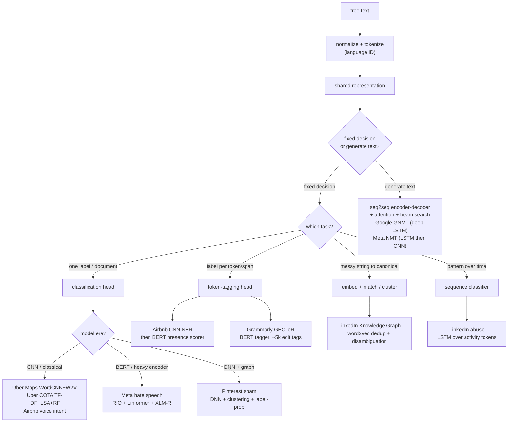

**Where they diverge.** The first axis is the task itself, and it is the master dividing line: does the system map text to a fixed decision or generate new text? Uber Maps, Uber COTA, Airbnb voice support, Meta hate speech, and Pinterest spam are all classification (route to a queue, pick an intent, score toxic-or-not); Airbnb Listings and Grammarly GECToR are token-level extraction/tagging; LinkedIn Knowledge Graph is entity resolution (map "a dozen ways to say lockbox" onto an 800+ attribute taxonomy); LinkedIn abuse is sequence classification over a member's activity stream; and only Google GNMT and Meta NMT are true seq2seq generation. This split decides everything downstream: an encoder-plus-head emits a discrete label you evaluate with per-class F1, while a seq2seq decoder emits a sentence you evaluate with BLEU plus human adequacy ratings. Grammarly's GECToR teardown is the sharpest illustration: it deliberately reframes grammatical error correction FROM seq2seq rewriting INTO token tagging over ~5,000 edit tags, buying a 10x speedup (0.40s vs 1.25s+ per sentence) precisely by collapsing generation back into fixed-per-token classification.

The second axis is the model family, which tracks both the era and the task shape. The classification systems span classical to heavy: Uber COTA rides TF-IDF plus LSA topic vectors into a pointwise learning-to-rank random forest (which beat multi-class classification by 25% with 70% less training time), Uber Maps uses a WordCNN over trainable Word2Vec (which behaves like keyword spotting and beat both logistic regression and LSTM at AUC_ROC 0.849), while Meta hate speech runs a full transformer stack (Linformer's linear attention plus XLM-R cross-lingual plus WPIE multimodal fusion) because the adversarial firehose demands it. The extraction systems layer models: Airbnb Listings runs a CNN NER for spans, then word2vec cosine for taxonomy normalization, then a fine-tuned BERT scorer over a 65-word window for YES/Unknown/NO presence, because NER finding a span is not the same as confirming presence ("no lockbox" negates). The seq2seq pair are architecturally distinct again: Google GNMT stacks deep residual LSTMs with attention and subword units, Meta NMT starts with LSTM-plus-attention and later adds CNN seq2seq (+4.3 BLEU English-French). Two teardowns sidestep pure text: Pinterest spam fuses a domain DNN, unsupervised clustering, and bipartite-graph label propagation; LinkedIn abuse tokenizes HTTP requests by frequency and feeds an LSTM, using the exact NLP machinery on a non-language sequence.

The third axis is latency, volume, and class imbalance, which is where the "don't just call an LLM" trap lives. Systems on an interactive path budget aggressively: Airbnb voice support holds contact-reason classification under 50ms and article retrieval under 60ms via parallel processing, and its highest-leverage fix was domain ASR (word error rate 33% to 10%) because a bad transcript dooms every stage after. High-throughput batch systems trade inline latency for scale: Uber Maps runs a weekly Spark pipeline through Michelangelo rather than scoring 15M trips/day of tickets with an LLM per ticket, and Meta NMT quantizes weights and recycles Caffe2 blobs for a 2.5x speedup plus per-sentence vocabulary reduction to survive 4.5B translations/day. Imbalance and adversarial drift reshape the safety systems specifically: Meta hate speech uses RIO to optimize end-to-end on live production data rather than a frozen dataset because static labels decay fast against adversaries, and both Meta and Pinterest keep a human-review sample calibrating the false-positive rate as a policy decision, since a false block silences a real user. The evaluation follows imbalance directly: the teardowns repeatedly warn against reporting aggregate accuracy on a rare positive class, favoring AUC_PR and per-class precision/recall (Uber Maps), strict-match span F1 (Airbnb Listings), and F0.5 weighting precision over recall (Grammarly, because false corrections annoy users most).

The fourth axis is supervision and multilingual coverage, where labels are the real bottleneck. Labeling strategy diverges sharply: Uber Maps hand-labeled 10K-20K tickets over 3-6 person-months (labels, not the model, were the constraint); LinkedIn abuse bootstraps labels from an unsupervised isolation-forest outlier detector (scrapers are homogeneous and repetitive, legitimate activity is not); LinkedIn Knowledge Graph mines member-accepted recommendations as a self-refreshing positive label source; Pinterest generates synthetic labels for its user DNN; and Grammarly stages 9M synthetic pairs then 500K then 34K real learner sentences, finding error-free sentences crucial in the final stage to curb over-correction. Multilingual scope ranges from English-only (Uber Maps, Grammarly) to Meta NMT's 2,000+ directions and Meta hate speech's XLM-R cross-lingual encoder, which trades per-language capacity for transfer to low-resource languages; the teardowns are consistent that a multilingual system must be sliced per language in eval, never reported as one global number.

**The systems**

- **Uber** [Applying Customer Feedback: NLP and Deep Learning Improve Uber's Maps](https://www.uber.com/gb/en/blog/nlp-deep-learning-uber-maps/): Word2Vec plus a word-level CNN classify support tickets to find map-data errors. *(product design)*
- **Airbnb** [Building Airbnb's Listing Knowledge from big text data](https://medium.com/airbnb-engineering/wisdom-of-unstructured-data-building-airbnbs-listing-knowledge-from-big-text-data-7c533466a63c): A CNN-based NER extracts amenities and facilities from free-text listings into a taxonomy. *(product design)*
- **Meta** [How AI is getting better at detecting hate speech](https://ai.meta.com/blog/how-ai-is-getting-better-at-detecting-hate-speech/): RIO plus Linformer proactively detect toxic text and image content at scale. *(deployment)*
- **Google** [A Neural Network for Machine Translation, at Production Scale](https://research.google/blog/a-neural-network-for-machine-translation-at-production-scale/): GNMT seq2seq cuts translation errors 55 to 85% over phrase-based systems. *(deployment)*
- **Meta** [Transitioning entirely to neural machine translation](https://engineering.fb.com/2017/08/03/ml-applications/transitioning-entirely-to-neural-machine-translation/): LSTM-plus-attention NMT deployed across 2,000+ directions, 4.5B daily translations. *(deployment)*
- **LinkedIn** [Building The LinkedIn Knowledge Graph](https://www.linkedin.com/blog/engineering/knowledge/building-the-linkedin-knowledge-graph): Entity resolution and standardization of user-generated entities into a canonical taxonomy. *(deployment)*
- **Pinterest** [How Pinterest Fights Spam Using Machine Learning](https://medium.com/pinterest-engineering/how-pinterest-fights-spam-using-machine-learning-d0ee2589f00a): A DNN plus clustering plus graph label-propagation flag spam domains and users. *(deployment)*
- **LinkedIn** [Using deep learning to detect abusive sequences of member activity](https://www.linkedin.com/blog/engineering/trust-and-safety/using-deep-learning-to-detect-abusive-sequences-of-member-activi): An LSTM classifies member activity sequences as scraping or abuse. *(eval bar)*
- **Uber** [COTA: Improving Uber Customer Care with NLP and ML](https://www.uber.com/blog/cota/): An NLP model suggests top issue types and solutions to route and resolve tickets. *(product design)*
- **Airbnb** [How ML Transforms Airbnb's Voice Support Experience](https://airbnb.tech/ai-ml/listening-learning-and-helping-at-scale-how-machine-learning-transforms-airbnbs-voice-support-experience/): Contact-reason detection classifies issues to self-serve or route to an agent. *(product design)*
- **Grammarly** [Grammatical Error Correction: Tag, Not Rewrite](https://www.grammarly.com/blog/engineering/gec-tag-not-rewrite/): GECToR tags word-level transformations instead of generating, for fast correction. *(eval bar)*

---

### [Demand forecasting & time series](topics/14-demand-forecasting-and-time-series.md) · 10 systems

**What they share.** Every system in this teardown fits one skeleton: assemble a historical series plus calendar and exogenous covariates into features, fit a model that emits a probabilistic or interval-bearing forecast, and hand that output to a downstream decision (replenishment order, driver rebalancing, an ETA quote) rather than treating the forecast as the deliverable. Uber says the prediction interval is "just as important as the point forecast itself" and Zalando feeds a full demand distribution into its Monte Carlo optimizer, both because a decision needs the spread, not the mean. Validation is chronological across the board: Uber runs the Omphalos parallel backtest over sliding and expanding windows and benchmarks against a naive forecast rather than an absolute error target. The forecast-then-optimize handoff and the rolling-origin backtest loop are the two invariants nobody skips.

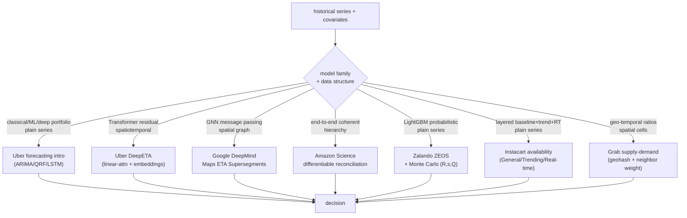

**Where they diverge.** The first axis is model family, and it tracks how many related series you have and how rich the covariates are. Uber's forecasting-intro stack deliberately spans three families (classical ARIMA / Holt-Winters / Theta, ML quantile-regression forests and gradient boosting, deep RNN / LSTM) and reaches for deep only when exogenous regressors are plentiful, because without those regressors the LSTM rarely beats the cheaper methods. Zalando made the same call the other way and chose LightGBM with Nixtla's MLForecast over a Temporal Fusion Transformer explicitly for faster iteration and a lighter footprint (weekly run under two hours over 5 million SKUs), a concrete instance of the teardown's "baseline a global GBT before going deep" rule. Amazon Science and the two ETA systems, by contrast, commit to deep nets because their structure (a hierarchy to reconcile, or a road graph to diffuse over) is exactly what a neural model buys you.

The second axis is point versus distribution, and it is set by the decision downstream, not by taste. Zalando must emit a full per-SKU demand distribution because its Monte Carlo optimizer computes safety stock and an extended (R, s, Q) policy (reorder point, safety stock, order quantity) from the spread, which a mean cannot yield. Amazon carries a full probabilistic forecast through every level via a reparameterization trick. The two ETA systems collapse to a calibrated point estimate instead: DeepETA quotes a single arrival time and Google Maps predicts travel time 10 to 50 minutes ahead, because an ETA is inline in a quote and there is no optimizer consuming a quantile, only a number to display. Instacart is a third mode, emitting a probability in 0 to 1 that an item is available rather than a demand quantile.

The third axis is hierarchical coherence, and only Amazon Science makes it the whole design. Instead of the classic two-stage forecast-then-reconcile pipeline (bottom-up, top-down, or MinT as post-processing), Amazon folds reconciliation into the network as a differentiable layer, exploiting the fact that reconciliation has a closed-form optimization solution, so child forecasts sum to the parent by construction and the model learns jointly from every series in the hierarchy to borrow strength for sparse leaves. Instacart shows a different kind of layering that is not hierarchical reconciliation but a fallback cascade: a General baseline that borrows across similar items and regions to beat sparsity, a Trending XGBoost layer for near-term deviation, and a Real-time layer for the latest shopper signals, stratified by a scoring cadence (about 1 percent of head items hourly, torso and tail daily) that cuts cost about 80 percent.

The fourth axis is spatial structure and ETA-specific residual correction, splitting the three geo systems. Google DeepMind models the road network as a graph, groups adjacent traffic-correlated segments into Supersegments (two to 100-plus nodes), and runs GNN message passing so congestion diffuses across neighbors, stabilized by MetaGradients for wildly varying graph-batch sizes and a combined L2 / L1 / Huber / per-node NLL loss. Uber DeepETA instead learns a residual on a physical routing-engine baseline with a linear-attention Transformer (dropping attention from O(K squared d) to O(K d squared)), pushing almost all parameters into embedding lookup tables so only about 0.25 percent are touched per request, and training with an asymmetric Huber loss so a late ETA can cost differently from an early one, all to meet an inline global latency budget. Grab does not forecast at all here: it computes descriptive geo-temporal supply-demand ratios and an absolute difference over geohash cells and time slots, distance-weighting a fraction of each idle driver's supply to neighboring cells so a nearby driver counts as real availability, feeding matching and rebalancing rather than a trained prediction. Cites the Uber forecasting-intro, DeepETA, Amazon Science hierarchical, Google DeepMind Maps ETA, Instacart availability, Zalando ZEOS, and Grab supply-demand teardowns.

**The systems**

- **Uber** [Forecasting at Uber: An Introduction](https://www.uber.com/blog/forecasting-introduction/): An overview of Uber's classical, ML, and deep-learning forecasting stack with prediction intervals. *(product design)*
- **Uber** [Engineering Uncertainty Estimation in Neural Networks for Time Series](https://www.uber.com/blog/neural-networks-uncertainty-estimation/): A Bayesian neural net decomposing model, misspecification, and noise uncertainty. *(eval bar)*
- **Uber** [DeepETA: How Uber Predicts Arrival Times Using Deep Learning](https://www.uber.com/us/en/blog/deepeta-how-uber-predicts-arrival-times/): A Transformer-based ETA residual model meeting global latency and accuracy constraints. *(deployment)*
- **Amazon Science** [End-to-end learning of coherent probabilistic forecasts for hierarchical time series](https://www.amazon.science/publications/end-to-end-learning-of-coherent-probabilistic-forecasts-for-hierarchical-time-series): One model producing coherent probabilistic hierarchical forecasts without post-hoc reconciliation. *(product design)*
- **Google DeepMind** [Traffic prediction with advanced Graph Neural Networks](https://deepmind.google/blog/traffic-prediction-with-advanced-graph-neural-networks/): Graph neural nets over road Supersegments improving Google Maps ETA accuracy up to 50%. *(deployment)*
- **Instacart** [Building for Balance](https://company.instacart.com/how-its-made/building-for-balance): A unified engine forecasting shopper supply versus customer demand to guide interventions. *(product design)*
- **Instacart** [Modernizing real-time availability prediction for hundreds of millions of items](https://company.instacart.com/tech-innovation/how-instacart-modernized-the-prediction-of-real-time-availability-for-hundreds-of-millions-of-items-while-saving-costs): A hierarchical general, trending, and real-time model, cutting cost about 80%. *(deployment)*
- **Zalando** [Building a dynamic inventory optimisation system](https://engineering.zalando.com/posts/2025/06/inventory-optimisation-system.html): Probabilistic demand forecasts plus Monte Carlo optimization for replenishment. *(product design)*
- **Grab** [Understanding Supply and Demand in Ride-hailing Through Data](https://engineering.grab.com/understanding-supply-demand-ride-hailing-data): Measuring geo and time supply-demand ratios to improve matching and rebalance. *(eval bar)*
- **Lyft** [Causal Forecasting at Lyft (Part 1)](https://eng.lyft.com/causal-forecasting-at-lyft-part-1-14cca6ff3d6d): Causal-DAG-based forecasting of marketplace metrics for policy decisions under confounding. *(product design)*

---

### [Predictive modeling on tabular data](topics/15-predictive-modeling-tabular.md) · 9 systems

**What they share.** Every system in this category builds point-in-time-correct features (entity state as known at the decision timestamp), scores an entity, and hands the number to a **decision layer** that turns it into money: a credit limit, a churn action, a marketing budget, an LTV, or a voucher. Most predict with gradient-boosted decision trees (XGBoost at Airbnb home value, CatBoost at Expedia, survival forests at Block), because heterogeneous columns with mixed types, missing values, and non-smooth relationships are where GBDTs still beat neural nets with less tuning and native categorical handling. **Calibration** sits between the score and the decision in nearly all of them, because a threshold, an expected-value rule, or an optimizer reads the absolute probability, not the ranking, so a 0.05 must mean a real 5 percent rate: Nubank recalibrates a survival layer on a stable rank signal, Expedia reports calibration plots alongside Gini. And all of them fight **delayed, self-selected labels**: defaults mature over 60 to 180 days at Nubank, LTV over a 365-day horizon at Airbnb and Expedia, and today's decisions bias tomorrow's training data through the dashed feedback edge every teardown draws.

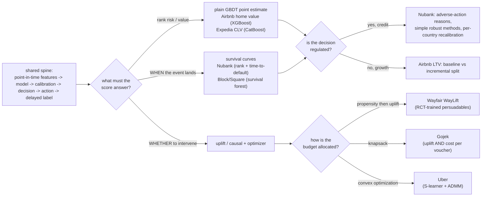

**Where they diverge.** The first axis is **what the score must answer**, which sets the model family. When you only need to rank risk or estimate a value, a plain GBDT point estimate is enough: Airbnb's home-value model runs XGBoost over 150+ engineered columns from the Zipline repo, and Expedia's CLV runs CatBoost segmented into 30 region-by-RFM models under a strict cutoff-date split. When the deliverable is **when** an event happens, the systems switch to survival analysis so censored (still-active, not-yet-defaulted) rows keep contributing instead of being dropped: Block/Square fits a 200-tree conditional survival forest (C-index 0.83, Integrated Brier Score 0.13) and reads risk at any horizon off the curve, while Nubank stacks time-to-default survival curves on top of a slow-updating ranking model. When the question is **whether to intervene**, propensity and prediction are actively wrong and the systems reach for uplift or causal estimators (Wayfair, Uber, Gojek). The teardown's dividing line is exactly this: rank (GBDT) versus when (survival) versus whether-to-act (causal).

The second axis is **plain prediction versus uplift or causal**, driven by whether the score feeds a passive read or an active treatment. A churn or propensity model answers "who will churn," but spending retention or voucher budget on that score wastes it on sure things and lost causes. Wayfair's WayLift makes the tradeoff explicit: cheap general-propensity models (quarterly retrain, observational data) scale but over-message, so channel-specific **uplift** models trained on **RCT** slices isolate the persuadables whose conversion the ad actually caused. Gojek predicts **both uplift and cost** per customer-voucher pair, sorts into persuadables, sure things, lost causes, and do-not-disturbs (who backfire), then ranks by uplift-per-dollar. The reason uplift needs randomized treatment while propensity trains on logs is confounding: observational data alone cannot separate the causal effect from selection.

The third axis is **calibration plus the decision policy**, which changes shape with what the number multiplies into. A pure sorter tolerates poor calibration, but Nubank's score sets an actual credit limit, so the absolute probability is the product and it decouples ranking (slow updates) from survival calibration (frequent recalibration, per-country base rates) so the two stages do not fight. Expedia reports Gini ranking and calibration plots and segment-wise RMSE together, because the CLV number sizes an acquisition budget. Where a fixed budget binds, the policy becomes a separate optimizer on top of the ML: Gojek fills a **knapsack** under a voucher cap, Uber feeds tensor B-spline spend-to-outcome curves from an S-learner into **convex optimization** (ADMM plus primal-dual interior point) that respects budget constraints. The senior move both teardowns flag is drawing the ML (coefficients/curves) and the optimizer (the allocation call) as separate boxes.

The fourth axis is **prediction target and regulation**, from risk to churn to LTV to pricing. Nubank sits in regulated credit, which is why it deliberately picks simple robust methods (they drift less under macro cycles), owes adverse-action reasons, and recalibrates per market for Brazil, Mexico, and Colombia. The LTV systems are unregulated growth problems but carry their own trap: Airbnb splits **baseline** LTV (365-day discounted forward bookings) from **incremental** LTV (subtracting supply cannibalized via a supply-demand production function) from marketing-induced LTV, because sizing a marketing spend on baseline value pays for organic growth. That incremental split is itself a causal question, so the LTV target quietly rejoins the uplift axis, and daily correction with realized bookings shrinks the long-horizon estimate error rather than waiting a year to learn the model broke.

**The systems**

- **Nubank** [How Nubank models risk for scalable credit limit increases](https://building.nubank.com/how-nubank-models-risk-for-smarter-scalable-credit-limit-increases/): Survival curves plus two-phase ranking-then-calibration for default risk across 122M customers. *(product design)*
- **Block (Square)** [PySurvival Tutorial: Churn Modeling](https://developer.squareup.com/blog/pysurvival-tutorial-churn-modeling/): A conditional survival forest predicting subscription churn timing, C-index 0.83. *(eval bar)*
- **Airbnb** [How Airbnb measures Listing Lifetime Value](https://medium.com/airbnb-engineering/how-airbnb-measures-listing-lifetime-value-a603bf05142c): An ML framework for baseline, incremental, and marketing-induced listing LTV over 365 days. *(product design)*
- **Airbnb** [Using Machine Learning to Predict Value of Homes on Airbnb](https://medium.com/airbnb-engineering/using-machine-learning-to-predict-value-of-homes-on-airbnb-9272d3d4739d): XGBoost on 150+ tabular features for listing value, with a full productionization pipeline. *(deployment)*
- **Expedia Group** [Expedia Group's Customer Lifetime Value Prediction Model](https://medium.com/expedia-group-tech/expedia-groups-customer-lifetime-value-prediction-model-7927cdd44342): A cross-brand CatBoost CLV model on a unified platform with deployment and monitoring. *(deployment)*
- **Wayfair** [Building Scalable Marketing ML Systems at Wayfair](https://www.aboutwayfair.com/careers/tech-blog/building-scalable-and-performant-marketing-ml-systems-at-wayfair): Propensity and uplift models scoring customers for programmatic marketing decisions. *(product design)*
- **Uber** [Practical Marketplace Optimization Using Causally-Informed ML](https://arxiv.org/abs/2407.19078): Causal ML plus convex optimization to allocate driver-incentive and rider-promotion budgets. *(product design)*
- **Gojek** [How Gojek Allocates Personalised Vouchers At Scale](https://medium.com/gojekengineering/how-gojek-allocates-personalised-vouchers-at-scale-41cad5d6f218): A causal uplift persuadables model plus a knapsack optimizer for voucher allocation. *(product design)*
- **Zalando** [How Zalando optimized large-scale inference and streamlined ML operations](https://aws.amazon.com/blogs/machine-learning/how-zalando-optimized-large-scale-inference-and-streamlined-ml-operations-on-amazon-sagemaker/): A forecast-then-optimize markdown and discount-steering pricing system across 1M+ products. *(deployment)*

---

### [Embeddings & representation learning](topics/07-embeddings-and-representation-learning.md) · 8 systems

**What they share.** Every system here runs the same skeleton: mine positive pairs from behavioral logs (clicks, bookings, co-purchases, browsing sessions, or graph edges), train an encoder that pulls related entities together and pushes unrelated ones apart, batch-embed the whole entity set, and load the vectors into an approximate-nearest-neighbor index that many downstream tasks share. The training problem is always contrastive: positives are nearly free from logs, and the consequential design choice is what counts as a negative. The store-and-reuse tail is common too, which is the economic point, learn the space once and serve retrieval, ranking, and fraud from the same vectors (Spotify reuses its cosine as a reranker feature, Wayfair feeds embeddings as features into existing fraud models). What actually varies across them is the join that defines "related" and whether the encoder is inductive (embeds a brand-new entity from features) or transductive (id-bound, so a new entity has no vector until retrain).

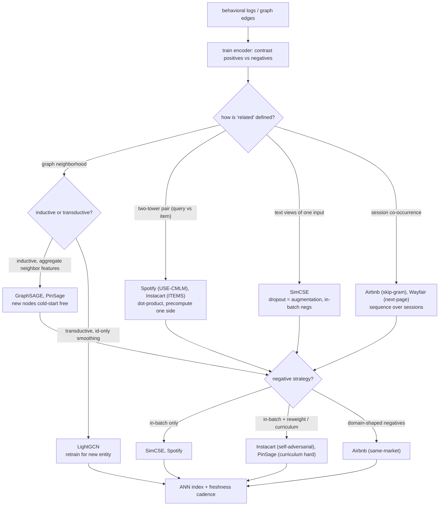

**Where they diverge.** The first axis is the contrastive objective and how negatives are chosen, which the topic calls the part that actually matters. SimCSE takes the purest form: it manufactures a positive by passing one sentence through the encoder twice under independent dropout masks and treats every other sentence in the batch as an in-batch negative under InfoNCE, so dropout is the entire augmentation and batch size is the whole negative budget. Spotify likewise leans on in-batch negatives (B squared minus B pairs per batch) and pays for quality with large batches. Instacart and PinSage push past trivially-easy in-batch negatives: Instacart adds self-adversarial re-weighting to up-weight the hardest examples without a separate mining stage, and finds unconverted products are noisy false negatives so it deliberately avoids treating all non-clicks as hard negatives; PinSage uses curriculum hard negatives that get progressively harder over training (starting too hard destabilizes it). Airbnb shapes negatives by domain instead of hardness, drawing extra same-market negatives so the model learns fine within-market distinctions rather than trivial geography. None of these teardowns explicitly mention logQ correction, so the popularity-bias fix the topic flags stays a latent risk (Instacart's writeup is the closest, calling out popularity bias directly).

The second axis is the encoder family and how it defines "related": graph versus two-tower versus text versus sequence. GraphSAGE and PinSage define relatedness by neighborhood aggregation and are inductive: a node's vector is built from its own plus sampled neighbors' features, so a brand-new node embeds with no retrain, and PinSage scales this to roughly 3 billion nodes with random-walk neighborhoods and importance pooling weighted by visit counts. LightGCN is the transductive counterweight, stripping GCN down to linear neighborhood smoothing over the user-item graph with only the layer-0 id embeddings trainable, giving a cheap strong collaborative-filtering baseline but no vector for an unseen entity. Spotify and Instacart use two-tower dual-encoders where a query tower and an item tower map into a shared space and relatedness is a dot product, which is what lets them precompute the item side offline. SimCSE is the flat text encoder learning sentence relatedness from unlabeled text. Airbnb and Wayfair are sequence models: Airbnb adapts word2vec skip-gram over 800 million click sessions with the booked listing as a persistent global context, and Wayfair runs a self-supervised next-page-type pretext task over browsing journeys with no fraud labels at all.

The third axis is dimensionality and the inductive-versus-transductive cold-start consequence. Airbnb deliberately picks a tiny 32-dimensional vector for 4.5 million listings, trading capacity for index and memory economy, and handles cold start not with the encoder but by averaging the three nearest same-type, same-price listings, exactly the content-fallback the topic prescribes for id-bound methods. LightGCN sits at the same cold-start disadvantage: because only id embeddings are learned, a genuinely new user or item needs a retrain or a content fallback. The inductive graph and two-tower content encoders (GraphSAGE, PinSage, and to a degree the text-featured towers of Spotify and Instacart) make cold start a non-event because the vector comes from features, which is the structural reason the topic frames inductive encoders as the cold-start answer rather than a patch.

The fourth axis is the index and the freshness clock. Spotify precomputes episode vectors into a Vespa ANN index and computes only the query vector online on GPU via Vertex AI, then merges semantic candidates with Elasticsearch before a reranker rather than replacing lexical search. Instacart indexes products in FAISS and serves over 95 percent of query embeddings from a FeatureStore cache under 8ms, exploiting the heavy-headed query distribution, and blends the similarity score with keyword and category retrieval. PinSage runs a MapReduce batch-inference pipeline that reuses overlapping neighbor embeddings to embed billions of pins in a few hours before feeding a nearest-neighbor index. Freshness cadence tracks how fast the world moves: Wayfair refreshes customer vectors hourly via a Vertex pipeline because fraud behavior is fast-moving and a stale vector misses in-progress attacks, whereas Airbnb's session-trained listing space and Instacart's cached query vectors both risk going stale as the catalog shifts, the write-path-versus-freshness tradeoff the topic names.

**The systems**

- **Stanford / Hamilton et al.** [GraphSAGE: Inductive Representation Learning on Large Graphs](https://arxiv.org/abs/1706.02216): inductive node embeddings by aggregating neighbor features. *(graph embeddings)*
- **He et al.** [LightGCN](https://arxiv.org/abs/2002.02126): simplified graph convolution for recommendation embeddings. *(graph embeddings)*
- **Gao et al.** [SimCSE: Simple Contrastive Learning of Sentence Embeddings](https://arxiv.org/abs/2104.08821): contrastive representation learning with in-batch negatives. *(contrastive learning)*
- **Pinterest** [PinSage: Graph Convolutional Neural Networks for Web-Scale Recommender Systems](https://medium.com/pinterest-engineering/pinsage-a-new-graph-convolutional-neural-network-for-web-scale-recommender-systems-88795a107f48): inductive graph embeddings at billions of nodes, routed into a nearest-neighbor index. *(graph embeddings)*
- **Airbnb** [Listing Embeddings in Search Ranking](https://medium.com/airbnb-engineering/listing-embeddings-for-similar-listing-recommendations-and-real-time-personalization-in-search-601172f7603e): listing embeddings learned from booking sessions with negative sampling, then used for similarity and personalization. *(representation learning)*
- **Spotify** [Introducing Natural Language Search for Podcast Episodes](https://engineering.atspotify.com/2022/03/introducing-natural-language-search-for-podcast-episodes/): dense embeddings for query and episode served through an ANN index for semantic search. *(deployment)*
- **Instacart** [How Instacart uses embeddings to improve search relevance](https://company.instacart.com/how-its-made/how-instacart-uses-embeddings-to-improve-search-relevance): A two-tower transformer projecting queries and products into one scored space. *(eval bar)*
- **Wayfair** [Melange: a customer-journey embedding system](https://www.aboutwayfair.com/careers/tech-blog/introducing-melange-a-customer-journey-embedding-system-for-improving-fraud-and-scam-detection): Self-supervised customer-journey embeddings from browsing sequences for fraud detection. *(who it serves)*

---

### [Feature store & training-serving skew](topics/04-feature-store-and-training-serving-skew.md) · 5 systems

**What they share.** Every system here converges on the same skeleton: raw events flow through feature pipelines, batch on a warehouse plus streaming off an event bus, that write into two stores fed from one set of feature definitions. The offline store keeps timestamped history so training-set builds can do point-in-time (as-of) joins that fetch each feature's value valid just before the label time, while the online store keeps the latest value per entity for single-digit-millisecond serving reads. All of them treat one shared definition as the mechanism that kills code skew: because the offline training values and the online served values derive from the same computation, there is only one thing to drift. And all of them handle both batch and streaming features, with the standing requirement that the streaming materialization and the offline backfill compute the identical aggregate or skew creeps back in. Google's Rules of ML is the outlier that states the underlying discipline (train the way you serve, log serving-time features) that the stores encode in infrastructure.

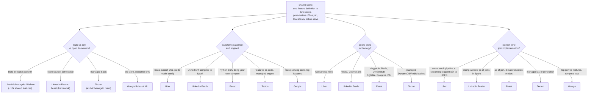

**Where they diverge.** The sharpest axis is build versus buy versus open framework, and it tracks reuse scale and real-time need. Uber built Michelangelo and its Palette store entirely in-house, and it only pays off because roughly 10,000 features are shared across many teams with owner, description, and SLA metadata attached (Uber teardown); the teardown is explicit that this is a heavy platform to build and operate and earns its cost only at large-org reuse. Tecton is the managed-SaaS answer from the same Michelangelo team, letting a team get real-time features without operating the streaming and materialization infra, at the price of vendor dependency and cost (Tecton teardown). Feast and Feathr sit in the middle as open-source: Feast is a storage-agnostic reference framework you self-host and wire to your own compute and orchestration, while Feathr is LinkedIn's open-sourced store coupled to Spark. Google's Rules of ML is the floor of the axis: no store at all, just the cheap discipline (reuse code between training and serving, log features at serving time) to apply before you build or buy (Google teardown).

Transform placement and the compute engine is the second axis, and it decides how the "one definition" guarantee is actually realized. Uber embeds a Scala-subset DSL inside the model configuration, so the transformation is versioned with the model rather than living as separate glue, and the identical DSL expressions run at both training and prediction time (Uber teardown). Feathr exposes a single unified transformation API that must compile to three runtimes (batch, streaming, online), which forces the transformation language to stay backend-agnostic while the heavy work runs on Spark under Databricks or Synapse (LinkedIn teardown). Feast takes the opposite stance: it is a framework, not a pipeline, so it defines features in a Python SDK but makes you bring your own compute, transformations, and orchestration (Feast teardown). Tecton keeps features-as-code but runs the engine for you, and Google places the transform nowhere special, insisting only that you reuse one serving code path so there is nothing to drift (Google teardown).

Online store technology splits cleanly between fixed and pluggable, driven by whether you are optimizing one stack or serving many. Uber hardwires Cassandra for its low-latency point reads at P95 under 10ms, chosen precisely because production models cannot read the bulk-scan HDFS offline store at request time (Uber teardown). Feathr materializes to Redis or Cosmos DB while keeping the offline history in S3, ADLS, Snowflake, or SQL warehouses, a deliberate split of serving tech from training tech (LinkedIn teardown). Feast pushes this furthest by abstracting the online store behind an interface so Redis, DynamoDB, Bigtable, Cassandra, Postgres and 20-plus backends plug in without rewriting feature logic, which is the whole point of its storage abstraction (Feast teardown). Tecton hides the choice behind a managed DynamoDB or Redis-backed store (Tecton teardown).

Point-in-time join implementation is where the subtle correctness work lives, and the systems differ in how they guarantee no future leaks into a training row. Uber achieves it structurally: the same data and batch pipeline feed both training and serving, and near-real-time Samza aggregates are logged back to HDFS at compute time so training can reconstruct exactly what was served (Uber teardown). Feathr does explicit sliding-window as-of joins that require timestamped history, not just the latest aggregate, so past labels see only past values (LinkedIn teardown). Feast generates point-in-time-correct sets via as-of joins and exposes the tradeoff directly through three materialization modes (incremental, recommended; full with timestamps; and simple, which drops the point-in-time guarantee by omitting event timestamps), so the user picks the correctness-cost balance explicitly (Feast teardown). Tecton generates as-of training sets as a managed capability, while Google reduces the same problem to a testing rule: measure on data gathered after the training window and snapshot external tables that mutate between train and serve, because logging what was actually served beats recomputing and hoping it matches (Google teardown).

**The systems**

- **Uber** [Meet Michelangelo: Uber's Machine Learning Platform](https://www.uber.com/blog/michelangelo-machine-learning-platform/): popularized the Palette feature store and the online/offline materialization split. *(platform)*
- **LinkedIn** [Feathr feature store](https://github.com/feathr-ai/feathr): one feature definition serving both online and offline at scale. *(platform)*
- **Feast** [open-source feature store](https://github.com/feast-dev/feast): a clean reference design for the dual store and point-in-time correct joins. *(reference design)*
- **Tecton** [engineering blog](https://www.tecton.ai/blog/): from the team behind Michelangelo; deep on real-time features and materialization. *(real-time features)*
- **Google** [Rules of Machine Learning](https://developers.google.com/machine-learning/guides/rules-of-ml): training-serving skew called out directly (reuse code between training and serving, log features at serving time). *(discipline)*

---

### [Real-time serving & deployment](topics/05-realtime-serving-and-deployment.md) · 11 systems

**What they share.** Every system here separates the model artifact from the model server that runs it, loads each version by pointer from a versioned registry, and fans requests across a fleet of stateless replicas behind a load balancer so scaling is horizontal. All of them reach for request batching to amortize per-call overhead and fill the hardware, and all trade tail latency for throughput at the batch window. The deploy path is the same skeleton in each: a candidate is shadowed or canaried before it widens, health and online metrics gate the ramp, and a bad version rolls back by repointing traffic to the last-good artifact rather than rebuilding. Autoscaling tracks traffic on a serving signal (queue depth, GPU) and a registry makes every served prediction reproducible. The divergence is which parts of that toolkit each team builds, centralizes, or automates.

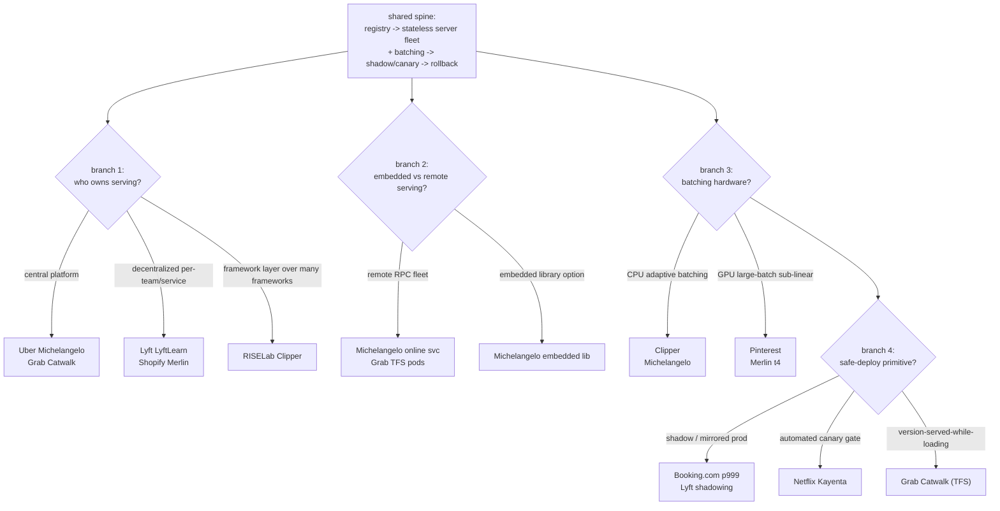

**Where they diverge.** The first axis is who owns and builds the serving layer: a central platform, a decentralized per-team service, or a framework abstraction. Uber Michelangelo and Grab Catwalk are centralized platforms: Michelangelo runs one company-wide online prediction service (hundreds of stateless hosts behind a load balancer, models as versioned Cassandra objects) and Catwalk is a centralized self-serve layer that provisions TensorFlow Serving pods on Kubernetes for hundreds of models. Shopify Merlin goes the opposite way, giving each use case its own dedicated Ray-on-GKE service with per-service CPU/memory/GPU/autoscale config, and Lyft LyftLearn is a decentralized inference platform where teams own their own serving. RISELab Clipper is a third shape: not a platform but a framework-agnostic abstraction layer that wraps heterogeneous models (TensorFlow, PyTorch, Scikit-learn) behind one predict API. The tradeoff the teardowns name is blast radius versus overhead: dedicated-per-service (Merlin) isolates one bad deploy but multiplies fleets, cold-start, and capacity planning, while one shared stack (Michelangelo) is cheaper to operate but must fit every team.

The second axis is embedded versus remote serving. Michelangelo explicitly serves three ways: offline batch via Spark, a remote online RPC service, and an embedded library linked into the caller. Remote serving (the Michelangelo online fleet, Catwalk's TFS pods, Merlin's Ray services) decouples model redeploys from app redeploys, standardizes metrics, and enables hot version swaps by repointing a tag or alias, but it adds a network hop into the latency budget. The embedded-library path removes that hop for latency-critical callers at the cost of coupling the model's lifecycle to the app's. The teardowns note this hop matters: Michelangelo reports P95 under 5 ms without a feature-store lookup and under 10 ms with one, so the feature fetch, not the model math, often dominates the remote-path budget.

The third axis is CPU versus GPU batching, which are opposite regimes. Clipper and Michelangelo batch on CPU with adaptive batching sized backward from a latency SLO, where the window sets the batch, not peak throughput. Pinterest inverts this by migrating recommender serving from CPU to GPU specifically to exploit GPU sub-linear latency scaling with batch size: they serve models roughly 77x larger at 30 percent lower latency by fusing embedding lookups with cuCollections GPU hash tables, packing many host-to-device transfers into one pre-allocated buffer (P50 from 10 ms to under 1 ms), and using CUDA graphs to kill per-kernel launch overhead. Merlin sits in between, offering GPU-configurable services (nvidia-tesla-t4) with MLServer request batching. The teardown gotcha is consistent: a GPU only pays off if you feed it large batches, so a low-QPS single-request path wastes the accelerator, and CUDA graphs assume static shapes that dynamic inputs break.

The fourth axis is the safe-deploy primitive each team automates: shadow-mirror, automated canary gate, or serve-while-loading. Booking.com's ranking platform leans on shadow traffic to mirrored production setups to run production-only benchmarks with zero user risk, held to a strict p999 tail with a static-score fallback when it misses budget, and Lyft LyftLearn similarly shadows a candidate before shipping. Netflix Kayenta is a different primitive entirely: not a serving stack but an automated canary-analysis gate that statistically compares baseline versus canary metrics to make the rollout decision without a human in the loop, which requires comparable metric streams to judge. Grab Catwalk relies on TensorFlow Serving's version-served-while-loading behavior so a new version warms before the old one stops serving, giving a safe update and instant rollback to the prior version, at the memory cost of both versions briefly resident. The honest split the teardowns draw: shadow (Booking, Lyft) proves a version does not break, canary gating (Kayenta) proves it helps on a small blast radius, and serve-while-loading (Catwalk) makes the swap itself gapless.

**The systems**

- **Berkeley RISELab** [Clipper: A Low-Latency Online Prediction Serving System](https://arxiv.org/abs/1612.03079): a serving system with caching, batching, and model abstraction. *(serving system)*
- **Google** [Rules of Machine Learning](https://developers.google.com/machine-learning/guides/rules-of-ml): deployment discipline, staged rollout, and not letting serving drift from training. *(discipline)*
- **Uber, DoorDash, and Netflix** have all published model-serving and deployment writeups (real-time prediction services, staged rollouts, and model registries); they are indexed in the database below rather than linked individually here. *(platform)*
- **Uber** [Meet Michelangelo: Uber's Machine Learning Platform](https://www.uber.com/us/en/blog/michelangelo-machine-learning-platform/): An online prediction service serving batched RPC requests at sub-10ms P95. *(deployment)*
- **Grab** [Catwalk: serving machine learning models at scale](https://engineering.grab.com/catwalk-serving-machine-learning-models-at-scale): Self-service TensorFlow Serving on Kubernetes with autoscaling for hundreds of models. *(deployment)*
- **Lyft** [Millions of real-time decisions with LyftLearn Serving](https://eng.lyft.com/powering-millions-of-real-time-decisions-with-lyftlearn-serving-9bb1f73318dc): A decentralized inference platform with versioning, shadowing, ms-latency predictions. *(deployment)*
- **Netflix** [Automated Canary Analysis with Kayenta](https://netflixtechblog.com/automated-canary-analysis-at-netflix-with-kayenta-3260bc7acc69): Automated canary analysis comparing baseline vs canary metrics to gate rollouts. *(eval bar)*
- **Pinterest** [GPU-accelerated ML inference at Pinterest](https://medium.com/@Pinterest_Engineering/gpu-accelerated-ml-inference-at-pinterest-ad1b6a03a16d): GPU serving with dynamic batching exploiting sub-linear latency scaling. *(product design)*
- **Shopify** [Real-time predictions with Shopify's ML platform](https://shopify.engineering/shopifys-machine-learning-platform-real-time-predictions): Merlin deploys each use case as a dedicated Ray-on-Kubernetes serving service. *(deployment)*
- **Booking.com** [The engineering behind a high-performance ranking platform](https://medium.com/booking-com-development/the-engineering-behind-booking-coms-ranking-platform-a-system-overview-2fb222003ca6): Multi-phase ranking with shadow-traffic mirroring and p999 latency budgets. *(deployment)*
- **LinkedIn** [Pensieve: an embedding feature platform](https://www.linkedin.com/blog/engineering/ai/pensieve): An embedding feature platform pushing inference to nearline pre-computation. *(deployment)*

---

### [Online experimentation & A/B testing](topics/06-online-experimentation-and-ab-testing.md) · 11 systems

**What they share.** Every platform runs the same skeleton: hash a diversion unit into stable arms so the only systematic difference between control and treatment is the change under test, then log a pre-declared success (OEC) metric alongside guardrail metrics that must not regress. All size the test up front from baseline rate, variance, and a minimum detectable effect, and all gate the read on validity: sample-ratio-mismatch is the canonical hard pre-gate (Uber's imbalance detection, Spotify's quality tests, Booking's checks). All squeeze variance before deciding, most commonly CUPED (Uber, LinkedIn) or interleaving (Netflix), so scarce traffic still yields a trustworthy call. The decision itself is uniform in shape: ship only on a real lift with guardrails safe, otherwise hold, iterate, or kill.

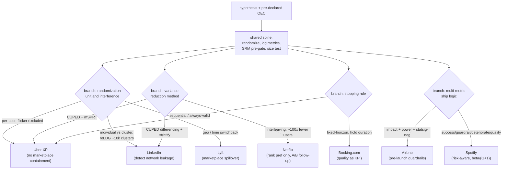

**Where they diverge.** The first axis is variance reduction, where the choice of estimator sets the traffic budget. Uber applies CUPED, using a pre-period covariate correlated with the in-experiment metric to strip out predictable variance, which is decisive for small user bases or early termination but degrades to nothing when the pre-period correlation is low. LinkedIn layers CUPED differencing (in-experiment minus pre-experiment per user) on top of stratified clustering precisely because its cluster arm collapses effective sample size (units become clusters, not members), so without variance reduction the individual-versus-cluster comparison would be hopelessly underpowered. Netflix takes the orthogonal route of interleaving: blend both rankers into one list per user and attribute each click, cancelling per-user variance within-subject and detecting a ranking difference with roughly 100x fewer subscribers, at the cost that it only measures within-list preference and cannot read business metrics or guardrails, forcing a full A/B follow-up (Netflix, Uber teardowns).

The second axis is randomization unit and interference. Uber and Airbnb divert per user, which is simplest and highest-power but assumes SUTVA and does not contain marketplace spillover (a treated rider affecting driver supply leaks across arms); Uber additionally excludes flicker users who cross arms mid-experiment and would otherwise be contaminated by both treatments. LinkedIn attacks interference head-on by running individual and cluster randomization in parallel over roughly 10,000 balanced reLDG clusters and testing delta = individual effect minus cluster effect with a Hausman-inspired test: agreement means SUTVA holds, a significant gap reveals network leakage that then needs egoClusters or ELEMENT. Lyft, a two-sided marketplace, cannot randomize by user at all and instead uses geo and time switchbacks to keep supply-demand interaction inside one arm, accepting coarser units and added temporal variance (LinkedIn, Lyft teardowns).

The third axis is the stopping rule and the peeking penalty. Uber monitors cumulatively with a mixture Sequential Probability Ratio Test (mSPRT), which grants continuous looks without inflating false positives, paired with delete-a-group jackknife and block bootstrap variance because within-user observations span correlated days; a naive fixed-horizon t-test read continuously would blow past the stated 5%. Booking.com sits at the opposite pole, treating a fixed horizon as a first-class quality rule: its Execution-phase score penalizes teams that stop off-plan when a result looks good, because for Booking the platform KPI is decision quality (adherence across Design, Execution, Shipping), not any single effect size. The contrast is philosophical: Uber engineers away the peeking penalty with the right math, Booking engineers it away with pre-registration and process discipline (Uber, Booking teardowns).

The fourth axis is multi-metric ship logic. Airbnb gates before and during launch with three complementary guardrails: a magnitude-based Impact Guardrail (escalate when the global ATE is more negative than a threshold, catching harm regardless of significance), a Power Guardrail (require the standard error below a bound so the Impact Guardrail keeps power), and a Stat-Sig-Negative Guardrail on priority metrics like revenue; it auto-approves clearly safe tests via non-inferiority CIs, flagging about 25 experiments a month of which 80% still launch. Spotify formalizes the joint decision across four metric roles (success tested for superiority, guardrails for non-inferiority, deterioration for inferiority, quality for SRM and pre-exposure bias) and controls the combined error rate rather than a loss function: crucially, because it requires all guardrails to pass, their false-positive risks do not compound so no alpha correction is needed there, but joint power drops and each metric must be powered at beta_star = beta / (G + 1) with G guardrails. Both reject reading "not significant" as "safe," insisting on explicit non-inferiority margins (Airbnb, Spotify teardowns).

**The systems**

- **Google** [Rules of Machine Learning](https://developers.google.com/machine-learning/guides/rules-of-ml): emphasizes measuring real online impact, not just offline metrics. *(discipline)*
- **Kohavi, Tang, Xu** *Trustworthy Online Controlled Experiments* (the A/B testing book): the canonical reference on OEC choice, sample ratio mismatch, peeking, interference, and running experiments at scale. *(reference)*
- **Netflix, Microsoft (ExP), Airbnb, LinkedIn** experimentation engineering writeups: first-party accounts of large-scale experimentation platforms, variance reduction, interleaving, and interference-robust designs. *(platform)*
- **Netflix** [Innovating faster on personalization using Interleaving](https://netflixtechblog.com/interleaving-in-online-experiments-at-netflix-a04ee392ec55): Interleaving prunes ranking algorithms with 100x fewer subscribers before A/B confirmation. *(eval bar)*
- **Uber** [Under the Hood of Uber's Experimentation Platform](https://www.uber.com/blog/xp/): An XP platform with CUPED variance reduction, monitoring, and statistical methodology. *(deployment)*
- **Netflix** [Reimagining Experimentation Analysis at Netflix](https://netflixtechblog.com/reimagining-experimentation-analysis-at-netflix-71356393af21): Modular analysis infra letting scientists add custom metrics and causal models. *(deployment)*
- **Airbnb** [Designing Experimentation Guardrails](https://medium.com/airbnb-engineering/designing-experimentation-guardrails-ed6a976ec669): Impact, power, and stat-sig-negative guardrails flag harmful experiments before launch. *(eval bar)*
- **Booking.com** [Experimentation quality as the main platform KPI](https://medium.com/booking-product/why-we-use-experimentation-quality-as-the-main-kpi-for-our-experimentation-platform-f4c1ce381b81): Experiment quality as the platform's north-star metric. *(eval bar)*
- **Spotify** [Risk-Aware Product Decisions in A/B Tests with Multiple Metrics](https://engineering.atspotify.com/2024/03/risk-aware-product-decisions-in-a-b-tests-with-multiple-metrics): Combining success, guardrail, and quality metrics into one shipping decision. *(eval bar)*
- **LinkedIn** [Detecting interference: an A/B test of A/B tests](https://www.linkedin.com/blog/engineering/ab-testing-experimentation/detecting-interference-an-a-b-test-of-a-b-tests): Cluster vs individual randomization plus CUPED to detect network-effect interference. *(eval bar)*
- **Lyft** [Experimentation in a Ridesharing Marketplace](https://eng.lyft.com/experimentation-in-a-ridesharing-marketplace-b39db027a66e): Statistical interference biases marketplace tests; session/geo/time randomization as remedy. *(eval bar)*

---

### [ML monitoring & drift](topics/11-ml-monitoring-and-drift.md) · 10 systems

**What they share.** Every system here logs production predictions alongside the exact features that produced them, then runs cheap distribution and data-quality checks on that log immediately while true performance metrics wait for labels to land. All of them detect some flavor of drift (feature distribution moving off a reference window, prediction/score distribution shifting, or performance decay once outcomes join back) by comparing a current window against a healthy baseline. Breaches feed an alerting layer tiered by severity that pages a human, triggers a retrain, or fires a rollback. The universal move is to lead with the fast, label-free signals (input and prediction drift) as an early warning for the slow performance metric, since labels arrive late. And all converge on the same retrain loop: scheduled retraining as the baseline, triggered retraining on breach through the same eval gate, one-step rollback for a bad promote.

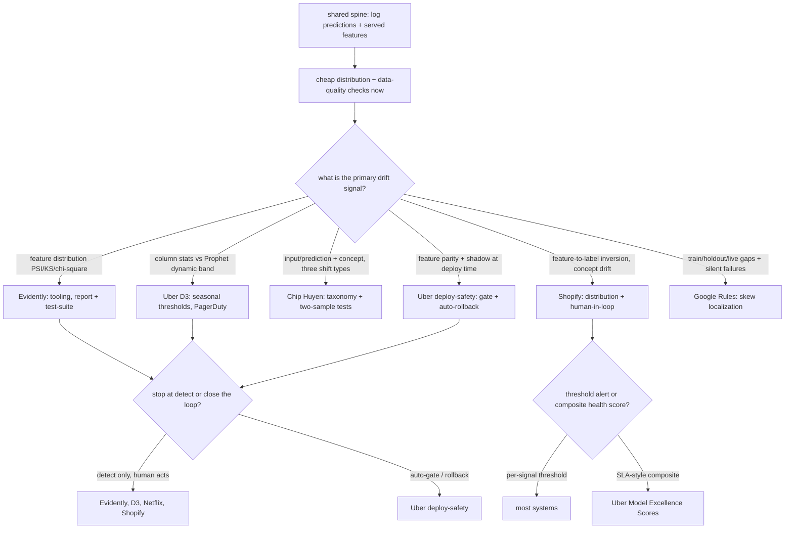

**Where they diverge.** The first axis is *which drift signal is primary*, and it splits the field into feature-distribution shops versus performance-and-concept shops. Evidently AI and Uber D3 anchor on feature-level distribution movement: Evidently's engine picks a test by column type (KS and Wasserstein and PSI for numeric, chi-square and Jensen-Shannon and PSI for categorical), and D3 profiles per-column stats (nulls, percentiles P1/P50/P75/P99, mean, distinct counts, foreign-key consistency) as its raw signal. Chip Huyen's field guide instead insists on separating covariate shift (P(X) moves), label shift (P(Y) moves), and concept drift (P(Y given X) moves), because retraining on fresh data cures covariate shift far more cleanly than concept drift. Shopify lives almost entirely in concept-drift territory: its canonical mobile-fraud example is a feature-to-label correlation that *inverted* sign as mobile became dominant, which monitoring magnitude alone misses. Uber deploy-safety and Google's Rules push earliest, catching training-serving skew before or at deploy time (online-offline feature parity, snapshotting joined tables per Rule 31, Rule 37's three gaps of train-vs-holdout, holdout-vs-next-day, next-day-vs-live) rather than waiting for live drift.

The second axis is *static thresholds versus scored health versus dynamic seasonal bands*, and this is where alerting philosophy differs sharply. Evidently ships conventional PSI bands (often 0.1 and 0.25) plus pass/fail Test Suites, which are simple but false-alarm on any seasonal column. Uber D3 replaces static limits with Prophet, a nonlinear regression that learns 90 days of trend and seasonality to emit *dynamic* thresholds, so weekly cycles are not flagged, and it adds a feedback loop where users tag outliers and a diagnosis job auto-disables high-error noisy series. Uber Model Excellence Scores go further up the abstraction ladder: instead of per-signal threshold alerts they compute an SLA-style *composite* quality score across lifecycle phases, which standardizes a quality bar across many teams but risks masking which specific signal actually moved. That composite-versus-threshold tension is the core tradeoff: a single number is governable at fleet scale but not diagnosable, whereas per-feature threshold alerts (the interview-canonical "AUC dropped and feature X drifted in segment Y") are diagnosable but proliferate.

The third axis is *the label-delay proxy*, and how aggressively each system leans on label-free leading indicators. Huyen orders monitoring by ease precisely because labels are the bottleneck: accuracy when labels exist, then predictions (low-dimensional, cheap to watch), then features validated against schemas (Great Expectations, Deequ), then raw inputs. Uber deploy-safety substitutes *shadow testing* for the missing labels, running the candidate on identical live inputs across 75 percent-plus of critical use cases and watching score distribution and calibration via its Hue stack, so it never has to wait for outcomes to judge a promotion. D3 sidesteps labels entirely by monitoring only column-level data quality (its 45-day-to-2-day detection win is on pipeline-bug drift, not model performance), which is why its drift is usually a pipeline bug rather than true model decay. Shopify accepts the delay and inserts a human-in-the-loop investigator on its scheduled Airflow runs (daily, weekly, per merchant) to distinguish real inversion from noise before retraining a fraud model.

The fourth axis is *build-your-own-platform versus adopt-a-tool*, and it maps onto whether the system closes the loop or stops at detection. Evidently is deliberately a library: it detects and reports (Reports summarize, Test Suites gate CI/CD) but leaves alerting, retrain, and rollback for you to wire around it, which is its strength for standing up drift metrics fast with zero infra and its limit because it does not act. Uber's stack is the opposite pole: D3 pages PagerDuty across an estimated 100,000-plus monitors on 300-plus datasets (with query consolidation from 200-plus to 8 to keep cost at 0.01 dollars), and deploy-safety fully automates the response with auto-rollback to last-known-good and gradual traffic ramps, but that costs real shadow infra and slows releases and depends on a trustworthy baseline. The dividing line the teardown draws is exactly this: whether a system stops at detection and hands the response to a human (Evidently, Netflix, Shopify) or closes the loop itself by gating promotion, triggering retrain, or rolling back automatically (Uber deploy-safety), with Google's Rules supplying the discipline (tier alerts by whether the model is user-facing per Rule 9) that both camps borrow.

**The systems**

- **Chip Huyen** [Data Distribution Shifts and Monitoring](https://huyenchip.com/2022/02/07/data-distribution-shifts-and-monitoring.html): the clearest single read on covariate vs concept drift, label delay, and what to actually monitor. *(foundations)*
- **Google** [Rules of Machine Learning](https://developers.google.com/machine-learning/guides/rules-of-ml): the production discipline, including watching for silent failures in the data feeding the model. *(discipline)*
- **Evidently AI** [open-source drift detection](https://github.com/evidentlyai/evidently): concrete drift metrics (PSI, KS, distribution tests) and report tooling; the methods implemented and runnable. *(tooling)*
- **"Hidden Technical Debt in Machine Learning Systems"** (Sculley et al., NeurIPS 2015): the classic paper on why ML systems rot in production: entanglement, feedback loops, the CACE principle. *(foundations)*
- **Uber** [D3: an automated system to detect data drifts](https://www.uber.com/blog/d3-an-automated-system-to-detect-data-drifts/): Column-level data-drift detection with Prophet anomaly detection across 300+ datasets. *(deployment)*
- **Uber** [Model Excellence Scores: enhancing ML quality at scale](https://www.uber.com/en-GB/blog/enhancing-the-quality-of-machine-learning-systems-at-scale/): An SLA-style scoring framework measuring model quality across lifecycle phases. *(eval bar)*
- **Uber** [Raising the Bar on ML Model Deployment Safety](https://www.uber.com/us/en/blog/raising-the-bar-on-ml-model-deployment-safety/): Shadow testing, automated rollbacks, and real-time data-quality checks. *(deployment)*
- **Lyft** [Full-Spectrum ML Model Monitoring at Lyft](https://eng.lyft.com/full-spectrum-ml-model-monitoring-at-lyft-a4cdaf828e8f): Feature validation, score monitoring, anomaly and performance-drift detection. *(eval bar)*
- **Netflix** [ML Observability: transparency for payments and beyond](https://netflixtechblog.com/ml-observability-bring-transparency-to-payments-and-beyond-33073e260a38): A logging, monitoring, and explaining framework for ML observability. *(deployment)*
- **Shopify** [Shopify's Playbook for Scaling Machine Learning](https://shopify.engineering/shopify-playbook-scaling-machine-learning): A scaling playbook covering monitoring and feature drift with a mobile-fraud example. *(who it serves)*
