# Case teardowns

The [case studies index](CASE-STUDIES.md) lists the shipped systems and links
their engineering writeups. This document goes one level deeper: each entry is a
teardown of how a real team actually built the system, read from their own
writeup and presented as a diagram of their design, the interview questions that
design invites, the non-obvious tricks it gets right, and the common mistakes on
that kind of system with concrete fixes.

Every teardown is faithful to a first-party engineering source. Diagrams are
Mermaid and render on GitHub. Organized by the same use-case taxonomy as the rest
of the repo.

---
## Candidate retrieval (two-tower)

### Pinterest: large-scale learned retrieval for Homefeed ([source](https://medium.com/pinterest-engineering/establishing-a-large-scale-learned-retrieval-system-at-pinterest-eb0eaf7b92c5))
Pinterest replaced hand-tuned candidate generators with a jointly-trained two-tower model. The user tower runs at request time and combines a long-term interest summary (PinnerSage) with a real-time user-sequence transformer that captures immediate intent, while the item tower embeds billions of Pins offline into an HNSW index served by their in-house Manas system. Training uses sampled softmax with in-batch negatives and a popularity-bias correction that subtracts the log probability of an item appearing in the batch. A large share of the engineering budget goes to versioning: each ANN host carries model-version metadata so a viewer embedding is never scored against a mismatched index during staggered rollouts.

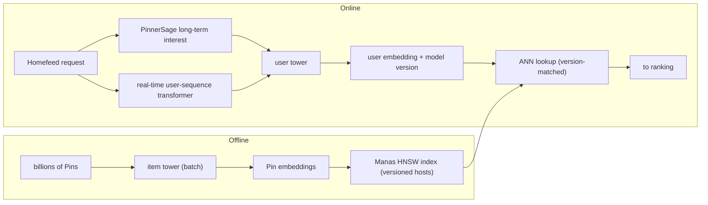
```mermaid
flowchart LR
  subgraph Offline
    PINS["billions of Pins"] --> IT["item tower (batch)"]
    IT --> EMB["Pin embeddings"]
    EMB --> MANAS["Manas HNSW index (versioned hosts)"]
  end
  subgraph Online
    REQ["Homefeed request"] --> PS["PinnerSage long-term interest"]
    REQ --> SEQ["real-time user-sequence transformer"]
    PS --> UT["user tower"]
    SEQ --> UT
    UT --> UE["user embedding + model version"]
    UE --> ANN["ANN lookup (version-matched)"]
    MANAS --> ANN
    ANN --> RANK["to ranking"]
  end
```
**Interview questions this design invites**
- Why blend a long-term interest summary (PinnerSage) with a real-time sequence transformer in the same user tower instead of picking one?
- How does attaching a model version to each ANN host prevent a viewer embedding from being scored against a stale item index during a rollout?
- Sampled softmax subtracts log P(item in batch); walk through why in-batch negatives over-penalize popular Pins and how that term corrects it.
- Two services (user tower and item index) must be retrained and redeployed in lock-step. What breaks if they drift, and how would you gate the deploy?
- They deprecated two prior candidate generators. How would you prove the learned retriever is strictly better rather than just additive?

**Tricks and gotchas**
- Model-version metadata on every ANN host, plus keeping N previous viewer-model versions for rollback, makes staggered two-service deploys safe.
- Splitting the user tower into a slow long-term interest signal and a fast sequence signal lets one embedding carry both stable taste and immediate intent.
- The popularity-correction term is baked into the loss, not a post-hoc reweight, so it shapes the embedding space directly.
- Building on the existing Manas/HNSW serving stack avoided a new index system and reused proven infra.

**Common mistakes and how to fix them**
- Deploying a new user tower before the matching item index is live: gate on version metadata so mismatched pairs are never scored.
- Ignoring popularity bias from in-batch negatives: add the logQ / batch-probability correction so head Pins are not suppressed.
- Treating retrieval quality as a single-model win: measure save-rate and user coverage against the specific generators you intend to deprecate.
- Assuming a long-term interest vector reacts to current intent: add a real-time sequence signal so a session pivot surfaces immediately.

### YouTube/Google: sampling-bias-corrected neural retrieval (NDR) ([source](https://research.google/pubs/sampling-bias-corrected-neural-modeling-for-large-corpus-item-recommendations/))
Google's Neural Deep Retrieval trains a two-tower model over a corpus of tens of millions of videos, with an item tower over a wide variety of item features and a query tower over user/context features, scored by dot product. The core contribution is fixing sampling bias: the batch softmax over in-batch negatives is skewed under power-law item popularity, so they estimate each item's sampling frequency from streaming data and use it as a logQ correction, yielding an unbiased softmax that adapts as the item distribution drifts. The frequency estimator sketches item occurrences and learns them via gradient descent, so no fixed global count is needed. They validate offline on two datasets and with a live YouTube A/B test showing recommendation-quality gains.

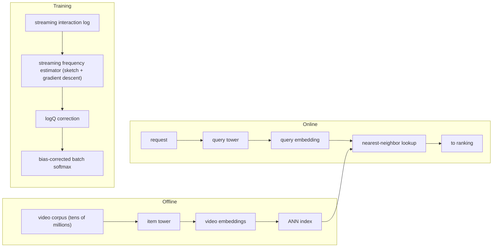
```mermaid
flowchart LR
  subgraph Offline
    ITEMS["video corpus (tens of millions)"] --> IT["item tower"]
    IT --> EMB["video embeddings"]
    EMB --> IDX["ANN index"]
  end
  subgraph Training
    STREAM["streaming interaction log"] --> FREQ["streaming frequency estimator (sketch + gradient descent)"]
    FREQ --> LOGQ["logQ correction"]
    LOGQ --> LOSS["bias-corrected batch softmax"]
  end
  subgraph Online
    REQ["request"] --> QT["query tower"]
    QT --> QE["query embedding"]
    QE --> ANN["nearest-neighbor lookup"]
    IDX --> ANN
    ANN --> RANK["to ranking"]
  end
```
**Interview questions this design invites**
- Why does a plain in-batch softmax become biased specifically under a power-law item distribution?
- How does estimating item frequency from a stream (rather than a fixed global count) let the correction adapt to distribution drift?
- What are the failure modes of the sketch-based frequency estimator, and how would you detect a bad estimate?
- The abstract reports offline gains and an online A/B win. Why insist on both before shipping a retrieval change?
- Where would you apply the logQ term: to logits during training, at serving, or both, and why?

**Tricks and gotchas**
- Frequency is learned online via gradient descent over a sketch, avoiding a separate global counting job that would lag the stream.
- The correction is unbiased and self-adapting, so it keeps working as new videos shift the popularity curve.
- Casting retrieval as a batch-softmax MIPS problem is exactly what makes item embeddings precomputable and ANN-servable.

**Common mistakes and how to fix them**
- Training in-batch negatives without any correction: popular items get pushed down; apply the streaming logQ correction.
- Using a stale global frequency table: estimate frequency from streaming data so it tracks the current distribution.
- Trusting offline recall alone: confirm with an online A/B test since the two do not always move together.
- Normalizing/temperature-scaling embeddings arbitrarily: tune them, as they materially affect the softmax sharpness and recall.

### Uber: two-tower embeddings replacing thousands of city models ([source](https://www.uber.com/blog/innovative-recommendation-applications-using-two-tower-embeddings/))
Uber Eats built one global two-tower model where the query tower encodes search query and user profile and the item tower encodes store, grocery item, and geo-location features, scored by dot product. Instead of raw user IDs, the user side uses a bag-of-words of the customer's time-sorted previously-ordered store_ids, which shrinks the model roughly 20x and softens cold start; the two towers also share a UUID embedding layer. This single contextual model replaced thousands of per-city Deep Matrix Factorization models, cutting weekly training from hundreds of thousands to thousands of core-hours. Training uses in-batch negatives with logQ correction plus geo-hashed data so negatives stay geographically meaningful, lifting recall@500 from 89% to 93%.

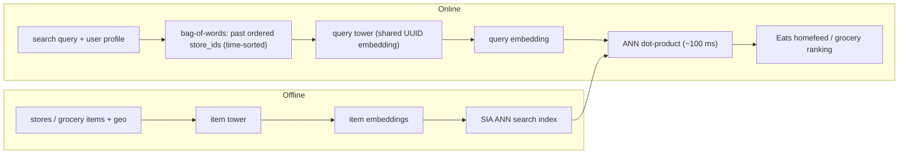
```mermaid
flowchart LR
  subgraph Offline
    STORES["stores / grocery items + geo"] --> IT["item tower"]
    IT --> EMB["item embeddings"]
    EMB --> SIA["SIA ANN search index"]
  end
  subgraph Online
    REQ["search query + user profile"] --> BOW["bag-of-words: past ordered store_ids (time-sorted)"]
    BOW --> QT["query tower (shared UUID embedding)"]
    QT --> QE["query embedding"]
    QE --> ANN["ANN dot-product (~100 ms)"]
    SIA --> ANN
    ANN --> RANK["Eats homefeed / grocery ranking"]
  end
```
**Interview questions this design invites**
- Why does a bag-of-words of past store_ids beat a raw user-ID embedding for both model size and cold start?
- What does one global contextual model buy over thousands of per-city models, and what does it risk losing for small cities?
- Geo-hashing the training data changes which items become in-batch negatives. Why are geographically-local negatives more useful here?
- Sharing a UUID embedding layer across towers is unusual. What does it couple, and when would it hurt?
- Recall@500 went 89% to 93% with logQ. How would you attribute that gain between logQ and the geo-local negatives?

**Tricks and gotchas**
- A time-sorted bag-of-words of past store_ids replaces user-ID embeddings, cutting model size ~20x while adding personalization.
- Cross-tower UUID embedding sharing reduces complexity yet improved performance, contrary to the usual no-share rule.
- Geo-hashing the training stream produces spatially-constrained negatives so the model learns local, actionable distinctions.
- The same embeddings are reused as transferable features for downstream ML tasks, amortizing the training cost.

**Common mistakes and how to fix them**
- Maintaining a separate model per city: collapse to one global contextual model conditioned on geo features to slash training cost.
- Random global negatives in a geo-local product: geo-hash so negatives are plausible alternatives the user could actually order from.
- Raw user-ID features that explode model size and fail on new users: use an aggregated history bag-of-words instead.
- Skipping popularity correction on in-batch negatives: add logQ to recover several points of recall.

### Airbnb: embedding-based retrieval for search, IVF over HNSW ([source](https://airbnb.tech/ai-ml/embedding-based-retrieval-for-airbnb-search/))
Airbnb added a two-tower retriever to search: a query tower over search parameters (location, guests, length of stay) computed per request, and a listing tower over home attributes (historical engagement, amenities, capacity) precomputed in a daily batch. Training is contrastive over real user journeys, with the finally-booked listing as positive and homes the user saw-but-did-not-book as negatives. They deliberately chose IVF over HNSW because HNSW's memory and rebuild cost could not absorb the high volume of price/availability updates, and geographic filters ran poorly alongside HNSW graph traversal; IVF stores only centroids and cluster assignments, so a filter becomes a cluster-selection step. A key finding: Euclidean distance yields balanced clusters while dot product yields imbalanced ones, because dot product ignores vector magnitude even though many features come from historical counts. Deployment produced a statistically significant bookings gain rivaling two years of ranking wins.

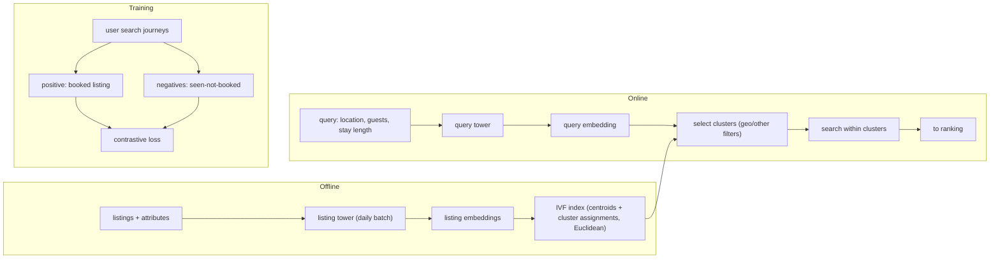
```mermaid
flowchart LR
  subgraph Offline
    LIST["listings + attributes"] --> LT["listing tower (daily batch)"]
    LT --> EMB["listing embeddings"]
    EMB --> IVF["IVF index (centroids + cluster assignments, Euclidean)"]
  end
  subgraph Training
    JRNY["user search journeys"] --> POS["positive: booked listing"]
    JRNY --> NEG["negatives: seen-not-booked"]
    POS --> CL["contrastive loss"]
    NEG --> CL
  end
  subgraph Online
    REQ["query: location, guests, stay length"] --> QT["query tower"]
    QT --> QE["query embedding"]
    QE --> SEL["select clusters (geo/other filters)"]
    IVF --> SEL
    SEL --> ANN["search within clusters"]
    ANN --> RANK["to ranking"]
  end
```
**Interview questions this design invites**
- Why did high price/availability update volume make HNSW's memory footprint and rebuilds untenable, and how does IVF sidestep that?
- Treating a geo filter as cluster selection changes the recall profile. What do you lose versus post-filtering an HNSW result?
- Why does dot-product clustering come out imbalanced while Euclidean is balanced, and why do count-based features make magnitude matter?
- Journey-based negatives (seen-not-booked) vs random negatives: what bias does each introduce?
- A daily listing-embedding batch sets item freshness. How would you surface a brand-new or newly-repriced listing before the next build?

**Tricks and gotchas**
- IVF stores only centroids and cluster assignments, so filters become cluster selection and per-second updates are cheap versus rebuilding an HNSW graph.
- Switching the distance metric to Euclidean fixed cluster imbalance that dot product caused, because many features are historical counts where magnitude is signal.
- Negatives are mined from real multi-search journeys, so the model learns the exact tradeoffs a booking user weighed.
- Query-context (dates, guests, location) enters retrieval itself, not just ranking, so filtered relevance is captured early.

**Common mistakes and how to fix them**
- Defaulting to HNSW everywhere: for high-update, filter-heavy catalogs, IVF's centroid model handles updates and filters far better.
- Using dot-product clustering with count-based features: switch to Euclidean so magnitude is respected and clusters stay balanced.
- Random negatives that ignore the booking funnel: use seen-not-booked journey negatives to teach real preference boundaries.
- Running geo filters as a parallel pass over an ANN graph: fold the filter into cluster selection to keep latency low.

### Snap: two-tower retrieval for Spotlight, split feed and retrieval services ([source](https://eng.snap.com/embedding-based-retrieval))
Snap's Spotlight retrieval uses a user tower over dense features (demographics, engagement stats) and pooled sparse engagement sequences, and a story tower over metadata, creator, and content-understanding embeddings; both are MLP plus 4-layer deep-cross networks producing 128-dim L2-normalized vectors. Training uses in-batch negatives (other users' stories in the batch) with a cosine-similarity, sigmoid, BCE loss and temperature-scaled hardness-aware weighting. Operationally the key move is splitting serving into a high-QPS feed-processing service that fetches the user embedding and a separately sharded retrieval service that queries HNSW indexes over millions of story documents, so the two scale independently and multiple EBR sources coexist. User embeddings refresh every few hours and story embeddings refresh frequently via separate offline dataflows; the system delivered double-digit view and view-time gains.

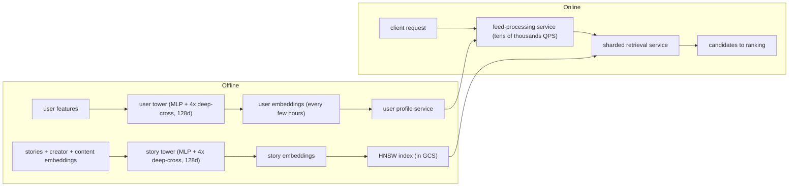
```mermaid
flowchart LR
  subgraph Offline
    STORY["stories + creator + content embeddings"] --> ST["story tower (MLP + 4x deep-cross, 128d)"]
    ST --> SEMB["story embeddings"]
    SEMB --> HNSW["HNSW index (in GCS)"]
    USER["user features"] --> UT["user tower (MLP + 4x deep-cross, 128d)"]
    UT --> UEMB["user embeddings (every few hours)"]
    UEMB --> UPS["user profile service"]
  end
  subgraph Online
    REQ["client request"] --> FEED["feed-processing service (tens of thousands QPS)"]
    UPS --> FEED
    FEED --> RSVC["sharded retrieval service"]
    HNSW --> RSVC
    RSVC --> RANK["candidates to ranking"]
  end
```
**Interview questions this design invites**
- Why split feed-processing from a sharded retrieval service instead of one service, and what does each scale on independently?
- User embeddings refresh every few hours but story embeddings refresh frequently. Why the asymmetry, and what staleness does each introduce?
- In-batch negatives use other users' stories to counter country/language mismatch. What bias does same-batch composition still leave?
- Both towers are 128-dim L2-normalized with deep-cross layers. Why L2-normalize, and what does the deep-cross network add over a plain MLP?
- They run several EBR sources (user-story, user-creator, similar creators). How would you blend and dedup them before ranking?

**Tricks and gotchas**
- The feed-processing / retrieval split lets one service absorb tens-of-thousands QPS while the sharded index service scales on document count.
- Temperature-scaled hardness-aware weighting in the BCE loss focuses learning on informative in-batch negatives.
- Story embeddings live in GCS and refresh on a fast cadence, decoupling item freshness from the slower user-embedding job.
- The architecture is explicitly multi-model, so new EBR sources plug in without reworking the serving path.

**Common mistakes and how to fix them**
- Coupling request handling and index search in one service: split them so QPS-bound and corpus-bound scaling are independent.
- Refreshing user and item embeddings on one cadence: give fresh-churning items their own fast dataflow.
- Un-normalized embeddings that make cosine unstable: L2-normalize both towers to a fixed dimension.
- Treating all in-batch negatives as equally hard: add hardness-aware weighting so easy negatives do not dominate the gradient.

### Etsy: unified embedding-based personalized retrieval ([source](https://arxiv.org/abs/2306.04833))
Etsy's search retrieval unifies graph, transformer, and term/token-based embeddings end to end into a single model with separate query and product encoders scored for semantic matching, tuned for a performance-versus-efficiency tradeoff. The distinguishing choices are a hard-negative sampling strategy plus feature engineering that lets one embedding capture lexical, semantic, and behavioral signal at once, avoiding separate lexical and vector retrievers. For serving they use HNSW with 4-bit product quantization to fit the index at scale with minimal recall loss. Aggregated across multiple live A/B tests, the model lifted search purchase rate by +5.58% and site-wide conversion by +2.63%.

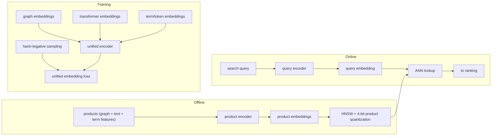
```mermaid
flowchart LR
  subgraph Offline
    PROD["products (graph + text + term features)"] --> PE["product encoder"]
    PE --> PEMB["product embeddings"]
    PEMB --> PQ["HNSW + 4-bit product quantization"]
  end
  subgraph Training
    HN["hard-negative sampling"] --> LOSS["unified embedding loss"]
    GT["graph embeddings"] --> UNI["unified encoder"]
    TR["transformer embeddings"] --> UNI
    TERM["term/token embeddings"] --> UNI
    UNI --> LOSS
  end
  subgraph Online
    Q["search query"] --> QE["query encoder"]
    QE --> QEMB["query embedding"]
    QEMB --> ANN["ANN lookup"]
    PQ --> ANN
    ANN --> RANK["to ranking"]
  end
```
**Interview questions this design invites**
- What does unifying graph, transformer, and term embeddings into one model buy over running lexical and vector retrievers side by side?
- Why does hard-negative sampling matter more here than in-batch negatives, and how do you avoid destabilizing training with too many?
- 4-bit product quantization shrinks the HNSW index; how much recall do you trade, and how would you measure it?
- The +5.58% purchase-rate gain aggregates multiple A/B tests. Why aggregate rather than cite one test?
- How would term/token embeddings help typo and long-tail queries that a purely semantic encoder might miss?

**Tricks and gotchas**
- Folding term/token embeddings into the same model preserves lexical matching that a purely semantic vector retriever would drop.
- 4-bit product quantization on HNSW keeps the index in memory at catalog scale with a controlled recall hit.
- Hard-negative mining sharpens the decision boundary that easy in-batch negatives leave fuzzy.
- Training the three embedding families end to end lets the model learn how to weight them rather than fixing weights by hand.

**Common mistakes and how to fix them**
- Maintaining separate lexical and semantic retrievers: unify them into one embedding so ranking sees a single consistent candidate set.
- Relying only on easy in-batch negatives: add a hard-negative sampling strategy to improve precision on near-misses.
- Storing full-precision vectors that blow the memory budget: apply product quantization and validate recall stays acceptable.
- Judging retrieval on offline metrics only: gate on live A/B purchase-rate and conversion, aggregated across tests.

### Expedia Group: two-tower candidate generation for travel ([source](https://medium.com/expedia-group-tech/candidate-generation-using-a-two-tower-approach-with-expedia-group-traveler-data-ca6a0dcab83e))
Expedia built a two-tower candidate generator where the query tower encodes search context (user history, queries, reference items) and the property tower encodes property characteristics (location, popularity, amenities); both are stacks of ReLU fully-connected layers producing matching-dimension vectors scored by a batched dot product. Training uses in-batch sampled softmax with an identity-matrix label (the diagonal is the positive) and, critically, a logQ correction that subtracts each item's log occurrence probability from the logits to counter popularity bias. Item embeddings are indexed in ScaNN for ANN retrieval so candidates are fetched without scoring the full catalog. Ablations showed batch normalization, logQ correction, and L2 normalization together gave the best recall@k, well above logQ alone.

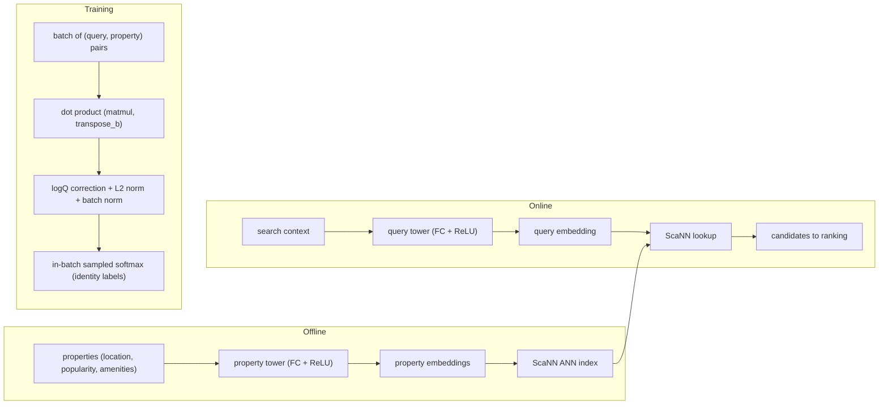
```mermaid
flowchart LR
  subgraph Offline
    PROP["properties (location, popularity, amenities)"] --> PT["property tower (FC + ReLU)"]
    PT --> PEMB["property embeddings"]
    PEMB --> SCANN["ScaNN ANN index"]
  end
  subgraph Training
    BATCH["batch of (query, property) pairs"] --> DOT["dot product (matmul, transpose_b)"]
    DOT --> LOGQ["logQ correction + L2 norm + batch norm"]
    LOGQ --> SM["in-batch sampled softmax (identity labels)"]
  end
  subgraph Online
    REQ["search context"] --> QT["query tower (FC + ReLU)"]
    QT --> QEMB["query embedding"]
    QEMB --> ANN["ScaNN lookup"]
    SCANN --> ANN
    ANN --> RANK["candidates to ranking"]
  end
```
**Interview questions this design invites**
- Why must the query and property towers output the same dimension, and what breaks if they do not?
- Walk through the identity-matrix labeling of an in-batch softmax: why is the diagonal the positive and everything off-diagonal a negative?
- The ablation shows batch norm + logQ + L2 beats logQ alone. Why do these three interact rather than add independently?
- ScaNN vs HNSW vs IVF: what would make ScaNN the right index choice for this catalog?
- Travel items have strong seasonality and availability. How would you keep property embeddings fresh enough?

**Tricks and gotchas**
- The whole in-batch loss is a single matmul with transpose_b plus an identity label, which is cheap and vectorized.
- logQ correction is applied to the logits directly, keeping popular properties from being unfairly penalized.
- Combining batch normalization and L2 normalization with logQ was necessary to realize the full recall gain, not optional polish.
- Reference items in the query tower let the model condition on what the traveler is already looking at.

**Common mistakes and how to fix them**
- Applying logQ but skipping normalization: pair it with L2 and batch norm to actually move recall@k.
- Mismatched tower output dimensions: enforce equal dimensions so the dot product is well-defined.
- Scoring the full property catalog per request: index item embeddings in ScaNN and do ANN retrieval instead.
- Ignoring popularity bias from in-batch negatives: subtract log item-occurrence probability from the logits.

### Pinterest: request-level deduplication and false-negative masking ([source](https://medium.com/pinterest-engineering/scaling-recommendation-systems-with-request-level-deduplication-93bd514142d9))
When Pinterest sorted training data by request (to enable deduplication), batches concentrated on few users, so many in-batch negatives were actually items those users had engaged with, pushing the false-negative rate from near 0% (IID) to about 30% and degrading the two-tower retriever. The fix modifies the InfoNCE loss with user-level masking: only engagements from other users count as negatives, excluding candidates whose user matches the anchor. Separately, a user's ~16K-token history was being duplicated for every scored candidate; they dedup it with Iceberg sorted storage (10-50x compression) and, for two-tower training, run the user tower once per request over R requests rather than B pairs (4x retrieval speedup). For ranking they built a Deduplicated Cross-Attention Transformer that encodes user history once and caches KV so each item cross-attends the cached context (7x serving throughput).

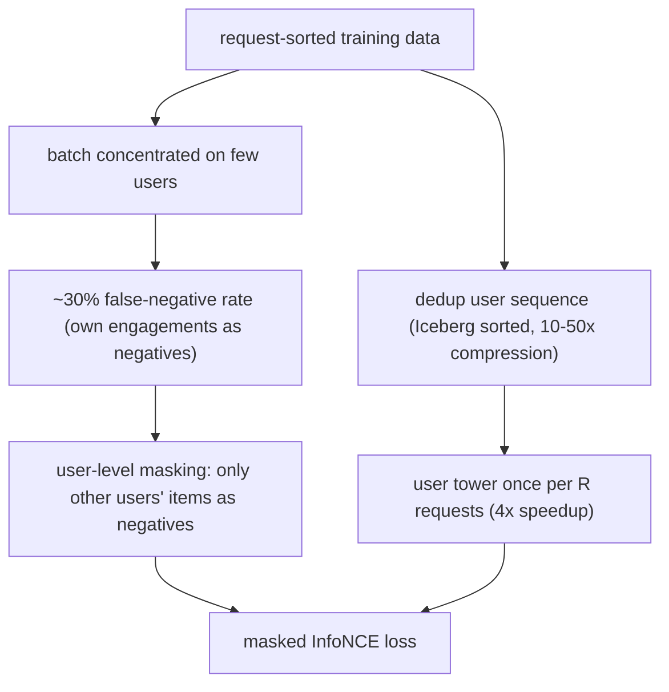
```mermaid
flowchart TD
  RAW["request-sorted training data"] --> BATCH["batch concentrated on few users"]
  BATCH --> FN["~30% false-negative rate (own engagements as negatives)"]
  FN --> MASK["user-level masking: only other users' items as negatives"]
  MASK --> LOSS["masked InfoNCE loss"]
  RAW --> DEDUP["dedup user sequence (Iceberg sorted, 10-50x compression)"]
  DEDUP --> UTOWER["user tower once per R requests (4x speedup)"]
  UTOWER --> LOSS
```
**Interview questions this design invites**
- Why does request-sorted data spike the in-batch false-negative rate to ~30% when IID sampling sits near 0%?
- Derive the user-level masking change to InfoNCE: which negatives get excluded and why does that restore quality?
- Running the user tower once per request instead of per pair gives a 4x speedup. What makes that safe for two-tower but harder for a cross-attention ranker?
- What tradeoff does request-sorting buy (storage/compute) that justifies fighting the false-negative problem it creates?
- How would you monitor false-negative rate in production to know masking is still needed?

**Tricks and gotchas**
- A one-line masking constraint on InfoNCE recovered retrieval quality while unlocking request-sorted training data.
- Sorting storage by request/user in Iceberg compresses user-heavy feature columns 10-50x.
- Two-tower retrieval is already dedup-friendly: compute the user embedding once per request, not once per candidate.
- The ranking-side DCAT caches user-history KV so each item cross-attends cached context, giving 7x throughput without recomputing the sequence.

**Common mistakes and how to fix them**
- Switching to request-sorted data without touching the loss: add user-level masking or the false-negative rate wrecks recall.
- Recomputing the full user sequence per candidate: dedup it (once per request for two-tower, cached KV for ranking).
- Storing duplicated user features naively: sort by request/user in columnar storage to reclaim 10-50x space.
- Assuming IID-sampling assumptions hold after re-sorting data: re-measure false-negative rate before trusting the loss.

### Glassdoor: two-tower candidate generation served on OpenSearch ([source](https://medium.com/glassdoor-engineering/improving-embedding-based-candidate-generation-for-recommender-systems-with-a-two-tower-model-c222123beb7f))
Glassdoor built a two-tower recommender where the user tower encodes profile and engagement metadata and the post tower encodes post text, comment text, and topics (each via a Sentence Transformer) plus structured post features, both stacks being linear layers with ReLU. Training combines mixed negatives (in-batch via matmul plus uniformly-sampled random negatives from the full corpus) under a sampled-softmax contrastive loss, with an auxiliary self-supervised loss that masks input features so the model learns structure independent of interactions. Post embeddings are precomputed in batch and indexed in OpenSearch's vector kNN for ANN retrieval, with a model service returning embeddings over REST. Offline they saw 40-60% relative gains on Precision/Recall/F1/HitRate@K over a Sentence-Transformer baseline, and A/B tests gave +5% engaged users and +5% clicks with better feed diversity.

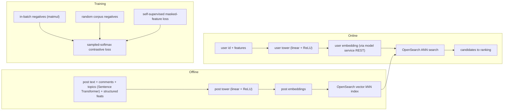
```mermaid
flowchart LR
  subgraph Offline
    POST["post text + comments + topics (Sentence Transformer) + structured feats"] --> PT["post tower (linear + ReLU)"]
    PT --> PEMB["post embeddings"]
    PEMB --> OS["OpenSearch vector kNN index"]
  end
  subgraph Training
    IB["in-batch negatives (matmul)"] --> LOSS["sampled-softmax contrastive loss"]
    RN["random corpus negatives"] --> LOSS
    SSL["self-supervised masked-feature loss"] --> LOSS
  end
  subgraph Online
    REQ["user id + features"] --> UT["user tower (linear + ReLU)"]
    UT --> UEMB["user embedding (via model service REST)"]
    UEMB --> ANN["OpenSearch ANN search"]
    OS --> ANN
    ANN --> RANK["candidates to ranking"]
  end
```
**Interview questions this design invites**
- Why mix in-batch and random-corpus negatives rather than relying on either alone?
- What does the self-supervised masked-feature auxiliary loss add that the contrastive loss cannot learn?
- Post features come from a Sentence Transformer. What are the freshness and cost implications of re-embedding text on every post update?
- Serving via OpenSearch kNN vs a dedicated HNSW service: what do you gain and give up?
- Offline showed 40-60% relative gains but A/B only +5%. Why the gap, and which number do you trust for the ship decision?

**Tricks and gotchas**
- Sentence-Transformer embeddings of post/comment/topic text give the item tower strong cold-start content signal.
- Mixed negatives (in-batch for hard-ish, random for coverage) balance boundary sharpness against corpus representativeness.
- A masking-based self-supervised loss regularizes the towers to learn structure beyond observed interactions.
- Reusing OpenSearch's built-in vector kNN avoided standing up a separate ANN service.

**Common mistakes and how to fix them**
- Only in-batch negatives on a small-user batch: add uniform random corpus negatives so the model sees the whole distribution.
- Over-trusting large offline lifts: validate with an A/B test, expecting compression from offline to online.
- Text features that go stale on edits: re-embed posts on update so the item tower reflects current content.
- Learning only from interactions: add self-supervised auxiliary objectives to generalize to sparse-interaction items.

### Spotify: Voyager, an HNSW nearest-neighbor library for serving retrieval ([source](https://engineering.atspotify.com/2023/10/introducing-voyager-spotifys-new-nearest-neighbor-search-library))
Voyager is Spotify's production HNSW-based nearest-neighbor library, the successor to Annoy, that provides the ANN lookup at the end of a two-tower or embedding retrieval pipeline. It is about 10x faster than Annoy at equal accuracy, up to 50% more accurate at equal speed, and uses 4x less memory via E4M3 8-bit float quantization (16x less than hnswlib during index build). It ships identical Python and Java interfaces so ML teams (Python) and backend teams (JVM) share one index format, and it deploys as stateless in-memory indexes on Kubernetes so similarity lookups need no database. It powers recommendation features such as Discover Weekly and has been battle-tested across teams since 2022.

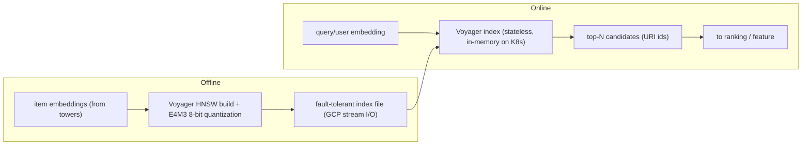
```mermaid
flowchart LR
  subgraph Offline
    EMB["item embeddings (from towers)"] --> BUILD["Voyager HNSW build + E4M3 8-bit quantization"]
    BUILD --> FILE["fault-tolerant index file (GCP stream I/O)"]
  end
  subgraph Online
    QE["query/user embedding"] --> VOY["Voyager index (stateless, in-memory on K8s)"]
    FILE --> VOY
    VOY --> CAND["top-N candidates (URI ids)"]
    CAND --> RANK["to ranking / feature"]
  end
```
**Interview questions this design invites**
- Why does E4M3 8-bit quantization cut memory 4x, and where does the accuracy cost show up in HNSW recall?
- What forces a company to build a new library instead of adopting hnswlib? What API/architecture constraints drove Voyager?
- Stateless in-memory indexes on Kubernetes eliminate a database. What operational tradeoffs does that introduce for freshness and rollout?
- Identical Python and Java bindings: why is a shared index format across languages worth building from scratch?
- HNSW gives 10x speed but higher memory than IVF-PQ. When would you still pick IVF-PQ over Voyager?

**Tricks and gotchas**
- E4M3 8-bit float quantization gives 4x memory savings while keeping accuracy competitive, and 16x savings during index creation.
- Matching Python and Java interfaces lets ML and backend teams share one index without a serialization boundary.
- Stateless in-memory K8s deployment removes database maintenance from the serving path.
- Fault-tolerant files with corruption detection and string URI ids make the index safe to ship and reference directly.

**Common mistakes and how to fix them**
- Running ANN behind a database when the index fits in memory: deploy stateless in-memory replicas for lower latency and less ops.
- Full-precision vectors that inflate memory: quantize (E4M3 8-bit) and verify recall stays within budget.
- Forking a library your stack cannot adapt: if API/architecture needs diverge, a purpose-built library can be cheaper than fighting one.
- Different index formats per language: standardize one library with shared bindings so ML and serving stay in sync.

### Twitter: debiasing model-based candidate generation for the home timeline ([source](https://arxiv.org/abs/2105.09293))
Twitter's paper tackles dataset bias in two-tower candidate generation for the home timeline: the training log lacks representative examples of very irrelevant candidates, so the model is never taught what a clearly-bad candidate looks like. They find inverse propensity scoring, the usual debiasing tool, does not work well in the candidate-generation setting. Instead they use random sampling techniques to inject representative negatives and mitigate the bias, then fine-tune for additional gains. The result is a candidate generator that better separates relevant from irrelevant tweets at retrieval time.

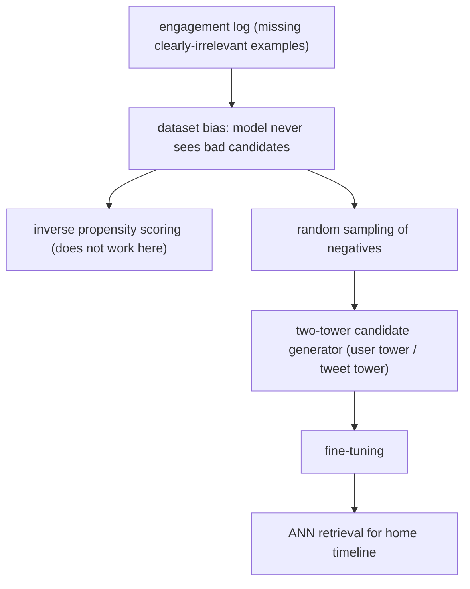
```mermaid
flowchart TD
  LOG["engagement log (missing clearly-irrelevant examples)"] --> BIAS["dataset bias: model never sees bad candidates"]
  BIAS --> IPS["inverse propensity scoring (does not work here)"]
  BIAS --> RS["random sampling of negatives"]
  RS --> TT["two-tower candidate generator (user tower / tweet tower)"]
  TT --> FT["fine-tuning"]
  FT --> ANN["ANN retrieval for home timeline"]
```
**Interview questions this design invites**
- Why does the engagement log systematically lack very-irrelevant candidates, and why does that hurt a retrieval model specifically?
- Why does inverse propensity scoring fail in candidate generation when it works for ranking or counterfactual eval?
- How do random-sampled negatives supply the missing irrelevant examples, and what bias might random sampling itself add?
- What is the fine-tuning step correcting for after random-sampling debiasing?
- How would you measure whether the debiased retriever actually surfaces fewer irrelevant tweets online?

**Tricks and gotchas**
- Random sampling supplies the clearly-irrelevant negatives the log never records, which is the crux of the fix.
- The paper explicitly rejects IPS for this setting, a useful counter to the reflex of reaching for propensity weighting.
- A fine-tuning pass layered on the debiased base model recovers additional quality.

**Common mistakes and how to fix them**
- Assuming IPS is the default debiasing tool: in candidate generation it underperforms; use random-sampled negatives instead.
- Training only on logged (retrieved-and-shown) items: the model never learns obvious negatives, so inject random ones.
- Treating debiasing as a single step: follow it with fine-tuning to close the remaining gap.
- Evaluating only on logged positives: build an eval that includes representative irrelevant candidates.

### Walmart: relevance-enhanced embedding-based retrieval ([source](https://arxiv.org/abs/2408.04884))
Walmart improves its neural embedding-based product retrieval, which bridges the vocabulary gap between queries and products, by attacking training-data noise and robustness. They train a Relevance Reward Model from human relevance feedback and distill its signal into the EBR model through a multi-objective loss, so the retriever is steered toward human-judged relevance rather than raw clicks. They add typo-aware training so query misspellings still retrieve the right products, and semi-positive generation to manufacture additional useful training signal. Together these sharpen relevance of the retrieved candidate set at search time.

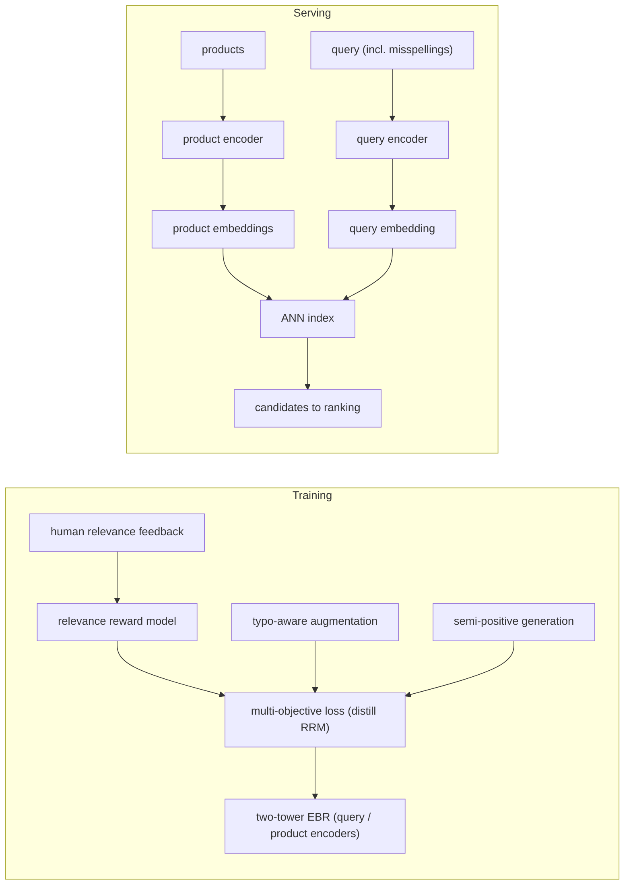
```mermaid
flowchart LR
  subgraph Training
    HRF["human relevance feedback"] --> RRM["relevance reward model"]
    RRM --> MOL["multi-objective loss (distill RRM)"]
    TYPO["typo-aware augmentation"] --> MOL
    SEMI["semi-positive generation"] --> MOL
    MOL --> EBR["two-tower EBR (query / product encoders)"]
  end
  subgraph Serving
    PROD["products"] --> PE["product encoder"]
    PE --> PEMB["product embeddings"]
    PEMB --> ANN["ANN index"]
    Q["query (incl. misspellings)"] --> QE["query encoder"]
    QE --> QEMB["query embedding"]
    QEMB --> ANN
    ANN --> RANK["candidates to ranking"]
  end
```
**Interview questions this design invites**
- Why distill a relevance reward model into EBR instead of training directly on click labels?
- How does a multi-objective loss balance the RRM relevance signal against engagement signal without one dominating?
- What does typo-aware training change in the query encoder, and why not just add a spell-corrector upstream?
- What is semi-positive generation, and what failure mode of pure positive/negative labeling does it address?
- How would you keep the RRM from encoding the annotators' own biases into retrieval?

**Tricks and gotchas**
- A human-feedback reward model denoises training data that raw clicks would mislabel, then is distilled rather than queried online.
- Typo-aware training bakes misspelling robustness into the encoder instead of relying on a separate correction stage.
- Semi-positive generation manufactures extra useful training pairs where explicit labels are sparse.
- The multi-objective loss lets one model serve both relevance and engagement rather than trading them off by hand.

**Common mistakes and how to fix them**
- Training EBR on clicks alone: clicks are noisy for relevance; distill a human-feedback reward model to clean the signal.
- Bolting on a spell-corrector instead of robustifying the model: use typo-aware training so the encoder handles misspellings directly.
- Starving the model of positives in sparse regions: generate semi-positive pairs to fill gaps.
- Optimizing a single objective: use a multi-objective loss so relevance and engagement are jointly served.

_Not yet covered (reachable, beyond the 12-case cap): Allegro (Two-tower recommendations at Allegro.com, https://arxiv.org/abs/2508.03702)._

_Not reachable: none_

---

## Ranking model

### Google: Wide & Deep ranking for Google Play app recommendations ([source](https://arxiv.org/abs/1606.07792))

Google combined a wide linear model and a deep neural network into a single jointly-trained ranker for Google Play app recommendations, serving over a billion users. The wide side is a generalized linear model over raw and cross-product categorical features that memorizes specific, frequent user-item rules; the deep side embeds sparse features into low-dimensional dense vectors and runs an MLP that generalizes to feature combinations never seen in training. Both outputs are summed into one logit and trained together so memorization and generalization share the same gradient signal. Online A/B tests showed Wide & Deep lifted app acquisitions over wide-only and deep-only baselines, and the model was open-sourced in TensorFlow.

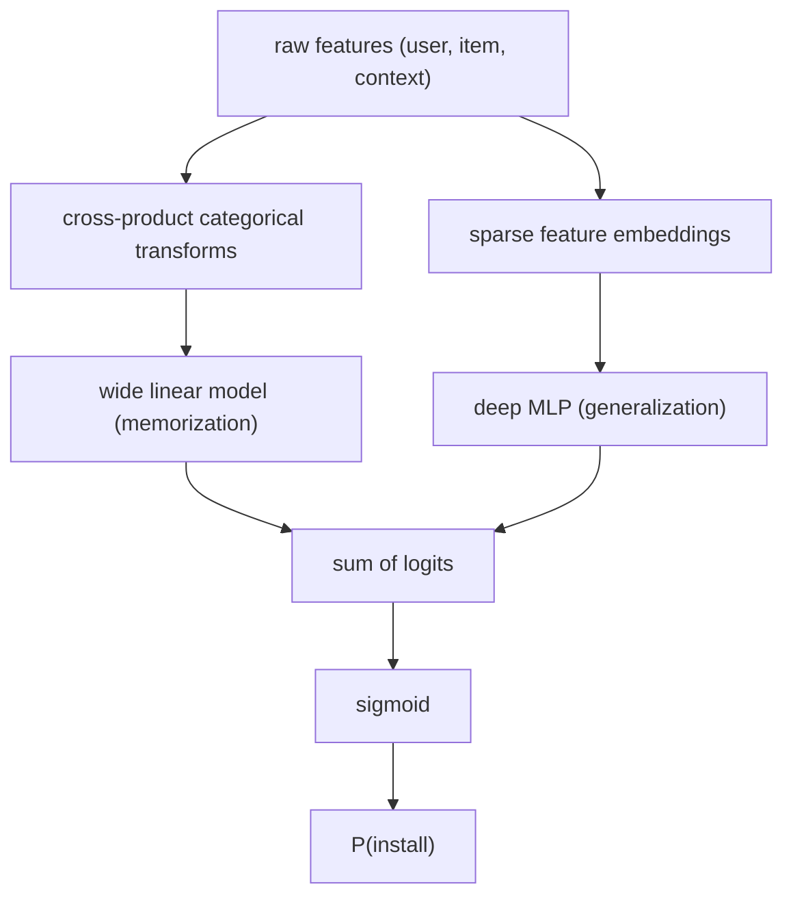
```mermaid
flowchart TD
  X["raw features (user, item, context)"] --> WC["cross-product categorical transforms"]
  X --> EMB["sparse feature embeddings"]
  WC --> W["wide linear model (memorization)"]
  EMB --> MLP["deep MLP (generalization)"]
  W --> SUM["sum of logits"]
  MLP --> SUM
  SUM --> SIG["sigmoid"]
  SIG --> P["P(install)"]
```

**Interview questions this design invites**
- Why join the wide and deep parts at the logit rather than training two models and ensembling their scores?
- Which feature crosses go in the wide side, and how do you pick them without exploding the parameter count?
- What breaks if you drop the wide side entirely and rely only on the deep MLP?
- Why does the deep side over-generalize on sparse, high-rank interactions, and how does the wide side compensate?
- How would you serve this within a per-candidate latency budget when scoring hundreds of apps?
- The paper reports offline AUC roughly flat but online acquisitions up. Why can offline and online diverge here?

**Tricks and gotchas**
- The wide side needs hand-engineered cross features; that manual work is the cost of its memorization power, not an incidental detail.
- Joint training means the two optimizers (FTRL for wide, AdaGrad for deep in the paper) update against a shared loss, so tuning one side shifts the other.
- Embedding tables, not the MLP, dominate parameter count once you have millions of app and user ids.
- Wide-only memorizes but cannot rank unseen crosses; deep-only generalizes but recommends off-target items when interactions are sparse.

**Common mistakes and how to fix them**
- Treating wide-and-deep as an ensemble of two separately trained models. Fix: train jointly so the combined logit is optimized end to end.
- Putting continuous features raw into the wide side. Fix: bucketize or cross them; the wide side wants categorical crosses.
- Skipping cross features and expecting the deep MLP to recover them. Fix: engineer the crosses the product actually needs; the MLP will not reliably rediscover them.

### Meta: DLRM, explicit pairwise feature interactions for recommendation ([source](https://arxiv.org/abs/1906.00091))

DLRM is Meta's reference recommendation model built around explicit second-order feature interactions. Each sparse categorical feature indexes its own embedding table (a one-hot lookup that returns one dense vector per feature), while dense continuous features pass through a bottom MLP that outputs a vector of the same width. The model then takes the dot product between every pair of these vectors, concatenates those interaction terms with the processed dense vector, and feeds the result into a top MLP with a final sigmoid for click probability. To scale, DLRM uses model parallelism on the memory-heavy embedding tables and data parallelism (with allreduce) on the compute-heavy MLPs.

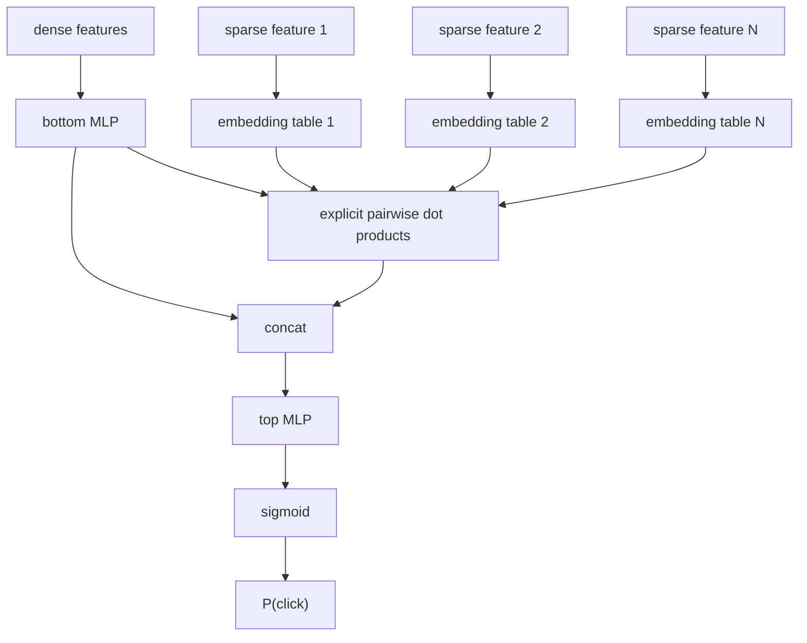
```mermaid
flowchart TD
  DEN["dense features"] --> BMLP["bottom MLP"]
  SP1["sparse feature 1"] --> E1["embedding table 1"]
  SP2["sparse feature 2"] --> E2["embedding table 2"]
  SPN["sparse feature N"] --> EN["embedding table N"]
  BMLP --> INT["explicit pairwise dot products"]
  E1 --> INT
  E2 --> INT
  EN --> INT
  BMLP --> CAT["concat"]
  INT --> CAT
  CAT --> TMLP["top MLP"]
  TMLP --> SIG["sigmoid"]
  SIG --> P["P(click)"]
```

**Interview questions this design invites**
- Where exactly does the interaction step sit, and why after the embeddings and bottom MLP rather than before?
- Why compute explicit pairwise dot products instead of letting the top MLP learn the interactions implicitly?
- Why must dense and embedded features share the same width before the interaction layer?
- Why is model parallelism used for embeddings but data parallelism for the MLPs?
- How does per-candidate cost scale as you add sparse features, given the pairwise interaction is quadratic in feature count?
- How would you shard a single embedding table too large for one device?

**Tricks and gotchas**
- The interaction is second-order only by construction; higher-order crosses still lean on the top MLP.
- Bottom MLP output width must equal embedding dimension or the dot products are undefined; this is the wiring diagrams get wrong.
- Embedding tables carry almost all the parameters, so memory, not FLOPs, is the scaling wall.
- Pairwise interaction count grows quadratically with the number of sparse features, so feature count is a latency lever.

**Common mistakes and how to fix them**
- Drawing the interaction before the embeddings or merging dense and sparse paths too early. Fix: interact after embeddings and bottom MLP, before the top MLP.
- Data-paralleling the embedding tables. Fix: model-parallel them; they do not fit replicated per device.
- Assuming a wide top MLP substitutes for explicit interactions. Fix: keep the dot-product layer; it is the whole point of DLRM.

### Instacart: one deep pCTR model consolidating per-surface XGBoost ([source](https://company.instacart.com/how-its-made/one-model-to-serve-them-all-how-instacart-deployed-a-single-deep-learning-pctr-model-for-multiple-surfaces-with-improved-operations-and-performance-along-the-way))

Instacart replaced a fleet of surface-specific XGBoost pCTR models (Buy It Again, Frequently Bought With, Store Root, Collections, Item Details) with one wide-and-deep deep learning model. The deep side embeds high-cardinality features (product id, user id, textual attributes) through large embedding matrices into stacked fully connected layers; the wide side runs low-cardinality categoricals and continuous features through a factorization machine that models pairwise interactions and lets coefficients vary by surface. A factorization machine layer adds explicit second-order interactions for a roughly 1% log-loss and AUC gain. Consolidation reported 10 to 190% AUC-PR gains and 64 to 77% calibration improvements across surfaces, plus lower serving latency and far less model-maintenance overhead.

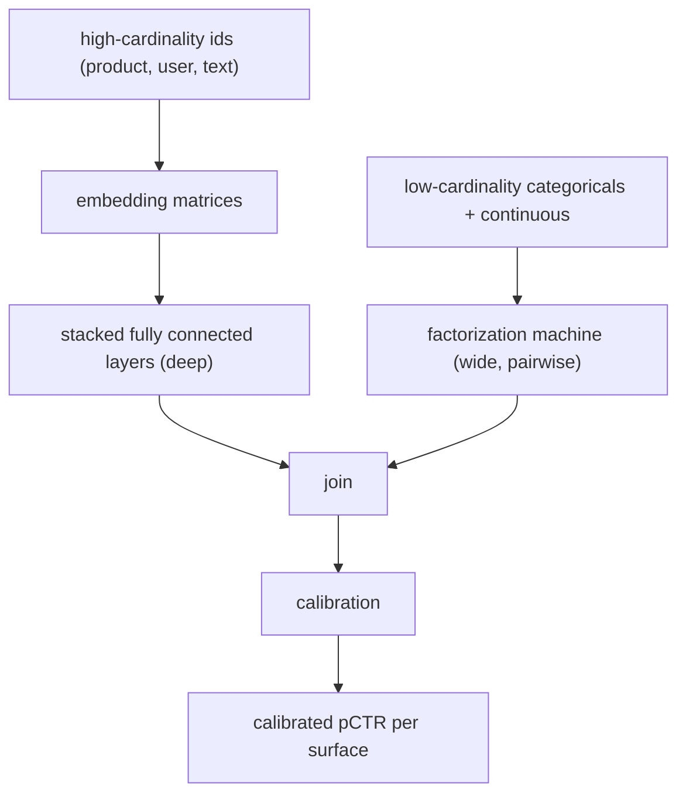
```mermaid
flowchart TD
  HC["high-cardinality ids (product, user, text)"] --> EMB["embedding matrices"]
  EMB --> FC["stacked fully connected layers (deep)"]
  LC["low-cardinality categoricals + continuous"] --> FM["factorization machine (wide, pairwise)"]
  FC --> J["join"]
  FM --> J
  J --> CAL["calibration"]
  CAL --> P["calibrated pCTR per surface"]
```

**Interview questions this design invites**
- What do you gain and risk by serving five product surfaces from one model instead of five?
- How does the factorization machine let one model behave differently per surface without a separate model each?
- Why did calibration improve so much when consolidating, and why does calibration matter for pCTR specifically?
- How do you prevent one high-traffic surface from dominating the shared training signal?
- What is the operational payoff (iteration speed, maintenance) versus the modeling payoff here?
- How would you handle a brand-new surface with little labeled data under this single-model design?

**Tricks and gotchas**
- Surface identity must be a feature so the FM coefficients can specialize; drop it and surfaces blur together.
- Mean target encoding (historical CTR segments) is a leakage risk if not point-in-time correct.
- Missing values are imputed with defaults the model can learn to read as signal, not silently zeroed.
- A single model concentrates risk: one bad deploy hits every surface at once.

**Common mistakes and how to fix them**
- Assuming consolidation must sacrifice per-surface accuracy. Fix: let surface-conditioned FM coefficients recover surface-specific behavior.
- Ignoring calibration and shipping raw scores across surfaces. Fix: add an explicit calibration step, since surfaces have different base rates.
- Sharing training data naively so heavy surfaces swamp light ones. Fix: balance or weight by surface, and monitor per-surface AUC-PR.

### Pinterest: multi-task learning and calibration for utility-based home feed ranking ([source](https://medium.com/pinterest-engineering/multi-task-learning-and-calibration-for-utility-based-home-feed-ranking-64087a7bcbad))

Pinterest ranks the home feed with a multi-task DNN whose separate heads each predict one binary engagement action (click, long-click, close-up, repin), sharing a lower body while keeping action-specific outputs. Because the DNN is trained on stratified-sampled data, its head outputs are not true probabilities, so each head gets a per-action logistic-regression calibration model that maps ranking-optimized scores to empirical rates using 80+ features (position and bias signals, historical action rates over 3-hour to 90-day windows, and real-time geo/demographic feedback). The calibrated per-action probabilities combine by weighted summation into a single utility score, with high negative weights suppressing bad content. Utility weights are tuned live, so stakeholders adjust the ranking within hours instead of retraining.

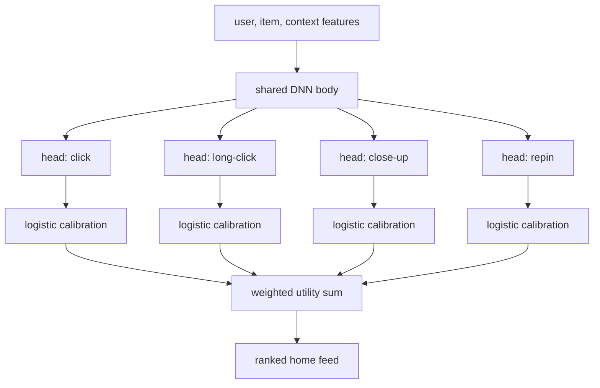
```mermaid
flowchart TD
  F["user, item, context features"] --> B["shared DNN body"]
  B --> H1["head: click"]
  B --> H2["head: long-click"]
  B --> H3["head: close-up"]
  B --> H4["head: repin"]
  H1 --> C1["logistic calibration"]
  H2 --> C2["logistic calibration"]
  H3 --> C3["logistic calibration"]
  H4 --> C4["logistic calibration"]
  C1 --> U["weighted utility sum"]
  C2 --> U
  C3 --> U
  C4 --> U
  U --> O["ranked home feed"]
```

**Interview questions this design invites**
- Why calibrate each head separately instead of calibrating the final utility score once?
- Why does stratified sampling during training force a calibration step at all?
- How does decoupling utility weights from the model let the business retune ranking without retraining?
- What goes into the calibration model beyond a single Platt-scaling parameter, and why 80+ features?
- How do you keep negatively-correlated tasks (for example close-up versus repin) from hurting each other in the shared body?
- How would you validate that offline calibration error predicts online behavior before shipping?

**Tricks and gotchas**
- Calibration here is a transfer-learning layer with real features, not one-parameter Platt scaling.
- Calibration training data deliberately excludes the stratified sampling used for the main model, so it reflects true rates.
- Utility weights are a live business lever; changing them reorders the feed within hours without touching model weights.
- Negative-weight terms let the utility actively demote content, not just rank positives.

**Common mistakes and how to fix them**
- Treating multi-task head outputs as calibrated probabilities. Fix: add a per-head calibration model trained on unsampled data.
- Baking business weightings into the loss. Fix: keep them as post-model utility weights so they are tunable without retraining.
- Sharing one body across tasks without checking task correlation. Fix: monitor per-task metrics and use gating if tasks conflict.

### Pinterest: multi-task related products recommendations ([source](https://medium.com/pinterest-engineering/multi-task-learning-for-related-products-recommendations-at-pinterest-62684f631c12))

Pinterest replaced a single binary engagement classifier for related-products recommendations with a multi-task model that outputs four separate scores (save, click, long-click, close-up), sharing the same feature and fully connected layers and differing only in the output heads. The binary model lost signal by collapsing distinct actions into one label; the four-head version keeps each action distinct and lifted propensity and volume across all engagement types. The multi-task loss is an equal-weighted sum of per-head log losses, and a calibration correction accounts for negative downsampling so outputs are true probabilities (checked with calibration plots and Brier scores). The final ranking score is a weighted sum of per-action probabilities computed after training, so utility weights can be retuned without retraining. Bayesian optimization of the weights did not beat hand-picked weights.

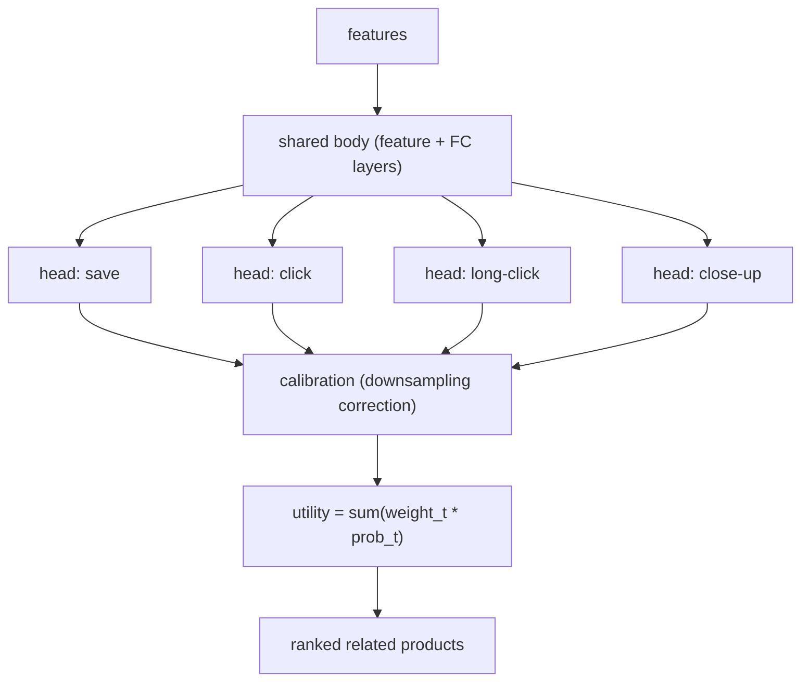
```mermaid
flowchart TD
  F["features"] --> B["shared body (feature + FC layers)"]
  B --> H1["head: save"]
  B --> H2["head: click"]
  B --> H3["head: long-click"]
  B --> H4["head: close-up"]
  H1 --> CAL["calibration (downsampling correction)"]
  H2 --> CAL
  H3 --> CAL
  H4 --> CAL
  CAL --> U["utility = sum(weight_t * prob_t)"]
  U --> O["ranked related products"]
```

**Interview questions this design invites**
- Why does a binary classifier lose signal when several engagement types get merged into one label?
- Why compute the ranking score after training instead of learning the utility weights inside the loss?
- Why did equal-weighted per-head losses work as a starting point, and when would you weight them unequally?
- Why did Bayesian optimization of utility weights fail to beat hand-picked ones, and what would you try next?
- What calibration correction is needed when you train with negative downsampling?
- How do you validate calibration beyond eyeballing a plot?

**Tricks and gotchas**
- Shared body plus per-task heads means the heads share representation but keep separate decision surfaces.
- Negative downsampling shifts the predicted base rate, so a calibration correction is mandatory, not optional.
- Utility weights are a post-training lever; changing them re-ranks instantly without a new model.
- Offline Bayesian weight search can underperform hand tuning; online experimentation may be needed to build the surrogate.

**Common mistakes and how to fix them**
- Collapsing distinct engagements into one binary label. Fix: give each action its own head and combine post hoc.
- Reporting raw downsampled scores as probabilities. Fix: apply the downsampling calibration correction and verify with Brier score.
- Hardcoding business preferences into training. Fix: keep them as tunable utility weights outside the model.

### LinkedIn: homepage feed multi-task learning in TensorFlow ([source](https://www.linkedin.com/blog/engineering/feed/homepage-feed-multi-task-learning-using-tensorflow))

LinkedIn ranks its homepage feed by jointly optimizing multiple objectives split into passive consumption (clicks, dwell, reads) and active contribution (comments, reshares, votes, reactions), migrating from separate per-objective logistic regression and XGBoost models to one unified deep network. The architecture uses towers per objective category so related objectives share transfer learning while keeping distinct parameter spaces, and it feeds XGBoost leaf-node indices as categorical inputs into embedding lookups followed by fully connected layers. Per-objective cross-entropy losses train the shared network, and the per-objective predictions combine into a multi-objective utility for the final order. Engineering choices (dense-tensor feature encoding cutting gRPC overhead, large batches, warm-start training) made it serve efficiently, and A/B tests showed engagement gains in both passive and active consumption.

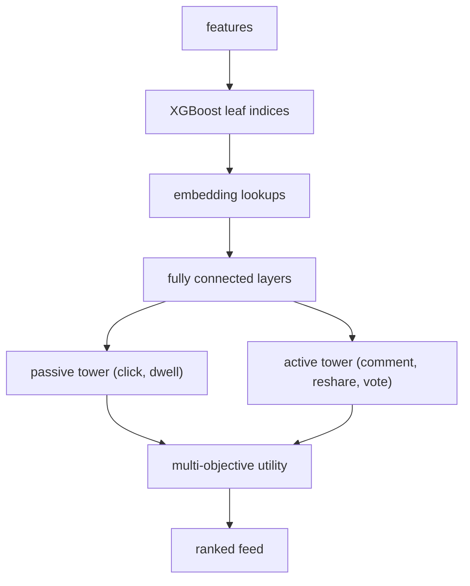
```mermaid
flowchart TD
  X["features"] --> XGB["XGBoost leaf indices"]
  XGB --> EMB["embedding lookups"]
  EMB --> FC["fully connected layers"]
  FC --> TP["passive tower (click, dwell)"]
  FC --> TA["active tower (comment, reshare, vote)"]
  TP --> U["multi-objective utility"]
  TA --> U
  U --> O["ranked feed"]
```

**Interview questions this design invites**
- Why split objectives into passive versus active towers rather than one flat multi-head network?
- Why feed XGBoost leaf indices into the DNN instead of raw features or a pure DNN?
- How do you set the utility weights that trade a comment against a click against dwell time?
- How does transfer learning between objectives help sparse objectives like reshare?
- What serving optimizations let a multi-task DNN meet feed latency (dense tensors, batch size, warm-start)?
- How do you detect when one objective is dominating and degrading another?

**Tricks and gotchas**
- XGBoost-leaf-as-feature bridges tree memorization into the DNN without abandoning the existing model.
- Passive and active objectives correlate imperfectly, so a single shared head can let one drown the other; separate towers hedge this.
- Encoding features as dense tensors cut gRPC serialization overhead by roughly two-thirds, a serving-cost lever.
- Warm-start with gradual learning-rate ramp reduced model variance across retrains.

**Common mistakes and how to fix them**
- Optimizing a single engagement objective for a feed with many desired behaviors. Fix: multi-objective utility across passive and active signals.
- Serving a heavy DNN naively and missing feed latency. Fix: dense-tensor encoding, larger batches, efficient TF linear algebra.
- Assuming trees and DNNs are mutually exclusive. Fix: feed tree leaf indices as DNN inputs to keep both strengths.

### Airbnb: from GBDT to deep neural network search ranking ([source](https://medium.com/airbnb-engineering/applying-deep-learning-to-airbnb-search-7ebd7230891f))

Airbnb evolved booking-oriented search ranking through several model generations rather than one leap. They started with a single-hidden-layer 32-ReLU net matching their GBDT features and loss (booking neutral, validating the pipeline), then a LambdaRank net trained on booked-versus-not pairs weighted by the NDCG change of swapping them, then a hybrid of GBDT leaf indices plus factorization-machine predictions plus NN layers, and finally a two-layer DNN (195 features into 127 then 83 units) trained on 1.7 billion pairs with 10x more data that beat the hybrid. Key lessons: neural nets needed feature normalization and smooth input distributions, listing-id embeddings overfit because each listing books at most about 365 times a year, and multi-task learning with view labels lifted views but left bookings neutral because views and bookings correlate imperfectly.

```mermaid
flowchart LR
  G["GBDT baseline"] --> N1["single hidden layer NN (32 ReLU), booking neutral"]
  N1 --> LR["LambdaRank NN (pairwise, NDCG-weighted)"]
  LR --> H["hybrid: GBDT leaves + FM + NN"]
  H --> D["deep NN: 195 -> 127 -> 83, 1.7B pairs"]
  D --> O["ranked listings by booking likelihood"]
```

**Interview questions this design invites**
- Why did listing-id embeddings overfit here when they work in NLP and video recommendation?
- Why weight pairwise loss by NDCG change instead of treating bookings as a plain binary label?
- Why did multi-task learning lift views but leave bookings neutral?
- Neural nets need normalized, smooth-distributed features. Why, when GBDT does not?
- Why did the simple two-layer DNN eventually beat the more complex hybrid model?
- Why was the first NN deliberately shipped as booking neutral rather than chasing a win?

**Tricks and gotchas**
- Data sparsity per listing (bounded bookings per year) makes per-item id embeddings unreliable; lean on content and location features.
- Neural nets are magnitude-sensitive: apply z-score or log transforms so most values sit in roughly [-1, 1].
- Smooth input distributions help interpolation to unseen combinations; raw lat/long spikes had to be reshaped to offsets from map center.
- Dropout hurt; treat it as data augmentation only when the injected noise mirrors realistic variation.

**Common mistakes and how to fix them**
- Expecting deep learning to be a plug-in replacement for GBDT. Fix: rethink the whole system (data pipeline, features, objective), not just the model.
- Feeding raw unnormalized features into the net. Fix: normalize and smooth distributions before training.
- Using view labels as a proxy to boost bookings. Fix: recognize views and bookings diverge; optimize the objective you actually want.

### DoorDash: homepage ads conversion, from trees to multi-task DNNs ([source](https://arxiv.org/abs/2502.10514))

DoorDash rebuilt its homepage ads ranking, moving from tree-based models to multi-task deep neural networks that predict multiple ad outcomes (click and downstream conversion) in last-mile delivery. The paper frames a problem-driven journey spanning data foundations, model design, training efficiency, evaluation rigor, and online serving, with the multi-task DNN capturing complex user behavior the tree models could not. DoorDash reports substantial business impact from the migration and offers it as practical guidance for scaling deep learning recommendation systems in an ads context.

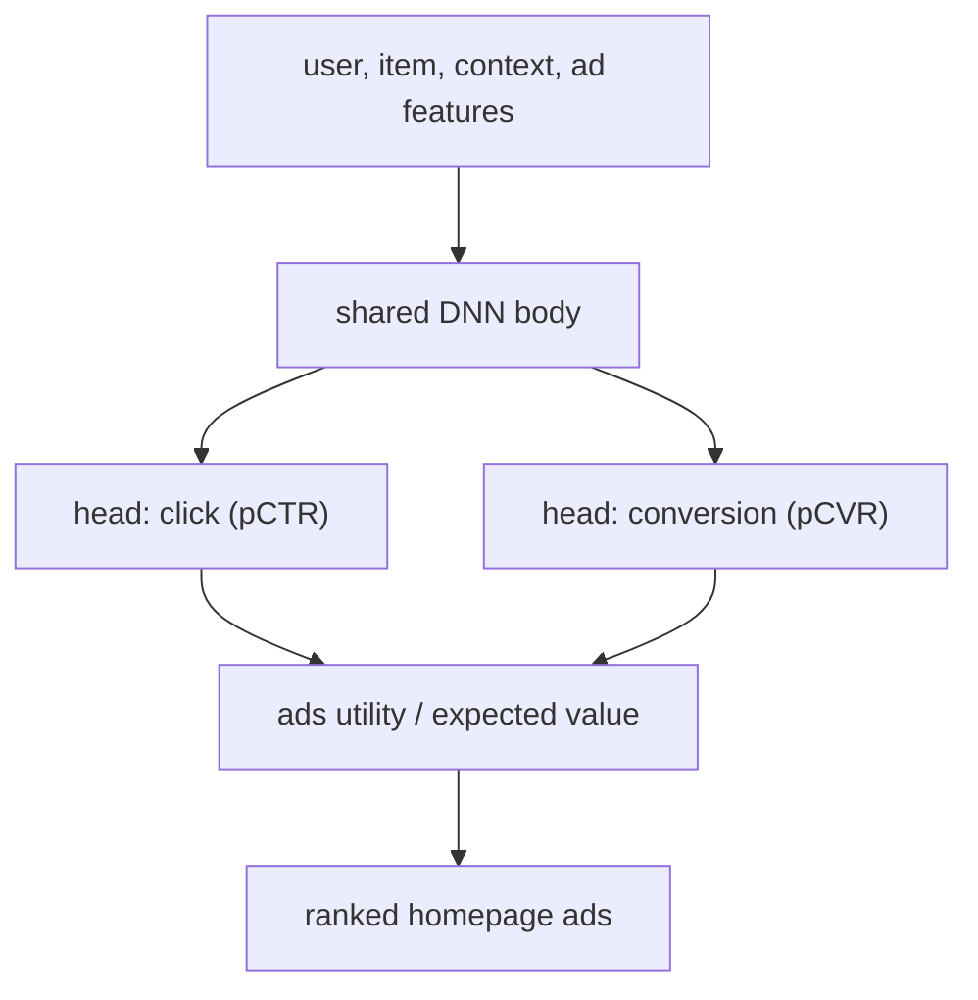
```mermaid
flowchart TD
  F["user, item, context, ad features"] --> B["shared DNN body"]
  B --> HC["head: click (pCTR)"]
  B --> HV["head: conversion (pCVR)"]
  HC --> U["ads utility / expected value"]
  HV --> U
  U --> R["ranked homepage ads"]
```

**Interview questions this design invites**
- Why do ads ranking systems need multi-task heads (click and conversion) rather than one objective?
- What does a multi-task DNN capture that a tree model on the same features cannot?
- How does an ads utility combine pCTR and pCVR with the bid to order ads?
- What data-foundation and training-efficiency work is needed before a DNN beats trees in ads?
- How do you evaluate an ads ranker where conversion is delayed and sparse?
- How do you keep per-candidate DNN scoring within the homepage latency budget?

**Tricks and gotchas**
- The migration was as much about data foundations and eval rigor as about the model architecture.
- Conversion labels arrive delayed in last-mile delivery, complicating training and attribution.
- Ads ranking must fold the bid into the utility, so calibrated probabilities matter more than raw order.
- A shared body across click and conversion tasks risks one task dominating; task balance needs monitoring.

**Common mistakes and how to fix them**
- Predicting only clicks for an ads system. Fix: add a conversion head so ranking reflects downstream value, not just engagement.
- Swapping trees for a DNN without upgrading the data and eval pipeline. Fix: invest in data foundations and offline-online eval alignment first.
- Ranking on uncalibrated scores in an auction. Fix: calibrate so expected-value combination with the bid is meaningful.

### Spotify: modality-aware multi-task learning for ad targeting (CAMoE) ([source](https://research.atspotify.com/2025/8/modality-aware-multi-task-learning-to-optimize-ad-targeting-at-scale))

Spotify ranks ads with CAMoE, a multi-gate mixture-of-experts model built on MMoE with modality-specific heads for audio-plus-display versus video impressions, so each tower learns what makes its own modality clickable without interference. DCN-v2 cross blocks inside each expert model feature interactions (for example Friday evening times headphones times hip-hop) without manual crossing. Because audio impressions vastly outnumber video, Adaptive Loss Masking drops non-relevant examples so audio errors only update audio towers and vice versa, which cut video ECE by 55%. Expected calibration error is monitored as a first-class metric because it directly drives auction pricing (miscalibration means over- or under-bidding); the model lifted audio CTR 14.5% and video CTR 1.3% and serves all click-based campaigns.

```mermaid
flowchart TD
  F["features"] --> DCN["DCN-v2 cross interactions"]
  DCN --> EXP["shared expert pool (MMoE)"]
  EXP --> GA["gate: audio + display"]
  EXP --> GV["gate: video"]
  GA --> HA["audio CTR head"]
  GV --> HV["video CTR head"]
  HA --> CAL["ECE-monitored calibration"]
  HV --> CAL
  CAL --> PRICE["auction pricing / ranking"]
```

**Interview questions this design invites**
- Why split by modality (audio versus video) into separate gates and heads rather than one shared head?
- What is Adaptive Loss Masking solving, and why does modality imbalance demand it?
- Why put DCN-v2 cross layers inside each expert instead of relying on the MMoE gates alone?
- Why is ECE treated as first-class here when many rankers only care about order?
- How does calibration error translate into over-bidding or under-bidding in the ad auction?
- How do MMoE gates help when tasks are negatively correlated?

**Tricks and gotchas**
- MMoE gating lets tasks share experts while each task picks its own expert mixture, softening task conflict.
- Modality imbalance silently suppresses the minority modality without loss masking; ALM confines gradients per modality.
- DCN-v2 gives explicit bounded-order crosses so you do not hand-engineer feature combinations.
- In ads, calibration is revenue: ECE drift moves pricing directly, so monitor it continuously.

**Common mistakes and how to fix them**
- Training one head over mixed modalities and letting the majority dominate. Fix: modality-specific heads plus adaptive loss masking.
- Optimizing only CTR order and ignoring calibration in an auction. Fix: monitor ECE and recalibrate; pricing depends on it.
- Hand-crafting feature crosses at scale. Fix: use DCN-v2 cross blocks inside the experts.

### Pinterest: lightweight XGBoost ranker early in the funnel ([source](https://medium.com/pinterest-engineering/improving-the-quality-of-recommended-pins-with-lightweight-ranking-8ff5477b20e3))

Pinterest inserts a lightweight XGBoost ranker between candidate generation (Pixie, generating tens of millions of pins per second) and the expensive full neural ranker, so personalization starts earlier without paying the full-ranker cost on every candidate. The lightweight model deliberately trades some precision for efficiency, and training logs at the serving stage to capture both impressed and unimpressed candidates, avoiding frontend-only logging and supporting multiple client surfaces. They compared pure engagement, pure funnel-efficiency, and a blended objective mixing engagement and impression labels; the blended objective won. Per-surface models with custom label weights delivered 1 to 2% more saves on home feed, about 1% CTR and time-spent gains on Related Pins, and 6% CTR on email notifications.

```mermaid
flowchart LR
  CG["candidate generation (Pixie)"] --> LW["lightweight XGBoost ranker (blended objective)"]
  LW --> FR["full neural ranker"]
  FR --> O["final feed"]
```

**Interview questions this design invites**
- Why add a lightweight ranking stage between retrieval and the full ranker instead of just enlarging retrieval or the full ranker?
- Why is XGBoost a reasonable choice for the lightweight stage but not the full ranker?
- Why log at the serving stage rather than at the frontend, and what candidates does that capture?
- Why did the blended engagement-plus-funnel objective beat pure engagement or pure funnel efficiency?
- How do you set the latency budget for a stage that runs on far more candidates than the full ranker?
- How would you keep the lightweight and full rankers from optimizing at cross purposes?

**Tricks and gotchas**
- The lightweight stage optimizes funnel efficiency (what to pass downstream), not just engagement; the blend matters.
- Serving-stage logging captures unimpressed candidates the frontend never sees, which the lightweight ranker needs.
- Simpler model is fine precisely because a full ranker follows; do not over-invest at the top of the funnel.
- Per-surface label weighting lets one framework serve home feed, Related Pins, and notifications.

**Common mistakes and how to fix them**
- Training the lightweight ranker only on impressed pins. Fix: log at serving to include unimpressed candidates.
- Optimizing pure engagement at the top of the funnel. Fix: blend engagement with funnel-efficiency labels.
- Reusing one heavy model everywhere. Fix: a cheap ranker early, the expensive ranker only on survivors.

### Wayfair: time-informed calibration of ranking scores into purchase probabilities ([source](https://www.aboutwayfair.com/careers/tech-blog/time-informed-calibration))

Wayfair's Time Informed Calibration (TIC) converts raw ranking scores, which order customers well but are not real probabilities, into calibrated purchase probabilities that account for time. It bins rank-ordered customers into equal-sized groups, measures actual conversions per bin, and fits a monotonic function (for example exponential) that preserves order while mapping scores to realistic rates. Because sales have strong weekly seasonality plus holiday and one-off effects, TIC uses Prophet forecasts of sales and normalizes them against the calibration probabilities to shift the calibration curve for same-day marketing decisions like bidding. The design is modular and model-agnostic, serving more than 300 models independently of their training pipelines.

```mermaid
flowchart TD
  M["ranking model raw scores"] --> BIN["bin rank-ordered customers"]
  BIN --> CONV["measure actual conversions per bin"]
  CONV --> FIT["fit monotonic calibration curve"]
  P["Prophet sales forecast (seasonality, holidays)"] --> ADJ["time adjustment"]
  FIT --> ADJ
  ADJ --> OUT["time-aware purchase probabilities"]
  OUT --> DEC["bidding / personalization decisions"]
```

**Interview questions this design invites**
- Why are raw ranking scores good for ordering but wrong to use as probabilities for bidding?
- Why does calibration need to be time-aware rather than a single static curve?
- Why require a monotonic calibration function, and what does monotonicity preserve?
- How does a Prophet sales forecast get folded into the calibration curve for same-day decisions?
- Why keep calibration modular and independent of the model training pipeline?
- How would you detect that a calibration curve has drifted and needs refitting?

**Tricks and gotchas**
- Binning plus monotonic fit calibrates while preserving the model's ranking, so order is never disturbed.
- A fixed calibration curve is wrong under weekly seasonality and holidays; the same score means different rates by day.
- TIC is decoupled from model training, so it can serve hundreds of models without retraining any.
- Forecast and calibration series must be normalized to the same scale before combining.

**Common mistakes and how to fix them**
- Using raw scores as purchase probabilities in bidding. Fix: calibrate against measured per-bin conversion rates.
- Calibrating once and reusing forever. Fix: make calibration time-aware via a seasonal forecast.
- Coupling calibration into each model. Fix: a modular post-hoc layer that serves many models independently.

### Walmart: search re-ranker balancing relevance and engagement ([source](https://medium.com/walmartglobaltech/improving-walmart-search-to-help-our-customers-save-time-e9fcd1f03e94))

Walmart improved search with a two-tier ranking system: a first-round ranker over the retrieved candidates and a second-round re-ranker that jointly optimizes relevance (item-query semantic match) and engagement (item-query engagement) instead of treating them independently. They strengthened product-type matching in the first-round ranker so downstream stages see better candidates, then tuned the re-ranker to be more inclusive of the most relevant and engaged products. The change delivered over a 4.5% relevance lift with engagement improvements, validated through editorial evaluations, market comparison, and customer research alongside quantitative metrics.

```mermaid
flowchart TD
  Q["query + retrieved candidates"] --> R1["first-round ranker (product-type matching)"]
  R1 --> R2["second-round re-ranker"]
  REL["relevance signal (semantic match)"] --> R2
  ENG["engagement signal (item-query engagement)"] --> R2
  R2 --> O["final search results"]
```

**Interview questions this design invites**
- Why split ranking into a first-round ranker and a second-round re-ranker rather than one model?
- Why can optimizing engagement alone hurt search, and how does relevance counterbalance it?
- How do you combine a relevance signal and an engagement signal into one order?
- Why strengthen product-type matching in the first round specifically?
- How do you evaluate a relevance lift beyond click metrics (editorial judgment, market comparison)?
- How would you keep engagement optimization from surfacing popular-but-irrelevant items?

**Tricks and gotchas**
- Engagement-only ranking drifts toward popular items that may not match the query; relevance must anchor it.
- Fixing candidate quality in the first round (product-type match) limits how much the re-ranker must repair.
- Relevance lift needs human/editorial evaluation, not just engagement metrics, to confirm true quality.
- The two signals compete, so the combination weighting is the lever that decides the tradeoff.

**Common mistakes and how to fix them**
- Ranking search purely on engagement. Fix: jointly optimize relevance and engagement so popular-but-irrelevant items do not win.
- Measuring only clicks. Fix: add editorial evaluation, market comparison, and customer research to gate relevance.
- Letting a weak first round pass bad candidates. Fix: strengthen product-type matching upstream so the re-ranker has good inputs.

### Snap: deep-learning ad ranker under trillions of daily predictions ([source](https://eng.snap.com/machine-learning-snap-ad-ranking))

Snap selects ads through a four-stage funnel (eligibility filtering, lightweight candidate generation that cuts millions of ads to hundreds or thousands, heavy ML scoring per candidate, then an auction combining ML scores with bids and budgets). The heavy scorer is a multi-task network using MMoE and PLE to jointly predict multiple conversion events (app installs, purchases, sign-ups), with DCN and DCN-v2 blocks for high-order feature interactions and a tower split (a user-feature tower and an ad-feature tower) so the expensive user side can be computed once and reused across ads. Because ad ids churn constantly and conversion labels arrive days or weeks late, the team warm-starts from checkpoints hourly-to-daily with SGD and applies a calibration correction layer (Platt scaling or isotonic regression) so total predicted conversions track true conversions, which is what the auction prices against.

```mermaid
flowchart TD
  ADS["millions of eligible ads"] --> ELIG["eligibility + policy filter"]
  ELIG --> CG["lightweight candidate generation"]
  CG --> UT["user-feature tower"]
  CG --> AT["ad-feature tower"]
  UT --> DCN["DCN / DCN-v2 interactions"]
  AT --> DCN
  DCN --> MMOE["MMoE / PLE experts + gates"]
  MMOE --> HI["head: install"]
  MMOE --> HP["head: purchase"]
  MMOE --> HS["head: sign-up"]
  HI --> CAL["Platt / isotonic calibration"]
  HP --> CAL
  HS --> CAL
  CAL --> AUC["auction: score x bid x budget"]
  AUC --> O["shown ad"]
```

**Interview questions this design invites**
- Why split user and ad features into separate towers, and what does that buy you at serving time when scoring many ads per request?
- Why choose PLE over plain MMoE when conversion tasks (install, purchase, sign-up) partly conflict?
- How do delayed conversion labels (days to weeks) corrupt training, and what do you do about impressions whose label has not arrived?
- Why is calibration (predicted totals matching true totals) treated as first-class in an ad auction rather than just ranking order?
- How do you keep constantly-arriving fresh ad ids from becoming out-of-vocabulary and dominating the embedding space?
- How would you meet a per-candidate latency budget while running DCN-v2 crosses over hundreds of candidates?

**Tricks and gotchas**
- The user tower is computed once per request and shared across all candidate ads; only the ad tower and interaction head run per candidate, which is the latency lever.
- MMoE/PLE gates let each conversion task pick its own expert mixture, so a high-volume task (installs) does not swamp a sparse one (purchases).
- Fresh ad ids mean the embedding table is a moving target; frequent warm-started retraining is what keeps OOV ids from dominating.
- Calibration drives auction pricing, so isotonic/Platt correction is mandatory, not cosmetic; miscalibration means systematic over- or under-bidding.

**Common mistakes and how to fix them**
- Scoring every candidate through one monolithic tower. Fix: split user and ad towers so the user side is computed once and reused.
- Treating delayed conversions as if labels were complete at impression time. Fix: account for label delay in training windows or wait-and-attribute, and monitor for bias.
- Ranking on uncalibrated multi-task scores in an auction. Fix: add a Platt/isotonic calibration layer and check predicted-vs-actual conversion totals continuously.

### ASOS: transformer sequence recommender over interaction history ([source](https://medium.com/asos-techblog/transforming-recommendations-at-asos-254b95c6a07a))

ASOS models each customer as a sequence of past product interactions and ranks with a self-attention transformer (built on NVIDIA Merlin's Transformers4Rec over PyTorch), replacing an asymmetric matrix-factorization baseline that serves 5 billion requests a day. Self-attention lets the model weigh every past product against the others so the same item is interpreted differently depending on the surrounding sequence (a style-context effect), and multi-head attention captures several relationship nuances at once. Positional encoding gives the model order awareness so recent interactions can outweigh older ones. The transformer delivered over 20% offline improvement versus the matrix-factorization baseline.

```mermaid
flowchart TD
  H["customer interaction history (product sequence)"] --> EMB["product embeddings"]
  EMB --> POS["+ positional encoding"]
  POS --> SA["multi-head self-attention blocks"]
  SA --> FF["feed-forward layers"]
  FF --> REP["sequence representation"]
  REP --> SCORE["score candidate products"]
  SCORE --> O["ranked recommendations"]
```

**Interview questions this design invites**
- Why does self-attention over a product sequence beat asymmetric matrix factorization for this recommendation task?
- What does positional encoding contribute here, and how does recency get expressed through it?
- Why does multi-head attention help when the same product can mean different things in different sequences?
- How would you turn a next-item transformer into a full ranker over a large candidate catalog at serving time?
- What negative-sampling and sequence-length/padding choices matter for training a session transformer, and why?
- Offline lift was over 20%; how would you check that survives online before trusting it?

**Tricks and gotchas**
- Self-attention makes the representation of an item context-dependent; the same product contributes differently depending on neighbors in the sequence.
- Positional encoding is what injects order and recency; without it the transformer sees a bag of products, not a sequence.
- The baseline already serves 5 billion requests a day, so any transformer must clear a hard serving-cost bar, not just an offline metric.
- Transformers4Rec/Merlin handles sequence plumbing, but sequence length, padding, and masking choices still drive quality and cost.

**Common mistakes and how to fix them**
- Treating the interaction history as an unordered set. Fix: add positional encoding so order and recency are modeled.
- Trusting a greater than 20% offline lift as a ship signal. Fix: validate online, since offline sequence metrics diverge from live engagement.
- Ignoring serving cost against a 5-billion-request-a-day baseline. Fix: budget sequence length and attention depth for latency, not just accuracy.

### Yelp: hybrid XGBoost learning-to-rank blending interaction and content features ([source](https://engineeringblog.yelp.com/2022/04/beyond-matrix-factorization-using-hybrid-features-for-user-business-recommendations.html))

Yelp moved from collaborative filtering (Spark ALS matrix factorization) to a supervised XGBoost learning-to-rank model that blends interaction features (matrix-factorization scores, user-business aggregates) with content features (categories, ratings, review counts, and text similarity from Universal Sentence Encoder review embeddings). Review embeddings are pooled to business and user level and the user-business cosine similarity became the single most important content feature, which is what lets the model recommend to sparse tail users and double user coverage. Training uses XGBoost's rank:ndcg (LambdaMART) objective with groups defined by user and location, and a recall step over a location radius supplies positive and negative candidates labeled by future interactions with point-in-time separation to avoid leakage. Against matrix factorization it lifted NDCG 5 to 14%, and over 100% versus a popularity baseline at k=1.

```mermaid
flowchart TD
  RE["review text"] --> USE["Universal Sentence Encoder embeddings"]
  USE --> POOL["pool to user + business level"]
  POOL --> COS["user-business cosine similarity"]
  MF["matrix factorization scores"] --> FEAT["feature vector"]
  COS --> FEAT
  CONTENT["categories, ratings, review counts"] --> FEAT
  FEAT --> XGB["XGBoost LambdaMART (rank:ndcg)"]
  XGB --> RANK["ranked businesses per user + location"]
```

**Interview questions this design invites**
- Why does matrix factorization alone fail tail users, and how do content features restore coverage?
- Why is text-embedding cosine similarity between user and business the strongest content feature here?
- Why group the rank:ndcg objective by both user and location rather than user alone?
- How do you build positive and negative training candidates from a recall step without leaking future information?
- Why did LambdaMART with hybrid features beat a pure matrix-factorization ranker on NDCG?
- How would you confirm the model uses collaborative signal for head users and content signal for tail users?

**Tricks and gotchas**
- Feeding the matrix-factorization score in as one feature keeps its collaborative signal while content features cover where it is blind.
- Pooling review embeddings to user and business level, then taking cosine similarity, is what generalizes to users with no interaction history.
- Grouping by user and location makes the ranking location-aware; group definition is a modeling decision, not a detail.
- Point-in-time separation between the feature period and label period is what prevents leakage in the recalled candidates.

**Common mistakes and how to fix them**
- Relying on matrix factorization and leaving tail users uncovered. Fix: add content features (text similarity) so sparse users still get ranked.
- Leaking the label period into features via the recall step. Fix: separate feature and label windows in time and label candidates by future interactions.
- Grouping the learning-to-rank objective by user only. Fix: group by user and location so rankings are personalized and location-aware.
_Not reachable: none_

---

## Sequential and personalized recommendation

### Alibaba: Behavior Sequence Transformer (BST) for Taobao ranking ([source](https://arxiv.org/abs/1905.06874))

BST replaces the usual concat-of-features WDL/DIN style ranking input with a Transformer that consumes the user's ordered behavior sequence, so ordering and dependency between past interactions is modeled instead of flattened away. Each interaction becomes an item embedding plus side features, a positional signal preserves order, and one self-attention block plus an MLP head produce a CTR score for a candidate item. Deployed in Taobao's ranking stage, it delivered a significant online CTR lift over the WDL baseline.

```mermaid
flowchart TD
  H["user behavior sequence<br/>(ordered item interactions)"] --> IE["item embeddings + side features"]
  C["target/candidate item"] --> IE
  IE --> PE["add positional encoding"]
  PE --> SA["self-attention block"]
  SA --> CC["concat: other features<br/>(user, item, context)"]
  CC --> MLP["MLP (leaky-relu layers)"]
  MLP --> O["CTR score (sigmoid)"]
```

**Interview questions this design invites**
1. Why does a Transformer beat plain feature concatenation for user behavior here?
2. How does the positional encoding enter the attention block, and what does it represent (rank order vs time)?
3. Why only a single self-attention block instead of a deep stack like NLP Transformers?
4. How is the candidate item combined with the sequence, and why include it?
5. What is the per-request latency cost of the attention block, and how do you bound it?
6. How would you extend positional encoding to capture real time gaps between actions?

**Tricks and gotchas**
1. One attention layer was enough; deeper stacks overfit and added latency without CTR gains.
2. The positional signal here is the time-gap-informed position, not just 1st/2nd/3rd index.
3. Sequence must be capped (recent N) so the per-request encode fits the ranking budget.
4. Side features (category, action type) matter as much as the item id for weighting attention.

**Common mistakes and how to fix them**
1. Treating the sequence as a bag of aggregates loses order and recency; keep it ordered and attend over it.
2. Copying NLP depth (6-12 layers) blows latency; use a shallow block sized to the CTR budget.
3. Forgetting the positional/time signal makes attention order-blind; inject it before attention.
4. Not capping length lets power users blow tail latency; truncate to recent N.

### Alibaba: Deep Interest Network (DIN) for CTR prediction ([source](https://arxiv.org/abs/1706.06978))

DIN's insight is that a single fixed user vector cannot express that different candidate ads activate different parts of a user's history. A local activation unit computes attention weights between each historical behavior and the candidate ad, so the user-interest representation is recomputed per candidate rather than pooled once. It shipped in Alibaba's display advertising main traffic, trained on 2B+ samples, with mini-batch-aware regularization and a data-adaptive activation (Dice) to make it train at scale.

```mermaid
flowchart TD
  B["user behavior history<br/>(item embeddings)"] --> AU["local activation unit<br/>(behavior x candidate)"]
  AD["candidate ad embedding"] --> AU
  AU --> W["per-behavior attention weights"]
  W --> POOL["weighted sum pool<br/>(candidate-specific interest)"]
  POOL --> CC["concat: user profile,<br/>ad, context features"]
  AD --> CC
  CC --> MLP["MLP + Dice activation"]
  MLP --> O["CTR score"]
```

**Interview questions this design invites**
1. Why recompute the user vector per candidate instead of pooling once?
2. What does the activation unit take as input and output?
3. Why is a plain sum-pool of behaviors insufficient?
4. What is mini-batch-aware regularization solving at 2B-sample scale?
5. Why replace ReLU with a data-adaptive activation (Dice)?
6. How does DIN differ from BST in how it uses attention (pool vs sequence encode)?

**Tricks and gotchas**
1. DIN attention has no softmax normalization over behaviors by design; it preserves interest intensity.
2. The activation weight is a function of both the behavior and the candidate, not the behavior alone.
3. Regularization must be sparse-feature-aware or the huge id embedding table overfits.
4. DIN pools per candidate but ignores sequence order; that is what BST later adds.

**Common mistakes and how to fix them**
1. Using one static user embedding for all ads underfits diverse interests; make it candidate-aware.
2. Normalizing attention weights to sum to 1 washes out intensity; skip the softmax as DIN does.
3. Standard L2 on all params is too costly on giant embedding tables; use mini-batch-aware reg.
4. Assuming DIN captures order; it does not, so add positional/sequence modeling if order matters.

### Pinterest: TransAct real-time action sequences in Homefeed ranking ([source](https://medium.com/pinterest-engineering/how-pinterest-leverages-realtime-user-actions-in-recommendation-to-boost-homefeed-engagement-volume-165ae2e8cde8))

TransAct fuses a user's latest 100 real-time actions into the Homefeed ranker (Pinnability), each action carrying a GraphSage pin embedding, an action-type embedding, and a timestamp. The candidate pin is fused early with the sequence, a Transformer encoder processes the stack, and the compressed output (first 10 tokens plus max-pool) crosses with other features through DCN v2. It pairs this short-term signal with PinnerSAGE long-term embeddings, retrains twice weekly to fight decay, and moved to GPU serving because the Transformer added 20x+ CPU latency. Online A/B: +6% repin volume overall, +11% for non-core users.

```mermaid
flowchart TD
  SEQ["last 100 actions<br/>(pin emb + action type + timestamp)"] --> TWM["random time-window masking"]
  CAND["candidate pin embedding"] --> STACK["early fusion:<br/>stack candidate + action + engaged-pin"]
  TWM --> STACK
  STACK --> TR["Transformer encoder (multi-layer)"]
  TR --> COMP["compress: first 10 tokens + max-pool"]
  LT["PinnerSAGE long-term user emb"] --> DCN["DCN v2 feature crossing"]
  COMP --> DCN
  OF["other features"] --> DCN
  DCN --> MLP["MLP heads"]
  MLP --> O["repin / click / hide predictions"]
```

**Interview questions this design invites**
1. Why fuse the candidate pin into the sequence early rather than late?
2. Why keep both real-time last-100 actions and a slow long-term embedding?
3. What does random time-window masking prevent?
4. Why does a Transformer force a move from CPU to GPU serving, and how do you justify the cost?
5. Why retrain twice weekly instead of daily or monthly?
6. How do you keep online and offline sequence construction identical?

**Tricks and gotchas**
1. Time-window masking on recent actions stops the model over-reacting to the single last click.
2. Early fusion of the candidate was empirically critical; late fusion underperformed.
3. Output compression (first 10 + max-pool) is what makes explicit DCN v2 crossing tractable.
4. Real-time features decay fast, so a stale model silently loses the responsiveness that justified it.
5. Non-core/new users gain the most, because long-term embeddings are weak for them.

**Common mistakes and how to fix them**
1. Serving a heavy Transformer on CPU blows latency 20x; migrate the sequence encode to GPU.
2. Over-weighting the most recent action creates jumpy recs; apply time-window masking.
3. Dropping long-term embeddings hurts cold/casual users; fuse short-term with PinnerSAGE.
4. Letting the model age between retrains decays engagement; retrain on a tight cadence.

### Pinterest: PinnerFormer batch user representation with all-action loss ([source](https://arxiv.org/abs/2205.04507))

PinnerFormer produces a single long-term user embedding from a Transformer over the user's recent actions, deliberately trained for batch (daily) generation rather than streaming. Its dense all-action loss predicts a window of future long-term actions rather than only the next one, which closes most of the gap between a daily-batch embedding and a real-time one without the cost of mutable streaming state. The embedding feeds both retrieval candidate generation and ranking, and A/B tests showed retention and engagement gains.

```mermaid
flowchart TD
  A["user recent actions<br/>(item emb + features + time)"] --> PE["positional / time signal"]
  PE --> TR["Transformer layers"]
  TR --> U["user embedding (last position)"]
  U --> L["dense all-action loss<br/>(predict window of future actions)"]
  U --> R["retrieval: ANN candidate gen"]
  U --> K["ranking feature"]
```

**Interview questions this design invites**
1. Why choose daily batch generation over streaming embedding updates?
2. What is the all-action loss and why does it beat next-action prediction here?
3. How does batch inference stay competitive with real-time freshness?
4. Why does one user vector serve both retrieval and ranking?
5. What is the tradeoff of long-horizon vs short-term intent in this design?
6. How do you evaluate a user representation that targets long-term engagement?

**Tricks and gotchas**
1. Predicting a window of future actions (not just t+1) is what makes a stale-ish batch embedding hold up.
2. Avoiding streaming removes mutable-state infra but accepts up-to-a-day staleness.
3. The embedding targets long-term engagement, so next-click offline metrics can mislead.
4. PinnerFormer and TransAct are complementary: long-term batch vector plus real-time sequence.

**Common mistakes and how to fix them**
1. Assuming streaming is mandatory for freshness; all-action loss recovers most of it in batch.
2. Optimizing only next-item recall misses long-term value; train and eval on multi-action horizons.
3. Building separate embeddings for retrieval and ranking duplicates cost; share one user vector.
4. Ignoring staleness entirely; bound it and confirm the batch-vs-realtime gap is small offline.

### Kuaishou: TWIN V2 lifelong user behavior sequence modeling ([source](https://arxiv.org/abs/2407.16357))

TWIN V2 scores CTR over user histories up to ~10^6 events by a two-stage attention that first retrieves a relevant subsequence then scores it exactly. Offline hierarchical clustering compresses life-cycle behavior into clusters (divide-and-conquer), the GSU (general search unit) retrieves target-relevant clusters cheaply, and the ESU (exact search unit) runs cluster-aware target attention to extract multi-faceted long-term interest. It serves Kuaishou's main traffic of hundreds of millions of DAU with offline and online A/B validation.

```mermaid
flowchart TD
  H["lifelong behavior sequence<br/>(up to ~10^6 events)"] --> CL["offline hierarchical clustering"]
  CL --> CR["compressed cluster representation"]
  CR --> GSU["GSU: retrieve relevant clusters<br/>(target-aware search)"]
  T["target item"] --> GSU
  GSU --> SUB["retrieved subsequence"]
  SUB --> ESU["ESU: cluster-aware target attention"]
  T --> ESU
  ESU --> V["long-term interest vector"]
  V --> MLP["CTR MLP"]
  MLP --> O["CTR score"]
```

**Interview questions this design invites**
1. Why split into a cheap retrieve stage and an exact score stage?
2. How does offline clustering make 10^6-length sequences tractable online?
3. What does cluster-aware attention preserve that naive truncation loses?
4. What is the staleness risk of offline-computed clusters, and how do you refresh them?
5. How does GSU keep the retrieval target-relevant rather than generic?
6. Where does the latency budget actually go across the two stages?

**Tricks and gotchas**
1. Compression is offline clustering, so online inference only touches compact cluster representations.
2. GSU must be target-aware or it retrieves generically irrelevant history.
3. Two stages let you spend attention compute only on the retrieved subset.
4. Lifelong signal is real but stale between clustering runs; refresh cadence matters.

**Common mistakes and how to fix them**
1. Truncating to recent N throws away lifelong signal; cluster-and-retrieve keeps long-range interest.
2. Running full attention over 10^6 events is infeasible online; do the heavy work offline via clustering.
3. A target-agnostic search unit surfaces noise; make GSU condition on the candidate.
4. Never refreshing clusters lets them drift; schedule re-clustering as behavior accumulates.

### Pinterest, Alibaba, Kuaishou shared note: see the per-system diagrams above for how each places attention in the funnel

### Netflix: integrating a foundation sequence model into personalization ([source](https://netflixtechblog.medium.com/integrating-netflixs-foundation-model-into-personalization-applications-cf176b5860eb))

Netflix centralized member-preference learning into one foundation model trained on large-scale interaction and content data, then exposed it to downstream apps three ways. Option 1 pushes last-event hidden-state user embeddings and item-tower embeddings through an Embedding Store (cheap, but stale). Option 2 grafts the foundation decoder subgraph into the downstream model and fine-tunes it (no staleness, but bigger and slower). Option 3 fine-tunes the whole foundation model per domain (most tailored, highest maintenance). Pretraining runs monthly with daily incremental updates.

```mermaid
flowchart TD
  D["user interactions + content data"] --> FM["foundation model<br/>(monthly pretrain + daily update)"]
  FM --> E1["Option 1: embeddings<br/>(last-event hidden state + item tower)"]
  E1 --> ES["Embedding Store (versioned)"]
  ES --> APP["downstream models"]
  FM --> E2["Option 2: subgraph in app graph<br/>(fine-tune decoder stack)"]
  E2 --> APP
  FM --> E3["Option 3: full fine-tune per domain"]
  E3 --> APP
  APP --> P["personalization surfaces<br/>(homepage, Trending Now)"]
```

**Interview questions this design invites**
1. When do you push embeddings vs graft a subgraph vs fully fine-tune?
2. What is the staleness source in the embedding approach and how do you shrink it?
3. Why serve embeddings through a versioned Embedding Store?
4. What latency and model-size cost does the subgraph approach add?
5. How do you avoid every downstream team retraining the whole foundation model?
6. What does monthly-pretrain plus daily-update buy over continuous training?

**Tricks and gotchas**
1. Embeddings are the cheap high-leverage default; reach for subgraph/fine-tune only when metrics justify it.
2. The Embedding Store's versioning and timestamps are what make offline/online consistency possible.
3. Subgraph integration removes staleness but pulls foundation-model latency into request time.
4. Full fine-tuning multiplies maintenance burden across teams; reserve it for high-impact domains.

**Common mistakes and how to fix them**
1. Maintaining many bespoke models per surface; centralize into one foundation model with shared embeddings.
2. Ignoring embedding staleness; add near-real-time embedding generation for time-sensitive surfaces.
3. Grafting the subgraph everywhere blows latency; use it only where the lift pays for the cost.
4. Skipping versioning in the feature store causes train/serve skew; version and timestamp every embedding.

### Spotify: CoSeRNN contextual and sequential session embeddings ([source](https://research.atspotify.com/contextual-and-sequential-user-embeddings-for-music-recommendation/))

CoSeRNN models a user's taste as a sequence of per-session embeddings rather than one static profile, predicting the tracks a user will play at the start of each session. It sums a context-independent long-term preference vector with a sequential-contextual offset (conditioned on time of day, device, stream source, and prior sessions) via a recurrent net. The single session embedding is used with approximate nearest-neighbor search over word2vec track embeddings, which decouples user and track spaces and scales to millions of tracks; ranking metrics improved by 10%+, most in rare contexts.

```mermaid
flowchart TD
  CTX["session context<br/>(time, device, stream source)"] --> RNN["recurrent net"]
  PREV["previous sessions / history"] --> RNN
  RNN --> OFF["sequential-contextual offset"]
  LT["long-term preference vector"] --> SUM["sum"]
  OFF --> SUM
  SUM --> SE["session embedding (track space)"]
  SE --> ANN["ANN over word2vec track embeddings"]
  ANN --> R["retrieved tracks"]
```

**Interview questions this design invites**
1. Why model taste as a sequence of session embeddings instead of one user vector?
2. What is the split between the long-term vector and the per-session offset?
3. Why predict at session start rather than continuously within a session?
4. Why decouple user and track embedding spaces?
5. How does ANN over track embeddings keep retrieval scalable to millions of tracks?
6. Why do gains concentrate in rare contexts like late-night or web?

**Tricks and gotchas**
1. Context (device, time, source) is a first-class input; the same user wants different music in different contexts.
2. Long-term plus offset decomposition lets a stable base taste flex per session.
3. Predicting one session-level embedding, not per-track, is what makes ANN retrieval cheap.
4. Track embeddings come from word2vec and are frozen; the RNN only has to land in that space.

**Common mistakes and how to fix them**
1. Using one static user embedding ignores context shifts; add a contextual per-session offset.
2. Coupling user and item towers hurts scaling; keep them separate and retrieve by ANN.
3. Predicting individual tracks directly is expensive; predict a session embedding and search.
4. Ignoring rare contexts leaves easy wins; condition explicitly on context features.

### Instacart: centralized BERT-style next-product retrieval ([source](https://tech.instacart.com/sequence-models-for-contextual-recommendations-at-instacart-93414a28e70c))

Instacart replaced disparate legacy retrieval systems with one centralized contextual retrieval model serving search, browse, item pages, cart, and checkout. It is a BERT-like masked-language model over sequences of product ids (like BERT4Rec / Transformers4Rec but ~10x larger), where in-session views and cart-adds form the tokens and the model predicts the next product to feed top-K into downstream ranking. Sequences cap at 20 tokens with the last 3-5 products dominating, the vocabulary is ~1M popular product ids with an OOV token, and launch drove a 30% lift in cart additions.

```mermaid
flowchart TD
  S["session interactions<br/>(views + cart adds)"] --> SC["sequence construction<br/>(<= 20 product-id tokens)"]
  SC --> OOV["map rare ids to OOV token"]
  OOV --> BERT["BERT-style Transformer encoder<br/>(masked LM)"]
  BERT --> HEAD["MLM head: next-product probs"]
  HEAD --> TK["top-K candidate retrieval"]
  TK --> RANK["downstream ranking (organic + ads)"]
  RANK --> O["recs across search, browse, cart"]
```

**Interview questions this design invites**
1. Why centralize one retrieval model across many surfaces instead of per-surface models?
2. Why a masked-LM (BERT) objective rather than strict left-to-right next-item?
3. How do you cap vocabulary at ~1M ids and handle out-of-vocabulary products?
4. Why does a 20-token window suffice when the last few products dominate?
5. How do you keep online and offline sequence construction consistent?
6. How does this retrieval stage hand off to organic vs ads ranking?

**Tricks and gotchas**
1. Randomizing training or test sequence order degrades recall 10-45%, proving order carries the signal.
2. The last 3-5 products dominate prediction, so short windows are fine and cheap.
3. Vocabulary is bounded by popularity plus business rules; everything else is an OOV token.
4. One model must feed heterogeneous surfaces, so downstream ranking specializes, not retrieval.

**Common mistakes and how to fix them**
1. Maintaining separate retrieval per surface multiplies cost; centralize and specialize only ranking.
2. Ignoring order (bag of products) tanks recall; keep sequences strictly ordered.
3. Unbounded product vocabulary is intractable; cap by popularity and route the rest to OOV.
4. Over-long windows waste compute for little gain; truncate to ~20 recent tokens.

### Etsy: adSformers short-term sequence personalization for ads ([source](https://arxiv.org/abs/2302.01255))

Etsy's adSformer Diversifiable Personalization Module (ADPM) personalizes sponsored-search CTR and post-click conversion by encoding recent user action sequences with a custom adSformer block. The module enriches that sequence signal with visual, multimodal, and other pretrained representations, plus an on-the-fly diversification component, then feeds the combined user representation into the CTR and PCCVR models. It gave +2.66% and +2.42% offline ROC-AUC and shipped to 100% of sponsored-search traffic in Feb 2023.

```mermaid
flowchart TD
  A["recent user action sequences<br/>(variable length)"] --> AB["adSformer encoder block"]
  AB --> ENR["enrichment: visual + multimodal<br/>+ pretrained representations"]
  ENR --> DIV["dynamic diversification (learned on the fly)"]
  DIV --> UR["personalized user representation (ADPM)"]
  UR --> CTR["CTR model"]
  UR --> PCCVR["post-click CVR model"]
```

**Interview questions this design invites**
1. Why combine a sequence encoder with pretrained visual/multimodal representations?
2. What does the on-the-fly diversification component add?
3. How do you handle variable-length recent-action sequences?
4. Why optimize CTR and post-click CVR from a shared user representation?
5. How much of the lift comes from the sequence vs the enrichment signals?
6. How do you serve this within an ads latency budget?

**Tricks and gotchas**
1. The sequence encoder alone is not the whole win; multimodal/visual enrichment is a named component.
2. Diversification is learned dynamically to avoid a narrow, collapsed user representation.
3. One shared ADPM representation feeds two downstream heads (CTR and CVR).
4. Short-term recent actions are the focus; this is intentionally not a lifelong-history model.

**Common mistakes and how to fix them**
1. Relying only on id-sequence signal; enrich with pretrained visual/multimodal embeddings.
2. Letting the representation collapse to a narrow interest; add explicit diversification.
3. Training CTR and CVR from separate encoders duplicates cost; share the user representation.
4. Padding/truncation mishandling on variable-length sequences; define a clean length policy.

### Wayfair: MARS self-attention over browsed-item sequences ([source](https://www.aboutwayfair.com/careers/tech-blog/mars-transformer-networks-for-sequential-recommendation))

MARS predicts the next products a customer will browse by running self-attention over their ordered browsing history, capturing how tastes shift over time instead of averaging them. The input is the 100 most recent views (adjacent duplicate SKUs removed, rare items filtered, zero-padded), item embeddings are summed with learned positional embeddings, and stacked self-attention plus MLP blocks with residuals and layer norm output a sigmoid trained with binary cross-entropy. It lifted recall 67% over matrix factorization, and top-6 recs matched a future purchase 50% of the time versus 30% baseline.

```mermaid
flowchart TD
  B["browsing history<br/>(recent 100 views, dedup + filtered)"] --> IE["item embeddings"]
  P["learned positional embeddings"] --> SUM["sum (not concat)"]
  IE --> SUM
  SUM --> SA["self-attention layers (Q,K,V)"]
  SA --> MLP["MLP + residual + layer norm + dropout"]
  MLP --> O["sigmoid next-browse score (BCE loss)"]
```

**Interview questions this design invites**
1. Why sum item and positional embeddings instead of concatenating them?
2. Why truncate to the most recent 100 views and dedup adjacent SKUs?
3. What does self-attention capture that matrix factorization cannot?
4. What do the learned positional embeddings converge to, and why does that validate the design?
5. How do item embeddings transfer style across product classes?
6. Why binary cross-entropy on a next-browse sigmoid rather than a ranking loss?

**Tricks and gotchas**
1. Summing embeddings (vs concat) deliberately reduces model complexity.
2. Removing adjacent duplicate SKUs stops the model over-fixating on repeated views.
3. Positional embeddings for nearby positions converge to be similar, confirming order matters.
4. Learned item embeddings capture style, so sofa preferences inform desk recommendations.

**Common mistakes and how to fix them**
1. Aggregating browsing into static counts misses taste drift; attend over the ordered sequence.
2. Concatenating many embeddings bloats the model; sum them to keep it lean.
3. Leaving adjacent duplicate views in skews attention; dedup them before encoding.
4. Unbounded history hurts latency; cap at recent 100 with zero-padding.

### LinkedIn: Feed SR transformer sequential ranker ([source](https://arxiv.org/abs/2602.12354))

LinkedIn's Feed Sequential Recommender (Feed SR) replaces a DCNv2-based ranker with a transformer-based sequential ranking model serving 1.2 billion members. It models the member's interaction sequence and scores candidate feed items, and the team evaluated alternative sequential and LLM-based rankers before landing on Feed SR for the best balance of online metrics and serving efficiency. In production for over three months on the majority of feed traffic, it delivered +2.10% time spent and +3.52% engagement (likes, comments, reshares) over the prior model.

```mermaid
flowchart TD
  H["member interaction sequence"] --> EMB["embeddings + side features"]
  EMB --> TR["transformer sequential encoder"]
  TR --> U["member representation"]
  C["candidate feed items"] --> RANK["ranking head (scores candidates)"]
  U --> RANK
  RANK --> O["ranked feed"]
```

**Interview questions this design invites**
1. Why replace a proven DCNv2 ranker with a sequential transformer?
2. Why was Feed SR chosen over LLM-based rankers that were also evaluated?
3. How do you serve a transformer ranker at 1.2B-member scale within budget?
4. How does sequential modeling change the ranking feature set vs DCNv2?
5. What serving optimizations make the transformer feasible?
6. How do you attribute the engagement lift to sequence modeling specifically?

**Tricks and gotchas**
1. LLM-based rankers were considered but lost on the metric-vs-efficiency tradeoff.
2. Replacing a mature ranker means matching its serving cost, not just beating its metrics.
3. The gains (time spent, engagement) come from modeling sequence, so training/serving skew is fatal.
4. Billion-scale serving forces production-specific optimizations distinct from the research model.

**Common mistakes and how to fix them**
1. Assuming the fanciest model (LLM ranker) wins; pick for online metric per unit serving cost.
2. Swapping in a transformer without serving optimization blows latency; co-design serving.
3. Ignoring sequence-construction consistency; share online/offline logic to avoid skew.
4. Trusting offline lift alone; confirm with a long online A/B before full rollout.

### Airbnb: listing embeddings for similar-listing recs and in-session personalization ([source](https://medium.com/airbnb-engineering/listing-embeddings-for-similar-listing-recommendations-and-real-time-personalization-in-search-601172f7603e))

Airbnb learned 32-dimensional embeddings for ~4.5M listings by treating search-click sessions as word2vec sentences over 800M+ sessions, adapting the objective with the booked listing as a global context term and market-specific negative samples. For real-time personalization, two rolling windows (recent clicks Hc, recent skips Hs) produce EmbClickSim and EmbSkipSim features that push similar listings up and skipped-similar listings down in search ranking. For similar-listing recs it does a k=12 nearest-neighbor lookup in embedding space filtered by market and availability, giving +21% carousel CTR and 4.9% more bookings discovered.

```mermaid
flowchart TD
  SESS["800M+ search-click sessions"] --> W2V["word2vec-style training<br/>(booked listing as global context,<br/>market negatives)"]
  W2V --> EMB["32-dim listing embeddings (~4.5M)"]
  RT["real-time session (Kafka)"] --> HC["Hc: recent clicks"]
  RT --> HS["Hs: recent skips"]
  EMB --> SIM["EmbClickSim / EmbSkipSim"]
  HC --> SIM
  HS --> SIM
  SIM --> SR["search ranking model"]
  EMB --> KNN["k=12 nearest neighbors<br/>(market + availability filter)"]
  KNN --> CAR["similar-listing carousel"]
```

**Interview questions this design invites**
1. Why treat click sessions as sentences and use word2vec rather than a supervised model?
2. What does adding the booked listing as a global context term accomplish?
3. Why add market-specific negative samples?
4. How do click-similarity and skip-similarity features enter ranking with opposite signs?
5. Why k-nearest-neighbor lookup for similar listings instead of the full ranking model?
6. How do you keep in-session personalization real-time (Kafka windows)?

**Tricks and gotchas**
1. The booked listing is used as a constant global context across the whole session, not just a nearby click.
2. Market negatives are needed because random global negatives make within-market similarity poor.
3. Skips are signal too: EmbSkipSim lowers rank, not just clicks raising it.
4. Similar-listing recs skip full ranking and use pure ANN, filtered by market and availability.

**Common mistakes and how to fix them**
1. Using only click positives; add the booked listing as global context to capture the true target.
2. Sampling negatives globally gives weak within-market similarity; add same-market negatives.
3. Modeling only clicks ignores rejection signal; include skip-similarity as a negative feature.
4. Running full ranking for the similar carousel is overkill; use ANN in embedding space.

_Not reachable: none_

---

## Cold start and exploration

### Spotify: pure-exploration infinitely-armed bandit for surfacing new podcasts ([source](https://research.atspotify.com/publications/identifying-new-podcasts-with-high-general-appeal-using-a-pure-exploration-infinitely-armed-bandit-strategy))

Spotify wanted to identify newly released podcasts with broad audience appeal, but supervised methods failed because new shows have almost no content or consumption signal and inherit popularity bias from historical data. They instead built a non-contextual bandit in the fixed-budget, infinitely-armed, pure-exploration setting: each new podcast is an arm drawn from a reservoir, and a fixed impression budget is spent on best-arm identification rather than on maximizing immediate engagement. In simulation the algorithm efficiently sorts podcasts into groups by increasing appeal and beats several state-of-the-art alternatives, decoupling discovery from the exploit feed so popularity does not dominate.

```mermaid
flowchart TD
  NEW[Reservoir of new podcasts] --> DRAW[Draw arm from reservoir]
  DRAW --> PULL[Spend impression from fixed budget]
  PULL --> REWARD[Observe engagement reward]
  REWARD --> UPDATE[Update per-arm appeal estimate]
  UPDATE --> DECIDE{Budget remaining?}
  DECIDE -->|yes| DRAW
  DECIDE -->|no| RANKED[Podcasts sorted by general appeal]
  RANKED --> FEED[Feed high-appeal new podcasts to exploit system]
```

**Interview questions this design invites**
- Why is pure exploration decoupled from the exploit feed instead of folded into one ranker?
- What does "infinitely-armed" mean and why does a reservoir formulation fit new-podcast discovery?
- How does a fixed-budget best-arm-identification objective differ from regret minimization?
- How does this design avoid popularity bias that supervised ranking would reproduce?
- How would you set the exploration budget, and who pays the short-term cost?
- How do you validate a discovery bandit offline before it touches real users?

**Tricks and gotchas**
- Best-arm identification optimizes final selection quality, not cumulative reward, so classic UCB regret intuition does not transfer directly.
- Reservoir distribution assumptions drive performance; a skewed arm-quality reservoir changes how aggressively you should sample.
- Pure exploration is a separate channel; it needs its own guardrail so bad new content does not flood the main feed.

**Common mistakes and how to fix them**
- Treating new-item discovery as a supervised ranking problem: it inherits popularity bias; use a dedicated exploration channel instead.
- Optimizing cumulative clicks during discovery: switch the objective to best-arm identification under a fixed budget.
- Assuming a fixed arm set: model new supply as an infinite reservoir so fresh podcasts keep entering the pool.

### Spotify: calibrated content-type mix on the homepage with a contextual bandit ([source](https://research.atspotify.com/2025/9/calibrated-recommendations-with-contextual-bandits-on-spotify-homepage))

Spotify's homepage must balance music, podcasts, and audiobooks per user, and simply mirroring a user's historical consumption ratio ignores context (time of day, device, session intent). They frame calibration as supervised learning with bandit feedback: a contextual bandit picks a target content-type distribution to maximize engagement, using temporal signals, device type, and user/content embeddings as context. Slates are built sequentially, adding items with a Kullback-Leibler divergence penalty that keeps the realized mix near the chosen target, and an epsilon-greedy branch supplies exploration. Offline the method beat a 7-day historical baseline by 35 percent on podcast accuracy and a multinomial blend by 16.6 percent; the March 2025 A/B lifted podcast impression-to-stream ratio 36.6 percent and total consumption 1.28 percent.

```mermaid
flowchart TD
  CTX[Context: time, day, device, user and content embeddings] --> CB[Contextual bandit]
  CB --> TARGET[Target content-type distribution]
  TARGET --> SLATE[Sequential slate builder]
  CAND[Candidate items: music, podcast, audiobook] --> SLATE
  SLATE --> KL[Add item minimizing KL to target mix]
  KL --> EPS{Epsilon-greedy?}
  EPS -->|explore| RAND[Random content-type choice]
  EPS -->|exploit| FEED[Calibrated homepage feed]
  RAND --> FEED
  FEED --> LOG[(Log context, action, reward)]
  LOG --> CB
```

**Interview questions this design invites**
- What does "calibration" mean here and why is the historical ratio a bad target?
- Why frame it as supervised learning with bandit feedback rather than full RL?
- How does the KL penalty translate a target distribution into an actual slate?
- Why epsilon-greedy over UCB or Thompson for this surface?
- How do offline accuracy gains relate to the online impression-to-stream lift?
- How would you keep calibration from starving a content type a user genuinely dislikes?

**Tricks and gotchas**
- The bandit chooses a distribution, not individual items; slate construction is a separate greedy KL step.
- Historical-ratio calibration is context-blind; the same user wants a different mix by time and device.
- Epsilon-greedy explores uniformly, so on a high-traffic homepage the flat tax must be small and bounded.

**Common mistakes and how to fix them**
- Calibrating to long-run historical ratios: add context features so the target mix shifts with session and device.
- Optimizing per-item score and hoping the mix works out: enforce the target with an explicit KL divergence penalty during slate assembly.
- Judging only on offline accuracy: confirm with an online impression-to-stream and total-consumption A/B before trusting it.

### Spotify: Impatient Bandits, acting on delayed long-term reward ([source](https://research.atspotify.com/publications/impatient-bandits-optimizing-for-the-long-term-without-delay))

The core tension is that waiting weeks for the true long-term reward slows learning, while a myopic proxy like an immediate click reflects the real goal only imperfectly. Impatient Bandits models the reward-formation process itself: a Bayesian filter fuses partial short and medium-term observations with occasional full observations into a probabilistic belief about the eventual delayed reward, and the bandit acts on that belief rather than waiting. Tested on podcast recommendations targeting shows users engage with repeatedly over two months, it substantially beat both short-term-proxy optimization and waiting for the fully realized long-term outcome.

```mermaid
flowchart TD
  ACTION[Recommend item] --> OBS[Partial signals: day 1, day 3, week 1]
  OBS --> FILTER[Bayesian filter over reward formation]
  FULL[Occasional full long-term labels] --> FILTER
  FILTER --> BELIEF[Probabilistic belief about delayed reward]
  BELIEF --> BANDIT[Bandit balances explore and exploit]
  BANDIT --> ACTION
  BANDIT --> PICK[Pick items predicted to drive 2-month engagement]
```

**Interview questions this design invites**
- Why not just optimize the immediate click proxy, and why not wait for the true reward?
- How does modeling the reward-formation process let you act on partial observations?
- What role does the Bayesian filter play, and what does it output to the bandit?
- How do you validate that the early belief actually predicts the 2-month outcome?
- How does delayed reward interact with exploration and off-policy evaluation?
- What breaks if the reward-formation model is miscalibrated?

**Tricks and gotchas**
- The learned early signal is a belief with uncertainty, not a point proxy; the bandit should use the whole posterior.
- You still need occasional full long-term labels to anchor the filter, or the belief drifts.
- A well-fitting proxy today can decouple from the true target as content or behavior shifts.

**Common mistakes and how to fix them**
- Optimizing a myopic click: it produces clickbait; model an early signal predictive of long-term value instead.
- Blocking updates until the full reward lands: fuse partial observations through a filter so learning keeps pace.
- Treating the proxy as ground truth: keep long-horizon holdouts to detect proxy-to-target drift.

### Yahoo: LinUCB contextual bandit for news, with offline replay ([source](https://arxiv.org/abs/1003.0146))

Yahoo Front Page has a dynamic pool of news articles unsuited to collaborative filtering, so the paper models article selection as a contextual bandit and introduces LinUCB: the expected click reward is linear in a user-article feature vector, and a closed-form confidence bonus derived from that linear model directs exploration toward uncertain choices. Because the reward model is shared across arms via features, a brand-new article still gets an uncertainty estimate from its features rather than needing per-arm history. Evaluated by offline replay on 33M-plus Yahoo events with logged uniformly-random exploration traffic, LinUCB delivered a 12.5 percent click lift over a context-free bandit, with the advantage growing as data got sparser.

```mermaid
flowchart TD
  USER[User features] --> X[User-article feature vector x]
  ART[Article features] --> X
  X --> MEAN[Linear reward estimate: theta dot x]
  X --> BONUS[Confidence bonus: sqrt of x A-inv x]
  MEAN --> SCORE[Optimistic score = mean + alpha times bonus]
  BONUS --> SCORE
  SCORE --> PICK[Pick argmax article]
  PICK --> CLICK[Observe click]
  CLICK --> UPDATE[Update A and b for chosen arm]
  UPDATE --> MEAN
  LOG[(Logged random-exploration traffic)] --> REPLAY[Offline replay: score only matching events]
```

**Interview questions this design invites**
- Why does LinUCB scale to a changing article pool where collaborative filtering does not?
- Where does the closed-form confidence bonus come from in the linear model?
- Why does sharing parameters across arms via features solve item cold start?
- Why does offline replay require uniformly-random logged traffic to be unbiased?
- What does the alpha exploration coefficient trade off?
- Why does LinUCB's advantage grow as data becomes sparser?

**Tricks and gotchas**
- Replay only scores events where the new policy's choice matches the logged choice, so you burn most of the log; you need lots of random traffic.
- Linearity is an assumption; real reward can be nonlinear, motivating neural-linear extensions that keep a linear uncertainty head.
- The confidence bonus depends on the feature-covariance inverse, which must stay well-conditioned as features grow.

**Common mistakes and how to fix them**
- Using per-arm independent parameters: it cannot cold-start new articles; share a feature-parameterized model across arms.
- A/B testing every candidate policy: use unbiased offline replay on logged random traffic first.
- Deterministic argmax serving with no logged randomness: you lose the unbiased-replay guarantee; log stochastic exploration with known propensities.

### Stitch Fix: Thompson-sampling bandits as a first-class experiment type ([source](https://multithreaded.stitchfix.com/blog/2020/08/05/bandits/))

Stitch Fix extended its existing experimentation platform so multi-armed bandits run alongside classic A/B tests instead of as a bespoke service. Data scientists ship a reward model as a microservice via the Model Envelope tool, returning posterior parameters (for example Beta alpha and beta) that a Thompson-sampling allocator queries; batch ETLs refresh those estimates. The allocator samples each arm's posterior and shifts traffic toward winners while the experiment runs, chosen for Thompson sampling's convergence and instantaneous self-correction and its low regret. Crucially, client apps need no changes: they keep requesting configuration parameters from the platform's deterministic SHA1-hash allocation engine as if nothing changed, so propensity logging and metric computation come for free.

```mermaid
flowchart TD
  CLIENT[Client requests config parameter] --> ALLOC[Allocation engine SHA1 hashing]
  ALLOC --> BANDIT[Thompson-sampling allocator]
  RS[Reward service microservice: Model Envelope] --> BANDIT
  ETL[Batch ETL refreshes posteriors] --> RS
  BANDIT --> SAMPLE[Sample each arm posterior, pick max]
  SAMPLE --> ASSIGN[Assign arm to request]
  ASSIGN --> CLIENT
  ASSIGN --> LOG[(Log assignment, propensity, reward)]
  LOG --> ETL
```

**Interview questions this design invites**
- Why deliver bandits inside the experimentation platform instead of as a standalone ranker feature?
- Why Thompson sampling over UCB or epsilon-greedy for adaptive experiments?
- How does the reward service return posteriors and how are they refreshed?
- How does client-transparent config delivery keep propensity logging honest?
- What does batch (rather than streaming) posterior updates cost you in adaptivity?
- How do you govern and audit exploration when it lives in the experiment platform?

**Tricks and gotchas**
- Thompson sampling gives clean stochastic propensities for free, which is exactly what off-policy evaluation needs.
- Batch ETL refresh means the posteriors lag reality; fast-moving arms adapt only as often as the ETL runs.
- Deterministic SHA1 assignment must be reconciled with stochastic sampling so logged propensities match what actually served.

**Common mistakes and how to fix them**
- Building a separate bandit service: reuse the experiment platform so logging, assignment, and metrics are already handled.
- Hardcoding fixed traffic splits: let the Thompson allocator shift traffic toward better arms during the run.
- Forgetting to log propensities: emit the sampling probability per assignment so OPE stays valid.

### Instacart: contextual bandits over a large action space ([source](https://company.instacart.com/tech-innovation/using-contextual-bandit-models-in-large-action-spaces-at-instacart))

A standard discrete-action contextual bandit needs many examples per action across contexts, which is infeasible with millions of products. Instacart made the action space tractable by not treating individual products as arms: instead the bandit selects among a small set of ranking strategies. One model chose between ranking formulas (linear popularity ranking for precise queries like "milk" versus personalized models for broad queries like "healthy snack"), and another chose among eight weighted combinations of objectives (relevance, popularity, price, availability). They trained with XGBoost (action as a categorical feature), an X-learner for treatment effects, and Ray RLlib for neural variants, evaluating counterfactually with IPS and doubly-robust estimators before A/B. An XGBoost bandit lifted CAPS about 0.6 percent for Android users.

```mermaid
flowchart TD
  QUERY[User query and context] --> CB[Contextual bandit]
  CB --> CHOICE{Select ranking strategy}
  CHOICE -->|precise query| POP[Popularity linear ranker]
  CHOICE -->|broad query| PERS[Personalized ranker]
  CHOICE -->|objective mix| WEIGHTS[One of 8 weighted objective blends]
  POP --> RANK[Rank candidate products]
  PERS --> RANK
  WEIGHTS --> RANK
  RANK --> SERVE[Serve results]
  SERVE --> LOG[(Log context, chosen strategy, propensity, reward)]
  LOG --> OPE[IPS and doubly-robust offline eval]
  OPE --> CB
```

**Interview questions this design invites**
- Why is a per-product discrete-action bandit infeasible at catalog scale?
- How does choosing among ranking strategies shrink the action space while staying useful?
- Why parameterize arms by features so a never-seen product still gets an estimate?
- What do IPS and doubly-robust estimators each buy you before an A/B?
- Why might XGBoost-as-bandit beat a neural RLlib variant in practice here?
- How do you decide the granularity of the strategy action set?

**Tricks and gotchas**
- The arms are ranking policies, not items, so exploration cost is bounded to a handful of strategies.
- Doubly-robust estimation guards against either a bad reward model or bad propensities, but not both at once.
- Query type is itself a strong context feature; misclassifying precise versus broad queries mis-routes the ranker.

**Common mistakes and how to fix them**
- Enumerating products as arms: collapse the action space to a small set of ranking strategies or objective blends.
- Trusting a single offline estimator: combine IPS and doubly-robust to hedge model and propensity error.
- Reaching for a neural bandit by default: a categorical-action XGBoost model can win on data efficiency; benchmark it first.

### Google: quantifying the long-term value of exploration ([source](https://arxiv.org/abs/2305.07764))

Standard A/B tests show exploration as neutral or negative on short-term engagement, so its real benefit stays invisible. This work introduces experiment designs that measure exploration's effect on the content corpus, connecting corpus growth to sustained user-experience gains: by exploring beyond high-performing items the system discovers new content and breaks the ossification loop where greedy serving narrows the corpus. Algorithmically they adopt a Neural Linear Bandit as a general framework to inject principled exploration into any deep ranking system, keeping a linear uncertainty head on learned features. Live experiments on a short-form video platform serving billions of users validate both the corpus-level measurement methodology and the algorithm.

```mermaid
flowchart TD
  ITEM[Item and user features] --> DEEP[Deep feature extractor]
  DEEP --> HEAD[Linear uncertainty head]
  HEAD --> MEAN[Reward point estimate]
  HEAD --> UNC[Uncertainty estimate]
  MEAN --> EXPLORE[Neural-linear exploration score]
  UNC --> EXPLORE
  EXPLORE --> SERVE[Serve, favoring uncertain items]
  SERVE --> FEEDBACK[New impressions on new content]
  FEEDBACK --> CORPUS[Corpus grows]
  CORPUS --> METRIC[Long-horizon corpus and retention metric]
  FEEDBACK --> DEEP
```

**Interview questions this design invites**
- Why do standard A/B tests fail to capture exploration's value?
- What is corpus growth and how do you measure it as a first-class metric?
- Why does a neural-linear head give cheap per-candidate uncertainty at serving latency?
- How does exploration break the feedback-loop ossification from greedy serving?
- Why judge exploration on a long horizon rather than session-level engagement?
- How do you bound exploration so short-term engagement loss stays acceptable?

**Tricks and gotchas**
- Exploration is expected to slightly lower short-term engagement by construction; measuring it on session metrics will always look bad.
- The neural-linear head keeps uncertainty a cheap closed form over learned features, avoiding a full Bayesian posterior per request.
- Corpus-level experiment designs are the real contribution; without them the algorithm looks like a loss.

**Common mistakes and how to fix them**
- Killing exploration because the A/B is flat: measure corpus growth and long-horizon retention, not just session clicks.
- Using an expensive full posterior for uncertainty: use a neural-linear head for closed-form, latency-safe bonuses.
- Letting exploration run unbounded: cap it with a quality floor so the worst exploratory impression stays acceptable.

_Not reachable: Netflix (Artwork Personalization; Infra for Contextual Bandits), DoorDash (Personalized Cuisine Filter), Duolingo (Sleeping/Recovering Bandit)_

---

## Ads CTR prediction

### Meta: DLRM, the canonical CTR architecture with explicit dot-product interactions ([source](https://arxiv.org/abs/1906.00091))

DLRM handles the mix of categorical and continuous inputs that recommendation and CTR tasks demand: sparse categorical features each get their own embedding table, dense features pass through a bottom MLP, and the two are combined through explicit pairwise dot-product interactions before a top MLP produces the score. The design's headline systems contribution is a parallelization scheme that puts model parallelism on the embedding tables (to survive their memory footprint) and data parallelism on the fully connected layers (to scale compute). Meta released it in PyTorch and Caffe2 as a benchmark for algorithm and system co-design, tested on the Big Basin AI platform. It is the reference structure to be able to draw: embed the sparse stuff, interact explicitly, then MLP.

```mermaid
flowchart TD
  DENSE["dense features"] --> BMLP["bottom MLP"]
  SP1["sparse feature 1"] --> E1["embedding table 1"]
  SP2["sparse feature 2"] --> E2["embedding table 2"]
  SPN["sparse feature N"] --> EN["embedding table N"]
  BMLP --> INT["pairwise dot-product interactions"]
  E1 --> INT
  E2 --> INT
  EN --> INT
  INT --> TMLP["top MLP"]
  TMLP --> OUT["pCTR (sigmoid)"]
```

**Interview questions this design invites**
- Why compute explicit pairwise dot products instead of concatenating embeddings into an MLP and hoping it learns interactions?
- Where do the parameters actually live, and why does that force model parallelism on the embedding tables?
- How do you bound embedding table size when new ad and user ids appear constantly?
- Why is the bottom MLP applied only to dense features and not the sparse embeddings?
- How would you keep the dot-product interaction stage inside a tens-of-milliseconds auction budget?
- What loss trains this, and does it give you a calibrated probability out of the box?

**Tricks and gotchas**
- The MLPs are small; the embedding tables run to billions of parameters, so memory and sharding dominate the systems design, not FLOPs.
- The interaction must sit after the embedding lookups and before the top MLP; wiring it earlier or later changes what the model can express.
- Dense and sparse paths are only merged at the interaction stage, so the bottom MLP output is treated as one more vector to interact.
- Feature hashing into fixed-size tables trades controlled collisions for a bounded footprint and graceful handling of unseen ids.

**Common mistakes and how to fix them**
- Assuming the MLP is where the model capacity lives: it is the embeddings, so profile and shard those first.
- Concatenating all embeddings into one MLP and calling it DLRM: the defining feature is the explicit pairwise dot product, keep it.
- Pre-allocating a row per id: the id space is open-ended, so hash into a fixed table and accept collisions.
- Treating raw log-loss output as trustworthy for pricing without checking calibration under negative sampling and class imbalance.

### Guo et al.: DeepFM, factorization machine and deep MLP in parallel over shared embeddings ([source](https://arxiv.org/abs/1703.04247))

DeepFM couples a factorization-machine component that captures low-order (pairwise) feature interactions with a deep MLP that captures high-order interactions, and crucially both branches read the same embedding layer. That shared input is the pitch against Wide and Deep: there is no need for hand-crafted feature engineering on a separate wide side, the model learns low- and high-order interactions jointly from raw features. Experiments on benchmark and real commercial data show it outperforming prior CTR models. It is the conceptual bridge from factorization machines to embedding-based deep CTR models.

```mermaid
flowchart TD
  RAW["raw sparse features"] --> EMB["shared embedding layer"]
  EMB --> FM["FM component<br/>(pairwise dot products)"]
  EMB --> DEEP["deep MLP<br/>(high-order interactions)"]
  FM --> ADD["combine"]
  DEEP --> ADD
  ADD --> OUT["pCTR (sigmoid)"]
```

**Interview questions this design invites**
- Why share embeddings between the FM and deep branches instead of learning two separate sets?
- What does the FM component capture that a plain MLP over concatenated embeddings struggles with on sparse data?
- How does DeepFM remove the manual feature-engineering step that Wide and Deep requires?
- What is the difference between low-order and high-order feature interactions, and why do you want both?
- How would you extend DeepFM to also predict conversion, not just click?
- Where does calibration enter, given the FM plus deep output is trained with log loss?

**Tricks and gotchas**
- The shared embedding is the whole point; giving each branch its own tables loses the parameter efficiency and the joint signal.
- FM gives you all pairwise interactions cheaply via latent vectors, which is exactly what sparse crosses need and a linear model cannot do.
- The deep branch generalizes to unseen crosses; the FM branch nails the explicit pairwise ones, so they are complementary, not redundant.
- Raw features go straight in, so a lot of the value is in not needing a feature-cross pipeline to maintain.

**Common mistakes and how to fix them**
- Duplicating embeddings per branch: share one table to cut parameters and align gradients.
- Expecting the MLP alone to recover pairwise crosses on very sparse data: keep the FM branch to model them explicitly.
- Confusing DeepFM with Wide and Deep: the wide side here is an FM over shared embeddings, not a linear model over hand-made crosses.
- Ignoring calibration because AUC looks good: log loss and reliability curves still matter before the score prices an auction.

### Wang et al.: DCN V2, explicit bounded-degree feature crosses at web scale ([source](https://arxiv.org/abs/2008.13535))

DCN V2 rebuilds the Deep and Cross Network to be expressive enough for web-scale ranking over billions of examples while staying cost efficient. The cross network stacks cross layers that produce explicit bounded-degree feature interactions, run either stacked with or in parallel to a deep MLP, and a mixture-of-low-rank variant cuts the cross-layer parameter cost without losing predictive power. Google reports it beating state-of-the-art baselines on public benchmarks and delivering offline accuracy and online business gains across many web-scale learning-to-rank systems. It is modular by design, meant to drop in as a building block in production recommenders.

```mermaid
flowchart TD
  RAW["sparse + dense features"] --> EMB["embedding + stacking layer"]
  EMB --> CROSS["cross network<br/>(explicit bounded-degree crosses)"]
  EMB --> DNN["deep MLP"]
  CROSS --> COMB["combine (stacked or parallel)"]
  DNN --> COMB
  COMB --> OUT["pCTR (sigmoid)"]
```

**Interview questions this design invites**
- What does a cross layer compute, and what does bounded-degree mean for the interactions it can represent?
- When would you stack the cross network before the MLP versus run them in parallel?
- How does the mixture-of-low-rank trick reduce cost, and what does it trade away?
- Why are explicit crosses worth the complexity when a deep MLP can approximate interactions?
- How do you keep a stack of cross layers inside a tight serving latency budget?
- How does DCN V2 compare to DeepFM and DLRM in how interactions are modeled?

**Tricks and gotchas**
- The cross layer's degree grows with depth, so you control interaction order by how many cross layers you stack.
- Stacked and parallel arrangements give different capacity; pick based on offline eval, not aesthetics.
- Low-rank decomposition of the cross weight is what makes web-scale deployment affordable; it is an efficiency lever, not free accuracy.
- It is designed as reusable blocks, so you can mix cross layers into an existing embedding-plus-MLP stack incrementally.

**Common mistakes and how to fix them**
- Adding more cross layers blindly to chase higher-order crosses: watch latency and parameter cost, and consider the low-rank variant.
- Treating cross layers and MLP as interchangeable: they capture different interaction structure, keep both.
- Skipping the low-rank option at scale and then hitting a cost wall: budget for it up front.
- Benchmarking only offline AUC: the paper's real signal is online business metrics, so gate on an A/B test.

### Cheng et al.: Wide and Deep, memorization plus generalization for Google Play ([source](https://arxiv.org/abs/1606.07792))

Wide and Deep jointly trains a wide linear branch and a deep embedding-plus-MLP branch so one model both memorizes and generalizes. The wide side uses cross-product feature transformations over sparse categorical features to memorize frequent specific combinations; the deep side embeds sparse features into low-dimensional dense vectors and generalizes to unseen crosses with less feature engineering. On Google Play, serving over a billion users and a million apps, the joint model significantly increased app acquisitions versus wide-only or deep-only, because the wide side alone over-memorizes and the deep side alone over-generalizes on sparse interactions. The authors open-sourced a TensorFlow implementation, and it became the CTR baseline the later deep models are measured against.

```mermaid
flowchart TD
  XCROSS["crossed categorical features"] --> WIDE["wide linear branch<br/>(memorization)"]
  RAW["sparse + dense features"] --> EMB["embeddings"]
  EMB --> DEEP["deep MLP<br/>(generalization)"]
  WIDE --> JOIN["joint output layer"]
  DEEP --> JOIN
  JOIN --> OUT["pCTR (sigmoid)"]
```

**Interview questions this design invites**
- What does the wide branch memorize that the deep branch cannot, and vice versa?
- Why train the two branches jointly instead of ensembling two separately trained models?
- Which features belong in the wide cross-product transformations and which belong in the deep embeddings?
- How does the deep branch help with cold-start crosses the wide branch has never seen?
- What is the failure mode of a deep-only model on sparse user-item interactions?
- How would you keep this model calibrated enough to feed an auction?

**Tricks and gotchas**
- The wide branch still needs hand-crafted cross-product features; that engineering is what DeepFM later removes.
- Joint training lets the two branches specialize, so the wide side can stay small and targeted at memorization.
- Deep embeddings generalize but can recommend irrelevant items when interactions are sparse; the wide side reins that in.
- It is a strong, cheap baseline, so reach for it before a heavier DLRM or DCN unless the eval justifies the jump.

**Common mistakes and how to fix them**
- Dumping every feature into both branches: put memorization-worthy crosses in the wide side, generalizable ids in the deep side.
- Replacing joint training with a post-hoc ensemble: you lose the shared optimization that balances the two behaviors.
- Assuming deep alone dominates: on sparse crosses it over-generalizes, so keep the wide memorization path.
- Forgetting feature engineering on the wide side and then blaming the model for missing obvious crosses.

### Pinterest: AutoML shared-bottom multi-tower multi-task ads models with a Platt-scaling calibration layer ([source](https://medium.com/pinterest-engineering/how-we-use-automl-multi-task-learning-and-multi-tower-models-for-pinterest-ads-db966c3dc99e))

Pinterest's AutoML framework automates feature transforms by typing every raw signal (continuous, one-hot, indexed, hashed, dense vector) and applying rules, then runs a four-layer stack: representation, summarization into learned embeddings, a latent-cross multiplicative interaction layer, and fully connected layers. To serve both Shopping and Standard Ads without one distribution degrading the other, they use a shared-bottom multi-tower design: a common AutoML base feeds separate per-ad-type MLP towers, with examples masked to the tower that owns them. Multiple engagement objectives (click, good click, scroll-up) are separate heads on the shared base. The calibration win came from replacing a wide-and-deep LR calibrator with a lightweight Platt-scaling layer over contextual, creative, and user signals, cutting day-to-day calibration error by as much as 80 percent and enabling hourly recalibration on top of daily DNN retraining.

```mermaid
flowchart TD
  RAW["typed raw signals"] --> AML["AutoML base<br/>(representation, summarization,<br/>latent cross, FC)"]
  AML --> T1["tower: Shopping Ads"]
  AML --> T2["tower: Standard Ads"]
  T1 --> H1["heads: click / good click / scroll-up"]
  T2 --> H2["heads: click / good click / scroll-up"]
  H1 --> CAL["Platt-scaling calibration layer<br/>(context, creative, user)"]
  H2 --> CAL
  CAL --> OUT["calibrated pCTR"]
```

**Interview questions this design invites**
- Why did merging Shopping and Standard datasets into one tower degrade performance, and how does multi-tower fix it?
- How does masking route each example to the right tower while still sharing the base?
- Why put calibration in a separate lightweight layer instead of retraining the DNN more often?
- How can a Platt-scaling layer recalibrate hourly when the DNN only retrains daily?
- What are the multi-task heads sharing, and when does multi-task help versus hurt?
- How would you monitor calibration per ad type and per placement rather than globally?

**Tricks and gotchas**
- The lightweight calibrator decouples calibration cadence from model cadence: recalibrate hourly, retrain the heavy net daily.
- Shared-bottom multi-tower isolates distinct ad-type distributions while still sharing learned representations.
- The latent-cross layer is where AutoML injects multiplicative feature interactions, not the FC layers.
- Training the calibrator on self-generated examples helps mitigate selection bias in the calibration data.

**Common mistakes and how to fix them**
- Forcing heterogeneous ad types through a single tower: split into towers with a shared base when distributions clash.
- Tying calibration to the slow retrain cadence: separate it so drift can be corrected between retrains.
- Reporting one global calibration number: slice by ad, placement, and segment, since the auction reads the slices.
- Skipping automated feature typing and hand-building transforms that AutoML can derive from signal statistics.

### LinkedIn: three-tower DNN replacing GLMix, with a shallow calibration tower for exposure bias ([source](https://www.linkedin.com/blog/engineering/machine-learning/challenges-and-practical-lessons-from-building-a-deep-learning-b))

LinkedIn replaced its GLMix CTR baseline with a three-tower DNN: a deep tower (MLP over member, advertiser, and context features as dense embeddings, served end to end for full cross-feature interaction), a wide tower (linear over sparse id features, partially retrained hourly via GDMix and Lambda Learner to memorize fresh performance), and a shallow tower (linear over dense features acting like a residual block to fix calibration). The initial deep model over-predicted clicks by 40 percent; the shallow tower brought that to 10 percent, and isotonic regression alone could not close the gap because of exposure bias, offline data reflects the old model's scoring, not the deep model's distribution. Their fix was to ramp the deep model to production and train the calibration model only on its own generated data, eventually reaching zero over-prediction, for a reported plus 8.5 percent CTR.

```mermaid
flowchart TD
  IDF["sparse id features"] --> WIDE["wide tower (linear)<br/>hourly partial retrain"]
  DENSE1["member / advertiser / context"] --> DEEP["deep tower (MLP)<br/>end-to-end served"]
  DENSE2["dense features"] --> SHAL["shallow tower (linear)<br/>calibration residual"]
  WIDE --> JOIN["combine"]
  DEEP --> JOIN
  SHAL --> JOIN
  JOIN --> ISO["isotonic regression"]
  ISO --> OUT["calibrated pCTR"]
```

**Interview questions this design invites**
- What does each of the three towers contribute, and why not fold them into one MLP?
- Why can the wide tower retrain hourly while the deep tower stays frozen between full retrains?
- What is exposure bias, and why does it break isotonic-regression calibration trained on old-model logs?
- How does a linear shallow tower act as a residual block that corrects over-prediction?
- How did they get calibration data from the new model's distribution before fully launching it?
- How would you monitor a 40 percent over-prediction in production before it burns budget?

**Tricks and gotchas**
- Isotonic regression on offline logs fails here because the logs come from the baseline policy, not the deep model.
- The cure for exposure bias was operational: ramp the model and calibrate on its own served traffic.
- Hourly partial retraining of just the wide tower keeps id-level freshness without retraining the whole net.
- Serving the deep tower end to end (not offline embeddings) is what enables full member-ad-context interaction.

**Common mistakes and how to fix them**
- Calibrating with a model trained only on the previous policy's logs: gather calibration data from the new model's own exposures.
- Assuming a strong AUC deep model is priced-ready: check for systematic over-prediction and add a calibration path.
- Retraining the entire network to refresh id features: partially retrain only the wide tower on a tight cadence.
- Relying on isotonic regression alone against distribution shift: pair it with a learned calibration tower.

### Instacart: calibrating a Wide and Deep CTR model with transfer learning to unbiased hold-back traffic ([source](https://tech.instacart.com/calibrating-ctr-prediction-with-transfer-learning-in-instacart-ads-3ec88fa97525))

Instacart's sponsored-products pCTR uses a Wide and Deep model whose probability feeds eCPM in a generalized second-price auction, so calibration matters directly, and a high-AUC net is not automatically well calibrated. Their two-stage transfer-learning fix trains first on ranked-impression data (large but biased by the prior model's selection and popularity effects), then fine-tunes on a smaller unbiased hold-back-traffic dataset by freezing the lower layers and retraining only the final feed-forward and sigmoid output layers. This aligned predicted CTR with observed click frequency better than Platt scaling or isotonic regression: best calibration score near 1.0, lowest expected calibration error, and preserved AUC, with gains from as little as one to two days of hold-back data. Reusing the same model instead of a separate calibrator cut operational complexity.

```mermaid
flowchart TD
  A["Domain A: ranked impressions<br/>(large, biased)"] --> TRAIN["train Wide and Deep pCTR"]
  TRAIN --> FREEZE["freeze lower layers"]
  B["Domain B: hold-back traffic<br/>(small, unbiased)"] --> FT["fine-tune final FF + sigmoid layer"]
  FREEZE --> FT
  FT --> OUT["calibrated pCTR to eCPM auction"]
```

**Interview questions this design invites**
- Why is a small unbiased hold-back set better for calibration than the large biased impression log?
- Why freeze the lower layers and fine-tune only the output layers instead of retraining end to end?
- How does transfer-learning calibration beat Platt scaling and isotonic regression on ECE while keeping AUC?
- What selection and popularity biases live in ranked-impression data, and where do they come from?
- How little hold-back data can you get away with, and what limits that?
- Why does reusing one model reduce operational complexity versus a separate calibrator?

**Tricks and gotchas**
- The hold-back traffic is a randomized slice, so it carries the unbiased label distribution the biased logs lack.
- Freezing lower layers preserves learned representations while letting the output head re-fit to true rates.
- Reusing the same network for calibration avoids maintaining and syncing a second calibration model.
- Even one to two days of hold-back data moved calibration, so the unbiased slice is high value per example.

**Common mistakes and how to fix them**
- Calibrating on the biased ranked-impression log: fine-tune on unbiased hold-back traffic instead.
- Fine-tuning the whole network on the small set and overfitting: freeze lower layers, retrain only the head.
- Judging calibration by AUC: track calibration score and expected calibration error explicitly.
- Bolting on a separate Platt or isotonic model when reusing the same net is simpler and calibrated better here.

### Twitter: fake-negative weighted loss for delayed feedback in continuous CTR training ([source](https://arxiv.org/abs/1907.06558))

Twitter's setting is continuous training where feature and CTR distributions shift over time, so models must retrain on fresh data, but positive labels (clicks or conversions) arrive with random delay. Treating not-yet-labeled samples as negatives underestimates CTR and hurts user experience, so they study loss functions that account for label delay rather than baking in false negatives. The paper evaluates five losses (three new to this application) across shallow and deep nets on public and proprietary data, weighing production engineering cost. On 668 million proprietary examples they report a 3 percent relative cross-entropy gain, and online a 55 percent lift in revenue per thousand requests versus naive log loss, validating delay-aware losses under real continuous training.

```mermaid
flowchart TD
  IMP["impressions"] --> STREAM["continuous training stream"]
  CLK["clicks (fast)"] --> STREAM
  CONV["conversions (delayed, random)"] --> STREAM
  STREAM --> FN["treat unconverted as fake negative<br/>(importance weighted)"]
  FN --> LOSS["delay-aware weighted loss"]
  LOSS --> MODEL["CTR model retrained continuously"]
  MODEL --> STREAM
```

**Interview questions this design invites**
- Why does labeling a not-yet-converted click as negative bias CTR downward?
- What is a fake negative, and how does importance weighting correct for it?
- Why does continuous training make delayed feedback worse than a static batch setup?
- How would you pick among several delay-aware losses given production engineering cost?
- Why report both offline relative cross-entropy and online revenue per thousand requests?
- How does delay-aware training interact with keeping the probability calibrated?

**Tricks and gotchas**
- A sample can enter as a negative and later flip positive when its delayed label lands, so the loss must anticipate that.
- Importance weighting rebalances toward what an unbiased label distribution would look like.
- The choice of loss is partly an engineering-cost decision, not only an accuracy one, at production scale.
- Offline cross-entropy gains and online revenue gains can differ in magnitude, so measure both.

**Common mistakes and how to fix them**
- Counting every unlabeled impression as a confirmed negative: use a fake-negative weighted or delay-aware loss.
- Waiting for all labels before training and going stale: train continuously and correct for the missing tail.
- Optimizing only offline log loss: validate the revenue impact online, where the 55 percent RPMq gain showed up.
- Ignoring that fast recalibration is needed as delay-corrected labels shift the score distribution.

### Google: On the Factory Floor, ML engineering for industrial-scale ads CTR ([source](https://arxiv.org/abs/2209.05310))

Google frames ad CTR prediction as a central problem in its search-ads system and presents a case study of the engineering that surrounds the model, not just its accuracy. The paper argues that industrial deployment forces attention to efficiency, reproducibility, calibration, and credit attribution alongside raw predictive quality, and shows how new ML methods are actually evaluated and made useful in a large-scale setting. Calibration is treated as a first-class metric, consistent with the auction reading the absolute probability. It reads as the practitioner's checklist for what an interview answer skips: reproducibility, calibration discipline, and cost at scale on a large sparse CTR model.

```mermaid
flowchart TD
  REQ["search ad request"] --> FEAT["large sparse features + crosses"]
  FEAT --> MODEL["CTR model"]
  MODEL --> CAL["calibration (first-class metric)"]
  CAL --> RANK["eCPM ranking / pricing"]
  MODEL --> REPRO["reproducibility + credit attribution"]
  MODEL --> EFF["efficiency at scale"]
```

**Interview questions this design invites**
- Beyond accuracy, which engineering properties does industrial CTR deployment force you to design for?
- Why is calibration a first-class metric in a search-ads CTR system rather than an afterthought?
- What does reproducibility mean for a continuously retrained large sparse model, and why is it hard?
- What is credit attribution in ads, and how does it shape the training labels?
- How do you evaluate whether a new ML method is worth deploying at this scale?
- Where do efficiency constraints trade off against accuracy in a large sparse model?

**Tricks and gotchas**
- The hard problems at scale are often efficiency, reproducibility, and calibration, not the last point of AUC.
- Calibration is monitored as a primary production metric because the auction prices off the absolute value.
- New research methods have to justify their engineering and serving cost, not just offline wins.
- Reproducibility on a continuously updated sparse model is a genuine engineering challenge, not a given.

**Common mistakes and how to fix them**
- Optimizing accuracy in isolation: budget equally for efficiency, calibration, and reproducibility.
- Treating calibration as a one-time post-processing step: monitor it continuously as a first-class metric.
- Adopting a new method on offline gains alone: weigh its serving cost and reproducibility before shipping.
- Ignoring credit attribution and letting mislabeled outcomes quietly corrupt training.

_Not reachable: Criteo (Modeling delayed feedback in display advertising, bibliographic metadata only); Facebook (Practical Lessons from Predicting Clicks on Ads, no direct URL in the source)_

---

## Search ranking

### Google (Wang et al.): DCN V2, improved Deep and Cross Network for web-scale ranking ([source](https://arxiv.org/abs/2008.13535))

DCN V2 fixes the original Deep and Cross Network's weak expressiveness by making the cross network learn richer explicit feature interactions while staying cheap enough for billions of training examples. Each cross layer computes an element-wise interaction between the raw input and the current representation, stacked in parallel (or in series) with a plain deep MLP. A mixture-of-low-rank variant factorizes the cross weight matrices so the added expressiveness does not blow up serving cost. It shipped across many of Google's web-scale learning-to-rank systems with both offline accuracy and online business-metric gains.

```mermaid
flowchart TD
  IN["sparse + dense features"] --> EMB["embedding + stacking layer"]
  EMB --> CROSS["cross network<br/>(explicit feature crosses,<br/>optional low-rank mixture)"]
  EMB --> DEEP["deep network (MLP)"]
  CROSS --> CONCAT["combine (parallel) or stack (stacked)"]
  DEEP --> CONCAT
  CONCAT --> OUT["logit -> click prob"]
```

**Interview questions this design invites**
- What does the cross network learn that a plain MLP cannot, and why is it more parameter-efficient for explicit crosses?
- When would you pick the stacked structure over the parallel one for combining cross and deep?
- How does the low-rank mixture keep the cross network cheap without losing much accuracy?
- Why is explicit high-order feature interaction valuable in ranking versus letting the MLP learn it implicitly?
- How would you decide the number of cross layers (interaction order) for a given feature set?
- How do you serve this under a tens-of-milliseconds ranking budget over ~1,000 candidates?

**Tricks and gotchas**
- The cross layer multiplies against the original input each layer, so interaction order grows linearly with depth; too many layers wastes compute for little gain.
- Low-rank factorization is the lever that made it deployable; the naive full-rank cross matrix is quadratic in embedding width.
- Parallel vs stacked is an empirical choice; do not assume one dominates across datasets.

**Common mistakes and how to fix them**
- Treating DCN V2 as a drop-in that always beats an MLP; fix by A/B testing online since offline lift often shrinks in production.
- Ignoring embedding-table cost, which dominates memory at web scale; fix by hashing or dimension tuning per feature.
- Stacking cross layers indefinitely for higher-order crosses; fix by capping depth and measuring marginal NDCG per layer.

### Company: GetYourGuide, powering millions of real-time rankings with production AI ([source](https://www.getyourguide.careers/posts/powering-millions-of-real-time-rankings-with-production-ai))

GetYourGuide serves over 30 million ranking predictions per day for activity search, with the full ranking delivered in under 80ms. A learning-to-rank model is trained daily on historical ranking events joined to downstream user interactions (impressions, clicks, bookings). Tecton is the feature store: it fuses warehouse tables with real-time Kafka streams through Stream Feature Views (real-time aggregation) and On Demand Feature Views (further transforms). A signature feature, "discounted ranking impressions," counts per-visitor activity impressions while discounting by result-page position, which is their explicit position-bias correction. Airflow runs the daily pipeline: build the dataset from ranking events plus interactions, point-in-time join against Tecton's offline store, commit the model to MLflow, and push train and production sets to Arize. Serving is a FastAPI container on Kubernetes with Redis as the online store, hitting p99 under 7ms per feature-serving request. Arize monitors feature drift (PSI and KL divergence against a rolling two-week window) and NDCG per segment, and once caught a downward drift in prediction scores.

```mermaid
flowchart TD
  KAFKA["Kafka streams"] --> TECTON["Tecton feature store<br/>(Stream + On Demand Feature Views)"]
  DWH["data warehouse tables"] --> TECTON
  TECTON --> REDIS["Redis online store"]
  Q["visitor query"] --> API["FastAPI ranking service<br/>(Kubernetes)"]
  REDIS -.features by visitor ID.-> API
  API --> R["ranked activities (< 80ms)"]
  API --> LOG["event logging -> Arize"]
  LOG --> MON["drift (PSI, KL) + NDCG monitoring"]
  HIST["ranking events + bookings"] -.Airflow daily, point-in-time join.-> TRAIN["LTR training -> MLflow"]
  TRAIN -.deploy.-> API
```

**Interview questions this design invites**
- How does the "discounted ranking impressions" feature correct for position bias, and why discount by rank rather than drop biased data?
- Why split feature computation into Stream Feature Views and On Demand Feature Views instead of one path?
- What does a point-in-time join buy you when assembling the training set from ranking events plus later bookings?
- How do you keep a full ranking under 80ms when feature serving alone is already p99 7ms?
- Why monitor prediction-score drift with PSI and KL divergence rather than only tracking online NDCG?
- How would you A/B test a new ranker when control and treatment models are both pulled from MLflow at request time?

**Tricks and gotchas**
- The 80ms end-to-end budget is dominated by feature fetch plus scoring; Redis as the online store is what keeps p99 feature latency near 7ms.
- Point-in-time correctness on the offline join is load-bearing: bookings happen after the ranking event, so a naive join leaks future labels into features.
- Position enters as a discount factor inside a feature, not as a separate debiasing model, which keeps serving simple but couples the correction to that one feature.

**Common mistakes and how to fix them**
- Training on impressions without discounting position; fix with a position-aware feature like discounted ranking impressions so top-slot exposure is not mistaken for relevance.
- Watching only aggregate NDCG; fix by adding feature-distribution drift (PSI, KL) so a silent score collapse is caught before the business metric moves.
- Joining bookings to ranking events by key alone; fix with point-in-time joins so each feature reflects only what was known at ranking time.

### Company: Booking.com, the engineering behind a high-performance ranking platform ([source](https://medium.com/booking-com-development/the-engineering-behind-booking-coms-ranking-platform-a-system-overview-2fb222003ca6))

Booking.com personalizes property search by scoring candidates on user behavior plus real-time price and availability, under a strict p999 sub-second latency bar. The design centers on multi-stage ranking: ranking is broken into phases, each with its own criteria, so cheaper models prune early and more complex, more personalized models score the survivors. Features are tiered by volatility: static features (location, amenities, room types) recomputed on a schedule, slow-changing features precomputed into a feature store via scheduled workflows, and real-time features (current room prices, availability) computed off a stream. A Feature Collector pulls static features from a distributed cache before inference. Serving spans three Kubernetes clusters with hundreds of pods; a Model Executor chunks each request, invokes the ML platform, and aggregates scores. Ranking is applied twice, once per availability shard and again after merge, with an Experiment Tracker interleaving variants and a static fallback score if inference fails.

```mermaid
flowchart TD
  Q["user search"] --> ORCH["search orchestrator"]
  ORCH --> ASE["Availability Search Engine (shards)"]
  ASE --> FC["Feature Collector<br/>(static from distributed cache)"]
  FSTORE["feature store<br/>(slow-changing, scheduled)"] --> FC
  STREAM["stream (real-time price + availability)"] --> FC
  FC --> ME["Model Executor<br/>(chunk, invoke, aggregate)"]
  ME --> S1["per-shard ranking"]
  S1 --> MERGE["merge shards"]
  MERGE --> S2["post-merge ranking"]
  S2 --> EXP["Experiment Tracker (interleaving)"]
  EXP --> R["ranked properties"]
  ME -.on failure.-> FALL["static fallback score"]
```

**Interview questions this design invites**
- Why rank twice, once per shard and once after merge, instead of a single global ranking pass?
- How does tiering features into static, slow-changing, and real-time buckets shape the serving path?
- What is the Model Executor's request chunking protecting against at hundreds-of-pods scale?
- Why keep a static fallback score, and what user-facing failure mode does it prevent?
- How does interleaving in the Experiment Tracker compare to a standard A/B split for ranking evaluation?
- What has to be true for a p999 sub-second budget to hold across shards, feature fetch, and two ranking stages?

**Tricks and gotchas**
- Per-shard ranking must be cheap and consistent enough that the post-merge stage is not fed a badly pruned set from any one shard.
- The p999 (not p99) target means the rare slow request drives the design; a distributed cache for static features exists to protect that tail.
- Real-time price and availability can change between retrieval and render, so those features must be computed as late as possible in the stream path.

**Common mistakes and how to fix them**
- Recomputing every feature per request; fix by tiering features by volatility so only real-time price and availability are stream-computed hot.
- Letting an inference failure blank the results page; fix with a deterministic static fallback score so ranking degrades instead of breaking.
- Measuring latency at p99; fix by targeting p999 for a search platform where the slow tail is the felt experience.

### Company: Shopify, improving consumer search intent with real-time ML ([source](https://shopify.engineering/how-shopify-improved-consumer-search-intent-with-real-time-ml))

Shopify moved product search beyond keyword matching to embedding-based semantic search, translating text and image content into high-dimensional vectors so similarity captures intent. The hard part is freshness: when a merchant creates or edits a product, its embedding must update immediately, so the system runs a real-time embedding pipeline on Google Cloud Dataflow, chosen for native streaming, GCP integration, and scale. The pipeline loads the embedding model at startup, listens for merchant content-change events, preprocesses (download, load to memory, resize images), runs inference to produce vectors, postprocesses, and fans out to a data warehouse for offline analysis and to event topics for real-time ingestion. It sustains roughly 2,500 embeddings per second, about 216 million per day, across text and image. Two engineering wins dominate: cutting memory 2.6x by tuning thread concurrency (avoiding a 14 percent cost increase), and batching host-to-device transfers since CPU-GPU transfer is the main bottleneck.

```mermaid
flowchart TD
  EVT["merchant content change event"] --> PRE["preprocess<br/>(download, load, resize image)"]
  MODEL["embedding model (loaded at startup)"] --> INF["inference (GPU, batched)"]
  PRE --> INF
  INF --> POST["postprocess (transform vector)"]
  POST --> DWH["data warehouse (offline)"]
  POST --> TOPIC["event topics (real-time ingestion)"]
  TOPIC --> IDX["search index / embedding store"]
  QUERY["consumer query"] --> QEMB["query embedding"]
  QEMB --> SIM["similarity search"]
  IDX --> SIM
  SIM --> R["semantically ranked products"]
```

**Interview questions this design invites**
- Why does semantic product search need real-time embedding updates rather than a nightly batch reindex?
- How does batching host-to-device transfers address the CPU-GPU bottleneck, and what is the latency-throughput tradeoff?
- Why fan the embedding output to both a warehouse and event topics instead of one sink?
- What made Dataflow the right streaming substrate here versus a custom consumer service?
- How would you keep text and image embeddings in a comparable space for a single similarity search?
- What breaks if thread concurrency is set too high on a memory-bound embedding worker?

**Tricks and gotchas**
- Loading the embedding model once at worker startup, not per event, is what makes 2,500 embeddings per second affordable.
- CPU-to-GPU transfer, not the matrix multiply, is the usual bottleneck, so batching is about feeding the device, not raw model speed.
- Thread concurrency is a memory dial, not just a throughput dial; the 2.6x memory cut came from lowering it, avoiding a 14 percent cost jump.

**Common mistakes and how to fix them**
- Reindexing embeddings on a batch schedule; fix with an event-driven streaming pipeline so merchant edits appear in search instantly.
- Sending single items to the GPU; fix by batching host-to-device transfers since the transfer dominates the compute.
- Maxing thread concurrency for throughput; fix by tuning it against the memory footprint to avoid a cost blowup on memory-bound workers.

### Company: Spotify, natural language search for podcast episodes ([source](https://engineering.atspotify.com/2022/03/introducing-natural-language-search-for-podcast-episodes/))

Spotify built semantic podcast search on a dual-encoder (two-tower siamese) model with shared weights that maps queries and episodes into one vector space, so a query like "cooking for the holidays" retrieves episodes with no literal term overlap. The base encoder is Universal Sentence Encoder CMLM, picked over vanilla BERT for producing sentence-level embeddings directly and covering 100-plus languages. Training pairs come from four sources: successful Elasticsearch searches, reformulations from failed-then-successful sessions, synthetic queries from a BART model fine-tuned on MS MARCO, and hand-curated semantic queries for popular episodes. Training uses in-batch negatives: for a batch of B positive pairs the other B squared minus B episodes are negatives via a cosine-similarity matrix, with hard-negative mining on top. Offline, episode vectors are precomputed and indexed in Vespa for ANN; online, query vectors are generated on Vertex AI (GPU) with caching, retrieving the top 30 candidates. Crucially, semantic search is an additional retrieval source beside Elasticsearch, and a final reranker fuses both, using cosine similarity as one feature.

```mermaid
flowchart TD
  QTXT["query text"] --> QENC["query encoder<br/>(USE-CMLM, shared weights)"]
  EPTXT["episode text"] --> EENC["episode encoder<br/>(USE-CMLM, shared weights)"]
  EENC --> VESPA["Vespa ANN index (offline precomputed)"]
  QENC --> VERTEX["Vertex AI (online, GPU + cache)"]
  VERTEX --> ANN["ANN lookup -> top 30"]
  VESPA --> ANN
  ANN --> RERANK["final reranker"]
  ES["Elasticsearch (keyword retrieval)"] --> RERANK
  RERANK --> R["ranked episodes"]
  TRAIN["training pairs:<br/>logs, reformulations, BART/MS MARCO synth, curated"] -.in-batch negatives.-> QENC
```

**Interview questions this design invites**
- Why choose Universal Sentence Encoder CMLM over BERT for a sentence-matching retrieval task?
- How do in-batch negatives turn a batch of B positives into roughly B squared training signals, and what are the risks?
- Why generate synthetic queries with BART on MS MARCO instead of relying only on search logs?
- Why keep semantic search as an additional retrieval arm beside Elasticsearch rather than replacing it?
- Why precompute episode vectors offline while computing query vectors online, and what does that asymmetry enable?
- How does using cosine similarity as one reranker feature differ from ranking by cosine similarity alone?

**Tricks and gotchas**
- Shared-weight siamese encoders keep queries and episodes in the same space, but the query side is short and the document side long, so query augmentation (reformulations, synthetics) matters.
- In-batch negatives make batch composition the negative distribution; without hard-negative mining the negatives are too easy and the embedding underfits.
- The keyword arm still catches exact-match and rare-term queries semantic retrieval misses, so fusion beats either arm; "there is no silver bullet."

**Common mistakes and how to fix them**
- Training only on logged successful searches; fix by adding reformulation pairs and BART-synthesized queries so the model learns intent beyond what keyword search already surfaced.
- Replacing keyword search with the semantic tower; fix by keeping both as retrieval sources and fusing in a reranker where cosine is just one feature.
- Recomputing episode embeddings online per query; fix by precomputing them into Vespa ANN and only embedding the query at request time.
_Not reachable: none_

### Google (Cheng et al.): Wide and Deep learning for recommender and ranking systems ([source](https://arxiv.org/abs/1606.07792))

Wide and Deep jointly trains a linear model over crossed categorical features (memorization) with a deep MLP over learned embeddings (generalization), both feeding a single shared output. The wide arm nails specific, frequently co-occurring feature pairs it has seen; the deep arm generalizes to sparse, unseen combinations without hand-built crosses. The two are trained together end to end rather than ensembled after the fact. Deployed on Google Play (over one billion users, over one million apps), it beat both wide-only and deep-only models on online app acquisitions.

```mermaid
flowchart TD
  FEAT["sparse categorical + dense features"] --> WIDE["wide: linear over<br/>cross-product features"]
  FEAT --> EMB["embeddings"]
  EMB --> MLP["deep: hidden layers"]
  WIDE --> SUM["weighted sum -> sigmoid"]
  MLP --> SUM
  SUM --> OUT["P(engagement)"]
```

**Interview questions this design invites**
- What is memorization vs generalization here, and which arm supplies each?
- Why train the two arms jointly instead of ensembling two separately trained models?
- Which features go into the wide cross-product transform and which go into the deep embeddings?
- How do you pick cross-product feature templates for the wide side without exploding dimensionality?
- What breaks if you drop the wide arm entirely, and when does that actually happen?
- How does this compare to DCN V2, which learns crosses automatically?

**Tricks and gotchas**
- The wide arm needs hand-engineered cross features; that manual step is the cost of its precision.
- Joint training means gradients from both arms hit the shared output, so learning rates and optimizers may differ per arm (FTRL for wide, AdaGrad for deep in the paper).
- Wide memorization can overfit rare crosses; regularization on the linear arm matters.

**Common mistakes and how to fix them**
- Expecting the deep arm alone to recover exact-match precision; fix by keeping a wide arm for high-value crossed features.
- Feeding the same feature representation to both arms; fix by giving the wide arm sparse crosses and the deep arm dense embeddings.
- Comparing only offline AUC; fix by running the online experiment since the paper's gains showed up in live acquisitions, not offline metrics.

_Not reachable: none_

### Amazon: from structured search to learning-to-rank-and-retrieve with contextual bandits ([source](https://www.amazon.science/blog/from-structured-search-to-learning-to-rank-and-retrieve))

Amazon Music moved past static query-understanding plus structured search to a unified learning-to-rank-and-retrieve system, because a perfect ranker is useless if the right candidate never enters the set. A contextual multi-armed bandit chooses which retrieval strategies (lexical BM25, structured field matching, dense sentence-BERT, sparse SPLADE, and a query-to-entity memory index) to fire per query, balancing exploration and exploitation from logged engagement. The selected strategies' candidates are unioned and reranked by a neural LTR model on click, like, and playback signals. The feedback loop lets the system learn which retrieval strategy suits each query context instead of relying on handcrafted rules.

```mermaid
flowchart TD
  Q["query + context"] --> BANDIT["contextual bandit<br/>(select retrieval strategies)"]
  BANDIT --> LEX["lexical BM25"]
  BANDIT --> STRUCT["structured field match (QU)"]
  BANDIT --> DENSE["dense (sentence-BERT)"]
  BANDIT --> SPARSE["sparse (SPLADE)"]
  BANDIT --> MEM["query-to-entity memory index"]
  LEX --> UNION["union candidates"]
  STRUCT --> UNION
  DENSE --> UNION
  SPARSE --> UNION
  MEM --> UNION
  UNION --> LTR["neural learning-to-rank"]
  LTR --> R["ranked results"]
  R -.clicks, likes, plays.-> BANDIT
```

**Interview questions this design invites**
- Why unify retrieval and ranking rather than optimize the ranker alone?
- What does the contextual bandit's reward and regret look like, and where does the signal come from?
- How do you keep exploration from hurting live users while still learning propensities?
- Why keep five retrieval strategies instead of collapsing to one dense encoder?
- How does the query-to-entity memory index differ from the other retrieval arms?
- How do you evaluate a system where retrieval itself is being learned online?

**Tricks and gotchas**
- Bandit exploration must be bounded so it does not degrade head-query experience while probing tail strategies.
- The union step needs dedupe and score normalization across heterogeneous retrieval arms before the ranker sees them.
- Reward attribution is delayed (a play happens after the click), so credit assignment to the chosen strategy is noisy.

**Common mistakes and how to fix them**
- Optimizing the ranker while retrieval stays static; fix by making retrieval-strategy selection itself learnable, which is the whole point here.
- Treating all retrieval arms as interchangeable; fix by letting the bandit condition on query context (intent, language, entity type).
- Trusting raw engagement as unbiased reward; fix by debiasing and controlled exploration to estimate propensities.

_Not reachable: none_

### LinkedIn: multi-stage retrieval plus learning-to-rank for member post search ([source](https://www.linkedin.com/blog/engineering/search/improving-post-search-at-linkedin))

LinkedIn rebuilt post search as a multi-stage funnel: an Interest Query Language layer translates the user query into index-specific Galene queries, then a three-tier ranking pipeline runs over the candidates. A lightweight gradient-boosted-tree first-pass ranker optimizes recall over many documents, a neural second-pass ranker in the federation layer applies deeper real-time intent and affinity signals for precision, and a diversity re-ranker adds variety and trending content. The first-pass ranker is multi-aspect, with independent models for relevance, quality, personalization, engagement, and recency whose scores are combined. Labels come from crowdsourced human annotations plus engagement, and the work reported a 10 percent CTR lift and a 21 percent increase in post-search messaging.

```mermaid
flowchart TD
  Q["query"] --> IQL["IQL translation -> Galene query"]
  IQL --> RET["retrieval (inverted index)"]
  RET --> FPR["first-pass ranker (GBDT)<br/>multi-aspect: relevance, quality,<br/>personalization, engagement, recency"]
  FPR --> SPR["second-pass ranker (neural,<br/>real-time intent + affinity)"]
  SPR --> DIV["diversity re-ranker"]
  DIV --> R["results"]
  R -.clicks + crowdsourced ratings.-> LBL["training labels"]
  LBL -.train.-> FPR
  LBL -.train.-> SPR
```

**Interview questions this design invites**
- Why split ranking into a cheap GBDT recall pass and an expensive neural precision pass?
- What is the multi-aspect first-pass ranker buying you versus one monolithic model?
- Why put the neural ranker in the federation layer, and what real-time signals does it need there?
- What role does the diversity re-ranker play, and how do you tune diversity vs relevance?
- How do crowdsourced ratings and click labels get fused without the clicks dominating?
- Why translate to an intermediate query language (IQL) instead of querying the index directly?

**Tricks and gotchas**
- The GBDT first pass must be cheap enough to score many candidates yet good enough not to prune relevant docs before the neural pass sees them.
- Real-time signals in the second pass mean feature freshness and point-in-time correctness matter, or the model leaks the future.
- The IQL translation layer is a maintenance cost; the team itself flagged plans to remove it by merging backends.

**Common mistakes and how to fix them**
- Running one heavy neural model over the whole corpus; fix with a cheap recall-oriented first pass, then a precise second pass.
- Optimizing only relevance and shipping a monotone result page; fix with an explicit diversity re-ranker at the end.
- Ranking on engagement alone; fix by anchoring with crowdsourced human ratings to catch clickbait the clicks reward.

_Not reachable: none_

### Pinterest: SearchSage, a DistilBERT query encoder for search retrieval and ranking ([source](https://medium.com/pinterest-engineering/searchsage-learning-search-query-representations-at-pinterest-654f2bb887fc))

SearchSage is a two-tower model that learns to embed search queries into the existing frozen PinSage Pin-embedding space, so semantic retrieval and relevance features come for free. The query tower is a small multilingual DistilBERT with a linear readout on the CLS token; the candidate tower is the frozen 256-dim fp16 PinSage embeddings indexed in HNSW for ANN retrieval. It trains with a softmax-over-batch-positives loss on (query, engaged Pin) pairs drawn from saves and long (35 second plus) click-throughs, with a 50/50 multitask blend across organic and shopping engagement. In production it drove an 11 percent increase in product long click-throughs and a 42 percent increase in related searches, and is reused across 15 plus systems.

```mermaid
flowchart TD
  QTXT["query text"] --> TOK["tokenizer (C++ op)"]
  TOK --> DBERT["DistilBERT multilingual"]
  DBERT --> CLS["CLS -> linear readout"]
  CLS --> QEMB["query embedding"]
  PIN["Pin (frozen PinSage 256d fp16)"] --> HNSW["HNSW ANN index"]
  QEMB --> DOT["dot product / ANN lookup"]
  HNSW --> DOT
  DOT --> CAND["retrieved + scored Pins"]
  ENG["saves + 35s+ clicks"] -.softmax-over-batch loss.-> DBERT
```

**Interview questions this design invites**
- Why freeze the Pin tower to PinSage instead of learning both towers jointly?
- What does freezing the candidate tower let you precompute, and how does that enable ANN serving?
- Why softmax over in-batch positives, and how does batch composition affect the learned embedding?
- How do saves and long click-throughs define a cleaner positive than a raw click?
- Why cap how often a popular Pin appears as a positive during training?
- How do you blend organic and shopping objectives in one embedding without one swamping the other?

**Tricks and gotchas**
- Freezing the Pin tower means the query tower must move to the fixed embedding space; the linear readout does that alignment.
- In-batch softmax makes batch size and sampling the implicit negative distribution, so outlier-popular Pins are capped to avoid bias.
- Serving needs dynamic batching (5ms windows) and a self-contained artifact bundling tokenization plus inference to hit latency.

**Common mistakes and how to fix them**
- Defining positives as any click; fix by requiring saves or long dwell so the label reflects real satisfaction.
- Letting a few viral Pins dominate positives; fix by capping per-Pin appearance N times per epoch.
- Retraining the whole two-tower when only queries changed; fix by freezing the document side and updating only the query encoder.

_Not reachable: none_

### Instacart: hybrid lexical plus embedding retrieval feeding two-stage ranking ([source](https://tech.instacart.com/optimizing-search-relevance-at-instacart-using-hybrid-retrieval-88cb579b959c))

Instacart searches 1.4B plus items across 1500 plus retailers by running text and semantic retrieval in parallel and merging the results. The lexical arm uses Postgres GIN indexes with a customized term-frequency score (ts_rank) to pull top Kt docs; the semantic arm embeds query and product with a MiniLM-L3-v2 bi-encoder and does FAISS ANN over dot-product scores for top Ke docs. An adaptive-recall mechanism computes query entropy (specificity) and dynamically resizes each arm's recall set per query and retailer. Merging (in development) uses reciprocal rank fusion or a convex combination of lexical and semantic scores before handing the union to downstream ranking; the change gave a 1.7 percent mean-converting-position lift and 1.5 percent lower latency.

```mermaid
flowchart TD
  Q["query"] --> ENT["query entropy -> adaptive recall thresholds"]
  ENT --> LEX["text retrieval (Postgres GIN, ts_rank) top Kt"]
  ENT --> SEM["semantic retrieval (MiniLM-L3-v2 bi-encoder, FAISS ANN) top Ke"]
  LEX --> MERGE["merge: RRF or convex combo<br/>w1*lex + w2*sem"]
  SEM --> MERGE
  MERGE --> RANK["two-stage ranking"]
  RANK --> R["results"]
```

**Interview questions this design invites**
- Why fuse lexical and semantic retrieval instead of choosing one for grocery search?
- What does query entropy measure, and why resize recall sets per query specificity?
- How do reciprocal rank fusion and a convex score combination differ, and when do you prefer each?
- Why a small bi-encoder (MiniLM-L3-v2) rather than a large cross-encoder for retrieval?
- How does a 1500-retailer catalog change the retrieval and merge design?
- Where does conversion (not just click) enter the label and eval?

**Tricks and gotchas**
- Convex combination needs the two arms' scores normalized to a comparable range or one dominates the fused score.
- Adaptive recall on entropy prevents broad queries from over-fetching and tail queries from under-fetching, but the thresholds (M, L, Q) need tuning per retailer.
- Bi-encoder retrieval is fast because product vectors precompute; a cross-encoder would blow the latency budget at retrieval.

**Common mistakes and how to fix them**
- Fixing one recall-set size for all queries; fix with entropy-adaptive thresholds so specificity drives fan-out.
- Merging raw lexical and semantic scores directly; fix with rank-based fusion (RRF) or normalized convex weights.
- Optimizing clicks while conversion is the business goal; fix by putting conversion in labels and the mean-converting-position metric.

_Not reachable: none_

### Instacart: the Intent Engine, LLM-based query understanding for intent and category mapping ([source](https://company.instacart.com/tech-innovation/building-the-intent-engine-how-instacart-is-revamping-query-understanding-with-llms))

Instacart replaced several specialized query-understanding models with a unified LLM backbone that classifies intent, maps queries to the product taxonomy, and generates rewrites, injecting Instacart domain context to handle broad and long-tail queries. Query category classification retrieves top-K converted categories then has the LLM re-rank them with a semantic-similarity guardrail; query rewrites run substitute, broader, and synonym pipelines with chain-of-thought and few-shot prompts. Semantic role labeling uses a teacher-student split: an offline RAG teacher tags frequent head queries and produces training data, and a fine-tuned (LoRA) Llama-3-8B student serves long-tail queries under 300ms on H100s. The extracted concepts feed retrieval, ranking, ads, and filtering; it cut poor-tail-result complaints 50 percent and scroll depth 6 percent.

```mermaid
flowchart TD
  Q["query"] --> CLS["category classification<br/>(top-K candidates -> LLM rerank -> similarity guardrail)"]
  Q --> RW["query rewrites<br/>(substitute / broader / synonym, CoT + few-shot)"]
  Q --> SRL["semantic role labeling"]
  SRL --> TEACH["offline RAG teacher<br/>(tag head queries, make training data)"]
  TEACH -.distill.-> STUD["real-time student<br/>(LoRA Llama-3-8B, <300ms)"]
  CLS --> DOWN["downstream: retrieval, ranking, ads, filters"]
  RW --> DOWN
  STUD --> DOWN
```

**Interview questions this design invites**
- Why replace many specialized QU models with one LLM backbone, and what do you lose?
- How does the teacher-student split reconcile LLM quality with a sub-300ms tail-query budget?
- Why retrieve top-K categories first and have the LLM only re-rank, rather than generate categories free-form?
- What does the semantic-similarity guardrail protect against in LLM category output?
- How do you build training labels for the student from the offline teacher without amplifying teacher errors?
- Why serve only long-tail queries with the student and cache head queries offline?

**Tricks and gotchas**
- The context-engineering hierarchy (fine-tuning beats RAG beats prompting) means head queries can be cached cheaply while only the tail needs the live fine-tuned model.
- LoRA adapter merging plus H100 batching is what makes an 8B model viable at 300ms; naive serving would miss the budget.
- LLM rewrites can drift semantically, so every pipeline has a post-processing precision filter (95 percent plus coverage, 90 percent plus precision).

**Common mistakes and how to fix them**
- Letting the LLM hallucinate categories or synonyms; fix with retrieval-constrained candidates plus a similarity guardrail.
- Serving one big LLM for every query; fix with a teacher-student split, caching head queries and distilling to a small student.
- Prompting alone for a domain task; fix by climbing the hierarchy to RAG then fine-tuning where accuracy demands it.

_Not reachable: none_

### Yelp: moving business matching from hand-tuned scoring to learning-to-rank ([source](https://engineeringblog.yelp.com/2014/12/learning-to-rank-for-business-matching.html))

Yelp needed to match a semi-structured business description (name, location, phone) to the right database entry and had been hand-tuning weights (how much for address match, is phone a good signal) by trial and error. They reframed it as a pointwise learning-to-rank regression: Elasticsearch retrieves candidate businesses and emits component scores (name TF-IDF, distance, phone match) plus its own ranking signals, and a regression model predicts a relevance score per candidate from those features. Training used a manually labeled gold dataset of past matching requests. F1 rose from 91 to 95 percent, and the learned model stayed stable as the database changed and generalized to new uses like deduplication.

```mermaid
flowchart TD
  IN["business description<br/>(name, location, phone)"] --> NORM["input normalization"]
  NORM --> ES["Elasticsearch candidate retrieval"]
  ES --> FEAT["component scores<br/>(name TF-IDF, distance, phone, ES signals)"]
  FEAT --> MODEL["regression LTR model (pointwise)"]
  MODEL --> OUT["ranked business matches"]
  GOLD["manually labeled gold dataset"] -.train.-> MODEL
```

**Interview questions this design invites**
- Why is pointwise regression acceptable here when ranking usually favors pairwise or listwise?
- What features distinguish business matching from generic document ranking?
- How do you build a gold dataset for matching, and what defines a correct match?
- Why keep Elasticsearch's own ranking signals as features rather than replacing them?
- How does a learned model give stability that hand-tuned weights lacked when the database changes?
- How would you extend this matching model to deduplication?

**Tricks and gotchas**
- Pointwise works because the task is essentially match-or-not per candidate, closer to classification than open-ended list ranking.
- The features are the product: name TF-IDF, geo distance, and phone match carry the signal, so feature quality dominates model choice.
- Reusing Elasticsearch component scores as features avoids re-implementing retrieval scoring inside the ranker.

**Common mistakes and how to fix them**
- Hand-tuning score weights forever; fix by learning them from a labeled gold set, which is exactly the migration here.
- Judging matching only by recall; fix by tracking precision, recall, and F1 together against the gold dataset.
- Overfitting to the current database snapshot; fix by using stable structural features so the model survives DB churn.

_Not reachable: none_

### Wayfair: WANDS, a public human-judged e-commerce product-search relevance dataset ([source](https://www.aboutwayfair.com/careers/tech-blog/wayfair-releases-wands-the-largest-and-richest-publicly-available-dataset-for-e-commerce-product-search-relevance))

WANDS is a discriminative, reusable, human-labeled dataset for evaluating e-commerce search relevance, built because live catalogs of millions of products make ad-hoc relevance eval unreliable. It contains 480 queries sampled from real search logs, 42,994 products, and roughly 233,000 query-product relevance labels, each judged by three independent annotators with agreement measured by Cohen's Kappa and overlap-percentage-agreement. Products carry rich metadata (title, description, classes, category hierarchy, attributes like size and color, ratings, review counts). The intended use is discriminating between search models with position-aware metrics like NDCG, and its construction deliberately mines candidates from multiple algorithms to reduce unjudged-but-relevant products.

```mermaid
flowchart TD
  LOGS["search logs"] --> STRAT["query stratification<br/>(organic vs marketing, engagement, popularity)"]
  STRAT --> QSET["480 queries"]
  ALGOS["multiple search algorithms + logs"] --> POOL["product pool (42,994 products)"]
  POOL --> MINE["iterative candidate mining + cross-referencing"]
  QSET --> PAIRS["query-product pairs"]
  MINE --> PAIRS
  PAIRS --> ANNO["3 independent annotators<br/>(Cohen's Kappa, OPA)"]
  ANNO --> DS["233k relevance labels"]
  DS --> EVAL["model eval via NDCG"]
```

**Interview questions this design invites**
- Why is a fixed human-judged dataset needed when you already log millions of clicks?
- How do three annotators plus Cohen's Kappa give you trustworthy graded labels?
- Why stratify query sampling across organic vs marketing and engagement levels?
- What is the unjudged-relevant-product problem, and how does candidate mining reduce it?
- Why evaluate with NDCG rather than precision at K on this dataset?
- How would you use WANDS as an offline pre-gate alongside an online A/B test?

**Tricks and gotchas**
- Mining candidates from multiple algorithms matters, or the label pool is biased toward whatever system generated it and misses relevant products.
- Three-way annotation with Kappa surfaces borderline query-product pairs that a single rater would silently mislabel.
- Rich product metadata lets the dataset test models that use attributes, not just title text matching.

**Common mistakes and how to fix them**
- Evaluating relevance on click logs alone; fix by anchoring to a human-judged set like WANDS that is not position-biased.
- Pooling candidates from one retrieval system; fix by mining from several so relevant docs are not left unjudged and scored as irrelevant.
- Using a flat precision metric; fix by using graded NDCG that rewards putting the most relevant products at the top.

_Not reachable: none_

_Not reachable: none_

---

## Fraud and anomaly detection

### Chawla et al.: SMOTE, synthetic minority over-sampling for extreme imbalance ([source](https://arxiv.org/abs/1106.1813))

SMOTE attacks the class-imbalance problem where fraud is a tiny fraction of transactions and naive classifiers learn to ignore the positive class. Instead of duplicating minority rows, it synthesizes new minority examples by interpolating between a minority point and its nearest minority neighbors in feature space, and pairs this over-sampling with under-sampling of the majority. The authors evaluate with ROC / AUC rather than accuracy, and show the hybrid beats plain under-sampling or reweighting priors across C4.5, Ripper, and Naive Bayes.

```mermaid
flowchart TD
  DATA["imbalanced training set<br/>(0.2 pct fraud)"] --> MIN["minority (fraud) rows"]
  DATA --> MAJ["majority (legit) rows"]
  MIN --> KNN["find k nearest minority neighbors"]
  KNN --> INTERP["interpolate synthetic points<br/>x_new = x + rand(0,1) * (x_neighbor - x)"]
  INTERP --> BAL["rebalanced training set"]
  MAJ --> UNDER["under-sample majority"]
  UNDER --> BAL
  BAL --> CLF["train classifier"]
  CLF --> EVAL["evaluate on TRUE base rate<br/>(ROC / AUC, not accuracy)"]
```

**Interview questions this design invites**
- Why interpolate synthetic minority points instead of just duplicating the fraud rows?
- What can go wrong when SMOTE interpolates across a noisy or overlapping decision boundary?
- Why evaluate on the original imbalanced distribution rather than the rebalanced one?
- When would class weights or focal loss be preferable to SMOTE?
- How does SMOTE interact with categorical features that cannot be linearly interpolated?
- Why is AUC used here instead of accuracy?

**Tricks and gotchas**
- Synthetic points must be generated only from the training fold, never before the train/test split, or you leak.
- Interpolating between minority points near the boundary can invent unrealistic samples and blur the boundary you care about.
- Combining light under-sampling with over-sampling often beats either alone.
- SMOTE assumes a metric space; raw categoricals need encoding first (SMOTE-NC) or the interpolation is meaningless.

**Common mistakes and how to fix them**
- Rebalancing the eval set too, which fabricates precision. Fix: rebalance train only, measure at the real base rate.
- Applying SMOTE before cross-validation folds. Fix: resample inside each fold.
- Blindly setting a 1:1 ratio. Fix: tune the sampling ratio as a hyperparameter against PR-AUC.

### Cheng et al.: Wide & Deep, memorization plus generalization for tabular scoring ([source](https://arxiv.org/abs/1606.07792))

Wide & Deep jointly trains a wide linear model over cross-product feature transforms with a deep network over low-dimensional embeddings of sparse features. The wide side memorizes specific, interpretable feature co-occurrences; the deep side generalizes to unseen combinations but can over-generalize when interactions are sparse. The two branches are summed at the output and trained together, so each compensates for the other's weakness. On Google Play (a billion-plus users) it beat wide-only and deep-only on app acquisitions; the same embedding-plus-dense shape is what fraud models adopt when they go deep instead of boosted trees.

```mermaid
flowchart TD
  SPARSE["sparse categoricals<br/>(device, merchant, geo, card BIN)"] --> CROSS["cross-product transforms"]
  CROSS --> WIDE["wide linear model<br/>(memorization)"]
  SPARSE --> EMB["embedding tables"]
  EMB --> CONCAT["concat with dense features"]
  DENSE["dense features<br/>(velocity, amount)"] --> CONCAT
  CONCAT --> MLP["deep MLP<br/>(generalization)"]
  WIDE --> SUM["weighted sum of logits"]
  MLP --> SUM
  SUM --> OUT["sigmoid -> fraud probability"]
```

**Interview questions this design invites**
- What does the wide branch capture that the deep branch cannot, and vice versa?
- Why joint training instead of training the two models separately and ensembling?
- Where do the parameters live as you grow embedding dimension?
- How would you adapt a recommender architecture to a binary fraud label?
- Which side gives you interpretability for a declined transaction?
- When are gradient-boosted trees the better choice over this deep shape?

**Tricks and gotchas**
- The wide side needs hand-chosen cross features; picking the wrong crosses wastes the memorization capacity.
- Embedding tables dominate parameter count, not the dense layers.
- Joint training means the optimizer for each branch (FTRL for wide, Adam/SGD for deep) can differ.
- Sparse high-cardinality IDs need hashing or vocab management to bound table size.

**Common mistakes and how to fix them**
- Feeding raw high-cardinality IDs into the linear side and blowing up. Fix: cross and hash deliberately.
- Assuming deep always wins. Fix: measure; on many tabular fraud sets boosted trees match or beat it.
- Ignoring calibration of the joint logit. Fix: calibrate the output probability before thresholding on cost.

### Stripe: How we built Stripe Radar, DNN card-fraud scoring at sub-100ms ([source](https://stripe.dev/blog/how-we-built-it-stripe-radar))

Stripe Radar evolved from a Wide-and-Deep ensemble of XGBoost plus a neural net to a pure DNN, borrowing ResNeXt's multi-branch design, which cut training time by over 85 percent while holding performance. It analyzes more than 1,000 characteristics per transaction and returns a decision in under 100 milliseconds, running at a roughly 0.1 percent false-positive rate across billions of payments. Features come from investigating past attacks, dark-web research, and behavioral patterns; the team grew training data tenfold (experimenting toward 100x) since DNNs benefit from scale. Risk Insights surfaces the exact features that pushed a score up or down so merchants understand declines.

```mermaid
flowchart TD
  TX["incoming charge<br/>(1000+ characteristics)"] --> FEAT["feature assembly<br/>(behavioral, velocity, entity)"]
  FEAT --> DNN["ResNeXt-style multi-branch DNN"]
  DNN --> SCORE["fraud score (sub-100ms)"]
  SCORE --> DEC{"cost-based threshold"}
  DEC -->|"low"| ALLOW["allow"]
  DEC -->|"high"| BLOCK["block"]
  DNN --> EXPL["Risk Insights<br/>(top contributing features)"]
  BLOCK --> OUTCOME["chargeback / dispute (weeks)"]
  ALLOW --> OUTCOME
  OUTCOME --> RETRAIN["continuous retrain"]
  RETRAIN --> DNN
```

**Interview questions this design invites**
- Why migrate from a boosted-tree-plus-DNN ensemble to a single DNN?
- How do you hit a sub-100ms budget while scoring 1,000+ features?
- Why does a DNN benefit more from 10x-100x more data than trees would?
- How do you keep a 0.1 percent false-positive rate meaningful at billions of payments?
- What does Risk Insights compute, and why do merchants need it?
- How do you source new fraud features when the adversary keeps adapting?

**Tricks and gotchas**
- A multi-branch (ResNeXt-style) net gives representational capacity without a linear blow-up in training cost.
- Explainability is a product requirement here, not a nicety, because merchants dispute declines.
- Reported FP rate only counts allowed-then-disputed; blocked-good transactions are invisible.
- Scaling data helps only if the new data is labeled and point-in-time correct.

**Common mistakes and how to fix them**
- Chasing accuracy on a sub-1-percent base rate. Fix: optimize precision/recall and cost at the operating point.
- Treating the model as a black box merchants must trust. Fix: ship per-decision feature attributions.
- Assuming more features always help latency-free. Fix: precompute and batch lookups to stay in budget.

### PayPal: real-time graph database and analysis to fight fraud ([source](https://medium.com/paypal-tech/how-paypal-uses-real-time-graph-database-and-graph-analysis-to-fight-fraud-96a2b918619a))

PayPal built its own graph database because commercial products could not deliver sub-second query latency at million-QPS throughput over 400M+ accounts. It uses Gremlin as the query language over an Aerospike NoSQL backend and resolves multi-hop relationship traversals in roughly 10 milliseconds. When several compromised accounts share a profile asset such as an IP, a newly created account touching that asset is linked to the ring within a sub-second. Offline batch loading seeds history while event-based streaming keeps the graph fresh to the second.

```mermaid
flowchart TD
  BATCH["offline batch load<br/>(historical entities)"] --> GDB["custom graph DB<br/>(Gremlin over Aerospike)"]
  STREAM["real-time event stream<br/>(prod messages)"] --> GDB
  QUERY["fraud query on new account"] --> GDB
  GDB --> HOP["multi-hop traversal (~10ms)"]
  HOP --> RING{"shares asset with known ring?<br/>(IP, device, card)"}
  RING -->|"yes"| LINK["link to ring, raise risk (sub-second)"]
  RING -->|"no"| CLEAR["no ring signal"]
  LINK --> VIEW["graph viewer for analysts"]
```

**Interview questions this design invites**
- Why build a custom graph DB instead of adopting a vendor product?
- What makes multi-hop traversal the right primitive for ring detection?
- How do you keep the graph fresh at second-level under million-QPS load?
- Why does a per-transaction classifier miss what the graph catches?
- What is the latency budget for a graph query inline with authorization?
- How do batch and streaming ingestion coexist without inconsistency?

**Tricks and gotchas**
- Shared entities (IP, device, card) are the edges that expose coordinated rings; individual rows look clean.
- Sub-second linking of a new account to an existing ring is the payoff of keeping the graph hot.
- Gremlin plus a fast KV backend trades a general query surface for predictable latency.
- Graph freshness lag is itself an attack surface; stale edges let a ring slip a new account through.

**Common mistakes and how to fix them**
- Modeling fraud as per-event only. Fix: add graph/entity features or a graph query into the decision.
- Rebuilding the whole graph in batch. Fix: incremental event-based updates for second-level freshness.
- Unbounded traversal depth. Fix: cap hops (latency) and prune noisy high-degree shared nodes.

### Uber: RGCN over the rider-driver graph to detect collusion ([source](https://www.uber.com/blog/fraud-detection/))

Uber targets collusion fraud, where cooperating users take fake trips on stolen cards that end in chargebacks, forming clusters in the user network. It models users as nodes connected by shared information and applies a Relational Graph Convolutional Network, which uses relation-specific transforms so different edge types (shared payment method, device, location) carry different signal weights. Trained on a 4-month window with a 6-week validation period, it delivered 15 percent better precision with minimal added false positives. The two RGCN scores became the 4th and 39th most important features among 200 in Uber's downstream risk models.

```mermaid
flowchart TD
  USERS["users as nodes"] --> EDGES["typed edges<br/>(shared card / device / location)"]
  EDGES --> RGCN["RGCN: relation-specific message passing"]
  RGCN --> AGG["weighted aggregation by edge type"]
  AGG --> EMB["node embeddings (multi-hop)"]
  EMB --> SCORE["two RGCN fraud scores"]
  SCORE --> RISK["downstream risk model<br/>(200 features)"]
  RISK --> DEC{"allow / block / review"}
```

**Interview questions this design invites**
- Why does collusion fraud show up as graph clusters rather than per-user anomalies?
- What does relation-specific weighting add over a plain GCN?
- Why feed RGCN scores into a downstream model instead of acting on them directly?
- How do you pick the training window and validation lag given delayed chargebacks?
- How do you measure precision gain without inflating false positives?
- What edge types matter most, and how do you avoid over-connecting the graph?

**Tricks and gotchas**
- Feeding graph scores as features (not final decisions) lets the risk model weigh them against 200 others.
- RGCN differentiates edge types, so a shared device and a shared city are not treated equally.
- The 4-month/6-week split respects label maturation for chargebacks.
- Feature-importance rank (4th of 200) is how they justified the added graph pipeline cost.

**Common mistakes and how to fix them**
- Treating all shared attributes as one edge type. Fix: use relation-specific transforms (that is the R in RGCN).
- Training on immature labels. Fix: hold a validation lag long enough for chargebacks to settle.
- Deploying the GNN as the sole decision. Fix: integrate its score into the existing risk model.

### Uber: Risk Entity Watch, unsupervised anomaly scoring without labels ([source](https://www.uber.com/us/en/blog/risk-entity-watch/))

Risk Entity Watch is Uber's in-house platform that flags suspicious entities across business lines using unsupervised learning, so it works before labels for a new fraud class exist. Its Entity Feature Generation module auto-builds thousands of features by crossing metrics, time windows, and the entities in each event (a single trip generates features across riders, drivers, payment methods, and more). Multiple tree-based and neural anomaly detectors then score outliers, and the HAIFA method explains each anomaly via per-feature histograms so human agents can validate before acting.

```mermaid
flowchart TD
  EVENTS["platform events (trips, payments)"] --> EFG["Entity Feature Generation<br/>(metrics x windows x entities)"]
  EFG --> FEATS["thousands of entity features"]
  FEATS --> DETECT["anomaly detectors<br/>(tree-based + neural)"]
  DETECT --> SCORE["entity anomaly score"]
  SCORE --> HAIFA["HAIFA: per-feature histograms<br/>(why it is anomalous)"]
  HAIFA --> HUMAN["human review / validation"]
  HUMAN --> ACTION["flag / restrict entity"]
  HUMAN --> LABELS["verdicts become labels"]
```

**Interview questions this design invites**
- When do you reach for unsupervised anomaly detection instead of a supervised classifier?
- How does auto-generating thousands of features avoid manual per-fraud engineering?
- Why is explainability (HAIFA) essential before acting on an unsupervised flag?
- How do anomaly flags become labels for supervised models?
- Why score entities rather than individual transactions?
- How do you keep false positives tolerable when unusual is not the same as fraudulent?

**Tricks and gotchas**
- Auto-feature generation across entity/time/metric crosses scales to new fraud types without new engineering.
- Unusual is not fraudulent; the human loop is what converts anomalies into trustworthy actions.
- Per-feature histogram explanations let agents validate fast and generate labels.
- Ensembling tree and neural detectors hedges against any single detector's blind spot.

**Common mistakes and how to fix them**
- Auto-actioning raw anomaly scores. Fix: route to human review with a per-feature explanation.
- Only scoring transactions. Fix: score entities so shared-asset patterns surface.
- Letting the anomaly path drown analysts. Fix: rank by expected cost and cap the queue.

### Grab: GraphBEAN, bipartite-graph autoencoder for novel fraud ([source](https://engineering.grab.com/graph-anomaly-model))

Because fraudsters adversarially innovate, Grab built GraphBEAN to catch new patterns without labels. It is an autoencoder over the bipartite consumer-merchant graph that, unlike node-only methods, reconstructs both node attributes and edge (transaction) attributes. An encoder of graph-convolution layers produces latent node representations; a feature decoder rebuilds node and edge attributes while a structure decoder predicts edge existence. Normal behavior reconstructs easily and anomalies produce high reconstruction error, yielding edge-level and node-level scores that a fraud-type tagger categorizes (for example promo abuse) before feeding humans and automated actioning.

```mermaid
flowchart TD
  BG["bipartite graph<br/>(consumers - merchants)"] --> ENC["encoder: graph conv layers"]
  ENC --> LAT["latent node representations"]
  LAT --> FDEC["feature decoder<br/>(rebuild node + edge attrs)"]
  LAT --> SDEC["structure decoder<br/>(predict edge existence)"]
  FDEC --> ERR["reconstruction error"]
  SDEC --> ERR
  ERR --> SCORES["edge-level + node-level anomaly scores"]
  SCORES --> TAG["fraud-type tagger (heuristics)"]
  TAG --> ACT["human review + auto actioning<br/>(suspend / restrict / block)"]
```

**Interview questions this design invites**
- Why reconstruct edge attributes, not just node attributes?
- How does reconstruction error translate into an anomaly signal without labels?
- Why a bipartite consumer-merchant graph specifically?
- How do you turn raw anomaly scores into actionable, categorized fraud types?
- What are the failure modes when normal-but-rare behavior looks anomalous?
- How does this complement a supervised model on known fraud?

**Tricks and gotchas**
- Edge-attribute reconstruction captures transaction-level anomalies that node-only models miss.
- The rare-reconstructs-poorly assumption breaks if fraud becomes frequent enough to look normal.
- A downstream fraud-type tagger is needed because raw anomaly scores are not directly actionable.
- Combining node and edge scores balances entity-level and interaction-level signals.

**Common mistakes and how to fix them**
- Producing only node-level scores. Fix: score edges too, so transaction anomalies surface.
- Treating high reconstruction error as confirmed fraud. Fix: tag and route to humans first.
- Expecting it to catch known fraud best. Fix: pair with a supervised model; anomaly is for the novel.

### Grab: RGCN over shared-entity graph, less labeled data, explainable clusters ([source](https://engineering.grab.com/graph-for-fraud-detection))

Grab uses a Relational Graph Convolutional Network that exploits how fraudsters share physical properties (identities, phone devices, Wi-Fi routers, delivery addresses) to cut costs, which creates dense clusters distinct from legitimate users. As a semi-supervised method it performs well when only a few percent of nodes are labeled, leaning on graph structure rather than heavy feature engineering. Visualization makes it explainable: genuine accounts appear isolated while high-scoring fraud accounts share devices with many others in recognizable dense clusters. The authors recommend fewer than three convolution layers to avoid over-smoothing and stress that node features still matter.

```mermaid
flowchart TD
  ENT["entities<br>(accounts, devices, routers, addresses)"] --> GRAPH["relational graph<br/>(shared-property edges)"]
  GRAPH --> RGCN["RGCN (semi-supervised, < 3 conv layers)"]
  FEATS["node features"] --> RGCN
  LABELS["few-percent labeled nodes"] --> RGCN
  RGCN --> SCORE["per-node fraud score"]
  SCORE --> VIZ{"cluster shape"}
  VIZ -->|"isolated"| GENUINE["genuine"]
  VIZ -->|"dense shared-device cluster"| FRAUD["fraud ring"]
  FRAUD --> ANALYST["explainable cluster for analysts"]
```

**Interview questions this design invites**
- Why does a semi-supervised GNN need less labeled data than a boosted tree?
- What shared physical properties make the best edges, and why?
- Why cap the network at fewer than three convolution layers?
- How does graph visualization provide explainability that a tabular model lacks?
- What are the scalability challenges of real-time GNN prediction?
- How do you handle noisy edges from incidentally shared attributes?

**Tricks and gotchas**
- Fewer than three conv layers avoids over-smoothing that would blur fraud and genuine nodes.
- Node features still matter; structure alone under-performs without domain context.
- Shared-device clustering is both the detection signal and the analyst-facing explanation.
- Semi-supervised learning propagates a few labels across structure, but noisy edges leak signal.

**Common mistakes and how to fix them**
- Stacking many GNN layers for more reach. Fix: keep it shallow to prevent over-smoothing.
- Dropping node features and relying on topology. Fix: keep domain node features in.
- Trusting every shared-attribute edge. Fix: prune high-degree incidental nodes (shared public Wi-Fi).

### Airbnb: fighting financial fraud with targeted friction ([source](https://medium.com/airbnb-engineering/fighting-financial-fraud-with-targeted-friction-82d950d8900e))

Airbnb reframes the decision from block-versus-allow to friction-versus-allow, optimizing a loss that sums false-positive cost (good users churning), false-negative cost (fraud that slips), and true-positive residual cost (fraudsters who beat the friction). The loss is L = FP times G times V plus FN times C plus TP times (1 minus F) times C. Rather than hard-blocking, it applies frictions that are easy for legitimate users but hard for fraudsters, such as micro-authorizations and billing-statement verification. In their example, friction that is 95 percent effective against fraud with 10 percent good-user dropout cut total losses by roughly 50 percent versus outright blocking.

```mermaid
flowchart TD
  TX["transaction"] --> SCORE["risk score"]
  SCORE --> DEC{"expected-cost decision"}
  DEC -->|"low risk"| ALLOW["allow"]
  DEC -->|"high risk"| FRICTION["apply targeted friction<br/>(micro-auth, statement check)"]
  FRICTION --> PASS{"passes friction?"}
  PASS -->|"yes (good user)"| ALLOW
  PASS -->|"no / drops out"| BLOCKED["blocked or abandoned"]
  DEC -.->|"loss = FP*G*V + FN*C + TP*(1-F)*C"| OPT["minimize expected loss"]
```

**Interview questions this design invites**
- Why is friction sometimes better than a hard allow/block decision?
- Walk through each term of the loss and what cost it represents.
- How do you estimate friction effectiveness F and good-user dropout for the loss?
- What friction types separate legitimate users from fraudsters cheaply?
- How does targeted friction change the threshold design versus a two-action model?
- How do you measure the churn cost of friction on good users?

**Tricks and gotchas**
- Friction converts some would-be false positives into recovered good transactions.
- Every loss term needs an estimated cost; getting G, V, C, F wrong misplaces the operating point.
- Friction that is too heavy drives good-user dropout, which is a hidden false-positive cost.
- The true-positive residual term acknowledges some fraudsters beat the friction anyway.

**Common mistakes and how to fix them**
- Modeling only allow versus block. Fix: add friction as a third action with its own cost term.
- Ignoring good-user dropout under friction. Fix: put it in the loss (the FP-adjacent term).
- Using a single fixed threshold. Fix: derive operating points by minimizing expected loss as costs move.

### Feedzai: behavioral-biometric session scoring for banking fraud ([source](https://medium.com/feedzaitech/building-trust-in-a-digital-world-the-role-of-machine-learning-in-behavioral-biometrics-bb0da913d95a))

Feedzai scores banking sessions in real time from behavioral biometrics rather than transaction fields alone, capturing keystroke dynamics (key-press duration, key type, typing speed), mouse movement and clicks on desktop, and touch position, pressure, and gestures on mobile, alongside device, network, and in-app behavior signals. It fuses these diverse feature sets holistically and runs a layered decision stack that mixes expert rules, lightweight heuristics, and ML models so latency stays low. The system evaluates whole sessions continuously (not just single transactions) at nearly ten thousand requests per second on Kubernetes with horizontal scaling. Extreme class imbalance (millions of legitimate versus hundreds of fraud cases) is handled with advanced sampling, and Prometheus/Grafana plus event logging feed continuous retraining.

```mermaid
flowchart TD
  SESSION["live banking session"] --> BIO["behavioral biometrics<br/>(keystroke timing, mouse, touch pressure, gestures)"]
  SESSION --> DEV["device + network<br/>(OS, browser, ISP, geo)"]
  SESSION --> BEHAV["in-app behavior<br/>(transactions, account changes)"]
  BIO --> FUSE["holistic feature fusion"]
  DEV --> FUSE
  BEHAV --> FUSE
  FUSE --> STACK["layered decision stack<br/>(rules + heuristics + lightweight ML)"]
  STACK --> SCORE["session risk score (low latency)"]
  SCORE --> DEC{"allow / challenge / block"}
  SCORE --> LOG["event logging"]
  LOG --> RETRAIN["continuous retraining"]
  RETRAIN --> STACK
```
**Interview questions this design invites**
- Why score a continuous session rather than an individual transaction?
- What does keystroke and mouse dynamics add over device fingerprinting alone?
- How do you keep ML lightweight enough for ten thousand requests per second?
- How does mobile touch/pressure signal differ from desktop keystroke signal, and why model both?
- Why blend expert rules with ML instead of an ML-only model?
- How do you address millions-to-hundreds class imbalance without wrecking precision?

**Tricks and gotchas**
- Behavioral biometrics degrade if the capture SDK misses events, so signal completeness gates model quality.
- Continuous session scoring means the operating point shifts as more evidence arrives mid-session.
- Lightweight algorithms are a latency requirement, not a modeling preference, at ten thousand rps.
- Advanced sampling is load-bearing here; naive training on the raw ratio learns to predict legitimate.

**Common mistakes and how to fix them**
- Treating one transaction as the unit. Fix: score the evolving session and re-decide as signal accrues.
- Shipping a heavy model that blows the latency budget. Fix: keep ML lightweight and push a rules layer first.
- Training on the raw imbalance. Fix: apply sampling and evaluate on the true base rate.

### Capital One: random forest AML alert triage with risk-based prioritization ([source](https://www.capitalone.com/tech/machine-learning/how-machine-learning-can-help-fight-money-laundering/))

Capital One replaced first-in-first-out AML alert triage with a random forest (scikit-learn plus PySpark) that scores suspicious activity over several hundred customer and transaction features, trained on more than 100,000 past investigations. They evaluated logistic regression, XGBoost, and RNNs but chose random forest for its balance of accuracy, speed, and explainability under regulatory scrutiny, noting it trains twice as fast as logistic regression while matching XGBoost/RNN ROC curves. Scores bucket alerts into three severity levels so investigators streamline low-score alerts and prioritize high-score ones instead of working the queue sequentially. Features are pruned continuously via recursive elimination and statistical testing, and monthly monitoring, QA, and dashboards keep the model auditable.

```mermaid
flowchart TD
  ALERTS["AML alerts (suspicious activity)"] --> FEAT["several hundred features<br/>(customer + transaction attrs)"]
  FEAT --> ELIM["recursive elimination + stats testing<br/>(prune redundant signals)"]
  ELIM --> RF["random forest<br/>(scikit-learn + PySpark)"]
  RF --> SCORE["risk score"]
  SCORE --> BUCKET{"three severity levels"}
  BUCKET -->|"low"| STREAM["streamline / deprioritize"]
  BUCKET -->|"medium"| NORMAL["standard investigation"]
  BUCKET -->|"high"| PRIOR["prioritize investigation"]
  RF --> MON["monthly monitoring + QA + dashboards"]
  MON --> RF
```
**Interview questions this design invites**
- Why pick random forest over XGBoost or an RNN when the latter matched ROC?
- Why does explainability outrank raw accuracy in an AML setting?
- How does risk-based prioritization change investigator throughput versus FIFO triage?
- How do you keep several hundred features from overfitting 100,000 investigations?
- What does bucketing into three severity levels buy over a single continuous threshold?
- How do you adapt features when customer behavior shifts (for example a pandemic P2P surge)?

**Tricks and gotchas**
- Explainability is a regulatory requirement, so a marginally more accurate black box can be the wrong choice.
- Recursive feature elimination plus statistical testing is what stops several-hundred features from overfitting.
- Training labels are past investigations, so label quality inherits investigator bias.
- Twice-faster training than logistic regression matters for monthly retrain cadence, not just for benchmarks.

**Common mistakes and how to fix them**
- Chasing the highest-AUC model. Fix: weight explainability and audit needs, which is why RF won here.
- Leaving features static as behavior drifts. Fix: refresh features and re-eliminate on a schedule.
- Working alerts FIFO. Fix: score and bucket so high-risk alerts get expert time first.

### Wayfair: GraphSage node classification to catch policy-abuse account hoppers ([source](https://www.aboutwayfair.com/careers/tech-blog/preventing-policy-abuse-with-graph-neural-networks))

Wayfair builds a knowledge graph linking customer accounts through shared names, devices, payment methods, and addresses, then classifies each account node as fraudulent or legitimate to catch policy abusers who open fresh accounts with no order history. Because new accounts have little behavioral signal, the GNN leans on their connections to known fraudsters through shared attributes. They tested GCN, GraphSage, and GAT and chose GraphSage with two convolutional layers (Dropout, ReLU, log-softmax), where the two-layer depth captures 2-hop neighborhoods while avoiding over-smoothing. Run as batch training and inference several times a day, it delivered a 10 percent relative lift in PR-AUC over gradient-boosted models, catching thousands of fraudsters and millions in annual savings.

```mermaid
flowchart TD
  ACCTS["customer accounts"] --> KG["knowledge graph<br/>(shared name / device / payment / address)"]
  KG --> GS["GraphSage: 2 conv layers<br/>(Dropout, ReLU)"]
  GS --> AGG["2-hop neighbor aggregation"]
  AGG --> LSM["log-softmax node output"]
  LSM --> CLS{"account: fraud vs legit"}
  CLS -->|"linked to known fraud"| FRAUD["flag policy abuser"]
  CLS -->|"isolated"| LEGIT["legitimate"]
  FRAUD --> SAVE["batch scoring, several times/day"]
```
**Interview questions this design invites**
- Why can a GNN flag a brand-new account with no order history?
- Why did GraphSage beat GCN and GAT for this node-classification task?
- Why exactly two convolutional layers and not deeper?
- What is the over-smoothing problem and how does layer depth control it?
- Why is batch scoring acceptable here instead of real-time serving?
- How do you measure lift with PR-AUC on a heavily imbalanced fraud label?

**Tricks and gotchas**
- Shared-attribute edges give signal precisely when per-account behavior is empty (new accounts).
- Two layers is a deliberate 2-hop reach; going deeper over-smooths and blurs fraud from legit.
- Batch several-times-a-day trades freshness for engineering simplicity; hoppers within the window slip.
- GraphSage's neighbor sampling is what makes it scale where full-graph GCN struggles.

**Common mistakes and how to fix them**
- Requiring order history before scoring. Fix: use graph links so cold-start accounts still get a signal.
- Stacking many GNN layers for reach. Fix: keep it shallow (two) to avoid over-smoothing.
- Comparing on ROC-AUC on rare fraud. Fix: report PR-AUC against the boosted-tree baseline.

### Booking.com: real-time JanusGraph BFS for hops-to-fraud network features ([source](https://medium.com/booking-com-development/leverage-graph-technology-for-real-time-fraud-detection-and-prevention-438336076ea5))

Booking.com stores transaction identifiers (account numbers, card details) as nodes and co-observation as edges in JanusGraph over a Cassandra backend, so coordinated fraud shows up as connected identifier networks. On each reservation request the Fraud Detection Service calls a Graph Service that inserts the request's nodes and edges, runs a breadth-first search to find the connected component, and computes graph features. Key features include node-type counts (accounts, cards, fraud flags) and hops_to_fraud, the shortest distance from the request to a known fraud node, which then feed ML models or expert rules. The system meets a synchronous p99 of 300 milliseconds against a very large historical identifier store via indexing and query optimization.

```mermaid
flowchart TD
  REQ["reservation request<br/>(account, card identifiers)"] --> FDS["Fraud Detection Service"]
  FDS --> GS["Graph Service"]
  GS --> INS["insert nodes + edges<br/>(JanusGraph / Cassandra)"]
  INS --> BFS["breadth-first search<br/>(connected identifier network)"]
  BFS --> FEAT["graph features<br/>(node-type counts, hops_to_fraud)"]
  FEAT --> MODEL["ML model + expert rules"]
  MODEL --> DEC{"risk decision (p99 300ms)"}
  DEC -->|"allow"| OK["approve reservation"]
  DEC -->|"block"| STOP["decline / review"]
```
**Interview questions this design invites**
- Why is hops_to_fraud a strong feature, and what does a small hop count imply?
- How do you insert, traverse, and score within a synchronous p99 of 300ms?
- Why store identifiers as a graph instead of joining tables at query time?
- What indexing makes BFS fast over a very large historical identifier store?
- How do you bound BFS so a high-degree shared node does not explode traversal cost?
- Why compute features inline per request rather than precomputing them offline?

**Tricks and gotchas**
- Inserting the current request into the graph first lets BFS relate it to history in one traversal.
- hops_to_fraud collapses a whole neighborhood into one interpretable distance scalar.
- The 300ms p99 forces bounded traversal depth and heavy indexing, not unbounded graph queries.
- Co-observation edges accumulate noise; incidental shared identifiers can inflate false connections.

**Common mistakes and how to fix them**
- Traversing without a depth or fan-out cap. Fix: bound hops and prune high-degree nodes to hold p99.
- Precomputing features that go stale. Fix: insert-and-traverse inline so the newest edges count.
- Trusting every co-observation edge. Fix: down-weight incidental shared identifiers before scoring.
_Not reachable: PayPal engineering blog index (medium.com/paypal-tech), Airbnb fraud and trust engineering index (medium.com/airbnb-engineering)_

---

## Content moderation and trust and safety

### Roblox: real-time voice-safety classifier from machine-labeled audio ([source](https://about.roblox.com/newsroom/2024/07/deploying-ml-for-voice-safety))

Roblox built an end-to-end transformer audio classifier that flags policy-violating speech (profanity, bullying, discrimination, dating) across millions of daily voice minutes, feeding a downstream consequence model that issues warnings and escalations. To avoid years of hand-labeling, they machine-labeled training data with a three-stage pipeline (split audio at silence, run ASR, classify the transcript with an existing text-filter ensemble), reserving human labels only for evaluation. They compared a fine-tuned WavLM (96M params, 102ms), an end-to-end model (52M, 83ms), and a Whisper-to-WavLM distilled student (48M, 50ms), landing on the distilled model with quantization, MFCC-plus-CNN front end, and VAD preprocessing. The system serves 2,000-plus requests per second at peak, scores PR-AUC above 0.95 on English, and cut severe voice-abuse reports by 15.3 percent.

```mermaid
flowchart TD
    A[Live voice stream] --> B[VAD preprocessing]
    B --> C[15s rolling window, MFCC + CNN front end]
    C --> D[Distilled WavLM student model, quantized]
    D --> E{Per-policy scores}
    E -->|above threshold| F[Consequence model]
    F --> G[Warning / timeout / escalation]
    E -->|benign| H[Allow]
    subgraph Training data via machine labeling
      T1[Split audio at silence] --> T2[ASR transcription]
      T2 --> T3[Text-filter ensemble labels]
      T3 --> D
    end
    W[Whisper encoder teacher] -.distillation.-> D
```

**Interview questions this design invites**
- Why machine-label training data with an existing text filter instead of paying for human labels, and what bias does that inject?
- How does student-teacher distillation from Whisper to WavLM trade accuracy for the latency budget of streaming voice?
- Why is human labeling reserved for evaluation only, and how does that keep the eval honest?
- How do you moderate a rolling 15-second window when there is no pre-publish gate?
- What does PR-AUC above 0.95 hide, and why report it instead of accuracy?
- How would you extend a single English classifier to more languages given unequal labeled data?

**Tricks and gotchas**
- The text-filter labels become the ceiling on the audio model: any harm the text ensemble misses never enters training.
- ASR errors on slang, names, and obfuscation silently corrupt labels before the audio model ever sees them.
- Quantization plus MFCC plus VAD stack multiplicatively for speed but each step can shave recall on quiet or noisy segments.
- A 15-second window covers only about 75 percent of utterances, so long harmful exchanges can straddle window boundaries.

**Common mistakes and how to fix them**
- Assuming you need thousands of hand-labeled hours up front. Fix: bootstrap labels from an existing modality (text) and only hand-label the eval set.
- Optimizing the largest model for accuracy. Fix: distill and quantize to hit the sub-100ms streaming budget, which is the real constraint.
- Treating voice like text with a pre-publish block. Fix: score rolling windows and act during the conversation, accepting some content is seen before action.
- Trusting one global PR-AUC. Fix: measure per-policy and per-language recall at a fixed precision floor.

### Roblox: multimodal moderation at billions of messages across 25 languages ([source](https://about.roblox.com/newsroom/2025/07/roblox-ai-moderation-massive-scale))

Roblox described a platform-wide stack of large transformer models, purpose-built per policy and per modality (text, voice, images), distilled and quantized for throughput, backed by thousands of human experts. Text filters handle 6.1 billion chat messages per day at 750,000-plus requests per second, PII detection runs 370,000 RPS on GPUs, and the voice classifier peaks at 8,300 RPS with 92 percent higher recall than its first version. Their deployment rule is to ship AI only where it beats humans on both precision and recall at scale, with humans handling complex cases, appeals, red-teaming, and golden-set curation. Quality is tracked by alignment (multiple humans agreeing 80-plus percent on the same example) and golden-set validation.

```mermaid
flowchart TD
    A[User content: text / voice / image] --> B{Modality router}
    B --> C[Per-policy text models, 750k RPS]
    B --> D[PII detection on GPU, 370k RPS]
    B --> E[Voice classifier, 8 languages]
    B --> F[Image models]
    C --> G[Policy engine]
    D --> G
    E --> G
    F --> G
    G -->|AI beats humans| H[Auto-enforce, progressive consequences]
    G -->|complex / appeal| I[Human experts]
    I --> J[Golden set + alignment labels]
    J --> K[Retrain + red team]
    K --> C
```

**Interview questions this design invites**
- Why many purpose-built per-policy models instead of one large multimodal classifier?
- What does the rule "deploy AI only when it beats humans on both precision and recall at scale" actually gate?
- How do alignment (inter-rater agreement) and golden-set quality differ as metrics, and why keep both?
- How do distillation and quantization let a transformer stack serve 750,000 RPS?
- Why does voice cover fewer languages (8) than text (28), and how do you close the gap?
- How do progressive consequences (warning to timeout to suspension) change measured harm versus one-shot removal?

**Tricks and gotchas**
- Per-policy models multiply operational surface: each has its own threshold, drift rate, and retrain cadence.
- 80 percent inter-rater agreement is a floor, not proof of correctness, if all raters share the same policy blind spot.
- Golden sets go stale as adversaries move, so curation is continuous work, not a one-time asset.
- A 5 percent drop in filtered messages can be behavior change or a new evasion, and the writeup credits behavior.

**Common mistakes and how to fix them**
- Proposing one giant model for all harms. Fix: shared backbone with per-policy heads and per-policy thresholds.
- Reporting a single global quality number. Fix: break out alignment and golden-set quality per policy, modality, and language.
- Deploying AI everywhere to cut cost. Fix: gate auto-action on AI provably beating humans, route the rest to experts.
- Ignoring appeals capacity. Fix: staff human experts for complex cases and appeals as a first-class part of the loop.

### Pinterest: hybrid batch-online scoring of Pins and boards ([source](https://medium.com/pinterest-engineering/how-pinterest-fights-misinformation-hate-speech-and-self-harm-content-with-machine-learning-1806b73b40ef))

Pinterest scores billions of Pins for six violation classes plus safe using a hybrid architecture: a daily Spark batch model scores the full corpus with PinSage graph embeddings and OCR text for high precision, while an online Kafka/Flink model scores fresh Pins in near real time (dropping the Pin-board graph feature to gain speed). A feedforward Pin model outputs a seven-way distribution, and a board model averages recent-Pin PinSage vectors, runs them through the Pin model, and propagates scores to image-signatures so identical images enforce uniformly. Labels come from millions of human-reviewed Pins via reports and proactive sampling, adjudicated by the Trust and Safety operations team. Since fall 2019 policy-violating reports per impression fell 52 percent and self-harm reports fell 80 percent.

```mermaid
flowchart TD
    A[Pin created] --> B{Scoring path}
    B -->|new content| C[Online model: Kafka/Flink, TF Java, no graph]
    B -->|full corpus daily| D[Batch model: Spark, PinSage + OCR]
    C --> E[Seven-way score: 6 violations + safe]
    D --> E
    E --> F[Group by image-signature]
    F --> G[Uniform enforcement per signature]
    H[Board] --> I[Average recent-Pin PinSage] --> J[Pin model] --> F
    G --> K[Human review + reports]
    K --> L[Labels] --> C
    L --> D
```

**Interview questions this design invites**
- Why run both a batch and an online model, and what does each buy you?
- Why can the online model drop the Pin-board graph feature, and what precision cost does that carry?
- How does grouping by image-signature amortize one decision across many Pins, and where does that backfire?
- How does the board model reuse the Pin model rather than training a separate classifier?
- Why one seven-way head (six violations plus safe) here versus separate per-policy models elsewhere?
- How do report-driven and proactively sampled labels differ in distribution, and why mix them?

**Tricks and gotchas**
- Image-signature grouping propagates a wrong decision to every matching Pin at once, amplifying a single false positive.
- The online model trades away the graph feature, so freshly created adversarial content hits the weaker classifier first.
- Batch runs daily, so a fast-spreading violation can accrue a day of reach before the precise model catches it.
- Board scores are averages of recent Pins, so a board can dilute a few violating Pins below threshold.

**Common mistakes and how to fix them**
- Assuming one model can be both fast and precise. Fix: split into online (speed) and batch (precision) that reconcile on the same signature.
- Scoring every Pin independently. Fix: cluster by image-signature to reuse decisions and cut compute.
- Training only on reported content. Fix: add proactive sampling so labels are not purely report-biased.
- Letting board-level averaging hide violations. Fix: track per-Pin scores alongside board aggregates.

### Pinterest: Pinqueue3.0 human-review and labeling platform ([source](https://medium.com/pinterest-engineering/introducing-pinqueue3-0-pinterests-next-gen-content-moderation-platform-fcfa972bf39c))

Pinqueue3.0 is a generic content-moderation and human-labeling platform that lets reviewers act on pins, boards, comments, users, and video through four stages: receive events, fetch data, execute decisions, and persist to Hive. It abstracts every content entity as an object with its own data fetcher, reusable UI presentation, and decision handlers, and it is driven by JSON queue configs (supported actions, hotkeys, labeling rules, decision options) plus a self-service template engine for per-agent UI. The stack is ReactJS/Gestalt frontend, Flask backend, and PinLater async job execution. Labeling is a built-in first-class feature so every reviewer decision becomes clean training data, and operational touches like Kitty Mode (swap sensitive images for kittens), item passing to the right queue, and auditable review history keep the human loop safe and traceable.

```mermaid
flowchart TD
    A[Review event] --> B[Fetch data per object]
    B --> C[Render via template engine + Gestalt UI]
    C --> D[Reviewer decision + labels]
    D --> E[Decision handlers -> downstream services]
    D --> F[Persist labels to Hive]
    F --> G[Training data for ML automation]
    subgraph Object model
      O1[Data fetcher] --> O2[UI presentation] --> O3[Decision handler]
    end
    D -->|misclassified| H[Item passing to correct queue]
    D -.Kitty Mode.-> C
```

**Interview questions this design invites**
- Why treat the review platform as first-class engineering rather than an internal tool?
- How does the object abstraction (fetcher, UI, handler) let one platform serve pins, boards, comments, and video?
- Why make labeling a built-in feature instead of a side export, and how does that improve the flywheel?
- How do JSON queue configs and templates enable self-service without redeploys?
- What is the value of auditable review history for appeals and regulators?
- How would you prioritize the queue by severity times reach on top of this design?

**Tricks and gotchas**
- Reviewer UI design directly affects label quality: bad widget placement produces noisy gold labels.
- Kitty Mode exists because reviewers must screenshot without re-exposing harmful imagery, an easy safety miss.
- Item passing means a queue can silently receive out-of-distribution items that its config does not handle.
- Self-service configs let non-engineers change labeling rules, which can drift the label schema underneath the models.

**Common mistakes and how to fix them**
- Bolting review on as an afterthought tool. Fix: engineer it as a platform whose primary output is training labels.
- Hardcoding UI per content type. Fix: object abstraction plus template engine so new types are config, not code.
- Ignoring reviewer safety and auditability. Fix: Kitty Mode for imagery and immutable who-decided-what history.
- Losing label lineage. Fix: persist every decision to Hive tied to reviewer, item, and time.

### LinkedIn: funnel of defenses for fake-account detection ([source](https://www.linkedin.com/blog/engineering/trust-and-safety/automated-fake-account-detection-at-linkedin))

LinkedIn stacks defenses along the account lifecycle. At registration, an ML model scores every signup for abuse risk: low risk registers immediately, high risk is blocked, medium risk gets a human-verification challenge (this stage blocked five million accounts in under a day during one attack). Accounts that pass are grouped by shared attributes, and supervised cluster-level models flag statistically abnormal clusters, propagating the suspicious label to members faster than waiting for bad behavior. Accounts slipping through face activity-based models detecting specific abuse or anomalous patterns, with member reports and manual investigation as the final redundant layer feeding back into the models.

```mermaid
flowchart TD
    A[Signup attempt] --> B[Registration risk model]
    B -->|low| C[Register]
    B -->|medium| D[Security challenge]
    B -->|high| E[Block]
    C --> F[Cluster detection on shared attributes]
    F -->|abnormal cluster| G[Label propagates to members]
    C --> H[Activity / anomaly models]
    G --> I[Restrict / remove]
    H --> I
    I --> J[Member reports + manual investigation]
    J --> K[Feedback to models]
    K --> B
```

**Interview questions this design invites**
- Why a lifecycle funnel instead of one account classifier?
- How does cluster-level detection catch bulk fakes faster than per-account behavior models?
- Why challenge medium-risk signups rather than block or allow, and how do you set those two thresholds?
- How does label propagation from cluster to member risk over-blocking, and how do you bound it?
- What makes registration scoring the highest-leverage stage against bulk attacks?
- How do you keep redundant stages from all sharing the same blind spot?

**Tricks and gotchas**
- Cluster labels propagate to every member, so one mislabeled cluster wrongly bans many real users.
- Sophisticated single accounts look benign at registration and only reveal themselves via later activity.
- The medium-risk challenge is a UX tax on real users, so a loose threshold erodes signup conversion.
- Redundancy only helps if stages use independent signals, otherwise they fail together.

**Common mistakes and how to fix them**
- Scoring only at registration. Fix: add cluster and activity stages so late-revealing fakes are still caught.
- Judging accounts one at a time. Fix: cluster on shared attributes to catch coordinated bulk creation early.
- Binary allow/block at signup. Fix: a medium band routed to a human-verification challenge.
- Assuming a blocked pattern stays blocked. Fix: feed reports and investigations back into continuous retraining.

### LinkedIn: proactive plus reactive viral-spam detection ([source](https://www.linkedin.com/blog/engineering/trust-and-safety/viral-spam-content-detection-at-linkedin))

LinkedIn pairs two classifiers. Proactive deep neural networks (TensorFlow on the Pro-ML platform) score content as soon as it surfaces on the feed, targeting specific categories like hate speech and content types like videos and articles, filtering or escalating to human review. Reactive models (boosted trees plus heuristics) watch post-publication engagement and step in before content reaches large audiences. Features span post signals (type, polarity, spamminess), member signals (followers, connections, geographic diversity, history), and engagement signals (temporal sequences of likes, shares, comments), where the engagement cascade is called the strongest virality signal. The combination cut spam-content views 7.3 percent and policy-violating views 12 percent.

```mermaid
flowchart TD
    A[Post surfaces on feed] --> B[Proactive DNN, per category / type]
    B -->|spam| C[Filter or escalate]
    B -->|clear| D[Distribute]
    D --> E[Engagement accrues: likes, shares, comments]
    E --> F[Reactive model: boosted trees + heuristics]
    F -->|viral cascade detected| G[Throttle before wide reach]
    F -->|ok| H[Continue distribution]
    C --> I[Human review]
    G --> I
```

**Interview questions this design invites**
- Why run proactive and reactive classifiers instead of one, and what does each catch?
- Why is the engagement cascade the strongest virality signal, and how do you featurize a temporal sequence?
- Why use deep nets proactively but boosted trees reactively?
- How does a virality circuit-breaker throttle fast-spreading unreviewed content without hurting normal posts?
- How do you set the reactive trigger so it fires before wide reach but not on every popular post?
- What are the risks of consolidating all classifiers into one unified model, as they plan?

**Tricks and gotchas**
- Reactive detection acts after some reach, so the miss cost scales with how fast the content spread.
- Engagement features can be gamed by coordinated early likes to fake or suppress virality signals.
- Proactive nets are per category and type, so a novel format falls outside all of them until retrained.
- The two systems can disagree, so you need a policy for proactive-clear but reactive-flagged content.

**Common mistakes and how to fix them**
- Relying only on ingest-time scoring. Fix: add reactive engagement monitoring as a virality circuit-breaker.
- Ignoring temporal engagement structure. Fix: featurize the like/share/comment sequence, not just counts.
- One model for all content types. Fix: category- and type-specific proactive models, consolidated only carefully.
- Treating reach as free. Fix: throttle distribution of fast-spreading unreviewed content until cleared.

### Bumble: Private Detector for unsolicited lewd images ([source](https://medium.com/bumble-tech/bumble-inc-open-sources-private-detector-and-makes-another-step-towards-a-safer-internet-for-women-8e6cdb111d81))

Bumble built Private Detector, an EfficientNetV2 binary classifier that detects lewd images and auto-blurs them with a warning before the recipient opens the photo, deployed across Bumble and Badoo. The model uses MBConv and FusedMBConv blocks for a fast, parameter-efficient backbone. Despite only 0.1 percent of users sending lewd images, Bumble's scale let them build a large positive-and-negative dataset, deliberately curating hard negatives (legs, arms, other body parts) to hold down false positives, and iteratively expanding the set from real misclassifications. It reaches above 98 percent accuracy in offline and production settings with balanced precision and recall, and Bumble open-sourced the code, a TensorFlow Serving SavedModel, and training checkpoints under Apache 2.0.

```mermaid
flowchart TD
    A[Image sent in chat] --> B[EfficientNetV2 classifier: MBConv + FusedMBConv]
    B --> C{Lewd?}
    C -->|yes| D[Blur image + warn recipient]
    C -->|no| E[Deliver normally]
    D --> F[Recipient chooses to view or not]
    subgraph Training
      G[Positive lewd images] --> B
      H[Hard negatives: legs, arms, edge cases] --> B
      I[Misclassifications] --> J[Expand dataset] --> B
    end
```

**Interview questions this design invites**
- Why EfficientNetV2, and what do MBConv and FusedMBConv buy in speed versus capacity?
- With only 0.1 percent positive rate, how do you build a balanced training set and avoid a degenerate classifier?
- Why deliberately mine hard negatives like arms and legs, and how does that shift the precision-recall curve?
- Why blur-and-warn instead of hard-blocking the image?
- How do you keep above 98 percent accuracy honest when the base rate is so skewed?
- What does open-sourcing the model give and cost you against adversaries?

**Tricks and gotchas**
- A 0.1 percent base rate means accuracy is a misleading metric; a trivial all-negative model scores 99.9 percent.
- Hard negatives (limbs, skin tone, swimwear) are exactly where naive nudity classifiers over-flag.
- Blur-and-warn preserves recipient agency but still surfaces the image if they choose to open it.
- Open-sourcing lets adversaries probe the exact decision boundary offline.

**Common mistakes and how to fix them**
- Reporting accuracy on skewed data. Fix: report balanced precision and recall at the operating threshold.
- Training only on positives and random negatives. Fix: curate hard negatives to control false positives.
- Hard-deleting flagged images. Fix: blur with a warning so the recipient keeps control and appeals are unnecessary.
- Freezing the dataset. Fix: iteratively fold in production misclassifications.

### Meta AI: Hateful Memes challenge and dataset ([source](https://ai.meta.com/blog/hateful-memes-challenge-and-data-set/))

Meta released a 10,000-plus example multimodal benchmark, with a 100,000 dollar competition at NeurIPS 2020, designed so that hatefulness emerges only from image and text together, forcing genuine joint reasoning. They sourced real hateful memes, replaced originals with licensed Getty images preserving meaning, and crucially added benign confounders: near-identical memes that are harmless, so a model cannot cheat on the image or the text alone. Baselines spanned late fusion (average per-modality predictions), mid-fusion ConcatBERT (concatenate BERT and ResNet-152), and early-fusion ViLBERT, VisualBERT, and MMBT, with early fusion winning but all models trailing human performance. Baselines ship via Meta's MMF PyTorch framework, and dataset access is gated to researchers under strict terms.

```mermaid
flowchart TD
    A[Meme: image + caption] --> B[Text encoder BERT]
    A --> C[Image encoder ResNet-152]
    B --> D{Fusion strategy}
    C --> D
    D -->|late| E[Average per-modality scores]
    D -->|mid| F[ConcatBERT: concat features]
    D -->|early| G[ViLBERT / VisualBERT / MMBT]
    E --> H[Hateful vs benign]
    F --> H
    G --> H
    I[Benign confounders] -.force joint reasoning.-> A
```

**Interview questions this design invites**
- Why do unimodal text-only and image-only classifiers fail on hateful memes?
- What are benign confounders and why are they essential to a fair multimodal benchmark?
- How do late, mid, and early fusion differ, and why does early fusion win here?
- Why did Meta replace original images with licensed photos, and what does that risk for realism?
- Why does a human-versus-model gap matter as an eval bar?
- How would you turn this benchmark model into a production classifier with a precision floor?

**Tricks and gotchas**
- OR-ing a text model and an image model is exactly the approach benign confounders are built to defeat.
- Replacing real images with stock photos can shift the distribution away from real memes seen in production.
- Early fusion is stronger but heavier, so production must gate it behind cheap unimodal pre-filters.
- A benchmark score is not an operating point; you still must pick a threshold per precision floor.

**Common mistakes and how to fix them**
- Running separate text and image models and combining scores. Fix: a joint early-fusion vision-language model.
- Evaluating without confounders. Fix: include benign near-duplicates so the model cannot shortcut on one modality.
- Chasing benchmark accuracy. Fix: report recall at a fixed precision floor for the real enforcement decision.
- Invoking the heavy joint model on everything. Fix: pre-filter with cheap unimodal models and escalate only ambiguous cases.

### Google: Content Safety API and CSAI Match for CSAM ([source](https://protectingchildren.google/tools-for-partners/))

Google offers two complementary CSAM tools to partners. The Content Safety API uses AI classifiers to assign priority scores to previously unseen images and videos so partners focus scarce human review on the most likely abuse, processing billions of items. CSAI Match uses hash-matching (fingerprinting) against YouTube's database of known abusive video, robust to re-encodes and obfuscated near-duplicates. Both keep a human in the loop: partners fetch files, call the API, receive priority scores or match results, then manually review and action per local law. Fingerprinting for CSAI Match is done locally so only fingerprints, not the content, leave the partner, and the tools integrate with complementary systems like Microsoft PhotoDNA.

```mermaid
flowchart TD
    A[Partner content: user reports, crawlers, filters] --> B{Known or novel?}
    B -->|novel image/video| C[Content Safety API: AI classifier]
    C --> D[Priority score]
    B -->|video| E[Local fingerprinting]
    E --> F[CSAI Match vs YouTube known-CSAI DB]
    F --> G[Match / no match]
    D --> H[Priority-ranked human review queue]
    G --> H
    H --> I[Manual review + action per local law]
    I --> J[Confirmed items -> hash sets]
    J --> F
```

**Interview questions this design invites**
- Why split into a classifier for novel content and hash-matching for known content?
- Why does hash-matching stay near-zero false positive and legally actionable while classifiers only prioritize?
- Why fingerprint locally and send only the hash, not the file?
- How does perceptual hashing survive re-encoding, resizing, and obfuscation?
- Why never auto-action CSAM on a classifier score, and always route to human review?
- How does the confirmed-item-to-hash-set loop stop re-upload campaigns?

**Tricks and gotchas**
- Classifiers here only prioritize the queue; they do not auto-remove, because the false-positive cost is unacceptable.
- Hash matching only catches known material, so novel abuse depends entirely on the classifier plus human experts.
- Local fingerprinting is a privacy and legal necessity, not an optimization.
- The known-bad database grows continuously, so lookup must stay fast at ingest scale.

**Common mistakes and how to fix them**
- Auto-actioning on a CSAM classifier score. Fix: hash for known material, classify to prioritize, always human-review novel.
- Sending content to a third party for matching. Fix: fingerprint locally and transmit only the hash.
- Relying on exact hashing. Fix: perceptual hashing robust to re-encode and minor edits.
- Letting confirmed material re-upload. Fix: add confirmed items to shared hash sets to catch the next occurrence.

### Nextdoor: Kindness Reminder pre-post nudge ([source](https://blog.nextdoor.com/2019/09/18/announcing-our-new-feature-to-promote-kindness-in-neighborhoods))

Nextdoor built Kindness Reminder, an ML nudge that detects potentially offensive comments as they are written and prompts the author to review community guidelines, edit, or reconsider before posting rather than removing content after the fact. Detection blends signals from previously flagged comments with a model trained on the nuanced ways incivility appears across different communities, developed with Stanford professor Dr. Jennifer Eberhardt to address racial-profiling feedback. In US testing, 1 in 5 people who saw the reminder edited their comment, yielding 20 percent fewer negative comments, and prompt frequency declined over time in tested areas. Nextdoor deliberately accepted an engagement dip to favor healthier interactions.

```mermaid
flowchart TD
    A[User writes comment] --> B[Kindness Reminder model scores incivility]
    B -->|likely offensive| C[Pre-post nudge: review guidelines / edit / reconsider]
    B -->|clear| D[Post directly]
    C -->|user edits| E[Softened comment posts]
    C -->|user proceeds| F[Comment posts as written]
    E --> G[20% fewer negative comments]
    subgraph Training signals
      S1[Previously flagged comments] --> B
      S2[Context of incivility across communities] --> B
    end
```

**Interview questions this design invites**
- Why nudge before posting instead of removing after, and how does that change the cost equation?
- How do you detect incivility without over-flagging legitimate strong opinions?
- Why involve a bias researcher, and how does that address racial-profiling complaints?
- How do you measure success when the goal is behavior change, not removal volume?
- Why is Nextdoor willing to trade engagement for civility, and how do you defend that to product?
- How does declining prompt frequency over time indicate real behavior change versus habituation?

**Tricks and gotchas**
- A pre-post nudge avoids the appeal entirely when it works, but only if the model fires on genuinely offensive text.
- Over-nudging trains users to ignore or resent the prompt, killing the effect.
- Declining prompt rate could be learned civility or users routing around the trigger with new phrasing.
- Incivility is context-dependent, so a model trained on one community can misfire in another.

**Common mistakes and how to fix them**
- Only removing content after harm. Fix: add a pre-post nudge to prevent the violation from being created.
- Optimizing removal counts. Fix: measure edit rate and reduction in negative comments as the real outcome.
- Ignoring bias in the classifier. Fix: partner with bias research and audit for disparate flag rates.
- Treating one civility model as universal. Fix: account for community-specific context in training and thresholds.

### Company: Slack: sparse logistic regression to block invite spam ([source](https://slack.engineering/blocking-slack-invite-spam-with-machine-learning/))

Slack replaced a hand-tuned wall of IP denylists, regexes, and string matches (maintained by engineers watching a Slack channel) with a single sparse logistic regression model that scores invitations in real time. The model spans roughly 60 million features while staying interpretable: known team/user IDs, emails, domains, and IPs, word stems for Western languages, character sequences for Chinese text, mentioned websites, and team age. Rather than crowdsourcing spam labels, they used a proxy label, team-level invite acceptance, counting only invites accepted within 4 days (over 90 percent of legitimate accepts land in that window), which lets the label react quickly to new spammer behavior. It serves through a lightweight Python model-serving microservice on Kubernetes, pulling periodic updates from S3, and scores production traffic proactively before invites go out. Blocked invites still log to a channel for periodic human review, but human interaction is now rarely required. Only 3 percent of ML-flagged invites were later accepted (a true-negative proxy), versus 70 percent under the old rules, meaning the manual system had been blocking mostly legitimate invites, and the coordination channel went from hundreds of messages a month to basically dormant.

```mermaid
flowchart TD
    A[Invitation sent] --> B[Sparse logistic regression, ~60M features]
    B --> C{Spam score vs threshold}
    C -->|above| D[Block invite]
    C -->|below| E[Deliver invite]
    D --> F[Log to review channel]
    F --> G[Periodic human review, rarely needed]
    subgraph Training via proxy label
      T1[Historical invites] --> T2[Team-level acceptance within 4 days]
      T2 --> T3[Low acceptance = spam label]
      T3 --> B
    end
    subgraph Serving
      S1[Python microservice on Kubernetes] --> S2[Pull model from S3]
      S2 --> B
    end
```

**Interview questions this design invites**
- Why sparse logistic regression over a deep model when the feature space is 60 million wide?
- Why use invite-acceptance as a proxy label instead of paying for human spam labels, and what bias does that inject?
- Why cap the acceptance window at 4 days, and how does that window trade label accuracy for reaction speed?
- How do you keep an interpretable linear model competitive against adversaries who probe its weights?
- Why block proactively at send time rather than react after recipients complain?
- What does the 3 percent versus 70 percent acceptance comparison actually prove, and what does it hide?

**Tricks and gotchas**
- The proxy label conflates spam with any low-acceptance invite, so a legitimate but unpopular team looks like a spammer.
- A 4-day window mislabels slow-but-real accepts as spam and rewards spammers who can wait it out.
- Sparsity and interpretability are a defense-in-depth benefit: you can read why an invite was blocked, but a linear boundary is also easier to reverse-engineer.
- Team age as a feature penalizes brand-new legitimate teams, the exact cohort most sensitive to a bad first experience.

**Common mistakes and how to fix them**
- Maintaining rules by hand and watching a channel. Fix: learn the patterns with a model and let humans audit the tail.
- Waiting for human spam labels before shipping. Fix: bootstrap a proxy label from an existing behavioral signal (acceptance).
- Judging quality by how much you block. Fix: measure the acceptance rate of what you blocked, since real spam is almost never accepted.
- Reacting to spam after recipients see it. Fix: score at invite-send time and block before delivery.
_Not reachable: none_

---

## Computer vision

### Airbnb: room-type photo categorization at listing scale ([source](https://medium.com/airbnb-engineering/categorizing-listing-photos-at-airbnb-f9483f3ab7e3))

Airbnb built a deep-learning classifier that tags each uploaded listing photo by room type (bedroom, kitchen, bathroom, exterior, and so on) so hundreds of millions of listing images can be organized into a coherent "home tour" and quality-checked at scale. The system fine-tunes a ResNet-50 backbone pretrained on ImageNet, swapping in a classification head over the room taxonomy. Because a random-accuracy headline hides the long tail, they track per-class precision and recall, and the model runs as an offline batch job rather than on the upload critical path. Human-facing goals were to help guests find informative images and to advise hosts on how to improve photo appeal.

```mermaid
flowchart LR
  UP[Listing photo upload] --> ING[Ingest decode resize normalize]
  ING --> BB[ResNet-50 backbone pretrained on ImageNet]
  BB --> HEAD[Room-type classification head]
  HEAD --> TAG[Per-room tags with per-class thresholds]
  TAG --> TOUR[Home-tour grouping and host guidance]
  TAG --> REV[Spot-check review]
  REV -.new labels.-> BB
```

**Interview questions this design invites**
- Why fine-tune ResNet-50 instead of training a room classifier from scratch?
- How do you set per-class thresholds when the room taxonomy is long-tailed?
- Why is per-class precision and recall the right metric here rather than top-1 accuracy?
- Batch vs real-time: why does room tagging not sit on the publish path?
- How would you bootstrap labels for a new room category with few examples?
- How do you detect train and serve preprocessing skew across 500M photos?

**Tricks and gotchas**
- EXIF orientation: sideways phone photos silently wreck accuracy unless corrected on ingest.
- One global confidence threshold is wrong for a multi-class taxonomy; calibrate per class.
- The head classes dominate loss, so a good aggregate number can hide near-zero recall on rare rooms.
- Batch serving lets you use cheaper throughput-optimized GPUs since latency is not user-visible.

**Common mistakes and how to fix them**
- Reporting plain accuracy: switch to macro precision and recall to expose the tail.
- Training from scratch: start from an ImageNet backbone and fine-tune, far fewer labels needed.
- Ignoring host and guest feedback: wire review corrections back as fresh labels for retraining.
- Mismatched decode-resize-normalize between train and serve: assert a byte-identical pipeline.

### Airbnb: amenity detection in listing photos ([source](https://medium.com/airbnb-engineering/amenity-detection-and-beyond-new-frontiers-of-computer-vision-at-airbnb-144a4441b72e))

Building on the earlier room classifier, Airbnb moved from "what room is this" to "what objects are in it and where" by adding an object-detection model that localizes amenities (fireplace, pool, gym equipment, kitchen appliances) inside listing photos. Detection is the right task because a bounding box supports both consumer features (surfacing verified amenities) and moderation of small in-image regions that a whole-image classifier would miss. The team leaned on transfer learning from pretrained detection backbones and treated labeling as the real budget line, since bounding boxes are far costlier to annotate than image-level tags. Quality is measured with mean average precision at IoU thresholds rather than accuracy, and inference runs as a batch job over the catalog.

```mermaid
flowchart LR
  IMG[Listing photo] --> ING[Ingest decode resize]
  ING --> DET[Object detector pretrained backbone plus detection head]
  DET --> BOX[Amenity boxes with confidence scores]
  BOX --> OP[Confidence operating point]
  OP --> PROD[Consumer amenity features]
  OP --> MOD[Region-level moderation signal]
  BOX --> REV[Human box review]
  REV -.corrected boxes.-> DET
```

**Interview questions this design invites**
- When do you choose detection over classification for an amenity feature?
- Why is mAP at IoU thresholds the metric, and how do you pick the operating confidence?
- Bounding-box labels are expensive; how do you cut labeling cost with active learning?
- How does a detector help catch small-region moderation harms a classifier misses?
- How do you handle amenities that appear at wildly different scales in a photo?
- How would you share a backbone between the room classifier and the detector?

**Tricks and gotchas**
- Box labeling cost dominates; a small noisy label budget caps the achievable mAP.
- A single confidence threshold trades precision for recall differently per amenity class.
- Rare amenities have few boxes, so mAP can look fine while tail classes are near zero.
- Non-max suppression settings materially change precision on cluttered indoor scenes.

**Common mistakes and how to fix them**
- Using classification for a localization job: pick detection when position or small regions matter.
- Optimizing accuracy: report mAP at IoU and precision-recall at the chosen operating point.
- Random-sample labeling: prioritize uncertain and disagreed-on images via active learning.
- One model per task: share one backbone with multiple heads to cut serving cost.

### Meta FAIR: Mask R-CNN instance segmentation ([source](https://ai.meta.com/research/publications/mask-r-cnn/))

Mask R-CNN extends Faster R-CNN by adding a third branch that predicts a per-object binary mask in parallel with the existing box-classification and box-regression branches, turning a detector into an instance-segmentation framework. Its key fix is RoIAlign, which replaces the coarse RoIPool quantization with bilinear sampling so mask features stay pixel-aligned, the change that makes fine masks possible. The design is deliberately simple and generalizes: the same framework does detection, instance segmentation, and human-keypoint estimation, and it won all three tracks of the COCO 2016 challenge while running around 5 fps with little overhead over Faster R-CNN. Reported quality is COCO mask AP, the standard eval bar for instance segmentation.

```mermaid
flowchart TD
  IMG[Input image] --> BB[Backbone CNN plus FPN]
  BB --> RPN[Region proposal network]
  RPN --> RA[RoIAlign bilinear feature sampling]
  RA --> CLS[Box classification head]
  RA --> REG[Box regression head]
  RA --> MSK[Mask branch FCN per RoI]
  CLS --> OUT[Detections with class box and mask]
  REG --> OUT
  MSK --> OUT
```

**Interview questions this design invites**
- Why does RoIPool hurt masks and how does RoIAlign fix the misalignment?
- Why predict the mask in a separate branch instead of coupling it to class scores?
- How is COCO mask AP computed and why is it stricter than box AP?
- When do you need instance segmentation over detection or semantic segmentation?
- How does adding the mask branch affect inference latency versus Faster R-CNN?
- How would you extend the same framework to keypoint or pose estimation?

**Tricks and gotchas**
- Decoupling mask and class prediction avoids inter-class competition in the mask branch.
- RoIAlign sampling points and pooling resolution directly control boundary quality.
- Masks are predicted per RoI at low resolution then upsampled; small objects suffer most.
- An FPN backbone is what lets one head handle objects across many scales.

**Common mistakes and how to fix them**
- Keeping RoIPool: switch to RoIAlign for any pixel-accurate output.
- Sharing mask logits across classes: predict a binary mask per class independently.
- Evaluating with box AP only: report mask AP since it reflects segmentation quality.
- Ignoring scale: add an FPN so small and large instances both get good features.

### Dropbox: indexing text from billions of images ([source](https://dropbox.tech/machine-learning/using-machine-learning-to-index-text-from-billions-of-images))

Dropbox built a multi-stage OCR pipeline to make text inside 20B+ stored images and PDFs searchable for Professional and Business users. The flow is a chain of models rather than one classifier: a lightweight document classifier (a linear head on pretrained ImageNet features) decides whether an image is OCR-able, a DenseNet-121 corner detector rectifies the page in a two-step coarse-then-refine pass, and an OCR engine extracts word tokens with bounding boxes for the index. It runs asynchronously on Dropbox's Cape event framework atop the existing PDFium preview infrastructure, processing only the first 10 pages per PDF (about 90 percent of documents fully covered). Engineering wins included swapping Inception-ResNet-v2 for DenseNet-121 for a 2x corner-detection speedup and disabling TensorFlow multicore to cut context-switching for roughly 3x throughput.

```mermaid
flowchart TD
  DOC[Image or PDF page] --> CLS{OCR-able document classifier}
  CLS -->|no| SKIP[Skip indexing]
  CLS -->|yes| CORN[DenseNet-121 corner detection coarse then refine]
  CORN --> RECT[Rectify to aligned rectangle]
  RECT --> OCR[OCR engine word detection and recognition]
  OCR --> TOK[Word tokens plus bounding boxes]
  TOK --> IDX[(Search index)]
  IDX --> Q[User text search]
```

**Interview questions this design invites**
- Why split this into classify then corner-detect then OCR instead of one end-to-end model?
- Why gate with a cheap document classifier before running expensive OCR?
- How does the coarse-then-refine corner detector improve accuracy over a single pass?
- What is the throughput and cost tradeoff behind processing only the first 10 pages?
- How do you choose a backbone like DenseNet-121 on a latency and cost budget?
- How do you keep the search index fresh as new documents arrive?

**Tricks and gotchas**
- Only 9 percent of JPEGs and 28 percent of PDF pages carry indexable text, so the gate saves huge compute.
- Disabling TensorFlow multicore removed context-switch overhead for a 3x throughput gain.
- Corner detection and rectification matter because skewed pages destroy OCR recognition.
- Asynchronous event processing keeps this heavy pipeline off any user-facing latency path.

**Common mistakes and how to fix them**
- Running OCR on every image: add a cheap classifier gate first to skip non-documents.
- Feeding un-rectified skewed pages to OCR: detect corners and warp to a clean rectangle.
- Picking the heaviest backbone by default: benchmark lighter nets like DenseNet-121 for equal accuracy at 2x speed.
- Naive multicore config: profile it, since disabling threads can beat it under high concurrency.

### Pinterest: unified multi-task visual embeddings ([source](https://medium.com/pinterest-engineering/unifying-visual-embeddings-for-visual-search-at-pinterest-74ea7ea103f0))

Pinterest replaced three separate per-product visual-search models with one multi-task embedding that serves Lens (camera to Pin), Visual Cropper (Pin to Pin), and Shop the Look (exact product match). A shared SE-ResNeXt backbone branches into three task-specific heads, trained together with proxy-based metric learning where image embeddings are scored against learned label proxies in a classification loss, avoiding costly negative mining. The three application datasets are uniformly blended in each minibatch, and training uses PyTorch DistributedDataParallel with FP16 mixed precision. Embeddings are binarized for efficient large-scale serving into an offline index, and both offline retrieval and online A/B tests beat the specialized single-task models on relevance and engagement (repins, clickthroughs) while collapsing three systems into one to maintain.

```mermaid
flowchart TD
  D1[Lens dataset] --> MB[Blended minibatch]
  D2[Visual Cropper dataset] --> MB
  D3[Shop the Look dataset] --> MB
  MB --> BB[Shared SE-ResNeXt backbone]
  BB --> H1[Lens head proxies]
  BB --> H2[Cropper head proxies]
  BB --> H3[Shop head proxies]
  BB --> EMB[Unified image embedding binarized]
  EMB --> IDX[(Offline ANN index)]
  IDX --> SRCH[Visual search across all products]
```

**Interview questions this design invites**
- Why does one shared multi-task embedding beat three specialized single-task models?
- What is proxy-based metric learning and why does it avoid negative sampling?
- How does blending datasets uniformly per minibatch affect the shared backbone?
- Why binarize embeddings, and what recall cost does that impose?
- How do you A/B test an embedding change when many surfaces depend on it?
- How do you re-index the whole catalog when you retrain the embedding?

**Tricks and gotchas**
- Sharing one trunk means a trunk improvement lifts every downstream surface at once.
- Proxy loss sidesteps hard-negative mining, which is expensive at catalog scale.
- Binarized embeddings cut memory and latency but must be validated for recall loss.
- Multi-task blending can let a dominant dataset skew the shared representation.

**Common mistakes and how to fix them**
- Maintaining a model per surface: unify into one multi-task embedding to cut cost and debt.
- Optimizing offline retrieval only: confirm the win with an online engagement A/B test.
- Forgetting re-embedding cost: budget the offline catalog rebuild when the model changes.
- Uneven dataset mixing: blend uniformly per minibatch so no task dominates the trunk.

### Zalando: Shop the Look visual product matching ([source](https://engineering.zalando.com/posts/2018/09/shop-look-deep-learning.html))

Zalando prototyped visual search that finds catalog articles from a query photo, because words alone poorly describe fashion. The clean-background model, Studio2Shop, is a ConvNet that matches a fashion image against products represented as FashionDNA feature vectors rather than raw images, covering eight garment categories and evaluated over 20,000 queries against 50,000 articles. For real-world snapshots they add a two-stage Street2Fashion2Shop pipeline: a U-Net segmentation model first removes the background by replacing it with white pixels, then the same matching architecture retrieves products from the cleaned image. Training mixed Zalando's annotated imagery with public datasets like Chictopia, and the system generalized to DeepFashion without fine-tuning, prioritizing stylistic similarity over exact-match precision.

```mermaid
flowchart TD
  Q[Real-world query photo] --> SEG[U-Net background segmentation to white]
  SEG --> CONV[ConvNet image encoder]
  CAT[Catalog articles] --> FDNA[FashionDNA product vectors]
  CONV --> MATCH[Matching model image vs FashionDNA]
  FDNA --> MATCH
  MATCH --> RES[Ranked similar catalog items]
```

**Interview questions this design invites**
- Why segment out the background before matching real-world fashion photos?
- Why represent catalog products as FashionDNA vectors instead of images?
- How do you evaluate retrieval when customers accept stylistically similar, not exact, items?
- Why does the clean-background model reuse the same matching architecture after segmentation?
- How does the system generalize to an unseen dataset like DeepFashion without fine-tuning?
- What are the tradeoffs of a two-stage segment-then-match pipeline versus end-to-end?

**Tricks and gotchas**
- Backgrounds in street photos inject noise; whitening them aligns queries with clean catalog shots.
- Exact-match precision is the wrong bar when users prefer similar alternatives.
- The two-stage pipeline lets you reuse the clean-background matcher on segmented inputs.
- Product feature vectors decouple matching from raw catalog imagery and speed retrieval.

**Common mistakes and how to fix them**
- Matching raw street photos directly: segment the garment first to remove background noise.
- Chasing exact-match accuracy: measure qualitative similarity that reflects buyer intent.
- Training on clean images only: include real-world and public datasets for generalization.
- Coupling matching to raw images: encode products into stable feature vectors instead.

### Netflix: pixel error detection for video QC ([source](https://netflixtechblog.com/accelerating-video-quality-control-at-netflix-with-pixel-error-detection-47ef7af7ca2e))

Netflix automated the tedious hunt for pixel-level defects (bright hot pixels and dead pixels from sensor faults) that previously forced QC teams to eyeball every frame, cutting review from hours to minutes per shot. The model ingests five consecutive frames at full resolution, since downsampling would erase the single-pixel errors, and outputs a continuous pixel-error map at input resolution trained with a dense pixel-wise loss. The temporal window lets it separate real sensor glitches from naturally bright objects like reflections. Because real errors are rare, Netflix trained on a synthetic error generator that superimposes symmetric and curvilinear artifacts onto dark still regions of catalog frames, then iteratively fine-tuned by removing false positives on real footage. At inference the map is thresholded and connected-component labeling reports error cluster centroids, running in real time on a single GPU with high recall as the priority.

```mermaid
flowchart TD
  F[Five consecutive full-resolution frames] --> CNN[CNN dense pixel-error predictor]
  CNN --> MAP[Continuous pixel-error map at input resolution]
  MAP --> TH[Threshold to binary]
  TH --> CC[Connected component labeling]
  CC --> CENT[Error cluster centroids for QC]
  SYN[Synthetic error generator] -.training data.-> CNN
  REAL[False-positive removal on real footage] -.fine-tune.-> CNN
```

**Interview questions this design invites**
- Why feed five frames at full resolution instead of a single downsampled frame?
- How does temporal context distinguish a hot pixel from a bright reflection?
- Why synthesize training errors, and how do you keep them realistic?
- Why prioritize recall over precision in a QC gate feeding human reviewers?
- How does connected-component post-processing turn a pixel map into actionable defects?
- How do you keep a full-resolution model real-time on one GPU?

**Tricks and gotchas**
- Downsampling destroys the very single-pixel signal you are trying to detect.
- Rare positives force synthetic data generation rather than natural collection.
- Superimposing artifacts on dark still regions mimics where real sensor errors appear.
- Iterative false-positive removal on real footage is what closes the synthetic-to-real gap.

**Common mistakes and how to fix them**
- Resizing inputs for speed: keep full resolution so pixel-level defects survive.
- Single-frame models: use a temporal window to reject bright-but-valid content.
- Training on scarce real errors only: augment with a synthetic error generator.
- Stopping at a raw heatmap: add thresholding and connected components for usable outputs.

### Netflix: in-video search with image-text embeddings ([source](https://netflixtechblog.com/building-in-video-search-936766f0017c))

Netflix built an internal tool that lets editors search the entire catalog for visual moments (an exploding car, a specific expression, seasonal scenery) using natural-language queries. It uses contrastive image-text learning in the CLIP family, training on video-clip and text-description pairs with a symmetric cross-entropy loss that pulls matching pairs together and pushes mismatches apart; extending from frame-level to video-level embeddings gave a 15 to 25 percent retrieval improvement. Serving is precompute-heavy: CPU-bound shot segmentation feeds distributed GPU embedding via Ray Train, embeddings land in Netflix's media feature store and are replicated to Elasticsearch, and at query time the text tower encodes the query for a nearest-neighbor lookup. It supports catalog-wide or per-show search, text-to-video and video-to-video retrieval, and re-embeds automatically as new content lands.

```mermaid
flowchart TD
  V[Catalog video] --> SHOT[Shot segmentation CPU]
  SHOT --> GEMB[Image-text encoder GPU embeddings]
  GEMB --> FS[(Media feature store)]
  FS --> ES[(Elasticsearch nearest neighbor)]
  QT[Editor text query] --> TENC[Text tower encoder]
  TENC --> ES
  ES --> RES[Ranked matching shots]
```

**Interview questions this design invites**
- Why does contrastive image-text training enable text-to-video search?
- Why precompute clip embeddings offline instead of embedding at query time?
- What does moving from frame-level to video-level embeddings buy you?
- Why serve nearest-neighbor lookups through Elasticsearch here?
- How do you measure recall on text queries against a labeled relevance set?
- How do you keep the index current as new titles are added?

**Tricks and gotchas**
- Shot segmentation is CPU-heavy and can starve the GPU embedding stage if not pipelined.
- A shared image-text space lets one index answer both text and image queries.
- Video-level pooling captures motion cues that single frames miss, worth 15 to 25 percent.
- Streaming shots from S3 during inference keeps the GPU fed for throughput.

**Common mistakes and how to fix them**
- Embedding at query time: precompute and index so query latency is one text pass plus ANN.
- Frame-only embeddings: aggregate to video level to capture temporal content.
- Separate text and image pipelines: train one joint space so both query modes share an index.
- Ignoring re-embedding: automate re-indexing when new content arrives.

### Google Research: mapping Africa's buildings from satellite imagery ([source](https://research.google/blog/mapping-africas-buildings-with-satellite-imagery/))

Google trained a U-Net semantic segmentation model to detect building footprints across Africa, chosen because its compact architecture keeps the compute burden manageable over billions of tiles. The pipeline first classifies each pixel as building or non-building, then groups connected components into individual structures with simplified polygon footprints and Plus Codes. Training used 1.75M manually annotated buildings across 100,000 images, with labeling policies for hard cases like round thatched huts versus trees and dense compounds. Three techniques drove quality: distance-weighted edge loss to stop adjacent buildings merging (the largest ablation effect at -0.33 mAP), mixup regularization, and Noisy Student self-training on 8.7M unlabeled images to cut false positives. Evaluated with precision-recall at 0.5 IoU across terrain types, the system mapped 516M structures over 8.6B tiles and 19.4M square km.

```mermaid
flowchart TD
  SAT[Satellite image tiles] --> UNET[U-Net pixel segmentation building vs non-building]
  UNET --> DW[Distance-weighted edge loss separation]
  DW --> CC[Connected components to instances]
  CC --> POLY[Simplified polygon footprints plus Plus Codes]
  UNL[8.7M unlabeled images] -.Noisy Student self-training.-> UNET
  LAB[1.75M annotated buildings] -.supervision.-> UNET
```

**Interview questions this design invites**
- Why pick the compact U-Net over a heavier segmentation model at continental scale?
- What is distance-weighted edge loss and why is it the biggest quality lever here?
- How does Noisy Student self-training on unlabeled tiles reduce false positives?
- Why report precision-recall at 0.5 IoU sliced by terrain rather than one aggregate?
- How do you set labeling policy for ambiguous cases like huts versus trees?
- How do you turn a pixel mask into discrete building instances with footprints?

**Tricks and gotchas**
- Without edge weighting the model merges adjacent buildings into blobs.
- Sparse rural labeling errors and desert backgrounds drive most residual error.
- Large urban buildings tend to fragment, hurting instance separation.
- Confidence scores per detection let downstream users pick their precision-recall point.

**Common mistakes and how to fix them**
- Reporting one aggregate metric: slice precision-recall by terrain to expose weak regions.
- Standard cross-entropy that merges neighbors: add distance-weighted edge loss.
- Relying only on scarce labels: exploit unlabeled tiles via self-training.
- Loose labeling policy: define explicit rules for compounds, huts, and dense clusters.

### Google Research: diabetic retinopathy detection from retinal photos ([source](https://research.google/blog/deep-learning-for-detection-of-diabetic-eye-disease/))

Google trained a deep convolutional network to detect referable diabetic retinopathy (moderate-or-worse disease plus macular edema) from 2D retinal fundus photographs, targeting regions where specialists to read them are scarce among the 415M people with diabetes. The model learned from 128,000 images, each graded by three to seven ophthalmologists drawn from a 54-specialist panel, with consensus across multiple independent graders forming the ground truth rather than a single reader. On a 9,963-image validation set it reached an F-score of 0.95, slightly above the 0.91 median of eight board-certified validators, and was checked on two cohorts totaling roughly 12,000 images against high-consistency reference graders. The team emphasized ongoing FDA and clinical-partner work to integrate screening into real workflows.

```mermaid
flowchart TD
  FUND[Retinal fundus photograph] --> CNN[Deep CNN referable DR classifier]
  CNN --> SCORE[Referable DR and macular edema score]
  SCORE --> REF[Refer to specialist or screen out]
  GRAD[3 to 7 ophthalmologists per image] -.consensus labels.-> CNN
  VAL[Validation vs high-consistency graders] -.eval.-> SCORE
```

**Interview questions this design invites**
- Why use multi-grader consensus instead of single-ophthalmologist labels?
- Why is F-score the headline metric and how does it compare to human graders?
- What defines the referable threshold and what is the cost of a miss in screening?
- How do you validate a clinical model across multiple independent cohorts?
- How do you handle inter-grader disagreement when building ground truth?
- What deployment and regulatory steps gate a model like this before real use?

**Tricks and gotchas**
- Ground-truth quality is bounded by grader agreement, so consensus is essential.
- A model matching median-grader F-score still needs cohort validation before trust.
- Referral screening favors recall, since missing referable disease is the costly error.
- High-consistency reference graders define a stricter benchmark than average readers.

**Common mistakes and how to fix them**
- Single-grader labels: use multi-grader consensus to stabilize noisy ground truth.
- Reporting accuracy on imbalanced disease data: use F-score against expert graders.
- Validating on one dataset: test across separate cohorts and reference standards.
- Treating high offline metrics as launch-ready: pursue clinical and regulatory validation first.

### Bumble: Private Detector for unsolicited lewd images ([source](https://medium.com/bumble-tech/bumble-inc-open-sources-private-detector-and-makes-another-step-towards-a-safer-internet-for-women-8e6cdb111d81))

Bumble built Private Detector to fight cyberflashing by automatically detecting and blurring unsolicited lewd images before a user sees them, a real-time moderation gate on the message path. The classifier is an EfficientNetV2-based binary CNN whose MBConv and FusedMBConv blocks give faster training and better parameter efficiency, letting it run as a low-latency gate. Training curated both lewd and non-lewd images, deliberately selecting hard negatives such as legs and arms so ordinary body parts are not flagged, and reached over 98 percent accuracy in both offline and production settings with no apparent precision-recall tradeoff. In October 2022 Bumble open-sourced the code, a ready-to-serve TensorFlow SavedModel, and training checkpoints under Apache license.

```mermaid
flowchart TD
  MSG[Incoming image message] --> ING[Ingest decode resize normalize]
  ING --> EFF[EfficientNetV2 binary classifier]
  EFF --> SC[Lewd probability score]
  SC -->|above threshold| BLUR[Blur and warn recipient]
  SC -->|below threshold| SHOW[Deliver normally]
  BLUR --> REV[Optional user report and review]
```

**Interview questions this design invites**
- Why does a real-time moderation gate need an efficient backbone like EfficientNetV2?
- Why report accuracy at a fixed precision and recall rather than accuracy alone?
- How do hard negatives like arms and legs prevent false positives on ordinary photos?
- What is the fail-open versus fail-closed policy if the classifier times out?
- How would adversarial cropping or overlays evade a whole-image classifier here?
- What does open-sourcing a moderation model with checkpoints change for defenders and attackers?

**Tricks and gotchas**
- Curating hard negatives (non-lewd body parts) is what keeps false-positive rate low.
- MBConv and FusedMBConv blocks trade a little accuracy for the speed a gate needs.
- A single accuracy number hides the operating point; state precision and recall.
- A real-time gate must define behavior on timeout rather than silently pass content.

**Common mistakes and how to fix them**
- Random negatives: mine hard negatives like limbs so benign images are not flagged.
- Heavy backbone on the gate: pick an efficient net so latency stays within budget.
- Reporting accuracy only: publish recall at a fixed precision floor for a harm class.
- Trusting the model as the sole line: pair it with user reporting and human review.

### Company: Cars24 blur classifier for used-car listing photos ([source](https://medium.com/cars24-data-science-blog/blur-classifier-image-quality-detector-7c1de5ff8e59))

Cars24 gates used-car inspection and listing photos on sharpness before they flow into downstream defect and damage models, since a blurry frame silently degrades those models rather than announcing itself. Notably the production choice was not a deep CNN but a lightweight signal-processing pipeline: convert to YUV, take the Y (luminance) channel, split it into 8x8 non-overlapping blocks, run a Discrete Cosine Transform per block, and summarize the low, medium, and high frequency bands with statistics like mean, variance, kurtosis, skewness, entropy, and energy. That yields 18 features per image fed to a traditional binary classifier (sharp vs blurry). The intuition: a sharp image carries real energy in medium and high DCT frequencies, while blur collapses that energy into the low band. It hits about 91 percent test accuracy and scores a 1080x1920 image in roughly 12 ms on a single CPU core, cheap enough to sit inline before any GPU model runs.

```mermaid
flowchart LR
  IMG[Listing or inspection photo] --> YUV[Convert to YUV take Y channel]
  YUV --> BLK[Split into 8x8 blocks]
  BLK --> DCT[Discrete Cosine Transform per block]
  DCT --> FEAT[18 features low mid high band stats]
  FEAT --> CLF[Binary classifier sharp vs blurry]
  CLF -->|sharp| PASS[Pass to damage and defect models]
  CLF -->|blurry| REJECT[Reject and ask for reshoot]
```

**Interview questions this design invites**
- Why gate downstream defect models on image quality instead of letting them absorb blur?
- Why does DCT band energy separate sharp from blurred images?
- When is a hand-crafted DCT feature pipeline preferable to a CNN blur detector?
- Why operate on the Y luminance channel rather than full RGB?
- How do you pick the blur threshold given the cost of a false reject versus a false pass?
- How would you keep this robust to motion blur versus out-of-focus blur?

**Tricks and gotchas**
- Blur pushes image energy into the low DCT band, so high-frequency energy is the discriminating signal.
- A 12 ms single-core cost is what lets the gate run inline ahead of expensive GPU models.
- Using only the Y channel drops chroma noise and cuts compute with little accuracy loss.
- A single global threshold trades false rejects (annoyed sellers) against false passes (bad data downstream); tune per the downstream cost.

**Common mistakes and how to fix them**
- Reaching for a heavy CNN first: a DCT plus classical classifier can hit target accuracy at a fraction of the latency.
- Running defect models on unfiltered photos: add a cheap quality gate so garbage frames never reach them.
- Scoring on full RGB: convert to YUV and use luminance to reduce noise and cost.
- Reporting only aggregate accuracy: state the false-reject rate too, since it directly annoys sellers.

### Company: Shopify multimodal product categorization at scale ([source](https://shopify.engineering/using-rich-image-text-data-categorize-products))

Shopify auto-classifies millions of merchant products into the Google Product Taxonomy, a 7-level hierarchy with 5,500-plus categories, to power search, discovery, and merchant insight. Because a product carries both words (title, description, vendor, tags, collections) and a photo, the model is multimodal: Multilingual BERT encodes the text, MobileNet-V2 encodes the image, the two embeddings are concatenated and pushed through shared hidden layers, then split into seven separate softmax heads, one per taxonomy level. Training treats each level as its own classification problem and deliberately imposes no hard hierarchy constraint, so a confident child prediction can back-propagate and correct a shaky parent. At serve time the opposite holds: predictions are constrained top-down (a child must live under the chosen parent) and each level gets smart thresholding to drop low-confidence guesses. The 250M-parameter model, trained distributed on GCP with class weighting for imbalance, delivered an 8 percent leaf-precision lift while doubling coverage.

```mermaid
flowchart TD
  TXT[Title description vendor tags] --> BERT[Multilingual BERT text encoder]
  IMG[Product image] --> MN[MobileNet-V2 image encoder]
  BERT --> CAT[Concatenate embeddings]
  MN --> CAT
  CAT --> HID[Shared hidden layers]
  HID --> L1[Level 1 head]
  HID --> L2[Level 2 head]
  HID --> LN[Level 3 to 7 heads]
  L1 --> CON[Top-down hierarchy constraint plus per-level thresholds]
  L2 --> CON
  LN --> CON
  CON --> OUT[Taxonomy path with coverage control]
```

**Interview questions this design invites**
- Why fuse image and text instead of classifying on either modality alone?
- Why train with soft (unconstrained) hierarchy but serve with hard top-down constraints?
- How do seven per-level heads compare to one flat 5,500-way classifier?
- What is coverage here and why report it alongside precision and recall?
- How does class weighting address severe imbalance across taxonomy leaves?
- Why MobileNet-V2 for images and BERT for text rather than a single heavier joint model?

**Tricks and gotchas**
- Letting child predictions correct parents during training exploits stronger signal at deeper levels.
- Per-level thresholding is what lets you trade coverage for leaf precision cleanly.
- Concatenation fusion is simple but a dominant modality can drown the weaker one; class weighting and balanced data help.
- A flat classifier over 5,500 leaves is brittle; per-level heads localize the errors.

**Common mistakes and how to fix them**
- Text-only categorization: add an image encoder so ambiguous titles get visual disambiguation.
- Forcing hard hierarchy during training: leave it soft so deeper heads can fix parent mistakes.
- Optimizing precision while ignoring coverage: report both, since a precise model that predicts nothing is useless.
- Uniform class treatment on a long-tailed taxonomy: apply class weighting to rescue rare leaves.

### Company: Uber real-time document check for rider ID verification ([source](https://www.uber.com/en-GB/blog/ubers-real-time-document-check/))

Uber verifies rider identity from government documents in real time across 11-plus countries, splitting the work between an on-device quality model and server-side verification. On the phone, a quantized TensorFlow Lite multi-task CNN scores each camera frame for missing ID, truncation, blur, and glare through a shared feature extractor, driving an auto-capture that only fires when the frame is good enough, cutting user friction and bad uploads. After upload, the server runs document classification and fraud detection (a third-party vendor plus an in-house OCR-and-object-detection stack for Brazilian documents that reads character-level text and locates key fields), with a human-in-the-loop path for low-confidence cases resolved typically in under 90 seconds. The split matters: the on-device gate keeps latency low and privacy tighter, while heavier fraud and transcription logic stays server-side with encryption, access control, and region-based retention. Over a million IDs were verified, and the same stack extended to alcohol-delivery and moped-license checks.

```mermaid
flowchart TD
  CAM[Camera frames] --> TFL[On-device TFLite multi-task quality model]
  TFL --> Q{Missing truncated blur glare}
  Q -->|bad| GUIDE[Guide user reposition retry]
  Q -->|good| CAP[Auto-capture and upload]
  CAP --> CLS[Server document classification and fraud detection]
  CLS --> OCR[OCR plus object detection field extraction]
  OCR --> CONF{Confidence high}
  CONF -->|yes| VERIFIED[Verified]
  CONF -->|no| HUMAN[Human review under 90s]
```

**Interview questions this design invites**
- Why put the image-quality model on-device but keep fraud detection server-side?
- Why use multi-task learning to detect blur, glare, truncation, and missing ID in one model?
- How does auto-capture on a quality threshold reduce downstream rejects?
- Why quantize the on-device model and what accuracy cost does that carry?
- How do you design a human-in-the-loop path that resolves in under 90 seconds?
- How do you handle multiple valid ID versions circulating in one country?

**Tricks and gotchas**
- A shared feature extractor lets one small model answer four quality questions at once.
- Auto-capture only on good frames pushes quality control to the edge and shrinks server load.
- Quantization is what makes the model fit real-time on mid-range phones.
- Region-based retention and encryption are non-optional for government ID data.

**Common mistakes and how to fix them**
- Uploading every frame to the server: gate on-device so only capture-worthy frames leave the phone.
- One model per quality defect: use multi-task learning with a shared trunk instead.
- Full automation on low-confidence documents: route them to fast human review.
- Ignoring document-version drift: maintain templates for every valid ID variant per country.

### Company: Canva Shape Assist for hand-drawn shape recognition ([source](https://www.canva.dev/blog/engineering/ship-shape/))

Canva's Draw tool turns rough hand-drawn scribbles into clean vector shapes using a tiny model that runs entirely in the browser. The key design choice is the input representation: instead of rasterizing the drawing to pixels and using a CNN, they keep the stroke as a sequence of (x, y) coordinates and feed it to a single LSTM layer (100 hidden units) plus one fully connected layer, only 64,109 parameters, about 250 KB. Each stroke is normalized with Ramer-Douglas-Peucker simplification (which preserves sharp corners while removing drawing-speed jitter) and resampled to 25 interpolated points, then augmented with point jittering and stroke reversal, cheap operations that a pixel representation could not do as cleanly. The output uses sigmoid activations over 9 shape classes rather than softmax, so a scribble that matches nothing well can be rejected instead of forced into a class. Inference finishes in under 10 ms client-side and works fully offline, and a template-matching pass with 15-degree rotation increments snaps the recognized shape to a clean vector.

```mermaid
flowchart LR
  DRAW[Hand-drawn stroke] --> RDP[Ramer-Douglas-Peucker simplify]
  RDP --> RES[Resample to 25 xy points]
  RES --> LSTM[Single LSTM layer 100 units]
  LSTM --> FC[Fully connected layer]
  FC --> SIG[Sigmoid over 9 shape classes]
  SIG -->|confident| SNAP[Template match snap to vector]
  SIG -->|low confidence| KEEP[Keep as freehand]
```

**Interview questions this design invites**
- Why represent the drawing as a coordinate sequence instead of a pixel image?
- Why choose an LSTM over a CNN for stroke recognition?
- Why sigmoid outputs rather than softmax over the 9 classes?
- How does Ramer-Douglas-Peucker simplification help before resampling to fixed length?
- How do you get inference under 10 ms fully in the browser?
- Why keep the model at 64K parameters when a bigger model would score higher?

**Tricks and gotchas**
- Stroke coordinates enable jitter and reversal augmentation that pixel images cannot do as cleanly.
- Sigmoid outputs let the model reject an ambiguous scribble instead of forcing a class.
- RDP preserves sharp corners while stripping drawing-speed jitter before fixed-length resampling.
- A 250 KB model is what makes fully offline, sub-10 ms in-browser inference possible.

**Common mistakes and how to fix them**
- Rasterizing strokes to pixels: keep the coordinate sequence to shrink the model and enable geometric augmentation.
- Softmax that forces every scribble into a class: use per-class sigmoids so low-confidence input is rejected.
- Feeding raw variable-length strokes: simplify with RDP then resample to a fixed point count.
- Shipping a server round-trip: run the tiny model client-side for offline, instant response.
_Not reachable: none_

---

## Speech and audio

### Google: An all-neural on-device RNN-T speech recognizer for Gboard voice typing ([source](https://research.google/blog/an-all-neural-on-device-speech-recognizer/))

Google shipped an end-to-end RNN-Transducer that runs streaming ASR entirely on Pixel phones, replacing the cloud round trip for Gboard voice typing. The encoder is 8 LSTM layers (2048 units, 640-dim projection), the prediction network is 2 LSTM layers, and a feedforward joint network fuses them to emit characters incrementally. Parameter quantization plus hybrid kernels shrank the model from 450MB to 80MB (a 4x compression) with a 4x runtime speedup, letting it run faster than real time on a single CPU core. Accuracy matched the server recognizer despite being fully offline, initially for American English.

```mermaid
flowchart TD
  A[Mic 16 kHz] --> B[Log-mel features]
  B --> C[Encoder: 8 LSTM x 2048, 640 proj]
  D[Previous chars] --> E[Prediction net: 2 LSTM]
  C --> F[Joint feedforward network]
  E --> F
  F --> G[Softmax over chars + blank]
  G --> H[Emit char, stream]
  H --> D
```

**Interview questions this design invites**
- Why RNN-T over CTC or attention seq2seq for on-device streaming dictation?
- What does the prediction network buy you that CTC lacks, and at what cost?
- How does quantization achieve 4x compression, and how do you validate the WER hit?
- Why does the joint network combine encoder and prediction outputs instead of a single stack?
- How do you handle endpointing so the model knows the user stopped talking?
- What breaks when you move from American English to multilingual on the same budget?

**Tricks and gotchas**
- RNN-T commits monotonically left to right, so it cannot revise a bad early hypothesis the way batch attention can.
- Quantization gains are architecture-dependent; LSTM state and kernel fusion matter as much as int8 weights.
- On-device means no audio logging, so you lose the retraining signal and need on-device or federated metrics.
- Decoder state and beam width must stay tiny to fit the memory and power envelope.

**Common mistakes and how to fix them**
- Proposing one giant Conformer for on-device streaming; fix by picking RNN-T sized to the NPU and memory budget.
- Assuming quantization is free; fix by measuring per-slice WER before and after, not assuming a small hit.
- Ignoring endpointing latency because WER looks good; fix by tracking endpoint latency and false cutoffs separately.
- Forgetting the retraining data wall on-device; fix by designing federated or on-device metric collection up front.

### AssemblyAI: Conformer-1, a batch ASR trained on 650K hours for noise robustness ([source](https://www.assemblyai.com/blog/conformer-1))

AssemblyAI built Conformer-1, a full-context batch ASR that interleaves self-attention and convolution and was scaled on a 650K-hour, 60TB English dataset drawn from proprietary and internet sources. They made three architecture changes to the base Conformer: progressive downsampling to shorten the encoded sequence, grouped attention to make attention cost independent of sequence length, and modified sparse attention using moving-median thresholds instead of averaging so noise contributions get pruned rather than amplified. These changes gave 29 percent faster inference and 36 percent faster training. The result showed 43 percent fewer errors on noisy real-world audio versus competitors, generalizing across call centers, podcasts, broadcasts, and webinars, with a streaming variant reporting a 24.3 percent relative accuracy gain.

```mermaid
flowchart TD
  A[Audio] --> B[Log-mel features]
  B --> C[Progressive downsampling]
  C --> D[Conformer blocks: grouped attention + conv]
  D --> E[Modified sparse attention, moving-median threshold]
  E --> F[Decoder head]
  F --> G[Transcript]
```

**Interview questions this design invites**
- Why does the Conformer mix convolution and attention, and what does each capture in speech?
- What problem does grouped attention solve as utterances get long?
- Why replace averaging with a moving-median threshold in sparse attention for noisy audio?
- How do you scale data and model together, and how do you know 650K hours was worth it?
- How do you evaluate noise robustness without overfitting to one noisy test set?
- Why is a full-context batch model a poor fit for live dictation?

**Tricks and gotchas**
- Aggregate WER hides subgroup collapse; robustness claims need slicing by noise, domain, and accent.
- Progressive downsampling trades some temporal resolution for speed, which can hurt short or fast speech.
- Sparse attention that prunes too aggressively can drop real low-energy speech, not just noise.
- Internet-sourced training data carries label noise that must be weakly supervised, not trusted verbatim.

**Common mistakes and how to fix them**
- Claiming a single WER number proves robustness; fix by reporting per-condition slices as a release gate.
- Using a batch Conformer for streaming; fix by deriving a causal streaming variant with bounded look-ahead.
- Scaling model without scaling data; fix by following proportional data-and-model scaling.
- Ignoring inference cost on transcription farms; fix by measuring throughput per GPU, not just WER.

### OpenAI: Whisper, weakly supervised multitask speech recognition and translation ([source](https://github.com/openai/whisper))

Whisper is a Transformer encoder-decoder trained on large-scale weak supervision rather than curated labels, aiming for zero-shot robustness across domains without dataset-specific fine-tuning. Audio becomes a log-mel spectrogram processed in 30-second windows, the encoder embeds it, and the decoder autoregressively predicts a token stream that jointly encodes the task. A single model handles multilingual ASR, speech-to-English translation, spoken language identification, and voice activity detection, with the task selected by special tokens in the decoder sequence. Six sizes span 39M (tiny) to 1.55B (large) parameters, plus a faster 809M turbo, and evaluation reports WER and CER across Common Voice and Fleurs by language.

```mermaid
flowchart TD
  A[Audio, 30s window] --> B[Log-mel spectrogram]
  B --> C[Transformer encoder]
  D[Task tokens: lang, transcribe/translate, timestamps] --> E[Transformer decoder]
  C --> E
  E --> F[Autoregressive token stream]
  F --> G[Transcript or translation]
```

**Interview questions this design invites**
- What does large-scale weak supervision buy versus clean labeled data, and what does it cost?
- How does encoding tasks as decoder tokens replace a multi-stage pipeline?
- Why is zero-shot cross-dataset WER a fairer robustness signal than in-domain WER?
- What causes hallucinated transcript on silence, and how do you gate it?
- How does the 30-second window constrain long-audio transcription, and how do you stitch chunks?
- When would you not use Whisper (latency, on-device, streaming)?

**Tricks and gotchas**
- Weakly supervised models can emit fluent transcript for non-speech; add speech/no-speech gating and confidence thresholds.
- Attention decoders can loop, repeat, or truncate; monitor for degenerate output.
- Identical text normalization is required before comparing WER against any other system.
- The 30-second window makes precise long-form timestamps and streaming awkward.

**Common mistakes and how to fix them**
- Treating Whisper as a streaming dictation model; fix by using a causal RNN-T/CTC for live latency.
- Trusting fluent output on noisy or silent audio; fix with VAD gating and confidence filtering.
- Comparing WER across systems with different normalizers; fix by normalizing identically first.
- Assuming one model size fits all; fix by matching size to the latency and cost budget of the surface.

### Amazon: A metadata-aware on-device Alexa wake word plus cloud verification ([source](https://www.amazon.science/blog/amazon-alexas-new-wake-word-research-at-interspeech))

Amazon runs a two-stage wake word: a small always-on on-device model that must fit a tight memory footprint, and a heavier cloud verifier that confirms triggers. The on-device model embeds device metadata (device type, whether audio is playing) into a vector and injects it two ways, concatenating it with flattened audio features before classification and modulating channel-normalization parameters, which cut the false-reject rate 14.6 percent versus a baseline CNN. When the device fires, a half-second snippet goes to the cloud to absorb start-time misalignment, where a Convolutional-Recurrent-Attention model re-checks it. On noisily aligned audio the CRA verifier reduced false accepts 60 percent versus 31 percent for a CNN-only approach.

```mermaid
flowchart TD
  A[Always-on mic] --> B[On-device wake word CNN]
  M[Device metadata: type, playback] --> N[Metadata embedding]
  N --> B
  B -- no trigger --> B
  B -- trigger --> C[Send 0.5s snippet to cloud]
  C --> D[CRA verifier: conv + recurrent + attention]
  D -- confirm --> E[Activate Alexa]
  D -- reject --> F[Discard]
```

**Interview questions this design invites**
- Why split wake word into a loose on-device stage and a strict cloud verifier?
- How does device metadata improve detection, and why modulate normalization rather than only concatenate?
- Why send a half-second snippet instead of just the detected frame to the cloud?
- What operating point on the DET curve do you pick, and how does it differ by device class?
- How do you measure false accepts meaningfully (per hour of ambient audio, not recall)?
- What are the privacy implications of always-on capture and cloud verification?

**Tricks and gotchas**
- The on-device stage is deliberately loose to avoid false rejects; the cloud stage kills the resulting false accepts.
- Wake word start times are noisily aligned, so the verifier must tolerate timing offset.
- Metadata that helps one device class can hurt generalization if not embedded and modulated carefully.
- Thresholds must be tuned per device (phone vs far-field), not globally.

**Common mistakes and how to fix them**
- Using one strict on-device threshold; fix with a loose first stage plus second-stage verification.
- Reporting recall only; fix by measuring false accepts per hour of ambient audio.
- Sending a single frame to the cloud; fix by sending a short window to cover misalignment.
- Sharing one threshold across device classes; fix by tuning per device tolerance and acoustics.

### Apple: Personalized Hey Siri with on-device speaker-recognition embeddings ([source](https://machinelearning.apple.com/research/personalized-hey-siri))

Apple adds a personalization stage so the device responds to its owner, not similar phrases or other voices. First a speaker-independent DNN detector spots the "Hey Siri" trigger; then a speaker-recognition stage extracts a voice embedding and compares it to the user's profile. Enrollment is both explicit (five recorded phrases yield five speaker vectors) and implicit (later accepted utterances update the profile up to 40 vectors, adapting to real acoustic variation). Each utterance is turned into a 442-dimensional supervector (26 MFCCs by 17 HMM states) then transformed by a DNN of four 256-neuron sigmoid layers plus a 100-neuron linear layer, quantized to 8-bit; cosine similarity above threshold lambda activates. The 4x256 model hit 4.3 percent equal error rate and cut false accepts to about one per month end to end.

```mermaid
flowchart TD
  A[Always-on mic] --> B[Speaker-independent Hey Siri detector]
  B -- trigger --> C[Supervector: 26 MFCC x 17 HMM states = 442-dim]
  C --> D[DNN: 4 x 256 sigmoid + 100 linear, 8-bit]
  D --> E[Speaker embedding]
  P[Enrolled profile: up to 40 vectors] --> F[Cosine similarity]
  E --> F
  F -- avg score > lambda --> G[Activate Siri]
  F -- below --> H[Reject]
```

**Interview questions this design invites**
- Why separate key-phrase detection from speaker recognition into two phases?
- What does personalization fix that a speaker-independent wake word cannot?
- Why combine explicit and implicit enrollment, and what is the risk of implicit updates?
- How does equal error rate summarize the false-accept vs false-reject tradeoff?
- Why cosine similarity on embeddings rather than a classifier over raw features?
- How does 8-bit quantization affect the embedding quality and EER?

**Tricks and gotchas**
- Implicit enrollment can drift the profile if it absorbs an impostor or bad-acoustic utterance.
- Averaging scores across stored vectors stabilizes the decision but can mask a single strong match.
- The supervector fixes variable-length audio to a fixed size before the DNN, which constrains what it can model.
- EER is a single operating summary; the product still needs a chosen threshold lambda.

**Common mistakes and how to fix them**
- Relying on the trigger detector alone for personalization; fix by adding a speaker-verification stage.
- Enrolling only explicitly; fix by adapting the profile implicitly within a bounded vector count.
- Optimizing EER but ignoring end-to-end false accepts; fix by measuring accepts per unit time in situ.
- Letting implicit updates run unbounded; fix by capping stored vectors and gating updates by score.

### Spotify: Unsupervised, overlap-aware speaker diarization via sparse optimization ([source](https://research.atspotify.com/2022/09/unsupervised-speaker-diarization-using-sparse-optimization))

Spotify built a diarization method that is unsupervised, language-agnostic, and overlap-aware, so it scales to podcasts without labeled data or language-specific features. YAMNet voice-activity detection finds voiced regions, VGGVox embeddings are computed over overlapping segments to form an embedding signal, and diarization is framed as a sparse matrix factorization that reconstructs that signal from as few distinct speaker embeddings as possible. Overlapping speech is modeled as a linear combination of existing embeddings, so the sparsity penalty naturally handles overlap instead of forcing new speakers. Speaker count is estimated tuning-free via SVD with knee detection on the singular values (scaled by 2.5 for margin). On hour-long podcasts averaging 18 speakers it beat Google Cloud diarization on error rate, purity, and coverage.

```mermaid
flowchart TD
  A[Podcast audio] --> B[VAD: YAMNet, keep voiced regions]
  B --> C[VGGVox embeddings over overlapping segments]
  C --> D[Embedding signal matrix]
  D --> E[SVD + knee detection: estimate speaker count]
  D --> F[Sparse matrix factorization]
  E --> F
  F --> G[Few speaker embeddings, overlap as linear combos]
  G --> H[Speaker turns with overlap]
```

**Interview questions this design invites**
- Why frame diarization as sparse matrix factorization rather than clustering?
- How does the sparsity penalty make the method overlap-aware for free?
- Why is unsupervised and language-agnostic a scaling advantage for podcasts?
- How does SVD knee detection estimate an unknown speaker count without tuning?
- What is diarization error rate, and why report purity and coverage alongside it?
- Where do short turns and unknown speaker count still break this pipeline?

**Tricks and gotchas**
- Modeling overlap as linear combinations avoids spawning phantom speakers, unlike naive clustering.
- The 2.5 safety multiplier on estimated count trades over-segmentation risk against missing speakers.
- Embedding quality bounds everything downstream; VAD errors propagate into false or missed turns.
- Tuning-free does not mean assumption-free; the knee heuristic can misfire on very balanced spectra.

**Common mistakes and how to fix them**
- Assuming a known speaker count; fix by estimating it from the singular-value knee.
- Clustering that assigns overlap to one speaker; fix by modeling overlap as embedding combinations.
- Relying on language-specific features; fix by using audio-only embeddings for scalability.
- Reporting DER alone; fix by adding purity and coverage to expose the error composition.

### Google: Tacotron 2, seq2seq mel-spectrogram acoustic model plus WaveNet vocoder ([source](https://research.google/blog/tacotron-2-generating-human-like-speech-from-text/))

Tacotron 2 is a two-stage neural TTS pipeline. A sequence-to-sequence model maps letters to an 80-dimensional mel-spectrogram at 12.5 millisecond frames, encoding pronunciation, volume, speed, and intonation, and a WaveNet-style vocoder renders that spectrogram into a 24 kHz waveform. Splitting the problem lets each stage train and swap independently: the mel-spectrogram is a compact learnable target that decouples what to say and how to prosody it from high-fidelity sample rendering. It learns directly from speech and transcripts with no hand-crafted linguistic features, and reached mean opinion scores comparable to professional recordings. Known limits: hard words, occasional artifacts, no real-time synthesis, and no control of emotion or speaking style.

```mermaid
flowchart TD
  A[Input text / letters] --> B[Seq2seq encoder-decoder with attention]
  B --> C[80-dim mel-spectrogram, 12.5 ms frames]
  C --> D[WaveNet-style neural vocoder]
  D --> E[24 kHz waveform]
```

**Interview questions this design invites**
- Why split TTS into an acoustic model and a separate vocoder?
- Why is a mel-spectrogram a good intermediate target versus predicting samples directly?
- Why judge TTS by MOS from humans rather than a spectrogram loss?
- What causes an autoregressive acoustic model to skip or repeat words, and how do you catch it?
- Where does most of the compute sit, and what blocks real-time synthesis?
- How would you add prosody or speaking-style control to this pipeline?

**Tricks and gotchas**
- Autoregressive attention can lose alignment monotonicity, producing skipped or repeated words.
- Spectrogram-domain loss can look good while MOS is poor; only human ratings track naturalness.
- The vocoder carries most of the compute and most of the naturalness, so it dominates cost and quality.
- Decoupling stages helps iteration but a mismatch between acoustic model and vocoder degrades output.

**Common mistakes and how to fix them**
- Optimizing spectrogram reconstruction loss as the quality metric; fix by evaluating with human MOS.
- Assuming autoregressive synthesis is robust; fix by monitoring alignment and preferring non-autoregressive variants where stability matters.
- Expecting real-time output from a WaveNet vocoder; fix by swapping in a faster vocoder (WaveRNN, HiFi-GAN).
- Ignoring rare-word pronunciation; fix with phoneme inputs or a lexicon for hard words.

### Google: VoiceFilter-Lite, a 2.2MB streaming speaker-conditioned separation model ([source](https://research.google/blog/improving-on-device-speech-recognition-with-voicefilter-lite/))

VoiceFilter-Lite suppresses overlapping voices on-device by conditioning on the enrolled user's speaker embedding, cleaner than blind source separation because you already know whose voice you want. It operates on stacked log-mel filterbank features (not raw waveform) plus a d-vector, and predicts a mask that enhances the target speaker and suppresses everything else, feeding directly into the recognizer. TensorFlow Lite quantization brings it to a 2.2MB footprint suitable for mobile, and it degrades gracefully to a passthrough when no enrollment exists. It improves WER 25.1 percent on additive overlapping speech and 14.7 percent on reverberant overlap while preserving single-speaker and quiet performance, using asymmetric loss (penalizing over-suppression harder) and runtime noise classification to avoid deleting real speech.

```mermaid
flowchart TD
  A[Audio] --> B[Stacked log-mel filterbanks]
  E[Enrolled user d-vector] --> C[VoiceFilter-Lite mask net, 2.2MB]
  B --> C
  C --> D[Predicted enhancement mask]
  B --> F[Apply mask]
  D --> F
  F --> G[Cleaned features to ASR]
  N[Runtime noise classifier] --> C
```

**Interview questions this design invites**
- Why condition on a target-speaker embedding instead of doing blind source separation?
- Why operate on filterbank features rather than raw waveform for an on-device separator?
- What is over-suppression, and why does asymmetric loss penalize it more?
- How does the model stay a no-op when no enrollment exists, and why does that matter?
- How do you keep single-speaker and quiet WER from regressing while helping overlap?
- What is the interplay between the separator and the downstream ASR model?

**Tricks and gotchas**
- Feature-domain masking keeps it tiny and streamable but limits how much it can reconstruct.
- Over-suppression can remove the target user's own speech; the asymmetric loss guards against it.
- Runtime noise classification adapts suppression strength so quiet audio is not over-filtered.
- It needs a reliable d-vector; a bad enrollment embedding degrades separation.

**Common mistakes and how to fix them**
- Using blind separation when you know the target speaker; fix by conditioning on the enrolled d-vector.
- Penalizing over- and under-suppression equally; fix with an asymmetric loss favoring speech preservation.
- Applying fixed suppression strength; fix with runtime noise classification to adapt by condition.
- Regressing clean-audio WER to help overlap; fix by validating on single-speaker and quiet sets as a gate.

_Not reachable: none_

---

## Natural language processing

### Uber: NLP ticket classification to find map-data errors ([source](https://www.uber.com/gb/en/blog/nlp-deep-learning-uber-maps/))

Uber classifies customer support tickets to surface which map-data types (bad geometry, wrong turn restrictions, missing roads) triggered complaints, then routes them to map-editing teams. The first version encoded tickets by averaging Word2Vec embeddings (trained unsupervised on ~1M tickets) concatenated with a one-hot contact type, fed to logistic regression. The final version replaced averaging with a WordCNN, which behaves like keyword spotting and beat both logistic regression and LSTM (AUC_ROC 0.849, AUC_PR 0.620) using trainable Word2Vec embeddings. It runs as a weekly Spark pipeline with a TensorFlow SavedModel wrapped as a Spark model and served through Michelangelo.

```mermaid
flowchart TD
  TCK["support ticket text"] --> W2V["Word2Vec embeddings<br/>(trained on ~1M tickets)"]
  CT["contact type"] --> OH["one-hot encode"]
  W2V --> WCNN["WordCNN<br/>(conv + pool over word vectors)"]
  OH --> WCNN
  WCNN --> CLS["binary classifier<br/>(map issue vs not)"]
  CLS --> ROUTE["route to map-editing team"]
  SPARK["weekly Spark pipeline<br/>(Michelangelo serving)"] -.-> WCNN
```

**Interview questions this design invites**
- Why train Word2Vec on tickets instead of using pretrained GloVe or Wikipedia embeddings?
- Why did WordCNN beat LSTM here, and when would that reverse?
- Why concatenate contact type as a one-hot feature rather than learning it?
- How do you pick the precision/recall operating point when misroutes are cheap but misses lose map fixes?
- Why is a weekly batch cadence acceptable instead of real-time inline scoring?
- How would you extend an English-only model to new languages given the labeling cost?

**Tricks and gotchas**
- Averaging embeddings loses word-order and phrase salience; a CNN recovers local n-gram signal cheaply.
- In-domain Word2Vec captures Uber slang and abbreviations that generic embeddings miss.
- Trainable embeddings beat frozen ones here because the corpus is large enough to fine-tune without overfitting.
- Manual labeling of 10K-20K tickets took 3-6 person-months; the labels, not the model, were the bottleneck.

**Common mistakes and how to fix them**
- Reaching for an LLM per ticket at 15M trips/day; fix with a distilled CNN in a batch pipeline.
- Reporting accuracy on an imbalanced issue label; fix by reporting AUC_PR and per-class precision/recall.
- Freezing embeddings by default; fix by A/B testing frozen vs trainable on your own corpus.
- Treating contact-type metadata as noise; fix by fusing structured features with the text representation.

### Airbnb: CNN NER extracting listing attributes into a taxonomy ([source](https://medium.com/airbnb-engineering/wisdom-of-unstructured-data-building-airbnbs-listing-knowledge-from-big-text-data-7c533466a63c))

Airbnb's Listing Attribute Extraction Platform (LAEP) pulls structured attributes (amenities, facilities, hospitality, location, structural details) out of free-text listing fields so guest search can match on things hosts described but never checked a box for. Stage one is a CNN-based NER over English-detected, tokenized text that emits entity label plus start/end span, trained on ~30K labeled examples. Stage two maps the many surface variants (a dozen ways to say "lockbox") onto an 800+ attribute taxonomy using word2vec cosine similarity with a "No Mapping" threshold. Stage three is a fine-tuned BERT classifier over a 65-word context window that scores each attribute as YES / Unknown / NO, evaluated with strict-match (boundary and category both correct).

```mermaid
flowchart TD
  LT["free-text listing"] --> LID["language ID<br/>(English filter)"]
  LID --> TOK["tokenize"]
  TOK --> NER["CNN NER<br/>(label, start, end spans)"]
  NER --> EM["entity mapping<br/>(word2vec cosine to taxonomy)"]
  EM --> THR{"above similarity<br/>threshold?"}
  THR -->|"no"| NM["No Mapping"]
  THR -->|"yes"| ES["BERT scorer<br/>(65-word window)"]
  ES --> OUT["YES / Unknown / NO<br/>+ confidence"]
  OUT --> APS["Attribute Prioritization + Eve"]
```

**Interview questions this design invites**
- Why split extraction into NER, mapping, and scoring rather than one end-to-end model?
- Why word2vec cosine for variant normalization instead of a supervised classifier?
- How do you set the "No Mapping" similarity threshold, and what breaks if it is wrong?
- Why add a separate BERT presence-scorer after NER already found the span?
- Why use strict-match evaluation, and when would partial-match be more honest?
- How do you keep an 800+ attribute taxonomy from drifting as hosts invent new phrasing?

**Tricks and gotchas**
- NER finds spans, but surface variance is huge, so a dedicated normalization stage is unavoidable.
- The YES/Unknown/NO scorer guards against false positives where a phrase appears but is negated ("no lockbox").
- A 32-token context window on each side gives the scorer enough to disambiguate presence from mention.
- Confidence scores at both mapping and scoring stages let downstream systems set their own precision bar.

**Common mistakes and how to fix them**
- Treating every string variant as its own attribute; fix with embedding-based collapse to a canonical taxonomy.
- Trusting NER span detection as presence confirmation; fix by adding a context-aware YES/NO scorer.
- Scoring extraction with loose partial-match; fix by using strict boundary-plus-category match.
- Ignoring language mix; fix by running language ID up front and filtering before tagging.

### Meta: proactive hate-speech detection at scale ([source](https://ai.meta.com/blog/how-ai-is-getting-better-at-detecting-hate-speech/))

Meta proactively detects hate speech across text, image, and video, reporting 94.7% of removed hate speech is caught by automation (up from 24% in 2017). The Reinforced Integrity Optimizer (RIO) optimizes end-to-end on live production data rather than a frozen offline dataset, tightening the sampling-to-A/B-test loop. Linformer cuts transformer attention from quadratic to linear so heavy language models can run at production scale and near real time. Whole Post Integrity Embeddings (WPIE) fuse modalities to catch cases benign in isolation but hateful together, and XLM-R (RoBERTa-based) extends coverage across many languages.

```mermaid
flowchart TD
  POST["post (text + image + video)"] --> WPIE["Whole Post Integrity Embeddings<br/>(multimodal fusion)"]
  POST --> LIN["Linformer encoder<br/>(linear attention)"]
  POST --> XLMR["XLM-R<br/>(cross-lingual)"]
  WPIE --> SCORE["hate-speech score"]
  LIN --> SCORE
  XLMR --> SCORE
  SCORE --> GATE{"threshold?"}
  GATE -->|"high"| ACT["auto-remove / demote"]
  GATE -->|"uncertain"| REV["human review"]
  REV --> RIO["Reinforced Integrity Optimizer<br/>(online end-to-end tuning)"]
  RIO -.-> LIN
```

**Interview questions this design invites**
- Why optimize on live production data (RIO) instead of a fixed labeled benchmark?
- What does Linformer's linear attention buy you, and what accuracy do you trade for it?
- When is multimodal fusion (WPIE) necessary versus text-only classification?
- How do you balance recall against false-block harm on a free-expression platform?
- How does a cross-lingual encoder like XLM-R help low-resource languages, and where does it fall short?
- How do you keep up with adversarial obfuscation of hate speech over time?

**Tricks and gotchas**
- Text and image can each look benign while the combination is hateful; single-modality models miss this.
- Static offline datasets decay fast against adversaries; online end-to-end optimization keeps the model current.
- Linear-attention efficiency is what makes near-real-time proactive scanning of the firehose affordable.
- A false positive here silences a real user, so the precision bar is a policy decision, not just a metric.

**Common mistakes and how to fix them**
- Optimizing only offline then shipping; fix by closing the loop with online sampling and A/B tests.
- Running full quadratic attention on the firehose; fix with efficient attention (Linformer) for scale.
- Reporting one global accuracy; fix by slicing per language and tracking false-block rate separately.
- Treating text and image pipelines as independent; fix with joint multimodal embeddings for combined-meaning cases.

### Google: GNMT seq2seq machine translation at production scale ([source](https://research.google/blog/a-neural-network-for-machine-translation-at-production-scale/))

Google Neural Machine Translation (GNMT) replaced phrase-based translation with a deep sequence-to-sequence encoder-decoder RNN plus attention: the encoder turns the whole source sentence into vectors, the decoder emits target words one at a time while attending to a weighted distribution over the encoded source. Rare words are handled by subword units and alignment models, and serving runs on TensorFlow with TPUs to meet latency. Human raters on a 0-6 scale showed 55% to 85% error reduction over phrase-based systems on major language pairs. The authors note the model still drops words and mistranslates proper nouns because it translates sentences in isolation.

```mermaid
flowchart LR
  SRC["source sentence"] --> SW["subword split<br/>(rare-word handling)"]
  SW --> ENC["deep LSTM encoder<br/>(stacked, residual)"]
  ENC --> ATT["attention<br/>(weighted over source)"]
  ATT --> DEC["deep LSTM decoder<br/>(word by word)"]
  DEC --> BEAM["beam search"]
  BEAM --> OUT["target sentence"]
  TPU["TPU serving<br/>(latency budget)"] -.-> DEC
```

**Interview questions this design invites**
- Why does attention matter versus a single fixed-length encoding of the source?
- How do subword units solve the rare-word and out-of-vocabulary problem?
- Why serve on TPUs, and what latency constraint drives that choice?
- How do you evaluate translation quality, and why lean on human 0-6 ratings over BLEU alone?
- Why does translating sentences in isolation cause dropped words and proper-noun errors?
- How would you extend from one language pair to many without training N-squared models?

**Tricks and gotchas**
- A fixed-length bottleneck loses information on long sentences; attention gives the decoder direct source access.
- Subword tokenization trades vocabulary size for the ability to represent any word by pieces.
- Deep stacked LSTMs need residual connections to train stably.
- Automatic metrics miss meaning; human adequacy/fluency ratings are the real release gate.

**Common mistakes and how to fix them**
- Encoding the whole sentence into one vector; fix with an attention mechanism over encoder states.
- Keeping a fixed word vocabulary; fix with subword units to cover rare and unseen words.
- Reporting only BLEU; fix by adding human adequacy and fluency ratings.
- Ignoring latency in model choice; fix by co-designing model size with accelerator serving (TPU).

### Meta: neural machine translation across 2,000+ directions ([source](https://engineering.fb.com/2017/08/03/ml-applications/transitioning-entirely-to-neural-machine-translation/))

Meta moved all of its translation off phrase-based statistical models onto neural networks, starting with sequence-to-sequence LSTM plus attention (which captures full source context and handles heavy reordering between distant pairs like English-Turkish) and later adding CNN seq2seq. It runs 2,000+ translation directions and 4.5B translations per day, with an average 11% relative BLEU gain over phrase-based, and CNN gains of +4.3 BLEU (English-French) and +3.4 (English-German). Attention soft-alignment lets it look up untranslatable source words in bilingual lexicons (for example "tmrw" to "manana"). Serving uses Caffe2 with vocabulary reduction, weight quantization, and blob recycling for a 2.5x speedup, plus beam search implemented as a single forward pass.

```mermaid
flowchart LR
  SRC["source sentence"] --> BPE["vocabulary reduction<br/>(per-sentence candidates)"]
  BPE --> ENC["LSTM / CNN encoder"]
  ENC --> ATT["attention<br/>(soft alignment)"]
  ATT --> LEX["bilingual lexicon lookup<br/>(unknown source words)"]
  ATT --> DEC["decoder"]
  LEX --> DEC
  DEC --> BEAM["beam search<br/>(single forward pass)"]
  BEAM --> OUT["target sentence"]
  CAFFE["Caffe2 serving<br/>(quantized, 2.5x)"] -.-> DEC
```

**Interview questions this design invites**
- Why start with LSTM+attention and later move to CNN seq2seq; what does each win?
- How does attention soft-alignment enable bilingual-lexicon fallback for unknown words?
- How do you serve 2,000+ directions without an unmanageable model count?
- What does vocabulary reduction do to latency, and what does it risk?
- Why quantize weights and recycle blobs, and where does quality degrade?
- How do you measure an 11% relative BLEU gain fairly across many languages?

**Tricks and gotchas**
- Distant language pairs need whole-sentence context to reorder words; phrase-based systems cannot.
- Per-sentence vocabulary shortlists slash the softmax cost without a full vocabulary pass.
- Beam search folded into one Caffe2 RNN forward pass keeps decoding fast.
- Weight quantization plus blob recycling gave 2.5x throughput with acceptable quality loss.

**Common mistakes and how to fix them**
- Shipping a full-vocabulary softmax at scale; fix with vocabulary reduction to per-sentence candidates.
- Dropping unknown source words; fix with attention alignment plus a bilingual lexicon lookup.
- Serving unquantized models; fix by quantizing and reusing memory blobs for throughput.
- Averaging BLEU across languages without slicing; fix by reporting per-language deltas.

### LinkedIn: entity resolution and standardization for the Knowledge Graph ([source](https://www.linkedin.com/blog/engineering/knowledge/building-the-linkedin-knowledge-graph))

LinkedIn's Knowledge Graph standardizes user-generated entities (450M members, 9M companies, 35K skills, 24K titles, 28K schools) into a canonical taxonomy. Auto-created entities go through a pipeline: candidate generation mines common phrases from profiles and job descriptions, disambiguation uses co-occurrence vectors and soft clustering to split a phrase's multiple meanings, de-duplication uses word2vec plus manual validation to merge synonyms, and expert linguists (with MT for the long tail) translate high-coverage entities. Relationships between entities are inferred by per-type binary classifiers trained on member-selected relationships as positives, with crowdsourced labels for the tail; accepted recommendations become new training data in a feedback loop.

```mermaid
flowchart TD
  PROF["profiles + job descriptions"] --> CAND["candidate generation<br/>(mine common phrases)"]
  CAND --> DIS["disambiguation<br/>(co-occurrence + soft clustering)"]
  DIS --> DEDUP["de-duplication<br/>(word2vec + manual validation)"]
  DEDUP --> TAX["canonical taxonomy<br/>(standardized entity IDs)"]
  TAX --> TRANS["translation<br/>(linguists + MT for tail)"]
  TAX --> REL["relationship classifiers<br/>(per-type binary)"]
  REL --> REC["recommend to members"]
  REC --> FB["accepted = new labels"]
  FB -.-> REL
```

**Interview questions this design invites**
- Why does one surface phrase need both disambiguation and de-duplication?
- How do co-occurrence vectors separate a polysemous phrase's senses?
- Why use member-selected relationships as free positive training labels?
- How do you handle the long tail where entities are rare and labels are scarce?
- How do you keep human validation in the loop without it becoming the bottleneck?
- How would you evaluate entity-resolution quality (pairwise precision/recall on matches)?

**Tricks and gotchas**
- The same string can mean different things (disambiguation) and different strings can mean the same thing (de-dup); both directions are needed.
- Member-accepted recommendations are a self-refreshing label source, closing the loop cheaply.
- Word2vec embeddings surface synonym clusters that exact-match rules miss.
- High-coverage entities get expert translation; the tail gets MT, spending human budget where it counts.

**Common mistakes and how to fix them**
- Treating standardization as exact string matching; fix with embedding clustering plus disambiguation.
- Hand-labeling every relationship; fix by mining member-confirmed edges as positives.
- Ignoring polysemy; fix with co-occurrence-based sense splitting before merging.
- Translating every entity manually; fix by reserving linguists for high-coverage and using MT for the tail.

### Pinterest: spam detection with DNN, clustering, and graph label propagation ([source](https://medium.com/pinterest-engineering/how-pinterest-fights-spam-using-machine-learning-d0ee2589f00a))

Pinterest fights spam with a layered reactive-plus-proactive system. A real-time rules engine and lightweight models catch obvious cases inline, while heavier deep models run proactively. A DNN classifies spam domains (not individual links) so enforcement covers every pin sharing that domain, using link, webpage-content, and user-domain interaction features scored in batch with PySpark and TensorFlow. For users, a supervised DNN on synthetically labeled data scores accounts, lightweight clustering catches emerging bot patterns the supervised model misses, and a bipartite user-domain graph runs semi-supervised label propagation to flag spam accounts and domains together. Sampled human review of high-traffic and tail domains cuts false positives before enforcement and feeds future training.

```mermaid
flowchart TD
  EVT["pins / users / domains"] --> RULES["real-time rules engine<br/>+ lightweight models"]
  EVT --> DDNN["domain DNN<br/>(link + content + interaction)"]
  EVT --> UDNN["user DNN<br/>(synthetic labels)"]
  EVT --> CLU["clustering<br/>(emerging bot patterns)"]
  DDNN --> GRAPH["bipartite user-domain graph"]
  UDNN --> GRAPH
  CLU --> GRAPH
  GRAPH --> LP["label propagation<br/>(semi-supervised)"]
  LP --> REV["sampled human review"]
  REV --> ENF["enforcement"]
  REV --> LBL["labels for retraining"]
```

**Interview questions this design invites**
- Why classify domains rather than individual links or pins?
- What does clustering catch that a supervised DNN misses, and why?
- How does bipartite-graph label propagation flag accounts and domains jointly?
- Why keep a real-time rules layer alongside heavier proactive models?
- How do you generate synthetic labels without baking in a blind spot?
- How do you sample for human review so it reduces false positives efficiently?

**Tricks and gotchas**
- Enforcing at the domain level generalizes one signal across all pins sharing it.
- Supervised models miss novel attacks; unsupervised clustering surfaces emerging bot behavior.
- The user-domain graph lets a few known-bad seeds propagate to connected spam.
- Human review of both head and tail domains calibrates false-positive rate before acting.

**Common mistakes and how to fix them**
- Relying only on supervised labels; fix by adding clustering to catch novel patterns.
- Scoring links one at a time; fix by classifying domains for broader enforcement.
- Acting on model scores without review; fix with sampled human audit before enforcement.
- Treating accounts and domains as independent; fix with graph label propagation across the bipartite structure.

### LinkedIn: LSTM over member-activity sequences for abuse detection ([source](https://www.linkedin.com/blog/engineering/trust-and-safety/using-deep-learning-to-detect-abusive-sequences-of-member-activi))

LinkedIn's Anti-Abuse AI team frames abuse as sequence classification over a member's raw activity rather than scoring isolated events. Each HTTP request becomes a token for the action type (profile view, search, login), integer-encoded by request frequency, so a member's session reads like a sentence describing their behavior. An LSTM consumes this token sequence plus inter-request timing and outputs an abuse score from the type, order, and frequency of request paths. The first use case is logged-in account scraping, with training labels bootstrapped from an unsupervised isolation-forest outlier detector: legitimate activity is heterogeneous and irregular while scrapers are homogeneous and repetitive, hard to fake. One architecture and input format generalizes to new abuse types by swapping the label set.

```mermaid
flowchart LR
  REQ["HTTP requests<br/>(profile view, search, login)"] --> TOK["tokenize actions<br/>(integer by frequency)"]
  TOK --> SEQ["activity sequence<br/>+ inter-request timing"]
  SEQ --> LSTM["LSTM<br/>(type, order, frequency)"]
  LSTM --> SCORE["abuse score"]
  SCORE --> GATE{"threshold?"}
  GATE -->|"high"| ACT["block / challenge"]
  GATE -->|"uncertain"| REV["human review"]
  IF["isolation forest<br/>(outlier labels)"] -.-> LSTM
```

**Interview questions this design invites**
- Why model a sequence of actions instead of scoring each event independently?
- How does tokenizing requests by frequency turn a session into an NLP-style input?
- Why bootstrap labels from an isolation forest instead of hand-labeling?
- Why is a raw-sequence model more adversarially robust than handcrafted features?
- How does one architecture generalize across abuse types by only changing labels?
- What role does inter-request timing play beyond the action tokens?

**Tricks and gotchas**
- Scrapers reveal themselves in the pattern over time, not in any single request.
- Frequency-based integer encoding gives common actions stable low IDs, like a vocabulary.
- Learning directly from the sequence avoids the information loss of handcrafted features attackers can reverse-engineer.
- Unsupervised outlier labels give a starting signal where no ground truth exists.

**Common mistakes and how to fix them**
- Classifying single events; fix by modeling the full activity sequence with an LSTM.
- Over-engineering handcrafted features; fix by feeding raw tokenized sequences to the model.
- Waiting for hand labels; fix by bootstrapping with isolation-forest outlier detection.
- Building a bespoke model per abuse type; fix with one architecture and swappable labels.

### Uber: COTA ticket routing and solution suggestion ([source](https://www.uber.com/blog/cota/))

COTA (Customer Obsession Ticket Assistant) suggests the three most likely issue types and solutions to support agents on Uber's Michelangelo platform, cutting resolution time over 10% while holding satisfaction steady. The NLP pipeline preprocesses text (cleaning, tokenization, stopword removal, lemmatization) into bag-of-words, extracts topics with TF-IDF and LSA, then engineers features as cosine similarities between ticket and candidate-solution topic vectors instead of feeding high-dimensional vectors directly. A learning-to-rank, retrieval-based pointwise random forest scores solution-ticket pairs; this beat direct multi-class classification by 25% in accuracy with 70% less training time. Experimental CNN/RNN models added roughly 10% more accuracy and were in final productization.

```mermaid
flowchart TD
  TCK["support ticket"] --> PRE["preprocess<br/>(clean, tokenize, lemmatize)"]
  PRE --> TOP["topic modeling<br/>(TF-IDF + LSA)"]
  TOP --> FE["feature engineering<br/>(cosine ticket vs solution)"]
  SOL["candidate solutions"] --> TOP2["solution topic vectors"]
  TOP2 --> FE
  FE --> RF["random forest<br/>(pointwise ranking)"]
  RF --> RANK["top-3 issue types + solutions"]
  RANK --> AGENT["suggest to agent"]
  DL["experimental CNN / RNN"] -.-> RANK
```

**Interview questions this design invites**
- Why frame ticket resolution as learning-to-rank rather than multi-class classification?
- Why compute cosine similarity features instead of feeding topic vectors directly?
- What do TF-IDF and LSA buy over raw bag-of-words?
- Why did pointwise ranking beat classification by 25% with less training time?
- When is the +10% from CNN/RNN worth the added serving complexity?
- How do you measure that suggestions actually speed up agents in production?

**Tricks and gotchas**
- Turning topic vectors into a single cosine feature slashes dimensionality and training time.
- Ranking solution-ticket pairs handles a large, shifting solution space better than fixed classes.
- Offline and online A/B results matched, validating the offline metric as a proxy.
- Lemmatization plus stopword removal keeps the bag-of-words signal focused.

**Common mistakes and how to fix them**
- Forcing a huge solution space into multi-class labels; fix with a retrieval-and-rank formulation.
- Feeding high-dimensional topic vectors raw; fix with cosine-similarity feature engineering.
- Jumping straight to deep models; fix by proving a random forest baseline first.
- Trusting offline metrics blindly; fix by A/B testing that suggestions cut real handle time.

### Airbnb: contact-reason detection for voice support ([source](https://airbnb.tech/ai-ml/listening-learning-and-helping-at-scale-how-machine-learning-transforms-airbnbs-voice-support-experience/))

Airbnb rebuilt its phone IVR around ML in four stages. A domain-specific ASR tuned for phone audio and Airbnb terminology cut word error rate from 33% to about 10%, which lifts everything downstream. A Contact Reason Detection classifier reads the transcript and categorizes the inquiry (refund, account issue) with average latency under 50ms via parallel processing. Based on intent, the system either serves a self-service help article or routes to a human agent, using a semantic-embedding retrieval plus LLM-based ranking that finds articles within 60ms. A paraphrasing model summarizes before presenting articles, hitting over 90% precision through nearest-neighbor embedding matching, which raised article engagement and reduced agent load.

```mermaid
flowchart TD
  CALL["caller audio"] --> ASR["domain ASR<br/>(WER 33% to 10%)"]
  ASR --> CRD["contact reason detection<br/>(intent classifier, under 50ms)"]
  CRD --> GATE{"self-serve<br/>or agent?"}
  GATE -->|"self-serve"| RET["help-article retrieval<br/>(embeddings + LLM rank, under 60ms)"]
  RET --> PAR["paraphrase summary<br/>(NN match, over 90% precision)"]
  PAR --> USER["present article"]
  GATE -->|"agent"| AGT["route to human agent"]
```

**Interview questions this design invites**
- Why does ASR word error rate dominate every downstream stage's quality?
- How do you keep intent classification under 50ms on transcribed speech?
- When do you self-serve versus route to a human, and how do you set that boundary?
- Why combine embedding retrieval with LLM ranking for article lookup?
- How do you measure the paraphrase model's 90% precision meaningfully?
- How do you avoid frustrating callers when intent is misclassified?

**Tricks and gotchas**
- Domain-tuned ASR on phone audio is the highest-leverage fix; a bad transcript dooms everything after.
- Parallel processing keeps intent latency low enough for a live phone call.
- Retrieval plus LLM rank separates cheap candidate generation from expensive precise ranking.
- A paraphrase summary before the article boosts engagement by setting expectation.

**Common mistakes and how to fix them**
- Using generic ASR on phone audio; fix by tuning on domain audio and terminology.
- Putting a slow model inline on a live call; fix by budgeting sub-50ms with parallelism.
- Auto-serving articles for every intent; fix by routing uncertain or high-risk reasons to agents.
- Ranking articles with embeddings alone; fix by adding an LLM re-ranker for precision.

### Grammarly: GECToR grammatical error correction by tagging ([source](https://www.grammarly.com/blog/engineering/gec-tag-not-rewrite/))

GECToR reframes grammatical error correction from sequence-to-sequence rewriting into sequence tagging: assign an edit transformation to each token, reducing the task to language understanding. A BERT-like encoder feeds two linear heads, one for error detection and one for token tagging, over a vocabulary of ~5,000 edit tags (basic KEEP/DELETE/APPEND/REPLACE plus g-transformations for pluralization, verb conjugation, casing, merges and splits) covering 98% of common errors. Training is three-stage: 9M synthetic pairs, then 500K and 34K real learner sentences, with error-free sentences in the last stage proving crucial. It runs up to 10x faster than seq2seq (0.40s vs 1.25s+ per sentence), applies edits iteratively until convergence (usually two passes), and hits F0.5 of 65.3 on CoNLL-2014 and 72.4 on BEA-2019.

```mermaid
flowchart TD
  SENT["input sentence"] --> ENC["BERT-like encoder"]
  ENC --> DET["error detection head"]
  ENC --> TAG["token-tagging head<br/>(~5,000 edit tags)"]
  DET --> APPLY["apply edits<br/>(KEEP / DELETE / APPEND / REPLACE / g-transforms)"]
  TAG --> APPLY
  APPLY --> CONV{"converged?"}
  CONV -->|"no"| ENC
  CONV -->|"yes (approx 2 passes)"| OUT["corrected sentence"]
```

**Interview questions this design invites**
- Why is tagging faster than seq2seq generation for correction?
- How do you design an edit-tag vocabulary that covers 98% of errors without exploding?
- Why iterative re-tagging, and why does it converge in about two passes?
- Why does adding error-free sentences in the final training stage help?
- Why report F0.5 rather than F1 for grammar correction?
- What are g-transformations solving that fixed replace tags cannot?

**Tricks and gotchas**
- Tagging edits is a fixed-output-per-token problem, far cheaper than autoregressive generation.
- G-transformations parameterize morphology (plural, tense) so one tag family covers many surface forms.
- Iterative application catches errors exposed only after a first edit.
- Including correct sentences teaches the model to leave good text alone, cutting false edits.

**Common mistakes and how to fix them**
- Defaulting to seq2seq generation for correction; fix with token-level edit tagging for speed and interpretability.
- Building a tag set that misses morphology; fix with parameterized g-transformations.
- Training only on erroneous sentences; fix by adding error-free examples to reduce over-correction.
- Scoring with F1; fix by using F0.5 to weight precision, since false corrections annoy users most.

_Not reachable: none_

---

## Demand forecasting and time series

### Uber: classical + ML + deep forecasting stack with prediction intervals ([source](https://www.uber.com/blog/forecasting-introduction/))

Uber forecasts across three surfaces: marketplace supply and demand (spatiotemporal), hardware capacity planning, and marketing effectiveness. They deliberately span three model families (classical ARIMA / Holt-Winters / Theta, ML like quantile regression forests and gradient boosting, and deep RNN / LSTM when exogenous regressors are plentiful) rather than betting on one, and they stress that prediction intervals are "just as important as the point forecast itself" because capacity reserves and driver positioning depend on the spread. Validation is strictly chronological (sliding or expanding windows) through an internal parallel backtesting framework called Omphalos, and models are benchmarked against naive forecasts rather than raw error.

```mermaid
flowchart TD
  HIST["historical series<br/>(marketplace / capacity / marketing)"] --> FEAT["feature assembly<br/>(lags, seasonality, exogenous regressors)"]
  FEAT --> M1["classical<br/>(ARIMA, Holt-Winters, Theta)"]
  FEAT --> M2["ML<br/>(QRF, GBT, SVR, GP)"]
  FEAT --> M3["deep<br/>(RNN, LSTM)"]
  M1 --> PI["point forecast<br/>+ prediction interval"]
  M2 --> PI
  M3 --> PI
  PI --> DEC["decisions<br/>(driver positioning, capacity, marketing)"]
  PI --> BT["Omphalos backtest<br/>(chronological windows)"]
  BT -->|"select / benchmark vs naive"| FEAT
```

**Interview questions this design invites**
- When do you reach for classical vs ML vs deep, and how do you prove the deep model earns its cost?
- Why are prediction intervals as important as the point forecast for capacity planning?
- How does spatiotemporal marketplace forecasting differ from a plain temporal series?
- What does a chronological (sliding / expanding window) backtest protect against?
- Why benchmark against a naive forecast instead of an absolute error target?
- How do you keep one framework comparing many model families fairly?

**Tricks and gotchas**
- Prediction intervals widen with horizon, data scarcity, and volatility; they drive the reserve, not the mean.
- A shared backtesting harness (Omphalos) lets heterogeneous methods be compared apples-to-apples.
- Exogenous regressors are the gate for deep models; without them RNN / LSTM rarely pull ahead.
- Naive-baseline benchmarking keeps teams honest about whether complexity buys anything.

**Common mistakes and how to fix them**
- Optimizing a single point metric and skipping intervals: emit and evaluate the interval, size reserves off it.
- Random train / test splits that leak the future: use chronological expanding / sliding windows.
- Defaulting to deep nets: baseline classical and ML first, only escalate when regressors justify it.

### Uber DeepETA: Transformer residual on a routing baseline under global latency ([source](https://www.uber.com/us/en/blog/deepeta-how-uber-predicts-arrival-times/))

DeepETA predicts the residual between a physical routing-engine ETA and the real-world observed time, using an encoder-decoder Transformer that won a bake-off against seven other architectures (MLP, NODE, TabNet, MoE, HyperNetworks, standard and linear Transformers). To meet inline latency it uses a linear-attention Transformer (dropping self-attention from O(K squared d) to O(K d squared)), pushes almost all parameters into embedding lookup tables (only about 0.25 percent of parameters touched per request), and stays shallow. Continuous features are bucketized into quantile buckets then embedded, a fully-connected decoder applies segment-bias adjustment layers to specialize by trip type and route length, and training uses an asymmetric Huber loss so under and over prediction can be penalized differently. It serves via uRoute plus Michelangelo online prediction and is evaluated on MAE against an XGBoost baseline.

```mermaid
flowchart TD
  REQ["trip request<br/>(origin, destination, time, type)"] --> ROUTE["routing engine<br/>(physical baseline ETA)"]
  REQ --> FEAT["feature encoding<br/>(geospatial grid hashing, quantile buckets)"]
  FEAT --> EMB["embedding lookup tables<br/>(sparse, ~0.25% params touched)"]
  EMB --> ENC["linear-attention Transformer encoder"]
  ENC --> DEC["FC decoder<br/>+ segment bias adjustment"]
  ROUTE --> ADD["baseline ETA + learned residual"]
  DEC --> ADD
  ADD --> ETA["final ETA quote"]
  ETA -.->|asymmetric Huber loss vs realized| ENC
```

**Interview questions this design invites**
- Why predict a residual on a routing baseline instead of absolute travel time?
- How does linear attention change the latency profile versus standard self-attention?
- Why bucketize continuous features into embeddings instead of feeding raw values?
- What does asymmetric Huber loss buy you when late and early errors cost differently?
- How do segment-bias layers let one model serve delivery and rideshare trips?
- Why is embedding-table lookup (O(1)) preferable to tree or dense compute at serve time?

**Tricks and gotchas**
- Residual learning is easier and lets you update the ML layer without refactoring the routing engine.
- Putting parameters in lookup tables makes a huge model cheap to serve inline.
- Quantile bucketing plus feature hashing tames high-cardinality geospatial inputs.
- Asymmetry in the loss encodes the real business cost of a late vs early ETA.

**Common mistakes and how to fix them**
- Modeling absolute ETA from scratch: learn a correction on the physical baseline instead.
- Using full self-attention inline and blowing the latency budget: switch to linear attention.
- Symmetric loss when errors are not symmetric in cost: parameterize an asymmetric Huber.

### Amazon Science: end-to-end coherent probabilistic hierarchical forecasts ([source](https://www.amazon.science/publications/end-to-end-learning-of-coherent-probabilistic-forecasts-for-hierarchical-time-series))

This ICML 2021 method folds hierarchical reconciliation directly into a neural network rather than running a two-stage forecast-then-reconcile pipeline. Because reconciliation is an optimization with a closed-form solution, it can be embedded as a differentiable layer, and a reparameterization trick lets the model emit full probabilistic (not point) forecasts that are coherent across levels by construction. It learns jointly from every series in the hierarchy and generalizes to grouped, temporal, and cross-temporal aggregation structures, beating state-of-the-art on real hierarchical datasets.

```mermaid
flowchart TD
  ALL["all series in hierarchy<br/>(item, category, region, total)"] --> NET["shared neural forecaster"]
  NET --> BASE["base predictive distributions<br/>(per level, via reparameterization)"]
  BASE --> RECON["differentiable reconciliation layer<br/>(closed-form projection)"]
  RECON --> COH["coherent probabilistic forecasts<br/>(levels sum by construction)"]
  COH -.->|end-to-end loss| NET
  COH --> PLAN["supply-chain / resource planning"]
```

**Interview questions this design invites**
- Why is post-hoc reconciliation (MinT, bottom-up) suboptimal compared to end-to-end learning?
- How can reconciliation be made a differentiable layer inside the network?
- What does the reparameterization trick give you for probabilistic hierarchical output?
- What is coherence and why must child forecasts sum to the parent?
- How does joint learning across all levels borrow strength for sparse leaves?
- How would you extend this to temporal (cross-temporal) hierarchies?

**Tricks and gotchas**
- Closed-form reconciliation means it can be a fixed differentiable layer, not an extra training loop.
- Coherence-by-construction removes the drift between forecast and reconcile stages.
- Probabilistic output at every level is what the downstream optimizer actually needs.
- One model over the whole hierarchy shares signal that per-level models throw away.

**Common mistakes and how to fix them**
- Forecasting each level independently and getting numbers that do not add up: enforce coherence in-model.
- Reconciling only point forecasts: carry the full distribution through the reconciliation.
- Treating reconciliation as post-processing: make it a differentiable part of the objective.

### Google DeepMind: Graph Neural Networks for Google Maps ETA ([source](https://deepmind.google/blog/traffic-prediction-with-advanced-graph-neural-networks/))

DeepMind and Google Maps model the road network as a graph and group adjacent, traffic-correlated segments into Supersegments (from two nodes to 100-plus). A Graph Neural Network passes messages between adjacent nodes to capture how congestion diffuses across connected roads, predicting travel times 10 to 50 minutes ahead and handling variable-length routes with a single model instead of millions of per-route models. Two training tricks stabilized it: MetaGradients dynamically adapt the learning rate across batches with wildly different graph sizes, and a combined loss (L2 / L1 on traversal time plus Huber and per-node negative-log-likelihood) improves generalization. Deployment raised ETA accuracy up to 50 percent (51 percent Taichung, 43 percent Sydney) for over a billion users.

```mermaid
flowchart TD
  ROAD["road network"] --> SS["Supersegments<br/>(adjacent, traffic-correlated segments)"]
  SS --> GRAPH["graph: nodes=segments, edges=connections"]
  LIVE["real-time traffic"] --> GRAPH
  HISTP["historical patterns"] --> GRAPH
  GRAPH --> GNN["GNN message passing<br/>(diffusion across neighbors)"]
  GNN --> ETA["travel-time prediction<br/>(10-50 min ahead)"]
  ETA --> MAPS["Google Maps routing / ETA"]
  ETA -.->|MetaGradients LR + multi-loss| GNN
```

**Interview questions this design invites**
- Why model the road network as a graph instead of independent segment regressions?
- What do Supersegments buy you over per-segment or per-route models?
- How does message passing capture congestion diffusion (side street to main road)?
- Why did variable graph sizes destabilize training, and how did MetaGradients fix it?
- Why combine multiple losses (L2 / L1 / Huber / per-node NLL)?
- How do you serve a GNN ETA under tight inline latency?

**Tricks and gotchas**
- Supersegments cut a million-model problem down to one shared model over the graph.
- MetaGradients auto-tune the learning rate when batch graph sizes vary enormously.
- A multi-term loss regularizes toward unseen test graphs.
- Message passing naturally encodes turn delays and cascading stop-and-go effects.

**Common mistakes and how to fix them**
- Treating segments independently and missing diffusion: use a GNN over the connectivity graph.
- Fixed learning rate across heterogeneous graph batches: adapt it with MetaGradients.
- One model per route (unscalable): a single graph model handles variable-length routes.

### Instacart: hierarchical general / trending / real-time availability model ([source](https://company.instacart.com/tech-innovation/how-instacart-modernized-the-prediction-of-real-time-availability-for-hundreds-of-millions-of-items-while-saving-costs))

Instacart predicts the probability (0 to 1) that a specific item in a specific store is available, using a three-layer model: General captures typical 7-to-180-day availability and beats sparsity by borrowing from similar items and regions (store-level for popular items, nationwide aggregation for the tail); Trending is an XGBoost layer detecting near-term deviations from that baseline; Real-time infers from the latest shopper and retailer signals (time since last observation, last known status, retailer inventory) and learns restock-time distributions. The big cost win (about 80 percent) comes from stratified scoring cadence: only about 1 percent of head items get hourly real-time inference, torso items (about 85 percent) get daily general plus trending, and tail items get general plus trending only. It runs on the Griffin MLOps platform with streaming and a feature store, and the API serves different model versions per consumer (real-time for logistics routing, scheduled predictions for customer ordering).

```mermaid
flowchart TD
  SIG["shopper + retailer signals<br/>(scans, not-found, inventory)"] --> R
  HISTD["7-180 day history"] --> G["General layer<br/>(baseline, borrows across similar items/regions)"]
  G --> T["Trending layer (XGBoost)<br/>(near-term deviation)"]
  T --> R["Real-time layer<br/>(latest status + restock distribution)"]
  R --> P["availability probability (0-1)"]
  P --> API["multi-version API"]
  API --> LOG["logistics: real-time routing"]
  API --> ORD["customer ordering: scheduled fulfillment"]
  CAD["stratified cadence<br/>(head hourly / torso+tail daily)"] --> G
```

**Interview questions this design invites**
- Why layer general, trending, and real-time instead of one flat model?
- How do you predict availability for a brand-new or tail item with almost no signal?
- Why treat the same product in two stores as two separate prediction targets?
- How does stratified scoring cadence cut cost about 80 percent without tanking freshness?
- Why serve different model versions to logistics vs customer ordering?
- How do you learn a restock-time distribution from sparse shopper observations?

**Tricks and gotchas**
- Borrowing from similar items / regions handles sparsity where per-item history is thin.
- Only about 1 percent of items justify real-time inference; scoring the rest daily saves most of the cost.
- Consumer-specific model versions match freshness to the decision that consumes them.
- Restock-time distributions turn a stale out-of-stock into a predicted return time.

**Common mistakes and how to fix them**
- Scoring every item in real time: stratify by traffic so only head items get hourly inference.
- One model for head and tail: layer a borrowing baseline under a trending / real-time correction.
- Serving one prediction to all consumers: version the API so each gets the right freshness.

### Zalando: probabilistic forecast plus Monte Carlo replenishment optimization ([source](https://engineering.zalando.com/posts/2025/06/inventory-optimisation-system.html))

Zalando's ZEOS platform frames replenishment as minimizing total cost across storage, lost sales, overstock, operations, and inbound, answering what to stock, when, and where. It is a two-stage pipeline: a demand forecaster generates probabilistic 12-week forecasts for 5 million SKUs weekly, then a Monte Carlo optimizer converts those distributions into order recommendations. They chose LightGBM with Nixtla's MLForecast over Temporal Fusion Transformers for faster iteration and a lighter training footprint (2.5 years of history, PySpark preprocessing, weekly run under 2 hours). The optimizer uses gradient-free optimizers under uncertainty over an extended (R, s, Q) policy (reorder point, safety stock, order quantity), consuming probabilistic demand, lead-time forecasts, stock state, and cost factors. It serves both offline (SageMaker batch) and online (Lambda workers off SQS, 10 to 20 ms online feature-store lookups) with shared algorithms and features.

```mermaid
flowchart TD
  HIST["2.5y history, 5M SKUs"] --> FEAT["MLForecast feature gen<br/>(PySpark preprocessing)"]
  FEAT --> LGBM["LightGBM<br/>probabilistic 12-week forecast"]
  LGBM --> DIST["demand distribution per SKU"]
  LEAD["lead-time forecast"] --> MC
  STOCK["stock state + cost factors"] --> MC
  DIST --> MC["Monte Carlo optimizer<br/>(gradient-free, (R,s,Q) policy)"]
  MC --> REC["replenishment recommendation<br/>(reorder point, safety stock, qty)"]
  REC --> OFF["offline: SageMaker batch"]
  REC --> ON["online: Lambda + feature store (10-20ms)"]
```

**Interview questions this design invites**
- Why chose LightGBM over a Temporal Fusion Transformer here?
- Why must the optimizer receive a distribution, not a mean forecast?
- How does Monte Carlo optimization under uncertainty beat a closed-form newsvendor here?
- What does an extended (R, s, Q) policy encode beyond a single order quantity?
- How do you keep offline batch and online real-time recommendations consistent?
- Why fold lead-time uncertainty into the same optimization as demand?

**Tricks and gotchas**
- The forecast is the intermediate; the cost-minimizing decision is the actual product.
- A lighter GBT beats a heavy Transformer when iteration speed and cost dominate.
- Sharing algorithms and features across offline / online paths prevents recommendation skew.
- Gradient-free Monte Carlo handles a non-differentiable cost with stochastic inputs.

**Common mistakes and how to fix them**
- Passing the optimizer a mean: emit a full demand distribution so safety stock is computable.
- Optimizing forecast accuracy in isolation: optimize the downstream cost the forecast feeds.
- Diverging offline and online logic: share the same algorithm and feature store on both paths.

### Grab: geo-temporal supply-demand ratios for matching and rebalancing ([source](https://engineering.grab.com/understanding-supply-demand-ride-hailing-data)) 

Grab quantifies marketplace balance with two geo-temporal metrics: a supply-demand ratio and an absolute supply-demand difference, aggregated over geohash cells and time slots. Supply is drivers online and idle (by GPS); demand is passengers checking fares (by pickup address). Crucially, a fraction of each supply unit is assigned to demand in neighboring geohashes, inversely weighted by distance, so nearby idle drivers count more toward a passenger's availability. The metrics drive spatial rebalancing (a driver-app heatmap steering drivers from oversupplied CBD zones to undersupplied areas) and temporal demand shifting (a travel-trends widget nudging flexible riders off peak). Compute scales poorly with unit count, so aggregation is essential.

```mermaid
flowchart TD
  SUP["supply: idle drivers (GPS)"] --> AGG["geohash + time-slot aggregation"]
  DEM["demand: fare-checking passengers (pickup)"] --> AGG
  AGG --> WEIGHT["distance-weighted neighbor assignment<br/>(fraction of supply to nearby demand)"]
  WEIGHT --> RATIO["supply-demand ratio + difference"]
  RATIO --> REBAL["spatial rebalancing<br/>(driver heatmap)"]
  RATIO --> SHIFT["temporal demand shifting<br/>(travel trends widget)"]
  RATIO --> MATCH["matching decisions"]
```

**Interview questions this design invites**
- Why compute both a ratio and an absolute difference of supply and demand?
- Why distance-weight supply across neighboring geohashes instead of counting per-cell only?
- How do you pick spatial (geohash) and temporal granularity for the metric?
- How do these ratios feed matching vs rebalancing vs demand shaping?
- Why does compute grow so fast with supply and demand units, and how do you contain it?
- How would you turn these descriptive ratios into a predictive forecast?

**Tricks and gotchas**
- Distance-weighted neighbor assignment reflects that a nearby idle driver is real availability.
- A ratio alone hides magnitude; the absolute difference restores it.
- Geohash-plus-time aggregation is what makes the computation tractable at scale.
- The same metric drives supply (heatmap) and demand (trends widget) interventions.

**Common mistakes and how to fix them**
- Counting supply strictly per cell: spread it to neighbors inversely weighted by distance.
- Reporting a bare ratio: pair it with the absolute gap so operators see magnitude.
- Ignoring spatial granularity choice: tune geohash and slot size to the rebalancing action.

### Company: Ocado ([source](https://careers.ocadogroup.com/blogs/careers-blogs/our-technologies/finding-the-sweet-spot))

Ocado forecasts grocery demand to hit a sweet spot between availability (never running out for a customer) and waste (over-buying perishables that get purged). Rather than one model, they run a tiered stack of rising complexity: heuristics (rolling averages of recent sales, pre-order and checked-out analysis) for cold-start retailers with no history, feed-forward neural networks that learn how to combine all those heuristics per product, and deep sequence-to-sequence models that read long historical windows. Two learning behaviours are deliberately balanced: memorization (remember what drives demand for a product, forget what does not) and generalization (learn behaviour across all products so a new item borrows from similar ones). Built in Python and TensorFlow, it emits millions of forecasts a day per fulfilment centre, continuously retraining on the freshest data, and the availability-vs-waste balance is tuned per retailer preference.

```mermaid
flowchart TD
  HIST["history<br/>(daily demand, rolling avg,<br/>pre-orders, checked-out orders)"] --> HEUR["heuristics layer<br/>(cold-start / new retailer)"]
  HIST --> FFN["feed-forward NN<br/>(learns best combo of heuristics per product)"]
  HIST --> S2S["deep seq-to-seq<br/>(long historical windows)"]
  EXT["external factors<br/>(promotions, seasonality)"] --> FFN
  EXT --> S2S
  HEUR --> FC["demand forecast per product"]
  FFN --> FC
  S2S --> FC
  FC --> BAL["availability vs waste balance<br/>(tuned per retailer)"]
  BAL --> BUY["purchasing / replenishment"]
  FC -.->|continuous retrain on freshest data| S2S
```

**Interview questions this design invites**
- Why run a tier of heuristic, feed-forward, and seq-to-seq models instead of one architecture?
- How do you forecast a brand-new product or a brand-new retailer with no history?
- What is the concrete tradeoff between availability and waste, and how do you tune it per retailer?
- Why does a perishable-grocery objective differ from generic demand forecasting?
- How do memorization and generalization pull in different directions in one model?
- How do you serve and retrain millions of forecasts a day per fulfilment centre?

**Tricks and gotchas**
- A feed-forward net that learns to blend heuristics is a cheap, strong baseline before deep sequence models.
- Generalization across products is what rescues new-item forecasting where per-item history is empty.
- The business target is not accuracy, it is the availability-vs-waste sweet spot, tuned per retailer.
- Perishability makes over-forecasting expensive (purge), so the loss is asymmetric in practice.

**Common mistakes and how to fix them**
- Optimizing raw forecast error and ignoring waste: score the availability-vs-waste tradeoff the business cares about.
- One heavy model for every product and retailer: tier heuristics for cold-start, escalate to deep models where history is rich.
- Treating new items as unforecastable: generalize across similar products to borrow signal.

### Company: Mercado Libre ([source](https://medium.com/mercadolibre-tech/global-time-series-forecasting-models-for-item-level-demand-and-sales-forecasts-in-our-marketplace-aee2956957ae))

Mercado Libre forecasts two different things on purpose: sales (actual transactions, capped by stock) and demand (what customers would have bought with unlimited inventory). Observed sales understate true interest whenever an item stocks out, so they train separate global time-series (LSTM) models, one for each target, at item level across every operating country. A global model learns one set of weights over a heterogeneous item population instead of one model per series, which keeps complexity far lower than thousands of individual models. Both consume 12 weeks of log-transformed sales plus engagement signals (visits, questions) and product attributes (stock, price); the sales model additionally sees available-stock history, while the demand model adds price elasticity for promotions. They evaluate with MAE because it handles zero-sales items cleanly and is trivially interpretable per item. The two models diverge exactly where it matters: for a stocked-out item the sales model correctly predicts near-zero forced sales while the demand model predicts the recovery it would see if restocked. A post-processing step adjusts for marketing events; a planned next step is probabilistic output via Monte Carlo Dropout.

```mermaid
flowchart TD
  HIST["12 weeks history<br/>(log-transformed sales)"] --> FEAT["shared features<br/>(visits, questions, price, stock)"]
  FEAT --> SM["global LSTM: SALES<br/>(+ available-stock history)"]
  FEAT --> DM["global LSTM: DEMAND<br/>(+ price elasticity)"]
  SM --> SF["sales forecast<br/>(capped by stock, 'forced sales')"]
  DM --> DF["demand forecast<br/>(unconstrained, recovery if restocked)"]
  SF --> POST["marketing-event post-processing"]
  DF --> POST
  POST --> PLAN["inventory + replenishment planning"]
  SF -.->|MAE eval| SM
  DF -.->|MAE eval| DM
```

**Interview questions this design invites**
- Why forecast demand and sales as two separate targets instead of one?
- How does a stockout bias observed sales, and why does that matter for planning?
- Why a global LSTM over the item population instead of one model per item?
- Why log-transform the sales history before training?
- Why choose MAE over MAPE or RMSE for intermittent, zero-heavy item sales?
- How would you extend point forecasts to probabilistic ones (and why Monte Carlo Dropout)?

**Tricks and gotchas**
- Sales are censored by stock, so training a sales model on them teaches you the stock ceiling, not true demand.
- A global model shares strength across items and is simpler to run than thousands of per-item models.
- Log-transforming tames extreme variance across a heterogeneous catalogue.
- MAE sidesteps the divide-by-zero and undefined-percentage pain that MAPE hits on zero-sales weeks.

**Common mistakes and how to fix them**
- Planning inventory off observed sales alone: model latent demand separately so stockouts do not hide interest.
- One model per series at marketplace scale: use a global time-series model over the whole population.
- Using MAPE on intermittent demand: switch to MAE which is defined and interpretable at zero.

### Company: Wayfair ([source](https://www.aboutwayfair.com/careers/tech-blog/how-wayfair-uses-predicted-winners-models-to-accelerate-success-for-new-products))

Wayfair's Predicted Winners solves cold-start demand: predict which brand-new products will sell before they have any sales history, so they can be surfaced and stocked early. It is a four-pillar system. The Day Zero model is a neural network that scores launch-day potential from intrinsic features only (wholesale cost, deep-learning embeddings of product images, text embeddings of descriptions), since no engagement data exists yet. Once a product goes live, the Continuous Winners model, a time-series neural net, ingests early engagement (page visits, add-to-cart, orders) and uses LSTM feature extraction to capture multi-dimensional comovement across those signals instead of hand-curated features. One universal architecture serves many categories and transfers knowledge (lawn-chair learnings inform outdoor sofas). Training objectives are distribution-matched to each target: Bernoulli and Log-Normal for revenue, Negative Binomial for order counts, giving uncertainty rather than bare point estimates. A Sentinel testing framework controls for exposure bias so high scores do not become self-fulfilling. High Day Zero scorers get better storefront sort placement; high Continuous Winners scorers become candidates for supplier-exclusivity partnerships.

```mermaid
flowchart TD
  INTR["intrinsic features<br/>(cost, image embeddings, text embeddings)"] --> DZ["Day Zero NN<br/>(cold-start, no engagement)"]
  DZ --> DZSCORE["launch-day potential score"]
  DZSCORE --> SORT["storefront sort placement"]
  ENG["early engagement time-series<br/>(visits, add-to-cart, orders)"] --> LSTM["LSTM feature extraction<br/>(multi-dim comovement)"]
  LSTM --> CW["Continuous Winners NN<br/>(Bernoulli / Log-Normal / Neg-Binomial heads)"]
  CW --> CWSCORE["winner score + uncertainty"]
  CWSCORE --> EXCL["supplier-exclusivity candidates"]
  SENT["Sentinel framework<br/>(controls exposure bias)"] --> CW
  SENT --> DZ
```

**Interview questions this design invites**
- How do you forecast demand for a product with literally zero sales history?
- Why split into a Day Zero (intrinsic-only) and a Continuous Winners (engagement) model?
- Why use LSTM feature extraction over engagement signals instead of hand-crafted features?
- Why match output distributions (Bernoulli, Log-Normal, Negative Binomial) to each target?
- What is exposure bias here, and how does Sentinel stop winners from being self-fulfilling?
- How does one universal model transfer knowledge across product categories?

**Tricks and gotchas**
- Image and text embeddings are the only signal you have at Day Zero; they carry the cold-start forecast.
- Splitting revenue (Log-Normal) from order count (Negative Binomial) matches each target's real distribution.
- LSTM feature extraction captures how engagement signals move together, which manual features miss.
- Better placement for predicted winners creates exposure bias; Sentinel's controlled testing breaks the feedback loop.

**Common mistakes and how to fix them**
- Waiting for sales history before ranking new products: score cold-start from intrinsic content embeddings on day zero.
- Emitting point forecasts: use distribution-matched heads so downstream decisions see uncertainty.
- Letting winner predictions become self-fulfilling via placement: control exposure bias with a Sentinel-style holdout.

### Company: Oda ([source](https://medium.com/oda-product-tech/how-we-went-from-zero-insight-to-predicting-service-time-with-a-machine-learning-model-part-2-2-ad8b0c3e4838))

Oda predicts per-stop service time (park, re-stack the car, scan the order, carry groceries to the door), which is roughly half a delivery driver's workday, so the route planner can sequence stops on data-driven estimates instead of manual rules. The model is LightGBM, tuned with Bayesian optimization via Optuna, trained on two years of geofence-measured service times. Features are order characteristics (weight, item count, box count), geography (delivery area as a parking-difficulty proxy), and customer attributes (historical service time, floor level, elevator availability). It is evaluated on MAE and beat the legacy business-logic rules by about 30 seconds per stop (a 23 percent MAE reduction), and a spatial analysis showed it removed a systematic urban-vs-rural bias the old rules carried. The honest twist: despite the big per-stop accuracy win, real-world delay standard deviation improved only about 10 percent, because errors on a well-tuned ~30-stop route partly cancel out, masking per-stop inaccuracy. Rolled out from a six-week 10 percent pilot in Sandvika (Nov 2021) to the full delivery area in Jan 2022, feeding the route planner alongside a parallel driving-time model.

```mermaid
flowchart TD
  ORD["order features<br/>(weight, items, boxes)"] --> LGBM["LightGBM<br/>(Optuna / Bayesian tuning)"]
  GEO["geography<br/>(area = parking-difficulty proxy)"] --> LGBM
  CUST["customer attributes<br/>(history, floor, elevator)"] --> LGBM
  LGBM --> ST["predicted service time per stop"]
  DRIVE["parallel driving-time model"] --> PLAN
  ST --> PLAN["route planner<br/>(sequence ~30 stops)"]
  PLAN --> ROUTE["delivery route"]
  ST -.->|MAE eval vs geofence truth| LGBM
```

**Interview questions this design invites**
- Why predict service time per stop separately from driving time?
- Why LightGBM here instead of a deep sequence model?
- How does a 23 percent per-stop MAE gain translate to only ~10 percent route-level delay improvement?
- Why can well-tuned legacy rules mask per-stop error across a 30-stop route?
- How did you detect and remove the urban-vs-rural bias in the old rules?
- How do you measure ground-truth service time (geofencing) and what noise does that add?

**Tricks and gotchas**
- Per-stop errors partly cancel over a long route, so stop-level accuracy overstates the routing win.
- Geofence-measured labels are noisy; the target definition (park to door) has to be pinned precisely.
- Delivery area is a cheap proxy for parking difficulty, a feature hard to measure directly.
- Removing a systematic spatial bias can matter more than the average MAE number.

**Common mistakes and how to fix them**
- Judging the model on per-stop MAE alone: evaluate the route-level delay distribution the planner actually cares about.
- Assuming a big accuracy gain guarantees a big operational gain: measure end-to-end, errors can cancel.
- Ignoring systematic geographic bias: do a spatial error analysis, not just aggregate MAE.
_Not reachable: Uber Engineering Uncertainty Estimation (not attempted, 8-case cap), Lyft Causal Forecasting Part 1 (off-host redirect)_

---

## Predictive modeling on tabular data

### Nubank: risk model for scalable credit limit increases ([source](https://building.nubank.com/how-nubank-models-risk-for-smarter-scalable-credit-limit-increases/))

Nubank runs a two-stage risk framework to decide credit line increases for 122M+ customers across Brazil, Mexico, and Colombia. A robust ranking model provides a stable relative-risk ordering that updates less often, then survival curves model time-to-default (default defined as not paying within a 60 to 180 day window) and recalibrate more frequently on top of the ranking signal. They deliberately chose simple, robust methods over pure parametric or non-parametric models for scalability and to adapt across countries and macro cycles, backed by feature stores, CI/CD, and drift monitoring.

```mermaid
flowchart LR
  F["point-in-time customer features"] --> RANK["ranking model<br/>(stable relative risk, slow updates)"]
  RANK --> SURV["survival curves<br/>(time-to-default, frequent recalibration)"]
  SURV --> DEC["decision layer<br/>(credit limit increase)"]
  DEC --> ACT["approved line increase"]
  ACT -.->|"default matures over 60-180 days"| F
  DRIFT["drift + macro monitoring"] --> SURV
```

**Interview questions this design invites**
- Why split into a slow ranking model plus a faster-recalibrated survival layer instead of one model?
- How do survival curves let you read risk at any horizon versus a fixed-window binary label?
- How do you keep a single framework valid across Brazil, Mexico, and Colombia with different populations?
- What breaks when a macroeconomic cycle shifts the applicant mix, and how does monitoring catch it?
- Why is calibration first-class when the score sets an actual credit limit, not just an approve/decline sort?
- How do you handle immature accounts whose default label has not resolved yet?

**Tricks and gotchas**
- Survival modeling keeps censored (not-yet-defaulted) accounts contributing instead of discarding recent vintages.
- Decoupling ranking from calibration lets each update on its own cadence, cheaper than retraining one monolith.
- "Simple but robust" is a deliberate hedge against distribution shift, complex models drift harder in credit.
- A stable rank signal guides the survival calibration so the two stages do not fight each other.

**Common mistakes and how to fix them**
- Counting immature accounts as good biases risk downward; restrict to matured vintages or use survival censoring.
- Treating a regulated credit score as a pure sorter ignores calibration; the absolute probability sets the money.
- Building one global model ignores per-country base rates; make the framework modular and recalibrate per market.
- Ignoring macro drift triggers silent miscalibration; monitor feature, score, and label-maturation drift on a ladder.

### Block (Square): conditional survival forest for subscription churn timing ([source](https://developer.squareup.com/blog/pysurvival-tutorial-churn-modeling/))

Square models SaaS subscription churn as a time-to-event problem with a conditional survival forest of 200 trees, reaching a C-index of 0.83 and an Integrated Brier Score of 0.13. Five categoricals (product type, region, company size) are one-hot encoded alongside satisfaction scores, product usage, and support interaction time; censoring is handled via a months-active duration plus a churned event flag so still-active customers still inform the fit. Predicted survival curves stratify customers into low, medium, and high risk tiers to time proactive retention.

```mermaid
flowchart LR
  F["subscription features<br/>(usage, satisfaction, support time)"] --> ENC["one-hot encode categoricals"]
  ENC --> CSF["conditional survival forest<br/>(200 trees)"]
  CSF --> CURVE["per-customer survival curve"]
  CURVE --> TIER["risk tiers<br/>(low / med / high)"]
  TIER --> ACT["timed retention action"]
  CENS["months_active + churned flag"] --> CSF
```

**Interview questions this design invites**
- Why frame churn as time-to-event instead of a fixed-window "churned in 30 days" binary?
- What does the C-index measure and why is 0.83 a meaningful bar here?
- How does the survival forest use censored (still-active) customers rather than dropping them?
- What does the Integrated Brier Score add beyond the C-index?
- How does a survival curve improve retention timing versus a single churn probability?
- Which features risk leakage (support-call volume that only spikes once churn is imminent)?

**Tricks and gotchas**
- Survival forests capture non-linear interactions a Cox model would miss while still handling censoring.
- The output is a curve, not a scalar; you can read risk at any horizon and drive intervention timing.
- One-hot encoding low-cardinality categoricals is fine; high-cardinality ids would need embeddings or target encoding.
- C-index rewards ranking, Brier rewards calibration; report both because one alone hides failure modes.

**Common mistakes and how to fix them**
- Collapsing to a fixed-window binary discards when churn happens and mishandles active customers; keep survival framing.
- Dropping censored rows biases the training set toward early churners; encode duration plus event flag.
- Using post-churn features (final support blitz) leaks; audit features for point-in-time correctness.
- Acting on rank alone wastes retention budget; time the intervention off the survival curve's hazard.

### Airbnb: ML framework for listing lifetime value ([source](https://medium.com/airbnb-engineering/how-airbnb-measures-listing-lifetime-value-a603bf05142c))

Airbnb built a three-tier LTV framework over a 365-day horizon. A baseline layer predicts total bookings a listing makes in the next year from listing attributes (availability, pricing, location, host tenure), discounted to present value; an incremental layer subtracts bookings cannibalized from existing supply using production-function modeling of supply-demand balance per segment; and a marketing-induced layer isolates value attributable to internal campaigns. COVID exposed drift, so they shifted to shorter training windows, granular geo features, LightGBM for high-cardinality, and daily correction with realized bookings.

```mermaid
flowchart LR
  F["listing attributes<br/>(availability, price, location, host)"] --> BASE["baseline LTV model<br/>(365-day bookings, discounted)"]
  BASE --> INC["incremental LTV<br/>(subtract cannibalized supply)"]
  SEG["supply-demand production function"] --> INC
  INC --> MKT["marketing-induced incremental LTV"]
  MKT --> DEC["decision layer<br/>(marketing / LTV budget)"]
  REAL["realized bookings"] -.->|"daily correction over horizon"| BASE
```

**Interview questions this design invites**
- Why separate baseline, incremental, and marketing-induced LTV instead of predicting one number?
- What is cannibalization in a two-sided marketplace and why does it change the budget decision?
- How do you evaluate a 365-day-horizon model without waiting a full year?
- Why is incremental (causal) LTV the right input for a marketing spend, not baseline LTV?
- How did COVID break the model and what made the fix (shorter windows, daily correction) work?
- Why LightGBM for high-cardinality geography features over plain one-hot?

**Tricks and gotchas**
- Raw historical revenue is not LTV; survivorship bias and horizon-blindness inflate it, so model forward bookings.
- Daily updates with realized bookings progressively shrink the initial-estimate error across the horizon.
- Incremental LTV needs a production function, not just a per-listing prediction, because supply cannibalizes supply.
- Marketing spend must be justified on incremental, not baseline, value or you pay for organic growth.

**Common mistakes and how to fix them**
- Regressing raw revenue and calling it LTV; predict discounted forward bookings over an explicit horizon.
- Using baseline LTV to size marketing budget; that is a causal question, use incremental / marketing-induced LTV.
- Assuming a pre-shock training window still holds; shorten windows and add granular geo when the world shifts.
- Ignoring cannibalization; subtract bookings shifted from existing listings via supply-demand modeling.

### Airbnb: XGBoost home value prediction with a productionized pipeline ([source](https://medium.com/airbnb-engineering/using-machine-learning-to-predict-value-of-homes-on-airbnb-9272d3d4739d))

Airbnb predicts listing value from 150+ tabular features (location, pricing, availability, booking history, review scores, amenities) using XGBoost, chosen by AutoML over baseline models for accuracy over interpretability. Features come from Zipline, their internal feature repository of pre-vetted features at multiple granularities; scikit-learn pipelines guarantee identical transforms across training and scoring. The headline is productionization: ML Automator translates a data scientist's notebook (fit and transform functions) into Airflow DAGs handling serialization, scheduled retraining, and distributed scoring without data-engineering work.

```mermaid
flowchart LR
  Z["Zipline feature repo<br/>(150+ features, multi-granularity)"] --> PIPE["sklearn pipeline<br/>(consistent train/score transforms)"]
  PIPE --> AUTOML["AutoML model selection"] --> XGB["XGBoost model"]
  XGB --> AUTO["ML Automator<br/>(notebook -> Airflow DAG)"]
  AUTO --> RETRAIN["scheduled retraining"]
  AUTO --> SCORE["distributed scoring"]
  SCORE --> VAL["listing value estimate"]
```

**Interview questions this design invites**
- Why XGBoost over a deep net for 150+ heterogeneous tabular features?
- How does a shared feature repository (Zipline) prevent training-serving skew?
- Why wrap transforms in a pipeline object rather than applying them ad hoc?
- What does ML Automator buy you, and what is the risk of auto-translating notebooks to DAGs?
- When is trading interpretability for accuracy acceptable, and when is it not?
- How would this pipeline change if the target were a regulated credit decision?

**Tricks and gotchas**
- The same transform object in train and score is what kills skew; do not recompute features separately at serving.
- AutoML shortcuts model search but you still own feature quality and leakage audits.
- Notebook-to-DAG tooling lowers the barrier but hides scheduling and serialization failures if unmonitored.
- Multi-granularity features from a repo save work but inherit any leakage baked into the shared definitions.

**Common mistakes and how to fix them**
- Transforming data differently in training and scoring; use one pipeline object across both paths.
- Rebuilding features from scratch per project; reuse a vetted repo to cut cost and skew.
- Shipping accuracy-first models where the domain needs reasons; pick the model family to fit the decision.
- Treating "notebook works" as production-ready; automate DAGs, retraining, and monitoring explicitly.

### Expedia Group: cross-brand CatBoost customer lifetime value ([source](https://medium.com/expedia-group-tech/expedia-groups-customer-lifetime-value-prediction-model-7927cdd44342))

Expedia predicts customer lifetime value across brands with CatBoost, chosen for native high-cardinality categorical and missing-value handling. The system segments customers into 30 models by five geographic regions plus recency and frequency, ingesting 200+ engineered booking and engagement features under a cutoff-date scheme (pre-cutoff data makes features, post-cutoff cash flows are targets). It runs on a unified platform: Spark on Kubernetes over federated Hive/S3, Airflow monthly retrain and daily scoring for hundreds of millions of customers, with Datadog/Splunk monitoring. Eval combines ranking (Lorenz/Gini) and calibration plots plus RMSE across segments.

```mermaid
flowchart LR
  F["200+ features<br/>(bookings + engagement)"] --> CUT["cutoff date split<br/>(pre = features, post = target)"]
  CUT --> SEG["30 segment models<br/>(5 regions x recency/frequency)"]
  SEG --> CB["CatBoost CLV"]
  CB --> EVAL["eval: Gini rank + calibration + RMSE"]
  EVAL --> DEC["decision layer<br/>(acquisition / retention budget)"]
  DEC -.->|"long-horizon cash flows mature"| F
```

**Interview questions this design invites**
- Why CatBoost specifically over other GBDTs for this feature mix?
- Why segment into 30 models by region and recency/frequency instead of one global model?
- How does the cutoff-date scheme enforce point-in-time correctness for a CLV target?
- Why report both Gini (ranking) and calibration when the score feeds a budget?
- How do monthly retrain and daily scoring split the freshness-versus-cost tradeoff?
- What leakage risk hides in aggregating booking history across a window that touches the target period?

**Tricks and gotchas**
- Segmenting by region and RFM lets each cohort get tailored features and its own base rate.
- The cutoff date is the leakage firewall; features only see pre-cutoff data, targets only post-cutoff cash flow.
- CatBoost's native categorical handling avoids manual target encoding and its leakage traps.
- A CLV budget reads absolute value, so calibration plots matter as much as Gini ranking.

**Common mistakes and how to fix them**
- One global CLV model washes out regional base rates; segment by geography and RFM.
- Letting feature windows overlap the target period leaks; enforce a strict cutoff-date split.
- Reporting only ranking metrics; add calibration and segment-wise RMSE since the number sets budget.
- Retraining too rarely on a shifting travel market; schedule monthly retrain with daily scoring.

### Wayfair: propensity plus uplift for programmatic marketing (WayLift) ([source](https://www.aboutwayfair.com/careers/tech-blog/building-scalable-and-performant-marketing-ml-systems-at-wayfair))

Wayfair's WayLift platform layers three model types. General propensity models predict buy/engage likelihood from observational data, cheap and scalable, retrained quarterly or yearly. Channel-specific uplift models target persuadables whose conversions are caused by the ad, which needs RCT data and costs more but performs better per program. A decision-optimization layer picks treatments per customer context (daily/weekly refresh), and forecasting models generate delayed rewards (60-day revenue, LTV change) to feed reinforcement learners. The explicit tradeoff: propensity scales but over-messages, uplift is precise but hard to scale across hundreds of campaigns.

```mermaid
flowchart LR
  OBS["observational data"] --> PROP["propensity models<br/>(buy/engage, quarterly retrain)"]
  RCT["RCT experiments"] --> UP["uplift models<br/>(persuadables, per channel)"]
  PROP --> OPT["decision optimization<br/>(treatment selection, daily/weekly)"]
  UP --> OPT
  OPT --> ACT["programmatic marketing action"]
  ACT --> FC["forecast delayed reward<br/>(60-day revenue, LTV)"]
  FC -.->|"delayed reward to RL"| OPT
```

**Interview questions this design invites**
- When do you use propensity versus uplift, and why not always use uplift?
- Why does uplift require RCT data while propensity trains on observational logs?
- How does the delayed-reward forecaster let reinforcement learning optimize a 60-day KPI?
- What is the cost of over-messaging and how does a decision layer prevent it?
- How do you scale uplift to hundreds of campaigns without an RCT for each?
- Why refresh scoring models daily/weekly but propensity only quarterly?

**Tricks and gotchas**
- Propensity is cheap and scalable but targets sure things too, wasting impressions; uplift finds persuadables.
- Uplift needs randomized treatment to identify the causal effect; observational data alone confounds it.
- Forecasting delayed rewards turns a slow business KPI into a trainable near-term signal for RL.
- Separate the scoring cadence from the treatment-optimization cadence; they change at different speeds.

**Common mistakes and how to fix them**
- Using a propensity score to decide interventions; switch to uplift so budget hits persuadables not sure things.
- Training uplift on observational data; collect RCT slices or the treatment effect is confounded.
- Optimizing only near-term clicks; forecast delayed 60-day revenue/LTV as the true reward.
- Blasting the same high-propensity audience; add a decision layer that caps over-messaging.

### Uber: causally-informed ML plus convex optimization for marketplace budgets ([source](https://arxiv.org/abs/2407.19078))

Uber automates city-level budget allocation across marketplace levers (driver incentives, rider promotions) with an end-to-end causal-ML-plus-optimization pipeline. A deep-learning S-learner estimates how budget changes affect driver supply and rider demand, and a novel tensor B-spline regression gives flexible, interpretable spend-to-outcome curves. Those curves feed convex optimization (ADMM for distributed solving, primal-dual interior point for the constrained problem) that respects real budget constraints. The full loop covers feature engineering, training/serving, solvers, and backtesting; it appeared at KDD 2024's causal-ML-in-practice workshop.

```mermaid
flowchart LR
  F["city + marketplace features"] --> SL["S-learner causal DL<br>(treatment effect of budget)"]
  SL --> BS["tensor B-spline regression<br>(spend to outcome curves)"]
  BS --> OPT["convex optimization<br>(ADMM + primal-dual interior point)"]
  BUD["budget constraints"] --> OPT
  OPT --> ACT["driver incentive / rider promo allocation"]
  ACT -.->|"business-metric labels"| F
```

**Interview questions this design invites**
- Why an S-learner causal estimator instead of a plain predictive model for budget effects?
- What does the tensor B-spline regression add between the causal estimate and the optimizer?
- Why separate the ML (estimating response curves) from the optimizer (making the allocation)?
- When do you reach for ADMM versus interior-point methods in the convex solve?
- How do you validate a causal-plus-optimization system offline before it moves real budget?
- What confounds a naive spend-versus-outcome regression and how does causal framing fix it?

**Tricks and gotchas**
- The ML produces response curves, an optimizer makes the call; drawing them as separate boxes is the senior move.
- Convexity of the allocation problem is what makes city-scale solving tractable and provably optimal.
- B-splines keep the spend-to-outcome relationship flexible yet interpretable for constraint reasoning.
- Business-metric labels (supply, demand) are the causal targets, not a click proxy.

**Common mistakes and how to fix them**
- Regressing outcomes on spend without causal correction; use an S-learner to get the treatment effect.
- Folding allocation into the model; keep a separate convex optimizer that enforces the budget constraint.
- Ignoring constraints and picking top-scoring cities greedily; solve the constrained convex problem.
- Skipping backtesting; validate the pipeline offline before it reallocates real money.

### Gojek: deep causal uplift plus knapsack for voucher allocation ([source](https://medium.com/gojekengineering/how-gojek-allocates-personalised-vouchers-at-scale-41cad5d6f218))

Gojek allocates personalized vouchers to hundreds of millions of customers with a deep-learning causal inference model that predicts both uplift and cost per customer-voucher pairing, sorting customers into persuadables, sure things, lost causes, and do-not-disturbs. Those predictions feed a knapsack optimizer that maximizes the business objective under a fixed budget, chosen for efficiency at scale. Infrastructure is dbt for features over hundreds of tables, Elementary for data-quality monitoring, Hydra for per-geography configs, and in-house Merlin plus a Campaign Portal that allocates in minutes.

```mermaid
flowchart LR
  F["customer features<br/>(dbt, hundreds of tables)"] --> CI["deep causal model<br/>(predict uplift AND cost)"]
  CI --> SEG["persuadables / sure things<br/>/ lost causes / do-not-disturbs"]
  SEG --> KP["knapsack optimizer<br/>(maximize objective, budget cap)"]
  BUD["voucher budget"] --> KP
  KP --> ACT["voucher allocation (minutes)"]
  ACT -.->|"observed treatment effect"| F
```

**Interview questions this design invites**
- Why predict both uplift and cost per customer rather than uplift alone?
- What are the four persuadability segments and why does targeting only persuadables save budget?
- Why a knapsack formulation for allocation and what makes it efficient at this scale?
- How do you estimate uplift from observed past treatments without a clean RCT for everyone?
- What breaks if you target sure things or do-not-disturbs, and how does the model avoid them?
- How does per-geography config (Hydra) let one system serve many markets?

**Tricks and gotchas**
- Predicting cost alongside uplift lets the knapsack rank by uplift-per-dollar, not raw uplift.
- The four-quadrant framing makes do-not-disturbs explicit; a churn/propensity model would miss that they backfire.
- Knapsack is chosen for computational efficiency; a convex allocation is the alternative when constraints soften.
- Data-quality monitoring (Elementary) guards a causal model that silently degrades if inputs drift.

**Common mistakes and how to fix them**
- Ranking by uplift alone; include per-customer cost so the knapsack optimizes uplift-per-dollar.
- Using a propensity model for interventions; it wastes budget on sure things and lost causes, use causal uplift.
- Targeting everyone with positive predicted response; do-not-disturbs reduce transactions, exclude them.
- Letting feature drift silently corrupt causal estimates; monitor data quality upstream of the model.

### Pinterest: proactive advertiser churn prevention with a GBDT snapshot model ([source](https://medium.com/pinterest-engineering/an-ml-based-approach-to-proactive-advertiser-churn-prevention-3a7c0c335016))

Pinterest predicts whether an active advertiser will stop spending within 14 days so account managers can intervene before revenue drops. Active is defined as spend in the last 7 days and churned as no spend in the last 7 days, and a GBDT snapshot model over 200+ features (performance metrics, budget utilization, ads-manager activity, property attributes, week-over-week trends) scores each advertiser. SHAP explains each score (sigmoid of summed SHAP contributions equals the model probability), and probabilities map to high/medium/low risk tiers tuned to about 70% precision and above 70% recall at the high tier. A treatment-vs-control A/B test on high-risk pods showed a 24% reduction in churn rate.

```mermaid
flowchart LR
  F["200+ advertiser features<br/>(spend, budget use, activity, trends)"] --> GBDT["GBDT snapshot model<br/>(churn within 14 days)"]
  GBDT --> SHAP["SHAP attribution<br/>(sigmoid of summed contributions)"]
  SHAP --> TIER["risk tiers<br/>(high / med / low, PR-tuned)"]
  TIER --> AM["account-manager intervention"]
  AM -.->|"A/B test: 24% churn reduction"| F
```

**Interview questions this design invites**
- Why define churn as a 14-day forward binary label instead of a time-to-event horizon?
- Why does a snapshot GBDT beat a sequential model as the first version, and when would you switch?
- How do precision and recall thresholds translate a raw probability into actionable high/medium/low tiers?
- Why pair the model with an A/B test rather than trusting offline AUC to prove churn was prevented?
- What does SHAP buy an account manager beyond a bare risk score?
- How would you tell a healthy zero-spend week apart from the onset of churn?

**Tricks and gotchas**
- Defining active/churn off a rolling 7-day spend window makes the label cheap but sensitive to seasonal spend gaps.
- SHAP is not just interpretability here: the sigmoid-of-sum identity lets managers read which features drove the flag.
- Tiering by precision/recall targets aligns model output with finite account-manager capacity, not raw probability.
- A snapshot model discards sequence, so a sharp recent drop and a slow decline can look identical without trend features.

**Common mistakes and how to fix them**
- Judging churn prevention by offline metrics alone; run a treatment-vs-control A/B test to measure prevented churn.
- Treating the score as calibrated truth without tiers; set precision/recall thresholds that match manager bandwidth.
- Ignoring recent trajectory in a snapshot model; add week-over-week and month-over-month trend features.
- Firing on every dip; a natural spend pause reads as churn unless the label window and features account for cadence.

### PayPal: two-layer ensemble for sales-opportunity propensity ([source](https://medium.com/paypal-tech/sales-pipeline-management-with-machine-learning-15398bab913b))

PayPal scores sales opportunities by propensity to close using a lightweight two-layer ensemble that produces a progressive, daily-updated score. Layer one is a Gradient Boosting Machine that runs once when an opportunity is created, consuming only static attributes and collapsing many features into a single propensity score (a form of dimension reduction). Layer two is a logistic regression that takes the GBM score plus time-varying signals (opportunity duration, contact frequency) and adjusts it daily, chosen for interpretable coefficients so reps see which factors (for example extended duration) lower win likelihood. The final score prioritizes opportunities against reps' limited outreach capacity.

```mermaid
flowchart LR
  STAT["static attributes<br/>(at opportunity creation)"] --> GBM["Layer 1: GBM<br/>(static propensity, run once)"]
  GBM --> LR["Layer 2: logistic regression<br/>(daily adjust)"]
  DYN["time-varying features<br/>(duration, contact frequency)"] --> LR
  LR --> SCORE["daily propensity to close"]
  SCORE --> REP["rep prioritizes pipeline"]
```

**Interview questions this design invites**
- Why split static and dynamic signals into two layers instead of one model over all features?
- Why feed the GBM output into a logistic regression rather than stacking two GBMs?
- How does collapsing static features into one GBM score act as dimension reduction for the second layer?
- Why is interpretability worth choosing logistic regression for the layer reps actually read?
- How do you avoid leaking future pipeline outcomes into the daily-updated dynamic features?
- What is the cost of scoring once at creation versus rescoring statics every day?

**Tricks and gotchas**
- Running the GBM once at creation is deliberate: static attributes do not change, so re-scoring them daily is wasted compute.
- The GBM score is a learned feature; the second layer only has to model how time-varying signals move it.
- Logistic-regression coefficients give signed, ranked explanations reps trust more than a black-box delta.
- A daily-updating score can whipsaw if noisy contact-frequency features are not smoothed.

**Common mistakes and how to fix them**
- Building one monolith over static plus dynamic features; separate the once-computed baseline from the daily adjustment.
- Using an opaque model for the rep-facing layer; pick logistic regression so the score comes with reasons.
- Recomputing unchanging static features every day; freeze the layer-one score and only refresh dynamics.
- Letting duration or contact features peek at closed outcomes; enforce point-in-time correctness on time-varying inputs.

### Gousto: behavioral gradient-boosted churn model for subscription retention ([source](https://medium.com/gousto-engineering-techbrunch/using-data-science-to-retain-customers-63f19a03a0b6))

Gousto predicts recipe-box subscription churn, defined as not ordering a box for 4 weeks, as a binary classification with a probability threshold set just below 50%. A gradient-boosted tree trains on over 300 purely behavioral features (order frequency, app usage, recipe selections, subscription-pause history), and SHAP quantifies each feature's contribution. The prediction is evaluated against actual churn four weeks later, and the precision-recall threshold is tunable so Finance and Marketing can trade catching every churner against acting only on high-confidence cases. Predicted churners are routed to interventions (push notifications, promotions, emails) chosen by a separate Promotion Optimization algorithm.

```mermaid
flowchart LR
  F["300+ behavioral features<br/>(orders, app use, pauses)"] --> GBT["gradient-boosted tree<br/>(churn = no box in 4 weeks)"]
  GBT --> SHAP["SHAP feature attribution"]
  GBT --> THR["PR threshold (just below 50%)"]
  THR --> SEG["predicted churners"]
  SEG --> PROMO["Promotion Optimization<br/>(push / promo / email)"]
  PROMO --> ACT["targeted retention action"]
  ACT -.->|"label matures 4 weeks later"| F
```

**Interview questions this design invites**
- Why is a 4-week no-order window a reasonable churn label for a weekly-cadence subscription?
- Why train on purely behavioral features and exclude demographics?
- How does the precision-recall threshold let Finance and Marketing pick an operating point by cost-benefit?
- Why keep churn scoring separate from the promotion-selection algorithm?
- How do you validate a model whose label only resolves four weeks after the prediction?
- What leakage risk hides in a subscription-pause feature that overlaps the label window?

**Tricks and gotchas**
- A pause is not the same as churn; pause-history features must be point-in-time so they do not encode the outcome.
- The threshold is a business lever, not a fixed 0.5; the right point depends on intervention cost versus saved revenue.
- Splitting churn prediction from promotion optimization lets each be tuned and swapped independently.
- SHAP on 300+ features surfaces which behaviors drive risk, guiding what the retention message should address.

**Common mistakes and how to fix them**
- Fixing the threshold at 0.5; tune the precision-recall operating point to the cost of each intervention.
- Leaking the label via features that span the 4-week window; freeze features strictly before the prediction date.
- Predicting churn but blasting one generic offer; route flagged users through a dedicated promotion optimizer.
- Ignoring that a binary label hides timing; if you need when-they-churn, move to a survival formulation.

### Asos: Ithax and Promotheus markdown-pricing systems ([source](https://medium.com/asos-techblog/optimizing-markdown-in-fashion-e-commerce-with-machine-learning-9f173be08ace))

Asos runs two deployed markdown-pricing systems that split the cold-start and steady-state problems. Ithax is a supply-side, multi-objective optimizer inspired by binary search that sets markdowns to sell out inventory without any demand or elasticity model, balancing stock value (revenue proxy) against stock depth (margin proxy), and serves as a bootstrapping engine. Promotheus is the full solution: a price-elasticity model forecasts likely outcomes across the pricing action space, handling the partial-information problem that unobserved prices have no historical outcome, then optimizes expected sales and profit at the product level under offline-validation constraints. Both beat manual operations by 79 to 86% on profitability in randomized testing.

```mermaid
flowchart LR
  subgraph COLD["cold start"]
    P1["recent product info"] --> ITHAX["Ithax<br/>(multi-objective, binary-search)"]
    ITHAX --> BAL["balance stock value vs stock depth"]
    BAL --> MK1["sell-out markdown prices"]
  end
  subgraph STEADY["steady state"]
    P2["price + product history"] --> ELAST["price elasticity model<br/>(demand across action space)"]
    ELAST --> OPT["profit optimization<br/>(offline-validation constrained)"]
    OPT --> MK2["profit-optimal markdown prices"]
  end
  MK1 -.->|"bootstrap data"| ELAST
```

**Interview questions this design invites**
- Why run a demand-free optimizer (Ithax) at all when Promotheus models elasticity properly?
- What is the partial-information problem in markdown pricing and how does an elasticity model address it?
- Why optimize two competing objectives (stock value vs stock depth) instead of a single revenue target?
- How does offline-validation data constrain the feasible pricing region and why is that necessary?
- How do you evaluate a pricing policy that changes the very demand you are trying to observe?
- When do you graduate a product from Ithax to Promotheus?

**Tricks and gotchas**
- Ithax deliberately skips demand modeling so it works on day one before you have price-response data.
- The partial-information trap is that you never observe outcomes for prices you did not set; elasticity must extrapolate.
- Stock value and stock depth encode revenue and margin as competing objectives, so a single-metric optimizer misleads.
- Constraining to an offline-validated region keeps the optimizer from recommending prices it cannot trust.

**Common mistakes and how to fix them**
- Waiting for a perfect elasticity model before pricing new stock; use a supply-side bootstrapper like Ithax first.
- Optimizing revenue alone; markdown needs revenue and margin balanced, so keep the multi-objective formulation.
- Trusting elasticity forecasts for prices far outside history; constrain the action space to the validated region.
- Judging a pricing change by observed sales alone; use randomized tests so demand shifts do not confound the lift.
_Not reachable: none_

---

## Embeddings and representation learning

### Stanford / Hamilton et al.: GraphSAGE, inductive node embeddings on large graphs ([source](https://arxiv.org/abs/1706.02216))

GraphSAGE learns aggregation functions rather than a fixed vector per node: a node's embedding is built by sampling a fixed number of neighbors and pooling their feature vectors (mean, LSTM, or max-pooling aggregators), stacked over K hops. Because embeddings are computed from features, the model generalizes to nodes and even whole graphs unseen at training time, which is the inductive property. It is trained unsupervised with a graph-based contrastive loss (nearby nodes via random walks are positives, negatives sampled with a distribution) or supervised for node classification, and validated on citation networks, Reddit posts, and protein-protein interaction graphs.

```mermaid
flowchart TD
  V["target node v"] --> S["sample fixed-size neighborhood<br/>(K hops)"]
  S --> A1["aggregate hop-1 neighbor features<br/>(mean / pool / LSTM)"]
  A1 --> A2["aggregate hop-2, concat with self"]
  A2 --> H["node embedding h_v"]
  H --> L["contrastive loss:<br/>random-walk positives + sampled negatives"]
  H --> DS["downstream: classification / retrieval"]
```

**Interview questions this design invites**
- Why is learning aggregation functions inductive while learning a per-node vector is transductive?
- How does neighbor sampling bound the compute and memory cost per node?
- Compare the mean, pooling, and LSTM aggregators: which are order-invariant and why does that matter?
- How do positives from random walks and sampled negatives define the unsupervised loss?
- What breaks when a node has very high degree, and how does fixed-size sampling help?
- How would you embed a brand-new node at serving time with zero interaction history?

**Tricks and gotchas**
- Sample a fixed number of neighbors per hop instead of using the full neighborhood so per-batch cost stays bounded regardless of degree.
- Concatenate the node's own representation with the aggregated neighbor vector at each layer rather than averaging them together.
- More than 2 or 3 hops rarely helps and blows up the receptive field exponentially.
- Neighbor sampling is stochastic, so re-embedding the same node twice gives slightly different vectors unless you fix the sample.

**Common mistakes and how to fix them**
- Assuming you need the whole graph in memory: use localized sampled computation graphs per minibatch.
- Treating GraphSAGE like a transductive method and retraining for every new node: exploit the inductive encoder to embed new nodes directly from features.
- Ignoring feature quality: the inductive power comes from features, so poor input features cap embedding quality no matter the depth.

### He et al.: LightGCN, simplified graph convolution for recommendation ([source](https://arxiv.org/abs/2002.02126))

LightGCN strips a standard GCN down to its useful core for collaborative filtering: it removes feature transformation matrices and nonlinear activations, keeping only linear neighborhood aggregation over the user-item interaction graph. Each layer smooths a node's embedding with its neighbors' embeddings; the final representation is a weighted sum of the embeddings from all layers, which captures different aggregation depths without stacking nonlinearities. It is trained with BPR (Bayesian Personalized Ranking) loss, and recommendation is a dot product between user and item vectors, giving roughly a 16 percent gain over NGCF.

```mermaid
flowchart TD
  E0["layer-0 embeddings<br/>(user ids, item ids)"] --> L1["layer 1: linear neighbor aggregation"]
  L1 --> L2["layer 2: linear neighbor aggregation"]
  L2 --> L3["layer 3: linear neighbor aggregation"]
  E0 --> C["weighted sum over all layers"]
  L1 --> C
  L2 --> C
  L3 --> C
  C --> F["final user / item embedding"]
  F --> D["dot-product score"]
  D --> BPR["BPR ranking loss"]
```

**Interview questions this design invites**
- Which two GCN components does LightGCN remove, and why do they hurt collaborative filtering?
- Why combine embeddings from all layers instead of only using the last layer's output?
- Why is LightGCN transductive, and what does that mean for cold-start entities?
- How does BPR loss differ from a pointwise classification loss for recommendation?
- What does over-smoothing look like as you stack more propagation layers?
- Where does LightGCN fit as a baseline versus a two-tower or GraphSAGE encoder?

**Tricks and gotchas**
- The only trainable parameters are the layer-0 id embeddings; propagation itself has no weights.
- Symmetric normalization of the adjacency is what keeps embedding magnitudes stable across layers.
- Layer combination weights are typically fixed to a uniform average rather than learned.
- Because it is id-based and transductive, a new user or item has no vector until retrain.

**Common mistakes and how to fix them**
- Adding nonlinearities or feature transforms back in expecting a lift: the paper shows they degrade recommendation quality.
- Using only the deepest layer's embedding: aggregate across layers to avoid over-smoothing.
- Expecting cold-start coverage: pair LightGCN with a content-based fallback for unseen entities.

### Gao et al.: SimCSE, simple contrastive sentence embeddings ([source](https://arxiv.org/abs/2104.08821))

SimCSE learns sentence embeddings contrastively. The unsupervised variant feeds the same sentence through the encoder twice with independent dropout masks, treating the two views as a positive pair and other in-batch sentences as negatives, so standard dropout is the entire data augmentation. The supervised variant uses NLI data: entailment pairs are positives and contradiction pairs are explicit hard negatives. Both minimize an InfoNCE objective, and a key finding is that contrastive training regularizes the anisotropic pretrained embedding space toward uniformity, lifting BERT-base to 76.3 (unsupervised) and 81.6 (supervised) Spearman on STS.

```mermaid
flowchart TD
  S["input sentence x"] --> E1["encoder, dropout mask A"]
  S --> E2["encoder, dropout mask B"]
  E1 --> P["positive pair (two views)"]
  E2 --> P
  B["other sentences in batch"] --> N["in-batch negatives"]
  NLI["NLI entailment / contradiction"] --> HN["supervised hard negatives"]
  P --> L["InfoNCE contrastive loss"]
  N --> L
  HN --> L
  L --> EMB["sentence embedding for similarity / retrieval"]
```

**Interview questions this design invites**
- How does dropout act as data augmentation to build a positive pair from one sentence?
- What happens to the embeddings if you remove dropout entirely?
- Where do the negatives come from in the unsupervised versus supervised variants?
- What is anisotropy in pretrained embeddings and how does contrastive training fix it?
- Why are NLI contradiction pairs especially valuable as hard negatives?
- How would you evaluate sentence embeddings beyond STS correlation?

**Tricks and gotchas**
- The two positive views differ only by the random dropout mask, so both passes must use the same input but independent masks.
- Larger batches supply more in-batch negatives and usually improve the space.
- Adding NLI contradictions as hard negatives gives a measurable jump over entailment-only positives.
- Alignment (positives close) and uniformity (spread over the space) are the two diagnostics to track, not just downstream accuracy.

**Common mistakes and how to fix them**
- Disabling dropout at training time and wondering why embeddings collapse: dropout is the augmentation, keep it on.
- Using a single dropout mask for both views: use independent masks so the positive pair is non-trivial.
- Judging the space only by cosine on a probe set: check uniformity so you catch representation collapse.

### Pinterest: PinSage, web-scale graph convolutional embeddings ([source](https://medium.com/pinterest-engineering/pinsage-a-new-graph-convolutional-neural-network-for-web-scale-recommender-systems-88795a107f48))

PinSage scales GraphSAGE-style convolutions to Pinterest's pin-board graph of roughly 3 billion nodes and 18 billion edges. Instead of fixed K-hop neighborhoods it defines a node's neighborhood by short random walks and weights neighbors by visit counts (importance pooling), building localized computation graphs on the fly so the full graph never has to sit in memory. It trains with a max-margin ranking loss using curriculum hard negatives (progressively harder items resembling the query), and a MapReduce inference pipeline embeds billions of pins in a few hours, feeding a nearest-neighbor index. Reported gains include 40 percent recall and 30 percent engagement lifts.

```mermaid
flowchart TD
  Q["query pin q"] --> RW["random walks from q"]
  RW --> IP["importance pooling<br/>(neighbors weighted by visit count)"]
  IP --> CONV["localized on-the-fly convolution"]
  CONV --> EMB["pin embedding"]
  EMB --> ML["max-margin ranking loss<br/>+ curriculum hard negatives"]
  EMB --> MR["MapReduce batch inference<br/>(billions of pins)"]
  MR --> ANN["nearest-neighbor index"]
  ANN --> REC["Related Pins / Search / Ads"]
```

**Interview questions this design invites**
- Why replace fixed K-hop neighborhoods with random-walk sampling and importance pooling?
- How do localized computation graphs let this scale to billions of nodes without holding the full graph?
- What is curriculum hard-negative training and why introduce harder negatives over time?
- How does MapReduce avoid recomputing embeddings for overlapping neighborhoods at inference?
- How do the learned pin embeddings get served for recommendation retrieval?
- What offline metrics (recall, MRR) versus online metrics did they use, and why both?

**Tricks and gotchas**
- Random-walk visit counts give a soft, importance-weighted neighborhood instead of an unweighted hop set, worth a large recall gain.
- Curriculum hard negatives are added gradually; starting too hard destabilizes training.
- MapReduce joins reuse neighbor embeddings so overlapping receptive fields are not recomputed.
- Producer-consumer minibatch construction (CPU builds graphs, GPU trains) keeps the accelerators busy at scale.

**Common mistakes and how to fix them**
- Trying to materialize the full graph Laplacian: build localized sampled computation graphs per minibatch instead.
- Using only random negatives so the loss saturates: add curriculum hard negatives to sharpen the boundary.
- Re-embedding overlapping neighborhoods independently: batch inference with MapReduce to share work.

### Airbnb: listing embeddings from booking sessions ([source](https://medium.com/airbnb-engineering/listing-embeddings-for-similar-listing-recommendations-and-real-time-personalization-in-search-601172f7603e))

Airbnb learns 32-dimensional listing vectors with a skip-gram / word2vec objective run over 800 million click sessions from 4.5 million listings: within a sliding context window, a listing is pulled toward listings clicked nearby and pushed from randomly sampled negatives. Two domain adaptations matter: the final booked listing is kept as a global context that influences every update in the session, and negatives are additionally sampled from the same market so the model learns fine within-market distinctions rather than trivial geography. Cold-start listings get a vector by averaging the three nearest same-type, same-price listings, and the embeddings power a similar-listings carousel and in-session search personalization features.

```mermaid
flowchart TD
  SESS["click sessions<br/>(sliding window)"] --> SG["skip-gram with negative sampling"]
  BOOK["booked listing"] --> GC["global context (all updates)"]
  MKT["same-market listings"] --> NEG["extra same-market negatives"]
  GC --> SG
  NEG --> SG
  SG --> EMB["32-dim listing embedding"]
  COLD["new listing"] --> AVG["average 3 nearest same type/price"]
  AVG --> EMB
  EMB --> KNN["k-NN similar-listings carousel"]
  EMB --> PERS["search personalization features<br/>(EmbClickSim, EmbSkipSim)"]
```

**Interview questions this design invites**
- Why adapt word2vec skip-gram to listings, and what are "words" versus "sentences" here?
- Why keep the booked listing as a global context in every window update?
- What bias do same-market negatives correct, and what would uniform-random negatives learn instead?
- How do you cold-start a listing with no click history?
- How do EmbClickSim and EmbSkipSim turn a static space into real-time personalization?
- Why choose a dimension as small as 32, and what constrains it?

**Tricks and gotchas**
- The booked listing is treated specially as a persistent positive context rather than one click among many.
- Same-market negatives are the key trick; random negatives make all out-of-market listings look equally dissimilar.
- Cold start is handled by geographic-plus-attribute averaging, not by retraining.
- Both clicked-similarity and skipped-similarity are fed as features so skips carry negative signal in ranking.

**Common mistakes and how to fix them**
- Sampling negatives uniformly across all markets: draw same-market negatives to learn useful local distinctions.
- Treating a booking like any other click: promote it to global context so the strongest signal shapes every update.
- Leaving new listings with no vector: seed from nearest same-type, same-price neighbors until interactions accrue.

### Spotify: natural language podcast search with dense retrieval ([source](https://engineering.atspotify.com/2022/03/introducing-natural-language-search-for-podcast-episodes/))

Spotify built semantic podcast search as a dual-encoder: a query encoder and an episode encoder map into a shared space where cosine similarity ranks relevance, initialized from the Universal Sentence Encoder CMLM (chosen over vanilla BERT for sentence-level, multilingual embeddings). Training positives come from historical search successes, query-reformulation pairs, and synthetic queries generated by a BART model fine-tuned on MS MARCO; negatives are in-batch, giving B squared minus B pairs per batch. Episode vectors are precomputed and indexed in Vespa for ANN retrieval, query vectors are computed online on GPU via Vertex AI, and semantic results are merged with Elasticsearch candidates before a final reranker.

```mermaid
flowchart TD
  QD["query training data<br/>(search success, reformulations, synthetic BART)"] --> QE["query encoder (USE-CMLM)"]
  ED["episode text"] --> EE["episode encoder (USE-CMLM)"]
  QE --> SP["shared embedding space"]
  EE --> SP
  SP --> LOSS["contrastive loss, in-batch negatives"]
  EE --> IDX["precompute episode vectors -> Vespa ANN"]
  QE --> ON["online query vector (Vertex AI GPU)"]
  ON --> IDX
  IDX --> CAND["top-30 semantic candidates"]
  BM["Elasticsearch / exact match"] --> RR["reranker"]
  CAND --> RR
  RR --> RES["final results"]
```

**Interview questions this design invites**
- Why a dual-encoder rather than a cross-encoder for this retrieval task?
- Why start from Universal Sentence Encoder CMLM instead of vanilla BERT?
- How do you manufacture training positives when you lack explicit relevance labels?
- What does in-batch negative sampling give you and what is its popularity-bias risk?
- Why keep semantic search as an additional retrieval source alongside Elasticsearch rather than replacing it?
- Where is precomputation possible and why does the two-tower factorization enable it?

**Tricks and gotchas**
- Query reformulation pairs (failed query then successful reformulation) are a cheap, high-signal positive source.
- Synthetic queries from a fine-tuned BART model expand coverage for episodes with little search traffic.
- Episode side is precomputed and indexed; only the query side needs online GPU inference.
- The final cosine similarity is reused as a feature in the reranker, not just as a retrieval filter.

**Common mistakes and how to fix them**
- Replacing lexical search outright: dense retrieval misses exact-match intents, so run it as an added source and rerank.
- Relying only on logged clicks for positives: augment with reformulations and synthetic queries for tail coverage.
- Computing episode embeddings online: precompute and index them so only queries are embedded at request time.

### Instacart: ITEMS, two-tower transformer for search relevance ([source](https://company.instacart.com/how-its-made/how-instacart-uses-embeddings-to-improve-search-relevance))

ITEMS (Instacart Transformer-based Embedding Model for Search) is a two-tower transformer that projects queries and products into one space so relevance is a dot product. It trains on conversion signal from search logs with in-batch negatives plus self-adversarial re-weighting to emphasize the hardest examples, and found that data quality beats quantity: expanding the training set past a point added noise, so they cascade-train (warmup on noisier data, fine-tune on clean). Product embeddings are indexed in FAISS; over 95 percent of query embeddings are served from a FeatureStore cache under 8ms with the rest computed on the fly. The similarity score complements keyword and category retrieval, lifting MRR by 1.2 percent and cart-adds-per-search by 4.1 percent.

```mermaid
flowchart TD
  QT["query tower (transformer)"] --> SP["shared vector space"]
  PT["product tower (transformer)"] --> SP
  SP --> LOSS["in-batch negatives<br/>+ self-adversarial re-weighting"]
  LOSS --> CAS["cascade training:<br/>warmup noisy -> fine-tune clean"]
  PT --> FAISS["product embeddings -> FAISS index"]
  QT --> CACHE["query embeddings -> FeatureStore cache (95%)"]
  CACHE --> FAISS
  FAISS --> RETR["semantic retrieval"]
  RETR --> BLEND["blend with keyword / category retrieval"]
  BLEND --> RES["search results + ranking"]
```

**Interview questions this design invites**
- Why treat off-diagonal in-batch pairs as negatives, and what noise does that risk introduce?
- What is self-adversarial re-weighting and why up-weight hard examples?
- Why does adding more training data eventually hurt, and how does cascade training fix it?
- How does query caching hit sub-8ms latency, and what is the fallback for cache misses?
- Why blend embedding retrieval with keyword and category retrieval rather than replace them?
- Which offline metrics map to the online cart-add and GMV gains?

**Tricks and gotchas**
- Unconverted products are noisy negatives because preference is personal, so in-batch negatives are safer than treating all non-clicks as hard negatives.
- Self-adversarial re-weighting sharpens distinctions between similar products without a separate hard-negative mining stage.
- The query distribution is heavy-headed, so caching over 95 percent of query vectors makes online cost tiny.
- Embeddings double as a semantic-dedup signal for autocomplete suggestions.

**Common mistakes and how to fix them**
- Assuming more data is always better: filter and cascade-train because low-quality pairs degrade the space.
- Treating every unconverted product as a hard negative: use in-batch negatives with re-weighting to avoid false negatives.
- Computing query embeddings fresh every request: cache the head of the query distribution in a FeatureStore.

### Wayfair: Melange, customer-journey embeddings for fraud ([source](https://www.aboutwayfair.com/careers/tech-blog/introducing-melange-a-customer-journey-embedding-system-for-improving-fraud-and-scam-detection))

Melange is a self-supervised sequence model that turns a customer's browsing journey into a single behavioral vector. The pretext task predicts the next page type from prior session interactions, so the encoder learns temporal patterns of behavior with no fraud labels. An hourly Vertex pipeline pulls each customer's last three sessions, encodes them, and aggregates the session vectors into one customer embedding stored in a feature store. Those embeddings become additional input features to downstream fraud and scam models, delivering up to 18 percent relative PR-AUC improvement over hand-engineered features alone.

```mermaid
flowchart TD
  SESS["customer browsing sessions<br/>(page-type sequences)"] --> ENC["self-supervised sequence encoder"]
  ENC --> PRE["pretext task: predict next page type"]
  PRE --> VEC["per-session embedding"]
  VEC --> AGG["aggregate last 3 sessions -> customer vector"]
  AGG --> FS["feature store (hourly Vertex pipeline)"]
  FS --> FRAUD["fraud / scam detection models"]
```

**Interview questions this design invites**
- Why use a self-supervised next-page pretext task instead of training directly on fraud labels?
- How does a sequence model capture behavior that hand-engineered features miss?
- Why aggregate the last three sessions into one vector, and what does that lose or gain?
- How do embeddings-as-features compose with an existing fraud model rather than replace it?
- Why measure with PR-AUC rather than accuracy for fraud?
- What refresh cadence does fraud detection need, and why hourly here?

**Tricks and gotchas**
- Fraud labels are scarce and lagging, so a label-free pretext task lets you learn from abundant session logs.
- Aggregating a fixed window of recent sessions gives a stable per-customer vector without unbounded history.
- Embeddings are consumed as features by existing models, so no need to rebuild the fraud stack.
- Hourly refresh matters because fraud behavior is fast-moving; a stale customer vector misses in-progress attacks.

**Common mistakes and how to fix them**
- Trying to supervise directly on rare fraud labels: pretrain self-supervised on sessions, then attach the fraud head.
- Judging the embedding by accuracy on imbalanced data: use PR-AUC so the minority fraud class is not hidden.
- Letting customer vectors go stale: refresh on a short cadence so recent behavior is represented.

_Not reachable: none_

---

## Feature store and training-serving skew

### Uber: Michelangelo and the Palette feature store ([source](https://www.uber.com/blog/michelangelo-machine-learning-platform/))

Michelangelo is Uber's end-to-end ML platform, and its centralized Palette feature store holds roughly 10,000 shared features that teams create, discover, and reuse. Offline, transactional and log data lands in HDFS and is processed by scheduled Spark and Hive jobs to build training data; online, features are precomputed and served from Cassandra at low latency because production models cannot read HDFS directly. Real-time signals flow through Kafka into Samza streaming jobs that write aggregates to Cassandra while also logging to HDFS so the same values can rebuild training sets. A Scala-subset DSL expresses feature transformations as part of the model config, and because the identical DSL expressions run at both training and prediction time, the final feature set stays consistent.

```mermaid
flowchart TD
  LOGS["transactional and log data"] --> HDFS["HDFS<br/>(offline history)"]
  EVENTS["live metrics"] --> KAFKA["Kafka"]
  KAFKA --> SAMZA["Samza streaming jobs"]
  HDFS --> SPARK["Spark / Hive batch jobs"]
  DSL["shared DSL feature definitions<br/>(part of model config)"] --> SPARK
  DSL --> SAMZA
  SPARK -->|"batch precompute"| CASS["Cassandra<br/>(online store, P95 under 10ms)"]
  SAMZA -->|"near-real-time aggregates"| CASS
  SAMZA -->|"log back for training"| HDFS
  SPARK --> TRAIN["training dataset"]
  CASS --> SERVE["online model serving"]
```

**Interview questions this design invites**
- Why serve from Cassandra instead of reading features from HDFS at request time?
- How does running the same DSL expressions at train and predict time kill code skew?
- When would you choose batch precompute over the Kafka plus Samza near-real-time path for a given feature?
- How does logging streaming aggregates back to HDFS enable point-in-time-correct training data?
- What does the backfill tool have to guarantee so a newly added feature is safe to train on?
- How do you keep 10,000 features from becoming an undiscoverable swamp?

**Tricks and gotchas**
- The DSL lives inside the model configuration, so the feature transformation is versioned with the model, not as separate glue code.
- Near-real-time features must be logged to HDFS at compute time, otherwise you cannot reconstruct what was actually served for training.
- Batch precompute is fine only when a feature tolerates hourly or daily staleness (for example a seven-day average prep time).
- Cassandra is chosen for its low-latency point reads, not for the bulk historical scans that training needs.

**Common mistakes and how to fix them**
- Writing separate offline SQL and online service code for the same feature: fix by driving both from one shared definition (the DSL).
- Backfilling with today's logic but stamping rows as historical: this leaks the future; recompute with as-of logic and correct timestamps.
- Assuming batch precompute is fresh enough for session signals: route fast-moving features through the streaming path.
- Treating the feature store as a dumping ground: attach owner, description, and SLA metadata so features stay reusable.

### LinkedIn: Feathr, one definition serving offline, streaming, and online ([source](https://github.com/feathr-ai/feathr))

Feathr is LinkedIn's open-sourced feature store built on a unified data transformation API that runs the same feature definition across offline batch, streaming, and online environments. Its transformation APIs include time-based aggregations and sliding-window joins with point-in-time correctness, so training rows never absorb values from after the label time. Offline data sits in stores like S3, ADLS, Snowflake, or SQL warehouses while online serving runs from Redis or Cosmos DB, and streaming sources such as Kafka and EventHub feed real-time features. A built-in registry enables named, reusable transformations with lineage and governance through Azure Purview, and the compute runs on Apache Spark (Databricks or Synapse).

```mermaid
flowchart TD
  DEF["unified transformation API<br/>(one feature definition)"] --> SPARK["Apache Spark<br/>(Databricks / Synapse)"]
  SRC["offline sources<br/>(S3, ADLS, Snowflake, SQL)"] --> SPARK
  STREAM["streaming sources<br/>(Kafka, EventHub)"] --> SPARK
  SPARK -->|"point-in-time joins"| OFF["offline store<br/>(training data)"]
  SPARK -->|"materialize"| ON["online store<br/>(Redis, Cosmos DB)"]
  REG["feature registry<br/>(Purview lineage / reuse)"] -.governs.-> DEF
  OFF --> TRAIN["training dataset"]
  ON --> SERVE["online serving"]
```

**Interview questions this design invites**
- What does a sliding-window aggregation need to store so it stays point-in-time correct?
- Why split online serving (Redis or Cosmos) from the offline training store technology?
- How does a single transformation API prevent the offline and online computations from drifting?
- What role does the registry play beyond discovery, in terms of lineage and reuse?
- How would you onboard a streaming feature so it matches its offline backfill exactly?
- Why run the heavy transformations on Spark rather than in the serving path?

**Tricks and gotchas**
- The same definition must compile to three runtimes (batch, streaming, online), so the transformation language has to stay backend-agnostic.
- Point-in-time correctness on sliding windows requires timestamped history, not just the latest aggregate.
- Online stores hold the latest value per entity; do not expect to run historical joins against Redis.
- Governance through Purview is what keeps named transformations reusable rather than duplicated per team.

**Common mistakes and how to fix them**
- Defining a streaming feature and its batch backfill separately: unify them under one transformation so both compute the identical aggregate.
- Joining current feature values onto past labels: use the as-of join APIs so no future data leaks.
- Serving heavy transformations at request time: precompute and materialize to the online store instead.
- Skipping the registry and letting teams re-derive the same feature: register named transformations for reuse and lineage.

### Feast: open-source reference design for the dual store and point-in-time joins ([source](https://github.com/feast-dev/feast))

Feast is a production-ready open-source feature store that gives a clean reference for the dual-store pattern: an offline store for historical batch training data and an online store for low-latency real-time retrieval, plus a feature server that serves the precomputed vectors. It generates point-in-time-correct feature sets so teams avoid leakage instead of hand-debugging join logic. Materialization loads features from offline to online in three modes (incremental, which is recommended; full with timestamps; and simple without event timestamps), and storage is abstracted so backends like Redis, DynamoDB, Postgres, Snowflake, and vector stores (Qdrant, Milvus) plug in. A registry and Python SDK drive discovery and governance, integrating with Amundsen and DataHub, with native drift and serving-log monitoring.

```mermaid
flowchart TD
  SRC["data sources"] --> DEF["feature definitions<br/>(Python SDK)"]
  DEF --> OFFP["offline processing<br/>(batch)"]
  OFFP --> OFF["offline store<br/>(Snowflake / Postgres / warehouse)"]
  OFF -->|"materialize<br/>(incremental / full / simple)"| ON["online store<br/>(Redis / DynamoDB)"]
  OFF -->|"point-in-time correct join"| TRAIN["training dataset"]
  ON --> FS["feature server"]
  FS -->|"feature vector"| SERVE["online serving"]
  REG["registry<br/>(Amundsen / DataHub)"] -.-> DEF
```

**Interview questions this design invites**
- What is the difference between incremental, full, and simple materialization, and when would you pick each?
- How does Feast generate point-in-time-correct feature sets, and why does that prevent leakage?
- Why abstract the online store behind an interface instead of coupling to one database?
- What role does the feature server play between the online store and the model at serving time?
- How does the registry plus Amundsen and DataHub integration enable governance without heavy process?
- When is a full feature store overkill relative to writing features into Redis directly?

**Tricks and gotchas**
- Simple materialization without event timestamps is convenient but drops the point-in-time guarantee; use it only when you truly do not need history.
- Incremental materialization is recommended because full recomputation gets expensive fast as history grows.
- Storage abstraction lets the same definitions target Redis for serving and Snowflake for training without rewriting logic.
- Native serving-log monitoring is the built-in hook for detecting skew (served vs computed), not an afterthought.

**Common mistakes and how to fix them**
- Reaching for full materialization every run: default to incremental and reserve full for corrections and backfills.
- Joining current feature values onto past labels: use Feast's as-of join so training only sees data available at event time.
- Treating the online store as source of truth: the offline store holds timestamped history, the online store holds the latest value.
- Deploying without a registry: register features so they are discoverable and owned before other teams consume them.

### Google: Rules of Machine Learning, the discipline that stops skew ([source](https://developers.google.com/machine-learning/guides/rules-of-ml))

Google's Rules of ML is not a store but the discipline every store encodes: train the way you serve. Its headline guidance is to reuse code between the training and serving pipelines so a single computation cannot drift, and, most reliably, to log the exact features used at serving time and pipe them back for training. It stresses temporal testing (measure on data gathered after your training data ends, since that reflects production) and warns that external tables joined into features can change between train and serve, so snapshot them or log at serving time. Skew should be monitored across three gaps: training vs holdout, holdout vs next-day, and next-day vs live.

```mermaid
flowchart TD
  CODE["shared code<br/>(reused train + serve)"] --> SERVE["serving pipeline"]
  CODE --> TRAIN["training pipeline"]
  SERVE -->|"log features used at serving time"| LOG["feature log"]
  LOG -->|"pipe to training"| TRAIN
  EXT["external tables"] -->|"snapshot to avoid drift"| SERVE
  TRAIN --> HOLD["holdout eval"]
  HOLD --> NEXT["next-day data eval"]
  NEXT --> LIVE["live traffic"]
  HOLD -.->|"monitor skew gap"| NEXT
  NEXT -.->|"monitor skew gap"| LIVE
```

**Interview questions this design invites**
- Why is logging serving-time features the most reliable way to train the way you serve?
- How does reusing code between training and serving pipelines eliminate a whole class of skew?
- Why test on data gathered after the training window rather than a random holdout?
- What goes wrong when an external table changes between training and serving, and how do you prevent it?
- What are the three skew gaps to monitor (train/holdout, holdout/next-day, next-day/live) and what does each catch?
- How do these rules translate into concrete feature store requirements?

**Tricks and gotchas**
- Logging features at serving time is more reliable than recomputing them identically offline; recomputation always risks drift.
- Random holdouts hide time leakage; only post-training-window data reveals what production will actually see.
- External tables are a silent skew source because they mutate between train and serve; snapshot or log to pin them.
- Monitoring must cover three sequential gaps, not just offline accuracy, or slow live degradation goes unseen.

**Common mistakes and how to fix them**
- Maintaining separate training and serving feature code: reuse one code path so there is nothing to drift.
- Recomputing serving features offline and hoping they match: log actual served features and train on those.
- Evaluating only on a random split: add a next-day and live comparison to catch temporal skew.
- Joining live external tables blindly: snapshot them at serving time so training and serving see the same values.

_Not reachable: Tecton (engineering blog redirected off-host to databricks.com)_

---

## Real-time serving and deployment

### Berkeley RISELab: Clipper, a low-latency online prediction serving system ([source](https://arxiv.org/abs/1612.03079))

Clipper is a general-purpose serving layer that sits between applications and heterogeneous ML frameworks, exposing one thin predict API. It hides framework differences behind a model abstraction layer, then applies adaptive request batching, prediction caching, and adaptive model selection to cut latency and raise throughput without modifying the underlying frameworks. It reaches throughput comparable to TensorFlow Serving while additionally supporting model composition and online correction for more robust predictions.

```mermaid
flowchart TD
  APP["application"] --> QUERY["query interface<br/>(predict API)"]
  QUERY --> CACHE["prediction cache"]
  CACHE -->|"miss"| BATCH["adaptive batch queue"]
  CACHE -->|"hit"| APP
  BATCH --> MABS["model abstraction layer<br/>(per-framework containers)"]
  MABS --> M1["model container<br/>(TensorFlow)"]
  MABS --> M2["model container<br/>(scikit-learn)"]
  MABS --> M3["model container<br/>(Caffe / other)"]
  M1 --> SELECT["model selection layer<br/>(pick / ensemble)"]
  M2 --> SELECT
  M3 --> SELECT
  SELECT --> APP
```

**Interview questions this design invites**
- Why put a serving layer between the app and the framework instead of calling the framework directly?
- How does adaptive batching decide its window, and what latency does it add?
- When does prediction caching help and when does it hurt (input cardinality, staleness)?
- How does the model selection layer improve accuracy or robustness at serve time?
- What breaks when you host each framework in its own container (cold start, resource isolation)?
- How would you extend Clipper's abstraction to GPU models or to LLMs?

**Tricks and gotchas**
- Adaptive batching tunes the window per model to hold a latency target rather than maximizing raw throughput.
- Caching pays off only when identical inputs recur; high-cardinality queries make it dead weight and memory cost.
- The abstraction layer isolates frameworks in containers, which trades a little RPC overhead for uniform observability and swaps.
- Model composition and online selection add robustness but also add a hop and a failure mode to reason about.

**Common mistakes and how to fix them**
- Treating caching as free: bound cache size and measure hit rate before relying on it.
- Batching for peak throughput: size the window against the p99 budget, not against idle-hardware benchmarks.
- Assuming one predict path fits every framework: keep per-framework containers so a slow model cannot stall others.
- Ignoring warm-up: pre-load and warm each model container before it takes traffic.

### Uber: Michelangelo online prediction service with sub-10ms P95 ([source](https://www.uber.com/us/en/blog/michelangelo-machine-learning-platform/))

Michelangelo deploys models to an online prediction cluster of hundreds of machines behind a load balancer, taking single or batched RPC scoring requests. Models that need no feature store lookup hit P95 under 5 ms; those reading the Cassandra online store hit P95 under 10 ms, with top models exceeding 250k predictions per second. Each model is identified by UUID plus optional tags so several versions run in one container, enabling A/B tests and staged traffic shifts without client changes when feature signatures match.

```mermaid
flowchart TD
  REG["model artifact<br/>(UUID + tags, ZIP)"] --> DC["distribute across data centers"]
  DC --> SRV["online prediction cluster<br/>(hundreds of machines, load balanced)"]
  CLIENT["client service"] -->|"single or batched RPC"| SRV
  SRV --> FEAT["Cassandra online feature store<br/>(optional lookup)"]
  FEAT --> SRV
  SRV --> PRED["prediction<br/>(P95 under 5 to 10 ms)"]
  PRED --> LOG["log preds + latency"]
  SRV -. "multiple UUIDs / tags in one container" .-> AB["A/B and staged traffic shift"]
```

**Interview questions this design invites**
- How does serving many model versions in one container enable A/B tests without touching clients?
- Where does the 5 ms vs 10 ms P95 split come from, and what does the feature lookup cost?
- How do tags (aliases) make a version swap or rollback a pointer change?
- What has to be true about feature signatures for two versions to share traffic transparently?
- How do you distribute a multi-megabyte artifact across data centers without a slow deploy?
- How would you scale past 250k predictions per second on the hottest models?

**Tricks and gotchas**
- Tags decouple "which version is live" from client code, so promotion and rollback are alias moves.
- The feature store lookup is the swing factor in the latency budget, so co-locate or cache it.
- Packing several versions in one container makes side-by-side comparison cheap but shares blast radius.
- Artifacts are ZIP bundles (metadata, params, compiled DSL) pushed to disk so servers auto-load updates.

**Common mistakes and how to fix them**
- Quoting average latency: Michelangelo reports P95 precisely because tails breach SLAs.
- Coupling model version to app release: use UUID plus tag so redeploys are independent of the client.
- Assuming feature fetch is free: budget the Cassandra hop explicitly and cache hot keys.
- Ignoring signature compatibility: verify feature signatures match before routing shared traffic across versions.

### Grab: Catwalk, TensorFlow Serving on Kubernetes for hundreds of models ([source](https://engineering.grab.com/catwalk-serving-machine-learning-models-at-scale))

Catwalk runs TensorFlow Serving containers on Kubernetes wired into Grab's observability stack, giving data scientists a self-service path from a saved model to a live endpoint. Scientists export via tf.saved_model to an S3 path and TensorFlow Serving auto-loads it; Kubernetes handles autoscaling, load balancing, and rollout. New versions load while the current version keeps serving, so deploys are zero-downtime and rollback is simple, cutting the deploy cycle from days to minutes.

```mermaid
flowchart TD
  DS["data scientist"] -->|"tf.saved_model export"| S3["S3 bucket<br/>(model path)"]
  S3 --> TFS["TensorFlow Serving container"]
  TFS --> K8S["Kubernetes cluster<br/>(autoscale + load balance)"]
  K8S --> EP["prediction endpoint<br/>(HTTP/1.1)"]
  TFS -. "new version loads while old serves" .-> SWAP["zero-downtime swap / rollback"]
  K8S --> OBS["observability<br/>(Datadog, Filebeat DaemonSets)"]
```

**Interview questions this design invites**
- How does version-served-while-loading give zero-downtime deploys and easy rollback?
- Why is an S3 folder path a good self-service contract for data scientists?
- What signal should drive Kubernetes autoscaling for a TF Serving pod?
- What are the tradeoffs of HTTP/1.1 today versus adding gRPC later?
- How do you keep hundreds of models observable through shared DaemonSets?
- Where does cold start show up when a pod loads a large saved model?

**Tricks and gotchas**
- TensorFlow Serving auto-discovers new version dirs, so promotion is a file drop, not a redeploy.
- The old version keeps serving until the new one is ready, which is what makes rollback boring.
- A minimal interface (just an S3 path) is what collapses the deploy cycle from days to minutes.
- Observability rides on Kubernetes DaemonSets (Datadog, Filebeat) so every model is monitored uniformly.

**Common mistakes and how to fix them**
- Scaling on CPU: prefer a serving-specific signal so autoscaling tracks real inference load.
- Cutting over before the new version is warm: rely on load-while-serving so traffic never hits a half-loaded model.
- Per-team bespoke serving: centralize on one platform so monitoring and rollback are standard.
- Forgetting protocol limits: plan the gRPC path if HTTP/1.1 becomes a throughput ceiling.

### Pinterest: GPU-accelerated ML inference for large recommenders ([source](https://medium.com/@Pinterest_Engineering/gpu-accelerated-ml-inference-at-pinterest-ad1b6a03a16d))

Pinterest moved recommender serving from CPU to GPU to run 100x larger models at neutral cost, landing 30 percent lower latency, 20 percent more throughput, and a 16 percent Homefeed engagement lift. The wins came from removing per-op overhead: merging embedding lookups via hash tables, copying batched tensors into one pre-allocated buffer to the GPU (10 ms down to under 1 ms), and capturing inference as a CUDA graph so kernels launch in one batch. They also redesigned batching away from CPU-era scatter-gather toward larger GPU batches, backed by hybrid DRAM and SSD caching.

```mermaid
flowchart TD
  REQ["scoring request<br/>(many candidates)"] --> BATCH["larger GPU batch<br/>(replaces CPU scatter-gather)"]
  BATCH --> COPY["batched tensors to one<br/>pre-allocated buffer, single GPU copy"]
  COPY --> EMB["merged embedding lookups<br/>(hash table consolidation)"]
  EMB --> CACHE["hybrid DRAM + SSD cache"]
  CACHE --> CG["CUDA graph<br/>(kernels launched in one batch)"]
  CG --> GPU["GPU inference<br/>(Transformer-based recommender)"]
  GPU --> RESP["prediction<br/>(30 percent lower latency)"]
```

**Interview questions this design invites**
- Why does a single request underuse a GPU, and how does dynamic batching fix it?
- What is sub-linear latency scaling with batch size and why does GPU serving exploit it?
- How do CUDA graphs cut kernel launch overhead versus eager op-by-op execution?
- Why merge embedding lookups, and what does hash-table consolidation buy?
- What is the memory tradeoff when GPU cache capacity is smaller than CPU DRAM?
- How do you keep p99 flat when batch sizes grow to fill the accelerator?

**Tricks and gotchas**
- One pre-allocated buffer plus a single host-to-device copy turns many small transfers into a sub-1 ms step.
- CUDA graphs amortize launch overhead only for a static graph, so dynamic shapes need care.
- Larger GPU batches beat CPU-era scatter-gather but shrink effective cache, so DRAM plus SSD tiering compensates.
- Neutral cost was the constraint: the goal was 100x model size at the same spend, not raw speed alone.

**Common mistakes and how to fix them**
- Porting CPU batching to GPU unchanged: redesign for large batches rather than many small ones.
- Leaving kernels eager: capture a CUDA graph to remove per-op launch cost.
- Copying tensors piecemeal: coalesce into one buffer and do a single device copy.
- Ignoring embedding-table memory: use hybrid DRAM and SSD caching when the tables outgrow GPU memory.

### Shopify: Merlin, a Ray-on-Kubernetes service per use case ([source](https://shopify.engineering/shopifys-machine-learning-platform-real-time-predictions))

Merlin Online Inference runs each use case as its own Kubernetes (GKE) service that loads its dedicated model from the registry and is independently autoscaled. Teams choose a serving layer by effort: no-code MLServer with pre-built runtimes, low-code MLServer custom serving, or full-custom FastAPI, with MLServer providing REST plus gRPC and built-in request batching under the V2 inference protocol. Services declare GPU (for example NVIDIA T4), CPU, memory, and replica counts per environment, and ship through automated CI/CD (Buildkite plus internal Shipit) after iterating in isolated Merlin Workspaces.

```mermaid
flowchart TD
  REG["model registry"] --> SVC["dedicated GKE service<br/>(one per use case)"]
  subgraph LAYER["serving layer choice"]
    NOCODE["MLServer no-code"]
    LOWCODE["MLServer custom"]
    CUSTOM["FastAPI full custom"]
  end
  SVC --> LAYER
  LAYER --> BATCH["MLServer request batching<br/>(REST + gRPC, V2 protocol)"]
  BATCH --> RAY["Ray on Kubernetes<br/>(GPU/CPU/replicas configured)"]
  RAY --> RESP["real-time prediction"]
  WS["Merlin Workspace<br/>(isolated test endpoint)"] --> CICD["CI/CD<br/>(Buildkite, Shipit)"]
  CICD --> SVC
```

**Interview questions this design invites**
- What do you gain and lose by giving each use case its own dedicated serving service?
- When would a team pick MLServer no-code over FastAPI full-custom?
- How does per-service resource config (GPU, CPU, replicas) control both latency and cost?
- What role do isolated Workspaces play before a model reaches production?
- How does the V2 inference protocol standardize batching and transport across services?
- How do you monitor drift when serving is decentralized across many services?

**Tricks and gotchas**
- Per-service isolation limits blast radius but multiplies the number of things to autoscale and monitor.
- The no-code to full-custom ladder lets simple models ship fast without blocking complex ones.
- MLServer batching and gRPC come out of the box under V2, so teams do not reinvent the predict path.
- Workspaces expose temporary endpoints so teams validate live behavior before CI/CD promotes.

**Common mistakes and how to fix them**
- Over-customizing early: start on MLServer no-code and drop to FastAPI only when the use case demands it.
- One-size resource config: tune GPU, CPU, and replicas per environment to avoid paying for idle capacity.
- Skipping the workspace step: validate on an isolated endpoint before promoting through CI/CD.
- Losing sight of drift in a decentralized fleet: standardize monitoring across every dedicated service.

### Booking.com: multi-phase ranking with shadow mirroring under p999 ([source](https://medium.com/booking-com-development/the-engineering-behind-booking-coms-ranking-platform-a-system-overview-2fb222003ca6))

Booking.com's ranking platform sits behind the Availability Search Engine, scoring matching properties across verticals on three Kubernetes clusters with hundreds of pods each. It splits scoring into multiple phases, each with its own criteria and model complexity, and must finish under a fraction of a second at p999 while handling a fan-out problem where call volume multiplies by worker shards and property batches range from dozens to thousands. Safety and speed come from pre-calculated fallback static scores, production shadow-traffic mirroring for benchmarking, and inference optimizations like quantization, pruning, and hardware acceleration.

```mermaid
flowchart TD
  SEARCH["Availability Search Engine"] --> PH1["phase 1<br/>(cheap, wide scoring)"]
  PH1 --> PH2["phase 2<br/>(richer model, fewer items)"]
  PH2 --> PH3["phase 3<br/>(most personalized, top items)"]
  PH3 --> RESP["ranked properties<br/>(p999 under a fraction of a second)"]
  SEARCH -. "fan-out x worker shards, payload chunking" .-> PH1
  FALLBACK["pre-calculated static fallback scores"] --> RESP
  LIVE["live traffic"] --> MIRROR["shadow / production mirroring<br/>(benchmark, no user impact)"]
  FEAT["features: static, slow-changing, real-time<br/>(feature store + streams)"] --> PH1
```

**Interview questions this design invites**
- Why split ranking into phases instead of scoring everything with one model?
- What is the fan-out problem and how does payload chunking bound it?
- Why measure at p999 rather than p99 for a search-time ranker?
- What does shadow-traffic mirroring catch that offline eval cannot, and what can it not measure?
- Why keep pre-calculated static fallback scores, and when do they kick in?
- Which inference optimizations (quantization, pruning, hardware acceleration) fit which phase?

**Tricks and gotchas**
- Cheap early phases cut the candidate set so the expensive model only scores a few items.
- Fan-out multiplies request volume by shard count, so batch sizes and chunking must be sized deliberately.
- Shadow mirroring runs only in production because the benchmark needs real traffic shape.
- Static fallback scores keep search answering even when the live model path fails.

**Common mistakes and how to fix them**
- Running one heavy model over all candidates: use multi-phase scoring to spend compute where it matters.
- Budgeting to p99 for a fan-out service: hold to p999 because the tail dominates at search scale.
- No degradation path: pre-compute static fallback scores so a model failure does not blank the results.
- Trusting shadow alone: it proves no breakage but cannot measure user impact, so still canary before widening.

_Not reachable: Lyft LyftLearn Serving, Netflix Kayenta_

---

## Online experimentation and A/B testing

### Uber: XP, a company-wide experimentation platform with CUPED and sequential monitoring ([source](https://www.uber.com/blog/xp/))

Uber runs over 1,000 concurrent experiments across rider, driver, Eats, and Freight on one platform (XP) that supports A/B/N tests, causal inference, and multi-armed-bandit continuous experiments. They squeeze variance with CUPED (valuable for small user bases or early termination) and monitor cumulatively with a mixture Sequential Probability Ratio Test (mSPRT), using delete-a-group jackknife and block bootstrap variance estimation to handle observations correlated across days. Two data-quality gates run continuously: sample-imbalance detection (control/treatment ratio deviating from intended) and flicker exclusion (a user who crosses arms, e.g. switching from an iPhone to an Android when treatment is iOS-only, is dropped from analysis). Guardrails on app crash rate and trip-frequency rate pause or alert when a significant degradation appears.

```mermaid
flowchart TD
  U["user-level assignment"] --> Q{"quality gates"}
  Q -->|"sample imbalance / flicker"| EX["exclude / alert"]
  Q -->|"clean"| M["collect decision + guardrail metrics"]
  M --> CV["CUPED variance reduction"]
  CV --> SEQ["mSPRT sequential monitoring<br/>(jackknife / block bootstrap variance)"]
  SEQ --> G{"guardrails safe?<br/>(crash rate, trip frequency)"}
  G -->|"no degradation"| SHIP["continue / ship"]
  G -->|"degradation"| KILL["alert or pause"]
```

**Interview questions this design invites**
- Why does continuous (sequential) monitoring need mSPRT instead of a fixed-horizon t-test, and what does that buy you?
- What is a flicker, why does it bias results, and how would you detect and exclude flickers safely?
- Why use delete-a-group jackknife or block bootstrap variance when observations span multiple days?
- How does CUPED reduce variance, and when does it fail to help?
- How would you set auto-pause thresholds on crash rate vs trip frequency so you do not pause on noise?
- With 1,000 concurrent experiments, how do you keep assignments orthogonal so tests do not confound each other?

**Tricks and gotchas**
- Sequential monitoring lets you look continuously without the peeking penalty, but only if you use a method (mSPRT) built for it; a normal test still inflates false positives.
- Within-user observations across days are correlated, so naive variance underestimates uncertainty; jackknife/bootstrap at the right unit fixes the intervals.
- Flicker users are contaminated by both arms; keeping them dilutes and biases the effect.
- CUPED gains depend on a pre-period metric that correlates with the in-experiment metric; low correlation means little reduction.

**Common mistakes and how to fix them**
- Reading a sequential dashboard as if it were a fixed-horizon test. Fix: use always-valid p-values / mSPRT boundaries, not a raw 5% cutoff.
- Ignoring sample-ratio mismatch because the primary looks good. Fix: gate every readout on the observed-vs-intended ratio and refuse to read on failure.
- Treating request-level rows as independent. Fix: cluster variance at the diversion unit (user).
- Pausing on the first guardrail blip. Fix: require statistically significant degradation before auto-kill.

### Airbnb: experimentation guardrails that flag harmful experiments before and during launch ([source](https://medium.com/airbnb-engineering/designing-experimentation-guardrails-ed6a976ec669))

Airbnb built a company-wide guardrail framework (2019) that triggers an escalation review when an experiment risks harming a critical metric, flagging roughly 25 experiments per month; about 80% still launch after review and 20% are stopped. Three guardrail types work together: an Impact Guardrail escalates when the global average treatment effect is more negative than a preset threshold (catching large harm regardless of significance); a Power Guardrail requires enough sample (standard error of the percent-change estimate below a bound) so the Impact Guardrail keeps reasonable power and false-positive rates before approval; and a Stat-Sig-Negative Guardrail escalates any statistically significant negative move on top-priority metrics like revenue even when small. The system adjusts escalation thresholds by experiment coverage (lower-coverage tests face higher percent-change thresholds but stricter global-impact requirements) and auto-approves clearly positive experiments whose confidence intervals pass a non-inferiority test.

```mermaid
flowchart TD
  E["experiment request"] --> P{"power guardrail:<br/>SE below bound?"}
  P -->|"no, underpowered"| WAIT["run longer / hold"]
  P -->|"yes"| I{"impact guardrail:<br/>ATE below -threshold?"}
  I -->|"too negative"| ESC["escalate for review"]
  I -->|"ok"| S{"stat-sig-negative<br/>on priority metric?"}
  S -->|"yes"| ESC
  S -->|"no, CI passes non-inferiority"| AUTO["auto-approve"]
  ESC --> DEC{"stakeholder decision"}
  DEC -->|"80%"| LAUNCH["launch"]
  DEC -->|"20%"| STOP["stop"]
```

**Interview questions this design invites**
- Why have both a magnitude-based Impact Guardrail and a significance-based Stat-Sig-Negative Guardrail; what does each catch that the other misses?
- Why does the Power Guardrail exist, and what breaks if you run the Impact Guardrail on an underpowered test?
- How would you set the Impact threshold (e.g. -0.5%) and per-metric priorities?
- Why scale escalation thresholds with experiment coverage?
- How do non-inferiority tests enable safe auto-approval without human review?
- What is the cost of over-escalation, and how do you tune the flag rate?

**Tricks and gotchas**
- A large negative point estimate can be non-significant on a small test; without a power gate the Impact Guardrail either misses harm or fires on noise.
- Non-inferiority (not superiority) is the right frame for guardrails: you must prove "not meaningfully worse," not "better."
- Coverage-adjusted thresholds prevent tiny experiments from tripping global-impact alarms while still protecting at scale.

**Common mistakes and how to fix them**
- Only checking the primary and ignoring harm to protected metrics. Fix: pre-declare guardrails with per-metric thresholds and priorities.
- Gating on significance alone, so a big but noisy regression slips through. Fix: add a magnitude (Impact) guardrail independent of significance.
- Escalating everything, drowning reviewers. Fix: auto-approve confidently-safe experiments via non-inferiority CIs.
- Approving tests too early to launch. Fix: require the power guardrail (SE bound) before launch.

### Booking.com: experimentation quality as the platform's north-star KPI ([source](https://medium.com/booking-product/why-we-use-experimentation-quality-as-the-main-kpi-for-our-experimentation-platform-f4c1ce381b81))

Booking.com argues that "running bad experiments is just a very expensive and convoluted way to make unreliable decisions," so instead of optimizing experiment volume or a satisfaction score, they make experimentation quality the platform's main KPI. Quality is defined as adherence to standardized experimentation protocols across three phases: Design (power calculations, pre-registering expected metric movements), Execution (sticking to the planned duration), and Shipping (deciding against predetermined criteria). Rule adherence in each phase yields a three-point quality rating that rolls up to team and department level, letting them track quality over time and see which specific rules teams struggle with, which in turn informs platform improvements. The rule set is intentionally extensible as practices evolve.

```mermaid
flowchart TD
  D["Design phase<br/>(power calc, pre-register metrics)"] --> EX["Execution phase<br/>(hold planned duration)"]
  EX --> SH["Shipping phase<br/>(decide vs preset criteria)"]
  D --> R1["rule adherence score"]
  EX --> R2["rule adherence score"]
  SH --> R3["rule adherence score"]
  R1 --> Q["3-point quality rating per experiment"]
  R2 --> Q
  R3 --> Q
  Q --> ROLL["roll up to team / department KPI"]
  ROLL --> IMP["identify weak rules -> improve platform"]
```

**Interview questions this design invites**
- Why is decision quality a better platform KPI than experiment count or velocity?
- How would you operationalize "quality" into an auditable, per-experiment score?
- What Design-phase rules (power, pre-registration) most reduce false decisions, and why?
- How does pre-registering expected metric movements curb HARKing and post-hoc rationalization?
- How do you roll individual scores up to team level without gaming?
- What is the risk of optimizing a process-adherence metric instead of business outcomes?

**Tricks and gotchas**
- Pre-registering the expected direction and the shipping criteria before launch is what removes hindsight bias from the ship call.
- A three-phase rating localizes failure (design vs execution vs shipping), so fixes target the actual weak point.
- The rubric must stay extensible; freezing the rule set makes it stale as practices change.

**Common mistakes and how to fix them**
- Measuring the platform by number of experiments run. Fix: measure whether experiments produce reliable decisions.
- Letting teams choose metrics and stopping rules after seeing data. Fix: enforce pre-registration in the Design phase.
- Stopping experiments off-plan when a result looks good. Fix: score Execution-phase duration adherence.
- No feedback loop from scores to tooling. Fix: aggregate weak rules to drive platform improvements.

### Spotify: risk-aware ship decisions across multiple metrics ([source](https://engineering.atspotify.com/2024/03/risk-aware-product-decisions-in-a-b-tests-with-multiple-metrics))

Spotify ships only when all conditions hold: the treatment is significantly superior on at least one success metric, significantly non-inferior on every guardrail metric, shows no evidence of harm on success/guardrail/deterioration metrics, and passes quality tests. They organize metrics into four roles: success (superiority tests), guardrail (non-inferiority tests for expected-stable metrics), deterioration (inferiority tests protecting critical business metrics), and quality (sample-ratio-mismatch and pre-exposure-bias checks). Rather than a loss function, they control error rates for the combined decision: false-positive rate alpha (shipping something that does not help) and false-negative rate beta (missing a real win). A key subtlety is that false-positive rates are not adjusted for guardrail metrics because you require all guardrails to pass, but power must be corrected, powering each metric at beta_star = beta / (G + 1) where G is the number of guardrail metrics so the joint decision hits the intended power.

```mermaid
flowchart TD
  A["A/B test with 4 metric roles"] --> QT{"quality tests<br/>(SRM, pre-exposure bias)"}
  QT -->|"fail"| INVALID["invalid, do not read"]
  QT -->|"pass"| SUP{"success:<br/>significantly superior?"}
  SUP -->|"no"| HOLD["hold"]
  SUP -->|"yes"| GR{"guardrails:<br/>non-inferior on all?"}
  GR -->|"no"| HOLD
  GR -->|"yes"| DET{"deterioration:<br/>no harm on critical metrics?"}
  DET -->|"harm"| HOLD
  DET -->|"clear"| SHIP["ship"]
```

**Interview questions this design invites**
- Why frame guardrails as non-inferiority tests rather than testing for a significant negative?
- Why are false-positive rates not adjusted across guardrails, while power must be corrected?
- Derive why per-metric power target becomes beta / (G + 1) with G guardrails.
- What is the difference between a guardrail metric and a deterioration metric here?
- Why gate the whole decision on quality tests (SRM, pre-exposure bias) first?
- How does controlling error rates for the combined decision differ from correcting each test independently?

**Tricks and gotchas**
- Requiring all guardrails to pass means their false-positive risks do not compound the way independent tests would, so no alpha correction is needed there, but the joint power drops and must be boosted.
- Non-inferiority needs a pre-set margin; "not significant" is not the same as "not worse."
- Quality tests run first: a failed SRM or pre-exposure bias invalidates everything downstream.
- Separating deterioration (critical, inferiority-tested) from ordinary guardrails lets you apply stricter protection where harm is unacceptable.

**Common mistakes and how to fix them**
- Declaring a win on any metric that turns significant. Fix: pre-declare success metrics and require superiority only on those.
- Reading "guardrail not significant" as "guardrail safe." Fix: use non-inferiority tests with an explicit margin.
- Ignoring that testing many metrics erodes joint power. Fix: power each metric at beta / (G + 1).
- Skipping SRM / pre-exposure checks. Fix: make quality tests a hard pre-gate on reading results.

### LinkedIn: detecting network-effect interference with an A/B test of A/B tests ([source](https://www.linkedin.com/blog/engineering/ab-testing-experimentation/detecting-interference-an-a-b-test-of-a-b-tests))

LinkedIn detects interference by running two experimental designs in parallel and comparing them: if there is no network effect, an individual-level randomization and a cluster-level randomization should estimate the same effect, so a gap between them reveals leakage. In the individual arm, members are randomized within clusters (standard A/B); in the cluster arm, whole network communities move to the same treatment so a treated user's connections are also mostly treated. To make the comparison powerful across hundreds of millions of members they partition roughly 10,000 balanced clusters with the reLDG algorithm, stratify clusters by similar characteristics before randomizing, and apply CUPED (per-user in-experiment-minus-pre-experiment differencing) to cut variance. They compute delta = individual effect minus cluster effect and test whether it differs from zero with a Hausman-inspired test; a significant delta signals interference that needs specialized measurement (egoClusters, ELEMENT).

```mermaid
flowchart TD
  POP["hundreds of millions of members"] --> CL["reLDG: ~10,000 balanced clusters"]
  CL --> ST["stratify clusters by characteristics"]
  ST --> IND["individual arm:<br/>randomize members within clusters"]
  ST --> CLU["cluster arm:<br/>randomize whole clusters"]
  IND --> CV1["CUPED differencing"]
  CLU --> CV2["CUPED differencing"]
  CV1 --> HT["delta = individual effect - cluster effect<br/>(Hausman-inspired test)"]
  CV2 --> HT
  HT --> DEC{"delta significant?"}
  DEC -->|"yes"| INTF["interference present -> egoClusters / ELEMENT"]
  DEC -->|"no"| OK["standard A/B valid"]
```

**Interview questions this design invites**
- Why should individual and cluster randomization agree when there is no interference, and diverge when there is?
- What does the Hausman-inspired test on delta actually test, and what are its assumptions?
- Why cluster with a balanced-partition algorithm (reLDG) rather than arbitrary groups?
- How does CUPED differencing help when cluster-level tests have so few effective units?
- What are the power costs of cluster randomization, and how does stratification recover some?
- Once interference is detected, why do you still need a separate method (egoClusters/ELEMENT) to measure the true effect?

**Tricks and gotchas**
- Cluster randomization drastically cuts effective sample size (units become clusters, not members), so variance reduction (CUPED, stratification) is essential to keep the comparison powered.
- Balanced clustering matters: if clusters differ systematically, the two arms are not comparable and the delta test is confounded.
- A non-significant delta does not prove zero interference; it may just be underpowered, so report the interval.

**Common mistakes and how to fix them**
- Assuming SUTVA and running a plain member-level test on a social graph. Fix: run the dual-design check to detect leakage first.
- Comparing individual vs cluster arms without balancing/stratifying clusters. Fix: use reLDG plus stratification so arms are comparable.
- Reading tiny cluster-arm effects as null. Fix: apply CUPED and report power/CIs before concluding no interference.
- Stopping at detection. Fix: switch to an interference-robust estimator (egoClusters/ELEMENT) to measure the real effect.

_Not reachable: Netflix Interleaving, Netflix Reimagining Experimentation Analysis, Lyft Ridesharing Marketplace (Medium login-redirect loop)_

---

## ML monitoring and drift

### Evidently AI: open-source ML and LLM observability framework ([source](https://github.com/evidentlyai/evidently))

Evidently is an open-source library that evaluates, tests, and monitors ML and LLM systems on tabular and generative tasks. Its drift detection compares a current window against a reference using PSI, the Kolmogorov-Smirnov test, chi-square, and 20+ other distance and statistical tests, picking the method per feature type. Results surface as Reports (100+ built-in metrics for data quality, classification and regression performance, and text descriptors) or Test Suites that add explicit pass/fail conditions. The same metrics run offline for experiments and feed a live self-hosted or cloud monitoring dashboard, and custom metrics plug in via a Python interface.

```mermaid
flowchart TD
  REF["reference dataset<br/>(training / healthy baseline)"] --> COMP["metric computation<br/>(per-feature test selection)"]
  CUR["current production window"] --> COMP
  COMP --> PSI["PSI / KS / chi-square<br/>drift stats"]
  COMP --> DQ["data-quality metrics<br/>(nulls, dups, ranges)"]
  COMP --> PERF["performance metrics<br/>(when labels present)"]
  PSI --> TS["Test Suite<br/>(gt / lt pass-fail)"]
  DQ --> TS
  PERF --> TS
  TS --> OUT["Report (HTML / JSON / dict)"]
  TS --> DASH["live monitoring dashboard"]
```

**Interview questions this design invites**
- How do you choose between PSI, KS, and chi-square for a given feature?
- Where does the reference distribution come from, and when do you refresh it?
- How do Reports differ from Test Suites, and when would you gate a pipeline on a Test Suite?
- How do you turn a per-run Report into continuous monitoring over a stream of windows?
- What thresholds make a drift test pass or fail, and how do you set them from history?
- How would you extend the 100+ metrics with a domain-specific custom metric?

**Tricks and gotchas**
- Per-feature test selection matters: KS suits continuous features, chi-square suits categorical; a one-size test misfires.
- Reports are point-in-time; naive daily runs against a stale reference will flag benign seasonal movement.
- Drift stats are label-free, so a green data-quality run plus drift can still precede a real performance drop.
- PSI and KS answer "did it move," not "does it matter"; a drifted feature the model barely uses is noise.

**Common mistakes and how to fix them**
- Treating any detected drift as actionable: add pass/fail thresholds calibrated from historical variation, not defaults.
- Comparing against the original training set forever: periodically re-anchor the reference to a recent healthy window.
- Monitoring aggregate only: run the tests per segment so a single-cohort regression is not averaged away.
- Skipping data-quality checks: run nulls/schema/range first so a pipeline bug is not misread as distribution drift.

### Uber: D3, an automated data-drift detection system ([source](https://www.uber.com/blog/d3-an-automated-system-to-detect-data-drifts/))

D3 (Dataset Drift Detector) watches over 1,000 tier-1 datasets with 100,000+ monitors. A Spark-based Compute Layer generates column-level statistics (null percentage, false percentage, P50/P75/P99 percentiles, standard deviation, mean, distinct count), sliced by dimensions like city_id, app version, and device OS, on the columns that offline usage shows are important. A Prophet time-series model predicts the expected range for each monitor and flags values outside conservative bounds, with user outlier-tagging feedback to cut false positives. Alerts route through PagerDuty and Databook; query optimization dropped from 200+ to 8 queries per dataset (a 100x resource cut, $1.50 to $0.01), and time-to-detect improved 20x, from 45 days to 2, at 95.23% accuracy.

```mermaid
flowchart TD
  DS["tier-1 datasets"] --> CL["Compute Layer<br/>(Spark column stats)"]
  CL --> STATS["null% / false% / percentiles<br/>stddev / mean / distinct<br/>sliced by city, version, OS"]
  STATS --> PROPHET["Prophet anomaly detection<br/>(dynamic predicted limits)"]
  PROPHET --> THRESH{"outside conservative bound?"}
  FB["user outlier tagging"] --> PROPHET
  ORCH["Orchestrator<br/>(resources + lifecycle)"] --> CL
  THRESH -->|"yes"| PD["PagerDuty + Databook alert"]
  PD --> RESP["manual investigation / response"]
```

**Interview questions this design invites**
- Why Prophet for thresholds instead of static bounds or a moving average?
- How does D3 decide which columns of a wide dataset are worth monitoring?
- Why slice by city_id, app version, and device OS rather than monitor aggregates?
- How does the user outlier-tagging feedback loop reduce false positives over time?
- How did they cut 200+ queries per dataset to 8 without losing coverage?
- What is time-to-detect and why is a 45-day to 2-day change so valuable?

**Tricks and gotchas**
- Prophet handles trend and seasonality, so it will not flag a normal weekly cycle the way a flat threshold would.
- Conservative bounds layered on the prediction trade a slower fire for far fewer false pages.
- Naturally noisy time series need a diagnosis job to filter, or they generate junk alerts.
- Cost scales with monitors times datasets; without query batching, 100,000 monitors is unaffordable.

**Common mistakes and how to fix them**
- Monitoring every column: rank by offline usage and monitor only the important ones to bound cost.
- Static thresholds on seasonal data: use a forecast model (Prophet) that learns the expected range.
- Ignoring localized failures: add dimensional slices so a per-city or per-OS break is caught early.
- One naive query per stat: batch statistics into few queries to keep per-dataset cost near a cent.

### Uber: raising the bar on ML model deployment safety ([source](https://www.uber.com/us/en/blog/raising-the-bar-on-ml-model-deployment-safety/))

Uber's Michelangelo enforces platform-default safeguards plus team-owned validation across deployment. Shadow testing (endpoint shadowing for custom logic, deployment shadow by default) runs new models on live traffic without affecting user predictions and covers 75%+ of critical online use cases. Gradual rollouts start on a small traffic slice; if error rate, latency, or CPU/GPU utilization breach thresholds, auto-rollback reverts to the last known good version. Real-time data-quality checks scan prediction logs for anomalies and drift, track null rates, detect distribution shifts, and verify online-offline feature parity within minutes, while the Hue observability stack tracks operational metrics plus prediction-level score distributions, calibration, and entropy. A four-metric readiness score (offline-eval, shadow, unit-test, and performance-monitoring coverage) gates control-plane safety.

```mermaid
flowchart TD
  NEW["new model version"] --> SHADOW["shadow test<br/>(live traffic, no user impact)"]
  SHADOW --> READY["readiness score<br/>(eval / shadow / unit-test / monitoring coverage)"]
  READY -->|"pass"| CANARY["gradual rollout<br/>(small traffic slice)"]
  DQ["real-time data-quality checks<br/>nulls, drift, online-offline parity"] --> HUE["Hue observability<br/>ops + score dist, calibration, entropy"]
  CANARY --> HUE
  HUE --> BREACH{"error / latency / util breach?"}
  BREACH -->|"yes"| RB["auto-rollback to last good"]
  BREACH -->|"no"| FULL["promote to full traffic"]
```

**Interview questions this design invites**
- What does shadow testing catch that offline evaluation cannot?
- What signals should trigger an automatic rollback versus a human page?
- How do you verify online-offline feature parity in near real time?
- Why monitor score distribution, calibration, and entropy instead of just accuracy?
- What belongs in a deployment readiness score, and why gate promotion on it?
- How do platform-default safeguards coexist with team-owned custom validation?

**Tricks and gotchas**
- Deployment shadow on by default means teams get safety without opting in, but it doubles inference cost during the shadow window.
- Auto-rollback needs a reliable "last known good" pointer, or a bad revert compounds the incident.
- Online-offline skew looks like drift but is a serving bug; parity checks separate the two.
- Prediction-level entropy and calibration move before accuracy does, giving a label-free early warning.

**Common mistakes and how to fix them**
- Promoting straight to 100%: use gradual rollout with breach-triggered auto-rollback to limit blast radius.
- Watching only ops metrics: add score-distribution, calibration, and entropy so prediction quality is visible pre-label.
- Manual rollback only: wire thresholds to a one-step automatic revert so response is minutes not hours.
- No promotion gate: require a coverage-based readiness score so untested models cannot ship.

### Uber: Model Excellence Scores, SLA-style quality at scale ([source](https://www.uber.com/en-GB/blog/enhancing-the-quality-of-machine-learning-systems-at-scale/))

Model Excellence Scores (MES) adapt SLA concepts from infrastructure reliability to ML, measuring and enforcing quality across prototyping, training, deployment, and prediction rather than only offline AUC or RMSE. The structure has three layers: Indicators (quantifiable quality measures), Objectives (target ranges with update frequencies), and Agreements (collections of indicators that yield a per-use-case PASS/FAIL). Indicators include a composite data-quality score (nulls, cross-region consistency, missing partitions, duplicates), dataset freshness, feature and concept drift, model interpretability (presence and confidence of feature explanations), and production prediction accuracy. Everything normalizes to [0,1] or a percentage for cross-model comparison, and rollout drove a reported 60% improvement in overall prediction performance.

```mermaid
flowchart TD
  IND["Indicators<br/>(data quality, freshness, drift,<br/>interpretability, accuracy)"] --> OBJ["Objectives<br/>(target range + update cadence)"]
  OBJ --> AGR["Agreement<br/>(per use-case indicator set)"]
  AGR --> STATUS{"PASS / FAIL"}
  STATUS -->|"fail"| ACT["accountable team acts<br/>(fix data / retrain / explain)"]
  STATUS -->|"pass"| OK["quality bar met"]
  NORM["normalize to [0,1] or %"] --> IND
```

**Interview questions this design invites**
- How do you translate an SLA from service reliability into an ML quality contract?
- What are the right indicators for each lifecycle phase (prototype vs prediction)?
- Why normalize every indicator to a common scale, and what does that enable?
- How do you set objective target ranges without triggering constant failures?
- Who owns a failing Agreement, and what action does a FAIL drive?
- How does an MES-style score prevent teams from optimizing offline AUC alone?

**Tricks and gotchas**
- Composite scores can hide a single bad indicator; keep the sub-scores inspectable, not just the roll-up.
- Objectives need update frequencies, or a freshness indicator silently goes stale itself.
- Normalizing to [0,1] lets you compare models, but a naive average lets one strong dimension mask a weak one.
- Interpretability as an indicator is only useful if explanation confidence, not just presence, is scored.

**Common mistakes and how to fix them**
- Scoring offline metrics only: extend indicators across all four lifecycle phases including production prediction.
- No accountability: attach each Agreement to an owning team so a FAIL has a responder.
- Un-actionable metrics: design each indicator to point at a fix (retrain, backfill, add explanations).
- Static objectives: give objectives update cadences so targets track a moving production baseline.

### Shopify: monitoring and feature drift in the scaling playbook ([source](https://shopify.engineering/shopify-playbook-scaling-machine-learning))

Shopify's playbook moves through Starting From Zero, Zero to One, and One to One Hundred, and in the scaling phase stresses that the conditions that once made a feature true can change over time. Its canonical example: early on, mobile transactions correlated strongly with fraud, but once mobile became the primary way to shop the correlation reversed and the feature lost its signal. The defense is systems or humans monitoring feature behavior and distributions, production backtesting by running a model in shadow for a cohort of users, and input/output reconciliation to confirm training-time feature definitions match inference-time observations (where many bugs surface). The fraud pipeline uses Apache Airflow to schedule continuous monitoring across merchant data.

```mermaid
flowchart TD
  FEAT["production features<br/>(e.g. mobile-transaction signal)"] --> MON["distribution monitoring<br/>(systems + humans)"]
  MON --> DRIFT{"feature relationship shifted?"}
  DRIFT -->|"yes"| RETRAIN["retrain / re-weight feature"]
  NEW["new model"] --> SHADOW["production backtest<br/>(shadow on user cohort)"]
  SHADOW --> RECON["input/output reconciliation<br/>(train def == inference obs)"]
  RECON --> DEPLOY["deploy"]
  AIRFLOW["Airflow scheduler"] --> MON
```

**Interview questions this design invites**
- Why can a strong feature (mobile == fraud) reverse into a useless one, and is that data or concept drift?
- How would you detect that a feature's relationship to the label has flipped, not just its distribution?
- What does shadow backtesting on a user cohort catch before full deployment?
- Why does input/output reconciliation surface so many bugs, and how do you automate it?
- How does Airflow scheduling fit a continuous monitoring loop for fraud?
- When a feature loses signal, do you drop it, re-weight it, or retrain the whole model?

**Tricks and gotchas**
- The mobile-fraud reversal is concept drift, not covariate shift; retraining on fresh data fixes it, re-scaling inputs will not.
- Distribution monitoring alone misses a relationship flip where the marginal barely moves; watch label correlation too.
- Shadowing on a cohort limits risk but only covers behavior that cohort exercises.
- Reconciliation bugs (train vs inference definitions) masquerade as drift; check parity before blaming the world.

**Common mistakes and how to fix them**
- Trusting a launch-time feature forever: monitor feature-to-label relationships, not just presence, over time.
- Full deploy with no backtest: run in shadow for a cohort and compare before promoting.
- Assuming training and serving compute features identically: reconcile input/output definitions explicitly.
- Manual ad-hoc checks: schedule monitoring (Airflow) so it runs continuously across all merchants.

### Chip Huyen: data distribution shifts and monitoring ([source](https://huyenchip.com/2022/02/07/data-distribution-shifts-and-monitoring.html))

This article is the reference framing for the topic. It separates covariate shift (P(X) moves, P(Y|X) fixed), concept drift (P(Y|X) moves, P(X) fixed), and label shift (P(Y) moves), and centers the label-delay problem: recommender clicks arrive in seconds but fraud disputes take a month, and premature labeling (Twitter ads clicked hours later) underestimates true performance. It prescribes a four-layer monitoring hierarchy from accuracy down to raw inputs, drift statistics (summary stats, KS one-dimensional, MMD multivariate, sliding vs cumulative windows), and a toolbox of logs (distributed tracing, streaming SQL like Flink/KSQL), dashboards (avoiding "dashboard rot"), and alerts (policy plus channel plus runbook). A key production point: Google found 60 of 96 failures were not ML-specific but pipeline and deployment bugs.

```mermaid
flowchart TD
  RAW["raw inputs"] --> FEAT["features<br/>(schema, ranges, relationships)"]
  FEAT --> PRED["predictions<br/>(low-dim, two-sample test)"]
  PRED --> ACC["accuracy metrics<br/>(natural labels: clicks, buys)"]
  DELAY["label feedback delay<br/>(seconds to a month)"] --> ACC
  FEAT --> DRIFT["drift stats<br/>(KS 1-D, MMD, windows)"]
  PRED --> DRIFT
  DRIFT --> ALERT["alert<br/>(policy + channel + runbook)"]
  ACC --> ALERT
  LOG["logs (tracing, Flink/KSQL)"] --> DASH["dashboards (avoid rot)"]
  DASH --> ALERT
```

**Interview questions this design invites**
- Define covariate shift, concept drift, and label shift, and give a fix for each.
- How does label-feedback delay change what you can monitor in fraud vs recommendations?
- Why monitor predictions and features when accuracy is the metric you actually care about?
- When is a KS test insufficient, and what does MMD buy you (and cost you)?
- Sliding versus cumulative windows: how does window length trade detection speed for false alarms?
- Given "60 of 96 failures were not ML," where do you invest monitoring first?

**Tricks and gotchas**
- Most feature-distribution changes are benign; alerting on every one desensitizes the on-call.
- Premature labeling biases accuracy low; wait out the feedback window or the metric lies.
- KS is one-dimensional; applied per feature it misses joint shifts that MMD would catch.
- Short windows detect fast but fire on seasonality; the window length is a real tuning knob.

**Common mistakes and how to fix them**
- Monitoring only accuracy: add prediction and feature layers as label-free leading indicators.
- Blaming "drift" for everything: most incidents are pipeline/deploy bugs, so check data health first.
- Dashboard rot from too many metrics: abstract low-level signals into task-specific KPIs.
- Alerts with no runbook: pair every alert with a policy, a channel, and an actionable description.

_Not reachable: Lyft (Full-Spectrum ML Model Monitoring), Netflix (ML Observability)_
