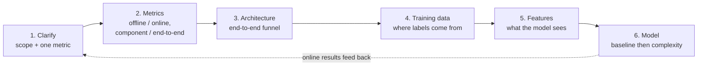

# 0. The method: how to approach an ML system design interview

Every chapter in this book applies the same playbook to a different system. This page
teaches the playbook itself, so you carry a repeatable method into a question you have
never seen rather than a memory of 19 specific systems. When the interviewer says
"design X," walk these six steps in order. Skipping a step is the most common way
strong candidates still lose the room.

## 1. Clarify the problem (do not skip to a model)

Turn a vague prompt into a scoped ML task. Pin: who the user is and what action the
prediction drives; the scale (items, users, queries per second); the latency budget;
and the one business metric that defines success. The single strongest opening move is
to name the **downstream decision**, because it fixes everything after it: "recommend
movies" is a ranking problem if the output is an ordered shelf, a retrieval problem if
the catalog is millions, and a bandit problem if the goal is to learn what a new user
likes. Ask, then commit to a framing out loud.

## 2. Define metrics before architecture

Name how you will measure success on two independent axes. Getting this explicit early
is a senior signal; most candidates jump to models and never say how they would know
the model is good.

|  | Offline (before shipping) | Online (in production) |
|---|---|---|
| **Component** (one stage) | retrieval recall@k, ranker NDCG, calibration/ECE on a held-out set | per-stage latency, candidate-set quality, stage pass-through rates |
| **End-to-end** (whole system) | a golden-set task-success score | the business metric: revenue, engagement, session success, on a live A/B test |

The point of the split: a component metric localizes a regression (retrieval recall
fell), while the end-to-end metric is the one that actually justifies a launch. Offline
metrics let you iterate fast; only the online A/B decides the ship.

## 3. Sketch the end-to-end architecture as a funnel

Draw the whole system, not one box. Almost every large ML system is a **cascade**:
each stage cheaply narrows the candidate set so the next, more expensive stage sees
fewer items. For a recommender that is retrieval (millions to thousands) then
pre-ranking (thousands to hundreds) then ranking (hundreds, scored precisely) then
re-ranking (policy and diversity on the top items). Naming the funnel, and explaining
why the heavy model cannot run over the whole catalog, is what turns a box diagram into
a design.

## 4. Training data: say where the labels come from

Models are only as good as their labels, and interviewers probe this because it
separates people who have shipped from people who have read. There are three sources,
each with a bias to name:

- **Implicit feedback (online interaction logs).** Clicks, watches, purchases from the
  live system. Abundant and cheap, but biased by what the current system already showed
  (position and exposure bias), so it needs debiasing (inverse-propensity weighting) or
  randomized exploration data.
- **Human raters / specialized labelers.** Explicit judgments (relevance grades,
  policy labels). High quality and unbiased by the product, but slow, expensive, and
  limited in volume; use them for the golden eval set and to calibrate a cheaper model.
- **Targeted collection and synthesis.** For cold-start categories or rare classes,
  actively collect or synthesize examples (open datasets, augmentation, a stronger
  model as a teacher) so the tail is not starved.

Also pin the **split**: for anything time-ordered, split train and test by time, never
randomly, or a feature quietly leaks the future.

## 5. Features: what the model actually sees

Group features by source so nothing is forgotten: user features (history, profile),
item/content features, context (time, device, query), and interaction/cross features
(this user with this item). Two rules carry most of the credit: every feature must be
computable at serving time from data that exists *before* the label (point-in-time
correctness), and the same feature definition must produce the same value offline and
online (no train/serve skew).

## 6. Model: baseline first, then earn complexity

Start with the simplest model that could work (a logistic regression or a
gradient-boosted tree), because it sets the bar every fancier model must beat and it
ships while you iterate. Reach for deep models, transfer learning, or a foundation
model only when a measured gap justifies the cost in data, latency, and iteration
speed. State the tradeoff out loud rather than defaulting to the biggest model.

## The loop, not the line

These steps are a loop, not a one-way list. Online results (step 2) reveal where the
system is weak, which sends you back to better data (step 4), features (step 5), or a
different model (step 6). Saying "here is how I would iterate after launch" at the end
is what closes a strong answer.

Each chapter that follows is this method applied once. Read a few and the shape becomes
automatic, which is the entire point: the interview rewards the method, not the
memorized system.
