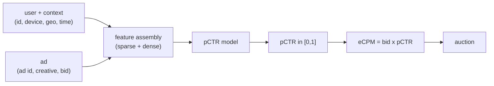

# 2. Framing it as an ML task

## Defining the ML objective

Advertisers want their ads shown to people likely to click. The platform wants
eCPM revenue. We reconcile both by framing the problem as: **estimate the
probability that a given user clicks a given ad in a given context.**

$$\hat{p} = P(\text{click} \mid \text{user},\, \text{ad},\, \text{context})$$

This is a **binary classification** problem with a twist: the output must be a
**calibrated probability**, not just a score. The number flows directly into
eCPM, so a score that is off by even 20 percent mis-prices the auction.

## Specifying the input and output

The model takes a feature vector assembled from three sources:

- **User signals.** User id embedding, demographic proxies, device, geo, recent
  click and conversion history.
- **Ad signals.** Ad id and creative id embeddings, advertiser id, landing page
  category, bid, historical CTR for the ad.
- **Context signals.** Page type, placement (position, size, format), time of
  day, query (for search ads).

The output is a single scalar in $[0, 1]$: the estimated probability of a click.
That scalar passes to the auction, which computes

$$\text{eCPM} = 1000 \cdot b \cdot \hat{p}(\text{click})$$

where $b$ is the advertiser's bid. The ad with the highest eCPM (above the
reserve price) wins and is charged second-price.

## What makes this harder than ranking

In a ranking system the model only needs to **order** items correctly; the
absolute values are discarded after sorting. In ads CTR prediction the absolute
value is the product. Two important consequences:

- **AUC is necessary but not sufficient.** A model can have identical AUC before
  and after a systematic shift in its probability scale, because AUC only measures
  rank order. The auction, however, prices off the number. Detecting this with
  AUC alone is impossible; you need calibration metrics too.
- **Class imbalance is severe.** Click-through rates are typically well below
  1 percent, often 0.1 percent or lower. A naively trained model will predict
  near zero for everything and still get 99.9 percent accuracy. Log loss with a
  proper label distribution, not accuracy, is the right training signal.

## Choosing the right ML framing

| Reach for | When | Instead of |
|---|---|---|
| Binary classification with log loss (this chapter) | output is a probability that prices an auction | ranking loss (listwise, pairwise), which optimizes order and loses the absolute scale |
| Multi-task with a pCVR head | conversion labels are available and the platform bills on conversions | a separate pCVR model, when you want the two tasks to share a representation |
| Regression on log-odds | you want to post-correct a linear model's calibration with Platt scaling | a full DNN retrain every time calibration drifts |
| Separate pCVR model (Criteo delay-model) | conversion delay distribution is long and variable | labeling a not-yet-converted click as a confirmed negative, which biases pCVR down |

The next section builds the data pipeline that feeds this binary classifier.
