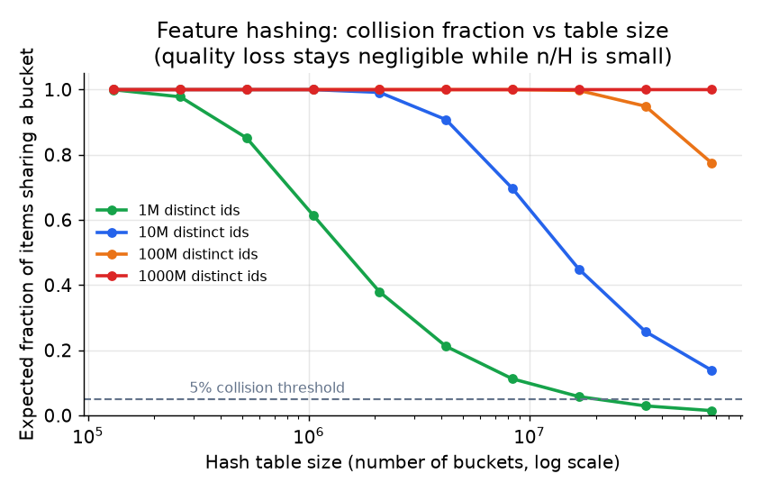
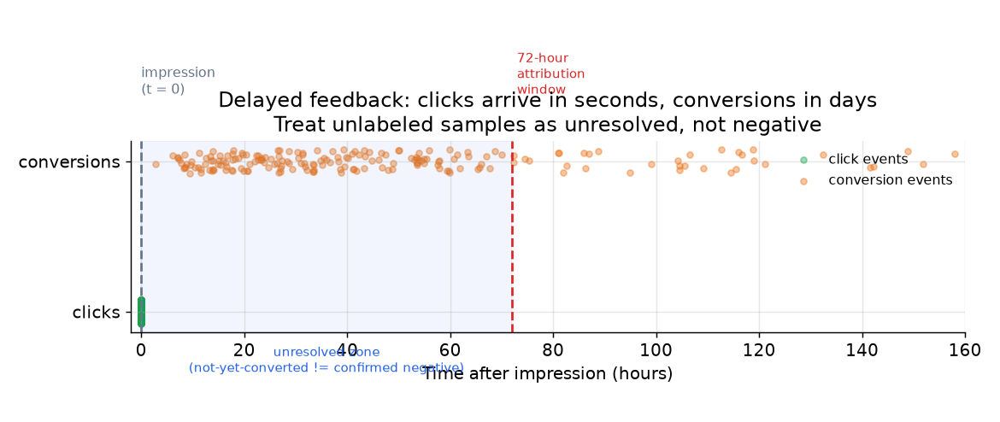

# 3. Data preparation

## The raw material: impression logs

Every impression produces a training example. An impression log row records what
was shown, to whom, in what context, and (eventually) whether it was clicked.

| user_id | ad_id | creative_id | placement | device | hour | clicked | converted |
|---|---|---|---|---|---|---|---|
| u_8812 | a_1041 | c_209 | feed_top | mobile | 14 | 1 | 0 |
| u_3345 | a_0077 | c_155 | sidebar | desktop | 9 | 0 | (pending) |
| u_9201 | a_5503 | c_710 | feed_mid | mobile | 21 | 0 | 0 |

The click label is usually known within seconds of the impression. The conversion
label for the second row is marked pending: the user may convert tomorrow, or may
not. **Treating `(pending)` as 0 is the single most common data preparation
mistake in ads CTR.** More on that below.

## Sparse ID features and feature hashing

The dominant feature type is a categorical id: user id, ad id, advertiser id,
creative id, placement id. There are hundreds of millions of distinct values per
field. Two strategies handle this scale:

**Row-per-id embedding tables.** Pre-allocate one row in a learnable matrix for
each known id (an embedding is a learned dense vector that stands in for a raw
categorical id, so the model can do arithmetic on ids). Works when the id space is bounded and stable (e.g., a fixed set
of placements). Impossible for user ids and ad ids that grow continuously.

**Feature hashing into a fixed-size table.** Hash each id value to a bucket
index in a table of size $H$. The embedding for id $x$ is
$\mathbf{E}[h(x) \bmod H]$ where $h$ is a stable hash function. This gives:

- **Bounded memory.** The table is exactly $H \times d$ parameters regardless of
  how many unique ids appear.
- **Graceful handling of unseen ids.** A brand-new ad id hashes to an existing
  bucket; it gets a noisy but non-zero embedding immediately.
- **Controlled collisions.** Two distinct ids that hash to the same bucket share
  an embedding. The per-pair collision probability is $1/H$; the expected
  fraction of items landing in an already-occupied bucket is approximately
  $1 - e^{-n/H}$. When $n/H$ is small this fraction is roughly $n/H$, so
  quality loss stays negligible. Increasing $H$ reduces collisions but grows
  memory.



*Expected fraction of items sharing a bucket, as a function of table size for id
spaces of 1M to 1B distinct values. Quality loss stays negligible while n/H is
small; the 5% line marks the practical threshold. Illustrative rates.*

The tradeoff is explicit: feature hashing trades a controlled quality loss
(collisions) for a bounded, shardable table and no out-of-vocabulary penalty.
**Name this tradeoff in the interview; it is the senior-level detail.**

## Assembling the feature vector

A row in the training set is assembled from three stores:

- **Online feature store (point-in-time read):** user id, ad id, session features.
  These must match exactly what the serving path reads, or you introduce
  training-serving skew.
- **Precomputed batch features:** historical CTR for the ad, user lifetime stats,
  advertiser quality score.
- **Request context:** placement, device, time of day, page type. Cheap to
  reproduce offline if logged correctly.

The standard practice is to **log the feature vector alongside the impression**
(or log enough raw signals to recompute it deterministically). This ensures that
offline training and online serving see the same numbers.

## Delayed feedback and unresolved labels



*Clicks land within seconds of an impression. Conversions can arrive hours to
days later. Samples inside the attribution window that have not yet converted are
unresolved, not confirmed negatives. The 72-hour window shown is illustrative.*

The fundamental problem: at training time, a click with no conversion `yet` looks
like a negative. If you label it 0 and train immediately, you systematically
under-estimate pCVR. Three mitigations:

1. **Bounded attribution window.** Wait $W$ hours before finalizing the label.
   Any click that has not converted in $W$ hours is labeled 0. Simple, introduces
   latency into the label pipeline.
2. **Fake-negative weighted loss (Twitter).** Assign a smaller loss weight to
   examples that are plausibly still converting. The weight reflects the
   probability that the sample will flip from 0 to 1 given the elapsed time and
   the conversion rate distribution.
3. **Two-model approach (Criteo).** One model predicts $p(\text{convert})$; a
   second models the conversion delay distribution. Combine them to get a
   corrected label for training the CTR/CVR model.

## Feedback loops and selection bias

There is a deeper problem: **you only log outcomes for ads you chose to show.**
The previous model's score determined which ads got impressions, so the training
data is a biased sample of what a uniform policy would have observed.
Concretely:

- Ads the current model under-scores rarely win auctions, rarely get shown, and
  therefore accumulate almost no training signal.
- Any position-dependent bias in clicks (users click the first slot more
  regardless of quality) gets baked into the label as though it were signal.

Mitigations to name:

- **Exploration traffic.** Deliberately show a small fraction of ads
  off-policy (epsilon-greedy or Thompson sampling, both simple randomized
  exploration policies that sometimes show a non-top ad on purpose) to gather
  unbiased labels.
  This is exactly what Instacart calls their "hold-back" dataset.
- **Inverse-propensity weighting (IPW).** Weight each training example by the
  inverse probability the old policy showed the ad (the propensity is that
  showing probability, logged at serving time). Upweights rare ads,
  downweights over-served ads.

```python
import numpy as np
def ipw_weights(propensities):
    # propensity = probability the OLD policy chose to show this ad (logged online)
    p = np.asarray(propensities, float)
    return 1.0 / p                    # small p (rarely shown) -> large training weight
# ipw_weights([0.5, 0.1, 0.8]).tolist() -> [2.0, 10.0, 1.25]
```
- **Position feature at train time.** Include slot position as a feature during
  training; neutralize it (set to a fixed value) at serving, so the model does
  not learn to predict position instead of relevance.

## When to use which feature treatment

| Reach for | When | Instead of |
|---|---|---|
| Feature hashing (fixed $H$) | id space is unbounded or grows continuously (user ids, ad ids) | row-per-id table, which cannot bound memory or handle new ids |
| Row-per-id embedding | small, stable categorical space (a dozen placements, a few devices) | hashing, where collision is unnecessary overhead for small spaces |
| Bounded attribution window | conversion delay is short and predictable | an open-ended window that delays training for days |
| Fake-negative weighted loss | continuous training, short window, and you can estimate delay distribution | waiting for all labels, which makes training stale on fast-moving campaigns |
| Two-model delay approach | conversion delay is long and variable; you want a principled probability correction | the weighted-loss approach, when you cannot estimate the delay distribution reliably |
| IPW + exploration | you need unbiased data for calibration or pCVR modeling | training only on served impressions, which entrenches the existing model's biases |

**Tools.** Feature hashing is available as the hashing trick in scikit-learn's FeatureHasher or as category hashing in TorchRec (Meta), and row-per-id embedding tables come from PyTorch (Meta) nn.Embedding, sharded through TorchRec when they grow large. The bounded attribution window, fake-negative weighted loss, and two-model delay correction are custom label-pipeline and loss logic rather than off-the-shelf libraries, as are inverse-propensity weighting and the exploration policy in training and serving code.

**Worked example.** An ad network prepares impression logs at scale. For user ids and ad ids that grow without bound it hashes into a fixed-size table (TorchRec), since a row-per-id table cannot bound memory or absorb new ids, while for its dozen fixed placements it keeps a small row-per-id embedding because collisions there would be needless overhead. Conversions land hours later, so for short, predictable delays it finalizes labels with a bounded attribution window; for continuous training on fast-moving campaigns it switches to a fake-negative weighted loss rather than waiting days, and when delay is long and variable it uses the two-model delay correction instead. Because it only logs outcomes for ads it chose to show, it routes a slice of exploration traffic and applies inverse-propensity weighting to gather unbiased labels for calibration rather than entrenching the current model's biases.

## Where the labels come from

Before any of the treatments above, ask the plainer question: where does the label
on each row actually originate. In ads CTR three sources feed the pipeline, and each
carries a different bias you have to correct for.

| Label source | What it gives you | The bias, and the fix |
|---|---|---|
| Implicit feedback (click and conversion logs) | Abundant and nearly free; every served impression is a labeled row | Position, exposure, and selection bias: you only see outcomes for ads the old policy chose to show, and top slots get clicked regardless of quality. Correct with inverse-propensity weighting and exploration (hold-back) traffic. |
| Human raters / policy reviewers | High-quality judgments (ad quality, landing-page policy, brand-safety flags) that are unbiased by what the model served | Slow, costly, low volume. Reserve for the golden eval set and to calibrate a cheaper model. |
| Targeted collection / synthesis | Coverage for cold or rare cases: new advertisers, fresh creatives, thin verticals | Not organic traffic, so treat as a supplement, not a replacement. Use open datasets, augmentation, or a stronger model as a teacher to seed the rare classes. |

Because impressions are time-ordered, split train and test by time (train on earlier
days, evaluate on later days), never by a random shuffle. A random split lets
future conversions leak into training and inflates every offline number.
