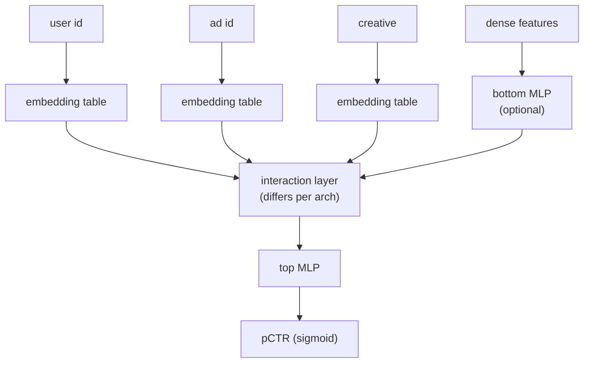
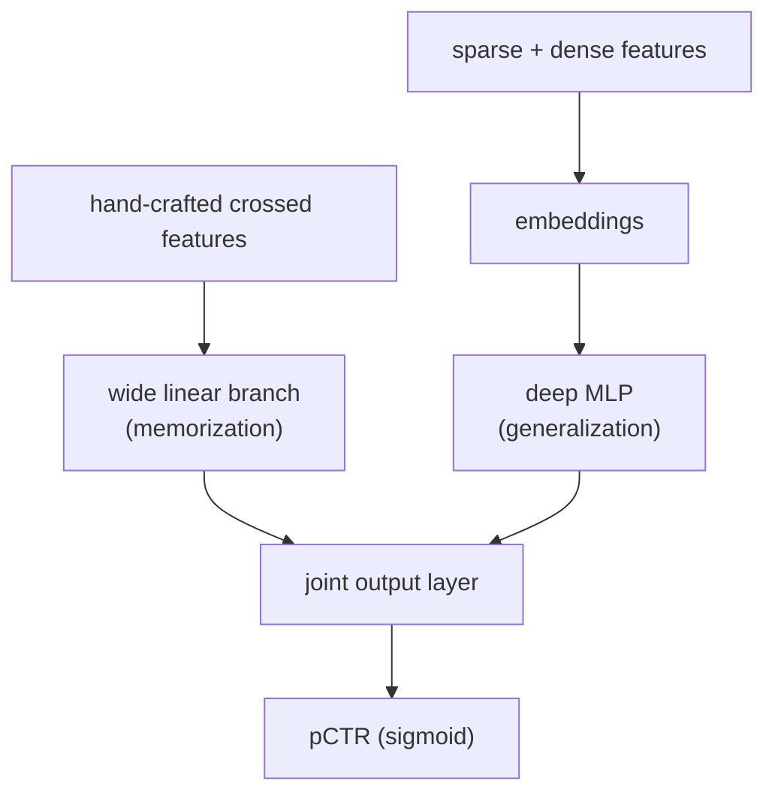
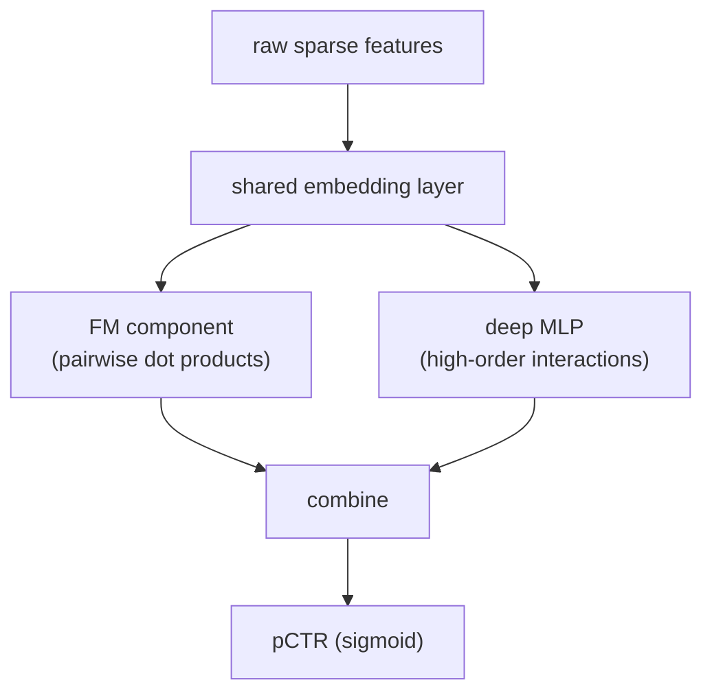
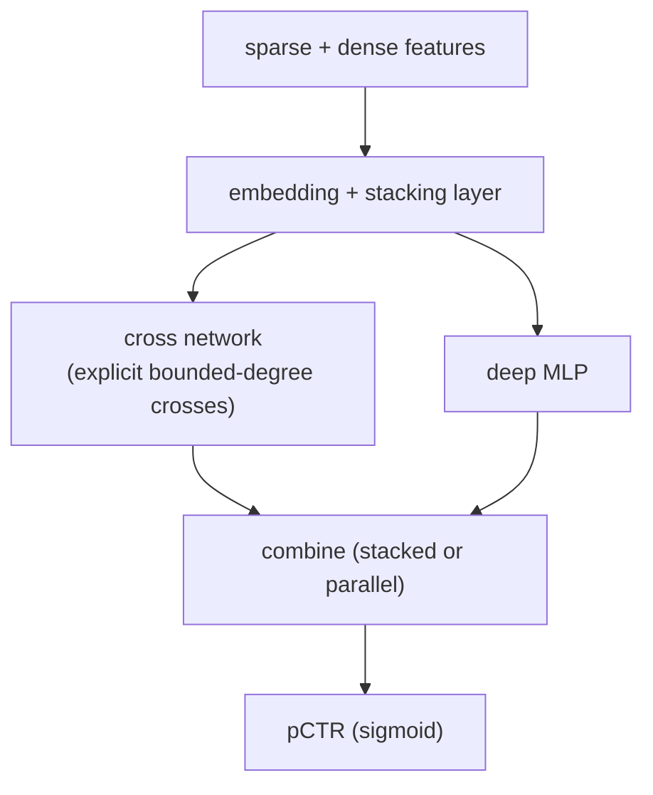
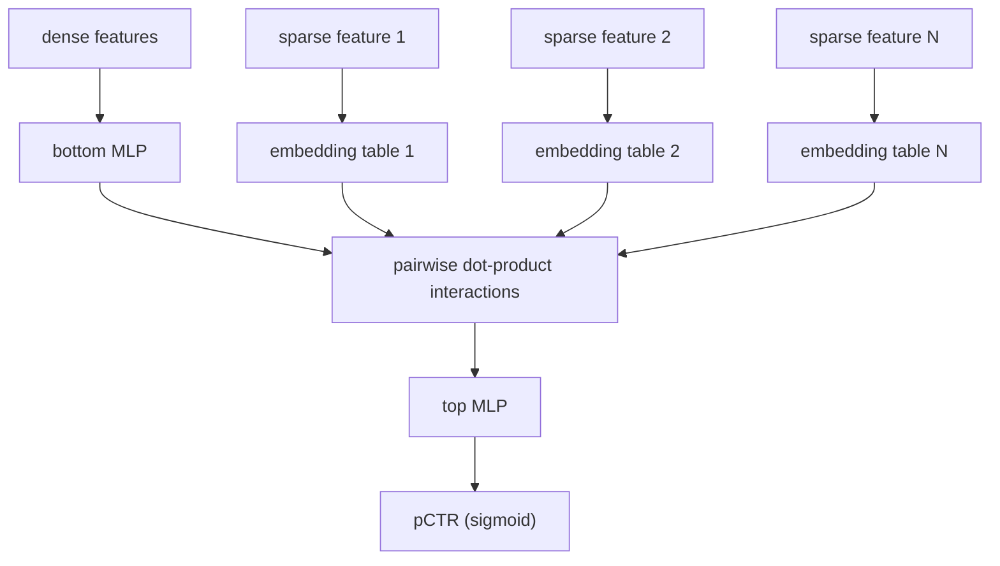

# 4. Model development

## The progression: each step buys one thing

The model family for ads CTR has evolved over roughly fifteen years, and each
step in that evolution solves a specific weakness of the previous generation.
Narrating the progression in an interview shows you understand why the
architectures are the way they are, not just that they exist.

### Logistic regression over one-hot sparse features

The workhorse of ads CTR for years. Sparse feature ids are one-hot encoded, an
embedding weight is learned for each, and a sigmoid maps the inner product to a
probability.

$$\hat{p} = \sigma\!\left(\mathbf{w}^{\top}\mathbf{x} + b\right) = \frac{1}{1 + e^{-(\mathbf{w}^{\top}\mathbf{x} + b)}}$$

**Strengths:** naturally calibrated output (the sigmoid is a proper probability
from a logistic model), fast, interpretable, easy to retrain.

**Weakness:** no feature interactions. User id weight times ad id weight does not
capture the "this user likes this category of ads" signal; you would have to
hand-craft a user-category cross feature for that.

### GBDT + logistic regression (Facebook recipe)

Gradient-boosted trees discover useful feature combinations automatically. Each
training example passes through the trees; the leaf indices it falls into become
new sparse features fed to a logistic regression head. The linear head stays
naturally calibrated; the trees supply the interactions.

**Strengths:** automatic interaction discovery without deep embeddings; naturally
calibrated linear head.

**Weakness:** trees do not scale to billions of sparse ids. At Meta's scale (100M
user ids, 100M ad ids), you cannot build a tree over raw ids. This is the ceiling
that forces embedding-based deep models.

### Factorization Machines (FM)

Each feature gets a latent vector $\mathbf{v}_i \in \mathbb{R}^k$. All pairwise
interactions are modeled via dot products:

$$\hat{p} = \sigma\!\left(w_0 + \sum_i w_i x_i + \sum_{i \lt j} \langle \mathbf{v}_i, \mathbf{v}_j \rangle x_i x_j\right)$$

This captures all pairwise crosses including user-ad crosses that a linear model
cannot, in $O(kd)$ time via the FM identity rather than $O(d^2)$ time.
Factorization machines are the conceptual ancestor of modern embedding-based deep
CTR models.

### Deep models: the shared idea

The four major deep CTR architectures all share one structure: **sparse features
go through embedding tables; the architectures differ in how they model
interactions across those embeddings.** Hoping a plain MLP will discover
interactions across very sparse id embeddings is insufficient; the architectures
make interactions explicit.

**Wide and Deep (Google Play).** A wide linear branch over hand-crafted crossed
features (memorization) runs in parallel with a deep embedding-plus-MLP branch
(generalization). The wide side nails frequent specific combinations; the deep
side generalizes to unseen crosses. The two branches are trained jointly.

**DeepFM (Guo et al.).** Replaces the hand-crafted wide branch with an FM
component that models all pairwise interactions automatically, while a deep MLP
models higher-order interactions. Crucially, **both branches share the same
embedding layer**, so there is no separate feature engineering for the FM side.

**DCN V2 (Wang et al.).** Stacks explicit cross layers that produce
bounded-degree feature interactions beside an MLP. The cross layers are
parameter-efficient (a mixture-of-low-rank variant cuts cost further) and can
run either stacked with or in parallel to the MLP.

**DLRM (Meta).** Sparse features each get their own embedding table. Dense
features pass through a bottom MLP. Explicit **pairwise dot products** between
all embedding vectors (and the bottom MLP output treated as one more vector)
produce the interaction features, which feed a top MLP for the final score.

> **Open the validated graphs.** Trace DLRM and Wide-and-Deep at real dimensions
> in the live [Model Zoo](https://github.com/neurarch-ai/awesome-llm-model-zoo).
> Find where the embedding tables live (they dominate parameter count, not the
> MLPs) and trace a sparse feature through the interaction step to the score.

## Where the parameters live

The MLP at the top is small, often fewer than one million parameters. The
**embedding tables** hold the model capacity: one row per distinct categorical
value times an embedding dimension $d$. With 500 million user ids at $d = 64$,
that is 32 billion floats before considering ad ids, advertiser ids, and creative
ids. The tables dwarf the MLP by two to three orders of magnitude.

Two systems consequences:

1. The tables must be **sharded across machines** (model parallelism on
   embeddings, data parallelism on the MLP) because no single device holds them.
2. The id space is open-ended, so feature hashing into a fixed-size table
   (collision tradeoff discussed in the previous section) is the standard fix.

## Calibration: making the raw score a true probability

Training with log loss points the model toward calibrated probabilities, but
negative sampling (down-sampling non-clicks to handle class imbalance) and
distribution shift both distort the raw head. A post-hoc calibration step maps
raw scores onto true rates.

**Platt scaling (Pinterest).** Fit a logistic regression $q = \sigma(as + b)$
on a held-out set. Two parameters, fast to refit (hourly at Pinterest, while the
heavy DNN retrains daily).

**Isotonic regression (LinkedIn).** A non-parametric monotone mapping fitted on
held-out data. More flexible than Platt but can overfit on small samples.

**Transfer-learning calibration (Instacart).** Freeze the lower layers of a
trained Wide and Deep model; fine-tune only the final sigmoid layer on a small
unbiased hold-back set. Preserves AUC, achieves calibration score near 1.0 on
their eval set.

**Recalibration cadence.** Decoupling calibration from model training is the
key insight: the full DNN retrains daily (expensive); the calibration layer
refits hourly on fresh data (cheap). This is what Pinterest (Platt) and LinkedIn
(isotonic + shallow tower) both do.

## When to use which model

| Reach for | When | Instead of |
|---|---|---|
| Logistic regression | prototype, interpretability required, or naturally calibrated head is essential | deep model, when interaction discovery is not needed |
| GBDT + LR (Facebook) | id space is moderate, tree-discovered crosses carry the signal | deep model, when tree memory blows up at billions of ids |
| Wide and Deep | you want memorization of frequent crosses and generalization together, with a simple baseline | more complex DLRM or DCN, before offline eval justifies the jump |
| DeepFM | pairwise sparse crosses matter and you want FM interactions without hand-crafted feature engineering | Wide and Deep, if you want to avoid the wide branch's manual feature work |
| DCN V2 | high-degree crosses are important and you want explicit, parameter-efficient interaction layers | stacking a deeper MLP and hoping it discovers crosses, which is less sample-efficient |
| DLRM (Meta) | billions of sparse ids where explicit pairwise dot-product interactions carry most of the signal | GBDT, when the id space cannot be held in tree memory |
| Platt scaling calibration layer | raw head drifts under class imbalance and you need fast hourly recalibration | full DNN retrain every time calibration drifts, which is too slow and costly |
| Transfer-learning calibration (Instacart) | you have a small unbiased hold-back set and want to preserve AUC while fitting to true rates | isotonic regression, when you have enough hold-back data to avoid overfitting on the non-parametric mapping |
