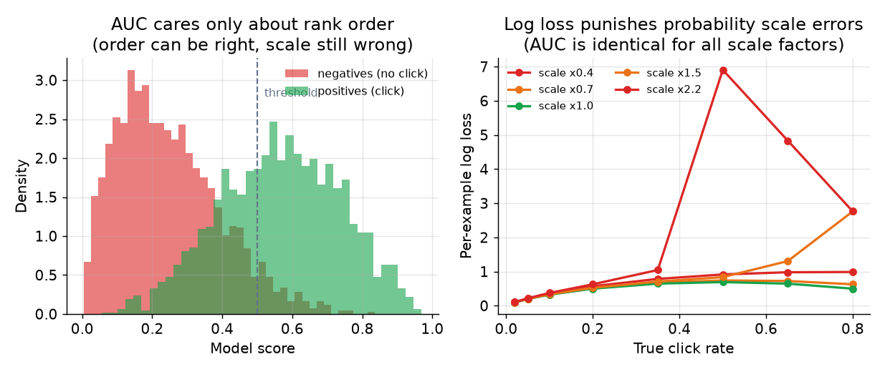
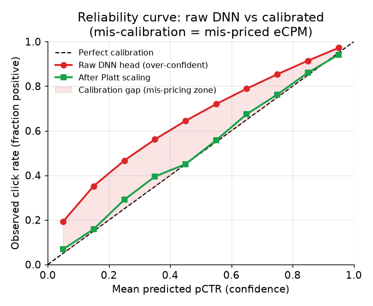

# 5. Evaluation

Ads CTR models need two evaluation lenses: one that measures how well the model
**orders** candidates (standard ranking quality), and one that measures how well
it **prices** them (calibration). Using only AUC is the single most common
evaluation mistake for this problem. State both lenses early.

## AUC: ranking quality

Area Under the ROC Curve measures the probability that the model scores a random
positive above a random negative. It is an aggregate rank-order metric.

- **Input / output.** Takes model scores paired with binary click labels; returns
  a scalar in $[0, 1]$: 0.5 is random, 1.0 is perfect rank-order separation.

$$\text{AUC} = P(\hat{p}_{\text{click}} \gt \hat{p}_{\text{no-click}})$$

**What AUC captures:** whether the model orders ads correctly. A higher AUC
means the top-scored ads are more likely to be clicks.

**What AUC misses:** the absolute scale of the probabilities. Two models with
identical AUC but different probability scales will rank ads identically, but
will produce different eCPMs, different prices, and different auction outcomes.
This is the gap that makes AUC alone insufficient for ads.

## Log loss: calibration-aware quality

Log loss (cross-entropy) rewards the model for predicting the correct
*probability*, not just the correct order.

- **Input / output.** Takes predicted probabilities $\hat{p}_i$ and binary click
  labels $y_i \in \{0, 1\}$; returns a positive scalar where lower is better.

$$\mathcal{L} = -\frac{1}{N}\sum_{i=1}^{N} \big[ y_i \log \hat{p}_i + (1 - y_i) \log(1 - \hat{p}_i) \big]$$

Log loss is a **proper scoring rule**: it is minimized by the true probability,
so it simultaneously rewards calibration and ranking quality. AUC rewards only
the latter.

*Left: AUC only cares about whether the positive scores exceed the negative
scores. A systematic shift in the scale of all scores leaves AUC unchanged.
Right: log loss penalizes probability scale errors directly. A model whose
predicted rates are 40% of truth incurs high loss even if AUC is the same as a
well-calibrated model. Illustrative.*

## Calibration metrics

Calibration measures whether predicted probabilities match observed rates.

**Reliability curve (calibration plot).** Plot the mean predicted probability on
the x-axis against the observed click rate on the y-axis, across equal-width bins
of predicted probability. Input: predicted probabilities and binary click labels.
Output: a 2-D curve; a perfectly calibrated model lies on the diagonal.

**Expected Calibration Error (ECE).** Summarizes the reliability curve into a
scalar.

- **Input / output.** Takes predicted probabilities bucketed into $B$ bins,
  paired with binary click labels; returns a positive scalar in $[0, 1]$ where 0
  is perfect calibration.
- **How it is computed.**

$$\text{ECE} = \sum_{b=1}^{B} \frac{n_b}{N} \big|\text{acc}(b) - \text{conf}(b)\big|$$

where $n_b$ is the count in bin $b$, $\text{acc}(b)$ is the observed click rate,
and $\text{conf}(b)$ is the mean predicted probability.

*A raw DNN head (red) over-predicts probabilities (over-confident). After Platt
scaling (green) the curve tracks the diagonal closely. The shaded zone is the
calibration gap: every point in it is an auction that prices the slot incorrectly.
Illustrative.*

## Why calibration matters for bidding: the full chain

Repeat the chain because it is the crux. eCPM = bid times pCTR. The auction
ranks ads by eCPM and charges second-price: the winning advertiser pays roughly
the eCPM of the runner-up divided by their own pCTR.

$$\text{price} = \frac{\text{eCPM}_{\text{runner-up}}}{1000 \cdot \hat{p}(\text{click})}$$

If $\hat{p}$ is systematically high (over-confident model), the platform
over-values every ad. Advertisers overpay, or the wrong ad wins because its
pCTR is inflated relative to competitors. If $\hat{p}$ is systematically low,
real revenue is left unbilled and good ads lose to weaker ones. A model with
great AUC but 20% upward calibration drift silently mis-prices every slot, every
second.

This is why you must:

- Monitor calibration **sliced** by placement, device, ad type, and time, not
  just globally. A model calibrated on average can be badly miscalibrated on the
  high-value slices the auction cares about most.
- Monitor it **continuously in production**, not just at release.
- Treat ECE as a first-class production metric, not a one-time eval step.

## The online gate: A/B test on revenue, not just AUC

Offline metrics are necessary but not sufficient. The real launch decision is an
online A/B test. What to measure:

- **Revenue per thousand requests (RPM).** The ultimate metric. A calibration
  improvement that correctly prices more slots will show up here.
- **Advertiser ROI.** Are advertisers getting value? A model that over-bids
  (high pCTR) produces clicks but at inflated cost to advertisers, which reduces
  long-term spend.
- **Calibration stability over time.** Does the model stay calibrated as
  campaigns change, or does ECE drift up within days of launch?

Offline and online metrics can diverge significantly; the online gate is mandatory.

## When to use which metric

| Reach for | When | Instead of |
|---|---|---|
| AUC | measuring rank-order quality in isolation; comparing two models trained with the same loss | AUC alone as the final eval, which misses calibration |
| Log loss | training objective and offline quality score; rewards both ranking and calibration simultaneously | accuracy or AUC as the training loss, which ignores the probability scale |
| Reliability curve + ECE | diagnosing whether raw scores are trustworthy as probabilities before feeding the auction | AUC, which is blind to probability scale errors |
| Sliced ECE | catching calibration rot in specific segments (placement, device, ad category) | a single global ECE that hides local mis-pricing |
| Online A/B on RPM and advertiser ROI | the final launch decision and assessing whether the improvement actually moves money | offline log-loss or AUC alone, which misses the closed-loop auction dynamics |

**Tools.** scikit-learn computes AUC (roc_auc_score), log loss, and calibration curves. ECE is a small bucketing over predicted probabilities, available from netcal or a short custom routine, and sliced ECE is the same computation grouped by segment. The online A/B on RPM and advertiser ROI runs through the in-house experiment platform, with significance testing via scipy.stats or statsmodels.

**Worked example.** An ad network evaluates a new pCTR model with both lenses. It reports AUC (scikit-learn) to compare rank-order quality against the current model, but never as the final word, because a systematic scale shift leaves AUC unchanged while it moves every price. It tracks log loss as a proper scoring rule that rewards ranking and calibration together, and it plots a reliability curve with ECE (netcal) to confirm the raw scores are trustworthy before they feed the auction. Since a model calibrated on average can be badly miscalibrated on high-value slices, it slices ECE by placement and device rather than trusting one global number. The launch itself is gated on an online A/B test measuring revenue per thousand requests and advertiser ROI, which offline metrics alone cannot capture.
