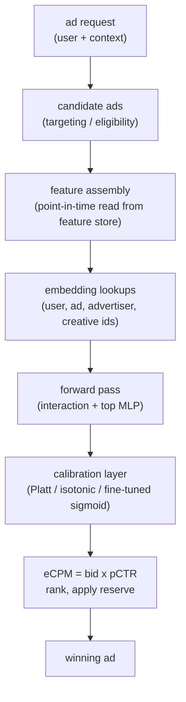

# 6. Serving and scaling

## The serving path

Each ad request must score tens to a few hundred candidate ads and return a
priced result in low tens of milliseconds. The scoring path is:

Two optimizations that every production system applies:

**Fetch shared features once.** User and context features are the same for all
candidate ads in a request. Fetch them once and broadcast across all candidates.
Do not re-read the feature store once per candidate.

**Batch the forward pass.** Run all candidate ads through the model as a single
batched tensor rather than one at a time. Modern hardware (GPU, TPU, or
vectorized CPU serving) can score hundreds of ads nearly as fast as one.

## Where the latency comes from

The forward pass through the top MLP is fast: a few matrix multiplies over a
dense, small tensor. The dominant cost is **embedding lookup**: reading rows out
of the embedding tables for user id, ad id, advertiser id, creative id, and any
other sparse categorical fields.

For a single request with 100 candidate ads and 10 sparse features per ad, that
is 1,000 embedding rows per request from tables that together span gigabytes.
Three things determine whether this fits in the latency budget:

1. **Cache hit rate.** Hot user ids and hot ad ids are re-requested thousands of
   times per second and should live in an L2 or L3 cache tier. Cold ids miss the
   cache and hit storage; the fraction of cold lookups bounds your tail latency.
2. **Embedding dimension.** Smaller $d$ means smaller rows, faster reads, and
   better cache utilization. There is a model quality tradeoff.
3. **Table sharding.** Tables that exceed a single machine's memory must be
   sharded. A lookup then becomes a network round-trip to the shard host. Keep
   frequently co-accessed tables on the same shard when possible.

## Continuous and incremental training

Campaigns launch, pause, and rotate creatives hourly. A model trained last week
has never seen this morning's new ad ids; their embeddings are random noise.
The standard answer is **continuous or incremental training**:

- Stream fresh labeled impressions as they become available (clicks in seconds,
  conversions after the attribution window).
- Update the model, often with a fast online gradient step on the embedding
  tables (which hold most of the drift) and a periodic full retrain for the
  dense layers.
- Recalibrate on a tight cadence independently of the full retrain. Pinterest
  and LinkedIn both decouple the two: calibration hourly, full DNN daily.

The catch: fast embedding updates make calibration drift faster too. Every
incremental update cycle must be accompanied by a calibration check, not just a
loss check.

## Training-serving skew: the silent calibration killer

The most common source of calibration regression is a mismatch between how a
feature is computed offline and how it is read online. Examples:

- Offline uses a 7-day average click rate for the ad; online reads a 1-day
  cached value.
- Offline encodes device as an integer; online sends a string that maps to a
  different integer.

The fix is to **log the feature vector at serving time** and use the logged
features for offline training, rather than recomputing them from raw logs. If you
cannot store the full vector, log enough raw signals to recompute it
deterministically. See
[feature store and training-serving skew](../../topics/04-feature-store-and-training-serving-skew.md).

## Bottlenecks

| Bottleneck | First sign | Fix | Tradeoff |
|---|---|---|---|
| Embedding table memory | tables do not fit on a single host | shard across hosts with model parallelism; use feature hashing to bound size | sharding adds network round-trips per lookup; hashing adds collisions |
| Embedding lookup latency | p99 over budget even with small MLP | warm cache for hot ids; reduce embedding dimension; co-locate frequently accessed tables | smaller dim hurts model quality; caching needs memory budget |
| Calibration drift | eCPM mis-prices, revenue or spend moves unexpectedly | decouple calibration from full retrain; recalibrate hourly with a lightweight layer | extra pipeline step; must monitor sliced ECE, not just global |
| Delayed labels | pCVR biased downward; new campaigns under-bid | delay-aware loss; bounded attribution window with tail correction | label latency increases; correction introduces weight tuning |
| Feedback loop | new ads starve for data; popular ads are over-served | exploration slice; IPW; position feature at train time | short-term revenue cost from serving suboptimal ads |
| Feature freshness | new campaigns and creatives not reflected in embeddings | continuous / incremental training with fast embedding updates | calibration churn; serving complexity for multiple model versions |
| Feature store fan-out | latency before model runs is already most of the budget | fetch shared features once per request; batch the embedding reads | cache staleness on shared features |
