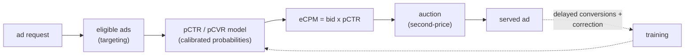

# 7. How teams do it in production

Every large ads system collapses to the same skeleton: a request pulls eligible
ads, a sparse-embedding model scores each into a calibrated pCTR, and the
auction turns that probability into money via eCPM = bid times pCTR. The
differences are mostly about which architecture carries the feature interactions
and how aggressively each team defends calibration as labels drift and
conversions arrive late.

## The shared pipeline

## Where the real designs diverge

| System | Interaction model | Calibration approach | Delayed feedback | Task shape | When it wins | Watch out |
|---|---|---|---|---|---|---|
| Meta DLRM | Embeddings + explicit pairwise dot products | Proper log-loss training; post-hoc calibration step | Not the paper's focus | Single-task | Massive sparse features where explicit pairwise interactions carry most of the signal | Embedding tables dominate memory and force model-parallel sharding; raw head still drifts under class imbalance |
| Facebook GBDT + LR | Boosted-tree leaf features feeding a linear model | Naturally calibrated linear head | Data-freshness cadence | Single-task | Moderate feature spaces where tree-discovered crosses beat hand-crafting, and a naturally calibrated linear head is worth keeping | Trees cannot hold billions of sparse ids; retrain cadence caps freshness on fast-moving campaigns |
| Wide and Deep (Google Play) | Wide linear + deep embedding MLP | Proper log-loss on the joint model | Not addressed | Single-task | You need both memorization of frequent crosses and generalization to unseen ones in one model | Wide branch still needs hand-picked cross features; two branches to tune and serve |
| DeepFM (Guo et al.) | FM component + deep MLP in parallel, shared embeddings | Proper log-loss on the joint model | Not addressed | Single-task | Sparse pairwise crosses matter and you want FM interactions with no manual feature engineering | Captures mostly pairwise interactions; higher-order crosses rely on the MLP; calibration still needs a post-hoc step |
| DCN V2 (Wang et al.) | Explicit bounded-degree cross layers beside an MLP | Proper log-loss on the joint model | Not addressed | Single-task | You want explicit, parameter-efficient high-degree crosses without a deep stack | Cross depth is a tuning knob; embeddings still dominate params and memory |
| Pinterest | AutoML shared-bottom, multi-tower MLPs | Platt-scaling layer (up to 80% calibration error reduction) | Not addressed | Multi-task (click, good click, scroll-up) | Several correlated objectives can share a base and lift each other; hourly recalibration while DNN retrains daily | Multi-task heads drift apart, so per-head calibration is mandatory; shared bottom risks negative transfer |
| LinkedIn | Three-tower DNN (deep, wide, shallow) | Isotonic regression + shallow calibration tower | Exposure-bias correction via generating calibration data on own traffic | Single-task | Moving off a GLMix baseline with severe over-prediction (40%) from exposure bias | Three towers add serving complexity; calibration data must come from the new model's own served traffic, not old logs |
| Instacart | Wide and Deep with transfer-learning calibration | Fine-tune final sigmoid layer on small unbiased hold-back set | Hold-back traffic as unbiased calibration data | Single-task | Limited in-domain data; transfer learning aligns predictions to observed click rates better than Platt or isotonic | Source-to-target mismatch can hurt; calibration head must track observed-rate shift as campaigns change |
| Twitter | Continuous-training CTR | Proper loss under corrected labels | Fake-negative weighted loss for delayed conversions | Single-task | Continuous training where conversions land late and treating them as negatives would drag pCVR down | Weighting must track the true delay distribution; 55% RPM gain online vs only 3% offline cross-entropy gain |
| Criteo | Display CTR / CVR | Proper loss on corrected labels | Two-model delay approach (one for conversion probability, one for delay distribution) | Single-task | Display CVR with long and variable conversion delays that a single label pipeline mishandles | Two-model approach adds pipeline overhead; window choice trades label latency against freshness |
| Google (Factory Floor) | Large sparse CTR with feature crosses | Calibration treated as a first-class metric; monitored continuously | Bounded attribution windows | Single-task | Industrial-scale sparse CTR where reproducibility and calibration discipline are as important as accuracy | Heavy operational complexity; bounded windows still leak the late-conversion tail |

The core dividing line is two choices: how each system carries feature
interactions (trees, FM, explicit crosses, dot products, or memorize-plus-generalize
branches) and how aggressively it defends calibration as labels drift and
conversions arrive late.

## The systems (first-party write-ups)

- **Meta** [Deep Learning Recommendation Model (DLRM)](https://arxiv.org/abs/1906.00091): sparse embeddings plus explicit dot-product interactions, the canonical CTR architecture. *(model)*
- **Guo et al.** [DeepFM](https://arxiv.org/abs/1703.04247): factorization machine plus deep network for CTR, sharing one embedding layer. *(model)*
- **Wang et al.** [DCN V2](https://arxiv.org/abs/2008.13535): explicit bounded-degree feature crosses for CTR ranking at web scale. *(model)*
- **Cheng et al.** [Wide and Deep Learning](https://arxiv.org/abs/1606.07792): memorization plus generalization, the Google Play CTR model. *(model)*
- **Facebook** Practical Lessons from Predicting Clicks on Ads (GBDT + logistic regression): the classic recipe of boosted-tree features feeding a calibrated linear model, with notes on calibration and data freshness. *(deployment)*
- **Pinterest** [AutoML, multi-task, multi-tower models for Pinterest Ads](https://medium.com/pinterest-engineering/how-we-use-automl-multi-task-learning-and-multi-tower-models-for-pinterest-ads-db966c3dc99e): a Platt-scaling calibration layer cut day-to-day error up to 80%. *(product design)*
- **LinkedIn** [Lessons from a deep-learning ads CTR prediction model](https://www.linkedin.com/blog/engineering/machine-learning/challenges-and-practical-lessons-from-building-a-deep-learning-b): replacing GLMix with a three-tower DNN; calibration under exposure bias. *(deployment)*
- **Instacart** [Calibrating CTR Prediction with Transfer Learning](https://tech.instacart.com/calibrating-ctr-prediction-with-transfer-learning-in-instacart-ads-3ec88fa97525): transfer learning aligns predicted CTR with observed click frequency. *(eval bar)*
- **Twitter** [Addressing Delayed Feedback in CTR Prediction](https://arxiv.org/abs/1907.06558): a fake-negative weighted loss for delayed labels in continuous training; 55% RPM gain online. *(product design)*
- **Google** [On the Factory Floor: ML Engineering for Industrial-Scale Ads](https://arxiv.org/abs/2209.05310): a search-ads CTR model with calibration, feature crosses, and reproducibility at scale. *(deployment)*
- **Criteo** [Modeling Delayed Feedback in Display Advertising](https://bibtex.github.io/KDD-2014-Chapelle.html): a two-model approach for deciding when an unconverted click counts as negative. *(product design)*

For the full comparison, math, and all case studies see the dense reference in
[topics/10-ads-ctr-prediction.md](../../topics/10-ads-ctr-prediction.md).
