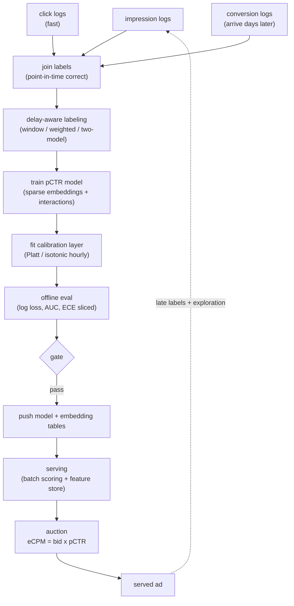

# 9. Summary

## One-page recap

- **Calibration is the primary output constraint, not ranking quality.** The
  auction computes eCPM = bid times pCTR and derives a second-price charge from
  it. A model with great AUC but drifted calibration silently mis-prices every
  slot. State this before naming any model family.
- **The dominant feature type is sparse categorical ids in embedding tables.**
  The embedding tables are orders of magnitude larger than the dense network.
  Feature hashing into a fixed-size table bounds memory and handles unseen ids at
  the cost of controlled collisions. This forces model-parallel sharding.
- **All four major deep architectures (DLRM, DCN, DeepFM, Wide and Deep) share
  the same idea: embed sparse features, then make interactions explicit.** They
  differ in how: explicit dot products (DLRM), bounded-degree cross layers (DCN),
  FM-plus-deep over shared embeddings (DeepFM), wide linear plus deep MLP (Wide
  and Deep).
- **The calibration layer should be decoupled from the full retrain.** Retrain
  the heavy DNN daily; refit a lightweight calibration layer (Platt, isotonic, or
  a shallow tower) hourly. This is what Pinterest and LinkedIn both do.
- **Delayed conversions are unresolved labels, not confirmed negatives.** Use a
  bounded attribution window, a fake-negative weighted loss (Twitter), or a
  two-model delay approach (Criteo). Treating them as 0 biases pCVR downward.
- **The feedback loop is real.** You only log outcomes for ads you served, so
  the model trains on its own predecessor's biases. Break it with exploration,
  inverse-propensity weighting, and a position feature at train time.
- **Evaluate with log loss and calibration (reliability curve, ECE, sliced), not
  AUC alone.** Gate the launch on an online A/B test on RPM and advertiser ROI.
  Offline metrics can mislead badly; a delay-aware loss can produce large online
  RPM gains from a modest offline improvement.

## The full system on one page

## Test yourself

1. Why does a model with identical AUC before and after a 20% upward calibration
   shift still mis-price every slot? Which metric would catch this and which
   would not?
2. Where do the parameters in DLRM actually live, and what system consequence
   does that force?
3. What is the difference between a confirmed negative label and an unresolved
   label for pCVR training, and what goes wrong if you confuse them?
4. Why does Pinterest decouple calibration cadence from DNN retrain cadence, and
   what specific component does each use?
5. Your model trained on served impressions performs well offline. An interviewer
   says "isn't your training data circular?" Explain the feedback loop and two
   concrete mitigations.
6. DeepFM vs Wide and Deep: what does each do about feature interactions, and why
   does DeepFM remove a manual engineering step that Wide and Deep requires?

## Further reading

- Dense reference (comparison, math, all case studies):
  [topics/10-ads-ctr-prediction.md](../../topics/10-ads-ctr-prediction.md).
- Architecture teardowns (DLRM, DeepFM, DCN V2, Wide and Deep, Pinterest,
  LinkedIn, Instacart, Twitter, Google):
  [tools/teardowns/10.md](../../tools/teardowns/10.md).
- Side-by-side comparison with decision guide:
  [tools/comparisons/10.md](../../tools/comparisons/10.md).
- Trace DLRM and Wide-and-Deep at real dimensions:
  [Model Zoo](https://github.com/neurarch-ai/awesome-llm-model-zoo).
