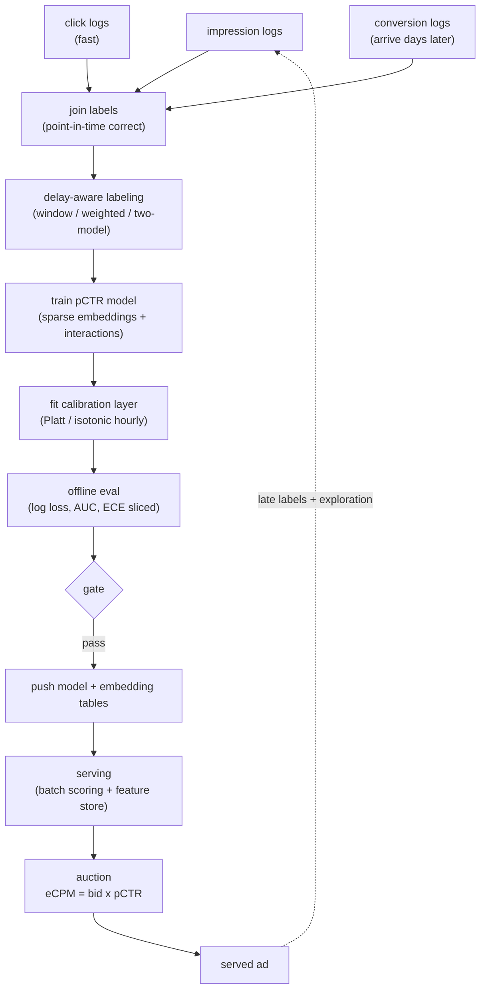

# 9. Summary

## One-page recap

- **Calibration is the primary output constraint, not ranking quality.** The
  auction computes eCPM = bid times pCTR and derives a second-price charge from
  it. A model with great AUC but drifted calibration silently mis-prices every
  slot. State this before naming any model family.
- **The dominant feature type is sparse categorical ids in embedding tables.**
  The embedding tables are orders of magnitude larger than the dense network.
  Feature hashing into a fixed-size table bounds memory and handles unseen ids at
  the cost of controlled collisions. This forces model-parallel sharding.
- **All four major deep architectures (DLRM, DCN, DeepFM, Wide and Deep) share
  the same idea: embed sparse features, then make interactions explicit.** They
  differ in how: explicit dot products (DLRM), bounded-degree cross layers (DCN),
  FM-plus-deep over shared embeddings (DeepFM), wide linear plus deep MLP (Wide
  and Deep).
- **The calibration layer should be decoupled from the full retrain.** Retrain
  the heavy DNN daily; refit a lightweight calibration layer (Platt, isotonic, or
  a shallow tower) hourly. This is what Pinterest and LinkedIn both do.
- **Delayed conversions are unresolved labels, not confirmed negatives.** Use a
  bounded attribution window, a fake-negative weighted loss (Twitter), or a
  two-model delay approach (Criteo). Treating them as 0 biases pCVR downward.
- **The feedback loop is real.** You only log outcomes for ads you served, so
  the model trains on its own predecessor's biases. Break it with exploration,
  inverse-propensity weighting, and a position feature at train time.
- **Evaluate with log loss and calibration (reliability curve, ECE, sliced), not
  AUC alone.** Gate the launch on an online A/B test on RPM and advertiser ROI.
  Offline metrics can mislead badly; a delay-aware loss can produce large online
  RPM gains from a modest offline improvement.

## The full system on one page

```mermaid
flowchart TD
  IMP["impression logs"] --> J["join labels<br/>(point-in-time correct)"]
  CLK["click logs<br/>(fast)"] --> J
  CONV["conversion logs<br/>(arrive days later)"] --> J
  J --> W["delay-aware labeling<br/>(window / weighted / two-model)"]
  W --> T["train pCTR model<br/>(sparse embeddings + interactions)"]
  T --> CALF["fit calibration layer<br/>(Platt / isotonic hourly)"]
  CALF --> EV["offline eval<br/>(log loss, AUC, ECE sliced)"]
  EV --> G{"gate"}
  G -->|"pass"| PUSH["push model + embedding tables"]
  PUSH --> S["serving<br/>(batch scoring + feature store)"]
  S --> AUCT["auction<br/>eCPM = bid x pCTR"]
  AUCT --> SERVE["served ad"]
  SERVE -.->|"late labels + exploration"| IMP
```

## Test yourself

Answers are collapsed. Attempt each question before opening one.

1. Why does a model with identical AUC before and after a 20% upward calibration
   shift still mis-price every slot? Which metric would catch this and which
   would not?

   

Answer

   Because **AUC is invariant to any monotone rescaling of the scores** while the
   auction reads the number itself, not the order. eCPM = 1000 x bid x pCTR, and
   the second-price charge is the runner-up's eCPM divided by 1000 x pCTR, so a
   uniform 20 percent inflation moves every eCPM and every charged price even
   when the same ad still wins. **Calibration metrics catch it and AUC cannot**:
   the reliability curve lifts off the diagonal and ECE rises, and log loss, a
   proper scoring rule minimized only by the true probability, is penalized
   directly. NE degrades too but only mildly, and grouped AUC does not help at
   all because it is still a rank metric, so the launch gate needs **ECE sliced
   by placement, device, and ad type** rather than any single aggregate. The
   capstone shows the same mechanism at larger magnitude: skip the downsampling
   correction and an eCPM that should read \$64 books \$800, so the raw model
   claims \$578.85 of revenue per 1000 impressions against \$80.46 actually
   realized. Sections [5](05-evaluation.md) and
   [10](10-putting-it-together.md).

   

2. Where do the parameters in DLRM actually live, and what system consequence
   does that force?

   

Answer

   **In the embedding tables, not the top MLP.** Each sparse categorical id maps
   to one row of a learned matrix, so 500 million user ids at embedding dimension
   $d = 64$ is 32 billion floats, about 128 GB in float32 for that one table,
   before ad, advertiser, and creative tables add tens more. The top MLP is often
   under one million parameters, which puts the two roughly five orders of
   magnitude apart. The forced consequence is **split parallelism**: the tables
   shard model-parallel across hosts (each host owns a slice) while the small
   dense MLP replicates data-parallel and averages gradients, so a single lookup
   becomes an all-to-all network exchange. Two consequences follow from that.
   Open-ended id spaces force **feature hashing** into a fixed-size table of size
   $H$, trading controlled collisions (per-pair probability $1/H$) for bounded
   memory and graceful handling of unseen ids. And **embedding lookup, not the
   arithmetic, becomes the latency driver**: 150 candidates times 10 sparse
   fields is 1,500 rows per request, so the cold-lookup cache-miss fraction is
   what bounds p99. Sections [4](04-model-development.md) and
   [6](06-serving-and-scaling.md).

   

3. What is the difference between a confirmed negative label and an unresolved
   label for pCVR training, and what goes wrong if you confuse them?

   

Answer

   A **confirmed negative** is a click that has passed the full attribution
   window without converting; an **unresolved label** is a click still inside
   that window, which may yet convert or may never. The distinction matters
   because in the raw log they look identical: the row simply has no conversion
   yet. Label the pending ones 0 and train immediately and you systematically
   **under-estimate pCVR**, which under-bids real value in the auction. Section
   [3](03-data-preparation.md) calls treating `(pending)` as 0 the single most
   common data preparation mistake in ads CTR. Three mitigations, in increasing
   sophistication: a **bounded attribution window** of $W$ hours before
   finalizing the label (simple, adds latency to the label pipeline); a
   **fake-negative weighted loss** (Twitter) that assigns lower weight to samples
   plausibly still converting; and a **two-model delay approach** (Criteo) that
   models conversion probability and the delay distribution separately and
   combines them. Pick the window when delay is short and predictable, the
   weighted loss under continuous training, and the two-model approach when delay
   is long and variable. The stakes are not academic: Twitter reported a 55
   percent online RPM gain from the delay-aware loss against only a 3 percent
   offline cross-entropy gain ([7](07-how-teams-do-it-in-production.md)).

   

4. Why does Pinterest decouple calibration cadence from DNN retrain cadence, and
   what specific component does each use?

   

Answer

   Because **ranking quality and calibration drift at different speeds**, so
   coupling them forces a choice between expensive retrains and stale prices. The
   full DNN carries billions of parameters over terabytes of data, so a retrain
   takes hours and lands daily; calibration depends on the base click rate, which
   moves hourly with campaign mix, budgets, and time of day. Pinterest's two
   components are an **AutoML shared-bottom, multi-tower MLP** for the multi-task
   model (click, good click, scroll-up) retrained daily, and a **Platt scaling
   layer**, a two-parameter logistic fit on held-out data, refit hourly, which
   cut day-to-day calibration error by up to 80 percent. Two parameters refit in
   minutes on a small fresh window, which is exactly what tracking the
   fast-moving quantity requires. LinkedIn reaches the same architecture with
   different parts: **isotonic regression plus a shallow calibration tower**,
   with the calibration data generated on the new model's own served traffic so
   it is not biased by the old model's exposure. Two catches to name: multi-task
   heads drift apart, so per-head calibration is mandatory, and faster
   incremental embedding updates make calibration drift faster too, so every
   update cycle needs a calibration check and not just a loss check. Sections
   [4](04-model-development.md), [6](06-serving-and-scaling.md), and
   [7](07-how-teams-do-it-in-production.md).

   

5. Your model trained on served impressions performs well offline. An interviewer
   says "isn't your training data circular?" Explain the feedback loop and two
   concrete mitigations.

   

Answer

   Yes, it is circular, and conceding that straight away is the right opening.
   **You only log outcomes for ads you chose to show**, so the previous model's
   scores decided which ads won auctions and the training data is a biased sample
   of what a uniform policy would have observed. Two concrete symptoms: ads the
   current model under-scores rarely win, rarely get impressions, and therefore
   accumulate almost no training signal, and any position-dependent bias (users
   click the top slot regardless of quality) is baked into the label as though it
   were relevance. First mitigation, **exploration traffic**: deliberately serve
   a small off-policy slice with epsilon-greedy or Thompson sampling, which is
   what Instacart calls their hold-back dataset, injecting samples from outside
   the incumbent policy's support so undervalued ads generate labels at all.
   Second, **inverse-propensity weighting**: weight each example by 1 divided by
   the logged probability the old policy showed that ad, which upweights rare ads
   and downweights over-served ones so the reweighted data behaves in expectation
   like data from a uniform policy. A third worth naming is **position as a
   train-time feature neutralized at serving**, giving the placement effect its
   own input to absorb. The cost is explicit: the exploration slice trades
   short-term revenue for unbiased labels ([3](03-data-preparation.md),
   [8](08-interview-qa.md)).

   

6. DeepFM vs Wide and Deep: what does each do about feature interactions, and why
   does DeepFM remove a manual engineering step that Wide and Deep requires?

   

Answer

   Both split into an interaction branch and a deep branch, and they differ in
   what feeds the interaction branch. **Wide and Deep** (Google Play) runs a wide
   linear branch over **hand-crafted crossed features** for memorization of
   frequent specific combinations, in parallel with an embedding-plus-MLP branch
   for generalization to unseen crosses, with the two trained jointly. **DeepFM**
   replaces that wide branch with an **FM component** that models all pairwise
   interactions automatically as dot products of learned latent vectors, while
   the deep MLP covers higher-order interactions. The manual step it removes is
   precisely the cross-feature engineering, and the reason it can is that **both
   branches share one embedding layer**: the FM side needs no separate hand-built
   feature set and no second embedding to tune. The tradeoff is real. DeepFM
   captures mostly pairwise interactions and leans on the MLP for anything
   higher-order, whereas Wide and Deep's hand-picked crosses can encode domain
   knowledge an FM would have to rediscover from data. Both are still joint heads
   trained with log loss, so both need a post-hoc calibration step, unlike a
   plain logistic regression whose sigmoid is naturally calibrated. Sections
   [4](04-model-development.md) and
   [7](07-how-teams-do-it-in-production.md).

   

## Further reading

- The capstone: [the complete build](10-putting-it-together.md), where every
  choice in this chapter is committed once for the scenario, sized, rebuilt
  under two other constraint sets, and compressed into a runnable one-file CTR
  model.
- Dense reference (comparison, math, all case studies):
  [topics/10-ads-ctr-prediction.md](../../topics/10-ads-ctr-prediction.md).
- Architecture teardowns (DLRM, DeepFM, DCN V2, Wide and Deep, Pinterest,
  LinkedIn, Instacart, Twitter, Google):
  [tools/teardowns/10.md](../../tools/teardowns/10.md).
- Side-by-side comparison with decision guide:
  [tools/comparisons/10.md](../../tools/comparisons/10.md).
- Trace DLRM and Wide-and-Deep at real dimensions:
  [Model Zoo](https://github.com/neurarch-ai/awesome-llm-model-zoo).
