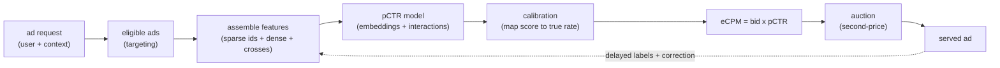

# Ads CTR Prediction

An interviewer rarely says "design a CTR model." They say **"a user loads a page,
we have a slot to fill, and an auction picks the winner. Design the system that
estimates how likely each ad is to be clicked, fast enough and calibrated enough
to set the price."** That is ads CTR prediction: the probabilistic heart of every
real-time ad auction. This chapter builds it end to end, and shows how Meta,
Google, Pinterest, LinkedIn, Twitter, Criteo, and Instacart actually ship it.

The single signal this interview tests: you know that **the predicted probability
is not used to sort, it is multiplied into a bid**. In pure ranking only the order
matters; here the number matters. Calibration is therefore not cosmetic, it is
load-bearing. State that before you draw a single box.

## Sections

1. [Clarifying the requirements](01-clarifying-requirements.md) - the dialogue that scopes the problem.
2. [Framing it as an ML task](02-frame-as-ml-task.md) - probability of click, input, output, and what makes this harder than ranking.
3. [Data preparation](03-data-preparation.md) - sparse ID features, feature hashing, delayed feedback, and label bias.
4. [Model development](04-model-development.md) - logistic regression to DLRM, DCN, and DeepFM; calibration; the "when to use which" table.
5. [Evaluation](05-evaluation.md) - AUC versus log loss, calibration metrics, and why calibration matters for bidding.
6. [Serving and scaling](06-serving-and-scaling.md) - low latency at huge QPS, embedding lookup bottlenecks, continuous training.
7. [How teams do it in production](07-how-teams-do-it-in-production.md) - named companies, the divergence table, and first-party links.
8. [Interview Q&A](08-interview-qa.md) - commonly asked, tricky, and commonly-answered-wrong, with clear answers.
9. [Summary](09-summary.md) - the one-page recap, mermaid, and self-test.

## The whole system on one page

Read the sections in order the first time; each opens with the question an
interviewer actually asks. The calibration thread runs through every section
because it is the design constraint that makes ads CTR prediction different from
every other ranking problem in this book.
