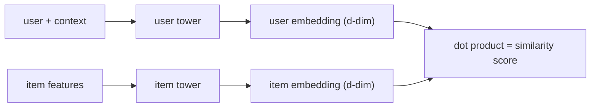

# 2. Framing it as an ML task

## Defining the ML objective

Users want a feed full of items they will engage with. We translate that into an
ML objective we can optimize: **learn a similarity function between a user and an
item, so that items the user engages with score higher than items they do not.**
If we have that function, retrieval becomes "find the items most similar to this
user."

## Specifying the input and output

The retrieval system takes a **user and their context** and returns a **ranked
short list of item IDs**. The trick, forced by the latency budget from the last
section, is that we do not compute user-item similarity by running a model over
every item at request time. Instead we split the model in two.

The **item embeddings do not depend on the user**, so we compute all 100 million
of them offline, once, and index them. At request time we only run the **user
tower** (one forward pass) and look up the nearest item embeddings. Online cost
drops from "score 100M items" to "one embedding plus a nearest-neighbor lookup."

## Choosing the right ML category

This is a **representation-learning / metric-learning** problem: we learn
embeddings such that a simple similarity (dot product or cosine) reflects
engagement. It is not a classification problem (we are not labeling items) and not
a regression problem (we do not need a calibrated score here, only a good
ranking). Framing it as "learn embeddings whose dot product ranks well" is what
lets us push similarity search onto a fast approximate-nearest-neighbor index.

**When to use which framing.**

| Reach for | When | Instead of |
|---|---|---|
| Two-tower (this chapter) | 100M+ items, tens-of-ms budget, user-independent item features | scoring every item online, which the latency budget forbids |
| A single cross-feature model (user and item together) | small catalog, or a re-ranking stage where you already have a few hundred items | retrieval at 100M scale, where it cannot meet latency |
| Graph or co-visitation retrieval | strong item-item signal (people who watched X watched Y) | learned embeddings alone, when behavioral graphs carry more signal than content |

The next section builds the training data that teaches these towers what
"similar" means.
