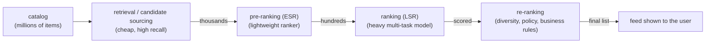
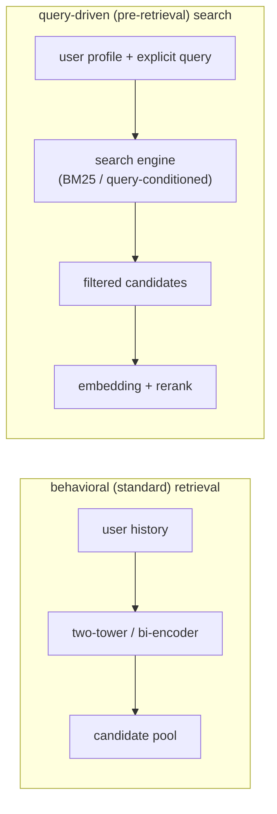
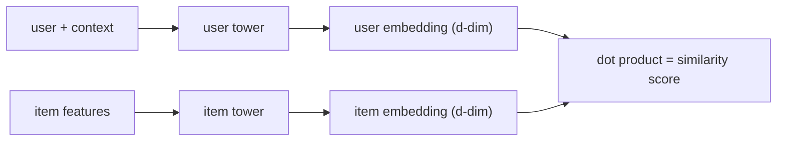

# 2. Framing it as an ML task

## Defining the ML objective

Users want a feed full of items they will engage with. We translate that into an
ML objective we can optimize: **learn a similarity function between a user and an
item, so that items the user engages with score higher than items they do not.**
If we have that function, retrieval becomes "find the items most similar to this
user."

## Where retrieval sits: the multi-stage funnel

Retrieval is the first stage of a **cascade**, and knowing the whole cascade is the
framing an interviewer wants. You cannot run a heavy model over millions of items per
request, so a large recommender narrows the candidate set in stages, each cheaper per
item than the next and each trusting the previous stage's recall.

- **Retrieval (candidate sourcing).** Turn millions into thousands, cheaply, with
  high recall. It usually fans out across several sources (a two-tower model, a
  graph or co-visitation source, trending, freshly created items) whose results are
  merged, so "retrieval" is often a union of retrievers, not one model.
- **Pre-ranking, or early-stage ranking (ESR).** A lightweight model narrows
  thousands to hundreds. Its job is not to be accurate in isolation but to keep the
  items the full ranker would have liked, so it is designed for **consistency** with
  the next stage (covered in the ranking chapter).
- **Ranking, or late-stage ranking (LSR).** The heavy multi-task model scores the
  few hundred survivors precisely, predicting several engagement events and combining
  them into one value.
- **Re-ranking.** A final policy layer on the top items: diversity, business rules,
  freshness, dedup, exploration, and whole-list objectives.

This chapter is the first stage. **Provenance.** The retrieval-then-ranking funnel
was popularized by YouTube's deep recommender (Covington et al., Google, 2016); the
distinct pre-ranking (ESR) stage was formalized in Alibaba's COLD (2020). A newer
alternative that compresses this cascade into a single large model, generative
recommendation, is covered in the [sequential-recommendation chapter](../sequential-recommendation/04-model-development.md).

## Two ways to source candidates: behavioral vs. query-driven

The retrieval stage itself has two distinct modes, and naming both is a strong
signal. They differ in where the intent signal comes from.

- **Behavioral (standard) retrieval.** The classic recommender path: match the
  user's history or embedding against item embeddings, with no explicit query. This
  is collaborative filtering and two-tower retrieval, and it *infers* intent from past
  actions.
- **Query-driven (pre-retrieval) search.** Inject an explicit query or search action
  into the context first, use a search engine (lexical BM25 or a query-conditioned
  retriever) to produce a filtered candidate set, then embed and rerank within that
  set. It *takes* an explicit intent signal (a typed query, a tapped category, a
  "more like this" action) and hard-filters the pool before embedding matching.

Use behavioral retrieval for a pure feed with no stated intent; reach for query-driven
search when there is an explicit query, or when you need hard constraints (category,
freshness, eligibility) that a pure embedding match cannot guarantee. Modern systems
increasingly do both, the convergence of search and recommendation: a query-driven
lexical source and a behavioral two-tower source feed the same funnel and are merged,
the same hybrid-retrieval idea as [BM25 plus dense fusion](../search-ranking/) on the
search side.

## Specifying the input and output

The retrieval system takes a **user and their context** and returns a **ranked
short list of item IDs**. The trick, forced by the latency budget from the last
section, is that we do not compute user-item similarity by running a model over
every item at request time. Instead we split the model in two.

The **item embeddings** (dense vectors of numbers that place similar users and items
near each other in the same space) **do not depend on the user**, so we compute all 100 million
of them offline, once, and index them. At request time we only run the **user
tower** (one forward pass) and look up the nearest item embeddings. Online cost
drops from "score 100M items" to "one embedding plus a nearest-neighbor lookup."

## Choosing the right ML category

This is a **representation-learning / metric-learning** problem: we learn
embeddings such that a simple similarity (dot product, the sum of the two vectors'
elementwise products, or cosine, that same product after scaling away vector length)
reflects engagement. It is not a classification problem (we are not labeling items) and not
a regression problem (we do not need a calibrated score here, only a good
ranking). Framing it as "learn embeddings whose dot product ranks well" is what
lets us push similarity search onto a fast approximate-nearest-neighbor index (ANN:
a structure that finds the closest vectors without checking every one, trading a
little accuracy for a large speedup).

**When to use which framing.**

| Reach for | When | Instead of |
|---|---|---|
| Two-tower (this chapter) | 100M+ items, tens-of-ms budget, user-independent item features | scoring every item online, which the latency budget forbids |
| A single cross-feature model (user and item together) | small catalog, or a re-ranking stage where you already have a few hundred items | retrieval at 100M scale, where it cannot meet latency |
| Graph or co-visitation retrieval | strong item-item signal (people who watched X watched Y) | learned embeddings alone, when behavioral graphs carry more signal than content |

**Provenance.** The two-tower framing comes from the DSSM two-tower model
(Microsoft, 2013), which learned separate query and document encoders sharing one
embedding space, and was popularized for large-corpus item retrieval by the
YouTube deep recommender (Google, 2016).

The next section builds the training data that teaches these towers what
"similar" means.
