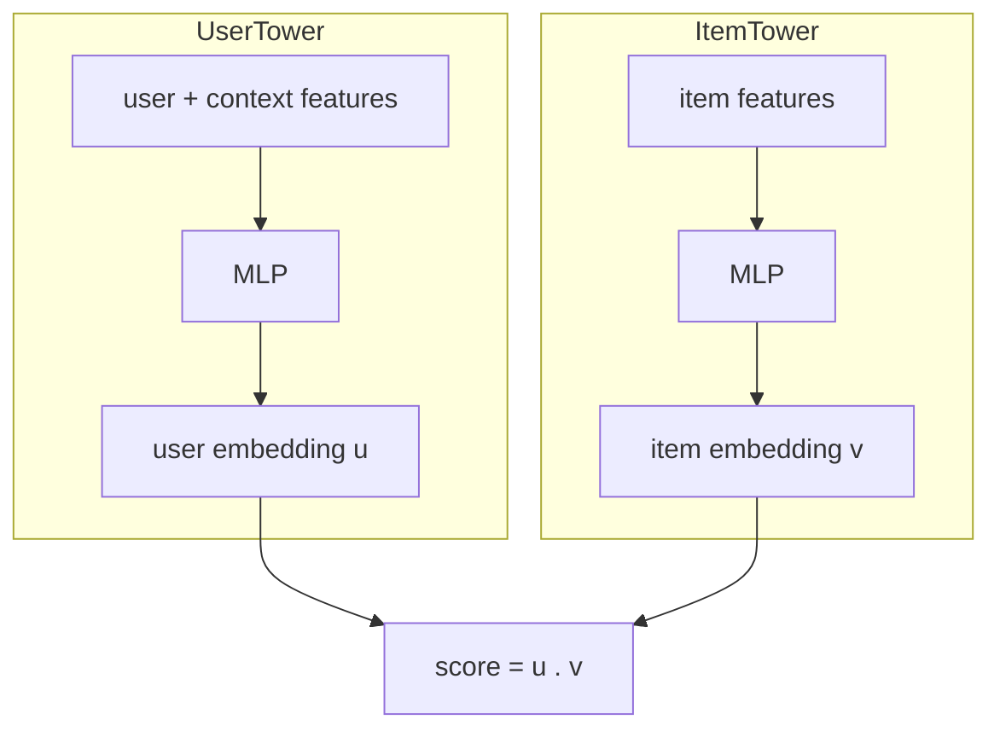

# 4. Model development

## Model selection: why two towers

We need item embeddings that do not depend on the user (so we can precompute
them) and a user embedding computed fresh per request. That is exactly a
**two-tower** model: two separate networks that map into the same embedding space,
joined only at the end by a dot product.

The two towers never see each other's inputs until the dot product, and that
restriction is the whole point: it is what makes the item side precomputable. A
model that mixed user and item features in early layers (a cross-network) would be
more accurate but would force you to score every item online, which the latency
budget forbids. Accuracy is traded for a factored, cacheable structure.

> **Open the validated graph.** Trace a two-tower retrieval model at real
> dimensions (embedding tables, tower MLPs, the dot-product head) in the live
> [Model Zoo](https://github.com/neurarch-ai/awesome-llm-model-zoo). Seeing where
> the two towers stay separate and where they join makes the precompute argument
> concrete.

## Training with in-batch negatives

We only logged positives, so where do negatives come from? From the batch itself.
In a batch of N positive (user, item) pairs, for a given user we treat the **other
N-1 items in the batch as negatives**. One matrix multiply gives all N-by-N
similarity scores, and we ask the model to make each user most similar to its own
positive item. This is cheap and scales with batch size.

The catch is **popularity bias**: popular items show up as in-batch negatives (and
positives) far more often, so the model over-penalizes or over-rewards them. The
**logQ correction** subtracts an estimate of each item's sampling probability from
its score, de-biasing the objective. Stating this correction unprompted is a
strong signal; it is the single most common thing candidates forget.

## The loss

We use a **sampled softmax / contrastive** loss: for each user, softmax over its
positive item against the in-batch negatives, then maximize the log-probability of
the positive.

$$\mathcal{L} = -\frac{1}{N}\sum_{i=1}^{N} \log \frac{\exp(u_i \cdot v_i - \log Q_i)}{\sum_{j=1}^{N} \exp(u_i \cdot v_j - \log Q_j)}$$

Here `u_i . v_j` is the score, and `log Q_j` is the logQ correction for item j.

**When to use which negative-sampling strategy.**

| Reach for | When | Instead of |
|---|---|---|
| In-batch negatives | large batches give enough diverse negatives cheaply | explicit negative sampling, which costs extra lookups |
| Hard-negative mining | the model confuses specific near-misses (same category, wrong item) | random negatives, which stop teaching once the model is decent |
| logQ / popularity correction | always, whenever negatives are sampled from a skewed catalog | an uncorrected softmax, which bakes in popularity bias |
| Full softmax over the catalog | never at 100M scale (it is the cost you are avoiding) | sampled softmax, which approximates it cheaply |
