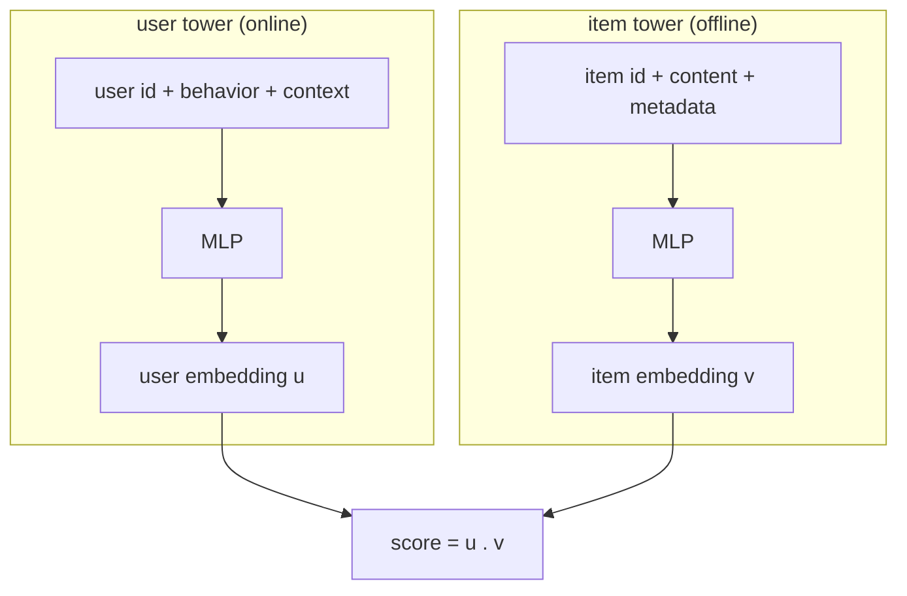
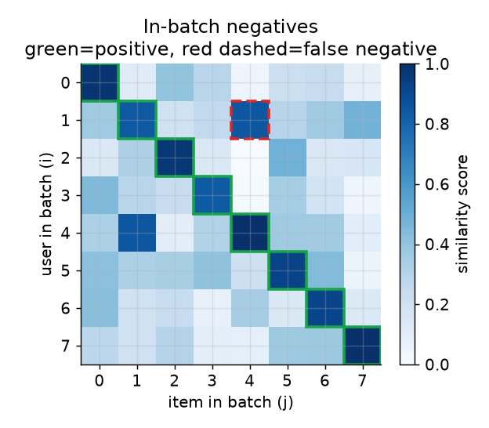
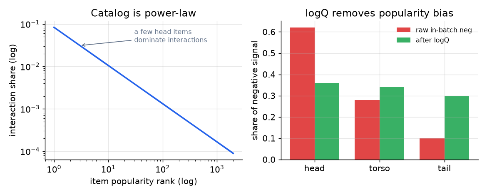

# 4. Model development

## Model selection: why two towers

We need item embeddings that do not depend on the user (so we can precompute
them) and a user embedding computed fresh per request. That is exactly a
**two-tower** model: two separate networks that map into the same embedding space,
joined only at the end by a dot product.



The two towers never see each other's inputs until the dot product, and that
restriction is the whole point: it is what makes the item side precomputable. A
model that mixed user and item features in early layers (a cross-network) would be
more accurate but would force you to score every item online, which the latency
budget forbids. **Accuracy is traded for a factored, cacheable structure**, and at
100M items that trade is the only thing that makes retrieval possible.

Two follow-ups an interviewer almost always asks here:

- **Do the towers share weights?** Reflex answer: "yes, to save parameters."
  Wrong. Users and items have different feature distributions, so the towers stay
  separate; the only thing they share is the output embedding space, enforced by
  the dot-product loss. Uber is the deliberate exception: it shares a UUID
  embedding layer so one global model can replace thousands of per-city models.
- **Dot product or cosine?** Dot product lets embedding **magnitude** carry
  popularity or quality signal; cosine normalizes it away. Airbnb reasons about
  this explicitly, since `u . v = |u| |v| cos(theta)`: if you want popular items to
  score higher for free, keep the magnitude; if you want pure semantic match,
  normalize.

> **Open the validated graph.** Trace a two-tower retrieval model at real
> dimensions (embedding tables, tower MLPs, the dot-product head) in the live
> [Model Zoo](https://github.com/neurarch-ai/awesome-llm-model-zoo). Seeing where
> the towers stay separate and where they join makes the precompute argument
> concrete.

## Training with in-batch negatives

We only logged positives, so where do negatives come from? From the batch itself.
In a batch of B positive (user, item) pairs, one matrix multiply gives all B-by-B
similarity scores. The diagonal holds the true positives; for each user, the
**off-diagonal items are treated as negatives**. We ask the model to make each
user most similar to its own item.



*Every row is a user, every column an item in the same batch. Green cells (the
diagonal) are the positives the model should score highest; the rest are free
negatives. The red dashed cell is a false negative: item 4 is actually something
user 1 also likes, but the batch labels it "negative."*

This is cheap and scales with batch size, but it has two well-known failure modes,
and naming both is a strong signal.

**1. Popularity bias.** Because the catalog is power-law, popular items appear as
in-batch negatives (and positives) far more often, so a plain softmax
over-penalizes head items. The fix is the **logQ correction**: subtract an estimate
of each item's sampling log-probability from its logit, so the embedding space
itself comes out unbiased. The estimate itself is a streaming one: track the average
number of steps between two hits of an item, and its sampling probability is the
reciprocal of that gap.

```python
import math
def estimate_logq(stream, alpha=0.01):      # stream: item ids in the order the trainer samples them
    A, last = {}, {}                         # A[y]: moving-average gap between hits of y; last[y]: last step
    for t, y in enumerate(stream):
        gap = t - last.get(y, 0)
        A[y] = (1 - alpha) * A.get(y, 0.0) + alpha * gap   # EMA of steps between consecutive hits
        last[y] = t
    # sampling prob q(y) = 1 / average-gap, so log q(y) = -log A[y]; frequent items get a larger value
    return {y: -math.log(A[y]) for y in A if A[y] > 0}
# estimate_logq(['a', 'a', 'a'], alpha=0.5) -> {'a': 0.288}  (average gap 0.75, -log(0.75) ~ 0.288)
```



*Left: interactions follow a power law, so a handful of head items dominate.
Right: without correction, head items soak up most of the negative signal (red);
the logQ term flattens their contribution (green). Illustrative shares.*

**2. False negatives from batch composition.** If a batch is request-sorted or
user-concentrated, a user's own other engaged items land in the same batch and get
scored as negatives. Pinterest measured this false-negative rate rising from near
0% to about **30%**, and fixed it with **user-level masking** (exclude same-user
items from the denominator), not by simply enlarging the batch.

## The loss, and its production variants

The base loss is a sampled softmax: for each user, softmax its positive against the
in-batch items.

$$L = -\frac{1}{B}\sum_{i=1}^{B} \log \frac{e^{\, s(x_i, y_i)}}{\sum_{j=1}^{B} e^{\, s(x_i, y_j)}}, \qquad s(x_i, y_j) = u(x_i)^{\top} v(y_j)$$

In code the whole thing is a few lines: one matrix multiply gives the B-by-B score
matrix, and the positive for each user is the diagonal, so the loss is just a
cross-entropy against `arange(B)`.

```python
# u, v: (B, d) user and item embeddings for one batch of B positive pairs
# log_q: (B,) estimated log sampling probability of each item (for the correction)
logits = u @ v.T                    # (B, B): logits[i, j] = score(user i, item j)
logits = logits - log_q.view(1, B)  # logQ correction, subtracted on the item axis
labels = torch.arange(B)            # user i's positive is item i (the diagonal)
loss = F.cross_entropy(logits, labels)   # softmax over the row = over in-batch items
```

The `- log_q` line is the entire logQ correction, and dropping the `labels`
diagonal from the denominator (not shown) is the user-level masking fix. Seeing
that the correction is one subtraction, applied to the training logits and never at
serving, is what the interview is really checking.

Real systems adjust this in three recurring ways:

- **logQ-corrected logit** (YouTube, Expedia): subtract the sampling term,
  turning the score into `u(x_i) . v(y_j) - log Q(y_j)`, which removes popularity
  bias at training time.
- **Temperature-scaled cosine InfoNCE** (Snap): normalize to cosine and divide by
  a temperature `tau`, which sharpens the contrast between positives and negatives.
- **User-level masked InfoNCE** (Pinterest): drop same-user items from the
  denominator so a user's own items are never counted as negatives.

**When to use which negative-sampling strategy.**

| Reach for | When | Instead of |
|---|---|---|
| In-batch softmax with logQ correction (YouTube, Expedia) | catalog is popularity-skewed and you want the embedding space itself unbiased | raw in-batch negatives that penalize head items |
| Temperature-scaled cosine InfoNCE (Snap) | magnitude should not carry signal and you want sharper contrast | plain dot-product softmax when scale drifts across items |
| User-level masked InfoNCE (Pinterest) | request-sorted or user-concentrated batches push false negatives toward 30% | plain softmax that scores a user's own items as negatives |
| Hard-negative mining (Etsy, Snap) | easy negatives stopped teaching and boundary cases decide quality | only in-batch negatives, which get too easy |
| Journey seen-not-booked negatives (Airbnb) | an impression inside a search session is a more informative negative than a random item | random negatives that ignore intent context |
| Full softmax over the catalog | never at 100M scale (it is the cost you are avoiding) | sampled softmax, which approximates it cheaply |

**Provenance.** The two-tower structure these losses train comes from the DSSM
two-tower model (Microsoft, 2013), and in-batch sampled softmax with logQ
correction entered wide practice through the YouTube deep recommender (Google,
2016), which is where the sampling-bias correction for popularity-skewed catalogs
was popularized.
