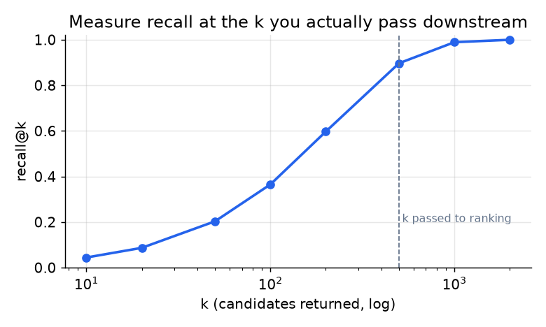

# 5. Evaluation

Retrieval is judged differently from ranking, and using the wrong metric is a
classic mistake. Retrieval's job is recall, so measure recall.

## Offline metric: recall@k at the k you actually pass

Of the items the user actually engaged with (held out into the future), what
fraction appear in the top k retrieved? That is the primary metric, because
retrieval only has to get good items into the candidate set that ranking then
sorts.

$$\text{Recall@k} = \frac{1}{|U|}\sum_{u \in U} \frac{|\text{retrieved}_k(u) \cap \text{relevant}(u)|}{|\text{relevant}(u)|}$$

```python
import numpy as np
def recall_at_k(retrieved, relevant, k):
    # retrieved: item ids in predicted-rank order for one user; relevant: that user's truly relevant ids
    hits = len(set(retrieved[:k]) & set(relevant))    # relevant items that appear in the top k
    return hits / len(relevant) if relevant else 0.0  # per-user recall
def mean_recall_at_k(retrieved_per_user, relevant_per_user, k):
    per_user = [recall_at_k(r, rel, k) for r, rel in zip(retrieved_per_user, relevant_per_user)]
    return float(np.mean(per_user))                   # average over all users, as in the formula
# mean_recall_at_k([[5, 2, 9, 1]], [{2, 7, 1}], k=3)  ->  0.3333333333333333  (only item 2 hits in top-3)
```

The subtlety is the choice of k. Recall rises with k and eventually flattens;
you must evaluate at the k you actually hand downstream (a few hundred to a couple
thousand), not at k=10, or you optimize the wrong operating point.



*Recall climbs with k and saturates. Tuning retrieval to look great at k=10 is
pointless if you pass 500 candidates to ranking; measure at the k that matters.*

Two more offline rules:

- **Use a time-based split, not a random split.** Hold out future interactions and
  evaluate whether today's model retrieves them. A random split leaks the future
  and flatters the model.
- **Do not headline precision here.** A retrieved set of a few hundred is mostly
  "not yet judged," so precision is low by construction and misleading. Precision
  belongs to the ranking stage.

## Online metrics

Offline recall is necessary but not sufficient; a launch is decided online.

- **Engagement rate** of the final feed (click-through, dwell), since retrieval
  changes what ranking even sees.
- **Coverage and diversity.** Does retrieval surface the long tail, or collapse to
  popular items? A recall win that shrinks catalog coverage often loses long-term.

Catalog coverage has a one-line form: the fraction of the catalog that shows up
across all users' retrieved sets.

```python
def coverage(retrieved_per_user, catalog_size):
    # retrieved_per_user: list of retrieved-item-id lists, one per user
    shown = set()
    for items in retrieved_per_user:
        shown.update(items)               # collect every distinct item retrieval ever surfaces
    return len(shown) / catalog_size      # fraction of the catalog that reaches at least one user
# coverage([[1, 2], [2, 3]], catalog_size=10)  ->  0.3   (items {1, 2, 3} of 10 surfaced)
```

- **New-item retrievability.** The fraction of fresh items retrieved within
  minutes, tied directly to the freshness requirement.

## When to use which metric

| Reach for | When | Instead of |
|---|---|---|
| Recall@k (at the downstream k) | judging the retrieval stage in isolation | precision@k, which belongs to ranking |
| Coverage and diversity | you suspect popularity collapse | recall alone, which can improve while diversity craters |
| Time-based split | any offline retrieval eval | a random split, which leaks the future |
| Online engagement A/B | the final launch decision | offline recall alone, which misses the ranking interaction |

The guardrail to state out loud: an offline recall gain must survive an online
A/B against engagement **and** coverage before it ships, because retrieval that
only resurfaces popular items can win recall and lose the product.

**Tools.** End-to-end Recall@k is measured by loading the item vectors into a real ANN index (FAISS (Meta), ScaNN (Google), hnswlib, or Annoy (Spotify)) and querying at the k you actually forward, so the number reflects the approximate index rather than a brute-force ideal. TorchMetrics provides RetrievalRecall for the aggregation, and coverage or diversity is a short pandas groupby over the retrieved sets. The time-based split is a pandas or SQL cut on interaction timestamps, and the final online A/B leans on the platform's experiment stack.

**Worked example.** A marketplace evaluating a new retrieval tower measures Recall@k at the few-hundred k it actually hands to ranking (not Recall@10), computed against a FAISS index so the metric includes approximate-search loss, and it does not headline precision because the retrieved set is mostly unjudged. It uses a time-based split, holding out future interactions, since a random split would leak the future and flatter the model. Before trusting the recall gain, it checks coverage and diversity, because a tower that just resurfaces popular items can lift recall while collapsing the catalog. The launch is gated on an online A/B that must clear on engagement and coverage together, not offline recall alone.

## The metrics matrix: offline vs online, component vs end-to-end

The metrics above sort onto two axes: offline (replayed on logged interactions) versus
online (measured on live traffic), and component (the retrieval tower in isolation)
versus end-to-end (the retrieve-then-rank feed the user sees).

| | Offline | Online |
|---|---|---|
| **Component metric** | Recall@k against the ANN index, plus coverage and diversity of the retrieved set | Per-query ANN latency and new-item retrievability for the retrieval service |
| **End-to-end metric** | Golden-set score: replay held-out sessions through the full retrieve-then-rank stack and score the final feed | A/B test on engagement and catalog coverage for the whole system |

A component metric localizes a regression (Recall@k dropped, so the tower changed);
only the online end-to-end metric justifies a launch.
