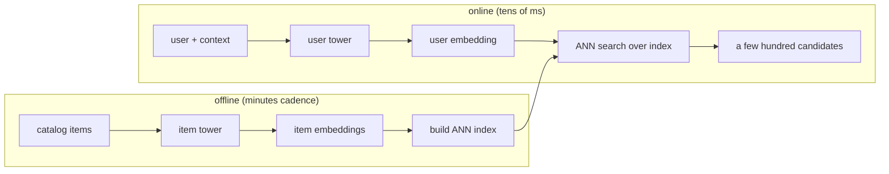

# 6. Serving and scaling

## The two paths: offline indexing and online query

The design splits cleanly into a batch path that prepares embeddings and an online
path that answers a request in tens of milliseconds.

## Approximate nearest neighbor

We cannot compare the user embedding to 100 million item embeddings exactly in
tens of milliseconds, so we use **approximate nearest neighbor (ANN)** search,
which trades a little recall for a large speedup.

**When to use which index.**

| Reach for | When | Instead of |
|---|---|---|
| HNSW | best recall-at-latency, memory to spare | flat search, which is exact but too slow at 100M |
| IVF-PQ (inverted file + product quantization) | memory-constrained, huge catalog | HNSW, when its memory footprint does not fit |
| Flat / brute force | small catalog or an offline recall ceiling to compare against | ANN, which you only need at scale |

## Freshness and the funnel

- **Item freshness.** New items must be retrievable in minutes, so the offline
  path re-embeds and upserts new items into the index on a minutes cadence, not a
  nightly rebuild. Content features (not the untrained ID embedding) carry cold
  items until they gather interactions.
- **The funnel.** Retrieval hands a few hundred candidates to ranking, which sorts
  them for the user. Retrieval optimizes recall cheaply; ranking optimizes
  precision expensively. Keeping that division of labor is the whole reason the
  system meets latency at 100M scale.
- **Multiple retrieval sources.** In practice you union several retrievers (a
  two-tower embedding source, a co-visitation source, a fresh-items source) and
  let ranking sort the merged pool. Each source covers a different failure mode of
  the others.

## Bottlenecks

| Bottleneck | First sign | Fix | Tradeoff |
|---|---|---|---|
| ANN recall too low | good offline recall, poor online engagement | raise HNSW search depth, tune IVF probes | more latency per query |
| Stale index | new items never retrieved | minutes-cadence upserts | more indexing infra |
| Popularity collapse | coverage drops, tail starved | logQ correction, diversity source | slightly lower raw recall |
| Embedding drift | recall decays after retrains | version and re-index user and item towers together | coordinated redeploys |
