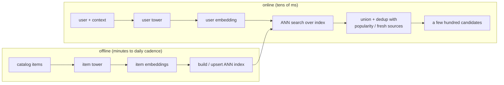
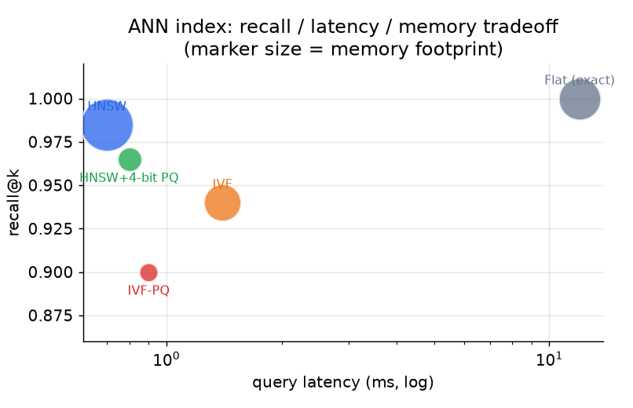

# 6. Serving and scaling

## The two paths: offline indexing and online query

The design splits cleanly into a batch path that prepares embeddings and an online
path that answers a request in tens of milliseconds. This split is the whole
reason two towers exist.

## Approximate nearest neighbor: the index is the design

We cannot compare the user embedding to 100 million item embeddings exactly in
tens of milliseconds, so we use **approximate nearest neighbor (ANN)** search,
which trades a little recall for a large speedup. The index choice is not a
default; it is a three-way tradeoff between recall, latency, and memory, and each
real system lands somewhere different based on catalog churn and filtering needs.

*Flat search is exact but too slow at 100M items. HNSW gives the best recall per
millisecond but costs the most memory (Snap, Spotify's Voyager). IVF trades some
recall for cheap filtering and easy updates (Airbnb). Product quantization (PQ)
shrinks memory by a large factor at some recall cost (Etsy's HNSW with 4-bit PQ).
Marker size is memory footprint. Illustrative.*

**When to use which index.**

| Reach for | When | Instead of |
|---|---|---|
| HNSW (Snap, Spotify) | catalog is stable, memory is available, top recall per latency matters | IVF, when you have no hard filters or heavy churn |
| IVF centroids (Airbnb) | items churn on price and availability and geo filters must run cheap | HNSW, whose rebuild cost cannot absorb frequent updates |
| HNSW with 4-bit PQ (Etsy) | the index must fit memory at large N | full-precision vectors that blow the memory budget |
| Flat / brute force | small catalog, or an offline recall ceiling to compare against | ANN, which you only need at scale |

The Airbnb case is the one to remember: everyone defaults to HNSW, but Airbnb
chose **IVF** because HNSW's rebuild cost could not absorb price and availability
updates, and geo filters ran poorly over graph traversal. IVF turns a filter into
cheap cluster selection. Match the index to update rate, filtering, and memory,
not to a default.

## Freshness and the funnel

- **Item freshness.** A new item is invisible until it is re-embedded and upserted
  into the index, so the cadence is a product decision: Airbnb's daily batch versus
  Snap's few-hours refresh reflect different item churn, not implementation trivia.
  Content features (not the untrained ID embedding) carry cold items until they
  gather interactions.
- **User freshness.** The user tower runs online, so the user side is always fresh;
  only the item index lags.
- **The funnel.** Retrieval hands a few hundred candidates to ranking, which sorts
  them. Retrieval optimizes recall cheaply; ranking optimizes precision
  expensively. Keeping that division of labor is why the system meets latency at
  100M scale.
- **Multiple retrieval sources.** In practice you union several retrievers (the
  personalized two-tower source, a popularity source, a fresh-items source) and let
  ranking sort the merged pool. Each source covers a different failure mode of the
  others.

## Bottlenecks

| Bottleneck | First sign | Fix | Tradeoff |
|---|---|---|---|
| ANN recall too low | good offline recall, poor online engagement | raise HNSW search depth or IVF probes | more latency per query |
| Stale index | new items never retrieved | minutes-cadence upserts | more indexing infra |
| Popularity collapse | coverage drops, tail starved | logQ correction, diversity source | slightly lower raw recall |
| Embedding drift | recall decays after retrains | version and re-index user and item towers together | coordinated redeploys |
| Batch false negatives | training loss plateaus, recall stalls | user-level masking of same-user items | small extra bookkeeping |
