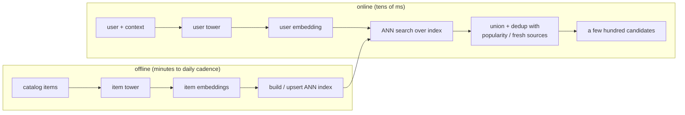
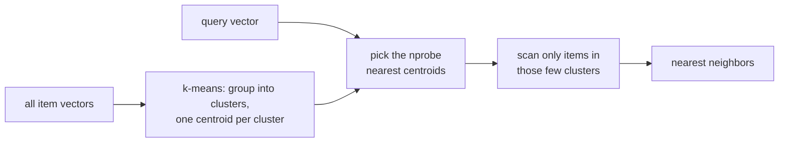

# 6. Serving and scaling

## The two paths: offline indexing and online query

The design splits cleanly into a batch path that prepares embeddings and an online
path that answers a request in tens of milliseconds. This split is the whole
reason two towers exist.

**How it works.** The offline path runs on a batch cadence: every catalog item
passes through the item tower to produce an embedding, and those embeddings are
written into an ANN index that is built or upserted in place. The online path runs
per request: the user plus context features go through the user tower to produce a
single query embedding. The two paths meet at the ANN search node, where the
freshly computed user vector queries the prebuilt item index. The nearest neighbors
are then unioned and deduplicated with popularity and freshness sources, yielding a
few hundred candidates. Splitting the work this way is what lets item embeddings be
computed once and reused across every request.

## Approximate nearest neighbor: the index is the design

We cannot compare the user embedding to 100 million item embeddings exactly in
tens of milliseconds, so we use **approximate nearest neighbor (ANN)** search,
which trades a little recall for a large speedup. The index choice is not a
default; it is a three-way tradeoff between recall, latency, and memory, and each
real system lands somewhere different based on catalog churn and filtering needs.

*Flat search is exact but too slow at 100M items. HNSW gives the best recall per
millisecond but costs the most memory (Snap, Spotify's Voyager). IVF trades some
recall for cheap filtering and easy updates (Airbnb). Product quantization (PQ)
shrinks memory by a large factor at some recall cost (Etsy's HNSW with 4-bit PQ).
Marker size is memory footprint. Illustrative.*

**When to use which index.**

| Reach for | When | Instead of |
|---|---|---|
| HNSW (Snap, Spotify) | catalog is stable, memory is available, top recall per latency matters | IVF, when you have no hard filters or heavy churn |
| IVF centroids (Airbnb) | items churn on price and availability and geo filters must run cheap | HNSW, whose rebuild cost cannot absorb frequent updates |
| HNSW with 4-bit PQ (Etsy) | the index must fit memory at large N | full-precision vectors that blow the memory budget |
| Flat / brute force | small catalog, or an offline recall ceiling to compare against | ANN, which you only need at scale |

**Provenance.** HNSW as a navigable-small-world graph index comes from Malkov and
Yashunin (2016); the IVF and product-quantization building blocks are popularized
through FAISS (Meta), with ScaNN (Google) and Annoy (Spotify) as the other widely
used ANN libraries these indexes are drawn from.

The Airbnb case is the one to remember: everyone defaults to HNSW, but Airbnb
chose **IVF** because HNSW's rebuild cost could not absorb price and availability
updates, and geo filters ran poorly over graph traversal. IVF turns a filter into
cheap cluster selection. Match the index to update rate, filtering, and memory,
not to a default.

Concretely, IVF (inverted file index) groups the item vectors into clusters up
front, then at query time only scans the few clusters nearest the query instead of
the whole catalog:

## Maximum inner product search is not metric search

One assumption hides under "ANN search," and getting it wrong quietly costs recall
even with a perfect index. The two-tower head scores by inner product, so retrieval
is **maximum inner product search (MIPS)**, and MIPS is not a metric
nearest-neighbor problem. Inner product has no triangle inequality, and a vector is
not its own nearest neighbor: a longer item vector can out-score a query's own exact
match, purely on magnitude. Graph and tree indexes whose correctness intuition comes
from metric spaces (HNSW's small-world navigation, IVF's k-means cells) therefore
lose their guarantees on raw inner products. There are two standard fixes. Normalize
every vector to unit length, which turns MIPS into cosine and hence into Euclidean
nearest neighbor (same ranking order), accepting that you discard the magnitude
signal Airbnb deliberately kept. Or apply an asymmetric augmentation that appends
extra coordinates to the item vectors so that plain Euclidean nearest neighbor in the
augmented space recovers the inner-product order (Bachrach et al., Microsoft, 2014;
Shrivastava and Li, 2014; Neyshabur and Srebro, 2015). This is why FAISS and ScaNN
expose an explicit inner-product-vs-L2 metric flag: choosing the wrong one silently
degrades recall no matter how well the index is tuned.

Quantization has the same MIPS-vs-L2 split. Product quantization (Jegou, Douze, and
Schmid, 2011) compresses vectors by splitting each into subvectors and replacing each
subvector with the id of its nearest centroid from a small per-subspace codebook, so
a 128-dim float vector becomes a handful of bytes and distances are read from
precomputed lookup tables (this is the PQ in Etsy's HNSW-with-4-bit-PQ). ScaNN (Guo
et al., Google, 2020) sharpens this for MIPS specifically: instead of minimizing raw
reconstruction error, its score-aware anisotropic loss penalizes the component of
quantization error that is parallel to the datapoint far more than the orthogonal
component, because for inner-product ranking it is the parallel error that shifts the
score while orthogonal error largely cancels. The quantizer is thus tuned to preserve
inner-product order rather than L2 reconstruction, which is why ScaNN tends to win
recall-per-byte over plain PQ on MIPS workloads.

## Freshness and the funnel

- **Item freshness.** A new item is invisible until it is re-embedded and upserted
  into the index, so the cadence is a product decision: Airbnb's daily batch versus
  Snap's few-hours refresh reflect different item churn, not implementation trivia.
  Content features (not the untrained ID embedding) carry cold items until they
  gather interactions.
- **User freshness.** The user tower runs online, so the user side is always fresh;
  only the item index lags.
- **The funnel.** Retrieval hands a few hundred candidates to ranking, which sorts
  them. Retrieval optimizes recall cheaply; ranking optimizes precision
  expensively. Keeping that division of labor is why the system meets latency at
  100M scale.
- **Multiple retrieval sources.** In practice you union several retrievers (the
  personalized two-tower source, a popularity source, a fresh-items source) and let
  ranking sort the merged pool. Each source covers a different failure mode of the
  others.

## Bottlenecks

| Bottleneck | First sign | Fix | Tradeoff |
|---|---|---|---|
| ANN recall too low | good offline recall, poor online engagement | raise HNSW search depth or IVF probes | more latency per query |
| Stale index | new items never retrieved | minutes-cadence upserts | more indexing infra |
| Popularity collapse | coverage drops, tail starved | logQ correction, diversity source | slightly lower raw recall |
| Embedding drift | recall decays after retrains | version and re-index user and item towers together | coordinated redeploys |
| Batch false negatives | training loss plateaus, recall stalls | user-level masking of same-user items | small extra bookkeeping |

**Details.** ANN-recall-too-low is a search-time knob, not a training bug: HNSW
(Malkov and Yashunin, 2016) trades recall for latency through efSearch (how many
graph neighbors are explored per query), and IVF through nprobe (how many centroid
lists are scanned), so the fix is a config change and re-benchmark, never a
re-train. Batch false negatives arise because in-batch sampled softmax treats every
other item in the minibatch as a negative, so two positives from the same user
collide in the denominator; the two-tower recipe popularized by the YouTube deep
recommender (Google, 2016) counters the induced popularity bias with a logQ
correction applied to the training logits, and user-level masking removes the
same-user collisions on top of that.
