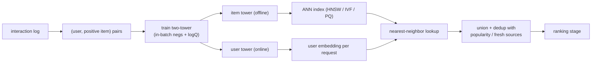

# 9. Summary

## One-page recap

- **Retrieval is a recall problem.** Get the good items into a few hundred
  candidates, cheaply; ranking handles precision.
- **The latency budget forces a two-tower model.** Item embeddings are
  user-independent, so precompute all 100M offline and index them; run only the
  user tower online, then do an ANN lookup. Early feature crossing is forbidden
  because it would kill the precompute.
- **The leverage is in the negatives and the index, not the tower.** Train with
  in-batch negatives plus the logQ correction (removes popularity bias at training
  time), and add user-level masking when batches are user-concentrated. Forgetting
  the correction, or applying it at serving, is the most common mistake.
- **The ANN index is a recall / latency / memory tradeoff.** HNSW for stable
  catalogs, IVF for churn and filters, product quantization to fit memory. Match it
  to the catalog, not to a default.
- **Freshness is a minutes-cadence upsert**, and cold items ride on content
  features until their ID embedding trains.
- **Evaluate with Recall@k at the downstream k on a time-based split**, then gate
  the launch on online engagement and coverage, not offline recall alone.

## The system on one page

**How it works.** Interaction logs are turned into (user, positive item) pairs,
which train the two-tower model with in-batch negatives and the logQ correction.
Training yields two separate encoders: the item tower is applied offline to embed
the whole catalog into an ANN index (HNSW, IVF, or PQ), while the user tower is
applied online to embed each incoming request. At serving time the per-request user
embedding and the prebuilt item index meet at the nearest-neighbor lookup, which
returns the closest items. Those are unioned and deduplicated with popularity and
fresh-content sources, and the merged set is handed to the ranking stage that
produces the final order.

## Test yourself

1. Why does the two-tower structure make item embeddings cacheable, and a
   cross-network not?
2. What exactly does the logQ correction subtract, at which stage, and what bias
   does it remove?
3. At what k should you measure recall, and why does the choice of k matter?
4. When would you pick IVF over HNSW, and when HNSW with product quantization?
5. Why can an offline recall win still fail an online A/B?
6. How does user-level masking fix the in-batch false-negative problem, and why is
   a bigger batch not the fix?

## Further reading

- Dense reference (comparison, math, all case studies): [topics/01-candidate-retrieval.md](../../topics/01-candidate-retrieval.md).
- Per-company teardowns: [CASE-TEARDOWNS.md](../../CASE-TEARDOWNS.md).
- Trace a two-tower graph live: [Model Zoo](https://github.com/neurarch-ai/awesome-llm-model-zoo).
