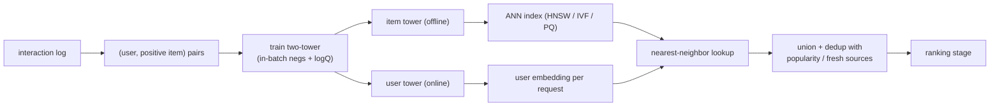

# 9. Summary

## One-page recap

- **Retrieval is a recall problem.** Get the good items into a few hundred
  candidates, cheaply; ranking handles precision.
- **The latency budget forces a two-tower model.** Item embeddings are
  user-independent, so precompute all 100M offline and index them; run only the
  user tower online, then do an ANN lookup. Early feature crossing is forbidden
  because it would kill the precompute.
- **The leverage is in the negatives and the index, not the tower.** Train with
  in-batch negatives plus the logQ correction (removes popularity bias at training
  time), and add user-level masking when batches are user-concentrated. Forgetting
  the correction, or applying it at serving, is the most common mistake.
- **The ANN index is a recall / latency / memory tradeoff.** HNSW for stable
  catalogs, IVF for churn and filters, product quantization to fit memory. Match it
  to the catalog, not to a default.
- **Freshness is a minutes-cadence upsert**, and cold items ride on content
  features until their ID embedding trains.
- **Evaluate with Recall@k at the downstream k on a time-based split**, then gate
  the launch on online engagement and coverage, not offline recall alone.

## The system on one page

```mermaid
flowchart LR
  LOG["interaction log"] --> PAIRS["(user, positive item) pairs"]
  PAIRS --> TRAIN["train two-tower<br/>(in-batch negs + logQ)"]
  TRAIN --> IT["item tower (offline)"]
  TRAIN --> UT["user tower (online)"]
  IT --> IDX["ANN index (HNSW / IVF / PQ)"]
  UT --> Q["user embedding per request"]
  IDX --> ANN["nearest-neighbor lookup"]
  Q --> ANN
  ANN --> UNION["union + dedup with<br/>popularity / fresh sources"]
  UNION --> RANK["ranking stage"]
```

**How it works.** Interaction logs are turned into (user, positive item) pairs,
which train the two-tower model with in-batch negatives and the logQ correction.
Training yields two separate encoders: the item tower is applied offline to embed
the whole catalog into an ANN index (HNSW, IVF, or PQ), while the user tower is
applied online to embed each incoming request. At serving time the per-request user
embedding and the prebuilt item index meet at the nearest-neighbor lookup, which
returns the closest items. Those are unioned and deduplicated with popularity and
fresh-content sources, and the merged set is handed to the ranking stage that
produces the final order.

## Test yourself

Answers are collapsed. Attempt each question before opening one.

1. Why does the two-tower structure make item embeddings cacheable, and a
   cross-network not?

   

Answer

   Because in a two-tower model the user and the item meet **only at the final dot
   product**, so an item embedding is a function of item features alone and does not
   depend on who is asking. That lets you run the item tower over all 100M items
   offline, once, write the vectors into an ANN index, and pay only one user-tower
   forward pass plus one lookup per request, a cost that is roughly independent of
   catalog size. A cross-network crosses user and item features from the first layer
   onward, so its score is a joint function of the pair: nothing on the item side can
   be precomputed and every (user, item) pair needs its own forward pass, making cost
   linear in N. The price of the factored structure is a lower accuracy ceiling,
   since a single dot product limits what the model can express about the pair.
   That is exactly why the funnel uses the bi-encoder over the full catalog and a
   cross-encoder over the few hundred survivors rather than picking a winner
   (sections [2](02-frame-as-ml-task.md) and [4](04-model-development.md)).

   

2. What exactly does the logQ correction subtract, at which stage, and what bias
   does it remove?

   

Answer

   It subtracts $\log Q(y_j)$, the estimated log sampling probability of item $y_j$,
   from that item's logit, during **training only**, giving the corrected score
   `u(x_i) . v(y_j) - log Q(y_j)`. The bias it removes is **popularity bias in the
   sampled softmax**: in-batch negatives are other users' positives, so items appear
   in proportion to popularity, and the denominator systematically over-counts head
   items and pushes their embeddings away from queries they actually match. The
   correction is not a knob but the standard importance-sampling fix, equivalent to
   reweighting each sampled negative by `1 / Q(y)` inside the exponential so that in
   expectation the sampled denominator equals the true full-corpus denominator. The
   `Q(y)` estimate itself is streaming: track an EMA of the gap in steps between two
   hits of an item, and its sampling probability is the reciprocal of that average
   gap, so no static frequency table is needed for a catalog that churns daily. Never
   apply it at serving: there is no softmax and no sampling there, only a raw inner
   product over the index, and re-adding the term would inject an anti-popularity
   distortion the model never learned. See
   [4](04-model-development.md) and the trap in [8](08-interview-qa.md).

   

3. At what k should you measure recall, and why does the choice of k matter?

   

Answer

   Measure at **the k you actually hand to ranking**, a few hundred to a couple
   thousand, not at k=10. Recall climbs with k and eventually saturates, so a number
   read off a small k describes an operating point the system never runs at, and
   tuning to it optimizes the wrong thing. Two conditions go with the choice. First,
   measure through the same approximate index you serve (FAISS, ScaNN, hnswlib,
   Annoy), because brute-force recall flatters the system by hiding the few points
   the ANN search loses on its own. Second, use a time-based split that holds out
   future interactions, since a random split leaks the future. And do not headline
   precision here: a retrieved set of a few hundred is mostly unjudged, so precision
   is low by construction and belongs to ranking. Sections
   [5](05-evaluation.md) and [10](10-putting-it-together.md).

   

4. When would you pick IVF over HNSW, and when HNSW with product quantization?

   

Answer

   Pick **IVF when items churn hard or hard filters must run cheap**, which is
   Airbnb's case: listings change on price and availability, and HNSW's rebuild cost
   could not absorb the updates while geo filters ran poorly over graph traversal.
   The structural reason is what an update touches. An HNSW insert or delete mutates
   a navigable graph whose search quality depends on carefully maintained neighbor
   lists, and deletions are usually tombstoned rather than removed, whereas an IVF
   update is appending or dropping a vector in a cluster's posting list, and a filter
   becomes "scan only the eligible lists" instead of repeatedly hitting filtered-out
   nodes mid-traversal. Pick **HNSW with product quantization when the catalog is
   mostly stable and you want top recall per millisecond, but the index must fit
   memory at large N**, which is Etsy's 4-bit PQ (+5.58% purchase rate). The
   arithmetic is why: 100M vectors at 128 dimensions in float32 is about 51 GB of raw
   vectors before graph overhead, while 4-bit PQ stores each dimension in half a byte,
   64 bytes per vector, about 6.4 GB, an 8x reduction. Quantization costs some recall,
   so measure the quantized index against exact search on a held-out query set before
   shipping it. Sections [6](06-serving-and-scaling.md) and
   [10](10-putting-it-together.md).

   

5. Why can an offline recall win still fail an online A/B?

   

Answer

   The usual cause is **popularity collapse**: the model starts resurfacing head
   items, which lifts raw recall while shrinking coverage and diversity, so the feed
   feels generic and engagement drops. The offline metric is complicit in this, which
   is what makes it hard to catch. The future hold-out is itself popularity-skewed,
   so a model that leans into the head hits more hold-out labels and recall@k rises
   even as the lived experience narrows: the metric and the failure share a cause. A
   second, more mechanical version is the train-vs-ANN gap, where exact dot-product
   recall looks good offline but the served approximate index misses, which is why
   you measure through the real index. Diagnose with coverage and tail metrics and
   verify the logQ correction is actually applied, then gate the launch on online
   engagement **and** catalog coverage together, since a recall win that starves the
   tail usually loses long-term. Sections [5](05-evaluation.md) and
   [8](08-interview-qa.md).

   

6. How does user-level masking fix the in-batch false-negative problem, and why is
   a bigger batch not the fix?

   

Answer

   **User-level masking drops same-user items from the softmax denominator**, so a
   user's own other engaged items in the batch are never scored as negatives. The
   problem appears when batches are request-sorted or user-concentrated: two positives
   from the same user collide in the denominator, and Pinterest measured the in-batch
   false-negative rate rising from near 0% to about **30%**. Each false negative is a
   gradient with the wrong sign, actively pushing an item the user engaged with away
   from that user's embedding, so recall drops on exactly the look-alike items you
   wanted. A bigger batch makes it worse, not better: scaling B raises the chance that
   any given user's other positives co-occur in the same batch, so the corruption
   grows with the very knob you turned for more free negatives. The masking fix costs
   only a little extra bookkeeping, and it is orthogonal to the logQ correction, which
   addresses popularity skew rather than same-user collisions. Sections
   [4](04-model-development.md), [6](06-serving-and-scaling.md), and
   [8](08-interview-qa.md).

   

## Further reading

- The capstone: [the complete build](10-putting-it-together.md), where every
  choice in this chapter is committed once for the scenario, sized, rebuilt
  under two other constraint sets, and compressed into a runnable one-file
  two-tower retriever.
- Dense reference (comparison, math, all case studies): [topics/01-candidate-retrieval.md](../../topics/01-candidate-retrieval.md).
- Per-company teardowns: [CASE-TEARDOWNS.md](../../CASE-TEARDOWNS.md).
- Trace a two-tower graph live: [Model Zoo](https://github.com/neurarch-ai/awesome-llm-model-zoo).
