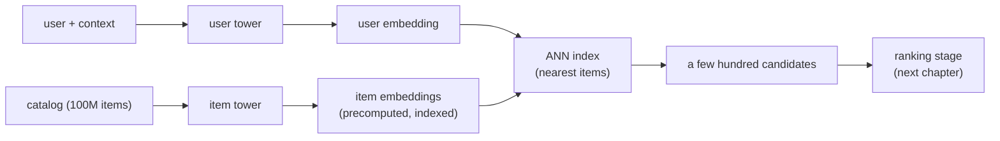

# Candidate Retrieval with Two-Tower Models

> **Style note (proof of concept).** This chapter is a sample of a teach-first,
> book-like rewrite. It borrows the *thinking* of Aminian and Xu's *Machine
> Learning System Design Interview* (a Candidate/Interviewer dialogue to gather
> requirements, then a consistent frame-data-model-evaluate-serve arc, one small
> figure per idea) without copying its format. On top of that it keeps what this
> repo adds: real production case studies, a "when to use which" table per method
> group, live editable architecture graphs, worked figures (mermaid and
> matplotlib), and an interview Q&A. Split into one file per section so no single
> file gets long.

An interviewer rarely says "design a two-tower model." They say **"design the
system that decides which few hundred items, out of a hundred million, are even
worth scoring for this user."** That is candidate retrieval: the cheap,
high-recall first stage of every large recommender and search system. This
chapter builds it end to end, and shows how YouTube, Airbnb, Pinterest, Etsy,
Snap, and Spotify actually ship it.

## Sections

1. [Clarifying the requirements](01-clarifying-requirements.md) - the dialogue that scopes the problem.
2. [Framing it as an ML task](02-frame-as-ml-task.md) - objective, input and output, and the ML category.
3. [Data preparation](03-data-preparation.md) - building training pairs and engineering features.
4. [Model development](04-model-development.md) - the two-tower architecture, in-batch negatives, logQ, and the loss variants.
5. [Evaluation](05-evaluation.md) - recall@k, the k that matters, and the online gates.
6. [Serving and scaling](06-serving-and-scaling.md) - the ANN index tradeoff, freshness, and the funnel.
7. [How teams do it in production](07-how-teams-do-it-in-production.md) - YouTube, Airbnb, Pinterest, Etsy, Snap, Spotify, and why they diverge.
8. [Interview Q&A](08-interview-qa.md) - commonly asked, tricky, and commonly-answered-wrong, with clear answers.
9. [Summary](09-summary.md) - the one-page recap and self-test.

## The whole system on one page

Read the sections in order the first time; they build on each other. Each opens
with the question an interviewer actually asks, then answers it.
