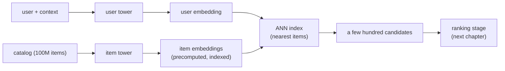

# Candidate Retrieval with Two-Tower Models

> **Style note (proof of concept).** This chapter is a sample of a more
> book-like, teach-first rewrite, modeled on the clarity of Aminian and Xu's
> *Machine Learning System Design Interview*: a Candidate and Interviewer
> dialogue to gather requirements, then one consistent framework (frame the
> problem, prepare data, develop the model, evaluate, serve), with one small
> figure per idea and progressive disclosure. It keeps the two things this repo
> adds on top of a paper book: every architecture is a **live, validated graph**
> you can open and edit, and every method carries a **"when to use which"** note.
> The chapter is split into one file per section so no single file gets too long.

An interviewer rarely says "design a two-tower model." They say **"design the
system that decides which few hundred items, out of a hundred million, are even
worth scoring for this user."** That is candidate retrieval: the cheap,
high-recall first stage of every large recommender and search system. This
chapter builds it end to end.

## Sections

1. [Clarifying the requirements](01-clarifying-requirements.md) - the dialogue that scopes the problem.
2. [Framing it as an ML task](02-frame-as-ml-task.md) - objective, input and output, and the ML category.
3. [Data preparation](03-data-preparation.md) - building training pairs and engineering features.
4. [Model development](04-model-development.md) - the two-tower architecture, negatives, and the loss.
5. [Evaluation](05-evaluation.md) - offline recall and the online metrics that gate a launch.
6. [Serving and scaling](06-serving-and-scaling.md) - ANN search, freshness, and the funnel.
7. [Summary and talking points](07-summary-and-talking-points.md) - the one-page recap and likely follow-ups.

## The whole system on one page

Read the sections in order the first time; they build on each other. Each opens
with the question an interviewer actually asks, then answers it.
