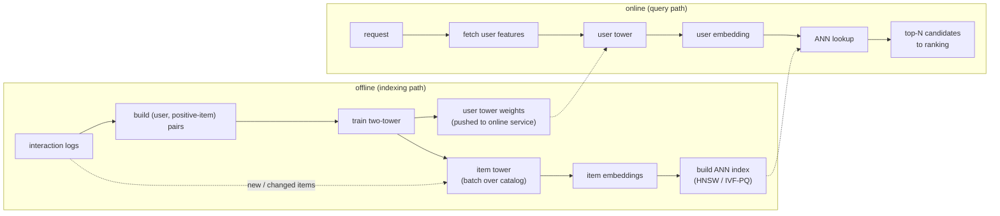
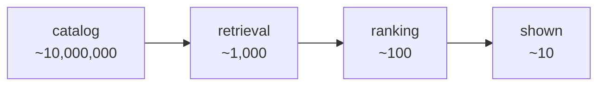

# Chapter 1: Candidate Retrieval with Two-Tower Models

Candidate retrieval is the foundation of large-scale recommendation, and it is the most common place a system-design candidate stalls. The setup is always the same: a catalog of tens of millions of items, and a requirement to recommend a handful to each user in real time. We obviously cannot score the whole catalog per request, so the job of retrieval is to get from millions of items down to a few hundred good candidates in a few milliseconds, cheaply enough to be one early stage of a larger funnel. The trap is to reach straight for a big ranking model and forget that ranking only ever sees what retrieval hands it. The signal an interviewer is listening for is whether you understand why retrieval is a separate, cheaper stage, and how the two-tower architecture makes "compare one user against millions of items" tractable at all.

In this chapter we build a mental model of a production retrieval stage by working through a concrete scenario: a catalog of roughly 10 million items with a long tail and a steady stream of new items every day, tens of millions of users, and a peak of a few thousand recommendation requests per second, all under a single-digit-to-low-tens-of-milliseconds latency budget. We separate the offline indexing path from the online query path, treat the choice of negatives and the freshness of the index as the two real design decisions they are, size an approximate-nearest-neighbor index at catalog scale, and close the loop with recall-based evaluation. Along the way we open two validated reference architectures, the two-tower retrieval model and neural collaborative filtering as its instructive opposite, so you can trace where the user and item paths actually meet rather than reason about a box labeled "embedding model."

In this chapter, we will cover the following main topics:

- Scoping a candidate-retrieval stage and its requirements
- The offline indexing path and the online query path
- Why two towers, and tracing the architecture
- Training with in-batch negatives and the logQ correction
- Serving with approximate nearest neighbor
- The funnel and embedding freshness
- Multiple retrieval sources
- Bottlenecks, failure modes, and evaluation

## Technical requirements

To follow along you need a modern web browser to open the validated reference graphs used as figures in this chapter. These are not screenshots: they are shape-checked architecture graphs from the Neurarch model zoo, validated end to end at real dimensions, and each one opens live in the editor so you can inspect the layers and trace where the two stacks meet yourself.

The two architectures we open in this chapter are:

- **Two-tower retrieval**, the user and item towers meeting at a final similarity: [open it live](https://www.neurarch.com/?import=https://raw.githubusercontent.com/neurarch-ai/awesome-llm-model-zoo/main/architectures/two-tower/model.json)
- **Neural collaborative filtering (NCF)**, the instructive opposite that fuses user and item early: [open it live](https://www.neurarch.com/?import=https://raw.githubusercontent.com/neurarch-ai/awesome-llm-model-zoo/main/architectures/ncf/model.json)

The full collection of validated reference graphs lives in the [Model Zoo repository](https://github.com/neurarch-ai/awesome-llm-model-zoo), with a browsable [gallery](https://neurarch-ai.github.io/awesome-llm-model-zoo). It is built by [Neurarch](https://www.neurarch.com).

Conceptually you will also want to be aware of the tooling classes we name but do not install here: an approximate-nearest-neighbor index such as HNSW or IVF-PQ (the retrieval layer), an offline batch job that embeds the whole catalog, and a metadata store carrying item attributes and freshness timestamps. No datasets are required to read the chapter; the running example is a 10-million-item catalog with a long tail and a daily stream of new items.

## Scoping a candidate-retrieval stage and its requirements

Before drawing any boxes, we scope the problem, because the answers change the architecture. Five questions do most of the work:

- **Catalog size and shape?** Say 10 million items, with a long tail and a steady stream of new items every day. The tail and the freshness both matter, because they decide how much you can lean on pure ID memorization.
- **Users and traffic?** Tens of millions of users, peak maybe a few thousand recommendation requests per second. This sets the throughput floor and the replication budget.
- **Latency budget?** Retrieval is one stage of a larger funnel, so it gets a slice of a tens-of-milliseconds total. Think single-digit to low-tens of milliseconds for the retrieval call itself.
- **Objective?** What counts as a good candidate. Usually "an item this user would engage with," with engagement defined by the downstream objective (clicks, watches, purchases). Retrieval optimizes recall of those items, not final rank.
- **How many candidates out?** A few hundred to a couple of thousand. Enough that the ranker has good material, few enough that the ranker can afford to score them.

Writing these out as functional and non-functional requirements gives us:

**Functional**

- Given a user, return a few hundred relevant candidate items from the full catalog
- Incorporate new items quickly, so a freshly added item is retrievable
- Support multiple retrieval sources if needed (personalized, popular, recent)

**Non-functional**

- p99 retrieval latency in the single-digit to low-tens of milliseconds
- Recall@k high enough that the downstream ranker is not starved of good items
- Throughput of a few thousand QPS with headroom
- Item embedding freshness: new and updated items reflected within minutes to hours

The non-functional requirement that quietly dominates here is **recall under a hard latency budget**. We are not trying to rank perfectly; we are trying not to lose the good items before ranking ever sees them, while staying fast enough to be one cheap stage of a funnel. We flag that framing early and return to it, because everything downstream inherits the ceiling this stage sets.

## The offline indexing path and the online query path

A retrieval stage is really two pipelines that share an index, and every production system in this space runs the same two-path skeleton. We keep them separate in our heads and in our diagrams. The whole trick of the two-tower is that the item side is precomputed offline, so the online path is just one query embedding plus a nearest-neighbor lookup.

The **offline (indexing) path** turns the catalog into searchable vectors. We build (user, positive-item) pairs from interaction logs, train the two towers, then run the item tower over the whole catalog as a batch job and write every item embedding into an approximate-nearest-neighbor index. The user tower's weights ship to the online service. New and changed items get re-embedded and upserted on a schedule, and that cadence is your item freshness.

The **online (query) path** turns a request into candidates. Per request we fetch the user's features, embed only the user (one forward pass through the small user tower), and do a single ANN lookup over the item index to pull the top-N candidates before handing them to ranking. We never run the item tower online. That asymmetry is the entire reason this architecture serves at scale.

*Figure 1.1: The two-path retrieval skeleton, the item tower indexing the catalog offline and only the user tower running online*

The rest of the chapter walks the stages of this diagram in the order they matter, pausing where a stage hides a real design decision. The interesting variation between real systems is not this skeleton but two knobs: which negatives you train against, and how you keep the index fresh and fast at catalog scale.

## Why two towers, and tracing the architecture

A **two-tower** model is two separate neural networks:

- The **user tower** maps user features (id, a summary of history, context such as device or time of day) to a single user embedding vector.
- The **item tower** maps item features (id, category, text, attributes) to a single item embedding vector in the same space.

Relevance is the **dot product, or cosine similarity, of the two embeddings**. That is the key structural fact. Because the score is just a similarity between two independently produced vectors, we can precompute every item vector offline and reduce online scoring to nearest-neighbor search. Cosine is the dot product of the L2-normalized vectors:

$$\text{sim}(u, v) = \frac{u \cdot v}{\lVert u \rVert \, \lVert v \rVert}$$

Normalizing once at index time means the online search reduces to a plain dot product, which is exactly what the ANN index is built to do fast. An unnormalized dot product lets magnitude carry a popularity signal, which is sometimes a useful built-in prior and sometimes runaway head bias, so whether you normalize is a real modeling choice rather than a detail.

A model that mixed user and item features together early (a cross network, like a ranker does) cannot do this, because the score would depend on the specific user and could not be precomputed. The towers are kept separate **on purpose**, and they usually do **not** share weights, because users and items have different features and live in different distributions. The only thing they share is the embedding space they map into, enforced by the similarity loss. This is the detail casual diagrams get wrong.

To ground this, it helps to open a real two-tower graph rather than picturing an abstraction, and to point at where the two stacks stay separate until the final dot product.

*Figure 1.2: Two-tower retrieval, the user and item towers staying separate until a final similarity*

You can [open this graph live](https://www.neurarch.com/?import=https://raw.githubusercontent.com/neurarch-ai/awesome-llm-model-zoo/main/architectures/two-tower/model.json) and follow the user tower and the item tower down to the similarity layer, noting that they never mix features before that point, which is what makes precompute possible.

The contrast makes the point sharper. Neural collaborative filtering fuses the user and item embeddings early and pushes them through an MLP, so the score depends on both jointly.

*Figure 1.3: Neural collaborative filtering, fusing user and item early so the score cannot be precomputed*

You can [open this graph live](https://www.neurarch.com/?import=https://raw.githubusercontent.com/neurarch-ai/awesome-llm-model-zoo/main/architectures/ncf/model.json) and see the join happen early, inside the network rather than at the end. NCF is more expressive per pair, but you cannot precompute item vectors or use ANN, which is exactly why it does not scale to catalog-wide retrieval the way the two-tower does. A good exercise before an interview is to open both and notice where the user and item paths join in each. The position of that join is the whole reason one is a retrieval model and the other is not. This is also how two-tower differs from classic matrix factorization: it is the neural generalization that learns embeddings from features, so it handles cold start and rich context, where matrix factorization learns a vector per id and cannot embed an unseen item.

## Training with in-batch negatives and the logQ correction

We have positives, a user engaged with an item, but no natural negatives. Sampling explicit negatives from 10 million items is expensive, and most random items are trivial negatives that teach the model nothing. The standard trick is **in-batch negatives**:

- Take a batch of $B$ positive (user, item) pairs.
- For each user, treat the other $B - 1$ items in the batch as negatives.
- Train with a softmax or contrastive loss that pushes each user's embedding toward its own item and away from the others.

This is nearly free, because the negatives come with the batch as embeddings already computed for the forward pass, and it gives a large effective negative set. For anchor $i$ with tower similarity $s(u_i, v_j)$, the in-batch softmax loss is:

$$\mathcal{L}_i = -\log \frac{\exp\big(s(u_i, v_i)\big)}{\sum_{j=1}^{B} \exp\big(s(u_i, v_j)\big)}$$

There is a catch worth naming before the interviewer names it. Items appear as in-batch negatives in proportion to how often they appear as positives, so popular items get penalized as negatives far more than their true prior warrants, which suppresses their scores and hurts calibration. This is popularity bias baked directly into the loss. The standard fix is the **sampled-softmax, or logQ, correction**: subtract an estimate of each item's log sampling probability $Q(y)$ from its logit, so the gradient behaves as if negatives were drawn uniformly:

$$\mathcal{L}_i = -\log \frac{\exp\big(s(u_i, v_i) - \log Q(v_i)\big)}{\sum_{j=1}^{B} \exp\big(s(u_i, v_j) - \log Q(v_j)\big)}$$

The correction matters most when $Q$ is skewed, which is exactly the in-batch case where $Q$ tracks item popularity, and it matters less when negatives are uniform (there $\log Q$ is constant and cancels). Getting $Q$ wrong, through stale frequency estimates or ignored drift, reintroduces the bias, so many systems maintain a streaming count of item frequency. Skip the correction and popular items are unfairly demoted; over-correct with a bad estimate and you over-promote tail junk.

**Hard negatives** are the second refinement. In-batch negatives are mostly easy, and a model can look great on random-negative metrics yet fail in production where the ANN already returns only plausible candidates. Mixing in harder negatives, items similar to the positive but not engaged with, concentrates the gradient near the decision boundary and sharpens fine-grained relevance. Add them carefully. The danger is false negatives: in implicit-feedback data an unlabeled item is often just unobserved, not truly irrelevant, and mining the hardest examples preferentially surfaces these mislabeled positives, teaching the model to push apart things that should be close. Too many hard negatives also destabilizes training and can collapse the representation. The usual compromise is many in-batch or random negatives plus a modest fraction of semi-hard negatives, with hardness capped below the very top slice most likely to be false negatives.

## Serving with approximate nearest neighbor

Exact nearest neighbor over 10 million vectors per request is too slow, so we use an **approximate nearest neighbor (ANN)** index and accept a small recall loss. The two mainstream families are:

- **HNSW (graph-based):** a navigable small-world graph with excellent recall and latency, at higher memory because it stores the graph edges plus the full vectors.
- **IVF-PQ (inverted file plus product quantization):** product-quantizes the vectors for a much smaller memory footprint, at some recall loss. At tens of millions of items under tight memory this is often the pragmatic choice.

We **shard** the index across machines to fit memory and **replicate** shards to serve QPS. The tunable knob is recall versus latency, how many index cells (IVF `nprobe`) or graph neighbors (HNSW `ef`) to probe. Because the knob is per query and needs no rebuild, we can scan harder for high-value queries and back off under load. The subtle point is that ANN recall against the exact-dot-product neighbors is not the same as business recall against true relevance, so chasing ANN recall past a point buys nothing the ranker will notice. We tune the operating point against the downstream ranker's hunger for candidates, not in isolation, and stop where the end-to-end metric flattens under the p99 budget.

## The funnel and embedding freshness

It helps to be explicit about the funnel this stage anchors. The orders of magnitude are illustrative, but the shape is universal.

*Figure 1.4: The recommendation funnel, retrieval cutting four orders of magnitude almost for free*

Retrieval's job is the first arrow: cut four orders of magnitude cheaply so the expensive cross-feature ranker only ever scores a shortlist. This is the standard resolution of the two-tower's one weakness. Tower separation forbids early user-item feature crosses, so a two-tower model is typically weaker per candidate than a cross model. We accept that and pair a cheap two-tower for retrieval with an expensive cross-feature model for reranking the survivors.

**Freshness has two clocks here**, and confusing them is a common mistake:

- **Item embedding freshness.** A new item is invisible until the item tower embeds it and the index is updated. If items go stale (a new product, a breaking news article), we re-embed and upsert frequently, or run a separate fresh-item retrieval source that does not wait for the next full index build. There is also a structural version of this: when the towers are retrained, the whole index becomes stale, and the user tower must be swapped atomically with the item index or the two live in incompatible coordinate systems and relevance craters. We version the index and the query tower together and cut over atomically.
- **User embedding freshness.** The user tower runs online, so the user side can reflect right-now context immediately if we feed it fresh features. Reacting to the user's very latest actions is more the domain of sequential recommendation, covered later in the book; the two-tower user side typically carries a summarized history.

## Multiple retrieval sources

In practice retrieval is rarely one model. A common pattern is to blend several sources: the personalized two-tower, a popularity source, a recency or fresh-item source, and sometimes a graph or co-occurrence source. Each returns candidates, and we union them before ranking. Mentioning this unprompted shows you understand that retrieval is a recall-maximizing ensemble, not a single model, and it is also how the system stays robust when any one source has a blind spot.

## Bottlenecks, failure modes, and evaluation

As load and catalog grow, the bottlenecks surface in a predictable order, and each maps onto a stage above. It is worth memorizing the first sign of each and the fix:

| Bottleneck | First sign | Fix | Tradeoff |
|---|---|---|---|
| ANN search latency | p99 retrieval creeps up | Tune probe depth, shard, IVF-PQ | Recall vs latency/memory |
| Index memory at scale | Index does not fit | Product quantization, lower dimension | Recall loss |
| Stale item embeddings | New items never surface | Frequent re-embed and upsert, fresh source | Write-path complexity |
| Popularity bias from negatives | Head items over- or under-served | logQ / sampled-softmax correction | Tuning effort |
| User feature fetch | Latency before the tower runs | Cache user features per session | Slight staleness |
| Recall starving the ranker | Ranker quality plateaus | More candidates, more sources | More ranking cost downstream |

The failure modes worth planning for are specific to a learned retrieval stage:

- **Cold-start items.** A brand-new item has no learned id embedding. Lean on content features in the item tower (category, text, attributes) so it still lands somewhere sensible, and use a fresh-item source until it accumulates interactions.
- **Cold-start users.** A new user has thin features. Fall back to popularity and context (location, device, time) until the personalized tower has signal.
- **Feedback loop.** You only log engagement on items you retrieved and showed, so the model reinforces its own past choices. Some exploration, mixing in candidates the model is unsure about, keeps the catalog from collapsing onto the head.

For evaluation, the number that gates any change is **recall@k** of the retrieval stage against held-out future engagements: did the items the user actually engaged with appear in the retrieved set? Recall is the ceiling on everything downstream, so we measure it on its own before anything else. Then we confirm end to end with an online A/B test, because offline recall and online engagement do not always move together, and we gate any change to the towers, the negatives, or the index behind both. When an important item is missing from results, the order of investigation is to localize the funnel stage first: is it in the index, is its embedding fresh, is ANN probe depth too shallow, or is retrieval fine and the ranker dropping it?

## Summary

In this chapter we scoped a candidate-retrieval stage over a 10-million-item catalog under a single-digit-to-low-tens-of-milliseconds budget, and worked through it as the recall-maximizing first stage of a funnel. We separated the offline indexing path, which trains the towers and batch-embeds the whole catalog into an ANN index, from the online query path, which embeds one user and does a single nearest-neighbor lookup. We saw why the two towers stay separate until a final dot product, that this separation is exactly what lets the item side be precomputed, and that the towers usually do not share weights. We trained with in-batch negatives, corrected their popularity bias with the logQ correction, and added hard negatives carefully to avoid false negatives. We sized an HNSW or IVF-PQ index and its per-query recall-versus-latency knob, drew the funnel that retrieval anchors, separated item-embedding freshness from user-embedding freshness, and blended multiple retrieval sources into a recall-maximizing ensemble. We opened two validated reference architectures, the two-tower retrieval model and neural collaborative filtering, to make the position of the user-item join concrete. Finally we covered cold start, the feedback loop, and the recall-first evaluation that gates every change.

In the next chapter, *Ranking Models*, we move to the second arrow of the funnel: how a cross-feature model re-scores the shortlist that retrieval hands it, why it can afford the early feature crosses the two-tower forbids, and how ranking objectives and calibration turn a few hundred candidates into the handful the user actually sees.

## Questions

1. Why is candidate retrieval a separate, cheaper stage from ranking, and what does the two-tower's dot-product structure make possible that a cross-feature model cannot?
2. Why do the user and item towers stay separate until the final similarity, and why do they usually not share weights? What expressiveness do you give up?
3. How does two-tower retrieval differ from neural collaborative filtering and from classic matrix factorization, and why does the position of the user-item join decide whether a model can serve catalog-wide retrieval?
4. What are in-batch negatives, why are they nearly free, and what bias do they introduce?
5. Write the logQ-corrected in-batch softmax loss and explain what the correction fixes and when it matters most. What breaks if the estimate of $Q$ is stale?
6. Why do hard negatives help, and how can they hurt? What is the false-negative problem in implicit-feedback data, and how do you back off from it?
7. Compare HNSW and IVF-PQ for a 10-million-vector index. What does each optimize, and what does the per-query probe knob trade?
8. Why is ANN recall against the exact neighbors not the same as business recall, and why should you tune the index against the downstream ranker rather than in isolation?
9. Explain the two freshness clocks in a two-tower system. Why must the user tower and the item index be swapped atomically on retraining?
10. Why is recall@k the right offline metric for retrieval, why is it the ceiling on everything downstream, and why do you still need an online A/B test to gate a change?

## Further reading

Each of the following is a first-party engineering writeup that ships the patterns in this chapter. Read them for what an interview answer skips: who the system serves, the product design, the eval bar, and the deployment shape. Under the product differences these systems are the same skeleton, an item tower running offline over the catalog into an ANN index and only the user tower running online, and almost every writeup spends its real engineering budget on the two hard parts: which negatives to train against, and how to keep the index fresh and fast at scale.

- [Establishing a Large Scale Learned Retrieval System (Pinterest)](https://medium.com/pinterest-engineering/establishing-a-large-scale-learned-retrieval-system-at-pinterest-eb0eaf7b92c5): offline-indexed item embeddings plus a request-time user tower, with sampled softmax and popularity correction.
- [Sampling-Bias-Corrected Neural Modeling for Large Corpus Recommendations (YouTube / Google)](https://research.google/pubs/sampling-bias-corrected-neural-modeling-for-large-corpus-item-recommendations/): in-batch negatives are biased under a power law, and the logQ correction restores the unbiased softmax.
- [Innovative Recommendation Applications Using Two Tower Embeddings (Uber)](https://www.uber.com/blog/innovative-recommendation-applications-using-two-tower-embeddings/): layer sharing plus bag-of-words history, so one global model replaces thousands of city models.
- [Embedding-Based Retrieval for Airbnb Search (Airbnb)](https://airbnb.tech/ai-ml/embedding-based-retrieval-for-airbnb-search/): chose IVF over HNSW for high listing-update volume, since the listing tower is offline-computable.
- [Embedding-based Retrieval with Two-Tower Models in Spotlight (Snap)](https://eng.snap.com/embedding-based-retrieval): in-batch negatives for video retrieval, with request and retrieval split into independently scaled services.
- [Unified Embedding Based Personalized Retrieval in Etsy Search (Etsy)](https://arxiv.org/abs/2306.04833): hard-negative sampling plus unified embeddings, HNSW with 4-bit product quantization, and a +5.58% purchase rate.
- [Candidate generation using a two-tower approach (Expedia Group)](https://medium.com/expedia-group-tech/candidate-generation-using-a-two-tower-approach-with-expedia-group-traveler-data-ca6a0dcab83e): two-tower query and item encoders with dot-product scoring for travel.
- [Scaling recommendations with request-level deduplication (Pinterest)](https://medium.com/pinterest-engineering/scaling-recommendation-systems-with-request-level-deduplication-93bd514142d9): the in-batch-negative false-negative rate fixed via user-level masking.
- [Improving two-tower candidate generation (Glassdoor)](https://medium.com/glassdoor-engineering/improving-embedding-based-candidate-generation-for-recommender-systems-with-a-two-tower-model-c222123beb7f): two-tower user and post embeddings served via OpenSearch ANN.
- [Introducing Voyager: Spotify's nearest-neighbor search library (Spotify)](https://engineering.atspotify.com/2023/10/introducing-voyager-spotifys-new-nearest-neighbor-search-library): a production HNSW ANN library, 10x faster than Annoy, for recommendations.
- [Addressing dataset bias in model-based candidate generation (Twitter)](https://arxiv.org/abs/2105.09293): two-tower candidate generation for the home timeline, fixing sampling bias.
- [Enhancing relevance of embedding-based retrieval at Walmart (Walmart)](https://arxiv.org/abs/2408.04884): neural embedding-based retrieval improved with a relevance reward model and typo-aware training.
- [Two-tower recommendations at Allegro.com (Allegro)](https://arxiv.org/abs/2508.03702): unified two-tower retrieval serving multiple recommendation surfaces.
- [Evidently AI ML system design database](https://www.evidentlyai.com/ml-system-design): the broadest curated index, 800 case studies from 150-plus companies, for going beyond the cases listed here.
