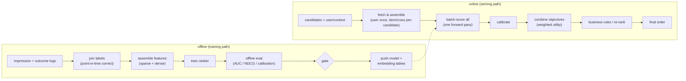

# Chapter 2: Ranking Models

In the previous chapter we built a retrieval stage whose job was recall: narrow a catalog of millions down to a few hundred plausible candidates, cheaply. This chapter picks up exactly where that hand-off ends. Retrieval has handed us a shortlist for one user, and now we have to score every item on it and decide the order we actually show. This is the stage where accuracy is won: retrieval maximizes recall on a budget, ranking spends real compute to get the order right.

The classic mistake, in an interview and in production, is to jump straight to "a deep network" and skip the two things that actually move the metric. The first is the features, especially the user-times-item cross features that no separate view of the user and the item can recover. The second is the latency budget, because ranking runs one model hundreds of times per request inside a few milliseconds, which is the opposite of the retrieval stage and which turns architecture into a latency problem as much as an accuracy one. Along the way we will open two validated reference architectures, a wide-and-deep model and a DLRM, so you can trace where the embedding tables feed the interaction layer rather than reason about a box labeled "ranker."

In this chapter, we will cover the following main topics:

- Scoping a ranking model and its requirements
- The offline training path and the online serving path
- Features: where the accuracy actually lives
- Wide-and-deep: memorization plus generalization
- DLRM and explicit feature interactions, with a traced graph
- Multi-task ranking and combining objectives
- Calibration: when an ordering is not enough
- The latency budget, made concrete
- Bottlenecks, failure modes, and evaluation

## Technical requirements

To follow along you need a modern web browser to open the validated reference graphs used as figures in this chapter. These are not screenshots: they are shape-checked architecture graphs from the Neurarch model zoo, validated end to end at real dimensions, and each one opens live in the editor so you can inspect the layers, the embedding tables, and where the interaction step actually sits.

The two architectures we open in this chapter are:

- **Wide-and-deep**, a joint linear-plus-deep ranker: [open it live](https://www.neurarch.com/?import=https://raw.githubusercontent.com/neurarch-ai/awesome-llm-model-zoo/main/architectures/wide-and-deep/model.json)
- **DLRM**, a deep learning recommendation model with explicit pairwise feature interactions: [open it live](https://www.neurarch.com/?import=https://raw.githubusercontent.com/neurarch-ai/awesome-llm-model-zoo/main/architectures/dlrm/model.json)

The full collection of validated reference graphs lives in the [Model Zoo repository](https://github.com/neurarch-ai/awesome-llm-model-zoo), with a browsable [gallery](https://neurarch-ai.github.io/awesome-llm-model-zoo). It is built by [Neurarch](https://www.neurarch.com).

Conceptually you will also want to be aware of the pieces we name but do not build here: embedding tables for sparse categorical features, a post-hoc calibration map such as Platt scaling or isotonic regression, and a downstream utility step that combines per-objective scores. No datasets are required to read the chapter; the running example is a shortlist of a few hundred candidates that must be scored inside a low-tens-of-milliseconds budget.

## Scoping a ranking model and its requirements

Before drawing any boxes, we scope the problem, because the answers change the architecture. Five questions do most of the work:

- **What does the ranker optimize?** The business objective: click-through, conversion, watch time, or a blend. This sets the label and the loss. Often it is several objectives at once, which leads directly to multi-task ranking.
- **How many candidates in, how many out?** Say a few hundred to a thousand in from retrieval, and a ranked list of the top tens out. We score all of them and sort.
- **What is the latency budget?** Ranking gets a slice of the overall request. If it has about 20 ms and scores 500 candidates, that is well under a tenth of a millisecond per candidate, including feature assembly. That constraint shapes the model.
- **What features are available online?** User features, item features, context, and crucially user-times-item cross features and the user's recent behavior. What can we compute inside the budget?
- **How much training data?** Impressions with engagement labels, typically billions of rows. This is why ranking models can be large, and why embedding tables, not the network, usually dominate the parameter count.

Writing these out as functional and non-functional requirements gives us:

**Functional**

- Score every retrieved candidate for the objective or objectives
- Produce a final ranked order after any business rules or re-ranking
- Optionally output calibrated probabilities, not just an order
- Log features and outcomes for the next training cycle

**Non-functional**

- p99 ranking latency in the low tens of milliseconds for the whole candidate set
- Calibration stable enough for any downstream use (auctions, thresholds, blends)
- Training cadence fast enough to track distribution drift, often daily or faster
- Online and offline feature parity, so no training-serving skew

The non-functional requirement that quietly dominates everything here is per-candidate cost under a hard budget. We are running one model hundreds of times per request, which is the exact opposite of the retrieval stage that ran one model once against millions of items through an approximate index. We flag it now and design backwards from it later, because ignoring it is the most common way this system misses its p99.

## The offline training path and the online serving path

A ranking model is really two pipelines that share an artifact, and every production system in this space runs the same two-path skeleton. We keep them separate in our heads and in our diagrams.

The **offline (training) path** turns logs into a shipped model. It joins impression logs to their engagement labels, assembles features, trains the ranker over the sparse and dense inputs, evaluates offline, gates the result, and pushes the model and its embedding tables to serving. The one subtlety that sinks teams is point-in-time correctness: when we join a label to features, we must use the feature values as they were at impression time, not as they are now, or we leak the future into training and the offline metric lies.

The **online (serving) path** turns a shortlist into an order. It fetches and assembles features for each candidate, batch-scores them all through the ranker in one forward pass, calibrates the raw outputs, combines the per-objective scores, applies business rules, and returns the final order. The candidates all share the same user and context features, so we fetch those once and broadcast them across the batch, and only item and cross features vary per candidate. That broadcast is a real latency lever, not a detail.

*Figure 2.1: The two-path ranking skeleton, offline training feeding the online serving path, with shared features and calibrated multi-objective scoring inside the latency budget*

The rest of the chapter walks this diagram in the order it runs: features first, then the model families that consume them, then calibration and objective combination, then the budget that constrains all of it. The interesting variation between real systems is not this skeleton but a handful of knobs: which model family, how many objectives, whether calibration is a first-class step, and where each system chooses to spend its compute.

## Features: where the accuracy actually lives

Before any architecture, the features. Naming all three families, and knowing which one carries the signal, is what separates a senior answer from a junior one.

- **User features:** id, demographics where available, aggregated history such as counts, rates, and category affinities, and recent behavior.
- **Item features:** id, category, attributes, content embeddings, and historical engagement rates, handled with care about leakage.
- **Cross features:** user-times-item interactions, for example how many times this user engaged with this item's category in the last seven days. These cannot be recovered from user and item features independently, and they are often the single biggest accuracy lever. A model that only sees the user and the item separately is leaving signal on the table.

Sparse categorical features (ids, categories) pass through **embedding tables**; dense numeric features feed the network directly after normalization. The embedding tables, not the multilayer perceptron, are usually where the parameters live: millions of ids times an embedding dimension dwarfs a few dense layers. Keep this in mind, because it changes how you think about the model's size and its serving cost, and it is the first thing to point at when someone asks where a ranker's parameters actually are.

## Wide-and-deep: memorization plus generalization

The first model family worth being able to draw combines two paths trained jointly, each doing a job the other cannot.

- The **wide** part is a linear model over (often crossed) categorical features. It **memorizes** specific, frequent combinations, of the form "users from this segment click this exact item type."
- The **deep** part embeds the sparse features and runs them through a multilayer perceptron. It **generalizes** to combinations never seen at training time.

The intuition to deliver is that memorization captures the reliable specific rules while generalization handles the long tail and the unseen crosses, and you want both. The two paths join just before the output, and the model trains end to end so the linear and deep branches specialize against each other rather than duplicating work.

*Figure 2.2: Wide-and-deep, a linear memorization branch over crossed categorical features joining a deep embedding-plus-MLP generalization branch before the output*

You can [open this graph live](https://www.neurarch.com/?import=https://raw.githubusercontent.com/neurarch-ai/awesome-llm-model-zoo/main/architectures/wide-and-deep/model.json) and trace the two paths: the wide linear branch over crossed categorical features and the deep embedding-plus-MLP branch, and see exactly where they join before the score. Note that the crosses on the wide side are hand-specified feature combinations, which is precisely the manual work the next family removes.

## DLRM and explicit feature interactions, with a traced graph

The DLRM (deep learning recommendation model) is the structure most worth being able to draw, because its interaction step is precise and it is the step diagrams routinely wire wrong. The model runs in four moves:

1. Each sparse categorical feature goes through its own **embedding table**, producing one vector per feature.
2. Dense features go through a small "bottom" MLP into a vector of the same width, so it can be treated like one more feature vector.
3. The model takes **explicit pairwise interactions** between all these vectors: a dot product between every pair. This models second-order feature crosses directly, instead of hoping an MLP learns them.
4. The interactions, concatenated with the dense vector, go into a "top" MLP that outputs the score.

The interaction step is the whole idea, and it is worth writing down. Given the set of feature vectors after the embedding tables and bottom MLP, $\{\, \mathbf{e}_1, \mathbf{e}_2, \dots, \mathbf{e}_n \,\}$, DLRM forms the set of pairwise dot products

$$Z = \{\; \mathbf{e}_i^\top \mathbf{e}_j \;:\; 1 \le i < j \le n \;\}$$

and feeds $Z$ (alongside the dense vector) into the top MLP. That is $\binom{n}{2}$ explicit second-order crosses, computed as structure rather than learned by hoping. The thing to get right, and the thing static diagrams get wrong, is *where* this happens: after the embeddings and the bottom MLP, before the top MLP. Open the real graph and point at that layer rather than describing a generic "deep model."

*Figure 2.3: DLRM, sparse embedding tables and a dense bottom MLP feeding an explicit pairwise-interaction layer, whose output goes into the top MLP*

You can [open this graph live](https://www.neurarch.com/?import=https://raw.githubusercontent.com/neurarch-ai/awesome-llm-model-zoo/main/architectures/dlrm/model.json), find the embedding tables, follow them into the pairwise-interaction layer, and confirm it sits after the embeddings and before the top MLP. A good exercise before an interview is to open DLRM and count where the parameters actually live (the embedding tables, not the MLPs), then change the embedding dimension and watch the parameter count move.

Wide-and-deep and DLRM are the two answers to the same question, "how do we model feature interactions," and they differ in how explicit they make the crosses. Wide-and-deep splits memorization (a linear model over hand-crossed categoricals) from generalization (a deep MLP). DLRM makes the second-order interactions explicit and structured with the pairwise dot product, so no one has to enumerate the crosses by hand. Both embed the sparse features; they differ only in how the interactions are formed.

There is a third answer worth naming because it shows up in modern production stacks: a **cross network** that learns higher-order feature crosses in an explicit, bounded way. The DCN-v2 cross layer applies, at layer $l$,

$$\mathbf{x}_{l+1} = \mathbf{x}_0 \odot \left( W_l\, \mathbf{x}_l + \mathbf{b}_l \right) + \mathbf{x}_l$$

where $\mathbf{x}_0$ is the input feature vector, $\odot$ is the elementwise product, $W_l$ and $\mathbf{b}_l$ are learned, and the trailing $+\,\mathbf{x}_l$ is a residual connection. Each stacked cross layer raises the interaction order by one, so a depth of $k$ layers reaches order-$k$ crosses, with the residual keeping training stable. It sits in the same design slot as DLRM's dot-product layer: an explicit, structured interaction step rather than a plain MLP left to discover crosses on its own.

## Multi-task ranking and combining objectives

You usually care about more than one outcome at once: a click, a like, and a long dwell. A **multi-task** ranker shares a lower body and branches into per-task heads, each predicting one outcome. The benefits are a shared representation, fewer models to serve, and the ability to combine the per-task scores into one ranking score with tunable weights, so the business decides how much a "like" is worth versus a "click." Standard architectures are a shared-bottom network or a mixture-of-experts with per-task gates; the point to mention unprompted is that negatively correlated tasks can hurt each other through the shared body, and gating helps by letting each task draw on different experts.

Combining objectives happens after scoring. Each head $t$ emits a probability $p_t$, and a linear utility with business-chosen weights $w_t$ produces the single value we sort on:

$$U = \sum_t w_t \, p_t$$

The weights encode product intent, and, crucially, they can be retuned without retraining the model, which is why teams like this shape: the ranker learns the probabilities once, and the business dials the tradeoff between objectives as priorities shift. But this combination step is only trustworthy if the $p_t$ mean what they say, which is exactly what the next section is about.

## Calibration: when an ordering is not enough

An ordering is enough if all you ever do is sort. The moment a score feeds an auction, a threshold, or a blend across tasks, you need the predicted probability to mean what it says: among items assigned score $p$, a fraction $p$ should actually be positive,

$$\Pr(y = 1 \mid \hat p = p) = p \quad \text{for all } p.$$

Two facts make this a first-class concern rather than an afterthought. First, a model can rank perfectly while being badly miscalibrated: AUC depends only on the ordering of scores, so any monotone transform leaves it unchanged, and a model can rank every positive above every negative while emitting scores clustered at 0.6 and 0.4 that misstate the true probabilities. Second, the very things we do to train ranking models distort calibration. Training-time shifts and negative sampling both inflate or deflate the output probabilities relative to the real base rate, so the raw scores are rankings, not probabilities, until we fix them.

The fix is a post-hoc **calibration** map fit on a held-out set drawn from the real class prior. **Platt scaling** fits a one-dimensional logistic regression over the raw score $s$, two parameters, ideal for small validation sets and roughly sigmoidal distortion:

$$\hat p = \sigma(a\, s + b)$$

**Isotonic regression** fits any monotone step function, so it corrects arbitrary-shaped miscalibration but needs more data and can overfit on small sets. We monitor calibration with **expected calibration error**, which bins predictions by confidence and averages the gap between each bin's mean confidence and its empirical accuracy, weighted by bin population:

$$\text{ECE} = \sum_b \frac{|B_b|}{N}\, \bigl\lvert \text{acc}(B_b) - \text{conf}(B_b) \bigr\rvert$$

Two rules of order matter. Fit the calibration map before choosing any threshold, and do both on data from the real prior, never on a resampled training set, because a threshold rule is only valid on genuine probabilities. And keep the class weighting or sampling that helped your ranking: you typically recover the probability quality afterward with the calibration map rather than giving up the ranking gain.

Why does this matter so concretely? Because when a score is multiplied by a value rather than merely thresholded once, miscalibration scales the decision directly. Expected-value bidding is the canonical case:

$$\text{bid} = p(\text{click}) \times \text{value}$$

Two models with identical AUC can lose money at very different rates in an auction because one reports 0.2 where the truth is 0.1, systematically overbidding by a factor of two. Any pipeline that arithmetically combines a score with costs, values, or other probabilities, including the weighted utility $U$ from the previous section, requires calibrated outputs, not just correct order.

## The latency budget, made concrete

This is the constraint that picks the architecture, so we state it out loud and design backwards from it. Illustrative arithmetic: 500 candidates against a roughly 20 ms p99 ranking budget is well under 0.1 ms per candidate end to end, including feature assembly. That rules out anything heavy per item and pushes us toward four moves:

- **Batched scoring:** all candidates in one forward pass, not a loop of single-item calls.
- **Shared-feature broadcast:** fetch the user and context features once and broadcast them across the batch, so only item and cross features vary per candidate.
- **Precomputed features:** so the online work is assembly, not computation.
- **Flat per-candidate cost:** a model big enough for accuracy but shaped so cost stays flat as candidates are added, which usually means keeping the top MLP modest and the embedding lookups cache-friendly.

Stating the budget first, then choosing the model to fit it, is the senior move. The reverse, picking a rich architecture and hoping it fits, is how ranking systems miss p99.

## Bottlenecks, failure modes, and evaluation

As load and catalog grow, the bottlenecks surface in a predictable order, and each maps onto a stage above. It is worth memorizing the first sign of each and the fix:

| Bottleneck | First sign | Fix | Tradeoff |
|---|---|---|---|
| Per-candidate scoring cost | Ranking p99 over budget | Batch scoring; shrink the top MLP | Accuracy vs latency |
| Embedding table memory | Tables do not fit | Hashing; lower dimension; prune rare ids | Collisions, slight quality loss |
| Feature fetch fan-out | Latency before the model runs | Fetch user/context once; batch item lookups | Cache staleness |
| Embedding lookup bandwidth | Memory-wall stalls | Quantize embeddings; co-locate hot ids | Quality hit to measure |
| Calibration drift | Scores misused downstream | Periodic recalibration; monitor ECE | Extra pipeline step |
| Training behind drift | Online metric decays | Retrain more often; incremental updates | Compute cost |

The failure modes worth planning for are:

- **Training-serving skew:** the most common silent failure. A feature computed one way offline and another way online means the model sees a distribution it never trained on. Compute features once and share them, or log the exact serving features and compare against training. Call this out explicitly, because it is the first thing to suspect when offline gains do not survive online.
- **Label leakage:** a feature that secretly encodes the outcome, such as an item engagement rate that includes the current impression, inflates offline metrics and collapses online. Point-in-time joins prevent it.
- **Position bias:** items shown higher get clicked more regardless of relevance, so naive labels teach the model to predict position, not quality. Correct with position as a feature at train time (dropped or fixed at serve time) or with inverse-propensity weighting.
- **Cold start:** new items and users have weak id embeddings, so lean on content and contextual features to keep signal.

For evaluation, offline we use **AUC** for the ranking quality of the binary objective and **NDCG** for the quality of the ordered list, position-weighted, plus a calibration error such as ECE. NDCG discounts relevance by rank so that placing relevant items near the top counts most:

$$\text{DCG} = \sum_i \frac{2^{rel_i} - 1}{\log_2(i + 1)}$$

normalized by the ideal ordering to give NDCG. But offline gains routinely fail to survive online, so the real ship gate is an **A/B test** on the business metric. Wire the offline metrics as a fast pre-gate and the A/B test as the ship decision, and when offline AUC rises but online engagement does not, suspect the seam between training and serving first: skew, calibration, position bias, or an offline metric that does not match the online objective.

## Summary

In this chapter we took the shortlist handed over by retrieval and built the ranking model that scores it and decides the order. We scoped the problem, wrote functional and non-functional requirements, and found that per-candidate cost under a hard budget is the constraint that quietly picks the architecture. We separated the offline training path, which joins point-in-time-correct labels and ships a model plus its embedding tables, from the online serving path, which assembles features, batch-scores in one forward pass, calibrates, and combines objectives. We put features first and singled out cross features as the biggest accuracy lever, then walked the two model families worth drawing: wide-and-deep, which splits memorization from generalization, and DLRM, whose explicit pairwise dot-product interaction layer is the whole idea and sits precisely after the embeddings and before the top MLP. We added multi-task heads with a tunable utility combination, made calibration a first-class step with Platt scaling, isotonic regression, and ECE, and showed why a miscalibrated probability directly scales an expected-value bid. We opened two validated reference architectures, the wide-and-deep ranker and DLRM, to ground the models that produce the scores.

In the next chapter, *Sequential and Personalized Recommendation*, we move from scoring a candidate in isolation to modeling the user as a sequence: how recent behavior becomes an ordered signal, why attention over a user's history captures short-term intent that static features miss, and how session-based and sequential models feed the ranker a far sharper picture of what the user wants right now.

## Questions

1. Why is ranking a separate stage from retrieval, and what does each stage optimize for?
2. Name the three feature families a ranker uses. Why are cross features often the single biggest accuracy lever, and why can they not be recovered from user and item features separately?
3. In wide-and-deep, which branch memorizes and which generalizes, and where do the two branches join?
4. Where exactly do feature interactions happen in DLRM, and why is that placement the whole model? Write the set of pairwise interactions it forms.
5. Contrast wide-and-deep and DLRM as two answers to modeling feature interactions. What do they share and how do they differ?
6. Write the DCN-v2 cross-layer update and explain what the residual term and the elementwise product with $\mathbf{x}_0$ each contribute.
7. How does a multi-task ranker combine per-objective scores into one ranking value, and why is it useful that the weights can change without retraining?
8. Give a concrete example of a model with high AUC that is badly miscalibrated. Why are ranking quality and probability quality separate axes?
9. Why does calibration matter specifically for expected-value bidding, and what does $\text{bid} = p(\text{click}) \times \text{value}$ illustrate about two models with identical AUC?
10. Your offline AUC went up but online engagement did not. List the causes in the order you would investigate them, and say which seam you suspect first.

## Further reading

Each of the following is a first-party engineering writeup that ships the patterns in this chapter. Read them for what an interview answer skips: who the system serves, the product design, the eval bar, and the deployment shape.

- [Wide & Deep Learning for Recommender Systems (Google)](https://arxiv.org/abs/1606.07792): joint wide linear memorization plus deep-net generalization for Google Play ranking, the origin of the pattern in this chapter.
- [Deep Learning Recommendation Model, DLRM (Meta)](https://arxiv.org/abs/1906.00091): dense MLP plus sparse embedding tables with explicit pairwise feature interactions, sharded for scale.
- [One Model to Serve Them All: a single deep pCTR model for multiple surfaces (Instacart)](https://company.instacart.com/how-its-made/one-model-to-serve-them-all-how-instacart-deployed-a-single-deep-learning-pctr-model-for-multiple-surfaces-with-improved-operations-and-performance-along-the-way): consolidating per-surface tree models into one wide-and-deep pCTR model, with the calibration and ops wins.
- [Multi-task Learning and Calibration for Utility-based Home Feed Ranking (Pinterest)](https://medium.com/pinterest-engineering/multi-task-learning-and-calibration-for-utility-based-home-feed-ranking-64087a7bcbad): a multi-head DNN per action type, calibrated per head and combined into a utility score, the eval bar for the multi-task section.
- [Multi-task Learning for Related Products Recommendations (Pinterest)](https://medium.com/pinterest-engineering/multi-task-learning-for-related-products-recommendations-at-pinterest-62684f631c12): four engagement heads beating a binary classifier, tuning utility weights without retraining.
- [Homepage feed multi-task learning using TensorFlow (LinkedIn)](https://www.linkedin.com/blog/engineering/feed/homepage-feed-multi-task-learning-using-tensorflow): jointly training click, comment, and reshare objectives in one ranker.
- [Applying Deep Learning to Airbnb Search (Airbnb)](https://medium.com/airbnb-engineering/applying-deep-learning-to-airbnb-search-7ebd7230891f): the journey from gradient-boosted trees to neural-network ranking for bookings.
- [Deep learning for ads conversion in last-mile delivery (DoorDash)](https://arxiv.org/abs/2502.10514): homepage ads ranking moving from tree models to multi-task DNNs.
- [Modality-aware multi-task learning to optimize ad targeting at scale (Spotify)](https://research.atspotify.com/2025/8/modality-aware-multi-task-learning-to-optimize-ad-targeting-at-scale): a multi-gate mixture-of-experts ad ranker with DCN-v2 feature interactions and ECE-monitored calibration that drives pricing.
- [Improving recommended pins with lightweight ranking (Pinterest)](https://medium.com/pinterest-engineering/improving-the-quality-of-recommended-pins-with-lightweight-ranking-8ff5477b20e3): an XGBoost lightweight ranker holding a latency budget early in the funnel.
- [Time Informed Calibration (Wayfair)](https://www.aboutwayfair.com/careers/tech-blog/time-informed-calibration): calibrating raw ranking scores into time-aware purchase probabilities, a clean example of calibration as its own layer.
- [Improving Walmart Search to help customers save time (Walmart)](https://medium.com/walmartglobaltech/improving-walmart-search-to-help-our-customers-save-time-e9fcd1f03e94): a re-ranker balancing relevance and engagement, lifting relevance 4.5%.
- [Evidently AI ML system design database](https://www.evidentlyai.com/ml-system-design): the broadest curated index, 800 case studies from 150-plus companies, for going beyond the cases listed here.
