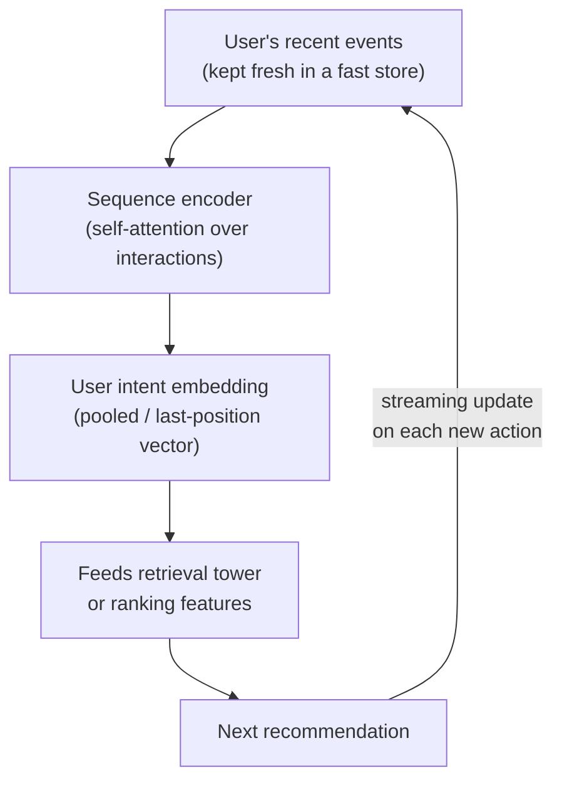

# Chapter 3: Sequential and Personalized Recommendation

Somebody watches three cooking videos in a row, and the feed still shows them the same generic mix it showed an hour ago. That gap, between what a user just did and what the system offers next, is the difference between a recommender that feels alive and one that feels like a static catalog. In the previous chapter we ranked candidates with a model that treated the user largely as a bag of aggregated features: lifetime category counts, long-run averages, slowly moving profile vectors. That view is durable and cheap, but it is deaf to intent. The person who just switched from cooking to travel videos looks identical, under lifetime counts, to a steady cooking fan.

This chapter is about closing that gap. We will model the user's behavior sequence itself, the ordered list of things they recently viewed, clicked, watched, and bought, and we will treat order and recency as first-class signal rather than noise to be averaged away. The modeling half is a short hop from what you already know: self-attention over a sequence, the same mechanism that powers language models, pointed at a sequence of interactions instead of tokens. The harder half, and the one that separates a convincing design from a whiteboard sketch, is the systems work of getting the user's latest action into the model fast enough to matter within the same session.

In this chapter we will cover:

- Why an ordered behavior sequence carries intent that aggregated features throw away
- How the behavior sequence transformer applies self-attention over recent interactions, and exactly where the position and time signal enters
- Session-based recommendation for logged-out and privacy-constrained users, and how it doubles as the cold-start fallback
- The real-time feature pipeline that keeps the user's sequence fresh within a session, and the training-serving skew it can introduce
- How to evaluate a sequence model causally offline and confirm it online without tightening a filter bubble

## Technical requirements

The arguments in this chapter are easier to hold in your head when you can see the graph they describe. Two reference architectures accompany the discussion, and both are live, shape-checked graphs at real dimensions rather than redrawn screenshots. Open them in a second window and trace the sequence as you read.

The first is the behavior sequence transformer (BST), the canonical self-attention-over-interactions design. Open it live at the Neurarch model zoo import link for `bst` and follow one interaction from its item embedding into the self-attention block. Find the positional encoding that gives the model its sense of order. That is the base mechanism this chapter builds on.

*Figure 3.1: The behavior sequence transformer (BST). A user's ordered interactions enter as item-plus-side-feature embeddings, a positional encoding injects order, and a stack of self-attention blocks produces a pooled user-intent vector for the ranking head. Open the live graph to trace where the position signal touches the attention path.*

The second is SLi-Rec, included as a deliberate contrast. Where BST is one attention stack over one sequence, SLi-Rec models short-term and long-term interests on separate paths and combines them, with a time-aware recurrent path that the plain attention stack does not have. Seeing the two side by side makes the design space concrete: mixing recent intent with durable preference is the shared problem, and these are two different structural answers to it.

*Figure 3.2: SLi-Rec, a short-term / long-term interest model shown for contrast. Two paths (a recent-intent path and a durable-preference path) are combined, with a time-aware recurrent component. Compare its two-path structure against BST's single attention stack.*

A good exercise before an interview is to open BST and trace one interaction from its item embedding all the way to the user-intent output, noting every place a time or position signal touches the path. The rest of this chapter is a guided version of exactly that trace.

## Why sequence, not aggregates

We should start by being precise about what aggregated features lose, because the entire justification for the extra machinery in this chapter rests on it. An aggregate such as "watched 40 cooking videos over the user's lifetime" discards two properties that carry intent: **order** and **recency**. A user who just pivoted from cooking to travel and a user who has watched cooking steadily for a year produce nearly the same lifetime counts, yet their next action is completely different. The aggregate cannot tell them apart. A sequence model sees the recent shift because it keeps the events in order and lets the last few dominate.

The premise you are betting on is that the last handful of actions predicts the next one better than a lifetime average does. That is usually true for engagement, and it is the reason the sequence is worth encoding at all. Keep this front of mind, because it also sets the value proposition for the whole system: a stale sequence model is barely better than aggregates. If you cannot keep the sequence fresh, most of the benefit evaporates, which is why so much of this chapter is about the pipeline rather than the network.

Before designing anything, you should clarify a few things with your interviewer, because the answers move the latency budget and the architecture:

- **What is the sequence?** The user's ordered recent interactions, with timestamps and action types. How long a window: tens of events, or a few hundred?
- **Where does this model sit?** It usually powers personalization inside the ranking stage (the user-sequence representation becomes a feature) or inside retrieval (a sequence-aware user tower), or both. Which one changes the latency budget.
- **How fresh must reactions be?** Reacting within the same session, seconds to minutes, is the entire point of the exercise.
- **What is the objective?** Next-item engagement, framed either as predicting the next item or as producing a user representation that feeds the funnel.
- **What about cold start?** New users have short or empty sequences, and the system must degrade gracefully rather than fail.

### Functional and non-functional requirements

Functionally, the system must encode the user's recent behavior sequence into a representation, use it to personalize retrieval and/or ranking toward current intent, update the sequence with the user's latest actions in near real time, and handle short, empty, and very long sequences sensibly.

Non-functionally, the sequence encode must fit the same tight per-request budget as the stage it feeds, single-digit to low-tens of milliseconds. User-state freshness must land within a session, seconds and not next-day. And it must scale to tens of millions of users whose sequences are changing constantly.

One non-functional requirement dominates all the others: **real-time user-state freshness under the funnel's latency budget**. Unlike the item side, which can be precomputed offline in bulk, the user's sequence is changing during the session, so the hard part is updating and encoding it fast. We will return to this repeatedly, because it is where designs succeed or fall apart.

## The behavior sequence transformer

The standard modern approach applies self-attention over the user's recent interactions, the same mechanism as a language model but run over a sequence of item interactions instead of tokens. Three pieces make it work.

First, each interaction is represented by its item embedding plus side features (action type, category, and so on) and a **position or time signal** so the model knows order and recency. Second, self-attention lets the model weigh which past interactions matter for the current prediction: the three recent cooking videos should count for more, right now, than a purchase from six months ago, and attention learns exactly that weighting. Third, the output is a single user-intent representation, often a pooled or last-position vector, that feeds the ranker as a feature or the retrieval user tower as a query.

Mechanically, attention scores every pair of positions in the sequence and mixes their values by those scores. For queries $Q$, keys $K$, and values $V$ derived from the interaction embeddings, the operation is:

$$\text{Attention}(Q, K, V) = \text{softmax}\!\left(\frac{Q K^{\top}}{\sqrt{d_k}}\right) V$$

The softmax row for the current position is precisely the set of weights the model places on each past interaction. This is what "which past actions matter now" means in equations: it is a learned, input-dependent distribution over the user's history, recomputed for every request.

The detail worth naming, and the one an interviewer will push on, is **how order and time enter the model**. The base mechanism is a positional encoding over the sequence: 1st action, 2nd action, 3rd action, exactly the idea a language model uses. That alone lets attention distinguish "cooking then travel" from "travel then cooking." But pure position ignores that two actions a second apart are a very different signal from two actions a month apart. Stronger variants therefore encode the actual **time gaps** between events, not just their ordinal position, which lets the model weight recency properly. When you open the BST graph in Figure 3.1, the thing to locate is exactly where that positional signal is added into the attention block. The time-gap extension sits on top of that same injection point.

### Why attention and not a recurrent model

A predictable follow-up is why we reach for attention rather than an RNN over the sequence. Attention weighs arbitrary past interactions directly and in parallel: it can attend from the current position straight back to an action fifty steps ago without passing information through every intermediate step. That both captures long-range "which past action matters now" cleanly and avoids the sequential bottleneck of a recurrent model, where each step must wait for the previous one. The contrast graph in Figure 3.2, SLi-Rec, keeps a recurrent path deliberately, which is what makes it a useful counterpoint rather than a strictly worse design: the recurrent path is time-aware in a way the plain attention stack is not.

## Session-based recommendation

Sometimes you have little or no long-term user identity. The user is logged out, or privacy constraints forbid persistent profiles. In that case you model the **current session** only: the sequence of actions since the session began. The same attention machinery applies without change, just over a short, fresh sequence with no persistent user id attached. Nothing about the encoder needs to know whether the sequence spans one session or one year.

This is worth presenting together with cold start, because session-based modeling is also the natural fallback for a brand-new user. The same code path that serves a logged-out visitor serves a user whose account is three minutes old. That reuse is the point: you do not build a separate model for the identity-poor case, you run the existing one over whatever short sequence you have.

## Cold start

A new user has a short or empty sequence, and the system must degrade in layers rather than fail:

- **Empty sequence:** fall back to popularity and context, that is, location, device, time of day, and entry point. You always have something.
- **Short sequence:** the session-based model already works on a handful of events. Even two or three actions give real intent signal, and the attention encoder does not care that the sequence is short.
- **Content over ids:** lean on item content features (text, category, image signal) rather than learned id embeddings, so the cold user still maps somewhere sensible instead of colliding with a random vector.

The point to carry into an interview is that **cold start is not a special model, it is graceful degradation of the same one** as the sequence fills in. You are describing a fallback ladder, not a second system. We will return to cold start and its exploration counterpart as the main subject of the next chapter, because there is more to say about actively learning a new user's taste than fallbacks alone can cover.

## Real-time feature updates

This is the systems half of the answer, and it is where many candidates go thin. To react within a session, you need three things working together.

A **streaming pipeline** ingests each user action as it happens and appends it to a fast online store of recent events, typically a low-latency key-value store keyed by user. The serving path then reads that up-to-date sequence and encodes it per request, or maintains an incrementally updated user state so it does not re-encode from scratch every time. And, the part that is easy to forget, you must keep the **online and offline sequence construction identical**.

That last requirement deserves its own emphasis, because it is the headline failure mode of the whole design. The model is trained on sequences built by a batch pipeline but serves on sequences built by a streaming pipeline. If those two pipelines differ in any way, dedup rules, action filtering, or the ordering of simultaneous events, the model sees a serving distribution it never trained on. This is training-serving skew, and here it is especially insidious because both pipelines look correct in isolation; only the mismatch between them hurts, and it hurts silently. The defense is not vigilance, it is shared code: build the sequence in one place and call it from both paths.

Encoding a transformer over the sequence per request is not free, so two cost controls matter. Cap the sequence length to the recent N events, and consider caching the encoded state so that a new action updates it incrementally rather than forcing a full re-encode. For a user with thousands of events, truncate to the recent N and optionally summarize the older history into a compact long-term feature, letting attention focus on the recent window while a slower-moving vector carries durable taste. That short-term-plus-long-term split is exactly the structure SLi-Rec makes explicit in Figure 3.2.

### The serving path, end to end

The following diagram traces one request through the online path, from the user's freshly updated event list to the next recommendation, and back around as the new action streams in. This is the loop that makes the system feel responsive.

*Figure 3.3: The online serving path for a behavior-sequence model. Each new action is appended to the user's recent-event list by a streaming pipeline, so the next request encodes an up-to-date sequence. The dashed loop back from the recommendation to the event store is what makes reactions feel within-session.*

How fast does a new action actually change recommendations? As fast as your streaming pipeline writes the event and the next request reads it, ideally within seconds. That freshness is the product value, and it is the number to quote when someone asks what this model buys over aggregates.

## Bottlenecks and scaling

Every knob in this system trades one scarce resource for another. The table below is the compact version to keep in mind, first sign of trouble, the fix, and what the fix costs you.

| Bottleneck | First sign | Fix | Tradeoff |
|---|---|---|---|
| Sequence encode latency | Per-request budget blown | Cap sequence length, cache encoded state | Less history considered |
| Long sequences (heavy users) | Tail latency on power users | Truncate to recent N, summarize older history | Lose long-range signal |
| Real-time update lag | Reactions feel stale | Streaming ingest into fast online store | Pipeline complexity |
| Online/offline sequence mismatch | Online metric below offline | Shared sequence-building code | Engineering discipline |
| Item embedding churn | Sequence items go stale | Refresh item embeddings, share with retrieval | Coordination across stages |
| Cold-start coverage | New users get generic feed | Session model plus content plus popularity fallback | Tuning the fallback ladder |

Two rows deserve a note. Item embedding churn is a cross-stage coupling: the items in a user's sequence are represented by embeddings that the retrieval stage also owns and periodically retrains, so if those embeddings drift, the sequence items go stale underneath you. Sharing and refreshing the item embeddings across stages is the fix, and the cost is coordination discipline across teams that would otherwise move independently. And the online/offline mismatch row is the same training-serving skew from the previous section, surfacing here as "online metric below offline," which is the exact symptom you should learn to read as a sequence-construction bug rather than a modeling one.

## Failure modes, safety, and evaluation

A few failure modes are specific enough to this design that you should raise them before the interviewer does.

**Training-serving skew in sequence construction** is the headline risk, covered above. Sequences built differently online and offline silently degrade the model. Share the construction logic and there is nothing to debug later.

**Recency overfit, or the filter bubble.** Weighting recent actions too hard can trap the user in a narrow loop: three cooking videos, and now cooking forever. The feedback loop then collapses onto itself, because the model's own recommendations become the next session's history. Some diversity or exploration in what you show keeps the loop healthy. This is the seam between this chapter and the next: exploration is not only a cold-start tool, it is the release valve on a sequence model that would otherwise over-exploit its own recent signal.

**Cold start**, covered above, where the failure mode is showing a new user nothing useful. The fallback ladder must always return something.

**Privacy and retention.** Behavior sequences are sensitive data. Respect retention windows and consent, and remember that session-only modeling is sometimes the required legal mode, not merely a fallback you reach for when identity is missing.

On evaluation, the offline setup is to predict the held-out next interaction and measure **recall@k** and **NDCG** on it: did the actual next item rank highly? NDCG, in particular, rewards placing the relevant item near the top with a rank discount:

$$\text{DCG} = \sum_{i} \frac{2^{rel_i} - 1}{\log_2(i + 1)}$$

normalized by the ideal ordering to produce NDCG. The one discipline that matters here is causality: evaluate with only past events visible. Respect time order strictly. Shuffling the sequence or peeking past time $t$ leaks the future into training or evaluation and produces offline numbers that will not survive contact with production.

Because recency effects and feedback loops do not show up in a causal offline replay, confirm the model with an online **A/B test** on session-level engagement, and watch a diversity guardrail alongside your engagement metric so you can tell whether a lift is genuine responsiveness or just a tightening bubble. A model that wins offline and on raw engagement while quietly collapsing diversity is not the win it appears to be.

## Summary

This chapter turned a static recommender into a responsive one by modeling the user's behavior sequence directly. The core modeling idea was a short step from language modeling: self-attention over the user's recent interactions, with a positional or time signal injected so the model can weight order and recency, producing a single user-intent vector that feeds ranking or retrieval. We saw why aggregated features throw away exactly the order and recency that carry intent, how session-based modeling handles logged-out users and doubles as the cold-start fallback, and, most importantly, why the real work is the systems half: a streaming pipeline that keeps the sequence fresh within a session, built from shared code so online and offline sequences never diverge. We closed on evaluation, insisting on causal offline replay for recall@k and NDCG and an online A/B test with a diversity guardrail to catch the filter bubble that a sequence model can dig for itself.

That last point, the filter bubble, is a loose thread. A model that leans hard on recent behavior over-exploits what it already knows and starves on what it has not yet tried, and nowhere is that starvation sharper than for a brand-new user with no history at all. The next chapter, **Cold Start and Exploration**, takes up both problems together: how to serve a user the system knows nothing about, and how to actively learn a user's taste rather than passively reflecting it back. We will move from graceful degradation, the fallback ladder sketched here, to deliberate exploration, and see why the two are really the same question asked at different points in a user's lifetime.

## Questions

Test yourself on the threads an interviewer is most likely to pull. Each of these came up as a real follow-up in the deep-dive discussions behind this chapter.

1. Why prefer self-attention over an RNN for the behavior sequence, given both can model order?
2. Where exactly does the position or time signal enter the attention block, and what does encoding real time gaps buy over plain ordinal positions?
3. A user has thousands of lifetime events. How do you encode their sequence within a single-digit-millisecond budget without discarding long-range signal entirely?
4. Your online engagement metric is below what the offline recall@k predicted. What is the first bug you suspect, and why is it invisible in offline evaluation?
5. How fast, in wall-clock terms, does a new user action change their recommendations, and what determines that number?
6. Why must offline evaluation of a sequence model be causal, and what specifically goes wrong if you shuffle the sequence?
7. Does this model plug into retrieval or ranking, and how does the answer change the latency budget?
8. A sequence model lifts engagement in an A/B test but the diversity guardrail drops sharply. Is this a win? What is happening?

## Further reading

The following are first-party engineering writeups of systems that ship the patterns in this chapter. Read them for what an interview answer skips: who the system serves, the product design, the eval bar, and the deployment shape.

- **Alibaba, "Behavior Sequence Transformer for E-commerce Recommendation"** (arXiv:1905.06874). The canonical version of the design in this chapter: a transformer over the user behavior sequence that lifts CTR in Taobao ranking. Start here, and pair it with the BST graph in Figure 3.1.
- **Alibaba, "Deep Interest Network for Click-Through Rate Prediction"** (arXiv:1706.06978). An attention activation unit that re-weights the user-interest vector per candidate ad, a different attention structure worth contrasting with sequence-wide self-attention.
- **Pinterest, "How Pinterest Leverages Realtime User Actions in Recommendation" (TransAct).** The clearest public account of the real-time half of this chapter: fusing the last 100 actions into Homefeed ranking on top of a slower long-term embedding, with a twice-weekly retrain.
- **Pinterest, "PinnerFormer: Sequence Modeling for User Representation"** (arXiv:2205.04507). The deliberate opposite tradeoff: a batch sequence model with an all-action loss that avoids streaming embedding updates entirely. Read it against TransAct to see the real-time-versus-batch decision made both ways.
- **Kuaishou, "TWIN V2: Ultra-long User Behavior Sequence Modeling"** (arXiv:2407.16357). Two-stage attention over lifelong sequences (retrieve then score), the production answer to the heavy-user bottleneck in the scaling table, compressing on the order of a million events via clustering.
- **Spotify, "Contextual and Sequential User Embeddings for Music" (CoSeRNN).** Taste modeled as a sequence of per-session embeddings feeding an ANN over tracks, a recurrent, retrieval-side take that complements the ranking-side transformers above.
- **Netflix, "Integrating Netflix's Foundation Model into Personalization."** Three distinct ways to plug a large sequence model into existing production systems, useful for the "where does this sit in the funnel" question.
- **The Neurarch Model Zoo** (github.com/neurarch-ai/awesome-llm-model-zoo). Validated reference graphs at real dimensions, shape-checked end to end, including the BST and SLi-Rec graphs from the Technical requirements section. Open them and trace one interaction from item embedding to user-intent output before your interview.
