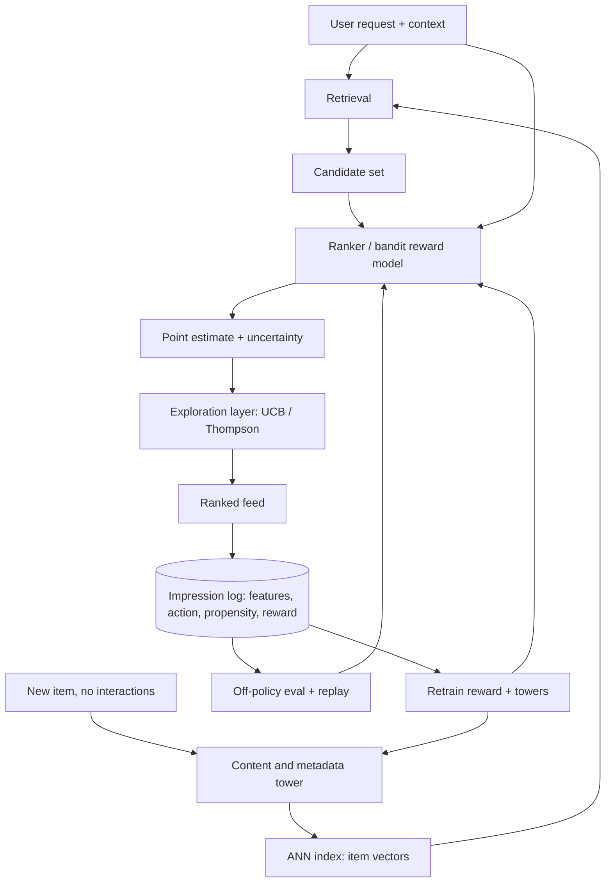

# Chapter 4: Cold Start and Exploration

Imagine you have been asked to design the recommender for a marketplace app, and the interviewer hands you two hard cases at once. The first is a brand-new user who just signed up with zero interaction history. The second is a brand-new item, uploaded a minute ago, that nobody has ever clicked. On top of that, the product team is worried the feed feels stale: it keeps recommending the same few things, and new content never gets a chance to prove itself. How do you serve good recommendations on day zero for both sides, and how do you keep the system from calcifying around what it already knows?

The insight that separates a strong answer from a weak one is that cold start and staleness are the same problem seen from two angles, and the naive collaborative-filtering answer fails both. A model that keys off learned ID embeddings has nothing to say about an entity with no interactions: a fresh user ID and a fresh item ID both map to untrained, effectively random vectors. The fix is to stop treating identity as the primary signal and lean on content and metadata, so that a new entity inherits a location in embedding space from things it resembles rather than earning one only after data slowly accrues.

The second half is subtler, and it is where the interview is really won. Even a perfectly calibrated model degrades over time under pure exploitation, because the logging policy only ever collects labels for what it already promotes. Items you never show never get fresh feedback, their estimates go stale, and the feedback loop calcifies. Escaping that costs you something now: you must sometimes show a less-certain item in order to learn about it. That is the explore-exploit tradeoff, and it is only rational under a long-horizon objective where the value of information counts.

Frame the whole chapter this way: content towers solve the day-zero problem, and uncertainty-aware exploration solves the ossification problem. Both are paid for against long-term value, not against this session's click.

In this chapter, we will cover the following topics:

- Clarifying the problem, scoping requirements, and sketching the data flow
- Item cold start with content and metadata towers instead of ID embeddings
- User cold start, where context is the metadata
- Why pure exploitation ossifies the corpus
- The explore-exploit family: epsilon-greedy, UCB, Thompson sampling, and contextual bandits
- Making bandits tractable over large action spaces
- Delayed and long-term reward, and choosing the right proxy
- Off-policy evaluation and replay
- Warm-up strategies and the long-term value of exploration
- Bottlenecks, failure modes, and the evaluation bar

## Technical requirements

You need a modern web browser to open the validated reference graphs referenced in this chapter from the [Neurarch model zoo](https://github.com/neurarch-ai/awesome-llm-model-zoo), where each architecture opens live at real dimensions. No datasets or installs are required to read the chapter.

## Clarifying and scoping the problem

Before drawing anything, it is worth pinning down which version of the problem you are actually solving. A few questions reshape the design substantially:

- **Which cold start dominates?** Item-side cold start (lots of new supply, as with user-generated content, listings, or news) and user-side cold start (lots of new demand, as with viral signups) have different fixes. Often you face both, but the volume ratio changes your priorities.
- **How fast do items churn?** If most impressions go to items less than a day old, as in news or short video, then cold start is the steady state rather than an edge case, and exploration becomes load-bearing.
- **What is the metadata quality?** Content towers are only as good as their features. Rich structured metadata (category, creator, text, thumbnail) makes the content path strong; sparse metadata pushes you toward exploration.
- **What is the reward, and how delayed?** A click is immediate and cheap but a poor proxy for value. Retention, completion, or a downstream conversion may be the true target, but they arrive hours or days later.
- **How large is the action space?** Tens of arms (artwork variants, ranked modules) admit classic bandits. Millions of items in a catalog need a different tractability story.
- **Is there an experimentation platform to integrate with?** Bandits are often best delivered as a first-class experiment type rather than a bespoke service.
- **What are the guardrails?** Exploration on a payments or safety-sensitive surface has a quality floor below which we will not drop for the sake of learning.

The scope we will commit to is: a cold-start representation for both users and items, an exploration policy layered on top of the ranker, a reward-proxy choice, and an off-policy evaluation loop so we can ship policy changes without a live A/B test for every one.

### Requirements

On the functional side, the system must:

- Serve reasonable recommendations for a user with zero history, backing off from context to popularity priors to bandit exploration.
- Give a brand-new item a fair, bounded shot at impressions without needing a manual boost.
- Support an exploration policy that trades short-term reward for information, tunable per surface.
- Log every decision with enough context (features, chosen action, propensity) to evaluate a new policy offline.

On the non-functional side:

- **Latency.** The ranking budget is unchanged by exploration, on the order of tens of milliseconds. Exploration must be a cheap layer, not a second model call.
- **Freshness.** A new item should be eligible within minutes of upload, so the content tower must be servable without waiting for a training cycle.
- **Reproducibility.** Logged propensities must match the policy that actually ran, or off-policy evaluation is garbage.
- **Safety floor.** Exploration is bounded so that the worst exploratory impression is still above a quality threshold.

### The high-level data flow

The shape of the system is a two-stage retrieval-then-rank pipeline, with a content-tower path that handles cold entities and an exploration layer that sits on the final scores. *Figure 4.1* traces the flow.

*Figure 4.1: The content-tower path places cold entities into the retrievable index, while the exploration layer reads an uncertainty estimate the reward model already produces.*

Two structural choices carry the design. Cold entities get a vector from the content tower, so they are retrievable and rankable on day zero. And the exploration layer reads an uncertainty estimate that the reward model already produces, so exploring costs almost nothing extra at serve time.

## Item cold start: content and metadata towers, not ID embeddings

The failure mode is worth stating concretely. A pure collaborative model represents item $i$ as a learned embedding indexed by its ID. For a just-uploaded item, that embedding is untrained, so retrieval and ranking treat it as noise, and it never surfaces, so it never earns interactions, so its embedding stays untrained. The loop is self-sealing.

The fix is a content tower: the item vector is a function of features (category, creator, text tokens, thumbnail embedding, price, language) rather than an ID lookup. Two towers, one user-side and one item-side, each map their features into a shared space, and relevance is a dot product. Now a new item's vector is computed from its metadata the moment it is uploaded, and it lands *near* similar items that already carry interaction signal. It inherits a location from its neighbors instead of starting at the origin. This is what makes a new listing retrievable minutes after upload with no training cycle in the loop: you run the item features through the tower and insert the resulting vector into the approximate-nearest-neighbor (ANN) index.

One nuance is worth saying out loud, because interviewers probe it. Pure content towers underperform ID-based models once an item is warm, because IDs capture idiosyncratic behavioral signal that no feature set fully explains. The practical design is therefore hybrid: an ID embedding that is *added* to the content-derived vector, with the ID part naturally near zero for cold items and dominating as interactions accrue. You get content generalization for free at the cold end and behavioral sharpness at the warm end, all on one model.

## User cold start: context is the metadata

User cold start is the symmetric problem with a symmetric fix. A brand-new user has no history, so the user tower keys off whatever context exists at request time: signup source, device, locale, coarse geography, time of day, and any onboarding-declared preferences. That places the user in a plausible region of the space on the very first request.

A clean example from practice is a personalized cuisine filter that uses geographic-hierarchy priors: district, then city, then region. These priors give a new user, or even an entirely new district, a sensible starting distribution that then personalizes as data arrives. The general pattern is a prior that backs off up a hierarchy (this user, then this segment, then this geography, then global) and blends toward the specific level as evidence accumulates.

## Why pure exploitation ossifies

This is the conceptual heart of the chapter, so it is worth slowing down. Suppose your ranker is well calibrated *today*. If you always serve the argmax, you only ever collect labels for the items you already rank highly. Items you rank low get zero fresh impressions, so their estimates are frozen at whatever they were when you stopped showing them, which may be wrong or stale. Tastes shift; an item's natural audience grows. The model has no way to discover that a demoted item is now good, because it never lets it prove itself.

Over time, the served distribution collapses onto a shrinking set, and the corpus effectively narrows. This is not a bug in the model. It is a property of greedy data collection: the logging policy and the training data are entangled, and a greedy policy produces biased, self-confirming data. The only escape is to deliberately spend some impressions on items the model is *uncertain* about, keeping the label distribution wide enough that the model can correct itself.

## Explore-exploit algorithms and their tradeoffs

Once you accept that some impressions must be spent on learning, the question becomes *how* to spend them. There is a family of policies, and they differ mainly in how intelligently they direct exploration.

### Epsilon-greedy

With probability $\epsilon$, show a random item; otherwise, show the argmax. This is trivial to implement and trivial to log, since the explore branch has a known uniform propensity, and it is a perfectly fine baseline. Its weakness is that it explores *uniformly*: it wastes impressions on obviously-bad items as often as on promising-but-uncertain ones.

### UCB (upper confidence bound)

UCB scores each arm by its mean plus a bonus that grows with uncertainty, then picks the argmax of that optimistic score. For arm $a$ with empirical mean reward $\hat{\mu}_a$ pulled $n_a$ times after $t$ total rounds, the classic rule is:

$$a_t = \arg\max_{a} \left( \hat{\mu}_a + c \sqrt{\frac{\ln t}{n_a}} \right)$$

The bonus term $c\sqrt{\ln t / n_a}$ is large when an arm has been pulled few times (small $n_a$) and shrinks as evidence accumulates. Exploration is now *directed*: you explore where you are uncertain, not everywhere. UCB is also deterministic given the counts, which some infrastructure prefers.

### Thompson sampling

Thompson sampling maintains a posterior over each arm's reward, draws one sample from each posterior, and picks the arm with the highest sample. In the Bernoulli-reward case, each arm carries a Beta posterior parameterized by its successes and failures:

$$\theta_a \sim \text{Beta}(\alpha_a, \beta_a), \qquad a_t = \arg\max_a \theta_a$$

After observing reward $r \in \{0, 1\}$ for the chosen arm, the posterior updates conjugately: $\alpha_a \leftarrow \alpha_a + r$ and $\beta_a \leftarrow \beta_a + (1 - r)$. Uncertain arms have wide posteriors, so they win draws often enough to get explored, and the built-in randomness gives you clean propensities for logging. Thompson sampling is empirically robust and is the default many teams reach for.

### Contextual bandits (LinUCB and friends)

In the settings above, each arm has a fixed mean reward. In reality, the reward depends on context: who the user is, what the item is, what time it is. A contextual bandit models the reward as a function of a feature vector rather than a per-arm constant. LinUCB assumes the reward is linear in the feature vector $x$ and derives a closed-form confidence bonus. For arm $a$ with a design matrix $A_a$ (accumulated feature outer products) and estimated weights $\hat{\theta}_a$:

$$p_a = \hat{\theta}_a^\top x + \alpha \sqrt{x^\top A_a^{-1} x}$$

The first term is the point estimate; the second is the uncertainty bonus, which is large in directions of feature space the arm has seen little of. This closed form is why LinUCB scales, and it was the workhorse in the well-known Yahoo news-recommendation work. Neural-linear variants keep a linear-uncertainty head on top of a learned feature extractor, buying both expressiveness and cheap uncertainty.

The unifying point for the interviewer: uncertainty-driven exploration beats uniform exploration because it concentrates the cost of learning on decisions where learning is actually possible. Epsilon-greedy pays a flat tax; UCB and Thompson pay only where the payoff in information is high.

## Large action spaces: making bandits tractable

Textbook bandits assume a small, fixed set of arms. A real catalog has millions of items, and maintaining a posterior per arm does not scale. Three moves make bandits tractable at that size:

- **A two-stage funnel.** Retrieval (ANN over tower vectors) cuts millions of items to hundreds, and the bandit only operates over that candidate set. You never maintain a posterior over the whole catalog.
- **Parametric, shared-across-arms models.** In a contextual bandit the reward model is shared: an arm is described by its features, not by an independent parameter vector. Uncertainty comes from the model over features, so a brand-new item with no history still gets an uncertainty estimate straight from its features. This is the pattern behind large-action-space bandits in production catalogs.
- **Structuring the action space.** Explore over clusters, categories, or a geographic hierarchy rather than raw items, then drill down. This is cheaper, and it gives new items a group-level prior to start from.

## Delayed and long-term reward: choosing the proxy

The reward you can measure instantly (a click) is rarely the reward you actually want (retention, satisfaction, long-term engagement). If you optimize the immediate proxy, you get clickbait. If you wait for the true signal, you cannot update the policy for days.

The resolution is to *choose a proxy that predicts long-term value* and to model the delay explicitly. A useful reference here is the "impatient bandits" line of work: rather than waiting for the full delayed reward or naively using a myopic one, you model the reward-formation process so the bandit can act on a partially-observed signal that is predictive of the eventual long-term outcome. In an interview, name the tension (myopic-but-fast versus true-but-slow), then propose a learned or structured early proxy plus a correction as the true label lands.

## Off-policy evaluation and replay

You cannot A/B test every candidate policy; it is too slow and too expensive. Off-policy evaluation (OPE) estimates how a *new* policy would have performed using logs generated by the *old* policy.

The mechanics rest on the propensity: the probability the serving policy assigned to the action it actually took. Log that propensity alongside each impression, then reweight logged rewards by the ratio of new-policy to old-policy probability. This is importance sampling, also called inverse-propensity scoring. For a logged dataset of $N$ impressions with context $x_i$, chosen action $a_i$, and reward $r_i$, the estimated value of a new policy $\pi_{\text{new}}$ is:

$$\hat{V}(\pi_{\text{new}}) = \frac{1}{N} \sum_{i=1}^{N} \frac{\pi_{\text{new}}(a_i \mid x_i)}{\pi_{\text{old}}(a_i \mid x_i)} \, r_i$$

Each logged reward is up-weighted when the new policy would have been more likely to take that action than the old one, and down-weighted otherwise. The denominator is the logged propensity $\pi_{\text{old}}(a_i \mid x_i)$, which is exactly why it must be recorded faithfully.

Replay evaluation is the clean special case that applies when the logs contain uniformly-random exploration traffic. You replay the stream and only score events where the new policy's choice matches the logged choice, which gives an unbiased estimate with no model of the reward at all. This is the technique behind the LinUCB replay evaluation on tens of millions of news events.

Two hard requirements fall out of this. First, exploration must be *stochastic with known propensities*, which is a strong reason to prefer Thompson sampling or epsilon-greedy over a deterministic argmax. Second, logged propensities must exactly match the policy that ran. Get either one wrong and OPE will lie to you.

## Long-term value of exploration and warm-up

The payoff of exploration is not this session; it is the *corpus*. By giving uncertain and new items impressions, you keep discovering good content, which grows the effective catalog and breaks the ossification loop described earlier. The published work on the long-term value of exploration makes this explicit: neural-linear bandit exploration is justified by corpus growth and feedback-loop breaking, measured on a long horizon, not by short-term engagement, which exploration slightly lowers by construction.

Concretely, several warm-up strategies get new content off the ground:

- **A bounded exploration budget per new item.** Guarantee each new item a small number of impressions to well-matched users, found via its content-tower neighbors, enough to get an initial reward estimate.
- **Uncertainty decay.** The exploration bonus is large when the interaction count is low and shrinks as data accrues, so a new item automatically graduates from explored to exploited. The $\sqrt{\ln t / n_a}$ and $x^\top A_a^{-1} x$ terms above already have this shape built in.
- **Recency-aware bandits.** For surfaces where an arm's reward regenerates over time, a recovering or "sleeping" bandit re-explores a rested arm rather than assuming its old estimate still holds.
- **Pure-exploration phases.** When the goal is specifically to find broadly-appealing new items without popularity bias, a dedicated pure-exploration bandit, decoupled from the exploit feed, does that job.

### Bandits as a first-class experiment type

The cleanest deployment is not a bespoke bandit service bolted onto the ranker but a bandit that lives inside the experimentation platform. That platform already handles assignment, logging, and metric computation, so adding a reward service and a Thompson-sampling allocator turns "which variant" A/B tests into adaptive experiments that shift traffic toward winners while they run. This reuses infrastructure, gives you propensity logging for free, and makes exploration a governed, auditable thing rather than a hidden knob buried in the ranker.

## Bottlenecks and scaling

A handful of components tend to become the bottleneck as this system scales:

- **Serving the content tower fresh.** New items must be embeddable without a training cycle, so the item tower has to be servable at upload time and the ANN index has to accept online inserts. Batch-only indexing kills item cold start.
- **Uncertainty at ranking latency.** UCB and Thompson need a per-candidate uncertainty. A full Bayesian posterior per request is too slow; the practical answer is a linear or neural-linear head where the confidence bonus is a cheap closed form over the candidate features.
- **Log volume and propensity fidelity.** Every impression carries features and a propensity, which is a large, high-write log. It is also the single point of failure for OPE, so schema and propensity correctness are load-bearing, not incidental telemetry.
- **Retrain cadence versus staleness.** Cold start is worst right after upload, so the longer the gap between an impression and the reward model incorporating it, the longer new items stay uncertain. Near-real-time feature updates help more here than a bigger model.

## Failure modes, safety, and evaluation

Finally, know the ways this system fails and how you would catch them:

- **Feedback-loop collapse (the core failure).** Greedy serving narrows the corpus. Mitigating it is the entire point of the exploration layer. Monitor served-item diversity and new-item impression share as first-class health metrics, not vanity charts.
- **Exploration on the wrong surface.** Exploring on a checkout or safety-sensitive surface is reckless. Bound exploration by a quality floor and disable it where a bad impression is costly.
- **Propensity leakage or mismatch.** If logged propensities do not match the serving policy, OPE and inverse-propensity estimates are silently wrong. Test this directly by replaying logged random traffic and checking that the estimator recovers known outcomes.
- **Proxy gaming.** Optimizing an immediate proxy such as click or dwell produces clickbait and erodes the true objective. Guard against it with a long-term-value reward and hold-out cohorts measured on the real target.
- **Cold-start popularity bias.** Falling back to popularity for new users is safe but self-reinforcing, since popular content gets more popular. Pure-exploration or calibrated bandits counteract it.

For the evaluation bar, ship policies on offline replay and OPE first (does the new policy beat the logged one on the inverse-propensity estimate?), then run a live experiment measuring both short-term engagement *and* a long-horizon corpus or retention metric. Exploration is expected to cost a little short-term reward, so it must be judged on the long horizon, or you will kill the very mechanism that keeps the system healthy.

## Questions
A few questions come up almost every time, and having crisp answers ready signals depth:

- *"The content tower is worse than the ID model for warm items, so why keep it?"* Because it is additive. A hybrid ID-plus-content model gives generalization at the cold end and behavioral sharpness at the warm end, all on one model.
- *"Why not just always explore uniformly with epsilon-greedy everywhere?"* Because it pays a flat tax and wastes impressions on obviously-bad items. Uncertainty-driven exploration concentrates the cost where information is actually available.
- *"How do you evaluate a new bandit without a live test?"* Off-policy evaluation via inverse-propensity weighting, or replay on logged random-exploration traffic for an unbiased estimate. This is why stochastic policies with logged propensities matter.
- *"Isn't exploration just lost revenue?"* Short-term, yes, and you must justify it on long-term value: corpus growth and breaking ossification, measured on a long horizon.
- *"How do you pick the reward when the real signal is days out?"* Choose or learn an early proxy that predicts long-term value and model the delay, rather than optimizing a myopic click.

## Summary

Cold start and ossification are two views of one problem: a system that keys off identity has nothing to say about entities without history, and a system that only exploits stops learning about the entities it has stopped showing. The two fixes are complementary. Content and metadata towers give new users and new items a location in embedding space from their features, making them retrievable and rankable on day zero, and hybrid ID-plus-content models recover behavioral sharpness as data accrues. Uncertainty-aware exploration, from epsilon-greedy through UCB, Thompson sampling, and contextual bandits, keeps the label distribution wide enough that the model can correct itself, with the cost of learning concentrated where information is available. To make this tractable over millions of items you funnel with retrieval, share parameters across arms, and structure the action space; to ship it safely you log propensities faithfully, evaluate off-policy before going live, and judge exploration on long-horizon corpus and retention metrics rather than this session's click.

With the reward model producing both a point estimate and an uncertainty that the exploration layer consumes, a natural next question is how that point estimate is built in the first place, at the scale and latency of a real-time auction. In the next chapter, **Ads Click-Through-Rate Prediction**, we turn to exactly that: predicting the probability of a click on an ad, where calibration is not optional, features number in the billions, and every millisecond and every fraction of a percent moves real money.

## Further reading

Production engineering writeups of the systems in this chapter, each a first-party source:

- **Netflix** [Artwork Personalization at Netflix](https://netflixtechblog.com/artwork-personalization-c589f074ad76): Contextual bandits pick per-member title artwork, small action space, cache-served at scale. *(product design)*
- **Netflix** [Infra for Contextual Bandits and Reinforcement Learning](https://netflixtechblog.com/ml-platform-meetup-infra-for-contextual-bandits-and-reinforcement-learning-4a90305948ef): Production infra for reward computation, logging, and offline policy evaluation of bandits. *(deployment)*
- **Spotify** [Identifying New Podcasts with a Pure-Exploration Infinitely-Armed Bandit](https://research.atspotify.com/publications/identifying-new-podcasts-with-high-general-appeal-using-a-pure-exploration-infinitely-armed-bandit-strategy): A pure-exploration bandit surfaces broadly-appealing new podcasts without popularity bias. *(who it serves)*
- **Spotify** [Calibrated Recommendations with Contextual Bandits on the Homepage](https://research.atspotify.com/2025/9/calibrated-recommendations-with-contextual-bandits-on-spotify-homepage): A contextual bandit balances the music, podcast, audiobook mix per user context. *(product design)*
- **Spotify** [Impatient Bandits: Optimizing for the Long-Term Without Delay](https://research.atspotify.com/publications/impatient-bandits-optimizing-for-the-long-term-without-delay): A delayed-reward bandit picks a reward signal to optimize long-term engagement. *(eval bar)*
- **DoorDash** [Personalized Cuisine Filter](https://careersatdoordash.com/blog/personalized-cuisine-filter/): A multi-armed bandit with geo-hierarchy priors handles new-user and new-district cold start. *(who it serves)*
- **Yahoo** [A Contextual-Bandit Approach to Personalized News Article Recommendation](https://arxiv.org/abs/1003.0146): The LinUCB news bandit plus offline replay evaluation on 33M events. *(eval bar)*
- **Stitch Fix** [Multi-Armed Bandits and the Experimentation Platform](https://multithreaded.stitchfix.com/blog/2020/08/05/bandits/): Thompson-sampling bandits as a first-class experiment type with a reward service. *(deployment)*
- **Instacart** [Contextual Bandit models in large action spaces](https://company.instacart.com/tech-innovation/using-contextual-bandit-models-in-large-action-spaces-at-instacart): Contextual bandits for product recs when the catalog action space is very large. *(deployment)*
- **Duolingo** [A Sleeping, Recovering Bandit for Optimizing Recurring Notifications](https://research.duolingo.com/papers/yancey.kdd20.pdf): A recovering bandit picks the daily reminder with a recency penalty, lifting retention. *(product design)*
- **Google** [Long-Term Value of Exploration](https://arxiv.org/abs/2305.07764): Neural-linear bandit exploration grows the content corpus, breaking feedback-loop ossification. *(eval bar)*
