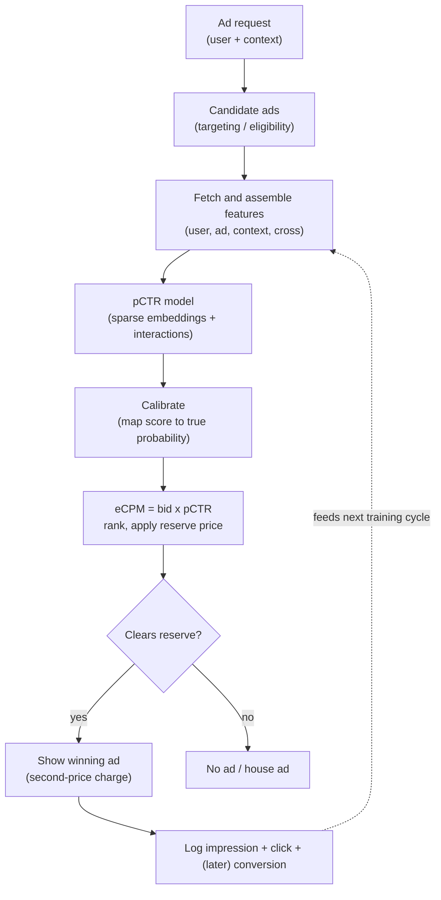

# Chapter 5: Ads Click-Through-Rate Prediction

A user loads a page, there is one slot to fill with an ad, and an auction has milliseconds to pick a winner from a few hundred eligible candidates. Behind that auction sits the model this chapter is about: it estimates how likely each ad is to be clicked, fast enough to fit inside a page-load budget and, the part that changes everything, calibrated enough to set a price. On the surface this looks like the ranking problem from the previous chapters, and the model family does overlap. But one requirement makes it a genuinely different system. The predicted probability is not used only to sort candidates, it is multiplied into a bid. Expected value to the platform is roughly the bid times the predicted click probability, so a score that is off by twenty percent does not merely reorder a few ads, it mis-prices every single auction it touches.

That is the pivot the whole chapter turns on. In pure ranking only the order of scores matters, and you can ship a model with excellent ranking quality and sloppy probabilities and still win, because a monotonic distortion of the scores leaves the order untouched. Here the number itself is load-bearing. A systematically high probability over-values every ad and burns advertiser budget, a systematically low one leaves real revenue unbilled, and in both cases the ranking metric can look identical before and after the damage. The signal an interviewer is listening for is that you treat calibration as a first-class, non-negotiable output, that you know the sparse-embedding model family that carries the interactions, and that you can reason clearly about the auction, the delayed conversions, and the feedback loop that the logging itself creates.

We will build the system in that order: scope it, name calibration as the dominant requirement before drawing a single box, walk the model family from logistic regression up to the deep cross networks, locate where the parameters actually live, and then work through the hard parts that a whiteboard sketch skips, namely the auction coupling, delayed feedback, and the self-reinforcing loop between today's model and tomorrow's training data.

In this chapter, we will cover the following main topics:

- Clarifying and scoping the prediction task, its consumers, and its feature space
- Why calibration is the non-negotiable requirement, and how the auction reads the score
- The model family, from logistic regression through factorization machines to DeepFM, DCN, DLRM, and wide-and-deep
- Where the parameters live: sparse embedding tables, hashing, and sharding
- Delayed and biased conversions, and the feedback loop the logging policy creates
- Real-time serving latency, freshness, and continuous training
- Bottlenecks, failure modes, and the evaluation bar

## Technical requirements

The arguments in this chapter are far easier to hold in your head when you can see the graph they describe. Click-through-rate models are exactly where the embedding-table-into-interaction wiring matters and where static diagrams mislead: the sparse and dense paths get merged at the wrong point, the interaction is drawn into the wrong layer, and the table sizes are invisible. Two reference architectures accompany the discussion, and both are live, shape-checked graphs at real dimensions rather than redrawn screenshots. Open them in a second window and trace the sparse features through the interaction step to the score as you read.

The first is DLRM, the canonical CTR architecture. Open it live at [the Neurarch model zoo import link for `dlrm`](https://www.neurarch.com/?import=https://raw.githubusercontent.com/neurarch-ai/awesome-llm-model-zoo/main/architectures/dlrm/model.json). This is the structure you want to be able to draw from memory: sparse categorical features go into their own embedding tables, dense features go through a bottom MLP, then explicit pairwise interactions (a dot product between every pair) feed a top MLP that outputs the score. Find the embedding tables and confirm that the interaction sits after them and before the top MLP. Then notice that the embedding tables, not the MLPs, dominate the parameter count. That single observation answers half the systems questions in this chapter.

*Figure 5.1: DLRM, the canonical CTR model. Sparse categorical features enter their own embedding tables while dense features pass through a bottom MLP; explicit pairwise dot products between embeddings feed a top MLP that emits the score. Open the live graph, change the embedding dimension, and watch the parameter count move to see where the weight actually lives.*

The second is wide-and-deep, the memorize-plus-generalize baseline. Open it live at [the model zoo import link for `wide-and-deep`](https://www.neurarch.com/?import=https://raw.githubusercontent.com/neurarch-ai/awesome-llm-model-zoo/main/architectures/wide-and-deep/model.json). Trace the two paths: the wide linear branch over crossed categorical features that memorizes frequent specific combinations, and the deep embedding-plus-MLP branch that generalizes to unseen crosses, and see where the two join just before the output. Seeing DLRM and wide-and-deep side by side makes the design space concrete, because both embed the sparse stuff and then differ only in how they model interactions.

*Figure 5.2: Wide-and-deep, shown for contrast. A wide linear branch over crossed categoricals (memorization) and a deep embedding-plus-MLP branch (generalization) join before the output. Compare its two-branch join against DLRM's explicit dot-product interaction.*

A good exercise before an interview is to open DLRM, find where the parameters actually live (the embedding tables, not the MLPs), then change the embedding dimension and watch the total parameter count move. You can browse both graphs and the rest of the family in the [Neurarch Model Zoo](https://github.com/neurarch-ai/awesome-llm-model-zoo) or the [gallery](https://neurarch-ai.github.io/awesome-llm-model-zoo). The rest of this chapter is a guided version of exactly that trace.

## Clarifying and scoping the problem

Before drawing anything, pin down what the model predicts and what reads its output, because the answers reshape the design.

- **What does the model predict, exactly?** The probability of a click given a (user, ad, context) triple, and sometimes also the probability of a conversion given a click when billing is on conversions. Be explicit that the label is a click on a *shown* ad, which is already a biased sample of the world rather than a clean draw from it.
- **What consumes the score?** An auction. Expected cost per mille (eCPM) is roughly the bid times the predicted click probability times a thousand, ads are sorted by eCPM, the top one wins, and pricing is usually second-price-style, meaning the winner pays roughly what it needed to beat the runner-up rather than its own bid. This is precisely why calibration is load-bearing and not cosmetic.
- **How many candidates, and what latency?** Tens to a few hundred eligible ads per request, scored inside an auction that itself sits inside a page-load budget. The scoring budget is in the low tens of milliseconds, often less.
- **What is the feature space?** Massive and sparse: user IDs, ad IDs, advertiser IDs, creative IDs, placement, device, geography, plus crosses of these. Millions to billions of distinct categorical values, which is what sizes the embedding tables.
- **How do labels arrive?** Clicks come back in seconds. Conversions can arrive days later, or never. That delay shapes both the label pipeline and the model, and we will return to it.

The scope we commit to is: a per-request calibrated pCTR (and optionally pCVR) for every eligible ad, a calibration layer treated as a first-class component, an auction hookup that turns the probability into a price, and a logging plus training loop that copes with delayed labels and its own selection bias.

### Functional and non-functional requirements

Functionally, the system must estimate pCTR (and optionally pCVR) for every eligible ad per request, output a calibrated probability rather than just an order, feed eCPM into the auction and apply reserve prices, and log impressions, clicks, and delayed conversions for the next training cycle.

On the non-functional side, p99 scoring latency must stay in the low tens of milliseconds for the full candidate set. Calibration error must be small and stable, continuously, because the probabilities set prices. Training must be continuous or near-continuous to track drift as new ads, campaigns, and demand appear. And online and offline features must be computed identically, with no training-serving skew.

One non-functional requirement dominates all the others, and you should name it first, out loud, before you draw a single box: **calibration**. In ranking you can win with great ranking quality and poor calibration because you only sort. Here a miscalibrated score over-bids or under-bids in the auction, which burns advertiser budget or leaves revenue on the table. Everything below is downstream of that constraint.

## Why calibration is non-negotiable here

Repeat the chain, because it is the crux of the entire design. The auction computes eCPM from pCTR, ranks on it, and charges a second-price-style amount derived from it. Concretely, a rational advertiser's bid for a click is the value it places on the outcome times the probability the outcome happens:

$$\text{bid} = \text{value} \times p(\text{click})$$

and the platform ranks ads by their expected revenue per thousand impressions:

$$\text{eCPM} = \text{bid} \times p(\text{click}) \times 1000$$

The learned term in both expressions is $p(\text{click})$, so its scale directly moves both which ad wins and what the winner pays. If pCTR is systematically high, the platform over-values every ad and advertisers overpay, or the auction picks the wrong winner outright; if it is systematically low, real revenue is left unbilled. Two models can post identical ranking quality before and after a calibration shift, because a ranking metric only sees order while the auction reads the absolute value. Calibration and ranking quality are separate axes, and this system needs both.

Being precise about what "calibrated" means: a model is calibrated when, among the examples it assigns score $p$, a fraction $p$ are actually positive. Formally,

$$\Pr(y = 1 \mid \hat{p} = p) = p \quad \text{for all } p.$$

A score of 0.3 should be a click three times in ten. Three engineering moves keep that property alive in production:

- **Train with a proper loss.** Use log loss (cross-entropy), which is minimized only by reporting the true probabilities, so it rewards probability accuracy rather than mere separation. For $N$ examples with labels $y_i \in \{0, 1\}$ and predictions $\hat{p}_i$,

  $$\text{log-loss} = -\frac{1}{N} \sum_{i=1}^{N} \left[ y_i \log \hat{p}_i + (1 - y_i) \log (1 - \hat{p}_i) \right].$$

  It grows without bound as a confident prediction approaches certainty on the wrong side, which is exactly the over-confidence you want punished. This is why log loss, not a ranking metric, is the offline number to watch first.
- **Add a post-hoc calibration step.** Platt scaling (a one-dimensional logistic fit $\hat{p} = \sigma(a\,s + b)$ over the raw score $s$), isotonic regression (any monotone step function, more flexible but hungrier for data), or a learned calibration layer. You need this because negative sampling, class imbalance, and distribution shift all distort the raw head, and the calibration map, fit on a held-out set drawn from the real click rate, pulls the probabilities back onto the diagonal.
- **Monitor calibration as a production metric.** Track reliability curves and expected calibration error (ECE) continuously, and crucially slice them by ad, placement, and segment rather than reporting a single global number. ECE bins predictions by their predicted probability and averages the gap between each bin's mean confidence and its empirical accuracy, weighted by bin population:

  $$\text{ECE} = \sum_{b} \frac{|B_b|}{N} \, \bigl\lvert \text{acc}(B_b) - \text{conf}(B_b) \bigr\rvert.$$

  A model calibrated on average can be badly miscalibrated on the very slices the auction cares about, so a single global ECE will hide the failure that costs money. This is the bridge to monitoring and drift, which the next family of chapters takes up.

## The high-level data flow

There are two paths. The online path turns a request into a priced auction, and the offline path turns logged outcomes, including the delayed ones, back into a fresh model. *Figure 5.3* traces the online path from request to logged outcome.

*Figure 5.3: The online serving path, from ad request through candidate selection, feature assembly, the pCTR model, the calibration step, and into the auction. The dashed edge is what makes ads different from a static ranking system: you only log outcomes for ads you chose to show, so today's model decides tomorrow's training data.*

That dashed edge is not decoration. Because you only ever observe a label for an ad you displayed, and you only display ads the current model scored highly, the model trains on data its predecessor selected. We will return to this loop, because breaking it is a design problem in its own right. The offline path mirrors it: impression, click, and (delayed) conversion logs join under a point-in-time-correct attribution window, feed training of the sparse-plus-dense model, then a calibration layer is fit, offline eval on log loss, ranking quality, and ECE gates the model, and only a passing model gets pushed with its embedding tables to serving.

## The model family: from logistic regression to deep crosses

The progression here is worth narrating, because each step buys exactly one thing, and interviewers like to hear the tradeoffs rather than just the final architecture.

- **Logistic regression over one-hot sparse features.** Naturally calibrated, fast, interpretable, and for years the workhorse of ads. Its weakness is that it sees no feature interactions unless you hand-craft crosses.
- **GBDT plus logistic regression.** Gradient-boosted trees discover useful feature combinations, their leaf indices become features for a linear layer, and the linear head stays naturally calibrated. This is the classic Facebook recipe, and it buys automatic interactions without a full deep model.
- **Factorization machines (FM).** Learn a latent vector per feature and model all pairwise interactions via dot products, which handles sparse crosses a linear model cannot. FM is the conceptual ancestor of the embedding-based deep models.
- **Deep models: DeepFM, DCN, DLRM, wide-and-deep.** Sparse features go through embedding tables, and the architectures differ only in how they model the interactions on top. DeepFM runs an FM component and a deep MLP in parallel sharing the same embeddings. DCN, the deep and cross network, stacks explicit bounded-degree cross layers beside an MLP. DLRM takes explicit pairwise dot products between embeddings before a top MLP. Wide-and-deep pairs a linear memorization branch with a deep generalization branch. The shared idea across all four is to embed the sparse stuff and then model interactions explicitly rather than hoping an MLP discovers them on its own.

If the interviewer pushes on "DeepFM versus DCN versus DLRM versus wide-and-deep," the crisp answer is that they all embed sparse features and differ in how interactions are modeled: FM-plus-deep in parallel (DeepFM), explicit stacked cross layers (DCN), explicit pairwise dot products before a top MLP (DLRM), and linear-memorization plus deep-generalization branches (wide-and-deep). This is the moment to open the two live graphs from the Technical requirements section and point at the difference instead of describing it.

## Where the parameters live: sparse embedding tables

The MLP at the top of these models is small. The parameters live in the embedding tables: one row per distinct categorical value times an embedding dimension. With hundreds of millions of ad IDs and user IDs, the tables run to billions of parameters and gigabytes of memory, far larger than the dense network sitting above them. This single fact drives two consequences you should raise before being asked.

First, the tables often have to be sharded across machines, for both training and serving, because they do not fit in the memory of one box. Lookups become a scatter and gather across shards.

Second, the feature space is open-ended, since new ad IDs appear constantly, so you cannot pre-allocate a row per ID. The standard fix is feature hashing: hash each ID into a fixed-size table. Collisions are accepted as a controlled quality cost in exchange for a bounded table size and graceful handling of unseen IDs. Mention the collision tradeoff explicitly, because it is the senior detail: two unrelated values that hash to the same row share and blur their gradients, an effect worst for the rare tail because frequent head values tend to dominate any row they land in. Mitigations include multiple independent hash functions whose embeddings are summed, larger tables for higher-traffic fields, and reserving dedicated rows for the most frequent IDs while hashing only the tail.

## The auction context, at the level an ML interview needs

You are not designing the auction, but your score has to be fit for it, so know these three points.

- **eCPM ranking.** Ads are ranked by expected value to the platform, roughly bid times pCTR times a thousand. pCTR is the only learned term, so its scale directly moves which ad wins.
- **Reserve prices.** A floor below which the slot goes unfilled. A miscalibrated pCTR can push an ad over or under the reserve incorrectly, either showing a weak ad or suppressing a good one.
- **Second-price intuition.** The winner pays roughly the minimum eCPM it needed to beat the runner-up, not its own bid. This is why honest, calibrated pCTR keeps the auction incentive-compatible: the price is derived from the predicted value, so a biased prediction biases the price for everyone in the auction, not just the winner.

## Delayed and biased conversions

Clicks are fast, conversions are slow. A purchase attributed to an ad click might land hours or days later, inside an attribution window, and that delay creates two distinct problems.

The first is delayed feedback. At training time, a click with no conversion *yet* is not a confirmed negative, because it may convert tomorrow. Labeling it negative now biases pCVR downward, systematically under-bidding real value. Delayed-feedback modeling addresses this, for example by jointly modeling the probability of conversion and the delay distribution, or by waiting a bounded window and then correcting for the remaining tail of conversions that have not yet arrived. Twitter's fake-negative weighted loss and Criteo's two-model approach, both in the further reading, are the canonical references.

The second is biased labels. Even for clicks, you only observe outcomes for ads the system chose to show, and at the position it showed them. The label distribution is therefore a product of past policy, not of the world, which leads directly into the feedback loop.

## Feedback loops and the logging policy

You only get a click label for an ad you displayed, and you only display ads the current model scored highly. So the model trains on data its predecessor selected, a self-reinforcing loop: ads the model under-rates rarely get shown, so they never accumulate the data that would correct the under-rating, so they stay under-rated. This is the same family of biases as ranking's position bias, but the auction makes the loop tighter because the model literally controls the data it will learn from. Three mitigations are worth naming.

- **Exploration.** Deliberately show some ads off-policy (epsilon-greedy, Thompson sampling, or a small randomized slice of traffic) to gather counterfactual data on ads the greedy policy would never surface. This is the same explore-exploit machinery from the cold-start chapter, applied here to keep the label distribution wide.
- **Inverse-propensity weighting.** Weight each logged example by the inverse of the probability the old policy showed it, debiasing training toward what a uniform policy would have seen.
- **Position-bias correction.** Higher slots get clicked more regardless of relevance, so model position as a feature at train time and neutralize it at serving time, or the model learns to predict slot rather than relevance.

## Real-time serving, freshness, and continuous training

The serving shape is the same as ranking: score the whole candidate set inside a hard budget. Batch the forward pass, fetch shared user and context features once and broadcast them across candidates, keep embedding lookups cache-friendly, and precompute features so the online work is assembly rather than computation. A feature store is what makes the lookup a few-millisecond point read instead of a recomputation, and computing each feature exactly once for both training and serving is what keeps training-serving skew from silently corrupting calibration.

Freshness is a first-class concern here in a way it is not for a slow-moving recommender. Ads move fast: campaigns launch, budgets flip, creatives rotate, and demand shifts hourly. A model trained last week is stale on this morning's new ad IDs, whose embeddings are untrained. The standard answer is continuous or incremental training: stream fresh labeled data in and update the model, often the embedding tables most aggressively, on a tight cadence, sometimes online learning that updates near-continuously. The catch to flag is that fast updates make calibration drift faster too, so recalibration has to ride along with every retrain rather than being a once-a-quarter chore.

## Bottlenecks and scaling

A handful of components become the bottleneck as this system scales, and knowing the first sign of each signals operational depth.

- **Embedding table size.** The first sign is that the tables do not fit in memory. Fix with hashing, lower dimensions, pruning rare IDs, and sharding, at the cost of collisions and some quality loss.
- **Per-candidate scoring cost.** The first sign is auction p99 over budget. Fix by batching the scoring pass and shrinking the top MLP, trading a little accuracy for latency.
- **Calibration drift.** The first sign is eCPM mis-pricing and revenue or spend drifting off target. Fix with frequent recalibration and sliced ECE monitoring, at the cost of an extra pipeline step.
- **Delayed conversions.** The first sign is pCVR biased low with late-arriving labels. Fix with a delay-aware loss and a bounded attribution window, trading label latency against freshness.
- **Feedback loop and selection bias.** The first sign is new ads starving for data. Fix with exploration, inverse-propensity weighting, and position correction, at a short-term revenue cost.
- **Feature fetch fan-out.** The first sign is latency piling up before the model even runs. Fix by fetching shared features once and batching lookups, at the cost of some cache staleness.

## Failure modes, safety, and evaluation

Know the ways this system fails and how you would catch each one.

- **Miscalibration.** The signature failure of this system. A model with excellent ranking quality but drifted calibration silently mis-prices every auction. Detect it with reliability curves and sliced ECE, in production, continuously.
- **Training-serving skew.** A feature computed one way offline and another online feeds the model a distribution it never trained on, and it corrupts calibration too. Compute features once and share them, or log served features and compare.
- **Delayed-feedback bias.** Counting not-yet-converted clicks as negatives drags pCVR down and under-bids real value. Use a delay-aware label pipeline.
- **Feedback-loop collapse.** Without exploration the model narrows to what it already shows and stops learning the rest of the inventory. Budget for exploration explicitly.
- **Position bias.** Naive labels teach the model to predict slot, not relevance. Correct at train time.
- **Cold start.** New ads, advertisers, and users have untrained ID embeddings. Lean on content, advertiser-level, and contextual features until the ID warms up.

For the evaluation bar, use log loss offline because it rewards calibrated probabilities where a ranking metric does not, alongside a ranking-quality metric and a sliced calibration error. But the score sets prices and shapes future data, so the real gate is an online A/B test on revenue, advertiser return on investment, and calibration stability together, never a single offline number. If you are ever asked "ranking quality went up but revenue dropped, what happened," suspect calibration first: the new model orders better but its probabilities shifted, so eCPM and pricing moved. Then check skew, delayed-feedback bias, and the feedback loop.

## Summary

Ads click-through-rate prediction looks like ranking and shares its model family, but one requirement makes it a different system: the predicted probability is multiplied into a bid and turned into a price, so the absolute value of the score, not just its order, sets money. That is why calibration is the non-negotiable, first-class output here, enforced with a proper loss, a post-hoc calibration map, and sliced ECE monitoring in production. We walked the model family from naturally-calibrated logistic regression, through GBDT-plus-linear and factorization machines, up to the deep crosses (DeepFM, DCN, DLRM, wide-and-deep) that all embed sparse features and differ only in how they model interactions, and we located the parameters where they actually live, in billions-of-rows embedding tables that force hashing and sharding. Then we worked the parts a whiteboard sketch skips: delayed and biased conversions that need delay-aware labeling, the feedback loop in which today's model chooses tomorrow's training data (broken with exploration, inverse-propensity weighting, and position correction), the tight latency and freshness budgets that push toward continuous training and continuous recalibration, and an evaluation bar that gates on an online A/B test of revenue, advertiser return, and calibration stability rather than any single offline metric.

The through-line, that a probability feeding a downstream decision must be calibrated and not merely well-ordered, is exactly the tension that reappears the moment a user types a query and expects the most relevant result at the top. In the next chapter, **Search Ranking**, we turn from filling an ad slot to ordering a full result list, where relevance, multiple objectives, and the two-stage retrieve-then-rank funnel take center stage.

## Questions

Test yourself on the threads an interviewer is most likely to pull. Each of these came up as a real follow-up in the deep-dive discussions behind this chapter.

1. Why is calibration non-negotiable for ads but optional for pure ranking, and what property of the auction forces that?
2. A model's ranking quality went up but revenue dropped after a launch. What is the first thing you suspect, and what else would you check?
3. Where do the parameters in a modern CTR model actually live, and how do you bound the table size when new ad IDs appear constantly?
4. What does feature hashing cost you, and which part of the ID distribution suffers most from collisions?
5. A conversion arrives three days after the click. Why can you not simply label the not-yet-converted click as a negative at training time, and what fixes it?
6. Your model only ever sees clicks on ads it chose to show. Why is that circular, and name three ways to break the loop.
7. Write the expressions for a rational click bid and for eCPM, and identify which term the model learns.
8. Why do you report log loss and sliced ECE offline instead of a single ranking-quality number, and why is neither enough to ship on?
9. Contrast DeepFM, DCN, DLRM, and wide-and-deep in one sentence each on how they model interactions.
10. Why does faster continuous training make calibration harder rather than easier, and what has to ride along with each retrain?

## Further reading

The following are real systems and references that ship the patterns in this chapter. Read them for what an interview answer skips: the calibration discipline, the embedding-table scale, the delayed-feedback and feedback-loop handling, and the deployment shape.

- **Meta, "Deep Learning Recommendation Model (DLRM)"** ([arXiv:1906.00091](https://arxiv.org/abs/1906.00091)). Sparse embeddings plus explicit pairwise interactions, the canonical CTR architecture and the graph in Figure 5.1. Start here.
- **Guo et al., "DeepFM"** ([arXiv:1703.04247](https://arxiv.org/abs/1703.04247)). A factorization-machine component and a deep network run in parallel on shared embeddings, for CTR.
- **Wang et al., "DCN V2"** ([arXiv:2008.13535](https://arxiv.org/abs/2008.13535)). Explicit bounded-degree feature crosses stacked beside an MLP for CTR ranking.
- **Cheng et al., "Wide & Deep Learning"** ([arXiv:1606.07792](https://arxiv.org/abs/1606.07792)). Memorization plus generalization, the Google Play model and the graph in Figure 5.2.
- **Facebook, "Practical Lessons from Predicting Clicks on Ads"** (GBDT + logistic regression). The classic recipe of boosted-tree leaf features feeding a naturally-calibrated linear model, with hard-won notes on calibration and data freshness.
- **Pinterest, "How we use AutoML, multi-task learning, and multi-tower models for Pinterest Ads"** ([engineering blog](https://medium.com/pinterest-engineering/how-we-use-automl-multi-task-learning-and-multi-tower-models-for-pinterest-ads-db966c3dc99e)). A Platt-scaling calibration layer that cut day-to-day calibration error by up to eighty percent.
- **LinkedIn, "Challenges and practical lessons from building a deep-learning-based ads CTR prediction model"** ([engineering blog](https://www.linkedin.com/blog/engineering/machine-learning/challenges-and-practical-lessons-from-building-a-deep-learning-b)). Replacing GLMix with a three-tower DNN, with isotonic-plus-shallow calibration under exposure bias.
- **Instacart, "Calibrating CTR Prediction with Transfer Learning"** ([tech blog](https://tech.instacart.com/calibrating-ctr-prediction-with-transfer-learning-in-instacart-ads-3ec88fa97525)). Transfer learning that aligns predicted CTR with observed click frequency, a concrete eval bar for calibration.
- **Twitter, "Addressing Delayed Feedback in CTR Prediction"** ([arXiv:1907.06558](https://arxiv.org/abs/1907.06558)). A fake-negative weighted loss for delayed labels in continuous training.
- **Google, "On the Factory Floor: ML Engineering for Industrial-Scale Ads Recommendation"** ([arXiv:2209.05310](https://arxiv.org/abs/2209.05310)). A search-ads CTR model with calibration as a first-class metric, feature crosses, and reproducibility at scale.
- **Criteo, "Modeling Delayed Feedback in Display Advertising"** ([KDD 2014, Chapelle](https://bibtex.github.io/KDD-2014-Chapelle.html)). A two-model approach that decides when an unconverted click should count as a negative.
- **Evidently AI, "ML System Design Database"** ([evidentlyai.com/ml-system-design](https://www.evidentlyai.com/ml-system-design)). A curated index of 800 case studies from more than 150 companies; filter for ads and CTR prediction to find more production writeups.
