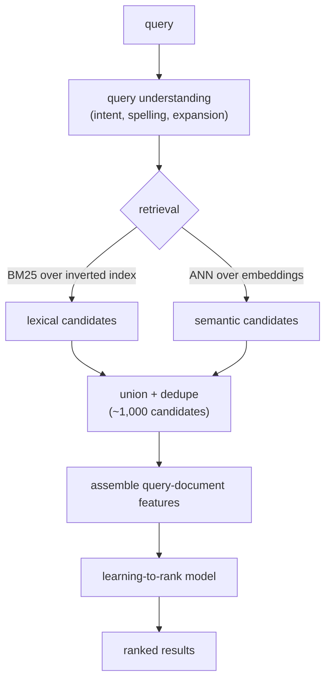
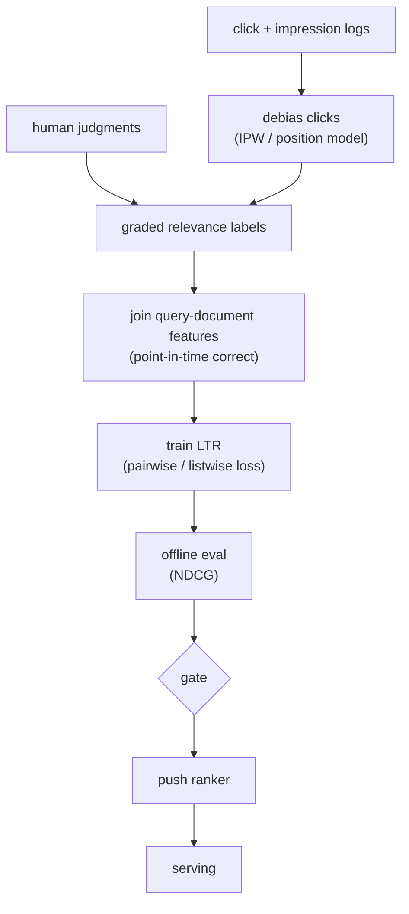
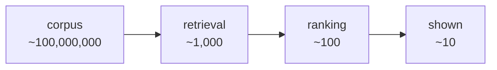

# Chapter 6: Search Ranking

A user types a query into a search box, and behind that box sits a corpus of hundreds of millions of documents. The system has to understand what the user meant, narrow the whole corpus down to a handful of candidates, and order those candidates so the best one lands on top. That is search ranking, and at first glance it looks like the recommendation ranking you met earlier with a query bolted on. The query, it turns out, changes everything.

The trap most candidates fall into is to treat search as one big relevance model and skip the two stages that actually carry the load: understanding what the user meant, and a retrieve-then-rank funnel built for an explicit query rather than a user profile. The signal an interviewer is listening for lives in query understanding, in why learning-to-rank uses pairwise or listwise objectives instead of plain classification, and in how you cope with labels that are mostly biased clicks.

In this chapter, we will cover the following topics:

- Clarifying and scoping a search ranking problem
- The functional and non-functional requirements that shape the design
- The online serving path and the offline labeling path
- Query understanding as a first-class stage
- The two-stage retrieval-and-ranking funnel adapted to search
- Learning-to-rank objectives: pointwise, pairwise, and listwise
- Relevance labels, position bias, and how to fight it
- Features, the NDCG metric, and the offline-online gap
- Bottlenecks, failure modes, and the questions that follow

By the end, you will be able to design a search ranking system end to end and defend the modeling choices that separate a search answer from a recommendation answer.

## Clarifying and scoping

Before drawing a single box, pin down the shape of the problem. Search has a few parameters that quietly decide the whole design, and a strong candidate surfaces them first.

- **Corpus size and shape.** Assume hundreds of millions of documents, with a long tail and a constant stream of new and updated documents. Both the tail and freshness matter, and they pull the design in different directions.
- **Query traffic.** Tens of thousands of queries per second at peak, with a heavy head (a few queries are enormously common) and a long tail of rare and never-before-seen queries.
- **Latency budget.** Search is a single user-facing request. The whole thing (query understanding, retrieval, ranking, rendering) lives in the low hundreds of milliseconds, so ranking itself gets a slice of tens of milliseconds.
- **What does "good" mean?** Relevance of the document to the query intent, usually graded (perfect, good, fair, bad), not a single binary. The metric is position-weighted, because the top slots are worth far more than the rest.
- **Personalization and context.** Some. The same query can mean different things by location, time, or user history. Decide early how much the query dominates versus the user, because that decision shapes the entire feature set.

That last point is worth dwelling on. In recommendation, the user is the query. In search, an explicit query arrives, and for most queries it should dominate the user profile. Getting the balance wrong is a common way to build a system that quietly ignores what people actually typed.

## Requirements

With the scope clarified, we can state the requirements plainly.

**Functional requirements:**

- Given a query, return a ranked list of relevant documents from the full corpus.
- Understand the query first: intent, spelling, and expansion.
- Incorporate new and updated documents quickly (freshness).
- Support both lexical and semantic matching, because neither alone is enough.

**Non-functional requirements:**

- p99 end-to-end search latency in the low hundreds of milliseconds.
- Recall high enough through retrieval that the ranker is not starved of good documents.
- Throughput of tens of thousands of QPS with headroom.
- Document freshness: new and updated documents searchable within minutes.

One non-functional requirement quietly dominates all the others: **graded relevance under a hard latency budget, against labels you mostly cannot trust**. Unlike recommendation, your most abundant signal (clicks) is heavily biased by position, and your trustworthy signal (human judgments) is scarce and expensive. Flag that tension early in an interview, because the rest of the answer is about managing it.

## The high-level data flow

The system has two paths that meet at the ranker. The online path serves a live query: it runs query understanding, then a two-stage funnel adapted to search (lexical plus semantic retrieval, then a learning-to-rank model). The offline path turns logged clicks and human judgments into labels and trains the ranker that the online path serves.

### The online serving path

*Figure 6.1* traces a single query from the search box to the ranked list. It is the one diagram to fix in your head, because every deep dive in this chapter is a zoom-in on one of its boxes.

*Figure 6.1: The online serving path, from query through understanding and two-arm retrieval to the learning-to-rank model*

Query understanding runs first because everything downstream keys off it. The corrected, expanded query drives both retrieval arms, and the parsed intent becomes a ranking feature. Notice that the two retrieval arms are unioned, not chosen between. Lexical and semantic each catch documents the other misses, so you run both and merge, rather than picking a winner.

### The offline labeling and training path

The offline path is where search gets genuinely harder than recommendation. *Figure 6.2* shows it: two label sources feed a fusion step, the fused labels join point-in-time-correct features, and the joined data trains the ranker under a pairwise or listwise loss before an NDCG pre-gate and a push to serving.

*Figure 6.2: The offline path, fusing debiased clicks with human judgments into graded labels before training and gating the ranker*

The label step is the hard part and the reason this loop is more involved than a plain recommendation ranking loop. Clicks come in cheap but biased, human judgments come in trustworthy but scarce, and you have to fuse them into graded labels before the loss ever sees them.

## Query understanding comes first

Before retrieval, you turn the raw query string into something the system can act on. There are three jobs here, and naming all three signals to an interviewer that you know search is not just matching strings.

- **Intent classification.** Is this navigational (the user wants one specific page), informational (they want to learn something), or transactional (they want to do or buy something)? Intent changes what a good result looks like and becomes a ranking feature in its own right.
- **Spelling correction.** A large fraction of queries are misspelled. You correct before retrieval, or the lexical arm matches nothing. This is itself a model, either a noisy-channel model or a small sequence-to-sequence model, trained on query reformulation logs.
- **Query expansion.** You add synonyms, stems, and related terms so that "laptop" can match "notebook computer." Done carefully, expansion lifts recall. Done carelessly, it drifts the query and tanks precision. This is also where semantic retrieval earns its keep, because an embedding match expands the query implicitly without you enumerating synonyms.

A subtle point worth raising: query understanding can run as a quick explicit pre-step, or it can be folded into the semantic encoder. Both happen in practice. The explicit pre-step gives you features and debuggability; the encoder route is simpler. Naming the tradeoff shows depth.

## The two-stage funnel, adapted to search

Search uses the same retrieve-then-rank funnel as recommendation retrieval, but retrieval is keyed by a query, not a user, and it has two arms. *Figure 6.3* shows the orders of magnitude: the funnel exists to spend cheap compute broadly and expensive compute narrowly.

*Figure 6.3: The retrieval-and-ranking funnel, collapsing a hundred-million-document corpus to the ten results a user sees*

The two retrieval arms have complementary strengths and complementary failure modes.

- **Lexical retrieval (BM25).** An inverted index maps terms to the documents containing them. BM25 scores documents by term frequency and inverse document frequency with length normalization. A common form of the score for a document $D$ and query $Q$ is:

$$\text{BM25}(D, Q) = \sum_{t \in Q} \text{IDF}(t) \cdot \frac{f(t, D)\,(k_1 + 1)}{f(t, D) + k_1\left(1 - b + b\,\frac{|D|}{\text{avgdl}}\right)}$$

  Here $f(t, D)$ is the term frequency of $t$ in $D$, $|D|$ is the document length, $\text{avgdl}$ is the average document length, and $k_1$ and $b$ are tuning constants. BM25 is fast, interpretable, and unbeatable for exact-term and rare-term matches such as a product code or a specific name. Its weakness is the vocabulary gap: it cannot match "car" to "automobile."

- **Semantic retrieval (dense).** A dual-encoder embeds the query and every document into a shared space, and an approximate nearest neighbor (ANN) index finds the nearest documents. This is the same two-tower structure as recommendation retrieval, with the query taking the user's place. The score is a similarity between the query embedding $\mathbf{q}$ and a document embedding $\mathbf{d}$:

$$s(\mathbf{q}, \mathbf{d}) = \frac{\mathbf{q} \cdot \mathbf{d}}{\lVert \mathbf{q} \rVert\,\lVert \mathbf{d} \rVert}$$

  Because the towers never mix features before this final dot product, every document vector can be precomputed offline and served with ANN. Semantic retrieval closes the vocabulary gap, but it can drift on rare terms and exact strings, which is exactly where BM25 is strong.

You run both arms and union the results, because their failure modes are complementary. This is the search-specific twist on the funnel: retrieval is two arms, and the ranker sees the union.

## Learning-to-rank objectives: pointwise, pairwise, and listwise

The ranker is a learning-to-rank (LTR) model, and the choice of training objective is the heart of a strong interview answer. There are three families, and they differ in what they optimize.

**Pointwise.** Predict an absolute relevance score per document independently (regression or classification), then sort by that score. The loss for a single document is just an ordinary supervised loss against its graded label:

$$\mathcal{L}_{\text{point}} = \sum_{i} \ell\big(f(x_i), y_i\big)$$

This is simple and reuses ordinary classification machinery, but it optimizes the wrong thing. It cares about getting each absolute score right, not about the *order*, and it ignores that documents for one query only matter relative to each other.

**Pairwise.** Take pairs of documents for the same query and learn which one should rank higher. RankNet is the canonical example: for a pair $(i, j)$ where $i$ should outrank $j$, it models the probability that $i$ beats $j$ with a logistic function of the score difference and applies a cross-entropy loss:

$$P_{ij} = \frac{1}{1 + e^{-\sigma\,(s_i - s_j)}}, \qquad \mathcal{L}_{\text{pair}} = -\sum_{(i,j)} \bar{P}_{ij}\,\log P_{ij} + (1 - \bar{P}_{ij})\,\log(1 - P_{ij})$$

Here $s_i = f(x_i)$ is the model score and $\bar{P}_{ij}$ is the target (1 when $i$ is more relevant). This matches the task: ranking is fundamentally about relative order, and a pairwise loss optimizes exactly that. It is the workhorse of learning-to-rank.

**Listwise.** Optimize a loss defined over the whole ranked list at once. LambdaRank and LambdaMART weight each pair by how much swapping it would change NDCG, so the gradient (the "lambda") for a pair is scaled by the metric delta:

$$\lambda_{ij} = \frac{-\sigma}{1 + e^{\sigma\,(s_i - s_j)}}\,\big|\Delta\text{NDCG}_{ij}\big|$$

ListNet instead defines a probability distribution over permutations and minimizes cross-entropy between the predicted and ideal distributions. Either way, listwise training aligns the objective with the position-weighted metric you actually report.

Why do pairwise and listwise fit ranking while pointwise does not? The metric is about order and is position-weighted, so the top slots dominate. Pointwise spends capacity getting absolute scores right everywhere, including deep in the list where it does not matter. Pairwise and listwise concentrate on getting the *order* right, and listwise can directly weight the swaps that move the metric. That alignment between loss and metric is the senior point to make.

## Relevance labels: human judgments versus click-derived labels

The model is only as good as its labels, and search labels come from two very different sources.

**Human judgments.** Trained raters grade query-document pairs (perfect, good, fair, bad) against written guidelines. These are high quality and unbiased, but expensive, slow, and impossible to scale to the full query distribution. They cover the head and a sample of the tail, and they are the gold standard you calibrate against.

**Click-derived labels.** Clicks are abundant and free, and they reflect real users, but they are biased (see position bias below) and noisy. A click is not the same as relevance; the user may bounce straight back. Techniques such as dwell-time thresholds, last-click attribution, and skip-above models turn raw clicks into cleaner relevance signals.

In practice you fuse them. Human judgments anchor and validate; click-derived labels provide volume and freshness. Saying that you would use both, and explaining why each alone is insufficient, is the complete answer.

## Position bias and how to fight it

This is the deep dive that separates a search answer from a recommendation answer. **Users click higher-ranked results more, regardless of relevance**, simply because they see them first. If you train naively on clicks, the model learns to predict position, not relevance, and reinforces whatever order you already shipped. It becomes a feedback loop that locks in yesterday's ranking.

There are two standard corrections, and they are often combined.

**Inverse-propensity weighting (IPW).** Estimate the probability that a result at position $p$ gets examined (the propensity, $\text{prop}_p$), then weight each click by the inverse of that propensity. A click at position 10 is rarer, and so it counts for more than a click at position 1. The debiased empirical loss becomes:

$$\mathcal{L}_{\text{IPW}} = \sum_{i} \frac{c_i}{\text{prop}_{p_i}}\,\ell\big(f(x_i), y_i\big)$$

where $c_i$ indicates a click and $p_i$ is the displayed position. Dividing by the examination propensity makes the loss estimate true relevance rather than examination. You need a propensity estimate, usually from a position model or from small randomization (result-swap) experiments.

**Position as a train-time feature.** Feed the displayed position into the model during training so it can explain away the position-driven part of the click, then fix or drop that feature at serving time by setting it to a constant. The model learns relevance net of position.

Whichever you use, estimate propensities carefully. Randomization experiments are the clean way, even if they cost a little live traffic, because the whole debiasing rests on the propensity estimate being right.

## Features

The ranker's features fall into a few families, and naming them shows that you know where search relevance actually comes from.

- **Query-document match.** The core signal: the BM25 score, field-level matches (title versus body), the semantic similarity from the dual-encoder, and exact-phrase and proximity features. This is what makes it a *ranking* model and not a generic recommender.
- **Document popularity and quality.** Click-through history, link or authority signals, spam and quality scores. A relevant-but-low-quality page should not win.
- **Freshness.** For time-sensitive queries such as news and events, recency is decisive; for evergreen queries it barely matters. A freshness feature paired with an intent signal lets the model learn when to care.
- **Personalization and context.** Location, language, device, and (lightly) user history disambiguate queries that mean different things to different people. Keep it secondary to the query itself for most queries.

## The metric: NDCG and the offline-online gap

The standard offline metric is **NDCG** (normalized discounted cumulative gain). It rewards putting highly relevant documents near the top. Each result contributes its graded relevance, discounted by a function of its position, and the sum is normalized by the ideal ordering so it lands in $[0, 1]$. First, discounted cumulative gain at rank $k$:

$$\text{DCG}@k = \sum_{i=1}^{k} \frac{2^{rel_i} - 1}{\log_2(i + 1)}$$

The numerator $2^{rel_i} - 1$ rewards graded relevance (a "perfect" result is worth exponentially more than a "fair" one), and the denominator $\log_2(i + 1)$ discounts by position. Normalizing by the ideal DCG (the DCG of the best possible ordering) gives NDCG:

$$\text{NDCG}@k = \frac{\text{DCG}@k}{\text{IDCG}@k}$$

NDCG is the right offline metric precisely because it is graded (it matches your label scale) and position-weighted (it matches the fact that the top slots dominate), which is also why you want a listwise loss that optimizes something close to it.

But offline NDCG and online success do not move together reliably. Offline NDCG is computed against your labels, which are themselves biased clicks plus a thin layer of human judgments, so it can lie. The online truth is an interleaving experiment or an A/B test on engagement and query-reformulation rate. Wire NDCG as a fast offline pre-gate and the online test as the ship decision. Never ship on offline NDCG alone. For navigational queries, where there is one right answer, companion metrics such as mean reciprocal rank (MRR) are worth reporting alongside NDCG.

## Latency

Search is user-facing and synchronous, so the budget is tight and split across stages. Query understanding must be milliseconds, which means small models and cached corrections. Retrieval runs the inverted-index and ANN lookups in parallel, not in series, and unions the results. Ranking then scores the union, so you batch the forward pass over candidates and fetch the shared query features once.

The lever nobody states out loud: the deeper the ranker and the more candidates it scores, the better the relevance and the worse the latency. So you size the candidate set and the model *backwards* from the budget, not forwards from what you wish you could run.

## Bottlenecks and scaling

Every stage has a first-order scaling limit. *Table 6.1* lists the ones that bite in production, the symptom that announces each, the standard fix, and the tradeoff you accept when you apply it.

| Bottleneck | First sign | Fix | Tradeoff |
|---|---|---|---|
| Inverted-index fan-out on common terms | Tail-latency spikes on broad queries | Shard by document, early-termination / WAND | Recall versus latency |
| ANN search latency at corpus scale | p99 retrieval creeps up | Tune probe depth, shard, IVF-PQ | Recall versus latency/memory |
| Per-candidate ranking cost | Ranking p99 over budget | Batch scoring, shrink model, fewer candidates | Accuracy versus latency |
| Position bias in labels | Model predicts position, not relevance | IPW plus position-as-feature | Needs propensity estimates |
| Scarce human judgments | Tail relevance unmeasured | Active-sample the tail, fuse click labels | Labeling cost |
| Stale document index | New documents not searchable | Frequent incremental index updates | Write-path complexity |
| Offline-online metric gap | NDCG up, engagement flat | Interleaving / A/B as the gate | Slower iteration |

*Table 6.1: Search ranking bottlenecks, their symptoms, standard fixes, and the tradeoffs each fix accepts*

## Failure modes, safety, and eval

A design is only as good as its awareness of how it breaks. The failure modes below are the ones worth naming without being asked.

- **Position bias (the headline failure).** Naive click training teaches the model to predict rank, not relevance, and locks in a feedback loop. Correct with IPW and position-as-a-feature, and inject a little randomization so you can keep estimating propensities.
- **Query understanding errors cascade.** A wrong spelling correction or an over-aggressive expansion poisons both retrieval arms before ranking ever runs. Be conservative on expansion, and keep the original query as a fallback.
- **Vocabulary gap.** Lexical-only retrieval misses synonyms and paraphrases; semantic-only drifts on rare terms and exact strings. The union of both is the guard, which is why neither arm is optional.
- **Tail and zero-result queries.** Rare or never-seen queries have no click history and may retrieve nothing. Lean on semantic retrieval and aggressive-but-safe expansion, and detect zero-result cases so you can relax the query rather than return an empty page.
- **Label leakage and point-in-time correctness.** Join features as they were at query time, not as they are now, or popularity and click features leak the future and the offline NDCG lies.
- **Eval.** Offline, use NDCG (and companions such as MRR for navigational queries), computed on a held-out, debiased label set. Treat it as a pre-gate, not the verdict. The ship decision is an interleaving experiment or an A/B test on engagement and query-reformulation rate, because offline gains routinely fail to survive online.

## Questions
Interviewers pull threads. Here are the ones that come up most, with the crisp answer to each.

- **"Why not just use BM25?"** It cannot bridge the vocabulary gap of synonyms and paraphrases, and it has no way to learn from clicks or rich features. It is a great retrieval arm and a poor final ranker.
- **"Why pairwise or listwise instead of just predicting a relevance score?"** Because the metric is about order and is position-weighted. Pointwise optimizes absolute scores everywhere, including where it does not matter; pairwise and listwise optimize the order, and listwise can target NDCG directly.
- **"Your clicks say result 1 is best. Do you trust that?"** Not on its own. Result 1 gets clicks because it is on top. Debias with inverse-propensity weighting and treat position as a train-time feature before believing any click.
- **"Offline NDCG went up but engagement did not. Why?"** Your labels are biased clicks plus thin human judgments, so offline NDCG can be optimistic. Suspect the label pipeline and position debiasing first, and trust the online interleaving or A/B test.
- **"How is this different from recommendation ranking?"** There is an explicit query, so query understanding is a first-class stage, retrieval has a lexical arm, and the dominant label problem is position-biased clicks rather than multi-task engagement. The funnel shape is shared with retrieval and ranking; the query is what changes.

## Tracing the architectures

Search ranking is two models wired in sequence: a dual-encoder that retrieves semantically, and a feature-rich ranker that scores the survivors. Both have a structural detail that static diagrams get wrong, so it is worth opening the real graphs and tracing them.

- **Two-tower (the query/document dual-encoder for semantic retrieval).** Read the query tower and the document tower down to the similarity layer. Note that they never mix features before the final dot product, which is exactly what lets you precompute every document vector offline and serve the semantic arm with ANN. This is the retrieval side of the funnel, before ranking.
- **DLRM (the feature-rich ranker scoring retrieved documents).** Find the embedding tables for the sparse query-document features, follow them into the pairwise-interaction layer, and confirm it sits after the embeddings and before the top MLP. This is the learning-to-rank model that orders the documents retrieval handed it.

A good exercise before an interview is to trace the full path a document takes, from the dual-encoder that retrieves it semantically to the ranker that scores its query-document features. The position of the join in each (a late dot product in the tower, a mid-graph interaction layer in DLRM) is the whole reason one retrieves and the other ranks.

## Summary

Search ranking looks like recommendation with a query attached, but the query is what makes it a distinct problem. We saw that the design rests on three ideas working together. First, query understanding runs before anything else, turning a raw string into intent, corrected spelling, and expanded terms that drive both retrieval arms. Second, retrieval is a two-arm funnel: BM25 over an inverted index for exact and rare terms, and a dual-encoder with ANN for the vocabulary gap, unioned rather than chosen between. Third, the ranker is a learning-to-rank model trained with a pairwise or listwise loss, because the metric (NDCG) is about position-weighted order, and only order-aware losses optimize what you actually report.

Threaded through all three is the label problem that defines search: clicks are abundant but position-biased, human judgments are trustworthy but scarce, and you fuse them while correcting position bias with inverse-propensity weighting and position-as-a-feature. Offline NDCG is a pre-gate, never the verdict; the online interleaving or A/B test is what ships.

In the next chapter, *Fraud and Anomaly Detection*, we turn from ordering relevant results to catching rare, adversarial ones. The labels get even harder (fraud is scarce, delayed, and actively hidden from you), the class imbalance becomes extreme, and the cost of a false negative dwarfs the cost of a false positive. Many of the calibration and threshold-setting ideas we touched on here will move to center stage.

## Further reading

Production engineering writeups of the systems in this chapter, each a first-party source:

- **Wang et al.** [DCN V2: Improved Deep & Cross Network](https://arxiv.org/abs/2008.13535): Explicit, efficient feature crosses in a ranking model used at web scale. *(ranking model)*
- **Cheng et al.** [Wide & Deep Learning](https://arxiv.org/abs/1606.07792): Memorization (wide linear over crossed features) plus generalization (deep net) for ranking. *(ranking model)*
- **Burges** "From RankNet to LambdaRank to LambdaMART: An Overview": the canonical learning-to-rank reference, walking from a pairwise RankNet loss to LambdaRank's NDCG-weighted gradients to the LambdaMART tree ensemble. The clearest single source on why ranking losses are pairwise and listwise rather than pointwise. *(learning-to-rank)*
- **Amazon** [From structured search to learning-to-rank-and-retrieve](https://www.amazon.science/blog/from-structured-search-to-learning-to-rank-and-retrieve): Unifies retrieval and ranking via learning-to-rank-and-retrieve with contextual bandits. *(product design)*
- **LinkedIn** [Improving Post Search at LinkedIn](https://www.linkedin.com/blog/engineering/search/improving-post-search-at-linkedin): Multi-stage retrieval plus learning-to-rank for member post search. *(product design)*
- **Pinterest** [SearchSage: learning search query representations](https://medium.com/pinterest-engineering/searchsage-learning-search-query-representations-at-pinterest-654f2bb887fc): A query embedding model powering search retrieval and ranking relevance. *(deployment)*
- **Instacart** [Optimizing search relevance using hybrid retrieval](https://tech.instacart.com/optimizing-search-relevance-at-instacart-using-hybrid-retrieval-88cb579b959c): Hybrid text plus embedding retrieval feeding two-stage ranking. *(deployment)*
- **Instacart** [Building the Intent Engine: query understanding with LLMs](https://company.instacart.com/tech-innovation/building-the-intent-engine-how-instacart-is-revamping-query-understanding-with-llms): An LLM-based query-understanding pipeline for intent and category mapping. *(product design)*
- **Yelp** [Learning to Rank for Business Matching](https://engineeringblog.yelp.com/2014/12/learning-to-rank-for-business-matching.html): Moving business matching from hand-tuned scoring to learning-to-rank. *(product design)*
- **Wayfair** [WANDS: a public e-commerce product-search relevance dataset](https://www.aboutwayfair.com/careers/tech-blog/wayfair-releases-wands-the-largest-and-richest-publicly-available-dataset-for-e-commerce-product-search-relevance): A public human-judged relevance-label dataset for search evaluation. *(eval bar)*
