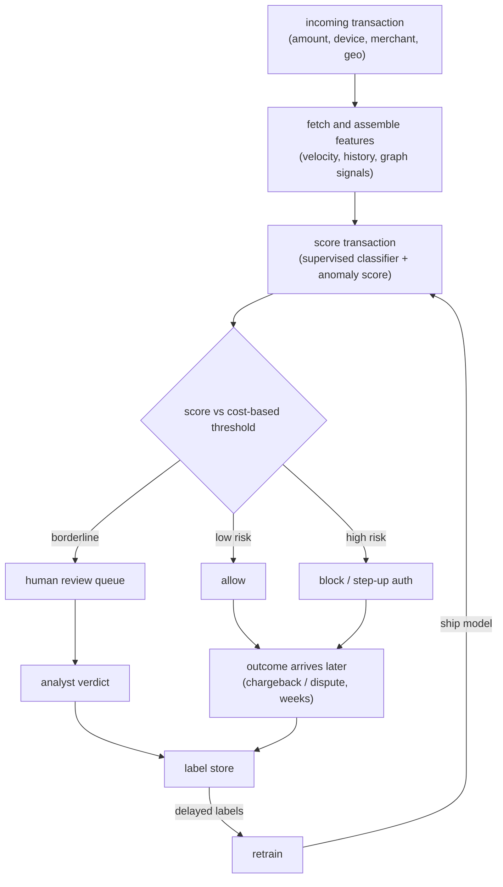
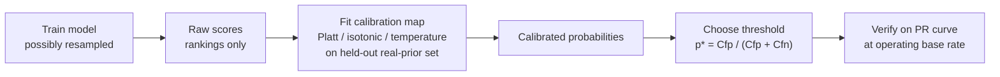

# Chapter 7: Fraud and Anomaly Detection

Money is moving through your platform, and some of it is being moved by people who should not be moving it. The interviewer's brief is deceptively simple: design a system that flags fraudulent transactions in real time, blocks the bad ones, lets the good ones through, and does not enrage legitimate customers in the process. Walk through the model, the imbalance, the threshold, and how you cope with labels that arrive weeks late.

The reason this question separates senior candidates from junior ones is that the modeling instinct, "train a classifier," is the easy part. The trap is everything around it. Fraud is rare, so accuracy is a lie. The decision is cost-sensitive, so the threshold is the product, not a footnote. Labels arrive weeks later as chargebacks, so your training set is always stale and your live evaluation is partly blind. And the adversary adapts on purpose, so the distribution drifts because someone is paid to make it drift. The signal you want to send is that you treat this as a cost-sensitive decision under extreme imbalance and adversarial drift, not as a leaderboard accuracy contest.

In this chapter, we will cover the following topics:

- Clarifying scope, base rate, and the cost matrix before writing a line of model code
- Functional and non-functional requirements, and why one requirement dominates
- The two coupled data paths: the inline scoring path and the delayed-label loop
- Handling extreme class imbalance and choosing metrics that do not flatter you
- Deriving the decision threshold from costs and calibrated probabilities
- Living with label delay, real-time features, supervised versus anomaly detection, graph signals, and the human review loop
- Bottlenecks, failure modes, and the evaluation bar that actually gates a ship

By the end of the chapter, you will be able to reason about a rare-event, cost-sensitive detection system end to end, and to defend each design choice against the follow-up questions an interviewer will push on.

## Clarifying and scoping the problem

Do not start modeling. Start by pinning down the numbers and the actions, because they change the entire design. Here are the questions worth asking, and why each one matters.

**Fraud or abuse, and what action?** Card-not-present payment fraud, account takeover, fake-account abuse, and promo abuse have different signals and different costs. Equally important is what the system is allowed to do: allow, block, or send to human review. The action set shapes the thresholds, so establish it early.

**What is the base rate?** Fraud is typically well under 1 percent of transactions, often a fraction of that. That single number kills accuracy as a metric and drives the whole evaluation and sampling design. Ask for it up front.

**What are the costs?** A false positive blocks a real customer: lost sale, support cost, churn, brand damage. A false negative is a realized loss: the chargeback plus network fees plus operational overhead. These are not symmetric, and the ratio between them is what sets the decision threshold. Get the cost matrix, even if only roughly.

**What is the latency budget?** The decision sits inline in the payment authorization flow, so it is milliseconds, not seconds. That constrains you to precomputed feature lookups and a cheap model, the same constraint you meet in a ranking system.

**When do labels arrive?** Card-network chargebacks can land 30 to 120 days after the transaction. Some labels are fast, a customer disputing a charge instantly, but most are slow. This delay is the defining property of the problem, so name it now.

**Supervised, unsupervised, or both?** Do you have labeled fraud, which points to a supervised classifier, or are you hunting novel patterns with no labels yet, which points to anomaly detection? Usually the answer is both, for different jobs.

## Requirements

With scope clarified, translate it into requirements.

**Functional requirements:**

- Score every transaction for fraud risk inline, before authorization completes
- Map the score to an action (allow / block / review) via a tunable threshold
- Route borderline cases to a human review queue and capture the analysts' verdicts
- Ingest delayed labels (chargebacks, disputes, manual reviews) as they arrive and feed them back into training
- Support both a supervised classifier and an unsupervised anomaly path

**Non-functional requirements:**

- p99 scoring latency in the low tens of milliseconds, inline with authorization
- Optimize precision, recall, and PR-AUC, never accuracy
- Threshold derived from the cost matrix, revisited as costs and base rate move
- Online/offline feature parity, so there is no training-serving skew
- Drift detection on inputs and outputs, because the adversary moves on purpose

The requirement that dominates everything else is this: a cost-sensitive decision under extreme imbalance. Name it first in the interview. Sampling, metric choice, threshold, and the review loop are all in service of getting that one decision right, cheaply and fast.

## High-level data flow

The system has two coupled paths. The inline path scores a transaction and acts in milliseconds. The delayed-label loop closes weeks later and feeds the next training cycle. Drawing the slow loop is the part that signals you understand the problem, because most candidates draw only the fast path and stop.

*Figure 7.1* shows the full loop, from an incoming event through features, model, threshold, and review, back to the label store that feeds retraining.

*Figure 7.1: The event to features to model to threshold to review to labels loop. The only fast feedback is the human review queue; the ground-truth chargeback label closes the loop weeks later.*

The thing to point at is that the only fast feedback is the human review queue. The ground-truth label, a settled chargeback, takes weeks, so the loop from `OUTCOME` back to `TRAIN` is long, and your live precision and recall estimates always lag reality. You design around that lag rather than pretending labels are instant.

## Extreme class imbalance, and why accuracy is useless

If 0.2 percent of transactions are fraud, a model that predicts "never fraud" scores 99.8 percent accuracy and catches nothing. Accuracy rewards ignoring the positive class, which is the entire job. This is the first place where a strong answer diverges from a weak one.

**Use the right metrics.** Precision, of the transactions we flagged, how many were truly fraud, and recall, of the true fraud, how much we caught, trade off directly against each other:

$$\text{Precision} = \frac{TP}{TP+FP}, \qquad \text{Recall} = \frac{TP}{TP+FN}$$

PR-AUC, the area under the precision-recall curve, summarizes that tradeoff far better than ROC-AUC when positives are rare. The reason is structural: ROC-AUC plots the true positive rate against the false positive rate, and the false positive rate

$$\text{FPR} = \frac{FP}{FP+TN}$$

normalizes by the enormous true-negative pool, so it stays optimistic even when your positive predictions are mostly wrong. Precision has no such cushion; it degrades honestly as the positive base rate shrinks. Lead with PR-AUC.

**Handle the imbalance at train time.** The options, in rough order of preference:

- **Class weights.** Upweight the fraud class in the loss. Cheap, and it keeps all the data.
- **Focal loss.** Down-weight easy, well-classified examples so the gradient concentrates on the hard, rare positives. For a predicted probability $p_t$ of the true class, the focal loss is

$$\mathcal{L}_{\text{focal}} = -\alpha_t\,(1 - p_t)^{\gamma}\,\log(p_t)$$

  where $\gamma$ is the focusing parameter, typically around 2, and $\alpha_t$ is a class-balancing weight. As a well-classified example pushes $p_t$ toward 1, the modulating factor $(1 - p_t)^{\gamma}$ collapses toward 0, so the abundant easy negatives contribute almost nothing and the loss is dominated by the rare, hard cases you care about.
- **Undersampling** the majority. Fast, but throws away signal.
- **Oversampling the minority**, including synthetic methods such as SMOTE (Synthetic Minority Over-sampling Technique), which interpolates new minority points between existing ones. Useful, but it can blur the very decision boundary you care about and invent unrealistic samples.

The honest answer is: reach for class weights or focal loss first, resample only if needed, and always measure on the real, imbalanced distribution.

**Keep evaluation honest.** You may rebalance training data, but evaluate on the true base rate, or your precision number is fiction. This is worth stating explicitly, because rebalancing the evaluation set is a common and quietly fatal mistake.

## The cost-sensitive decision: the threshold is the product

The model outputs a probability. The threshold turns that probability into an action, and that threshold is a business decision, not a default of 0.5. To set it properly you need two things: a cost matrix, and a calibrated probability.

Build the cost matrix from the two error types:

- **False positive cost:** lost sale margin, support contact, churn risk.
- **False negative cost:** chargeback amount, network fees, operational overhead.

For a calibrated probability $p$, the optimal threshold sits at the point where the marginal expected cost of flagging equals the marginal expected cost of missing. That point has a clean closed form:

$$p^{*} = \frac{C_{fp}}{C_{fp} + C_{fn}}$$

Read what this says. If missing a fraud costs ten times a false alarm, so $C_{fn} = 10\,C_{fp}$, then $p^{*} \approx 0.09$, well below 0.5: you push the threshold down, catching more fraud and accepting more false alarms. If blocking a real customer is brutally expensive, $C_{fp}$ dominates and you push the threshold up.

Often it is not one threshold but two. Below $t_{\text{low}}$ you allow; above $t_{\text{high}}$ you block; in the band between them you send to review. Stating "I would choose the operating point from the cost matrix, not optimize a single accuracy number" is the senior move here.

There is a catch that many candidates miss: the formula $p^{*} = C_{fp}/(C_{fp}+C_{fn})$ is only valid when $p$ is a genuine probability. Raw scores from boosted trees, from SVMs, or from a model trained on resampled data are rankings, not probabilities. Applying the threshold rule to uncalibrated scores silently picks the wrong operating point.

### Calibration: why raw scores are not probabilities

A model is calibrated when, among the examples it assigns score $p$, a fraction $p$ are actually positive. Formally, $\Pr(y = 1 \mid \hat{p} = p) = p$ for every $p$; a score of 0.3 should be right 30 percent of the time. Three common situations break this:

- **Margin models.** SVM decision-function outputs are signed distances to a hyperplane with no probabilistic meaning.
- **Trees and ensembles.** Boosted trees produce sigmoid-shaped distortions, over-confident or under-confident near the extremes.
- **Resampling and class weighting.** These raise the effective positive prior the model sees, so its output probabilities are inflated relative to the real base rate. Ranking may improve while the absolute probabilities drift too high.

A model can have excellent AUC and be badly miscalibrated, because AUC depends only on the ordering of scores, not their absolute values; any monotone transform of the scores leaves AUC unchanged. Ranking quality and probability quality are separate axes.

To recover probabilities, fit a calibration map on a held-out set drawn from the real class prior:

- **Platt scaling** fits a one-dimensional logistic regression, $\hat{p} = \sigma(a\,s + b)$. Data-efficient, ideal for small validation sets and roughly sigmoidal distortion.
- **Isotonic regression** fits any monotone step function, correcting arbitrary-shaped miscalibration, but needs more data and can overfit on small sets.
- **Temperature scaling** divides logits by a single learned scalar $T$ before the softmax, fixing neural-network confidence without changing the argmax, so accuracy and ranking are preserved.

For the resampling case there is also an analytic fix. If the training prior $\pi_{\text{train}}$ differs from the true prior $\pi_{\text{true}}$, rescale the odds:

$$\frac{p_{\text{true}}}{1 - p_{\text{true}}} = \frac{p_{\text{train}}}{1 - p_{\text{train}}} \cdot \frac{\pi_{\text{true}} / (1 - \pi_{\text{true}})}{\pi_{\text{train}} / (1 - \pi_{\text{train}})}$$

The order of operations matters, and it is a favorite follow-up. Always calibrate first, then threshold, and do both on data drawn from the real class prior, never on the resampled training set. *Figure 7.2* traces the flow.

*Figure 7.2: Calibrate before you threshold. The cost-based threshold rule is only valid on genuine probabilities, so the calibration map is fit on a held-out, real-prior split, and the operating point is verified on a separate PR curve.*

Fit the calibration map on one held-out split and verify the threshold on another, so the operating point is not tuned on the same data that fixed the probabilities. This calibrate-then-threshold discipline is especially critical here because the fraud score does not just get thresholded once; it can feed expected-cost routing decisions where a miscalibrated $p$ directly scales the outcome.

## Label delay and its consequences

Chargebacks arrive weeks after the transaction, and this delay poisons both training and evaluation. It is the property most candidates underweight.

**Training.** Your most recent transactions have no mature label yet. Treating unlabeled-recent transactions as "not fraud" is a labeling bug: many of them are fraud whose chargeback has not landed. You must respect a maturation window, trusting only labels old enough to be settled. This means you train on data that is already weeks stale, exactly when the adversary has moved on.

**Evaluation.** You cannot measure last week's true precision and recall yet. Use the fast-but-partial signals, instant disputes and analyst verdicts from the review queue, as a leading indicator, and reconcile against settled chargeback labels once they mature. Be explicit in the interview that the live metric is an estimate with a lag; do not claim you can read true precision in real time.

**Point-in-time correctness.** When you finally join the late label to features, use the feature values as of the transaction time, not the values as they stand now, or you leak the future into training. This is the same discipline a feature store enforces.

## Real-time features and serving constraints

The decision is inline with payment authorization, so feature assembly is a lookup, not a computation. The valuable features are velocity and aggregate signals: transactions per card in the last minute, hour, and day; distinct devices per account; amount versus the account's historical distribution; geo-velocity, meaning impossible-travel patterns where a card is used in two distant places too close in time.

These are stateful streaming aggregates, precomputed and served from a low-latency store. This is precisely the feature-store problem, and it is where training-serving skew bites hardest: a velocity counter computed one way in a batch job and a different way in the streaming path means the model scores garbage in production while looking fine offline. Compute each feature once and share it, or log the served features and compare them against the training features.

## Supervised versus unsupervised anomaly detection

There are two tools for two jobs, and knowing when each applies is a signal in itself.

**Supervised classifier.** When you have labeled fraud, this is the workhorse and it is more accurate, because it learns exactly what known fraud looks like. Its weakness is that it is blind to novel attack patterns it has never seen labeled.

**Unsupervised anomaly detection.** Isolation Forest, autoencoder reconstruction error, density estimation. No labels needed; it flags transactions that deviate from normal behavior. It catches new fraud the supervised model has not learned yet, at the cost of more false positives, because unusual is not the same as fraudulent. Use it as a first line against novel attacks and as a feeder for the review queue, whose verdicts become labels for the supervised model.

The mature answer runs both: supervised for known fraud at high precision, anomaly for the unknown, and the human loop converts anomaly hits into labels that eventually train the supervised model to recognize the new pattern.

## The adversarial nature, and why drift is the default

Most ML systems drift by accident, because the world changes slowly. Fraud drifts on purpose. There is a human adversary actively probing your defenses and changing behavior the moment a tactic stops working. So model decay is not an edge case here; it is the steady state.

The consequences follow directly: a short retrain cadence; aggressive monitoring of input distributions and score distributions, where a sudden shift in the mix of declined transactions is itself an attack signature; and acceptance that any fixed model degrades. Fraud is the canonical case where drift detection is a safety system, not a nicety.

## Graph signals: fraud comes in rings

Individual transactions can look clean while the network screams. Fraud rings share devices, payment instruments, shipping addresses, and IP addresses across many accounts. Modeling entities as a graph, with accounts, devices, and cards as nodes and shared attributes as edges, surfaces this: a cluster of "new" accounts all transacting through one device, or a single card touching dozens of accounts.

You can feed graph-derived features, such as connected-component size, shared-device count, and ring membership, into the tabular classifier, or run a graph neural network directly over the entity graph. Mentioning ring detection shows the interviewer you see fraud as a coordinated phenomenon, not a per-event one.

## The human review loop

Borderline scores go to analysts, and this loop does triple duty. It catches what the model is unsure about; it generates fast labels, the only labels you get before chargebacks settle; and it provides a feedback signal for retraining.

Design it deliberately. Route by expected cost, reviewing the cases where a wrong automated decision would be most expensive. Keep the queue sized to analyst capacity: if a team can only review a fixed number of alerts a day, choose the operating point that maximizes recall within that capacity budget rather than optimizing a scalar in isolation. Capture verdicts as first-class labels. The review queue is where both the supervised and anomaly paths get fed; it is infrastructure, not an afterthought.

## Bottlenecks and scaling

The following table names the bottlenecks you should raise before the interviewer does, with the first sign of each, the standard fix, and the tradeoff you accept.

| Bottleneck | First sign | Fix | Tradeoff |
|---|---|---|---|
| Inline scoring latency | Auth p99 over budget | Cheap model, precomputed features, batch lookups | Model capacity vs speed |
| Velocity feature freshness | Counters lag the attack | Streaming aggregates to online store | Operational complexity, skew risk |
| Label delay | Recent data has no mature label | Maturation window, fast review labels as leading signal | Train on stale data |
| Class imbalance | Recall collapses | Class weights / focal loss, careful resampling | Calibration, synthetic-sample noise |
| Threshold drift | FP or FN cost spikes | Recompute operating point from cost matrix periodically | Manual tuning cadence |
| Adversarial drift | Score distribution shifts | Frequent retrain, drift alarms, anomaly path | Compute cost, false-positive churn |
| Review queue overload | Backlog grows, SLAs slip | Route by expected cost, raise review band carefully | Coverage vs analyst load |

## Failure modes, safety, and evaluation

A senior answer closes by naming how the system fails and how you would catch it.

**Optimizing the wrong metric.** Reporting accuracy, or even ROC-AUC, on a 0.2 percent base rate hides total failure. Evaluate on PR-AUC plus precision and recall at the chosen operating point, on the true distribution.

**Leakage via the label.** A feature that encodes the outcome, for example a "was disputed" flag or an aggregate that includes the current transaction, inflates offline metrics and collapses in production. Point-in-time joins and an audit of each feature's availability at decision time prevent it.

**Training-serving skew.** Velocity counters computed differently in batch versus streaming silently wreck the live model. Compute features once and share them, or log served features and compare against training.

**Treating unmatured data as negative.** Recent transactions whose chargebacks have not landed are not all legitimate. Respect the maturation window, or you teach the model that fresh fraud is fine.

**Adversarial adaptation.** A model that was excellent last month can be probed and defeated. Monitor input and score drift as a safety signal, and retrain on the attack cadence, not the calendar.

**Feedback-loop blind spots.** You only see chargebacks on transactions you allowed; blocked transactions never generate a label, so the model can never learn it was wrong to block a good customer. Mitigate with a small randomized hold-out, allowing a tiny fraction of would-be-blocked transactions to measure block precision, and lean on review verdicts.

**The evaluation gate.** Offline PR-AUC and cost-at-threshold are the fast pre-gate. The real ship decision is the live tradeoff of blocked-fraud-dollars versus false-positive-rate, measured against settled labels, plus a human review audit.

## Questions
Interviewers pull threads. Here are the ones that come up most, with the short answer each expects.

- **"Why not accuracy?"** Because fraud is well under 1 percent, so predicting "never fraud" scores about 99.8 percent and catches nothing. Use precision, recall, and PR-AUC.
- **"How do you set the threshold?"** From the cost matrix, on calibrated probabilities: $p^{*} = C_{fp}/(C_{fp}+C_{fn})$. Pick the operating point, or two for an allow/review/block band, that minimizes expected cost at the base rate.
- **"Labels arrive weeks late, so what?"** Respect a maturation window in training, treat fast review verdicts as a leading evaluation signal, reconcile against settled chargebacks, and never treat unmatured recent data as legitimate.
- **"Supervised or anomaly detection?"** Supervised for known fraud at high precision; unsupervised anomaly for novel attacks with no labels yet; run both and let the review queue turn anomalies into labels.
- **"The fraudsters keep adapting, how do you keep up?"** Treat drift as the default: short retrain cadence, drift monitoring on inputs and scores as a safety system, and an anomaly path for the unknown.
- **"How do you catch fraud rings?"** Graph signals: shared devices, cards, addresses, and IPs across accounts; feed graph features into the classifier or run a GNN over the entity graph.

## Tracing the architecture

Fraud scoring is, at its core, a tabular classifier, and many production systems use gradient-boosted trees for exactly this. A deep model is one valid choice, and when you go deep the shape is the wide-and-deep one: the sparse categorical signals that dominate fraud, such as device id, merchant, geo, and card BIN, go through embedding tables; the dense velocity and amount features feed the network directly; and the two paths join before the score. That is the same embedding-plus-dense wiring used in ranking, applied here to a binary fraud label.

A useful exercise before an interview is to open a real wide-and-deep graph, find the embedding tables for the sparse categoricals, follow the dense features through their own path, and see where the wide and deep branches join before the output. Change the embedding dimension of the categorical features and watch where the parameter count moves: it moves in the embedding tables, not the dense layers. That single observation, that the sparse side dominates the parameter budget, is worth more in an interview than reciting the architecture name.

## Summary

In this chapter, you learned to treat fraud detection as what it is: a cost-sensitive decision under extreme imbalance and adversarial drift, not an accuracy contest. You saw why accuracy is useless below a 1 percent base rate and why PR-AUC, precision, and recall are the honest metrics. You worked through handling imbalance with class weights and focal loss while keeping evaluation on the true distribution. You derived the decision threshold from the cost matrix, $p^{*} = C_{fp}/(C_{fp}+C_{fn})$, and saw why it is only valid on calibrated probabilities, which forces a calibrate-then-threshold discipline. You traced the two coupled paths, the inline millisecond scorer and the weeks-long delayed-label loop, and learned to respect a maturation window so unmatured data is not mislabeled as legitimate. Finally, you covered real-time velocity features and their skew risk, the split between supervised and anomaly detection, graph signals for fraud rings, the human review loop as first-class label infrastructure, and the failure modes and evaluation gate that decide whether a model ships.

The through-line is that the model is the easy part; the base rate, the costs, the label delay, and the adversary are the hard parts, and a senior answer leads with them.

The same machinery, rare positive events, asymmetric costs, delayed and noisy labels, and an adversary who adapts on purpose, reappears the moment the thing you are policing is not a payment but a piece of content. In the next chapter, *Content Moderation and Trust and Safety*, we take these same tools and point them at text, images, and behavior, where the cost matrix is measured in harm rather than dollars and the human review loop becomes the ethical and legal center of the system.

## Further reading

Production engineering writeups of the systems in this chapter, each a first-party source:

- **Chawla et al.** [SMOTE: Synthetic Minority Over-sampling Technique](https://arxiv.org/abs/1106.1813): the classic approach to extreme class imbalance, synthesizing minority samples instead of naive oversampling. *(class imbalance)*
- **Cheng et al.** [Wide & Deep Learning](https://arxiv.org/abs/1606.07792): the sparse-embedding-plus-dense tabular shape fraud models often use when they go deep. *(model)*
- **Stripe** [Radar engineering writeups](https://stripe.com/blog): how Stripe scores card fraud in real time with continuously retrained models. *(deployment)*
- **PayPal** [engineering blog](https://medium.com/paypal-tech): real-time fraud and risk modeling at payment scale, including graph and streaming signals. *(real-time features)*
- **Airbnb** [fraud and trust engineering](https://medium.com/airbnb-engineering): risk and abuse modeling with human review loops and graph signals. *(human review)*
- **Stripe** [How we built it: Stripe Radar](https://stripe.dev/blog/how-we-built-it-stripe-radar): ML architecture evolution, feature discovery, and explainability at sub-100ms. *(product design)*
- **PayPal** [Real-time graph database and analysis to fight fraud](https://medium.com/paypal-tech/how-paypal-uses-real-time-graph-database-and-graph-analysis-to-fight-fraud-96a2b918619a): A custom sub-second, million-QPS graph DB for real-time fraud queries. *(deployment)*
- **Uber** [Relational Graph Learning to Detect Collusion](https://www.uber.com/blog/fraud-detection/): An RGCN over the rider-driver graph; +15% precision feeding downstream risk models. *(product design)*
- **Uber** [Risk Entity Watch: anomaly detection to fight fraud](https://www.uber.com/us/en/blog/risk-entity-watch/): Unsupervised anomaly detection scoring entities without labels across business lines. *(product design)*
- **Grab** [Unsupervised graph anomaly detection for new fraud](https://engineering.grab.com/graph-anomaly-model): A GraphBEAN autoencoder on bipartite graphs catches novel fraud without labels. *(product design)*
- **Grab** [Graph for fraud detection](https://engineering.grab.com/graph-for-fraud-detection): RGCN exploits shared-device/address correlations; less labeled data, explainable clusters. *(product design)*
- **Airbnb** [Fighting Financial Fraud with Targeted Friction](https://medium.com/airbnb-engineering/fighting-financial-fraud-with-targeted-friction-82d950d8900e): A loss function weighing friction vs chargeback cost; targeted friction cuts losses. *(eval bar)*
