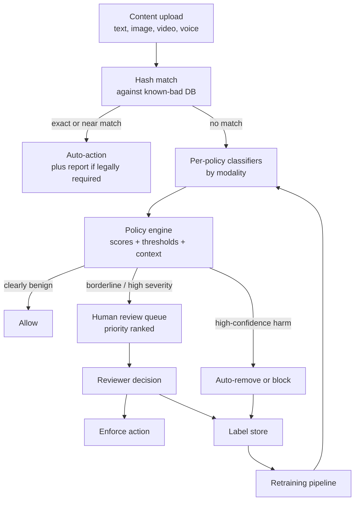

# Chapter 8: Content Moderation and Trust and Safety

Every platform that lets people post reaches a point where a fraction of what they post is content you are legally, ethically, or commercially obligated to stop. The reflex, when an interviewer hands you this problem, is to reach for a classifier and start tuning its accuracy, and that reflex is the first thing that fails the signal check. Content moderation is not an accuracy contest. The core tension is that a miss and a false flag cost wildly different amounts: letting illegal or violent content spread to a million feeds is a catastrophe you cannot undo, while a false flag that a human reviewer clears in ten seconds is a minor annoyance. So the objective is high recall on genuine harm at a fixed precision floor per policy, delivered under real cost budgets, with humans in the loop as both the safety net and the label source, against adversaries who mutate their content the moment you block a pattern, across many modalities and many languages at once. Everything in this chapter is downstream of that framing, and the strongest engineers say it out loud before they draw a single box.

In this chapter, we will build a mental model of a production trust-and-safety system by working through a concrete scenario: a platform with hundreds of millions of users posting text, images, video, and live voice chat, where clear policy violations must be blocked before they spread but ordinary users must not be over-censored, and where motivated adversaries are actively trying to slip content past you. We will scope the harms, frame the objective as recall at a fixed precision floor, build the cheap-to-expensive funnel that protects compute, decompose harm into a per-policy taxonomy, handle each modality with the right backbone, route the uncertain middle to humans and turn their decisions into training labels, and defend the whole thing against an adversary who is probing it tomorrow. Along the way we will open six validated reference architectures, one per modality slot in the stack, so you can trace the actual layers rather than reason about a box labeled "the model."

In this chapter, we will cover the following main topics:

- Scoping content moderation and its requirements
- The moderation funnel: hash match, per-policy classifiers, human review
- The harm taxonomy: one model per policy, not one model for "bad"
- Recall at a fixed precision floor, and why that is the objective
- Multi-modal moderation and tracing the backbone architectures
- Proactive versus reactive detection
- Human review routing and the labeling flywheel
- Adversarial evasion, drift, and known-bad hashing
- Cross-lingual scale, appeals, and borderline content
- Bottlenecks, failure modes, safety, and evaluation

## Technical requirements

To follow along you need a modern web browser to open the validated reference graphs used as figures in this chapter. These are not screenshots: they are shape-checked architecture graphs from the Neurarch model zoo, and each one opens live in the editor so you can inspect real dimensions layer by layer. A moderation stack is not one model, it is a family of backbones, one per modality, and seeing them at real dimensions makes concrete why "run a text model and an image model" is not the same system as one that reasons across modalities.

The six architectures we open in this chapter are:

- **BERT-base**, the workhorse per-policy text classifier: [open it live](https://www.neurarch.com/?import=https://raw.githubusercontent.com/neurarch-ai/awesome-llm-model-zoo/main/architectures/bert-base/model.json)
- **ModernBERT-base**, the longer-context text backbone: [open it live](https://www.neurarch.com/?import=https://raw.githubusercontent.com/neurarch-ai/awesome-llm-model-zoo/main/architectures/modernbert-base/model.json)
- **EfficientNet-B0**, a cheap high-volume image classifier: [open it live](https://www.neurarch.com/?import=https://raw.githubusercontent.com/neurarch-ai/awesome-llm-model-zoo/main/architectures/efficientnet-b0/model.json)
- **ResNet-50**, the higher-capacity image backbone: [open it live](https://www.neurarch.com/?import=https://raw.githubusercontent.com/neurarch-ai/awesome-llm-model-zoo/main/architectures/resnet-50/model.json)
- **CLIP ViT-B/32**, the joint image-text model for hateful memes: [open it live](https://www.neurarch.com/?import=https://raw.githubusercontent.com/neurarch-ai/awesome-llm-model-zoo/main/architectures/clip-vit-b32/model.json)
- **wav2vec2-base**, the audio backbone for voice-chat safety: [open it live](https://www.neurarch.com/?import=https://raw.githubusercontent.com/neurarch-ai/awesome-llm-model-zoo/main/architectures/wav2vec2-base/model.json)

The full collection of 92 validated reference graphs lives in the [Model Zoo repository](https://github.com/neurarch-ai/awesome-llm-model-zoo), with a browsable [gallery](https://neurarch-ai.github.io/awesome-llm-model-zoo). It is built by [Neurarch](https://www.neurarch.com).

Conceptually you will also want to be aware of the components we name but do not build here: a perceptual-hash database of known-bad content with approximate-nearest-neighbor lookup, a policy engine that turns scores into enforcement actions, a priority-ranked human review queue, and a label store feeding a continuous retraining pipeline. No datasets are required to read the chapter; the running example is a platform ingesting text, image, video, and live voice at hundreds of millions of users.

## Scoping content moderation and its requirements

Before drawing any boxes, we scope the problem, because the answers reshape the architecture. The questions worth asking are concrete. Which harms, and are they equally severe? CSAM, terrorism, and imminent violence are legally mandatory to remove and often to report, while spam, nudity, and low-grade harassment are policy violations with very different tolerances, so each harm gets its own model and its own operating point. Which modalities are in scope? Text posts and comments, images, video (which is images plus audio plus time), and live voice chat each need different models and different latency budgets, and live voice is the hardest because there is no "before it posts" moment. Are we proactive, reactive, or both? The answer is both, and the split matters for cost. What is the enforcement surface: hard block at post time, shadow-limit distribution, age-gate, warning interstitial, remove after the fact, or route to human review? The model output feeds a policy engine, it does not directly delete things. And what do legal and regional constraints, request volume, languages, and per-surface latency budgets look like, because a text post can tolerate a few hundred milliseconds while live voice needs sub-second on a rolling window and uploaded video can go async.

Writing these out as functional and non-functional requirements gives us:

**Functional**

- Ingest content across text, image, video, and voice, and produce a per-policy risk assessment for each
- Match known-bad content (CSAM, terrorist media, previously-removed items) via hashing before spending any classifier compute
- Run per-policy classifiers, each with its own calibrated threshold
- Route to enforcement: auto-remove, auto-allow, age-gate, downrank, or send to a priority-ranked human review queue
- Feed human review decisions back as gold labels for retraining, and support an appeals path that can restore wrongly-removed content
- Support proactive (scan-on-ingest) and reactive (report-driven, virality-driven) detection

**Non-functional**

- **High recall at a fixed precision floor per policy.** The floor differs by harm class: CSAM auto-action demands near-perfect precision or it does not auto-action at all (it hashes and routes), while spam can auto-remove at a lower precision because a wrong spam removal is cheap
- Low latency on synchronous surfaces (post-time text, live voice), async tolerance for video
- Cost-bounded: you cannot run the heaviest multimodal model on every one of billions of items, so cheap filters gate expensive ones
- Continuously retrainable, because the threat model is non-stationary by design
- Auditable: every automated action needs a logged reason, because appeals and regulators will ask
- Multilingual and cross-modal from day one, not bolted on

The non-functional requirement that quietly dominates is the asymmetric precision floor. It is what turns this from a classification exercise into a systems problem, and we return to it in its own section.

## The moderation funnel: hash match, per-policy classifiers, human review

A production moderation system is a funnel: cheap and certain checks first, then per-policy classifiers, then a policy engine that turns scores into actions, with a human review queue hanging off the uncertain middle and feeding labels back. We keep the whole shape in one diagram and then walk its stages in the order content flows through them.

*Figure 8.1: The moderation funnel, from hash match against known-bad content through per-policy classifiers and the policy engine to the human review queue, with the two feedback loops (hash short-circuit and the labeling flywheel) that make it work*

The two feedback loops are the whole game. Hash matches short-circuit compute for content we have already judged, and human decisions become the labels that keep the classifiers current against drift. The ordering is load-bearing: hash match is nearly free and near-zero false positive, so it filters the known mass before any classifier runs, and the classifiers exist only for the novel tail. Get the ordering wrong and the cost model collapses.

## The harm taxonomy: one model per policy, not one model for "bad"

The single most common junior mistake is proposing a "toxicity classifier" that outputs one badness score. Real trust-and-safety systems decompose harm into a taxonomy of policy classes: CSAM, adult nudity, graphic violence, terrorism and violent extremism, hate speech, harassment and bullying, self-harm and suicide, spam, scams and fraud, regulated goods, and so on. Each class is its own classifier (or its own head) with its own labeled data, its own precision and recall target, and its own operating threshold.

Why separate models instead of one multi-label head. First, the operating points differ by orders of magnitude: self-harm content is routed gently to support resources while CSAM is reported to authorities, and you cannot express that with one threshold. Second, the label distributions and drift rates differ, since spam mutates weekly while nudity is relatively stable, so retraining cadence differs. Third, ownership and accountability, because each policy usually has a policy owner who tunes the operating point against real appeal and miss data. A shared trunk (a common text or image encoder) with per-policy heads is a reasonable efficiency compromise, but the calibration and thresholds stay per policy. When we open the text and image backbones later, picture the same encoder feeding several thin heads, each fine-tuned once per harm class and thresholded independently.

## Recall at a fixed precision floor, and why that is the objective

Frame the metric correctly and the interviewer relaxes. You do not optimize accuracy, and you rarely optimize F1 blindly. You fix a precision floor per policy, driven by the cost of a false positive on that policy, and then maximize recall subject to that floor. Writing precision and recall in the usual terms,

$$\text{Precision} = \frac{TP}{TP+FP}, \qquad \text{Recall} = \frac{TP}{TP+FN},$$

the objective for a policy with operating threshold $\theta$ on the classifier score is a constrained maximization, not a single scalar:

$$\theta^{*} = \arg\max_{\theta}\ \text{Recall}(\theta) \quad \text{subject to} \quad \text{Precision}(\theta) \ge P_{\min},$$

where the precision floor $P_{\min}$ is set high for auto-action policies (near $1$ for CSAM) and lower where a false positive is cheap (spam). The asymmetry behind the constraint is the whole point: a miss that lets illegal or violent content reach a large audience is often irreversible harm, real-world harm to victims, legal exposure, and platform-wide trust damage, while a false positive on most policies is a piece of benign content wrongly flagged, which a human clears or an appeal restores, at a cost measured in reviewer-seconds and one annoyed user.

That asymmetry does not mean "block everything." Over-blocking has its own compounding cost: user trust erodes, appeal volume explodes and swamps your reviewers, and you train the population to route around you. So the discipline is precision-floor-then-recall, with auto-action reserved for the confident tail where the score clears a high auto-action threshold $\theta_{\text{auto}} \ge \theta^{*}$, and the uncertain middle between the two thresholds routed to humans rather than auto-actioned. Reporting the operating point as "recall at precision $P_{\min}$" per policy, rather than a single AUC, is the thing that signals you have done this before.

## Multi-modal moderation and tracing the backbone architectures

Harm does not respect modality boundaries, so you need a classifier stack per modality plus joint models where meaning is cross-modal. This is the part of the system that is best understood by opening the actual backbones, because each modality slot is a real, shape-checked architecture and the same backbone patterns recur across them.

**Text.** Transformer encoders fine-tuned per policy do the work, and they must handle obfuscation: leetspeak, zero-width characters, homoglyphs, and deliberate misspellings. Normalization and adversarial augmentation in training matter more here than raw model size. BERT-base is the workhorse: an encoder stack pooled into a classification head, fine-tuned once per harm class.

*Figure 8.2: BERT-base, the per-policy text classifier; trace the encoder stack to the pooled classification head, the workhorse fine-tuned once per harm class*

You can [open this graph live](https://www.neurarch.com/?import=https://raw.githubusercontent.com/neurarch-ai/awesome-llm-model-zoo/main/architectures/bert-base/model.json) and trace how the encoder stack pools into the classification head. ModernBERT-base is the modern replacement: a longer-context encoder that holds up better on long comments and obfuscated inputs than the original BERT, at the same place in the stack.

*Figure 8.3: ModernBERT-base, the longer-context text backbone; better on long comments and obfuscated inputs than the original BERT*

You can [open this graph live](https://www.neurarch.com/?import=https://raw.githubusercontent.com/neurarch-ai/awesome-llm-model-zoo/main/architectures/modernbert-base/model.json) and compare its context handling against BERT-base.

**Image.** CNN or vision-transformer classifiers cover nudity, violence, gore, and symbols, and because volume is enormous you want fast backbones. EfficientNet-B0 is the cheap, compound-scaled convolutional classifier you run on everything at ingest.

*Figure 8.4: EfficientNet-B0, a cheap fast image classifier; trace the compound-scaled convolutional blocks used for the high-volume nudity and violence filters at ingest*

You can [open this graph live](https://www.neurarch.com/?import=https://raw.githubusercontent.com/neurarch-ai/awesome-llm-model-zoo/main/architectures/efficientnet-b0/model.json) and trace the compound-scaled blocks. ResNet-50 is the higher-capacity backbone you reach for when a B0 is not enough.

*Figure 8.5: ResNet-50, the higher-capacity image backbone; trace the residual blocks to the classification head when you want more capacity than a B0*

You can [open this graph live](https://www.neurarch.com/?import=https://raw.githubusercontent.com/neurarch-ai/awesome-llm-model-zoo/main/architectures/resnet-50/model.json) and trace the residual blocks into the head.

**Joint image-text (the hateful-memes problem).** The canonical hard case is an image that is benign and a caption that is benign, but the combination is hateful. Unimodal classifiers both pass it, so you need a joint vision-language model that reasons over image and text together. CLIP ViT-B/32 is the standard dual-encoder that maps image and text into a shared embedding space, and it is the reason "run a text model and an image model and OR the results" is insufficient.

*Figure 8.6: CLIP ViT-B/32, the joint image-text model; trace the dual image and text encoders into a shared embedding space, for the cross-modal case where image and caption are benign alone but hateful together*

You can [open this graph live](https://www.neurarch.com/?import=https://raw.githubusercontent.com/neurarch-ai/awesome-llm-model-zoo/main/architectures/clip-vit-b32/model.json) and trace both encoders into the shared space.

**Audio and voice.** Self-supervised speech models either classify audio directly or transcribe then classify. Live voice chat is the hardest surface: you moderate a rolling window in near real time, there is no pre-publish gate, and you often distill a heavy model down to something that runs cheaply on streaming audio. wav2vec2-base is the backbone you distill from.

*Figure 8.7: wav2vec2-base, the audio backbone for voice-chat safety; trace the convolutional feature encoder into the transformer context network, the model you distill for real-time voice classification*

You can [open this graph live](https://www.neurarch.com/?import=https://raw.githubusercontent.com/neurarch-ai/awesome-llm-model-zoo/main/architectures/wav2vec2-base/model.json) and trace the convolutional feature encoder into the transformer context network.

**Video** does not get its own backbone because it reuses these: decompose it into sampled frames (image models), the audio track (speech models), and a temporal signal. Full-fidelity frame-by-frame is too expensive, so you sample keyframes and escalate suspicious segments to denser analysis. These six graphs are the model families the whole stack is built from, and the recurring pattern is worth noting: an encoder produces a representation, and a thin per-policy head turns it into a score.

## Proactive versus reactive detection

Two detection modes exist, and mature systems run both. **Proactive** scans content on ingest, before or as it publishes, so you can block harm before anyone sees it. It is necessary for the severe irreversible harms and expensive, because you pay classifier cost on everything, which is exactly why the cheap-filter funnel exists. **Reactive** acts on user reports and on virality signals: a piece of content that suddenly spreads gets re-scored with heavier models even if it passed the cheap ingest check, because the cost of a miss scales with reach. Reactive is also your safety net for harms the proactive models miss, and report volume is a signal source for finding new attack patterns.

The practical design is a cheap proactive filter on everything, heavy re-scoring triggered by reports or virality, and a virality circuit-breaker that can throttle distribution of fast-spreading unreviewed content until a model or human clears it. The circuit-breaker is the piece juniors miss: it converts the coupling between reach and harm into an explicit control you can pull.

## Human review routing and the labeling flywheel

Humans are not a fallback bolted on the side, they are the core of both safety and data. The policy engine routes to human review when the model is uncertain (score near the threshold), when severity is high enough that you will not auto-action without a human, or when an appeal comes in. The queue is priority-ranked by severity times reach, because a reviewer-minute spent on a viral violent clip is worth far more than one spent on a low-reach borderline spam post.

The flywheel is the payoff: **every reviewer decision is a gold label.** Those labels are the freshest, highest-quality training data you have, and they are drawn exactly from the distribution the models find hard, the uncertain middle you routed to humans. Feed them back into retraining and the models improve precisely where they were weak. This is why the review platform is a first-class engineering system, not just a tool: label quality, reviewer agreement, adjudication of disagreements, and the sampling policy for what you route all matter. Route the uncertain items for hard labels, but also keep a random audit stream so you can measure true precision and recall on the full distribution, not just the hard tail. Without that audit stream you lose the ability to measure the very objective you set.

## Adversarial evasion, drift, and known-bad hashing

The threat model is adversarial and non-stationary, which is what separates this from ordinary ML. Bad actors probe your boundary and perturb content the moment a pattern gets blocked: they swap characters, add noise or borders to images, crop, re-encode, overlay, code-switch languages, and use coded slang. A model frozen at training time decays continuously as the attack distribution moves off your training distribution.

Defenses are process, not a single trick. Adversarial data augmentation in training perturbs your positives the way attackers do. Continuous retraining on fresh human labels keeps the boundary tracking the attack. Robust normalization for text (Unicode, homoglyphs) and perceptual hashing for images stop small perturbations from defeating matching. Red-teaming and honeypots discover new evasion before it scales. And you monitor for distribution shift in both directions, because a sudden drop in a policy's flag rate is as likely to be a successful new evasion as a genuine drop in harm. Assume the boundary you ship today is being probed tomorrow.

Known-bad hashing is where this bites hardest and it changes the architecture. CSAM is the sharpest case: you do not run a fresh classifier and make an auto-action judgment on a maybe. For known material you match against hash databases of previously-identified content using perceptual hashing (robust to resize, re-encode, and minor edits), often through industry-shared hash sets and provider APIs. A hash hit is high-confidence, cheap, and legally actionable, and it short-circuits everything else. Classifiers play the complementary role: they surface novel, not-yet-hashed content for expert human review and reporting, they prioritize the queue, and confirmed items get added to the hash set so the next occurrence is caught by matching. The pattern generalizes beyond CSAM to any content you have already judged, previously removed items, known terrorist media, known spam campaigns, and it stops re-uploads and coordinated re-share campaigns cold. Classifiers are for the novel tail, hashing is for the known mass.

## Cross-lingual scale, appeals, and borderline content

Harm happens in every language and dialect, and labeled data is wildly unequal across them, so you cannot train a fully-supervised high-resource-quality model per language. The practical approaches are multilingual encoders that share representation across languages so a decision boundary learned in a high-resource language transfers, translation as a normalization step feeding a single classifier (with the caveat that translation drops the obfuscation and slang that carried the harm), and targeted labeling in low-resource languages where transfer is weakest. The honest tradeoff is that moderation quality is uneven across languages, so you measure per-language recall rather than reporting one global number that hides the gaps. Cross-modal scale is the same problem on another axis: the joint models like CLIP are the most expensive, so you gate them behind cheaper unimodal pre-filters and only invoke joint reasoning when the unimodal signals are ambiguous or conflicting.

The over-censorship failure mode deserves its own treatment because ignoring it is a failure signal. Every auto-removal carries a false-positive cost: a real user, doing something legitimate, silenced. At scale even a low false-positive rate is a large absolute number of wronged users and a large appeal volume. So keep auto-action to the confident tail, make appeals fast and cheap (an appeal is both a fairness mechanism and a label source, since a restored item is a confirmed false positive), and treat borderline content as its own class. Borderline (satire, reclaimed slurs, news reporting of violence, educational medical nudity, counter-speech that quotes hate to rebut it) is where context decides meaning and where naive classifiers fail hardest. The options for borderline are softer enforcement (interstitial, age-gate, downrank) instead of removal, more human review, and pre-post nudges that ask a user to reconsider before publishing rather than removing after. The nudge is cheap, preserves user agency, and avoids the appeal entirely when it works.

## Bottlenecks and scaling

As the system scales, a predictable set of bottlenecks surfaces. It is worth memorizing the binding constraint and the fix for each, because they map directly onto the funnel stages above:

| Bottleneck | Binding constraint | Fix |
|---|---|---|
| Compute | Heavy multimodal models cannot run on billions of items | Funnel: hash match filters the known mass, cheap unimodal filters gate expensive joint and video models, heavy re-scoring only on virality or reports |
| Live voice and video latency | No pre-publish gate for voice; full-fidelity video is too costly | Streaming inference on rolling windows with a distilled fast model; frame sampling plus segment escalation for video |
| Human review capacity | Reviewers are finite and expensive | Priority-rank by severity times reach; keep model precision high so you route less noise; hash away the known mass before the queue |
| Label pipeline throughput | Flywheel only works if labels flow back fast | Retraining cadence gated on how quickly reviewer decisions become clean training data |
| Hash database growth | Known-bad sets grow continuously; lookups must stay fast at ingest volume | Approximate-nearest-neighbor and perceptual-hash indexing |

Model precision and reviewer capacity are coupled: over-flagging by the models directly overloads reviewers, so a precision regression upstream shows up as a queue backlog downstream.

## Failure modes, safety, and evaluation

A moderation system fails in ways specific to its adversarial, human-in-the-loop, multi-modal nature, and we plan for them:

- **The blind spot from training only on hard cases.** If you only label the uncertain middle you routed to humans, you lose the ability to measure true recall on the full distribution. Keep a random audit sample, labeled independently, to estimate real precision and recall.
- **Silent evasion.** A drop in a policy's flag rate can be a win or a successful new attack. Alert on both directions and investigate.
- **Feedback-loop poisoning.** Adversaries can game the label flywheel with mass false-reporting to train the model toward removing legitimate content. Weight reports by reporter trust and adjudicate.
- **Calibration drift.** Thresholds set months ago no longer mean the same precision after retraining or distribution shift. Re-calibrate on fresh audit data; do not trust a frozen threshold.
- **Uneven cross-lingual quality** hides behind global metrics. Report per-language and per-policy, not one aggregate.
- **Over-censorship as a safety failure.** Suppressing counter-speech, news, or marginalized voices is a real harm, not a rounding error. Borderline handling and fast appeals are safety mechanisms, not niceties.

The evaluation bar follows directly: per-policy recall at the fixed precision floor, measured on a random audit stream, tracked over time, and broken out by language and modality. Add reviewer agreement rates as a data-quality check, appeal-overturn rate as a direct false-positive estimate, time-to-action on severe harms, and reach-before-action (how many views a harmful item accrued before removal). A single accuracy number is a red flag in the room.

## Summary

In this chapter we treated content moderation as a systems problem governed by an asymmetric objective rather than an accuracy contest. We scoped the harms and their unequal severity, wrote the requirements around a per-policy precision floor, and built the funnel that protects compute: hash match against known-bad content first, then per-policy classifiers, then a policy engine that auto-actions only the confident tail and routes the uncertain middle to humans. We decomposed harm into a taxonomy with one model per policy, framed the objective as maximizing recall subject to $\text{Precision}(\theta) \ge P_{\min}$, and opened six validated reference backbones, BERT-base and ModernBERT-base for text, EfficientNet-B0 and ResNet-50 for image, CLIP ViT-B/32 for the joint hateful-memes case, and wav2vec2-base for voice, to ground the modality stack in real layers. We ran proactive and reactive detection together with a virality circuit-breaker, turned every reviewer decision into a gold label through the flywheel, defended the boundary against an adversary with augmentation, continuous retraining, and perceptual hashing, and handled cross-lingual scale, appeals, and borderline content with per-language measurement and soft enforcement. Finally we covered the failure modes specific to this system: the hard-case blind spot, silent evasion, flywheel poisoning, calibration drift, uneven cross-lingual quality, and over-censorship as its own safety failure.

In the next chapter, *Computer Vision*, we go deeper into the image half of this stack: how the convolutional and vision-transformer backbones we opened here are actually built and trained, how classification, detection, and segmentation differ, and how the same visual representations that flag a policy violation power the broader vision systems that recognize, localize, and describe what an image contains.

## Questions

1. Why is content moderation framed as recall at a fixed precision floor per policy rather than as an accuracy or F1 optimization, and what asymmetry drives that framing?
2. Walk through the moderation funnel from upload to enforcement. Why does hash matching come before any classifier, and what does that ordering buy you?
3. Why decompose harm into a per-policy taxonomy instead of training one "badness" classifier? Give three concrete reasons the operating points cannot be shared.
4. Write the constrained objective for a single policy's operating threshold, and explain the difference between the recall-maximizing threshold and the auto-action threshold.
5. Why is "run a text model and an image model and OR the results" insufficient for hateful memes, and which architecture addresses it?
6. Compare proactive and reactive detection. Why does a system run both, and what is the role of the virality circuit-breaker?
7. Explain the labeling flywheel. Why is a random audit stream necessary in addition to routing the uncertain middle to reviewers?
8. Why does CSAM change the architecture toward hash matching rather than classifier auto-action, and how do classifiers still contribute?
9. How does the adversarial, non-stationary threat model change your training and monitoring compared with a static classification task? Why alert on flag-rate drops in both directions?
10. What are the costs of over-censorship, and which mechanisms (borderline class, soft enforcement, appeals, pre-post nudges) mitigate them?

## Further reading

Each of the following is a first-party engineering writeup that ships the patterns in this chapter. Read them for what an interview answer skips: who the system serves, the product design, the eval bar, and the deployment shape.

- [Deploying ML for Voice Safety (Roblox)](https://about.roblox.com/newsroom/2024/07/deploying-ml-for-voice-safety): a distilled transformer audio model flags policy-violating voice chat in real time.
- [How Roblox Uses AI to Moderate Content on a Massive Scale (Roblox)](https://about.roblox.com/newsroom/2025/07/roblox-ai-moderation-massive-scale): billions of daily messages moderated across 25 languages, AI plus human.
- [Fighting misinformation, hate speech, and self-harm content with ML (Pinterest)](https://medium.com/pinterest-engineering/how-pinterest-fights-misinformation-hate-speech-and-self-harm-content-with-machine-learning-1806b73b40ef): batch and online ML models score Pins and boards for policy violations.
- [Pinqueue3.0, Pinterest's next-gen content moderation platform (Pinterest)](https://medium.com/pinterest-engineering/introducing-pinqueue3-0-pinterests-next-gen-content-moderation-platform-fcfa972bf39c): a human review and labeling platform feeding high-quality labels back to ML.
- [Automated Fake Account Detection at LinkedIn (LinkedIn)](https://www.linkedin.com/blog/engineering/trust-and-safety/automated-fake-account-detection-at-linkedin): a funnel of registration scoring, cluster detection, and activity models.
- [Viral spam content detection at LinkedIn (LinkedIn)](https://www.linkedin.com/blog/engineering/trust-and-safety/viral-spam-content-detection-at-linkedin): proactive versus reactive classifiers curb the spread of viral spam posts.
- [Open-sourcing Private Detector (Bumble)](https://medium.com/bumble-tech/bumble-inc-open-sources-private-detector-and-makes-another-step-towards-a-safer-internet-for-women-8e6cdb111d81): an EfficientNetV2 classifier detects and blurs unsolicited lewd images.
- [Hateful Memes Challenge and dataset (Meta AI)](https://ai.meta.com/blog/hateful-memes-challenge-and-data-set/): a benchmark forcing joint image-text reasoning to detect hateful memes.
- [Child safety toolkit: Content Safety API and CSAI Match (Google)](https://protectingchildren.google/tools-for-partners/): AI classifiers plus hash-matching prioritize and detect CSAM for partners.
- [A feature to promote kindness in neighborhoods (Nextdoor)](https://blog.nextdoor.com/2019/09/18/announcing-our-new-feature-to-promote-kindness-in-neighborhoods): an ML Kindness Reminder nudges users to edit offensive comments before posting.
- [Evidently AI ML system design database](https://www.evidentlyai.com/ml-system-design): the broadest curated index, 800 case studies from 150-plus companies, for going beyond the cases listed here.
