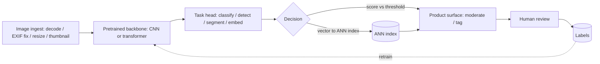

# Chapter 9: Computer Vision

The naive way to answer a vision system-design question is "fine-tune a CNN and serve it." That answer misses the whole point. A production image pipeline is almost never one model. It is a family of tasks (classification, detection, segmentation, embedding, and OCR) that happen to share a decode stage and a pretrained backbone, but that carry very different label costs, very different metrics, and wildly different failure economics. A tagging mistake is cosmetic. A moderation miss that lets illegal content go live is a legal and trust event. If you optimize both for "accuracy," you have already lost the plot.

This chapter works through a single motivating brief. A marketplace lets hosts and sellers upload photos, and product wants three things off one pipeline: auto-tag each photo (bedroom, kitchen, exterior), block anything unsafe or off-policy before it goes live, and let buyers search the catalog by uploading a picture of something they like. Tens of millions of images a day, a long tail of weird categories, and a legal team that is nervous about moderation. We will use that brief to expose the decisions an interviewer is actually probing for: whether you can pick the right task per requirement, reason about transfer learning instead of training from scratch, treat labeling as the real budget line, and cost GPU serving per million images the way you cost model quality.

In this chapter, we will cover:

- Scoping a vision problem into distinct tasks and choosing the right metric for each
- Transfer learning from pretrained backbones, and how backbone choice trades cost against accuracy
- Labeling economics, active learning, and the long-tail class-imbalance problem
- Image-text embeddings for visual search and zero-shot tagging
- Moderation-specific traps: operating points, adversarial inputs, and fail-closed policy
- Normalization at small batch sizes, calibration, and evaluation discipline
- Tracing six reference architectures at real tensor shapes, from ResNet-50 through CLIP

By the end, you will be able to walk an interviewer from "upload a photo" to a costed, evaluable, multi-task system, and defend every metric choice along the way.

## Technical requirements

You need a modern web browser to open the validated reference graphs used as figures in this chapter. Each is a shape-checked architecture from the Neurarch model zoo that opens live in the editor at real dimensions:

- [resnet-50](https://www.neurarch.com/?import=https://raw.githubusercontent.com/neurarch-ai/awesome-llm-model-zoo/main/architectures/resnet-50/model.json)
- [efficientnet-b0](https://www.neurarch.com/?import=https://raw.githubusercontent.com/neurarch-ai/awesome-llm-model-zoo/main/architectures/efficientnet-b0/model.json)
- [unet](https://www.neurarch.com/?import=https://raw.githubusercontent.com/neurarch-ai/awesome-llm-model-zoo/main/architectures/unet/model.json)
- [vit-b16](https://www.neurarch.com/?import=https://raw.githubusercontent.com/neurarch-ai/awesome-llm-model-zoo/main/architectures/vit-b16/model.json)
- [swin-tiny](https://www.neurarch.com/?import=https://raw.githubusercontent.com/neurarch-ai/awesome-llm-model-zoo/main/architectures/swin-tiny/model.json)
- [clip-vit-b32](https://www.neurarch.com/?import=https://raw.githubusercontent.com/neurarch-ai/awesome-llm-model-zoo/main/architectures/clip-vit-b32/model.json)

The full collection lives in the [model zoo](https://github.com/neurarch-ai/awesome-llm-model-zoo).

## Clarify and scope before you draw anything

The single strongest opening move is to refuse to treat "tag, moderate, search" as one problem. It hides four or five distinct model types, and you want to enumerate them so you can size labeling and serving per task rather than in aggregate. The questions worth asking:

- **Which tasks are actually in scope?** Tagging, moderation, and search decompose into classification, detection, embedding, and possibly OCR. Name them.
- **Real-time or batch?** Moderation on upload is a real-time gate that blocks publish and needs a latency budget. Tagging can be async and batched. Visual-search index-build is offline, but the query is online. These have opposite cost profiles.
- **What is the harm taxonomy for moderation?** Nudity, violence, weapons, hate symbols, PII in images, off-marketplace items. Each is a separate policy with its own precision and recall target, and possibly its own legal reporting obligation.
- **Do we have labeled data or a cold start?** If cold, the first milestone is a labeling pipeline and weak supervision, not a model.
- **Image characteristics.** Resolution range, EXIF orientation, aspect ratios, color versus grayscale, screenshots versus photos, and presence of text (which drives whether OCR matters).
- **Volume and growth.** Photos per day, peak upload rate, and total corpus size for the search index. This sets GPU count and index sharding.
- **Human-review capacity.** Moderation almost always has a human queue behind it. The model's job is to route, not to be the final arbiter for hard cases.
- **Latency and freshness SLAs.** How long can a photo sit in "pending review" before it hurts the host experience?

For the rest of the chapter we scope to a real-time moderation gate, async multi-label tagging, and an offline-indexed visual search, with OCR noted as a conditional sub-pipeline.

## Requirements and metrics

**Functional requirements.** Multi-label classify each uploaded photo into a room or category taxonomy (tens to low hundreds of classes, long-tailed). Moderate each photo against N policy classes before publish, auto-blocking clear violations and routing ambiguous cases to human review. Embed each catalog photo into a vector space to support search-by-image and similar-items via nearest neighbor. Optionally extract text (OCR) when the category suggests documents, receipts, or signage.

**Non-functional requirements.** Moderation p99 under a few hundred milliseconds so publish is not visibly blocked, degrading to an async hold if the model is slow rather than letting content through. Tagging is async, so minutes is fine and you optimize throughput and cost per million. Search-query latency is p99 tens of milliseconds for the ANN lookup plus one embedding forward pass. Availability matters most for moderation because it sits on the critical publish path, so it needs a defined fail-closed versus fail-open policy per harm class. Cost is dominated by GPU inference at this volume, so the design must state cost per million images, not just per request.

**Metrics.** State these explicitly, and never say "accuracy" as the headline:

- Classification and tagging: per-class precision and recall, macro-averaged to expose the long tail, plus a confusion matrix on the head classes.
- Detection: mean average precision at IoU thresholds (COCO-style $\text{mAP}@[.5{:}.95]$), plus precision and recall at the chosen confidence operating point.
- Segmentation: mean IoU, and boundary IoU if edges matter.
- Moderation: recall at a fixed precision floor per harm class, and the human-review queue rate that operating point implies.
- Search and embedding: recall@k and mAP over a labeled relevance set, plus click or conversion as the online proxy.

Two definitions worth writing on the whiteboard, because interviewers pull on them. Precision and recall are

$$\text{P} = \frac{TP}{TP + FP}, \qquad \text{R} = \frac{TP}{TP + FN},$$

and IoU for a predicted region against ground truth is the ratio of intersection to union areas,

$$\text{IoU} = \frac{|A \cap B|}{|A \cup B|}.$$

Average precision is the area under the precision-recall curve for one class, and mAP averages it across classes (and, in the COCO convention, across IoU thresholds from 0.5 to 0.95). The moderation metric that actually protects the business is recall at a fixed precision floor: you fix the false-positive rate the human queue can absorb, then maximize how many true violations you catch,

$$\text{recall} \big|_{\,\text{P} \ge p_0}.$$

## High-level data flow

The shared foundation is an ingest stage (decode, correct EXIF orientation, resize to a canonical resolution, strip metadata, generate thumbnails) feeding a set of pretrained backbones. Moderation runs synchronously on the publish path. Everything else runs off a job queue after publish. Human-review decisions flow back as fresh labels, which is the single most valuable data source in the whole system.

The skeleton, ingest to backbone to task head, is what unifies otherwise very different tasks. The backbone is where the transfer-learning leverage lives, the head is swapped per task (classify, detect, segment, or embed), and whether the output gates a publish, tags a photo, or lands in an index is the only part that really varies.

## Pick the right task per requirement

The most common junior mistake is using classification for a job that needs detection or segmentation. Map each product ask to the task that actually fits:

- **Classification / tagging** answers "what is in this whole image." It is multi-label because a photo can be both "kitchen" and "renovated." The output is a set of tags with per-class thresholds.
- **Detection** answers "what objects, and where." You need it for amenity detection (find the fireplace, the pool), for counting, and for moderation when the harmful thing is a small region. The metric is mAP.
- **Segmentation** answers "which pixels." You need it for cutout (background removal, garment isolation for shop-the-look), and for medical or satellite masks. The metric is IoU. Reach for instance segmentation (Mask R-CNN style) when you need per-object masks, and semantic segmentation (U-Net style) when you need per-pixel classes.
- **Embedding / retrieval** maps an image to a vector so that near means similar. It powers visual search and dedup, and because it has no fixed class list it handles an open, growing catalog where classification cannot.
- **OCR** reads the text in the image. It is a pipeline in itself (text detection, then recognition), not a single classifier.

For our brief, tagging is multi-label classification, moderation is classification plus targeted detection for small-region harms, and search is embedding plus ANN, with OCR conditionally attached.

## Transfer learning from pretrained backbones

You almost never train from scratch. Start from a backbone pretrained on a large corpus (ImageNet-scale supervised, or a self-supervised or image-text pretrained model) and adapt it. There are two dominant adaptation modes and one backbone-selection axis:

- **Linear probe** (freeze the backbone, train a new head) when labeled data is scarce and the domain is close to pretraining. It is cheap, fast, and a strong baseline.
- **Fine-tune** (unfreeze some or all layers with a low learning rate) when you have enough labels and the domain drifts from natural images, such as satellite, medical, or receipts.
- **Backbone choice is a cost-versus-accuracy knob.** ResNet-50 is the boring, reliable default. EfficientNet reaches similar accuracy at lower FLOPs, which is what you want for high-volume batch tagging. Vision transformers (ViT, Swin) scale better with data and pretraining but want more compute and more data to shine, and Swin's windowed attention makes it friendlier for detection and segmentation than plain ViT.

The practical rule: share one backbone across tasks wherever you can (multi-head), because it cuts serving cost and lets an improvement to the trunk lift every task at once. Pinterest's unified embedding is the productionized version of this idea.

### A normalization aside that bites vision teams

Backbones ship with BatchNorm, which normalizes each channel using statistics pooled across the batch and all spatial positions. That is fine for classification backbones trained with large fixed batches, but it degrades badly at the small batch sizes typical of detection and segmentation (one to four images per GPU), because the per-batch mean and variance become high-variance estimates and, at batch size one, the variance is undefined. The batch-independent replacement of choice in vision is GroupNorm, which splits channels into groups and normalizes within each group per example. You cannot simply swap in LayerNorm and expect the same accuracy, because LayerNorm pools across channels within a single example, mixing features that convolutions expect to keep separately calibrated. The rule to carry into a detection or high-resolution fine-tune: prefer GroupNorm (or frozen BatchNorm) when the batch is small, and reserve LayerNorm for the transformer trunks whose features are a single vector per token.

## Labeling cost and active learning

Labels are the budget in the early phase, not GPUs. The levers, in rough order of leverage:

- **Weak or programmatic supervision.** EXIF, upload context, seller-provided category, and filename text are noisy but free, and good enough to bootstrap the head classes.
- **Human-in-the-loop from moderation.** Every human-review decision is a gold label. Wire it back automatically.
- **Active learning.** Label the images the model is most uncertain about (low margin, high entropy) or most disagreed-on across an ensemble, rather than a random sample. This is where you get the steepest accuracy-per-label curve, especially for the long tail.
- **Consensus and quality control.** Use multiple annotators per hard image, adjudicate disagreements, and score annotators against a hidden gold set. Cheap labels with 20% error can cap your ceiling below the product bar.

State the labeling loop as a first-class system component, not an afterthought.

## Class imbalance and the long tail

Real taxonomies are Zipfian: a few classes dominate and hundreds are rare. This is where reporting accuracy actively hurts you, because a model can score 95% by ignoring every rare class. Concretely, with a 99:1 split, a model that always predicts the majority class scores 99% accuracy while catching zero positives. Report class-conditional metrics instead and inspect per class. The fixes:

- **Sampling.** Oversample rare classes or use class-balanced batch sampling, but watch that oversampling does not simply memorize the few rare examples.
- **Loss.** Class-balanced or focal loss down-weights the easy, abundant negatives. Focal loss came out of dense detection for exactly this reason.
- **Per-class thresholds.** One global threshold is wrong for multi-label. Calibrate a threshold per class on a validation set to hit its precision or recall target.
- **Tail strategy.** For the extreme tail, fold rare classes into a coarser bucket, or handle them with retrieval (embedding nearest neighbor) instead of a dedicated classifier head, since you cannot get enough labels to train a reliable head.

Two evaluation notes that separate strong candidates. First, prefer PR-AUC over ROC-AUC when positives are rare, because ROC's false-positive rate normalizes by the large negative pool and stays optimistic, while precision degrades honestly as the positive base rate shrinks. Second, raw softmax scores are not probabilities, so calibrate before you threshold. Temperature scaling divides the logits by a single learned scalar $T$,

$$\hat p = \text{softmax}(z / T),$$

which fixes over-confidence without changing the argmax, so accuracy and ranking are preserved. This matters most for the moderation escalate band, where the threshold has to mean what you think it means.

## Data pipeline and augmentation

- **Canonicalize on ingest.** Fix EXIF orientation (a classic silent bug where sideways phone photos wreck accuracy), resize with a consistent policy, and normalize with the backbone's expected mean and standard deviation.
- **Augment carefully.** Random crop, flip, and color jitter, plus stronger policies (RandAugment, mixup, cutmix) for classification. Be deliberate about which augmentations are label-preserving: horizontal flip breaks OCR and anything orientation-sensitive, and heavy color jitter can destroy a "is this photo too dark to publish" signal.
- **Keep train and serve identical.** The exact same decode-resize-normalize path must run in training and serving, or you get a train/serve skew that no metric on the offline set will catch. Assert it is byte-identical.
- **Store derived thumbnails** so downstream tasks and the review UI do not re-decode full-resolution originals.

## Image-text embeddings for visual search

Search-by-image and text-to-image retrieval both want a shared embedding space. An image-text contrastive model (CLIP-style) trained to pull matching image and caption pairs together gives you three capabilities from one artifact:

- **Query by image.** Embed the query photo and do an ANN lookup in the catalog index.
- **Query by text.** Embed the text with the same model's text tower and search the same image index. This is how text-driven catalog search and in-video search work.
- **Zero-shot tagging.** Score an image against embedded class-name prompts, which is useful to bootstrap tail classes before you have labels.

The serving shape: embeddings are precomputed offline for the whole catalog and stored in an ANN index (HNSW or IVF-PQ). Query time is one forward pass plus one ANN lookup. When you retrain the embedding model you must re-embed the catalog, a heavy offline job you have to budget for, and the query tower must be swapped atomically with the item index or the two live in incompatible coordinate systems and retrieval quality craters. Netflix's in-video search precomputes embeddings and serves them through Elasticsearch, a sane pattern when you already run that infrastructure.

The ANN index itself sits on a recall-versus-latency curve. For graph indexes like HNSW, raising the search beam (efSearch) or build-time connectivity (M) improves recall at the cost of query time and memory. The subtle trap: retrieval recall against the exact-dot-product neighbors is not the same as business recall against true relevance, so chasing ANN recall past a point buys nothing the ranker will notice. Sweep the knob against end-to-end quality under the p99 budget, then stop where the curve flattens.

## Moderation-specific traps

Moderation is not "classification with scary labels." What is genuinely different:

- **Operating point.** Tune for high recall at a fixed precision floor per harm class. Missing a violation is far worse than a false flag a human clears, so publish the confusion cost explicitly.
- **Human review is part of the model.** The classifier routes: auto-block, auto-pass, or escalate. The escalate band is where you set the ambiguous threshold, and you size the review team against the queue rate that band produces.
- **Adversarial inputs.** Bad actors perturb, crop, overlay text, add borders, or embed the payload in a small region to evade a whole-image classifier. Defenses include detection for small-region harms, augmentation with adversarial-style transforms, perceptual-hash matching against known-bad content, and never treating the model as the only line.
- **Fail-closed on high harm.** If the model is down or times out on a high-harm class, hold the content for review rather than publish. Define this per class, because failing closed on everything would break the product.
- **Legal and reporting.** Some categories carry mandatory reporting or retention rules, so the pipeline needs an audit log of every decision, the model version, and the score.
- **Drift.** Harm evolves (new symbols, new evasion tricks), so continuous relabeling and scheduled retraining are non-optional here in a way they are not for room tagging.

## Bottlenecks and scaling

- **GPU inference is the cost center.** At tens of millions of images a day, cost per million is the number that matters. Batch aggressively on the async paths, use a smaller and efficient backbone (EfficientNet) where quality allows, quantize to int8 and compile (TensorRT or ONNX Runtime), and run moderation on a distilled gate model with the big model only on the escalate band.
- **Split real-time from batch.** Keep moderation on low-latency GPU serving with dynamic batching under a tight window. Push tagging and embedding to a throughput-optimized batch fleet that can run on cheaper spot capacity and tolerate delay.
- **Decode can starve the GPU.** Image decode is CPU-heavy, and if it is serial it starves the GPU. Use a dedicated decode-resize stage, GPU decode where available, and prefetch.
- **ANN index scale.** For a large catalog a flat index does not fit or does not answer fast enough. Use IVF-PQ or HNSW with sharding, rebuild offline, and watch the recall-versus-latency-versus-memory tradeoff of the quantization.
- **Backbone sharing.** Running one trunk with multiple heads cuts per-image compute versus one model per task. This is the biggest structural cost win, and the reason unified-embedding designs exist.
- **Caching.** Dedup identical uploads by perceptual hash so you do not re-run the whole pipeline on reposts.

## Failure modes, safety, and eval

- **Train/serve skew** from a mismatched preprocessing path is the most common silent killer. Assert the pipeline is byte-identical across train and serve.
- **Distribution shift** from new phone cameras, new photo styles, or seasonal content. Monitor input embeddings for drift, not just output labels.
- **Calibration.** Raw softmax scores are not probabilities. Calibrate with temperature scaling so thresholds mean what you think, especially for the moderation escalate band.
- **Long-tail blind spots.** A headline macro metric can still hide a rare class at near-zero recall. Track per-class and alert on the worst class, not the average.
- **Bias and fairness.** Classifiers can behave differently across skin tone, geography, or listing type. Evaluate sliced metrics, not just aggregate, and treat a large gap as a launch blocker.
- **Evasion monitoring.** Track flag rates over time, because a sudden drop can mean evasion, not improvement.
- **Eval discipline.** Keep a frozen labeled test set per task, refreshed periodically, report mAP/IoU/PR at the operating point, shadow-run new models before promotion, and always pair offline metrics with an online proxy (review-overturn rate for moderation, click or conversion for search). Overturn rate on auto-blocks is your live precision signal: if it spikes, the model regressed or policy changed.

## Questions
- **"The rare 'illegal item' class has 40 labeled examples. How do you ship moderation for it?"** Retrieval and hash matching plus zero-shot embedding scoring and a tighter human-review band, not a dedicated head, until labels accumulate.
- **"Moderation p99 blew past budget at peak. What gives?"** Distill to a fast gate model, run the heavy model only on the escalate band, add dynamic batching, and define the fail-closed-to-review behavior for the timeout case.
- **"Visual search returns visually similar but irrelevant items."** The embedding optimizes visual similarity, not purchase intent. Add a multi-task objective with an engagement signal, or re-rank the ANN candidates with a supervised model.
- **"How do you know it works before launch?"** Frozen per-task test sets, sliced metrics for fairness, shadow traffic, and an online proxy metric with a rollback trigger.
- **"Cost doubled after we added ViT. Justify it."** Only if mAP or recall at the operating point moved enough to matter, otherwise stay on the efficient backbone. Quality per dollar, not quality alone.
- **"OCR: build or buy?"** If text is core (document search), build the detection-plus-recognition pipeline. If it is incidental, a managed OCR API is cheaper than owning it.

## Trace the architectures

Reading these graphs beats reading a paper diagram, because you can follow real tensor shapes through every block and see where each task's structure lives. These are the backbones and heads the deep dives referenced, rendered as validated reference graphs at real dimensions, shape-checked end to end.

**ResNet-50 (backbone / classification).** Trace how the residual bottleneck blocks stack and downsample, and why this is the default trunk you fine-tune for tagging and reuse under detection heads.

`https://www.neurarch.com/?import=https://raw.githubusercontent.com/neurarch-ai/awesome-llm-model-zoo/main/architectures/resnet-50/model.json`

*Figure 9.1: ResNet-50*

**EfficientNet-B0 (efficient classifier).** Trace the mobile inverted-bottleneck blocks and compound scaling. This is the backbone you reach for when cost per million images dominates, as in high-volume batch tagging and moderation gates.

`https://www.neurarch.com/?import=https://raw.githubusercontent.com/neurarch-ai/awesome-llm-model-zoo/main/architectures/efficientnet-b0/model.json`

*Figure 9.2: EfficientNet-B0*

**U-Net (segmentation).** Trace the encoder-decoder with skip connections that carry fine detail to the output. This is the per-pixel workhorse for cutout, medical masks, and satellite building maps.

`https://www.neurarch.com/?import=https://raw.githubusercontent.com/neurarch-ai/awesome-llm-model-zoo/main/architectures/unet/model.json`

*Figure 9.3: U-Net*

**ViT-B/16 (vision transformer).** Trace how the image is split into patches, embedded, and run through transformer blocks. This is useful for seeing why ViT wants more data and pretraining than a CNN to pay off.

`https://www.neurarch.com/?import=https://raw.githubusercontent.com/neurarch-ai/awesome-llm-model-zoo/main/architectures/vit-b16/model.json`

*Figure 9.4: ViT-B/16*

**Swin-Tiny (hierarchical vision transformer).** Trace the windowed and shifted-window attention and the hierarchical downsampling that make it a better trunk for detection and segmentation than plain ViT.

`https://www.neurarch.com/?import=https://raw.githubusercontent.com/neurarch-ai/awesome-llm-model-zoo/main/architectures/swin-tiny/model.json`

*Figure 9.5: Swin-Tiny*

**CLIP ViT-B/32 (image-text embeddings).** Trace the two towers (image and text) that project into a shared space. This is the structure behind visual search, text-to-image retrieval, and zero-shot tagging.

`https://www.neurarch.com/?import=https://raw.githubusercontent.com/neurarch-ai/awesome-llm-model-zoo/main/architectures/clip-vit-b32/model.json`

*Figure 9.6: CLIP ViT-B/32*

Browse all of them in the [Model Zoo](https://github.com/neurarch-ai/awesome-llm-model-zoo) or the [gallery](https://neurarch-ai.github.io/awesome-llm-model-zoo). Built by [Neurarch](https://www.neurarch.com).

## Further reading
Despite different tasks, these shipped systems share one skeleton: a canonical ingest stage feeds a pretrained backbone whose features drive a task-specific head, and a human-review loop turns its decisions into fresh labels. The backbone is where the transfer-learning leverage lives, and the head is swapped per task. What varies is only whether the output gates a publish, tags a photo, or lands in an index.

| System | Task | Backbone | Serving | Headline metric |
| --- | --- | --- | --- | --- |
| Airbnb categorize | Classification | CNN (ResNet-50) | Batch | Per-class precision / recall |
| Airbnb amenity | Detection | CNN | Batch | mAP |
| Meta Mask R-CNN | Instance segmentation | CNN | Batch | COCO mask AP |
| Pinterest unified | Embedding | CNN (SE-ResNeXt) | Offline index | Retrieval + engagement |
| Google Africa buildings | Segmentation | CNN (U-Net) | Batch | mAP |
| Netflix in-video | Embedding | Image-text (CLIP-style) | Offline index | Recall on text queries |
| Bumble Private Detector | Binary classification | CNN (EfficientNetV2) | Real-time gate | Accuracy at fixed precision / recall |

Each row is a first-party engineering writeup worth reading for what an interview answer skips: who the system serves, the product design, the eval bar, and the deployment shape.

- **Airbnb**, [Categorizing Listing Photos](https://medium.com/airbnb-engineering/categorizing-listing-photos-at-airbnb-f9483f3ab7e3): ResNet-50 classifies 500M+ listing photos by room type.
- **Airbnb**, [Amenity Detection and Beyond](https://medium.com/airbnb-engineering/amenity-detection-and-beyond-new-frontiers-of-computer-vision-at-airbnb-144a4441b72e): object detection finds amenities for moderation and consumer features.
- **Meta (FAIR)**, [Mask R-CNN](https://ai.meta.com/research/publications/mask-r-cnn/): instance segmentation extending Faster R-CNN with a mask branch.
- **Dropbox**, [Indexing text from billions of images](https://dropbox.tech/machine-learning/using-machine-learning-to-index-text-from-billions-of-images): classifier, corner detection, and OCR make scanned text searchable at 20B-image scale.
- **Pinterest**, [Unifying visual embeddings](https://medium.com/pinterest-engineering/unifying-visual-embeddings-for-visual-search-at-pinterest-74ea7ea103f0): one multi-task embedding replaces per-product models.
- **Zalando**, [Shop the Look with Deep Learning](https://engineering.zalando.com/posts/2018/09/shop-look-deep-learning.html): ConvNet matching plus U-Net segmentation finds catalog items from real-world photos.
- **Netflix**, [Pixel Error Detection](https://netflixtechblog.com/accelerating-video-quality-control-at-netflix-with-pixel-error-detection-47ef7af7ca2e): a full-resolution CNN over 5 frames detects pixel defects.
- **Netflix**, [Building In-Video Search](https://netflixtechblog.com/building-in-video-search-936766f0017c): contrastive image-text embeddings served via Elasticsearch.
- **Google Research**, [Mapping Africa's Buildings](https://research.google/blog/mapping-africas-buildings-with-satellite-imagery/): a U-Net trained on 1.75M labeled buildings maps 516M structures.
- **Google Research**, [Detection of Diabetic Eye Disease](https://research.google/blog/deep-learning-for-detection-of-diabetic-eye-disease/): a CNN on 128K retinal images detects retinopathy at ophthalmologist-level F-score.
- **Bumble**, [Open-sourcing Private Detector](https://medium.com/bumble-tech/bumble-inc-open-sources-private-detector-and-makes-another-step-towards-a-safer-internet-for-women-8e6cdb111d81): an EfficientNetV2 binary classifier flags and blurs unsolicited lewd images at over 98% accuracy.

For a broader index, the [Evidently AI ML system design database](https://www.evidentlyai.com/ml-system-design) collects 800 case studies from 150+ companies.

## Summary

Computer vision in production is not one model, it is a family of tasks sharing a decode stage and a pretrained backbone. The through-line of this chapter: decompose the brief into classification, detection, segmentation, embedding, and OCR, then choose a metric per task that reflects its failure economics (mAP for detection, IoU for segmentation, recall at a fixed precision floor for moderation) instead of the misleading headline of accuracy. Transfer learning from a shared backbone is the default, and backbone choice (ResNet-50, EfficientNet, ViT, Swin) is a cost-versus-accuracy knob you tune against a per-million-images budget, not against quality alone. Labeling is the early budget line, so treat active learning and the human-review feedback loop as first-class components. Watch the traps that silently sink vision systems: train/serve preprocessing skew, uncalibrated scores feeding a threshold, small-batch normalization, long-tail blind spots, and adversarial evasion on the moderation path. The six traced architectures give you the concrete structures behind each task, from the residual trunk you fine-tune to the two-tower contrastive model behind visual search.

In the next chapter, **Speech and Audio**, we move from pixels to waveforms and shift the shared skeleton onto a new front end. Many of the same instincts carry over (pretrained backbones, transfer learning, calibrated operating points), but the ingest stage becomes spectrograms and streaming frames, the tasks become recognition, diarization, and wake-word detection, and latency stops being a nicety and becomes the whole game.
