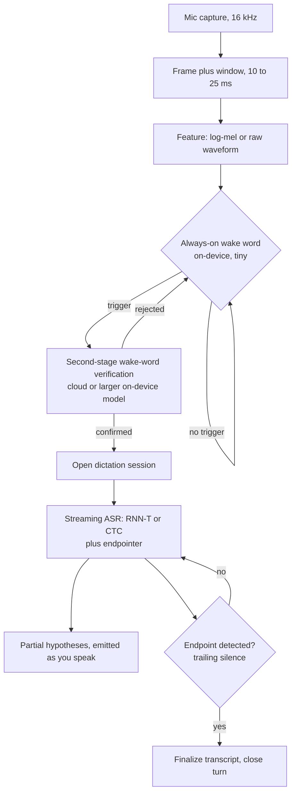

# Chapter 10: Speech and Audio

Imagine a product team hands you a single sentence of intent: "We want voice input everywhere." Users should tap a mic and dictate, and later upload meeting recordings to be transcribed. Some of it runs on a phone with no network, some in the cloud. It has to feel instant while the user is speaking, stay accurate under background noise and accents, and it needs a "Hey Product" wake word that never drains the battery. Where do you start, and what breaks first?

The core tension in speech is that the two things you want most, low latency and high accuracy, pull in opposite directions, and a single word error rate number hides all of it. Streaming dictation must emit words within a couple hundred milliseconds of the user speaking, which forbids the model from ever seeing the full utterance, so it commits to hypotheses it cannot revise. Batch transcription of a recording can attend over the whole audio and correct itself, so it is more accurate but useless for live feedback. On top of that, word error rate treats a dropped article and a botched proper noun as equal, ignores punctuation and speaker turns, and collapses on accents and domain jargon that were rare in training.

This chapter is about placing each workload on the right point of the latency, accuracy, size, and privacy surface rather than chasing one leaderboard. We will treat speech not as one problem but as a family of related problems that share a front end and diverge sharply in the head, the latency budget, and the metric. By the end you should be able to draw the serving paths, name the model families, and defend your metric choices against an interviewer who keeps pulling threads.

In this chapter we will cover:

- Why speech is a task taxonomy, not a single model, and how to keep the tasks distinct
- The streaming versus batch fork, and the model families (CTC, RNN-T, attention seq2seq, Conformer) that each side demands
- Word error rate and the specific ways it lies, plus the metrics you report alongside it
- Wake word design as a false-accept versus false-reject tradeoff, and two-stage verification
- Speaker identification, diarization, and target-speaker separation under overlapping speech
- Self-supervised and multilingual pretraining (wav2vec 2.0, HuBERT, neural audio codecs) that dodge the labeling wall
- On-device constraints: quantization, size, latency, and the privacy consequences
- Forced alignment for caption timing and training-data preparation

## Technical requirements

Reading about a Conformer or a self-supervised encoder is one thing; walking the actual tensor shapes through the graph is where it clicks. Throughout this chapter we lean on four validated reference architectures you can open and inspect end to end. These are not screenshots; they are shape-checked reference graphs at real dimensions, so when we discuss where log-mel features enter an encoder or how a residual vector quantizer discretizes a waveform, you can trace the exact tensors yourself.

To follow along, open each graph in the browser-based inspector by importing its `model.json`, and keep the diagram beside you as we walk the corresponding section.

**Figure 10.1: whisper-small, an attention encoder-decoder ASR model.**
Import: `https://www.neurarch.com/?import=https://raw.githubusercontent.com/neurarch-ai/awesome-llm-model-zoo/main/architectures/whisper-small/model.json`

Trace how log-mel features enter the audio encoder and how the decoder cross-attends over them to emit text. This is the batch, full-context seq2seq family we dissect in the streaming-versus-batch section.

**Figure 10.2: wav2vec2-base, a self-supervised speech representation model.**
Import: `https://www.neurarch.com/?import=https://raw.githubusercontent.com/neurarch-ai/awesome-llm-model-zoo/main/architectures/wav2vec2-base/model.json`

Trace the CNN feature encoder feeding the transformer with masked spans. This is the contrastive pretraining backbone you fine-tune with a small CTC head, covered in the self-supervised section.

**Figure 10.3: hubert-base, a self-supervised masked-prediction model.**
Import: `https://www.neurarch.com/?import=https://raw.githubusercontent.com/neurarch-ai/awesome-llm-model-zoo/main/architectures/hubert-base/model.json`

Same shape as wav2vec2 but trained to predict clustered pseudo-labels. Trace it against Figure 10.2 to see how the objective, not the graph, is what differs.

**Figure 10.4: encodec, a neural audio codec for tokenizing audio.**
Import: `https://www.neurarch.com/?import=https://raw.githubusercontent.com/neurarch-ai/awesome-llm-model-zoo/main/architectures/encodec/model.json`

Trace the encoder, residual vector quantizer, and decoder that turn a waveform into discrete tokens and back. This is what lets speech reuse language-model machinery for generation and translation.

You can browse all four in the [Model Zoo](https://github.com/neurarch-ai/awesome-llm-model-zoo) or the [gallery](https://neurarch-ai.github.io/awesome-llm-model-zoo). No local install is required to inspect them.

## Clarifying the problem before you draw anything

Before you commit to an architecture, you interrogate the brief. "Voice input" is underspecified in ways that change the model, the data, and the eval matrix. Here are the questions we would ask, and why each one forces a design decision.

**Which tasks are actually in scope?** Voice input can mean transcription (ASR), a trigger phrase (wake word), "who spoke when" (diarization), "is this the enrolled user" (speaker ID), text to speech (TTS), or speech to speech translation. Each is a different model family. For this design we assume ASR plus a wake word plus batch meeting transcription, and we flag the rest as separate builds.

**Streaming or batch, per surface?** Live dictation is streaming with tight endpointing. Uploaded recordings are batch. These are two different models and two serving paths, not one model with a flag. You want to establish this fork early because it partitions everything downstream.

**On-device or cloud?** The wake word is always-on and must run on-device for battery and privacy. Dictation can go either way. Meeting transcription is cloud because the audio is long and the compute is heavy.

**Language coverage.** One locale, a fixed set, or open multilingual? Multilingual changes the model, the data, and the evaluation matrix all at once.

**Acoustic conditions.** Close-talk phone mic, far-field smart speaker, overlapping speakers, music in the background? Far-field and overlap are where word error rate quietly doubles.

**Accuracy bar and how it is measured.** Word error rate on what test set, with what normalization, and does the product care more about proper nouns, numbers, and punctuation than raw error rate suggests?

**Privacy and compliance.** Can audio leave the device? What are the retention and consent rules, and can you log audio for retraining at all?

With those settled, you can state the requirements. Functionally you owe streaming ASR that emits partial hypotheses while the user speaks and finalizes on endpoint; batch ASR for uploads with punctuation, casing, and speaker turns; an always-on wake word that triggers capture and hands off to cloud verification; and speaker diarization on meeting audio with optional speaker ID against enrolled voices. Non-functionally you commit to a first partial under roughly 300 ms, an endpointing decision under roughly 500 ms of trailing silence, a wake word that runs continuously in tens of kilobytes to low single-digit megabytes with negligible battery cost and no network, accuracy tracked by subgroup rather than a single aggregate, graceful degradation under noise rather than a cliff, on-device-by-default privacy for always-on paths, and cloud batch that clears many concurrent hours of audio faster than real time.

## The high-level data flow

Audio is captured, framed into short windows, turned into features (a log-mel spectrogram, or fed raw into a self-supervised encoder), then routed by workload. The tiny wake word model gates everything on-device. Streaming ASR runs incrementally with endpointing. Batch ASR runs a heavier bidirectional model with diarization and punctuation restoration. The single diagram below traces the streaming ASR plus wake-word path, which is the part that has to be always-on and instant.

Notice that the wake word is a loop that almost always does nothing, and the expensive work only happens after two gates agree. That structure, cheap-always-on then expensive-rarely, recurs throughout the chapter.

## The task taxonomy: these are not one problem

Interviewers reward candidates who refuse to blur these tasks, so we keep them distinct from the start. ASR turns speech into text; it is the headline task, but "streaming dictation" and "transcribe a recording" are separate models. Wake word, or keyword spotting, decides whether the trigger phrase occurred on a tiny always-on model; it is a detection problem, not transcription. Speaker ID and verification answer "who is this, is this the enrolled user" from a voice embedding. Diarization answers "who spoke when" without necessarily knowing identities. TTS goes the other direction, text to waveform. Speech translation maps speech in one language to text or speech in another.

They share a front end (framing, features, sometimes a self-supervised encoder) and diverge sharply in the head, the latency budget, and the metric. Proposing one model for all of them is the classic red flag, and you should name that trap out loud.

## Streaming versus batch ASR and the model families

This is the single most important architectural fork, so we spend real time on it.

Streaming must be causal: at time $t$ it can only use audio up to $t$, plus maybe a tiny look-ahead, because the user is still talking. Two families fit.

CTC (Connectionist Temporal Classification) predicts a label per frame with a blank symbol and collapses repeats. It assumes conditional independence between output tokens given the audio, so it carries no internal language model and leans on an external one. It is cheap and naturally streaming, but weaker on context.

RNN-T (RNN Transducer) adds a prediction network over previous output tokens and a joint network, so it models output dependencies and streams frame by frame without an external language model. This is the workhorse for on-device streaming dictation: it commits monotonically left to right and emits as it goes.

Batch, full-context models can attend over the entire utterance. Attention seq2seq (LAS-style encoder-decoder, the family of Figure 10.1) attends over the whole encoded audio, which is accurate but inherently non-streaming and prone to attention failures like looping or early stopping. The Conformer is the batch encoder that won: it interleaves self-attention with convolution. Attention captures long-range, global dependencies; convolution captures local, fine-grained spectral and temporal patterns that attention alone models poorly. Speech is both globally structured (grammar, long context) and locally structured (phones, formants), so mixing the two beats either alone. A Conformer encoder plugs into a CTC head, an RNN-T head, or an attention decoder.

The rule of thumb you should be ready to state: RNN-T or CTC for streaming on-device, Conformer encoder with attention or transducer decoding for batch cloud accuracy.

## Word error rate and its pitfalls

Word error rate is edit distance over words, the sum of substitutions, insertions, and deletions divided by the number of reference words:

$$\text{WER} = \frac{S + I + D}{N}$$

It is the standard, and it lies in specific ways you must be able to enumerate.

All errors weigh the same. Dropping "the" costs as much as mangling a customer's name or a dosage number, though only one ruins the product. Normalization dominates: casing, punctuation, numbers ("twenty" versus "20"), and contractions can swing the score by points depending on the text normalizer, so two systems are not comparable unless normalized identically. Aggregate hides subgroups: a good average can conceal a rate twice as bad for a specific accent, dialect, child's voice, or noisy far-field condition, so you always slice by accent, noise, and domain. Endpointing latency is invisible to WER; a model can be accurate and still feel broken if it waits too long to decide the user stopped talking, or cuts them off mid-sentence, so endpointing is a latency metric tracked separately that trades directly against false cutoffs. Entities and rare words (product names, addresses, medical or legal terms) are where users notice failures, and they are exactly the low-frequency tail WER underweights, so you report entity WER and numeric WER alongside the aggregate.

## Wake word design

A wake word is a tiny always-on detector, and its entire design is a false-accept versus false-reject tradeoff. Because you are choosing an operating point rather than a single number, it helps to name the two error rates explicitly:

$$\text{FAR} = \frac{\text{false accepts}}{\text{hours of ambient audio}}, \qquad \text{FRR} = \frac{\text{false rejects}}{\text{genuine wake attempts}}$$

Lower the threshold and the model wakes on background TV and similar-sounding phrases, driving false accepts up (creepy and annoying, and a privacy incident waiting to happen). Raise it and it ignores the user, driving false rejects up (the product feels broken). You cannot win both; you pick an operating point on the detection-error-tradeoff (DET) curve driven by product tolerance, and you tune it per device class, since a phone and a far-field speaker sit at different points.

The way out of the dilemma is two-stage verification. The on-device model is deliberately loose to avoid false rejects, then a second, heavier model verifies in the cloud (or a larger on-device model) once triggered, rejecting the false accepts before anything acts. Cheap always-on, expensive rarely, which is exactly the second gate in Figure 10.5's flow. Personalization, an on-device speaker embedding for the enrolled user as in personalized triggers, further cuts accepts from other voices.

The design constraints are unforgiving. The detector runs continuously on a low-power core, so it lives in tens of kilobytes to a few megabytes, quantized, with a footprint that never touches the network. Anything bigger drains the battery, and battery drain is the fastest way to get your always-on feature disabled by users.

## Speaker identification and diarization

Speaker embeddings map a speech segment to a fixed vector (d-vector or x-vector style) trained so the same speaker clusters and different speakers separate. Verification is a cosine threshold; identification is the nearest enrolled embedding. Diarization ("who spoke when") typically segments audio, embeds each segment, clusters the embeddings, then assigns turns. The hard parts are unknown speaker count, short turns, and overlapping speech, where two people talk at once and simple clustering fails. The metric is diarization error rate (DER), which sums missed speech, false alarm, and speaker confusion. End-to-end neural diarization exists, but clustering pipelines remain common because they can be tuning-free and language-agnostic, which matters for podcasts and meetings.

When a second voice overlaps the user, you condition the model on the enrolled speaker's embedding and suppress everything else. VoiceFilter does exactly this, and a streaming, tiny variant (a couple of megabytes) can run on-device and improve overlapped-speech WER without a full separation stack. This is cleaner than blind source separation because you already know whose voice you want.

## Self-supervised and multilingual pretraining

Labeled transcribed speech is scarce and expensive per language; raw audio is abundant. Self-supervised pretraining exploits that gap, and this is where Figures 10.2 and 10.3 earn their place.

wav2vec 2.0 encodes the raw waveform with a CNN, masks spans of the latent representation, and solves a contrastive task, picking the true quantized latent for a masked step against distractors. Fine-tuning a small CTC head on a little labeled data then reaches strong WER, which is the whole point: pretrain on unlabeled audio, fine-tune cheaply. HuBERT replaces the contrastive objective with masked prediction of cluster targets. You cluster features with k-means to make discrete pseudo-labels, then predict them for masked frames, iterating the clustering. This BERT-style target is more stable than contrastive learning for speech. If you open Figures 10.2 and 10.3 side by side, the graphs are nearly identical; the difference lives entirely in the training objective, which is the point worth internalizing.

Multilingual models pretrain across many languages so low-resource languages borrow representation from high-resource ones, and unified speech-text models can do ASR and translation across roughly a hundred languages. Neural audio codecs (EnCodec-style, Figure 10.4) discretize audio into tokens, which lets speech reuse language-model machinery for generation and translation.

## On-device constraints

Putting ASR or a wake word on a phone is an engineering discipline, not a deployment detail. Quantization from float32 to int8 or lower shrinks the model roughly fourfold and speeds inference on mobile NPUs, with a small WER cost you validate rather than assume. An all-neural streaming recognizer quantized into the tens of megabytes is what makes offline dictation viable at all. Model size and latency are hard bounds: the whole model plus features must fit in memory and run faster than real time on a weak core, which bounds architecture (RNN-T over huge Conformers), context window, and beam width. Privacy is the payoff: on-device means audio never leaves the phone, which is both a feature and a compliance simplifier, but it also means you cannot log audio for retraining, so you need on-device metrics or federated signals instead.

## Forced alignment

Given audio and its known transcript, forced alignment finds the time boundaries of each word or phone. It is not recognition, because the text is given. A common approach runs a CTC acoustic model, builds a trellis of frame-to-token probabilities constrained to the transcript, and backtracks the most likely path (Viterbi) to recover per-token timestamps. Uses include caption timing, TTS training-data preparation, karaoke-style highlighting, and cutting long recordings into supervised segments. A Wav2Vec2 CTC alignment is a standard, dependency-light way to do this, and it reuses the same backbone you saw in Figure 10.2.

## Bottlenecks, failure modes, and the eval bar

At scale, streaming serving is bottlenecked by concurrent live sessions per GPU, bounded by per-frame latency and decoder state; you batch frame steps across sessions, keep RNN-T decoder state compact, and cap beam width. Batch throughput chunks long recordings with overlap so the Conformer's attention stays bounded, runs chunks in parallel, then stitches, diarizes, and punctuates. The real scaling cost, though, is curating multi-condition, multi-accent, multilingual audio, which is exactly why self-supervised pretraining exists.

The failure modes track the metrics. The most common real failure is an accent or dialect gap: strong aggregate WER, much worse for underrepresented accents, children, or the elderly, which you mitigate with representative data and per-group eval as a release gate. WER also jumps under far-field, music, or overlapping speakers, so you test noisy and overlapped sets explicitly and reach for target-speaker separation. Endpointing errors cut users off or hang waiting for silence, so you tune the endpointer separately and watch both directions. Attention decoders can loop, repeat, or truncate, so you prefer transducer or CTC where robustness matters. Large weakly-supervised models can hallucinate plausible transcript on silence or noise, so you add speech/no-speech gating and confidence thresholds. And across all of it the eval bar is never a single number: WER normalized identically and sliced by subgroup plus entity and numeric WER and endpoint latency for ASR, DER for diarization, MOS from humans for TTS, and a DET curve of false accepts per hour versus false rejects for the wake word.

## Summary

Speech is not one model, it is a family of related problems that share a front end and diverge in the head, the latency budget, and the metric. We drew the fundamental fork between causal streaming recognizers (CTC and RNN-T) that must commit as the user speaks and full-context batch recognizers (attention seq2seq and the Conformer) that can attend over the whole utterance and correct themselves. We saw why word error rate lies in enumerable ways and what you report alongside it, why a wake word is fundamentally an operating-point choice between false accepts and false rejects best resolved by two-stage verification, and how self-supervised pretraining (wav2vec 2.0, HuBERT) and neural audio codecs let you dodge the labeling wall. Along the way you had four validated reference graphs (Figures 10.1 through 10.4) to trace the actual tensors rather than take the prose on faith.

The through-line is placement: put each workload on the right point of the latency, accuracy, size, and privacy surface, and never collapse the evaluation to one aggregate. The last two ideas, discretizing audio into tokens with a codec and reusing language-model machinery for speech, point straight at the next chapter. In *Chapter 11, Natural Language Processing*, we move from waveforms to text and take up the sequence models, tokenization, and objectives that the audio world has increasingly borrowed. The bridge is exactly the token: once EnCodec turns a waveform into a discrete sequence, the machinery you are about to meet applies almost unchanged.

## Questions

Test yourself with the depth-probing questions an interviewer actually asks after the whiteboard, once they start pulling threads on the modeling and systems underneath.

1. Streaming versus batch: which model family do you pick for each, and what is the latency reason? (Hint: causal RNN-T or CTC for streaming, full-context Conformer for batch.)
2. Why does the Conformer mix convolution and attention rather than using either alone? Tie your answer to the structure of speech.
3. Your aggregate WER is excellent but users complain. Name at least four things WER fails to capture that could explain it.
4. Design the wake word end to end. Where do you set the threshold, why loose on-device, and what does the second stage do?
5. Two people talk at once and diarization confuses them. What conditioning fixes overlapped-speech WER, and why is it cleaner than blind source separation?
6. You have almost no labeled data in language X. Walk through the self-supervised or multilingual path from raw audio to a usable recognizer.
7. A product needs word-level timestamps for captions, and you already have the transcript. What technique gives you the boundaries, and why is it not recognition?
8. Your TTS sounds robotic. Which stage do you inspect first, and what metric decides whether you fixed it?
9. Contrast the wav2vec 2.0 and HuBERT objectives. Given nearly identical graphs (Figures 10.2 and 10.3), what actually differs and why does it matter?
10. Why must an always-on wake word be quantized into the low-megabyte range, and what do you give up by moving ASR fully on-device?

## Further reading

Real systems that ship the patterns above. Each is a first-party engineering writeup; read them for what an interview answer skips: who the system serves, the product design, the eval bar, and the deployment shape.

- **Google**, [An All-Neural On-Device Speech Recognizer](https://research.google/blog/an-all-neural-on-device-speech-recognizer/): an RNN-T streaming ASR quantized to 80 MB for offline Gboard voice typing. *(deployment)*
- **AssemblyAI**, [Conformer-1: robust speech recognition trained on 650K hours](https://www.assemblyai.com/blog/conformer-1): a Conformer batch ASR scaled on 650K hours for noise robustness. *(product design)*
- **OpenAI**, [Whisper: Robust Speech Recognition via Large-Scale Weak Supervision](https://github.com/openai/whisper): a weakly-supervised multitask model for zero-shot ASR and translation. *(eval bar)*
- **Amazon**, [Alexa's new wake word research at Interspeech](https://www.amazon.science/blog/amazon-alexas-new-wake-word-research-at-interspeech): a metadata-aware on-device wake word plus a cloud verification model. *(product design)*
- **Apple**, [Personalized Hey Siri](https://machinelearning.apple.com/research/personalized-hey-siri): on-device speaker-recognition RNN embeddings that personalize the Hey Siri trigger. *(product design)*
- **Spotify**, [Unsupervised Speaker Diarization using Sparse Optimization](https://research.atspotify.com/2022/09/unsupervised-speaker-diarization-using-sparse-optimization): tuning-free, language-agnostic diarization for podcasts. *(product design)*
- **Google**, [Tacotron 2: Generating Human-like Speech from Text](https://research.google/blog/tacotron-2-generating-human-like-speech-from-text/): a seq2seq mel-spectrogram model plus a WaveNet vocoder reaching near-human MOS. *(eval bar)*
- **Google**, [Improving On-Device Speech Recognition with VoiceFilter-Lite](https://research.google/blog/improving-on-device-speech-recognition-with-voicefilter-lite/): a 2.2 MB streaming speaker-conditioned separation model that improves overlapped-speech WER. *(deployment)*
- **Meta**, [SeamlessM4T: a foundational multimodal model for speech translation](https://ai.meta.com/blog/seamless-m4t/): unified speech and text translation and ASR across about 100 languages. *(who it serves)*
- **NVIDIA**, [NeMo Parakeet ASR Models](https://developer.nvidia.com/blog/pushing-the-boundaries-of-speech-recognition-with-nemo-parakeet-asr-models/): a GPU-optimized ASR family for high-throughput, low-WER production transcription. *(deployment)*
- **PyTorch**, [Forced Alignment with Wav2Vec2](https://docs.pytorch.org/audio/stable/tutorials/forced_alignment_tutorial.html): a CTC trellis-backtracking pipeline that aligns transcripts to audio timestamps. *(deployment)*

For a broader index, the [Evidently AI ML system design database](https://www.evidentlyai.com/ml-system-design) collects 800 case studies from 150+ companies; this list pulls the ones that map onto speech and audio.
