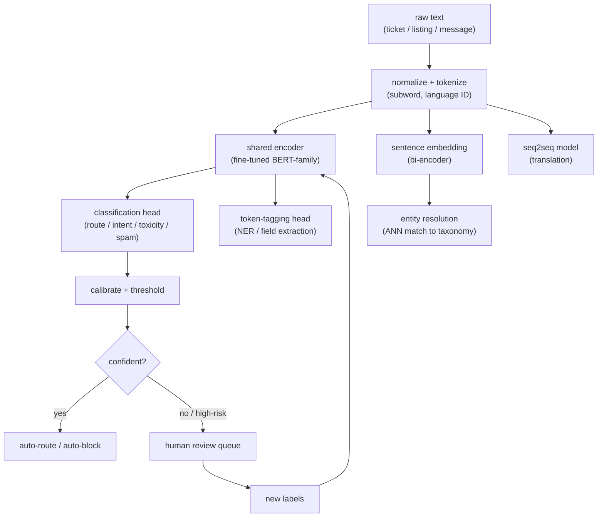

# Chapter 11: Natural Language Processing

The interviewer sets the scene: "We get millions of support tickets, listing descriptions, and user messages a day, all free text. Product wants them routed to the right queue, the important fields pulled out, and the abusive ones held back before a human ever sees them. Design the NLP system. Assume you cannot afford to send every message to a large LLM."

The trap is answering "call an LLM." Real NLP in production is not one model; it is a portfolio of narrow, task-specific models that run at high volume, low latency, and low cost. The signal you want to send is that you pick the right tool per task, a fine-tuned encoder for classification and extraction, a seq2seq model for translation, sentence embeddings for matching, that you treat labeling and class imbalance as first-class problems, and that you evaluate with per-class F1 and human review, not aggregate accuracy. A big LLM is one tool in the box, and usually the wrong one for a task you run a billion times a day.

The reason this question separates senior candidates from junior ones is that the modeling instinct, "fine-tune BERT," is the easy part. The hard part is naming the tasks apart before you model any of them, getting labels when almost none exist, surviving a positive class that is under one percent and adversarial, and turning raw scores into cost-aware decisions with a human in the loop. The mature answer keeps the high-volume path small and fast and pushes the LLM offline, where it is a label factory and a fallback rather than the firehose.

In this chapter, we will cover the following topics:

- Clarifying which tasks, which languages, how much labeled data, and the cost of each error type before designing anything
- Functional and non-functional requirements for a high-volume, low-latency, multilingual text system
- The shared pipeline: one tokenization and often one encoder backbone feeding many task heads
- Separating the task taxonomy (classification, NER, resolution, translation, toxicity) because each has its own model, label, and metric
- The fine-tuned encoder versus big LLM tradeoff, stated explicitly
- Tokenization and multilingual issues, labeling and weak supervision, class imbalance, calibration and thresholds
- Evaluating with per-class F1 and human review, plus bottlenecks, failure modes, and the ship gate
- Tracing five reference architectures at real tensor shapes, from BERT through BGE

By the end of the chapter, you will be able to reason about a production NLP portfolio end to end, and to defend each design choice against the follow-up questions an interviewer will push on.

## Clarifying and scoping the problem

Do not start modeling. "NLP" is a family, not a task, and the wrong first move is to design one model for a sentence that hides five different problems. Here are the questions worth asking, and why each one changes the design.

**Which tasks, concretely?** Routing is classification, pulling out fields is NER or information extraction, blocking abuse is toxicity and spam classification, and matching a listing to a canonical entity is entity resolution. Each has a different model, label, and eval, so make the interviewer name the tasks before you design anything. Saying "these are several different problems, here is the model for each" is most of the signal in this question.

**What is the latency and volume budget?** Millions per day at interactive latency changes everything. If routing must happen inline in tens of milliseconds, a distilled encoder is the answer, not a large decoder behind an API. Establish the budget up front, because it forecloses the LLM-on-the-hot-path answer immediately.

**How many languages?** One or forty? Multilingual pushes you toward multilingual encoders and shared tokenization, and it complicates labeling, since you need annotators per language. It also means you can never report a single global metric.

**How much labeled data exists?** None, a little, or a lot decides between zero-shot LLM prompting, weak supervision to bootstrap labels, and full fine-tuning. Labels, not models, are usually the bottleneck, so pin this number down early.

**What is the cost of each error type?** A misrouted ticket is cheap and recoverable; a missed abusive message or a false toxicity block is expensive and visible. Asymmetric costs drive per-class thresholds, not one global cutoff, and usually a human-in-the-loop for safety tasks.

## Requirements

With scope clarified, translate it into requirements.

**Functional requirements:**

- Classify text into task-specific label sets (queue, intent, toxicity, spam)
- Extract structured fields from free text (NER, information extraction)
- Resolve and standardize entities against a canonical taxonomy
- Translate across the required language pairs
- Return calibrated scores, and route uncertain or high-risk items to human review

**Non-functional requirements:**

- Inline tasks meet a tight latency budget (tens of milliseconds) at high QPS
- Cost per inference low enough to run on the full firehose, not a sample
- Multilingual coverage without a separate stack per language
- Retrainable as language, slang, and abuse patterns shift; safety decisions auditable

The requirement that dominates is this: run narrow, calibrated, task-specific models cheaply enough to cover the whole firehose. Name it first. The task split, the encoder-not-LLM choice, the labeling strategy, and the review loop are all in service of that one constraint.

## High-level data flow

Text comes in, is normalized and tokenized once, then fans out to the specific model each task needs. Most tasks share the encoder stack; only the head differs. *Figure 11.1* traces text through normalization and tokenization into the shared encoder, out to the task heads, and through calibration into either an automated action or a human review queue that feeds new labels back.

*Figure 11.1: The text-to-encoder-to-task-head pipeline. One tokenization and often one encoder backbone serve many heads; the high-volume path stays small and fast, the uncertain and high-risk tail goes to human review, and review verdicts become new labels that retrain the encoder.*

The structural point to make out loud: one tokenization and, often, one encoder backbone serve many heads. The high-volume path stays small and fast. The LLM, if it appears at all, sits offline generating labels or handling the hard case, not in the inline firehose.

## The task taxonomy: name it before you model it

NLP interview prompts collapse several distinct problems into one sentence. Separate them, because each has its own model, label, and metric.

- **Text classification.** One label (or a few) per document: which queue, which intent, spam or not. A fine-tuned encoder with a softmax or sigmoid head.
- **NER and information extraction.** A label per token or span: amenities out of a listing, the product and date out of a ticket. A token-tagging head using the BIO scheme, or a span model on top of the encoder.
- **Intent and query understanding.** Short, ambiguous text such as a search query or a chat opener. Classification plus light parsing; brevity means little context, so priors and user features matter more.
- **Entity resolution and record matching.** Map messy user strings to a canonical entity, for example "2br near Union Sq" to a standardized attribute. This is embedding-and-match, not classification.
- **Machine translation.** Sequence to sequence, a different architecture class (encoder-decoder) with its own eval (BLEU, COMET, human adequacy).
- **Toxicity and spam.** Classification, but with brutal class imbalance, adversarial drift, and asymmetric error costs. The modeling is easy; the labels, thresholds, and human loop are the hard part.

The point is not to design six systems from scratch. It is to notice that the first four ride the same encoder backbone with a different head, translation is the one genuine outlier, and toxicity is classification whose difficulty lives entirely outside the model.

## Fine-tuned encoder versus a big LLM: state the tradeoff explicitly

This is the decision the prompt is really testing. A fine-tuned BERT-family encoder, or a distilled variant, beats a large LLM on most production NLP tasks at scale, and you should be able to say why in four beats.

- **Latency and cost.** A distilled encoder classifies in single-digit milliseconds on commodity hardware; a large decoder LLM is orders of magnitude slower and pricier per call. At millions of calls a day the encoder is the only sane inline choice.
- **Determinism and calibration.** An encoder head emits a score you can calibrate and threshold. An LLM emits text you must parse, and its "confidence" is not a probability you can threshold on.
- **Accuracy on narrow tasks.** With even a few thousand labels, a fine-tuned encoder matches or beats a zero-shot LLM on a fixed label set, because it is specialized to your exact distribution and taxonomy.
- **Where the LLM actually wins.** Cold start with no labels (zero or few-shot to get moving), generating weak labels to bootstrap the encoder, open-ended extraction with no fixed schema, and the long tail of hard cases you route to it after the cheap model abstains. It is a label factory and a fallback, not the firehose.

The mature answer: fine-tune a small encoder for the inline path, use the LLM offline to label and catch the tail, and never put it on the hot path just because it prompts easily.

## Tokenization and multilingual issues

Tokenization is the interface between raw text and the model, and it is where several subtle production bugs live.

- **Subword tokenization** (WordPiece, BPE, SentencePiece) handles out-of-vocabulary words by splitting them, but token counts, and therefore latency and cost, vary by language. Morphologically rich languages and non-Latin scripts fragment into many more tokens than English, so the same 512-token budget covers far less text in some languages than others.
- **Multilingual encoders** share one subword vocabulary across languages, giving cross-lingual transfer: train on high-resource languages, get some ability in low-resource ones. The cost is diluted per-language capacity, so a multilingual model can underperform a dedicated monolingual one on any single language.
- **Normalization is a safety control, not just tidiness.** Casing, Unicode normalization, emoji, and script mixing all change tokenization, and spam and toxicity adversaries exploit exactly this with homoglyphs, zero-width characters, and l33tspeak. Normalization is part of the defense, not a preprocessing afterthought.
- **Language ID first.** Detect language up front to route to the right model and annotator pool. A misdetected language poisons everything downstream.

## Labeling and weak supervision

Models are cheap; labels are the bottleneck, and how you get them is often the design.

- **Weak supervision.** Write labeling functions (regexes, keyword lists, heuristics, an existing model, an LLM prompt) that each vote noisily, then combine the votes into probabilistic labels. This bootstraps a training set without hand-labeling millions of examples.
- **LLM as annotator.** Prompt a large model to label a sample, treat its output as a noisy label source, and distill it into the small encoder. You pay the LLM once per training example, not once per inference, which is the whole economic argument for keeping it offline.
- **Active learning.** Spend scarce human labeling budget where the model is least certain or errors are most costly, not at random. Every decision in the review queue is itself a fresh label, so close that loop back into training.

## Class imbalance for abuse and spam

Toxicity, spam, and fraud share a defining property: the positive class is rare, often well under one percent, and adversarial. The consequences are direct.

- **Accuracy is meaningless; resample instead.** A model that predicts "not spam" for everything is over ninety-nine percent accurate and useless. Oversample positives, downsample easy negatives or weight the loss, and mine hard negatives for the confusable cases.
- **Adversarial drift.** Spammers and abusers adapt on purpose, so yesterday's labels decay fast. You need continuous fresh labels and frequent retraining, and you assume the distribution is non-stationary by design.
- **Precision and recall is a business choice.** More recall catches more abuse but blocks more innocent users; more precision does the reverse. The operating point is a policy decision, set per class and revisited as costs change.
- **Not all "text" is a document.** Much abuse detection reads a user's sequence of actions the way an NLP model reads tokens. Scraping, coordinated inauthentic behavior, and account takeover show up as patterns over time, not in one message. An LSTM or transformer over the event sequence classifies the behavior with the same machinery as language, so framing abuse as "sequence classification over member activity" shows range and matches how real trust-and-safety systems work.

## Calibration and thresholds

A raw model score is not a decision. Two steps turn scores into actions, and skipping either quietly breaks the routing rule.

- **Calibration.** Fine-tuned classifiers are often over- or under-confident. Temperature scaling, or Platt and isotonic calibration, makes the score behave like a real probability, so "0.9" means roughly ninety percent of such cases are positive. Without it, thresholds are guesses. Temperature scaling is the usual first reach for a neural classifier because dividing the logits by a single learned scalar fixes confidence without changing the argmax, so accuracy and ranking are preserved.
- **Per-class, cost-aware thresholds.** Set the cutoff from the cost of each error, per class, not one global number. Auto-act on the confident tail, send the uncertain middle to humans, and tune the band against review capacity. Calibrated scores make "route the uncertain to review" a principled rule rather than a magic constant. For a calibrated probability, the cost-optimal cutoff sits where the marginal cost of flagging equals the marginal cost of missing, which for false-positive cost $C_{fp}$ and false-negative cost $C_{fn}$ is $p^{*} = C_{fp} / (C_{fp} + C_{fn})$; on a safety task where a miss is far costlier than a false alarm, that pushes the threshold well below 0.5.

## Evaluation: per-class F1, not accuracy, plus human review

The metric section is where a weak answer collapses back into "accuracy," and where a strong one earns its signal.

Report precision, recall, and F1 **per class**, especially the rare one. For a given class, precision is the fraction of items you assigned to it that truly belong, and recall is the fraction of true members you caught:

$$\text{Precision}_c = \frac{TP_c}{TP_c + FP_c}, \qquad \text{Recall}_c = \frac{TP_c}{TP_c + FN_c}$$

The per-class F1 is their harmonic mean, which punishes a model that buys recall with a flood of false positives, or vice versa:

$$F1_c = \frac{2 \cdot \text{Precision}_c \cdot \text{Recall}_c}{\text{Precision}_c + \text{Recall}_c}$$

Aggregate these with **macro F1**, the unweighted mean over the $K$ classes, when you want rare classes to count as much as frequent ones:

$$\text{macro-}F1 = \frac{1}{K} \sum_{c=1}^{K} F1_c$$

Weighted F1, which weights each class by its support, will hide a broken minority class behind a healthy majority, which is exactly the failure you are trying to see. Underneath these metrics the classifier itself is trained on the multi-class cross-entropy loss, which for one example with true class $y$ and predicted class probabilities $\hat{p}_c$ is

$$\mathcal{L}_{\text{CE}} = -\sum_{c=1}^{K} \mathbb{1}[y = c] \, \log \hat{p}_c = -\log \hat{p}_y$$

so the objective rewards putting probability mass on the correct class, while the per-class F1 is what you actually read at eval time to see where that objective is failing on the classes you care about.

Three more evaluation disciplines round it out:

- **Slice by language and segment.** A model fine in English can be broken in Turkish or on a new cohort. Never report a single global number for a multilingual system; the confusion matrix and per-language slices show which classes bleed into which.
- **Task-appropriate metrics.** NER uses span-level F1 (exact and partial), translation uses BLEU or COMET plus human adequacy and fluency, entity resolution uses pairwise precision and recall on matched pairs.
- **Human review for safety.** For toxicity and abuse, offline metrics are necessary but not sufficient. Sample production decisions for audit and track the false block rate (innocent users hit) as carefully as the miss rate, both as release gates.

## Bottlenecks and scaling

The following table names the bottlenecks you should raise before the interviewer does, with the first sign of each, the standard fix, and the tradeoff you accept.

| Bottleneck | First sign | Fix | Tradeoff |
|---|---|---|---|
| LLM on the hot path | Latency and cost blow the budget | Distilled encoder inline, LLM offline for labels and tail | More models to train and maintain |
| Label scarcity | Model stalls, tail classes weak | Weak supervision, LLM annotation, active learning | Noisy labels need cleanup |
| Class imbalance | High accuracy, useless recall | Resampling, loss weighting, per-class thresholds | Precision and recall must be traded |
| Adversarial drift | Abuse recall decays weekly | Continuous fresh labels, frequent retrain | Ongoing labeling cost |
| Multilingual coverage | One language much worse | Multilingual encoder, per-language eval and annotators | Capacity diluted per language |
| Human review capacity | Review queue backs up | Tighten auto-act band, prioritize by risk | Fewer items auto-handled |

## Failure modes, safety, and evaluation

A senior answer closes by naming how the system fails and how you would catch it.

**Silent tail-class collapse.** The model looks great in aggregate while recall on the rare, important class (abuse, a minority intent) quietly falls to zero. Per-class F1 and segment slices are the defense; a single accuracy number is how it hides.

**Adversarial evasion.** Homoglyphs, obfuscation, and code-switching route around a toxicity model. Normalization, character-level features, and adversarial retraining help; assume evasion is constant, not an edge case.

**False blocks on safety tasks.** Over-aggressive spam or toxicity thresholds silence innocent users, often more damaging than a miss. Track the false block rate as a first-class metric and keep a fast appeal path.

**Miscalibration after retrain.** A new model can shift the score distribution so old thresholds now over- or under-act. Recalibrate and re-tune the operating point on every promotion.

**Weak-label bias baked in.** If labeling functions or an LLM annotator share a blind spot, the encoder inherits it and looks confident while wrong. Audit weak labels against a small gold set, and gate on per-language eval so healthy English metrics do not mask a broken language.

**The evaluation gate.** Offline per-class F1 and PR curves at the operating base rate are the fast pre-gate. The real ship decision on a safety task adds a human review audit and the false block rate, measured on production traffic, not just the offline set.

## Questions
Interviewers pull threads. Here are the ones that come up most, with the short answer each expects.

- **"Why not just use an LLM for all of this?"** Latency, cost, calibration, and accuracy on a fixed label set at scale. A fine-tuned encoder is milliseconds and cents; a large LLM is neither. Use the LLM offline to label and for the hard tail.
- **"You have almost no labeled data. What now?"** Weak supervision plus LLM-generated labels to bootstrap, distill into a small encoder, then active-learn on uncertain cases and fold in human review decisions.
- **"The spam class is 0.5 percent of traffic. How do you train and evaluate?"** Resample or weight the loss, mine hard negatives, set a per-class cost-aware threshold, and evaluate with PR curves and per-class F1, never accuracy.
- **"How do you handle forty languages?"** A multilingual encoder with shared subword tokenization for transfer, language ID up front, per-language eval and annotator pools, and awareness that token counts and quality vary by language.
- **"Classification versus extraction versus resolution: which model?"** Encoder plus classification head, encoder plus token-tagging head, and a bi-encoder plus ANN match, respectively: different heads, sometimes a shared backbone.
- **"Translation quality: how do you measure it?"** BLEU or COMET for automatic tracking, plus human adequacy and fluency ratings, since automatic metrics miss meaning.

## Tracing the architectures

NLP in production is mostly these backbones with a task-specific head bolted on. Open each one and look at where the head attaches, the decision the whole system turns on. Each of the graphs below is a validated reference model at real dimensions, shape-checked end to end, not a screenshot.

**BERT base (encoder for classification and NER).** Trace the encoder stack up to the pooled output, where a classification softmax head or a per-token NER tagging head attaches. This is the default workhorse for the inline path, the same backbone that serves the first four tasks in the taxonomy with only the head swapped.

`https://www.neurarch.com/?import=https://raw.githubusercontent.com/neurarch-ai/awesome-llm-model-zoo/main/architectures/bert-base/model.json`

*Figure 11.2: BERT base*

**ModernBERT base (modern long-context encoder).** Trace how it extends the BERT recipe for longer inputs. This is what you reach for when a ticket or listing overruns the original 512-token window and truncation would cut the context the model actually needs.

`https://www.neurarch.com/?import=https://raw.githubusercontent.com/neurarch-ai/awesome-llm-model-zoo/main/architectures/modernbert-base/model.json`

*Figure 11.3: ModernBERT base*

**T5 small (seq2seq for translation and extraction).** Trace the encoder-decoder split. This is the architecture class behind translation and any text-to-text task, including extraction reframed as generation, and it is structurally distinct from the encoder-only models above.

`https://www.neurarch.com/?import=https://raw.githubusercontent.com/neurarch-ai/awesome-llm-model-zoo/main/architectures/t5-small/model.json`

*Figure 11.4: T5 small*

**all-MiniLM-L6 (sentence embeddings for entity resolution and dedup).** Trace the pooling that turns a sentence into one vector, which you ANN-match to collapse messy user strings onto a canonical entity. This is the embedding-and-match pattern that entity resolution runs on, not classification.

`https://www.neurarch.com/?import=https://raw.githubusercontent.com/neurarch-ai/awesome-llm-model-zoo/main/architectures/all-minilm-l6/model.json`

*Figure 11.5: all-MiniLM-L6*

**BGE base en (retrieval embeddings).** Trace the same bi-encoder shape as MiniLM, tuned for retrieval-quality matching. This is what standardizing and deduplicating entities against a taxonomy needs when the match must be precise, not merely plausible.

`https://www.neurarch.com/?import=https://raw.githubusercontent.com/neurarch-ai/awesome-llm-model-zoo/main/architectures/bge-base-en/model.json`

*Figure 11.6: BGE base en*

A useful exercise before an interview is to open the BERT graph and the MiniLM graph side by side and notice that they share the same transformer trunk; the difference is entirely in what sits on top, a classification or tagging head in one case, a pooling layer that emits a single vector in the other. Then open T5 and see the second encoder-decoder stack that translation forces on you. That single comparison, one backbone many heads for the encoder tasks, a genuinely different architecture for translation, is the structural story of the whole chapter.

## Summary

In this chapter, you learned to treat NLP as what it is in production: a portfolio of narrow, task-specific models, not one call to a large LLM. You saw why the first move is to name the tasks apart, classification, NER, intent, entity resolution, translation, and toxicity, because each has its own model, label, and metric. You worked through the central tradeoff, a fine-tuned encoder versus a big LLM, and learned to defend the encoder on latency, cost, calibration, and accuracy on a fixed label set, while keeping the LLM offline as a label factory and a fallback for the tail. You traced the shared pipeline, one tokenization and often one encoder backbone feeding many heads, and covered the issues that actually decide the design: subword tokenization and multilingual capacity, weak supervision and LLM annotation for label scarcity, resampling and per-class thresholds for extreme imbalance, and calibration before thresholding so a raw score becomes a cost-aware decision. Finally, you saw why evaluation must be per-class F1 and PR curves sliced by language, never aggregate accuracy, and backed by human review on safety tasks, and you traced five reference architectures at real shapes from BERT through BGE.

The through-line is that the model is the easy part; the task split, the labels, the imbalance, and the multilingual eval are the hard parts, and a senior answer leads with them.

The moment the text you are modeling is not a document but a value that moves over time, the tools shift again. In the next chapter, *Demand Forecasting and Time Series*, we trade the encoder and its task heads for models that read a sequence of numbers rather than tokens, where the label is the future, backtesting replaces a static holdout, and seasonality, drift, and horizon become the design axes that latency and imbalance were here.

## Further reading

Production engineering writeups of the systems in this chapter, each a first-party source:

- **Uber** [Applying Customer Feedback: NLP and Deep Learning Improve Uber's Maps](https://www.uber.com/gb/en/blog/nlp-deep-learning-uber-maps/): Word2Vec plus a word-level CNN classify support tickets to find map-data errors. *(product design)*
- **Airbnb** [Building Airbnb's Listing Knowledge from big text data](https://medium.com/airbnb-engineering/wisdom-of-unstructured-data-building-airbnbs-listing-knowledge-from-big-text-data-7c533466a63c): A CNN-based NER extracts amenities and facilities from free-text listings into a taxonomy. *(product design)*
- **Meta** [How AI is getting better at detecting hate speech](https://ai.meta.com/blog/how-ai-is-getting-better-at-detecting-hate-speech/): RIO plus Linformer proactively detect toxic text and image content at scale. *(deployment)*
- **Google** [A Neural Network for Machine Translation, at Production Scale](https://research.google/blog/a-neural-network-for-machine-translation-at-production-scale/): GNMT seq2seq cuts translation errors 55 to 85% over phrase-based systems. *(deployment)*
- **Meta** [Transitioning entirely to neural machine translation](https://engineering.fb.com/2017/08/03/ml-applications/transitioning-entirely-to-neural-machine-translation/): LSTM-plus-attention NMT deployed across 2,000+ directions, 4.5B daily translations. *(deployment)*
- **LinkedIn** [Building The LinkedIn Knowledge Graph](https://www.linkedin.com/blog/engineering/knowledge/building-the-linkedin-knowledge-graph): Entity resolution and standardization of user-generated entities into a canonical taxonomy. *(deployment)*
- **Pinterest** [How Pinterest Fights Spam Using Machine Learning](https://medium.com/pinterest-engineering/how-pinterest-fights-spam-using-machine-learning-d0ee2589f00a): A DNN plus clustering plus graph label-propagation flag spam domains and users. *(deployment)*
- **LinkedIn** [Using deep learning to detect abusive sequences of member activity](https://www.linkedin.com/blog/engineering/trust-and-safety/using-deep-learning-to-detect-abusive-sequences-of-member-activi): An LSTM classifies member activity sequences as scraping or abuse. *(eval bar)*
- **Uber** [COTA: Improving Uber Customer Care with NLP and ML](https://www.uber.com/blog/cota/): An NLP model suggests top issue types and solutions to route and resolve tickets. *(product design)*
- **Airbnb** [How ML Transforms Airbnb's Voice Support Experience](https://airbnb.tech/ai-ml/listening-learning-and-helping-at-scale-how-machine-learning-transforms-airbnbs-voice-support-experience/): Contact-reason detection classifies issues to self-serve or route to an agent. *(product design)*
- **Grammarly** [Grammatical Error Correction: Tag, Not Rewrite](https://www.grammarly.com/blog/engineering/gec-tag-not-rewrite/): GECToR tags word-level transformations instead of generating, for fast correction. *(eval bar)*
