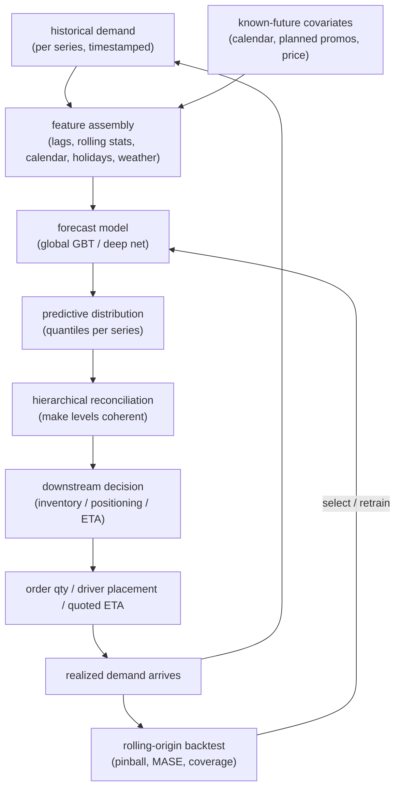

# Chapter 12: Demand Forecasting and Time Series

Picture the interviewer opening with the version of this problem that everyone
eventually meets in production: "We run a marketplace with millions of items
across thousands of stores. Design a system that forecasts demand for every item
at every location so we can decide how much to stock, how many drivers to
position, and what ETA to quote. Give me the horizon, the metric, and what the
forecast feeds into. Do not hand me a single MAPE number and call it done."

That last sentence is the whole chapter in miniature. Demand forecasting is the
topic where the naive instinct, fit one model and minimize MAPE on a point
forecast, is exactly the trap. Real forecasting is **probabilistic**: the
decision needs the whole distribution, because stocking to the median stocks out
half the time. It is **hierarchical**: item, store, region, and total must add
up, and they will not unless you make them. It is **non-stationary**: holidays,
promotions, and shocks move the distribution under you. And it is
**decision-coupled**: the forecast feeds an optimizer, it is not the deliverable.
The signal you want to send is that you frame this as coherent probabilistic
forecasts feeding a downstream decision, evaluated by proper scoring rules on a
rolling backtest, not as point-forecast accuracy golf.

In this chapter we will cover the following topics:

- Clarifying the decision the forecast feeds, and the requirements that fall out
- The high-level data flow, from covariate assembly to the forecast-then-optimize
  handoff
- Choosing among classical, machine-learning, and deep model families
- Producing probabilistic and quantile forecasts, and why a point estimate is not
  enough
- Hierarchical coherence and reconciliation
- Feature engineering, cold-start, and non-stationarity
- Backtesting with rolling-origin evaluation and the right metrics
- Spatiotemporal forecasting for ETA
- Bottlenecks, failure modes, and the eval gate

## Clarifying the decision and scoping the problem

The single most important question comes before any model: **what decision does
the forecast feed?** It changes everything downstream, and asking it first is the
clearest seniority signal you can send.

- **Replenishment** needs a high quantile so you rarely stock out (stock for P90,
  not the mean).
- **Driver positioning** needs the spatial demand distribution over the next hour.
- **ETA** needs a per-trip point estimate with a calibrated interval.

The forecast is never the product; the decision is. So ask what consumes the
output before you say a word about ARIMA or Transformers.

The remaining clarifications flow from there:

- **What horizon and granularity?** Next hour, next day, next twelve weeks? Per
  item per store, or category per region? Horizon and granularity set the model
  class. Intraday spatiotemporal is a different problem from weekly SKU
  replenishment.
- **How many series, and how related?** A dozen series is a per-series classical
  problem. Millions of related series (every item at every store) is where a
  global machine-learning or deep model earns its keep by borrowing strength, and
  it decides the model family.
- **What covariates do we have, and are they known in the future?** Calendar and
  holidays are known ahead of time. Promotions and price may be planned or not.
  Weather is a forecast of a forecast. Known-future covariates go into the model
  directly; unknown ones need their own forecast or a scenario.
- **What is the cost of over versus under?** Overstock is holding cost and waste;
  understock is lost sales and churn. That asymmetry is the entire reason you want
  quantiles rather than a mean. Get the rough ratio, and the update cadence
  (retrain nightly, forecast hourly?) that sets your freshness budget.

## Requirements

Once the decision is named, the requirements almost write themselves. Splitting
them into functional and non-functional keeps the conversation honest.

**Functional requirements:**

- Produce forecasts for every series at the required granularity and horizon.
- Emit a **distribution** (quantiles or a full predictive density), not just a
  mean.
- Guarantee **coherence**: forecasts at child levels sum to their parent level.
- Ingest known-future covariates (calendar, holidays, planned promotions, price).
- Handle **cold-start**: new items and new locations with little or no history.
- Feed the forecast into the downstream decision (optimizer or policy) cleanly.

**Non-functional requirements:**

- Backtested with **rolling-origin** evaluation, never a single random split.
- Scored with proper metrics: pinball loss and WQL for the distribution, MASE for
  scale-free point accuracy, not raw MAPE.
- Retrain and inference within the cadence budget across millions of series.
- Drift detection on inputs and residuals, because the series are non-stationary.
- Online/offline feature parity so lag and calendar features match between
  training and serving.

One requirement dominates the rest: **a coherent probabilistic forecast that
feeds a decision.** Name it first. Point accuracy is a diagnostic; the
distribution and coherence are the product, because the optimizer consumes a
quantile and needs the levels to reconcile.

## High-level data flow

There are two things worth drawing on the whiteboard: covariate assembly (history
plus known-future features) and the fact that the forecast is an **input to a
decision**, not the endpoint. The forecast-then-optimize handoff and the backtest
loop are what separate a senior answer from a textbook one.

*Figure 12.1* traces the loop. Notice three things. `DIST` is a distribution, not
a number. `RECON` makes the hierarchy add up. And `DECIDE` is a separate
optimization step. Collapse `DIST` to a mean and skip `RECON`, and the optimizer
makes coherent-looking but wrong decisions.

*Figure 12.1: The features-to-forecast-to-optimize decision loop. The forecast is
an intermediate; the decision it feeds is the product, and realized outcomes flow
back into both the history and the backtest.*

## Choosing the model family

The honest ordering matters here, because reaching for a Transformer first is a
red flag. Work from the simplest family that fits the problem and only escalate
when scale, horizon, or structure justifies it.

### Classical baselines

Classical methods fit one model **per series**. ARIMA models autocorrelation and
differencing; ETS (exponential smoothing) models level, trend, and seasonality;
Prophet is a robust additive trend plus seasonality plus holiday regression.
These win with **few series, long clean history, and stable seasonality**, and
they are the fast baseline you benchmark against before claiming a deep model
helps at all.

### Machine learning with gradient-boosted trees

The machine-learning path reframes forecasting as **tabular regression**: the
target is future demand, and the features are lags, rolling statistics, and
calendar signals. One **global** model learns across all series and borrows
strength between them. This is the workhorse for **many related series**, and it
is cheap to operate. If you take one practical lesson from this chapter, it is
that a well-tuned global gradient-boosted tree is the bar every fancier model
must clear.

### Deep learning

Deep models (DeepAR, N-BEATS, TFT, PatchTST) are global neural networks that emit
distributions natively (DeepAR parameterizes a likelihood; TFT emits quantiles)
and handle cold-start through learned series embeddings. They earn their keep at
**scale, long horizons, or rich covariates**, but they do **not** reliably beat a
well-tuned global gradient-boosted tree on short-horizon tabular demand. Say this
out loud in the interview; it demonstrates that you have actually shipped
forecasts rather than read about them.

The mature summary: baseline with ETS or Prophet, ship a global gradient-boosted
tree, and reach for deep learning only when scale, horizon, or many-related-series
structure justifies it.

## Probabilistic and quantile forecasts

A point forecast answers "how much on average," but no decision cares about the
average. Replenishment stocks to the quantile that hits the target service level
(P90, not the mean, or you stock out roughly half the time). The output must be a
**distribution**, and there are three standard ways to produce one.

**Quantile regression via pinball loss.** You emit multiple quantiles (P10, P50,
P90) by minimizing the pinball loss at each, which gives the operating point
directly. For a target quantile level $\tau \in (0, 1)$, a prediction
$\hat{y}$, and a realized value $y$, the pinball (quantile) loss is:

$$
L_\tau(y, \hat{y}) =
\begin{cases}
\tau \, (y - \hat{y}) & \text{if } y \ge \hat{y} \\
(1 - \tau)\,(\hat{y} - y) & \text{if } y < \hat{y}
\end{cases}
$$

The asymmetry is the point. For $\tau = 0.9$, under-predicting (leaving $y >
\hat{y}$) is penalized nine times as heavily as over-predicting, which pushes the
fitted value up to the ninetieth percentile exactly where a replenishment
decision wants it. Minimizing $L_\tau$ over the data yields the conditional
$\tau$-quantile.

**Parametric likelihood.** DeepAR-style models predict distribution parameters
(a negative binomial for counts, which stays non-negative and over-dispersed) and
then sample forecast paths from the fitted distribution.

**Conformal prediction.** A distribution-free wrapper that calibrates intervals
to a nominal coverage level using residuals, giving cheap honest intervals on top
of a point model.

Whichever route you take, the tell is **calibration**: a P90 forecast should be
exceeded about ten percent of the time. Report empirical coverage, not just the
loss value.

## Hierarchical and coherent forecasting

Demand is hierarchical: item rolls up to category to region to total; store rolls
up to district to national. Forecast each level independently and the numbers
**will not add up**, and a business cannot act on incoherent numbers.

- **Bottom-up.** Forecast the leaves, then sum upward. Coherent by construction,
  but it inherits all the leaf-level noise.
- **Top-down.** Forecast the top level, then split by historical proportions.
  Stable in aggregate, but it misses leaf dynamics.
- **Optimal reconciliation (MinT).** Forecast **every** level, then project onto
  the coherent subspace with a trace-minimizing step that uses the residual
  covariance. This is the principled answer: it uses all levels, provably reduces
  error, and extends to the probabilistic case. An end-to-end model can also emit
  coherent probabilistic forecasts directly, skipping the post-hoc step.

Reconciliation is not optional. The decision consumes multiple levels, and they
must be consistent, or the replenishment plan for a region will contradict the
plans for the stores inside it.

## Feature engineering and cold-start

For the machine-learning path, the features **are** the model, and they carry the
leakage trap: any lag or rolling feature must use data available **at forecast
time**, or the backtest reports fantasy accuracy that collapses in production.

- **Lags** at t-1, t-7, t-364 capture seasonality. A seven-day-ahead forecast
  cannot use the t-1 lag, so choose lags by horizon.
- **Rolling statistics** (mean, standard deviation, min, max over 7/28/90-day
  windows) capture level and volatility.
- **Calendar** features (day-of-week, week-of-year, month) are encoded cyclically
  so December sits next to January rather than at the far end of a number line.
- **Holidays, events, promotions, and price** are known-future covariates (use
  lead and lag windows around them) and are often the single largest demand
  driver.
- **Weather** is a strong exogenous driver, but it is itself a forecast, so you
  inherit its error.

**Cold-start** breaks lag features entirely: a new item has no history to lag.
This is exactly where **global** models shine. Learned series and attribute
embeddings forecast a brand-new item from similar items, attribute priors blend
toward the item's own history as sales accrue, and hierarchical shrinkage borrows
the parent-level pattern until the leaf can stand on its own. Keep the intervals
wide until history accumulates.

## Non-stationarity and drift

Time series are non-stationary: trends shift, seasonality evolves, regimes break,
and a model fit on last year's regime silently degrades. Three tools handle it.

- **Differencing and detrending** for the mean, plus log or Box-Cox transforms
  for the variance (which also keeps counts non-negative).
- **Regime awareness** through recent-data weighting, sliding windows, and
  change-point detection that triggers a refit.
- **Residual monitoring**, where sustained bias or widening error is drift, and it
  becomes your retrain trigger.

Non-stationarity is the default, not the exception, so retrain cadence and drift
alarms are part of the design from day one, not a bolt-on.

## The forecast-then-optimize pattern

The forecast is an intermediate; the value lands in the **decision** it feeds.
Replenishment turns a demand distribution, a lead time, and a cost structure into
an order quantity (a newsvendor stocking to the service-level quantile).
Positioning turns a spatial forecast into a rebalancing plan.

Two consequences candidates routinely miss. First, the optimizer needs the
**distribution, not the mean**: a newsvendor stocks to a quantile derived from the
over/under cost ratio and cannot compute safety stock from a point forecast at
all. Second, the metric that matters is the **decision cost, not the forecast
error**. Where feasible, evaluate against the downstream cost (realized stockouts
and waste, or a Monte Carlo of the decision under the forecast distribution)
rather than against forecast accuracy alone.

## Backtesting and the right metrics

You cannot random-split a time series; that leaks the future into the training
set. Use **rolling-origin** (walk-forward) evaluation: fix a cutoff, forecast
forward, score, roll the cutoff forward, and repeat. It mirrors production and
exposes horizon-dependent decay that a single split hides.

On metrics, MAPE is broken for this problem. It is undefined at zero demand
(common at the item-store leaf), asymmetric, and explosive on small denominators.
Reach for these instead.

**MASE (Mean Absolute Scaled Error)** scales the forecast error by the error of a
naive seasonal baseline, so it is unit-free, comparable across series, and defined
at zero. For a seasonal period $m$, forecasts $\hat{y}_t$ over a horizon of $h$
points, and $n$ in-sample training points, it is:

$$
\text{MASE} =
\frac{\frac{1}{h}\sum_{t=n+1}^{n+h}\lvert y_t - \hat{y}_t \rvert}
{\frac{1}{n-m}\sum_{t=m+1}^{n}\lvert y_t - y_{t-m} \rvert}
$$

The denominator is the in-sample mean absolute error of the seasonal-naive
forecast "predict the value from one season ago." A MASE below 1 means you beat
that naive baseline; above 1 means you did not. Because the scale cancels, you can
average MASE across a million heterogeneous series and get a number that means
something.

**Pinball loss and WQL (Weighted Quantile Loss)** score the whole quantile set,
which is the right objective for a probabilistic forecast. WQL aggregates the
pinball loss across a set of quantile levels $Q$ and normalizes by total realized
demand so that high-volume series and low-volume series are comparable:

$$
\text{WQL} =
\frac{2 \sum_{\tau \in Q} \sum_{t} L_\tau\!\left(y_t, \hat{y}_t^{(\tau)}\right)}
{\sum_{t} \lvert y_t \rvert}
$$

where $L_\tau$ is the pinball loss defined earlier and $\hat{y}_t^{(\tau)}$ is the
predicted $\tau$-quantile at time $t$. Report WQL alongside **coverage**, and
weight by business value (revenue or volume) so that a million tiny-volume series
do not dominate the average and hide a failure on the series that actually matter.

## ETA and spatiotemporal forecasting

ETA and demand-over-a-map are time series with **spatial structure**, and
ignoring geography leaves accuracy on the table, because travel time and demand
diffuse across connected road segments and adjacent zones. **Graph neural
networks** over the road or region graph, combined with a temporal model
(recurrent or temporal-convolutional), capture that diffusion; this is the shape
behind modern map-scale ETA. **Residual learning**, where you predict a correction
on top of a routing baseline rather than the absolute travel time, is easier to
learn and meets tight latency budgets. Latency is what makes ETA distinct: it is
computed inline in a quote, so the model must be cheap and its features
precomputed lookups, the same discipline you apply to a ranking model.

## Tracing two reference architectures

Block diagrams hide the wiring. It helps to trace two real graphs that span the
range from the classic deep baseline to the long-horizon Transformer, because the
sequence structure is where the interesting decisions live.

*Figure 12.2* is **PatchTST**, a patch-based Transformer for long-horizon
multivariate forecasting. The move worth tracing is how the input series is split
into **patches** (short subsequences) that become tokens before the attention
stack. That patching is what lets a Transformer handle long horizons cheaply and
channel-independently: attention runs over a manageable number of patch tokens
rather than every raw timestep, and each channel is processed on its own. Reach
for it when the horizon is long and there are many correlated series.

*Figure 12.3* is **CNN-LSTM 1D**, the classic deep hybrid baseline. Here the 1D
convolution extracts local temporal features that then feed an LSTM for the
longer-range dependency. It makes the conv-then-recurrent pattern concrete, and it
is the workhorse deep model you benchmark before anything fancier. Both figures
are validated reference graphs at real dimensions, shape-checked end to end.

Worth saying plainly: many production forecasters still run gradient-boosted trees
on lag and calendar features, and the deep models above earn their keep mainly at
scale, with many related series, or long horizons.

## Bottlenecks and scaling

As the series count and feature volume grow, a predictable set of bottlenecks
appears. The table below pairs each with its first warning sign, the standard fix,
and the tradeoff you accept.

| Bottleneck | First sign | Fix | Tradeoff |
|---|---|---|---|
| Millions of series to fit | Nightly retrain overruns cadence | One global model over all series, not per-series | Loses some per-series nuance |
| Feature assembly at scale | Lag/rolling backfill is slow | Precompute lags/rolling in a feature store | Storage, freshness, skew risk |
| Long-horizon accuracy decay | Error grows with horizon | Direct multi-horizon over recursive | Model complexity, per-horizon training |
| Hierarchy incoherence | Levels do not sum | MinT reconciliation or end-to-end coherent model | Extra compute, covariance estimation |
| Cold-start series | New items forecast poorly | Global model with learned embeddings, attribute priors | Wide intervals until history accrues |
| Non-stationary drift | Residual bias widens | Sliding window, change-point retrain, drift alarms | Retrain cost, reactivity vs stability |
| ETA serving latency | p99 over budget inline | Residual-on-baseline model, precomputed features | Model capacity vs speed |

## Failure modes, safety, and the eval gate

The failure modes cluster tightly around the four properties we opened with:
probabilistic, hierarchical, non-stationary, decision-coupled.

- **Point forecast where a distribution is needed.** Handing the optimizer a mean
  makes safety stock uncomputable and stocks out at the target quantile. Emit
  quantiles and report coverage.
- **MAPE on intermittent demand, or a random split.** MAPE is undefined at zero
  and explosive on small demand; a random train/test split leaks the future. Use
  MASE and pinball/WQL on a rolling-origin backtest at the production horizon.
- **Feature leakage via lags.** Using a lag or rolling statistic not yet available
  at forecast time inflates offline metrics and collapses live. Enforce
  point-in-time availability per horizon.
- **Ignoring known-future covariates.** Dropping holidays and planned promotions
  guarantees a miss on exactly the high-demand days that matter most.
- **Deep model by default, or silent drift.** A Transformer before benchmarking a
  global gradient-boosted tree rarely wins at short horizons (baseline first), and
  without residual monitoring a regime change degrades every forecast until a
  stockout surfaces it.

For the **eval gate**: rolling-origin pinball/WQL, MASE, and coverage are the fast
pre-gate, and the ship decision is the downstream decision cost (realized
stockouts and waste), measured against the incumbent. The forecast metric is a
diagnostic; the decision cost is the verdict.

## Questions
A few questions come up almost every time, and crisp answers land well.

- **"Why not just minimize MAPE?"** MAPE is undefined at zero, asymmetric, and
  explodes on small demand, and the decision needs a quantile, not a mean. Use
  MASE and pinball/WQL with coverage.
- **"Classical, ML, or deep?"** Classical (ETS/Prophet) for few series with long
  clean history; a global gradient-boosted tree for many related series (the
  workhorse); deep only at scale, long horizons, or rich covariates. Baseline
  before going deep.
- **"The levels do not add up, how do you fix it?"** Hierarchical reconciliation:
  bottom-up, top-down, or optimal (MinT), or an end-to-end coherent model.
- **"New item with no history?"** Global model with learned series and attribute
  embeddings, attribute priors, and hierarchical shrinkage toward the parent, with
  wide intervals until history accrues.
- **"How do you evaluate?"** Rolling-origin (walk-forward) backtest at the
  production horizon, scored with MASE and pinball/WQL plus coverage, ideally
  against the downstream decision cost.
- **"How is ETA different?"** Spatial structure: graph neural networks over the
  road graph plus a temporal model, often as a residual on a routing baseline,
  under tight inline serving latency.

## Summary

This chapter framed demand forecasting the way a senior practitioner does: not as
a race to the lowest point error, but as a system that produces coherent
probabilistic forecasts and hands them to a downstream decision. We started by
insisting on the first question, what decision does the forecast feed, because it
sets the horizon, the granularity, and the metric. We walked the data flow from
covariate assembly through the predictive distribution, hierarchical
reconciliation, and the forecast-then-optimize handoff, then closed the loop with
a rolling-origin backtest.

Along the way we ordered the model families honestly (classical baseline, global
gradient-boosted tree workhorse, deep learning only when scale or horizon
justifies it), derived the pinball loss that produces quantiles, defined MASE and
WQL as the scale-free and probabilistic metrics that replace a broken MAPE, and
traced two reference architectures, PatchTST and CNN-LSTM 1D, to make the sequence
wiring concrete. The failure modes and the eval gate all trace back to the same
four properties: probabilistic, hierarchical, non-stationary, decision-coupled.

The next chapter, *Predictive Modeling on Tabular Data*, stays close to the
machine-learning path we leaned on here. Once you reframe forecasting as tabular
regression on engineered features, you inherit the whole toolbox of gradient
boosting, feature handling, and leakage discipline that tabular modeling has spent
years refining, and that is exactly where we go next.

## Further reading

Production engineering writeups of the systems in this chapter, each a first-party source:

- **Uber** [Forecasting at Uber: An Introduction](https://www.uber.com/blog/forecasting-introduction/): An overview of Uber's classical, ML, and deep-learning forecasting stack with prediction intervals. *(product design)*
- **Uber** [Engineering Uncertainty Estimation in Neural Networks for Time Series](https://www.uber.com/blog/neural-networks-uncertainty-estimation/): A Bayesian neural net decomposing model, misspecification, and noise uncertainty. *(eval bar)*
- **Uber** [DeepETA: How Uber Predicts Arrival Times Using Deep Learning](https://www.uber.com/us/en/blog/deepeta-how-uber-predicts-arrival-times/): A Transformer-based ETA residual model meeting global latency and accuracy constraints. *(deployment)*
- **Amazon Science** [End-to-end learning of coherent probabilistic forecasts for hierarchical time series](https://www.amazon.science/publications/end-to-end-learning-of-coherent-probabilistic-forecasts-for-hierarchical-time-series): One model producing coherent probabilistic hierarchical forecasts without post-hoc reconciliation. *(product design)*
- **Google DeepMind** [Traffic prediction with advanced Graph Neural Networks](https://deepmind.google/blog/traffic-prediction-with-advanced-graph-neural-networks/): Graph neural nets over road Supersegments improving Google Maps ETA accuracy up to 50%. *(deployment)*
- **Instacart** [Building for Balance](https://company.instacart.com/how-its-made/building-for-balance): A unified engine forecasting shopper supply versus customer demand to guide interventions. *(product design)*
- **Instacart** [Modernizing real-time availability prediction for hundreds of millions of items](https://company.instacart.com/tech-innovation/how-instacart-modernized-the-prediction-of-real-time-availability-for-hundreds-of-millions-of-items-while-saving-costs): A hierarchical general, trending, and real-time model, cutting cost about 80%. *(deployment)*
- **Zalando** [Building a dynamic inventory optimisation system](https://engineering.zalando.com/posts/2025/06/inventory-optimisation-system.html): Probabilistic demand forecasts plus Monte Carlo optimization for replenishment. *(product design)*
- **Grab** [Understanding Supply and Demand in Ride-hailing Through Data](https://engineering.grab.com/understanding-supply-demand-ride-hailing-data): Measuring geo and time supply-demand ratios to improve matching and rebalance. *(eval bar)*
- **Lyft** [Causal Forecasting at Lyft (Part 1)](https://eng.lyft.com/causal-forecasting-at-lyft-part-1-14cca6ff3d6d): Causal-DAG-based forecasting of marketplace metrics for policy decisions under confounding. *(product design)*
