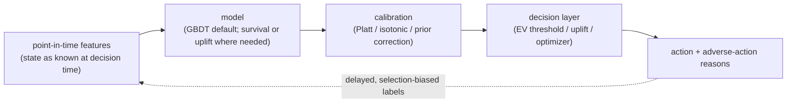

# Chapter 13: Predictive Modeling on Tabular Data

The naive way to answer a tabular system-design question is "train an XGBoost model and ship the AUC." That answer misses the whole point. The deliverable is almost never a held-out AUC. It is a **calibrated probability** that a business rule or an optimizer multiplies into a money decision, produced under labels that arrive months late, that are biased by the decisions you already made, and under a regulator who can demand the reason for any adverse action. If you optimize for ranking alone, you have already lost the plot, because the score that sets a price or an approved limit has to be right in absolute value, not just in order.

This chapter works through a single motivating brief. We issue credit cards, and for every application, and later for every line-increase decision, we need a probability that the customer defaults in the next twelve months. That number sets who we approve, what limit we give, and what price we charge. The volume is modest, seconds not milliseconds, so the hard part is never QPS. It is label quality, calibration, point-in-time correctness, and explainability, because regulators can ask us to justify any decline. We will use that brief to expose the decisions an interviewer is actually probing for: whether you separate the prediction from the decision it feeds, know why gradient-boosted trees still beat neural nets on heterogeneous columns and when they do not, treat calibration and leakage as first-class, and can talk about delayed and selection-biased labels without hand-waving.

In this chapter, we will cover:

- Scoping a tabular problem so the probability, not the ranking, is the product
- Why gradient-boosted decision trees dominate tabular data, and the bagging-versus-boosting mechanics underneath
- When neural nets earn their place: high-cardinality categoricals and learned embeddings
- Calibration as a first-class deliverable, and the post-hoc maps that produce it
- The decision layer: expected-value thresholds, uplift for interventions, and budget-constrained allocation
- Delayed and selection-biased labels, reject inference, survival analysis, and LTV
- Fairness, regulation, explainability, leakage, and point-in-time correctness
- Tracing three reference architectures at real tensor shapes, from wide-and-deep to DLRM

By the end, you will be able to walk an interviewer from "score this applicant" to a calibrated, auditable, decision-feeding system, and defend why the production model is usually a tree that has no layer diagram at all.

## Clarify and scope before you draw anything

The single strongest opening move is to refuse to treat "predict default" as a prediction problem in isolation. It is a definition problem, a decision problem, and a data problem before it is a modeling problem. The questions worth asking:

- **What is the target and horizon, exactly?** "Default" is not a fact, it is a definition: ninety-plus days past due within twelve months of the decision. Nail the label window, the observation point, and the performance window first. The same care applies to churn (cancels within N days), conversion (buys within a window), and lifetime value (net margin over a horizon). Note the dynamics too: defaults mature over a year, chargebacks and conversions lag, churn is naturally time-to-event, so the freshest data has no mature label yet.
- **What decision does the score feed?** Approve or decline is a threshold. A credit line is an optimization. A price or an incentive is a **causal** question (what changes if I intervene), not a predictive one. The modeling choice follows the decision, so pin the decision down first.
- **What is the selection bias?** In credit you only observe repayment for people you approved. The rejected population is invisible to the label, but you still have to score them tomorrow. This is the reject-inference problem, and it is unavoidable.
- **What are the regulatory and fairness constraints?** Credit and insurance are regulated: you may owe an **adverse-action reason** for every decline, protected attributes are off-limits as features (and often as proxies), and the model may need documented, reproducible governance. Ask whether this is a regulated decision early, because it constrains the entire model family.
- **Volume and latency?** Usually modest: batch or near-real-time scoring in seconds. The hard part is almost never throughput, it is label quality, calibration, and explainability.

For the rest of the chapter we scope to a regulated credit-risk score that feeds an approve-or-decline gate and a line-assignment optimizer, with churn, LTV, and incentive decisions used as contrast cases to show where the modeling choice flips from predictive to causal.

## Requirements and metrics

**Functional requirements.** Produce a calibrated probability (or expected value) per entity per decision point. Feed a **decision layer**: a threshold, an expected-value rule, or an optimizer. Emit an explanation for regulated decisions (top adverse-action reasons). Log features **as known at decision time** so the training set is point-in-time correct later.

**Non-functional requirements.** Calibration error small and continuously monitored, because the probability sets money, not order. Point-in-time correctness with zero leakage from the future into training features. Reproducible, auditable, documented models where regulation demands it. Drift monitoring on features, scores, and (delayed) label maturation, stable under population shift from new products, macro cycles, and marketing changes.

**Metrics.** State these explicitly, and never lead with accuracy or even AUC alone. Offline you report three layers, every one of them sliced by segment, vintage, and protected group:

- **Ranking**: ROC-AUC when classes are balanced and you want a base-rate-invariant ordering, PR-AUC when positives are rare and the quality of the positive predictions is what matters, and the concordance index (C-index) when the target is time-to-event.
- **Calibration**: reliability curves, expected calibration error, and a proper scoring rule (log-loss or Brier). These are the metrics that tell you whether the probability can be trusted as a number.
- **Business value**: the actual cost matrix applied through the decision layer, which is the only metric that speaks the language of the decision.

The requirement to name first is that **the probability is the product**. A threshold model that only sorts can tolerate poor calibration, because a monotone distortion washes out at a single cutoff. A model whose score is multiplied into an expected loss, an approved limit, or a bid cannot: a miscalibrated $p$ scales the decision directly. Two models with identical AUC can lose money at very different rates because one reports $0.2$ where the truth is $0.1$. Say that before you draw a box.

## High-level data flow

Two paths share one skeleton. The offline path turns matured, point-in-time-correct history into a calibrated model plus a decision policy. The online path scores an entity and hands back a **decision**, not just a number, then logs everything so today's decisions mature into tomorrow's (biased, delayed) training data. The single mermaid worth drawing is the through-line every system in this chapter shares: point-in-time features feed a model, the model feeds a calibration step, and only then does a decision layer turn the number into money.

The calibration box sits between the score and the decision on purpose, because the absolute probability, not the ranking, is what the decision consumes. The dashed edge is the whole difficulty: the action you take today changes the data you train on tomorrow, and it does so with a lag and a selection bias. Everything hard in this chapter lives on that box and that edge.

## Why gradient-boosted trees still dominate

On heterogeneous tabular data (mixed numeric and categorical columns, skewed distributions, missing values, non-smooth relationships), **gradient-boosted decision trees** (XGBoost, LightGBM, CatBoost) remain the default and usually the winner. They are invariant to monotone feature transforms, handle missing values natively, capture non-linear thresholds and interactions without feature engineering, train fast, and are far easier to inspect than a deep net. Deep learning's edge, learning representations from raw signal, does not apply when the features are already meaningful columns. Be honest in the interview: **the production model here is usually a tree, which is not a neural graph and has no layer diagram to trace.**

To defend that choice you have to know what is inside the tree, so let us build up from the classical landscape the interviewer will pull on.

### The classical landscape in one pass

A single decision tree partitions the space with axis-aligned thresholds, one feature at a time, and predicts a constant in each region. That inductive bias is exactly why trees are great on heterogeneous columns (no scaling needed, mixed types and interactions handled natively) and exactly why they struggle on smooth or extrapolating signals, where they produce a jagged staircase and flatline outside the training range. A single unpruned tree is also famously high variance: because each split is chosen greedily, a small data perturbation can flip an early split and cascade into a completely different tree below it. The other classical families each carry one assumption you should be able to name: logistic regression draws only flat boundaries ($w^\top x + b = 0$) but gives calibrated-ish probabilities cheaply, kernel SVMs buy a nonlinear boundary at $O(n^3)$ training cost, kNN assumes near points share labels and collapses under the curse of dimensionality, and naive Bayes assumes conditional independence and so classifies well but calibrates badly. On tabular data the tree ensembles win because the axis-aligned, piecewise-constant bias matches the data, and the ensemble tames the variance.

### Bagging attacks variance, boosting attacks bias

The two ways to turn many trees into one strong model attack opposite halves of the error decomposition, and this is the distinction interviewers reach for first.

**Bagging** (as in a random forest) trains many deep, low-bias, high-variance trees on bootstrap resamples and averages them. Averaging near-unbiased estimators leaves bias roughly unchanged but shrinks variance. Quantitatively, if you average $B$ identically distributed estimators each with variance $\sigma^2$ and pairwise correlation $\rho$, the variance of the average is

$$\text{Var} = \rho\sigma^2 + \frac{1-\rho}{B}\sigma^2,$$

so as $B$ grows the second term vanishes and the ensemble variance floors at $\rho\sigma^2$, set entirely by how correlated the trees are. That is why simply adding trees plateaus, and why a random forest additionally restricts each split to a random subset of features (typically $\sqrt{p}$): it lowers $\rho$ and thus the floor, at a small cost in per-tree bias. A bagged forest gives you out-of-bag error nearly for free, because each bootstrap leaves out about $(1-1/n)^n \to e^{-1} \approx 37\%$ of the rows, which you can score with the trees that did not see them.

**Boosting** (GBDT) fits weak, high-bias, shallow trees sequentially, each one correcting the running ensemble's error, so the additive model steadily reduces bias. The tradeoff is that bagging cannot fix a systematic bias no matter how many trees you add, while boosting can drive training bias to near zero but must be regularized or it starts fitting noise. On tabular data a well-tuned GBDT usually has the higher accuracy ceiling, while a random forest is the more robust default that is far harder to misconfigure.

### What gradient boosting is actually doing

Gradient boosting treats the ensemble as a function $F$ optimized by functional gradient descent on the loss. At each stage it computes, for every sample, the pseudo-residual

$$r_i = -\left[\frac{\partial L(y_i, F(x_i))}{\partial F(x_i)}\right],$$

fits a new weak learner $h_m$ by least squares to those pseudo-residuals, and adds it with a small learning rate: $F_m = F_{m-1} + \nu\, h_m$. For squared-error loss the negative gradient is literally the ordinary residual, which is why "fit the residuals" is exactly right there, and for logistic or ranking losses the pseudo-residual is a loss-specific quantity, which is what lets one algorithm serve classification, regression, and ranking. XGBoost goes second order, using the Hessian $h_i = \partial^2 L / \partial F(x_i)^2$ so each leaf value is a proper Newton step: for a leaf holding instance set $I$ the optimal weight is $w^\ast = -\frac{\sum_{i\in I} g_i}{\sum_{i\in I} h_i + \lambda}$, and the regularization terms ($\lambda$ on leaf weights, $\gamma$ per leaf) fall out of the gain formula naturally. Histogram-based split finding (bucketing each feature into, say, 255 bins) turns the per-node cost from $O(n)$ into $O(\text{bins})$, and LightGBM's leaf-wise growth reaches lower loss with fewer leaves at the cost of deeper, more overfit-prone trees that you constrain with `num_leaves` and `min_data_in_leaf`.

Two properties matter for the credit brief specifically. First, trees handle **missingness as a first-class signal**: XGBoost and LightGBM learn a default direction per split by trying both and keeping the higher-gain side, which beats global mean imputation because the missingness pattern itself often carries information. Second, a GBDT is an additive model of already-fitted trees, so it is **awkward for continual or online learning**: there is no cheap in-place gradient step over past trees the way SGD updates a neural net, so drift usually forces a full retrain. Learning rate and early stopping are coupled knobs here: set $\nu$ as low as compute allows (a smaller $\nu$ needs roughly $M \propto 1/\nu$ more trees) and let early stopping on a validation set choose the tree count.

## When neural nets earn their place

Neural nets are not the default on columns, but they win in two situations, and both are worth naming so the interviewer knows you are not reaching for deep learning reflexively.

The first is **very high-cardinality categoricals**: user, merchant, or item IDs with millions of values, where a learned **embedding** beats one-hot or target encoding. This is exactly the regime where recommender-style architectures show up on tabular problems, and it is why the reference graphs at the end of this chapter are wide-and-deep, DeepFM, and DLRM rather than anything tree-shaped. When a field has hundreds of millions of values you cannot afford a row per value, so the hashing trick maps values into a fixed table and trades exact identity for bounded memory, paying in collisions that blur the tail more than the head. The second situation is when tabular features must be **fused with unstructured signal** (text, images, event sequences), where the network learns a joint representation no tree can. Outside those two cases, reach for a tree.

Two cautions on the embedding path. Dot-product similarity in an unnormalized embedding space lets popular items grow large-norm vectors and dominate, which is sometimes a useful popularity prior and sometimes runaway head bias, so normalize when you want similarity to be purely directional. And embedding dimensionality is a capacity-versus-cost knob with fast-diminishing returns: high-cardinality, high-traffic fields justify wide vectors, while low-cardinality categoricals do fine at eight to thirty-two dimensions.

## Calibration: the probability is the product

A score of $0.05$ has to mean a five percent real-world rate, because a threshold or an optimizer reads the absolute value. GBDTs, especially regularized or class-weighted ones, are often not calibrated out of the box, and any sampling or reweighting you did for imbalance distorts the probabilities further away from the true base rate. The discipline is a three-step recipe.

**Train with a proper scoring rule.** Log-loss and Brier score are *proper*, meaning their expected value is minimized only by reporting the true probabilities, so they reward calibration as part of getting a good score:

$$\text{log-loss} = -\frac{1}{N}\sum_i \left[y_i \log \hat p_i + (1 - y_i)\log(1 - \hat p_i)\right], \qquad \text{Brier} = \frac{1}{N}\sum_i (\hat p_i - y_i)^2.$$

Log-loss diverges as a confident prediction approaches certainty on the wrong side, so it punishes over-confidence harshly, while Brier is bounded and gentler. Accuracy is not a proper scoring rule (it only cares about the argmax), which is why a model can be accurate yet badly miscalibrated.

**Fit a post-hoc calibrator on a held-out slice drawn from the real prior.** Platt scaling fits a one-dimensional logistic regression, $\hat p = \sigma(a\,s + b)$, which is data-efficient and ideal for small validation sets and roughly sigmoidal distortion. Isotonic regression fits any monotone step function, correcting arbitrary-shaped miscalibration but needing more data and prone to overfit on small sets. Temperature scaling divides logits by a single scalar $T$ and is the neural-net standard because it fixes confidence without changing the argmax. If you sampled or reweighted for imbalance, apply the analytic **prior correction** first, rescaling the odds back to the true base rate:

$$\frac{p_{\text{true}}}{1 - p_{\text{true}}} = \frac{p_{\text{train}}}{1 - p_{\text{train}}} \cdot \frac{\pi_{\text{true}}/(1 - \pi_{\text{true}})}{\pi_{\text{train}}/(1 - \pi_{\text{train}})}.$$

The order of operations is non-negotiable: **calibrate first, then threshold**, and do both on data drawn from the real class prior, never on the resampled training set. Fit the calibration map on one held-out split and choose or verify the threshold on another, so the operating point is not tuned on the same data that fixed the probabilities.

**Monitor calibration sliced by segment, product, and vintage.** Expected calibration error bins predictions by confidence and averages the gap between each bin's confidence and its empirical accuracy,

$$\text{ECE} = \sum_b \frac{|B_b|}{N}\,\bigl\lvert \text{acc}(B_b) - \text{conf}(B_b)\bigr\rvert,$$

but it can hide compensating over- and under-confidence within a bin and is unstable when bins are sparse, so pair it with a reliability diagram. A model calibrated on average can be badly off on the exact slices the decision cares about, which is why you never report a single global ECE and stop.

## The decision layer: prediction is not the decision

This is the section that separates a senior answer. A probability is an input, the system's output is an action, and the mapping is a design choice you draw as its own box.

**Expected-value thresholds.** For approve or decline, do not threshold the probability directly. Threshold the **expected value**: approve when the expected profit from a good customer outweighs the expected loss from a bad one,

$$p(\text{good})\cdot \text{value} \;>\; p(\text{bad})\cdot \text{exposure}\cdot \text{LGD}.$$

The optimal cutoff falls out of the cost matrix, not out of an F1 score. In the general two-cost form, for a calibrated probability the optimal threshold sits where the marginal cost of flagging equals the marginal cost of missing,

$$p^\ast = \frac{C_{fp}}{C_{fp} + C_{fn}},$$

so if missing a defaulter is ten times costlier than a false decline, $p^\ast \approx 0.09$, well below $0.5$. The $0.5$ default is optimal only when the score is calibrated and the two errors cost the same, which under imbalance is almost never true. This is also exactly why the calibration step is load-bearing: applying $p^\ast$ to an uncalibrated score silently picks the wrong operating point.

**Uplift and causal models for interventions.** Pricing, discounts, incentives, and retention offers are **interventions**, and the question flips from "who will churn" to "whose behavior changes if I act." An observed association $P(Y \mid X)$ is not the interventional $P(Y \mid \text{do}(X))$ unless assignment is randomized, so a pure churn predictor wastes budget on lost causes and on people who would have stayed anyway. You want the **persuadables**, which needs uplift modeling: estimate the conditional average treatment effect

$$\tau(x) = \mathbb{E}[Y \mid \text{do}(T=1), x] - \mathbb{E}[Y \mid \text{do}(T=0), x]$$

with a two-model approach, a single model on the treatment interaction, or a causal-forest estimator, ideally trained on data with a randomized treatment slice so the effect is identified.

**Budget-constrained allocation.** When incentives share a fixed budget, the decision is an optimization on top of the scores: rank by uplift-per-dollar and fill a **knapsack**, or solve a convex allocation. The ML produces the coefficients, an optimizer makes the call. Draw the two as separate boxes, because conflating them is the tell of someone who has only ever done offline modeling.

## Delayed and biased labels, and reject inference

The credit label is slow and the training data is self-selected, and both facts corrupt naive setups.

**Maturation lag.** A twelve-month default label leaves the last year of applications with no final label. Train only on matured data and the model is a year stale, but count immature accounts as "good" and you bias risk downward. Options: restrict the target to matured vintages, use a faster-maturing proxy (early delinquency) that correlates with the true label, or use **survival analysis** so censored accounts still contribute rather than being discarded or mislabeled.

**Selection bias and reject inference.** You only observe repayment for approved applicants, so a model trained on approvals is only valid on the approved region of feature space, yet you must score the whole population tomorrow. Left alone the loop tightens: the model grows confident about a shrinking, self-selected region and never learns the rest. Breaking it needs **reject inference**, inferring outcomes for rejected applicants (reweighting, parceling, external bureau performance), or a small **randomized approval** slice below the cutoff that buys unbiased ground truth. The tradeoff is stark and worth saying out loud: exploration costs real losses but is the only clean way to break the loop. More data does not help if it is the wrong data, because you just converge more tightly on a biased answer.

## Survival analysis and lifetime value

Churn, time-to-default, and time-to-conversion are naturally **time-to-event**, not fixed-window binary. Framing them as "churned in 30 days: yes or no" throws away *when* the event happens and discards the **censored** customers still active at the cutoff. Survival models keep both. The hazard is the instantaneous event rate given survival so far, and the survival function is the probability of lasting past $t$,

$$h(t \mid x) = \lim_{\Delta t \to 0}\frac{P(t \le T < t + \Delta t \mid T \ge t, x)}{\Delta t}, \qquad S(t \mid x) = \exp\!\left(-\int_0^t h(u \mid x)\,du\right).$$

Cox proportional hazards models the covariate effect multiplicatively on a shared baseline, $h(t \mid x) = h_0(t)\exp(\beta^\top x)$, giving interpretable hazard ratios, while survival forests or gradient-boosted survival capture non-linear interactions. The output is a **survival curve per customer**, strictly more useful than a single number: read off risk at any horizon, drive retention timing, and feed LTV directly. Evaluate with the concordance index, the fraction of comparable pairs the model orders correctly,

$$\text{C-index} = P\!\left(\hat\eta_i > \hat\eta_j \;\middle|\; T_i < T_j\right),$$

which generalizes AUC to censored, time-to-event data.

**LTV** is then an expected discounted sum of future margin, and the honest version separates the pieces: retention each period (the survival curve) times expected spend per active period times margin, discounted over a horizon (buy-till-you-die models play the same role in non-contractual settings). Two traps: do not regress raw historical revenue and call it LTV (that bakes in survivorship bias and ignores the horizon), and be explicit about **baseline versus incremental** LTV when the number justifies a marketing spend, because that is again a causal (uplift) question, not a predictive one. The loss you pick shapes what the model estimates: an MSE objective recovers the conditional mean and chases a few whales, MAE recovers the median and tracks the typical customer, and for the spike-at-zero-plus-heavy-tail shape of per-user revenue a **Tweedie loss** (the negative log-likelihood of a compound Poisson-Gamma, with a power parameter tuning $\text{Var}(y) \propto \mu^p$) fits where neither Gaussian nor pure Poisson can. When downstream decisions depend on a tail bound rather than a point estimate, the **pinball (quantile) loss** fits a chosen quantile directly,

$$L_\tau(y, \hat y) = \begin{cases} \tau\,(y - \hat y) & y \ge \hat y \\ (1 - \tau)\,(\hat y - y) & y < \hat y \end{cases}$$

so training several $\tau$ values gives full predictive intervals without assuming a parametric noise model.

## Fairness, regulation, and explainability

For credit, insurance, and hiring-adjacent decisions these constraints are legal, not aspirational.

- **Protected attributes and proxies.** You cannot use race, sex, or age (in credit), and you must watch for **proxies** such as a zip code that correlates with a protected class. Test for disparate impact across groups, and be ready to trade a little AUC for fairness, because a proxy feature can quietly reintroduce a protected attribute and surface as a disparate outcome even though nothing errored.
- **Adverse-action reasons.** A decline usually requires the top few reasons in plain language. Per-decision attributions (SHAP on a tree, or reason codes from a monotone scorecard model) map the score back to features. This is a strong argument for trees or **monotonic GBDTs** over an opaque deep net: you can constrain "more income never lowers approval odds," which is defensible and intuitive, and regulated models also need documentation and reproducibility, so factor governance in up front rather than bolting it on.

## Leakage, point-in-time correctness, and drift

The most common way a tabular project fails silently is **target leakage**: a feature that encodes the outcome or is only knowable after it. Classic offenders are an account status updated post-default, an aggregate over a window that includes the label period, or a "collections calls" count that only happens because the customer already defaulted. If your offline AUC comes back at $0.95$, suspect leakage before you celebrate, because AUC says nothing about whether the probability sets prices correctly and everything about whether a feature knows the future. The discipline is **point-in-time correctness**: every feature computed as of the decision timestamp, using only data available then, which is why a feature store with time-travel joins matters and why you log the served features rather than recomputing them later.

Because the label is slow, you cannot wait for defaults to tell you the model broke. Monitor a ladder: **feature drift** (input distributions shifting, via population stability index or a divergence), **score drift** (approval rate or mean predicted risk moving), and eventually **label and calibration drift** once outcomes mature. Population shift is expected here (macro cycles, new products, a marketing change altering the applicant mix), so treat it as a signal to investigate and recalibrate, not an automatic rollback.

## Bottlenecks and scaling

| Bottleneck | First sign | Fix | Tradeoff |
| --- | --- | --- | --- |
| Label maturation lag | Recent data has no target | Matured vintages, proxy label, or survival | Staleness versus bias |
| Selection bias | Model only valid on approvals | Reject inference, randomized slice | Real losses from exploration |
| Target leakage | Suspiciously high offline AUC | Point-in-time joins, feature audit | Slower feature pipeline |
| High-cardinality categoricals | Trees choke on millions of IDs | Embeddings or neural, or target encoding | Complexity, leakage risk |
| Explainability demand | Regulator asks for reasons | Monotone GBDT, SHAP reason codes | Some accuracy for the constraint |
| Population / concept drift | Feature and score drift alarms | Recalibrate, scheduled retrain | Compute, governance churn |

## Failure modes, safety, and eval

- **Target leakage** is the signature failure: great offline metrics, useless in production, because a feature encoded the future. Point-in-time correctness and a feature audit are the defense.
- **Miscalibration** mis-approves or mis-prices at scale even with unchanged ranking, because the score sets money through a threshold or optimizer. Monitor sliced calibration continuously, not just once at launch.
- **Selection-bias collapse** happens when a model trained only on approvals grows confident about a shrinking region and never learns the rest. Reject inference plus a small randomized slice.
- **Optimizing prediction when you needed causation** wastes retention or pricing budget on a propensity score, spending it on sure things and lost causes. Use uplift for interventions.
- **Fairness violation or unexplainable decline** from a proxy feature or an opaque model. Test slices, drop proxies, constrain monotonicity, and choose an explainable family.
- **Eval discipline.** Report calibration (reliability, ECE, Brier), ranking (AUC, or C-index for survival), and above both the business value under the actual cost matrix, every metric sliced by segment, vintage, and protected group. But the score changes future data and behavior, so the real gate is an online champion-challenger test on the business outcome, never a single offline number.

## Questions
- **"Why not just use a deep net for everything?"** On heterogeneous columns GBDTs match or beat neural nets with less tuning, native missing-value and categorical handling, and better explainability. Neural helps only for high-cardinality IDs or fused text and image signal.
- **"Your offline AUC is 0.95, ship it?"** Suspect leakage first: some feature knows the outcome. Audit point-in-time correctness, then check calibration, because AUC says nothing about whether the probability sets prices correctly.
- **"You want to reduce churn with a discount. Which model?"** Uplift, not a churn predictor. Target the persuadables whose behavior the treatment actually changes, and allocate the budget with a knapsack or convex optimizer on uplift-per-dollar.
- **"Your default label takes a year. How do you train on recent data?"** Restrict the label to matured vintages, use a faster-maturing proxy such as early delinquency, or use survival analysis so censored accounts still contribute.
- **"You only see repayment for people you approved. Isn't that circular?"** Yes, that is selection bias. Break it with reject inference and a small randomized approval slice below the cutoff for unbiased ground truth.
- **"A regulator asks why you declined this applicant."** Produce the top adverse-action reasons via reason codes or SHAP on a monotone-constrained model, which is why the regulated model family is chosen for explainability up front.

## Trace the architectures

Be honest in the interview: the production model for the credit brief is usually a gradient-boosted tree, which is not a neural graph and has no layer diagram to trace. Where tabular problems *do* go neural is high-cardinality categorical features (millions of user, item, or merchant IDs), where learned embeddings beat encodings, and these are the reference graphs for that case. Reading them beats reading a paper diagram, because you follow real tensor shapes through every block and see exactly where the embedding tables, the crosses, and the interaction layer live. These are validated reference graphs at real dimensions, shape-checked end to end.

**Wide-and-deep (memorize plus generalize).** Trace the two branches: a wide linear path over crossed sparse features that memorizes frequent combinations, and a deep embedding-plus-MLP path that generalizes to unseen ones, joining just before the output. It fits because tabular decisions often need both a memorized rule and a smooth generalization.

`https://www.neurarch.com/?import=https://raw.githubusercontent.com/neurarch-ai/awesome-llm-model-zoo/main/architectures/wide-and-deep/model.json`

*Figure 13.1: Wide-and-deep*

**DeepFM (learned interactions, no manual crosses).** Trace how the factorization-machine component and the deep MLP **share the same embeddings** and run in parallel: the FM half learns pairwise feature interactions automatically, so you stop hand-crafting crosses. It fits categoricals that interact in ways you cannot enumerate.

`https://www.neurarch.com/?import=https://raw.githubusercontent.com/neurarch-ai/awesome-llm-model-zoo/main/architectures/deepfm/model.json`

*Figure 13.2: DeepFM*

**DLRM (embeddings plus an interaction layer).** Trace sparse categoricals into their own **embedding tables**, dense features through a bottom MLP, then an **explicit pairwise dot-product interaction** feeding a top MLP. Notice the parameters live in the embedding tables, not the MLPs, which is the whole point at the extreme high-cardinality end of tabular modeling.

`https://www.neurarch.com/?import=https://raw.githubusercontent.com/neurarch-ai/awesome-llm-model-zoo/main/architectures/dlrm/model.json`

*Figure 13.3: DLRM*

Browse all of them in the [Model Zoo](https://github.com/neurarch-ai/awesome-llm-model-zoo) or the [gallery](https://neurarch-ai.github.io/awesome-llm-model-zoo). Built by [Neurarch](https://www.neurarch.com).

## Further reading
Despite different products, these shipped systems share one skeleton: build point-in-time features (state as known at decision time), score an entity, then hand the number to a **decision layer** that turns it into money, a credit limit, a churn action, a price, an LTV budget, or a voucher. Most predict with gradient-boosted trees; the ones that model *when* an event happens use survival curves, and the ones that decide *whether to intervene* switch to uplift or causal models. Calibration sits between the score and the decision because the absolute probability, not the ranking, sets the money.

| System | Model type | Decision it feeds | Delayed / biased labels | Regulation / explainability |
| --- | --- | --- | --- | --- |
| Nubank | Survival curves + ranking | Credit line increase | Default matures over months | Regulated credit; simple robust methods |
| Block (Square) | Conditional survival forest | Churn timing | Time-to-event, censored accounts | Low |
| Airbnb (listing LTV) | ML LTV framework | Marketing / LTV budget | 365-day horizon, incremental vs baseline | Low |
| Airbnb (home value) | XGBoost, 150+ features | Listing value estimate | Modest | Low |
| Expedia | CatBoost CLV | LTV budget | Long horizon | Low |
| Wayfair | Propensity + uplift | Programmatic marketing | Treatment response | Low |
| Uber | Causal DL (S-learner) + convex opt | Incentive / promotion budget | Causal, business-metric labels | Low |
| Gojek | Deep causal uplift + knapsack | Voucher allocation | Observed past treatment effects | Low |
| Zalando | Forecast-then-optimize | Markdown / price steering | Forecast horizon | Low |

Each row is a first-party engineering writeup worth reading for what an interview answer skips: who the system serves, the product design, the eval bar, and the deployment shape.

- **Nubank**, [How Nubank models risk for scalable credit limit increases](https://building.nubank.com/how-nubank-models-risk-for-smarter-scalable-credit-limit-increases/): survival curves plus two-phase ranking-then-calibration for default risk across 122M customers.
- **Block (Square)**, [PySurvival Tutorial: Churn Modeling](https://developer.squareup.com/blog/pysurvival-tutorial-churn-modeling/): a conditional survival forest predicting subscription churn timing at C-index 0.83.
- **Airbnb**, [How Airbnb measures Listing Lifetime Value](https://medium.com/airbnb-engineering/how-airbnb-measures-listing-lifetime-value-a603bf05142c): an ML framework for baseline, incremental, and marketing-induced listing LTV over 365 days.
- **Airbnb**, [Using Machine Learning to Predict Value of Homes on Airbnb](https://medium.com/airbnb-engineering/using-machine-learning-to-predict-value-of-homes-on-airbnb-9272d3d4739d): XGBoost on 150+ tabular features for listing value, with a full productionization pipeline.
- **Expedia Group**, [Customer Lifetime Value Prediction Model](https://medium.com/expedia-group-tech/expedia-groups-customer-lifetime-value-prediction-model-7927cdd44342): a cross-brand CatBoost CLV model on a unified platform with deployment and monitoring.
- **Wayfair**, [Building Scalable Marketing ML Systems](https://www.aboutwayfair.com/careers/tech-blog/building-scalable-and-performant-marketing-ml-systems-at-wayfair): propensity and uplift models scoring customers for programmatic marketing decisions.
- **Uber**, [Practical Marketplace Optimization Using Causally-Informed ML](https://arxiv.org/abs/2407.19078): causal ML plus convex optimization to allocate driver-incentive and rider-promotion budgets.
- **Gojek**, [How Gojek Allocates Personalised Vouchers At Scale](https://medium.com/gojekengineering/how-gojek-allocates-personalised-vouchers-at-scale-41cad5d6f218): a causal uplift persuadables model plus a knapsack optimizer for voucher allocation.
- **Zalando**, [How Zalando optimized large-scale inference](https://aws.amazon.com/blogs/machine-learning/how-zalando-optimized-large-scale-inference-and-streamlined-ml-operations-on-amazon-sagemaker/): a forecast-then-optimize markdown and discount-steering pricing system across 1M+ products.

For a broader index, the [Evidently AI ML system design database](https://www.evidentlyai.com/ml-system-design) collects 800 case studies from 150+ companies.

## Summary

Predictive modeling on tabular data looks like a Kaggle problem and is not. The deliverable is a **calibrated probability** that a decision layer multiplies into money, produced under delayed, selection-biased labels and, in credit, a regulator who can demand the reason for any decline. The through-line of this chapter: separate the prediction from the decision it feeds, and treat calibration, point-in-time correctness, and explainability as first-class rather than as afterthoughts. Gradient-boosted decision trees remain the default and usually the winner on heterogeneous columns, because bagging tames a single tree's variance and boosting drives down its bias, and because trees handle mixed types, missing values, and monotone constraints natively, which is also why the production model here often has no layer diagram at all. Neural nets earn their place only for very high-cardinality categoricals, where learned embeddings beat encodings, which is the case the three traced architectures (wide-and-deep, DeepFM, DLRM) address. Calibrate before you threshold and do both on the real prior; threshold on expected value, not on $0.5$; switch to uplift when the decision is an intervention and to survival when the target is time-to-event; and watch the traps that silently sink tabular systems: target leakage inflating offline AUC, miscalibration mis-pricing at scale, and selection bias collapsing the model onto a shrinking self-selected region.

In the next chapter, **Embeddings and Representation Learning**, we go deeper into the neural corner this chapter only opened: how to learn the high-cardinality embeddings that DeepFM and DLRM depend on, how in-batch and hard negatives shape a two-tower retrieval space, why the logQ correction and temperature matter, and how the same representations that encode a user or an item ID become the backbone of search, recommendation, and everything that starts with turning a sparse ID into a dense vector.
