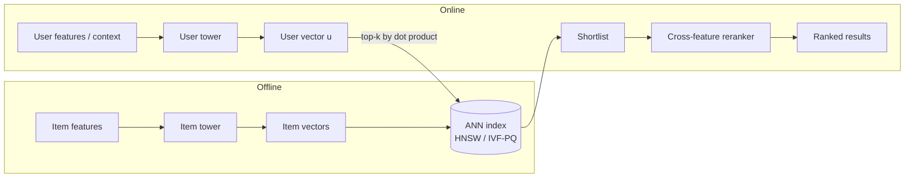

# Chapter 14: Embeddings and Representation Learning

Half the systems on a modern ML team need a vector for something: a user, an item, a query, a document, a node in a graph. Retrieval needs one, ranking consumes one, semantic search is nothing but one, deduplication and fraud detection lean on one. The lazy way to answer a representation-learning question is to treat "embedding" as a black box that falls out of some model, grab the vectors, and move on. That answer misses the whole point. An embedding is a *learned* representation, the entire training problem is one of contrast (pull related things together, push unrelated things apart), and the single most consequential design choice in the system is not the encoder size but how you pick the negatives.

This chapter builds the representation-learning stack from that observation up. We start from what an embedding actually is and why a learned vector beats a hand-built feature, then we make the training concrete: contrastive and metric losses, the in-batch negatives that come free with a minibatch, the popularity bias they bake in, and the logQ correction that undoes it. We work through the two-tower architecture that dominates entity-versus-entity relatedness, the graph encoders that fold in neighborhood structure, and the choices that decide whether the space is any good in production: dimensionality, cosine versus dot product, temperature, cold start, and the approximate-nearest-neighbor index every one of these vectors eventually feeds. The through-line to hold onto is that representation learning is not a modeling nicety, it is a serving primitive: you learn the space once and reuse it across retrieval, ranking, search, and fraud, which is half the economic case for learning it well.

The engineering signal an interviewer is listening for is that you know an embedding is defined by its negatives, that you can write the contrastive loss and explain what temperature and the logQ correction each do to it, that you understand why the two towers stay separate, and that you treat the ANN index, embedding freshness, and space drift as first-class parts of the system rather than an afterthought bolted onto a trained model.

In this chapter, we will cover the following main topics:

- What an embedding is, and why a learned representation beats one-hot IDs and hand-built features
- Contrastive and metric learning, and why representation quality comes from contrast
- Negative sampling: in-batch negatives, the logQ correction, and hard negatives
- The two-tower dual-encoder, and what tower separation buys and costs
- Graph embeddings, inductive versus transductive, and cold start via content features
- Choosing dimensionality, cosine versus dot product, and the temperature knob
- The approximate-nearest-neighbor index, freshness, and space drift on retrain
- Bottlenecks, failure modes, and how you actually evaluate an embedding

## Technical requirements

This chapter is conceptual and builds on the retrieval and ranking chapters, where the two-tower model first appeared as a serving pattern; here we look at it from the representation side, as a way to *learn* the vectors rather than a way to *use* them. Familiarity with softmax cross-entropy, dot products, and the sparse embedding tables from the previous chapter will help, but each is reintroduced where it matters. All formulas are written in LaTeX and render on GitHub.

Two reference architectures anchor the chapter, and you will get more from tracing them at real tensor shapes than from reading a paper diagram. Open each one live in the Neurarch editor and follow the join that defines the space:

- **Two-tower dual-encoder:** `https://www.neurarch.com/?import=https://raw.githubusercontent.com/neurarch-ai/awesome-llm-model-zoo/main/architectures/two-tower/model.json`
- **GraphSAGE-style recommender:** `https://www.neurarch.com/?import=https://raw.githubusercontent.com/neurarch-ai/awesome-llm-model-zoo/main/architectures/graph-sage-rec/model.json`

These are validated reference graphs at real dimensions, shape-checked end to end, not screenshots. Browse the rest in the [Model Zoo](https://github.com/neurarch-ai/awesome-llm-model-zoo) or the [gallery](https://neurarch-ai.github.io/awesome-llm-model-zoo).

## What an embedding actually is

Start by naming what a learned vector buys you over the alternatives, because the contrast is the motivation for everything that follows. An embedding is a dense vector that places an entity in a continuous space where geometric distance encodes relatedness. Set that against the two things it replaces. A one-hot ID vector is huge, sparse, and orthogonal: every item sits at the same distance from every other item, so the representation carries no notion of similarity at all. Hand-engineered features (category, price bucket, tags) capture only the axes a human thought to encode, and no more.

A learned embedding does three things none of those can. It discovers the axes that actually predict the behavior you trained on, rather than the axes a human guessed. It compresses millions of sparse IDs into a few hundred dense dimensions. And, most importantly for a systems interview, it makes "similar" a geometric fact you can query with nearest-neighbor search. That last property is the one that turns representation learning from a modeling detail into a serving primitive: once relatedness is distance, retrieval, deduplication, and clustering are all just geometry over the same vectors.

The whole reason this works is that you can get the supervision almost for free. You rarely have labels that say "these two entities are 0.7 similar." What you have is implicit signal: a user engaged with an item, two items were bought together, a query led to a click, two nodes share an edge. That co-occurrence defines what "related" means, and the training job is to shape a space in which related pairs land close together. The requirement that quietly dominates the whole design is that the space is only as good as the negatives you train it against. Positives come nearly free from logs; choosing what counts as *not* related is where the model is actually shaped. Name that early in an interview.

## Contrastive and metric learning

Because you have positives but no similarity labels, you train by contrast: pull the representations of a positive pair together, push everything else apart. Two loss families do this, and you should be able to name both.

**InfoNCE, the softmax contrastive loss**, is the workhorse. For an anchor, you treat its positive as the correct "class" among a candidate set (the positive plus a set of negatives) and minimize cross-entropy. Written out for one positive $v^+$ against a set of negatives $\{v^-_k\}$, with $u$ the anchor embedding and $\tau$ a temperature we will return to:

$$\mathcal{L}_{\text{InfoNCE}} = -\log \frac{\exp\big((u \cdot v^+)/\tau\big)}{\exp\big((u \cdot v^+)/\tau\big) + \sum_{k} \exp\big((u \cdot v^-_k)/\tau\big)}.$$

This is exactly the loss the two-tower retrieval model trains under, which is why the retrieval chapter and this one are two views of the same model: retrieval is what you *do* with the vectors, InfoNCE is how you *learn* them.

**Triplet or margin loss** is the other family: an anchor, a positive, and a negative, with the requirement that the anchor be closer to the positive than to the negative by a margin. It is conceptually clean but more sensitive to how you mine the triplets, because a triplet with a trivially easy negative contributes no gradient at all.

The throughline is the same whichever loss you pick: representation quality comes from contrast, and contrast is defined entirely by what you sample as the negative. If an interviewer pushes on "how do you make the embeddings actually good," the honest answer is almost always "better negatives," not "a bigger encoder."

## Negative sampling: the part that actually matters

This is the center of the topic, so spend time here. Three strategies compose rather than compete, and most production retrieval stacks blend all three.

**In-batch negatives.** Take a minibatch of $B$ positive pairs $(x_i, y_i)$; for each anchor $x_i$, use the other pairs' items $y_j$ ($j \neq i$) as negatives. The negatives come free because you already computed their embeddings in the forward pass, which makes this the cheap default and is one reason these models like big batches: a larger batch is a larger effective negative set, and more negatives usually means a better space. The per-anchor loss is a softmax over the batch:

$$\mathcal{L}_i = -\log \frac{\exp\big(s(x_i, y_i)\big)}{\sum_{j=1}^{B} \exp\big(s(x_i, y_j)\big)}, \qquad s(x, y) = \frac{u_x \cdot v_y}{\tau}.$$

**Sampling bias and the logQ correction.** In-batch negatives are drawn from the data distribution, so a popular item shows up as a negative far more often than a rare one, in proportion to how often it appears as a positive. The model learns to push those popular items down unfairly, which suppresses their scores and corrupts calibration. This popularity bias is baked directly into the loss. The standard fix is the **logQ correction** (equivalently, the sampled-softmax correction): subtract each item's log sampling probability from its logit, so the in-batch softmax estimates the true full-corpus softmax rather than a popularity-skewed one. The corrected logit is

$$s'(x, y) = s(x, y) - \log Q(y),$$

and the corrected in-batch loss becomes

$$\mathcal{L}_i = -\log \frac{\exp\big(s(x_i, y_i) - \log Q(y_i)\big)}{\sum_{j=1}^{B} \exp\big(s(x_i, y_j) - \log Q(y_j)\big)}.$$

It matters most exactly when $Q$ is skewed, which is the in-batch case where $Q$ tracks item popularity, and it matters least when negatives are drawn uniformly, where $\log Q(y)$ is constant and cancels. The catch is that a wrong or stale $Q$ (frequency estimates that ignore temporal drift) reintroduces or even inverts the bias, so many systems maintain a streaming count-min estimate of item frequency. Mentioning the logQ correction unprompted is a strong signal in an interview; it is the single most cited fix in production retrieval writeups. Skip it and popular items are systematically under-ranked; over-correct with a bad estimate and you promote tail junk.

**Hard negatives.** In-batch negatives are mostly trivially easy, because a random other item is obviously unrelated, so the loss saturates and the decision boundary stays fuzzy. Mining **hard negatives** (items close to the anchor in the current space but not actually engaged with) concentrates gradient near the boundary where the ANN will actually operate, and it is often where the real recall gains come from. A two-tower model can look excellent on random-negative metrics yet fail in production, where the ANN already returns only plausible candidates. The danger is **false negatives**: in implicit-feedback data an unobserved item is often just unobserved, not truly irrelevant, and mining the very hardest examples preferentially surfaces these mislabeled positives, teaching the model to push apart things that should be close. Too many hard negatives also destabilize training and can collapse the space. The usual recipe is mostly in-batch negatives with logQ correction, plus a modest, carefully capped fraction of semi-hard negatives, staying off the very top slice most likely to be false negatives.

*Table 14.1* lays out how the strategies trade off.

*Table 14.1: Negative-sampling strategies, what each buys, and what each costs.*

| Strategy | What it buys | What it costs |
| --- | --- | --- |
| In-batch negatives | Nearly free (reuses forward-pass embeddings), large negative set that scales with batch size | Popularity bias: items appear as negatives in proportion to their positive frequency |
| logQ-corrected | Debiases the in-batch softmax so gradients behave as if $Q$ were uniform, fixing head under-ranking | Needs an accurate, fresh estimate of $Q(y)$; a stale one reintroduces or inverts the bias |
| Hard negatives | Concentrates gradient at the decision boundary, sharpens the fine-grained relevance the ANN sees | Surfaces false negatives, destabilizes training, can collapse the space if over-mined |
| False-negative-filtered | Removes candidate negatives above a similarity threshold so genuine positives are not taught as negatives | The threshold is a hyperparameter: too aggressive discards informative negatives, too loose lets noise through |

## The two-tower dual-encoder

The dominant architecture for entity-versus-entity relatedness is the **dual-encoder**, or two-tower model: two separate encoders map the two sides (user and item, query and document) into one shared space, and the score is their dot product or cosine. The reason it wins at scale is that the score factorizes into one vector per side, so you can precompute the item side offline in bulk, load it into an ANN index, and at request time embed only the user once and do an approximate-nearest-neighbor lookup. That is what makes retrieval over hundreds of millions of items feasible in single-digit milliseconds.

The towers usually do not share weights, because the two sides carry different features; what they share is the *output space*, enforced by the contrastive loss. The tradeoff you give up is expressiveness. Because the item tower depends only on item features and the user tower only on user features, the two sides cannot interact until the final dot product, so a two-tower model cannot form early user-item feature crosses the way a full cross-feature model can. A cross model is more accurate per candidate but cannot precompute anything, because every item's score depends on the specific user, which limits it to scoring hundreds or low thousands of candidates. The standard resolution is a funnel: a cheap two-tower model for retrieval, an expensive cross-feature model for reranking the shortlist. *Figure 14.1* traces that split, offline item embedding on the left, online user embedding and ANN lookup on the right.

*Figure 14.1: The two-tower dual-encoder, item vectors precomputed offline into an ANN index, the user vector computed online and matched against it, then a cross-feature reranker on the shortlist.*

## Graph embeddings and cold start

When relatedness is naturally a graph (users-to-items, item-to-item co-purchase, social follows), the graph structure carries signal a flat encoder misses, and two patterns are worth naming.

**GraphSAGE-style, inductive.** Instead of learning a fixed vector per node, you learn *aggregation functions* that build a node's embedding from its own features plus a sample of its neighbors' features (and their neighbors', for more hops). Because the embedding is computed from features rather than looked up by ID, you can embed a node that did not exist at training time. That inductive property is exactly what makes cold start a non-event.

**LightGCN-style, transductive.** A simplified graph convolution for recommendation: drop the feature transforms and nonlinearities, keep only neighborhood aggregation over the user-item interaction graph, and use the smoothed embeddings directly. It is transductive (vectors only for nodes seen in training) but cheap and a strong collaborative-filtering baseline. It has no vector for a genuinely new node and needs a retrain or a fallback.

That distinction leads straight to the cold-start answer, which is structural rather than a patch. If the encoder consumes **content features** (text, category, image, attributes, graph neighbors) rather than only an ID, a brand-new entity with zero interaction history still maps to a sensible point in the space from its content alone. This is why inductive encoders (content-based dual-encoder towers, GraphSAGE-style aggregation) matter: a new item inherits a reasonable location from items with similar attributes. ID-only embeddings (classic matrix factorization, LightGCN on IDs) have no vector at all for an unseen entity, because a randomly initialized ID row carries no signal, and they need a content-based fallback until interactions accumulate. Most systems combine both: a metadata or content tower that places a cold entity immediately, blended toward the sharper learned ID embedding as data arrives, letting the ID term dominate once it exists.

## Dimensionality, similarity, and temperature

Three choices decide whether the space is usable in production, and each one is a tradeoff you should state rather than a number you should guess.

**Dimensionality** sets the representational capacity of each vector. Too few dimensions and distinct entities collapse onto each other (underfit); too many and rare IDs memorize noise while the table dominates memory and every ANN probe slows down. Returns diminish fast: doubling from 128 to 256 usually buys far less than the first jump from 32 to 64, and past some point offline recall flattens while serving cost keeps rising linearly. The practical rule is to size the dimension by cardinality and traffic. High-cardinality, high-traffic fields (user, item) justify wider vectors; low-cardinality categoricals (device type, country) do fine at 8 to 32. Some systems even use frequency-based mixed-dimension tables, wide vectors for head IDs and narrow ones for the tail, projected up to a common space. Tune the dimension against the downstream consumer and the p99 serving budget, not against offline recall alone, and if memory is the binding constraint reach for quantization before shrinking the dimension.

**Cosine versus dot product.** Both are used because they are cheap, factorize across the two towers, and are directly supported by ANN indexes. The difference is that a dot product $u \cdot v$ is sensitive to vector magnitude while cosine normalizes it away:

$$\cos(u, v) = \frac{u \cdot v}{\lVert u \rVert \, \lVert v \rVert}.$$

An unnormalized dot product can therefore encode popularity or confidence in the *norm*, letting frequently trained items grow larger vectors and win more retrievals. That is sometimes a useful built-in popularity prior and sometimes runaway head bias, so the choice is really about whether you want magnitude to carry signal. Cosine or $L_2$-normalized embeddings ($\lVert v \rVert = 1$) make similarity purely directional, which stabilizes training and makes a fixed ANN threshold meaningful across items.

**Temperature.** Normalization interacts directly with the temperature $\tau$ in the contrastive loss, because normalized vectors have a bounded dot product in $[-1, 1]$ that $\tau$ must rescale into a usable logit range. Temperature controls how sharply the model separates positives from negatives: a low $\tau$ makes the loss focus intensely on the hardest negatives (large gradients for near-misses), while a high $\tau$ softens the distribution and treats all negatives more uniformly. Too low and training becomes unstable and over-penalizes semi-hard negatives that may be false negatives, fracturing the space; too high and the model never sharpens, producing mushy embeddings that retrieve poorly. It also interacts with batch size, since larger negative sets tolerate lower temperatures. Set it by sweeping on a validation retrieval metric, often landing in the $0.01$ to $0.1$ range for $L_2$-normalized embeddings. Some methods learn $\tau$, but a poorly bounded learned temperature can drift, so many teams clamp it.

A related trick worth knowing is **Matryoshka representation learning**, which trains one embedding so that its leading prefixes (say the first 32, 64, 128 dimensions) are each independently useful, by summing the loss over several truncation lengths. That gives one vector you can shorten at serving time to trade accuracy for speed without retraining, which enables a cheap first-pass ANN on a short prefix followed by a full-length rerank. It is worth it when you serve a wide latency-quality range, and less compelling when you only ever serve one fixed dimension.

## The index the embeddings feed

Embeddings exist to be queried, and at catalog scale that means an **approximate nearest neighbor** (ANN) index, not exact search. The index never returns the true top-k; it returns a high-recall approximation, and how high is a knob traded directly against latency and memory. Two families dominate:

- **HNSW** (graph-based): excellent recall and latency at higher memory cost, the default when the index fits in RAM and recall matters. You move it along the recall-latency curve with the search-time beam width (efSearch) and build-time connectivity (M, efConstruction).
- **IVF-PQ** (inverted file plus product quantization): clusters vectors and compresses each into a short code, cutting memory by an order of magnitude with some recall loss, the pragmatic choice at very large scale or tight memory. You trade the number of probed lists (nprobe) against speed.

The subtle point to state is that ANN recall against the exact-dot-product neighbors is *not* the same as business recall against true relevance, so chasing ANN recall past a point buys nothing the ranker will notice. Set the operating point by sweeping efSearch or nprobe against end-to-end quality under the p99 latency budget, then stop where the metric curve flattens.

## Freshness, drift, and a stable space

Two clocks run here, and confusing them is a classic mistake.

**Embedding freshness** is the first clock: a new entity is invisible until the encoder embeds it and the index is updated. An inductive encoder (content features, GraphSAGE-style) can embed a brand-new entity immediately from its features; an ID-only embedding cannot and must wait for a retrain. That cadence of re-embedding and upserting is your freshness budget.

**Space drift** is the second clock, and it is the one people miss. When you retrain the encoder, the *axes of the space move*. A vector from the new model is not comparable to one from the old model, so you cannot upsert new vectors into an index full of old ones; you reindex the whole set against the new encoder, and you must swap the query tower atomically with the item index, or the two live in incompatible coordinate systems and retrieval quality craters even though nothing errors. That coupling is the real cost of a retrain at hundreds of millions of items. Mitigations include versioning the index and query tower together and cutting over atomically, warm-starting from the previous checkpoint so vectors move less, and separating a slowly rebuilt base index from an incrementally updated fresh-item index to get freshness without a full rebuild each time. Independently of retraining, the world itself drifts: behavior shifts, the frozen space slowly stops matching reality, and quality decays. Detecting that decay belongs to monitoring and drift; the standard guard is to watch downstream metrics and retrain on a cadence, then full-reindex.

## Bottlenecks and scaling

*Table 14.2* collects the pressure points, how each first shows up, the fix, and what it costs.

*Table 14.2: Bottlenecks, first symptoms, fixes, and tradeoffs.*

| Bottleneck | First sign | Fix | Tradeoff |
| --- | --- | --- | --- |
| Weak negatives | Recall plateaus, easy loss saturates | Add mined hard negatives | Training instability, false negatives |
| Popularity bias | Head entities mis-ranked as negatives | logQ / sampled-softmax correction | Tuning effort, fresh $Q$ estimate |
| Index memory at scale | Index does not fit in RAM | IVF-PQ, lower dimension, quantize | Recall loss |
| ANN search latency | p99 retrieval creeps up | Tune probe depth, shard, replicate | Recall versus latency |
| Embedding staleness | New entities never surface | Inductive encoder plus frequent re-embed | Write-path complexity |
| Space drift on retrain | Old and new vectors incomparable | Atomic full reindex per model version | Reindex cost, coordination |
| Big-batch training cost | In-batch negatives need large $B$ | More accelerators, gradient accumulation | Compute cost |

## Failure modes and evaluation

A handful of pathologies recur, and knowing their symptoms is the difference between a senior and a junior answer.

- **False negatives in sampling:** an unlabeled positive sampled as a hard negative actively teaches the model the wrong thing, and the damage concentrates exactly where hard mining operates, because the items most similar to a positive are the ones most likely to be genuine unshown positives. The tell is hard mining that lifts offline separation but hurts online engagement. Cap the hardness, filter near-duplicates of the positive, and dilute with logQ-corrected in-batch negatives.
- **Representation collapse:** with a weak loss or too-easy negatives, the encoder maps everything into a narrow region, so all similarities look high and ranking is meaningless. Watch the spread of embedding norms and pairwise similarities.
- **Popularity collapse:** without bias correction the space over-indexes on head entities and the long tail becomes unreachable. logQ correction and tail-aware evaluation guard against it.
- **Silent space drift:** a frozen encoder slowly mismatches a shifting world, or a half-finished reindex mixes two model versions; both degrade quietly.

On evaluation, the key discipline is that there is no single accuracy number for an embedding. You measure it by what it powers: **recall@k** of the retrieval it feeds against held-out future positives, plus ranking metrics (NDCG, MRR) on a relatedness probe set, with **tail recall reported separately from head** so popularity bias cannot hide inside an average. Then confirm end to end with an online A/B test, because a space that looks better on an offline probe does not always lift the product, and offline recall was measured on data the old system generated.

## Likely follow-ups

- **"Why not just use one-hot IDs or hand features?"** One-hot is sparse and carries no similarity, since every entity is equidistant; hand features capture only the axes a human picked. Learned embeddings discover predictive axes and make similarity a queryable geometric fact.
- **"How do you train without labels?"** Contrastively: positives come from co-occurrence or interaction logs, and you contrast each against sampled negatives. The labels are implicit in behavior.
- **"Where do negatives come from?"** In-batch for free, plus mined hard negatives for sharpness, with the logQ correction to undo the popularity bias of in-batch sampling.
- **"How do you pick the dimension?"** Trade recall against index memory and search latency, pick modest, tune against the consumer, and reach for quantization before chasing dimension if memory binds.
- **"What happens to old vectors when you retrain?"** The space moves, so vectors across model versions are not comparable; you full-reindex atomically rather than upserting new vectors into an old index.
- **"How do you embed something brand new?"** Use an inductive encoder that consumes content features or graph neighbors, so a new entity gets a sensible vector with zero interaction history.
- **"HNSW or IVF-PQ?"** HNSW for recall and latency when it fits in RAM; IVF-PQ when memory is the binding constraint, accepting some recall loss.

## Trace the architectures

Representation learning is structural: the whole game is *where and how* the two sides (or a node and its neighbors) meet, because that join is what defines the space and what you can precompute. Reading the real graphs beats reading a paper diagram, because you follow real tensor shapes through every block and see exactly where the join sits.

**Two-tower dual-encoder.** This is contrastive representation learning made concrete: two encoders map each side into a shared embedding space, and relatedness is the dot product at the very end. Follow each tower down to the similarity layer and note that the features never mix before it, which is exactly what lets you precompute one side and serve the other against an ANN index.

`https://www.neurarch.com/?import=https://raw.githubusercontent.com/neurarch-ai/awesome-llm-model-zoo/main/architectures/two-tower/model.json`

*Figure 14.2: Two-tower dual-encoder.*

**GraphSAGE-style recommender.** This is inductive graph representation learning: a node's embedding is built by aggregating its own features with a sample of its neighbors' features, so the model learns aggregation functions rather than a fixed vector per ID. Trace the neighbor aggregation and notice that, because the embedding is computed from features, a brand-new node gets a vector with no retrain, which is the inductive property that makes cold start a non-event.

`https://www.neurarch.com/?import=https://raw.githubusercontent.com/neurarch-ai/awesome-llm-model-zoo/main/architectures/graph-sage-rec/model.json`

*Figure 14.3: GraphSAGE-style recommender.*

A good exercise before an interview: open both and notice how each defines "related." The dual-encoder defines it by a final dot product between two towers; the graph encoder defines it by neighborhood aggregation. Where that join sits is the whole reason one is a flat contrastive model and the other is a graph model. Browse all of them in the [Model Zoo](https://github.com/neurarch-ai/awesome-llm-model-zoo) or the [gallery](https://neurarch-ai.github.io/awesome-llm-model-zoo). Built by [Neurarch](https://www.neurarch.com).

## Summary

An embedding is a learned representation, and the entire training problem is one of contrast: pull related things together, push unrelated things apart, where "related" comes almost free from co-occurrence logs and "not related" is the negative you have to choose deliberately. That choice is the center of the topic. We saw why a learned vector beats one-hot IDs and hand features (it discovers predictive axes and makes similarity queryable geometry), how InfoNCE and triplet losses train on contrast, and how the negatives shape everything: in-batch negatives come free but bake in popularity bias that the logQ correction undoes, while hard negatives sharpen the boundary at the risk of teaching the model on false negatives. We traced the two-tower dual-encoder and saw that tower separation is what lets you precompute one side into an ANN index, at the cost of early feature crosses, and we contrasted it with inductive graph encoders that make cold start a non-event by embedding from content features. We worked through the choices that decide whether the space survives production: dimensionality against memory and latency, cosine versus dot product and the temperature that rescales it, the HNSW or IVF-PQ index on its recall-latency curve, and the two clocks of freshness and space drift that force an atomic full reindex on every retrain. The economic payoff runs through all of it: learn the space once, and retrieval, ranking, search, and fraud all reuse the same vectors.

That reuse only holds if the features feeding the encoder mean the same thing offline and online, which is exactly the seam the next chapter, **Feature Stores and Training-Serving Skew**, takes apart.

## Questions

1. Why does a one-hot ID vector carry no notion of similarity, and what two things does a learned embedding do that a hand-engineered feature cannot?
2. Write the InfoNCE loss for one anchor against one positive and a set of negatives. What role does the temperature $\tau$ play in it?
3. What is the popularity bias introduced by in-batch negatives, and how does the logQ correction remove it? Write the corrected logit.
4. Why do hard negatives improve a retrieval model that already looks good on random-negative metrics, and how can they hurt?
5. What is a false negative in implicit-feedback training, why does hard-negative mining surface them preferentially, and what defends against it?
6. Why do the two towers in a dual-encoder stay separate, what does that separation buy at serving time, and what expressiveness do you give up?
7. Contrast an inductive GraphSAGE-style encoder with a transductive LightGCN-style one. Which makes cold start a non-event, and why?
8. When would you choose cosine similarity over an unnormalized dot product, and how does that choice interact with the loss temperature?
9. What is space drift, why does it forbid upserting new vectors into an old index, and what is the correct rollout procedure on a retrain?
10. Why is there no single accuracy number for an embedding, and what would you actually report to evaluate one, including how you keep popularity bias from hiding?

## Further reading

Each of the following is a first-party paper or engineering writeup that ships the patterns in this chapter. Read them for what an interview answer skips: how positives and negatives are mined in practice, how graph structure is folded in, and how the learned vectors are routed into an index.

- [GraphSAGE: Inductive Representation Learning on Large Graphs (Hamilton et al., Stanford)](https://arxiv.org/abs/1706.02216): inductive node embeddings by aggregating neighbor features, the reference for cold-start-friendly graph encoders.
- [LightGCN (He et al.)](https://arxiv.org/abs/2002.02126): a simplified graph convolution that keeps only neighborhood aggregation, a strong transductive recommendation baseline.
- [SimCSE: Simple Contrastive Learning of Sentence Embeddings (Gao et al.)](https://arxiv.org/abs/2104.08821): contrastive sentence representation learning driven purely by in-batch negatives.
- [PinSage (Pinterest)](https://medium.com/pinterest-engineering/pinsage-a-new-graph-convolutional-neural-network-for-web-scale-recommender-systems-88795a107f48): inductive graph embeddings at billions of nodes, routed into a nearest-neighbor index for recommendation.
- [Listing Embeddings in Search Ranking (Airbnb)](https://medium.com/airbnb-engineering/listing-embeddings-for-similar-listing-recommendations-and-real-time-personalization-in-search-601172f7603e): listing embeddings learned from booking sessions with skip-gram negative sampling, then reused for similarity and personalization.
- [Introducing Natural Language Search for Podcast Episodes (Spotify)](https://engineering.atspotify.com/2022/03/introducing-natural-language-search-for-podcast-episodes/): dense two-tower query and episode embeddings served through an ANN index for semantic search.
- [How Instacart uses embeddings to improve search relevance (Instacart)](https://company.instacart.com/how-its-made/how-instacart-uses-embeddings-to-improve-search-relevance): a two-tower transformer projecting queries and products into one scored space over a FAISS index.
- [Melange: a customer-journey embedding system (Wayfair)](https://www.aboutwayfair.com/careers/tech-blog/introducing-melange-a-customer-journey-embedding-system-for-improving-fraud-and-scam-detection): self-supervised embeddings learned from browsing sessions, reused for fraud and scam detection.
- [Evidently AI ML system design database](https://www.evidentlyai.com/ml-system-design): the broadest curated index, 800 case studies from 150-plus companies; filter for embeddings and representation learning.
