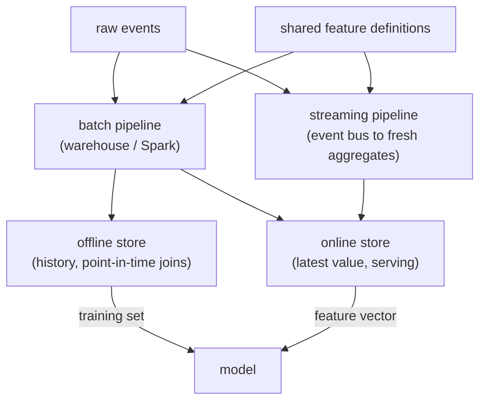
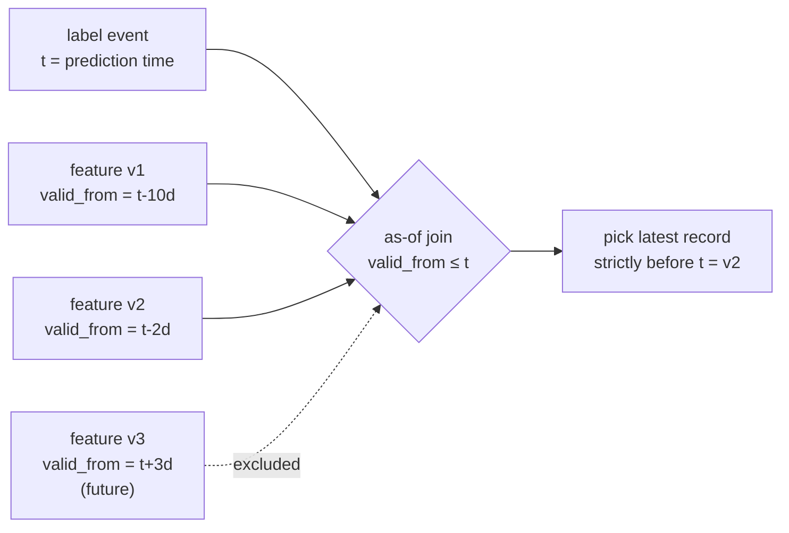

# Chapter 15: Feature Stores and Training-Serving Skew

The naive way to answer this question is "we build a feature pipeline and a serving service, and we're done." That answer ships the single most common silent failure in production machine learning. A dozen models all need the same signals (a user's 30-day purchase count, item popularity, clicks in this session), every team recomputes them, and the models that looked excellent offline quietly degrade on live traffic. Nothing errors. The notebook metrics are beautiful. Production flops. The gap has a name, training-serving skew, and the discipline that closes it has a name too: treat a feature as a shared, versioned, point-in-time-correct asset, not as glue code each model rewrites.

This chapter works through a single motivating brief. Your platform team owns the features that feed recommendation and ranking across the company. Product wants one thing that sounds simple and is not: define a feature once and have it available both offline for training and online for serving, at low latency, without the two values ever drifting apart. Batch aggregates refreshed daily, real-time session signals fresh in seconds, labels that arrive hours or days after the features, and a growing catalog of teams who all want to reuse each other's work instead of rebuilding it. We will use that brief to expose what an interviewer is actually probing for: whether you can name the specific way each kind of skew and leakage sneaks in, whether you can reconstruct a feature as of a past timestamp, and whether you understand why the same signal has to be computed exactly once and consumed twice.

In this chapter, we will cover:

- Scoping a feature platform and naming online/offline consistency as the requirement that dominates
- The dual-store architecture: one definition feeding an offline store and an online store
- The three ways training-serving skew happens, and the shared-definition fix for each
- Point-in-time correctness and the as-of join, the subtlety interviewers love
- A leakage taxonomy: target, temporal, cross-validation, group, and target-encoding leaks with their specific guards
- Batch versus streaming features, backfills, reuse, and governance
- Monitoring the two failures a feature store creates: silent staleness and drift
- Tracing the ranking model your features feed, at real tensor shapes

By the end, you will be able to walk an interviewer from "a dozen models need the same features" to a costed, consistent, leak-free platform, and defend every guard along the way.

## Technical requirements

You need a modern web browser to open the validated reference graphs used as figures in this chapter. Each is a shape-checked architecture from the Neurarch model zoo that opens live in the editor at real dimensions:

- [dlrm](https://www.neurarch.com/?import=https://raw.githubusercontent.com/neurarch-ai/awesome-llm-model-zoo/main/architectures/dlrm/model.json)

The full collection lives in the [model zoo](https://github.com/neurarch-ai/awesome-llm-model-zoo).

## Clarify and scope before you draw anything

The strongest opening move is to refuse to treat "a feature platform" as one undifferentiated thing. Batch aggregates and real-time signals live on completely different infrastructure, and the value of the whole exercise depends on how many teams reuse it. The questions worth asking:

- **What features, and how fresh?** A user's 30-day purchase count refreshed daily and a count of clicks in this session fresh in seconds have opposite infrastructure. Ask which you need, because the answer decides whether you even need a streaming pipeline.
- **Who consumes them?** One model or many teams? The economic case for a feature store is reuse, so its value grows with the number of consumers. For a single model with a handful of features and no reuse, it can be overkill.
- **What is the online latency budget?** Feature fetch sits on the critical path of the ranking request, so it gets a few milliseconds. That forces the online store to be a low-latency lookup, not a computation.
- **What is the scale?** Number of entities (users, items), number of features, write rate, and read QPS. This sizes the online and offline stores independently, because they have opposite access patterns.
- **What are the point-in-time needs?** If labels arrive later than features, which is almost always, training must reconstruct each feature value as of the event time, not as of now. If you skip this question you will build a backtest that is fiction.

For the rest of the chapter we scope to a platform serving many models, with both daily batch aggregates and second-fresh streaming features, labels that arrive after the fact, and a hard online latency budget.

## Requirements and the one that dominates

**Functional requirements.** Define a feature once and make it available both offline (for training) and online (for serving). Serve feature vectors for an entity at low latency online. Generate point-in-time-correct training datasets by joining features to labels at the right timestamp. Support both batch and streaming features. Let multiple models reuse the same feature definitions.

**Non-functional requirements.** Online read p99 in single-digit milliseconds, because it is on the ranking path. Online and offline values that are provably consistent, with no skew. Freshness targets met per feature (daily for batch, seconds for streaming). Reproducibility, so a training set pins the feature definitions and data versions it was built from. Governance, so features are discoverable, owned, and documented rather than a swamp of duplicates.

Name the requirement that dominates first, because it is the whole point: **online/offline consistency**. Everything else is plumbing in service of it. The feature a model trains on must equal the feature it serves on, or the learned mapping is being applied to inputs it never saw. Saying "a feature store exists primarily to kill training-serving skew" frames the entire answer correctly.

## The dual-store architecture

The defining idea is a single feature definition that drives two stores, one optimized for training and one for serving. The two stores hold the same feature, computed by the same logic, which is exactly why the values match.

- **Offline store.** A data warehouse or lake (columnar, cheap, high-throughput scans) holding the full timestamped history. It is optimized for the big point-in-time joins that build training sets. Latency does not matter here, completeness does.
- **Online store.** A low-latency key-value store (Redis, Cassandra, DynamoDB) holding the latest (or recent-window) feature value per entity. It is optimized for "give me this user's features in 2 ms." A materialization job pushes computed features from the pipelines into it.

The two are different technologies for opposite access patterns, fed from the same definitions. That asymmetry mirrors the offline/online split in the rest of the recommendation stack. The following diagram is the skeleton every real system converges on: raw events flow through a batch pipeline and a streaming pipeline, both driven by one set of shared definitions, writing into an offline store that keeps timestamped history for point-in-time joins and an online store that keeps the latest value per entity for low-latency serving. Because both sides derive from the same definitions, the feature a model trains on matches the feature it serves.

*Figure 15.1: One shared definition feeds an offline store for training and an online store for serving*

## The three ways skew happens

Skew is when the feature a model trains on differs from the feature it serves on, so the model meets a distribution at serving time it never saw in training. Quality silently drops. Naming the three mechanisms is the signal that separates people who have built training pipelines from people who have only read about them:

- **Code skew.** The feature is computed by one code path offline (a SQL query in the training pipeline) and a different code path online (handwritten service code). They agree today and drift the moment one is edited, or they disagree from the start on edge cases: null handling, rounding, units, an empty-set default. The fix is a shared definition that generates both, so there is only one computation to drift.
- **Time skew.** The feature is computed with data that was not available at prediction time, so training sees a value that leaks the future. This is the point-in-time problem, and it is the subject of the next two sections.
- **Data skew.** The online source and the offline source diverge through different freshness, different filtering, or late-arriving events. Training uses fully-settled data while serving hits partial real-time data, and a value that is reliably present at train time is often null or stale online. The store has to make the online materialization and the offline backfill agree.

A second common cause hides inside code skew: aggregation-window mismatches. A "7-day count" that means seven calendar days offline but a rolling 168 hours online is two different features wearing one name. Centralizing windowing semantics in the definition is how a feature store kills this class of bug.

## How the shared definition eliminates skew

The core idea is one definition of a feature, authored once and executed for both training and serving, so there is no second implementation to drift. A feature store pairs the offline store (for point-in-time-correct training data) with the online store (for low-latency serving), both populated from the same transformation logic, guaranteeing parity by construction. It also centralizes freshness and windowing semantics, so a "7-day sum" means the same thing in both worlds.

You do not strictly need a heavyweight platform to get this. A shared library that both pipelines import, plus contract tests that assert offline and online produce identical values on sampled keys, achieves the same parity. The anti-pattern to kill is any feature logic that exists in two places. When you retrain nightly and cross-validation looks great but the model regresses in production within hours, the pattern points at skew or a temporal leak rather than genuine overfitting (true overfitting degrades gradually as the world drifts, not within hours of every deploy). Confirm it by replaying yesterday's logged serving-time feature vectors through the model and comparing the predictions to what production actually emitted. A divergence localizes the skew to a specific feature or window definition. The durable fix is the single shared definition plus the contract tests.

## Point-in-time correctness and the as-of join

This is the subtle one, and interviewers love it. When you build a training row, you join a label (did the user click at time $T$) to features. You must use the feature values as they were just before $T$, not their current values. If you join "this user's lifetime purchase count" computed today onto an event from six months ago, you have leaked the future: the model learns from information it will never have at serving time, offline metrics look amazing, and production flops.

A correct feature store does a point-in-time (as-of) join: for each labeled event, fetch the feature value valid at that event's timestamp. The failure mode has a name, the "as-of-now" join, where you join today's snapshot of a customer table onto a historical event and import state that did not exist back then. Enforcing correctness requires event-time versioned data (append-only logs, or slowly-changing dimensions with valid-from/valid-to ranges) and a join that picks the latest record strictly before the prediction time. Formally, for a label event at time $T$ and feature records with validity timestamps $\text{valid\_from}$, the as-of join selects

$$\hat f(T) = f\big(\arg\max_{\,i \,:\, \text{valid\_from}_i \,\le\, T} \text{valid\_from}_i\big),$$

the newest feature record that already existed at prediction time. The diagram below walks one label event back to that record and shows why a record that became valid only after $T$ is excluded even though it sits in today's table.

*Figure 15.2: An as-of join picks the newest feature record valid before the label timestamp, never the current snapshot*

The v3 record, though it exists in today's table, is excluded because it became valid only after the prediction point. Picking it is exactly the as-of-now leak. This requires the offline store to keep feature history with timestamps, not just the latest value, which is precisely why the offline and online stores are different technologies. Mention point-in-time correctness unprompted; without it, your backtest is fiction.

## A leakage taxonomy every feature engineer should memorize

Point-in-time skew is one member of a broader family. Target leakage is when a feature carries information that would not be available at prediction time, usually because it is derived from the outcome itself or from an event after the prediction point. It is more dangerous than a plain bug because it does not crash: it silently inflates offline metrics and passes code review, so it survives all the way to production before failing. The sneaky sources are the ones that are easy to miss in a feature table: a `num_support_calls` column populated after a customer already churned, an `account_closed_date` that only exists for defaulters, a 30-day average whose window spans days after the prediction date, an ID assigned by a process correlated with the outcome (sequential case numbers issued only to fraud cases), or a nightly-overwritten dimension table joined "as of now" that pulls in the current post-outcome state of an entity.

Every leak shares one signature, information from the future or from the label crossing into training, but each has a distinct source and a distinct guard. Interviewers probe whether you can name the specific fix, not just say "avoid leakage":

| Leakage type | Where the signal sneaks in | The guard |
| --- | --- | --- |
| Target / post-outcome | Feature derived from the label, or from an event after the prediction point (`account_closed_date`, post-churn support calls) | Fix a prediction timestamp; keep only values knowable strictly before it |
| Temporal | Random split lets training peek at future rows sharing entity state or drift | Time-based split (train before $T$, validate after $T$); split by entity too if entities recur |
| CV / preprocessing | Stateful transform (scaler, imputer, target encoder, selector) fit on all rows before splitting | Fit every stateful transform on the training fold only; use a pipeline inside cross-validation |
| Group | Same entity (user, patient, device) in both train and validation | Grouped splitting so each entity lands wholly on one side |
| Target encoding | A row's own label feeds the category mean used to encode it | Out-of-fold encoding plus smoothing toward the global mean; fit inside the cross-validation loop |

Two of these deserve their formulas because interviewers pull on them.

### Time-based splits over random splits

Random splits assume rows are exchangeable, but most production models predict the future from the past, so a random split lets the model peek at future rows that share state with training rows. This leaks through slowly-drifting features, entity-level state, and aggregates, producing an optimistic estimate that will not hold on real future data. A time-based split (train on before $T$, validate after $T$) mirrors deployment and exposes both the leakage and the drift that random splits hide. Random splitting is only safe when rows are truly independent with no temporal generative process, which is rare in operational settings. When in doubt, split by time and, if entities recur, also by entity.

### Out-of-fold target encoding

Target encoding replaces a category with the mean of the label for that category, which is powerful for high-cardinality columns and leaks catastrophically if done naively. If you compute that mean using a row's own label, the feature literally contains the answer. Even computed over the whole training set it leaks, because each row contributes to the statistic used to encode it, biasing the model toward memorizing the training targets. The fix is out-of-fold encoding: split the data and encode each fold using target means computed only from the other folds, so a row's own label never touches its encoding. You also smooth toward the global mean for rare categories, blending the category mean $\bar y_c$ over its $n$ rows with the global mean $\bar y$ through a prior weight $m$:

$$\hat y_c = \frac{n\,\bar y_c + m\,\bar y}{n + m}.$$

A category with few rows ($n \ll m$) is pulled toward $\bar y$, and only well-supported categories trust their own mean. Fit the encoding inside the cross-validation loop, not once beforehand, and at serving time apply the encoding learned from training data only. This is the feature-store discipline in miniature: the encoding is a fitted transform, authored once, applied identically offline and online.

The same "fit on the training fold only" rule covers the rest of the pipeline. Fitting a scaler, an imputer, or a feature selector on all rows before splitting lets validation-fold statistics contaminate training and inflates the cross-validation score. Imputation leaks the same way, and worse: missingness is often informative (a blank income field may signal an applicant who declined to state it), so the robust pattern is an explicit `is_missing` indicator alongside a filled value, with the fill statistic computed on the training fold only and, in time-series, only from past-available data.

## How you actually catch leakage before shipping

None of these checks is conclusive alone, so treat a suspiciously strong signal as guilty until its timing is verified:

- **Metric too good to be true.** Near-perfect AUC on a problem known to be hard is a leak until proven otherwise.
- **Feature-importance sanity.** If one feature dominates and it is something you would not expect to be that predictive, inspect its lineage and refresh cadence. A nightly-overwritten dimension can encode post-outcome state even when the column name looks innocent.
- **Temporal holdout.** Train on the past, score a strictly future window, and watch whether the gain evaporates. Most leaks depend on future information that a temporal split removes.
- **Drop-the-feature check.** Remove the suspect feature and see whether performance falls back to a plausible level.

To audit a specific high-performing feature, reconstruct the exact moment its value becomes available in production and confirm it precedes the prediction timestamp for every row, not just on average. If you cannot prove it was knowable before the prediction point, drop it, because an unexplained strong feature is a liability, not a win.

## Batch versus streaming, and the backfill trap

- **Batch features** (daily aggregates) run on a schedule over the warehouse. They are simple and cheap but stale by up to a day.
- **Streaming features** (counts in the last few minutes, current session activity) are computed by a streaming pipeline from an event bus and pushed to the online store within seconds. They power real-time personalization but add real operational complexity. The hard part is making the streaming materialization and the offline backfill compute the same aggregate, or you reintroduce data skew.

Match the freshness need to the mechanism: daily aggregates batch, session and real-time signals stream, and make both compute the identical aggregate.

**Backfills** are where new features quietly go wrong. When you add a feature you need its historical values to train on, not just from today forward, so a backfill recomputes it over historical data and writes it into the offline store with correct timestamps. Backfills are expensive and easy to get subtly wrong: recomputing with today's logic but stamping it as historical reintroduces time skew. A new feature is not usable for training until it is correctly backfilled.

## Reuse and governance

The economic case for a feature store is reuse: one team builds "user 7-day category affinity," and every other team consumes it instead of rebuilding it. That only works if features are discoverable (a catalog), owned (someone maintains each), documented, and versioned. Without governance a feature store becomes a swamp of duplicated, undocumented, subtly different features, which is its own kind of skew. This is why platforms like Uber Michelangelo attach owner, description, and SLA metadata to each of roughly ten thousand shared features, and why Feast ships a registry with a Python SDK, CLI, and web UI. Governance is not bureaucracy here, it is skew prevention at the organizational layer.

## Bottlenecks and scaling

| Bottleneck | First sign | Fix | Tradeoff |
| --- | --- | --- | --- |
| Online read latency | Feature fetch eats the ranking budget | Low-latency KV store, batch reads per request | Cost, freshness |
| Online store cost/size | Storing every feature for every entity | Cap to served entities, TTLs, tiering | Coverage |
| Point-in-time join cost | Training-set builds take hours | Pre-materialize, partition by time, incremental | Pipeline complexity |
| Streaming materialization | Real-time features lag | Tune the streaming pipeline, accept bounded staleness | Operational load |
| Backfill expense | New features slow to land | Incremental backfills, sample for iteration | Engineering time |
| Feature sprawl | Duplicated, undocumented features | Catalog, ownership, deprecation policy | Governance overhead |

The recurring theme is that the online store optimizes for latency and the offline store for completeness, and every scaling lever trades one axis against another (freshness against cost, precomputation against pipeline complexity). State the axis you are trading before you pick a knob.

## Failure modes, safety, and eval

A feature store has no single accuracy number. You validate it by parity and freshness, and by the absence of the offline-good-online-bad gap in the models it feeds:

- **Training-serving skew** is the headline failure this whole topic prevents. Detect it by logging the actual features served at request time and comparing them against what the training pipeline would produce for the same event. A persistent mismatch is the alarm, and the served-vs-computed feature match rate is your live parity metric.
- **Time leakage** from point-in-time joins done wrong. Audit by checking that no feature in a training row depends on data after the label's timestamp.
- **Silent staleness.** A broken materialization job freezes a feature, and the model keeps serving on stale values and slowly degrades. Monitor feature freshness as a first-class signal, which is the bridge to model monitoring.
- **Drift**, which monitoring must distinguish. Data drift is a change in the input distribution $P(X)$ while the input-to-target mapping holds, and you can detect it without labels by tracking a population stability index against a training baseline. PSI compares the training and live share of each of $k$ bins,

$$\mathrm{PSI} = \sum_{i=1}^{k} (p_i - q_i)\,\ln\frac{p_i}{q_i},$$

where $p_i$ and $q_i$ are the training and live fractions in bin $i$. The common rule of thumb is that $\mathrm{PSI} < 0.1$ is stable, $0.1$ to $0.25$ is moderate shift, and $> 0.25$ is a serious move worth alerting on. Concept drift, a change in $P(y \mid X)$, needs labels or a proxy and shows up as degrading calibration or rolling AUC even when inputs look stable. The two call for different fixes (reweight or retrain on fresh inputs for data drift, relabel and update the model for concept drift), which is why you monitor both.

One more trap sits underneath all of this: feedback loops. When the model's own predictions influence the actions that generate future labels (a fraud model that blocks flagged transactions never learns whether they were truly fraudulent, a recommender collects clicks only for what it already promoted), the training data reflects the model rather than the world, and the feature store faithfully preserves that bias. Guard it with a small randomized exploration holdout and by logging the propensity so you can reweight later.

## Trace the architecture your features feed

A feature store is infrastructure, not a model, so there is no neural graph for the store itself. What it feeds is a model, and the features land in the embedding tables and dense inputs of a ranking model, which is where most of the parameters and most of the leakage risk live. Reading the graph beats reading a paper diagram, because you can follow real tensor shapes through every block and see exactly where each feature enters. The figure below is a validated reference graph at real dimensions, shape-checked end to end, not a screenshot.

**DLRM (deep learning recommendation model).** Trace the sparse categorical features into the embedding tables and the dense features into the bottom MLP, then the feature interaction and the top MLP that produces the score. Every one of those inputs is a feature the store has to serve online exactly as it was computed offline. That is the contract this whole chapter is about: the embedding lookup for "user 7-day category affinity" has to hit the same value at 2 ms online that the point-in-time join reconstructed for training.

`https://www.neurarch.com/?import=https://raw.githubusercontent.com/neurarch-ai/awesome-llm-model-zoo/main/architectures/dlrm/model.json`

*Figure 15.3: DLRM, the ranking model whose embedding and dense inputs are the features the store must serve consistently*

Browse the rest in the [Model Zoo](https://github.com/neurarch-ai/awesome-llm-model-zoo) or the [gallery](https://neurarch-ai.github.io/awesome-llm-model-zoo). Built by [Neurarch](https://www.neurarch.com).

## Further reading
Every system here converges on the same skeleton: raw events flow through feature pipelines (batch on a warehouse, streaming off an event bus) that write into two stores from one set of feature definitions. The offline store keeps timestamped history for point-in-time joins that build training sets, and the online store keeps the latest value per entity for low-latency serving. Because both sides derive from the same definitions, the feature a model trains on matches the feature it serves, which is exactly how skew is avoided. Read these first-party writeups for what an interview answer skips: the online/offline split in practice, point-in-time joins, and how teams keep features consistent across training and serving.

| System | Online store technology | Streaming vs batch | Point-in-time correctness | Ownership / self-serve |
| --- | --- | --- | --- | --- |
| Uber Michelangelo | Cassandra (P95 under 10 ms) | Both: batch precompute from HDFS plus Kafka/Samza near-real-time aggregates | Same data and batch pipeline for training and serving; streaming logged back to HDFS with backfill | ~10,000 shared features, owner/description/SLA metadata, cross-team reuse |
| Feast | Pluggable: Redis, DynamoDB, Bigtable, Cassandra, Postgres, and more | Both: scheduled materialization plus push-based streaming ingestion | As-of joins produce point-in-time-correct sets so future values do not leak | Python SDK, CLI, web UI registry; DataHub/Amundsen governance |
| Google Rules of ML | Not a store; guidance for serving systems | Emphasizes logging serving-time features to reuse for training | Test on data gathered after training data ends; watch external tables changing between train and serve | Discipline: reuse code between training and serving |

- **Uber**, [Meet Michelangelo](https://www.uber.com/blog/michelangelo-machine-learning-platform/): popularized the Palette feature store and the online/offline materialization split. *(platform)*
- **LinkedIn**, [Feathr feature store](https://github.com/feathr-ai/feathr): one feature definition serving both online and offline at scale. *(platform)*
- **Feast**, [open-source feature store](https://github.com/feast-dev/feast): a clean reference design for the dual store and point-in-time-correct joins. *(reference design)*
- **Tecton**, [engineering blog](https://www.tecton.ai/blog/): from the team behind Michelangelo, deep on real-time features and materialization. *(real-time features)*
- **Google**, [Rules of Machine Learning](https://developers.google.com/machine-learning/guides/rules-of-ml): training-serving skew called out directly (reuse code between training and serving, log features at serving time). *(discipline)*

For a broader index, the [Evidently AI ML system design database](https://www.evidentlyai.com/ml-system-design) collects 800 case studies from 150+ companies; filter for feature stores and data platforms.

## Questions
- **"What is training-serving skew and how does a feature store stop it?"** One shared definition generates both the offline training values and the online served values, so there is only one computation to drift. Name the three mechanisms (code, time, data) to show you know where it hides.
- **"Why is point-in-time correctness hard?"** You must reconstruct each feature as of the event time, which means keeping timestamped history and doing as-of joins, not joining current values onto past labels.
- **"Batch or streaming for this feature?"** Match the freshness need: daily aggregates batch, session and real-time signals stream, and make both compute the identical aggregate or you reintroduce data skew.
- **"How do you onboard a new feature?"** Define it once, backfill history correctly, materialize to the online store, register it in the catalog, then let models consume it.
- **"You retrain nightly, CV looks great, but the model regresses within hours. What is it?"** Skew or a temporal leak, not overfitting. Replay logged serving-time vectors through the model and diff the predictions to localize it.
- **"When is a feature store overkill?"** One model, few features, no reuse: the operational cost may exceed the benefit. The value scales with reuse and with the number of real-time features.

## Summary

A feature store is less a clever model than a discipline: the exact same feature must be computed the same way for training and for serving, at the right point in time. The through-line of this chapter is that online/offline consistency is the requirement everything else serves, and the mechanism that guarantees it is a single feature definition driving two stores, an offline warehouse that keeps timestamped history for point-in-time joins and a low-latency online store that keeps the latest value per entity. Skew happens three ways (code, time, data), and the shared definition plus contract tests closes all three. Point-in-time correctness and the as-of join are the subtle heart of the offline side, and they sit inside a broader leakage taxonomy (target, temporal, cross-validation, group, and target-encoding leaks) each with its own specific guard, from time-based splits to out-of-fold encoding with smoothing toward the global mean. Batch and streaming features must compute the identical aggregate, backfills must stamp historical logic with historical timestamps, and governance keeps reuse from decaying into a swamp. You evaluate the whole thing not with an accuracy number but with served-vs-computed parity, freshness SLAs, and the absence of the offline-good-online-bad gap in the models it feeds, DLRM among them.

In the next chapter, **Real-Time Serving and Deployment**, we follow the feature vector past the store and into the request path. The same instincts carry over (a hard latency budget, a parity guarantee, monitoring as a first-class component), but the questions shift from "is this value point-in-time correct" to "can I return a prediction in single-digit milliseconds under load, roll a new model out without breaking the query tower, and fail gracefully when a dependency times out." The feature fetch we costed here becomes one hop in a serving path we now have to make fast, safe, and observable end to end.
