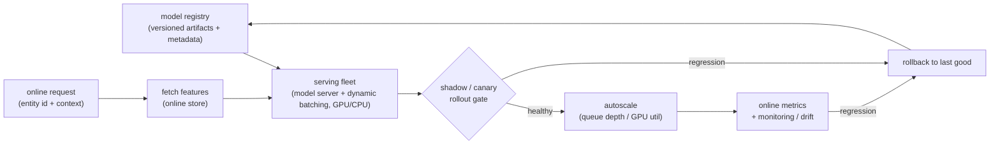

# Chapter 16: Real-Time Serving and Deployment

You have a trained model that scores well offline. The tempting next thought is that the hard part is over: copy the artifact somewhere, point traffic at it, and ship. That reflex is exactly what an interviewer is listening for, because it collapses two distinct systems into one. Serving a model at low latency and deploying a new version safely is mostly an infrastructure question, not a modeling one, and the two things that actually keep the product up are the ones the naive answer skips: the latency budget that shapes the entire serving stack, and the safe-deployment toolkit that lets you replace a live model without a global outage. This is the stage where a good model becomes a reliable product, and the signal that you have done it before is that you separate the model from the server, name p99 rather than average latency, and reach for shadow, canary, and rollback before anyone asks.

This chapter works through a single motivating brief. You own the online prediction service for a large product surface: a ranking model with multi-gigabyte embedding tables must answer synchronous requests inside a hard tail-latency budget, autoscale through a diurnal traffic pattern and the occasional launch spike, and accept a new model version several times a week without ever flipping all of production onto an unproven artifact. We will use that brief to expose what the interviewer is really probing: whether you can design backwards from a p99 number, whether you treat the model registry (not a file copy) as the seam that makes a deploy reproducible and reversible, and whether you can name what each rollout stage (shadow, canary, gradual, blue-green) actually buys and costs. Along the way we open the real ranking graph the server is holding in memory, so you can trace the embedding tables that dominate the artifact you version, ship, shadow, and roll back.

In this chapter, we will cover the following main topics:

- Scoping a serving system and naming tail latency under a hard p99 budget as the requirement that dominates
- The offline/online boundary and the registry that sits between them
- Model-as-a-service: why the server is not the model
- Dynamic batching and the latency-versus-throughput tradeoff
- The latency budget made concrete, and designing backwards from it
- Horizontal scaling, autoscaling on the right signal, and cold start
- The safe-deployment toolkit: shadow, canary, gradual rollout, and blue-green
- Rollback, the offline-versus-online serving boundary, and the failure modes that matter
- Tracing the ranking architecture the server actually loads

## Technical requirements

To follow along you need a modern web browser to open the validated reference graph used as the figure in this chapter. It is not a screenshot: it is a shape-checked architecture graph from the Neurarch model zoo, and it opens live in the editor so you can inspect real dimensions layer by layer. Serving is infrastructure, so there is no neural graph for the server itself, and pretending the model server is a "model" would be exactly the conflation this chapter warns against. The thing you put behind the server is the model, and for an online ranking service that is typically a DLRM-style ranker whose embedding tables are precisely what gets loaded into the server's memory.

The architecture we open in this chapter is:

- **DLRM (deep learning recommendation model)**, the ranker you put behind the server, whose embedding tables are the gigabytes each replica must load and warm: [open it live](https://www.neurarch.com/?import=https://raw.githubusercontent.com/neurarch-ai/awesome-llm-model-zoo/main/architectures/dlrm/model.json)

The full collection of validated reference graphs lives in the [Model Zoo repository](https://github.com/neurarch-ai/awesome-llm-model-zoo), with a browsable [gallery](https://neurarch-ai.github.io/awesome-llm-model-zoo). It is built by [Neurarch](https://www.neurarch.com).

Conceptually you will also want to be aware of the components we name but do not build here: a model registry that versions artifacts and their metadata, a model server (TF Serving, TorchServe, or NVIDIA Triton) that loads and batches, a load balancer fronting a fleet of stateless replicas, an autoscaler driven by a serving-specific signal, a rollout controller that shifts traffic across versions, and a monitoring stack that logs predictions and latencies. No datasets are required to read the chapter; the running example is an online ranking service under a hard p99 budget.

## Scoping the serving problem before you draw anything

The strongest opening move is to refuse to treat "deploy the model" as one undifferentiated step. A small dense net, a large ranker with multi-gigabyte embedding tables, and an LLM are three completely different serving problems in memory footprint, batching behavior, and hardware, so we ask before we design. The questions worth putting to the interviewer:

- **What model, and how big?** The memory footprint decides everything downstream: whether the artifact fits on one replica, how slow cold start is, and whether you serve on CPU or GPU. Ask before you commit to a topology.
- **What is the latency budget?** What p99 must the caller see, and how much of it is the model versus feature fetch and network? Serving usually gets a slice of a larger request budget, so name the number out loud rather than optimizing in a vacuum.
- **What is the traffic shape?** Steady QPS or spiky, diurnal or launch-driven? The autoscaling story is set by whether you must absorb a sudden spike or merely track a smooth curve.
- **Online or near-line?** Is this a synchronous request on the user's critical path, or async scoring you can batch and write to a store? Not everything has to be served live, and saying so shows you are not over-engineering.
- **How often do you redeploy, and what does safe mean?** Daily refreshes versus monthly changes set how much you invest in rollout automation, and establishing up front that rollout is gradual and reversible frames the whole answer.

For the rest of the chapter we scope to a synchronous online ranking service, a large embedding-heavy artifact, a spiky diurnal traffic pattern, and several deploys a week that must each be gradual and reversible.

## Requirements and the one that dominates

**Functional requirements.** Load a trained model version and serve predictions over an API (the model-as-a-service pattern). Fetch or accept the features the model needs at request time. Support multiple model versions and a registry that records which is live. Roll a new version out gradually and roll it back fast. Log requests, predictions, and latencies for monitoring and the next training cycle.

**Non-functional requirements.** p99 latency under the budget, not just a good average. Horizontal scalability with autoscaling that tracks traffic. High availability, so a single bad host or version does not take the service down. Reproducibility, so a served prediction maps to an exact model version and config. Safe deploys, meaning shadow, canary, or gradual rollout with automated rollback.

Name the requirement that dominates first, because the whole design bends around it: **tail latency under a hard p99 budget while staying available during deploys**. Average latency is easy and a lie; a healthy mean can hide a fat tail that misses the SLA for exactly the requests that matter. The design is shaped by the slow requests (the p99 and p999) and by the rule that a deploy must never become a tail-latency or correctness cliff for users. Say that out loud and the rest of the answer has a spine.

## The offline/online boundary and the registry between them

There are two boundaries to draw. The offline path trains, validates, and registers a model version. The online path loads that version behind a server and answers requests inside the latency budget. The registry is the seam between them, and it is what makes a deploy reproducible and a rollback a pointer change rather than a rebuild under pressure. The diagram below is the skeleton every mature serving system converges on: a versioned artifact leaves the registry into a fleet of stateless serving replicas doing dynamic batching, a rollout controller decides how much live traffic each version sees by shadowing then canarying, an autoscaler tracks load on a serving-specific signal, and everything served is logged so monitoring can catch a regression and trigger a rollback to the last good version.

*Figure 16.1: The serving and safe-deployment path, from the model registry through the serving fleet and the shadow/canary rollout gate to autoscaling and monitoring, with the two regression paths (shadow/canary gate and live monitoring) that both roll back to the last good version*

The model server loads a versioned artifact from the registry, the rollout controller gates how much real traffic each version sees, and features arrive at request time from the online store (Chapter 15). Everything served gets logged so monitoring (Chapter 18) can catch a bad version and trigger a rollback. Without the registry, "roll back the model" means "find and rebuild the old one under pressure," which is how a five-minute fix becomes an hour.

## Model-as-a-service: the server is not the model

The pattern is to wrap the trained model in a dedicated **model server** (TF Serving, TorchServe, and NVIDIA Triton are the canonical examples) that exposes a thin predict API and owns the boring, hard parts: loading versioned artifacts, warming them, batching requests, exposing metrics, and hot-swapping versions without dropping traffic. The application calls it over gRPC or HTTP and stays out of the inference business.

Say the boundary clearly. The **model** is the trained graph and its weights (the embedding tables, the layers). The **server** is infrastructure that loads and runs it. Decoupling them means you can redeploy a model without redeploying the app, run several versions side by side, and standardize observability across every model in the company. Treating the server as "part of the model" is the mistake that produces bespoke, unmonitored, un-rollbackable serving code per team, which is precisely the outcome the registry-plus-server pattern exists to prevent.

## Dynamic batching: the throughput lever

A single request underuses a GPU. **Dynamic batching** (request batching) in the server collects requests that arrive within a small time window (single-digit milliseconds) and runs them through the model as one batch, amortizing per-call overhead and filling the accelerator. This is the main throughput knob, and it is a direct latency-versus-throughput tradeoff: a bigger maximum batch and a longer wait window raise throughput and raise tail latency. You tune the window and batch size against the p99 budget, not for peak throughput in isolation.

The effect on the tail is easy to state. If the server waits up to $W$ milliseconds to fill a batch and inference on a full batch of size $B$ takes $T_{\text{infer}}(B)$, then a request's serving-side latency in the worst case is

$$T_{\text{serve}} = W + T_{\text{infer}}(B),$$

so raising $W$ or $B$ buys throughput (more requests amortized over one accelerator pass) at the direct cost of a larger $T_{\text{serve}}$ on the tail. For a ranker that scores hundreds of candidates per request, the candidates are already a natural batch, and dynamic batching is the cross-request version of the same idea.

## The latency budget, made concrete

This is the constraint that picks the rest of the design, so design backwards from it. Decompose the end-to-end p99 the caller sees into its additive parts:

$$T_{p99} = T_{\text{network}} + T_{\text{feature}} + T_{\text{batch-wait}} + T_{\text{infer}} \le B,$$

where $B$ is the budget the caller grants the prediction. Illustrative arithmetic (numbers are for shape, not a benchmark): if the caller allows a roughly 50 ms p99 for the whole prediction and feature fetch takes roughly 10 ms (Chapter 15), then the model plus the batching wait plus network has to fit in the remaining budget. That inequality drives concrete choices:

- Keep the per-request model cost ($T_{\text{infer}}$) flat and predictable, which caps model size and shapes the hardware choice.
- Size the batching window so the wait it adds ($T_{\text{batch-wait}}$) stays inside the budget rather than chasing peak throughput.
- Cache features, and even whole predictions, where inputs repeat, cutting $T_{\text{feature}}$ toward zero on hits.
- Watch p99 and p999, not the mean: a healthy average with a fat tail still misses the SLA for the requests that matter.

State the budget first and let it drive batch size, hardware, and model size. That ordering is the senior move; optimizing any single term without the inequality in front of you is the junior one.

## Horizontal scaling and autoscaling

You scale a stateless model server **horizontally**: many identical replicas behind a load balancer, traffic spread across them. Because the replicas hold no per-user state, you add and remove them freely. **Autoscaling** adds replicas when a signal crosses a threshold, and the subtlety worth raising is *which* signal. CPU utilization is a poor proxy for an inference service whose bottleneck is GPU memory bandwidth or queue depth, so scale on a serving-specific signal (request queue length, batch latency, GPU utilization) instead.

The queue-depth signal has a clean justification. By Little's law, the mean number of requests in the system is

$$L = \lambda W,$$

for arrival rate $\lambda$ and mean time-in-system $W$, so a queue $L$ that is growing at fixed service capacity is the earliest warning that $W$ (and therefore your tail latency) is about to blow through the budget, well before CPU or even GPU utilization saturates. Two gotchas to name: **cold start** (a new replica must load a multi-gigabyte model and warm caches before it can serve, so it cannot absorb a spike instantly, which argues for headroom and pre-warming), and **load-balancer readiness awareness**, so traffic does not hit a replica that is still loading.

## Model versioning and the registry

Every deployable model is an immutable, versioned artifact in a **model registry** with its metadata: the training-data snapshot, code version, hyperparameters, offline metrics, and a stage (staging, production, archived). The registry is the source of truth for what is live right now, and the thing that makes a deploy reproducible and a rollback a pointer change rather than a rebuild. Serving loads **by version** from the registry, so a served prediction can be traced back to the exact artifact that produced it. This is the same reproducibility discipline the feature store enforced on features in Chapter 15, now applied to the model artifact: pin the exact thing that produced a given output so you can reproduce it and revert to it.

## The safe-deployment toolkit

This is the point of the whole topic: a new model version reaches full traffic through a staged, reversible sequence, never a flip. Know the toolkit and what each step buys and costs:

- **Shadow (dark launch, mirroring).** Send a copy of live traffic to the new version, throw its predictions away, and compare them offline against the current version. Zero user risk, and it catches crashes, latency regressions, and large prediction shifts before a single user sees the new model. The catch: shadowing doubles inference cost while it runs and cannot measure the new model's effect on user behavior, because no one sees its output.
- **Canary.** Route a small slice (say 5 percent) of real traffic to the new version, watch its serving health and online metrics, and widen only if it holds. This is where you measure real user impact, gated to a small blast radius.
- **Gradual rollout.** Ramp the canary up in steps (5, 25, 50, 100 percent) with health gates between each, so a problem that only shows at scale still surfaces on a fraction of traffic.
- **Blue-green.** Stand up the new version (green) as a full parallel fleet beside the current one (blue), cut traffic over once it is verified, and keep blue warm so rollback is an instant traffic switch back. Fast and clean, but you pay for two full fleets during the cutover.

The honest summary: shadow proves it does not break, canary and gradual rollout prove it helps without a wide blast radius, and blue-green makes the cutover and the undo instant. Most mature setups combine them, shadowing first, then canarying, then ramping.

## Rollback and the offline-versus-online boundary

Rollback must be faster and more boring than rollout. Because the registry holds the previous version and the rollout controller can shift traffic, a rollback is "point production back at the last good version," ideally automated off a health or metric regression rather than waiting for a human to notice. The interview-grade point: **define the rollback trigger and make it automatic**. A deploy you cannot reverse in seconds is not a safe deploy.

Not everything needs live serving, and saying so shows judgment. **Online (real-time)** serving answers a synchronous request on the user's critical path and lives under the p99 budget. **Offline (batch)** serving precomputes predictions for all entities on a schedule and writes them to a store the app reads with a simple lookup, trading freshness for near-zero serving latency and cost. Batch suits predictions that do not change request-to-request (a daily user propensity score). Many systems do both: precompute what is stable, serve live only what depends on real-time context. Pushing work to the cheaper side when freshness allows is the opposite of over-engineering live serving for everything.

## Bottlenecks and scaling

As the service scales, a predictable set of bottlenecks surfaces, and it is worth memorizing the binding constraint, the first sign, the fix, and the tradeoff for each, because they map onto the serving path above:

| Bottleneck | First sign | Fix | Tradeoff |
|---|---|---|---|
| Tail latency (p99/p999) | Average fine, p99 over budget | Tune batch window, add replicas, cap model size | Throughput vs tail |
| GPU/accelerator utilization | Hardware idle under load | Dynamic batching, co-locate models | Latency added by batch wait |
| Model load / cold start | New replicas slow to serve | Pre-warm, keep headroom, smaller artifacts | Cost of idle capacity |
| Autoscaling on the wrong signal | Scales late or thrashes | Scale on queue depth or GPU, not CPU | Tuning complexity |
| Embedding table memory | Model does not fit a replica | Shard, quantize, host-memory tiering | Lookup latency, quality |
| Deploy blast radius | A bad version hits everyone | Shadow plus canary plus gradual rollout | Slower, costlier rollouts |
| Slow rollback | Incident drags on | Registry plus automated traffic switch | Keep old version warm (cost) |
| Feature fetch on critical path | Latency before inference | Cache, batch reads, online store | Freshness vs speed |

The recurring theme is that every lever trades one axis against another (throughput against tail latency, idle capacity against cold-start safety, rollout speed against blast radius), so state the axis you are trading before you pick a knob.

## Failure modes, safety, and evaluation

A serving system fails in ways specific to its tail-latency, always-on, staged-deploy nature, and we plan for them:

- **Shipping straight to 100 percent.** The cardinal sin. A version that passed offline eval can still crash on real inputs, regress latency, or hurt the business metric. Shadow, then canary, then ramp; never flip all traffic at once.
- **Training-serving skew.** A model can serve flawlessly and still be wrong if the features at serving time differ from training (Chapter 15). Log served features and compare against training; safe deploys do not save you from a skewed feature.
- **No rollback path.** If you cannot revert in seconds, every deploy is a gamble. Pin a previous version in the registry and wire an automated rollback trigger.
- **Silent model staleness.** A broken retrain or registry pointer leaves an old version serving while the world moves on, and quality decays without an error. This is the handoff to monitoring (Chapter 18).
- **Tail-latency blindness.** Watching averages hides the slow requests that breach the SLA. Alert on p99 and p999, not the mean.
- **Cold-start outage on a spike.** Autoscaling that cannot warm replicas fast enough turns a traffic spike into dropped requests. Keep headroom and pre-warm.

The evaluation bar follows directly, and there is no single accuracy number for serving. You validate it with serving SLOs (p99 latency, availability, error rate), shadow-comparison agreement between candidate and production, canary online metrics against a control, and ultimately the absence of post-deploy regressions caught by monitoring. The ship decision is the canary or A/B result, not the offline metric, which is the thread we pick up in the next chapter.

## Tracing the architecture the server actually loads

Serving is infrastructure, so there is no neural graph for the server. What the server holds is the model, and for an online ranking service that is a DLRM-style ranker whose embedding tables are exactly what gets loaded into memory and what dominates the artifact size you version, ship, shadow, and roll back. Reading the graph beats reading a paper diagram, because you can follow real tensor shapes and see where the serving cost actually lives. The figure below is a validated reference graph at real dimensions, shape-checked end to end, not a screenshot.

**DLRM (deep learning recommendation model).** Trace the sparse categorical features into the embedding tables and the dense features into the bottom MLP, then the feature interaction and the top MLP that produces the score. Find the embedding tables and notice their size relative to the MLPs: those tables are the gigabytes the server loads into memory, the reason cold start is slow, and the artifact the registry versions. The dense MLPs are cheap; the tables are the serving footprint.

`https://www.neurarch.com/?import=https://raw.githubusercontent.com/neurarch-ai/awesome-llm-model-zoo/main/architectures/dlrm/model.json`

*Figure 16.2: DLRM, the ranker behind the server; the embedding tables are the gigabytes each replica must load and warm, which is why cold start is slow and why the tables, not the MLPs, are the artifact you version and roll back*

A good exercise before an interview: open DLRM, change the embedding dimension, and watch the parameter count (and therefore the memory the server has to hold and warm on every replica) move. That is the link between the model and the serving cost this chapter is about. Browse the rest in the [Model Zoo](https://github.com/neurarch-ai/awesome-llm-model-zoo) or the [gallery](https://neurarch-ai.github.io/awesome-llm-model-zoo). Built by [Neurarch](https://www.neurarch.com).

## Summary

In this chapter we treated real-time serving and deployment as an infrastructure problem governed by tail latency and staged rollout rather than by model accuracy. We scoped the model, the budget, and the traffic shape, then named the requirement that dominates: p99 (and p999) latency under a hard budget while staying available through deploys. We separated the model from the server, made the registry the seam that makes a deploy reproducible and a rollback a pointer change, and used dynamic batching as the throughput lever while respecting its direct latency-versus-throughput tradeoff. We designed backwards from the latency budget $T_{p99} = T_{\text{network}} + T_{\text{feature}} + T_{\text{batch-wait}} + T_{\text{infer}} \le B$, scaled horizontally, autoscaled on queue depth justified by Little's law rather than on CPU, and planned for cold start. We walked the safe-deployment toolkit (shadow to prove it does not break, canary and gradual rollout to prove it helps without a wide blast radius, blue-green for an instant cutover and undo), made rollback automatic, and drew the offline-versus-online boundary so we do not build live serving for everything. Finally we opened DLRM to ground the serving cost in the embedding tables the server actually loads, and we set the evaluation bar as serving SLOs plus shadow agreement plus canary metrics rather than a single offline number.

That last point is the hinge into the next chapter, *Online Experimentation and A/B Testing*. We closed here by saying the ship decision is the canary or A/B result, not the offline metric, and the canary raised the obvious question it cannot fully answer: how much of a metric move is real and how much is noise. Next we make that rigorous, turning "widen the canary if it holds" into a controlled experiment with a hypothesis, a randomization unit, a power calculation, and guardrail metrics, so a deploy that looks good does not just survive but demonstrably helps.

## Questions

1. Why is a serving system framed around p99 and p999 latency rather than average latency, and what does that reframing change about the design?
2. Explain the difference between the model and the server in the model-as-a-service pattern. What three concrete benefits does decoupling them buy?
3. How does dynamic batching raise throughput, and why is a larger batch window a direct cost to tail latency? Write the serving-latency relationship it implies.
4. Decompose an end-to-end p99 latency budget into its additive parts, and walk through how each part constrains a design choice (model size, batch window, feature caching).
5. Why is CPU utilization a poor autoscaling signal for an inference service, and what signal would you scale on instead? Use Little's law to justify the choice.
6. What is cold start in this context, why does it prevent an autoscaler from absorbing a spike instantly, and what two mitigations address it?
7. Compare shadow, canary, gradual rollout, and blue-green. State precisely what each one proves and what each one costs, and why shadow cannot measure user impact.
8. Why is the model registry, rather than a file copy, what makes a deploy reproducible and a rollback fast? What must a rollback trigger look like to count as safe?
9. When would you serve predictions offline (batch) instead of online (real-time), and what do you trade to do so?
10. A new version looked great in shadow but tanked in canary. What is the most likely explanation, and what does it tell you about the limits of shadow testing?

## Further reading

Each of the following is a first-party engineering writeup or reference that ships the patterns in this chapter. Read them for what an interview answer skips: the serving abstraction in practice, staged-rollout discipline, and how teams keep a deployed model from drifting away from training.

- [Clipper: A Low-Latency Online Prediction Serving System (Berkeley RISELab)](https://arxiv.org/abs/1612.03079): a serving system with prediction caching, adaptive batching, and a model abstraction layer for swaps.
- [Meet Michelangelo: Uber's Machine Learning Platform (Uber)](https://www.uber.com/us/en/blog/michelangelo-machine-learning-platform/): an online prediction service serving batched RPC requests at sub-10ms P95 with a registry and staged rollout.
- [Catwalk: serving machine learning models at scale (Grab)](https://engineering.grab.com/catwalk-serving-machine-learning-models-at-scale): self-service TensorFlow Serving on Kubernetes, autoscaling hundreds of models with version-served-while-loading and rollback to prior.
- [Millions of real-time decisions with LyftLearn Serving (Lyft)](https://eng.lyft.com/powering-millions-of-real-time-decisions-with-lyftlearn-serving-9bb1f73318dc): a decentralized inference platform with versioning, shadowing, and millisecond-latency predictions.
- [Automated Canary Analysis with Kayenta (Netflix)](https://netflixtechblog.com/automated-canary-analysis-at-netflix-with-kayenta-3260bc7acc69): an automated canary gate comparing baseline versus canary metrics to decide whether a rollout proceeds.
- [GPU-accelerated ML inference at Pinterest (Pinterest)](https://medium.com/@Pinterest_Engineering/gpu-accelerated-ml-inference-at-pinterest-ad1b6a03a16d): GPU serving with dynamic batching that exploits sub-linear latency scaling.
- [Real-time predictions with Shopify's ML platform (Shopify)](https://shopify.engineering/shopifys-machine-learning-platform-real-time-predictions): Merlin deploys each use case as a dedicated Ray-on-Kubernetes serving service with per-service isolation.
- [The engineering behind Booking.com's ranking platform (Booking.com)](https://medium.com/booking-com-development/the-engineering-behind-booking-coms-ranking-platform-a-system-overview-2fb222003ca6): multi-phase ranking with shadow-traffic mirroring and p999 latency budgets.
- [Pensieve: an embedding feature platform (LinkedIn)](https://www.linkedin.com/blog/engineering/ai/pensieve): an embedding feature platform pushing inference to nearline pre-computation.
- [Rules of Machine Learning (Google)](https://developers.google.com/machine-learning/guides/rules-of-ml): deployment discipline, staged rollout, and not letting serving drift from training.
- [Evidently AI ML system design database](https://www.evidentlyai.com/ml-system-design): the broadest curated index, 800 case studies from 150-plus companies; filter for model serving and deployment to go beyond the cases listed here.
