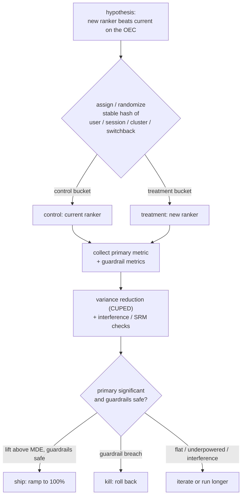

# Chapter 17: Online Experimentation and A/B Testing

The naive way to answer an experimentation question is to treat the offline win as the answer and ask only "how big an A/B test do I run?" That framing has already lost the signal. A new model that beats the current one on every offline metric, higher AUC, higher NDCG, better calibration, has cleared a cheap pre-gate and nothing more. The real question is why an offline win does not guarantee an online win, and how you build the controlled experiment that measures the thing the business actually cares about. A/B testing is a process, not a model. The model is what you are testing, and the whole discipline exists to decide whether that model replaces the one in production.

This chapter works through a single motivating brief. You trained a new ranking model, the candidate from a ranking or recommendation pipeline, and it wins offline on AUC, NDCG, and calibration. Product wants to know whether it ships. You have to prove the new model is better for the business, not just better on a holdout set, which means a randomized comparison, the right metrics, enough statistical power to trust the result, and a ship decision that survives novelty effects, peeking, and interference. We will use that brief to expose the decisions an interviewer is probing for: whether you can explain the offline-to-online gap, choose a unit of diversion, size a test before running it, reduce variance without buying more traffic, and turn a noisy result into a defensible ship or kill.

In this chapter, we will cover:

- Why an offline win is a pre-gate, not a decision, and where the gap comes from
- Randomization and the unit of diversion, and why analysis must match the diversion level
- Primary, guardrail, and counter-metrics, and pinning them before the test
- Statistical significance, type I and type II error, power, and sample sizing from a minimum detectable effect
- CUPED variance reduction, and interleaving as the ranking-specific sensitive screen
- Network effects, interference, peeking, and multiple comparisons
- The explicit ship decision, sample ratio mismatch, and A/A tests as system eval

By the end, you will be able to walk an interviewer from "my model wins offline" to a costed, powered, trustworthy experiment, and defend every statistical choice along the way.

## Clarify and scope before you draw anything

The strongest opening move is to refuse to jump to test size. An experiment is defined by its metric, its unit, and its randomization long before its duration. The questions worth asking:

- **What is the one metric this should move?** The primary metric, or Overall Evaluation Criterion (OEC). It must be the business outcome the new model is supposed to improve (engagement, conversion, revenue per session), measurable in the experiment window, and sensitive enough to move. Pin it before you start or you will fish for a winner afterward.
- **What must it not break?** The guardrail metrics: latency, error rate, revenue, churn, complaint rate. A new ranker can win on engagement and quietly tank a guardrail. Name these up front.
- **What is the unit of diversion?** Per user, per session, or per request. This is the single most important design choice, and it depends on whether effects carry across a user's requests, which they almost always do for ranking.
- **How much traffic and for how long?** This sets statistical power. Ask the baseline rate of the primary metric, its variance, and the smallest effect worth shipping (the minimum detectable effect).
- **Are there network effects?** If treating one user changes another user's experience (marketplaces, social feeds, shared inventory), a naive user-level split is biased and you need a different randomization scheme.
- **What is the cost of a wrong ship?** A risky change wants a slow ramp and tight guardrails. A low-risk copy change can move faster.

For the rest of the chapter we scope to a user-diverted A/B test on a ranking change, with interleaving noted as a fast pre-screen and switchback or cluster designs noted for the interference case.

## Requirements

**Functional requirements.** Randomly assign traffic to control (the current model) and treatment (the new model). Hold that assignment stable per diversion unit for the experiment's life. Log exposure plus the primary and guardrail metrics per unit. Compute the treatment effect and its statistical significance. Produce a clear ship, kill, or iterate decision with a confidence interval, not a bare yes or no.

**Non-functional requirements.** Assignment must be deterministic and low-latency on the serving path, because it sits inline with every request. Randomization must be unbiased, so the two arms differ only by the change under test. Results must be reproducible: a fixed analysis plan and fixed metric definitions set before launch. The rollout must be safe, able to ramp exposure up and kill instantly on a guardrail breach. And the statistics must be trustworthy, controlling false positives across peeking and many metrics.

The requirement that dominates, and that you should name first, is a valid, unbiased comparison. Every other piece (significance math, ramping, dashboards) is in service of the claim that the only difference between the two arms is the model. Break randomization and no amount of statistics saves you.

## High-level data flow

The defining idea is a single point of randomization on the serving path that splits traffic by diversion unit, followed by an offline analysis path that turns logged metrics into a decision. Every mature experimentation platform runs the same skeleton: form a hypothesis, hash a diversion unit into stable arms, collect a pre-declared success metric alongside guardrails, squeeze variance out (CUPED or interleaving), check for interference, and then make a ship-or-hold call. The differences between platforms are all in the details of that squeeze and that check, which is exactly where scarce traffic and marketplace bias bite.

The assignment node is the whole experiment. It must be a stable hash of (unit id, experiment id) into buckets, so the same user lands in the same arm every request for the whole experiment and assignment is independent across experiments. It must also be statistically independent of anything correlated with the outcome. The analysis path never touches the serving path: it reads logs after the fact.

## Why offline wins do not guarantee online wins

This is the heart of the question, and the interviewer is testing whether you can explain the gap rather than just assert it exists:

- **The offline metric is a proxy.** AUC and NDCG measure ranking quality on logged data. The business cares about engagement or revenue, and the correlation between the two is loose. A model can sort the holdout better and move the real metric not at all.
- **The offline data is the old model's data.** Your logs were generated by the current ranker, so they reflect what it chose to show. The new model would have shown different items, for which you have no labels. Offline eval scores the new model on a distribution it would never have produced. This is counterfactual evaluation, and it is why offline numbers are optimistic.
- **Training-serving skew.** If a feature is computed differently online than in training, the model that looked great offline meets a different distribution at serve time.
- **Feedback loops.** A new ranker changes what users see, which changes future behavior and future training data. Offline eval is static. Online is a system that reacts.

The clean way to say it: offline metrics are a cheap, fast pre-gate that lets you kill obvious losers without burning traffic. The A/B test is the decision, because it measures the real metric on the real distribution under the real feedback loop. Lead with this and the rest of the answer follows.

## Randomization and the unit of diversion

Randomization is what buys you causal inference. Formally, an observed association $P(Y \mid X)$ is not the interventional quantity $P(Y \mid \text{do}(X))$ unless assignment is randomized. A randomized controlled experiment breaks the link between treatment and every confounder by design, so the two groups differ only in the treatment, and a difference in the metric is caused by the treatment. Implement it as a deterministic hash of (unit id, experiment id) into buckets, so assignment is stable across requests and independent across experiments.

The subtle choice is the unit of diversion:

- **Per request** gives the most samples and the tightest variance, but it is wrong whenever the effect carries across a user's requests, which it almost always does for ranking: a user who sees better results behaves differently for the rest of the session. Splitting per request contaminates the same user with both arms and dilutes the effect.
- **Per user** (or per session) is the standard for ranking changes. It keeps a user's whole experience consistent, so you measure the real cumulative effect. The cost is fewer independent units and higher variance, because outcomes within a user are correlated and the effective sample size is the number of users, not requests.

State the rule: divert at the level at which the effect operates, and analyze at that same level. If you divert by user, your variance calculation must account for within-user correlation (clustered or bootstrap variance), or your confidence intervals will be too narrow and you will declare false winners. This is a special case of a general statistical fact: under strong within-unit dependence the effective sample size $n_{\text{eff}} \ll n$, so naive standard errors that assume independence are too small and the intervals are overconfident.

## Primary, guardrail, and counter-metrics

- **Primary metric (OEC).** The one number that decides the experiment. It should be the business outcome, sensitive to the change, and measurable in the window. Long-term outcomes (retention, lifetime value) are what you truly want but they move too slowly, so teams use a sensitive short-term proxy chosen to correlate with the long-term goal. Choosing the OEC well is more than half the work.
- **Guardrail metrics.** Outcomes that must not regress even if the primary wins: latency, error rate, revenue, and user-harm signals. A win on engagement that adds 50 ms of latency or drops revenue is not a ship.
- **Counter-metrics.** Watch for the metric you are gaming. If you optimize clicks, watch dwell time and complaint rate, or you ship clickbait that wins the primary and loses the user.

Declaring primary, guardrail, and counter-metrics before the test is what stops you from rationalizing a result after you see it. One reason this discipline matters is skew: many product metrics (session length, revenue per user, latency) are heavily right-skewed, so their mean sits above their median and a few extreme users can swing the average. Report the metric your OEC is defined on, but know its distribution, because a mean-based test on a heavy-tailed metric can be dominated by a handful of outliers.

## Statistical significance, power, and sample sizing

You are estimating the difference in the primary metric between arms and asking whether it is real or noise. What lets you attach a normal-based standard error and a confidence interval to that difference is the central limit theorem: the sampling distribution of a mean of many independent, finite-variance observations approaches a normal regardless of the shape of the underlying data,

$$\frac{\bar X - \mu}{\sigma / \sqrt{n}} \;\xrightarrow{d}\; \mathcal{N}(0, 1), \qquad \text{SE} = \frac{\sigma}{\sqrt{n}}.$$

This is why so many experiment readouts "just work" at moderate sample sizes even when clicks or conversions are Bernoulli, not Gaussian. It breaks for infinite-variance or extremely heavy-tailed metrics and under strong dependence, which is the same warning as the diversion-unit discussion above.

The test itself weighs two errors. A **type I error** is rejecting a true null, a false positive, controlled by the significance level

$$\alpha = P(\text{reject } H_0 \mid H_0 \text{ true}),$$

commonly set to 5%. A **type II error** is failing to reject a false null, a false negative, with probability

$$\beta = P(\text{fail to reject } H_0 \mid H_1 \text{ true}),$$

and **power** is the probability of detecting a real effect of a given size,

$$\text{power} = 1 - \beta,$$

commonly targeted at 80%. Power rises with a larger true effect, a larger sample, lower noise, and a more lenient $\alpha$. The tension is that lowering $\alpha$ to avoid false positives raises $\beta$ and reduces power for a fixed $n$, so you trade the two error types unless you buy more data.

The readout of the test is the **p-value**, the probability, computed under the null, of a test statistic at least as extreme as the one observed,

$$p = P(T \ge t_{\text{obs}} \mid H_0).$$

Say clearly what it is not. It is not $P(H_0 \mid \text{data})$, not the probability the result happened by chance, and not one minus the probability the alternative is true. A small p-value says the data are surprising if the null holds, which is evidence against the null but says nothing about effect size. With a large enough sample a trivially small effect becomes "significant," which is exactly why the ship decision later requires a practically meaningful effect, not just $p < 0.05$.

Sizing the test comes before launching it. The required sample size grows with variance and shrinks with the effect you want to detect:

- The **minimum detectable effect (MDE)** is the smallest change worth shipping. Required sample size scales roughly with $1 / \text{MDE}^2$, so halving the effect you want to catch roughly quadruples the traffic and time. Detecting a 0.5% lift needs far more traffic than detecting a 5% lift.
- Higher metric variance needs more samples, and lower baseline rates (rare conversions) need more samples.
- Compute the required sample size from the baseline rate, the variance, the MDE, the significance level, and the target power, then multiply by your traffic share to get the duration.

The senior move is to state the MDE, derive the sample size and duration up front, and commit to them. Running first and asking "is it significant yet?" is how you fool yourself, and it also invites the winner's curse: underpowered studies that do reach significance tend to overestimate the effect size, so the lift you ship on is inflated.

## Variance reduction with CUPED

Sample size scales with variance, so anything that removes variance without changing the expected effect buys you sensitivity for free, which is the same as buying traffic and time. CUPED (Controlled-experiment Using Pre-Experiment Data) is the standard technique. The idea is to subtract off the part of the metric that a pre-experiment covariate already predicts, because that part is not caused by the treatment and only adds noise.

Let $Y$ be the metric and $X$ a pre-experiment covariate correlated with it (very often the same metric measured on the same user in the weeks before the experiment). The CUPED-adjusted metric is

$$Y_{\text{cuped}} = Y - \theta\,\bigl(X - \mathbb{E}[X]\bigr), \qquad \theta = \frac{\operatorname{cov}(Y, X)}{\operatorname{Var}(X)}.$$

Because $X$ is measured before assignment, it has the same distribution in both arms, so subtracting it does not bias the treatment effect: $\mathbb{E}[Y_{\text{cuped}}]$ shifts by the same amount in control and treatment and the difference is unchanged. What it does change is the variance,

$$\operatorname{Var}(Y_{\text{cuped}}) = \operatorname{Var}(Y)\,\bigl(1 - \rho^2\bigr),$$

where $\rho$ is the correlation between $Y$ and $X$. A pre-period covariate correlated at $\rho = 0.7$ removes about half the variance, which roughly halves the sample size (or the duration) needed for the same power. This is why Uber, Netflix, and LinkedIn all wire CUPED into their platforms: pre-experiment behavior is a strong predictor of in-experiment behavior, so the free variance reduction is large. The catch is that the covariate must be genuinely pre-treatment. Use anything measured after assignment and you can bias the effect you are trying to estimate.

## Experiment duration, novelty and primacy effects

Duration is not "until significant." Two reasons to run a minimum window even if significance arrives early:

- **Novelty effect.** Users react to anything new, click it because it is different, and the lift fades as the novelty wears off. An early significant win can be pure novelty.
- **Primacy effect.** The opposite: users are anchored on the old experience and underperform on the new one at first, then warm up. An early flat result can hide a real win.
- **Weekly seasonality.** Behavior differs weekday versus weekend, so run in whole multiples of a week to avoid a day-of-week artifact.

Plot the daily treatment effect, not just the cumulative number. A real, shippable effect stabilizes. A novelty spike decays. Running at least one to two full weeks and watching the curve flatten is the discipline.

## Interleaving: a more sensitive method for ranking

Because this is a ranking change, mention interleaving, the ranking-specific method that is far more sensitive than a standard A/B test. Instead of showing user A the control list and user B the treatment list, you blend both rankers' results into one list for the same user (alternating picks, team-draft style) and attribute each click to whichever ranker contributed that item. Every user sees both rankers, so you compare them within-user and cancel out per-user variance, in the same spirit as CUPED but built into the presentation itself.

The payoff: interleaving can detect a ranking difference with one to two orders of magnitude less traffic than an A/B test, which matters when traffic is scarce. Netflix reports pruning ranking algorithms with roughly 100 times fewer subscribers this way. The catch is that it measures a within-list preference, not the full business metric or the guardrails. The standard pattern is to use interleaving as a fast, sensitive screen to pick which candidate rankers are worth a full A/B test, then run the A/B test to measure the actual business effect and guardrails before shipping. Name both and you show you know the ranking-specific tooling, not just generic stats.

## Network effects and interference

Standard A/B math assumes the stable unit treatment value assumption (SUTVA): one unit's outcome does not depend on another unit's assignment. That breaks whenever the arms interact:

- **Marketplaces and shared inventory.** If the treatment ranker surfaces an item more, that item can sell out or get rate-limited, hurting the control arm. The arms compete, so the measured difference is biased.
- **Social and feed effects.** Treating one user changes what their connections see or do, leaking treatment into control.

Fixes: cluster randomization (randomize whole graph communities or geographic regions so interaction stays inside one arm), switchback experiments (alternate the whole system between control and treatment over time windows, common for marketplaces and logistics), or budget-split and two-sided designs. The interview point is to recognize interference, say the naive user split is biased here, and name a mitigation. Most candidates miss this entirely.

## Peeking and multiple comparisons

Two ways to manufacture false winners, both common:

- **Peeking.** Checking the result repeatedly and stopping the moment it crosses significance. A fixed-horizon test assumes you look once at the planned sample size. If you peek daily and stop on the first significant reading, your real false-positive rate is far above the stated $\alpha$. Fixes: commit to the precomputed sample size and look once, or use methods built for continuous monitoring (sequential testing, always-valid p-values, group sequential boundaries).
- **Multiple comparisons.** Test $m$ metrics (or $m$ variants) each at $\alpha = 0.05$ and the chance that at least one true null trips is $1 - (1 - \alpha)^m$, so at $m = 20$ you expect about one spurious "winner." The primary-metric discipline exists precisely to avoid this: one pre-declared metric decides, the rest are guardrails read with that context. If you genuinely test many hypotheses, correct for it. Bonferroni controls the family-wise error rate by testing each hypothesis at $\alpha / m$, safe but conservative. Benjamini-Hochberg instead controls the false discovery rate,

$$\text{FDR} = \mathbb{E}\!\left[\frac{\text{false positives}}{\max(\text{total rejections}, 1)}\right],$$

which is more powerful when you expect several real effects. Choose FWER control when any single false positive is costly, FDR when you can tolerate a known fraction of false leads to find more real ones.

Stating "I fix the sample size and the primary metric in advance to avoid peeking and multiple comparisons" is exactly the trustworthiness signal interviewers want.

## The ship decision

Tie it together into an explicit decision rule:

1. **Pre-gate offline.** AUC, NDCG, and calibration must clear a bar, else do not even run the test. A cheap filter, not the decision.
2. **Ramp safely.** Start at a small exposure (say 1% to 5%) with guardrails wired to auto-kill on a breach, confirm no operational regression, then ramp to the planned share.
3. **Run the planned window.** At least one to two full weeks, watching the daily effect curve for novelty decay.
4. **Decide on the primary plus guardrails.** Ship only if the primary is significant, the effect is above the MDE (practically meaningful, not just statistically significant), the confidence interval excludes trivial effects, and no guardrail regressed. Report the interval, not just a yes or no.
5. **Ramp to 100% and keep a holdback.** Roll out fully but optionally keep a small long-term holdback to measure whether the win persists and to catch slow effects. This is the bridge into monitoring and drift.

A win that is statistically significant but below the MDE, or that breaches a guardrail, is a kill or iterate, not a ship. Saying that out loud is the difference between someone who runs tests and someone who makes decisions. It is worth being precise about the confidence interval you report, too. A 95% frequentist confidence interval is a statement about the procedure (over many repeats, 95% of such intervals cover the true effect), not the probability that this one interval contains it. People often want the Bayesian credible-interval reading ("95% chance the lift is in here"), which is only valid under a Bayesian construction. With large experiment samples and weak priors the two nearly coincide numerically, but do not misreport one as the other in the room.

## Bottlenecks and scaling

| Bottleneck | First sign | Fix | Tradeoff |
| --- | --- | --- | --- |
| Underpowered test | Result never reaches significance | Larger traffic share, variance reduction (CUPED), longer window | Time, exposure to a possibly worse model |
| Wrong diversion unit | Effect looks tiny or inconsistent | Divert and analyze per user or session, not per request | Fewer independent units, higher variance |
| Within-unit correlation | Confidence intervals too narrow, false winners | Clustered or bootstrap variance at the diversion unit | More complex analysis |
| Peeking | "Significant" results that do not replicate | Fixed horizon and look once, or sequential testing | Slower reads or harder math |
| Multiple metrics or variants | Spurious winner among many | One primary metric, FDR correction for the rest | Less freedom to fish |
| Network interference | Control contaminated by treatment | Cluster, switchback, or geo randomization | Far fewer effective units, harder design |
| Many concurrent experiments | Tests collide and confound | Orthogonal layered assignment (independent hashes) | Platform complexity |
| Novelty or seasonality | Early effect decays or flips | Run whole weeks, watch the daily curve | Longer to a decision |

## Failure modes, safety, and eval

- **Sample ratio mismatch (SRM).** The single most important sanity check. If you asked for a 50/50 split and observe 50.8/49.2 at scale, the randomization or logging is broken and the whole experiment is invalid no matter how good the result looks. Test the observed ratio against the intended ratio with a chi-squared test on every experiment, and refuse to read results when it fails.
- **Peeking and early stopping.** The most common way teams ship noise. Default to a fixed horizon.
- **Guardrail breach masked by a primary win.** Always read guardrails alongside the primary, and auto-kill on a breach during ramp.
- **Interference and SUTVA violation.** In marketplaces and social graphs the naive split is biased. Detect it by comparing user-split results to a cluster or switchback design, and use the interference-robust design when they disagree.
- **Novelty mistaken for a real win.** Watch the daily effect curve. A decaying spike is novelty, not value.
- **Simpson's paradox.** An aggregate win that reverses inside every important segment (or the reverse), because a confounder is distributed unevenly across the compared groups. Slice by key segments (new versus returning users, platform, region) before deciding, and trust the within-segment numbers when the segmenting variable is a genuine confounder.
- **Eval of the experiment system itself.** Run A/A tests (both arms identical) regularly. They should show no significant difference about 95% of the time at a 5% level and zero SRM. A misbehaving A/A test means your pipeline manufactures false positives, and no real result can be trusted until it is fixed.

## Questions
- **"Your new model wins offline. Why might it lose online?"** Offline metrics are proxies measured on the old model's data (counterfactual), plus training-serving skew and feedback loops the static eval cannot see. The A/B test is the decision.
- **"What is your unit of diversion and why?"** Per user or session for a ranking change, because the effect carries across a user's requests. Per-request would contaminate users and dilute the effect, and analysis must account for within-user correlation.
- **"How long do you run it and how big does it need to be?"** Compute the sample size up front from baseline rate, variance, MDE, significance, and power. Run at least one to two full weeks for novelty and weekly seasonality regardless of early significance.
- **"How do you get a decision faster without more traffic?"** CUPED using a pre-experiment covariate removes a $\rho^2$ fraction of the variance for free, and for ranking specifically, interleaving screens candidates with far less traffic before a confirmatory A/B test.
- **"Why not stop as soon as it is significant?"** Peeking inflates the false-positive rate well above the stated $\alpha$. Fix the horizon or use sequential methods.
- **"Marketplace: one ranker shows item X more and it sells out. What breaks?"** Interference (a SUTVA violation): treatment affects control, so the user split is biased. Use cluster, geo, or switchback randomization.
- **"Significant but tiny lift, ship?"** No. Require the effect above the MDE (practically meaningful) and no guardrail regression, and report the confidence interval, not a binary.

## Trace the architectures

Honest framing: A/B testing is a process, not a model, so there is no neural graph for the experiment itself. The graph that matters here is the thing under test, the candidate ranking model whose variant you route a slice of traffic to. The whole topic exists to decide whether this model replaces the current one, so it helps to open it and see exactly what you are shipping or killing. Reading the graph beats reading a paper diagram, because you can follow real tensor shapes through every block. This is a validated reference graph at real dimensions, shape-checked end to end, not a screenshot.

**Wide-and-deep (the candidate ranker in your treatment arm).** Trace the two paths: the wide linear branch over crossed categorical features (memorization) and the deep embedding-plus-MLP branch (generalization), and see where they join before the output. This is the model whose offline win you are now trying to confirm online. The experiment routes treatment traffic through exactly this graph and control traffic through the current one.

`https://www.neurarch.com/?import=https://raw.githubusercontent.com/neurarch-ai/awesome-llm-model-zoo/main/architectures/wide-and-deep/model.json`

*Figure 17.1: Wide-and-deep*

Browse all of them in the [Model Zoo](https://github.com/neurarch-ai/awesome-llm-model-zoo) or the [gallery](https://neurarch-ai.github.io/awesome-llm-model-zoo). Built by [Neurarch](https://www.neurarch.com).

## Further reading
Every platform below runs the same skeleton: form a hypothesis, hash a diversion unit into stable arms, log a pre-declared success metric alongside guardrails, then squeeze variance out (CUPED or interleaving) and check for interference before a ship-or-hold call. The differences are all in the details of that squeeze and that check, which is where scarce traffic and marketplace bias actually bite.

| System | Randomization unit | Variance reduction | Guardrail metrics | Interference handling |
| --- | --- | --- | --- | --- |
| Netflix (interleaving) | Per user, both rankers blended in one list | Interleaving, ~100x fewer subscribers to prune rankers | Business metrics confirmed in the follow-up A/B | Within-user comparison sidesteps cross-user leakage |
| Uber | Per user, flicker (arm-switching) users excluded | CUPED | App crash rate, trip frequency, sequential monitoring | Sequential monitoring |
| LinkedIn | Individual versus cluster randomization | CUPED | Network-effect metrics under test | Cluster randomization to detect and bound interference |
| Lyft | Session, geo, and time (switchback) | Not the focus | Marketplace health metrics | Geo and time switchbacks contain marketplace spillover |
| Airbnb | Per user | Power and impact gating | Impact, power, stat-sig-negative guardrails | Guardrails flag harmful tests pre-launch |
| Spotify | Per user | Not the focus | Success plus quality metrics combined | Risk-aware decision across multiple metrics |

Each is a first-party engineering writeup worth reading for what an interview answer skips: how teams pick the OEC, catch SRM and interference, and turn results into ship decisions.

- **Google**, [Rules of Machine Learning](https://developers.google.com/machine-learning/guides/rules-of-ml): emphasizes measuring real online impact, not just offline metrics.
- **Kohavi, Tang, Xu**, *Trustworthy Online Controlled Experiments*: the canonical reference on OEC choice, sample ratio mismatch, peeking, interference, and running experiments at scale.
- **Netflix**, [Innovating faster on personalization using Interleaving](https://netflixtechblog.com/interleaving-in-online-experiments-at-netflix-a04ee392ec55): interleaving prunes ranking algorithms with 100x fewer subscribers before A/B confirmation.
- **Uber**, [Under the Hood of Uber's Experimentation Platform](https://www.uber.com/blog/xp/): an XP platform with CUPED variance reduction, monitoring, and statistical methodology.
- **Netflix**, [Reimagining Experimentation Analysis](https://netflixtechblog.com/reimagining-experimentation-analysis-at-netflix-71356393af21): modular analysis infra letting scientists add custom metrics and causal models.
- **Airbnb**, [Designing Experimentation Guardrails](https://medium.com/airbnb-engineering/designing-experimentation-guardrails-ed6a976ec669): impact, power, and stat-sig-negative guardrails flag harmful experiments before launch.
- **Booking.com**, [Experimentation quality as the main platform KPI](https://medium.com/booking-product/why-we-use-experimentation-quality-as-the-main-kpi-for-our-experimentation-platform-f4c1ce381b81): experiment quality as the platform's north-star metric.
- **Spotify**, [Risk-Aware Product Decisions in A/B Tests with Multiple Metrics](https://engineering.atspotify.com/2024/03/risk-aware-product-decisions-in-a-b-tests-with-multiple-metrics): combining success, guardrail, and quality metrics into one shipping decision.
- **LinkedIn**, [Detecting interference: an A/B test of A/B tests](https://www.linkedin.com/blog/engineering/ab-testing-experimentation/detecting-interference-an-a-b-test-of-a-b-tests): cluster versus individual randomization plus CUPED to detect network-effect interference.
- **Lyft**, [Experimentation in a Ridesharing Marketplace](https://eng.lyft.com/experimentation-in-a-ridesharing-marketplace-b39db027a66e): statistical interference biases marketplace tests, with session, geo, and time randomization as the remedy.

For a broader index, the [Evidently AI ML system design database](https://www.evidentlyai.com/ml-system-design) collects 800 case studies from 150+ companies. Filter for experimentation and A/B testing.

## Summary

Online experimentation is where an offline win either becomes a shipped improvement or gets killed, and treating it as "how big a test do I run" misses the whole discipline. The through-line of this chapter: an offline win is a cheap pre-gate, and the gap to online impact comes from proxy metrics, counterfactual logged data, training-serving skew, and feedback loops, so only a randomized experiment measures the real thing. Randomization is what licenses the causal claim, and the unit of diversion has to match the level at which the effect operates (per user for ranking), with the variance analysis clustered to that same level. Pin the primary, guardrail, and counter-metrics before you look, size the test up front from the MDE, significance, and power rather than peeking your way to a false positive, and buy sensitivity for free with CUPED variance reduction or, for ranking, with interleaving as a fast screen. The traps that sink real experiments are structural, not statistical hair-splitting: sample ratio mismatch that invalidates the whole run, interference in marketplaces and social graphs, novelty effects masquerading as wins, and multiple comparisons manufacturing spurious winners. The ship decision is explicit: a significant primary above the MDE, a clean set of guardrails, and a reported confidence interval, not a bare yes or no. The traced wide-and-deep graph is a reminder of what the test is actually deciding about, the candidate model in your treatment arm.

In the next chapter, **ML Monitoring and Drift**, we follow the model past the ship decision into production, where the long-term holdback and the daily effect curve give way to continuous monitoring. Many of the same instincts carry over (guardrail thinking, distribution shift, the gap between an offline proxy and real behavior), but the question changes from "is this new model better right now" to "is the model I shipped still the model I think I have," as data drifts, features go stale, and the win you measured slowly decays.
