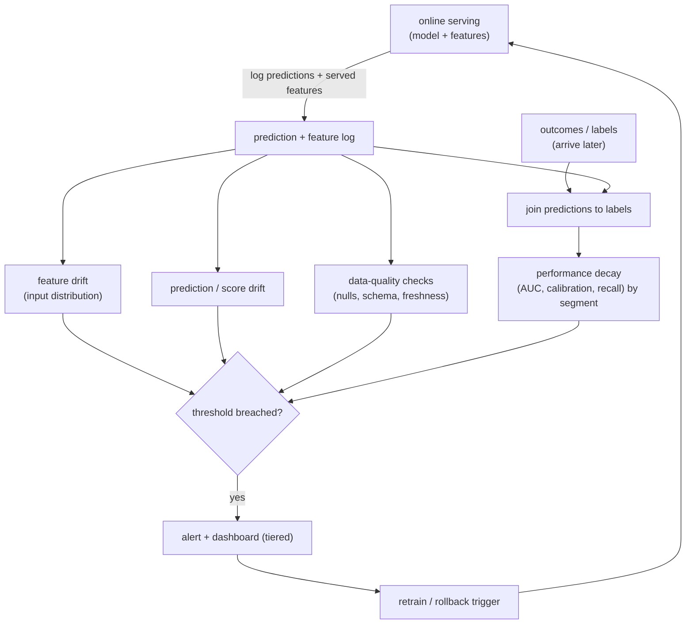

# Chapter 18: ML Monitoring and Drift

A recommendation model you launched six months ago was great at launch. Engagement has been quietly sliding ever since, and nobody noticed until a product manager complained. This is the failure that separates people who have *operated* a model from people who have only trained one. A model is not a deploy-and-forget artifact. The world it predicts on moves, and accuracy decays. Every other chapter in this book got a model into production; this one keeps it honest once it is there.

The trap in an interview is to answer "we monitor it" and reach for the same dashboards you would put on any web service: latency, error rate, uptime. Those tell you the service is *up*. They say nothing about whether the predictions are still any *good*. A model can serve every request in ten milliseconds with a 200 status code while quietly recommending worse items every day, and none of your service metrics will flinch. The signal an interviewer is listening for is that you monitor inputs, predictions, and outcomes, that you can name *why* models degrade, and that you close the loop back to retraining rather than just paging a human.

This chapter works through a single motivating brief: the sliding recommender above. We will build the monitoring that would have caught the slide before users felt it, and the loop that keeps the model healthy. Along the way we confront the one constraint that makes ML monitoring genuinely hard, the label-delay problem, and see why the fast, label-free signals are your only early warning for the slow, expensive one.

In this chapter, we will cover the following main topics:

- Scoping a monitoring system and its requirements
- The monitoring loop as a data flow alongside serving
- Why models decay: data drift, concept drift, and pipeline bugs
- The label-delay problem and leading indicators
- What to monitor, in layers, and how to detect drift with PSI and friends
- Alerting without alert fatigue
- Closing the loop to retraining and rollback
- Bottlenecks, failure modes, and evaluating the monitor itself

## Technical requirements

To follow along you need a modern web browser to open the validated reference graph used as a figure in this chapter. It is not a screenshot: it is a shape-checked architecture graph from the Neurarch model zoo, validated end to end at real dimensions, and it opens live in the editor so you can inspect the layers yourself.

Monitoring is a process, not a model, so there is no neural graph for the monitor itself. What you monitor is a *served* model whose behavior drifts as the world moves. The concrete model we will keep in mind is the two-tower retrieval model from Chapter 1, because "drift" is tangible there: the user and item embeddings that were well-separated at training time slowly stop matching real engagement as the catalog and user base change.

- **Two-tower retrieval**, the served model we monitor for drift: [open it live](https://www.neurarch.com/?import=https://raw.githubusercontent.com/neurarch-ai/awesome-llm-model-zoo/main/architectures/two-tower/model.json)

The full collection of validated reference graphs lives in the [Model Zoo repository](https://github.com/neurarch-ai/awesome-llm-model-zoo), with a browsable [gallery](https://neurarch-ai.github.io/awesome-llm-model-zoo). It is built by [Neurarch](https://www.neurarch.com).

Conceptually you will also want to be aware of the tooling classes we name but do not install here: a prediction-and-feature log (the raw material for every check), a drift-statistics library such as Evidently for PSI and distribution tests, and an alerting and on-call layer such as PagerDuty behind the thresholds. No datasets are required to read the chapter; the running example is the six-month-old recommender whose engagement is sliding.

## Scoping a monitoring system and its requirements

Before drawing any boxes, we scope the problem, because the answers change what you can even measure. Five questions do most of the work:

- **What is the model and its objective?** A click-through ranker, a retrieval model, a fraud classifier? The metric you ultimately care about, and how you would compute it, differs by model.
- **How fast do labels arrive?** This is the crucial question, and the one juniors skip. If you learn the truth in seconds (did they click), you can monitor accuracy almost live. If labels are delayed by days or weeks (did the loan default, did the user churn), you cannot, and you need proxy signals in the meantime.
- **What is the cost of a silent regression?** A slightly worse feed is tolerable. A degraded fraud or pricing model is expensive and possibly a compliance event. This sets alert sensitivity and whether a breach pages a human at 3am or files a ticket.
- **What can we log?** Predictions, the *exact* features served, and eventually the labels. Without logging the served features you cannot diagnose skew or drift after the fact, only observe that something moved.
- **How often can we retrain?** The monitoring loop is only useful if it can trigger a response, so the retrain cadence bounds how tight the loop can be. A monitor that fires weekly on a model you can only retrain monthly is mostly noise.

For our brief we scope to the recommender: labels (engagement) arrive within minutes to hours for the head of traffic but lag for cold-start users, a silent regression is a slow revenue leak rather than a legal event, and we can retrain daily. That combination, fast-ish labels plus a tolerable-but-real cost, is the common case, and it is exactly the case where a slow slide hides.

### Requirements

**Functional requirements.** Log predictions, the features that produced them, and outcomes when they arrive. Detect input drift, prediction drift, and, once labels land, performance decay. Detect pipeline and data-health failures (nulls, schema changes, stale features) separately from genuine drift. Alert a human and feed a retraining trigger. Slice every signal by segment, not just in aggregate, because an aggregate hides a regression that hits one segment.

**Non-functional requirements.** Catch degradation before users feel it, and before the next scheduled retrain would have fixed it anyway. Keep the false-alarm rate low, or alerts get ignored and the whole system is worse than nothing. Run cheaply enough to sit on continuously over high prediction volume. Above all, be *diagnosable*: an alert must point at *what* changed (which feature, which segment), not merely announce *that* something did.

## The monitoring loop as a data flow

Monitoring is a loop that runs alongside serving, not a one-time check you run at launch. The structural fact that organizes the whole design is this: the fast checks run *immediately* on the prediction log, while the true performance metrics must *wait* for labels to arrive. A good system uses the fast signals as an early warning for the slow one.

*Figure 18.1* traces predictions and served features from the serving path into three families of label-free detectors (feature drift, prediction or score drift, and data-quality checks), joins labels back when they land to compute true performance decay, and funnels every breach into a tiered alerting layer that either pages a human, triggers a retrain, or fires a rollback.

*Figure 18.1: The monitoring loop, from logged predictions and features through drift detectors and alerts to a retrain or rollback trigger*

Read the diagram left of the join as "what you can see now, with no labels" and right of the join as "the ground truth, once it arrives." The entire craft of ML monitoring lives in using the left half to predict the right half.

## Why models decay: name the three causes

The first thing an interviewer wants is that you can name *why* a model degrades, because the fix differs by cause. There are three, and saying that the third is the most frequent in practice is what signals operational experience.

**Data drift, also called covariate shift.** The input distribution moves while the model stays fixed. New users, new items, seasonality, a marketing campaign changing the traffic mix. Formally, the distribution of inputs $P(X)$ changes, but the input-to-label relationship $P(y \mid X)$ is unchanged. The model is still correct about the world; it is just now seeing inputs unlike its training data, where it was never fit and interpolates poorly.

**Concept drift.** The relationship between inputs and the label changes: what made users click last year does not this year. Here $P(y \mid X)$ moves, even if $P(X)$ holds steady. This is the nastier failure, because the *right answer* moved, so no amount of the same training data helps; you need fresh labels that capture the new relationship.

The one-line distinction interviewers pull on:

$$\text{data drift}: P(X) \text{ changes}, \; P(y \mid X) \text{ fixed} \qquad\text{vs.}\qquad \text{concept drift}: P(y \mid X) \text{ changes.}$$

The practical consequence: retraining on fresh data cleanly fixes data drift, because you are just filling in the newly occupied input region. It only *partially* fixes concept drift, because by the time you have enough new labels to capture the new $P(y \mid X)$, the relationship may have moved again. Concept drift is a reason to retrain often and to keep the label pipeline fast, not a thing a single retrain settles.

**Pipeline and data-quality bugs.** The most common cause in practice, and the least glamorous: an upstream schema change, a feature that silently started returning nulls, a broken materialization that froze a feature at yesterday's value (the training-serving skew failure from earlier chapters). This *looks* exactly like drift on a distribution plot, the feature's histogram moved, but it is a bug, not the world changing. You must distinguish the two, because the response is opposite: you fix a bug, you retrain on drift, and retraining to "fix drift" that is actually a broken feature wastes a cycle and can bake the bug into the new model. This is why data-health checks come *first*, before the statistical drift tests.

## The label-delay problem

You cannot measure accuracy until you know the truth, and the truth often arrives late. This is the central constraint of ML monitoring, the thing that makes it harder than ordinary service monitoring, and the point where a strong answer separates itself. Two consequences follow.

**You need leading indicators.** While labels are pending, watch what you *can* see now: input drift and prediction drift. If the input distribution or the distribution of the model's own output scores shifts sharply, that is an early warning that the delayed performance metric is about to move. Neither needs a single label.

**Performance metrics lag, and confirm.** When labels do arrive, compute the real metrics (AUC, calibration, recall, whatever the model's objective demands) and treat them as the ground truth that either confirms or clears the early warning. The drift signal raises the alarm; the performance metric adjudicates it.

Articulating "monitor input and prediction drift as the fast proxy, then confirm with performance once labels land" is exactly the senior framing. It also tells you where to spend: the label-free detectors run continuously and cheaply, and the expensive labeled evaluation runs when it can.

## What to monitor, in layers

Layer the checks from cheapest and fastest to most expensive and slowest, so the common failures are caught first and the rare ones are caught eventually.

1. **Data health.** Nulls, out-of-range values, schema changes, feature freshness. Cheap, and it catches the most common failure (the pipeline bug) fastest. This layer is also your defense against mistaking a bug for drift: if a feature just went 40% null, you have a broken materialization, not a shifting world.
2. **Input drift.** Has each feature's distribution moved from a reference window? Catches covariate shift before performance is even measurable. Run it per feature so a breach names the feature that moved.
3. **Prediction drift.** Has the distribution of the model's *output scores* shifted? A sudden change in the score distribution often precedes a measured performance drop, and it needs no labels at all. For the two-tower recommender, a collapse in the spread of retrieval scores is an early tell that the embedding space has gone stale against current engagement.
4. **Performance, by segment.** Once labels arrive: AUC, calibration, recall, the business metric. Always sliced, never only in aggregate, because an aggregate hides a regression that hits one segment (a language, a region, a new-user cohort) while the head of traffic masks it. The recommender in our brief slid in aggregate slowly precisely because one growing segment degraded while the established segments held.

## Detecting drift

Drift detection compares a *current* window against a *reference* window, usually the training distribution or a healthy recent baseline. Two families of tools, and one hard part.

**Distribution-distance statistics** quantify how far a distribution has moved. The workhorse is the **Population Stability Index (PSI)**. Bin the feature, then for each bin $b$ compare the actual proportion $a_b$ in the current window against the expected proportion $e_b$ from the reference:

$$\text{PSI} = \sum_{b} (a_b - e_b)\,\ln\!\left(\frac{a_b}{e_b}\right).$$

A common rule of thumb reads PSI under $0.1$ as no meaningful shift, $0.1$ to $0.25$ as moderate, and above $0.25$ as a significant shift worth investigating, though you should calibrate these cutoffs to your own data rather than trust the folklore. The closely related **KL divergence** measures the same idea as an information-theoretic distance,

$$D_{\text{KL}}(P \parallel Q) = \sum_{x} P(x)\,\ln\!\frac{P(x)}{Q(x)},$$

where $P$ is the current distribution and $Q$ the reference; note it is asymmetric, so the order matters.

**Hypothesis tests** ask whether the two windows could plausibly be the same distribution: the **Kolmogorov-Smirnov (KS) test** for continuous features, and the **chi-square test** for categorical ones. These give a p-value, which at high prediction volume is a double-edged tool, because with enough samples even a trivially small, business-irrelevant shift becomes statistically significant. That is a reason to lead with an effect-size measure like PSI and use the tests as a secondary check.

**The hard part is calibrating "how much movement is normal."** Set thresholds from *observed historical variation*, not from guesses or textbook cutoffs, or you drown in false alarms from ordinary week-over-week and seasonal wobble. Uber's D3 system makes this concrete: rather than a fixed PSI cutoff, it fits a Prophet time-series model per feature to learn each column's normal dynamic range and flags only departures from *that*. The threshold is the product, not an afterthought.

## Alerting without alert fatigue

A monitor nobody trusts is worse than none, because it trains the on-call to mute it, and then the one real alert gets muted too. Keeping false positives low is a first-class requirement, not a polish item. Four disciplines:

- **Alert on sustained breaches, not single noisy points.** Require the threshold to be exceeded over a window, or for several consecutive checks, so one weird hour does not page anyone.
- **Tier severity.** A page for a fraud model, a dashboard note for a feed model. Match the urgency to the cost of the regression you scoped earlier.
- **Make every alert diagnosable.** "AUC dropped, and feature X drifted in segment Y" gets acted on. "Something is wrong" gets muted. This is why you run drift *per feature and per segment*: so the alert can name the culprit.
- **Give the monitor a quality bar of its own.** More on this below; an alerting system that cries wolf is a defect to fix, not weather to endure.

## Closing the loop to retraining

Monitoring is only worth building if it drives a response. Three responses, escalating in aggressiveness:

- **Scheduled retraining** on fresh data is the baseline. It handles slow, steady drift without anyone deciding anything, and for many models it is enough on its own. Our recommender retrains daily, which absorbs most ordinary data drift silently.
- **Triggered retraining** fires when a monitor breaches: a drift or performance alert kicks off a retrain on recent data, which then goes through the *same eval gate* as any other model change before it is promoted. The monitor does not promote a model; it nominates one, and the gate decides.
- **Rollback** is the fast path. If a freshly promoted model is itself the cause of a regression, revert to the previous version in one step while you investigate, rather than waiting for a fix-forward retrain. Uber's deployment-safety work pairs shadow testing and automated rollback exactly so a bad promote is a one-step reversal, not an incident.

Tie this back to feature monitoring from the feature-store chapter: a frozen or skewed feature shows up *here* as drift, so feature freshness is one of the first things monitoring should watch, and the data-health layer is where you catch it before it masquerades as concept drift.

## Bottlenecks and scaling

The recurring tensions in a monitoring system, and the levers for each:

| Bottleneck | First sign | Fix | Tradeoff |
|---|---|---|---|
| Label delay | Cannot measure accuracy in time | Lead with input and prediction drift as proxy | Proxy is indirect, confirmed only later |
| Alert fatigue | Real alerts get ignored | Thresholds from history, sustained breaches, severity tiers | Slower to fire |
| Aggregate blind spots | A segment regresses unnoticed | Slice every metric by segment | More dashboards and compute |
| Monitoring cost | Continuous checks over high volume | Sample, aggregate in windows, run cheap drift stats before expensive ones | Coverage versus cost |
| Bug mistaken for drift | Chasing "drift" that is a pipeline break | Data-health checks first, then drift tests | Extra checks to maintain |
| Slow response | Drift caught but the model stays stale | Triggered retraining plus one-step rollback | Pipeline complexity |

## Failure modes, safety, and eval

- **Silent decay.** The failure in our brief. No monitoring, so a slow slide goes unnoticed until a human complains. Leading drift signals plus *segmented* performance are the defense, because the slide often lives in one growing segment the aggregate hides.
- **Mistaking a bug for drift.** Retraining to "fix drift" that is actually a broken feature wastes a cycle and can bake the bug into the new model. Data-health checks run first, precisely so you rule out the pipeline before you blame the world.
- **Feedback loops.** The model influences the data it is later trained on, because you only observe outcomes for what you chose to show. Left alone, the served distribution narrows over time and the model forgets the regions it stopped exploring. Monitor for the distribution narrowing, and keep some exploration in the serving policy.
- **Reference-window staleness.** Comparing against an outdated baseline flags normal seasonal change as drift. Refresh the reference deliberately, and be explicit about whether your baseline is "training distribution" or "healthy last month."
- **Eval of the monitor itself.** A monitor is a detector, so it has a precision and a recall like any other. Track whether its alerts corresponded to real regressions (precision) and whether real regressions got caught (recall). An alerting system with low precision gets muted; one with low recall gives false comfort. The monitor deserves its own quality bar, reviewed like a model.

## Questions
- **"The model is degrading but you have no labels yet. What do you watch?"** Input drift and prediction-score drift as leading indicators, confirmed by segmented performance once labels arrive. Name the label-delay problem explicitly.
- **"Data drift versus concept drift?"** Drift is the inputs $P(X)$ moving; concept drift is the input-to-label relationship $P(y \mid X)$ moving. Retraining on fresh data fixes drift cleanly and concept drift only partially.
- **"How do you avoid alert fatigue?"** Thresholds set from historical variation, alert on sustained breaches, tier by severity, and make every alert diagnosable down to the feature and segment.
- **"How is this different from normal service monitoring?"** Latency and error rate tell you the service is up; they say nothing about whether the predictions are still any good. ML monitoring watches the data and the outcomes, not just the process.
- **"How do you close the loop?"** Scheduled retraining as the baseline, triggered retraining on a breach through the same eval gate as any model change, and one-step rollback for a bad promote.
- **"A feature's histogram moved. Drift or bug?"** Check data health first: if it went null, out-of-range, or stale, it is a pipeline bug to fix, not drift to retrain on.

## Trace the architecture

Reading the served model as a validated graph makes "drift" concrete, because you can see exactly which embeddings go stale. *Figure 18.2* opens the two-tower retrieval model this chapter monitors, rendered at real dimensions and shape-checked end to end. The user and item towers each produce an embedding, and it is those embeddings that slowly stop matching real engagement as the catalog and user base shift. Recall drift against held-out recent engagement is the performance signal this chapter tells you to watch, and it is measured on exactly the vectors these towers emit.

**Two-tower retrieval (the served model you monitor).** Trace the two towers meeting at a final similarity, and picture the item vectors going stale in the ANN index as the world moves under a fixed model.

`https://www.neurarch.com/?import=https://raw.githubusercontent.com/neurarch-ai/awesome-llm-model-zoo/main/architectures/two-tower/model.json`

*Figure 18.2: Two-tower retrieval, the served model whose embeddings drift as the catalog and users change*

Browse all of the reference graphs in the [Model Zoo](https://github.com/neurarch-ai/awesome-llm-model-zoo) or the [gallery](https://neurarch-ai.github.io/awesome-llm-model-zoo). Built by [Neurarch](https://www.neurarch.com).

## Summary

In this chapter we built the monitoring that keeps a shipped model honest, using a six-month-old recommender whose engagement was quietly sliding as the motivating failure. We scoped the problem around the one question that dominates every design decision, how fast labels arrive, and drew the monitoring loop as a data flow that runs alongside serving: log predictions with their exact served features, run label-free drift and data-health checks on that log immediately, and join labels back to compute true performance decay once they land. We named the three causes of decay and kept them distinct, data drift as $P(X)$ moving, concept drift as $P(y \mid X)$ moving, and pipeline bugs as the most frequent cause in practice that masquerade as drift on a plot. We confronted the label-delay problem and its resolution, lead with input and prediction drift as the fast proxy and confirm with segmented performance once labels arrive. We layered the checks from cheap data-health to expensive segmented performance, detected drift with PSI, KL divergence, and the KS and chi-square tests, and stressed that calibrating the threshold from historical variation is the hard part. We kept alerts trustworthy with sustained breaches, severity tiers, and diagnosability, closed the loop with scheduled retraining, triggered retraining through the eval gate, and one-step rollback, and finally held the monitor itself to a precision-and-recall bar, because a detector that cries wolf is a defect.

This chapter also closes the book. Across eighteen chapters we went from candidate retrieval and ranking, through recommendation, search, classification, computer vision, speech, and time series, into the systems discipline of feature stores, training-serving skew, evaluation, deployment, and now monitoring and drift, the loop that ties the whole lifecycle back to itself. The through-line was always the same: scope before you draw, name the metric that reflects the real failure economics, and design for the loop rather than the launch. A model that is never monitored is a model you have already stopped operating, which is why this topic earns the final chapter.

Classic supervised systems are only one half of the modern applied-scientist interview. The companion volume, the *LLM System Design* book, carries these same instincts, scoping, metrics, the funnel, the feedback loop, into retrieval-augmented generation, agents, fine-tuning, evaluation of open-ended output, and the serving economics of large models. Monitoring and drift do not disappear there; they mutate. The reference window becomes a prompt distribution, concept drift becomes a shifting user intent, and "silent decay" becomes a quality regression no exact-match metric will catch. If this book taught you to keep a classifier honest in production, the next one teaches you to keep a generator honest, which is a harder problem for exactly the reasons this final chapter made concrete.

## Questions

1. Why is ordinary service monitoring (latency, error rate, uptime) insufficient for an ML model, and what three signal families does ML monitoring add on top?
2. Name the three causes of model decay. Which is the most frequent in practice, and why does confusing it with the others waste a retraining cycle?
3. Distinguish data drift from concept drift in terms of $P(X)$ and $P(y \mid X)$. Why does retraining on fresh data fix one more cleanly than the other?
4. What is the label-delay problem, and why does it make ML monitoring fundamentally harder than monitoring a stateless web service?
5. While labels are still pending, what can you watch as leading indicators, and what role does the performance metric play once labels finally arrive?
6. List the four monitoring layers from cheapest to most expensive, and explain why data-health checks must run before the statistical drift tests.
7. Write the PSI formula and explain what each term measures. Why should you calibrate its threshold from historical variation rather than a textbook cutoff?
8. At very high prediction volume, why can a KS or chi-square p-value be misleading, and why is an effect-size measure like PSI a better primary signal?
9. Why must every metric be sliced by segment, and how does an aggregate metric hide the exact failure in this chapter's sliding-recommender brief?
10. Give three disciplines that keep alerts trustworthy, and explain why a monitor with low precision is worse than no monitor at all.
11. Describe the three responses that close the monitoring loop (scheduled retrain, triggered retrain, rollback) and when each is the right one.
12. A feature's distribution has clearly moved. Walk through how you decide whether it is genuine drift or a pipeline bug, and what you do in each case.

## Further reading

Each of the following is a first-party engineering writeup or a foundational reference that ships the patterns in this chapter. Read them for what an interview answer skips: how teams actually handle label delay, calibrate drift thresholds, and tell a pipeline bug apart from genuine drift. Under the surface differences these systems share one skeleton, log production predictions alongside the exact features that produced them, run cheap label-free checks on that log immediately while true performance waits for labels, and lead with the fast signals as an early warning for the slow one.

| System | Drift type detected | Detection method | Alerting | Action taken |
|---|---|---|---|---|
| Evidently AI | Feature and prediction drift | PSI, KS, chi-square distribution tests | Report and dashboard driven | Feeds retrain decision (tooling) |
| Uber D3 | Partial data and feature drift | Column stats vs Prophet dynamic thresholds | PagerDuty on-call on breach | Detect and alert, manual response |
| Uber deploy-safety | Feature drift and online-offline skew | Statistical tests, schema validation, shadow testing | Alerts can block promotion | Auto-rollback, gradual rollout, shadow |
| Lyft | Score and performance drift | Feature validation, anomaly and drift detection | Anomaly-based alerts | Retrain trigger |
| Netflix | Prediction and data drift | Logging, monitoring, explainability layer | Observability dashboards | Diagnose, then retrain |
| Shopify | Feature drift | Distribution monitoring (fraud example) | Monitoring surfaces | Retrain on drift |

- [Data Distribution Shifts and Monitoring (Chip Huyen)](https://huyenchip.com/2022/02/07/data-distribution-shifts-and-monitoring.html): the clearest single read on covariate versus concept drift, label delay, and what to actually monitor.
- [Rules of Machine Learning (Google)](https://developers.google.com/machine-learning/guides/rules-of-ml): the production discipline, including watching for silent failures in the data feeding the model.
- [Evidently AI open-source drift detection](https://github.com/evidentlyai/evidently): concrete drift metrics (PSI, KS, distribution tests) and report tooling; the methods in this chapter, implemented and runnable.
- [Hidden Technical Debt in Machine Learning Systems (Sculley et al., NeurIPS 2015)](https://papers.nips.cc/paper/2015/hash/86df7dcfd896fcaf2674f757a2463eba-Abstract.html): the classic paper on why ML systems rot in production, covering entanglement, feedback loops, and the CACE principle.
- [D3: an automated system to detect data drifts (Uber)](https://www.uber.com/blog/d3-an-automated-system-to-detect-data-drifts/): column-level data-drift detection with Prophet anomaly detection across 300-plus datasets, and the model for learning a threshold instead of guessing one.
- [Model Excellence Scores: enhancing ML quality at scale (Uber)](https://www.uber.com/en-GB/blog/enhancing-the-quality-of-machine-learning-systems-at-scale/): an SLA-style scoring framework measuring model quality across lifecycle phases.
- [Raising the Bar on ML Model Deployment Safety (Uber)](https://www.uber.com/us/en/blog/raising-the-bar-on-ml-model-deployment-safety/): shadow testing, automated rollbacks, and real-time data-quality checks, the deployment-safety half of closing the loop.
- [Full-Spectrum ML Model Monitoring at Lyft](https://eng.lyft.com/full-spectrum-ml-model-monitoring-at-lyft-a4cdaf828e8f): feature validation, score monitoring, and anomaly and performance-drift detection in one framework.
- [ML Observability: transparency for payments and beyond (Netflix)](https://netflixtechblog.com/ml-observability-bring-transparency-to-payments-and-beyond-33073e260a38): a logging, monitoring, and explaining framework for ML observability.
- [Shopify's Playbook for Scaling Machine Learning](https://shopify.engineering/shopify-playbook-scaling-machine-learning): a scaling playbook covering monitoring and feature drift with a mobile-fraud example.
- [Evidently AI ML system design database](https://www.evidentlyai.com/ml-system-design): the broadest curated index, 800 case studies from 150-plus companies; filter for monitoring and observability to go beyond the cases listed here.
