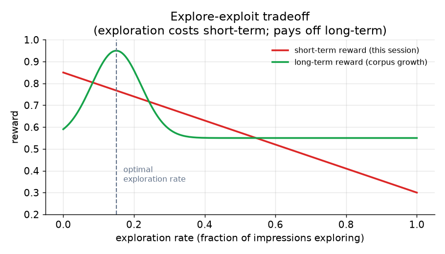
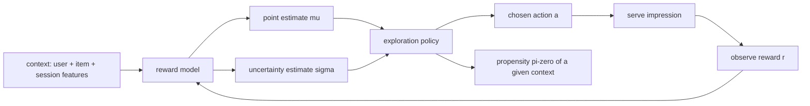

# 2. Framing it as an ML task

## The explore-exploit tension

Every recommendation is a decision under uncertainty. The ranker has a
current estimate of how good each item is for this user, but that estimate
is imperfect. Under pure exploitation you always pick the item with the
highest estimated reward. That feels right, but it is wrong in the long run:
you only collect signal about items you already show, so items you rank low
are never re-evaluated. Good items that were once undervalued stay undervalued
forever. The corpus narrows, the feed ossifies, and users notice.

Exploration is the deliberate decision to sometimes pick a less-certain item
instead of the argmax, specifically to collect signal that updates the model.
The payoff is not this session; it is the quality of the model in future
sessions. That is the explore-exploit tradeoff, and it is only worth paying
for under a long-horizon objective where the value of information counts.

*Short-term reward falls as exploration rate rises, because some impressions
go to uncertain items rather than the best-known one. Long-term reward peaks
at a moderate exploration rate: enough exploration to keep the model fresh,
not so much that users suffer. The optimal rate is surface-specific.*

## The bandit framing

The formal vocabulary: we have an **agent** (the recommendation system), a
set of **arms** (items to recommend), and a **reward** (click, completion,
retention) observed after each decision. At each timestep, the agent picks
an arm, observes a reward, and updates its beliefs. The goal is to maximize
cumulative reward over time, not just the next reward.

This framing maps directly onto the recommendation problem:

| Bandit concept | Recommendation equivalent |
|---|---|
| Agent | ranking or selection system |
| Arm | item, content variant, or ranking strategy |
| Context | user features, session features, request time |
| Reward | click, completion, purchase, retention |
| Exploration | showing an uncertain item to learn its true value |
| Exploitation | showing the item estimated to have highest reward |

The reason cold start belongs in this framing is that a new item or a new user
is simply an arm (or a context region) for which the agent has very high
uncertainty. The same policies that handle uncertainty in a warm catalog also
handle cold entities: give them an exploration bonus based on how little we
know about them.

## Inputs and outputs

**Input:** a feature vector for the current context (user features, item
features, session context, time, device) and, for contextual bandits, this
vector is the full context that parameterizes the reward estimate.

**Output:** a ranked action (item or strategy) plus, for stochastic policies,
a propensity (the probability the policy assigned to the chosen action). The
propensity is mandatory; without it, no offline evaluation of a new policy
is possible.

## Choosing the right ML framing

| Reach for | When | Instead of |
|---|---|---|
| Non-contextual bandit (epsilon, UCB, Thompson) | small fixed arm set, reward does not depend on user context | contextual models that add complexity without payoff on tiny arm sets |
| Contextual bandit (LinUCB, neural-linear) | large or shifting catalog, reward varies strongly with user and item features, new items need uncertainty from features not history | per-arm posteriors that cannot extend to never-seen items |
| Supervised ranker plus exploration layer | you already have a strong point-estimate ranker and want to add exploration cheaply | replacing the ranker wholesale |
| Content and metadata tower for cold entities | entities arrive with structured metadata and must be retrievable on day zero | waiting for interaction data to train an ID embedding |
| Pure-exploration bandit (best-arm identification) | the goal is finding broadly-appealing new items, not maximizing cumulative reward during discovery | a regret-minimizing bandit that is the wrong objective for a discovery feed |

The next section builds the data that powers these policies.
