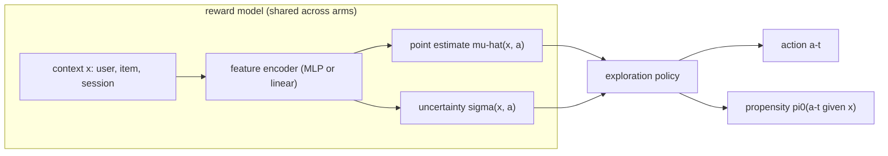
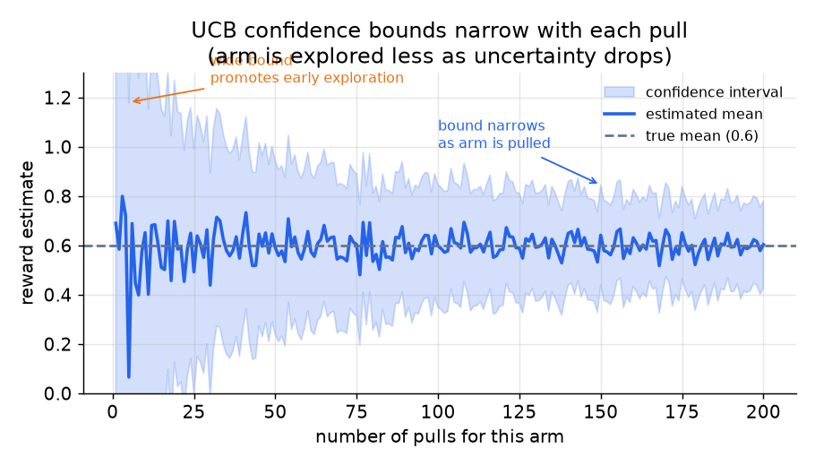
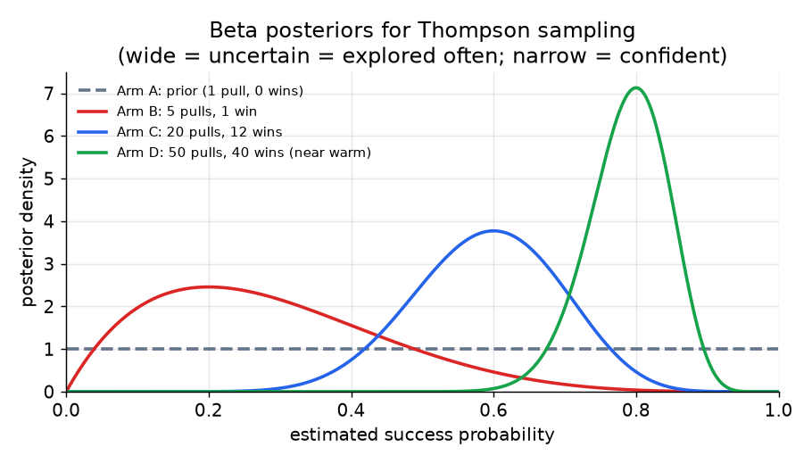
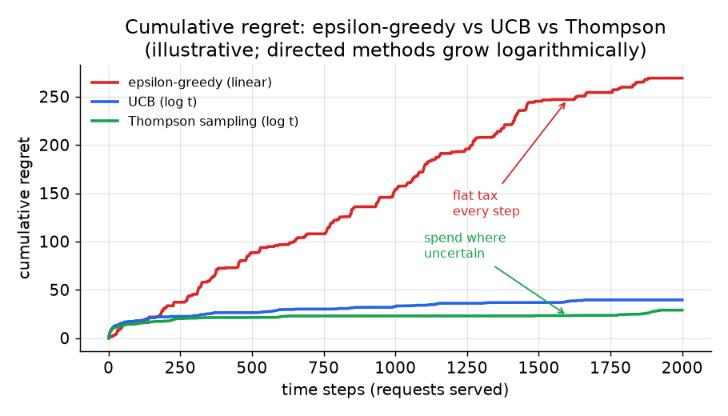
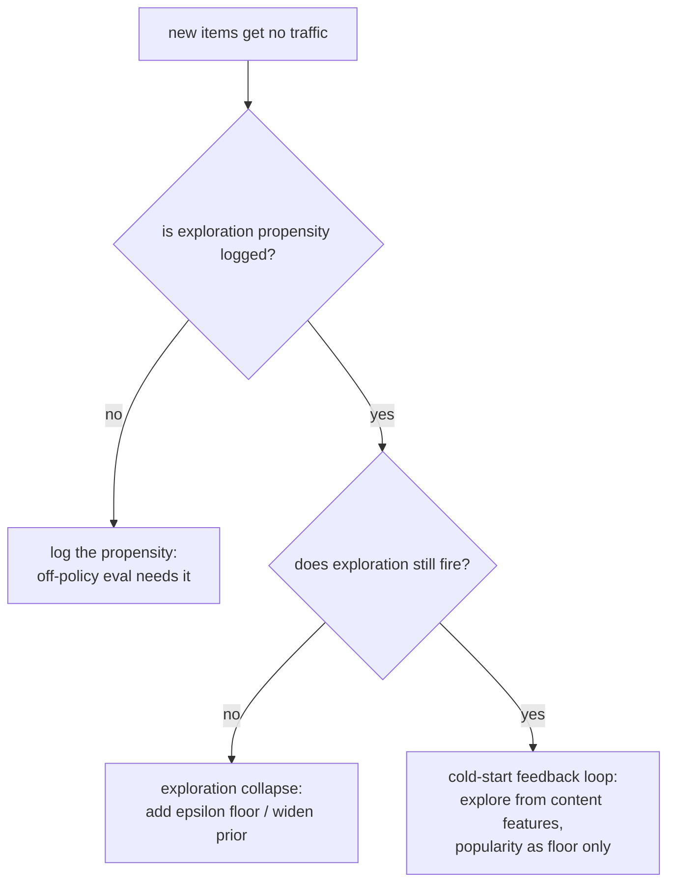

# 4. Model development

## The core architecture: reward model plus exploration layer

A bandit is not a single neural graph; it is a decision policy on top of a
scoring model. The reward model provides a point estimate and (for the better
policies) an uncertainty estimate. The exploration layer reads those two
numbers and decides which action to take.



The reward model is shared across arms: it estimates the reward for any
(context, arm) pair from features, not from per-arm ID lookup. This is what
gives never-seen items an uncertainty estimate from their content features.

## Epsilon-greedy

With probability epsilon, choose a uniformly random action. With probability
1 minus epsilon, choose the argmax of the current reward estimates.

```
if random() < epsilon:
    a = uniform_random_item()
    propensity = epsilon / (number of arms)
else:
    a = argmax reward estimates
    propensity = 1 - epsilon + epsilon / (number of arms)
```

The explore branch has a clean uniform propensity, which is why epsilon-greedy
is the baseline of choice for off-policy evaluation: the propensities are
trivial to compute and log. The weakness is that exploration is uniform. It
spends as many impressions on obviously-bad arms as on promising-but-uncertain
ones. The flat tax is acceptable on a high-traffic surface where the explore
rate must stay very small; it is wasteful everywhere else.

## UCB (upper confidence bound)

Choose the action with the highest optimistic score: the estimated reward
plus a bonus that grows with uncertainty. For the non-contextual case with
arm-pull counts, the score for arm $a$ at time $t$ is:

$$\text{score}(a, t) = \hat{\mu}_a + \alpha \sqrt{ \dfrac{\ln N_t}{n_a} }$$

where $\hat{\mu}_a$ is the estimated mean reward for arm $a$, $N_t$ is the
total number of pulls so far, $n_a$ is the number of pulls of arm $a$, and
$\alpha$ scales the exploration bonus.

```python
import numpy as np
def ucb_select(mu, n, alpha=1.0):
    mu, n = np.asarray(mu, float), np.asarray(n, float)  # per-arm mean reward and pull count
    N = n.sum()                                           # total pulls across all arms
    bonus = alpha * np.sqrt(np.log(N) / n)               # wide when n_a is small, shrinks as arm is pulled
    return int(np.argmax(mu + bonus))                    # optimistic score: mean plus uncertainty
# ucb_select([0.5, 0.6, 0.55], [100, 10, 50]) -> 1  (arm 1 wins on its exploration bonus)
```

For the contextual case (LinUCB), the reward is linear in a feature vector
$x_a$ and the uncertainty bonus is a closed form over the feature-covariance
matrix $A$:

$$a_t = \text{arg max}_a \left( \hat{\theta}^\top x_a + \alpha \sqrt{ x_a^\top A^{-1} x_a } \right)$$

The bonus shrinks as an arm is pulled more, because $n_a$ grows (or
equivalently, $A$ accumulates more feature vectors and becomes better
conditioned). This makes exploration directed: you explore where you are
uncertain, not everywhere.



*For a single arm, the confidence interval around the estimated mean shrinks
with each pull. When the bound is wide (few pulls), the optimistic score is
high and the arm gets explored. When the bound is narrow (many pulls), the
arm competes on its mean alone.*

The downside of vanilla UCB: the argmax is deterministic. There is no
randomness in the action, so the propensity for the chosen arm is 1 and
off-policy estimators that rely on stochastic propensities cannot be applied.
Teams that use UCB at scale often add a small epsilon perturbation to recover
a stochastic propensity.

## Thompson sampling

Maintain a posterior distribution (the updated belief about an arm's reward
after combining the prior with the data observed so far) over each arm's
reward. At each timestep, draw one sample from each arm's posterior and choose
the arm whose sample is highest. For a binary reward (click or no click), the natural posterior
is Beta:

$$\tilde{\mu}_a \sim \text{Beta}\!\left( \alpha_0 + s_a,\ \beta_0 + f_a \right), \qquad a_t = \text{arg max}_a \, \tilde{\mu}_a$$

where $s_a$ is the number of successes (clicks) and $f_a$ is the number of
failures (no-clicks) observed for arm $a$, and $\alpha_0, \beta_0$ are the
prior hyperparameters (often both 1, giving a flat prior).



*Arms with few observations have wide posteriors (high uncertainty) and win
random draws often, so they get explored frequently. As observations
accumulate the posterior narrows around the true mean and the arm wins draws
only when it is genuinely good. The algorithm naturally graduates from
exploring to exploiting as data accrues.*

The sampling step introduces randomness, so the propensity is the probability
that the draw of arm $a$ would be the highest sample, which is
tractable for Beta posteriors and approximable for neural-linear heads.
Thompson sampling is the default that many production teams reach for: it is
empirically robust, gives clean stochastic propensities, and its exploration
is as directed as UCB while being more forgiving to tune.

**Why sampling from the posterior is principled: probability matching.** The
mechanism is not a heuristic. Over many draws, Thompson sampling selects arm
$a$ with exactly the posterior probability that $a$ is the optimal arm,
$P(a = \arg\max_{a'} \mu_{a'} \mid \text{data})$. An arm with a wide posterior
that overlaps the current leader wins draws often precisely because there is a
real, quantified probability it is best; as its posterior concentrates, that
probability collapses toward zero or one and the sampling rate follows. This is
also why the propensity is well defined and nonzero for every arm with nonzero
posterior mass: the action distribution is the posterior-optimality
distribution, which is exactly the object off-policy estimators need.

**Why the Beta update is a single counter increment: conjugacy.** For a
Bernoulli reward, the Beta prior is the conjugate prior, so the posterior after
observing data is again Beta with no integral to compute: a click adds one to
$\alpha$ and a no-click adds one to $\beta$. The posterior $\text{Beta}(\alpha_0
+ s_a, \beta_0 + f_a)$ is therefore maintained with two integers per arm and
updated in constant time per event. This is what makes non-contextual Thompson
sampling almost free to run at scale, and it is the reason the neural-linear
head (a Gaussian-conjugate linear layer) is chosen for the contextual case: it
preserves a closed-form conjugate posterior instead of forcing a sampler.

**Provenance of the empirical case.** Thompson sampling sat mostly unused for
decades; the empirical evaluation that established it as a competitive
production default, matching or beating UCB on display-advertising and news
data while being simpler to tune, is Chapelle and Li (2011).

## Contextual bandits: LinUCB and neural-linear

The above policies assume a fixed arm set and per-arm parameters that do not
generalize across arms. For millions of items, per-arm posteriors do not
scale, and a never-seen item has no posterior to draw from.

The fix: **share a parametric reward model across all arms**. In LinUCB, the
reward is assumed linear in a feature vector $x$ that combines user and item
features. The model has a single weight vector $\theta$; the uncertainty bonus
comes from the feature-covariance matrix. A new item that has never been shown
still gets an uncertainty estimate from its feature vector, because the model
generalizes from similar items it has seen before.

Neural-linear bandits extend this: a deep encoder maps raw features to a
learned representation, and a linear uncertainty head sits on top. The
encoder gives expressiveness; the linear head gives cheap closed-form
uncertainty. This is the Google neural-linear design for short-form video at
billions of users.

## When to use which

**Exploration policy:**

| Reach for | When | Skip when |
|---|---|---|
| Epsilon-greedy | fast baseline, clean uniform propensity for off-policy eval, high-traffic surface where explore rate must stay tiny | you can estimate per-arm uncertainty; the flat tax wastes impressions on obviously-bad arms |
| UCB | directed exploration, deterministic choice preferred by infra, you want the optimism bonus as a closed form | you need stochastic propensities for replay-based off-policy eval; deterministic argmax logs no randomness |
| Thompson sampling | directed and sampled; posterior draws give clean stochastic propensities; robust default | per-arm posteriors at millions of raw arms; use neural-linear head instead |
| Contextual bandit (LinUCB, neural-linear) | large or shifting catalog; never-seen item must get uncertainty from features, not history | linear assumption underfits reward; then neural-linear is the upgrade path |

**Cold-start representation:**

| Reach for | When | Skip when |
|---|---|---|
| Content and metadata tower | day-zero retrievability for a cold entity with rich structured metadata | metadata is sparse or noisy; content tower will be weak |
| Hybrid ID-plus-content | one model must span cold and warm entities; ID embedding added to content vector, near-zero for cold items | entities are almost always warm; extra complexity not worth it |
| Geo-hierarchy or segment prior | new user or new region with usable request context | context is too coarse; blends toward specific level slowly |
| Popularity fallback | zero-signal first request needs a safe floor | discovery is the goal; popular-gets-more-popular is the problem you are trying to escape |

**Provenance.** Thompson sampling dates to Thompson (1933); the UCB optimism
bonus is from Auer et al. (2002); and the contextual-bandit LinUCB policy comes
from Yahoo (2010). The cold-start representation towers are two-tower models in
the lineage of the DSSM two-tower encoder (Microsoft, 2013).



*Epsilon-greedy accumulates linear regret: each step pays the same flat
exploration tax. UCB and Thompson sampling accumulate logarithmic regret: the
exploration bonus shrinks as arms are understood, so the total cost of
learning grows much more slowly over time.*

**Tools.** Epsilon-greedy, UCB (LinUCB), and other contextual-bandit policies ship in Vowpal Wabbit and in River for online learning; Thompson sampling over Beta posteriors is a few lines on NumPy or SciPy. Neural-linear and other deep contextual bandits are built in PyTorch (Meta), a learned encoder feeding a linear uncertainty head. The cold-start representation towers (content-and-metadata, hybrid ID-plus-content) are two-tower models in TensorFlow Recommenders (Google) or TorchRec (Meta), and a popularity fallback is a simple precomputed ranking served from a cache.

**Worked example.** A marketplace surfacing freshly uploaded listings begins with epsilon-greedy because its uniform explore branch gives clean propensities for off-policy eval, but the flat tax wastes impressions on obviously-bad listings, so it moves to Thompson sampling for directed, sampled exploration that still logs clean stochastic propensities. Once the catalog reaches millions of items where per-arm posteriors do not scale, it switches to a neural-linear contextual bandit so a never-seen listing gets an uncertainty estimate from its features rather than its (nonexistent) history. For the representation, it runs a content-and-metadata tower for day-zero retrievability and blends it as a hybrid ID-plus-content vector so one model spans cold and warm listings. On a zero-signal first request it falls back to a popularity floor, accepting that this is a safe default rather than a discovery mechanism.

## Implementation and training pitfalls

A bandit fails less on the reward model than on the exploration plumbing: the
propensities you log, whether exploration keeps firing, and whether the offline
estimates you trust are actually unbiased.

| Problem | Symptom | Fix |
|---|---|---|
| Missing or wrong propensity logging | off-policy evaluation is impossible or biased, so policies cannot be compared offline | log the action propensity at decision time for every impression |
| Deterministic UCB argmax | the chosen propensity is 1, so replay-based off-policy estimators break | add a small epsilon perturbation to recover a stochastic propensity |
| Exploration collapse | the policy stops exploring, uncertain arms are never shown, and regret plateaus | keep an exploration floor (epsilon floor or prior variance) and check that uncertainty is not underestimated |
| Cold-start feedback loop | popular gets more popular, fresh items starve, and the catalog homogenizes | drive exploration from content-feature uncertainty and keep popularity as a floor, not a driver |
| Reward attribution delay | delayed conversions are logged as failures, so posteriors turn pessimistic | apply a wait-window before writing the reward, or model delayed feedback explicitly |
| Uncertainty miscalibration (neural-linear) | the bonus is too small or too large, causing under- or over-exploration | recompute the covariance or posterior on a schedule and calibrate the bonus scale |
| Per-arm posteriors at scale | millions of raw arms and no posterior for never-seen items | share a parametric reward model (LinUCB or neural-linear) so features supply the uncertainty |
| High-variance off-policy estimate | the importance-weighted estimate is dominated by a few large weights, so offline decisions are noisy | clip or self-normalize the importance weights (capped IPS, SNIPS), or use a doubly-robust estimator |



The through-line: in a bandit the exploration accounting is the model, so a wrong
propensity or a collapsed explore rate corrupts every downstream decision.
