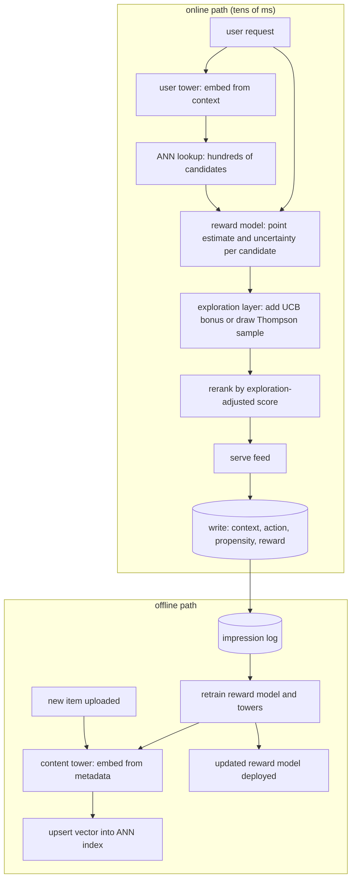

# 6. Serving and scaling

## The serving architecture

Exploration and cold-start handling must fit inside the existing serving
latency budget, which for a recommendation feed is typically tens of
milliseconds. The exploration layer is not a second model call; it is a
cheap computation on top of scores the reward model already produces.

The key constraint: the ANN index must accept online inserts. A new item
gets a vector from the content tower the moment it is uploaded and is
upserted into the index immediately. Batch-only indexing with multi-hour
rebuild cycles kills item cold start; the item is invisible until the batch
completes.

## Exploration budget and bounding

Exploration on a high-traffic surface is a tunable tax. Key decisions:

- **Exploration rate.** For epsilon-greedy, the fraction of impressions that
  go to a random arm. For UCB/Thompson, the alpha coefficient that scales the
  uncertainty bonus. Both are surface-specific: a notification surface gets
  near-zero exploration; a discovery feed gets more.
- **Quality floor.** The worst exploratory impression must still be above a
  minimum quality threshold. Screen cold items through the content tower
  (coarse relevance) before they are eligible for the explore arm, so
  exploration stays within an acceptable region of the item space.
- **Per-item impression budget.** A new item gets a guaranteed small number
  of impressions (its warm-up budget) to well-matched users, determined by its
  content-tower neighborhood. After that budget is spent, it competes on its
  earned reward estimates.
- **Uncertainty decay.** The UCB bonus or the Thompson posterior width
  naturally shrinks as interactions accumulate. A new item automatically
  graduates from highly-explored to mostly-exploited as data accrues. No
  manual lifecycle management needed.

## Feedback loops and freshness

The ossification loop is the enemy: greedy serving only labels items it
already promotes, so demoted items never earn fresh signal, and the feed
narrows. Exploration breaks this, but only if the log-to-retrain cadence
is fast enough that new signal actually updates the reward estimates.

- **Near-real-time feature updates** matter more here than model size. A
  new item's impression count and early click rate should flow into its
  uncertainty estimate within minutes, not hours.
- **Cold item visibility is constrained by ANN index freshness.** If the
  index is rebuilt every four hours, a new item is dark for up to four
  hours regardless of the reward model. Upsert-capable indexes (HNSW with
  online add, or IVF with a small fresh-items buffer) are the fix.
- **Propensity fidelity across retrains.** When the reward model is
  retrained and the exploration policy changes, logged propensities from the
  old policy must still match what the old policy actually computed. Tie the
  propensity log to the policy version, not to a reconstructed value from
  the current model.

## Bottlenecks

| Bottleneck | First sign | Fix | Tradeoff |
|---|---|---|---|
| New items dark for hours | low new-item impression share, cold start complaints | online-upsert ANN index, separate fresh-items retrieval bucket | more indexing infra, more index complexity |
| Uncertainty too slow to compute | ranking latency spikes when exploration is on | neural-linear head for closed-form confidence bonus; avoid full Bayesian posterior per request | expressiveness of uncertainty estimate |
| Propensity mismatch | OPE estimates look implausibly good or bad; policy seems better offline than online | log the propensity at serve time, version it with the policy, validate by replaying random traffic | storage overhead for propensity field |
| Ossification despite exploration | served-item diversity metric declining, tail items getting zero impressions | raise exploration rate, add a dedicated diversity retrieval bucket, check quality floor is not too restrictive | short-term engagement dip |
| Exploration on wrong surface | trust, safety, or checkout metrics degrade | disable or near-disable exploration (epsilon near zero, no UCB bonus) on sensitive surfaces; use a hard quality floor | discovery opportunity on that surface lost |
| Reward proxy gaming | session metrics improve but retention or satisfaction falls | hold out long-horizon cohorts; add a retention-correlated proxy or use Impatient Bandits for delayed reward modeling | complexity of reward pipeline |
