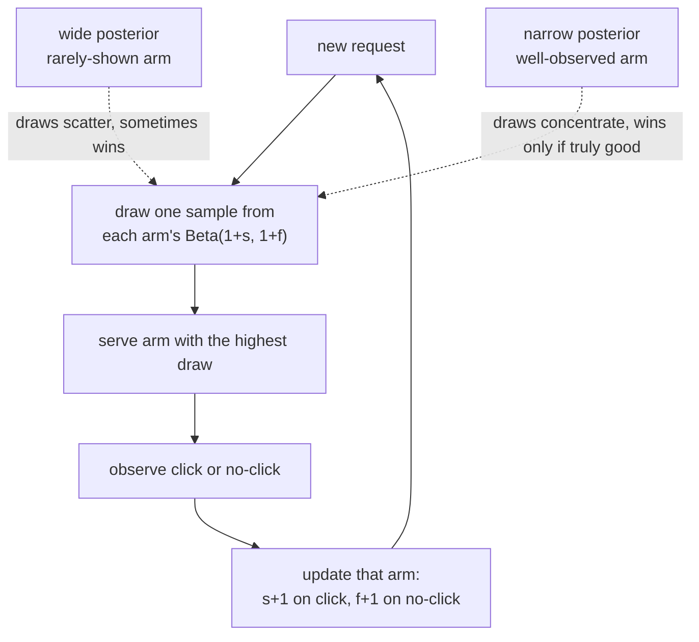

# 8. Interview Q&A

The questions an interviewer actually asks about cold start and exploration,
grouped by how they are used. The commonly-missed ones are where interviews
are won or lost.

## Commonly asked

**Q: What is the cold-start problem and what is the standard fix?**

A: A model that represents items (or users) by learned ID embeddings has
nothing to say about an entity that has never been seen before. The embedding
is untrained, so retrieval and ranking treat the entity as noise. The fix is
to represent the entity by its content and metadata instead of its ID, using
a content tower: the item vector is a function of category, text, and visual
features. A new item gets a vector the moment it is uploaded and inherits a
location in embedding space from similar warm items. This makes it retrievable
and rankable on day zero without waiting for interactions.

**Q: Why does pure exploitation cause the feed to ossify?**

A: A greedy policy only collects labels for what it already ranks highly.
Items it ranks low get zero fresh impressions, so their reward estimates
are frozen at whatever they were when the system last showed them. If tastes
shift or an item improves, the model has no way to learn this. The corpus
narrows to the items the model was already confident about, which may be
stale or unrepresentative. The only escape is to deliberately show uncertain
items, so the label distribution stays broad enough that the model can
correct itself.

**Q: What is epsilon-greedy and when would you use it?**

A: With probability epsilon, serve a uniformly random item. With probability
1 minus epsilon, serve the argmax. The explore branch has a clean, trivially
computable propensity, making it the baseline of choice when you need a
stochastic policy with known propensities for off-policy evaluation. It is
the right choice on a high-traffic surface where the explore rate must stay
very small. The weakness is that exploration is blind: it spends as many
impressions on obviously-bad items as on promising-but-uncertain ones.

**Q: How do you evaluate a new bandit policy without a live A/B?**

A: Off-policy evaluation. If the log contains uniformly-random exploration
traffic, use replay: replay the stream against the new policy, score only
events where the new policy's choice matches the logged action, and compute
the win rate. The resulting estimate is unbiased. If the log contains known
propensities from any stochastic policy (not necessarily uniform), use
inverse-propensity scoring (IPS) or doubly-robust (DR). All three require
that propensities were logged at serve time and match the policy that
actually ran. A deterministic argmax with no logged randomness breaks all
three.

**Q: How do you handle cold start for a brand-new user?**

A: The user-side fix is symmetric to the item-side fix: use context as
the metadata. On a brand-new user's first request, the user tower keys off
whatever is available: device, locale, time of day, acquisition channel,
and any onboarding preferences they declared. That places the user in a
plausible region of the embedding space on the very first request. As
interactions arrive, the user's specific signal blends in and dominates.
The DoorDash cuisine-filter design is a clean example: new users and new
districts start with geo-hierarchy priors (district to city to region) and
personalize as data accumulates.

## Tricky (the follow-ups that separate candidates)

**Q: Exploration lowers short-term engagement. How do you justify it?**

A: You frame it as an investment with a long-horizon payoff. Exploration
costs a small number of clicks now. In return it: (1) discovers good content
that the greedy policy would never promote, growing the effective catalog;
(2) keeps reward estimates fresh, so the model can correct itself when tastes
shift; (3) breaks the ossification loop, preventing the corpus from collapsing
onto a shrinking set. The Google long-term-value-of-exploration work makes
this explicit: measuring only session-level engagement makes exploration look
neutral or negative. Measuring corpus growth and long-horizon retention shows
the payoff. You should name this explicitly and propose measuring both a
short-term engagement metric and a long-horizon retention or diversity metric,
with the understanding that a small short-term dip is acceptable if the
long-horizon metric rises.
**Why:** session metrics structurally cannot see the payoff because of where it
lands. The value of exploring an item accrues to future sessions and to other
users (once an uncertain item proves good, everyone's later feeds improve), so
impression-level attribution assigns the cost to the exploring session and the
benefit to nobody. Only corpus-level and cohort-level metrics aggregate over
the units where the benefit actually shows up.

**Q: How would you make a bandit work at a catalog of millions of items?**

A: You cannot enumerate millions of items as arms with per-arm posteriors;
the memory and update cost is infeasible. Three moves:
First, a two-stage funnel: retrieval (ANN over content tower vectors) cuts
millions to hundreds, and the bandit only operates over the candidate set,
never the whole catalog.
Second, a parametric, feature-shared reward model: the reward is a function
of features, not an ID lookup. A never-seen item gets an uncertainty estimate
from its features by generalization from similar items. This is how LinUCB
and neural-linear bandits scale.
Third, make the arms ranking strategies instead of raw items (the Instacart
approach): the bandit picks among a small set of ranking objectives or formula
variants, not among millions of individual products.
**Why** the feature-shared model gives a never-seen item real uncertainty: in
LinUCB the bonus is $\sqrt{x^\top A^{-1} x}$, where $A$ accumulates the feature
vectors of everything shown so far. The bonus therefore measures how far this
item's features lie from the directions the data has already covered, not how
often this exact item was shown. A new item whose features sit in well-explored
territory correctly gets a small bonus; a new item with unusual features gets a
large one.

**Q: Why does the reward proxy matter, and how do you handle a delayed reward?**

A: Optimizing an immediate proxy (click) that does not predict long-term
value produces clickbait: the model learns to generate curiosity gaps or
misleading thumbnails, which drives the immediate signal but destroys
long-term retention. The resolution: choose a proxy that predicts long-term
value (completion rate, saves, or a learned proxy trained to predict
retention), and model the delay if needed. The Spotify Impatient Bandits
design is the reference: a Bayesian filter fuses partial short-term
observations into a belief about the eventual delayed reward, so the bandit
can act immediately without waiting weeks for the true signal to arrive.
You still need occasional full long-term labels to anchor the filter.
**Why** clickbait emerges mechanically rather than by anyone's intent: the
policy climbs whatever gradient the reward defines, and a click is decided at
the moment of maximum curiosity, before the content has to deliver anything.
Items that promise more than they deliver therefore sit at the exact optimum of
the click objective, so an optimizer that is working correctly will find them;
the fix has to change the objective, not the optimizer.

**Q: When would you pick Thompson sampling over UCB?**

A: For most production systems, Thompson sampling is the better default.
It gives naturally stochastic actions, so logged propensities are clean and
off-policy evaluation is tractable. It is also more forgiving to tune:
UCB requires choosing the alpha coefficient, and the right value depends
on the reward scale and action space. Thompson sampling adapts: if the
posterior is wide (uncertain arm), it wins draws often; if narrow (confident
arm), it wins draws only when genuinely good. UCB is preferable when infra
requires a deterministic choice (some caches and logging systems expect a
fixed action per context hash), or when the uncertainty bonus needs to be
a specific closed form for latency reasons.
**Why** the alpha tuning is genuinely hard: the UCB bonus
$\sqrt{\ln N / n_a}$ is expressed in count units while the mean is in reward
units, so alpha is the exchange rate between the two, and the right rate
depends on the reward's scale and variance. Set it too low and the bonus is
drowned by mean differences (under-exploration); too high and it swamps them
(over-exploration). Thompson sampling sidesteps this because the posterior
width is already in reward units, so no exchange rate is needed.

**Q: Concretely, how does Thompson sampling turn a stream of clicks into a
per-request decision?**

A: For a Bernoulli reward (click or no click) each arm keeps a Beta posterior:
start at Beta(1, 1) (uniform), and after observing successes $s$ and failures $f$
the posterior is Beta($1 + s$, $1 + f$). On each request you draw one sample from
every candidate arm's Beta and serve the arm with the highest draw. That is the
whole mechanism, and it is why the exploration is self-annealing: a rarely-shown
arm has a wide Beta, so its draws scatter and it sometimes wins (exploration); a
well-observed arm has a narrow Beta concentrated near its true rate, so it wins
only when genuinely good (exploitation). The draw itself is the propensity source,
which is why the logged action is stochastic and off-policy evaluation stays
tractable. Contextual variants replace the per-arm Beta with a posterior over a
shared feature-weight vector so that a never-seen arm inherits uncertainty from
its features.

*Thompson sampling self-anneals: a rarely-shown arm's wide Beta scatters its draws
and occasionally wins (exploration), while a well-observed arm's narrow Beta wins
only when its rate is genuinely high (exploitation), with no explicit schedule.*

**Q: A pure content tower and a hybrid ID-plus-content model look similar; when
does the difference actually matter?**

A: On day zero they behave identically: the hybrid's ID embedding is untrained
(near zero), so both score the item purely from its content and metadata. The
difference is what happens as interactions accumulate. The hybrid's ID
embedding trains on the item's own engagement and is added to the content
vector, so the item's observed performance can override its content prior;
the pure content tower is capped forever at whatever its metadata implies, so
two items with identical metadata but very different realized quality score
identically for life. The difference matters when items are long-lived, when
metadata is thin or gameable (an item can describe itself better than it
performs), or when realized quality diverges widely within a metadata bucket.
It does not matter for short-lived inventory (stories, flash listings) that
expires before the ID embedding ever trains, which is why pure content towers
survive there.

## Commonly answered wrong

**Q: Should exploration be baked into the ranking model's objective function?**

A: No. The ranking model's job is to produce an accurate point estimate of
the reward. Exploration is a separate decision layer that reads that estimate
and an uncertainty estimate and decides whether to exploit or explore. Baking
exploration into the ranking loss conflates two concerns: the ranker gets
worse at estimating reward (because it is simultaneously trying to encourage
exploration), and the exploration policy loses the ability to be tuned or
disabled independently. Keep them separate: the ranker estimates, the
exploration layer decides.
**Why:** the deeper mechanism is that exploration needs an honest uncertainty
signal, and a model trained on a loss that rewards optimism no longer minimizes
prediction error, so both the point estimate and any uncertainty derived from
it are corrupted at once. The two layers also live on different clocks:
estimates update with every batch of labels while the explore rate is a product
decision tuned over weeks, and coupling them in one loss means retraining the
model to change either.

**Q: Can you just boost new items manually to solve cold start?**

A: Manual boosts are a blunt instrument with serious problems. They require
human curation to determine which items deserve a boost and by how much.
They do not generalize: every new item needs a separate decision. They
introduce a quality floor problem: a poorly-produced new item that gets
boosted can harm the user experience. And they do not solve the model problem
underneath: after the boost expires, the item has whatever signal it earned
during a potentially non-representative promo period. The right answer is
to build a content tower that places new items in embedding space automatically
from metadata, so they earn impressions proportional to their content quality
from day zero, with no manual intervention.

**Q: Is it enough to log only the chosen action for off-policy evaluation?**

A: No. You must log the propensity (the probability the policy assigned to
the chosen action). Without the propensity, importance-sampling estimators
cannot reweight the log to simulate a different policy. If you use a
deterministic argmax (propensity always 1), there is no randomness to exploit
and every off-policy estimator degenerates. A common mistake is to add
exploration (epsilon-greedy or Thompson) but forget to log the propensity,
leaving the team able to explore but unable to evaluate the exploration policy
offline. Log the propensity at serve time, version it with the policy model,
and test it by replaying known-propensity traffic and verifying the estimator
recovers the expected outcome.
**Why** the propensity is load-bearing: IPS multiplies each logged reward by
the ratio of the new policy's probability to the logged policy's probability
for that action, which is what mathematically transforms an average over the
logged action distribution into an unbiased average over the new policy's. The
logged propensity is the denominator of that ratio; without it the reweighting
is undefined, and if it was effectively 1 (deterministic policy) the ratio is
zero for every action the new policy prefers, so the estimate carries no
information about exactly the changes you care about.

**Q: Isn't exploration just A/B testing with extra steps?**

A: No; they differ on the goal and the mechanism. A/B testing allocates
traffic to variants statically and waits for significance before acting.
Exploration shifts traffic toward better arms as evidence accumulates, without
waiting. A/B testing finds the best variant in a small, pre-specified set.
Exploration scales to large or dynamic arm sets (millions of items) by
sharing parameters across arms. A/B testing has no notion of uncertainty per
item; exploration uses per-arm uncertainty to direct where to spend impressions.
Stitch Fix's design of bandits-as-a-first-class-experiment-type is the cleanest
synthesis: the experiment platform handles logging and assignment, and a
Thompson-sampling allocator replaces the static traffic split with an adaptive
one, reusing all the existing infrastructure while adding the exploration
benefit.

**Q: Can you vet an exploration policy with a standard supervised holdout and an
AUC number?**

A: No, and the reason is counterfactual. A supervised holdout scores how well a
model predicts the reward of the action that was actually taken; it says nothing
about the reward of the different action a new policy would have chosen, because
that outcome is unobserved. Evaluating a policy requires off-policy estimators
(replay, IPS, doubly-robust) that reweight the log by the ratio of new-policy to
logged propensity, and those need two things a plain holdout never captures:
logged propensities and nonzero probability on the actions the new policy favors
(sufficient support / overlap). If the log is near-deterministic there is no
overlap and every estimator degenerates, which is exactly why you fund a small
uniformly-random explore bucket. AUC on a holdout is a reward-model diagnostic,
not a policy evaluation.
