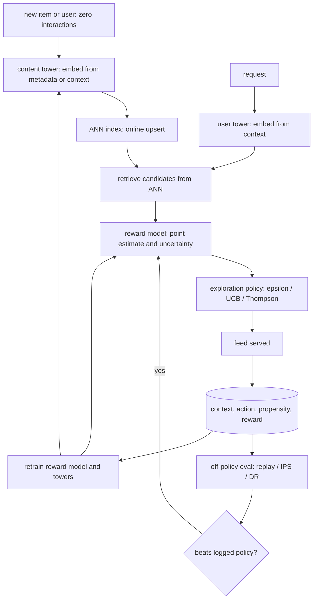

# 9. Summary

## One-page recap

- **Cold start is a representation problem.** A model keyed on ID embeddings
  has nothing to say about a brand-new entity. Fix it with a content and
  metadata tower: the item or user vector comes from features, not from an ID,
  so a cold entity is retrievable on day zero by inheriting a location in
  embedding space from similar warm entities.
- **Pure exploitation ossifies the corpus.** The logging policy and the
  training data are entangled. A greedy policy only labels what it already
  promotes; demoted items freeze at stale estimates; the served corpus
  narrows. The only escape is deliberate uncertainty spend.
- **Exploration is a long-horizon bet, not a tax.** It costs short-term
  reward and pays off in corpus breadth and model freshness. Judge it on
  long-horizon retention and diversity, not session CTR.
- **Exploration policy choice drives propensity strategy.** Epsilon-greedy
  gives clean uniform propensities, suitable for replay-based off-policy
  eval. Thompson sampling gives stochastic propensities suitable for IPS and
  doubly-robust. UCB is deterministic and needs an epsilon perturbation to
  recover a usable propensity. Wrong or missing propensities silently corrupt
  all offline evaluation.
- **Large action spaces require parametric, feature-shared models.** You
  cannot maintain per-arm posteriors over millions of items. Use a content
  tower for retrieval, a contextual reward model shared across arms, and
  (at extreme scale) collapse the arms to ranking strategies rather than
  raw items.
- **Cold items need online-insertable ANN indexes.** Batch rebuild with
  multi-hour cycles leaves new items dark. Upsert-capable indexes (HNSW with
  online add, or an IVF fresh-items buffer) are the infrastructure fix.
- **The four-field log is the single point of failure.** Every downstream
  evaluation depends on (context, action, propensity, reward) being logged
  correctly at serve time, tied to the policy version that ran.

## The system on one page

## Test yourself

1. A brand-new item is uploaded with category, text, and a thumbnail but
   no interactions. Walk through the exact steps by which it becomes
   retrievable within minutes.

2. Your feed is performing well on click-through rate but users report that
   it shows the same items repeatedly. What metric would you look at first,
   and what is the most likely root cause?

3. You want to evaluate a new Thompson-sampling policy using the existing
   impression log. What field do you check first, and what happens to the
   evaluation if it is wrong or missing?

4. The catalog has 10 million items. Explain why you cannot maintain a
   Beta posterior per item, and describe two strategies that make the bandit
   tractable at this scale.

5. An A/B test shows that turning on UCB exploration reduces session CTR
   by 2 percent. The experiment stakeholder wants to kill the feature.
   What do you say, what additional data do you ask for, and over what
   time horizon?

6. Explain the difference between a pure-exploration bandit (best-arm
   identification) and a regret-minimizing bandit. For which kind of
   problem is each the right choice?

## Further reading

- Dense reference with comparison table, full math, and all case studies:
  [../../topics/18-cold-start-and-exploration.md](../../topics/18-cold-start-and-exploration.md)
- Per-company teardowns (Spotify, Yahoo, Stitch Fix, Instacart, Google, Duolingo):
  [../../tools/teardowns/18.md](../../tools/teardowns/18.md)
- Method comparison and decision flowchart:
  [../../tools/comparisons/18.md](../../tools/comparisons/18.md)
