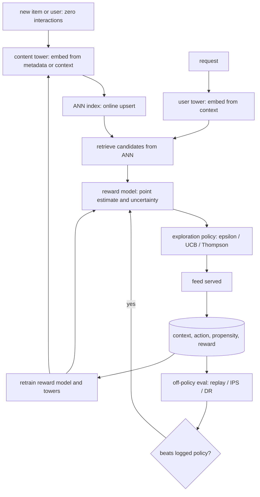

# 9. Summary

## One-page recap

- **Cold start is a representation problem.** A model keyed on ID embeddings
  has nothing to say about a brand-new entity. Fix it with a content and
  metadata tower: the item or user vector comes from features, not from an ID,
  so a cold entity is retrievable on day zero by inheriting a location in
  embedding space from similar warm entities.
- **Pure exploitation ossifies the corpus.** The logging policy and the
  training data are entangled. A greedy policy only labels what it already
  promotes; demoted items freeze at stale estimates; the served corpus
  narrows. The only escape is deliberate uncertainty spend.
- **Exploration is a long-horizon bet, not a tax.** It costs short-term
  reward and pays off in corpus breadth and model freshness. Judge it on
  long-horizon retention and diversity, not session CTR.
- **Exploration policy choice drives propensity strategy.** Epsilon-greedy
  gives clean uniform propensities, suitable for replay-based off-policy
  eval. Thompson sampling gives stochastic propensities suitable for IPS and
  doubly-robust. UCB is deterministic and needs an epsilon perturbation to
  recover a usable propensity. Wrong or missing propensities silently corrupt
  all offline evaluation.
- **Large action spaces require parametric, feature-shared models.** You
  cannot maintain per-arm posteriors over millions of items. Use a content
  tower for retrieval, a contextual reward model shared across arms, and
  (at extreme scale) collapse the arms to ranking strategies rather than
  raw items.
- **Cold items need online-insertable ANN indexes.** Batch rebuild with
  multi-hour cycles leaves new items dark. Upsert-capable indexes (HNSW with
  online add, or an IVF fresh-items buffer) are the infrastructure fix.
- **The four-field log is the single point of failure.** Every downstream
  evaluation depends on (context, action, propensity, reward) being logged
  correctly at serve time, tied to the policy version that ran.

## The system on one page

```mermaid
flowchart TD
  NEW[new item or user: zero interactions] --> CT[content tower: embed from metadata or context]
  CT --> ANN[ANN index: online upsert]
  REQ[request] --> UTOWER[user tower: embed from context]
  UTOWER --> RET[retrieve candidates from ANN]
  ANN --> RET
  RET --> RM[reward model: point estimate and uncertainty]
  RM --> EXP[exploration policy: epsilon / UCB / Thompson]
  EXP --> SERVE[feed served]
  SERVE --> LOG[(context, action, propensity, reward)]
  LOG --> OPE[off-policy eval: replay / IPS / DR]
  LOG --> RETRAIN[retrain reward model and towers]
  OPE --> SHIP{beats logged policy?}
  SHIP -->|yes| RM
  RETRAIN --> CT
  RETRAIN --> RM
```

## Test yourself

Answers are collapsed. Attempt each question before opening one.

1. A brand-new item is uploaded with category, text, and a thumbnail but
   no interactions. Walk through the exact steps by which it becomes
   retrievable within minutes.

   

Answer

   The item never touches a training cycle; it takes the **content tower** path.
   One, the upload fires the content tower, which embeds the item from its
   features rather than its ID: taxonomy and category, creator signal, a title
   or description embedding, a thumbnail embedding from a pretrained vision
   model, structured attributes, and freshness
   ([section 3](03-data-preparation.md)). Two, that vector is **upserted into
   the ANN index immediately**, which is why the index must accept online
   inserts: a batch rebuild on a four-hour cycle leaves the item dark for up to
   four hours no matter how good the reward model is
   ([section 6](06-serving-and-scaling.md)). Three, on the next matching
   request the user tower embeds the context, ANN retrieval pulls hundreds of
   candidates including this one, and the shared parametric reward model scores
   it with a point estimate and an uncertainty derived from its features, not
   from a per-arm history it does not have
   ([section 4](04-model-development.md)). Four, the exploration layer adds a
   UCB bonus or draws a Thompson sample, so the item's high uncertainty earns
   it impressions, and a per-item warm-up budget guarantees a small number of
   impressions to well-matched users from its content-tower neighborhood before
   it has to compete on earned estimates. Every one of those impressions is
   logged with context, action, propensity, and reward. The whole path is
   minutes because it is embed plus upsert with no retrain in the loop; what is
   slower is statistical signal, since 200 warm-up impressions at a true 4% rate
   yield only about 8 clicks, enough to triage dead from viable but not to rank
   4% against 5% ([section 10](10-putting-it-together.md)).

   

2. Your feed is performing well on click-through rate but users report that
   it shows the same items repeatedly. What metric would you look at first,
   and what is the most likely root cause?

   

Answer

   Look at **corpus diversity** first: the number of distinct items served over
   a rolling window. Pair it immediately with **new-item impression share**, the
   fraction of impressions going to recently uploaded items, because together
   they separate "the catalog is narrowing" from "fresh supply is never getting
   in" ([section 5](05-evaluation.md)). The likely root cause is
   **ossification**, the feedback loop from pure exploitation: a greedy ranker
   only collects labels for what it already ranks highly, so demoted items get
   zero fresh impressions and their estimates freeze at whatever they were the
   last time they were shown, and the served corpus narrows onto a shrinking
   confident set ([section 2](02-frame-as-ml-task.md)). Healthy session CTR is
   consistent with this, not evidence against it, since a greedy policy is by
   construction the one that maximizes short-term reward. Two nearby variants
   are worth ruling out from [section 6](06-serving-and-scaling.md): exploration
   collapse, where the epsilon floor or prior variance was tuned away and
   uncertainty is underestimated, and new items going dark because the ANN
   upsert path silently degraded to a batch cadence. The fix in all three cases
   is to restore deliberate uncertainty spend: raise the exploration rate, keep
   an exploration floor, drive exploration from content-feature uncertainty, and
   keep popularity as a floor rather than a driver.

   

3. You want to evaluate a new Thompson-sampling policy using the existing
   impression log. What field do you check first, and what happens to the
   evaluation if it is wrong or missing?

   

Answer

   Check the **propensity**, the probability the serving policy assigned to the
   action it actually took, logged at serve time and versioned with the policy
   that ran ([section 3](03-data-preparation.md)). It is the denominator of the
   importance ratio in every estimator you would reach for: IPS reweights each
   logged reward by the ratio of new-policy to logging-policy probability, and
   SNIPS and doubly-robust build on the same ratio
   ([section 5](05-evaluation.md)). If it is missing, the reweighting is simply
   undefined and no off-policy evaluation is possible. If it is wrong, the
   failure is worse than an error, because it is **silent**: the estimator still
   returns a number, and the usual symptom is offline results that look
   implausibly good and then fail to reproduce online. The degenerate case is a
   deterministic argmax logging propensity 1, which leaves no randomness to
   exploit and collapses every estimator. Two practical checks before you trust
   anything: confirm the logged propensity matches the policy version that
   served the impression rather than a value reconstructed from the current
   model, and replay a slice of known-propensity or uniformly-random traffic to
   verify the estimator recovers the known outcome. You also need nonzero
   logging probability on the actions the new policy favors, which is the
   overlap condition that a near-deterministic log fails.

   

4. The catalog has 10 million items. Explain why you cannot maintain a
   Beta posterior per item, and describe two strategies that make the bandit
   tractable at this scale.

   

Answer

   Per-arm posteriors do not scale on two counts. The memory and per-event
   update cost of 10 million independent posteriors is infeasible to maintain
   and serve, and more fundamentally a never-seen item has **no posterior to
   draw from at all**, so the representation that cold start exists to fix is
   exactly the one per-arm state cannot supply
   ([section 4](04-model-development.md)). Strategy one, a **parametric,
   feature-shared reward model**: LinUCB or a neural-linear head estimates
   reward as a function of features rather than an ID lookup, so a new item
   inherits both a point estimate and an uncertainty by generalization from
   similar items. In LinUCB the bonus is $\sqrt{x^\top A^{-1} x}$, where $A$
   accumulates the feature vectors of everything shown so far, so it measures
   how far this item's features sit from directions the data already covers,
   not how often this exact item was shown ([section 8](08-interview-qa.md)).
   Strategy two, **make the arms ranking strategies instead of raw items**, the
   Instacart approach: the bandit picks among a small set of objective-blend
   ranking strategies, which keeps the arm set in the single digits regardless
   of catalog size ([section 7](07-how-teams-do-it-in-production.md)). Both sit
   behind the same precondition, a **two-stage funnel** where ANN retrieval cuts
   millions to a few hundred candidates so the policy never operates over the
   whole catalog. The rule of thumb from
   [section 10](10-putting-it-together.md): dozens of arms means per-arm Beta
   counters, large or shifting means feature-shared, millions with weak features
   means collapse the arms to ranking strategies.

   

5. An A/B test shows that turning on UCB exploration reduces session CTR
   by 2 percent. The experiment stakeholder wants to kill the feature.
   What do you say, what additional data do you ask for, and over what
   time horizon?

   

Answer

   Say that a small session-CTR dip is the **expected cost, not the result**:
   exploration lowers short-term engagement by construction, so session CTR is
   structurally biased against it and judging it there guarantees you kill it
   every time ([section 5](05-evaluation.md)). The reason is where the payoff
   lands. The value of exploring an item accrues to future sessions and to other
   users, so impression-level attribution charges the cost to the exploring
   session and credits the benefit to nobody
   ([section 8](08-interview-qa.md)). The size is also in the expected range:
   with a 5% budget, exploit-path CTR near 4%, and content-screened exploratory
   impressions near 2%, the blended rate is 3.9%, a 2.5% relative dip
   ([section 10](10-putting-it-together.md)). Ask for four things: **new-item
   impression share**, **corpus diversity**, **7-day and 30-day retention**, and
   a **propensity calibration check** confirming the logged probabilities match
   the policy that ran. On horizon, insist the decision waits for the 30-day
   retention cohort rather than session-level readouts, since a long-horizon
   metric measured over a single session is not the metric. Two things would
   change my mind and argue for killing or retuning rather than defending:
   diversity and new-item share flat despite the spend, which means the budget
   is buying nothing, or the dip landing on a sensitive surface, where the right
   move is epsilon near zero behind a hard quality floor rather than exploration
   at all. Since this is UCB, also verify a small epsilon perturbation is in
   place, because a deterministic argmax logs propensity 1 and leaves you unable
   to evaluate the policy offline at all.

   

6. Explain the difference between a pure-exploration bandit (best-arm
   identification) and a regret-minimizing bandit. For which kind of
   problem is each the right choice?

   

Answer

   They optimize different objectives. A **regret-minimizing** bandit maximizes
   cumulative reward over the run, so every impression it spends on an uncertain
   arm is a cost it wants to recover, and it anneals from exploring to
   exploiting as posteriors narrow; regret is the gap to an oracle, and UCB and
   Thompson sampling achieve logarithmic regret while fixed-epsilon greedy
   approaches linear ([section 5](05-evaluation.md)). A **pure-exploration**
   bandit spends a fixed exploration budget purely to identify the best arms and
   accepts the reward it forgoes along the way, because the deliverable is the
   identification, not the reward earned during it. Pick regret-minimizing when
   the exploring surface is also the earning surface, which is the ordinary feed
   case in this chapter: the main feed absorbs a few percent of exploration
   behind a content-tower quality floor while still serving users
   ([section 4](04-model-development.md)). Pick pure exploration when discovery
   is itself the product goal and can be **decoupled from the exploit feed**.
   Spotify's podcast system is the reference: a pure-exploration
   infinitely-armed bandit draws candidates from a reservoir of new podcasts,
   spends a fixed budget to find the broadly-appealing ones, and hands the
   winners to a separate exploit system that serves them
   ([section 7](07-how-teams-do-it-in-production.md)). The tell in an interview
   is the framing in [section 2](02-frame-as-ml-task.md): if the goal is finding
   broadly-appealing new items rather than maximizing cumulative reward during
   discovery, a regret-minimizing bandit is optimizing the wrong objective, and
   [section 10](10-putting-it-together.md) makes this the deviation rule on the
   exploration-budget row.

   

## Further reading

- The capstone: an opinionated default stack, the complete costed build, and
  the smallest runnable exploration loop:
  [10-putting-it-together.md](10-putting-it-together.md)
- Dense reference with comparison table, full math, and all case studies:
  [../../topics/18-cold-start-and-exploration.md](../../topics/18-cold-start-and-exploration.md)
- Per-company teardowns (Spotify, Yahoo, Stitch Fix, Instacart, Google, Duolingo):
  [../../tools/teardowns/18.md](../../tools/teardowns/18.md)
- Method comparison and decision flowchart:
  [../../tools/comparisons/18.md](../../tools/comparisons/18.md)
